# 博士学位论文

## 多电荷量子比特的相干操控研究

作者姓名： 余 国 栋

学科专业： 光 学

导师姓名： 郭国平 教授 肖 明 教授

完成时间： 二○一六年四月三十日

# University of Science and Technology of China A dissertation for doctor’s degree

# Coherent Manipulation in Multiple Charge Qubits

Author’s Name： Guodong Yu

speciality： Optics

Supervisor： Prof. Guoping Guo

Finished time: April 30th,2016

## 中国科学技术大学学位论文原创性声明

本人声明所呈交的学位论文,是本人在导师指导下进行研究工作所取得的成果。除已特别加以标注和致谢的地方外，论文中不包含任何他人已经发表或撰写过的研究成果。与我一同工作的同志对本研究所做的贡献均已在论文中作了明确的说明。

作者签名：

签字日期：

## 中国科学技术大学学位论文授权使用声明

作为申请学位的条件之一，学位论文著作权拥有者授权中国科学技术大学拥有学位论文的部分使用权，即：学校有权按有关规定向国家有关部门或机构送交论文的复印件和电子版，允许论文被查阅和借阅，可以将学位论文编入有关数据库进行检索，可以采用影印、缩印或扫描等复制手段保存、汇编学位论文。本人提交的电子文档的内容和纸质论文的内容相一致。

保密的学位论文在解密后也遵守此规定。

□公开 □保密（\_\_\_\_年）

作者签名：

导师签名：

签字日期：

签字日期：

## 摘 要

量子比特是实现量子计算的基础单元，相比于超导量子比特、离子阱系统等量子计算体系，固态的量子点有着易于集成和与目前工业化生产相互配套等诸多优点。本论文针对 GaAs/AlGaAs 多电荷量子比特之间的强电容耦合以及受控的量子逻辑门操作展开实验和理论上的研究。本文主要工作为研究多个电荷量子比特之间的相互耦合，通过理论模拟计算其耦合程度与相干操作保真度的关系，并在实验上实现了两个电荷量子比特的逻辑非门操作和三个电荷量子比特的静态Toffoli 逻辑门演示。

本论文具体的主要内容为：

1. 引入量子点体系，通过常相互作用模型对单量子点以及双量子点中的基本概念和现象做了简单介绍。如：电化学势、充电能、库伦阻塞、库伦菱形、蜂窝图等。

2. 介绍半导体量子点在制备中所需要使用的微纳加工设备以及微纳加工流程。如包括紫外光刻、电子束曝光刻蚀、电子束蒸发镀膜等。还有对测量系统的改造和量子点所使用的 GaAs 基片的性质的测定做了介绍。

3. 对单电荷量子比特的性质以及相关的操作做了介绍。如光子辅助隧穿过程、矩形脉冲下的拉莫振荡、LZS 干涉效应、微波驱动的拉比振荡以及 Ramsey操作过程，使我们全面了解对单电荷量子比特的操作方法。

4. 我们通过设计双电荷量子比特的结构样品，研究了其两个电荷量子比特之间的耦合调节，从理论计算和实验测量上完成了受控量子逻辑非门的操作并测量了门操作的保真度。

5. 我们通过对双电荷量子比特的扩展，对三电荷量子比特模型进行了研究，从实验上实现多电荷之间的强耦合，并展示了使用三个电荷量子比特的逻辑门编码。

1. 通过设计双电荷量子比特中一对水平的门电极实现对两个量子比特之间的耦合能量J 的连续可调，并且展示了其特性对于不同的电子数目都具有很好的普适性。

2. 从理论模拟计算了双电荷量子比特之间的耦合能量J 对于量子逻辑非门操

作的保真度的变化以及对量子比特间纠缠度的影响。

3. 从实验上实现了双量子比特在强耦合情况下通过脉冲控制的动态量子逻辑非门的操控。在振幅控制的情况下其门操作的保真度达到了68%并展示了通过相位控制的逻辑非门操作。我们得到的保真度与目前国际上半导体双量子比特上的最新结果处于同一水平。

4. 在三电荷量子比特系统中，实现了量子比特间的强耦合，静态的展示了三电荷量子系统中的受控受控逻辑非门操作，即是Toffoli 门操作，目前国际上还没有在半导体体系中报道过三量子比特逻辑门的结果。我们的实验也为多电荷量子计算提供了借鉴作用。

关键词：量子点；电荷量子比特；耦合能量；逻辑非门；Toffoli 逻辑门。

## ABSTRACT

A qubit is a basic unit for quantum computation. Compared with other quantum computing systems like superconducting qubits or ion trap system, qubits based on quantum dots in solid state materials owns the advantages of easy integration, march for industrial production, and so on. In this thesis, we studied the strong capacitive coupling among multiple qubits and the quantum controlled-logic operations in GaAs/AlGaAs quantum dots, both theoretically and experimentally. We discussed the dependence of the fidelity of controlled -logic gates and the inter-qubit coupling energy by theoretical simulations. Specificically, we demonstrated Controlled-NOT gate in double charge qubits and the static Toffoli gate in trible charge qubits. The followings are the main contents in this thesis: 1. We introduced the constant interaction model to help understand the basic phenomena in single and double quantum dots, like electrical potential, charging energy, coloumb blockade, coloumb diamond, honeycomb diagram, and so on. 2. We described the processing processdures and needed faciities in fabircating nano-scale quantum dots, such as MJB3 lithography, electron beam lithography and electron beam evaporation. We also showed our custom-designed and home-made measurement systems for GaAs wafer characterization. 3. We showed various ways of manipulating a single charge qubit, such as photon assisted tunneling, Larmor oscillation by square pulse, LZS interference, Rabi oscillation and Ramsey fringes by microwave. 4. By designing a novel structure of double charge qubits，we achieved strong and tunable capacitive coupling between two charge qubits. Based on this, we realised CNOT gate operation and measured the operation fidelity. 5. We achieved strong coupling in a triple charge qubit syatem, and demonstrated a three-qubit logical gate. The main innovations of this thesis are as following: 1. By introducing a pair of open slot horizontal gates in double charge qubits, we

achieved strong and tunable capacitive coupling, which showed universal controbility for different electron charge numbers.

2. We theoretically simulated the effects of coupling energy J on two-qubit operations, such as CNOT gate fidelity and degree of entanglement.

3. We experimentally demonstrated CNOT gate operations based on strong coupling betweem two charge qubits. We showed CNOT logic for both amplitude and phase of thestates of qubits. We got a CNOT fidelity of 68%, which is comparable to the best result in this field.

4. In a triple charge qubit system, we showed that strong inter-qubit couplings could be achieved, and demonstrated a static controlled-controlled-not gate (or Toffoli gate). There has been no report on three-qubit gates in semiconductor qubuts yet. Our experiment would also be helpful for developing multi-qubit systems.

Key Words: Quantum dot; Charge qubit; Capacitive coupling energy; CNOT gate; Toffoli gate.

## 目 录

摘 要 ....  
ABSTRACT. Ⅲ  
目 录 .... V  
第 1 章 研究背景和基本概念...  
1.1 研究背景...  
1.1.1 量子计算简介.  
1.1.2 量子计算体系.  
1.2 半导体门型量子点.. 3  
1.2.1 量子点简介.  
1.2.2 门控量子点...  
1.2.3 GaAs 中二维电子气  
1.3 量子点基本概念.. 8  
1.3.1 单量子点理论模型 . 8  
1.3.2 双量子点理论模型. . 11  
1.3.3 量子点相关概念.. ... 17  
1.4 本章小结.... .. 19  
参考文献.... . 20  
第 2 章 样品制备和测量系统. .. 23  
2.1微纳加工仪器及其使用.. .. 23  
2.1.1 紫外光学曝光机. . 23  
2.1.2 扫描电子显微镜和电子束曝光刻蚀... .. 26  
2.1.3 电子束蒸发镀膜机. .. 32  
2.1.4 原子力显微镜.... .. 34  
2.1.5 其他常用仪器和设备. .. 35  
2.2 GaAs 量子点器件加工流程. .. 36  
2.2.1 湿法刻蚀形成所需二维电子气区域.. 37  
2.2.2 制作欧姆接触.... .. 38  
2.2.3 制作表面大电极.. ... 39  
2.2.4 制作纳米级门电极.. ... 39  
2.3 低温测量平台... .. 42  
2.4 掺杂 GaAs 基片的判断... .. 44  
2.5 本章小结...... .. 47  
第 3 章 由双量子点构成的单电荷量子比特.... .. 49  
3.1 双量子点的图像.. .. 49  
3.2 双量子点的光子辅助隧穿.... .... 51  
3.3 双量子点的脉冲拉莫振荡. ... 52  
3.4 双量子点的 LZS 效应..... .... 53  
3.4 双量子点的拉比振荡和 Ramsey 操作.... .... 55  
3.5 本章小结..... .... 57  
参考文献.... ... 58  
第 4 章 双电荷量子比特相干操作... ... 61  
4.1 双电荷量子比特样品的结构设计... .. 61  
4.2 双电荷量子比特耦合强度... .. 65  
4.3 耦合能量与逻辑非门及纠缠度的关系.. .. 68  
4.4 双电荷量子比特逻辑非门操作..... ... 73  
4.5 双电荷量子比特模拟计算.... ... 79  
4.6 本章小结..... ... 81  
参考文献 ......... .. 83  
第 5 章 三电荷量子比特的研究.. .. 85  
5.1 三电荷量子比特结构.... .... 85  
5.2 量子比特 Toffoli 逻辑门.. .... 88  
5.3 Toffoli 逻辑门实验测量..... ... 90  
5.4 本章小结.... .. 93  
参考文献 ......... ... 95  
第 6 章 总结与展望.. ... 97  
6.1 总结与不足. ... 97  
6.2 展望. .... 99  
参考文献.... .... 101  
附录 1 模拟计算程序.. ..... 103  
致 谢 .... ...... 113  
攻读博士学位期间发表的学术论文.. ...... 115

## 第 1 章 研究背景和基本概念

量子力学作为 20 世纪初兴起的一门新兴科学，展示了其有区别与传统物理学的奇特现象。对量子计算系统的研究是在 20 世纪后半期由计算机的飞速发展后才开始引起人们的关注，其理论上强大的运算特性能够解决目前许多经典计算方法几乎无法完成的难题。本章主要对量子计算做了简要的介绍，为我们所研究的半导体门型量子点的研究提供一些基本概念和物理图像，同时为后面的多电荷量子比特的相干操控研究做基础铺垫。

## 1.1 研究背景

## 1.1.1 量子计算简介

伴随着人类文明的发展，人类社会经历了从19世纪初开始的第一次工业革命进入了蒸汽时代，到第二次工业革命步入了电气时代，再后来在 20 世纪四五十年代开始以原子能技术、空间技术、电子计算机技术、生物技术和新能源技术为代表的第三次科技革命时代。而其中的原子能技术、空间技术、电子计算机技术等都依赖于在 20 世纪初才发展起来的以量子力学为代表的量子理论，成为了推进人类科技技术进步的动力。

自从 1946 年第一代电子计算机(ENIAC)诞生开始，人类逐步迈入了信息时代，对于计算机其更高的集成度和更快的计算能力的追求也成为了坚持不懈的奋斗目标。传统的计算机其信息处理能力依赖于其中央处理器(CPU)上的晶体管数量，因此，为了能尽可能的提高其处理速度，在一个处理器芯片上集成尽可能多的晶体管数量成为提高计算性能的一个重要的参考标准。著名的“摩尔定律[1]”指出芯片的集成度遵循每 18 个月就会翻一番，同时单个晶体管的尺度也在不断的减小。目前的工业生产规模已经达到 14nm 尺度而在实验室中已经有 7nm 工艺的尺度。一方面随着晶体管的尺寸越来越小，其表现出的物理特性逐渐超出了经典理论描述的范畴而进入了“量子世界”，而在另一方面，随着小范围集成度的提高，大量晶体管在工作过程中的发热问题也越来越严重的影响着器件的稳定性而成为其发展过程中的一个重大障碍。随着人们对量子理论的研究后发现量子物理世界所展现的许多奇特的现象能很好并高效的解决经典计算中许多问题，于是一个新的概念——量子计算由此产生。

由于量子系统可以比经典系统更加有效率的完成一些特定的计算任务，1985年牛津大学的 D. Deutsch 提出了量子图灵机(Quantum Turing Machine)的概念，量子计算开始具备了数学的基本形式。随后 Deutsch量子算法[2-3]、Shor大数因子分解量子算法[4]、Grover 遍历搜寻量子算法[5]等相继被提出，量子计算取得理论上的重大突破发展，其基于量子相干性的理论框架也构建起来。

简要理解量子计算机与经典计算机的区别，我们可以从最简单的单个比特(bit)的工作机制来说明。对于经典二进制计算机，使用的是二进制编码方式，当输入一个状态值(使用0或者1代表)，经过逻辑门计算就会得到相应输出结果(f(0)或者 f(1))。而对于一个单量子比特(quantum bit, qubit)的量子计算机输入的可以是|0>态和|1>态的叠加，而输出的结果也是F|0>和F|1>的叠加，这是由量子力学线性叠加的代数结构而导致的，这一计算过程可以近似认为相当于一次完成经典计算机两步操作过程。以此类推，对于两比特的系统，对于量子计算机输入可以是四个状态的叠加，输出结果相当于一次完成了四步 $( 2 ^ { 2 } )$ 经典操作。可以证明量子计算机随着集成量子比特数目的增加计算速度是以指数上升，经典计算机却是以线性上升，这也就决定了量子计算系统独具有的高效性。

## 1.1.2 量子计算体系

对于量子计算机的的物理实现，D. P. Divincenzo 在 2000 年的一篇论文[6]中给出了一个包含五个条件的判据：1、可扩展的具有良好特性的量子比特系统。2、能够制备量子比特到某个基准态。3、能够保持足够长的相干时间来完成各种量子逻辑门操作。4、能够实现一套通用量子逻辑门操作。5、能够实现对量子比特的测量。

人们根据这个判据，在不同体系上尝试进行量级计算编码和控制。包括：线性光学系统、微波共振腔系统、超导系统、离子阱系统、核磁共振系统、半导体量子点系统、金刚石中的色心等等不同体系[7-13]。

对于不同的体系，其不同的量子编码方式对其体系相干时间也有很大的差异，系统的操作速度相差也很大。但是对于任何的量子系统，能够精确地控制其演化过程并且读出演化结果与其需要保持长时间的相干性这两个要求存在相互矛盾的关系。因此，努力寻找长的相干时间的系统并能够快速的进行量子操作以得到较大的量子运算次数成为目前量子计算的一个突出的方向。

另外一方面，由 Divincenzo判据可以看到有良好扩展性的量子比特系统也是实现量子计算的一个必要条件。因此，对于多个量子比特的扩展也是量子研究领域的一个热门方向，实现多个量子比特之间的耦合纠缠并且能够对其进行演化控制和结果的测量读取也是一个巨大的挑战。同时如何对多个耦合的电荷量子比特形成所需的量子逻辑门操作，通过不同的量子逻辑门操作组合而成门运算也是实现量子计算机的必要条件。

总之，对于目前研究的各种不同的量子体系都有着其自身优势，也存在较明显困难之处,但是对于量子计算的实现人们已不存在原理性的障碍。如何设计实现大规模的量子计算依然困难重重，这也是对人类智慧和能力的挑战，但是不管量子计算机的研制能否成功，通过对量子计算的研究，一定会对人类未来的生活带来深远的影响。

## 1.2 半导体门型量子点

## 1.2.1 量子点简介

由 D. Loss 和 D. P. Divincenzo 于 1998 年提出的基于半导体门控量子点中的电子自旋作为量子比特的理论方案[12]，其具体内容为将电子束缚在半导体量子点中，通过外加磁场使电子原来简并的能级发生劈裂，利用电子的自旋向上和自旋向下两个状态进行编码作为一组量子比特基，从而构造出一个二能级体系。通过 电 子 自 旋 共 振 (electron spin resonance, ESR)[14] 或 电 学 驱 动 的 自 旋 共 振(electrically driven spin resonance, EDSR)[15-17]的方法得以对量子单比特进行操作，利用海森堡交换相互作用实现两个比特操作。

对于这种基于半导体的理论方案符合 Divincenzo 判据并且与目前的传统半导体芯片有着几乎类此的材料体系和易于集成化的天然优势，一经提出就成为了一个十分具有前景的量子计算机实现方案之一，受到了国际量子信息领域的关注与研究。

随着人们研究的深入，除了上述 D. Loss 提出的基于电子自旋方向的编码方案(single-spin qubit)之外，在半导体量子点上，人们相继提出如使用自旋单态和自旋三态(singlet-triplet qubit)[18-22]、双量子点中电荷状态(charge qubit)[23,24]、三点系统三个自旋态(three-spin states)[25]或者混合比特(hybrid qubit)[26]等一系列编码方案。在向更多比特扩展方面，Wallraff 小组实现了半导体量子点与超导谐振腔的耦合[27-29]，可以利用谐振腔来作为多个量子比特的耦合传输通道和探测通道，充分发挥了半导体量子点这一固态量子比特便于集成的优势。

## 1.2.2 门控量子点

在半导体材料上制作的的量子点结构可以看做为“人造原子”，在其内部既可以填充电子，又可以填充空穴。根据量子点源漏连接方向不差异，我们一般将量子点分为两类：如图1.1所示，(a)图为横向量子点结构，(b)图为纵向量子点结构。纵向量子点结构一般是通过经过特殊方式生长的双势垒的异质结结构晶片上加工制作完成，如图 1.2 所示。横向量子点结构为在通过分子束外延生长(MBE)技术制备出来的拥有高电子密度和高电子迁移率的二维电子气晶片材料上，利用微纳米加工手段在晶片表面制作各种金属栅电极，通过电势场约束使得电子被囚禁在电势场中，再通过调节表面栅电极的电压从而调节被约束的电子数目和电子通过源漏电极的跃迁过程，如图1.3所示。

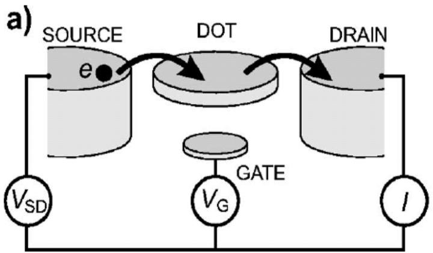

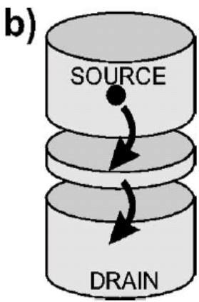  
图 1.1 横向和纵向两种不同量子点的示意图，电子通过源极(Source)流经量子点(圆盘形式)到漏记(Drain),通过门电压 $\mathrm { v _ { G } }$ 可以对量子点中的电子数据进行调节。(a)横向分布的量子点结构示意图。(b)纵向分布量子点示意图。图片引自文献[31]。

图 1.2 (a)图为典型的纵向量子点结构图，量子点位于圆柱体中间，一般圆柱体的直径在几百个纳米左右。量子点由两个绝缘的AlGaAs 隧穿层形成的隧穿势垒束缚形成，并将量子点与导电区域分开。圆柱体的侧面有镀上的金属电极层，通过外接电压可以对量子点进行调节，这样就能够将量子点中的电子逐一排出直至排空。(b)图为该结构量子点对应的能级结构示意图。电子可以从漏电极经过量子点隧穿到源电极，源漏电极偏置电压 $V _ { s d }$ 决定电极间费米能级差。只有当量子点中有能级出现在这两个能级之间(图中虚线所示)才会有电流通过。(c)图为在扫描电子显微镜(SEM)下不同形状的量子点样品照片。

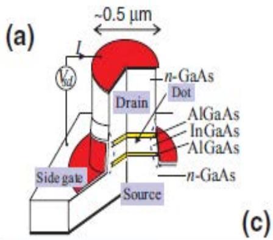

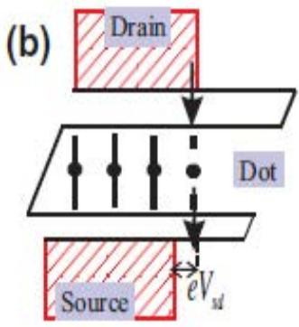

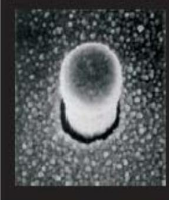

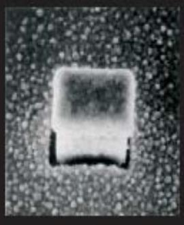

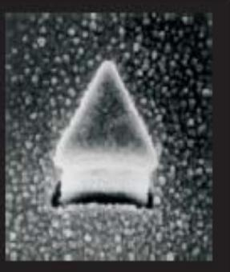  
图 1.2 (a)在 GaAs 上生长的纵向量子点结构示意图，中间两侧黄色区域为 AlGaAs 的隧穿势垒层，量子点被局限在隧穿势垒层之间。(b)量子点能级结构示意图。(c)扫描电子显微镜下不同形状生长的量子点结构图。图片引自文献[30]

图 1.3(a)图为横向量子点结构示意图。目前主要使用的有 GaAs/AlGaAs、$\mathrm { S i } / \mathrm { S i O } _ { 2 }$ 、Si/SiGe 这几种不同材料材料上加工形成的量子点，对于 GaAs 和 Si 最大的不同在于二维电子气(2DEG)的生成方式略有不同。在 GaAs 材料上是通过结构生长在表面下方就有二维电子气，而 Si 则需要通过上表面制作绝缘层通过施加正电压的方式来吸引电子形成二维电子气，但是最终效果都是在材料表面下方几十纳米至百纳米处形成高密度和高迁移率的稳定二维电子气层。通过表面的栅极电压来使得中间被束缚住的电子与外面的电子库隔开，在两边形成较高的势垒。同样，当量子点中的能级出现在源漏两个能级之间是，才会出现隧穿电流，其原理同纵向量子点相同。(b)、(c)图为两种横向量子点结构图，其中(b)图为单个量子点结构图而(c)图为两个串联量子点结构图。

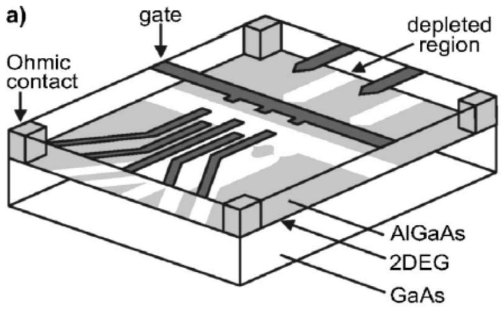

b)  
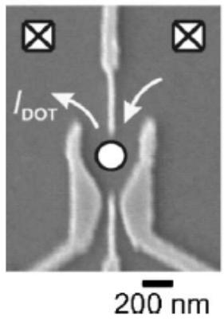

c)  
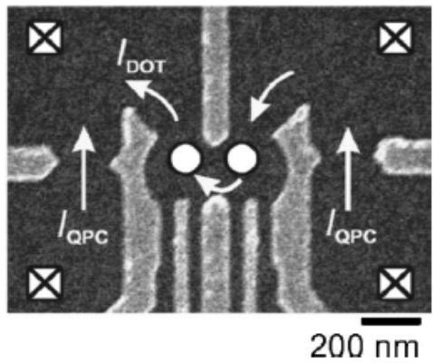  
图 1.3 (a) 横向量子点结构示意图。在有二维电子气的 GaAs 通过表面门电极上施加电压来排挤下面电子，将中间电子约束。(b)-(c) 扫描电子显微镜下单量子点和串联双量子点结构。(c)中两侧为量子点接触结构(QPC)。图片引自文献[31]。

对比横向量子点和纵向量子点可以发现，对于纵向量子点由于绝缘层为制作过程中生长产生，电子的隧穿几率大小由绝缘层厚度决定，而同一个样品的绝缘层在生长完成后就是固定不可以调节的，因此，这就决定了纵向结构在需要大范围调节或者精确控制量子点隧穿几率的物理研究上显得条件过于苛刻而不太适合。横向量子点的势垒有表面电极所加电压的势场形成，因此，调节隧穿几率可以简单的通过表面栅电极的电压来决定。所以，横向量子点以其加工制备和样品测量都明显优于纵向量子点，从而吸引众多科研人员选择横向量子点作为其研究对象。

在本论文中，我们所研究的量子输运性质的量子点都是基于在 GaAs/AlGaAs材料上通过微纳加工而形成的量子点结构。之所以选择 GaAs/AlGaAs 材料是因为该材料长期作为研究量子点科研工作者的首选对象，具有良好的稳定和受外界干扰较小，样品加工工艺相对成熟。我们目前没有使用 $\mathrm { S i } / \mathrm { S i O } _ { 2 }$ 、Si/SiGe 材料是因为，虽然Si 上没有核自旋的影响、退相干时间相对于GaAs 长，但是由于其样品加工难度较大，我们正在努力尝试在 Si 材料上做量子点，目前并没有很好的解决当中遇到的许多问题。

## 1.2.3 GaAs 中二维电子气

二维电子气是指自由电子在垂直维度上受限或者在该维度上能量分立形成一系列有足够间隔能级，因此，电子只能在平面内自由运动。对于我们使用的GaAs/AlGaAs 异质结形成的二维电子气，其异质结通过 MBE 生长最终在 GaAs和 AlGaAs 之间形成一层二维电子气，见图 1.4(a)，图 1.4(b)为其异质结能带图。由于 GaAs 和 AlGaAs 材料的晶格常数几乎相同，在其交界面出能形成良好的匹配，界面可以做到非常平整从而大大减小了界面缺陷对电子的散射作用，同时，也能够在较小的掺杂浓度下得到较高的电子迁移率。

(a)  
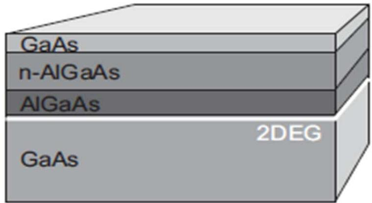

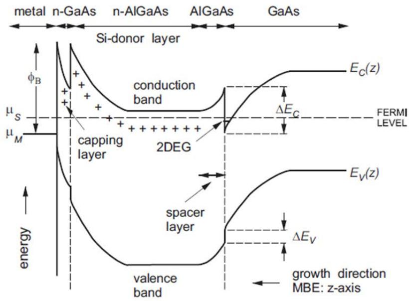

图1.4 砷化镓异质结的结构示意图。(a)通过MBE生长的n型掺杂AlGaAs结构示意图。(b)半导体能带结构示意图，二维电子气在AlGaAs与GaAs的交界面处。图片引自文献[32]

我们在MBE生长过程中，将各种材料从下往上依次生长，通过掺入Si 形成N 型掺杂层，通过控制一部分 Al 代替 Ga，在掺杂为 $\mathrm { { A l } _ { 0 . 3 } \mathrm { { G a } _ { 0 . 7 } \mathrm { { A s } } } }$ 的情况下可以将能隙提高 $\Delta \mathrm { E _ { g } } { = } 1 . 7 9 \mathrm { e V } ,$ 而 GaAs 的带隙为 $\Delta E _ { \mathrm { g } } { = } 1 . 4 2 \mathrm { e V }$ ，因此二者的交界面处会有位错能级 $\Delta \mathrm { E _ { c } }$ 。在随后掺入 Si 后，自由电子便在费米面一下的三角区域形成二维电子气。

## 1.3 量子点基本概念

## 1.3.1 单量子点理论模型

对于量子点系统图像最基础的理论模型为常相互作用模型(ConstantInteraction Model, CI Model)。该理论模型基于两个基本假设：1、量子点中所囚禁的电子之间以及量子点中电子与周围环境中电子的库仑相互作用都可以用恒定的电容 C 来描述。这个电容 C 可以包括量子点与栅点极之间的定容 $\mathrm { C _ { g } , }$ ，量子点分别于源电极和漏电极之间的电容 $\mathrm { C } _ { \mathrm { S } }$ 和 $\mathrm { C _ { D } } ,$ ，其数学表示为： $C = C _ { _ { S } } + C _ { _ { D } } + C _ { _ { g } } \circ 2 \ 、$ 量子点中的分立的能谱可以独立的用量子点内的电子数目来描述。基于这两个假设，对于一个有 N个电子的量子点系统其总能量可以表示如下：

$$
U ( N ) = \frac { \left[ - \mid e \mid ( N - N _ { 0 } ) + C _ { s } V _ { s D } + C _ { g } V _ { g } \right] ^ { 2 } } { 2 C } + \sum _ { n = 1 } ^ { N } E _ { n } ( B )\tag{1-1}
$$

其中， $\Nu _ { 0 }$ 为不加栅极电压时量子点内的电子数目， $\mathrm { C } _ { \mathrm { S } } \mathrm { V } _ { \mathrm { S D } }$ 和 $\mathrm { C _ { g } V _ { g } }$ 非别表示源漏极两端的偏执电压 $\mathrm { V } _ { \mathrm { S D } }$ 和栅极电压 $\mathrm { V _ { g } }$ 分别通过其电容对量子点内电荷填充的变化。最后一项的求和表示量子点内所有占据的电子能级的能量总和，每个单粒子的能级依赖于磁场强度 B。

为了更方便描述电子输运过程，我们使用电化学势(Electrochemical Potential)的概念。量子点的电化学势 $\mu ( N )$ 定义为向量子点中填充第N个电子所需的能量：

$$
\begin{array} { l } { { \displaystyle \mu ( N ) = U ( N ) - U ( N - 1 ) } } \\ { ~ } \\ { { \displaystyle ~ = ( N - N _ { 0 } - \frac { 1 } { 2 } ) E _ { c } - \frac { E _ { c } } { \mid e \mid } ( C _ { \mathrm { s } } V _ { s d } + C _ { g } V _ { g } ) + E _ { N } } } \end{array}\tag{1-2}
$$

其中， $E _ { c } = e ^ { 2 } / C$ 为充电能(Charging Energy)。如图 1.5(a)所示，代表着单个量子点系统的能级结构图，其中 $\mu _ { s }$ 和 $\mu _ { \mathrm { { D } } }$ 分别表示为源漏电极的费米能级。对于

填充不同数目电子所需要对应的电化学势之间的差异称为增加能(additionenergy):

$$
E _ { \scriptscriptstyle { a d d } } ( N ) = \mu ( N + 1 ) - \mu ( N ) = E _ { c } + \Delta E\tag{1-3}
$$

其中∆E为单个粒子能级的能量差。增加能可以理解成每向量子点中增加一个电子所需要增加的能量。图1.5(b)表示在较小的源漏电极偏压下，当第 N个量子点的能级刚好处于源漏能级差之间时，电子就刚好能够通过源极跃迁到量子点中，然后再由漏极跃迁出。于是在源漏极中就能够测量到一个电流尖峰信号，如图1.5(c) 所 示 。 而 当 能 级 不 在 源 漏 电 势 能 级 之 间 时 ( 如 图 1.5(a))$\mu ( N - 1 ) < \mu _ { \scriptscriptstyle D } < \mu _ { \scriptscriptstyle S } < \mu ( N )$ ，电子从源极到漏极的输运被禁止，宏观上输运电流为零，这种情况称为库伦阻塞现象(Coulomb Blockade)。当我们连续调节表面栅极门电压时，相当于整体上挪动量子点中相对源漏极的电势，于是就可以看到1.5(c)图一个个尖峰的情况，这样的现象称为库伦振荡(Coulomb Oscillation)。

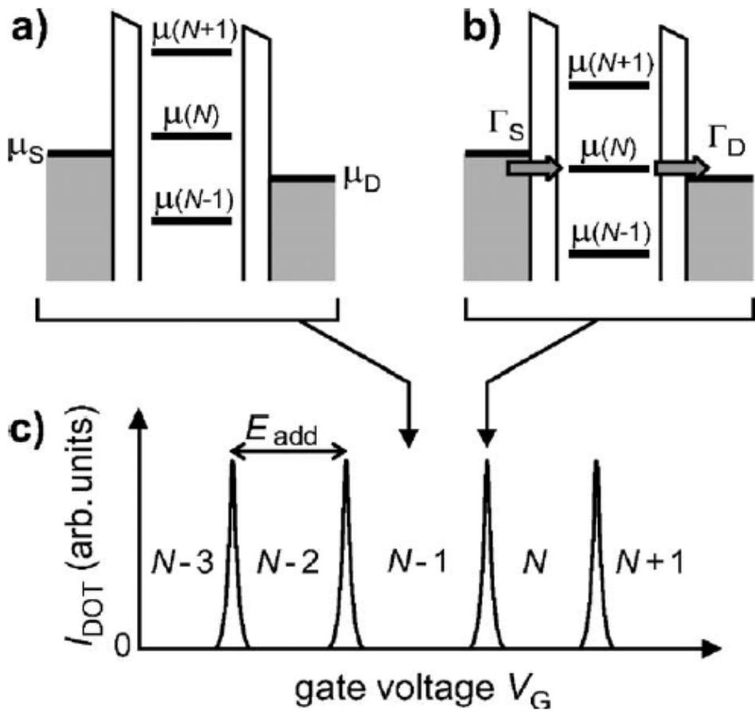  
图 1.5 量子点中能级对应的电化学势示意图和库伦振荡示意图。(a)没有能级落入源漏偏压窗口中，没有电流通过，形成库伦阻塞。 (b)电化学势µ( )N 刚好处在偏压窗口，发生电子隧穿，隧穿电流的大小取决于量子点与源漏之间的隧穿几率Γ。(c)量子点电流随栅极门电压调节的变化，即为库伦振荡。图片引自文献[31]

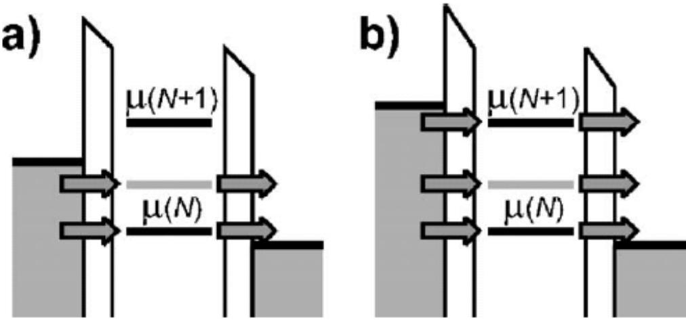  
图 1.6 源漏电极在高偏压下隧穿电流情形。(a)第N个电子以及其激发态落入偏执电压区间，电子可以分别从第N 个电子的基态和激发态这两条路径隧穿。 (b)偏压过大时第 $_ { \mathrm { N + 1 } }$ 个电子也落入偏执电压区间。图片引自文献[31]

(a)  
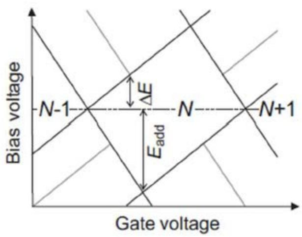

(b)  
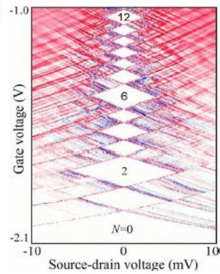  
图 1.7 (a)微分电导随着源漏电极偏压 $\mathrm { V } _ { \mathrm { S D } }$ 和门电极电压 $\mathrm { V _ { g } }$ 的变化曲线。图中菱形边界(黑色)表示有隧穿电流出现，灰色线表示刚好有激发态落入偏执电压区间。图片引自文献[33](b)实验中测量到的库伦菱形图。图片引自文献[30]

当我们加大源漏电极的偏压差时，在高偏压的情况下，如图 1.6(a)所示，黑线表示第 N个电子的基态处于源漏的偏压中，并且其激发态(灰线)也处于源漏能级差中，这样电子就有两条路径从源极到漏极，但对于每一个单独的电子只能选择其中的一条路径，这与图 1.5(b)情况是不同的。继续加大源漏的偏压大小，$\mu ( N )$ 和 $\mu ( N { \ + } 1 )$ 都处于偏压窗口中，此时两个电子可以同时隧穿经过量子点。当我们同时对栅极电压和源漏偏置电压进行改变时就得到了单电子的库仑菱形图，如图 1.7(a)(b)所示。图 1.7(a)中的黑线表示电导的变化，可以看到在菱形区域内，由于库伦阻塞，量子点内的电子数量保持不变，没有电流流过量子点。而在菱形区域外，发生电子隧穿过程，这个隧穿过程随着源漏偏置电压的变化会发生单电子隧穿和多电子隧穿过程，最后反映在菱形图上电导的变化就是不同的电导变化线，我们也就可以直接在菱形图读出 $\mathrm { { E _ { a d d } } }$ 和激发态ΔE 的大小。图 1.7(b)为实验测量得到的电导随源漏偏压和栅极门电压的变化图像。

## 1.3.2 双量子点理论模型

在一般讨论的双量子点模型中，同样是使用常相互作用模型。这里我们只讨论串联双点情况，对于并联双点方式基本相同。

常见的串联双点结果如图 1.3(c)结构。其电子从源极到漏极分别经过量子点1 和量子点 2(见图 1.8(a)),其中 $\Gamma _ { \mathrm { L } }$ 和 $\Gamma _ { \mathrm { ~ R ~ } }$ 分别表示电子从源极到量子点1的隧穿速率和电子从量子点2 到漏极的隧穿速率， $\mathbf { t } _ { \mathrm { c } }$ 表示电子在量子点1和2之间隧穿速率。整个双量子点体系用常相互作用模型等效成图 1.8(b)所示网络，其中 $\Nu _ { 1 }$ 和$\Nu _ { 2 }$ 分别为量子点 1 和量子点 2 中的电子束，每个量子点通过电容 $\mathrm { C } _ { \mathrm { g l } ( 2 ) }$ 和门电极电压 $\mathrm { V } _ { \mathrm { g l } ( 2 ) }$ 相互作用，量子点与源漏电极的相互作用等效为通过电阻为 ${ \mathrm { R } } _ { \mathrm { L ( R ) } } ,$ 电容为 $\mathrm { C } _ { \mathrm { L ( R ) } }$ 的隧穿节相互作用，两个量子点之间的相互作用同样可以看成是一个电阻为 $\mathrm { R } _ { \mathrm { m } }$ ，电容为 $\mathrm { C } _ { \mathrm { m } }$ 的隧穿节作用。

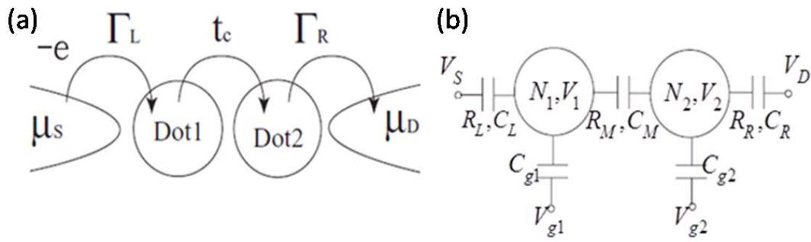  
图 1.8 (a)串联双量子点耦合示意图 (b)串联双量子点等效电路图。图片引自文献[34]

我们这里不考虑量子点中交叉耦合的情况，即是 $\mathrm { V _ { g l } } ( \mathrm { V } _ { \mathrm { g } 2 } )$ 与量子点 2(1)之间的耦合，如果考虑这一情况只是在等效电容图上加上两项，但是其基本处理方式相同。首先考虑在没有源漏偏压条件下的量子点输运情况。

类似单点情况，量子点 1(2)中的总电容为：

$$
C _ { 1 ( 2 ) } = C _ { L ( R ) } + C _ { g 1 ( 2 ) } + C _ { m }\tag{1-4}
$$

量子点中的总能量可以表示为：

$$
U ( N _ { 1 } , N _ { 2 } ) = { \frac { 1 } { 2 } } N _ { 1 } ^ { 2 } E _ { C 1 } + { \frac { 1 } { 2 } } N _ { 2 } ^ { 2 } E _ { C 2 } + N _ { 1 } N _ { 2 } E _ { C m } + f ( V _ { g 1 } , V _ { g 2 } )\tag{1-5}
$$

其中：

$$
\begin{array} { l } { { \displaystyle f ( V _ { _ { g 1 } } , V _ { _ { g 2 } } ) = \frac { 1 } { - | e | } \{ C _ { _ { g 1 } } V _ { _ { g 1 } } ( N _ { 1 } E _ { _ { C 1 } } + N _ { 2 } E _ { _ { C m } } ) + C _ { _ { g 2 } } V _ { _ { g 2 } } ( N _ { 1 } E _ { _ { C m } } + N _ { 2 } E _ { _ { C 2 } } ) \} } } \\ { { \displaystyle ~ + \frac { 1 } { e ^ { 2 } } \{ \frac { 1 } { 2 } C _ { g 1 } ^ { 2 } V _ { _ { g 1 } } ^ { 2 } E _ { _ { C 1 } } + \frac { 1 } { 2 } C _ { _ { g 2 } } ^ { 2 } V _ { _ { g 2 } } ^ { 2 } E _ { _ { C 2 } } + C _ { _ { g 1 } } V _ { _ { g 1 } } C _ { _ { g 2 } } V _ { _ { g 2 } } E _ { _ { C m } } \} } } \end{array}\tag{1-6}
$$

$$
E _ { C 1 } = \frac { e ^ { 2 } } { C _ { 1 } } ( \frac { 1 } { 1 - \frac { C _ { m } ^ { 2 } } { C _ { 1 } C _ { 2 } } } )\tag{1-7}
$$

$$
E _ { C 2 } = \frac { e ^ { 2 } } { C _ { 2 } } ( \frac { 1 } { 1 - \frac { C _ { m } ^ { 2 } } { C _ { 1 } C _ { 2 } } } )\tag{1-8}
$$

$$
E _ { C m } = \frac { e ^ { 2 } } { C _ { m } } ( \frac { 1 } { \frac { C _ { m } ^ { 2 } } { C _ { 1 } C _ { 2 } } - 1 } )\tag{1-9}
$$

$E _ { C 1 ( 2 ) }$ 为量子点1(2)的充电能， $E _ { c m }$ 为两量子点的耦合静电能。

当 $\mathrm { C } _ { \mathrm { m } } { = } 0$ 时，对应 $\mathrm { E } _ { \mathrm { m } } { = } 0$ ，此时意味着两个量子点之间没有静电耦合， $U ( N _ { 1 } , N _ { 2 } )$ 可以写成如下形式：

$$
U ( N _ { 1 } , N _ { 2 } ) = \frac { ( - N _ { 1 } | e | + C _ { g 1 } V _ { g 1 } ) ^ { 2 } } { 2 C _ { 1 } } + \frac { ( - N _ { 2 } | e | + C _ { g 2 } V _ { g 2 } ) ^ { 2 } } { 2 C _ { 2 } }\tag{1-10}
$$

此时量子点系统的总能量等于两个独立的单量子点的能量之和。

当 $\mathrm { C } _ { \mathrm { m } }$ 相对于 ${ \mathrm { C } } _ { \mathrm { L ( R ) } }$ 和 $\mathbf { C } _ { \mathrm { g } }$ 大时，即是 $C _ { { \scriptscriptstyle m } } / C _ { 1 ( 2 ) } \to 1 ,$ 上式可写成：

$$
U ( N _ { 1 } , N _ { 2 } ) = \frac { [ - ( N _ { 1 } + N _ { 2 } ) \left| e \right| + C _ { g 1 } V _ { g 1 } + C _ { g 2 } V _ { g 2 } ] ^ { 2 } } { 2 \bigg ( \tilde { C } _ { 1 } + \tilde { C } _ { 2 } \bigg ) }\tag{1-11}
$$

此时量子点系统的总量量相当于一个电荷数为 $N _ { 1 } + N _ { 2 } ,$ 电容为 $\tilde { C } _ { 1 } { + } \tilde { C } _ { 2 }$ 单量子点的能量。其中 $\tilde { C _ { 1 ( 2 ) } } = C _ { 1 ( 2 ) } - C _ { m }$ 表示量子点1(2)与外界的电容，这说明两个量子点耦合很强时，双量子点可以看做一个大的单量子点。

与单量子点类似的定义电化学势，在双量子点中，量子点 1和量子点2的电

化学势同样可以分别表示为：

$$
\begin{array} { l } { \displaystyle \mu _ { 1 } ( N _ { 1 } , N _ { 2 } ) = U ( N _ { 1 } , N _ { 2 } ) - U ( N _ { 1 } - 1 , N _ { 2 } ) } \\ { \displaystyle \qquad = ( N _ { 1 } - \frac 1 2 ) E _ { C 1 } + N _ { 2 } E _ { C m } - \frac 1 { | e | } ( C _ { g 1 } V _ { g 1 } E _ { C 1 } + C _ { g 2 } V _ { g 2 } E _ { C m } ) } \end{array}\tag{1-12}
$$

$$
\begin{array} { l } { \displaystyle \mu _ { 2 } ( N _ { 1 } , N _ { 2 } ) { = } U ( N _ { 1 } , N _ { 2 } ) { - } U ( N _ { 1 } , N _ { 2 } - 1 ) } \\ { \displaystyle { \quad \quad \quad } = ( N _ { 2 } { - } \frac { 1 } { 2 } ) E _ { C 2 } { + } N _ { 1 } E _ { C m } { - } \frac { 1 } { \lvert e \rvert } ( C _ { g 2 } V _ { g 2 } E _ { C 2 } { + } C _ { g 1 } V _ { g 1 } E _ { C m } ) } \end{array}\tag{1-13}
$$

对于固定门电极电压 $V _ { g }$ 不变，对于量子点 1 中的电子数 $N _ { 1 }$ 改变 1 时，电化学势变化量为：

$$
\mu _ { 1 } \left( N _ { 1 } + 1 , N _ { 2 } \right) - \mu _ { 1 } \left( N _ { 1 } , N _ { 2 } \right) = E _ { C 1 }\tag{1-14}
$$

这就是量子点1中的增加能，与单量子点中的结果相同，等效于量子点 1中的充电能。同样也可以得到量子点 2 中的充电能为 $E _ { c 2 }$ 。当我们考虑量子点 1(2)的能量的变化是由于量子点 2(1)中有一个电子变化时，即是这两个量子点之间的耦合能 $E _ { c m }$ ，其表达式为：

$$
\begin{array} { r l r } & { } & { E _ { C m } = \mu _ { 1 } \big ( N _ { 1 } , N _ { 2 } + 1 \big ) - \mu _ { 1 } \big ( N _ { 1 } , N _ { 2 } \big ) } \\ & { } & { \qquad = \mu _ { 2 } \big ( N _ { 1 } + 1 , N _ { 2 } \big ) - \mu _ { 2 } \big ( N _ { 1 } , N _ { 2 } \big ) } \end{array}\tag{1-15}
$$

由上述公式，我们可以得到类似于单量子点中库伦菱形图的相图，不同之处在于我们是固定 $\mathrm { V _ { s d } }$ ，通过 $\mathrm { V _ { g l } }$ 和 $\mathrm { V } _ { \mathrm { g } 2 }$ 两个栅电极的调节来反映量子点中电子数$\Nu _ { 1 }$ 和 $\Nu _ { 2 }$ 的变化关系。在源漏电极零偏压的情况下，可以将源漏电势定义为零，即是 $\mu _ { { } _ { L } } = \mu _ { { } _ { R } } = 0$ ，变化 $\mathrm { V _ { g l } }$ 和 $\mathrm { V } _ { \mathrm { g } 2 }$ 可以得到在不同 $\mathrm { C } _ { \mathrm { m } }$ 情况下的相图，如图1.9所示。(a)、(b)、(c)分别表示两个量子点由基本没有耦合到耦合很大的强耦合变化情况，这些相图我们称之为“蜂窝图”(honeycomb diagram)，它反映了一般双量子点的最基本性质。

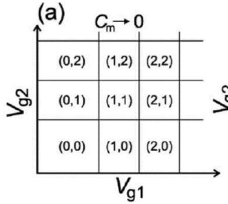

(b)  
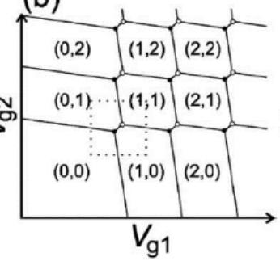

(c)  
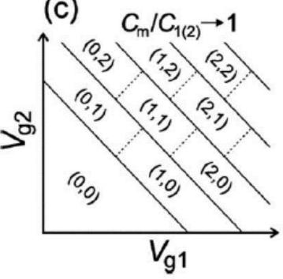  
图 1.9 串联双量子点耦合蜂窝图，蜂窝图中(M,N)分别表示两个量子点中占据的电子数

目。(a)弱耦合区域， $\mathrm { C } _ { \mathrm { m } } \to 0$ ，两个量子点之间相互之间几乎没有影响。(b)耦合中间区域，$0 { < } \mathrm { C } _ { \mathrm { m } } { \big / } \mathrm { C } _ { 1 ( 2 ) } < 1$ ，量子点呈现六边形的蜂窝形状。(c)强耦合区域， $\mathrm { C } _ { \mathrm { m } } / \mathrm { C } _ { 1 ( 2 ) }  1$ ，两个量子点可以看成一个大的单量子点。图片引自文献[34]

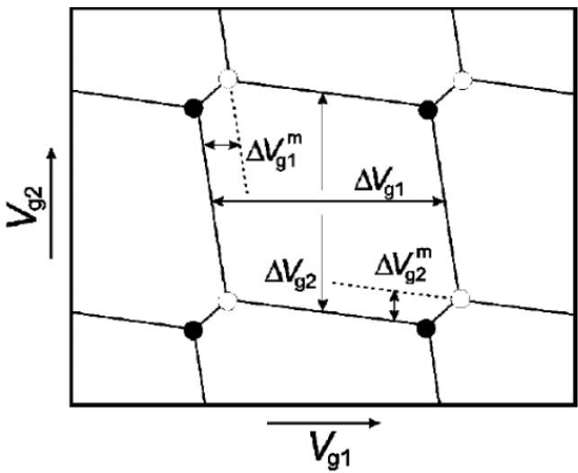  
图 1.10 双量子点系统蜂窝图原胞结构，图中黑白色点为三相点，双量子点发生共振隧穿， $\Delta V _ { g 1 } \mathfrak { F } \sharp \Delta V _ { g 2 }$ 为每个量子点的充电能， $\Delta V _ { g 1 } ^ { m }$ ， 2m ∆Vg 为每个量子点的相互耦合充电电压。图片引自文献[34]

我们放大图1.9(b)中单个蜂窝图，可以看到如图 1.10所示，当源漏的费米面与两个量子点中的化学式平齐的时候，即 $\mu _ { s } = \mu _ { 1 } = \mu _ { 2 } = \mu _ { D }$ ，对应图 1.10 中黑色和白色的两重点，称为三相点(triple point)。由图中相邻平行的线说明量子点中的电子数目变化量为相对应的 $\Delta \mathrm { V _ { g } }$ 的变化值，所以有：

$$
\mu _ { 1 } { \left( N _ { 1 } , N _ { 2 } ; V _ { g 1 } , V _ { g 2 } \right) } = \mu _ { 1 } { \left( N _ { 1 } + 1 , N _ { 2 } ; V _ { g 1 } + { \Delta } V _ { g 1 } , V _ { g 2 } \right) }\tag{1-16}
$$

$$
\mu _ { 2 } \left( N _ { 1 } , N _ { 2 } ; V _ { g 1 } , V _ { g 2 } \right) = \mu _ { 2 } \left( N _ { 1 } , N _ { 2 } + 1 ; V _ { g 1 } , V _ { g 2 } + \Delta V _ { g 2 } \right)\tag{1-17}
$$

结合之前双量子点中电化学势表达式1-12、1-13可以得到：

$$
\Delta V _ { g 1 } = \frac { | e | } { C _ { g 1 } }\tag{1-18}
$$

$$
\Delta V _ { g 2 } = \frac { | e | } { C _ { g 2 } }\tag{1-19}
$$

同样，当我们考虑双量子点中由于两个量子点相互耦合所引起电子变化时，有：

$$
\mu _ { 1 } \big ( N _ { 1 } , N _ { 2 } ; V _ { g 1 } , V _ { g 2 } \big ) = \mu _ { 1 } \big ( N _ { 1 } , N _ { 2 } + 1 ; V _ { g 1 } + \Delta V _ { g 1 } ^ { m } , V _ { g 2 } \big )\tag{1-20}
$$

$$
\begin{array} { r } { \mu _ { 2 } \left( N _ { 1 } , N _ { 2 } ; V _ { g 1 } , V _ { g 2 } \right) = \mu _ { 2 } \left( N _ { 1 } + 1 , N _ { 2 } ; V _ { g 1 } , V _ { g 2 } + \Delta V _ { g 2 } ^ { m } \right) } \end{array}\tag{1-21}
$$

相同，我们可以得到：

$$
\Delta V _ { g 1 } ^ { m } { = } \frac { \left| e \right| C _ { m } } { C _ { g 1 } C _ { 2 } } { = } \Delta V _ { g 1 } \frac { C _ { m } } { C _ { 2 } }\tag{1-22}
$$

$$
\Delta V _ { g 2 } ^ { m } = { \frac { | e | C _ { m } } { C _ { g 2 } C _ { 1 } } } = \Delta V _ { g 2 } { \frac { C _ { m } } { C _ { 1 } } }\tag{1-23}
$$

由于常相互作用模型为一个经典情况，在考虑实际对应的量子态时，应当在总的能量上加入引入的粒子能级，修正经典理论模型的不足之处。结合前面的电化学势的概念，用增加能中应包含增加粒子的充电能和粒子能级变化差这两部分，即是：

$$
\mu _ { 1 , m } \left( N _ { 1 } + 1 , N _ { 2 } \right) - \mu _ { 1 , n } \left( N _ { 1 } , N _ { 2 } \right) = E _ { C 1 } + \left( E _ { m } - E _ { n } \right) = E _ { C 1 } + \Delta E\tag{1-24}
$$

式中， $\mu _ { i , n }$ 是向量子点 i 中的能级 n 上添加一个电子所需的电化学势，包括经典电化学势和单电子能级 $E _ { n }$ 之和。我们考虑量子态存在情况下，上面得到的表达式应该修正为：

$$
\Delta V _ { g 1 ( 2 ) } = \frac { \left| e \right| } { C _ { g 1 ( 2 ) } } \left( 1 + \frac { \Delta E } { E _ { C 1 ( 2 ) } } \right)\tag{1-25}
$$

$$
\Delta V _ { g 1 ( 2 ) } ^ { m } = \frac { | e | C _ { m } } { C _ { g 1 ( 2 ) } C _ { 2 ( 1 ) } } \biggl ( 1 + \frac { \Delta E } { E _ { C m } } \biggr )\tag{1-26}
$$

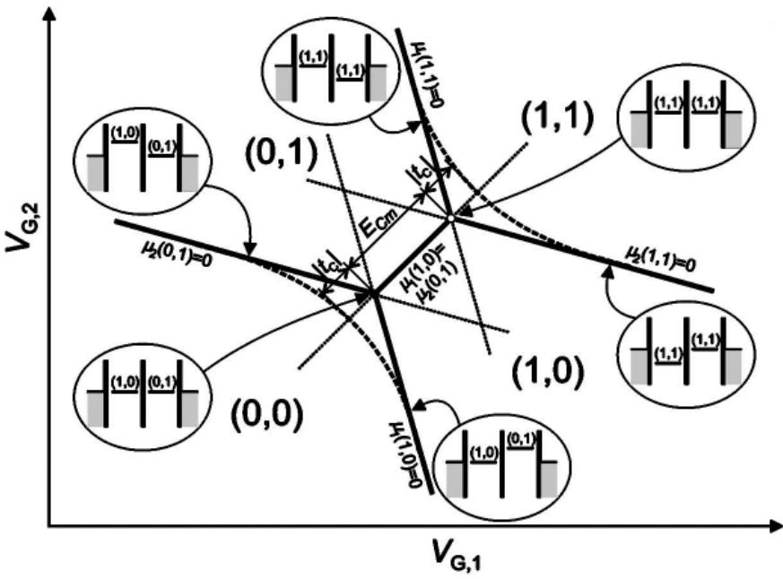  
图 1.11 在隧穿耦合 $\mathbf { t } _ { \mathrm { C } }$ 的作用下，直线在原来的三相点附近会发生弯曲的变化。图中

画出了相图各位置处量子点中的电化学势与源漏费米面的关系。图片引自文献[31]

在引入量子态后，我们对于两个量子点之间的耦合不仅仅只是其静电耦合，实际上还应当考虑到量子点之间通过隧穿势垒发生的隧穿耦合。当考虑这种隧穿耦合 $\mathbf { t } _ { \mathrm { C } }$ 存在时，此时体系的本征态应是原先本征态的线性叠加，此时电子不在局域的处在某个量子点中，而是分布在两个量子点中形成键态和反键态，两者能级差为 $2 \mathrm { t _ { C } }$ 。在蜂窝图中表现出来为在三相点附近，原来的直线会发生弯曲，其弯曲程度由tC的大小决定，参见图 1.11。

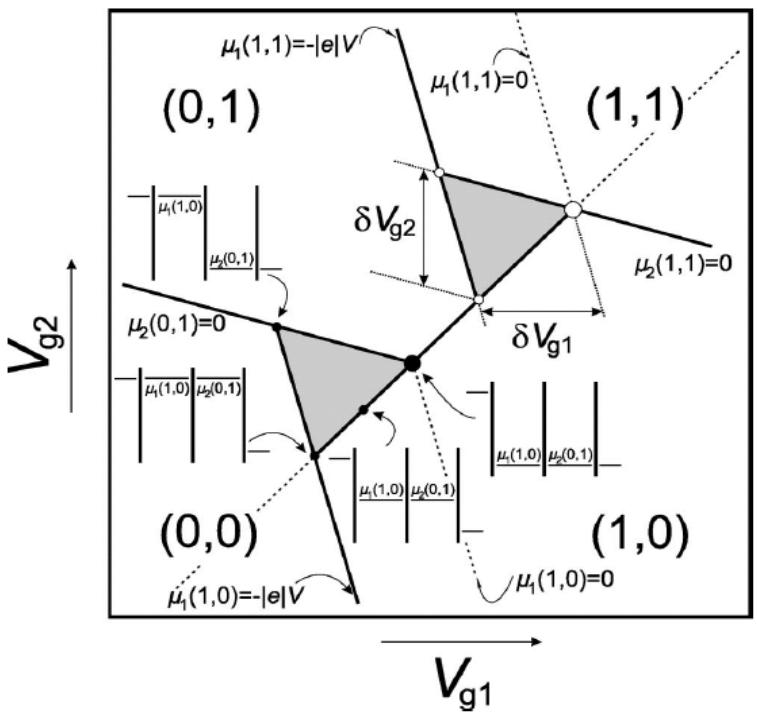  
图 1.12 在源漏电极有偏执电压 V 的条件下的蜂窝图，三相点因为偏执电压而展成了偏压三角形。图中画出了偏压三角形每条边所对应的量子点中电化学势与源漏费米面的关系。图片引自文献[31]

对于有源漏偏压存在的非线性输运区域的情况，我们在源电极上施加不为零的偏置电压 V，而漏电极接地，源漏电子的电化学势差为 $\mu _ { \mathrm { s d } } = - | e | V$ ，考虑经典情况下，原蜂窝图的三相点由于源漏偏压被展宽成三角形区域，称为偏压三角形，见图1.12，对应图中的不同位置标注了源漏电极与量子点中电化学势的相对位置，对于所加源漏偏压与门电极的关系有：

$$
\alpha _ { 1 } \delta V _ { g 1 } = \frac { C _ { g 1 } } { C _ { 1 } } \lvert e \rvert \delta V _ { g 1 } = \lvert e V \rvert\tag{1-27}
$$

$$
\alpha _ { 2 } \delta V _ { g 2 } = \frac { C _ { g 2 } } { C _ { 2 } } \vert e \vert \delta V _ { g 2 } = \vert e V \vert\tag{1-28}
$$

式中 $\alpha _ { 1 ( 2 ) }$ 对应为电压转换能量的系数。

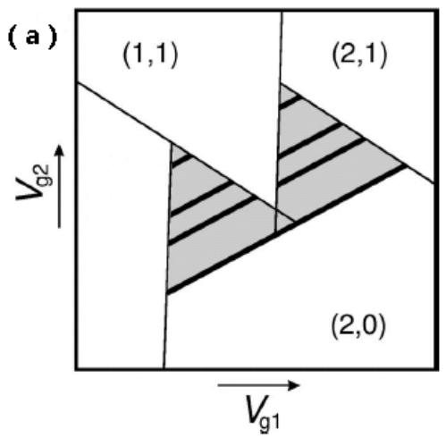

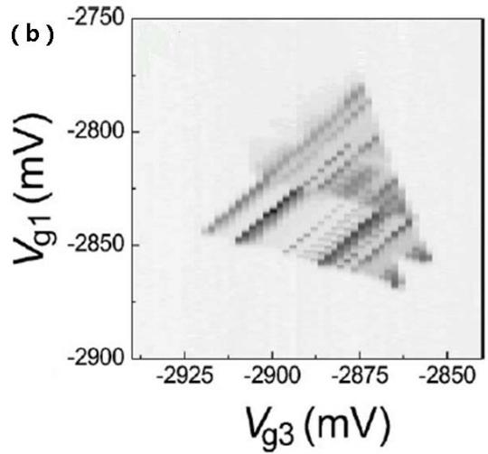  
图 1.13 偏压三角形在源漏电极高偏执电压下出现的激发态能级。(a)偏压三角形在高偏执电压下出现的激发态能级示意图。(b)实验中通过测量量子点输运电流所看到的偏压三角形中的激发态能级。通过施加反向的偏压可以使偏压三角形反转。的图片引自文献[34]

对于高偏压情况下，量子点中激发态就会出现在偏压三角形区域中，相应也会测量到电流的变化，如图1.13(a)标示出高偏压下多个激发态出现导致在偏压三角形内部也有与底边相平行的线出现。1.13(b)图为实际样品测量数据，可以根据上面的公式推导计算出不同激发态与基态之间的能级差。当然对于双量子点我们还可以去研究偏压下的自旋阻塞效应(可以参考文献[31,36])，这里就不做相关的介绍。

## 1.3.3 量子点相关概念

## (1)量子点接触

一般对于量子点的测量，可以通过测量流经量子点的电流信号来探测量子点中电子的变化情况，除此之外，我们还可以通过在量子点旁边制作一种“电荷探测器”来探测量子点中的电荷变化情况，这种“电荷探测器”我们称之为量子点接触(Quantum Point Contact, QPC)[37-39]。

一般来说，量子点接触是通过制作一个与量子点在空间间距很近的电流通道，使其与量子点之间有很强的电容耦合，当我们通过调节表面的门电压使量子点中的电荷跳出或者跳进量子点中时，这个变化过程由于电容耦合会剧烈的影响量子点接触通道的电流变化，这样我们通过测量到 QPC 通道中的电流变化就可以反向得到量子点中电荷的隧穿信息。量子点接触是一种灵敏度极高的电荷探测器，图1.3(c)中左右两个横着的电极就是制作的两个量子点接触探测器。

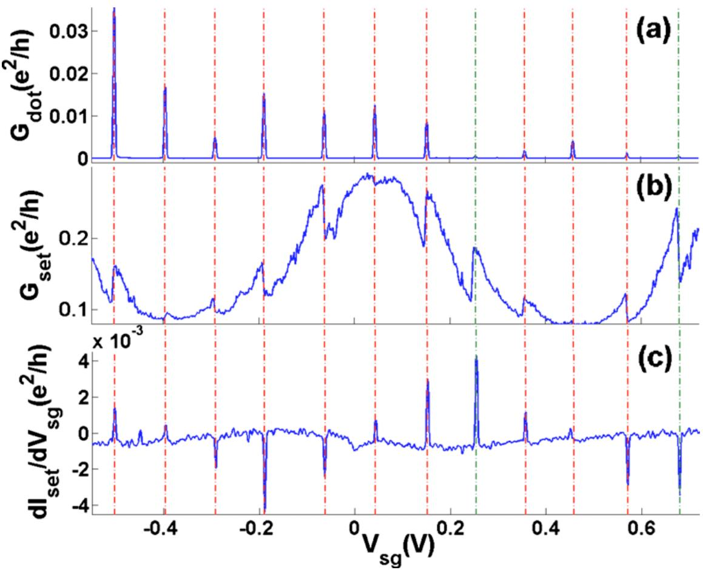  
图 1.14 分别使用三种测量方法测量量子中的信号。(a)量子点中电导随栅极电压变化的库伦阻塞曲线，这种方法称为量子点输运测量。(b)利用QPC 通道，测量QPC 输运电流的信号变化量的方式，称为QPC 的输运测量。(c)QPC测量通道的调制信号的测量方式。测量QPC 通道的微分电导信号。三种测量方法在库伦峰的位置一一对应。图片引自文献[40]

在实际的测量中，一般有三种测量方法。以单量子点为例，直接直接测量流经量子点的电流或电导的方式，此方法称为量子点输运测量，对应图1.14(a)。这里 $\mathrm { V _ { s g } }$ 是量子点中的一个门电极，通过调节这个门电极的电压扫描可以依次排空量子点中的电子，得到了一幅简单的库伦振荡的图像。图 1.14(b)的测量方式称为QPC 的输运测量(QPC Transport)，其测量方法是在 QPC 通道的两端加上一个微小直流偏置和交流激励，通过 Lock-in的锁频技术测量流过 QPC 的电流(电导)的变化。这种方法的优势在于当量子点中两边的势垒很高时，量子点中的输运电流变得很小，很难直接探测到库伦峰。此时电荷探测器的 QPC 依然可以得到较清晰的信号变化。图 1.14(c)所示的方法为 QPC 调制信号测量(QPC Modulation),这种方法相较 QPC 的输运测量不同的是将交流激励信号加在量子点的一个门电极上，同样通过 Lock-in的锁频技术测量得到微分电导的变化，相当于对1.14(b)中的信号结果进行了物理微分，这种方法具有最高的灵敏度。对比图 1.14 可以看到尽管使用了三种不同的方法，但是其结构都是一一对应的。

## (2)弛豫时间和退相干时间

对于一个量子比特系统，我们都希望其具有足够长的相干时间使得我们能够对量子比特进行更多的操作。但是，实际情况中量子比特由于和外界环境有着相互作用，导致了其退相干的发生。我们通常使用弛豫时间和退相干时间来表征量子比特的相干性。在二能级体系统，以基态和激发态为例，当粒子在激发态时，它有概率衰减到基态，其衰减几率遵循着 $\gamma = 1 - e ^ { - t / T _ { 1 } }$ 的关系，这里时间 $\mathrm { T } _ { 1 }$ 代表着激发态的寿命，称之为弛豫时间。对于量子比特，当其与外界环境相互作用后会导致量子比特在不同基失之间损失相干性，会有相位丢失，在一般的物理体系中，在随机相位移动中，虽然密度矩阵对角元不受影响，但是非对胶原是以 $e ^ { - \lambda }$ 衰减，这个相位对视的过程称作相位衰减，一般λ是线性依赖时间的，具有形式为$\lambda = t / T _ { 2 }$ ，这里特征时间 $\mathrm { T } _ { 2 }$ 是固有的退相干时间，当我们考虑体系的系综平均之后得到的退相干时间记作 $T _ { 2 } ^ { * }$

## 1.4 本章小结

本章主要针对量子计算背景和不同量子计算的体系的简单了解，介绍了我们所研究的半导体门控量子计算。通过对量子点结构、二维电子气的介绍后，从单个量子点和双量子点引入了分析量子点系统最常用的常相互作用模型，对其电化学势、库伦阻塞、库伦振荡、充电能、库伦菱形、蜂窝图、双点耦合强度等量子点系统的基本概念和现象有了基本的了解，可以得到常见描述双量子点的基本电容参数以及耦合强度的定义。最后对量子点接触 QPC 这一个利用量子点旁边的窄电流通道作为对量子点的一个探测手段，介绍了使用 QPC 的输运测量和调制测量这两种对量子点内信号高灵敏的测量手段，以及量子系统中的弛豫时间和退相干时间的基本概念。这一章内容主要是为让我们对单个量子点和双量子点的物理现象有基本的了解，为后续的量子点操控和多量子比特做准备。

## 参考文献

[1] G.E. Moore, Cramming more components onto integrated circuits, Proceedings of the Ieee, 86, 82-85 (1998).

[2] D. Deutsch, QUANTUM-THEORY, THE CHURCH-TURING PRINCIPLE AND THE UNIVERSAL QUANTUM COMPUTER, Proceedings of the Royal Society of London Series a-Mathematical Physical and Engineering Sciences, 400, 97-117 (1985).

[3] D. Deutsch and R. Jozsa, RAPID SOLUTION OF PROBLEMS BY QUANTUM COMPUTATION, Proceedings of the Royal Society of London Series a-Mathematical Physical and Engineering Sciences, 439,553-558 (1992).

[4] P.W. Shor, Algorithms for quantum computation: discrete logarithms and factoring, 1994.

[5] L.K. Grover, A fast quantum mechanical algorithm for database search, 1996.

[6] D.P. DiVincenzo, The physical implementation of quantum computation, Fortschritte Der Physik-Progress of Physics, 48,771-783 (2000).

[7] E. Knill, R. Laflamme and G.J. Milburn, A scheme for efficient quantum computation with linear optics, Nature, 409, 46-52 (2001).

[8] Q.A. Turchette, C.J. Hood, W. Lange, H. Mabuchi and H.J. Kimble, MEASUREMENT OF CONDITIONAL PHASE-SHIFTS FOR QUANTUM LOGIC, Physical Review Letters, 75, 4710-4713 (1995).

[9] J.I. Cirac and P. Zoller, QUANTUM COMPUTATIONS WITH COLD TRAPPED IONS, Physical Review Letters, 74, 4091-4094 (1995).

[10] N.A. Gershenfeld and I.L. Chuang, Bulk spin-resonance quantum computation, Science, 275, 350-356 (1997).

[11] A. Shnirman, G. Schon and Z. Hermon, Quantum manipulations of small Josephson junctions, Physical Review Letters, 79, 2371-2374 (1997).

[12] D. Loss and D.P. DiVincenzo, Quantum computation with quantum dots, Physical Review A, 57, 120-126 (1998).

[13] P. Maletinsky, S. Hong, M.S. Grinolds, B. Hausmann, M.D. Lukin, R.L. Walsworth, M. Loncar and A. Yacoby, A robust scanning diamond sensor for nanoscale imaging with single nitrogen-vacancy centres, Nature Nanotechnology, 7, 320-324 (2012).

[14] F.H.L. Koppens, C. Buizert, K.J. Tielrooij, I.T. Vink, K.C. Nowack, T. Meunier, L.P. Kouwenhoven and L.M.K. Vandersypen, Driven coherent oscillations of a single electron spin in a quantum dot, Nature, 442, 766-771 (2006).

[15] K.C. Nowack, F.H.L. Koppens, Y.V. Nazarov and L.M.K. Vandersypen, Coherent control of a

single electron spin with electric fields, Science, 318, 1430-1433 (2007).

[16] M. Pioro-Ladriere, T. Obata, Y. Tokura, Y.S. Shin, T. Kubo, K. Yoshida, T. Taniyama and S. Tarucha, Electrically driven single-electron spin resonance in a slanting Zeeman field, Nature Physics, 4,776-779 (2008).

[17] S. Nadj-Perge, S.M. Frolov, E.P.A.M. Bakkers and L.P. Kouwenhoven, Spin-orbit qubit in a semiconductor nanowire, Nature, 468,1084-1087 (2010).

[18] J.R. Petta, A.C. Johnson, J.M. Taylor, E.A. Laird, A. Yacoby, M.D. Lukin, C.M. Marcus, M.P. Hanson and A.C. Gossard, Coherent manipulation of coupled electron spins in semiconductor quantum dots, Science, 309,2180-2184 (2005).

[19] S. Foletti, H. Bluhm, D. Mahalu, V. Umansky and A. Yacoby, Universal quantum control of two-electron spin quantum bits using dynamic nuclear polarization, Nature Physics, 5,903-908 (2009).

[20] J.R. Petta, H. Lu and A.C. Gossard, A Coherent Beam Splitter for Electronic Spin States, Science, 327,669-672 (2010).

[21] M.D. Shulman, O.E. Dial, S.P. Harvey, H. Bluhm, V. Umansky and A. Yacoby, Demonstration of Entanglement of Electrostatically Coupled Singlet-Triplet Qubits, Science, 336,202-205 (2012).

[22] B.M. Maune, M.G. Borselli, B. Huang, T.D. Ladd, P.W. Deelman, K.S. Holabird, A.A. Kiselev, I. Alvarado-Rodriguez, R.S. Ross, A.E. Schmitz, M. Sokolich, C.A. Watson, M.F. Gyure and A.T. Hunter, Coherent singlet-triplet oscillations in a silicon-based double quantum dot, Nature, 481,344-347 (2012).

[23] K.D. Petersson, J.R. Petta, H. Lu and A.C. Gossard, Quantum Coherence in a One-Electron Semiconductor Charge Qubit, Physical Review Letters, 105,246804 (2010).

[24] G. Cao, H.-O. Li, T. Tu, L. Wang, C. Zhou, M. Xiao, G.-C. Guo, H.-W. Jiang and G.-P. Guo, Ultrafast universal quantum control of a quantum-dot charge qubit using Landau-Zener-Stuckelberg interference, Nature Communications, 4,1401 (2013).

[25]L. Gaudreau, G. Granger, A. Kam, G.C. Aers, S.A. Studenikin, P. Zawadzki, M. Pioro-Ladriere, Z.R. Wasilewski and A.S. Sachrajda, Coherent control of three-spin states in a triple quantum dot, Nature Physics, 8,54-58 (2012).

[26] D. Kim, Z. Shi, C.B. Simmons, D.R. Ward, J.R. Prance, T.S. Koh, J.K. Gamble, D.E. Savage, M.G. Lagally, M. Friesen, S.N. Coppersmith and M.A. Eriksson, Quantum control and process tomography of a semiconductor quantum dot hybrid qubit, Nature, 511,70-74 (2014).

[27] K.D. Petersson, L.W. McFaul, M.D. Schroer, M. Jung, J.M. Taylor, A.A. Houck and J.R. Petta, Circuit quantum electrodynamics with a spin qubit, Nature, 490,380-383 (2012).

[28] T. Frey, P.J. Leek, M. Beck, A. Blais, T. Ihn, K. Ensslin and A. Wallraff, Dipole Coupling of a Double Quantum Dot to a Microwave Resonator, Physical Review Letters, 108,046807 (2012).

[29] H. Toida, T. Nakajima and S. Komiyama, Vacuum Rabi Splitting in a Semiconductor Circuit QED System, Physical Review Letters, 110,066802 (2013).

[30] L. P. Kouwenhoven, D. G. Austing, and S. Tarucha, Rep. Prog. Phys. Few-electron quantum dots 64, 701-736 (2001).

[31] R. Hanson, L.P. Kouwenhoven, J.R. Petta, S. Tarucha and L.M.K. Vandersypen, Spins in few-electron quantum dots, Rev. Mod. Phys., 79,1217-1265 (2007).

[32] L. H. Willems van Beveren, Ph. D. Thesis, Delft University (2005).

[33] R. Hanson, PhD Thesis, Delft University of Technology, (2005).

[34] W.G. van der Wiel, S. De Franceschi, J.M. Elzerman, T. Fujisawa, S. Tarucha and L.P. Kouwenhoven, Electron transport through double quantum dots, Rev. Mod. Phys., 75,1-22 (2003).

[35] J.M. Elzerman, R. Hanson, L.H.W. van Beveren, B. Witkamp, L.M.K. Vandersypen and L.P. Kouwenhoven, Single-shot read-out of an individual electron spin in a quantum dot, Nature, 430,431-435 (2004).

[36] A.C.Johnson, J.R.Petta, and C.M.Marcous, Single-triplet spin blockade and charge sensing in a few-electron double quantum dot, Physics Review B, 72,165308 (2004).

[37] M. Field, C.G. Smith, M. Pepper, D.A. Ritchie, J.E.F. Frost, G.A.C. Jones and D.G. Hasko, MEASUREMENTS OF COULOMB BLOCKADE WITH A NONINVASIVE VOLTAGE PROBE, Physical Review Letters, 70,1311-1314 (1993).

[38] D. Sprinzak, Y. Ji, M. Heiblum, D. Mahalu and H. Shtrikman, Charge distribution in a Kondo-correlated quantum dot, Physical Review Letters, 88,176805 (2002).

[39] W. Lu, Z.Q. Ji, L. Pfeiffer, K.W. West and A.J. Rimberg, Real-time detection of electron tunnelling in a quantum dot, Nature, 423,422-425 (2003).

[40] L.-J. Wang, G. Cao, T. Tu, H.-O. Li, C. Zhou, X.-J. Hao, Z. Su, G.-C. Guo, H.-W. Jiang and G.-P. Guo, A graphene quantum dot with a single electron transistor as an integrated charge sensor, Applied Physics Letters, 97,262113 (2010).

## 第 2 章 样品制备和测量系统

半导体技术的迅猛发展推动了社会的巨大进步，其制造出来的微小逻辑电路和芯片产品已经融入到我们我们日常生活中的方方面面，如手机、电脑、汽车、卫星等等。半导体微纳加工一般的尺寸都在微米和纳米级范围，通过光刻曝光显影、金属镀膜、等离子体刻蚀、原子层沉积等一系列技术的组合加以实现，并最终实现预期结构的制备。

半导体样品的微纳加工技术是我们进行量子比特研究的必须掌握的基本技能。本章中先介绍我们在进行微纳加工过程中需要使用的仪器设备以及相关设的操作流程，然后再详细描述我们在砷化镓半导体上的量子点制备过程，其目的是对我们的样品制备流程有一个全面的了解，最后我将简要介绍我们的测量系统和对其的改造工作，以适应我们多电荷量子比特操控的需求，以及我们对使用制备量子点的砷化镓晶圆的基本性质的测量以及对其筛选的方法，为全面了解所研究的量子点系统提供参考。

## 2.1 微纳加工仪器及其使用

现在的微纳加工技术的发展使得人们能够在材料上任意的制作纳米量级的图形结构，配合上离子刻蚀、金属镀膜、原子层生长、氧化和转移等技术，能够方便的研究物质材料的光学、电学、机械、化学等等性质，开创了微纳领域研究的新方向。

本节中，我们主要针对GaAs/AlGaAs半导体量子点样品的制备过程中一些需要使用的主要仪器设备进行详细的介绍，包括紫外光学曝光机、通过加装 NPGS控制插件实现的电子束曝光机、电子束蒸发镀膜机等；也简要介绍一些辅助的设备以帮助我们完成加工流程。通过对仪器基本使用和功能的介绍，能够对整个微纳加工的工艺流程能够有比较清晰的了解。通过合理有效的使用所拥有的微纳加工设备，才能服务于我们目前所从事的实验研究需要和加速研究的进度。

接下来，我将根据我们实验研究小组所拥有的，以及本论文研究中的所涉及使用到的仪器设备的情况以及操作做一个简单的介绍，并在随后以章节中将详细描述我进行样品加工的流程。

## 2.1.1 紫外光学曝光机

紫外光学曝光机又称光刻机，简要描述其工作原理为利用高压汞灯发出的紫外光，通过透镜组使其平行地照射在光刻掩膜板上，利用光刻掩膜板上的区域是否被覆盖从而对下面的光刻胶进行曝光，利用光刻胶对不同曝光剂量的反应性质，再通过显影液显影之后就能够得到对应于光刻掩膜板上图案，曝光精度一般在微米量级。我们小组所使用的紫外光学曝光机型号为MJB3 型，理论上的曝光精度可以达到 $0 . 5 \mu m$ 。我们实际使用过程中，我们在硬接触的曝光模式下最小精度只能做到到 $2 \mu m$ ，对于线宽尺度更小的结构，我们的紫外光学曝光机出来的结果在边缘有较大的变形误差，对于我们使用其制备样品外围结构电路中较大电极还是十分的方便和快捷。同时，在设计制作光刻掩膜板时应当注意到仪器实际能达到的最小精度，防止出现因为设计的结构过小而导致曝光结果变形的失败。在本论文中的光刻样品其光刻最小精度设计控制在 $5 \mu m$ ，多次光刻套刻步骤采用共同的对准标记以达到多层间的准确对准，保证了样品制备的成功率。

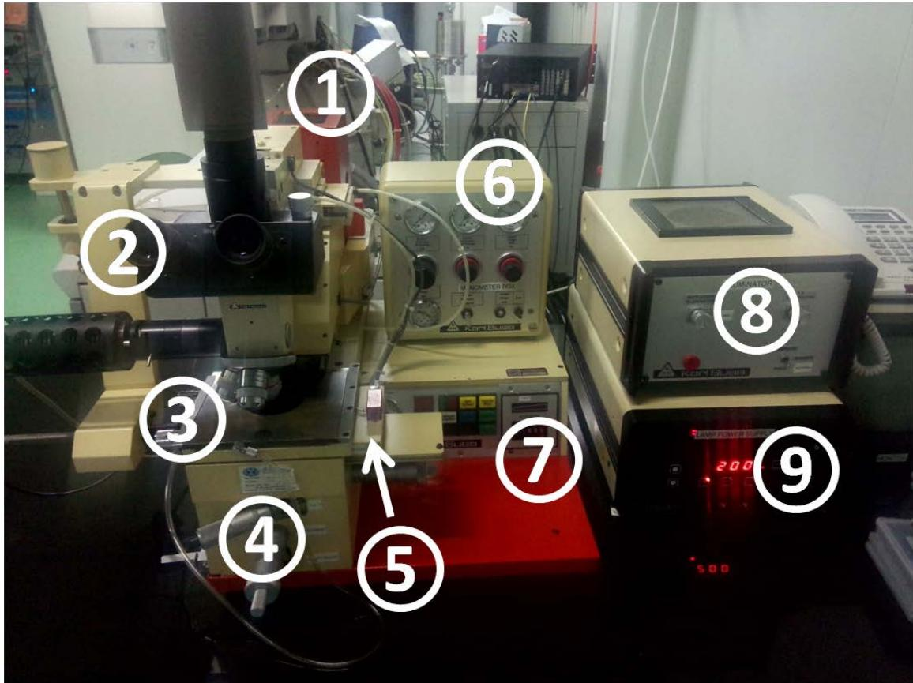  
图 2.1 MBJ3型紫外光学曝光机。图中各个组成部分分别为：(1)汞灯光源；(2)显微镜；(3)光刻板台；(4)样品台控制旋钮；(5)样品台；(6)气路控制；(7)曝光控制台；(8)显微镜光源控制；(9)汞灯光源控制。

如图2.1 所示为我们研究小组所使用的光刻机。其光源为在高压下发射波长为 365nm 紫外线的高压汞灯。该光刻机主要包括如图所示几个部分，1 为汞灯光源，其作用为提供高强度的紫外光源，通过透镜组提供曝光区域的平行光。一般高压汞灯有其使用寿命，在经过较长时间使用以后会发生发射光强的变化，应当用光强计对出来的平行光强进行校准，以保证光刻结果的稳定性。2 为显微镜，用于观察样品与光刻板之间的相对位置使其能够很好的重合，其中目镜为 10 倍放大，物镜转盘可以选择5、10、25 倍三种放大倍数，以便在准对过程中可以先使用小倍数进行整体基本对齐，然后再利用较大放大倍数进行准确地对准。3 为光刻板台，为放置光刻掩模板的区域，通过真空泵将光刻板紧紧吸住，然后旁边有两个可旋钮的螺丝将其固定在光刻机上。4 为样品台移动控制旋钮，可以进行X、Y、Z方向调节，并且同时可以进行 30度范围的XY平面旋转调节。用于安放样品的载物台。5为样品台，用于放置需要曝光的样品的载物台，同样也有真空吸气使得放置的样品在样品台上被固定。6为气路控制系统，通过控制两路气压分别为 2bar 和 4bar 的压缩空气来驱动光刻机在对准时的调节和以及曝光过程中的机械活动，另外还有一路气压为 1bar 的氮气，用于冷却汞灯，防止汞灯过热。7为曝光控制台，可以用来调节曝光时间，曝光模式等参数以及控制真空泵吸气开关。8 为显微镜光源控制，用来调节显微镜中光源开关和亮度。9 为汞灯光源控制器，为汞灯开启时提供高压并且能够调节汞灯的光强。

<table><tr><td rowspan=1 colspan=1>spin speed [rpm]</td><td rowspan=1 colspan=1>2000</td><td rowspan=1 colspan=1>3000</td><td rowspan=1 colspan=1>4000</td><td rowspan=1 colspan=1>5000</td><td rowspan=1 colspan=1>6000</td></tr><tr><td rowspan=1 colspan=1></td><td rowspan=1 colspan=1></td><td rowspan=1 colspan=1></td><td rowspan=1 colspan=1></td><td rowspan=1 colspan=1></td><td rowspan=1 colspan=1></td></tr><tr><td rowspan=1 colspan=1>AZ 5214E</td><td rowspan=1 colspan=1>1.98</td><td rowspan=1 colspan=1>1.62</td><td rowspan=1 colspan=1>1.40</td><td rowspan=1 colspan=1>1.25</td><td rowspan=1 colspan=1>1.14</td></tr><tr><td rowspan=1 colspan=1></td><td rowspan=1 colspan=1></td><td rowspan=1 colspan=1></td><td rowspan=1 colspan=1></td><td rowspan=1 colspan=1></td><td rowspan=1 colspan=1></td></tr></table>

表 2.1 AZ5214E 光刻胶膜厚与匀胶速率的关系表。(厚度单位为： mm)

在光刻曝光中，我们所使用的光刻胶型号为AZ5214E。该型光刻胶的波长敏感区域为310-420nm，能够达到的最高曝光精度为0.1mm，但是在实际上受到紫外光刻曝光机的精度以及我们所定制的光刻掩膜版精度的限制，我们一般将最小曝光精度宽度控制在 $5 \mu m$ 左右，如果结构再小就会出现曝光图像严重变形的现象。该光刻胶既可以当作正胶也可以当作反胶使用，表2.1 为该光刻胶在不同匀胶转速下与光刻胶厚度变化的数据。实际使用中，我们先在匀胶机上先使用500rpm 的低转速旋转 3-5s 将光刻胶匀摊开以后，紧接着使用转速为 4000rmp的转速匀胶 40s，对应得到光刻胶胶的厚度为1.4 m。经过特定温度的烤胶台烘干后便可以在光刻机上面进行图案的曝光操作，曝光完成后通过使用该型光刻胶对应的 AZ400K 显影液进行稀释显影，最后用去离子水清洗，高纯 $\Nu _ { 2 }$ 气吹干即完成整个光刻曝光流程。对于每种固定型号的光刻胶，其公司都会给出一个参考值数据，包括匀胶转速、时间、胶的厚度以及曝光敏感度和对比度等参数。我们根据自己的实际情况和多次反复测试后才能获得自己最理想的曝光参数。对于我们使用的 AZ5214E 光刻胶，我们总结优化后最理想的曝光参数为：需要进行正胶曝光，步骤为甩胶后95摄氏度烘烤90s,曝光时间为12s，对应AZ400K:DI(去离子水)=1:6 的显影液显影时间为 90s。需要进行反胶曝光，步骤为甩胶后 95 摄氏度烘烤90s，然后曝光时间为 $^ { 6 \mathrm { s } , }$ ,接着再在95摄氏度烤胶机上烘烤120s，再一次在去掉光刻掩膜板的情况下全片曝光 60s，同样的 AZ400K:DI(去离子水)=1:6 的显影液显影时间为60s。图2.2(a)为光刻原理示意图。图 2.2(b)上下分别为正胶和反胶显影后留下区域的示意图。可以看到使用正胶曝光工艺，光刻掩膜板中被遮挡的部分光刻胶保留下来，而使用反胶曝光则刚好相反。对于正胶和反胶的应用应当根据光刻掩膜板的设计和所需要保留胶的区域来决定，熟练的使用正反胶能够提升我们制作样品的成功率。

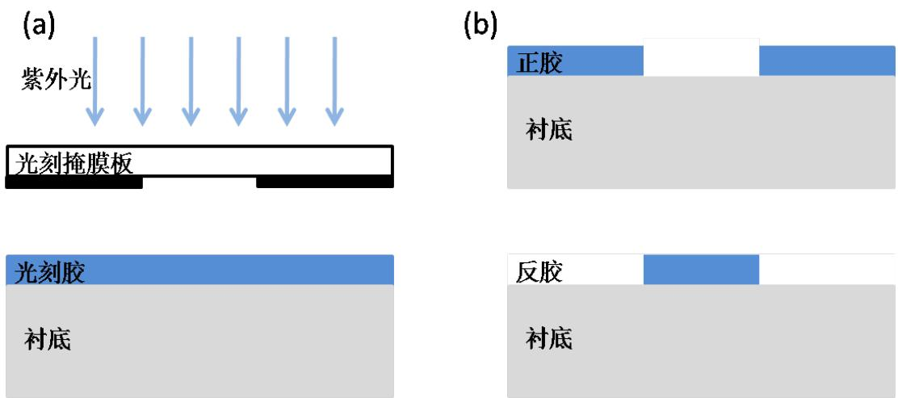  
图 2.2 (a)光学曝光刻蚀示意图。(b)显影后正胶和反胶转移图形的示意图。

## 2.1.2 扫描电子显微镜和电子束曝光刻蚀

由于我们需要制备的量子点样品内部微小结构尺寸在几十纳米大小尺度，使用普通的紫外光光刻办法已经无法实现，所以我们必须要使用电子束刻蚀的办法来进行微纳加工。扫描电子显微镜(Scanning Electron Microscope, SEM),我们可以将其类似于光学显微镜，其工作原理是利用经过一系列的电磁透镜，将发射出的高能电子束聚焦后照射在样品表面上，通过扫描收集散射出的二次电子来成像。由于二次电子的散射分布主要依赖于其表面形貌，因此通过收集到的二次电子分布就可以得到样品表面的信息。

如图2.3 所示为我们课题组使用的FEI公司的INSPECT F50 扫描电子显微镜，我们使用的电子束刻蚀系统为在此 SEM 上加装纳米图形生成系统(Nanometer

Pattern Generation System, NPGS)控制程序结合而成。图中 1 为场发射电子束源和各级电学透镜，其作用为发射高能电子(一般电压为几十千伏)然后通过电学透镜将电子进行汇聚聚焦。2 为SEM 光阑，调节光阑大小作为来控制照射到样品表面的电流强度。3 为加装的 NPGS 控制电极，我们通过 NPGS 图形编辑器生成出我们想要曝光图形，软件会通过施加控制电压使得电子束在我们在样品表面依次扫描曝光，实现"写"图形的过程，同样利用选取的对电子束剂量敏感的光刻胶，通过显影将写过的区域融掉，最终形成我们设计的曝光图形。4 为CCD 探头，其可以直接观察我们将样品放入到SEM 真空腔中样品的情况。5 为样品台方位调节杆，可以调节样品表面与电子束的相对角度。6 和7 分别为SEM 控制电脑和NPGS 控制电脑。后来我们又购置了一台Raith 公司的e-line plus电子束曝光机，如图2.4所示。虽然在具体使用操作上有所不同，但是其原理上都是一样的，这里就不再做详细的介绍。

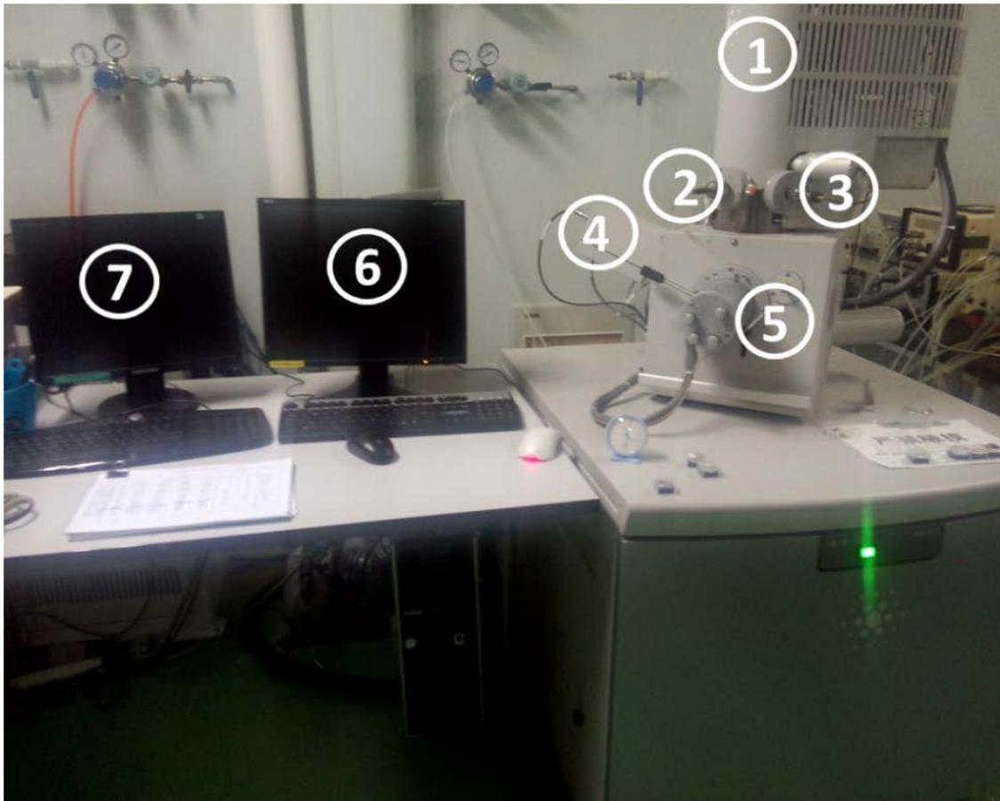  
图 2.3 INSPECT F50扫描电子显微镜。图中各个组成部分分别为：(1)电子束源以及电学透镜；(2)光阑；(3)NPGS 控制电极；(4)CCD 探头；(5)方位调节杆；(6)SEM 控制电脑；(7)NPGS 控制电脑。

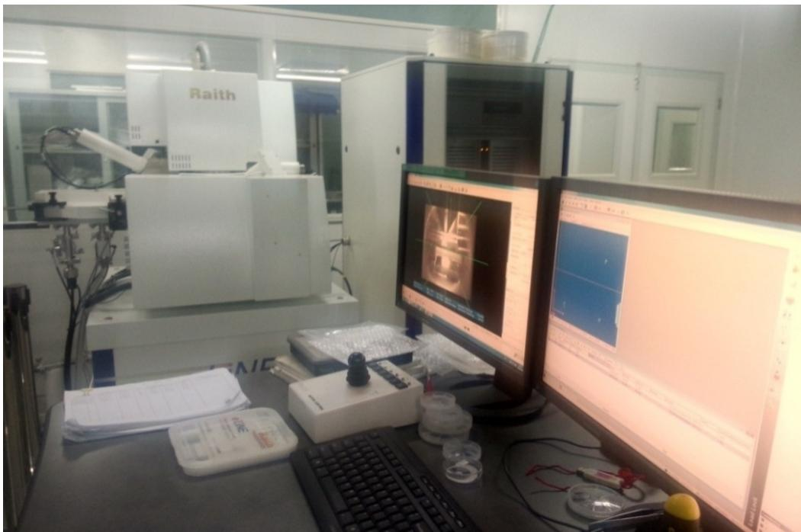  
图 2.4 Raith 公司 e-line plus 电子束曝光机。

由于 SEM 所取得电子扫描分辨率主要与电子束的能量大小、光阑对应的光圈大小以及电子束透镜的聚焦工作距离有关。所以一般情况下，想要获得更加清晰、分辨率更高的图片就需要选择更高的电子束能量，合适的光圈大小和适中的工作距离。但是在实际应用中，由于我们的样品的二维电子气在表面大约 90nm处，过高能量的电子束照射会对样品带来性质不稳定的伤害，所以一般在观看样品结构时都选用15keV或10keV的电压能量，40um的光阑和spot 3的电子束斑。而在电子束曝光时，由于我们需要较高的曝光精度，我们选择 30keV的高压以及spot 1 低电流以提高精度。由于SEM 属于精密加工仪器，在使用其观看样品前需要仔细地对电子束进行准直、聚焦、放大倍数、对比度亮度、像散等参数的调节。其一般具体步骤如下：

1、点击 SEM 控制面板上的vent 按钮，等待仪器自动放入氮气后打开后，将粘贴在特定底座的样品放入 SEM 样品台同时轻轻拧紧底部螺丝将其固定，然后点击pump 按钮抽真空。

2、等到达到可使用的真空度后，便可以打开电子束。在最小的放大倍数下调节电子束的准直情况,选择所需的光阑光圈大小，选择电子束斑的大小。

3、选择一个聚焦的参照物用于聚焦和像散的调节，这里我们使用粘贴样品底座带有的法拉第杯，聚焦调节好后，将显微镜聚焦调节到最佳工作距离10mm 处，然后重新进行微调，再同时进行X 和Y 方向像散的调节。

4、选择更大的放大倍数重新调节聚焦和像散，原则上只要能够调节清楚，就尽量往可能大的放大倍数调节，保持尽可能高的倍数和高的分辨率。

5、最后调节对比度和亮度，得到清晰的成像效果，接下来就可以对需要观测的样品进行扫描观测和图像保存。

下面简要介绍使用 SEM 做电子束曝光刻蚀的过程。电子束曝光(ElectronBeam Lithography, EBL)的基本原理与光刻的基本原理类似，不同之处在于使用光学曝光使用的是对紫外线光波段敏感的光刻胶，利用紫外线的照射曝光而形成曝光区域和非曝光区域；而电子束曝光则是对电子束敏感的电子束曝光胶，通过高压加速的电子进行曝光处理。曝光原理上，被特定范围内剂量的电子束曝光的部分在显影后会被溶解掉，从而形成我们所想要的图形结构。我们实验室中常用的电子束曝光胶为 PMMA 系列，有编号为 950 的 A2、A4、C2 以及 495 的 A2 和A4 胶。A 后面的 2 和 4 代表着每一种胶对应的浓度为 2%和 4%，而 A 和 C 代表着溶剂分别为甲醚(anisole)和氯苯(chlorobenzene)。胶的厚度与胶的类型、浓度以及甩胶的时间和转速都有着密切的关系，图2.5 对应不同浓度的950 PMMA胶厚度与转速的关系。我们平时使用最多的光刻胶为950PMMA A2 胶，在经过转速4000rmp 匀胶 40s 后，单层光刻胶的厚度约为 60nm，根据我们所需要镀金属膜的总厚度来决定所需要甩胶的层数，在保持所镀的金属膜总厚度在胶总厚度的一半以下时，这样使得镀上的金属在有胶和无胶的区域能够因为高度梯度差过大而发生断裂，方便后续的金属剥离过程。一般我们镀的金属小电极的总厚度为 50nm，这就对应我们需要使用两层的950PMMA A2 光刻胶以方便金属剥离。

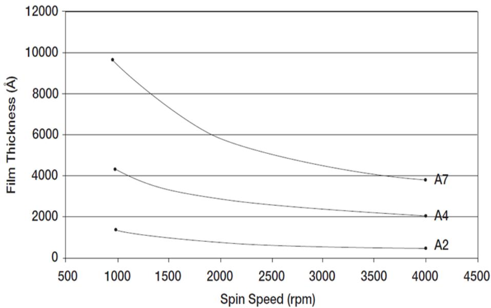  
图 2.5 950PMMA光刻胶匀胶转速与胶厚关系图。

前面介绍过我们的电子束刻蚀是用SEM加装NPGS控制插件得到的简易版本的电子束曝光刻蚀系统。NPGS 控制系统是通过提供一个控制SEM电子束偏转的数模转换模块(DAC),在其与 SEM 通讯接口完成很好的匹配情况下，控制电子束曝光的方式、时间参量等，同时 NPGS 控制程序软件还包括图形设计软件、画图软件，图形套刻对准软件，自动移位软件、曝光参数设定软件等一系列模块。在实际的使用过程中，需要多次精确的参数调节测试，才能达到最佳的电子束曝光参数和程序参数的设定值。下面我就简单的介绍使用电子束曝光刻蚀的基本步骤和参数设定。

1. 曝光图形设计绘制以及NPGS 曝光程序的运行文件设置。

a. 通过使用NPGS 自带的Design CAD 画图软件画出想要曝光的图形，具体程序使用就不作详细介绍，需要注意的是绘图完成以后可以通过软件带的调节测试功能来对设计图案的曝光顺序以及实际曝光过程的模拟调节，这一点对设计制作复杂结构的样品至关重要。最后在NPGS控制程序中会得到一个“.dc2”的曝光图形格式文件。

b. 图形格式文件确定后，利用NPGS 控制程序中的run file 文件(对应为“.rf6”文件)来实现运行文件设置。如图 2.6 所示，左边为设置项目数，右边为对应每个项目的具体参数。图中，左边项目1 为对准设置，项目2 为电子束曝光归一设置，项目3 为曝光完成后样品台移动设置。对于更加复杂的结构我们也可以多次重复图中的各个项目以达到我们的曝光需求。曝光程序中重点在于项目2 中的参数设置，图中我们有多个曝光图层，曝光程序会依次曝光各个图层，同一图层中的参数从上至下一次为：(1)原始坐标点，此处一般设置为原点。(2)曝光所使用的放大倍数，这是由于电子束最大写场决定的，放大倍数为系统固定写场数值除以所写图形的大小，倍数越大，对应的写场范围就越小对于我们这套系统，当写场图形小于 $1 0 0 \mu m \times 1 0 0 \mu m$ 时，最佳工作倍数为 2000 倍。对于后面写场图形较大，就可以相应减小放大倍数来扩大写场范围。(3)点-点距离和线-线距离。因为电子束扫描过程中电子束不是连续变化的，它是一个点一个点跳跃进行曝光，这就包含了在 X 和Y 两个方向上的每一次跳跃的间隔，这就需要对不同曝光区域大小在测试后选取合适值。(4)电子束斑大小选择，数值越小对应的电子束电流就越小，当进行细微结构的图形曝光时，需要很高的曝光精度时，此时就需要使用很小的束斑，最小设置为1；曝光图形为相对较大的结构时，如果继续使用小的束斑就会导致曝光时间过长，如果我们对此时的曝光的精度要求不是很高的时候，就可以选取相应大的束斑以增大曝光电流从而缩短曝光时间，提高制备的效率。(5)曝光时实际测量的电流值大小，这个电流值需要我们在曝光前通过法拉第杯进行实际测量，控制程序本身不会知道这个电流值的大小，这个电流值的设定将直接影响后续设置的曝光剂量对应的的曝光时间。(6)曝光剂量设置，在NPGS 中分点剂量(point dose)、线剂量(line dose)和面剂量(area dose)，不同颜色代表着在同一图层，我们可以分别选择设置不同结构的不同曝光剂量。

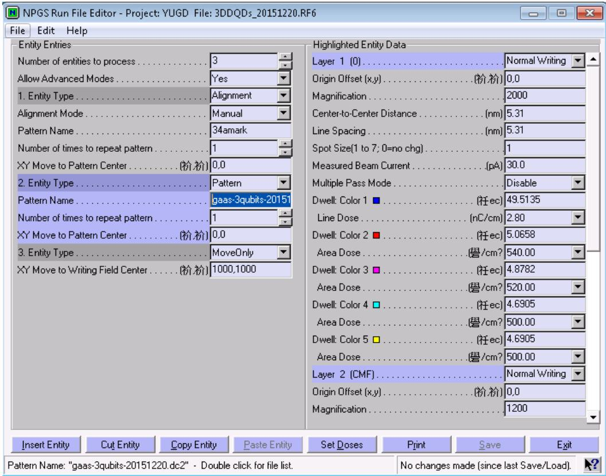  
图 2.6 NPGS控制程序运行文件参数设计示意图。

## 2. 电子束曝光刻蚀操作步骤

a. 切取合适大小(一般为1.2cm x 1.2cm)的完成之前步骤(含有表面大电极)的样品基片，清洗完成后甩上双层950 PMMA A2胶(具体步骤后续加工流程会详细介绍)。用小牙签蘸取少量颗粒大小为微米量级泡在异丙醇中的不规则镍粉溶剂，滴在待曝结构外围电路左上角和右下角的区域，异丙醇会迅速挥发后，留下的镍粉在PMMA 胶表面辅助我们进行电子束对焦。

b. 将样品使用导电的碳胶带粘在带有法拉第杯的样品底座上，放入SEM 系统，并将系统按照之前调节SEM 的方法将其调节到工作状态。

c. 将样品台调节到样品的镍粉处，调节电子束的聚焦和像散，并且将工作焦距调节到10mm 附近处，使之达到最佳的工作状态。

d. 将样品台调节到边缘不用的大表面电极处，依据边缘调节样品台的旋转使之与 SEM 的 X 与 Y 方向重合。然后退回到法拉第杯处读取 SEM 在曝光设定spot 下的电流值大小，并相应更改运行程序中电流值。

e. 分别测量出需要曝光样品左上角和右下角两处随机镍粉的焦距值(WD),这里需要将测量时的放大倍数至少调节到十万倍以上，记下观察时最清晰处两处值焦距值然后取平均值输入到 SEM 系统中，从而使得 SEM 在曝光出的焦平面与样品表面重合。

f. 以较小的倍数迅速将其移动到样品中心(一般不超过 400 倍)，保证电子束中心在所要刻蚀区域的中心附近，迅速点击NPGS 电脑上面的NPGS Manual 按钮，将SEM 的控制权交给NPGS 软件。

g. 选中之前准备好的运行文件，点击 Run Files 按钮，程序开始自动运行，首先运行项目1中的对准文件，我们通过手调节SEM上面的X和Y调节旋钮，使得金属电极的对准标记与我们所设计的对准窗口重合，保证了内部电极与外部电极的精确对准套刻，点击保存进行下一步正式曝光。

h. 程序会自动按照设计的顺序和曝光方向依次曝光，在此过程中应当保持周围环境的安静，尽量减小周围仪器的振动对 SEM 的影响。程序曝光完成后将执行项目 3 中移动设定，方面对进行下一块样品进行曝光。

i. 重复执行e-h 的步骤，逐步完成整片基片的曝光流程。

j. 当整片基片完成曝光后，关闭电子束，点击 Vent 按钮等待打开样品腔体，取出样品后同时将 SEM 样品腔抽上真空，使其进入待命状态。

3. 显影和定影，完成电子束曝光后对于使用950 PMMA A2 胶使用对应的显影液和定影液，整个电子束曝光刻蚀过程完成。

我们可以通过高倍数的光学显微镜观察曝光效果和显影效果，交替使用明暗光场确定曝光效果良好，虽然无法看清内部最细微的结构，但是可以通过光学显微镜来判断曝光的结构中是否有电极因为抖动而出现断裂的情形，也可以将曝光基片重新放入SEM中使用较低的电子束点压(一般使用10kV)进行直接测量检查 。

## 2.1.3 电子束蒸发镀膜机

比较常用的镀膜方式有电子束蒸发镀膜、磁控溅射镀膜和热蒸发镀膜这三种，我们所拥有的设备为两台电子束蒸发镀膜机和一台热蒸发镀膜机。电子束蒸发镀膜是利用较高能量的电子束在极高真空状态下去轰击金属靶材从而使其气化或升华，充满整个镀膜腔体，进而慢慢均匀沉积在样品表面。我们能够使用的金属靶材包括：金(Au)、铬(Cr)、钛(Ti)、镍(Ni)、锗金合金(GeAu)、铝(Al)等。在实际使用中，为了防止金属相互污染，磁性材料和非磁性材料不能使用同一台镀膜仪。图2.7 为我们所使用的型号为CHA MARK-40 的电子束蒸发镀膜机，图中1 为金属蒸发腔室，需要镀膜的样品被固定放置在内部可以旋转的大型圆盘上，镀膜过程中保持圆盘匀速旋转以保证膜厚的均匀性。2 为仪器的控制系统，包括控制计算机，真空计，转盘转速调节、镀膜隔板控制开关、镀膜金属的选择旋钮等等一系列参数的设定和控制调节。3 为电子束高压系统，此系统产生高压使得电子枪能发射高压电子，经过旋转的磁场轰击在靶材表面。整套系统还包括后面各种机械泵和冷泵的辅助仪器，以保持其真空腔室能够达到 ${ 1 0 } ^ { - 8 } \mathrm { t o r r }$ 的高真空状态。

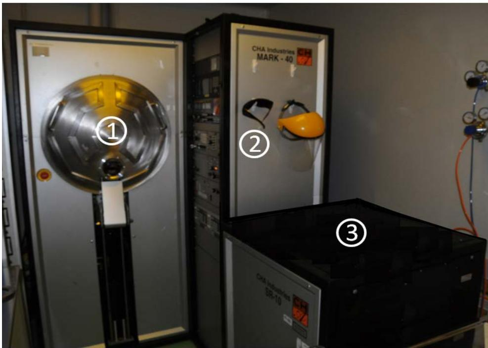

图 2.7 CHA MARK-40 电子束蒸发镀膜机。(1)金属蒸发腔室；(2)镀膜控制系统；(3)电子束高压系统。  
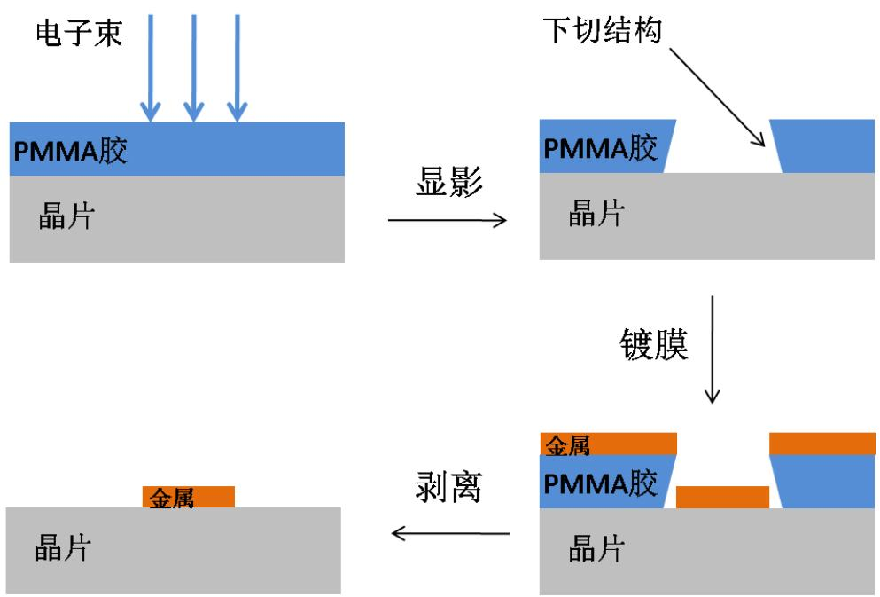

图 2.8 电子束曝光以及蒸发镀膜流程示意图。通过电子束曝光显影后形成下切结构，在使用电子束蒸发镀膜机镀上需要的金属，最后通过剥离实现图形的转移。

图2.8 展示了电子束曝光机曝光，显影，镀膜和剥离过程的示意图。首先由电子束曝光实现了在胶上曝光区域光刻胶的曝光处理，光刻胶对特定剂量的电子曝光后，其大分子链状结构被轰击成小分子链而被显影液所溶解，显影后形成了下切结构；然后通过蒸发镀膜，使得镀膜金属在样品表面均分的覆盖；最后通过使用特定的溶剂对样品上的 PMMA 胶进行溶解，也称剥离(lift-off)过程，留下被电子束曝光区域的金属。这样一整套的曝光(紫外光学曝光或电子束曝光一样)、显影、镀膜、剥离流程，就实现了对预定曝光区域的金属的蒸镀和对镀厚的准确控制，完成了我们预设图形结构在晶圆上的转移。

## 2.1.4 原子力显微镜

原子力显微镜(Atomic Force Microscope, AFM),是用来对纳米尺度样品结构进行测量和成像的仪器。它通过一个极细探针的悬臂来扫描样品表面，利用探针与样品表面原子之间力的作用使悬臂弯曲偏离，通过激光束反射记录下悬臂弯曲程度的情况从而对样品表面进行表征。原子力显微镜具有极高的垂直分辨率。

图2.9为我们实验室使用的原子力显微镜，我们一般用来标定所镀膜的厚度、表面刻蚀深度等用途。

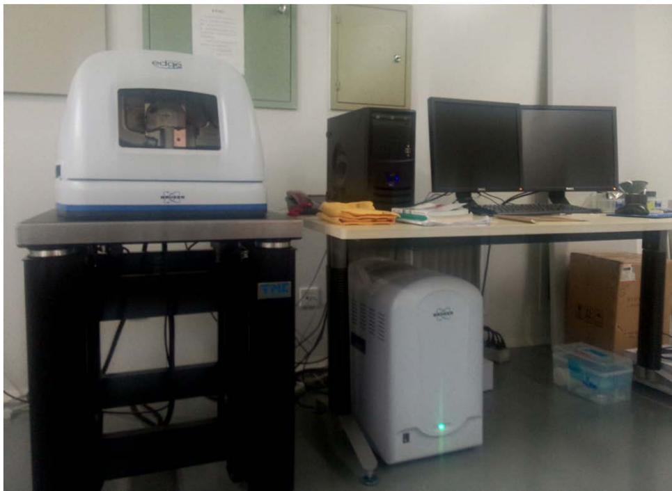  
图 2.9 原子力学显微镜。

## 2.1.5 其他常用仪器和设备

前面介绍了微纳加工中比较常用的大型仪器设备，除了这些大型设备之外，还需要一系列其它的相对小型的仪器，才能共同协作完成整个微纳加工流程。如图2.10 是我们样品加工过程中经常使用到的设备：

a. 匀胶机。主要用于将光刻胶均匀在晶片表面匀开，有两个可调节转速的设定按钮，可以实现先低速将光刻胶摊开后，再高速将胶匀至预期的厚度值。

b. 烤胶台。对匀开的光刻胶进行烘烤，能够恒定保持设定温度。

c. 超声清洗器。在制作样品过程中利用超声振荡对样品表面进行清洗。

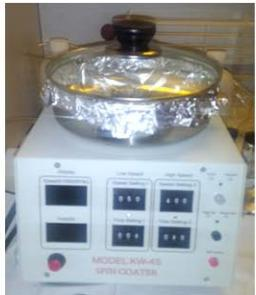  
a 匀胶机

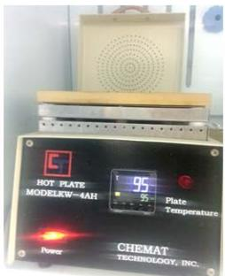  
b 烤胶台

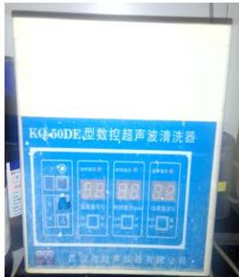  
c 超声清洗器

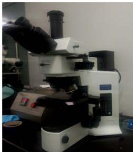  
d 光学显微镜

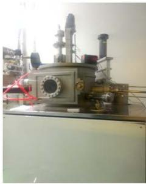  
e 快速退火炉

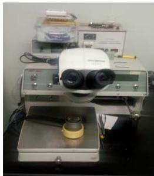  
f 焊线机

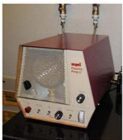  
g 等离子体清洗机

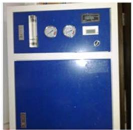  
h 去离子水机

  
i干燥储样柜  
图 2.10 微纳加工过程中使用的的仪器设备。

d. 光学显微镜。我们使用的是奥林巴斯型号为BX51M 的光学显微镜。主要功能为在样品加工过程中的情况进行光学目视检查，对出现问题的地方可以及时发现并重新来过。该显微镜的目镜是10倍镜，物镜有10、20、50和100

倍四个镜头，可以提供对不同视场的需求，同时顶部有接口可以安装数码相机以方便对样品拍照记录。

e. 快速退火炉。能够进行快速的升温、稳定和降温，使样品表面的金属能够渗透到内部的二维电子气层，形成良好的欧姆接触电流通道。

f. 焊线机。将样品外围的大金属电极与测量底座焊接连通，是纳米结构测量中常用到的设备。

g. 等离子体清洗机。利用仪器产生的等离子体清洗样品表面的残胶，以保证样品表面的干净。

h. 去离子水机。提供样品制作过程中需要的去离子水。

i. 干燥储样柜。用于样品制作过程中和制作完成后样品的存放，能够控制其内部的温度和湿度。

## 2.2 GaAs 量子点器件加工流程

本节中将主要针对本论文实验中所用到的GaAs量子点的微纳加工流程做详细的介绍，由于掺杂含有二维电子气的GaAs 样品比较珍贵，在实际的制作过程中应当首先使用测试基片多加练习，制作熟练并能够保证较高的成功率之后再进行样品的制作。

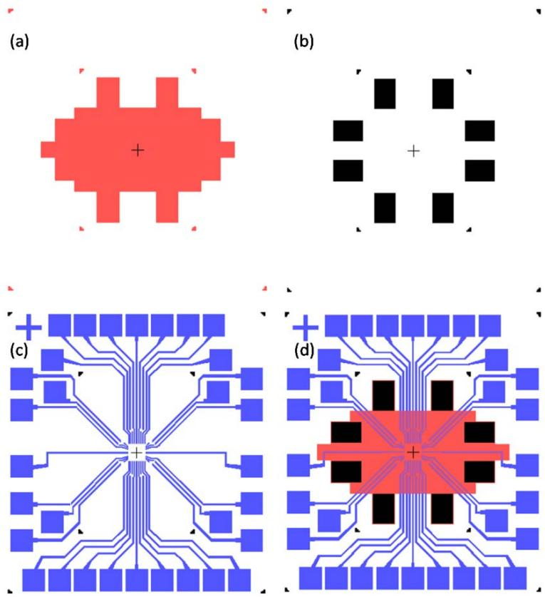

图 2.11 制备量子比特光刻掩膜板的设计图。(a)Mesa区域。(b)欧姆接触电极。(c)表面门电极外围区域。(d)整体效果图。

如图 2.11 所示，在样品加工之前应当设计好对应的光刻掩膜板，以方便前面外围电路的紫外光刻制作。图中(a)、(b)和(c)分别对应在制作过程中使用的Mesa 区域、欧姆电极区域(Ohmic Comtacts)和表面大电极区域(Surfacr Gates)的光刻设计图，(d)图为所有区域制作完成后的合并图像。完成了前期的表面大电极以及欧姆接触的制作，为后续的电子束曝光提供基础。图中有颜色的部分为光刻板的镀膜区域，条件允许也可以光刻掩模版的正版和反版都各制作一块，方面以后使用。

## 2.2.1 湿法刻蚀形成所需二维电子气区域

制作 Mesa 区域(如图 2.11(a))的目的是为了让制作的每个多量子比特形成的独立个体并将不同源漏电极分开。对于整片未使用的 GaAs 晶圆，其二维电子气区域处于表面下面约90nm 的区域，整个二维电子气层是相互联通的。因此，我们必须将无用区域的二维电子气刻蚀掉以便不同的源漏电极之间能够分割开来，从而各自独立工作。其具体加工步骤如下：

1. 切割基片。从一整块大的掺杂GaAs 基片上切出大约 1.2cm x 1.2cm 区域的小块基片。首先把一大块晶圆表面甩上一层保护的光刻胶，用于保护晶圆表面，烘烤干以后用金刚石刀切割上面所需的一小块，将其放入丙酮中浸泡除去表面的光刻胶。

2. 清洗基片。使用超声仪分别在三氯乙烯(TCE)、丙酮(ACE)、异丙醇(IPA)和去离子水(DI)中依次 40%功率的超声清洗 1min，用于除去晶圆表面的油渍和残胶，最后用高纯氮气将晶圆表面吹干。

3. 紫外光刻出湿法刻蚀区域。在洗干净的晶圆表面甩上 AZ5214E 光刻胶，具体转速为 500rmp 甩 5s 和 4000rmp 甩 40s，紧接着用 95 摄氏度烘烤 90s。选取图2.11(a)的 Mesa 区域的光刻板，由于我们需要保留此区域的光刻胶，因此我们使用正胶的方法曝光12s 即可。显影液我们使用比例AZ400K：DI=1:6 的显影液显影 90s，最后将显影的晶圆放入去离子水中冲洗 25s，取出用高纯氮气吹干即完成。最后可以在光学显微镜下检查制作的区域边缘是否平整、整齐，样品曝光正确就可进入下一步操作。

4. 湿法刻蚀。我们所使用的刻蚀液为浓 $\mathrm { H } _ { 2 } \mathrm { S O } _ { 4 }$ $\mathrm { H } _ { 2 } \mathrm { O } _ { 2 }$ ：DI=1:25:150 的比例配出来，其对于GaAs 的刻蚀速率大约为 10nm/s。这里我们设定的刻蚀时间为20s，对应的刻蚀深度为200nm，保证我们将不需要的二维电子气层完全刻蚀掉，刻蚀完成后使用去离子水清洗25s，取出后用高纯氮气吹干，最后放入丙酮中溶解掉保护的光刻胶，使用 DI 冲洗干净后在光学显微镜下可以看到刻蚀区域有明显的边界，确认刻蚀干净后就继续下一步样品的制作。

## 2.2.2 制作欧姆接触

制作欧姆接触(如图 2.11(b))的目的是将二维电子气与表面的电极相连通,由于二维电子气处在基片表面下90nm 处，如果不做欧姆接触我们就无法测量到其流经量子点的电流信号。其具体的制作流程如下：

1. 清洗基片。同前面的清洗步骤相同，使用40%功率的超声仪分别在三氯乙烯、丙酮、异丙醇和去离子水中依次超声清洗1min，用高纯氮气将晶圆表面吹干。

2. 光刻曝光出欧姆接触窗口。同样使用AZ5214E光刻胶，甩好胶后，由于此时我们需要图 2.11(b)中区域的胶被显影掉，因此我们采用反胶工艺。即先带光刻板曝光 6s，再 95 摄氏度烘烤 120s，再不使用光刻板曝光 60s，最后在同样的显影液中显影 60s，去离子水中清洗 25s，取出样品用高纯氮气吹干即可。在此步骤中需要注意的是第一次曝光过程中需要将(b)图的 8 个对准窗口同先前在制作 mesa 过程中的 8 个对准窗口完全调节重合。最后可以在光学显微镜下检查曝光情况。如果效果良好就可以进行下一步。

3. 电子束蒸发镀膜。我们制作欧姆接触的金属，使用的是镍(Ni)和锗金合金(GeAu)的混合物。经研究发现这三种金属按一定比例搭配，在375摄氏度以上的熔融状态对 GaAs 半导体有很好的渗透效果，能够形成良好的欧姆接触。我们镀膜的金属比例和镀膜速率分别为：100Å Ni(1Å/s)、1500Å GeAu(2Å/s)和 200ÅNi(2Å/s)。镀膜完成后将其放入丙酮中浸泡5-10min，再使用小的胶头滴管进行冲刷，由于总共的镀膜厚度为180nm 而光刻胶膜厚约为1.4um，很容易剥离。也可以放入超声中稍加超声清洗以便剥离更加彻底。最后建议放入到RemoverPG 中浸泡 10-12h，其作用是将其表面的残胶完全溶解掉，防止后续有残胶留在中心表面，影响小电极的粘附性。

4. 欧姆接触退火。将浸泡过的基片采用同样的方法依次在三氯乙烯、丙酮、异丙醇和去离子水中依次超声清洗 1min，用高纯氮气将晶圆表面吹干。将其放入到快速退火炉中，先抽走腔内的空气，放入 15%氢气的氮氢混合气，迅速将退火炉的温度在两分钟内升到 430 摄氏度，维持其温度 150s 后，将样品通过退火炉内的样品移动杆移动到旁边的水冷平台以实现迅速降温。待整个系统冷

却后将样品取出，欧姆接触制作完成。

一般正常情况下 GaAs 在室温下源漏电极两端的电阻小于10kΩ，不同样品之间的欧姆电阻在MΩ级别。在 4.2K 条件下电阻值小于3kΩ，而不同样品之间的欧姆接触是不导通的。

## 2.2.3 制作表面大电极

欧姆接触完成相当于把量子点的源漏电极导通，这里我们需要制作的是量子点样品的表面门电极。对于门电极的制作我们分成两步，分别使用紫外光刻先做出量子点外围的门电极的大电极部分，再用电子束刻蚀，将门电极延伸到基片中心，形成量子点结构。这种大电极部分也方便我们使用焊线机将其引出到外部电路方便我们测量。其制作流程与制作欧姆接触类似，具体如下：

1. 清洗基片。使用 40%功率的超声仪分别在三氯乙烯、丙酮、异丙醇和去离子水中依次超声清洗 1min，用高纯氮气将晶圆表面吹干。

2. 光刻曝光出表面电极结构。同样使用AZ5214E光刻胶，甩好胶后，参考图2.11(c)中区域的胶被显影掉，因此采用反胶工艺。即先带光刻板曝光6s，再95摄氏度烘烤 120s，再不使用光刻板曝光 60s，最后在同样的显影液中显影 60s，去离子水中清洗 25s，取出样品用高纯氮气吹干即可。曝光过程中同样需要将结构对准，方法与制作欧姆接触相同。最后可以在光学显微镜下检查曝光情况。效果良好就可以进行下一步。

3. 电子束蒸发镀膜。这里需要镀膜的金属与之前的欧姆接触不同，我们选用钛(Ti)和金(Au),膜厚和镀膜速率分别为 100Å Ti(1Å/s)和 1000Å Au(2Å/s)。

4. 金属剥离。镀膜完成后取出放在丙酮中浸泡 10-20min，使用胶头滴管挤压丙酮冲刷，也可以稍微使用40%功率的超声波振动10s左右，保证其全部剥离掉。最后使用 IPA 清洗后使用高纯氮气吹干即可。如果需要继续制作电子束曝光，则可以直接进行下一步操作；是要等待一段时间之后再进行后续制作，我将会在其表面甩上光刻胶，烤干以保护起来存放于样品柜中，避免基片表面被划伤。

## 2.2.4 制作纳米级门电极

我们将使用 SEM 配合 NPGS 软件，完成在之前已经做好的欧姆接触和表面大电极的基片基础上的纳米级门电极的制作，最后通过使用电子束蒸发镀膜和金属剥离完成量子点的整个制作。其具体工艺如下：

1. 浸泡除胶。将做好表面大电极的基片由于上面有光刻胶保护，应当先将其放入丙酮中浸泡 10-15min，取出后放入到 90 摄氏度的 Remover PG 溶液中浸泡12-15h。浸泡的目的是将其表面的残胶清除干净，防止最后的小的量子电极在剥离后发生脱落而是样品作废。

2. 基片清洗。将基片从Remover PG溶液冲取出，分别使用超声仪在三氯乙烯、丙酮、异丙醇和去离子水中依次超声清洗1min，用高纯氮气将晶圆表面吹干。

3. 甩胶并点镍粉。使用型号 950 PMMA A2 胶进行甩胶，甩胶转速为 4000rmp。烘烤温度为 180 摄氏度，时间为 5min。紧接着进行第二次甩胶，参数与第一次相同，唯一区别在于烘烤时间为 10min。双层 A2 胶已经甩好。使用牙签把浸泡在 IPA的小镍粉颗粒轻轻地点在每块制作样品的左上角和右下角。方便后续的EBL确定焦距。

4. 电子束曝光。参照在前面介绍的电子束曝光步骤，参数如图2.6所示，曝光过程中，线剂量为 $2 . 8 \mathrm { n C } / \mathrm { c m } ^ { 2 }$ ，面积剂量由内到外本别为 540、520、500、500uC/cm2。完成后显影液使用 MIBK:IPA=1:3显影时间为 45s，在放入 IPA中冲洗25s，取出使用高纯氮气吹干。在光镜下观察可以看到清晰的曝光图形，检查是否有缺陷，若大部分都完好则可以进行镀膜。

5. 电子束蒸发镀膜。与制作表面大电极使用的金属相同，镀膜的膜厚和速率分别为 50Å Ti(1Å/s)和 450Å Au(1Å/s)。根据我们制作的经验总厚度为 50nm 的膜厚既方便后面的金属剥离，也不会发生与外面大电极断裂，是一个很理想的镀膜厚度。

6. 金属剥离。由于此处的结构尺寸极小，相比较之前的剥离就没有那么容易。我一般将镀膜好的样品放入到 Remover PG溶液中90摄氏度加热12h，然后使用胶头滴管反复吸挤冲刷，使剥离金属脱落。此时大部分应当已经剥离。如果还有一部分没有剥离，可以继续使用Remover PG溶液中90摄氏度浸泡3-5h，最后使用丙酮冲洗，基本能保证绝大部分样品完成剥离。最后将其用 IPA冲洗干净后，用高纯氮气吹干。此处不建议使用超声仪短时间超声辅助剥离，应为结构过于细小，及其容易使得内部细小电极被超声振断。

7. 甩保护胶并切开保存。使用光刻胶在基片表面甩上一层保护胶，此时可以使用 2500rmp 转速使保护胶稍后点。95 摄氏度 90s 烘烤干后就可以使用金刚石切割刀将基片上每小块样品切开，将其放入样品盒中并写上标签以备用。

(a)  
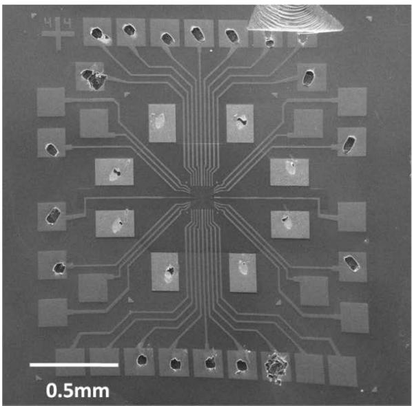

(b)  
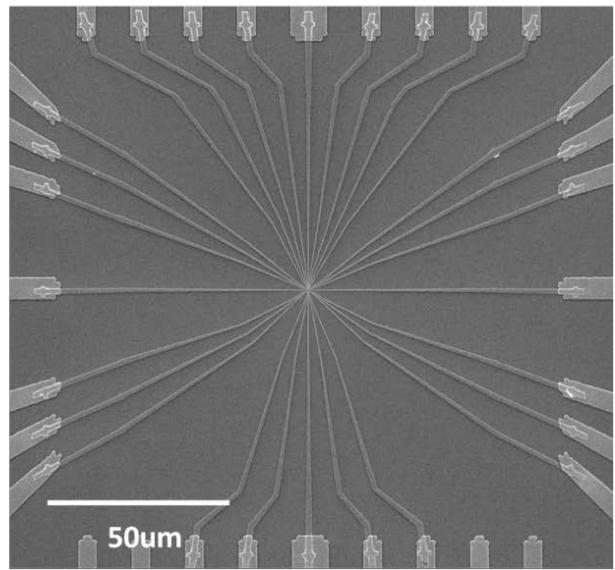  
图 2.12 使用扫描电镜拍摄的样品结构图。(a)测量过的样品图像。(b)内部使用电子束曝光的小结构。

如图2.12，其中(a)图为制作后的整体样品图，样品表面的电极上面的空洞为我们测量时使用焊线机进行焊线后的效果，(b)图为使用 SEM 观察放大后的内部EBL 制作效果。至此整个微纳加工的流程已经完成。想要制备得到稳定的样品就需要不断的重复练习，熟悉微纳加工仪器性能，注意制作过程中的细节，制作过程中的每一步失误都可能会对整个样品带来损害，只有熟练掌握了整套操作流程才能为后续的研究工作带来便捷。

## 2.3 低温测量平台

由于我们需要测量电子的量子效应，对于所测量的样品中电子的热涨落必须要低于其表现出的量子效应，这就导致了我们所有的实现都必须在极低温下进行。我们现在所拥有的低温测量平台包括两台He3 制冷机，四台Triton 400 型稀释制冷机和一台Top loading稀释制冷机。其中He3制冷机能够达到的温度为240mK附近，配有最大可到8T的磁体。Top loading式为He3/He4稀释制冷机最低温度够达到 10mK附近并配有可达16T的磁体。Triton系统为我们从牛津公司购买的无液式 He3/He4 稀释制冷机，这种干式稀释制冷机通过压缩制冷机和内部循环制冷维持整个系统能够长时间处在 20mK 附近极低温条件，不需要像 Top loading稀释制冷机那样需要加液氮和液氦维持外部低温环境，并且具有内部空间大，维护方便等优点。对于这些系统的具体工作原理和使用方法，可以在牛津公司的网页上找到设备的介绍。图2.13为Triton系统内部结构的图片。

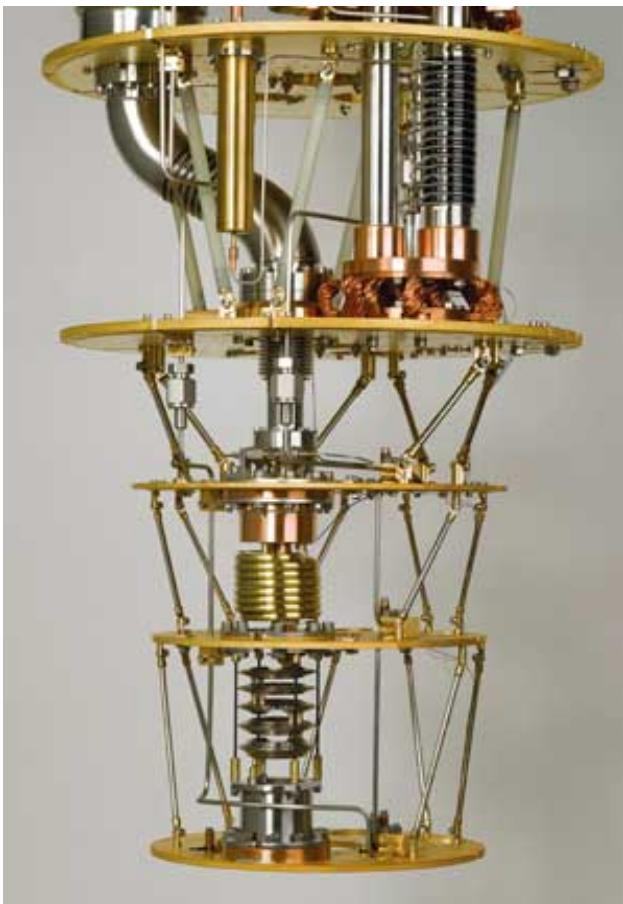  
图 2.13 Triton 系统内部结构图。

这里我主要简单介绍我们对于我们 Triton 系统的改装工作，其目的是为了满足我们对多电极的样品测量的需求。测量线包括常规的屏蔽门电压导线和高频脉冲线。对于高频线部分，由于Triton系统为订制，我们通过订购标准的高频线由牛津公司在工厂内安装完成，我们在使用前应当对其衰减和匹配程度进行测量以备后续使用，故这里不对高频线部分进行介绍，主要对测量导线的添加进行介绍。由于本论文中研究的对象为双电荷量子比特和三电荷量子比特，其分别对应的总共电极数分别为24个和 28个(参考图4.2和5.3)，而且为了提高我们筛选样品的速率，我们需对购买来的 Triton系统进行大量的增加测量导线的改装工作并且要保证其能够达到的最低温度不能有较大的升高。

(a)  
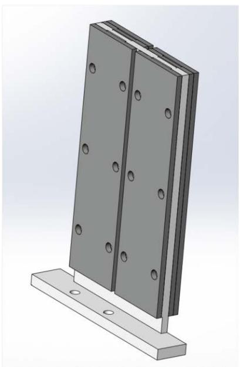

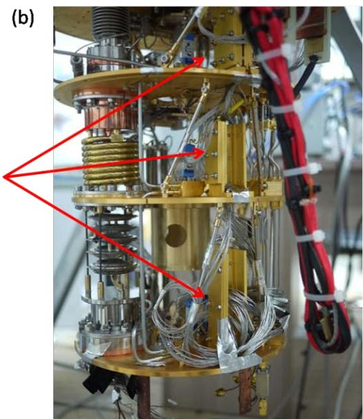  
图 2.14 (a)设计的多层线夹式热沉。(b)在Triton系统上安装后的效果图。

我们测量所使用的测量导线为型号 Lakeshore SS1 自带不锈钢屏蔽层导线，这种导线相对普通的导线的有点为具有良好的屏蔽性，具有良好的阻断线路之间电容串扰，能够极大的减小噪声对我们微小信号的测量影响。但是其缺点是由于导线较粗，达到了 0.55mm，导热率较高。为了能够将导线通到我们最底的样品测量层并且对整个系统不会有较大影响，如图 2.14 为我们为系统特意设计自制的三层夹线式热沉(heat anchor)，如图 2.14(a)所示。我们使用的 Triton 系统有 PT1、PT2、Still、100mK 和 Mixing Chamber(MC)这五层结构,通过对每一层空间进行测量，分别根据每一层特定的情况制作的热沉，其高度取决于每层所对应的高度限制。每一个线夹式热沉有左右两条通道，每个通道设计槽深为0.5mm，略小于所夹导线的直径，通过上下来回三趟的夹片式设计方案来延长导线在每一层进行热交换的长度，采用螺丝固定使得导线与每一层的线夹进行充分的热交换已达到对导线的充分冷却。每一个通道设计可以夹线 18根，一整块热沉就可以达到36根导线的设计方案，对于我们后续的多电荷量子比特的提供了足够的门电压导线并且有多余导线以备用。对制作热沉的材料我们使用导热良好的紫铜整体切除加工而成，并且在其外表面以及夹板全部镀金以提升其导热性能。最后我们在每台Triton系统上安装四套这种线夹式热沉，实际验证结果表明对整个系统的最低温度影响提升小于5mK，达到我们设计的要求，使我们充分的利用了 Triton 系统，提高了系统的使用效率。图2.14(b)为实际拍摄安装在 Triton系统上的线夹式热沉图片，图中自上而下分别对应 still 层、100mK 层和 MC 层。安装测试后系统最低温度能够到达 30mK以下。

为了减小门电极直流电压输出中高频噪声对于样品性质的影响，我们除了在系统最外面的真空密封 BNC 头上添加上直流低通滤波器之外，还在自己设计的PCB板上焊接板载贴片式滤波器。其的作用为：1通过其上面的滤波器作为保护电路。样品由银胶固定在下面的紫铜底座上，利用焊线机将其与 PCB 板焊接在一起，通过两侧的插针式电极与外面的测量线路相连接。在样品安装、冷却或者测量的过程中，少数情况下会遇到有轻微的脉冲放电或者人为失误的电压较大变化，这样的情况下很容易将样品上的电极击毁，通过多层滤波器的衰减作用能够有效的降低这种脉冲放电对样品永久性的损伤。2、我们焊接的 DC-300MHz 低通 RC 贴片滤波器和 DC-1GHz 的铁氧体磁珠低通滤波器来有效的覆盖 1G 一下的噪音影响，对于测量时我们使用锁相放大器 SR830 的测量结果后很较好的改善效果，能够将量子点源漏信号背景噪声抖动能够很好的控制在 pA 量级以下，良好的提升了信号的对比度。

## 2.4 掺杂 GaAs 基片的判断

通过MBE生长的掺杂GaAs/AlGaAs半导体基片是我们一切后续量子点样品制作的基础，因此，在使用生长的砷化镓异质结制作量子点样品之前需要对这种生长的砷化镓异质结的电子密度和电子迁移率进行测量，其材料的基本性质会对我们后续制备的样品有着决定性的影响。我们通过制作如图 2.15(a)所示的带表面栅极门电极(电极7)的 Hall Bar来测量GaAs 基本的量子霍尔效应。在源漏电极 2和 5 之间通上恒定电流， $\mathtt { R } _ { \mathtt { X X } }$ 为电极 3 到 4 或者电极 1 到 6 的电势差与电流的比值， $\mathrm { R } _ { \mathrm { x y } }$ 为电极 1 到 3 或电极 4 到 6 之间的电势差与电流比值，通过调节垂直于样品磁场强度 B 的变化，就可以测量到量子霍尔效应的图像。如图 2.15(b)为我们在测量到的量子霍尔效应图。在此基础上我们可以计算得出砷化镓异质结的电子密度和电子迁移率，而表面栅极门电极还可以可以为我们提供不同门电压的影响下样品中电子迁移率变化和稳定性测量。

(a)  
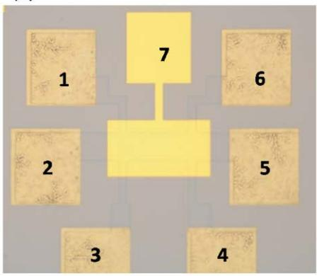

(b)  
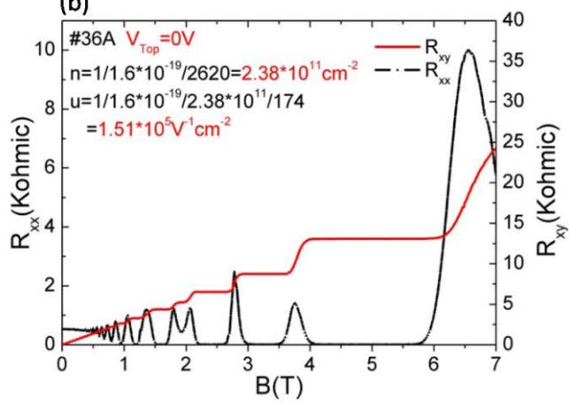  
图 2.15 (a)Hall Bar 样品结构图。(b)测量的量子霍尔效应图。

对于我们使用的掺杂砷化镓结构样品，我们掺杂的施主杂质能够激发的电子不多，我们又需要较高的电子密度，这就使得我们需要增加掺杂量。但是掺杂过高就会使得电子的平均迁移率因为杂质的增加而导致散射的增加，使得电子迁移率降低。因此既要较高的电子密度，又要尽可能高的电子迁移率是相互矛盾的。所以我们尽可能的去提高杂质被激发的比例，在同样的电子密度下，得到更高的电子迁移率的基片就有利于制备出更好的量子点器件。

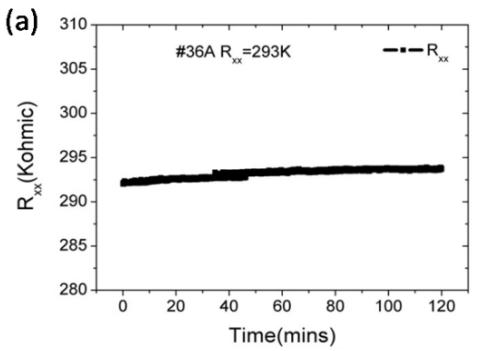

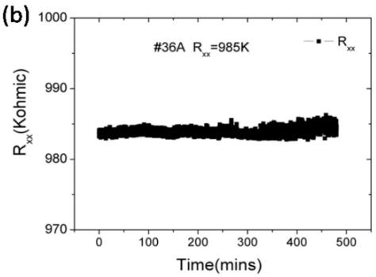

(c)  
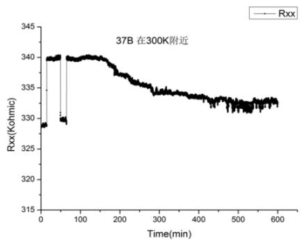  
图 2.16 样品Hall Bar结构在高阻值下稳定性测量。(a)编号36A样品在300K欧姆附近

稳定性。(b)编号36A样品在 1M欧姆附近稳定性。(c)编号37B样品在 300K欧姆附近稳定性。

图2.15(b)展示了我们所使用的编号为36A的掺杂砷化镓异质结在240mK温度下测量到的量子霍尔效应，可以计算得到其电子密度 $n = 2 . 3 8 \times 1 0 ^ { 1 1 } / \mathrm { c m } ^ { 2 }$ 以及电子迁移率 $\mu { = } 1 . 5 1 { \times } 1 0 ^ { 5 } \mathrm { V } ^ { - 1 } \mathrm { c m } ^ { 2 }$ 。想要确定该晶圆是否稳定，我们有两种判断的手段。第一种为我们测量Hall Bar 在高阻值下的稳定性。通过在顶端电极上施加负电压，利用电场排挤出下面的二维电子气中的电子，提高源漏电极之间的欧姆阻值来测量其稳定性，这里我们分别测量通过二维电子气的源漏电极之间阻值在300K 欧姆和 1M 欧姆附近长时间的稳定性来判断样品的稳定情况，首先利用串联一个较大电阻，如10M 欧姆，调节输出的电压来使得输出电流为 10nA 附近，再通过在顶端施加负电压排挤下面的二维电子气，分别测量的Hall Bar 两端在零磁场下的电势差以及流经的电流，计算选取出阻值分别处于 300K 欧姆和 1M 欧姆附近的位置，然后经过长时间的采集数据测量等待，画图观测阻值是否一直稳定，这是一个判断样品稳定性的方法。如图 2.16(a)-(b)所示，我们可以看到编号为36A的Hall Bar结构在高阻值293K欧姆和985K欧姆的情况下依然保持很稳定的状态，对比另外一块编号为37B晶圆(如图2.16(c))的Hall Bar 结构可以看到在300K 欧姆附近长时间等待中出现了阻值缓慢变小的衰减过程并且有跳变抖动的情况，说明它相对于编号 36A 的晶圆则不那么理想，稳定性较差。第二种方法为

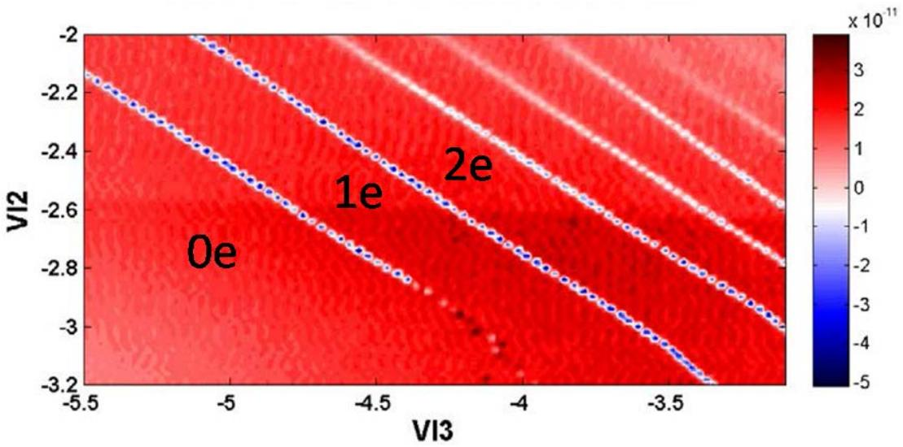  
图 2.17 编号 36A晶圆制备的单量子点样品稳定性测量。

制备量子点的方法。通过制备最基础的单量子点结构，如图1.3 所示，使用1.3.3中量子点接触的测量方法来测量量子点的性质以及长时间重复扫描判断样品稳定性，图 2.17 为使用编号 36A 的晶圆制备的单量子点样品在240mK附近测量到的相图，经过两天多测重复测量，该量子点一直稳定在该区域并没有发生漂移，这也说明该晶圆稳定性好，符合我们下一步制备多量子比特的要求。最后我们是通过综合两种判断方法的结果来综合判断晶圆是否符合制作我们需要的量子比特样品的需求。

## 2.5 本章小结

本章针对制作 GaAs/AlGaAs 半导体量子点的制作需要，分别介绍微纳加工过程中使用的仪器设备，微纳加工工艺流程以及低温下测量平台的介绍和改造。其中较重点的对紫外光刻机、电子束刻蚀机和电子束蒸发镀膜机进行了性能和使用的介绍。在样品制备的工艺流程中，详细描写了基片从最初的晶圆到最后制作成为量子点结构样品的每一个步骤和操作技巧。简单介绍了我们使用的低温测量平台以及我们对平台的改造以适应我们测量的需求。最后介绍了对最重要的砷化镓基片的基本性质测量和筛选的方法。本章重点在于样品的制作，它是为后续进行实验测量的基础，而丰富的样品制作经验需要长时间的练习和细心的留意制作过程中的每一个细节，通过不断地积累和尝试才能够提升样品制作的成功率。

## 第 3 章 由双量子点构成的单电荷量子比特

对于量子比特的定义，在第一章中就有简单的介绍，量子比特简称 qubit，任意的二能级系统都可以编码成一个量子比特。对于多能级体系，只要其有耦合的两个能级，如基态和激发态之间有耦合，同样也可以编码成一个量子比特。在光学系统中最容易理解的就是光的水平偏振和垂直偏振来编码；在超导体系中，超导量子电荷比特可以通过判断是否有库珀对的电流来进行编码，超导磁通量子比特通过电流方向来进行量子编码，超导相位量子比特通过其能量处于基态还是激发态来进行量子编码。当然还有许多体系同样可以用来进行量子编码。对于我们所使用的半导体量子体系，我们同样有不同的编码方式，例如单个量子点中可以使用磁场使得电子的自旋发生劈裂，利用电子的自旋向上和自旋向下来进行量子比特的编码，在双量子点中可以利用电荷的位置进行量子编码，通过判断电子是处于左边量子点还是右边量子点这两种不同的位置进行量子编码；还可以使用双点中的S-T态进行量子编码。对于以上的不同编码方式都有着相关的研究方式[1-8,13-16]。

在本章中，我将介绍利用双量子点进行编码的单电荷量子比特的基本性质以及目前对于电荷量子比特的基本操控方法，主要包括光子辅助隧穿(PhotonAssisted Tunneling, PAT),利用脉冲波形观测电荷量子比特的拉莫振荡(LarmorOscillation)以及 Laudau-Zener-Stuckelberg(LZS)效应，最后介绍使用微波驱动的拉比振荡(Rabi Oscillation)，以及 Ramsey 操作，使我们对于单个量子比特操作有全面的认识，为后续的多个电荷量子比特操作提供基础。

## 3.1 双量子点的图像

对于一般的双量子点系统，其结构类似于如图 3.1(a)所示，两个量子点组成一个电荷量子比特，通过电荷处于左边量子点 L 或者右边量子点 R 两只两种不同的状态来进行量子编码。其中门电极 A1 和 B1 用来共同控制两个量子点之间的耦合2t，门电极A2和B2同A1用来控制每个量子点中电子与外界的隧穿率Γ，门电极 A3 和 B3 用来调节每个量子点内部的电子数目，门电极 A4 和 B4 分别于门电极 A2 和 B2 形成 QPC 探测通道，利用 QPC 的电流信号来探测量子点中的电子的状态。在电极A3上我们有高频线通过biastee 叠加在上面，可以施加高频驱动信号。图3.1(b)为在类似结构样品的双量子点，采用QPC的modulation 方法测

b

量得到的双量子点图像，该图像即为双量子点蜂窝图相图(honeycomb diagram)。

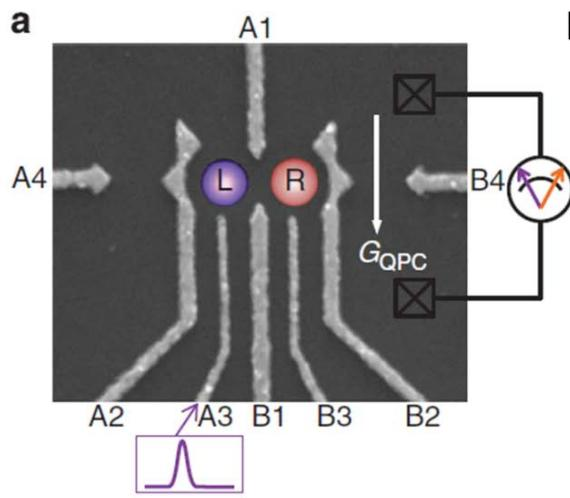

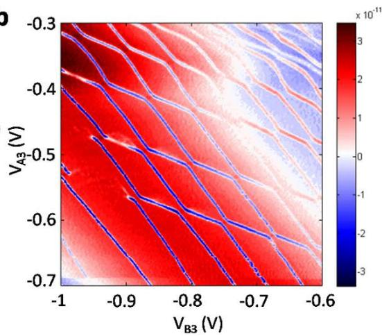  
图 3.1 (a)扫描电镜下双量子点样品结构图。图片引自文献[9](b)测量的双量子点样品蜂窝图。

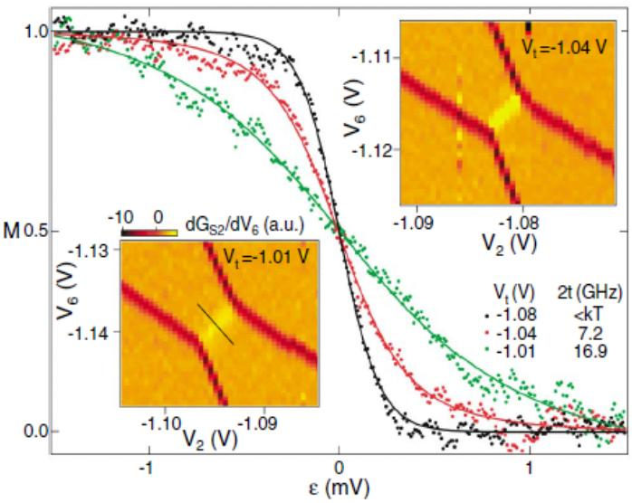  
图 3.2 双量子点中电子在平衡点附近的占据状态变化。图片引自文献[10]

我们将双量子点中的电子数排挤到只有最后一个的情况时，我们规定电子在左边量子点为|L>态，右边为|R>态，沿着如图3.2 所示的黑线进行扫描，相当于电子由|L>态逐渐向|R>态进行跃迁，对数据进行归一化处理就可以得到电子处在|L>态的概率随着失谐电压的变化图像，其概率的分布可以使用下面的公式来描述[10,11]:

$$
\mathbf { M } { = } \frac { 1 } { 2 } \left[ 1 { - } \frac { \varepsilon } { \sqrt { \varepsilon ^ { 2 } { + } 4 \mathbf { t } ^ { 2 } } } \operatorname { t a n h } \left( \frac { \sqrt { \varepsilon ^ { 2 } { + } 4 \mathbf { t } ^ { 2 } } } { 2 \mathbf { k } _ { \mathrm { B } } \mathrm { T } _ { \mathrm { e } } } \right) \right]\tag{3-1}
$$

利用公式3-1 对上面测量的结果进行拟合，就可以得到在不同的门电压下两个量子点之间的耦合能量 2t 的大小。可以看到随着两个量子点中间门电极的调节，两个量子点之间的耦合能量的大小可以大范围的调节。

## 3.2 双量子点的光子辅助隧穿

在双量子点中，所有允许的隧穿过程对应于蜂窝图中的边界情况，其余位置形式的隧穿由于能量的禁戒而不会发生，当我们给系统加入一个微波驱动之，就会给量子点中的电子额外的能量，使得本来不会发生的隧穿过程得以实现，这就是光子辅助隧穿过程(PAT)。

(a)  
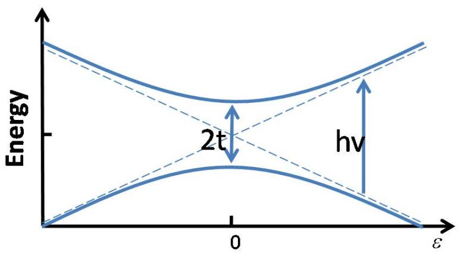  
(b)

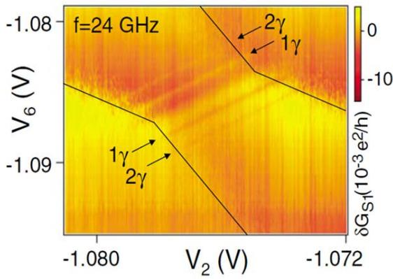

(c)  
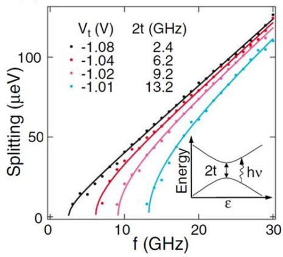  
图 3.3 (a)二能级体系对应的能量与能级失谐关系图。(b)连续微波驱动下的单个和两个光子辅助隧穿图像。(c)不同微波频率与一阶峰偏离位置关系图。图片引自文献[9]

我们可以对光子辅助隧穿进行如下物理描述，由双量子点的哈密顿量 H 可

以写成如下形式：

$$
H = \frac { 1 } { 2 } \varepsilon \sigma _ { { \scriptscriptstyle z } } + \Delta \sigma _ { { \scriptscriptstyle x } }\tag{3-2}
$$

其中 $\sigma _ { x } , \sigma _ { z }$ 泡利(Pauli)矩阵，画出其能级结构图为3.3(a)所 ${ \overline { { \overline { { \mathbf { \Gamma } } } } } } ,$ 当系统吸收一个能量大于其隧穿耦合能的光子能量时，就会发生跃迁 ，其表达式为：

$$
\alpha \varepsilon = \sqrt { ( h f ) ^ { 2 } - ( 2 t ) ^ { 2 } }\tag{3-3}
$$

其中 $\alpha$ 是电压到能量转换系数。在实验测量中就会得到的如图3.3(b)所示，当有多个光子同时被吸收时就会出现二阶甚至高阶情况，对于多阶吸收情况可以参考文献[14]。 当我们调节不同的输入的微波频率时，可以测量到不同的一阶峰的位置，再根据公式3-3 的拟合就可以得到不同门电压条件下的双量子点之间隧穿耦合能量2t 大小以及α值的大小。如图3.3(c)所示，我们可以看到当中间门电极电压为-1.01V时，拟合得到的2t能量为13.2GHz，而当我们加大门电极电压到-1.08V时，得到的2t 降到了 2.4GHz。

## 3.3 双量子点的脉冲拉莫振荡

双量子点的拉莫震荡为理想方波脉冲驱动下对于双量子点系统的演化过程。我们调节双量子点系统简并点附近位置，首先在不施加脉冲下量子点由于远离平衡点，此时电子几乎处于绝对的|L>态或者|R>态，当我们瞬间加上一个矩形脉冲，并且其幅度刚好使得电子到达平衡点处，此时电子相当于在布洛赫球面上绕x 轴旋转-90度，处于xy平面，然后我们进行脉冲宽度为 $\mathbf { t _ { \mathrm { p } } }$ 的等待过程，相当于在时间 $\mathbf { t _ { \mathrm { p } } }$ 内使其自由演化，电子状态在这段时间内会绕着 z 轴在 xy 平面内进行自由演化，其演化角度为 $\phi$ ，然后我们撤掉脉冲，即是绕 $\mathbf { X }$ 轴再做 90 度旋转，然乎对其处于|L>态或者|R>态进行测量。此过程为理想脉冲下的演化过程。分别对应如图3-4中a，b，c所示。此脉冲驱动的振荡也被称作拉莫振荡(Larmor Oscillation)

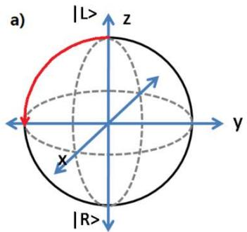

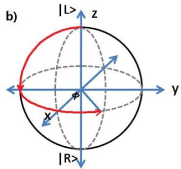

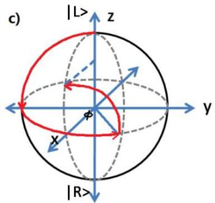  
图 3.4 在布洛赫球面演示二能级体系随脉冲变化。(a)脉冲使得从远离平衡点到刚好到

平衡点处。相当于转到 xy平面。(b)脉冲的宽度使得量子状态在xy平面自由演化。(c)脉冲高度下降到0相当于绕x轴旋转 $9 0 ^ { \circ }$ ，最后通过QPC测量处于|L>态和|R>态的几率。

当我们等待的时间 $\mathbf { t _ { \mathrm { p } } }$ 内，当其在 xy 平面的演化角度刚好为 $\phi = ( 2 n + 1 ) \pi$ 时，我们可以发现其最终的结果是量子点由|R>态转变到|L>态，当演化角度 $\phi = 2 n \pi$ 时，其最终的状态保持不变。由此我们可以得到其状态将在|L>态和|R>态之间翻转，其翻转的速率正好等于 $2 \Delta / h$ 。图 3.5 中 a 图与 b 图分别展示了测量到的拉莫振荡和数据模拟。

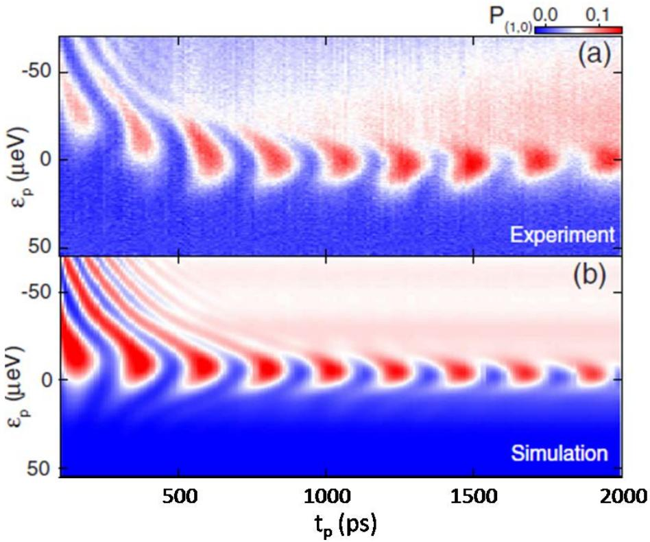  
图 3.5 (a)实验测量到的拉莫振荡图像。(b)理论模拟拉莫振荡过程。图片引自文献[10]

## 3.4 双量子点的 LZS 效应

双量子点中 LZS 效应在能级交叉处与光学系统中的分束器十分类似，同样可以用来作为量子比特的操控。在实际的过程中，脉冲不可能是理想的情况，其都有一定的上升速率，当我们所施加的脉冲幅度穿过能级简并点时，量子态穿过交叉能级的时候就会劈裂分成两个不同的路径，产生一个和脉冲上升速率有关的非绝热演化几率 $\mathrm { P _ { L Z ^ { \circ } } }$ 。这就是 Laudau-Zener 几率。对于脉冲有上升沿和下降沿，即是在一个完整的演化周期过程中，有两次经过交叉点。其在布洛赫球上的演化过程如图3.6所示，其最后得到的输出态为：

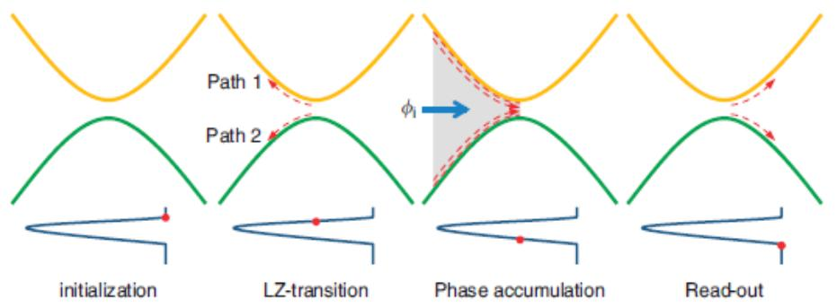  
R (θ,φ)

$$
\begin{array} { r l } & { \big | \Psi _ { o u t } \big \rangle = R _ { z } ( - \phi _ { L Z } ) R _ { x } ( \theta _ { L Z } ) R _ { z } ( - \phi _ { L Z } ) R _ { z } ( \phi _ { i } ) R _ { z } ( - \phi _ { L Z } ) R _ { x } ( \theta _ { L Z } ) R _ { z } ( - \phi _ { L Z } ) \big | \Psi _ { i n } \big \rangle } \\ & { \qquad = R ( \theta , \phi ) \big | \Psi _ { i n } \big \rangle } \end{array}\tag{3-4}
$$

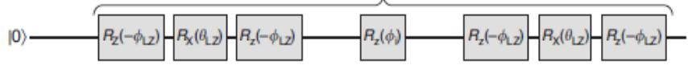

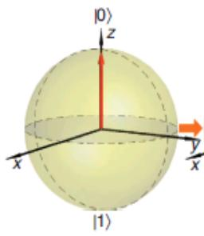

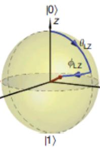

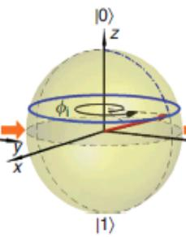

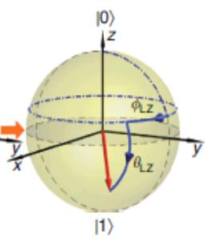  
图 3.6 在布洛赫球面上演示LZS 四步演化过程。图片引自文献[9]

我们在定义单个电荷量子比特旋转的操作如下：

$$
R _ { x } ( \theta ) = \left( \begin{array} { c c } { { \cos \displaystyle \frac { \theta } { 2 } } } & { { i \sin \displaystyle \frac { \theta } { 2 } } } \\ { { i \sin \displaystyle \frac { \theta } { 2 } } } & { { \cos \displaystyle \frac { \theta } { 2 } } } \end{array} \right)\tag{3-5}
$$

$$
R _ { z } ( \phi ) = \left( \begin{array} { c c } { { \exp ( \frac { - i \phi } { 2 } ) } } & { { 0 } } \\ { { 0 } } & { { \exp ( \frac { i \phi } { 2 } ) } } \end{array} \right)\tag{3-6}
$$

当脉冲的振幅为 $\mathsf { A } ,$ ，上升沿的时间为 $\mathbf { t } _ { \mathrm { r } }$ 时，我们可以得到 LZS 操作的相位累计表达式为：

$$
\phi = 2 \frac { ( A - \varepsilon _ { 0 } ) ^ { 2 } } { A } t _ { r }\tag{3-7}
$$

$$
\begin{array} { l } { { \theta { = } 2 { \theta _ { L z } } } } \\ { { { = } 4 { \sin } ^ { - 1 } ( \sqrt { \exp ( { - } 2 \pi { \Delta } ^ { 2 } { t _ { r } } / \hbar A ) } ) } } \end{array}\tag{3-8}
$$

对于相位旋转为N 个周期位置与脉冲振幅A 的关系式为：

$$
\varepsilon _ { 0 } ^ { ( \scriptscriptstyle N ) } = A - \sqrt { 2 \pi \hbar A N \big / t _ { r } }\tag{3-9}
$$

其具体的推到过程可以参考文献[9]。LZS 过程中的退相干与振幅频谱有关，其关系式为：

$$
P _ { F T } ( k _ { A } , k _ { \varepsilon } ) = \int \int \exp ( - i k _ { A } A - i k _ { \varepsilon } \varepsilon ) P ( A , \varepsilon ) d \varepsilon d A\tag{3-10}
$$

进过傅里叶转换后可以得到：

$$
P _ { F T } ( k _ { A } , k _ { \varepsilon } ) \propto \exp ( - k _ { \varepsilon } / T _ { 2 } - k _ { \varepsilon } ^ { 2 } / 2 T _ { 2 } ^ { * 2 } )\tag{3-11}
$$

由此可以通过得到的傅里叶变化可以拟合出系统的退相干时间 ${ \sf T } _ { 2 }$ 和 ${ \sf T } _ { 2 } ^ { * }$ 。

## 3.4 双量子点的拉比振荡和 Ramsey操作

当我们对双量子点的驱动变成连续波并且连续波的频率与双量子点系统中的隧穿耦合能量 $2 \mathrm { t }$ 相同时，就会出现拉比振荡(Rabi Oscillation)。在测量中，我们通过调节量子点的门电极的电压，利用电压能量转换系数 $\alpha$ ，相当于改变 $\varepsilon$ 。对于不同的ε，两个能级之间的能量间隔为 $\sqrt { \varepsilon ^ { 2 } + ( 2 \Delta ) ^ { 2 } }$ 。对于我们所施加的微波，可以将其看做 $\varepsilon ( t ) = \varepsilon _ { \scriptscriptstyle 0 } + A \sin \omega t$ ，其中A 为实际脉冲振幅乘以转换系数。在非简并点处，其失谐量为∆ω，通过旋波近似方法，可以得到：

$$
P _ { _ { L } } ( t ) = \frac { 1 } { 2 } \frac { A ^ { 2 } } { A ^ { 2 } + \left( \Delta \omega \right) ^ { 2 } } \Bigl ( 1 - \cos ( \sqrt { A ^ { 2 } + \left( \Delta \omega \right) ^ { 2 } } ) t \Bigr )\tag{3-12}
$$

上式中 $\mathrm { P _ { L } }$ 为电子处于|L>态中的几率，初始条件为 $P _ { L } ( 0 ) = 0$ 0

从公式3-12 中我们可以看到，在 $\varepsilon = 0$ 的简并点处，失谐量 $\Delta \omega = 0$ ，电子处在|L>态的概率 $P _ { L }$ 在 0 到 1 之间来回振荡，而其振荡的频率与所施加的脉冲振幅是线性关系，对于偏离能级简并点处即是 $\Delta \omega \neq 0$ ，电子处在|L>态的概率 $P _ { L }$ 的振幅会变小。在实际系统中，由于有相干衰减，振荡不会永远保持，最终会处在基态，其衰减的速率为指数衰减，通过拟合就可以得到T \*。

在双量子点系统中要想看到微波驱动的拉比振荡，我们需要将系统调节到能级简并点 $\varepsilon = 0$ 附近，首先使用绝热脉冲将其初始化到|L>态或者|R>态，然后加上与隧穿耦合能 2t 相同频率的微波驱动，经过 $\mathbf { t } _ { \mathrm { b } }$ 时间后，再绝热退回到初始点进行测量。通过 QPC 的多次循环平均后，就可以得到微波驱动的拉比振荡图像。在实验中为了观测拉比振荡就需要系统有较长的退相干时间，使之能够在相干性衰减掉的时间内能够看到其多个振荡周期。

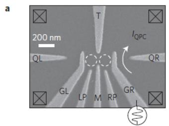

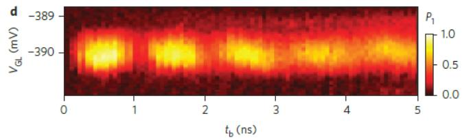

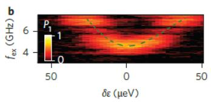

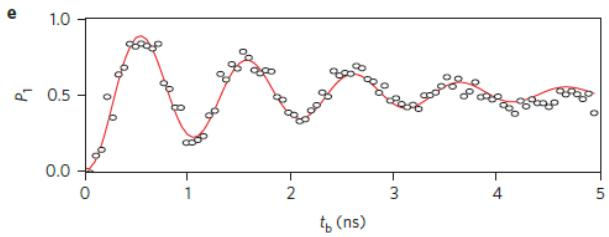

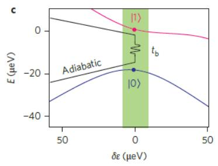

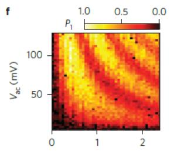

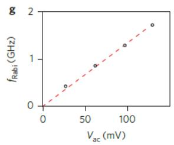  
图 3.7 Si/SiGe电荷量子点的拉比振荡。(a)样品扫描电镜图片。(b)量子点能级随微波频谱的变化图。(c)施加微波波形示意图。(d)微波驱动下的拉比振荡。(e)提取出的振荡随时间数据，振荡周期为1GHz。(f)(g)不同微波振幅驱动下振荡频率的变化关系。图片引自文献[12]。

图 3.7为Eriksson 小组在Si/SiGe的双量子点系统上做的拉比振荡操作。图a为其样品在SEM 下扫描的结构，图b，c分别为微波驱动下的能级间隔测量图和微波波形示意图。图 d，e 分别为微波频率与能级间隔相同情况下的微波驱动的拉比振荡和振荡振幅随着时间的衰减变化，拟合出退相干时间 $\mathrm { T } _ { 2 } ^ { * } { = } 1 . 5 \mathrm { n s }$ 。图 f，g分别为不同振幅下微波驱动的拉比振荡频率的变化以及对数据的线性拟合。

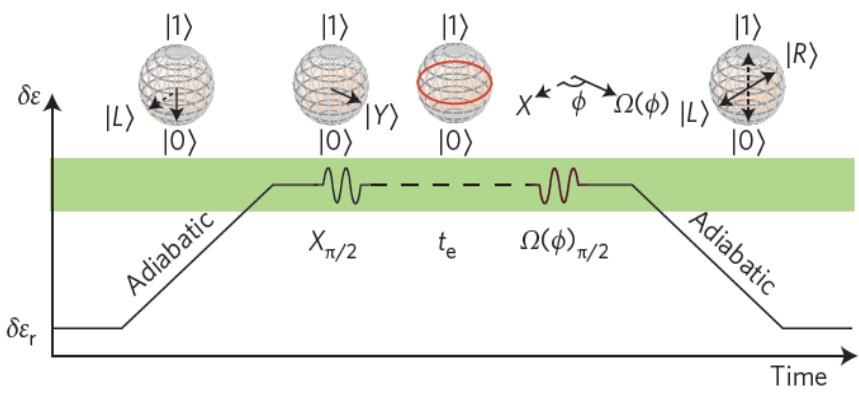  
图 3.8 Ramsey 操作波形示意图。图片引自文献[12]。

我们可以看到前面在微波的驱动下，相当于在布洛赫球面上绕x轴做旋转操作。当我们通过对微波进行斩波处理，就可以实现在 xy 平面自由演化操作。如图 3.8 所示，我们首先将其放在 $\lvert 0 >$ 态或|1>态，通过绝热的上升沿将其初始化到平衡点处，然后控制微波的宽度使得恰好旋转角度为 $\pi / 2$ ，在布洛赫球面上即是绕 x 轴旋转 $\pi / 2$ 的相位到 xy 平面。然后等待 $\mathbf { t _ { e } }$ 的时间，其就会在 xy 平面自由演化，最后再通过一个 $\pi / 2$ 的微波后通过绝热的下降沿进行测量在 z 轴的投影。整个过程就完成了在xy平面的任意操作，这一整个过程就是 Ramsey操作。有点类似于之前的矩形脉冲操作，但是不同的是我们可以通过微波控制的 $\pi / 2$ 相位为一个特例情况，通过不同的角度控制可以使其旋转角度任意，而对于理想矩形脉冲则无法实现这一操作。

在此基础上还可以进行 Hahn echo操作，其过程为在等待的 $\mathbf { t _ { e } }$ 时间中间再加入一个π相位的微波，使得其演化方向反向从而抵消噪音的影响，测量出二能级系统的真正退相干时间 $\mathsf { T } _ { 2 } \mathrm { , }$ 。其具体的测量过程这里就不做详细的介绍，具体可以参考文献[12]。

## 3.5 本章小结

本章主要对双量子点编码的电荷量子比特进行了详细的介绍。从双量子点的图像开始，通过展示测量的双量子点的蜂窝图以及在蜂窝图中通过测量电子的位置与能量失谐量的概率分布，可以拟合出此时的双量子点的隧穿耦合能量 2t 大小。然后介绍双量子点中微波驱动的光子辅助隧穿过程以及多级 PAT 现象，并且可以通过施加不同的微波驱动频率来拟合系统的隧穿耦合能量2t，这一相对之前的通过电子状态概率分布拟合的不同方法。接着介绍了在理想热脉冲下的拉莫振荡，演示了其在布洛赫球面上的旋转过程。在 LZS 效应中，对其演化过程做了简要的描述并给出其演化的结果。最后介绍了双量子点在绝热上升沿的微波驱动下的拉比振荡以及Ramzey操作，展示了通过微波驱动可以实现对量子态在布洛赫球面上的任意操作和测量。

本章的主要目的是介绍在电荷量子比特中目前使用的比较常见的操作方法以及其操作原理，通过编码态在布洛赫球面随波形的演化过程展示，使我们更直观的理解在各种不同微波脉冲下的量子态的演化过程，为后续多个电荷量子比特中的相干操作做介绍与铺垫。

## 参考文献

[1] D. Loss and D.P. DiVincenzo, Quantum computation with quantum dots, Physical Review A, 57,120-126 (1998).

[2] R. Hanson, L.P. Kouwenhoven, J.R. Petta, S. Tarucha and L.M.K. Vandersypen, Spins in few-electron quantum dots, Rev. Mod. Phys., 79,1217-1265 (2007).

[3] R. Hanson, and D. Awschalom, Coherent manipulation of single spins in semiconductors, Naure 453, 1043 (2008).

[4] J. R. Petta, A. C. Johnson, J. M. Taylor, E. A. Laird, A. Yacoby, M. D. Lukin, C. M. Marcus, M. P. Hanson, and A. C. Gossard, Coherent manipulation of Coupled Electron Spin in Semiconductor Quantum Dots, Science 309, 2180 (2005).

[5] M. Xiao, M.G. House and H.W. Jiang, Measurement of the Spin Relaxation Time of Single Electrons in a Silicon Metal-Oxide-Semiconductor-Based Quantum Dot, Physical Review Letters, 104,096801 (2010).

[6] X. Hao, R. Ruskov, M. Xiao, C. Tahan and H. Jiang, Electron spin resonance and spin-valley physics in a silicon double quantum dot, Nature Communications, 5,3860 (2014).

[7] M. Xiao, I. Martin, E.Yablonovitch and H.W. Jiang, Electrical detection of the spin resonance of a single electron in a silicon field-effect transistor, Naure 430,435-439 (2008).

[8] J.M. Elzerman, R. Hanson, L.H.W. van Beveren, B. Witkamp, L.M.K. Vandersypen and L.P. Kouwenhoven, Single-shot read-out of an individual electron spin in a quantum dot, Nature, 430,431-435 (2004).

[9] G. Cao, H.-O. Li, T. Tu, L. Wang, C. Zhou, M. Xiao, G.-C. Guo, H.-W. Jiang and G.-P. Guo, Ultrafast universal quantum control of a quantum-dot charge qubit using Landau-Zener-Stuckelberg interference, Nature Communications, 4,1401 (2013).

[10] J.R. Petta, A.C. Johnson, C.M. Marcus, M.P. Hanson and A.C. Gossard, Manipulation of a single charge in a double quantum dot,Physical Review Letters, 93,186802 (2004).

[11] K.D. Petersson, J.R. Petta, H. Lu and A.C. Gossard, Quantum Coherence in a One-Electron Semiconductor Charge Qubit, Physical Review Letters, 105,246804 (2010).

[12] Dohun Kim, D.R.Ward, C.B.Simmons, John King Gamble, Robit Blume-Kohout, Erik Nielsen, D.E.Savage, M.G.Lagally, Mark Friesen, S.N.Coppersmith, and M.A.Eriksson, Microwave-driven coherent operatin of a semiconductor quantum dot charge qubit, Nathre Nanotechnology, 10,243-247 (2015).

[13] Gang Cao, Hai-Ou Li, Xiang-Xiang Song, Guo-Dong Yu, Bao-Bao Chen, Ming Xiao, and Guo-Ping Guo, Arbitrary phase shift of a semiconductor quantum dot charge qubit on a short

time scale, EPL. 112, 37005 (2015)

[14] Runan Shang, Hai-Ou Li, Gang Cao, Ming Xiao, Tao Tu, Hongwen Jiang, Guang-Can Guo, and Guo-Ping Guo, Photon-assisted -tunneling in a coupled double quantum dot under high microwave excitation power, Applied Physics Letters 103, 162109(2013)

[15] Jarryd J. Pla, Kuan Y. Tan, Juan P. Dehollain, Wee H. Lim, John J. L. Morton, David N. Jamieson, Andrew S. Dzurak, Andrea Morello, A single-atom electron spin qubit in silicon, Nature 489, 541-545(2012)

[16] Gang Cao, Hai-Ou Li, Guo-Dong Yu, Bao-Chuan Wang, Bao-Bao Chen, Xiang-Xiang Song, Ming Xiao, Guang Can Guo, Hong-Wen Jiang, Xuedong Hu, and Guo-Ping Guo, Tunable hybrid qubit in a GaAs double quantum dot, Physics Review Letter. 116, 086801 (2016).

## 第 4 章 双电荷量子比特相干操作

对于一个两能级体系，我们将其构建成为一个量子比特，如第三章中我们使用双量子点结构构建一个电荷量子比特，而为了实现一个普适的量子门操作，我们需要两个比特的操作，很自然的想法就是构建在两个两能级体系上，通过电容耦合的方式使得两个量子比特耦合起来来实现这一想法。

目前在这一方向上的研究工作有美国哈佛大学的 Yacoby 小组在GaAs/AlGaAs 上耦合的S-T态完成了受控相位门的操控[1]。日本的NTT基础研究实验室的 Fujisawa 小组设计的耦合双电荷量子比特[2,3]。英国剑桥大学的Ritchie小组的耦合双电荷量子比特的研究工作[5,6]。还有日本的Tarucha小组在自旋上面做的两个比特操作[4]。这些成功都展示了在 GaAs/AlGaAs 的通过自旋编码、S-T态编码以及电荷编码这三种不同编码方式的量子比特。我们在这里的主要工作是基于电荷量子比特，我们通过设计与 Fujisawa 小组和 Ritchie 小组不同的电荷量子比特结构，实现了耦合强度可控的双电荷量子比特，并在此基础上通过控制脉冲序列，演示了我们的量子逻辑非门的操作。其余类似结构的研究可以参考[7-8,11-14]

## 4.1 双电荷量子比特样品的结构设计

在双电荷量子比特的结构设计中，Fujisawa 小组和 Ritchie 小组设计了基本类似的样品结构，如图4.1所示，其中(a)图为Fujisuwa设计的双电荷量子点结构，(b)图为 Ritchie 小组设计的类似对称结构。我们假设这个四量子点系统中只有一个电子的存在的情况，那么它对应有四个能量状态 $\mathrm { E _ { L 0 } , \Delta \mathrm { E _ { R 0 } , \Delta \mathrm { E _ { 0 L } , \Delta \mathrm { E _ { 0 R } , } } } }$ 其分别代表电子在上面量子点左边，上面量子点右边，下面量子点左边和下面量子点右边这四种情况。对于上下各有一个电子的情况下，类似可以写出其能量的表达式为 $\mathrm { E _ { L L } = E _ { L 0 } + E _ { 0 L } + U _ { L I } }$ 或者 $\mathrm { E _ { L R } = E _ { L 0 } + E _ { 0 R } + U _ { L R } }$ 其中的 $\mathrm { U } _ { \mathrm { L L } }$ 和 $\mathrm { U } _ { \mathrm { L R } }$ 为上下两个电子的耦合能，同样可以写出 $\mathrm { E } _ { \mathrm { R I } }$ 和 $\operatorname { E } _ { \mathrm { R R } }$ 的情况。我们定义上面一组量子点中的能级差：$\varepsilon _ { \scriptscriptstyle 1 } = E _ { \scriptscriptstyle L 0 } - E _ { \scriptscriptstyle R 0 }$ ，下面一组量子点中为： $\varepsilon _ { 2 } = E _ { 0 L } - E _ { 0 R }$ ，两组量子点之间的耦合是通过电容来实现的，其耦合能量可以写成 ${ \bf { J } } { = } { \bf { U } } _ { \mathrm { { L L } } } { + } ~ { \bf { U } } _ { \mathrm { { R R } } } { \ { - } } { \bf { U } } _ { \mathrm { { L R } } } { \ { - } } { \bf { U } } _ { \mathrm { { R I } } }$ 。那么四个态的能量表达式可以写成如下形式：

a  
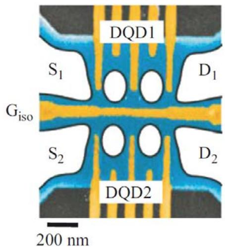

b  
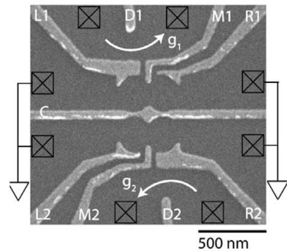  
图 4.1 不同双电荷量子比特设计结构。(a) Fujisawa 小组设计的双电荷量子比特的SEM图片。(b) Ritchie小组设计的双电荷量子比特的SEM图片。图片引自文献[2,5]。

$$
E _ { L L } = \varepsilon _ { \scriptscriptstyle 1 } + \varepsilon _ { \scriptscriptstyle 2 } + J \big / 4\tag{4.1}
$$

$$
E _ { \scriptscriptstyle L R } = \varepsilon _ { 1 } - \varepsilon _ { 2 } - J / 4\tag{4.2}
$$

$$
E _ { \scriptscriptstyle { R \mathrm { L } } } = - \varepsilon _ { 1 } + \varepsilon _ { 2 } - J / 4\tag{4.3}
$$

$$
E _ { { \scriptscriptstyle R R } } = - \varepsilon _ { \scriptscriptstyle 1 } - \varepsilon _ { \scriptscriptstyle 2 } + J / 4\tag{4.4}
$$

对于双电荷量子点体系，我们使用Hamiltonian来进行描述，整个Hamiltonian可以写成如下形式：

$$
H _ { 2 q } = \sum _ { i = 1 } ^ { 2 } \frac { 1 } { 2 } ( \varepsilon _ { i } \sigma _ { z } ^ { ( i ) } + \Delta _ { i } \sigma _ { x } ^ { ( i ) } ) + \frac { J } { 4 } \sigma _ { z } ^ { ( 1 ) } \otimes \sigma _ { z } ^ { ( 2 ) }\tag{4.5}
$$

改写成矩阵表达形式为：

$$
H _ { 2 q } = \frac { 1 } { 2 } \left( \begin{array} { c c c c c } { \varepsilon _ { 1 } + \varepsilon _ { 2 } + J / 2 } & { \Delta _ { 1 } } & { \Delta _ { 2 } } & { 0 } & { \Delta } \\ { \Delta _ { 1 } } & { - \varepsilon _ { 1 } + \varepsilon _ { 2 } - J / 2 } & { 0 } & { \Delta _ { 2 } } & { 0 } \\ { \Delta _ { 2 } } & { 0 } & { \varepsilon _ { 1 } - \varepsilon _ { 2 } - J / 2 } & { \Delta _ { 1 } } & { 0 } \\ { 0 } & { \Delta _ { 2 } } & { \Delta _ { 1 } } & { - \varepsilon _ { 1 } - \varepsilon _ { 2 } + J / 2 } \end{array} \right)\tag{4.6}
$$

基于这个哈密顿量，我们可以构造出一个受控旋转门(Control Rotation Gate，CROT)。对于受控旋转门我们可以理解为：当控制比特 qubit2 处在|R>态是，目

标比特qubit1在特定的外部施加的驱动下，目标比特会在|RR>和|LR>之间翻转；而当控制比特 qubit2 处在 $| \mathrm { L } >$ 态时，目标比特 qubit1 在施加同样的驱动条件下，目标比特不会在|RR>和|LR>之间翻转。

我们在假设两组量子点内两点间的耦合强度 $\Delta _ { 1 } { = } \Delta _ { 2 } { = } \Delta$ ，我们把第一个量子点的位置固定在 $\varepsilon _ { 1 } { = } J / 2$ 处，可以得到本征态为：

$$
\left| { \mathrm { C } } _ { \pm } ^ { ^ { \prime } } \right. = \frac { 1 } { \sqrt { 2 } } [ \left| L R \right. \pm \left| R R \right. - \frac { \Delta } { 2 ( \varepsilon _ { 2 } + J / 2 ) } \big | L L \bigr \rangle - \frac { \Delta } { 2 ( \varepsilon _ { 2 } - J / 2 ) } \big | R L \bigr \rangle ]\tag{4.7}
$$

$$
\big | R L \big \rangle = \big | R L \big \rangle - \frac { \Delta } { 2 J } \big | L L \big \rangle + \frac { \Delta } { 2 ( \varepsilon _ { 2 } - J / 2 ) } \big | R R \big \rangle\tag{4.8}
$$

$$
\big | L L \big \rangle = \big | L L \big \rangle + \frac { \Delta } { 2 J } \big | L R \big \rangle + \frac { \Delta } { 2 ( \varepsilon _ { 2 } + J / 2 ) } \big | R L \big \rangle\tag{4.9}
$$

对应的能量本征值为：

$$
E _ { { \scriptscriptstyle { C \sp * _ { \pm } } } } \simeq - \frac { \varepsilon _ { 2 } } { 2 } \pm \frac { \Delta } { 2 } - \frac { \varepsilon _ { 2 } \Delta ^ { 2 } } { 4 \varepsilon _ { 2 } ^ { 2 } - J ^ { 2 } }\tag{4.10}
$$

$$
E _ { _ { R L } } , \simeq \frac { \mathcal { E } _ { 2 } } { 2 } - \frac { J } { 2 } - \frac { \Delta ^ { 2 } } { 4 J } + \frac { \Delta ^ { 2 } } { 4 \varepsilon _ { 2 } - 2 J }\tag{4.11}
$$

$$
E _ { { \scriptscriptstyle L L } ^ { \prime } } \simeq \frac { \varepsilon _ { 2 } } { 2 } + \frac { J } { 2 } + \frac { \Delta ^ { 2 } } { 4 J } + \frac { \Delta ^ { 2 } } { 4 \varepsilon _ { 2 } + 2 J }\tag{4.12}
$$

式中的 $\left| \mathbf { C } _ { \pm } ^ { \prime } \right.$ 是的| $ { \varepsilon } _ { 2 }$ ± $J / 2$ | ∆2 条件下，在 $\left| \mathbf { C } _ { + } ^ { ^ { \dagger } } \right.$ 和 $\left| \mathbf { C } _ { - } ^ { ' } \right.$ 着两个能级的能级差 $\Delta$ 代表着再 $\mathbf { \left| L R \right. }$ 态和|RR>态之间的能量差。对于这个体系，要想实现 CROT 振荡，即是要求要满足 $\Delta / J \ll 1$ 和 | $\varepsilon _ { 2 } \mid - J / 2 \mid \gg \Delta$ 这两个条件。对于受控非门(ControlledNot Gate, CNOT)可以看做是受控旋转角度为 $\pi$ 的特殊情况。因此，通过受控非门并结合我们前面介绍的单比特的任意门操作，理论上我们就可以构建出任意我们想要得到的量子门操作，但是在实际上由于受到门操作的保真度影响以及量子的退相干时间影响，想要得到任意的量子门操作还是有许多挑战需要解决。

从上面的推导我们可以看到，在 $\Delta / J \ll 1$ 条件下，当我们把目标比特置于$\varepsilon _ { 1 } { = } J / 2$ 处，当下面的控制比特处于 $| \mathrm { R } >$ 态时，目标比特之间的能级差为 $\Delta$ ，我们若在此处在目标比特上施加频率为 $\Delta$ 的脉冲驱动实现拉比振荡或者矩形脉冲实现拉莫振荡，就可以观测到目标比特在|L>态和|R>态之间的翻转。而当控制比特处于|L>态时，目标比特之间的能级差为J，远大于施加脉冲的频率 $\Delta$ 。对于拉比振荡由于频率差值较大，振幅就被抑制，参见3.4 节；对于拉莫振荡，由于此处的隧穿耦合能量太大而导致不能观测到振荡周期，就不能实现目标比特的受控旋

(a)

转操作。如果我们想要实现动态的操作就需要同时对控制比特进行脉冲操控，同时又需要保证 $\mid \varepsilon _ { 2 } \mid - J / 2 \mid \gg \Delta$ 的条件，这对实验的实现上就会比较苛刻。在实验测量中，Fujisawa小组测量到的J 值为25ueV,参考文献[3]，量子比特间电容耦合能量比较小，为了提升耦合强度以及方便对量子比特操控，我们将样品结构进行改进，样品结构如下所示:

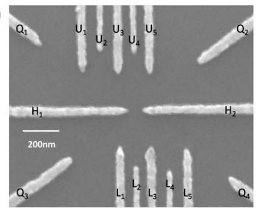

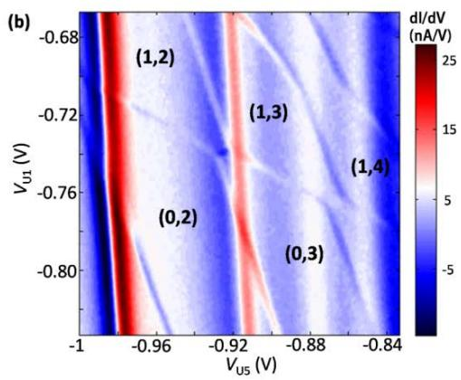

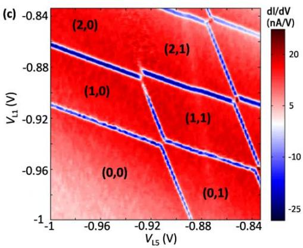  
图 4.2 (a)我们的两电荷比特量子点样品SEM结构图。(b)和(c)分别为上面和下面双量子点的蜂窝图，(M,N)代表每个量子点中电荷的填充数目。图片引自文献[9]

如图 4.2(a)所示，该结构为我们改进设计的两个耦合电荷量子比特结构。相比较于 Fujisawa 小组和 Ritchie 小组设计的双电荷量子比特结构，最大的区别有两点：1、我们设计的结构为上下不对称结构。下面双点中的左边量子点与上面双点中的右边量子点关于中间对称，即是下面的双量子点相对他们设计的结构有整体向右平移一个量子点的位置，这样的结果是系统的 Hamiltonian 的形式上有有所区别，而这一区别对于我们后续的进行受控非门的量子操作有极大的帮助；2、我们中间的水平电极 H 不是一根电极，而是在中间对称的分开成两根电极。这样设计的目的是经过我们测试，想要得到较大的耦合能量 J，将H电极分开有助于得到更大的耦合能量，能够使得上下两个双电荷量子比特的耦合能量更强。

类似我们同样可以写出我们这个系统的Hamiltonian，其形式如下：

$$
H _ { 2 q } = \sum _ { i = 1 } ^ { 2 } \frac { 1 } { 2 } ( \varepsilon _ { i } \sigma _ { z } ^ { ( i ) } + \Delta _ { i } \sigma _ { x } ^ { ( i ) } ) + \frac { J } { 4 } ( I - \sigma _ { z } ^ { ( 1 ) } ) \otimes ( I - \sigma _ { z } ^ { ( 2 ) } )\tag{4.13}
$$

同样改写成矩阵的形式如下：

$$
H _ { 2 q } = \frac { 1 } { 2 } \left( \begin{array} { c c c c } { \varepsilon _ { 1 } + \varepsilon _ { 2 } } & { \Delta _ { 1 } } & { \Delta _ { 2 } } & { 0 } \\ { \Delta _ { 1 } } & { - \varepsilon _ { 1 } + \varepsilon _ { 2 } } & { 0 } & { \Delta _ { 2 } } \\ { \Delta _ { 2 } } & { 0 } & { \varepsilon _ { 1 } - \varepsilon _ { 2 } } & { \Delta _ { 1 } } \\ { 0 } & { \Delta _ { 2 } } & { \Delta _ { 1 } } & { - \varepsilon _ { 1 } - \varepsilon _ { 2 } + 2 J } \end{array} \right)\tag{4.14}
$$

对比式 4.6 我们可以看到其系统的 Hamiltonian 的对角项为非对称式结构为后续的受控逻辑门操作提供了一个十分方便的前提，那就是对于控制比特，可以不受到目标比特的位置影响，从而方便实现动态的受控门操作。对比式4.5和式4.13区别在于最后的耦合能量项，其原因是由于样品设计的结构不同所导致。

图4.2(b)和4.2(c)分别为上下双量子点的蜂窝图，分别使用量子点接触(QPC)的 Q1 和 Q3 这两个电极使用 QPC 的 modulation 方法测量的结果。(M, N)分别表示每个电荷量子点中的左边和右边量子点中各自的电子数目。上下两个量子比特都可以到达少电子区域并且形成很好的电荷量子比特。

## 4.2 双电荷量子比特耦合强度

如同在双量子点体系，我们可以测量出两个量子点之间的隧穿耦合能量∆ =2t。我们如果知道两组量子比特之间的电容耦合能量 J，加上每个电荷量子比特其各自的隧穿耦合能量为 $\Delta _ { i } \left( \mathsf { i } { = } 1 , 2 \right)$ ，那么我们就构建了这个四能级体系。这就是我们所设计的耦合双量子比特结构。以下我们为实验测量，展示了我们如何对耦合强度J 的调节。

我们使用的样品材料是掺杂的GaAs/AlGaAs 异质结构，通过使用MBE生长的方法控制其掺杂的含量。二维电子气位于晶圆表面下方约90nm，其在250mK下测量得到的电子迁移率为 $1 . 5 { \times } 1 0 ^ { 5 } c m ^ { 2 } V ^ { - 1 } S ^ { - 1 }$ ，电子密度为 $2 . 3 { \times } 1 0 ^ { 1 1 } c m ^ { 2 }$ 。样品放置在无液氦的稀释制冷机当中，能够达到的最低温度为30mK。

我们制作的样品结构图如图 4.2(a)所示，由两个耦合的双量子点组成，图中门电极U1-U5,H1 和H2组成了上面的双量子点，门电极 L1-L5,H1 和H2组成了下面的双量子点，这样每个双量子点就可以被看做是一个电荷量子比特。水平的门电极H1和H2 把这两个双量子点分开，一般情况下我们施加在H1和H2 两个门电极的电压相同 $( \mathrm { { V _ { H 1 } } = \mathrm { { V _ { H 2 } } = \mathrm { { V _ { H } } ) } } }$ ,由于 $\mathrm { V _ { H } }$ 是一个负的电压存在，其产生一个高的势垒从而阻止电子在两个电荷量子点之间跃迁，同时由于有一个小的间隙，使得两个电荷量子点之间的电容耦合可以调节。图中的门电极Q1-Q4为量子点接触，通过标准的锁频技术即可以测量到量子点中的信号，在这里我们使用 Q1测量上面的双量子点，Q3测量下面的双量子点。上下两个双量子点调节到少电子区域。

对于单独的一个双量子点体系中的电荷，我们可以定义为(M, N)。其中M代表左边量子点中的电子数目，而N代表右边量子点中的电子数目，如图4.2(b)所示。同样的方法，我们定义 $( M _ { \mathrm { U } } , N _ { \mathrm { U } } ; M _ { \mathrm { L } } , N _ { \mathrm { L } } )$ 来表示我们的双电荷量子比特系统，其分别代表上面双量子点中左边和右边的电子数目以及下面双量子点中左边和右边的电子数目。当上面双量子点中失谐运动的电子在左边而下面双量子点中的失谐运动的电子在右边时，此时对应的电子数标记为 $( M _ { \mathrm { U } } , N _ { \mathrm { U } } ; M _ { \mathrm { L } } \mathrm { - } 1 , N _ { \mathrm { L } } \mathrm { + } 1 )$ ,此时两个电子距离较远其相互作用的电容耦合在这里我们可以忽略。而当上面双量子点中失谐运动的电子处于右边，下面双量子点中的失谐运动的电子处于左边时，此时对应的电子数标记为 $( M _ { \mathrm { U } } { - } 1 , N _ { \mathrm { U } } { + } 1 ; M _ { \mathrm { L } } , N _ { \mathrm { L } } )$ ，此时两个量子点中失谐的电子距离最接近，其库伦相互作用也就达到最强。这种在两个电荷量子比特之间交换的能量就是其内部的耦合能量，我们定义为J值。当我们分别沿着上下两个双量子点的失谐方向 $\mathcal { E } _ { U ( L ) }$ 进行扫面就可以看到J值在实验上的表现。

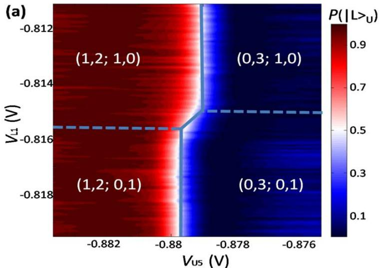

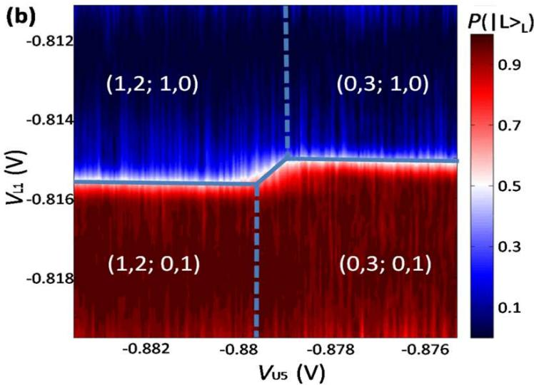

图 4.3 (a)和(b)表示上下双量子点中，电子在其内部从左边到右边量子点的变化中的几率分布。上面双量子点通过 $\mathrm { V } _ { \mathrm { U } 5 }$ 和 $\mathrm { \Delta V _ { U 1 } }$ 实现电子从(1, 2)到(0, 3)的变化。下面双量子点通过$\mathrm { V } _ { \mathrm { L 1 } }$ 和 $\mathrm { V } _ { \mathrm { L } 5 }$ 实现从(1, 0)到(0, 1)的变化。图片引自文献[9]

如图 4.3(a)-(b)所示，我们分别沿着上下两个双量子点的失谐量ε 和 $\varepsilon _ { U }$ $ { \varepsilon } _ { L }$ 进行扫描。这里我们选取的电极 H 的电压为 $\mathrm { V _ { H } } \mathrm { = } \mathrm { - } 0 . 7 6 7 \mathrm { V }$ ，上下双量子点中的电子数目分别为 $( M _ { \mathrm { U } } , N _ { \mathrm { U } } ) = ( 1 , 2 )$ 和 $( M _ { \mathrm { L } } , N _ { \mathrm { L } } ) = ( 1 , 0 )$ 。图 $4 . 3 ( \mathrm { a } )$ 中展示了上面双量子点中电子处于左边量子点的几率 $P ( \left| \mathrm { L } > _ { \mathrm { U } } \right)$ 变化，而图 4.3(b)中为下面双量子点中电子处于左边量子点的几率 $P ( \| \mathrm { L } > _ { \mathrm { L } } )$ 变化。这些 $P ( \left| \mathrm { L } > _ { \mathrm { U } } \right)$ 和 $P ( \left| \mathrm { L } \mathrm { > _ { L } } \right. ) ,$ 几率是通过 QPC 测量到的电导信号经过减去本底背景噪声之后的积分求和，其具体方法如图3.2所展示的相同，参考文献[15]。这两耦合能量J 值就随着我们改变 $\varepsilon _ { U }$ 和 $ { \varepsilon } _ { L }$ 有一个陡峭的突变，对应在图上就是在(1, 2; 0, 1) 和(0, 3; 1, 0)之间的变化。最后我们通过测量到的电压能量转换系数 $\alpha = 5 4 . 6 ~ \mathrm { \mu e V / m V }$ ，就可以得到我们的耦合能量 $J / \hbar { = }$ 9.6 GHz。

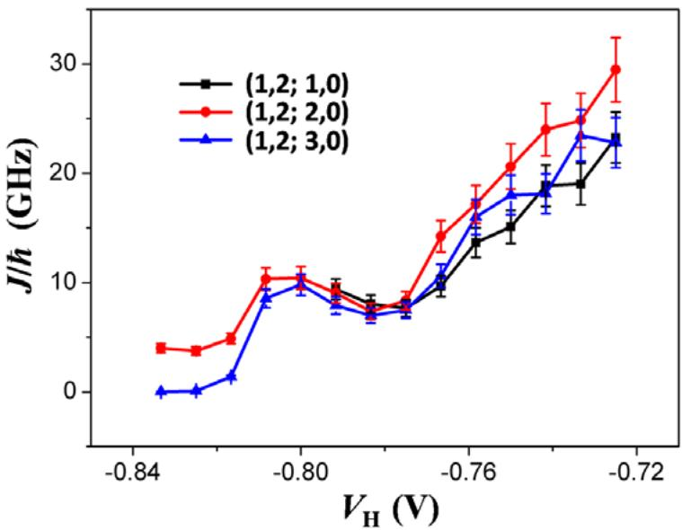  
图4.4 耦合能量J随水平门电极电压 $\mathrm { v _ { H } }$ 的变化曲线。J值的测量选取的电子为 $( M _ { \mathrm { U } } , N _ { \mathrm { U } } ;$ $M _ { \mathrm { L } ^ { - 1 } } , N _ { \mathrm { L } ^ { + 1 } }$ 和 $\left( M _ { \mathrm { U } } { - } 1 \ N _ { \mathrm { U } } { + } 1 ; M _ { \mathrm { L } } , N _ { \mathrm { L } } \right)$ ，其中 $( M _ { \mathrm { U } } , N _ { \mathrm { U } } )$ 固定在电子数为 (1, 2)处， $( M _ { \mathrm { L } } , N _ { \mathrm { L } } )$ 变化从(1, 0)到(2, 0)再到(3, 0),分别对应图中黑色、红色和蓝色的线。图片引自文献[9]

我们发现通过调节两个水平门电极 H1 和 H2 上面所施加的电压，我们可以实现对双电荷量子比特之间的耦合能量 J 的连续调节，同时我们对J 的调节对于不同的电子数目都是有效果的。我们固定上面双量子点中的电子数目 $( M _ { \mathrm { U } } , N _ { \mathrm { U } } )$ 在(1, 2)区域，改变下面双量子点中的电子数目 $( M _ { \mathrm { L } } , N _ { \mathrm { L } } )$ 从(1, 0)到(2, 0)到(3, 0)，对于这些不同的电子数情况， $\mathrm { V _ { H } }$ 都展现出了对耦合能量 J 值有很好的调节控制作用。

如图 4.4 展示了耦合能量 J 值随着门电极电压 $\mathrm { V _ { H } }$ 在不同的电子数区域的大小变化，同显示了相类似的性质。总体上来说，耦合能量 J 值随着门电极电压$\mathrm { V _ { H } }$ 向正电压方向减小而变得更大，这就表示这当两个双量子点之间的势垒减小，其电容耦合能量也就变得更强。在大约门电极电压 $\mathrm { V _ { H } }$ 调节 100mV的电压范围变化之内，耦合能量J/ħ 的值就可以从几乎为0 调节到29.5GHz。另外一方面，当$\mathrm { V _ { H } } < = - 0 . 8 3 3 \mathrm { V }$ 时，我们可以看到两个双量子点之间的耦合几乎可以认为是关掉了，此时上下两个双量子点也就可以看做是两个各自独立的双量子点系统。

在我们调节门电极电压 $\mathrm { V _ { H } }$ 使得耦合能量 J 值变化时，我们注意到在 $\mathrm { \Delta V _ { H } ~ = ~ }$ −0.800 V附近J 值表现出的非线性性质。这里我们给出的解释是：当我们调节门电极电压 $\mathrm { V _ { H } }$ 到比较负的电压值是，我们就必须要调节栅极电压，如 U1，U5，D1，D5 等，否则我们就很难以追踪到我们所固定电子数的位置，而这些门栅极电压的调节就会改变双量子点中的整体电势场分布，从而最后导致了耦合能量的非线性变化。

最后我们调节下面双量子点中电子数目 $( M _ { \mathrm { L } } , N _ { \mathrm { L } } ) { = } ( 1 , 0 )$ ，(2, 0)和(3, 0)，耦合能量J 值同门电极电压 $\mathrm { V _ { H } }$ 变化没有本质上的不同。尽管在相同的 $\mathrm { V _ { H } }$ 电压下，不同电子数目时的 J 值有稍许的差异，但是总体上 J 值随着 $\mathrm { V _ { H } }$ 的向正电压减小而增大的变化是相同的。这就说明了上下双量子点之间的电容耦合至少在我们测量的区域以内是保持着相同的性质。我们后来的多块样品也证实我们设计的这种结构甚至能够在多电子区域保持着相似的性质。

## 4.3 耦合能量与逻辑非门及纠缠度的关系

对于双电荷量子点系统，我们的目标一直是很明确的实现其量子逻辑非门的操作。在上一节中我们通过实验测量使得我们制备的双电荷量子点系统中的两个电荷量子比特可以实现电容耦合能量的连续调节，在这一节中，我们将详细地模拟计算耦合能量的大小对于我们后续的逻辑非门保真度的影响。

首先我们对于逻辑电路中的逻辑非门应当有基本的认识，逻辑非门可以定义如下：在一个两比特的系统中，目标比特有且仅当控制比特处在 1态是才会翻转。意思就是当控制比特处于0态时，目标比特经过门运算后不会变化，而控制比特处于1态时，目标比特经过门运算后会发生变化，即是从0态变成1态或者从1态变成 0态。当然，我们也可以使用另外的编码方式让目标比特有且仅当控制比特在0态时发生翻转，这两种情况是等价的。

对于我们的系统，其哈密顿量如式4-13所示，我们写成详细的形式如下：

$$
H _ { 2 q } = \frac { \varepsilon _ { U } \sigma _ { z } + \Delta _ { U } \sigma _ { x } } { 2 } \otimes I + I \otimes \frac { \varepsilon _ { L } \sigma _ { z } + \Delta _ { L } \sigma _ { x } } { 2 } + J \frac { I - \sigma _ { z } } { 2 } \otimes \frac { I - \sigma _ { z } } { 2 }\tag{4.15}
$$

式中 $\sigma _ { x }$ 和 $\sigma _ { z }$ 是泡利矩阵， $\varepsilon _ { \mathrm { { U } } }$ 和 $\varepsilon _ { \mathrm { { L } } }$ 是能量失谐量， $\varDelta _ { \mathrm { U } }$ 和 $\varDelta _ { \mathrm { L } }$ 分别是上下量子比特内的隧穿耦合能量2t。在远离平衡点的地方，即 $\vert \varepsilon _ { \mathrm { U } } \vert > > 0$ 和 $| \varepsilon _ { \mathrm { L } } | > > 0$ 的区域，哈密顿量中的本征态我们可以对应定义写为： $\mathrm { | 0 { > } _ { U } | 0 { > } _ { L } ~ , ~ \Delta | 1 { > } _ { U } | 0 { > } _ { L } , ~ \Delta | 0 { > } _ { U } | 1 { > } _ { L } }$ 和$| 1 { > } _ { \mathrm { U } } | 1 { > } _ { \mathrm { L } }$ ，分别对应在电子的充电区域为 $( M _ { \mathrm { U } } , N _ { \mathrm { U } } ; M _ { \mathrm { L } ^ { - 1 } } , N _ { \mathrm { L } ^ { + 1 } } )$ ， $( M _ { \mathrm { U } } { - } 1 , N _ { \mathrm { U } } { + } 1 ; M _ { \mathrm { L } } { - } 1$ $N _ { \mathrm { L } ^ { + 1 } }$ ， $( M _ { \mathrm { U } } , N _ { \mathrm { U } } ; M _ { \mathrm { L } } , N _ { \mathrm { L } } )$ 和 $( M _ { \mathrm { U } } { - } 1 , N _ { \mathrm { U } } { + } 1 ; M _ { \mathrm { L } } , N _ { \mathrm { L } } )$ ,我们可以对应看到对于上面双量子点中充电电子数为 $( M _ { \mathrm { U } } , N _ { \mathrm { U } } ) \cdot$ 代表着上面的电子处于 $\scriptstyle \left. 0 > _ { \mathrm { U } } \right.$ 态，而下面双量子点总电子数为 $\mathsf { \Pi } ( M _ { \mathrm { L } } , N _ { \mathrm { L } } )$ 代表着下面的电子处于| $1 { > } _ { \mathrm { L } }$ 态。如图 4.5 所示，这里我们只画出了变化中的电子位置而忽略了其余不动的电子，这并不影响我们讨论的结果。

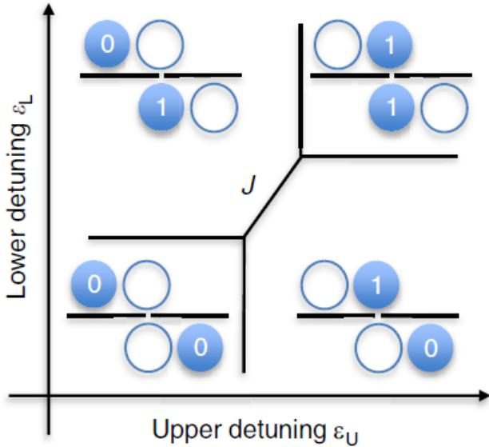  
图 4.5 双电荷量子比特中电子处于不同的位置定义的不同的电子态。图片引自文献[10]

我们先计算两个电荷量子比特的能级图，我们假设电容耦合能量 J 值(这里我们设定 $\scriptstyle \mathrm { J = 1 2 0 u e V } )$ ，上下两个双点内的耦合能量都为 5GHz(约为20.5ueV)，我们分别计算下面量子点处于 $\mathrm { | 0 > _ { L } }$ 态和| $\mathrm { > } _ { \mathrm { L } }$ 态下我们沿着上面量子点能量失谐量下的能级图，分别如图 4.6(a)，4.6(b)所示。(a)图为下面双量子点处于 $\scriptstyle | 0 > _ { \mathrm { L } }$ 态，若我们先想上面量子点位置放置在远离平衡点位置，我们加上一个非绝热脉冲，其脉冲高度刚好使其到达平衡点处，我们改变脉冲宽度就会看到拉莫振荡，这一现象我们在第3.3节中已经做过介绍。这是我们若将下面的量子比特调节到| $1 { > } _ { \mathrm { L } }$ 态，此时由于电容耦合的作用，上面量子比特的平衡位置向右平移了一个 J值的大小，若我们继续施加刚才的脉冲，应为此时脉冲幅值不能够使其到达平衡点处，故即使我们改变脉冲宽度，我们也不会看到上面量子比特的拉莫振荡。这种拉莫振荡的过程被抑制的程度与两个电荷量子比特之间的耦合能量J值有关。当J值很小或者几乎为0时，我们可以想象到上量子比特的拉莫振荡几乎不受影响，则下面量子比特处于 $\mathrm { \Delta \mathrm { \vert 0 > _ { L } } }$ 态和 $| 1 { > } _ { \mathrm { I } }$ 态跟上面量子点无关。若 J值很大时，上面量子比特的拉莫振荡就由于没有到达平衡点而被抑制，若这个过程完全被抑制，则我们看到的结果就是下面量子比特处于 $\lvert 1 \mathrm { > _ { L } }$ 态就会使得上面量子比特不能发生翻转变化，而处于 $\lvert 0 > _ { \mathrm { L } }$ 态就可以使上面量子比特发生翻转变化。这一过程就构成了一个量子的逻辑非门。下面我们就从理论上去计算这种被抑制程度与两个量子比特耦合程度的变化关系，同样也可以换一种说法就是两个量子比特耦合程度J与我们测量子逻辑非门的保真度的关系。

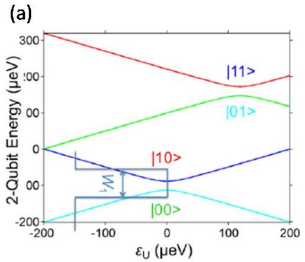

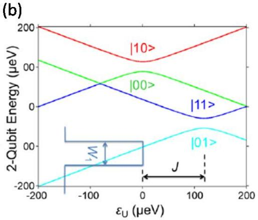  
图 4.6 双电荷量子比特中计算的能级结构。(a)下面量子比特处 $\mp | 0 >$ 态时，上面量子点的平衡点在 $\varepsilon _ { U } = 0$ 处。(b) 下面量子比特处于|1>态时，上面量子点的平衡点在 $\varepsilon _ { U } = J$ 处。可以看到下面量子点的状态对上面量子点的平衡点的影响程度为 J。图片引自文献[10]

我们通过数值求解下面常用的薛定谔方程计算出我们的密度矩阵 $\mathrm { : } \rho |$ 的变化，其计算方程如下：

$$
\frac { d \rho } { d t } = - \frac { i } { \hbar } \Big [ H _ { 2 q } , \rho \Big ]\tag{4.16}
$$

先通过设置两个量子比特的失谐量 $\varepsilon _ { \mathrm { U } } < < 0$ 和 $\varepsilon _ { \mathrm { L } } < < 0$ 初始化两个量子比特都处在 $\mathrm { | 0 > _ { U } | 0 > _ { L } }$ 态，然后我们施加如图 4.7(a)的矩形脉冲波形，首先我们在 $\varepsilon _ { \mathrm { { L } } }$ 上施加一个非绝热的脉冲，使其到达其失谐量的平衡点处，这样下面量子比特就会在$\mathrm { \Delta \Omega } 0 \mathrm { > _ { L } }$ 态和 $\lvert 1 \mathrm { > } _ { \mathrm { L } }$ 态之间翻转，旋转角度与脉冲的宽度的关系为： $\theta _ { \mathrm { L } } = 2 \pi \varDelta _ { \mathrm { L } } W _ { \mathrm { L } }$ ，这就是拉莫振荡。上面量子比特所施加的非绝热脉冲效果受到下面量子比特状态的影响，对于我们讨论的量子逻辑非门，我们只考虑两种情况，分别为 $\theta _ { \mathrm { L } } = 2 n \pi$ 和$( 2 n + l ) \pi$ ，其中n为正整数。当 $\theta _ { \mathrm { L } } = 2 n \pi$ 时，下面的量子比特处于 $\lvert 0 > _ { \mathrm { L } }$ 态，如果我们加上上面量子比特的脉冲驱动，上面量子比特就会有 $\theta _ { \mathrm { U } }$ 的角度翻转，其翻转的量取决于脉冲宽度 $W _ { \mathrm { U } } { \mathrm { c } }$ 。当 $\theta _ { \mathrm { L } } = ( 2 n + 1 ) \pi$ 时，下面的量子比特处于|1 ${ } > _ { \mathrm { { L } } }$ 态，由于量子比特之间的库伦相互作用，使得上面量子比特的失谐平衡点移动了J 值大小，从而使得拉莫振荡被抑制。

(a)  
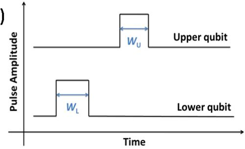

(b)  
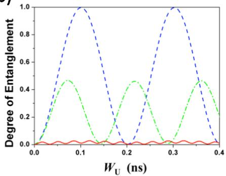

(c)  
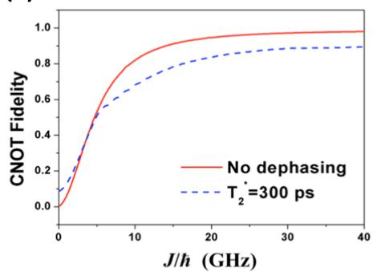

(d)  
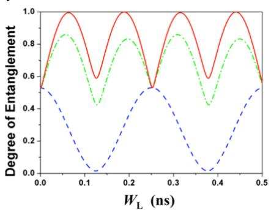

(e)  
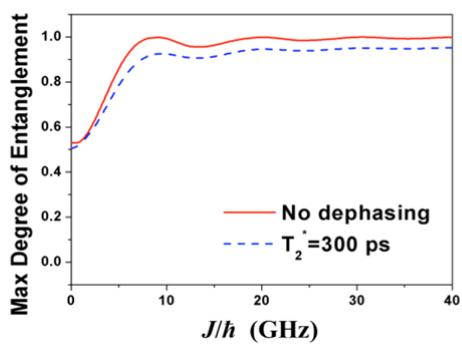  
图 4.7 (a)上下两个电荷量子比特操作波形示意图。(b)模拟计算在下面量子比特经过 $\pi$ 相位操作后，上面量子比特在矩形脉冲作用下不同的 $J / \hbar$ 值的拉莫振荡情况。蓝色虚线、绿色点线和红色实线分别对应 $J / \hbar = 0 G { \sf H } z$ 、5GHz 和 30GHz。(c) CNOT 门操作的保真度与 $J / \hbar$ 值的变化曲线。红色实线为考虑退相干的影响，蓝色虚线表示退相干时间为 $\mathrm { T } _ { 2 } ^ { * } = 0 . 3 \mathrm { n s }$ 。(d)模拟计算上面量子比特经过 $\pi$ 相位操作后纠缠度随下面量子比特脉冲宽度的变化，蓝色虚线、绿色点线和红色实线分别对应 $J / \hbar = 0 G 1 1 z$ 、5GHz 和 30GHz。(e)最大纠缠度随 $J / \hbar$ 的变化曲线。红色实线为不考虑退相干时间，蓝色虚线表示退相干时间为 $\mathrm { T } _ { 2 } ^ { * } = 0 . 3 \mathrm { n s }$ 。图片引自文献[9]

这样我们动态的逻辑非门就可以形成了，我们给上面量子比特一个 $\theta _ { \mathrm { U } } = \pi$ 的门脉冲，当下面控制量子比特的旋转角度为 $\theta _ { \mathrm { L } } = 2 n \pi$ 时，上面量子比特就会发生翻转，当下面控制量子比特的旋转角度为 $\theta _ { \mathrm { L } } = ( 2 n + I ) \pi$ 时，上面量子比特由于翻转被抑制而不会发生变化。

我们固定下面下面量子比特的旋转角度为 $\theta _ { \mathrm { { L } } } = \pi$ ，使得下面量子比特处于$\lvert 1 \mathrm { > } _ { \mathrm { L } }$ 态上，通过模拟计算研究上面量子比特的拉莫振荡与不同耦合能量 J 值的关系。我们通过测量上面量子比特处于 $| 0 \mathrm { > } _ { \mathrm { U } }$ 态的概率来确定上面量子比特的状态，其测量公式为：

$$
P ( \left| 0 \right. _ { U } ) = \rho _ { 1 1 } + \rho _ { 3 3 }\tag{4.17}
$$

如图 4.7(b)所示，当 $J / \hbar = 0 \mathrm { G H z }$ 时，对应图中的蓝色虚线，可以看到量子点的拉莫振荡没有收到抑制，这说明没有耦合能量时，下面量子比特的状态对上面量子比特的拉莫振荡没有影响。当 $J / \hbar = 5 \ \mathrm { G H z }$ 时，对应图中的绿色点状线，上面量子比特的拉莫振荡的振幅只有 46.7%，这就意味着上面量子比特的拉莫振荡被抑制了53.3%。当我们把 $J / \hbar$ 增加到30 GHz 时，对应图中红色实线，此时的上面量子点的拉莫振荡振幅只有 2.7%，这就意味着振荡被抑制了 97.3%。我们定义 1 为理想条件下的 CNOT 门的保真度，在此我们计算不同 J 值下的 CNOT门的保真度的变化，如图4.7(c)中红线所示，在J/ħ = 30 GHz 时，门操作保真度达到了 97.3%，这就意味着我们能够达到的 J 值条件下我们的保真度可以达到非常高的水平。

对于一般条件下，下面量子比特的旋转角度 $\theta _ { \mathrm { L } } = 2 \pi \varDelta _ { \mathrm { L } } W _ { \mathrm { L } }$ ，其位置为 $\mathrm { | 0 > _ { L } }$ 态和|1 ${ > } _ { \mathrm { L } }$ 态之间的叠加态。这就控制着上面目标比特的翻转。这里我们考虑 J 受限制情况下两个量子比特的纠缠程度。由于上面量子比特在 $\theta _ { \mathrm { L } } = 2 n \pi$ 时会翻转 $\theta _ { \mathrm { U } }$ ，而在 $\theta _ { \mathrm { L } } = ( 2 n + I ) \pi$ 时不会翻转，两比特在经过两个脉冲后最终的状态为：

$$
\left| \Phi _ { o u t } ( J = + \infty ) \right. = \cos \frac { \theta _ { U } } { 2 } \cos \frac { \theta _ { L } } { 2 } \big | 0 \big \rangle _ { U } \left| 0 \right. _ { L } + \sin \frac { \theta _ { U } } { 2 } \cos \frac { \theta _ { L } } { 2 } \big | 1 \big \rangle _ { U } \left| 0 \right. _ { L } + \sin \frac { \theta _ { L } } { 2 } \big | 0 \big \rangle _ { U } \left| 1 \right. _ { L }\tag{4.18}
$$

在实际条件下，当 $\theta _ { \mathrm { U } } = \pi$ 和 $\theta _ { \mathrm { L } } = \pi / 2$ 时，两个量子比特就会处在如下贝尔态上：

$$
\left| \Psi _ { + } \right. = \frac { 1 } { \sqrt { 2 } } \bigl ( \bigl | 1 \bigr \rangle _ { U } \left| 0 \right. _ { L } + \bigl | 0 \bigr \rangle _ { U } \left| 1 \right. _ { L } \bigr )\tag{4.19}
$$

当J 值不是足够大的情况下，耦合就不会达到最大，这是因为上面量子比特的拉莫振荡在下面量子比特处在 $\lvert 1 > _ { \mathrm { L } }$ 态时没有被完全抑制，结果造成 $| 1 { \mathrm { > } } _ { \mathrm { U } } | 1 { \mathrm { > } } _ { \mathrm { L } }$ 态就不可避免的会出现，这样就会使得测量到的纠缠减小。如图4.7(d)所示，我们分别计算了 $J / \hbar = 0 \mathrm { G H z } , 5 \mathrm { G H z }$ 和30 GHz 这几种不同情况，分别对应图中蓝色虚线，绿色点状线和红色实线，我们计算贝尔态 $| \psi _ { + } >$ 随着 $\theta _ { \mathrm { { L } } }$ 的变化：

$$
|  \Psi _ { + } | \Phi _ { o u t } ( J )  | ^ { 2 } = \frac { 1 } { 2 } \mathopen { } \mathclose \bgroup ( \sqrt { \rho _ { 2 2 } } + \sqrt { \rho _ { 3 3 } } \aftergroup \egroup ) ^ { 2 }\tag{4.20}
$$

当 $\theta _ { \mathrm { U } } { = } \pi$ 时，两个量子比特之间对于不同的 J/ħ 值条件下最大的纠缠程度不同，当 $J / \hbar = 0 \mathrm { G H z }$ 时，最大的纠缠程度为0.53，这意味着两个量子比特之间几乎没有纠缠；当 $J / \hbar = 5 \mathrm { \ G H z }$ 时，最大纠缠程度达到了 0.832；而当 $J / \hbar = 3 0 \mathrm { G H z }$ 时，其最大纠缠程度达到了 0.999，这说明两个量子比特之间的强耦合能够增大其纠缠程度。

在实际情况下，我们还要考虑量子系统的退相干情况、脉冲的绝热性以及脉冲的非理想性等一系列情况。这里我们只考虑系统的退相干时间对我们 CNOT门保真度的影响。我们考虑砷化镓中的电荷量子比特条件下，设定退相干时间$\mathrm { T } _ { 2 } ^ { * } = 0 . 3 \mathrm { n s }$ 。这样我们的计算公式应当改写成：

$$
\frac { d \rho } { d t } = - \frac { i } { \hbar } \Big [ H _ { { \scriptscriptstyle 2 q } } , \rho \Big ] - \frac { 1 } { T _ { 2 } ^ { * } } \rho\tag{4.21}
$$

我们重新计算 CNOT 门的保真度以及纠缠程度，结果如图 4.7(c)和 4.7(e)中蓝 $\mathcal { \underline { { E } } }$ 虚线所示，在同样 $J / \hbar = 3 0 \mathrm { G H z }$ 地方，保真度从97.3%降到了 88.7%，纠缠程度从 99.9%降到了 95.1%。

本小节主要从模拟计算角度上去理解耦合能量对于我们将要进行的 CNOT门操作的影响，使我们对两个比特之间的耦合能有了全面的认识和深入的了解。为我们后续在实验上进行量子逻辑门操作提供了基础。在本章的最后一节将会详细介绍计算模拟程序。

## 4.4 双电荷量子比特逻辑非门操作

本节中我们将从实验上实现我们的双电荷量子比特的逻辑门操作，并且测量我们的量子逻辑门的保真度。我们的样品结构如图 4.2(a)所示，首先将双电荷量子比特都调节到少电子区域，通过调节中间水平门电极 H1 和 H2，使我们两个量子比特之间的耦合强度达到 $J { = } 1 1 9 \mathrm { u e V }$ (即是 $J / \hbar = 2 9 \mathrm { G H z } )$ ，上下两个双点内的耦合能量 $\Delta _ { U } \approx 6 . 2 G H z$ 和 $\Delta _ { L } \approx 6 . 0 G H z$

如图4.8(a)所示，首先我们将两个量子比特都置于|0>态，此时系统状态为 $| 0 0 >$ 态。然后分别在上下两个量子比特上施加上同步的非绝热的脉冲信号，下面双量子点受到宽度为 $\mathrm { W } _ { 2 }$ 的脉冲后将系统的状态变化为 $\cos \beta \vert 0 0 \rangle + \sin \beta \vert 0 1 \rangle$ ，其中 $\beta ^ { \scriptstyle \perp }$ $\mathrm { W } _ { 2 }$ 有关，可以参见4.3节。再次经过上面量子比特的脉冲作用，上面量子点的脉冲幅度为下面量子点处于|0>态时，刚好能够使上面量子点进行拉莫振荡的脉冲高度 ， 进 过 脉 冲 宽 度 为 $\mathrm { W } _ { 1 }$ 的 脉 冲 作 用 后 ， 系 统 的 状 态 变 成$\cos \alpha \cos \beta \left| 0 0 \right. + \sin \alpha \cos \beta \left| 1 0 \right. + \sin \beta \left| 0 1 \right.$ 。在实验中，我们分别同时测量上下量子比特处于|0>态的概率，即是：

$$
P _ { _ U } ^ { 0 } = 1 - \sin ^ { 2 } \alpha \cos ^ { 2 } \beta\tag{4.22}
$$

$$
P _ { L } ^ { 0 } = \cos ^ { 2 } \beta\tag{4.23}
$$

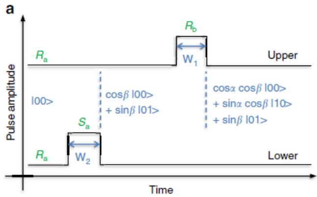

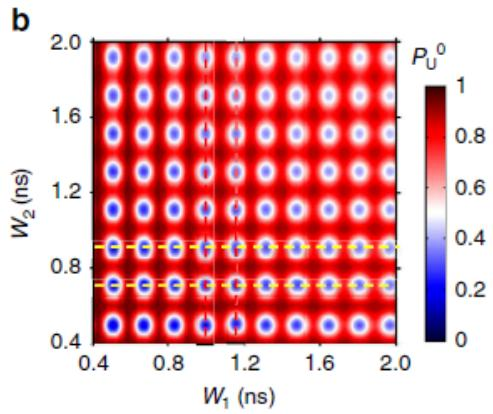

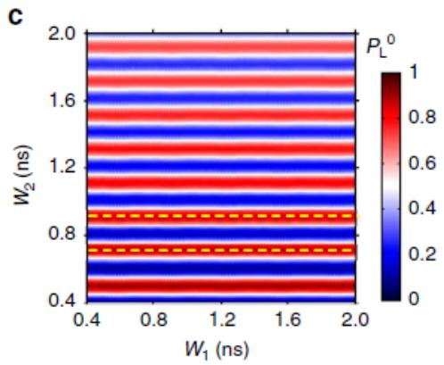

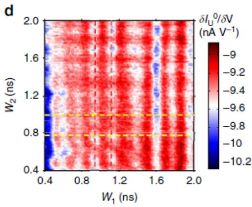

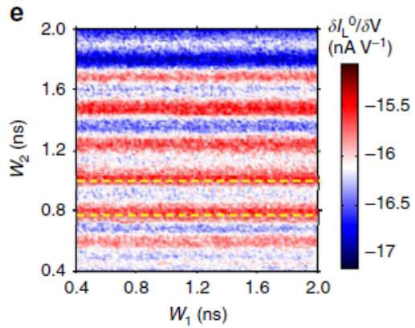  
图 4.8 (a)上下两个电荷量子比特操作波形示意图。(b)(c)分别代表理论模拟计算下 $P _ { U } ^ { 0 }$ 和 $P _ { L } ^ { 0 }$ 在脉冲驱动下的几率变化图像。(d)(e)实验测量到分别流经上下量子比特探测的QPC通道的电流变化。图片引自文献[10]

我们分别扫描 $\mathrm { W } _ { 1 }$ 和 $\mathrm { W } _ { 2 }$ 的的脉冲宽度，就可以得到如图 4.8(b)-(e)所示。其中图4.8(b)为理论模拟计算下测量到 ${ \mathsf { P } } _ { \mathsf { U } } ^ { 0 }$ 的变化情况，图4.8(c)为理论模拟计算下测量到 ${ \mathsf { P } } _ { \mathsf { L } } ^ { 0 }$ 的变化情况。分别对应的实验测量图为4.8(d)和4.8(e)。我们沿着纵轴$( \mathbb { W } _ { 2 } )$ 变化的方向观察，结合图 4.8(c)和4.8(e)，可以看到下面量子比特状态在不同的脉冲宽度驱动下在平衡点处进行拉莫振荡，其几率在0-1之间并且在缓慢衰减，衰减是由于其内部退相干时间影响。但当我们固定 $\mathrm { W } _ { 2 }$ 时，只变化 $\mathrm { { W } } _ { 1 }$ 的脉冲宽度可以看到 ${ \mathsf { P } } _ { \mathsf { L } } ^ { 0 }$ 不受 $\mathrm { { W } } _ { 1 }$ 影响，这也是容易理解的，因为参照我们波形的施加图象 4.8(a)可以看到对下面量子比特的操作在上面量子比特的操作之前。但是我们同时测量 ${ \mathsf { P } } _ { \mathsf { U } } ^ { 0 }$ 的状态时，我们得到图 4.8(d)的结果，模拟计算的结果为图 4.8(b)。这里我们看到，沿着图中黄色的虚线，此时 ${ \mathsf { P } } _ { \mathsf { L } } ^ { 0 }$ 几乎为 1，即是说明下面量子比特处在 $| 0 >$ 态，上面量子比特在宽度为 $\mathrm { W } _ { 1 }$ 脉冲的驱动下就会发生拉莫振荡，其状态在 $\mid 0 >$ 态和|1>态之间翻转；而当 ${ \mathsf { P } } _ { \mathsf { L } } ^ { 0 }$ 几乎为0时，表示下面量子比特处在|1>态，此时上面量子比特的状态就不会发生变化。图 4.8(b)-(e)分别从理论和实验上完好地展示了我们想要的量子比特振幅控制逻辑门，同时可以看到目标比特的翻转受到控制比特的精确控制，实验数据与理论模拟计算结果也符合的很好。

我们接下来要测量计算这种通过脉冲振幅控制的逻辑门的真值表。所谓真值表就是我们的逻辑非门用数学运算表示即使一个4 4× 的矩阵，其理想的表达式如式4.25所示，其保真度为1。但是在实际实验测量中，保真度由于量子比特的退相干、脉冲的绝热性以及脉冲波形的非理想性等因素而使得其不能够达到1，这里我们测量到的逻辑非门的保真度为68%。下面我们将详细介绍其保真度的测量方法。

如图 4.9(a)所示，对于我们想要测量经过逻辑非门操作后的保真度，我们的具体思路分为3个步骤：1、先将系统初始化到初始态，即是|00>态。2、分别制备不同的输入态，对应为|00>态、|10>态、|01>态、|11>态。3、对于每种不同的输入态，将其通过我们的逻辑非门，然后测量经过逻辑非门操作后我们测量到的上下量子比特分布几率。这样结合对不同的输入态测量后，我们就可以计算出我们控制非门测保真度。

对于输入为 $| 0 0 >$ 态的情况，由于初始化为|00>态，所以在第 2 步的操作中我们不用进行做任何操作，直接将其通过逻辑非门。我们这里并没有单独测量一个固定的非门脉冲宽度 $\mathrm { { W } } _ { 1 }$ ，而是连续变化 $\mathrm { { W } } _ { 1 }$ 的的宽度，最后我们只需要取 $\mathrm { { W } } _ { 1 }$ 的宽度刚好为 $( 2 n + l ) \pi$ 就可以。在实际取值中我们选取3π的位置，因为我们的操控速度很快，如果选取 $\pi$ 的操控会使得脉冲宽度只有 120ps 左右，实验仪器对于如此短的脉冲宽度很难以控制精确，而如果选取过长的时间又会由于退相干的因素使得保真度降低。最后分别测量上下两个量子比特处在 ${ \mathsf { P } } _ { \mathsf { U } } ^ { 0 }$ 和 ${ \mathsf { P } } _ { \mathsf { L } } ^ { 0 }$ 的几率分布。

如图4.9(b)-(c)中红色圆圈所示，我们可以看到随着 $\mathrm { W } _ { 1 }$ 的脉冲宽度增加，上面量子比特处于|0>态和|1>态之间的翻转，而下面量子比特一直处于 $\lvert 0 >$ 态的几率接近为 1。

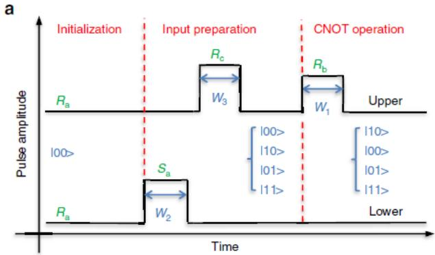

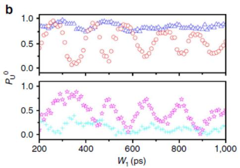

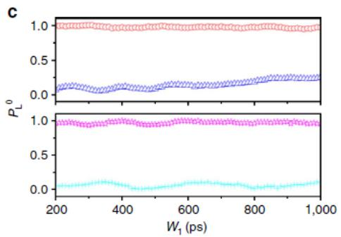

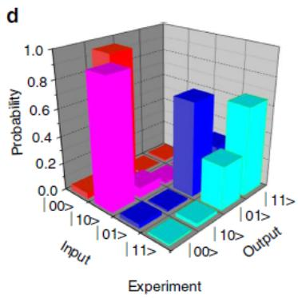

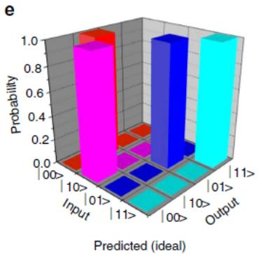

f  
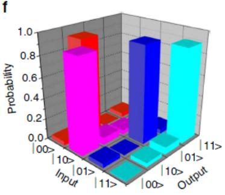  
图 4.9 CNOT门操作真值表测量。(a)测量CNOT真值表的门操作流程图。(b)(c)上下量子比特的分布几率随脉冲宽度 $\mathbf { W } _ { 1 }$ 的变化图，对于CNOT门操作，选取 $\mathrm { W _ { 1 } } \mathrm { = } 3 6 0 \mathrm { p s }$ 。 图中红色圆圈，粉色星星，蓝色三角形和绿色十字分别代表着输入的状态为|00>态、|10>态、|01>态、 $| 1 1 > \widehat { \mathfrak { w } }$ 。(d)实验测量到 CNOT 门输出的状态分布几率。(e)(f)为理论计算几率分布，(e)为没有退相干时间影响，(f)退相干时间为 1.2ns。图片引自文献[10]

对于输入为 $| 1 0 >$ 态的情况。第一步现将系统初始化到|00>态。第二步为将系统状态制备到输入的 $| 1 0 > \frac { 2 } { 1 5 } \rangle$ ，这里我们在上面量子比特加上脉冲宽度为 $3 \pi$ 的非绝热脉冲，其脉冲高度与后面的逻辑非门相同，这样我们就完成了 $| 1 0 >$ 态的制备。

最后我们将其通过我们的逻辑非门操作，如图 4.9(b)-(c)中粉色星星所示，我们可以看到上面的量子比特还是在|0>态和 $| 1 >$ 态之间翻转，而下面量子比特处于|0>态的概率还是接近为1。

对于输入为|01>态的情况。同样首先第一步系统初始化到|00>态。然后将系统状态制备到|01>态，通过在下面量子比特加上脉冲宽度为 $3 \pi$ 的非绝热脉冲实现，这样我们就完成了|01>态的制备工作。最后我们将其通过逻辑非门操作，如图4.9(b)-(c)中蓝色三角形所示，我们注意到随着 $\mathrm { W } _ { 1 }$ 的脉冲宽度增加，上面量子比特没有振荡现象， ${ \mathsf { P } } _ { \mathsf { U } } ^ { 0 }$ 几乎一直处在1 附近，而对应的 ${ \mathsf { P } } _ { \mathsf { L } } ^ { 0 }$ 的几率分布也一直在0 附近。这说明在下面量子比特处于|1>态时，上面量子比特的分布几率几乎不受逻辑门操作的影响。

最后对输入为|11>态的情况。这种情况下需要我们对输入的初始态制备成 $| 1 1 >$ 态，我们的做法是先对下面量子点施加脉冲宽度为 3π的非绝热脉冲使其变成 $| 1 >$ 态，然后再将上面的量子比特制备到|1>态。但是在这里我们需要注意到此时由于两个比特之间的耦合作用，使得原先振幅高度的脉冲不能够对其进行操作，因此我们需要将脉冲的高度调整为如图所示的 $\mathrm { R _ { c } }$ 位置，即此时的高度为原先高度加上耦合能量高度的总和。通过控制宽度 ${ \mathrm { W } } _ { 3 } { = } 3 \pi$ 的非绝热脉冲，此时才将上面的量子比特制备到|1>态。同样经过逻辑非门操作，其结果如图 4.9(b)-(c)中绿色十字标记所示，可以看到上面量子比特也没有出现振荡情况，两个量子比特基本上大部分几率都处在各自的|1>态。

$$
T _ { m e a s u r e d } = \left( \begin{array} { l l l l } { { 0 . 0 9 } } & { { 0 . 8 9 } } & { { 0 . 0 0 2 } } & { { 0 . 0 2 } } \\ { { 0 . 8 7 } } & { { 0 . 1 2 } } & { { 0 . 0 1 } } & { { 0 . 0 0 2 } } \\ { { 0 . 0 6 } } & { { 0 . 0 2 } } & { { 0 . 7 4 } } & { { 0 . 1 8 } } \\ { { 0 . 0 2 } } & { { 0 . 0 7 } } & { { 0 . 2 3 } } & { { 0 . 6 8 } } \end{array} \right)\tag{4.24}
$$

$$
T _ { p r e d i c t e d } ^ { i d e a l } = \left( \begin{array} { l l l l } { 0 } & { 1 } & { 0 } & { 0 } \\ { 1 } & { 0 } & { 0 } & { 0 } \\ { 0 } & { 0 } & { 1 } & { 0 } \\ { 0 } & { 0 } & { 0 } & { 1 } \end{array} \right)\tag{4.25}
$$

$$
T _ { p r e d i c t e d } ^ { \prime ^ { * } = 1 2 0 0 p s } = \left( \begin{array} { r r r r r } { { 0 . 0 5 } } & { { 0 . 9 5 } } & { { 0 } } & { { 0 } } \\ { { 0 . 9 0 } } & { { 0 . 1 0 } } & { { 0 } } & { { 0 } } \\ { { 0 . 0 0 3 } } & { { 0 . 0 5 } } & { { 0 . 9 4 } } & { { 0 . 0 0 7 } } \\ { { 0 . 0 0 5 } } & { { 0 . 0 5 } } & { { 0 . 0 6 } } & { { 0 . 8 9 } } \end{array} \right)\tag{4.26}
$$

我们选取使得 $\mathrm { W } _ { 1 }$ 的脉冲宽度刚好为3π的取值，此时对应 $\mathrm { W _ { 1 } } \mathrm { = } 3 6 0 \mathrm { p s }$ 。分别读取不同输入态下的 ${ \mathsf { P } } _ { \mathsf { U } } ^ { 0 }$ 和 ${ \mathsf { P } } _ { \mathsf { L } } ^ { 0 }$ 几率，即可计算得到真值表，如式 4.24 所示。式4.25为理想条件下的操作矩阵，我们取式4.24中的最小值即可得到保真度为68%。在理论模拟计算中，我们考虑量子比特的退相干时间为 $\mathrm { T } _ { 2 } ^ { * } = 1 . 2 ~ \mathrm { n s }$ 情况下，计算得到的转换矩阵如式 4.26 所示。分别将这三个转换矩阵画成柱状图形式，如图 4.9(d)-(f)所示。

d  
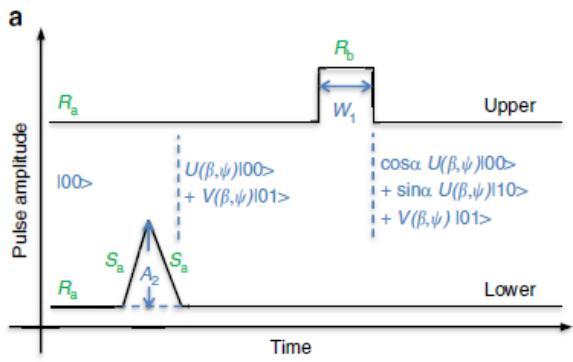

b  
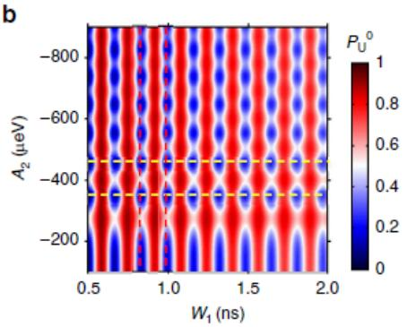

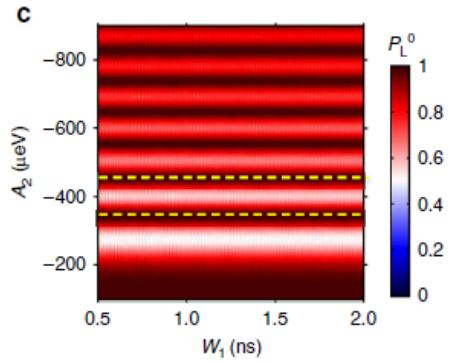

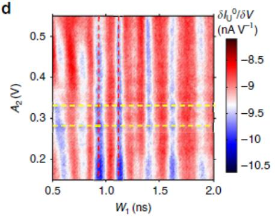

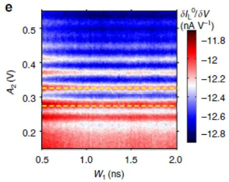  
图 4.10 (a)通过下面量子比特的相位来控制上面量子比特的拉莫振荡流程图。(b)(c)分别代表理论模拟计算下 $P _ { U } ^ { 0 }$ 和 $P _ { L } ^ { 0 }$ 在下面量子比特的脉冲振幅控制下的上面量子比特的拉莫振荡变化图像。(d)(e)实验测量到分别流经上下量子比特探测的QPC 通道的电流变化。图片引自文献[10]

到目前为止，我们所讨论的逻辑非门只是考虑了其量子态中由振幅控制的几率变化，这里我们在保留逻辑非门操作时，同时改变量子比特的振幅和相位，研究量子态中相位的变化对逻辑门操作的影响。如图4.10(a)所示，我们在下面量子比特上施加一个宽度为 100ps 的超短脉冲，由于脉冲的宽度比上升沿和下降沿都很短，因此我们可以将其看作是一个超短的三角波。我们首先将下面量子比特初始化到 $| 0 >$ 态，然后改变脉冲的高度，下面量子比特被驱动穿过平衡点，这一过程就是我们在 3.4 节中所讲的 Landou-Zener-Stuckelberg 效应。量子比特分别在布洛赫球面上绕x 轴和z轴旋转。

我们这里在上面量子比特中施加非绝热脉冲，这样我们就展示了在 LSZ 效应控制下的拉莫振荡。首先，下面量子比特在三角脉冲的驱动下由|0>态变成了$U ( \beta , \psi ) \big | 0 \big \rangle + V ( \beta , \psi ) \big | 1 \big \rangle$ ，其中 $U ^ { 2 } ( \beta , \psi ) + V ^ { 2 } ( \beta , \psi ) = 1$ 。如果两个量子比特之间毫无关联，那么上面量子比特的状态在矩形脉冲驱动下则由|0>态变成了$\cos \alpha | 0 \rangle + \sin \alpha | 1 \rangle$ 。实际情况下，由于逻辑非门的作用，使得上面量子比特仅当下面量子比特状态为|0>态时才会翻转，这样最终的两个量子比特的纠缠状态为$U ( \beta , \psi ) \cos \alpha \big | 0 0 \big \rangle + U ( \beta , \psi ) \sin \alpha \big | 1 0 \big \rangle + V ( \beta , \psi ) \big | 0 1 \big \rangle$ 。我们测量到上面量子比特处在|0>态的几率为 $P _ { \cal U } ^ { 0 } = 1 - U ^ { 2 } ( \beta , \psi ) \sin ^ { 2 } \alpha$ ，下面量子点处于|0>态的几率为$P _ { L } ^ { 0 } = 1 - U ^ { 2 } ( \beta , \psi )$ 。对于 $U ^ { 2 } ( { \boldsymbol { \beta } } , \psi )$ 它随着振幅（通过 $\beta$ ）和相位（通过 $\psi$ ）这两个下面量子比特的量振荡。然而，由于相位的振荡远快于振幅的振荡，所以在我们测量到的区主要的观察到由相位引起的振荡。对于 ${ \mathsf { P } } _ { \mathsf { U } } ^ { 0 }$ 的振荡情况，我们可以看到其关于 $\mathrm { { W } } _ { 1 }$ （通过 $\alpha \mathbf { \Omega } )$ ）和 ${ \bf A } _ { 2 }$ （主要通过 $\psi$ ）的调控，而对于 ${ \mathsf { P } } _ { \mathsf { L } } ^ { 0 }$ 的振荡情况只有通过 ${ \bf A } _ { 2 }$ （主要通过 $\psi$ ）来调控。对比图 4.10(b)-(e)，其中(b)-(c)为数值模拟图，(d)-(e)为实验测量图像，可以看到只有当下面量子比特在布洛赫球面上绕 x轴旋转 π的相位后，上面量子比特才会在脉冲驱动下发生翻转。实验测量数据基本与理论模拟相吻合。

至此，我们介绍了在实验上不同的脉冲驱动通过经过我们设计的逻辑非门的结果，并且给出了振幅控制情况下我们逻辑非门的保真度达到68%。我们这一实验结果很好的展示了通过实现两个电荷量子比特之间的强耦合，我们可以利用超快的脉冲信号来实现在半导体电荷系统上任意的两比特门操作，为实现在半导体上的量子计算有着借鉴意义。

## 4.5 双电荷量子比特模拟计算

本节主要是对于上面两节中脉冲驱动下的具体模拟计算过程加以详细介绍。由4-14式可以得到系统的哈密顿量为:

$$
H _ { 2 q } = \frac { 1 } { 2 } \left( \begin{array} { c c c c } { \varepsilon _ { U } + \varepsilon _ { L } } & { \Delta _ { U } } & { \Delta _ { L } } & { 0 } \\ { \Delta _ { U } } & { \varepsilon _ { U } - \varepsilon _ { L } } & { 0 } & { \Delta _ { L } } \\ { \Delta _ { L } } & { 0 } & { - \varepsilon _ { U } + \varepsilon _ { L } } & { \Delta _ { U } } \\ { 0 } & { \Delta _ { L } } & { \Delta _ { U } } & { - \varepsilon _ { U } - \varepsilon _ { L } + 2 J } \end{array} \right)\tag{4.27}
$$

其随时间的演化计算公式为式4.16：

$$
\frac { d \rho } { d t } = - \frac { i } { \hbar } \Big [ H _ { 2 q } , \rho \Big ]
$$

我们在计算时需要将实部与虚部分开，我们定义 $W = r e a l ( \rho ) + i m a g i n a r y ( \rho )$ 这里W是一个实矩阵并且 trace(W)=1。由于 $\rho$ 和 $\mathsf { H } _ { 2 \mathsf { q } }$ 都是厄密共轭并且 $\mathsf { H } _ { 2 \mathsf { q } }$ 是实数，我们就可以把上面的方程中的 $\rho$ 转化成W来描述为：

$$
\frac { d W } { d t } = - \frac { i } { \hbar } \Big [ H _ { 2 q } , W ^ { T } \Big ]\tag{4.28}
$$

这里 $\mathbf { W } ^ { \mathrm { T } }$ 是 W 的转置矩阵。由于 trace(W)=1，因此这个矩阵方程有 15 个相关量，可以通过利用MATLAB或者Python 等计算软件的数值求解得到结果。各个求解的对角项中的W 和 的结果是一致的。对于我们需要的量为： $\rho$

$$
P _ { U } ^ { 0 } = \rho _ { { 1 , 1 } } + \rho _ { 3 , 3 } = W _ { 1 , 1 } + W _ { 3 , 3 }\tag{4.29}
$$

$$
P _ { L } ^ { 0 } = \rho _ { { 1 , 1 } } + \rho _ { { 2 , 2 } } = W _ { { 1 , 1 } } + W _ { { 2 , 2 } }\tag{4.30}
$$

对于初始状态的 W 和 $\rho$ 的状态，我们将两比特系统置于|00>态，考虑到电子温度对于结果的影响，我们最终的初始状态为：

$$
W ( t = 0 ) = \rho ( t = 0 ) = \frac { d i a g o n a l ( e ^ { - E / k T } ) } { t r a c e ( d i a g o n a l ( e ^ { - E / k T } ) ) }\tag{4.31}
$$

这里E是 $\mathsf { H } _ { 2 \mathsf { q } }$ 矩阵的本征值。考虑到弛豫时间和退相干时间的影响，我们同样可以包含在计算方程式中，具体表现为：

$$
\frac { d W } { d t } = - \frac { i } { \hbar } \Big [ H _ { 2 q } , W ^ { T } \Big ] - \Gamma _ { 1 } ( W - W ( t = 0 ) ) - \Gamma _ { 2 } W\tag{4.32}
$$

式中 $\Gamma _ { 1 }$ 是弛豫时间矩阵，而 $\Gamma _ { 2 }$ 是退相干时间矩阵。在我们的模拟计算中我们忽略掉弛豫时间的影响是因为通过改变门脉冲操作的采样频率可以测量得到弛豫时间，然后通过数学补偿掉弛豫时间的影响。而对于退相干时间，由于其影响到我们逻辑门操作的保真度，我们使用非均匀的退相干时间 $T _ { 2 } ^ { * } = 1 / \Gamma$ 2来模拟计算其对门操作保真度的影响。

以上为我们所有的理论上的推导过程，下面在模拟计算的方式上我们使用Python 进行数值运算。使用 Python 编程计算的原因是由于我们需要计算量子比特在脉冲下随时间的演化，就需要将演化的时间分割成一系列很小的时间单元进行数值求解叠加，这就导致整个过程需要的计算量非常巨大。这里我们使用Python 并行计算程序结合英伟达型号为 GeForce GTX Titan 显卡内部多达 2880个核的计算单元，使得原先使用 CPU 单线程需要计算几天时间的运算过程，在GPU上可以在几分钟至十几分钟内计算完成。其具体的模拟计算程序见附录 1。

在计算程序中我们可以分别设置不同的变化参量，其中 T2Gama 即为 $\Gamma _ { 2 }$ ，还有上面量子比特的能量失谐量 $\mathcal { E } _ { 1 }$ ，上面比特施加的脉冲高度A1，脉冲宽度Tw1，下面量子比特的能量失谐量 $\mathcal { E } _ { 2 }$ ，下面比特施加的脉冲高度 A2，脉冲宽度 Tw2，以及两个量子比特之间的耦合能量Em。在每次的计算中我们分别计算两个不同的变量在一个完整的脉冲周期(Trpt=10ns)内的演化过程，最后演化状态结果通过画图就能够得到不同参量之间的关系。这里我们不仅可以使用的是矩形脉冲波，还可以设置不同的脉冲波形进行模拟计算。我们分别计算两个量子比特随着特定序列的脉冲宽度的变化如图 4.8(a)所示。首先将量子比特置于|00>态，通过两个先后同步的脉冲使其到平衡点，上下两个脉冲之间的间隔固定为 0.5ns。可以得到两个量子比特的控制演化，计算结果如图 4.11 所示，与图 4.8(b)-(c)图的计算结果相吻合。

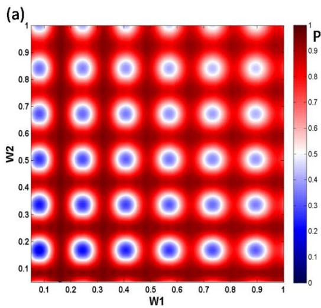

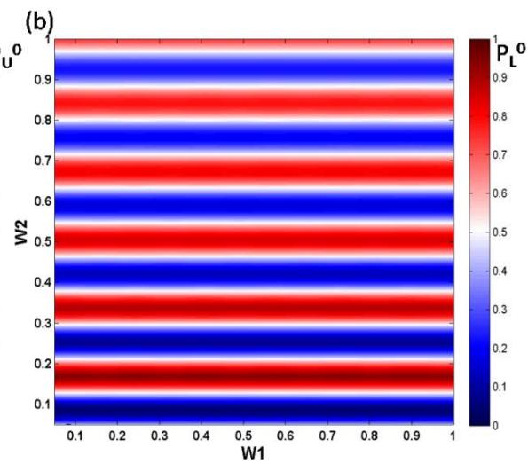  
图 4.11 运行模拟程序计算得到结果图像(a)(b)分别为 $P _ { U } ^ { 0 }$ 和 $P _ { L } ^ { 0 }$ 在脉冲控制下的变化情况。

## 4.6 本章小结

本章主要围绕双电荷量子比特的逻辑门操控进行了一系列的介绍，首先从双电荷量子比特的结构设计开始，主要介绍了日本Fujisawa小组所设计的双电荷量子比特结构和状态的表征以及如何实现受控 CROT 的基本方法。对照他们设计的结构，我们在此加以改进，采用上下非对称结构，使得实现受控非门在实验操作上更加容易实现。

接下来在我们设计的结构上实现了上下两个电荷量子比特的耦合强度可调节，并且可以实现很大的耦合强度。通过实验测量发现通过设计的开口中间电极样品结构，我们在多个不同电子数目区域都实现了强耦合的目标，为我们后续的两个强耦合量子比特之间的逻辑门操作提供基础。接下来我们详细地从理论上讨论耦合强度对于逻辑非门的影响，通过理论计算发现当 $J / \hbar = 3 0 \mathrm { G H z }$ 时，我们的逻辑非门操作的理论最大保真度可以达到 97.3%，两个量子比特的纠缠程度能达到 99.9%。在退相干时间 $\mathrm { T _ { 2 } } ^ { * } = 0 . 3 \mathrm { n s }$ 的影响下保真度降到88.7%，纠缠程度降到95.1%。

我们从实验室去实现两个耦合电荷量子比特的逻辑非门操控，两个比特之间的耦合强度为J/ħ= 29 GHz，我们分别展示了振幅控制下的逻辑非门，并且测量到其保真度为68%，以及通过相位控制的逻辑非门的图像，实验测量的数据与理论计算都有着很好的符合。

最后我们从理论上详细介绍了对双电荷量子比特受控非门的理论模拟计算过程并给出了基于Python的理论模拟计算程序。

## 参考文献

[1] M.D.Shulman, O.E.Dial, S.P.Harvey, H.Blihm, V. Umansky, A.Yacoby, Demonstration of Entanglement of Electrostatically Coupled Singlet-Triplet Qubits, Science 336, 202 (2012).

[2] Toshimasa Fujisawa, Gou Shinkai, Toshiaki Hayashi, Takeshi Ota, Multiple two-qubit operations for a coupled semiconductor charge qubit, Physica E 43, 730-734 (2011).

[3] Gou Shinkai, Toshiaki Hayashi, Takeshi Ota, and Toshimasa Fujisawa, Correlated Coherent Oscillations in Couipled Semiconductor Charge Qubits, Physical Review Letters 103, 056802 (2009).

[4] R.Brunner, Y.S.Shin, T.Obata, M.Pioro-Ladriere, T.Kubo, K.Yoshida, T.Taniyama, Y.Tokura, and S. Tarucha, Two- Qubit Gate of Combined Single-Spin Rotation and Interdot Spin Exchange in a Double Quantum Dot, Physical Review Letters 107, 146801 (2011).

[5] K.D.Petersson, C.G.Smith, D.Anderson, P.Atkinson, G.A.C.Jones, and D.A.Ritchie, Microwave-Driven Transitions in Two Coupled Semiconductor Charge Qubits, Physical Review Letters 103, 016805 (2009).

[6] F.Perez-Martinez, I.Farrer, D.Anderson, G.A.C.Jones, D.A.Ritchie, S.J.Chorley, and C.G.Smith , Demonstration of a quantum cellular automata cell in a GaAs/AlGaAs heterostructure, Applied Physics Letters 91, 032102(2007)

[7] M.Mitic, M.C.Cassidy, K.D.Petersson, R.P.Starrett, E.Gauja, R.Brenner, R.G.Clark, and A.S.Dzurak, Demonstration of a silicon-based quantum cellular automata cell, Applied Physics Letters 89, 013503(2006)

[8] Romain Thalineau, Sylvain Hermelin, Andreas D.Wieck, Christopher Bauerle, Laurent Saminadayar, and Tristan Meunier, A few-electron quadruple quantum dot in a closed loop, Applied Physics Letters 101, 103102(2012)

[9] Guo-Dong Yu, Hai-Ou Li, Gang Cao, Ming Xiao, Hong-Wen Jiang, and Guo-Ping Guo “Tunable Capacitive Coupling between Two Semiconductor Charge Qubits”, Submit for Nanotechnoligy

[10] H.O. Li, G. Cao, G.D. Yu, M. Xiao, G.C. Guo, H.W. Jiang， and G.P. Guo, Conditional rotation of two strongly coupled semiconductor charge qubits, Nature Communications, 6,7681 (2015).

[11] M. Veldhorst, C. H. Yang, J. C. C. Hwang, W. Huang, J. P. Dehollain, J. T. Muhonen, S. Simmons,A. Laucht, F. E. Hudson, K. M. Itoh, A. Morello, and A. S. Dzurak1, A two-qubit logic gate in silicon, Nature 410, 526(2015)

[12] Yu.A. Pashkin, T. Yamamoto, O. Astafiev, Y. Nakamura, D.V.Averin, and J.S.Tsai, Quantum

oscillations in two coupled charge qubits, Nature 421, 823-826(2003)

[13] L. DiCarlo, J.M.Chow, J.M.Gambetta, Lev S.Bishop, B.R.Johnson, D.I.Schuuster, J.Majer, A, Blais, L.Frunzio, S.M.Girvin, and R.J.Schoelkopf , Demonstration of two-qubit algorithms with a superconducting quantum processor, Nature 460, 240-244 (2009).

[14] T. Yamamoto, Yu.A. Pashkin, O.Astafiev, Y, Nakamura, and J.S.Tsai, Demonstration of conditional gate operation using superconducting charge qubits. Nature 425, 941–944 (2003).

[15] J.R. Petta, A.C. Johnson, C.M. Marcus, M.P. Hanson and A.C. Gossard, Manipulation of a single charge in a double quantum dot,Physical Review Letters, 93,186802 (2004).

## 第5章 三电荷量子比特的研究

在实现了两个电荷量子比特测逻辑控制非门后，理论上我们可以通过与逻辑非门控制演化，实现任意的量子门操作，不同之处在于各种逻辑门需要结合的操作步骤及顺序有所差异。但是对于量子体系，多步骤的量子操作不仅仅会使操作的保真度进一步降低，还由于量子系统的退相干性而使得总共的操作步数收到限制。因此人们一方面通过利用不同的技术去提高操作的保真度，如操作反馈(echo)技术，另一方面通过寻找新的材料和体系，如 Si 体系中没有核自旋对量子相干性的影响，进一步提高相干时间。抛开人们努力去提高体系的操作保真度和量子相干时间，对多个量子比特的操控是量子计算发展的必然方向，只有实现了多个量子比特门操控才能展现出量子计算区别于传统计算的本质区别。目前对多量子比特的研究工作可以参考文献[1-5]。

本章主要介绍我们在继两个强耦合的电荷量子比特研究后，在三个电荷量子比特的逻辑门操控的研究工作。我们讨论了对于三电荷量子比特的不同样品结构的设计方案，并最终选取了在两个电荷量子比特的结构基础上通过添加一个电荷量子比特的做法的设计方案。在这种比特样品结构下，我们确定了实现三电荷量子比特的 Toffoli 逻辑门操控的研究目标。通过对样品的筛选和精密调节，实现了三个电荷量子比特两两之间的强耦合。最后我们静态的演示了 Toffoli 逻辑门对目标比特的操控。

## 5.1 三电荷量子比特结构

相比于双电荷量子比特结构，三电荷量子比特在空间上由于需要有更多的量子点进行排列，因此如何摆放量子比特之间的位置并且同时能够兼顾到量子比特之间能够实现强耦合成为多量子比特研究的一个重要的基础问题。本节中我主要介绍我们尝试的两种不同三电荷量子比特的结构，分别介绍每种结构的优劣势。并最终确定了我们三电荷量子比特的结构设计。

Romain Thalineau 于 2012 年发表在 Applied Physicis Letters 上的文章[1]给了我们在多电荷量子比特上一种思路，其对称的结构使得每个量子点的作用和影响都有着相等价的位置，如图 5.1 所示。其中 5.1(a)图为外部的大范围结构，包括两个水平和竖直的红色标记电极将量子点之间区分开，黄色标记的门电极可以用来调节每个量子点中电子的数目。绿色标记的电极为 QPC 探测电极，用于探测量子点中的信号。图5.1(b)为放大的量子点区域，可以看到如图中所画的四个量子点 1-4，其对称的结构有利于量子比特的调节。文章中展示了通过两个门电极的扫描出现了四个电子的变化相图，并且量子点之间的耦合也有很好的展现。可以清晰地看到电子在不同的量子点之间的跃迁过程。

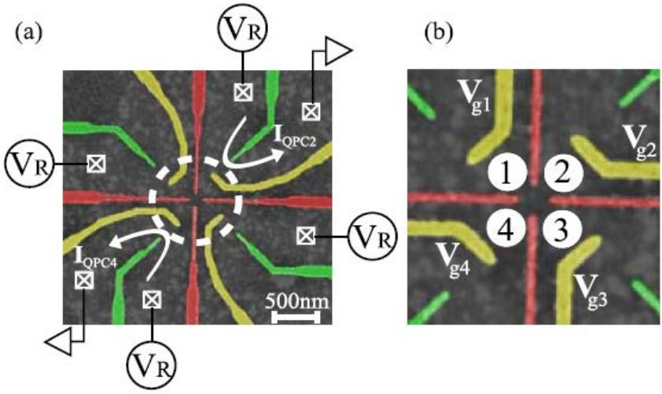  
图 5.1 (a)四量子点对称结构设计样品扫描电镜结构图。(b)量子点区域放大结构图。图片引自文献[1]

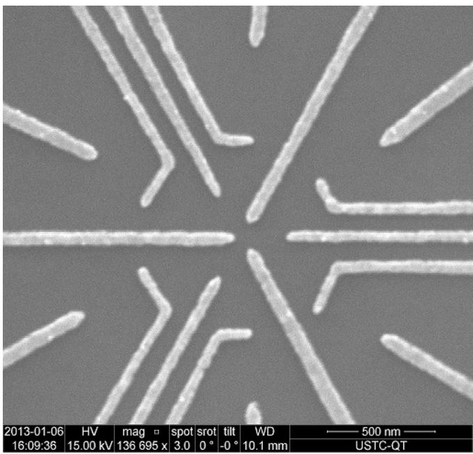  
图 5.2 对称的三电荷量子比特扫描电镜样品结构图。

我们参考这种设计方案，结合我们想要制作的三电荷量子比特的需求，我们设计了如图 5.2 所示的量子点结构。由三个相差 $1 2 0 ^ { \circ }$ 的中间电极将三个量子比特区分开来，三个电极中心有微小的间距，其目的是加强各个量子比特之间的耦合能量 J，每个量子比特通过中间的一个电极将其区分开成为两个量子点，中间的电极何以调节两个量子点之间的隧穿耦合能量。每个量子点都有单独的 QPC探测通道。由于三个量子比特之间结构为旋转对称，所以从理论上三个量子比特之间的地位是对等的。

通过实际样品制作和测量后我们发现，虽然这种结构能够实现理论行三个量子比特的完全等价，但是在实际测量中这种结构也有其困难的地方。首先，量子点很难以控制。由于相对于四量子点情况，在增加到六量子点条件下，每个量子点由于空间的限制导致被平均分配到的角度减小到60°。而且由于门电极很少，对于每个量子点只有一个电极可以调节，所以当想要调节量子点到少电子区域时，就很难加以调节。其次，QPC 通道信号较差。由于QPC 通道同样受到空间的挤压，导致 QPC 电极与两边门电极之间有很强的电容影响，当我们调节QPC 电极到其工作区域时就会发现 QPC 信号受到其他电极影响很大，导致本底噪声抖动剧烈，量子点中的电子跃迁信号在 QPC 上就会严重收到影响，从而很难以通过QPC 测量的结果进行分辨。最后，该结构在向更多量子比特扩展上也有本质上的困难。最终，我们经过对该结构的可扩展性以及量子比特的可控性等多因素的综合考量后，放弃这种对称结构在三电荷量子比特的研究。

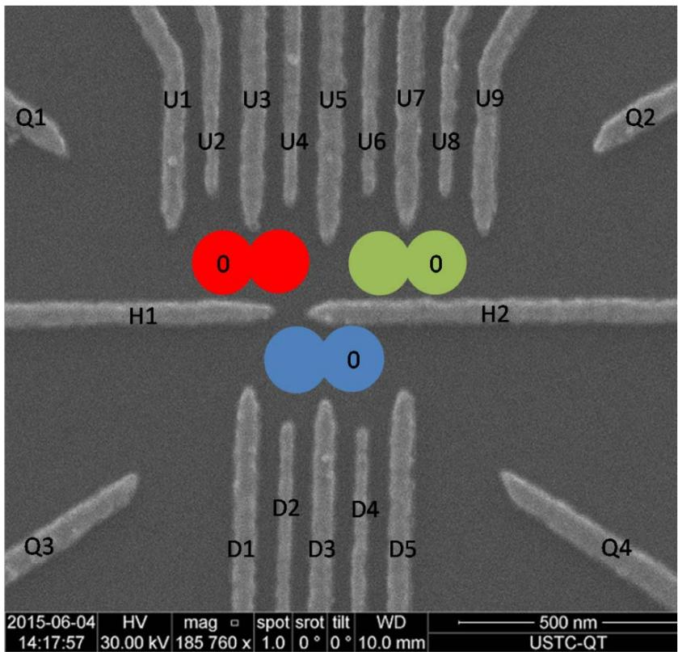  
图 5.3 非对称的两排的三电荷量子比特扫描电镜样品结构图。

我们将重新考虑三电荷量子比特的结构，参照双电荷量子比特后将其修改为如图5.3所示，可以看到其相当于在之前的两电荷量子比特的基础上在右边增加了一个电荷量子比特的方式组合而成。对于这种方案可以看到其在以后的多比特扩展中相对于上面的旋转对称结构展现出更大的优势，即是我们可以通过依次的水平添加的方式来实现。样品结构中中间水平电极的开口部分仍然保持，并且维持在原来两个电荷量子比特相对不变位置。经过对于这种结构在实验上实际测量，印证了对形成三个电荷量子比特的方案的可行性。我们先定义图中红色双量子点为量子比特 1，绿色双量子点为量子比特 2，蓝色双量子点为量子比特 3。我们可以看到由于三个量子比特位置的不对称性，其相互作用也是不完全对等的。量子比特 1 和量子比特 3 之间能够实现强耦合 $\mathrm { J } _ { 1 3 }$ 我们在上一章中就做了详细的介绍；量子比特 1 与量子比特 2 之间能够实现强耦合 $\mathbf { J } _ { 1 2 }$ 也是容易理解的，相当于我们把量子比特3的位置做了稍许移动，最终结果是相同的，也有许多研究小组将多个量子点制作成一排的形式[2,3]。最关键的问题就是量子比特2与量子比特3之间的耦合强度 $\mathrm { J } _ { 2 3 }$ 的大小问题。

我们在先前的样品结构测试中尝试过将中间水平电极制作成没有开口的情况。经过测量后发现上下量子比特在工作区域中上下之间的耦合能量很小，并且几乎很难加以调节，这也是我们后来将其制作成开口的原因。同样对照量子比特2 和量子比特 3，我们可以近似看做两个量子比特之间是通过一个没有缺口的电极隔开，对应其耦合能量也很小。通过实际在实验上的测量中也正好印证了我们这一想法，这为我们后续在处理 Toffoli 门过程中忽略量子比特 2 与 3 之间的相互作用关系提供了依据。

## 5.2 量子比特 Toffoli 逻辑门

对于我们上面所描述的三电荷量子比特，我们可以写出其系统的哈密顿量的表达形式。我们假设每个量子比特中只有一个电子，我们分别定义对于量子比特1，电子处于左边为 $| 0 >$ 态，那么在右边就为|1>态，对于量子比特2和3，电子处于右边为|0>态，那么在左边就是|1>态。系统的哈密顿量可以分别写成如下：

首先各个量子比特自身的哈密顿量形式为：

$$
H _ { q } = \frac { \varepsilon \sigma _ { z } + \Delta \sigma _ { x } } { 2 }\tag{5.1}
$$

对于量子比特 1 与量子比特 2 之间的耦合能量 $\mathbf { J } _ { 1 2 }$ ，分别对应量子比特 1 和量子比特2都处于|1>态，而量子比特3的状态则任意。故其表达式为：

$$
H _ { 1 2 } = J _ { 1 2 } \frac { I - \sigma _ { z } } { 2 } \otimes \frac { I - \sigma _ { z } } { 2 } \otimes I\tag{5.2}
$$

同样对于量子比特1与量子比特3之间的耦合能量 $\mathrm { J } _ { 1 3 }$ ，分别对应量子比特1和量子比特 3都处于|1>态，而量子比特2的状态则任意。故其表达式为：

$$
H _ { 1 3 } = J _ { 1 3 } \frac { I - \sigma _ { z } } { 2 } \otimes I \otimes \frac { I - \sigma _ { z } } { 2 }\tag{5.3}
$$

特殊情况为量子比特 2 和量子比特 3 之间的耦合能量 $\mathrm { J } _ { 2 3 }$ ，有图中可以看出此时应当对应量子比特2处于|1>态而量子比特3处于|0>态，所以其表达式为：

$$
H _ { _ { 2 3 } } = J _ { _ { 2 3 } } I \otimes \frac { I - \sigma _ { _ { z } } } { 2 } \otimes \frac { I + \sigma _ { _ { z } } } { 2 }\tag{5.4}
$$

综合起来，整个系统的哈密顿量应当为：

$$
\begin{array} { l } { { \displaystyle H _ { _ { 3 q } } = \frac { \mathcal { E } _ { 1 } \sigma _ { z } + \Delta _ { 1 } \sigma _ { x } } { 2 } \otimes I \otimes I + I \otimes \frac { \mathcal { E } _ { 2 } \sigma _ { z } + \Delta _ { 2 } \sigma _ { x } } { 2 } \otimes I } } \\ { { \displaystyle ~ + I \otimes I \otimes \frac { \mathcal { E } _ { 3 } \sigma _ { z } + \Delta _ { 3 } \sigma _ { x } } { 2 } + J _ { 1 2 } \frac { I - \sigma _ { z } } { 2 } \otimes \frac { I - \sigma _ { z } } { 2 } \otimes I } } \\ { { \displaystyle ~ + J _ { 1 3 } \frac { I - \sigma _ { z } } { 2 } \otimes I \otimes \frac { I - \sigma _ { z } } { 2 } + J _ { 2 3 } I \otimes \frac { I - \sigma _ { z } } { 2 } \otimes \frac { I + \sigma _ { z } } { 2 } } } \end{array}\tag{5.5}
$$

在实际情况下，我们考虑到 $\mathrm { J } _ { 2 3 }$ 耦合很小且远小于 $\mathrm { J } _ { 1 2 }$ 和 $\mathrm { J } _ { 1 3 }$ ，因此我们忽略掉它的影响，即可以简单认为量子比特2和量子比特3相互之间没有影响，这是由于我们所设计结构导致的，因此上式中的哈密顿量可以简化成5.6式所示：

$$
\begin{array} { l } { { \displaystyle H _ { 3 q } = \frac { \mathcal { E } _ { 1 } \sigma _ { z } + \Delta _ { 1 } \sigma _ { x } } { 2 } \otimes I \otimes I + I \otimes \frac { \mathcal { E } _ { 2 } \sigma _ { z } + \Delta _ { 2 } \sigma _ { x } } { 2 } \otimes I } } \\ { { \displaystyle \quad \quad + I \otimes I \otimes \frac { \mathcal { E } _ { 3 } \sigma _ { z } + \Delta _ { 3 } \sigma _ { x } } { 2 } + J _ { 1 2 } \frac { I - \sigma _ { z } } { 2 } \otimes \frac { I - \sigma _ { z } } { 2 } \otimes I } } \\ { { \displaystyle \quad \quad + J _ { 1 3 } \frac { I - \sigma _ { z } } { 2 } \otimes I \otimes \frac { I - \sigma _ { z } } { 2 } } } \end{array}\tag{5.6}
$$

我们分析这个三量子比特体系的哈密顿量可以发现，我们可将其看做是一个Toffoli 量子逻辑门，量子比特2和量子比特3作为控制比特，量子比特1作为目标比特，可以实现利用量子比特2和量子比特3来同时操控量子比特 1 的状态。

对于Toffoli 逻辑门做简短的介绍，Toffoli 逻辑门是指：在逻辑电路中，当两个控制比特都为1 态时，控制比特才会有0态变成 1 态或者由 1 态变成 0 态。相对于CNOT逻辑门，理论上我们可以通过对多个 CNOT门的逻辑电路串并联来实现，研究Toffoli 逻辑门的意义在于可以大幅度减少其中间的逻辑门操作步骤，提供更快的操作速率。而这在量子逻辑门的运算中意味着更少的操作步骤和在相同的操作时间内可以进行更多的量子逻辑运算，为以后量子计算机的实现提供借鉴作用。Toffoli 门写成数学上的矩阵形式如下：

$$
\begin{array} { r } { T o f \bar { f } o l i = \left( \begin{array} { l l l l l l l l } { 1 } & { 0 } & { 0 } & { 0 } & { 0 } & { 0 } & { 0 } & { 0 } \\ { 0 } & { 1 } & { 0 } & { 0 } & { 0 } & { 0 } & { 0 } & { 0 } \\ { 0 } & { 0 } & { 1 } & { 0 } & { 0 } & { 0 } & { 0 } & { 0 } \\ { 0 } & { 0 } & { 0 } & { 1 } & { 0 } & { 0 } & { 0 } & { 0 } \\ { 0 } & { 0 } & { 0 } & { 0 } & { 1 } & { 0 } & { 0 } & { 0 } \\ { 0 } & { 0 } & { 0 } & { 0 } & { 0 } & { 1 } & { 0 } & { 0 } \\ { 0 } & { 0 } & { 0 } & { 0 } & { 0 } & { 0 } & { 0 } & { 0 } \\ { 0 } & { 0 } & { 0 } & { 0 } & { 0 } & { 0 } & { 1 } & { 0 } \\ { 0 } & { 0 } & { 0 } & { 0 } & { 0 } & { 0 } & { 1 } & { 0 } \end{array} \right) } \end{array}\tag{5.7}
$$

在这里，对于我们的三个电荷量子比特系统，Toffoli 逻辑门的实现思路如下：当我们两个控制比特都处在|1>态时会对目标比特有各自的耦合J 值的影响，因此，我们首先将量子比特 2和3调节到|1>态，在目标量子比特1上施加非绝热矩形脉冲使其到达平衡点从而有拉莫振荡出现，量子比特1会在布洛赫球面上的|0>态和|1>态之间翻转。当我们改变量子比特2或3的量子状态时，使其两个量子比特不全都同时都处于|1>态，由于耦合能量 $\mathrm { J } _ { 1 2 }$ 和 $\mathrm { J } _ { 1 3 }$ 的作用,使得施加在量子比特1上脉冲不能够到达平衡点处，其拉莫振荡被抑制，抑制的程度由耦合能量$\mathrm { J } _ { 1 2 }$ 和 $\mathrm { J } _ { 1 3 }$ 的大小决定，这里在第四章中我们有过详细的讨论，其作用原理完全相同，当抑制足够大时，我们就会完全看不到量子比特1的翻转效果，这样我们就实现了量子比特1在量子比特 2和量子比特3的共同作用下的Toffoli 量子逻辑门。

## 5.3 Toffoli 逻辑门实验测量

为了实现Toffoli 逻辑门，我们首先需要将三个量子比特各自都调节到标准的双量子点区域，这是实现我们逻辑门操作的最基础条件。如图5.4所示，我们分别将三个量子比特调节到少电子的双量子点区域，图中5.4(a)为量子比特1的最后少电子区域相图，图中浅绿色线的椭圆形区域为操作的双量子点位置，图中5.4(b)为量子比特2的最后少电子区域相图，图中红色线的椭圆形区域为操作的双量子点位置，图中 5.4(c)为量子比特3的最后少电子区域相图，图中蓝色线的椭圆形区域为操作的双量子点位置。

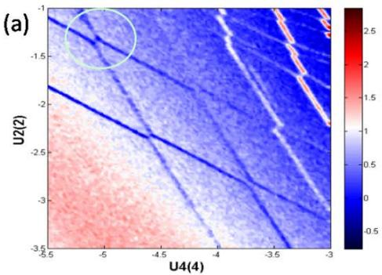

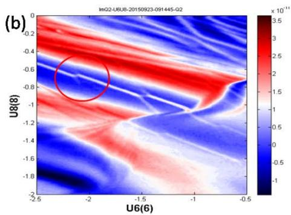

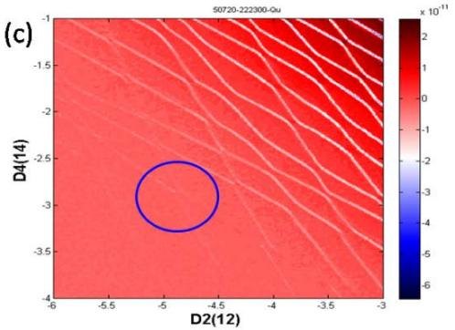

图 5.4 (a)-(c)分别为三个量子比特各自蜂窝图，图中椭圆圈部分为选取实验测量的双量子点区域。

对于这三个量子比特，我们首先需要实现量子比特1 分别与量子比特2和量子比特3之间的强耦合 $\mathrm { J } _ { 1 2 }$ 和 $\mathrm { J } _ { 1 3 }$ 。简要的概述其调节过程为：首先选取我们固定的电子数目位置，然后通过调节水平电极 $\mathrm { H } _ { 1 }$ 和 $\mathrm { H } _ { 2 }$ 实现量子比特1和量子比特3之间能够达到强耦合 $\mathrm { J } _ { 1 3 }$ ，再通过调节中间公共电极U5使得量子比特1和量子比特2之间能够达到强耦合 $\mathrm { J } _ { 1 2 }$ ，最后分别通过调节每个量子比特内部中间的门电极，使得量子比特内部有合适的2t 大小，以便于我们通过施加矩形脉冲进行操作。经过这一整套的调节过程之后，我们就完成了Toffoli 逻辑门操作实验的准备工作。

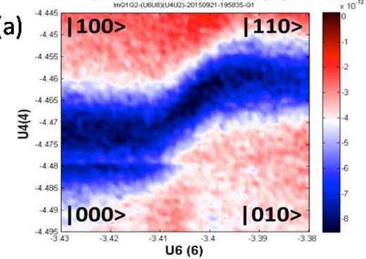

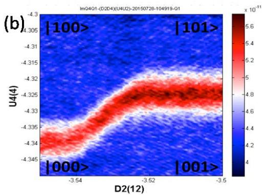

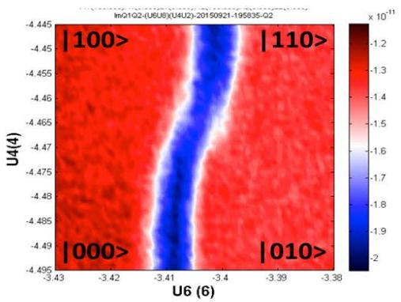

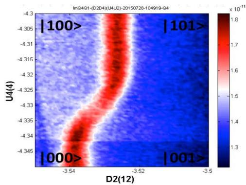  
图 5.5 量子比特之间耦合能量J的测量。(a)量子比特1与2 之间耦合能量 ${ \bf J } _ { 1 2 }$ 的测量图像，测量结果 $\mathbf { J } _ { 1 2 } { = } 9 5 \mathrm { u e V }$ 。(b) 量子比特 1 与 3 之间耦合能量 $\mathrm { J } _ { 1 3 }$ 的测量图像，测量结果$\mathbf { J } _ { 1 3 } { = } 1 4 0 \mathbf { u e } \mathbf { V }$

实验中测量的 $\mathrm { J } _ { 1 2 }$ 和 $\mathrm { J } _ { 1 3 }$ 方法与两电荷量子比特相同，通过门电极的电压能量转换系数可以分别计算得到相应的耦合能量大小。如图 5.5(a)-(b)所示，5.5(a)图为测量量子比特1与量子比特 2的耦合能量 $\mathrm { J } _ { 1 2 }$ 的图像，可以看到 $\mathrm { J } _ { 1 2 }$ 值的变化为从|000>态到|110>态的跳变过程，我们在测量过程中保持量子比特 3 不变。测量结果通过电压能量转换之后得到 $\scriptstyle \mathbf { J } _ { 1 2 } = 9 5 \mathbf { u e V }$ 。同样 5.5(b)图为量子比特 1 与量子比特 3 的耦合能量 $\mathrm { J } _ { 1 3 }$ 的图像，量子点中电子状态的变化为从|000>态到|101>态，同样可以得到 $\mathbf { J } _ { 1 3 } { = } 1 4 0 \mathrm { u e V }$ 。由此可以看到量子比特1与量子比特2和 3都达到了较强的耦合区域，为我们最终的Toffoli 逻辑门操作演示提供基础。

这里我们静态的演示Toffoli 逻辑门实验操作结果。如图5.6所示，我们在量子比特1上加上矩形脉冲并且量子比特的位置刚好为当量子比特2和3刚好都为|1>态时，脉冲使得量子比特1到达能量失谐平衡点处，此时量子比特 1的状态为在脉冲下|0>态和|1>态的拉莫振荡，如图5.6(a)中所标注的|\*11>态所示，横轴为施加在量子比特1上的脉冲宽度，我们测量的为量子比特1的电导变化。可以看到有振荡的出现。我们沿着竖轴即是量子比特3的失谐量进行变化，当量子比特3从|1>态变成|0>态时，量子比特1的脉冲由于受到耦合能量 $\mathrm { J } _ { 1 3 }$ 的抑制影响而不能到达平衡点，故在 $| { ^ \ast } 1 0 >$ 态中没有看到振荡。然后我们改变量子比特2的状态，将其从之前的|1>态调节为|0>态，再按照同样的方法分别可以得到图 5.6(b)的图像，由于整个过程都受到 $\mathrm { J } _ { 1 2 }$ 的抑制影响，我们同样可以看到在三个量子比特为 $| { ^ { * } 0 1 } >$ 态和 $| ^ { * } 0 0 >$ 态中，量子比特 1 始终没有振荡出现。

(a)  
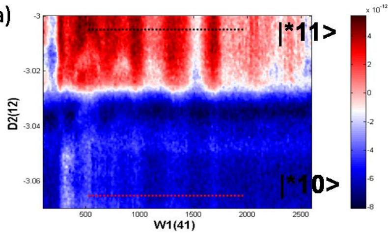

(b)  
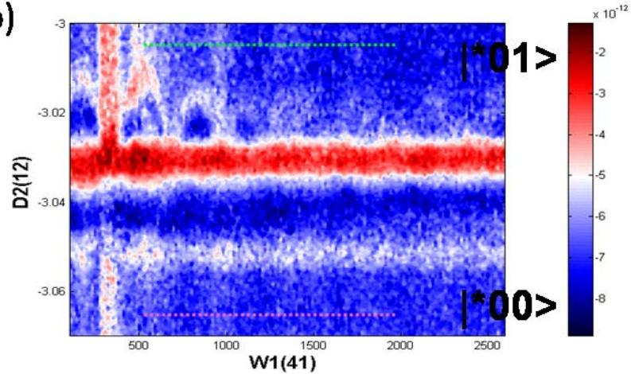

图 5.6 量子比特2 和3在不同量子状态下量子比特1 随脉冲宽度的演化测量图。(a)量子比特2处于|1>态时，量子比特1的演化随脉冲宽度和量子比特3的量子状态变化测量图。(b) 量子比特2 处于|0>态时，量子比特1的演化随脉冲宽度和量子比特3的量子状态状态变化测量图。

我们从测量出的数据中沿着 $\mathrm { W } _ { 1 }$ 的方向取线，分别截取量子比特2和量子比特3四种不同状态下量子比特 1的电导变化，即是对应图5.6中虚线的部分。提取的数据图如5.7所示，可以明显的看到量子比特1中读取的电导变化只有当量子比特2和3都处在|1>态时才会有振荡，而其余条件下没有振荡出现。

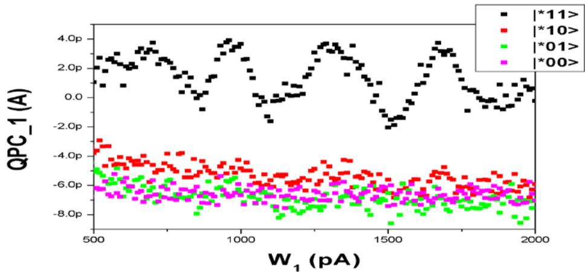  
图 5.7 量子比特 1在量子比特2 和 3 在不同量子状态下随脉冲宽度变化的数据图。可以看到只有在量子比特 2和3都处在|1>态时。量子比特1才会在脉冲作用下进行翻转。

想要实现同双电荷量子比特一样在三电荷量子比特中Toffoli 逻辑门的动态演示并且能够测量其门操作的保真度，这就需要我们对量子比特2和量子比特3都能够有很好的脉冲控制，并且能够同时同步控制施加在三个量子比特的操控脉冲信号，这对我们目前还是一个不小的挑战。因为要想做到多路信号在样品上同步就需要我们能够有更加清晰的量子点探测信号，更好的脉冲信号源以及能够减小多路信号之间在样品上的相互干扰等一系列问题，所以我们目前还在继续向着三个电荷量子比特动态操作而继续努力。

## 5.4 本章小结

本章主要介绍了我们在三个电荷量子比特目前的一些研究工作，主要包括前期对于三个量子比特的结构设计与讨论，在确定了设计方案后，讨论了对于这种非完全对称的结构中不同的耦合情况对于哈密顿量书写的变化，结合实际测量的结果，我们忽略掉量子比特2与量子比特3之间的微笑耦合能量 $\mathrm { J } _ { 2 3 }$ 。这样对于我们这个体系得到极大的简化，就可以类比于我们之间的双电荷量子比特的情况，可以实现对目标比特的Toffoli 量子逻辑门操作。

接下来我们从实验室上制备出了这种三电荷量子比特结构的样品，通过筛选和调节，实现了完成 Toffoli 量子逻辑门操作的强耦合需求，最后我们通过静态的调节量子比特2和 3的状态，实现了对目标比特1的Toffoli 量子逻辑门的操控。虽然我们没有完成动态的逻辑门操作，但是我们所展现的可行性为以后多量子比特之间的逻辑门操控提供了借鉴意义。

## 参考文献

[1] Romain Thalineau, Sylvain Hermelin, Andreas D.Wieck, Christopher Bauerle, Laurent Saminadayar, and Tristan Meunier, A few-electron quadruple quantum dot in a closed loop, Applied Physics Letters 101, 103102(2012)

[2] F.R.Braakman, P.Barthelemy, C.Reichl, W.Wegscheider, and L.M.K.Vandersypen, Long-distance coherent coupling in a quantum dot array, Nature Nanotechnology 8, 432-437(2013)

[3] F.R.Braakman, P.Barthelemy, C.Reichl, W.Wegscheider, and L.M.K.Vandersypen, Photonand phonon-assisted tunneling in the three-dimensional charge stability diagram of a triple quantum dot array, Applied Physics Letters 102, 112110(2013)

[4] K.C.Nowack, M. Shafiei, M. Laforest, G.E.D.K.Prawiroatmodjo, L.R.Schreiber, C. Reichl, W. Wegscheider, L.M.K.Vandersypen, Single-Shot Correlations and Two-Qubit Gate of Solid-State Spins, Science 333,1236(2011)

[5] M.D.Shulman, O.E.Dial, S.P.Harvey, H.Blihm, V. Umansky, A.Yacoby, Demonstration of Entanglement of Electrostatically Coupled Singlet-Triplet Qubits, Science 336, 202 (2012).

## 第 6 章 总结与展望

## 6.1 总结与不足

本论文核心内容是，在极低温环境下对 GaAs/AlGaAs 半导体异质结制备的双电荷量子比特以及三电荷量子比特的在脉冲控制下的操控展开的研究工作。

论文的第一章主要对量子计算的基本概念以及门控型半导体量子点做了简要的介绍。通过对半导体体系中二维电子气性质的描述，使我们对门控量子点的形成和调控有了基本的概念。随后通过介绍基本的对单量子点和双量子点描述的长相互作用模型，使我们对其中一些基础的物理概念如电化学势、库伦阻塞、充电能、库伦振荡、库伦菱形、共振隧穿等有了直观的理解，为我们对多个量子点结构提供了基础。在而后介绍串联双量子点系统中，我们通过分析双量子点中的充电蜂窝图能级结构的变化，使我们了解量子点中的耦合能量 2t 对于蜂窝图的影响，以及在有源漏偏压的条件下的偏压三角形的形成的基本分析。最后我们介绍了量子点系统中利用量子点接触(QPC)的几种量子点测量方法以及对量子点本身弛豫时间和退相干时间的概念做了简单介绍。

第二章我们主要介绍了三个方面的内容。第一个方面为制备样品所需要使用的仪器设备以及具体的制备流程，包括使用最多的紫外光学曝光刻机、电子束曝光机和电子束蒸发镀膜机，特别是电子束曝光机的使用步骤，曝光图形的绘制和曝光参数的设定都做了详细的介绍。这些也是在半导体产业中最常使用的仪器设备。接下来对整个样品的加工流程做了详细的介绍，从初始的紫外光刻、湿法刻蚀、金属镀膜、高温退火和电子束曝光，这一整套的微纳加工流程使得我们对量子点的制作有清晰的认识。第二个方面是对测量系统及其改造做了简要的介绍。介绍了我们所拥有的低温测量平台以及我们为多量子比特测量对平台进行的改造工作。最后一方面为对我们所需要使用的GaAs 晶圆在低温下的电子浓度和电子迁移率的基本性质利用量子霍尔效应进行测量的方法，并且介绍了利用 HallBar和制备单量子点结构来对晶圆稳定性进行判断方法，为我们后续制备稳定的样品提供保障。

第三章中我们主要针利用对双量子点形成的单电荷量子比特系统进行操控的介绍。首先给出了对单量子比特的图像，利用电子在能量简并点附近的分布，可以拟合出双量子点内耦合能量 2t 的大小。接着介绍了在连续微波驱动下量子点的光子辅助隧穿(PAT)现象，对量子比特吸收光子发生跃迁这个过程给出了解释。利用不同频率的光子，同样可以拟合出耦合能量 2t 和电压能量转换系数α。

接下来我们描述了在脉冲驱动下的拉莫振荡和 LZS 效应，分别通过布洛赫球面详细描述了在脉冲驱动下其的演化过程，使我们对单电荷量子比特的操作有了详细的了解。最后我们通过绝热的微波驱动，展示了电荷量子比特在微波操控下拉比振荡以及利用斩波技术控制的 Ramsey操作，展示了电荷量子比特状态在微波操控下的任意操作方法。

第四章描述了我们在双电荷量子比特上的相干操控。通过设计出了上下非对称和中间开口特点的样品结构，使得我们的两电荷量子比特不仅能够达到强耦合区域，而且还能够利用同步的脉冲信号进行动态的同步逻辑非门操作。通过详细的模拟计算，使我们看到双量子比特之间的强耦合对逻辑非门的操作保真度有着直接的影响，对其最大纠缠度也直接相关，以及退相干时间对保真度和纠缠度的影响。最后我们给出了通过实验测量的量子逻辑非门的图像。在通过振幅控制下的逻辑非门，我们测量到的操作保真度为 68%，以及使用 LZS 效应展示了相位控制下的逻辑非门图像。最后我们给出了其具体物理计算过程并附上了使用Python并行计算的程序，可以使我们能更好的理解其量子态的演化过程。

第五章是我们在双电荷量子比特基础上对三电荷量子比特的一些研究工作。通过对不同设计结构实际测量和分析，我们选择在双电荷量子比特的基础上进行的扩展的方式来设计我们使用的三电荷量子比特结构。在对系统进行哈密顿量描述后，我们结合实验上测量到量子比特2与量子比特3由于结构设计而导致的耦合能量小的特点，忽略掉它们的相互作用，从而为我们的 Toffoli 门提供基础。我们通过实验测量调节，同时实现了 $\mathrm { J } _ { 1 2 }$ 和 $\mathrm { J } _ { 1 3 }$ 的强耦合，并且静态的演示了在两个控制比特的共同控制下，目标比特的受控翻转。

本论文实现了对多电荷量子比特系统的相干操控，不仅实现了两个耦合电荷量子比特的逻辑非门操作，其保真度达到了 68%和相对应的数值模拟计算，也展示了三个耦合电荷量子比特的静态 Toffoli 逻辑门的控制。但是也存在一些不足之处，很多地方有待改进。以下为我们在目前基础上需要提高的部分：

1、提高QPC 探测通道的信号强度。我们可以看到不管是在我们的双电荷量子比特还是三电荷量子比特系统中，我们信号的相对强度是比较弱的。系统的本底噪声较大，这对于我们后续的测量保真度以及门操作都有着严重的影响。通过设计更加合理灵敏的QPC 探测通道，降低测量系统的背景噪声才有助于我们得到更好的实验结果。

2、提高门操作保真度。在双电荷量子比特系统上，虽然我们进行了振幅控制的保真度的测量，但是其保真度仅为 68%，相对于我们我们模拟计算中考虑了${ \mathrm { T } } _ { 2 } ^ { * }$ 的影响情况下其保真度为 89%来说还是小了不少。因此对于提高单个和多个量子比特操作的保真度对后续的量子计算才有实际使用意义。

3、相位操作的具体结果。我们对于我们的双电荷逻辑非门只提供了振幅控制下的保真度测量，而对于相位控制的演化只是提供了操作演示图而并没有具体的数值。这是因为我们的信号太弱导致数据的提取较困难，能够给出具体的相位控制图像才是完整的量子逻辑非门的操控。

4、更加普适的门操控。虽然我们演示了利用 LZS 操控来实现对控制量子比特的任意操控，但是在实际上利用 LZS 过程很难控制我们需要的精确相位，而使用绝热的微波操控才是最容易实现的操作手法。我们应该尝试使用微波的控制手法来实现任意的输入相位和控制状态，这样才能实现一个简单易控的量子逻辑非门。

5、更长的退相干时间。对于我们所使用的砷化镓体系，由于其较短的退相干时间使得我们的操作受到限制，利用拥有更长退相干时间的体系，如 Si、SiGe等或者利用自旋的编码方式来制作量子逻辑门，就能够进行更多的量子逻辑门运算。

6、对于三电荷量子比特系统，实现动态的逻辑门操控才有更加实际的应用意义。但是在目前由于样品性质，测量的QPC 信号以及控制脉冲同步等一些列的困难还未能得到良好的改善，使我们测量到的数据结果一直不理想。但是，目前我们还在继续去努力克服所遇到的困难，争取能够实现动态的量子 Toffoli逻辑门操作。

## 6.2 展望

如何实现大规模的量子计算一直是目前量子研究领域的热门方向之一，而在固态半导体体系中，由于其本身相对于传统的计算有着许多类似之处，又是利用电学来进行控制操作，有着相对于其他体系巨大的现实优势。澳大利亚Dzurak小组的研究工作也演示了在硅上的电子自旋的交换相互作用的量子逻辑非门操控[6]，这说明量固态量子体系对与各种量子逻辑门的操控和扩展研究一直是量子计算领域一个十分突出的目标方向。只有实现了大规模的量子逻辑门的扩展，量子计算机才有可能成为现实。我们也尝试了制备四量子比特的扩展结构以及量子点与微波超导腔的结合，如图6.1所示。利用多量子比特之间的相互耦合，实现量子态的量子比特之间传递也是目前一个十分有意思的研究课题之一。而利用微波超导腔来实现对多个量子比特之间耦合，通过超导谐振腔的高 Q 值探测量子点中的状态信息也有不少的研究工作和成果[1-5]。

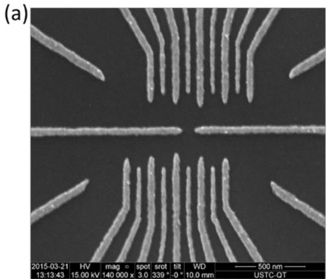

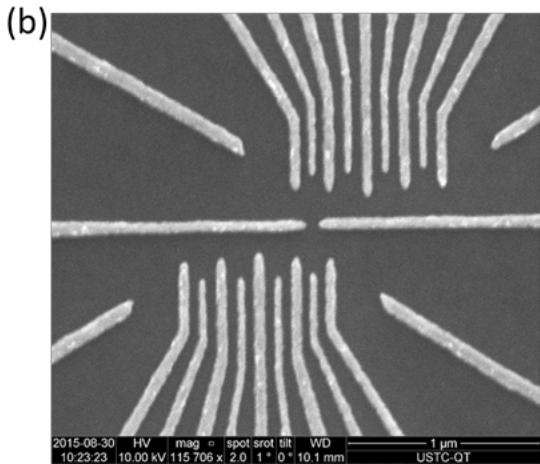  
图 6.1 (a)为四电荷量子比特结构，每个 QPC 结构为对应测量旁边量子点。(b)为串联四点荷量子比特结构，其目的是尝试研究相互强耦合量子比特之间的量子态传递过程

对于多量子比特的相干操控将一直是量子计算领域的一个重要方向，对于如何提升多量子比特之间的耦合强度，相干操控时间、操控的保真度等一系列的问题需要我们从不同的体系，新的结构材料，操控手段等多方面进行探索和创新。解决多量子比特的耦合纠缠或者不同量子体系的结合之后，实现大规模的量子计算就值得期待。

## 参考文献

[1] L. DiCarlo, J.M.Chow, J.M.Gambetta, Lev S.Bishop, B.R.Johnson, D.I.Schuuster, J.Majer, A, Blais, L.Frunzio, S.M.Girvin, and R.J.Schoelkopf , Demonstration of two-qubit algorithms with a superconducting quantum processor. Nature 460, 240–244 (2009).

[2] C.M.Quintana, K.D.Petersson, L.W.McFaul, S.J.Srinivasan, A.A.Houck, and J.R.Petta, Cavity-Mediated Entanglement Generation Via Laudau-Zener Inerferometry, Physical Review Letters 110, 173603(2013).

[3] Y.Y. Liu, K.D.Petersson, J. Stehik, J.M.Taylor, and J.R.Petta, Photon Emission from a Cavity-Coupled Double Quantum Dot, Physical Review Letters 113, 036801(2014).

[4] Guang-Wei Deng, Da Wei, J.R.Johansson, Miao-Lei Zhang, Shu-Xiao Li, Hai-Ou Li, Gang Cao, Ming Xiao, Tao Tu, Guang-Can Guo, Hong-Wen Jiang, Franco Nori, and Guo-Ping Guo, Charge Number Dependence of the Dephasing Rates of a Graphene Double Quantum Dot in a Circuit QED Architecture, Physical Review Letters 115, 126804(2015).

[5] Guang-Wei Deng, Da Wei, Shu-Xiao Li, J.R.Johansson, Wei-Cheng Kong, Hai-Ou Li, Gang Cao, Ming Xiao, Guang-Can Guo, Franco Nori, Hong-Wen Jiang, and Guo-Ping Guo, Coupling Two Distant Double Quantum Dots with a Microwave Resonator, Nano Letters 15(10) 6620-6625(2015).

[6] M. Veldhorst, C. H. Yang, J. C. C. Hwang, W. Huang, J. P. Dehollain, J. T. Muhonen, S. Simmons,A. Laucht, F. E. Hudson, K. M. Itoh, A. Morello, and A. S. Dzurak1, A two-qubit logic gate in silicon, Nature 410, 526(2015)