# 博士学位论文

## 半导体量子点-高阻抗谐振腔杂化系统的基本表征与动力学研究

作者姓名： 顾思思

学科专业： 物理学

导师姓名： 曹刚 教授 郭国平教授

完成时间： 二〇二三年二月十八日

# University of Science and Technology of China A dissertation for doctor’s degree

# Basic characterization and dynamics of semiconductor quantum dot-high impedance cavity hybrid systems

Author: Si-Si Gu

Speciality: Physics

Supervisors: Prof. Gang Cao, Prof. Guo-Ping Guo

Finished time: February 18, 2023

## 中国科学技术大学学位论文原创性声明

本人声明所呈交的学位论文，是本人在导师指导下进行研究工作所取得的成果。除已特别加以标注和致谢的地方外，论文中不包含任何他人已经发表或撰写过的研究成果。与我一同工作的同志对本研究所做的贡献均已在论文中作了明确的说明。

作者签名：

签字日期：

## 中国科学技术大学学位论文授权使用声明

作为申请学位的条件之一，学位论文著作权拥有者授权中国科学技术大学拥有学位论文的部分使用权，即：学校有权按有关规定向国家有关部门或机构送交论文的复印件和电子版，允许论文被查阅和借阅，可以将学位论文编入《中国学位论文全文数据库》等有关数据库进行检索，可以采用影印、缩印或扫描等复制手段保存、汇编学位论文。本人提交的电子文档的内容和纸质论文的内容相一致。

保密的学位论文在解密后也遵守此规定。

□✓ 公开 □ 保密（ 年）

作者签名：

导师签名：

签字日期：

签字日期：

## 摘 要

电路量子电动力学系统可以实现量子比特和超导微波谐振腔之间的耦合，是一个研究光与物质相互作用的理想平台。近年来，由于电路量子电动力学可以实现长程相干耦合、量子系统状态读出以及研究各种量子光学效应，所以受到了研究者的广泛关注。半导体量子点作为一种“人造原子”，具有可调性强、电偶极矩可观等优点，是电路量子电动力学架构的理想组成部分。基于样品结构的优化和制备工艺的进步，国际上已经实现了半导体量子点比特和腔的强耦合以及腔光子介导的两个半导体比特间的长程耦合等，这也为电路量子电动力学在实现比特的大规模扩展、实现量子信息处理方面的应用奠定了基础。而且由于半导体量子点中，存在自旋轨道相互作用、电声相互作用、谷能级等效应，进一步丰富了系统中的物理现象。本文集中于砷化镓半导体量子点和超导腔的耦合系统，研究了电子-光子相互作用、周期性驱动下的动力学行为等。全文的主要内容包括以下几点：

1. 介绍了基于半导体量子点的电路量子电动力学架构。结合电路量子电动力学的发展与应用，讨论了高阻抗腔所起的重要作用。介绍了周期性驱动的应用；

2. 介绍了高阻抗腔的基本理论和工艺、耦合样品结构、样品测量、提取样品参数的方法以及周期性驱动的理论；

3. 利用SQUID阵列反射腔实现了对砷化镓三量子点的表征，并研究了三量子点中的量子元胞自动机、光子辅助的四重点等现象；

4. 我们通过对砷化镓双量子点施加周期性的强驱动，产生了等效的粒子数反转。因此受驱动的双量子点可以作为腔的增益介质，进而导致了腔光子的产生，实现了腔透射幅值的增益。我们详细地研究了腔透射幅值的增益随不同的驱动参数以及双量子点参数的变化；

5. 我们进一步提高了砷化镓双量子点和腔的耦合强度，并针对周期性驱动下的单个、两个双量子点-腔耦合系统，研究了耦合系统的Floquet态行为。为了描述这个系统并揭示背后的物理机制，我们发展了一个新的响应理论，并利用其复现和解释了实验中观察到的现象。

本文的创新点则可以总结为如下几点：

1. 在实验上首次用腔探测到了量子元胞自动机现象、光子辅助的四重点，为研究多量子点-腔耦合系统的研究奠定基础；

2. 在砷化镓双量子点上，我们利用周期性驱动，实现了向耦合腔发射光子，并观察到了腔透射幅值的增益以及详细研究了增益随不同系统参数的变化，为

利用量子点实现对腔光场的调制、实现可控的片上微波源和放大器积累了技术经验；

3. 在实验上研究了周期性驱动下的多个双量子点-腔耦合的系统，并为此提出了一个新理论。新理论适用于具有任意大耦合强度的、多个比特的杂化系统，为理解受驱动的耦合系统提供了一个新角度，加深对耦合系统的 Floquet 态的理解，在可扩展的量子系统方面具有广阔的运用前景。

关键词：电路量子电动力学，砷化镓半导体量子点，光与物质相互作用，周期性驱动系统，Floquet 态

## ABSTRACT

Circuit quantum electrodynamics (circuit QED) systems can realize the coupling between qubits and superconducting microwave resonators, which is an ideal platform for studying light-matter interactions. In recent years, the circuit QED system has attracted widespread attention due to its application in realizing long-range coherent coupling and quantum system state readout, and its feasibility of studying the various phenomena in quantum optics. Taking advantage of high tunability and considerable electric dipole moment, semiconductor quantum dot (QD), as an ”artificial atom”, is an ideal component of circuit quantum electrodynamic architecture. Benefiting from the advances in device structure and fabrication processes, the strong coupling of semiconductor qubits and cavities as well as the cavity-mediated long-range coherent coupling between two semiconductor qubits have been realized, which lays the foundation for the applications of circuit QED in the scaling-up to large qubit arrays and quantum information processing. Moreover, semiconductor QD embraces rich underlying physics, such as spin-orbit interactions, electron-phonon interactions, valley energy levels, etc. This paper focuses on the GaAs semiconductor QD-superconducting cavity system, and investigates the electron-photon interaction and the dynamics ofperiodically driven systems. The main contents of the full text include the following points:

1. The semiconductor QD-based circuit QED systems, the important role that the high-impedance cavity played in the development of circuit QED architecture, and the applications of periodic driving are introduced;

2. We introduce the theoretical description and fabrication processes of highimpedance cavities, the structure of the hybrid sample, the measurement circuit, methods of parameter extraction, and the basic theory for periodic driving;

3. The SQUID array cavity is used to characterize the GaAs triple quantum dots. And we investigate the quantum cellular automata and photon-assisted quadruple point in the charge stability diagram;

4. By applying a periodic strong drive to a GaAs double quantum dot (DQD), we achieve an effective population inversion in the DQD. The driven DQD could act as the gain medium of the cavity, leading the cavity photon generation and, thus, achieving the cavity transmission amplitude gain. Furthermore, we investigate the influence of different driving and DQD parameters on the cavity gain in detail;

5. We further improve the coupling strength between the GaAs DQD and the cav-

ity, and study the behavior of the Floquet state of a single DQD-cavity and a two DQDcavity system with periodic drivings. A new response theory has been developed, which allows the descriptions of settings with large coupling strengths and multiple DQDs. And within the theoretical framework, we reproduce and explain the observed phenomena well.

The originality of this thesis can be summarized as follows:

1. It’s the first time to experimentally detect the quantum cell automata and photon-assisted quadruple points via a cavity. Our work lays the groundwork for the investigation of multi-QD-cavity systems;

2. The periodically driven GaAs DQD enables the emission of photons into the cavity, contributing to the transmission amplitude gain. In addition, the dependence of gain on different system parameters is systematically studied in detail. Our results make a step towards the QD-based engineering ofthe cavity field as well as controllable on-chip microwave sources and amplifiers;

3. The systems consisting of multiple DQDs and a cavity with periodic drivings are experimentally studied. A new theory applicable to the hybrid systems containing multiple qubits with arbitrary coupling strengths is proposed, which offers a new perspective for understanding periodically driven hybrid systems, provides a more profound insight into the Floquet states and may motivate future applications in scalable hybrid quantum systems.

Key Words: Circuit quantum electrodynamics; GaAs semiconductor quantum dots; light-matter interaction; periodically driven system; Floquet states

## 目 录

第 章 绪论  
1.1 电路量子电动力学  
1.2 门控半导体量子点  
1.3 一维平面超导腔  
1.4 半导体量子点和腔的耦合原理  
1.5 高阻抗腔在电路量子电动力学系统中的应用 · · 8  
1.5.1 量子信息处理方面的应用 8  
1.5.2 基于腔实现的对量子点信号的探测 10  
1.5.3 电路量子电动力学中的量子光学·  
1.6 周期性驱动与量子点-腔耦合系统· 12  
1.7 本章小结 13  
1.8 论文结构 13  
参考文献 14  
第 2 章 实验方法与基本理论· 20  
2.1 高阻抗腔 20  
2.1.1 SQUID 阵列腔· 20  
2.1.2 高动态电感材料谐振腔 23  
2.1.3 腔的耗散 24  
2.1.4 输入输出理论 25  
2.2 耦合样品的结构以及工艺 26  
2.3 测量线路 28  
2.4 样品的基本表征和参数提取 30  
2.4.1 量子点的基本表征 31  
2.4.2 腔性质的基本表征 32  
2.4.3 量子点-腔耦合性质的基本表征 33  
2.5 周期性驱动的基础理论 35  
2.5.1 LZSM 干涉 36  
2.5.2 Floquet 理论 38  
附录 2.A SQUID 阵列腔工艺 40  
附录 2.B 铌钛氮腔制备工艺·  
附录 2.C 样品封装  
参考文献 · 43  
第 3 章 腔探测的三量子点的基本表征· 46  
3.1 三量子点 46  
3.2 样品基本结构  
3.3 理论描述 48  
3.4 三量子点的电荷稳态图以及量子元胞自动机 · · 51  
3.5 光子辅助的四重点 53  
3.6 腔探测的自旋阻塞信号 55  
3.7 本章小结 57  
参考文献 59  
第 4 章 基于周期驱动的双量子点实现的腔光子增益 · 63  
4.1 研究背景 63  
4.2 样品基本结构 64  
4.3 腔幅值增益 · 65  
4.4 受驱动的双量子点系统的Floquet理论· · 66  
4.5 实现增益的必要条件：粒子数反转以及良好的系统性能 · 67  
4.6 增益随系统参数的调制 69  
4.7 本章小结 · 72  
附录 4.A 耦合系统模型 74  
附录 4.B 线性响应理论· 74  
附录 4.C 受驱动的双量子点系统的 Floquet-Bloch-Redfield 理论  
参考文献 79  
第 5 章 两个受驱动的双量子点和腔耦合系统的研究 82  
5.1 研究背景 82  
5.2 样品基本结构· 83  
5.3 色散读出理论的局限性 84  
5.4 受驱动的双量子点和腔耦合系统的响应理论 · · · 86  
5.4.1 输入输出关系 87  
5.4.2 非平衡微扰理论 87  
5.4.3 受周期性驱动的系统 89  
5.4.4 耦合系统的 Floquet 理 90  
5.4.5 耦合系统的 Floquet-Bloch-Redfield 方程 91  
5.4.6 响应函数 · · 93  
5.5 单个受驱动的双量子点-腔耦合系统的 LZSM 干涉图 · · 94  
5.6 两个受驱动的双量子点-腔耦合系统的频谱 · 96  
5.7 本章小结 · · · · · · 98  
附录 5.A 周期性驱动的双量子点 2 和腔耦合系统· · · · 99  
附录 5.B 数据处理 · · · · · 100  
参考文献 · · · 101  
第 6 章 总结与展望 · · · · · · 104  
6.1 总结 · · · 104  
6.2 展望 · · · 105  
参考文献 · · · · 108  
致谢 · · · · · · 112  
在读期间发表的学术论文与取得的研究成果· · · 114

## 第 1 章 绪 论

## 1.1 电路量子电动力学

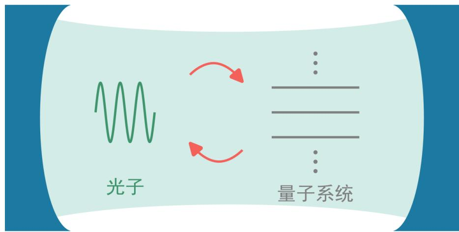  
图 1.1 腔量子电动力学结构示意图。这里的量子系统一般指各种原子，而腔一般是三维腔和光学腔。

光与物质的相互作用是诸多物理效应的核心，是电磁学、量子光学等学科的研究重点之一，在光谱学、传感、激光等各方面都具有广泛的应用。而腔量子电动力学（cavity quantum electrodynamics，CQED）能够在量子水平上研究原子和腔光子的相互作用。图1.1展示了腔量子电动力学的结构示意图。利用三维腔和光学腔，人们已经在实验上实现了激发态在 Rydberg 原子[1]、alkali 原子[2] 等原子和腔光子之间的相干传递。随着技术手段的进步，许多工作致力于将腔量子电动力学在一个芯片上实现，即实现固态体系上的“人造原子”（超导比特、半导体量子点等）和准一维超导腔的耦合[3-4]，发展出了另一个重要的分支，即电路量子电动力学（circuit quantum electrodynamics，circuit QED）。

相比于基于原子实现的腔量子电动力学，固态“人造原子”的电偶极矩更大，准一维超导腔的真空场分布更加集中，能够实现更强的光与物质的相互作用[5-6]，有助于电路量子电动力学架构在量子信息处理（quantum information processing）方面的应用。而且电路量子电动力学系统的可控性和相干性能较好，是一个研究光与物质相互作用以及各种量子光学现象（包括 Fock 态、激光等）的理想平台[7]。接下来本文将集中于半导体量子点和超导腔的电路量子电动力学系统。

## 1.2 门控半导体量子点

在半导体材料上制备特定的栅极结构，通过控制栅极上施加的电压来调节形成的势阱，从而限制半导体材料中电子的行为来形成量子点，这就是通常所说的门控（gate-defined）半导体量子点。门控半导体量子点具有可调性强、相干时间长、与半导体制备工艺兼容等优点，是一种理想的“人造原子”、一个实现量子计算的有力候选[8-9]。经过多年的发展，人们在 GaAs/AlGaAs 异质结[10-12]、Si/SiGe异质结[9]、硅金属氧化物半导体（silicon metal–oxide–semiconductor，Si-MOS）[13]、Ge/SiGe异质结[14]、二维材料[15] 等上面都已经实现了量子点的制备。

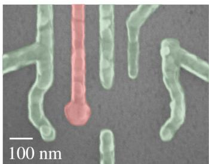  
图 1.2 门控量子点电极结构图，图中绿色、粉色结构为微纳加工形成的金属栅极。

本文主要讨论的是在 GaAs/AlGaAs 异质结上实现的门控量子点，我们称为砷化镓量子点。GaAs/AlGaAs 异质结中，能带弯曲形成的二维电子气离表面的距离为 90nm，因此对表面的缺陷不敏感，电子高迁移率较高。我们所用的GaAs/AlGaAs 异质结晶圆为购买的商用晶圆。在低温下（20mK），当固定电子密度为 $2 . 3 \times 1 0 ^ { 1 1 } \mathrm { c m } ^ { - 2 }$ 时，电子迁移率大约为 $1 . 6 \times 1 0 ^ { 5 } \mathrm { c m } ^ { 2 } / \mathrm { V s }$ 。利用微纳加工工艺，我们可以在材料表面加工出不同形状的金属栅极来形成量子点，图1.2就展示了一种在 GaAs/AlGaAs 异质结上使用的典型的栅极结构。通过控制栅极电压，可以在半导体材料中限制形成一个个相对孤立的区域并在这些区域中束缚特定数目的电子。每个孤立的区域包括其中的电子就被称为一个量子点。排列在一起的多个量子点可以构成多量子点，我们可以人为认为控制其排列结构以及量子点间的耦合相互作用。图1.3展示多量子点的示意图。

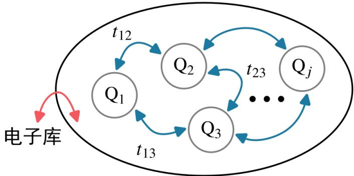  
图 1.3 多量子点示意图，图中一个灰色的圆圈代表一个量子点， $t _ { 1 2 }$ 、 $t _ { 2 3 }$ 、 $t _ { 1 3 }$ 代表不同量子点间的隧穿耦合相互作用。

一个用来描述量子点系统的经典模型是电容模型（classical capacitancemodel）[16-17]。在这个理论中，量子点间的库伦相互作用以及栅极电压对量子点电势的控制用电容来量化。这个模型可以解释量子点中电子数目随栅极电压的变化，但是无法描述量子效应，比如电子在不同量子点间的隧穿耦合（tunnel cou-pling）。在此基础上，人们提出了一个能够包括这些量子效应的模型，即Hubbard模型[18-19]。

在 Hubbard模型中，量子点可以由一个哈密顿量（Hamiltonian）来描述：

$$
H = \sum _ { i } ( - \mu _ { i } n _ { i } + \frac { U _ { i i } } { 2 } n _ { i } ( n _ { i } - 1 ) ) + \sum _ { i \neq j } U _ { i j } n _ { i } n _ { j } + \sum _ { i \neq j } ( - t _ { i j } c _ { i \sigma } ^ { \dagger } c _ { j \sigma } - t _ { j i } ^ { * } c _ { j \sigma } ^ { \dagger } c _ { i \sigma } ) .\tag{1.1}
$$

其中 $n _ { i } = c _ { i \sigma } ^ { \dagger } c _ { i \sigma } ^ { \vphantom \dagger }$ 代表量子点 𝑖 中自旋为 $\sigma ( \sigma = \uparrow , \downarrow )$ 的电子数目， $n _ { i } = n _ { i \uparrow } + n _ { i \downarrow }$ 代表量子点 𝑖 中的总电子数。 $c _ { i \sigma } ^ { \dagger }$ 和 𝑐 分别是量子点 𝑖 中自旋为 𝜎 的产生算符 $c _ { i \sigma } ^ { \phantom { } }$ （creation operator）和湮灭算符（annihilation operator）。 $\mu _ { i }$ 是量子点 𝑖 的化学势（chemical potential），受到栅极电压的调制。 $U _ { i i }$ 代表量子点𝑖中电子的充电能，即同一个量子点中，电子之间的库伦相互作用（coulomb interaction）。 $U _ { i j ( \neq i ) }$ 描述了量子点𝑖和𝑗 中的电子之间的库伦相互作用。 $t _ { i j }$ 则为电子在量子点𝑖和𝑗 之间的隧穿耦合强度。由于自旋交换（spin-exchange）、配对跃迁（pair-hopping）等相互作用项相比式(1.1)中的其他项都是小量，一般可以忽略[19]。

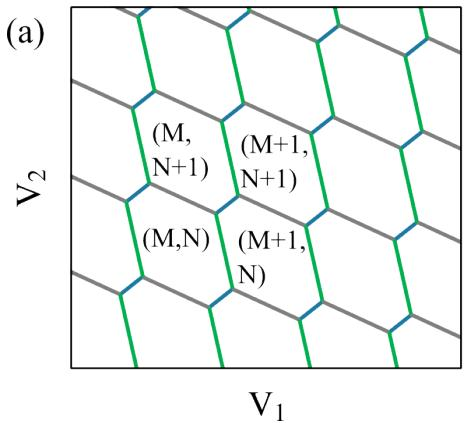

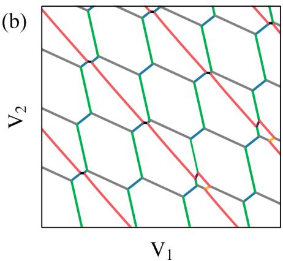  
图 1.4 电荷稳态示意图：（a）双量子点电荷稳态示意图，（M, N）分别代表量子点 1 和 2 中的电子数目；（b）三量子点电荷稳态示意图。

根据 Hubbard 模型，我们可以发现由于栅极电压对 𝜇 的调控作用，量子点 $\mu _ { i }$ 中的电子数目会随着栅极电压的大小发生变化，如图1.4所示。这种图一般被称为电荷稳态图（charge stability diagram）。图1.4（a）展示了双量子点的电荷稳态图，图中每个由线围起来的闭合区域的电子数目相同。其中绿色的线是量子点1 的充电线（charging line），代表量子点 1 的电化学势与外界电子库（reservoir）的费米面平齐，这意味着(𝑀,𝑁)和(𝑀+1,𝑁)电子态的能量相等，电子在电子库和量子点 1 之间发生跃迁。类似地，灰色的线是量子点 2 的充电线，意味着(𝑀,𝑁) 和 (𝑀,𝑁 +1) 电子态的能量相等。而蓝色的线代表量子点 1 和点 2 的电化学势相等时，电子能够在两个量子点之间隧穿，被称为量子点间的共振隧穿线（interdot transition line）。此时，量子点中的电子数目在 (𝑀 + 1, 𝑁) 和 (𝑀, 𝑁 + 1)

之间变化，这个跃迁过程对应于式(1.1)的最后一项。对于多量子点体系，电荷稳态图会变得更加复杂。图1.4（b）展示了三量子点的电荷稳态图，我们可以看到图中有多种不同斜率的线，但这些线同样可以划分为两类：绿色、灰色和红色的线为充电线，而其他颜色的线为不同量子点间的共振隧穿线。

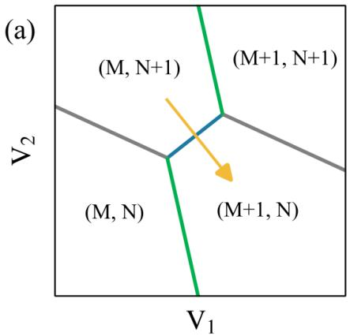

(b)  
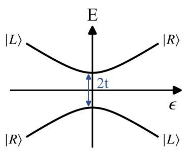  
图 1.5 （a）量子点间的共振隧穿线附近的电荷稳态示意图，黄色箭头指示了失谐 𝜖 的方向。（b）隧穿线附近的本征能级示意图。基矢为 $| R \rangle = ( M , N + 1 )$ 和 $| L \rangle = ( M + 1 , N )$ 分别代表额外的一个电子在右边量子点和左边量子点。

一般而言，我们会选择在某条量子点间的共振隧穿线附近进行实验，如图1.5所示。由于 $U _ { i i } \setminus \ U _ { i j }$ 一般为 meV 量级，而 $t _ { i j }$ 一般为几到几十个 $\mu \mathrm { e V } ^ { [ 2 0 ] }$ 因此在隧穿线附近我们可以只考虑 $( M + 1 , N )$ 和 (𝑀,𝑁 +1) 这两个电荷态，而忽略其他电荷态的影响。此时量子点系统可以由二能级来描述，在 {|𝑅⟩，|𝐿⟩}基矢下，其哈密顿量写为[21]：

$$
H _ { \mathrm { D Q D } } = \frac { 1 } { 2 } ( \epsilon \sigma _ { z } + 2 t \sigma _ { x } ) ,\tag{1.2}
$$

其中 𝜎 和 𝜎 为 Pauli 算符。 $\sigma _ { z }$ $\sigma _ { x }$ $\epsilon = \mu _ { 2 } - \mu _ { 1 }$ 为左右两个量子点之间电化学势的能量差，又被称为失谐（detuning），如图1.5（a）中的黄色箭头所示为𝜖 变化的方向。 $t = t _ { 1 2 }$ 为电子在两个量子点之间的隧穿耦合强度。量子点对角化后的能级如图1.5（b）所示，两个本征能级之间的频率差为 $\omega _ { q } = \sqrt { \epsilon ^ { 2 } + 4 t ^ { 2 } } / \hbar$ ，这一般被称为量子点的转变频率（transition frequency）或劈裂频率（splitting frequency）。ℏ为约化普朗克常数。

## 1.3 一维平面超导腔

将电磁场限制在特定的一维结构中（如图 1.6（a））所示，可以形成准一维的谐振腔，一般被称为共面波导谐振腔（Coplanar waveguide resonator，CPW）。如果腔的结构不同，比如选择不同的 s、w、h （图 1.6（b）所示），则驻波的频率以及腔的特征阻抗等性质不同。本文选择利用超导金属来形成这些结构，这可以减少电磁信号的损耗，提高腔的品质因子。

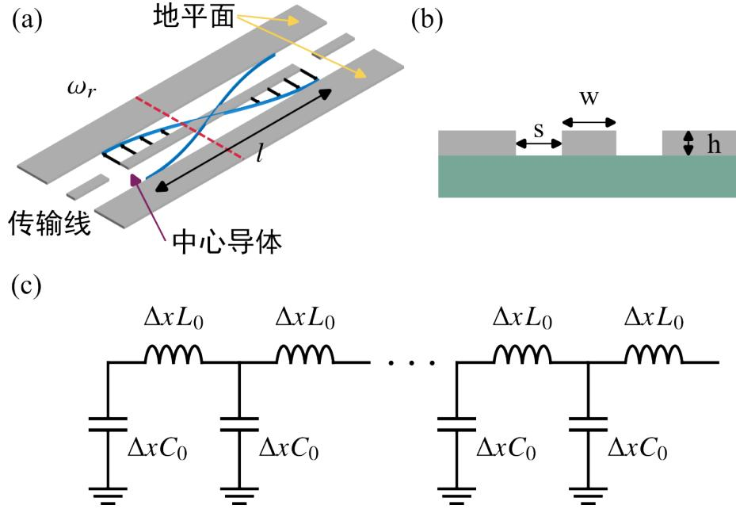  
图 1.6 （a）半波长（𝜆/2）共面波导透射腔的示意图，包括中心导体、两个传输线以及两个地平面。其中灰色部分为金属。如果将其中一个传输线接地，那么就可以形成四分之一波长（𝜆/4）的反射腔。（b）腔的横截面（沿（a）中红色虚线）示意图。w为中心导体的宽度，s为中心导体和地平面之间的间隔，h为金属的厚度。绿色部分为衬底，在我们的样品中为砷化镓。（c）腔的等效电路图。

由于共面波导腔的结构尺寸大约为毫米量级，这与限制的微波波长在同一量级，因此共面波导腔无法用集总（lumped）的电容电感模型描述，必须采用分布式（distributed）的电路模型来描述（如图1.6（c））。在这个简化的模型中[22-23]，我们忽略了导体的衰减，这对于我们所用的超导金属来说，是一个合理的近似。

我们可以利用拉格朗日量来得到腔的哈密顿量[22]。假设单位长度的电容为$C _ { 0 }$ ，单位长度的电感为 $L _ { 0 }$ ，则整个线路的拉格朗日量为：

$$
\mathcal { L } = \int _ { - l / 2 } ^ { l / 2 } \lbrack \frac { C _ { 0 } } { 2 } \dot { \phi } ^ { 2 } ( x , t ) - \frac { 1 } { 2 L _ { 0 } } ( \partial _ { x } \phi ( x , t ) ) ^ { 2 } \rbrack d x ,\tag{1.3}
$$

其中 $\pmb { \phi } ( x , t )$ 为位置𝑥，时间为𝑡时的磁通（flux），𝑙为腔中心导体的长度。式(1.3)的第一项为电容中存储的能量，第二项为电感中存储的能量。

由于边界处的电流为0，我们可以得到边界条件为 $\partial _ { x } \pmb { \phi } ( - l / 2 , t ) = \partial _ { x } \pmb { \phi } ( l / 2 , t ) =$ 0。利用这个条件，磁通可以表示为：

$$
\phi ( x , t ) = \sum _ { m } \phi _ { m } ( t ) \sin ( k _ { m } x ) .\tag{1.4}
$$

上式中的 $k _ { m } = m \pi / l$ 为波矢。将式(1.4)带入式(1.3)中，并利用 $\sin ( k _ { m } x )$ 的正交性，

我们可以得到腔的拉格朗日量为：

$$
\mathcal { L } = \sum _ { m } [ \frac { C } { 2 } \dot { \phi } _ { m } ^ { 2 } - \frac { \phi _ { m } ^ { 2 } } { 2 L _ { m } } ] .\tag{1.5}
$$

其中 $C = C _ { 0 } l / 2$ $L _ { m } = 2 L _ { 0 } l / ( \pi ^ { 2 } m ^ { 2 } )$ 。磁通 $\pmb { \phi } _ { m }$ 的共轭量为电荷 $Q _ { m } = \partial \mathcal { L } / \partial \dot { \phi } _ { m } =$ $C \dot { \Phi } _ { m }$ ，由此得到系统的哈密顿量为:

$$
\mathcal { H } = \frac { \partial \mathcal { L } } { \partial \dot { \phi } } \dot { \phi } - \mathcal { L } = \sum _ { m } \frac { Q _ { m } ^ { 2 } } { 2 C } + \frac { \pmb { \phi } _ { m } ^ { 2 } } { 2 L _ { m } } .\tag{1.6}
$$

为 $\vec { \boldsymbol { \jmath } }$ 得到量子化的描述，我们定义磁通算符 $\hat { \pmb { \phi } } _ { m }$ 和电荷算符 $\hat { Q } _ { m }$ ，这两个算符满足对易关系 $[ \hat { \pmb { \phi } } _ { m } , \hat { Q } _ { m } ] = i \hbar$ 。在此基础上，可以定义产生算符 $\hat { a } _ { m } ^ { \dagger }$ 和湮灭算符 $\hat { a } _ { m }$ ：

$$
\hat { a } _ { m } ^ { \dagger } = \frac { 2 } { \pi m } \sqrt { \frac { 1 } { 2 \hbar { \cal Z } _ { r } } } \hat { \Phi } _ { m } + i \frac { \pi m } { 2 } \sqrt { \frac { { \cal Z } _ { r } } { 2 \hbar } } \hat { \ Q } _ { m } ,\tag{1.7}
$$

$$
\hat { a } _ { m } = \frac { 2 } { \pi m } \sqrt { \frac { 1 } { 2 \hbar { \cal Z } _ { r } } } \hat { \pmb { \phi } } _ { m } - i \frac { \pi m } { 2 } \sqrt { \frac { { \cal Z } _ { r } } { 2 \hbar } } \hat { \pmb { \mathcal { Q } } } _ { m } .\tag{1.8}
$$

其中 $Z _ { r } = \sqrt { L _ { 0 } / C _ { 0 } }$ 为腔单位长度的阻抗。简便起见，接下来我们使用 $a _ { m } ^ { \dagger } \equiv \hat { a } _ { m } ^ { \dagger }$ $a _ { m } \equiv \hat { a } _ { m }$ 。利用这两个算符，腔的哈密顿量可以写为：

$$
H _ { r } = \sum _ { m } \hbar \omega _ { m } ( a _ { m } ^ { \dagger } a _ { m } + 1 / 2 ) .\tag{1.9}
$$

其中腔共振频率 $\omega _ { m } = m \pi / ( l \sqrt { L _ { 0 } C _ { 0 } } ) = \pi / ( l Z _ { r } C _ { 0 } )$ $a _ { m } ^ { \dagger } a _ { m }$ 为腔光子数算符。从式(1.9)中，我们可以看出腔的能量是一系列谐振模式能量的总和。一般而言，我们只利用腔的基频（fundamentalmode），即最低的频率 $\omega _ { r } = \omega _ { 1 }$ 。在这个意义上，腔的哈密顿量简化为：

$$
H _ { r } = \hbar \omega _ { r } ( a ^ { \dagger } a + 1 / 2 ) ,\tag{1.10}
$$

其中 $\omega _ { r }$ 为腔的谐振频率。 $a \equiv a _ { 1 } ( a ^ { \dagger } \equiv a _ { 1 } ^ { \dagger } )$ ）为频率为 $\omega _ { r }$ 的腔光子的产生算符（湮灭算符）。

## 1.4 半导体量子点和腔的耦合原理

我们可以将量子点的电极连接到腔的中心导体上来实现量子点和腔的耦合，如图1.7所示。在这种方式下，量子点和腔的耦合一般而言是通过电偶极相互作用（electric dipole interaction）实现的。由于量子点的尺度（大约为几百纳米）远小于腔的波长（几百微米甚至几毫米），所以对于整个量子点而言，腔电场的分布是均匀的。因此我们可以采用电偶极近似（electric dipole approximation）来得到描述量子点和腔相互作用的哈密顿量[24]：

$$
H _ { c } = \boldsymbol { d } \cdot \boldsymbol { E } ,\tag{1.11}
$$

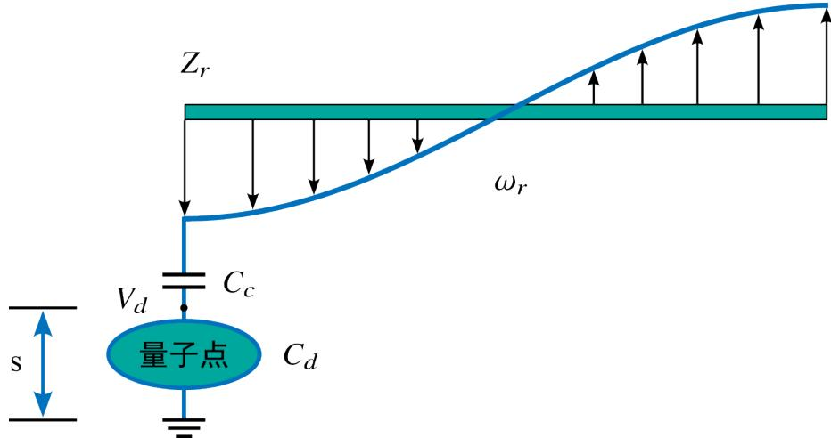  
图 1.7 量子点和腔耦合示意图。由于我们这里利用的是电偶极相互作用，一般将量子点制备在腔的电压波腹处从而尽可能大地增强量子点和腔之间的耦合强度。

其中 $\begin{array} { r } { \pmb { d } = e \sum _ { j } \pmb { x } _ { j } \pmb { n } _ { j } } \end{array}$ 为量子点的电偶极矩，𝑒为基本电荷， $x _ { j }$ 为量子点𝑗 的位置坐标， $n _ { j }$ 即1.2节定义的量子点 $j$ 中的总电子数。为了方便定义耦合强度，我们定义 $\pmb { d } \equiv r \hat { e } _ { d }$ ，𝑟 为电偶极矩的模， $\hat { e } _ { d }$ 为电偶极矩的方向。𝑬 为腔中的光场在量子点处的电场强度。

接下来我们讨论如何得到 $E$ 。腔频为 $\omega _ { r }$ 的腔模式在波腹处的量子化电压（quantized voltage）为[25]：

$$
V = \sqrt { \frac { \hbar \omega _ { r } } { l C _ { 0 } } } ( a + a ^ { \dagger } ) \hat { , }\tag{1.12}
$$

其中 𝑙 和 $C _ { 0 }$ 分别为上节定义的腔的长度和腔单位长度的电容。考虑到腔和量子点之间的电容 $C _ { c }$ 以及量子点到地平面的电容 $C _ { d }$ ，量子点处的电压为 $V _ { d } =$ $C _ { c } * V / ( C _ { c } + C _ { d } ) \equiv \nu V$ $\nu = { C _ { c } } / ( { C _ { c } } + { C _ { d } } )$ 。由此得到量子点处的电场强度为：

$$
\begin{array} { r } { { \cal E } = V _ { d } \hat { e } _ { E } / s . } \end{array}\tag{1.13}
$$

𝑠 为量子点到地的有效距离，如图1.7所示。 $\hat { e } _ { E }$ 为电场的方向。

综合式(1.11)、(1.12)和(1.13)，我们可以得到耦合相互作用的哈密顿量为：

$$
\begin{array} { r } { H _ { c } = e \displaystyle \sum _ { j } { r _ { j } \boldsymbol { n } _ { j } \cdot \nu \boldsymbol { V } / s } } \\ { = \hbar g \hat { e } _ { d } \hat { e } _ { E } ( a + a ^ { \dagger } ) , } \end{array}\tag{1.14}
$$

其中 $g$ 为耦合强度：

$$
g = \frac { r \nu } { \hbar s } \sqrt { \frac { \hbar \omega _ { r } } { l C _ { 0 } } } .\tag{1.15}
$$

从上节中，我们已知腔的特征阻抗 $\begin{array} { r } { Z _ { r } = \sqrt { \frac { L _ { 0 } } { C _ { 0 } } } } \end{array}$ ，腔频 $\omega _ { r } = \pi / ( l Z _ { r } C _ { 0 } )$ 。结合这两

个表达式，我们将耦合强度 $g$ 表示为:

$$
g = \frac { r \nu } { s } \omega _ { r } \sqrt { \frac { Z _ { r } } { \pi \hbar } } .\tag{1.16}
$$

因此，如果腔的频率固定，耦合强度 $g \propto \sqrt { Z _ { r } }$ 。因为一般量子点的工作频率在4−6 GHz 左右，腔频需要设计在这个频率附近。因此我们一般通过增加腔的特征阻抗 $Z _ { r }$ 来增大量子点和腔的耦合强度。

## 1.5 高阻抗腔在电路量子电动力学系统中的应用

耦合强度 𝑔 决定了光与物质交换信息的速度，实现大的耦合强度对于电路量子电动力学系统在量子信息处理方面的应用以及实现高灵敏度的测量等非常关键。在本节中，我们根据量子点-腔量子电动力学系统在不同方面的应用来分类，介绍了各方面的发展并讨论了高阻抗腔在其中所扮演的重要角色。

## 1.5.1 量子信息处理方面的应用

基于半导体量子点的电路量子电动力学架构可以用来实现比特和腔之间的相干耦合以及比特之间的长程信息交换，在量子信息处理方面具有广泛的运用前景。为了实现这些目标，从2011年开始，就有许多研究组都在这方面做了诸多尝试。在早期发展阶段，Wallraff组实现了铝（Al）超导腔和砷化镓量子点的耦合[26]，Petta 组将铌（Nb）腔耦合到了 InAs 纳米线量子点上[27]，而 Kontos 组则实现了碳纳米管上的量子点和铝超导腔的耦合[28]。尽管这些工作都很精彩，但是受到量子点和腔之间较小的耦合强度、量子点较大的退相干速率等因素的限制，这些工作无法在量子点和腔的信息丢失前实现量子点和腔之间的相干信息交换。更加直观的一个指标是，这些工作都没有观察到真空拉比劈裂（vacuumRabi splitting），即达到强耦合区域（strong coupling regime），这限制了量子点-腔耦合系统在比特扩展方面的运用。

一个实现强耦合的耦合的方法是尽可能减少腔和量子点的耗散。在量子点电极处集成片上的滤波器[29-31] 可以减少微波信号通过量子点耗散，提高腔的品质因子。而量子点的相干时间可以通过优化量子点的制备工艺来提高。借助于这两方面的优化，Petta 组提高了腔和量子点的相干性能，成功地在电荷比特-腔耦合系统上观察到了真空拉比劈裂，实现了电荷比特和腔光子的强耦合[32]。遗憾的是，耦合强度𝑔 并没有得到提升，仍然只有 $g / 2 \pi \approx 6 . 7 \mathrm { M H z }$ （如图1.8（a）），不利于实现快速的信息交换。

幸运的是，一些研究组发现，利用一些高动态电感的材料（比如铌钛氮（NbTiN）[35]、氮化钛 $( \mathrm { T i N } ) ^ { [ 3 6 ] }$ 等）或者其他高电感的结构（比如约瑟夫森结（Josephson junction）），可以提高腔的阻抗，从而提高耦合强度。2017 年，Wallraff组将一系列约瑟夫森结制备为超导量子干涉器件阵列（superconducting quantuminterference device array，SQUID 阵列）来替代腔的中心导体部分[37-39]，将腔的阻抗提高到了 kΩ 量级。相比之前所用的阻抗为 50Ω 的腔，高阻抗腔极大地提高了量子点和腔光子之间的耦合强度，使得 $g / 2 \pi \approx 1 1 9 \mathrm { M H z }$ ，成功地实现了强耦合，如图1.8（b）所示[33]。

(a)  
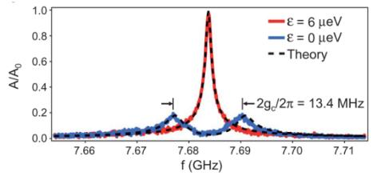

(b)  
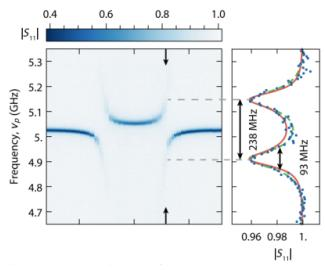

(c)  
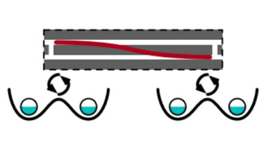

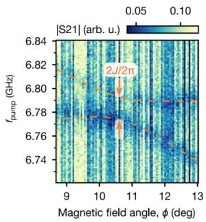  
图 1.8 （a）Petta 组观察到的真空拉比劈裂[32]。（b）利用 SQUID 阵列腔，wallraf组实现了更大的劈裂[33]。（c）Vandersypen组实现的两个自旋比特利用虚光子实现的长程相干耦合[34]。在这组图里我们只展示了几个重要的结果，其他实验中观察到的现象与这些结果类似，就没有重复展示。在后面的小节中，我们也遵循同样的原则。

受到这个研究结果的鼓舞，很多的研究组开始将高阻抗腔耦合到量子点上来增强耦合强度。系统性质的提高使得其在比特信息交换方面的运用成为可能。到目前为止，人们已经实现单个电子的自旋比特[40-41]、Resonant exchange spinqubit[42]、空穴自旋比特[43] 和腔光子的相干耦合，甚至实现了电荷比特和腔的超强耦合[44]，即耦合强度接近比特频率、腔频的0.1倍。更进一步地，得益于高阻抗腔的运用，许多研究组研究了多个比特-腔耦合系统，并实现了腔光子介导的比特间的长程相干耦合（如图1.8（c））。在实验上已经先后演示了两个电荷比特之间[45]、电荷比特和超导比特之间[46-47]、两个自旋比特之间[34,48] 基于腔光子的长程相干耦合。这些在多比特-腔耦合系统上实现的精彩成果为实现长程的两比特门以及比特的大规模扩展打下了坚实的基础。

## 1.5.2 基于腔实现的对量子点信号的探测

常见的用来探测量子点中的电子状态的方法，是在探测的量子点边上制备一个电量计（electrometer），比如 QPC（quantum point contact）或者 SET （singleelectrontransistor）。当量子点中的电子数目发生变化后，由于QPC（SET）和量子点的电容耦合，QPC（SET）的电导会发生变化，由此可以通过测量电导来判断量子点的状态。但是这种电容耦合是一种近邻耦合相互作用，需要将电量计放置在量子点边上才能实现比较好的效果。因此几个量子点就需要一个电量计，这不利于量子点的扩展。而且近邻的 QPC 可能会对量子点产生反作用（back action）影响量子点的状态[49]。将腔耦合到量子点的某个电极上，利用量子点和腔之间的耦合相互作用来探测量子点的状态，这可以在一定程度上解决扩展和反作用力问题。

腔可以和量子点制备到一个芯片上（on-chip，片上）或者不在同一个芯片上（off-chip）[50-53]，都可以实现对量子点中电子数目变化的测量。off-chip 的腔一般频率较低（0.1 ∼ 1 GHz），直接键合到样品上就可以使用，但是这种方式可能导致较大的寄生电容，使得信号量较小。相对的，片上的腔一般频率较高（4−8GHz），更接近量子点的转变频率，而且一般Q值更高[54]。但是由于探测的带宽依赖于腔的展宽，高 Q 值的腔会导致探测的带宽减小[55]，所以基于不同的目的，我们需要在高 Q 值和高带宽之间做一个取舍。

(a)  
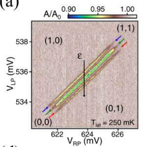

(b)  
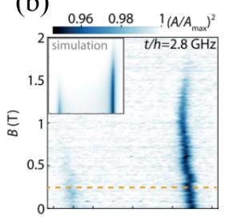

(c)  
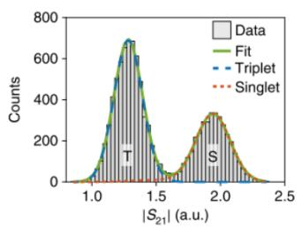

(d)  
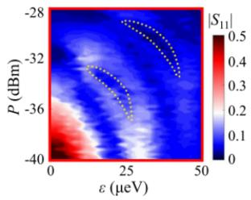

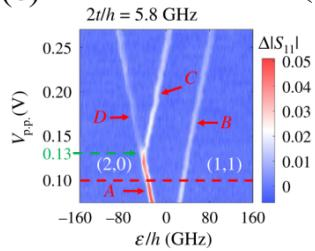  
(f)

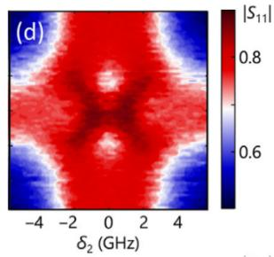  
图 1.9 （a）利用腔探测到的谷劈裂能级的信号[56]。（b）自旋阻塞导致的隧穿线的两支信号不对称[57]。（c）借助于大耦合强度实现的单态-三态的快速高保真度读取[58]。（d）半腔频驱动时，Floquet态的分布导致孔洞信号[59]。（e）腔探测到的单态-三态自旋比特的激发态信号[60]。（e）在两个比特和腔耦合系统实现的联合谱探测[61]。

如果需要获得比较高的信号探测灵敏度，将腔和量子点集成到同一个芯片上是一个合适的选择。最近许多研究组已经使用片上腔实现了对谷劈裂（valleysplitting）[56]、自旋信号[27]、量子点间的隧穿耦合[26] 等的测量。这些年高阻抗腔的使用提高了耦合强度，进而增大了腔频随量子点状态变化的移动，增强了探测的信号量，这进一步促进了腔在量子点状态探测方面的运用。利用量子点和腔之间较大的耦合强度，自旋阻塞（spin blockade）[57]、比特态翻转[62]、谷之间的隧穿耦合（intervalley tunnel coupling）[63] 等信号的读出先后被演示。值得一提的是，基于腔的快速高保真度的自旋态读出也已经被实现[58]。图1.9（a-c）展示了腔在探测方面实现的一些代表性工作。我们组在这个方面也取得了一些成果，如图1.9（d-f）所示。利用高阻抗腔的高灵敏度，我们研究了半腔频微波驱动下的量子点 Floquet 态的分布[59]，实现单态-三态自旋比特的激发态读取[60]。我们在两个比特-腔耦合的系统上，发展了一种新的联合谱探测方法，利用这种方法能够快速地提取系统耦合强度等参数[61]。

理论上，利用量子点和腔之间的相互作用可以用来实现量子非破坏性测量（quantum non-demolition）、单次读出（single-shot readout）、大型量子点阵列中的选择性读出（selectivereadout）[3-4]。此外，基于腔的探测方法也被提出用来测量Majorana fermions 的编织[64]、材料的性质[4] 等。我们期待未来在器件上的进一步优化（比如阻抗的进一步提高以及耗散的减少）可以发展出更多的测量技术，实现更多微弱信号的探测。

## 1.5.3 电路量子电动力学中的量子光学

在电路量子电动力学系统中，利用光与物质之间的相互作用，除了可以实现对量子系统的探测外，相反地，通过调节系统的状态也可以实现对腔光场的调制，研究一些有趣的量子光学现象[3,7]。

在基于超导比特的电路量子电动力学系统中，利用超导比特产生的光子与光子之间的相互作用，光子阻塞效应已经被演示[65]。通过控制比特和光场的相互作用时间，国际上某些课题组已经实现了某些经典或者非经典的光子态的制备[66-68]。在这个平台上，sideband transition[69]、quantum jump[70] 等有趣的现象也得到了充分的研究。

由于量子点和腔耦合系统的发展时间相对较短，在对腔光子调制方面的实验还比较少。如图1.10所示，这些实验主要集中于将量子点作为增益介质，来实现微波光子的产生和腔幅值增益，并在此基础上实现了微波频段的激光[71-76]。量子点作为一个固态体系，存在精细的能级结构以及多种相互作用，比如电声相互作用[77]、自旋轨道相互作用[43]、超精细相互作用[78] 等，这可能会导致丰富且独特的物理现象，比如Kondo效应、谷能级劈裂等[4]。我们期待这些相互作用的引入使得将来在量子点-腔耦合系统上研究更多的量子光学效应成为可能。同时高阻抗腔的运用使得量子点对腔的影响变大，期待这可以进一步促进腔光场调制等方面的发展、促进更多的高阶效应的研究[7]。

(a)  
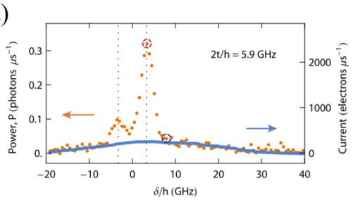

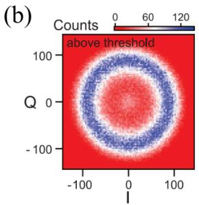  
图 1.10 （a）利用量子点向腔中发射光子。图中展示了探测到的光子发射功率随量子点参数的变化[71]。（b）利用施加偏压的量子点实现的微波频段的激光[72]。

## 1.6 周期性驱动与量子点-腔耦合系统

根据上节的讨论可知，研究量子点-腔耦合系统对于量子信息处理、信号探测以及腔光子调制等方面都具有重要的意义，而且高阻抗腔在其中扮演了举足轻重的角色。周期性驱动作为一个在表征系统参数、量子控制以及量子模拟等方面广泛应用的工具[79-80]，我们期待在量子点-高阻抗腔耦合系统上引入周期性驱动可以增加系统额外的控制自由度，带来新的可能。

周期性驱动在量子系统中的用途广泛。比如在量子系统的能级结构的表征方面，相比共振谱探测，在系统上施加周期性驱动来提取信息的方法可以适用于频率更高（比如几十甚至几百 GHz）的系统[81-82]。利用周期性驱动，人们实现了对量子系统的相干信息的提取[83-86]；在量子操控方面，共振驱动的方式可能导致门操作速度等方面有所限制，周期性强驱动则可以克服这一局限性，可以被用来实现快速的比特态操控[79-80,87]。更进一步地，周期性驱动可以实现新型比特编码方案[88-90]、降低系统对噪声的敏感度[91] 等等；在系统上施加周期性驱动能够调制哈密顿量，从而实现特定的等效哈密顿量甚至可以产生一些拓扑相位。这些等效哈密顿量可以用来演示一些器件上无法直接实现的哈密顿量的模拟、一些拓扑材料的模拟等[92-94]。这些年，人们在实验上利用周期性驱动已经对自旋手性[95-96]、相干的背散射（coherent backscttering）[97]、量子相变（quantum phasetransition）[98] 等现象进行了模拟。可见，周期性驱动的系统有着广阔的应用前景，因此研究周期性驱动的系统具有重要的意义。

正如前面章节介绍的，量子点和腔耦合系统具有良好的可调性，而且能够引入光与物质的相互作用，使得我们得以研究丰富的物理现象。结合周期性驱动的广阔前景，在本文中，我们在量子点-高阻抗腔耦合系统上施加了周期性驱动，研究了施加驱动后的系统动力学行为，观察到了腔幅值增益并探究了杂化系统的 Floquet态。具体见本文的第四、五章。

## 1.7 本章小结

在本章中，我们首先介绍了电路量子点电动力学的架构，并分别介绍了半导体量子点、一维平面超导腔的背景以及理论模型以及两者耦合相互作用的具体形式。接着，我们结合电路量子电路力学在量子信息处理、量子系统状态探测、量子光学效应等方面的应用与发展，讨论了高阻抗腔在其中所扮演的举足轻重的角色。在后文中，我们正是将高阻抗腔耦合到砷化镓量子点上实现了耦合强度的提升，使得第三章中的三量子点基本表征、第四章中的腔幅值增益、第五章中的耦合系统的 Floquet 态研究成为可能。最后，我们介绍了周期性驱动在系统表征、操控、哈密顿量调制等方面的重要作用，将周期性驱动引入量子点-腔耦合系统将带来新的可能性。在本文的第四、五章中，我们对耦合系统施加周期性驱动，研究了耦合系统的动力学。

## 1.8 论文结构

这篇论文分成以下几个章节：

在第二章中，我们从高阻抗腔的理论模型与制备工艺出发，介绍了本文研究的耦合样品的结构。结合测量线路，我们展示了样品基本性质表征的方法。同时我们还介绍了后续实验所需的周期性驱动的基本概念以及基本理论。

第三章研究了三量子点-微波腔的杂化系统，并探究电荷稳态图中的一些独特现象：量子元胞自动机现象、光子辅助的四重点、不对称的隧穿线信号。我们积累了量子点-腔耦合系统探测的技术经验，加深了对耦合系统的理解，为后续的实验奠定基础。

进一步地，在第四章中，我们在量子点-腔耦合系统上施加了周期性驱动，对腔光子进行调制。将受周期性驱动的双点作为增益介质，我们实现了腔光子的产生和幅值增益。

最后在第五章中，出于日后实现相干信息交换以及多比特扩展的需求，我们对具有强量子点-腔耦合强度的两个双量子点-腔耦合的系统施加周期性驱动，并研究其动力学行为。为了描述这个系统，我们提出了一个新理论，并研究了耦合系统的 Floquet 态。

第六章总结了论文中涉及的主要工作，对未来的研究方向进行讨论与展望。

## 参考文献

[1] Raimond J M, Brune M, Haroche S. Manipulating quantum entanglement with atoms and photons in a cavity. Rev. Mod. Phys., 2001, 73:565-582.

[2] Thompson R J, Rempe G, Kimble H J. Observation of normal-mode splitting for an atom in an optical cavity. Phys. Rev. Lett., 1992, 68:1132-1135.

[3] Blais A, Grimsmo A L, Girvin S M, et al. Circuit quantum electrodynamics. Rev. Mod. Phys., 2021, 93:025005.

[4] Burkard G, Gullans M J, Mi X, et al. Superconductor–semiconductor hybrid-circuit quantum electrodynamics. Nat. Rev. Phys., 2020, 2:129-140.

[5] Wallraff A, Schuster D I, Blais A, et al. Strong coupling of a single photon to a superconducting qubit using circuit quantum electrodynamics. Nature, 2004, 431:162-167.

[6] Blais A, Huang R S, Wallraff A, et al. Cavity quantum electrodynamics for superconducting electrical circuits: An architecture for quantum computation. Phys. Rev. A, 2004, 69:062320.

[7] Gu X, Kockum A F, Miranowicz A, et al. Microwave photonics with superconducting quantum circuits. Phys. Rep., 2017, 718-719:1-102.

[8] Chatterjee A, Stevenson P, De Franceschi S, et al. Semiconductor qubits in practice. Nat. Rev. Phys., 2021, 3:157-177.

[9] Burkard G, Ladd T D, Nichol J M, et al. Semiconductor Spin Qubits. arXiv, 2021, 2112.08863.

[10] 曹刚. 半导体双量子点系统中的量子输运研究. 中国：中国科学技术大学,2012.

[11] 李海欧. 砷化镓量子点中强测量反作用下的单电子电荷和自旋研究. 中国：中国科学技术大学, 2012.

[12] 尤杰. 新型砷化镓量子点的制备与量子输运研究. 中国：中国科学技术大学,2016.

[13] Yang C H, Leon R C C, Hwang J C C, et al. Operation of a silicon quantum processor unit cell above one kelvin. Nature, 2020, 580:350-354.

[14] Scappucci G, Kloeffel C, Zwanenburg F A, et al. The germanium quantum information route. Nat. Rev. Mater., 2020, 6:926-943.

[15] Banszerus L, Rothstein A, Fabian T, et al. Electron–Hole Crossover in Gate-Controlled Bilayer Graphene Quantum Dots. Nano Lett., 2020, 20:7709-7715.

[16] van der Wiel W G, De Franceschi S, Elzerman J M, et al. Electron transport through double quantum dots. Rev. Mod. Phys., 2002, 75:1-22.

[17] Schröer D, Greentree A D, Gaudreau L, et al. Electrostatically defined serial triple quantum dot charged with few electrons. Phys. Rev. B, 2007, 76:075306.

[18] Das Sarma S, Wang X, Yang S. Hubbard model description of silicon spin qubits: Charge stability diagram and tunnel coupling in Si double quantum dots. Phys. Rev. B, 2011, 83:

235314.

[19] Yang S, Wang X, Das Sarma S. Generic Hubbard model description of semiconductor quantum-dot spin qubits. Phys. Rev. B, 2011, 83:161301.

[20] Kouwenhoven L P, Marcus C M, McEuen P L, et al. Electron transport in quantum dots. Dordrecht: Springer Netherlands, 1997: 105-214.

[21] Petersson K D, Petta J R, Lu H, et al. Quantum Coherence in a One-Electron Semiconductor Charge Qubit. Phys. Rev. Lett., 2010, 105:246804.

[22] Bourassa J, Beaudoin F, Gambetta J M, et al. Josephson-junction-embedded transmission-line resonators: From Kerr medium to in-line transmon. Phys. Rev. A, 2012, 86:013814.

[23] Stockklauser A. Strong coupling circuit qed with semiconductor quantum dots. Switzerland: ETH Zurich, 2017.

[24] Scully M O, Zubairy M S. Quantum optics. Cambridge University Press, 1997.

[25] Srinivasa V, Taylor J M, Tahan C. Entangling distant resonant exchange qubits via circuit quantum electrodynamics. Phys. Rev. B, 2016, 94:205421.

[26] Frey T, Leek P J, Beck M, et al. Dipole Coupling of a Double Quantum Dot to a Microwave Resonator. Phys. Rev. Lett., 2012, 108:046807.

[27] Petersson K D, McFaul L W, Schroer M D, et al. Circuit quantum electrodynamics with a spin qubit. Nature, 2012, 490:380-383.

[28] Viennot J J, Delbecq M R, Dartiailh M C, et al. Out-of-equilibrium charge dynamics in a hybrid circuit quantum electrodynamics architecture. Phys. Rev. B, 2014, 89:165404.

[29] Mi X, Cady J V, Zajac D M, et al. Circuit quantum electrodynamics architecture for gatedefined quantum dots in silicon. Appl. Phys. Lett., 2017, 110:043502.

[30] Holman N, Dodson J P, Edge L F, et al. Microwave engineering for semiconductor quantum dots in a cQED architecture. Appl. Phys. Lett., 2020, 117:083502.

[31] Harvey-Collard P, Zheng G, Dijkema J, et al. On-Chip Microwave Filters for High-Impedance Resonators with Gate-Defined Quantum Dots. Phys. Rev. Appl., 2020, 14:034025.

[32] Mi X, Cady J V, Zajac D M, et al. Strong coupling of a single electron in silicon to a microwave photon. Science, 2017, 355:156-158.

[33] Stockklauser A, Scarlino P, Koski J V, et al. Strong Coupling Cavity QED with Gate-Defined Double Quantum Dots Enabled by a High Impedance Resonator. Phys. Rev. X, 2017, 7:011030.

[34] Harvey-Collard P, Dijkema J, Zheng G, et al. Coherent Spin-Spin Coupling Mediated by Virtual Microwave Photons. Phys. Rev. X, 2022, 12:021026.

[35] Samkharadze N, Bruno A, Scarlino P, et al. High-Kinetic-Inductance Superconducting Nanowire Resonators for Circuit QED in a Magnetic Field. Phys. Rev. Appl., 2016, 5:044004.

[36] Amin K R, Ladner C, Jourdan G, et al. Loss mechanisms in TiN high impedance supercon-

ducting microwave circuits. Appl. Phys. Lett., 2022, 120:164001.

[37] Castellanos-Beltran M A, Lehnert K W. Widely tunable parametric amplifier based on a superconducting quantum interference device array resonator. Applied Physics Letters, 2007, 91:083509.

[38] Masluk N A, Pop I M, Kamal A, et al. Microwave Characterization of Josephson Junction Arrays: Implementing a Low Loss Superinductance. Phys. Rev. Lett., 2012, 109:137002.

[39] Altimiras C, Parlavecchio O, Joyez P, et al. Tunable microwave impedance matching to a high impedance source using a josephson metamaterial. Applied Physics Letters, 2013, 103: 212601.

[40] Mi X, Benito M, Putz S, et al. A coherent spin–photon interface in silicon. Nature, 2018, 555: 599-603.

[41] Samkharadze N, Zheng G, Kalhor N, et al. Strong spin-photon coupling in silicon. Science, 2018, 359:1123-1127.

[42] Landig A J, Koski J V, Scarlino P, et al. Coherent spin–photon coupling using a resonant exchange qubit. Nature, 2018, 560:179-184.

[43] Yu C X, Zihlmann S, Abadillo-Uriel J C, et al. Strong coupling between a photon and a hole spin in silicon. arXiv:2206.14082, 2022.

[44] Scarlino P, Ungerer J H, van Woerkom D J, et al. In situ Tuning of the Electric-Dipole Strength of a Double-Dot Charge Qubit: Charge-Noise Protection and Ultrastrong Coupling. Phys. Rev. X, 2022, 12:031004.

[45] van Woerkom D J, Scarlino P, Ungerer J H, et al. Microwave Photon-Mediated Interactions between Semiconductor Qubits. Phys. Rev. X, 2018, 8:041018.

[46] Scarlino P, van Woerkom D J, Mendes U C, et al. Coherent microwave-photon-mediated coupling between a semiconductor and a superconducting qubit. Nat. Commun., 2019, 10: 3011.

[47] Landig A J, Koski J V, Scarlino P, et al. Virtual-photon-mediated spin-qubit–transmon coupling. Nat. Commun., 2019, 10:5037.

[48] Borjans F, Croot X G, Mi X, et al. Resonant microwave-mediated interactions between distant electron spins. Nature, 2020, 577:195-198.

[49] Taubert D, Pioro-Ladrière M, Schröer D, et al. Telegraph noise in coupled quantum dot circuits induced by a quantum point contact. Phys. Rev. Lett., 2008, 100:176805.

[50] Petersson K D, Smith C G, Anderson D, et al. Charge and spin state readout of a double quantum dot coupled to a resonator. Nano Letters, 2010, 10:2789-2793.

[51] Chorley S J, Wabnig J, Penfold-Fitch Z V, et al. Measuring the complex admittance of a carbon nanotube double quantum dot. Phys. Rev. Lett., 2012, 108:036802.

[52] Cottet A, Mora C, Kontos T. Mesoscopic admittance of a double quantum dot. Phys. Rev. B, 2011, 83:121311.

[53] Park S, Metzger C, Tosi L, et al. From adiabatic to dispersive readout of quantum circuits. Phys. Rev. Lett., 2020, 125:077701.

[54] Zheng G. Circuit quantum electrodynamics with single electron spins in silicon. Netherlands: Delft University of Technology, 2021.

[55] Lin T, Gu S S, Xu Y Q, et al. Circuit-QED based time-averaged dispersive readout of a semiconductor charge qubit. Appl. Phys. Lett., 2022, 121:184004.

[56] Mi X, Péterfalvi C G, Burkard G, et al. High-Resolution Valley Spectroscopy of Si Quantum Dots. Phys. Rev. Lett., 2017, 119:176803.

[57] Landig A J, Koski J V, Scarlino P, et al. Microwave-Cavity-Detected Spin Blockade in a Few-Electron Double Quantum Dot. Phys. Rev. Lett., 2019, 122:213601.

[58] Zheng G, Samkharadze N, Noordam M L, et al. Rapid gate-based spin read-out in silicon using an on-chip resonator. Nat. Nanotechnol., 2019, 14:742-746.

[59] Chen M B, Wang B C, Kohler S, et al. Floquet state depletion in ac-driven circuit QED. Phys. Rev. B, 2021, 103:205428.

[60] Chen M B, Jiang S L, Wang N, et al. Microwave-Resonator-Detected Excited-State Spectroscopy of a Double Quantum Dot. Phys. Rev. Appl., 2021, 15:044045.

[61] Wang B, Lin T, Li H, et al. Correlated spectrum of distant semiconductor qubits coupled by microwave photons. Sci. Bull., 2021, 66:332-338.

[62] Scarlino P, van Woerkom D J, Stockklauser A, et al. All-Microwave Control and Dispersive Readout of Gate-Defined Quantum Dot Qubits in Circuit Quantum Electrodynamics. Phys. Rev. Lett., 2019, 122:206802.

[63] Borjans F, Zhang X, Mi X, et al. Probing the variation of the intervalley tunnel coupling in a silicon triple quantum dot. PRX Quantum, 2021, 2:020309.

[64] Trif M, Simon P. Braiding of majorana fermions in a cavity. Phys. Rev. Lett., 2019, 122: 236803.

[65] Lang C, Bozyigit D, Eichler C, et al. Observation of Resonant Photon Blockade at Microwave Frequencies Using Correlation Function Measurements. Phys. Rev. Lett., 2011, 106:243601.

[66] Houck A A, Schuster D I, Gambetta J M, et al. Generating single microwave photons in a circuit. Nature, 2007, 449:328-331.

[67] Astafiev O, Inomata K, Niskanen A O, et al. Single artificial-atom lasing. Nature, 2007, 449: 588-590.

[68] Hofheinz M, Wang H, Ansmann M, et al. Synthesizing arbitrary quantum states in a superconducting resonator. Nature, 2009, 459:546-549.

[69] Leek P J, Filipp S, Maurer P, et al. Using sideband transitions for two-qubit operations in superconducting circuits. Phys. Rev. B, 2009, 79:180511.

[70] Vijay R, Slichter D H, Siddiqi I. Observation of quantum jumps in a superconducting artificial atom. Phys. Rev. Lett., 2011, 106:110502.

[71] Stockklauser A, Maisi V F, Basset J, et al. Microwave Emission from Hybridized States in a Semiconductor Charge Qubit. Phys. Rev. Lett., 2015, 115:046802.

[72] Liu Y Y, Stehlik J, Eichler C, et al. Semiconductor double quantum dot micromaser. Science, 2015, 347:285-287.

[73] Liu Y Y, Petersson K D, Stehlik J, et al. Photon Emission from a Cavity-Coupled Double Quantum Dot. Phys. Rev. Lett., 2014, 113:036801.

[74] Liu Y Y, Stehlik J, Eichler C, et al. Threshold Dynamics of a Semiconductor Single Atom Maser. Phys. Rev. Lett., 2017, 119:097702.

[75] Stehlik J, Liu Y Y, Eichler C, et al. Double Quantum Dot Floquet Gain Medium. Phys. Rev. X, 2016, 6:041027.

[76] Chen M B, Wang B C, Gu S S, et al. Micro-scale photon source in a hybrid cQED system. Chinese Phys. B, 2021, 30:048507.

[77] Hartke T R, Liu Y Y, Gullans M J, et al. Microwave Detection of Electron-Phonon Interactions in a Cavity-Coupled Double Quantum Dot. Phys. Rev. Lett., 2018, 120:097701.

[78] Hensen B, Wei Huang W, Yang C H, et al. A silicon quantum-dot-coupled nuclear spin qubit. Nat. Nanotechnol., 2020, 15:13-17.

[79] Shevchenko S, Ashhab S, Nori F. Landau–Zener–Stückelberg interferometry. Phys. Rep., 2010, 492:1-30.

[80] Ivakhnenko O V, Shevchenko S N, Nori F. Nonadiabatic Landau–Zener–Stückelberg–Majorana transitions, dynamics, and interference. Phys. Rep., 2023, 995:1-89.

[81] Berns D M, Rudner M S, Valenzuela S O, et al. Amplitude spectroscopy of a solid-state artificial atom. Nature, 2008, 455:51-57.

[82] Ferrón A, Domínguez D, Sánchez M J. Dynamic transition in landau-zener-stückelberg interferometry of dissipative systems: The case of the flux qubit. Phys. Rev. B, 2016, 93:064521.

[83] Forster F, Petersen G, Manus S, et al. Characterization of Qubit Dephasing by Landau-Zener-Stückelberg-Majorana Interferometry. Phys. Rev. Lett., 2014, 112:116803.

[84] Stehlik J, Dovzhenko Y, Petta J R, et al. Landau-zener-stückelberg interferometry of a single electron charge qubit. Phys. Rev. B, 2012, 86:121303.

[85] Gonzalez-Zalba M F, Shevchenko S N, Barraud S, et al. Gate-Sensing Coherent Charge Oscillations in a Silicon Field-Effect Transistor. Nano Lett., 2016, 16:1614-1619.

[86] Bogan A, Studenikin S, Korkusinski M, et al. Landau-Zener-Stückelberg-Majorana Interfer-

ometry of a Single Hole. Phys. Rev. Lett., 2018, 120:207701.

[87] Silveri M P, Tuorila J A, Thuneberg E V, et al. Quantum systems under frequency modulation. Reports Prog. Phys., 2017, 80:056002.

[88] Mundada P S, Gyenis A, Huang Z, et al. Floquet-Engineered Enhancement of Coherence Times in a Driven Fluxonium Qubit. Phys. Rev. Appl., 2020, 14:054033.

[89] Huang Z, Mundada P S, Gyenis A, et al. Engineering dynamical sweet spots to protect qubits from 1/𝑓 noise. Phys. Rev. Appl., 2021, 15:034065.

[90] Gandon A, Le Calonnec C, Shillito R, et al. Engineering, control, and longitudinal readout of floquet qubits. Phys. Rev. Appl., 2022, 17:064006.

[91] Qiao H, Kandel Y P, Dyke J S V, et al. Floquet-enhanced spin swaps. Nat. Commun., 2021, 12:2142.

[92] Goldman N, Dalibard J. Periodically driven quantum systems: Effective hamiltonians and engineered gauge fields. Phys. Rev. X, 2014, 4:031027.

[93] Kyriienko O, Sørensen A S. Floquet quantum simulation with superconducting qubits. Phys. Rev. Appl., 2018, 9:064029.

[94] Rudner M S, Lindner N H. Band structure engineering and non-equilibrium dynamics in Floquet topological insulators. Nat. Rev. Phys., 2020, 2:229-244.

[95] Wang D W, Song C, Feng W, et al. Synthesis of antisymmetric spin exchange interaction and chiral spin clusters in superconducting circuits. Nat. Phys., 2019, 15:382-386.

[96] Liu W, Feng W, Ren W, et al. Synthesizing three-body interaction of spin chirality with superconducting qubits. Appl. Phys. Lett., 2020, 116:114001.

[97] Gramajo A L, Campbell D, Kannan B, et al. Quantum Emulation of Coherent Backscattering in a System of Superconducting Qubits. Phys. Rev. Appl., 2020, 14:014047.

[98] Feng M, Zhong Y P, Liu T, et al. Exploring the quantum critical behaviour in a driven Tavis– Cummings circuit. Nat. Commun., 2015, 6:7111.

## 第 2 章 实验方法与基本理论

在本章中，我们将主要介绍两种高阻抗腔（SQUID 阵列腔、高动态电感材料谐振腔）的理论模型以及制备工艺、两种耦合器件的结构。在此基础上，我们展示了使用的测量线路以及一些样品基本表征的方法。最后我们介绍了后续章节中所需要的一些基本知识——周期性驱动的主要物理模型以及基本理论。

## 2.1 高阻抗腔

正如上一章节所讨论的，提高腔的阻抗可以增加量子点和腔光子之间的耦合强度。由于腔的特征阻抗 $Z _ { r } \propto \sqrt { L _ { 0 } }$ ，所以我们通过增大腔中心导体的电感 $L _ { 0 }$ 来提高阻抗。在这里我们主要介绍两种方法来实现高电感，一种是利用超导量子干涉器件阵列（即SQUID阵列）的非线性电感[1-3]，另一种则是利用具有高动态电感的材料[4]。

## 2.1.1 SQUID 阵列腔

我们首先介绍SQUID阵列腔。如图2.1所示，一个约瑟夫森结由两个超导体与一层很薄的绝缘体堆叠而成。超导体中的库珀对（Cooper pairs）可以由集体波函数来描述。结两端的库珀对的集体相位不同，分别为 $\theta _ { l }$ 和 $\theta _ { r }$ 。在零偏压下，流过约瑟夫森结的超流为[5]：

$$
I = I _ { c } \sin \varphi ,\tag{2.1}
$$

其中 $\varphi = \theta _ { l } - \theta _ { r }$ 为结两端的相位差， $I _ { c }$ 为临界电流。如果在结上施加一个直流电压 𝑉，则相位随时间的变化关系为

$$
{ \frac { d \varphi } { d t } } = { \frac { 2 e V } { \hbar } } .\tag{2.2}
$$

综合式(2.1)和式(2.2)可知，此时流过约瑟夫森结的超流是一个幅值为 $I _ { c }$ ，频率为$2 e V$ 的交流电流。再结合电压和电感的关系，即 $V = L _ { J } d I / d t$ ，我们可以得到约瑟夫森结的电感 $L _ { J }$ 为

$$
L _ { J } = { \frac { \Phi _ { 0 } } { 2 \pi I _ { c } \cos \varphi } } = { \frac { L _ { J } ^ { 0 } } { \cos \varphi } } .\tag{2.3}
$$

其中 $\Phi _ { 0 } = h / 2 e$ 为磁通量子（magnetic flux quantum）， $L _ { J } ^ { 0 } = \Phi _ { 0 } / 2 \pi I _ { c }$ 为电感幅值。  
约瑟夫森结电感的非线性来自 1/ cos 𝜑 这一项。

如果把两个约瑟夫森结连接起来形成一个环路，如图2.1（b）所示，就形成了 SQUID。在这个结构中，电子通过两个路径后会发生干涉，导致通过的超流

依赖于外界施加的磁通 $\Phi _ { m }$ （如图2.1（b））。对于一个对称的 SQUID，流过其的超流为：

$$
I _ { c } ^ { S } ( \Phi _ { m } ) = 2 I _ { c } | \cos ( \pi { \frac { \Phi _ { m } } { \Phi _ { 0 } } } ) | .\tag{2.4}
$$

类似于约瑟夫森结，我们可以由此得到SQUID 的电感为：

$$
L _ { J } ^ { S } ( \Phi _ { m } ) = { \frac { 1 } { 2 } } L _ { J } | \cos ( { \frac { \pi \Phi _ { m } } { \Phi _ { 0 } } } ) | ^ { - 1 } .\tag{2.5}
$$

(a)  
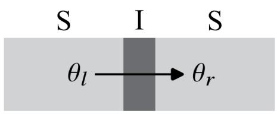  
(b)

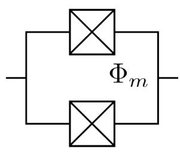

(c)  
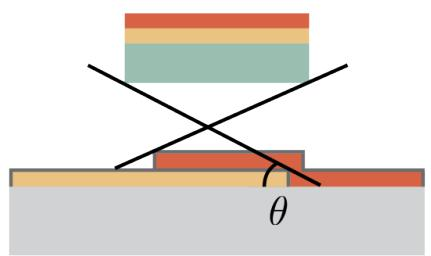

(d)  
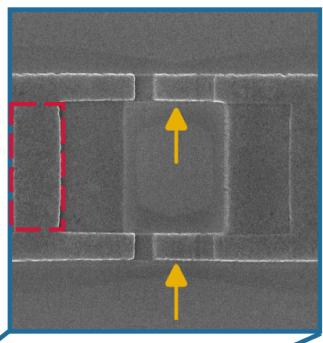

(e)  
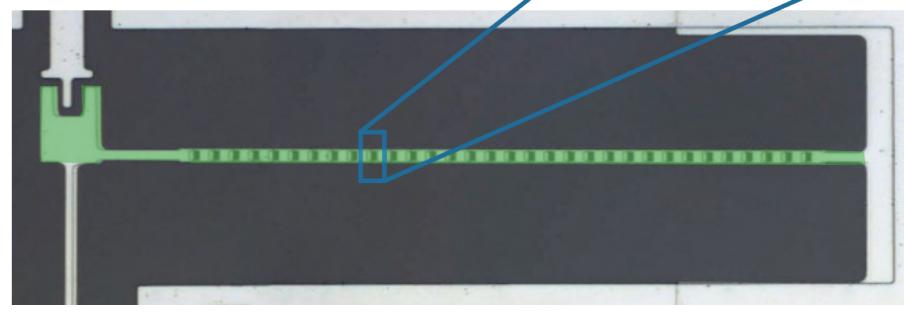  
图 2.1 （a）约瑟夫森结示意图，S代表超导金属，I代表绝缘体。（b）SQUID结构示意图，图中带有两个对角线的方框代表约瑟夫森结。（c）制备约瑟夫森结的双层斜蒸发工艺示意图。浅灰色部分为衬底，绿色部分为光刻胶，黄色和橘红色部分为金属铝，深灰色部分为氧化铝。由于铝在空气中也会自然氧化，所以在第二层蒸镀的金属表面也有一层氧化铝。（d）单个 SQUID 结构扫描电镜照片。黄色箭头所指的地方为约瑟夫森结。（e）着色的SQUID阵列反射腔扫描电镜照片。绿色部分为SQUID阵列构成的腔中心导体。

约瑟夫森结和 SQUID 都具有较大的电感，因此都可以用来构成高阻抗超导腔的中心导体部分。但对于单个约瑟夫森结或者单个 SQUID，只有在电流远小于临界电流时，它们的电感随相位或者磁通的变化才是线性的。当电感进入非线性区域后，谐振频率的间隔并不相等，因此并不适合用来形成谐振腔。为了解决这个问题，我们可以采用约瑟夫森结阵列或者 SQUID 阵列来有效地扩大线性响应的范围[6]。考虑到 SQUID 的电感可以通过磁通调节，从而使得最终形成的腔频率可调，因此我们选择了 SQUID 阵列来构成高阻抗腔。

如图2.1（c），我们采用双层胶工艺和双层斜蒸发镀膜（具体工艺流程见本章附录2.A）来制备SQUID。利用电子束曝光和显影技术，我们可以在衬底（图中浅灰色部分）上制备出特定图案的电子束胶结构（图2.1（c）中绿色部分）。我们先以与衬底成 𝜃 角度镀一层铝金属（黄色部分），然后在氧气环境中氧化，形成一层薄薄的氧化铝（深灰色部分）。接着以衬底成 $1 8 0 ^ { \circ } - \theta$ 角度镀第二层铝金属（橘红色部分），两层金属交叠的部分决定了约瑟夫森结的结面积。剥离去除其他胶与金属，我们就可以制备出如图2.1（d）所示的 SQUID。利用这种方法，我们可以制备出一端接地的SQUID的阵列和对应的地平面，这就形成了SQUID阵列反射腔，如图2.1（e）所示。

单个 SQUID 可以由如图2.2（a）所示的电路模型来描述。我们所需要的两个结（图2.1（d）黄色箭头示意部分），可以等效成SQUID的电感 $L _ { S } = L _ { J } ^ { S }$ 和一个电容 $C _ { S }$ 的并联。由于我们采用的工艺，在单个 SQUID 中，连接两个结的区域（图2.1（d）红色虚线方框）形成了不需要的结，这在电路中等效为并联的电容 $L _ { j }$ 和电感 $C _ { j }$ 。幸运的是，这个结的面积很大，电感的非线性很弱，因此可以被忽略。在这个近似下，我们可以用如图2.2（b）所示的电路来描述实验中使用的 SQUID 阵列反射腔。

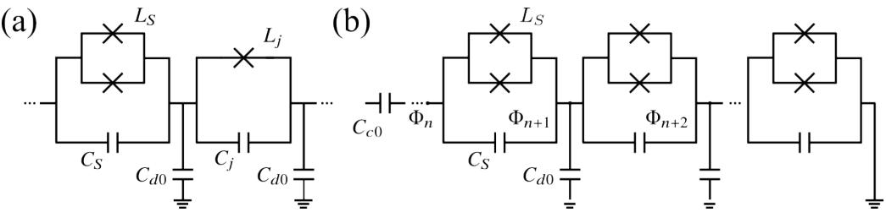  
图 2.2 （a）SQUID 的电路模型示意图。（b）SQUID 阵列反射腔的电路模型示意图。 $C _ { c 0 }$ 为传输线和腔之间的耦合电容。

类似于1.3节，我们可以利用拉格朗日量来推导SQUID阵列腔的哈密顿量和谐振频率[2]。阵列的拉格朗日量为：

$$
\mathcal { L } = \sum _ { n = 1 } ^ { N } \frac { 1 } { 2 } C _ { d 0 } \dot { \Phi } _ { n } ^ { 2 } + \frac { 1 } { 2 } C _ { S } ( \dot { \Phi } _ { n } - \dot { \Phi } _ { n + 1 } ) ^ { 2 } - \frac { 1 } { 2 } \frac { ( \Phi _ { n } - \Phi _ { n + 1 } ) ^ { 2 } } { L _ { S } } ,\tag{2.6}
$$

其中 $\Phi _ { n }$ 为每个 SQUID 节点处的磁通， $C _ { d 0 }$ 为每个 SQUID 对地的电容。第一项和第二项分别为第 n 个 SQUID 对地的电容和自身的电容中存储的能量，而最后

一项为第 n 个 SQUID 的电感中存储的能量。如果将每个节点处的磁通进行傅里叶展开：

$$
\Phi _ { n } = { \frac { 1 } { \sqrt { N } } } \sum _ { n = 1 } ^ { N } e ^ { i ( \pi k / N ) n } \Phi _ { k } ,\tag{2.7}
$$

将上式代入式(2.6)中，并利用 $\begin{array} { r } { \mathcal { H } = \frac { \partial \mathcal { L } } { \partial \dot { \phi } } \dot { \phi } - \mathcal { L } } \end{array}$ 可以得到哈密顿量为

$$
\mathcal { H } = \sum _ { k = - N / 2 } ^ { N / 2 } \mathbb { C } _ { k k ^ { \prime } } ^ { - 1 } Q _ { k } Q _ { - k ^ { \prime } } + \mathbb { L } _ { k k ^ { \prime } } ^ { - 1 } \Phi _ { k } \Phi _ { - k ^ { \prime } } .\tag{2.8}
$$

这里电荷量 $Q _ { k }$ 是磁通 $\Phi _ { k }$ 的正则共轭量。 $\mathbb { C } _ { k k ^ { \prime } } = \delta _ { k k ^ { \prime } } [ C _ { d 0 } / 2 + C _ { S } ( 1 - \cos \pi k / N ) ]$ $\mathbb { L } _ { k k ^ { \prime } } = \delta _ { k k ^ { \prime } } L _ { S } / ( 1 - \cos \pi k / N )$ 。这个哈密顿量的形式与式(1.6)的形式相同，类似地将其量子化，并如式(1.7)和式(1.8)那样定义产生算符和湮灭算符（只要将式中的磁通和电荷量替换为 $\Phi _ { k }$ 和 $Q _ { k }$ 即可）。利用这两个算符，我们可以得到：

$$
\mathcal { H } = \sum _ { k = - N / 2 } ^ { N / 2 } \hbar \omega _ { k } ( a _ { k } ^ { \dagger } a _ { k } + 1 / 2 ) .\tag{2.9}
$$

这里腔的共振频率 $\omega _ { k }$ 为：

$$
\omega _ { k } = ( \mathbb { L } _ { k k } \mathbb { C } _ { k k } ) ^ { - 1 / 2 } = \omega _ { 0 } \sqrt { \frac { 1 - \cos \frac { \pi k } { N } } { \frac { C _ { d 0 } } { 2 C _ { S } } + ( 1 - \cos \frac { \pi k } { N } ) } } ,\tag{2.10}
$$

其中 $\omega _ { 0 } = 1 / \sqrt { L _ { s } C _ { S } }$ 为单个SQUID的plasma频率。同样的，我们一般利用腔的基频，即 k=0的共振频率。因此哈密顿量可以简化为：

$$
{ \mathcal { H } } = \hbar \omega _ { r } ( a ^ { \dagger } a + 1 / 2 ) .\tag{2.11}
$$

这里 $\omega _ { r } \equiv \omega _ { 0 } , ~ a \equiv a _ { 0 } , ~ a ^ { \dagger } \equiv a _ { 0 } ^ { \dagger }$ 。可以看出式(2.11)与式(1.10)的形式相同。由公式(2.10)可知， $\omega _ { r } \propto 1 / \sqrt { L _ { s } }$ ，而 $L _ { S }$ 受到SQUID中的磁通 $\Phi _ { m }$ 的调制。所以在实验上，我们可以通过改变外加的磁场来改变 $\Phi _ { m }$ ，进而实现腔频率的调节[7]。

## 2.1.2 高动态电感材料谐振腔

除了使用 SQUID 阵列以外，第二种方法是利用具有高动态电感的材料，这种材料一般是具有强无序的超导材料，比如铌、氮化铌、氮化钛、铌钛氮、颗粒铝（granular aluminum）等[8-12]。这些材料的动态电感来自于载流子运动时的动能。材料单位面积的动态电感，即方块电感 $L _ { s }$ （sheet inductance）为：

$$
L _ { s } = \frac { m _ { e } } { 2 n _ { s } e ^ { 2 } h } ,\tag{2.12}
$$

利用 $L _ { s }$ ，我们可以直接比较不同材料的动态电感。可见，在相同的膜厚ℎ下，材料的方块电感越大，我们就更容易制备出高阻抗的腔。

将材料制备成CPW 腔后，腔的总动态电感可以表达为[4,8]:

$$
L _ { k } = L _ { s } \frac { l } { w } = \frac { m _ { e } } { 2 n _ { s } e ^ { 2 } } \frac { l } { w h } ,\tag{2.13}
$$

其中𝑚 为电子质量， $m _ { e }$ $e$ 为基本电荷，𝑛 为库珀对密度。正如1.3节定义的，𝑙，𝑤和 $n _ { s }$ ℎ 分别为 CPW 腔的中心导体长度，宽度和厚度。除了动态电感 $L _ { k }$ 以外，CPW腔还存在源于几何结构的几何电感 $L _ { g }$ ，但是对于上述的高动态电感材料，一般而言， $L _ { k } \gg L _ { g }$ ，因此我们可以忽略其几何电感。

腔的特征阻抗与单位长度的电感有关，而不是总电感。由式(2.13)，我们很容易就能计算得到腔的单位长度的电感 $L _ { 0 }$ ：

$$
L _ { 0 } = L _ { k } / l = \frac { m _ { e } } { 2 n _ { s } e ^ { 2 } } \frac { 1 } { w h } .\tag{2.14}
$$

由上式可知 $L _ { 0 }$ 与中心导体横截面面积 𝑤ℎ 成反比，所以为了获得更高的动态电感，我们会尽可能地减小中心导体的横截面面积。考虑到膜的厚度ℎ过小时，膜的质量不够稳定，因此我们需要将膜厚固定在一个合适的值。在此基础上，我们再通过选择尽可能小的 𝑤 来获得更高的电感。高动态电感材料腔的哈密顿量可以用经典的CPW腔的哈密顿量（式(1.10)）来描述。通过设计腔的电容电感和长度，可以确定腔频 $\omega _ { r } = \pi / l \sqrt { L _ { 0 } C _ { 0 } }$

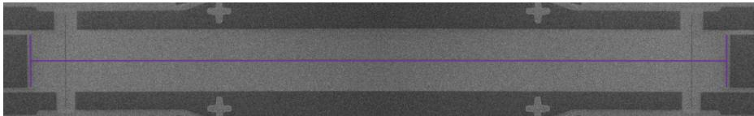  
图 2.3 NbTiN 透射腔的扫描电镜图。紫色部分为腔的中心导体。

出于制备工艺的可行性以及动态电感的大小方面的考虑，在诸多的高动态电感材料中，我们选择用铌钛氮材料来制备高阻抗腔。通过磁控溅射镀膜机溅射11nm的铌钛氮到衬底上，然后利用电子束曝光和反应离子刻蚀来制备出特定图案的腔，具体工艺流程见本章附录 2.B。图2.3展示了我们制备的铌钛氮透射腔。相比 SQUID 腔，铌钛氮腔的频率无法调节，但是它有着更高的阻抗。

## 2.1.3 腔的耗散

由于腔和环境的耦合，腔信号通常会耗散到环境中。耗散的速率一般定义为 $\kappa = 2 \pi / \tau$ ，𝜏 为腔光子的寿命。𝜅 和腔的品质因子 𝑄 密切相关，两者关系为$Q = \omega _ { r } / \kappa$ 。腔的耗散来自各个方面，但可以分为两大类：

$$
\kappa = \kappa _ { \mathrm { e x t } } + \kappa _ { \mathrm { i n t } } ,\tag{2.15}
$$

其中 $\kappa _ { \mathrm { e x t } }$ 为外部耗散， $\kappa _ { \mathrm { i n t } }$ 代表内部耗散。

外部耗散 𝜅 主要是由于腔和输入输出的传输线耦合导致的[13]。在传输线 $\kappa _ { \mathrm { e x t } }$ 𝜈 $( \nu = 1 , 2 , \cdots )$ 处的耗散 $\kappa _ { \nu }$ 和它与中心导体的耦合电容 $C _ { \mathrm { e x t } , \nu }$ 大小密切相关[14]:

$$
\kappa _ { \nu } = \frac { 2 } { \pi } \omega _ { r } ^ { 3 } Z _ { r } Z _ { 0 , \nu } C _ { \mathrm { e x t , } \nu } ^ { 2 } .\tag{2.16}
$$

其中 $Z _ { r }$ 为腔的单位长度的阻抗， $Z _ { 0 , \nu }$ 为传输线 𝜈 的单位长度的阻抗。我们在设计腔的参数时，可以通过改变耦合电容的大小来调节外部耗散的大小。对于透射腔，存在两个传输线，因此外部耗散 $\kappa _ { \mathrm { e x t } } = \kappa _ { 1 } + \kappa _ { 2 }$ 。我们设计的样品是对称的，一般可以认为 $\kappa _ { 1 } = \kappa _ { 2 }$ 。对于反射腔，只存在一个传输线， $\kappa _ { \mathrm { e x t } } = \kappa _ { 1 }$ o

内部耗散 $\kappa _ { \mathrm { i n t } }$ 来源更加复杂，存在三个主要的耗散通道[15]：（1）超导金属中的准粒子（quasiparticles）导致的电阻损耗[16]，（2）介质（包括衬底、各种界面）中的二能级系统（two-level systems， $\mathrm { T L S s } )$ ）导致的介电损耗[17-18]，（3）靠近腔的电极上引起的微波泄漏[19]。裸腔并不存在最后一种耗散通道，而本文所讨论的腔与量子点耦合的样品，量子点的电极会导致一定的微波泄漏。通常在片上集成滤波器可以在一定程度上解决这种电极引起的耗散[20-22]。经过各个研究组不断的努力，现在也发展出了另一种技术——将腔和量子点分别制备在两个芯片上，最后利用倒装焊工艺将两个芯片耦合到一起，这可以解决电极耗散以及介电损耗的问题，极大地提高腔的Q 值[23]。

## 2.1.4 输入输出理论

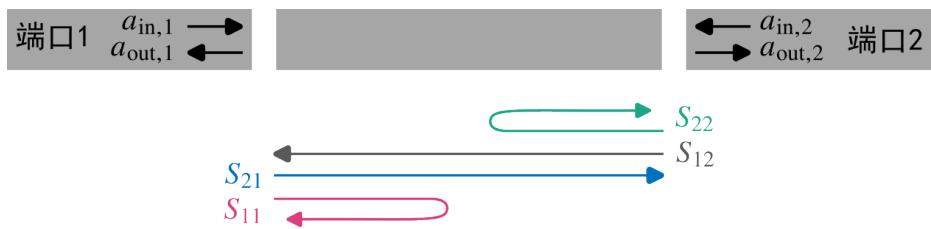  
图 2.4 腔的二端口结构以及散射参数定义示意图。

我们这里以透射腔为例，介绍腔的输入输出理论以及各种散射参数的定义。如图2.4所示，透射腔可以认为是一个二端口器件，中心导体两边的传输线可以定义为端口 1 和端口 2。如果是反射腔，只需要认为端口 2 接地即可。在两个端口处，都可以输入和输出光场。 $a _ { \mathrm { i n } , \nu } ^ { \mathrm { ~ ~ } } \left( a _ { \mathrm { o u t } , \nu } \right)$ 分别为端口𝜈 的输入和输出光场。图2.4中箭头示意了不同端口处的散射参数 $S _ { i j } = a _ { \mathrm { o u t } , i } / a _ { \mathrm { i n } , j }$ 的定义。这些参数可以分为两大类，一类我们称为腔的透射信号（transmission）： $S _ { 1 2 } \setminus S _ { 2 1 }$ ；另一类为腔的反射信号（reflectance）： $S _ { 1 1 } \setminus S _ { 2 2 }$ 。对于结构对称的腔，可以认为 $S _ { 1 2 } = S _ { 2 1 }$ o

根据时间反演关系，输入、输出光场在中心导体和端口 𝜈 处满足边界关系[24-26]：

$$
a _ { o u t , \nu } + a _ { i n , \nu } = \sqrt { \kappa _ { \nu } } a .\tag{2.17}
$$

$\kappa _ { \nu }$ 即为2.1.3节定义的传输线𝑣 处的耗散。

考虑到腔的哈密顿量 $H _ { r }$ 以及腔的各种耗散，这个带耗散的系统可以用量子朗之万方程（quantum Langevin equation）来描述[24,27]：

$$
\dot { a } = - \frac { i } { h } [ a , H _ { r } ] - \frac { \kappa } { 2 } a + \sum _ { \nu } \sqrt { \kappa _ { v } } a _ { \mathrm { i n } , v } ,\tag{2.18}
$$

这里的第一项是由海森堡方程引入的。第二项代表腔的整体耗散，根据2.1.3节，可知腔的整体耗散为 $\begin{array} { r } { \kappa = \sum _ { \nu } \kappa _ { \nu } + \kappa _ { \mathrm { i n t } } \circ } \end{array}$ 。上式最后一项只考虑了在腔两个端口处的输入，实际上可以把内部耗散 $\kappa _ { \mathrm { i n t } }$ 认为是与第三个端口处的耦合导致的，但对于本文涉及的情况，这个端口对应的输入为真空场，因此并不会造成影响。将 $H _ { r }$ 的表达式（式(1.10)）代入式(2.18)，可以得到

$$
\dot { a } = - i \omega _ { r } a - \frac { \kappa } { 2 } a + \sum _ { \nu } \sqrt { \kappa _ { v } } a _ { \mathrm { i n } , v } ,\tag{2.19}
$$

这里我们得到的是关于时间的微分方程。产生算符在频域可以表示为 $\tilde { a } ( \omega ) =$ $\frac { 1 } { 2 \pi } \int _ { - \infty } ^ { \infty } e ^ { i \omega t } a ( t ) d t$ ，由此可以得到式(2.17)和式(2.19)在频域的表示为：

$$
\tilde { a } _ { o u t , \nu } ( \omega ) + \tilde { a } _ { i n , \nu } ( \omega ) = \sqrt { \kappa _ { \nu } } \tilde { a } ( \omega ) ,\tag{2.20}
$$

$$
- i \omega \tilde { a } ( \omega ) = - i \omega _ { r } \tilde { a } ( \omega ) - \frac { \kappa } { 2 } \tilde { a } ( \omega ) + \sum _ { \nu } \sqrt { \kappa _ { v } } \tilde { a } _ { \mathrm { i n } , v } ( \omega ) ,\tag{2.21}
$$

根据这两个式子，我们可以得到任意的输入、输出信号之间的关系。但我们对于反射腔一般只关注其反射信号 $S _ { 1 1 }$ ：

$$
S _ { 1 1 } ( \omega ) = \frac { a _ { \mathrm { o u t , 1 } } } { a _ { \mathrm { i n , 1 } } } = \frac { \kappa _ { e x t } } { i ( \omega _ { r } - \omega ) + \kappa / 2 } - 1 .\tag{2.22}
$$

对于透射腔，我们关注其透射信号：

$$
S _ { 2 1 } ( \omega ) = \frac { a _ { \mathrm { o u t } , 2 } } { a _ { \mathrm { i n } , 1 } } = \frac { \sqrt { \kappa _ { 1 } \kappa _ { 2 } } } { i ( \omega _ { r } - \omega ) + \kappa / 2 } .\tag{2.23}
$$

从上面两个式子中，我们可以得到对应的幅值信号 $| S _ { i j } |$ 以及相位信号 $\boldsymbol { \phi } ^ { \mathrm { ~ } } =$ $\mathrm { a r g } S _ { i j }$ 0

## 2.2 耦合样品的结构以及工艺

为了实现量子点和腔的耦合，我们一般将量子点和腔制备到同一个衬底上，并从腔中心导体出伸出金属电极连接到量子点的 plunger栅极上。本文研究的半导体量子点-腔耦合器件有两种，分别是SQUID阵列反射腔和两个双量子点耦合的样品（第三章的实验使用的样品），以及铌钛氮透射腔和两个双量子点耦合的样品（第四、五章的实验使用的样品）。这两种耦合器件都是由我们自主设计并在实验室加工制备的。接下来，我们将简单介绍一下这两种样品结构和工艺流程。

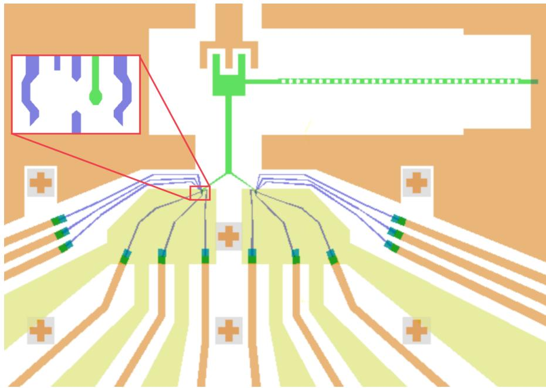  
图 2.5 SQUID 阵列反射腔和量子点耦合样品设计图。图中绿色部分为SQUID阵列，构成了腔的中心导体，橘色部分为腔的地平面。紫色的小电极为两个双量子点，插图部分为放大的双量子点的电极结构，两个量子点的结构相同，成镜像对称。腔中心导体部分伸出一根金属导体连接到两个双量子点的 plunger 电极（绿色）上，实现腔和量子点的耦合。

图2.5展示了我们设计的SQUID阵列反射腔和量子点耦合样品的版图。我们的样品制备在 GaAs/AlGaAs 异质结的衬底上，为了减少衬底中的二维电子气导致的腔信号的耗散[7]，我们首先利用湿法刻蚀技术去除腔区域的二维电子气，然后利用本章附录 2.A的工艺在这个区域制备 SQUID 阵列反射腔。图中所示绿色部分为是腔的中心导体部分，主要由38个SQUID构成。接着我们再制备量子点的金属栅极电极（图中紫色部分），量子点的具体工艺可见我们组之前的博士论文[4,28]。

制备出的 SQUID 阵列腔频率可调，阻抗可以达到 1kΩ，相比传统的 50Ω阻抗腔大大提高了量子点和腔之间的耦合强度。但是由于制备工艺上的误差，每个 SQUID 的性质并不是完全均一的，这会导致一定的耗散。同时由于氧化工艺可能会引入一些缺陷，引起较大的介电损耗等，这些因素导致 SQUID 阵列腔的总耗散较大，腔耗散速率 $\kappa / 2 \pi \approx 3 0 \sim 6 0 \ : \mathrm { M H z }$ o

为了改善腔的品质，同时提高腔的阻抗。我们进一步发展了铌钛氮透射腔的工艺，并将它和量子点工艺结合。图2.6（a）展示了铌钛氮透射腔和两个双量子点的耦合样品设计图。同样的，首先在衬底上刻蚀掉腔区域的二维电子气，再利用本章附录 2.B介绍的工艺来制备铌钛氮腔。图2.6（b）展示了铌钛氮腔的细节图。正如2.1.2节讨论的，为了得到较大的阻抗 $Z _ { r } = \sqrt { L _ { 0 } / C _ { 0 } }$ ，我们设计了窄的中心导体（ $\stackrel { \prime } { w } \approx 0 . 3 2 \mu \mathrm { m } )$ ）来提高单位长度的电感 $( L _ { 0 } \propto 1 / w )$ ），和大的中心导体到地平面的距离 $( 2 0 \mu \mathrm { m } )$ ）来减小电容。由于我们利用反应离子刻蚀技术来制备铌钛氮腔，为了避免量子点区域在刻蚀时受到损伤，在溅射铌钛氮膜之前，需要在整个器件上生长一层氧化铝。但这层氧化铝处可能会形成缺陷层，引入额外的耗散，导致量子点的性质变差，因此在完成腔的制备后，我们需要刻蚀掉量子点区域的氧化铝，再制备量子点的金属电极。图2.6（c）展示了一个双量子点的电极结构，这和图2.5展示的结构有所不同。为了增大双量子点的电偶极矩，我们微调了部分电极结构。

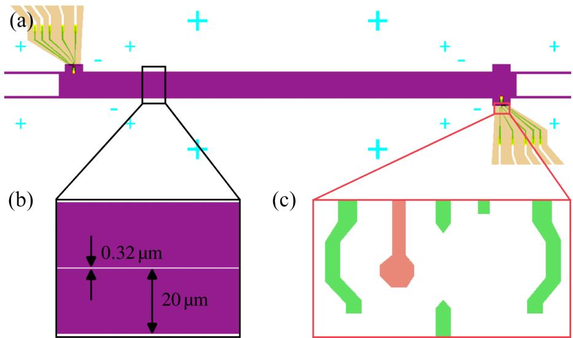  
图 2.6 （a）铌钛氮透射腔和量子点耦合样品设计图。图中紫色部分为铌钛氮透射腔，绿色的小电极为两个双量子点。（b）放大的透射腔的结构，中心导体部分宽为 $0 . 3 2 \mu \mathrm { m } ,$ 离地平面的距离为 $2 0 \mu \mathrm { m }$ 。（c）放大的量子点结构，粉色的plunger电极连接到腔中心导体上，从而实现腔和量子点的耦合。

相比 SQUID 阵列反射腔，该结构的耦合样品上，铌钛氮腔的阻抗提高到了2kΩ，同时也极大地减少了腔的耗散，使得 $\kappa / 2 \pi \approx 1 1 \mathrm { M H z }$

## 2.3 测量线路

完成样品的制备后，为了测量样品的性能并进行实验，我们先利用引线键合机（wirebonder）将芯片封装到样品板上（具体见本章附录2.C），然后将样品板安装到稀释制冷机（dilution refrigerator）的混合室（mixing chamber）处的冷指上。我们使用的制冷机为Bluefors公司的LD250，一般情况下，冷指处的温度可以冷却到 20mK左右。

图2.7展示了具体的测量线路图。测量线路主要分为三部分，一部分负责实现量子点的输运测量，一部分对量子点施加直流电压和微波驱动（即第四、五章中使用的周期性驱动），还有一部分用来探测腔信号。如图2.7所示，左边第一条线路利用锁相放大器（Lock-inamplifier，具体型号为SR830）来测量通过量子点的输运电流。从锁相放大器1端口输出的信号经过衰减器和滤波器后，输入到量子点的源极（S）上，再从漏极（D）输出，端口 2 测到的信号就即为流过量子点的电流信号。利用左边第二条线路可以给量子点的栅极电极施加直流电压，控制量子点的势阱，从而实现对量子点各种性质的调控。从电压源（型号为 Itek）输出的电压在室温层经过 5 ∶ 1 的分压和一个低通滤波器，在 4K 层通过电阻电容滤波器（RC filters），最终施加到量子点的电极上。这些滤波器可以保护量子点，同时减少量子点的噪声。第三条线路可以在量子点调节到工作区域后，给量子点施加微波驱动，从而满足某些特定的实验需求。微波源（型号为N5173B或DSG3120）输出的信号在室温层经过一个 DC block 来过滤掉直流的偏压，然后经过不同的温度层上的各级衰减器的衰减，输入到BiasTee上，可以实现和电压源输出的直流电压叠加，这样实现了对一个电极同时施加直流电压和微波驱动。值得注意的一点是，为了减少施加的微波信号对腔的影响，我们一般将微波施加在离连接到腔的 plunger电极较远的电极上。这里我们只展示了一组量子点的线路，对于多组量子点，只需要重复这三条线路的配置即可。

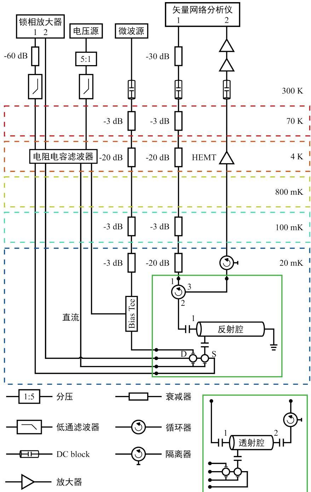  
图 2.7 样品的测量线路示意图。不同颜色的虚线框代表稀释制冷机中不同的温度层。绿色实线框中为样品示意图。上面绿色方框中的为反射腔-量子点耦合的样品示意图。S和D代表量子点的源漏，一个圆圈代表一个量子点。用下面绿色方框中的线路替换掉上面绿色方框中的线路，就可以得到透射腔-量子点耦合样品的测量线路。

利用矢量网络分析仪（Vector network analyzer，型号 TD3619C），我们可以探测得到腔的透射信号 $S _ { 2 1 }$ 和反射信号 $S _ { 1 1 }$ 。矢量网络分析仪的端口 1 输出的探测信号经过室温30dB的衰减和DCblock，然后通过各级衰减器的衰减，最终输入到腔上。值得注意的是反射腔系统和透射腔系统的测量线路在 20mK 处并不相同。如2.7图中上侧的绿色实线框中所示，由于反射腔只有一个端口和外界电容耦合，所以我们需要一个循环器来实现对反射腔的反射信号的测量。衰减后的探测信号从1端口进入循环器，从2端口输出循环器后进入反射腔的端口1，反射腔反射的信号仍然从端口1输出，从2端口进入循环器，再从3端口输出循环器。这个输出信号经过一个隔离器来隔绝探测信号直接的泄漏，再经过低温和室温层的三级放大，最终被矢量网络分析仪探测到，由此我们可以测到 $S _ { 1 1 }$ 。对于透射腔系统，20mK层的线路更加直观，衰减后的探测信号直接进入腔的端口1，腔的信号从端口2输出后，通过两级隔离器后，再经过逐级放大，最后由矢量网络分析仪测量，我们就可以得到 $S _ { 2 1 }$ C

## 2.4 样品的基本表征和参数提取

在上一节中，我们根据系统的测量线路介绍了如何实现量子点输运信号、腔信号的探测以及如何施加周期性微波驱动。我们组经过不断摸索，发展总结了一套利用输运信号以及腔信号来实现量子点-腔耦合系统的基本表征与参数提取的方法。在这一节中，我们将具体阐述一下这套方法。

## 2.4.1 量子点的基本表征

为了对样品进行初步表征，我们首先通过测量电流输运信号随电极电压的变化来判断量子点的电极能否正常工作。这里我们以双量子点为例。

(a)  
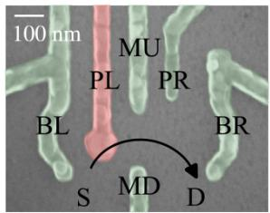

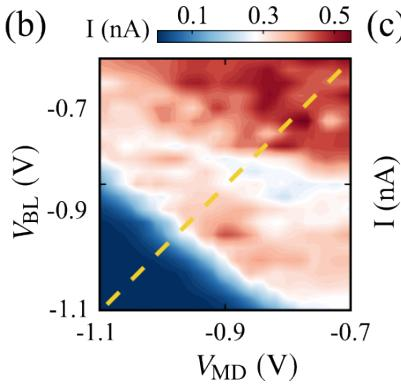

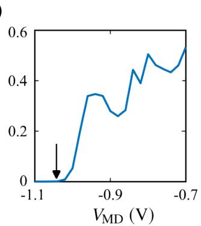  
图 2.8 （a）双量子点电极结构图。（b）锁相放大器测得的量子点输运电流随MD和BL电极上施加的电压变化的相图。（c）图中展示了（b）中黄色虚线处，输运电流随电压的变化。沿这条黄色虚线 $V _ { \mathbf { B L } } = V _ { \mathbf { M D } }$ ，为了方便起见，这里的坐标只写了 $V _ { \mathbf { M D } }$ 。本文图中的电压都是5 ∶ 1 分压后的电压值。

图2.8（a）中展示了一个典型的双量子点的电极结构。正如2.3节讨论的，我们利用锁相放大器测量从源极 S 到漏极 D 的电流信号。锁相放大器可以锁定某个频率的信号来进行放大，从而实现微小信号的测量。一般而言，我们设置锁相放大器的输出交流电压幅值为20mV，衰减60dB后（衰减1000倍到 $2 0 \mu \mathrm { V } )$ ），输入量子点的源极。为了获得较好的测量效果，我们会扫描锁相放大器锁定的频率，选择一个信号量较大且抖动较小的频率。根据测量经验来看，这个频率一般为质数，且需要远离市电频率50Hz以及市电频率的倍数来减少市电的影响。由于源漏之间的电阻大约为十多kΩ，测得的输运电流一般在 nA 量级。

设置好输运的通道后，我们一般利用电压源（具体线路见图2.7）在电极MD和它上方成对的某个电极上施加电压。如果电极BL、MU、BR正常工作，则在施加一定的负电压后，输运电流能被完全关闭。而正常工作的电极PR虽然不能完全关闭通道，但也能调节输运电流。作为一个范例，图2.8（b）展示了电流随MD和BL电极上施加的电压变化的相图，可以发现当两个电极上的负电压小于某个值后，输运电流为零，即输运通道被完全关闭。我们可以定义一个参数来量化这个关闭的电压值。我们沿相图的对角线拉线（即如图2.8（b）的黄色虚线所示，在这条线上 $V _ { \mathrm { B L } } = V _ { \mathrm { M D } } \rangle$ ），电流随电压的变化关系展示在图2.8（c）中。可见电流随着所加电压的变小而减小，最终等于零时对应的电压（黑色箭头示意位置）就被定义为完全关闭的电压阈值，即截止电压（pinch-offvoltage）。类似地，我们可以得到MD 和其他电极对应的截止电压。

在得到截止电压后，我们就大概知道如何较快将量子点调节到工作区域。由于不同电极对量子点的影响不是独立的，我们一般会在把截止电压往上加 0.2−0.3 V 作为调节量子点工作区域的起点，然后根据结果调节各个电极上的电压，多次迭代，最终设置到我们想要的区域。

## 2.4.2 腔性质的基本表征

在确定量子点电极的状态后，我们还要初步确定腔的性质。此时需要将量子点的电压设置在较大的负压处来耗尽量子点处的二维电子气，减少对腔的影响，从而实现裸腔性质的表征。通过从腔信号中提取腔的频率 $\omega _ { r }$ 和耗散速率 𝜅，我们就可以判断腔的性质是否能满足后续的实验需求。利用2.3节所展示的线路，矢量网络分析仪可以测量得到腔的反射信号 $S _ { 1 1 }$ 和透射信号 $S _ { 2 1 }$

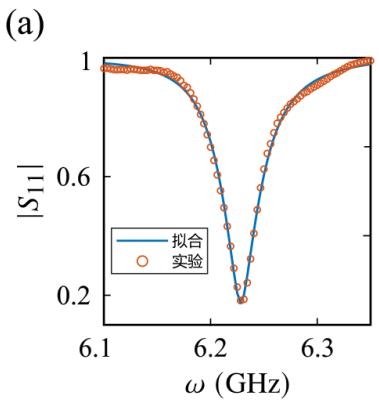

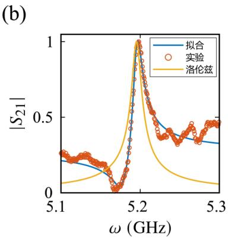  
图 2.9 （a）反射腔的反射信号幅值 $\vert S _ { 1 1 } \vert \cdot$ 、（b）透射腔的透射信号幅值 $| S _ { 2 1 } |$ 随探测频率𝜔的变化。圆圈为测得的实验数据，蓝色实线为公式拟合的曲线。没有法诺效应时，腔的线性为洛伦兹线形，即图中黄色实线。

图2.9（a）中展示了实验中测得的反射腔的反射信号幅值（橘红色圆圈）。图中的反射信号幅值经过归一化处理，即 $| S _ { 1 1 } ^ { \mathrm { n o r m } } | = | S _ { 1 1 } | / | S _ { 1 1 } ^ { 0 } |$ 。这里的 $\vert S _ { 1 1 } ^ { 0 } \vert$ 为本底的幅值，即为远离腔的谐振峰时的反射信号幅值。简便起见，在后文中，我们使用 $| S _ { 1 1 } | \equiv | S _ { 1 1 } ^ { \mathrm { n o r m } } |$ 。从图2.9（a）中，我们可以看到当探测的频率接近反射腔的谐振频率时，有一个很深的谷，谷的宽度取决于腔的耗散速率 $\kappa .$ 。利用反射信号公式（式(2.22)），我们可以很好地拟合实验数据（如图中蓝色的实线所示），并提取出腔的频率 $\omega _ { r } / 2 \pi \approx 6 . 2 3 5 \mathrm { G H z }$ ，耗散速率 $\kappa / 2 \pi \approx 6 2 \mathrm { M H z }$ o

对于透射腔，我们一般表征其透射信号。本文展示的透射信号幅值也经过归一化处理，即 $| S _ { 2 1 } ^ { \mathrm { n o r m } } | = | S _ { 2 1 } | / | S _ { 2 1 } ^ { 0 } |$ ，其中 $| S _ { 2 1 } ^ { 0 } |$ 为腔共振峰处的腔透射信号幅值。简便起见，我们定义 $| S _ { 2 1 } | \equiv | S _ { 2 1 } ^ { \mathrm { n o r m } } |$ 。图2.9（b）中的橘红色圆圈即为测量到的透射幅值信号 $| S _ { 2 1 } |$ 。图中，腔的谐振峰并不对称，这与式(2.23)得到的线型并不一致（图2.9（b）中的黄色实线）。这是因为式(2.23)描述的是一个理想的透射信号，其线型为典型的洛伦兹线型。但是由于实际制备的样品中存在一些其他的结构，导致输入的信号可以经过腔的中心导体到输出端，也可以经过其他的通路到达输出端。原本的腔信号和其他通路的信号会形成干涉，导致非对称的线型，即我们测到的情况。这种不对称的线型一般被称为法诺线型（Fanolineshape）[29-30]，对应的这种干涉效应被称为法诺效应（Fano effect）。样品上的其他通路可能是带耗散的，也可能不存在耗散。幸运的是，不管何种性质，这个不对称性都可以通过增加一个复数来引入[30]，因此透射信号公式变为：

$$
S _ { 2 1 } ( \omega _ { p } ) = \frac { a _ { \mathrm { o u t } , 2 } } { a _ { \mathrm { i n } , 1 } } = \frac { \sqrt { \kappa _ { 1 } \kappa _ { 2 } } } { i ( \omega _ { r } - \omega ) + \kappa / 2 } + q .\tag{2.24}
$$

这里q为一个复空间的常数。利用这个公式，我们可以拟合实验数据。当拟合参数为 $\omega _ { r } / 2 \pi = 5 . 1 9 5 \mathrm { G H z }$ $\kappa / 2 \pi = 1 2 \mathrm { M H z }$ ， $q = 0 . 0 1 + 0 . 0 8 4 i$ 时，拟合的蓝色实线和实验数据点吻合良好。在远离谐振频率的地方，测得的实验数据存在一定的震荡，这是由于测量线路本身的背景导致（详细的讨论见第五章附录 5.B）。

## 2.4.3 量子点-腔耦合性质的基本表征

在分别确定量子点和腔的基本状态后，我们需要表征量子点和腔耦合系统的性质。接下来我们主要介绍一下如何提取系统的耦合强度。

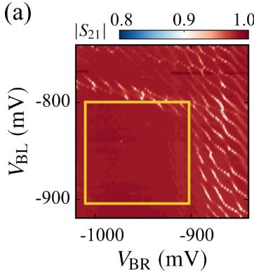

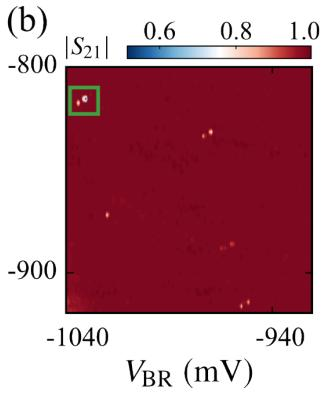

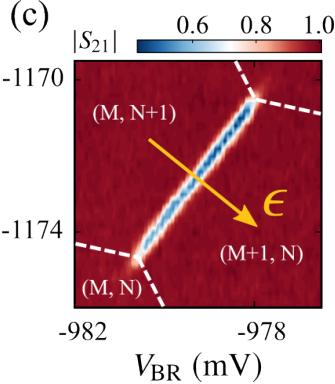  
图 2.10 （a）测得透射腔的透射幅值 $| S _ { 2 1 } |$ 、（b）细扫的 $| S _ { 2 1 } |$ 、（c）在量子点共振隧穿线附近的 $| S _ { 2 1 } |$ 随量子点电极电压变化的相图。图（c）中黄色箭头指示了量子点失谐𝜖变化的方向。在测量这组数据时，我们把探测频率固定在腔频处，即 $\omega = \omega _ { r }$ o

这里我们以双量子点-透射腔耦合系统上测量得到的数据为例。图2.10（a）展示透射腔的透射幅值随量子点电极电压变化的相图。根据1.4节可知，量子点和腔之间的耦合相互作用是一种电偶极相互作用。当量子点中的电子状态发生变化时，会导致腔频的移动，表现为腔信号的变化。因此，图2.10（a）实际上反应了量子点中电子数目的变化，即我们用腔测量到了在1.2节介绍的电荷稳态图。我们可以看到图中有两种负斜率的信号线，这是电子在源漏处的电子库和量子点之间跃迁的信号，这两组不同斜率的线分别是量子点 1 和量子点 2 的充电线。如果能看到充电线，说明量子点和源漏之间的跃迁速率比较大，这可能会导致量子点的退相干速率较大，不利于后续的实验。图中还有一种正斜率的信号线，即共振隧穿线，这是电子在量子点1 和 2 之间隧穿的信号。

在图2.10（a）中，有些区域（黄色方框）几乎看不到量子点跃迁信号，这主要是由于我们测量的步长远大于信号的展宽。此时，我们可以减小电压的变化步长，重新测量透射信号的变化，由此可以得到图2.10（b）所示的结果。最后，我们选择一个信号量较大的共振隧穿线信号进行更加细微的调节，不断变化电极电压，使得隧穿线的信号量最大。图2.10（c）展示了我们细调后的共振隧穿线信号。在这个区域，我们可以提取量子点与腔的耦合强度。

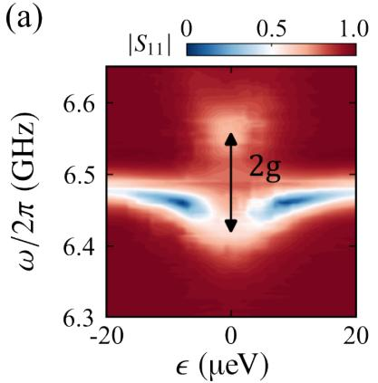

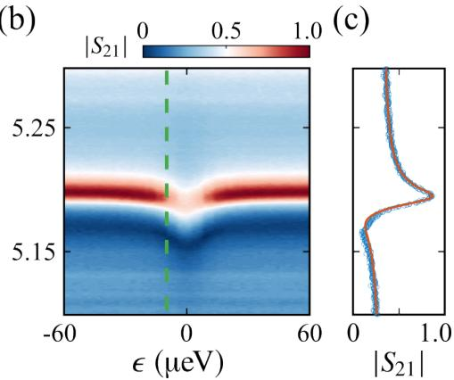  
图 2.11 （a-b）不同样品上测量得到的腔信号随 𝜖 和探测频率 𝜔 变化的相图。此时量子点的转变频率 $\omega _ { q }$ 与腔频 $\omega _ { r }$ 相等。当量子点和腔的耦合强度大于比特和腔的耗散速率时，可以看到真空拉比劈裂。（c）在 $\epsilon = - 8 \mu \mathrm { e V }$ 处（图（b）绿色虚线）， $| S _ { 2 1 } |$ 随 $\omega _ { p }$ 的变化。我们可以看到线型并不对称，这是前面讨论的法诺效应导致的[30]。

一般我们会直接测量腔信号随失谐 𝜖 和探测频率 $\omega$ 变化的图，即常说的透射信号频谱图（transmission spectrum）。当量子点和腔的耦合强度较大，大于比特和腔的耗散速率时，频谱图中可以看到真空拉比劈裂（如图2.11（a）所示），两个信号劈开的距离为两倍的耦合强度（如图中的黑色双向箭头所示），因此从中可以直接提取耦合强度。对于我们的样品，虽然利用高阻抗腔提高了耦合强度，但是量子点的耗散仍然较大，这导致我们往往无法看到这样的劈裂，而经常测量到图2.11（b）所示的结果。在图中，我们可以明显看到腔频率受到量子点的影响导致的变化，但无法直接得到耦合强度，此时我们需要拟合数据来提取系统参数。

拟合实验数据需要双量子点-腔耦合系统的腔信号的数学表达式。正如1.2节介绍的，在共振隧穿线附近，双量子点可以由二能级来描述，其哈密顿量为$H _ { \mathrm { D Q D } } ~ = ~ \textstyle { \frac { 1 } { 2 } } ( \epsilon \sigma _ { z } + 2 t \sigma _ { x } )$ 。我们已经知道腔的哈密顿量为 $H _ { r } \ = \ \hbar \omega _ { r } ( a ^ { \dagger } a + 1 / 2 )$ （式(1.10)）。根据1.4节的推导过程，针对双量子点的二能级，我们可以得到描述耦合相互作用的哈密顿量 $H _ { c } = \hbar g \sigma _ { z } ( a ^ { \dagger } + a )$ 。因此整个系统的哈密顿量为：

$$
H _ { t } = H _ { \mathrm { D Q D } } + H _ { r } + H _ { c } .\tag{2.25}
$$

我们仍然可以考虑通过输入输出理论和量子朗之万方程来得到腔信号。类似于推导裸腔信号的方法（见2.1.4节），把公式中的 $H _ { r }$ 替换为 $H _ { t }$ ，再加上量子点算符 𝜎 的量子朗之万方程，联立这几个方程就可以得到腔的透射信号公式，详细 $\sigma _ { z }$ 的推导过程可参考之前发表的文献[31-34]。

二能级和腔耦合系统的腔透射信号的具体表达式为[31-32]：

$$
S _ { 2 1 } ( \omega ) = \frac { a _ { \mathrm { o u t } , 2 } } { a _ { \mathrm { i n } , 1 } } = \frac { \sqrt { \kappa _ { 1 } \kappa _ { 2 } } } { i ( \omega _ { r } - \omega ) + i g \sin \theta \chi + \kappa / 2 } ,\tag{2.26}
$$

其中极化率（susceptibility） $\chi$ 为

$$
\chi = - \frac { g \sin \theta ( p _ { 1 } - p _ { 2 } ) } { \omega _ { q } - \omega - i \gamma } .\tag{2.27}
$$

其中 $\omega _ { q } = \sqrt { \epsilon ^ { 2 } + 4 t ^ { 2 } } / \hbar$ ，sin $\theta = { 2 t } / { \sqrt { \epsilon ^ { 2 } + 4 t ^ { 2 } } }$ ， $\gamma$ 为量子点的退相干速率。通常我们会把 𝑔sin𝜃 定义为 $\epsilon$ 处的有效耦合强度 𝑔 。在 $g _ { \mathrm { e f f } }$ $\epsilon = 0$ 时，有效耦合强度最大，此时 $g _ { \mathrm { e f f } } = g$ 。一般文章中展示的耦合强度都是在 $\epsilon = 0$ 处获得的。𝑝 为态占据 $p _ { j }$ 概率。虽然我们的样品放置在稀释制冷机的混合腔室上冷却到20mK，但在实际情况中，样品的电子温度往往在几十到百mK。如果两个能级之间的能级差较小，温度可能会导致激发态的占据不为零。这种热占据可以利用玻尔兹曼分布来描述：

$$
p _ { j } = \frac { e ^ { - E _ { j } / k _ { B } T _ { e } } } { \sum _ { j } e ^ { - E _ { j } / k _ { B } T _ { e } } } .\tag{2.28}
$$

$k _ { B }$ 为玻尔兹曼常数（Boltzmann constant）， $T _ { e }$ 为量子点的电子温度。

类似于裸腔，我们可以引入一个复常数𝑞来描述腔的线型的不对称性[35]，则 $q$ 腔透射信号为：

$$
S _ { 2 1 } ( \omega _ { p } ) = \frac { a _ { \mathrm { o u t , 2 } } } { a _ { \mathrm { i n , 1 } } } = \frac { \sqrt { \kappa _ { 1 } \kappa _ { 2 } } } { i ( \omega _ { r } - \omega ) + i g \sin \theta \chi + \kappa / 2 } + q .\tag{2.29}
$$

根据2.4.1和2.4.2节的表征，我们已经知道了𝜔 ， $\omega _ { r }$ $\kappa$ 和 $q$ 。公式(2.29)中未知的参数还有耦合强度 $g$ 、2𝑡 和 $\gamma _ { \textup { c } }$ 。利用这个公式可以拟合透射幅值 $| S _ { 2 1 } |$ 随 $\omega$ 变化的数据。图2.11（c）中蓝色的圆圈为数据点，红色实线为公式拟合得到的曲线。从中我们拟合得到 $g / 2 \pi \approx 5 6 \mathrm { M H z }$ $\gamma / 2 \pi \approx 5 6 \mathrm { M H z }$ $2 t / h \approx 5 . 3 \mathrm { G H z }$ 。这种方法提取的量子点的耗散 $\gamma$ 存在一些误差，一个更加准确的提取 $\gamma$ 的方法是采用双色调制频谱（two-tone spectroscopy）[7,36-37]，但是本文涉及的实验结果对 $\gamma$ 的变化并不敏感，因此这里就不做展开讨论。

## 2.5 周期性驱动的基础理论

至此，我们已经了解如何判断量子点-腔耦合系统的基本工作状态。更进一步地，考虑到周期性驱动的重要作用以及广泛应用（具体见1.6节），我们期待将周期性驱动引入耦合系统能够研究更多丰富的物理现象、带来新的可能。为了理解受周期性系统，我们需要了解一些周期性驱动的基本概念。接下来，我们将简单介绍一下周期性驱动中出现的物理现象以及理解周期性驱动所需要的基础理论，主要包括常见的 Landau-Zener-Stückelberg-Majorana interference（LZSM 干涉）以及 Floquet 理论。

## 2.5.1 LZSM 干涉

在外界的周期性强驱动的作用下，量子点系统会发生 LZSM 干涉。二能级系统（two-levelsystem）是最简单的量子系统，常常用来描述包括量子点在内的多种物理系统。在这里我们就以二能级系统为例，简单介绍一下周期性驱动导致的 LZSM 干涉。

为了方便讨论，我们在这里重新展示了二能级系统的哈密顿量，即式(1.2)：

$$
H _ { \mathrm { T L S } } = \frac { 1 } { 2 } ( \epsilon \sigma _ { z } + 2 t \sigma _ { x } ) ,\tag{2.30}
$$

这里的参数定义与之前相同。

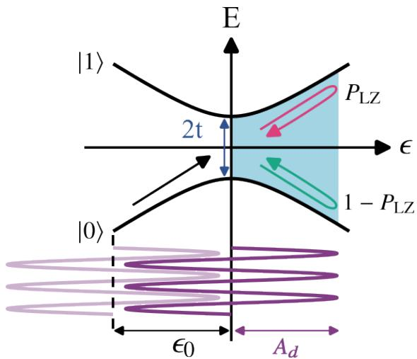  
图 2.12 受驱动的二能级示意图。图中紫色的实线、散射的箭头以及积累的相位（蓝色区域）为 $\epsilon _ { 0 } = 0$ 的情形。

驱动可以有不同的形式，如果驱动作用在哈密顿量的对角项上，一般称为纵向驱动，而如果驱动作用在非对角项上，则为横向驱动。在实验中，我们可以选择在不同的电极上施加驱动（实验上的具体实现方法见2.3节），从而控制驱动的形式。在这里我们以纵向驱动为例，即对于二能级系统，其形式 $\propto \sigma _ { z }$ 。假如这种周期性驱动是单色的（monochromatic），则驱动项可以写为：

$$
A _ { d } \sin ( 2 \pi v _ { d } t ) \sigma _ { z } ,\tag{2.31}
$$

其中 $A _ { d }$ ，𝑣 分别为驱动的幅值，频率，对应的周期为 $v _ { d }$ $T = 1 / v _ { d }$ 。因此二能级的失谐由两部分组成：一部分是驱动项，另一部分则为直流电压控制的失谐偏移量

（offset） $\epsilon _ { 0 }$ 。即失谐可以表示为：

$$
\epsilon ( t ) = \epsilon _ { 0 } + A _ { d } \sin ( 2 \pi v _ { d } t ) .\tag{2.32}
$$

因此总的随时间变化的哈密顿量为：

$$
H _ { \mathrm { T L S } } ( t ) = \frac { 1 } { 2 } [ \epsilon ( t ) \sigma _ { z } + 2 t \sigma _ { x } ] .\tag{2.33}
$$

图2.12展示了二能级在周期性驱动下系统的变化。从中可见， $\epsilon _ { 0 }$ 控制了系统演化的初始位置，进而影响到后面的相位积累。为了方便讨论，我们定义基态|0⟩ 的占据概率为 $P _ { 0 }$ ，激发态 |1⟩的占据概率为 $P _ { 1 }$ 。

当 𝑡 = 0 时，二能级处于 𝜖 处，一般而言，此时系统处于基态，即 $\epsilon _ { 0 }$ $P _ { 0 } = 1$ C由于外加的驱动，二能级会被驱动到不同的𝜖(𝑡)处。如果驱动的幅值足够大，则系统会经过能级的免交叉点（anti-crossing），在图2.12中为 $\epsilon = 0$ 处。在这个位置，系统可能会发生散射，有一定的概率 $P _ { \mathrm { L } Z }$ 会占据激发态，也有一定的概率$1 - P _ { \mathrm { L } Z }$ 留在基态。这就是一个 Landau-Zener transition（LZ transition）过程。散射导致的概率分布与驱动参数有关， $P _ { \mathrm { L } Z }$ 的具体表达式为[38]:

$$
P _ { \mathrm { L Z } } = \exp ( - 2 \pi \delta ) ,\tag{2.34}
$$

$$
\delta = \frac { ( 2 t ) ^ { 2 } } { 4 \hbar v } = \frac { t ^ { 2 } } { \hbar v } .\tag{2.35}
$$

𝑣为系统在驱动影响下经过免交叉点的速度。从式(2.34)可知， $v$ 越大，到激发态的概率越大。

在驱动的作用下，系统在演化一段时间之后会再次经过免交叉点，只不过这次经过的方向相反，如图中红色和绿色的箭头所示。在每次经过免交叉点时，系统都会发生散射。而这两次散射之间，不同的态会积累不同的相位，两个态积累的相位差即图中蓝色区域面积的两倍，这个相位一般被称为 Stückelberg 相位。除了这个演化过程中能级差导致的相位差，还会累积Stokes相位 $\phi _ { s } ( \delta ) ^ { [ 3 9 - 4 0 ] }$ 。这两个相位相加就得到了两次散射之间积累的总相位，这个总相位会导致干涉效应的出现。如果一直施加这个驱动，二能级会被不断驱动经过免交叉点，发生散射，在两次散射之间积累相位。最终二能级在基态和激发态具有不同的分布，这个分布取决于不同的系统参数和驱动参数。

Landau、Zener、Stückelberg、Majorana 几人从不同的角度来考虑这个问题，都得到了类似的结果[41]，都对这个问题的理论做出了一定的贡献，因此这个物理过程一般被称为 LZSM 干涉。对于更加复杂的量子系统，其能级结构中可能存在多个能级免交叉点，但在周期性驱动的影响下，经过这些能级免交叉点时，都会产生类似的 LZSM 干涉。由于能级更加复杂，多能级系统的 LZSM 干涉会导致更加丰富的物理现象。

## 2.5.2 Floquet 理论

正如上一节所讨论的，许多理论都可以描述这个周期性驱动的物理过程，其中一种有效且直观的方法是利用Floquet理论[42-43]。对于随时间变化的哈密顿量$H ( t )$ ，系统的演化可以由如下的薛定谔方程描述：

$$
i \hbar { \frac { d } { d t } } | \psi ( t ) \rangle = H ( t ) | \psi ( t ) \rangle\tag{2.36}
$$

其中 $H ( t ) = H ( t + T ) , | \psi ( t ) \rangle$ 为量子系统的态。需要注意的是，这里并没有给出$H ( t )$ 具体的形式，所以我们讨论的Floquet理论适用于任意周期性变化的哈密顿量。

利用 Floquet理论，我们可以得到上述的薛定谔方程的解的形式为：

$$
| \psi _ { \alpha } ( t ) \rangle = e ^ { - i \mu _ { \alpha } t / \hbar } | \phi _ { \alpha } ( t ) \rangle ,\tag{2.37}
$$

这里的 $| \phi _ { \alpha } ( t ) \rangle$ 即为 Floquet 态， $\mu _ { \alpha }$ 为对应的准能量（quasienergy）。 $| \phi _ { \alpha } ( t ) \rangle$ 和驱动具有同样的周期𝑇，因此可用傅里叶展开为：

$$
| \phi _ { \alpha } ( t ) \rangle = \sum _ { k = - \infty } ^ { \infty } e ^ { - i 2 \pi k v _ { d } t } | \phi _ { \alpha , k } \rangle ,\tag{2.38}
$$

其中𝑘为整数。 $| \phi _ { \alpha , k } \rangle$ 为 $| \phi _ { \alpha } ( t ) \rangle$ 的𝑘级傅里叶分量，其对应的等效准能量偏移到$\mu _ { \alpha , k } = \mu _ { \alpha } + k h v _ { d }$ 。因此 Floquet 准能量具有周期性结构，其周期为 $h v _ { d }$ 。Floquet理论和固体物理里的 Bloch 理论是很相似的。Bloch 理论描述的是空间位移上的周期性，具有准动量 $q _ { \textsc { i } }$ 。而 Floquet 理论描述的是时间上的周期性，具有准能量$\mu .$ 。因此，一个 $h v _ { d }$ 能量范围通常被称为一个布里渊区。

将薛定谔方程(2.36)写到傅里叶展开的表象中，我们可以得到一个与时间无关的方程[44]：

$$
H _ { F } | u \rangle = \mu | u \rangle ,\tag{2.39}
$$

我们称其为 Floquet 方程。 $H _ { F }$ 为与时间无关的 Floquet 矩阵，|𝑢⟩ 为准能量态的矩阵， $\mu$ 为准能量的向量。虽然得到了与时间无关的方程，但是我们付出的代价是将矩阵的维度变成了无穷维。幸运的是，在数值计算的时候，我们可以选择适当的截断来获得方程的解，更具体的计算过程可见4.4节。

在 Floquet表象下，我们可以得到系统的时间演化算符为[45]：

$$
U ( t , t ^ { \prime } ) = \sum _ { k } | \phi _ { \alpha } ( t ) \rangle \langle \phi _ { \alpha } ( t ^ { \prime } ) | e x p \left\{ - i \mu _ { \alpha } ( t - t ^ { \prime } ) / \hbar \right\} .\tag{2.40}
$$

上式描述了系统在周期性驱动下从时间𝑡′ 到时间𝑡的演化。利用这个公式，我们可以得到任意时刻的系统的状态。

到目前为止，我们只介绍了封闭系统的Floquet理论，即在这里并没有引入任何和环境的相互作用导致的耗散。现在已经发展了多种不同的理论来描述开放的周期性驱动系统，比较常见的有利用 Floquet-Lindblad equation、Floquet-Bloch-Redfieldequation 来描述系统的演化[46-48]。这些方程推导的时候采用近似条件的不同，导致结果会略微不同。在本文后面的章节中，我们主要采用 Floquet-Bloch-Redfield equation，在考虑某些耗散作用时，也利用 Lindbladian 来描述，具体可以见后面章节的理论部分。

## 附录 2.A SQUID 阵列腔工艺

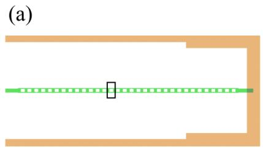

(c)  
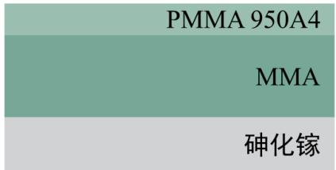

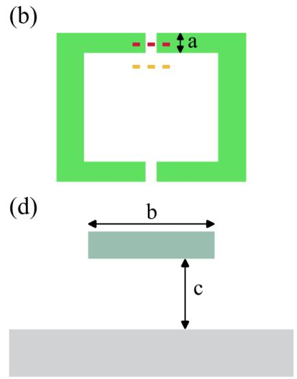

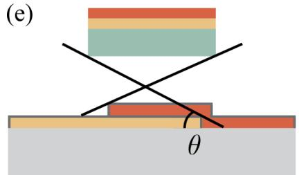

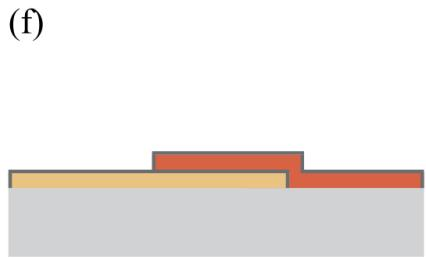  
图 13 （a）SQUID阵列反射腔设计图，图中绿色的部分即为SQUID阵列。（b）图（a）中黑色方框部分的放大细节图。这是一个SQUID的设计图，红色虚线所在位置即形成约瑟夫森结的地方。绿色部分为被曝光的区域。（c）甩完双层胶后的与衬底垂直方向的截面示意图。灰色部分即为衬底。上面两层为电子束胶。（d）曝光显影后，红色虚线所在位置处的纵向截面示意图。（e）双层蒸镀工艺示意图。图中黄色部分为第一层蒸镀的铝金属，而深灰色部分表示氧化后的氧化铝，橘红色部分为第二层蒸镀的铝金属。（f）剥离后剩下的 SQUID 双层金属结构。

我们的目标是在衬底上制备出图13（a）中绿色部分的图案。正如本章2.1.1节所讨论的，我们最关心的是SQUID的两个结，因此以结这里的纵向截面（沿图13（b）中的红色虚线截取的与衬底垂直的横截面）来介绍 SQUID 阵列腔的制备工艺。

首先需要在衬底上利用甩胶机在衬底上覆盖两层电子束胶。如图13（c）所示，我们这里采用的是MMA和PMMA950A4胶，在我们使用的甩胶参数下，胶厚分别为700nm和100nm。然后我们利用电子束曝光仪器曝光出图13（a）所示的绿色部分的图案。最后在显影液中显影，被曝光的地方显影后胶就被溶解。我们选择的 MMA 胶相比 PMMA 950A4 胶而言，对电子束更加敏感，更容易被曝光，因此会导致下层胶被溶解的区域更大。这里我们控制结部分的横向宽度，使得下层胶完全移除，而上层胶还没被曝光，如图13（d）所示的（图13（b）中红色虚线的纵向截面）。但图13（b）中黄色虚线处，双层胶仍然都保留了，因此能够使得上层胶悬浮起来。

接着我们再利用电子束蒸发镀膜机来蒸镀双层铝金属。为了除去被曝光区域的残胶，在蒸镀金属前，首先要用等离子束在两个方向各刻蚀10秒去除残胶。然后用电子束蒸发镀膜机以与片子成 𝜃 角度的方向，以每秒 1nm 的速率镀铝40nm（图13（e）黄色部分），然后传送到氧化腔室，在0.25torr的氧气压下氧化10分钟，形成一层氧化铝（图13（e）深灰色部分），然后再与片子成 $1 8 0 ^ { \circ } \mathrm { C } - \theta$ 的角度镀铝 104.5nm（图13（e）橘红色部分）。最后利用剥离技术，即在 $8 0 ^ { \circ } \mathrm { C }$ 的 NMP（1-Methyl-2-pyrrolidinone）中浸泡 3-4 小时左右去除其余地方的胶和金属，就可以只留下SQUID 阵列腔，如图13（f）所示。

设计的结的一个方向的长度为 a（如图13（b）），曝光后结位置处第一层胶剩下的胶宽度为 b （如图13（c）），而胶离衬底的距离为 c。基于这些参数，我们很容易计算得到双层金属交叠的面积，即约瑟夫森结的面积为 $a ( 2 c / \tan \theta - b )$ 0因此在制备过程中，我们可以通过调节镀膜的角度 𝜃 控制结面积。虽然 SQUID腔频率可调，但是有一定的调节范围。一般，我们需要使得腔频范围包括量子点工作频率。我们可以通过控制结面积的大小实现对结临界电流的调节，从而控制SQUID 的电感，最终达到移动腔整个工作频率范围的目的。

## 附录 2.B 铌钛氮腔制备工艺

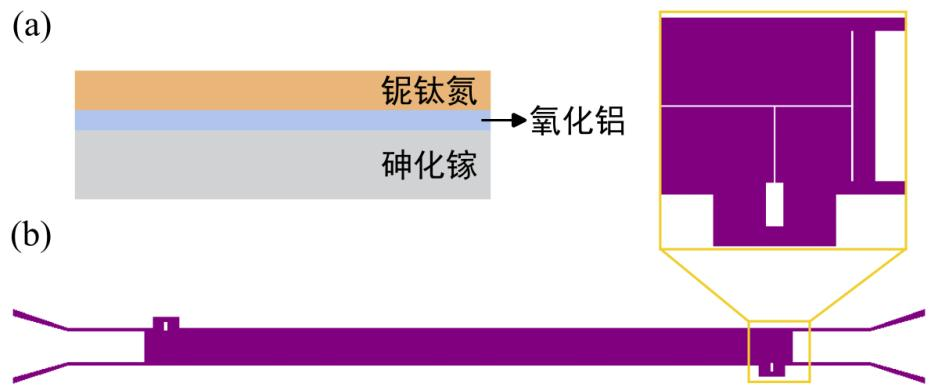  
图 14 （a）垂直衬底方向的结构示意图。（b）铌钛氮透射腔的设计图。放大的地方为腔与量子点以及传输线耦合的部分。

如图14（a）所示，首先我们需要在砷化镓衬底上利用原子层沉积技术（Atomiclayer deposition，ALD）生长一层 15nm 的氧化铝，这主要是在后续刻蚀铌钛氮膜时保护量子点区域，减少对衬底晶格的影响。然后利用磁控溅射镀膜机在衬底表面溅射 11nm 的铌钛氮薄膜。利用电子束曝光技术转移如图14（b）所示的图形到电子束胶上。为了保证胶和衬底的良好接触，刻蚀前需要坚膜处理。接着再利用反应离子刻蚀来刻蚀铌钛氮金属，我们使用的反应气体为四氟化碳，刻蚀时间为 90 秒。值得注意的是，由于刻蚀过程中，电子束胶也会受到影响，从而变性，导致残留在刻蚀沟道以及附近的区域。因此我们采用了氧气刻蚀 15 秒来去除变性的胶。同时为了保证尽可能去除这些胶，我们将样品浸泡在 $9 0 ^ { \circ } \mathrm { C }$ 水浴环境下的NMP 溶液中 10 小时以上。经过上述这些步骤，我们就得到了铌钛氮腔。

我们期待未来可以实现铌钛氮膜的剥离工艺。即在镀膜前，先用胶将量子点区域保护起来。在镀膜后可以直接剥离掉量子点区域的胶和铌钛氮金属，这样我们就不需要生长氧化铝来保护量子点区域，同时也可以减少对量子点的影响。但是我们镀膜的温度在 $2 5 0 ^ { \circ } \mathrm { C }$ ，暂时还没有找到合适的胶，需要之后进一步地测试优化。

## 附录 2.C 样品封装

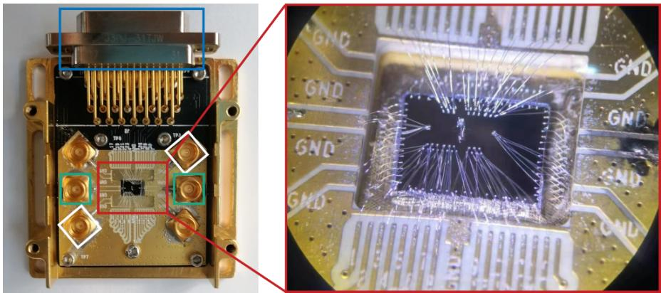  
图 15 样品封装到样品盒后的实物图。放大部分更加清楚地展示了键合线将样品对应电极和印制电路板上对应区域连接。

图15展示了样品封装到样品盒中的状态。我们的样品盒是我们自己设计的，由印制电路板（PrintedCircuit Board）和金属盒构成。利用键合机可以实现样品和印制电路板的良好连接。图中绿色方框为腔的输入输出端口，白色方框为施加微波驱动的高频输入端口，而蓝色方框为施加直流电压的端口。完成键合后，我们还需要安装上盒子的盖板，这主要是为了在安装样品盒到制冷机的混合室层时保护样品。

## 参考文献

[1] Castellanos-Beltran M A, Lehnert K W. Widely tunable parametric amplifier based on a superconducting quantum interference device array resonator. Applied Physics Letters, 2007, 91:083509.

[2] Masluk N A, Pop I M, Kamal A, et al. Microwave characterization of josephson junction arrays: Implementing a low loss superinductance. Phys. Rev. Lett., 2012, 109:137002.

[3] Altimiras C, Parlavecchio O, Joyez P, et al. Tunable microwave impedance matching to a high impedance source using a josephson metamaterial. Applied Physics Letters, 2013, 103: 212601.

[4] 陈明博. 半导体量子点与腔杂化系统的动力学耦合研究. 中国：中国科学技术大学,2021.

[5] Stockklauser A. Strong coupling circuit qed with semiconductor quantum dots. Switzerland: ETH Zurich, 2017.

[6] Palacios-Laloy A, Nguyen F, Mallet F, et al. Tunable Resonators for Quantum Circuits. J. Low Temp. Phys., 2008, 151:1034-1042.

[7] Stockklauser A, Scarlino P, Koski J V, et al. Strong Coupling Cavity QED with Gate-Defined Double Quantum Dots Enabled by a High Impedance Resonator. Phys. Rev. X, 2017, 7:011030.

[8] Annunziata A J, Santavicca D F, Frunzio L, et al. Tunable superconducting nanoinductors. Nanotechnology, 2010, 21:445202.

[9] Samkharadze N, Bruno A, Scarlino P, et al. High-Kinetic-Inductance Superconducting Nanowire Resonators for Circuit QED in a Magnetic Field. Phys. Rev. Appl., 2016, 5:044004.

[10] Amin K R, Ladner C, Jourdan G, et al. Loss mechanisms in TiN high impedance superconducting microwave circuits. Appl. Phys. Lett., 2022, 120:164001.

[11] Rotzinger H, Skacel S T, Pfirrmann M, et al. Aluminium-oxide wires for superconducting high kinetic inductance circuits. Supercond. Sci. Technol., 2017, 30:025002.

[12] Grünhaupt L, Maleeva N, Skacel S T, et al. Loss Mechanisms and Quasiparticle Dynamics in Superconducting Microwave Resonators Made of Thin-Film Granular Aluminum. Phys. Rev. Lett., 2018, 121:117001.

[13] Göppl M, Fragner A, Baur M, et al. Coplanar waveguide resonators for circuit quantum electrodynamics. Journal of Applied Physics, 2008, 104:113904.

[14] Mazin B A, Eckart M E, Bumble B, et al. Optical/UV and X-Ray Microwave Kinetic Inductance Strip Detectors. J. Low Temp. Phys., 2008, 151:537-543.

[15] Mazin B A, Day P K, LeDuc H G, et al. Superconducting kinetic inductance photon detectors// MacEwen H A. Highly Innovative Space Telescope Concepts: volume 4849. SPIE, 2002: 283 - 293.

[16] Kuhr S, Gleyzes S, Guerlin C, et al. Ultrahigh finesse fabry-pérot superconducting resonator. Applied Physics Letters, 2007, 90:164101.

[17] O’Connell A D, Ansmann M, Bialczak R C, et al. Microwave dielectric loss at single photon energies and millikelvin temperatures. Applied Physics Letters, 2008, 92:112903.

[18] Gao J, Daal M, Vayonakis A, et al. Experimental evidence for a surface distribution of twolevel systems in superconducting lithographed microwave resonators. Applied Physics Letters, 2008, 92:152505.

[19] Frey T, Leek P J, Beck M, et al. Characterization of a microwave frequency resonator via a nearby quantum dot. Applied Physics Letters, 2011, 98:262105.

[20] Mi X, Cady J V, Zajac D M, et al. Circuit quantum electrodynamics architecture for gatedefined quantum dots in silicon. Appl. Phys. Lett., 2017, 110:043502.

[21] Holman N, Dodson J P, Edge L F, et al. Microwave engineering for semiconductor quantum dots in a cQED architecture. Appl. Phys. Lett., 2020, 117:083502.

[22] Harvey-Collard P, Zheng G, Dijkema J, et al. On-Chip Microwave Filters for High-Impedance Resonators with Gate-Defined Quantum Dots. Phys. Rev. Appl., 2020, 14:034025.

[23] Holman N, Rosenberg D, Yost D, et al. 3D integration and measurement of a semiconductor double quantum dot with a high-impedance TiN resonator. npj Quantum Inf., 2021, 7:137.

[24] Collett M J, Gardiner C W. Squeezing of intracavity and traveling-wave light fields produced in parametric amplification. Phys. Rev. A, 1984, 30:1386-1391.

[25] Gardiner C W, Collett M J. Input and output in damped quantum systems: Quantum stochastic differential equations and the master equation. Phys. Rev. A, 1985, 31:3761-3774.

[26] Blais A, Grimsmo A L, Girvin S M, et al. Circuit quantum electrodynamics. Rev. Mod. Phys., 2021, 93:025005.

[27] Blais A, Huang R S, Wallraff A, et al. Cavity quantum electrodynamics for superconducting electrical circuits: An architecture for quantum computation. Phys. Rev. A, 2004, 69:062320.

[28] 尤杰. 新型砷化镓量子点的制备与量子输运研究. 中国：中国科学技术大学,2016.

[29] Fano U. Effects of configuration interaction on intensities and phase shifts. Phys. Rev., 1961, 124:1866-1878.

[30] Leppäkangas J, Brehm J D, Yang P, et al. Resonance inversion in a superconducting cavity coupled to artificial atoms and a microwave background. Phys. Rev. A, 2019, 99:063804.

[31] Viennot J J, Dartiailh M C, Cottet A, et al. Coherent coupling of a single spin to microwave cavity photons. Science, 2015, 349:408-411.

[32] Petersson K D, McFaul L W, Schroer M D, et al. Circuit quantum electrodynamics with a spin qubit. Nature, 2012, 490:380-383.

[33] Burkard G, Petta J R. Dispersive readout of valley splittings in cavity-coupled silicon quantum

dots. Phys. Rev. B, 2016, 94:195305.

[34] Benito M, Mi X, Taylor J M, et al. Input-output theory for spin-photon coupling in Si double quantum dots. Phys. Rev. B, 2017, 96:235434.

[35] Borjans F, Croot X G, Mi X, et al. Resonant microwave-mediated interactions between distant electron spins. Nature, 2020, 577:195-198.

[36] Schuster D I, Wallraff A, Blais A, et al. ac Stark Shift and Dephasing of a Superconducting Qubit Strongly Coupled to a Cavity Field. Phys. Rev. Lett., 2005, 94:123602.

[37] Mi X, Cady J V, Zajac D M, et al. Strong coupling of a single electron in silicon to a microwave photon. Science, 2017, 355:156-158.

[38] Landau L, Lifshitz E. Quantum mechanics: Non-relativisitic theory. Third edition ed. Pergamon, 1977: iv.

[39] Shevchenko S, Ashhab S, Nori F. Landau–Zener–Stückelberg interferometry. Phys. Rep., 2010, 492:1-30.

[40] Child M. Molecular collision theory. Academic Press, London, 1974.

[41] Ivakhnenko O V, Shevchenko S N, Nori F. Nonadiabatic Landau–Zener–Stückelberg–Majorana transitions, dynamics, and interference. Phys. Rep., 2023, 995:1-89.

[42] Shirley J H. Solution of the Schrödinger Equation with a Hamiltonian Periodic in Time. Phys. Rev., 1965, 138:B979-B987.

[43] Sambe H. Steady states and quasienergies of a quantum-mechanical system in an oscillating field. Phys. Rev. A, 1973, 7:2203-2213.

[44] Silveri M, Tuorila J, Kemppainen M, et al. Probe spectroscopy of quasienergy states. Phys. Rev. B, 2013, 87:134505.

[45] Breuer H P, Petruccione F. Dissipative quantum systems in strong laser fields: Stochastic wave-function method and floquet theory. Phys. Rev. A, 1997, 55:3101-3116.

[46] Kohler S, Dittrich T, Hänggi P. Floquet-Markovian description of the parametrically driven, dissipative harmonic quantum oscillator. Phys. Rev. E, 1997, 55:300-313.

[47] Schnell A, Eckardt A, Denisov S. Is there a Floquet Lindbladian? Phys. Rev. B, 2020, 101: 100301.

[48] Nafari Qaleh Z, Rezakhani A T. Enhancing energy transfer in quantum systems via periodic driving: Floquet master equations. Phys. Rev. A, 2022, 105:012208.

## 第 3 章 腔探测的三量子点的基本表征

正如我们在第一章中所介绍的，高阻抗腔有效地提高了量子点和腔的耦合强度，增强了对量子点状态的探测灵敏度，有助于实现快速的、高保真度的探测，因此利用高阻抗腔探测量子点状态已经作为一种可靠的、可扩展的探测方式之一。而且将腔整合到量子点上，引入了光与物质的相互作用，丰富了系统的物理过程。

在本章中，我们利用 SQUID 阵列反射腔的高阻抗性能增强了腔的探测灵敏度。我们将 SQUID 腔耦合到三量子点上并借助 SQUID 腔对三量子点进行了详细表征。具体而言，我们主要从两个方面进行了探究。一方面，我们通过调节三量子点的电极电压，在三量子点之间的库伦相互作用满足特定关系时，用腔探测到了三量子点系统中的量子元胞自动机（quantum cellular automata，QCA）现象。另一方面，当量子点能级之间的能量差与腔光子能量匹配时，由于腔光子与量子点之间的相互作用，量子点可以通过吸收腔光子实现能级间的跃迁，即光子辅助跃迁。通过对电极电压的精细调节，多个三量子点的能级能量差能够同时满足这一条件，使得四个光子辅助跃迁过程同时发生。我们称其为光子辅助四重点现象（photon-assisted quadruple point）。

## 3.1 三量子点

近年来，因为三量子点中存在的各种丰富的物理现象，及其在量子计算和量子信息处理方面的广阔的运用前景，三量子点已经成为研究热点之一。

首先，三量子体系中包含各种有趣的物理现象。三量子点的构型更加自由，可以研究许多在双量子点中无法研究的模型。除了串联起来的线性结构，还能排列成三角形状，或者形成一个闭环。这些结构的拓扑性质不同，会表现出不同的效应，可以用来研究双极（bipolar）自旋阻塞[1]、暗态（darkstate）[2-3]、电荷整流器（charging rectifier）[4-5] 等。进一步地，通过调节三量子点中的电子之间的相互作用可以用来研究各种多体（many-body）效应[6-7]。其中一个典型的现象就是量子元胞自动机效应，一个量子点中电子数目的增加会导致另一个电子在另外两个量子点中的重新分布，这是一种特殊的电荷重排布现象[8-11]。在本章的后续内容中，我们首次展示了利用高阻抗腔探测元胞自动机现象的实验结果。

此外，三量子点也可以运用于量子计算方面。与单电子自旋比特、单三态比特（singlet-tripletqubit）相比[12]，使用三量子点器件编码的比特可以实现全电压控制，比如 exchange-only qubit、hybrid qubit 等[13-19]。作为一种可靠的编码方案，exchange-only qubit 系统成功演示了保真度高达 99.88% 的单比特操作[20]。除了上述比特编码方面的应用以外，三量子点提供了一个演示长程相干耦合[21]、长程自旋态相干传输[22]、GHZ 态（Greenberger–Horne–Zeilinger state）[23]、量子模拟[7,24-25] 等现象的平台。在上述量子计算方面的应用中，量子点间的隧穿耦合相互作用都起着关键的作用，比如态的相干传输、GHZ 态的制备等都依赖于隧穿耦合。因此，理解三量子点中的隧穿耦合过程及其实验现象往往是众多实验的基础。然而，当我们利用高阻抗腔对隧穿过程进行表征时，由于三量子点系统与腔的相互耦合，腔光子将参与到量子点的隧穿过程中来，使得隧穿过程变得复杂。在本章中，我们利用三量子点-腔耦合系统的理论模型对实验数据进行模拟。通过分析，我们研究了光子参与的隧穿效应并首次发现了光子辅助四重点现象。

## 3.2 样品基本结构

  
图 3.1 三量子点-腔耦合样品图，其中着色的扫描电镜图为砷化镓三量子点，示意图为SQUID 阵列反射腔。图中金属电极 BL、PL、MU、PR、BR 和 MD 为量子点的电极，其中绿色的电极 PR 连接到反射腔的电压波腹上，实现和腔电场的耦合。三个量子点具体的位置如图中红色的实心圆所示，这是我们通过测量这几个量子点对不同电极上施加的电压的反应来推测得到的。三个白色的方框为欧姆接触。

我们的样品结构如图3.1所示。我们设计的量子点的电极结构实际为一个双量子点的构型。由于双量子点附近的一个缺陷（defect）或者陷阱（trap）和原本的双量子点耦合，实现了一个串联的三量子点。这三个量子点的位置由图中红色圆圈所示。为了方便起见，我们将这三个点从左至右分别标记为点1、点2和点 3。我们的腔为 SOUID 阵列反射腔，具体的扫描电镜图可见2.1.1节中的图2.1（e）。正如2.2节所介绍的，为了实现三量子点和腔的耦合，我们将 plunger 电极（绿色）连接到腔的中心导体上。

正如2.3节介绍的，我们利用矢量网络分析仪在驱动端口（driveline）上施加探测微波并测量从这个端口输出的信号，从而探测反射腔的信号。由于 SQUID的电感可以通过改变每个SQUID感受到的磁通 $\Phi _ { m }$ 来调节，因此SQUID阵列反射腔的频率可以调节（具体原理见2.1.1节）。在实验中，我们在样品盒上用铜线制备了电感线圈，放置在样品上方。当我们调节电感线圈中的电流，SQUID反射腔中的磁通发生变化，从而其腔频改变。图3.2（a）展示了实验测得的腔反射幅值 $\vert S _ { 1 1 } \vert$ 随线圈中的电流 $I _ { \mathrm { c o i l } }$ 和探测频率 $\omega / 2 \pi$ 变化的相图。可以发现除了随 $I _ { \mathrm { c o i l } }$ 变化的信号，还有一些沿 $I _ { \mathrm { c o i l } }$ 方向不变的横向信号，这是测量线路上本底的起伏导致的。幸运的是，将腔频调节到探测频率的范围以外（比如在 $I _ { \mathrm { c o i l } } = - 1 . 9 5 \mathrm { m A }$ 处，即如图中黄色虚线所在位置），我们就可以得到线路的本底随 $\omega / 2 \pi$ 的变化。去掉这个本底起伏，就可以得到图3.2（b）中的信号，可见此时没有横向的起伏，腔信号以外的背景信号非常干净。由图我们可知这块样品上 SQUID 反射腔的频率可调范围为 $5 . 6 - 6 . 2 3 ~ \mathrm { G H z }$ 。我们一般会固定在最大的腔频处，即图中绿色箭头所示处（ $( I _ { \mathrm { c o i l } } = 0 \mathrm { m A } )$ ，此时腔频对 $I _ { \mathrm { c o i l } }$ 的涨落最不敏感，可以减少测量时的噪声。图3.2（c）展示了在图3.2（b）绿色箭头所示的电流下， $\vert S _ { 1 1 } \vert$ 探测频率 $\omega / 2 \pi$ 的变化。利用反射腔的反射幅值公式（式(2.22)），我们可以拟合得到此时腔频 $\omega _ { r } / 2 \pi \approx 6 . 2 3 \mathrm { G H z }$ ，腔的内部耗散、外部耗散和总耗散分别为$( \kappa _ { \mathrm { i n t } } , \kappa _ { \mathrm { e x t } } , \kappa _ { \mathrm { t o t } } ) / 2 \pi = ( 2 5 . 1 9 , 3 5 . 4 3 , 6 0 . 6 2 ) \mathrm { M H z }$

  
(c)

  
图 3.2 SQUID 阵列反射腔信号。（a）未去除线路上本底信号的腔反射幅值 $\lvert S _ { 1 1 } \rvert$ 随线圈中电流 $I _ { \mathrm { c o i l } }$ 和探测频率 $\omega / 2 \pi$ 变化的相图。（b）去除本底信号后的腔反射幅值信号。（c）在 $I _ { \mathrm { c o i l } } = 0 \mathrm { m A }$ 时（图（b）中的绿色箭头所示位置处）， $\vert S _ { 1 1 } \vert$ 随 $\omega / 2 \pi$ 的变化。测量时，在量子点电极上施加的负压已经耗尽了量子点处的二维电子气。

## 3.3 理论描述

通过2.4.3节的介绍可知，由于量子点和腔之间的耦合相互作用，量子点中的电子数目的变化会导致腔的信号的变化，所以我们能够利用腔实现对量子点的表征。但是我们并不明确腔信号具体如何随三量子点的电荷状态变化，接下来我们将介绍腔对三量子点的响应理论。

腔能够实现对量子点和源漏之间的跃迁以及不同量子点之间的跃迁的探测。量子点和源漏之间的电子数目变化引起的腔信号变化可以从等效电路模型来理解。根据量子点和源漏之间的跃迁速率 $t _ { r } / h$ 和腔频 $\omega _ { r } / 2 \pi$ 之间的关系，这个跃迁导致的腔的变化可以通过添加一个等效的阻抗 $\left( t _ { r } / h \approx \omega _ { r } / 2 \pi \right)$ ）、电容 $( t _ { r } / h \gg \omega _ { r } / 2 \pi )$ 或者电感 $( t _ { r } / h \ll \omega _ { r } / 2 \pi )$ ）来量化[26-27]。暂时还没有理论将这种电路模型和考虑量子点内部跃迁的理论很好地统一起来。由于我们在本章中，主要关心的是量子点间的跃迁，而非量子点和源漏之间的跃迁，因此下面我们将集中于推导腔对于量子点间的跃迁变化的响应公式。

根据1.2节的介绍，三量子点可以通过 Hubbard 模型来描述[28-29]。具体的哈密顿量可以表示为：

$$
H _ { \mathrm { T Q D } } = \sum _ { i = 1 , 2 , 3 } ( - \mu _ { i } n _ { i } + \frac { U _ { i i } } { 2 } n _ { i } ( n _ { i } - 1 ) ) + \sum _ { i \ne j } U _ { i j } n _ { i } n _ { j } + \sum _ { i \ne j } ( - t _ { i j } c _ { i \sigma } ^ { \dagger } c _ { j \sigma } - t _ { j i } ^ { * } c _ { j \sigma } ^ { \dagger } c _ { i \sigma } ) .\tag{3.1}
$$

公式中这些参数的具体定义可见1.2节，这里不再赘述。根据公式(3.1)，我们可以发现跃迁过程只在三个量子点中的总电子数相等的态之间发生。由于量子点和源漏之间的跃迁会导致三量子点中的总电子数目发生变化，因此 Hubbard 模型无法描述这个过程。

在我们系统中，量子点和腔的耦合强度远小于腔频和量子点能级之间的能量差，因此整个三量子点系统可以由多能级的 Jaynes-Cummings模型（JC 模型）来描述[30-31]：

$$
H = H _ { \mathrm { T Q D } } + \hbar \omega _ { r } a ^ { \dagger } a + g \tau _ { z } ( a ^ { \dagger } + a ) ,\tag{3.2}
$$

其中第二项为腔的哈密顿量，第三项则描述了三量子点和腔之间的电偶极相互作用。这两项具体的推导过程可见2.1.1节和1.4节。对于三量子点，电偶极矩的形式为：

$$
\tau _ { z } = a _ { 1 } n _ { 1 } + a _ { 2 } n _ { 2 } + a _ { 3 } n _ { 3 } .\tag{3.3}
$$

其中 $n _ { i }$ 为量子点𝑖中的电子数目。 $a _ { i }$ 为量子点𝑖对腔电场的leverarm，由器件中的不同部分的电容决定[32]。

考虑把式(3.2)转换到探测频率 $\omega$ 的旋转坐标系下，并在 $H _ { \mathrm { T Q D } }$ 的本征态基矢下表示，则我们可以得到

$$
H ^ { ' } = \sum _ { n } E _ { n } \sigma _ { n n } + ( \omega _ { r } - \omega ) a ^ { \dagger } a + g _ { c } ( a ^ { \dagger } e ^ { i \omega t } + a e ^ { - i \omega t } ) \sum _ { m } \sum _ { n } d _ { m n } \sigma _ { m n } ,\tag{3.4}
$$

其中 $E _ { n }$ 为 $H _ { \mathrm { T Q D } }$ 的本征态 $| n \rangle$ 的本征值。 $d _ { m n } = \langle m | \tau _ { z } | n \rangle$ 为态 $| m \rangle$ 和态 $| n \rangle$ 的等效转变电偶极矩（effective transition dipole），而 $\sigma _ { m n } = | m \rangle \langle n |$ 。在这里，通过变换到本征基矢下，我们已经包括了由于三量子点的电荷状态的变化导致的电偶极矩的变化。

我们用量子朗之万方程来考虑三量子点和腔的耗散。结合公式(3.4)中的哈密顿量，我们可以得到海森堡表象下的量子朗之万方程[30-31]：

$$
\dot { a } = - i ( \omega _ { r } - \omega ) a - \frac { \kappa } { 2 } a + \sqrt { \kappa _ { \mathrm { e x t } } } a _ { \mathrm { i n , 1 } } - i g e ^ { i \omega t } \sum _ { m } \sum _ { n } d _ { m n } \sigma _ { m n } ,\tag{3.5}
$$

$$
\dot { \sigma } _ { n m } = - i ( E _ { m } - E _ { n } ) \sigma _ { n m } - \gamma _ { n m } \sigma _ { n m } + \sqrt { 2 \gamma } F - i g ( a ^ { \dagger } e ^ { i \omega t } + a e ^ { - i \omega t } ) d _ { m n } ( \sigma _ { n n } - \sigma _ { m m } ) .\tag{3.6}
$$

这两个公式的推导过程与2.1.4节类似，这里不再展开。式中，ℱ 是量子点的量子噪声（quantum noise）， $\gamma _ { m n }$ 为态 $| m \rangle$ 和 $| n \rangle$ 之间的退相干速率。简便起见，我们假定态之间的退相干速率都相同，即 $\gamma _ { m n } = \gamma$ 。实际上，我们很难得到不同态之间的退相干速率，而且这个假设对模拟结果影响并不大。

按照文献[30] 中的计算步骤，在旋波近似下，对式(3.5)和(3.6)求均值，我们可以得到：

$$
\dot { a } = - i ( \omega _ { r } - \omega ) a - \frac { \kappa } { 2 } a + \sqrt { \kappa _ { \mathrm { e x t } } } a _ { \mathrm { i n , 1 } } - i g \sum _ { m } \sum _ { n } d _ { m n } \sigma _ { m n } ,\tag{3.7}
$$

$$
\dot { \sigma } _ { n m } = - i ( E _ { m } - E _ { n } - \omega ) \sigma _ { n m } - \gamma _ { n m } \sigma _ { n m } - i g a d _ { m n } ( p _ { n } - p _ { m } ) .\tag{3.8}
$$

在上面这两个公式中，我们省略了表示平均的⟨⋯⟩。其中平均的量子噪声 $\langle \mathcal { F } \rangle = 0$ 而 $p _ { n } = \langle \sigma _ { n n } \rangle$ 为本征态 $| n \rangle$ 的占据概率，这里我们仍然考虑温度导致的热占据，服从玻尔兹曼分布（见式(2.28)）。

根据2.1.4节，可知由输入输出理论能够得到反射腔的边界条件：

$$
\sqrt { \kappa _ { \mathrm { e x t } } } a = a _ { \mathrm { i n } , 1 } + a _ { \mathrm { o u t } , 1 } .\tag{3.9}
$$

联立公式(3.7)、(3.7)和(3.9)，得到归一化的腔反射信号为：

$$
S _ { 1 1 } = \frac { a _ { \mathrm { o u t , 1 } } } { a _ { \mathrm { i n , 1 } } } = \frac { \sqrt { \kappa _ { \mathrm { e x t , 1 } } } a - a _ { \mathrm { i n , 1 } } } { a _ { \mathrm { i n , 1 } } } = \frac { \kappa _ { \mathrm { e x t } } } { i ( \omega _ { r } - \omega ) + \kappa / 2 + i g \sum _ { m } \sum _ { n } d _ { m n } \chi _ { m n } } - 1 ,\tag{3.10}
$$

其中电极化率 ${ \boldsymbol { \chi } } _ { m n }$ 是 $p _ { n }$ 和 $E _ { n }$ 的函数：

$$
\chi _ { m n } = - \frac { g d _ { n m } ( p _ { m } - p _ { n } ) } { ( E _ { n } - E _ { m } ) - \omega - i \gamma _ { m n } } .\tag{3.11}
$$

如果将探测频率设置在腔频处，即 $\omega = \omega _ { r }$ ，则式(3.10)可以简化为:

$$
S _ { 1 1 } = \frac { \kappa _ { e x t } } { \kappa _ { t o t } / 2 + i g \sum _ { m } \sum _ { n } d _ { m n } \chi _ { m n } } - 1 .\tag{3.12}
$$

由式(3.11)和(3.12)，我们可以发现，如果量子点的两个能级之间存在等效转变电偶极矩 $d _ { m n }$ ，当量子点在这两个能级变化时，这个过程就可以被腔频探测到。由于 $\omega = \omega _ { r }$ ，这两个能级的能级差 $E _ { n } - E _ { m }$ 和腔频 $\omega _ { r }$ 越接近， ${ \boldsymbol { \chi } } _ { m n }$ 的分母越小，则${ \boldsymbol { \chi } } _ { m n }$ 越大，即对腔信号的影响越大，我们测到的信号就会越明显。一般而言，对于反射腔的反射幅值而言，这个信号表现为幅值增强。

(b) $ { V _ { \mathrm { M U } } } = - 1 0 0 2  { \mathrm { m V } }$ |S11|

## 3.4 三量子点的电荷稳态图以及量子元胞自动机

在表征完裸腔后，我们将探测频率固定在腔频处，即 $\omega / 2 \pi \ = \ \omega _ { r } / 2 \pi \ =$ $6 . 2 3 \mathrm { G H z }$ 。在用腔表征量子点时，我们需要把量子点的源漏极接地，这样可以减少源漏之间的输运电流对腔信号的影响。利用腔可以测量得到三量子点的电荷稳态图，图3.3（a-c）展示了我们测量的 $\vert S _ { 1 1 } \vert$ 随量子点电极电压 $V _ { \mathrm { B L } }$ 和 $V _ { \mathrm { B R } }$ 的变化。

  
(c)

$$
 { V _ { \mathrm { M U } } } = - 9 9 8  { \mathrm { m V } }
$$

(d)  

(f)  
  
图 3.3 三量子点在不同的 $V _ { \mathbf { M U } }$ 电压下的电荷稳态图。（a） $V _ { \mathrm { M U } } = - 1 0 0 8 \mathrm { m V } _ { \mathrm { \Omega } }$ 。（b） $V _ { \mathrm { M U } } =$ $- 1 0 0 2 \mathrm { m V } .$ 。其中希腊字母 𝛼, 𝛽, 𝛿, 𝜁, 𝜂 分别代表态 (0, 1, 0)，(1, 0, 1)，(1, 1, 0)，(2, 0, 1)和 (2, 1, 0)。（c） $V _ { \mathrm { M U } } = - 9 9 8 \mathrm { m V } .$ 。为了区别不同的电荷态区域，我们在图中添加了一系列黄色、粉色、绿色的线，这对应于量子点1、2、3的充电线。（d-f）由公式(3.10)计算得到的电荷稳态图。计算时采用的具体参数：（d） $( t _ { 1 2 } , t _ { 1 3 } , t _ { 2 3 } ) = ( 9 . 9 , 0 , 1 1 . 9 ) \mathrm { { \mu e V } }$ 在中间的隧穿线处 $( V _ { \mathrm { B L } } = - 7 6 0 ~ \mathrm { m V }$ 附近）， $t _ { 1 2 } = 3 . 2 ~ \mu \mathrm { e V }$ ，（e） $( t _ { 1 2 } , t _ { 1 3 } , t _ { 2 3 } ) =$ (13.5, 0, 13.1) µeV，（f） $( t _ { 1 2 } , t _ { 1 3 } , t _ { 2 3 } ) = ( 1 3 . 3 , 0 , 1 3 . 1 ) \mu \mathrm { e V } ,$ 。此外，我们发现在测量期间，腔频率有所漂移，计算这三幅图时所用的腔频分别为（d） $\omega _ { r } / 2 \pi = 6 . 2 3 5 \ : \mathrm { G H z }$ ，（e）$\omega _ { r } / 2 \pi = 6 . 2 3 4 \ : \mathrm { G H z }$ ，（f） $\omega _ { r } / 2 \pi = 6 . 2 3 5 \ : \mathrm { G H z }$ 。电子温度 $T _ { e } = 8 0 \mathrm { m K }$ ，三量子点的退相干速率为 $\gamma = 0 . 2 5 \mathrm { G H z } .$ $g / 2 \pi = 8 0 \mathrm { M H z }$ $a _ { 1 } = - 1$ $a _ { 2 } = 1$ $a _ { 3 } = - 0 . 8 2 5$ 。利用式(3.3)可知，上述参数代表点1和2之间的耦合强度为 $g ^ { 1 2 } / 2 \pi = 8 0 \mathrm { M H z }$ ，而点2和3之间的耦合强度为 $g ^ { 2 3 } / 2 \pi = 7 3 \mathrm { { M H z } }$ 。值得注意的是，在模拟结果图中，我们没有看到量子点的充电线。正如3.3节所讨论的，这是因为我们的模型只能描述腔对总电子数目相同的态之间的跃迁的响应。考虑腔对电子在量子点和源漏之间的信号，需要其他的模型[26-27]。

在图3.3（a-c）中，我们通过测得的量子点1和2、2和3之间的隧穿线和点3与源漏之间的跃迁线推测出点1、2的充电线。点1、2、3的充电线分别被标记为黄色、粉色和绿色。在图中，我们把三量子点中的电子填充状态（又被称为电荷态型，charge configuration）标记为 $( N _ { 1 } , N _ { 2 } , N _ { 3 } )$ ，其中 $N _ { i }$ 代表点𝑖中的电子数目。需要注意的是，本章讨论的电子数目指的量子点外层的电子，因为量子点内层的电子对我们接下来的研究的影响可以忽略[33-36]。

从这三个图中可以发现，当我们通过改变 MU 电极上的电压 $V _ { \mathrm { M U } }$ 来改变点3 的充电线的位置时，可以调节出不同的电荷稳态图。在图3.3（a）中，点 3 的充电线远离点1和点2之间的隧穿线，此时相图很普通。当我们进一步减小MU电极上的负电压，点 3 的充电线连续两次穿过点 1 和 2 之间的隧穿线，如图3.3（b）所示。而在 $V _ { \mathrm { M U } } = - 9 9 8 \mathrm { m V }$ 时（图3.3（c）），点3的充电线刚刚靠近点1和2之间的隧穿线。由此可见，我们的三点具有良好的可调性，这也为我们调节三量子点中的各种能量关系提供了基础。

  
图 3.4 （a）放大的电荷稳态图。图中黑色的箭头代表了电子的跃迁方向。（b）量子元胞自动机现象中的跃迁过程的示意图，图中黑色箭头代表电子的跃迁，粉色的箭头代表了腔光子的吸收和发射。（c）模拟的QPC测量的电荷稳态图，图自文献[10]。（d）Ludwig 组用 QPC 测得的电荷稳态图[10]。

正如3.1节介绍的那样，在三量子点中我们可以研究一些多体的现象。其中一种就是量子元胞自动机现象，只有在特殊的库伦相互作用的关系下才会出现。在图3.3（b）中，当点 3 的充电线穿过点 1 和 2 的隧穿线时，我们可以在从点A到点B的线附近看到量子元胞自动机现象。在图3.4（a）中，我们展示了放大的电荷稳态图，从中可以获取更多细节。在 AB 连线附近，态 $\alpha = ( 0 , 1 , 0 )$ 和态$\beta = ( 1 , 0 , 1 )$ 的能量是简并的。我们可以这样理解这个简并：如图3.4（a-b）所示，如果初始态为态𝛼，当一个电子从电子库跃迁到点3中，就导致点2中的电子跃迁到点 1 中，这两个过程同时发生的，即从态 𝛼 变化到态 $\beta ;$ ；如果初态为态 $\beta { \mathrm { ; } }$ 这两个跃迁过程相反，但仍然同时发生。我们通过考虑系统的能量（式(3.1)）来理解这种现象。在AB连线上，三个点的电化学势 $\mu _ { i }$ 很接近，即式(3.1)中的第一项相等。因此整个系统的能量由量子点间的库伦相互作用 $U _ { i j }$ 的大小决定。由于点2和3之间的相互作用 $U _ { 2 3 }$ 大于点1和3之间的相互作用 $U _ { 1 3 }$ ，所以点3填充一个电子后，导致电子在点1和点2之间的重新排布。这两个跃迁过程共同发生导致AB线的斜率和其他的充电线、量子点间的隧穿线的斜率不同。类似地，我们在从点C到点D的线附近（图3.3（b）），在态𝛿 = (1,1,0)和 $\zeta = ( 2 , 0 , 1 )$ 之间也能看到量子元胞自动机现象。

但在这里我们没有用腔探测到线AB和CD，这与图3.4（c-d）中展示的QPC探测的结果不同[8,10-11]。这个区别可能来源于这两种方式的探测原理不同。由于QPC 和量子点通过电容耦合，所以 QPC 探测到的是量子点中的平均电子数目。而基于腔的探测，利用了光子和量子点之间的相互作用，因此腔的反射信号与腔中的光子数有关。在量子元胞自动机现象中，有两种跃迁过程同时发生。如图3.4（b）中的粉色箭头所示，当电子从点2跃迁到点1时，需要从腔中吸收一个光子来匹配两个能级间的能级差。而当电子从电子库隧穿到点 3 时，量子点会发射一个光子到腔中，而额外的能量差可以由源漏中的声子弥补。因此，腔中的光子数目没有发生变化，所以在这里我们没有测量到 $\vert S _ { 1 1 } \vert$ 的变化，即无法观察到线AB和CD。可以注意到，我们这里并没有利用式(3.10)来考虑这个问题，因为量子元胞自动机现象涉及的两个态的总电子数目不同，超出了公式的适用范围。

## 3.5 光子辅助的四重点

腔不仅可以用来探测三量子点的电荷态，腔光子也会参与三量子点中的跃迁过程。当量子点的能级差和腔频匹配时，量子点就有可能吸收或放出腔光子从而在不同态之间隧穿，即光子辅助的隧穿过程。

在三量子点中，存在一种特殊点：在这个点，电子可以在低偏压下发生顺序隧穿（sequential tunneling），一般被称为四重简并点（quadruple point，QP）。基于四重简并点，可以研究长程的自旋态传输[22] 和磁导现象（magnetoconductanceeffect）[37-38] 等。如图3.5（g）所示，当三个点的电化学势（黑色实线）都和电子库的费米面相等时，一个额外的电子可以从左边的电子库顺序地隧穿到点1、2、3，最后到右边的电子库。在这里，四个电子态 (1, 0, 1)，(0, 1, 1)，(0, 0, 2) 和 (0, 0, 1)的能量是相等的。但对于三量子点-腔耦合系统，受到量子点和腔之间的耦合相互作用以及腔探测的方式的影响，我们无法在腔信号中看到这种四重简并点。当三量子点中的某两个能级的能量差与腔光子的能量 ℏ𝜔 匹配时，三量子点中的隧穿过程和腔光子密切相关，三量子点通过吸收光子来实现两个态之间跃迁。这种光子数的变化导致腔反射信号发生变化。根据3.3可知，如果探测频率和腔频率相等（式3.12），这个跃迁会导致反射幅值增强，即在腔的反射幅值信号上表现为一条亮线[39-41]。因此在腔光子的参与下，我们可以观察到一种与四重简并点有所不同的现象，即我们这里研究的光子辅助的四重点。

为了在实验上看到光子辅助的四重点，我们需要仔细调节电极 MU 上的电压 $V _ { \mathrm { M U } }$ 。图3.5（a-c）展示了实现光子辅助的四重点的过程。在图3.5（a）中，可

(a)

$$
V _ { \mathrm { M U } } = - 9 9 1 . 2 ~ \mathrm { m V }
$$

  
(b)

$$
 { V _ { \mathrm { M U } } } = - 9 9 2 ~ \mathrm { m V }
$$

(c)  

(d)  

(e)  

(f)  

(g)  

(i)  

i)  

  
图 3.5 光子辅助的四重简并点的演化。（a） $V _ { \mathbf { M U } } = - 9 9 1 . 2 \mathrm { m V }$ ，两个光子辅助的三重简并点 E 和 F。（b）在 $V _ { \bf M U } = - 9 9 2 \mathrm { m V }$ 时，两个三重点重合，形成了光子辅助的四重点。（c） $V _ { \mathbf { M U } } = - 9 9 2 . 4 \mathrm { m V }$ ，两个三重点H和I分开。（d-f）利用式(3.12)计算得到的对应的模拟结果。模拟所用的参数为 $( t _ { 1 2 } , t _ { 1 3 } , t _ { 2 3 } ) = ( 1 1 . 6 , 0 , 8 . 4 ) \mu \mathrm { e V } , g / 2 \pi = 8 0 \mathrm { M H z } ,$ $T = 8 0 ~ \mathrm { m K }$ 和 $\gamma = 0 . 2 5 \ : \mathrm { G H z }$ 。（g-l）在不同点处的能级以及隧穿过程示意图:（g）正常的四重简并点、（h）点E、（i）点F、（j）光子辅助的四重点G、（k）点H、（l）点I。图中黑色实线代表每个点的电化学势，灰色矩形代表源漏极的电子库，其高度代表电子库费米面的大小。红色的箭头代表这个隧穿过程涉及腔光子的参与，而蓝色的虚线箭头代表弹性隧穿过程。

以看到两个光子辅助的三重简并点（triple points）E 和 F，这与双量子-腔耦合系统中观察到的现象类似。在点 E 处，态 (0,0,1)，(0,1,1) 和 (0,0,2) 之间的部分的跃迁过程需要光子的参与。图3.5（h）展示了点E处三量子点的具体能级结构图。在图3.5（a）中，我们可以看到点E附近的点2和3之间的隧穿线——两支不对称的亮线。这里的不对称是由于自旋阻塞导致的[42]，具体的解释见章节3.6。现在我们关注右侧的亮线，在这条线上，点 3 的化学式比点 2 高，态 (0,1,1) 和(0,0,2) 之间的能量差可以通过吸收一个腔光子来弥补（图3.5（h）左侧红色箭头），这就是光子辅助的隧穿过程。类似地，当电子在点 3 和右边的电子库之间跃迁时，也需要吸收一个腔光子（图3.5（h）右侧红色箭头）。而态 (0,0,1) 和(0,1,1) 是简并的。因此在光子辅助的三重点 E，存在两个光子辅助的隧穿过程。在点 F，腔光子也会类似地辅助隧穿过程。如图3.5（i）所示，腔光子可以补偿态 (0, 0, 1) 和 (1, 0, 1)，态 (0, 1, 1) 和 (1, 0, 1) 之间的能级差，从而参与量子点间的隧穿过程。

我们进一步在 MU 电极上施加更大的负压，可以改变点 3 的充电线和点 1与 2 之间的隧穿线的相对位置。如图3.5（b）所示，此时点 E 和点 F 正好重合，进而形成了光子辅助的四重点 G。这里涉及到的四个电荷态为 (0,0,1)，(1,0,1)，(0,1,1) 和 (0,0,2)。正如图3.5（j）所示，电子可以通过吸收一个腔光子从而在态 (0, 1, 1) 和 (1, 0, 1)、在态 (0, 1, 1) 和 (0, 0, 2) 之间跃迁。这两个隧穿过程对应于图3.5（b）中点1和2之间的上侧的隧穿线，以及点2和3之间的右侧的隧穿线，可以看到这两支隧穿线正好在点 G 处重合。而且在点 G 处，点 2 的化学势和电子库的费米面相等，这意味着态 (0, 0, 1) 和 (1, 0, 1)、态 (0, 0, 1) 和 (0, 0, 2) 之间的能量差正好和腔光子的能量相等。所以电子从左边的电子库到点 1 的跃迁、从右边的电子库到点3的跃迁都可以借助吸收一个光子来发生。总体而言，在点G处，有四个隧穿过程需要借助吸收腔光子来发生，即光子辅助的四重简并点。

当我们把点 3 的充电线进一步向下移动，光子辅助的四重点的条件不再成立。在图3.5（c）中，我们可以看到另一组光子辅助的三重点H和I。在点H处，正如图3.5（k）中所示，电荷态 (1, 0, 1)，(0, 1, 1) 和 (0, 0, 2) 之间的能量关系和点G 处相同，但这三个态都在电子库的费米面之下。因此，光子辅助的点 2 到 1、点2到3之间的跃迁过程表现为图3.5（c）中点H附近两条明亮的隧穿线。而在点I处，除了点3的电化学势降低了一些，三量子点的能级结构（图3.5（I））和点 F 处的类似。因此在相同的电子态之间发生了光子辅助的跃迁过程。

## 3.6 腔探测的自旋阻塞信号

在图3.5中，点 2 和点 3 之间的隧穿线为大小不同的两支亮线，在这一节我们将讨论导致这个现象的原因。我们将细节图重新展示在图3.6（a）中。在这个隧穿线附近，涉及到两个电荷态为(0,0,2)和(0,1,1)，其他的电荷态和这两态的态的能量差远大于温度的等效能量以及腔光子的能量，因此可以被忽略。一个电子可能具有不同的z方向的自旋，我们把在z方向向上的自旋态定义为| ↑⟩，而向下的自旋态为 | ↓⟩。因此对于三量子点中填充了两个电子的情况，一共涉及 8个态。为了方便讨论问题，我们用z方向的总自旋的本征态作为基矢，分别为：

$$
\begin{array} { r l } & { | S ( 0 , 0 , 2 ) \rangle = 1 / \sqrt { 2 } ( | 0 , 0 , \uparrow \downarrow \rangle - | 0 , 0 , \downarrow \uparrow \rangle ) , } \\ & { | Y _ { 0 } ( 0 , 0 , 2 ) \rangle = 1 / \sqrt { 2 } ( | 0 , 0 , \uparrow \downarrow \rangle + | 0 , 0 , \downarrow \uparrow \rangle ) , } \\ & { | Y _ { + } ( 0 , 0 , 2 ) \rangle = | 0 , \uparrow \uparrow \rangle , } \\ & { | Y _ { - } ( 0 , 0 , 2 ) \rangle = | 0 , \downarrow , \downarrow \rangle . } \\ & { | S ( 0 , 1 , 1 ) \rangle = 1 / \sqrt { 2 } ( | 0 , \uparrow , \downarrow \rangle - | 0 , \downarrow , \uparrow \rangle ) , } \\ & { | Y _ { 0 } ( 0 , 1 , 1 ) \rangle = 1 / \sqrt { 2 } ( | 0 , \uparrow , \downarrow \rangle + | 0 , \downarrow , \uparrow \rangle ) , } \\ & { | Y _ { + } ( 0 , 1 , 1 ) \rangle = | 0 , \uparrow \uparrow \rangle , } \\ & { | T _ { - } ( 0 , 1 , 1 ) \rangle = | 0 , \downarrow , \downarrow \rangle . } \end{array}\tag{3.13}
$$

一般𝑆 态被称为自旋单态，而 $T \ ( T _ { 0 , \pm } )$ 态被称为自旋三态。我们可以在这个基矢下，将三量子点的哈密顿量（式3.1）写为矩阵形式：

$$
H _ { \mathrm { T Q D } } = \left[ \begin{array} { c c c c c c c c } { \epsilon / 2 } & { 0 } & { 0 } & { 0 } & { \sqrt { 2 } t } & { 0 } & { 0 } & { 0 } \\ { 0 } & { - \epsilon / 2 + A E } & { 0 } & { 0 } & { 0 } & { \sqrt { \frac { 2 } { 3 } } t } & { 0 } & { 0 } \\ { 0 } & { 0 } & { - \epsilon / 2 + A E } & { 0 } & { 0 } & { 0 } & { \sqrt { \frac { 2 } { 3 } } t } & { 0 } \\ { 0 } & { 0 } & { 0 } & { - \epsilon / 2 + A E } & { 0 } & { 0 } & { 0 } & { \sqrt { \frac { 2 } { 3 } } t } \\ { \sqrt { 2 } t } & { 0 } & { 0 } & { 0 } & { \epsilon / 2 + A E } & { 0 } & { 0 } & { 0 } & { \sqrt { \frac { 2 } { 3 } } t } \\ { 0 } & { \sqrt { \frac { 2 } { 3 } } t } & { 0 } & { 0 } & { 0 } & { - \epsilon / 2 } & { 0 } & { 0 } & { 0 } \\ { 0 } & { 0 } & { 0 } & { 0 } & { 0 } & { 0 } & { - \epsilon / 2 } & { 0 } & { 0 } \\ { 0 } & { 0 } & { \sqrt { \frac { 2 } { 3 } } t } & { 0 } & { 0 } & { 0 } & { - \epsilon / 2 } & { 0 } \\ { 0 } & { 0 } & { 0 } & { \sqrt { \frac { 2 } { 3 } } t } & { 0 } & { 0 } & { 0 } & { - \epsilon / 2 } \end{array} \right] ,\tag{3.14}
$$

其中𝛥𝐸 为两个电子占据同一个量子点时自旋单态和三态的能量差，这是由于电子的全同性原理导致的。通过将这个矩阵对角化，我们可以得到系统的本征态和本征能量。图3.6（b）展示了其本征能量随 𝜖 变化的示意图。

到目前为止，我们还没有考虑环境对三量子点自旋态的影响。这里我们主要考虑两个环境因素：核自旋以及温度。由于砷化镓材料具有核自旋，核自旋和电子之间存在超精细相互作用（hyperfineinteraction），这可能会导致自旋单态和三态的混合。砷化镓材料中核自旋的影响可以等效为一个核磁场 $B _ { \mathrm { n u c } }$ ，这个核磁场较弱，等效的能量大约为 $g ^ { \ast } \mu _ { B } B _ { \mathrm { n u c } } / h \approx 1 3 - 4 0 \ : \mathrm { M H z }$ [43-44]，其中 𝑔 为砷化镓中电子的有效g因子， $\mu _ { B }$ 为玻尔磁子（Bohrmagneton），h为普朗克常数。对于我们实验中涉及到的参数区间（即图3.3和图3.5涉及的参数），在隧穿线附近，单态和三态的最小能级差 $\varDelta E / h = ( E _ { T } - E _ { S } ) / h > 1 \mathrm { G H z }$ 。因此超精细相互作用远小于这个能量差，并不会导致单态和三态之间的混合，所以我们可以忽略核自旋的影响。而温度导致的热占据的能量 $k _ { B } T / h \approx 1 \mathrm { G H z }$ ，这可能会导致态具有一定的概率占据激发态，因此我们需要考虑温度导致的态的热占据。这与我们在3.3节推导理论公式时候的考虑是一致的。

  
图 3.6 （a）放大的电荷稳态图，展示了点 2 和点 3 之间隧穿线的细节。（b）三量子点的本征能量随 𝜖 变化的示意图。由于没有外加磁场，因此这里相同电荷态的自旋三态是简并的。图中的 |𝑇(0,1,1)⟩ 是三重简并的，代表了 $| T _ { 0 } ( 0 , 1 , 1 ) \rangle$ ，|𝑇+(0, 1, 1)⟩ 和|𝑇 (0, 1, 1)⟩。图中的 |𝑇 (0, 0, 2)⟩ 代表了 $| T _ { 0 } ( 0 , 0 , 2 ) \rangle$ ， $| T _ { + } ( 0 , 0 , 2 ) \rangle$ 和 |𝑇 (0, 0, 2)⟩。

当 𝜖 为负时，对应隧穿线左侧的一支，基态为 |𝑆(0,0,2)⟩。此时激发态|𝑇(0,1,1)⟩ 态和基态的能量差较大，温度导致的激发态的热占据可以忽略，因此系统主要占据的态为 |𝑆(0, 0, 2)⟩。当 |𝑆(0, 0, 2)⟩ 和 |𝑆(0, 1, 1)⟩ 的能级差和腔光子匹配时，电子可以在点2和点3之间跃迁。而在𝜖 为正时，对应隧穿线右侧的一支，基态为 |𝑆(0, 1, 1)⟩。此时激发态 |𝑇 (0, 1, 1)⟩ 和基态的能级差 𝛥𝐸 与温度的能量接近，热分布导致三量子点中的一部分激发态被占据。但由于 |𝑇 (0, 0, 2)⟩ 的能量很高，|𝑇 (0, 1, 1)⟩ 无法隧穿到 |𝑇 (0, 0, 2)⟩，即会导致阻塞，所以腔无法探测到这个信号。自旋影响了左右两侧的隧穿过程，从而导致左边的信号和右边的信号不对称，这种现象也被称为腔观测的自旋阻塞现象[42]。

还有一点值得注意的是，只有当某两个点中的电子数和为偶数时，自旋才可能会对电子在这两个点间的隧穿过程产生影响，导致自旋阻塞现象的出现。当总电子数为奇数时，并不存在自旋单态和三态，电子间的隧穿不会受到影响。比如对于态(0,1,1)和(1,0,1)，点1和点2中的电子数和为奇数，所以两支隧穿线对称。

## 3.7 本章小结

在本章中，我们利用高阻抗 SQUID 阵列反射腔实现了对三量子点基本性质的表征，研究了电荷稳态图中的量子元胞自动机现象。我们发现当三量子点的能量差和腔光子的频率匹配时，量子点会吸收腔光子来实现隧穿，即光子辅助隧穿。通过调节电极电压可以使得四个光子辅助隧穿过程同时发生，此时我们能够观察到光子辅助的四重简并点。此外，我们对观察到的两支隧穿线的不对称现象进行了研究，并结合理论分析，揭示了这种不对称性来源于自旋阻塞效应。

我们研究的结果表明量子点-腔的杂化系统为研究基础的光与物质相互作用提供了一个平台[39-40,45-50]，甚至可能可以用来研究一些非线性效应[51-54]。对于光子辅助的四重点的研究有助于将来研究三量子点或其他多能级系统中的光子-电子杂化态[45-46,52]。而且三量子点的良好可调性表明这个系统可能可以用来研究其他的多量子点中的现象[21-22,25,55-57] 或者其他的一些多体相互作用模型[6-7]。此外，实验中所用的这种基于腔光子的探测方法可以运用到其他多量子点系统，为多量子点状态的读出提供了一种有效方法。

总而言之，我们利用腔实现了对量子点-腔耦合系统的基本表征，并研究了腔光子对于量子点中跃迁过程的影响，加深了我们对于量子点-腔耦合系统以及光与物质相互作用的理解，并为进一步的研究积累了探测以及系统调控方面的技术经验。正如第一章中所述的，在量子点-腔耦合系统上可以研究许多量子光学中的效应，而且周期性驱动具有广阔的应用前景，因此在下一章中，我们在实现基本表征的基础上，在耦合系统上引入周期性驱动，研究了驱动导致的腔幅值增益以及耦合系统的动力学行为。

## 参考文献

[1] Busl M, Granger G, Gaudreau L, et al. Bipolar spin blockade and coherent state superpositions in a triple quantum dot. Nat. Nanotechnol., 2013, 8:261-265.

[2] Emary C. Dark states in the magnetotransport through triple quantum dots. Phys. Rev. B, 2007, 76:245319.

[3] Pöltl C, Emary C, Brandes T. Two-particle dark state in the transport through a triple quantum dot. Phys. Rev. B, 2009, 80:115313.

[4] Kotzian M, Gallego-Marcos F, Platero G, et al. Channel blockade in a two-path triple-quantumdot system. Phys. Rev. B, 2016, 94:035442.

[5] Vidan A, Westervelt R M, Stopa M, et al. Triple quantum dot charging rectifier. Appl. Phys. Lett., 2004, 85:3602-3604.

[6] Seo M, Choi H K, Lee S Y, et al. Charge frustration in a triangular triple quantum dot. Phys. Rev. Lett., 2013, 110:046803.

[7] Hensgens T, Fujita T, Janssen L, et al. Quantum simulation of a Fermi–Hubbard model using a semiconductor quantum dot array. Nature, 2017, 548:70-73.

[8] Gaudreau L, Studenikin S A, Sachrajda A S, et al. Stability diagram of a few-electron triple dot. Phys. Rev. Lett., 2006, 97:036807.

[9] Rogge M C, Haug R J. The three dimensionality of triple quantum dot stability diagrams. New J. Phys., 2009, 11:113037.

[10] Schröer D, Greentree A D, Gaudreau L, et al. Electrostatically defined serial triple quantum dot charged with few electrons. Phys. Rev. B, 2007, 76:075306.

[11] Pan H, House M G, Hao X, et al. Fabrication and characterization of a silicon metal-oxidesemiconductor based triple quantum dot. Applied Physics Letters, 2012, 100:263109.

[12] Burkard G, Ladd T D, Nichol J M, et al. Semiconductor Spin Qubits. arXiv, 2021, 2112.08863.

[13] Laird E A, Taylor J M, DiVincenzo D P, et al. Coherent spin manipulation in an exchange-only qubit. Phys. Rev. B, 2010, 82:075403.

[14] Medford J, Beil J, Taylor J M, et al. Quantum-dot-based resonant exchange qubit. Phys. Rev. Lett., 2013, 111:050501.

[15] Eng K, Ladd T D, Smith A, et al. Isotopically enhanced triple-quantum-dot qubit. Sci. Adv., 2015, 1:e1500214.

[16] Martins F, Malinowski F K, Nissen P D, et al. Noise suppression using symmetric exchange gates in spin qubits. Phys. Rev. Lett., 2016, 116:116801.

[17] Wang B C, Cao G, Li H O, et al. Tunable hybrid qubit in a triple quantum dot. Phys. Rev. Appl., 2017, 8:064035.

[18] Russ M, Burkard G. Three-electron spin qubits. J. Phys. Condens. Matter, 2017, 29:393001.

[19] Andrews R W, Jones C, Reed M D, et al. Quantifying error and leakage in an encoded Si/SiGe triple-dot qubit. Nat. Nanotechnol., 2019, 14:747-750.

[20] Ha W, Ha S D, Choi M D, et al. A Flexible Design Platform for Si/SiGe Exchange-Only Qubits with Low Disorder. Nano Lett., 2022, 22:1443-1448.

[21] Braakman F R, Barthelemy P, Reichl C, et al. Long-distance coherent coupling in a quantum dot array. Nat. Nanotechnol., 2013, 8:432-437.

[22] Sánchez R, Granger G, Gaudreau L, et al. Long-range spin transfer in triple quantum dots. Phys. Rev. Lett., 2014, 112:176803.

[23] Takeda K, Noiri A, Nakajima T, et al. Quantum tomography of an entangled three-qubit state in silicon. Nat. Nanotechnol., 2021, 16:965-969.

[24] Barthelemy P, Vandersypen L M K. Quantum dot systems: a versatile platform for quantum simulations. Annalen der Physik, 2013, 525:808-826.

[25] Sánchez R, Gallego-Marcos F, Platero G. Superexchange blockade in triple quantum dots. Phys. Rev. B, 2014, 89:161402.

[26] Chorley S J, Wabnig J, Penfold-Fitch Z V, et al. Measuring the complex admittance of a carbon nanotube double quantum dot. Phys. Rev. Lett., 2012, 108:036802.

[27] Frey T, Leek P J, Beck M, et al. Quantum dot admittance probed at microwave frequencies with an on-chip resonator. Phys. Rev. B, 2012, 86:115303.

[28] Das Sarma S, Wang X, Yang S. Hubbard model description of silicon spin qubits: Charge stability diagram and tunnel coupling in Si double quantum dots. Phys. Rev. B, 2011, 83: 235314.

[29] Yang S, Wang X, Das Sarma S. Generic Hubbard model description of semiconductor quantum-dot spin qubits. Phys. Rev. B, 2011, 83:161301.

[30] Benito M, Mi X, Taylor J M, et al. Input-output theory for spin-photon coupling in Si double quantum dots. Phys. Rev. B, 2017, 96:235434.

[31] Russ M, Péterfalvi C G, Burkard G. Theory of valley-resolved spectroscopy of a Si triple quantum dot coupled to a microwave resonator. J. Phys. Condens. Matter, 2020, 32:165301.

[32] Landig A J, Koski J V, Scarlino P, et al. Coherent spin–photon coupling using a resonant exchange qubit. Nature, 2018, 560:179-184.

[33] Petit L, Eenink H G J, Russ M, et al. Universal quantum logic in hot silicon qubits. Nature, 2020, 580:355-359.

[34] Yang C H, Leon R C C, Hwang J C C, et al. Operation of a silicon quantum processor unit cell above one kelvin. Nature, 2020, 580:350-354.

[35] Frey T, Leek P J, Beck M, et al. Dipole coupling of a double quantum dot to a microwave

resonator. Phys. Rev. Lett., 2012, 108:046807.

[36] Cao G, Li H O, Yu G D, et al. Tunable hybrid qubit in a gaas double quantum dot. Phys. Rev. Lett., 2016, 116:086801.

[37] Delgado F, Shim Y P, Korkusinski M, et al. Spin-selective aharonov-bohm oscillations in a lateral triple quantum dot. Phys. Rev. Lett., 2008, 101:226810.

[38] Gaudreau L, Sachrajda A S, Studenikin S, et al. Coherent transport through a ring of three quantum dots. Phys. Rev. B, 2009, 80:075415.

[39] Wang B, Lin T, Li H, et al. Correlated spectrum of distant semiconductor qubits coupled by microwave photons. Sci. Bull., 2021, 66:332-338.

[40] Chen M B, Wang B C, Kohler S, et al. Floquet state depletion in ac-driven circuit QED. Phys. Rev. B, 2021, 103:205428.

[41] Chen M B, Jiang S L, Wang N, et al. Microwave-Resonator-Detected Excited-State Spectroscopy of a Double Quantum Dot. Phys. Rev. Appl., 2021, 15:044045.

[42] Landig A J, Koski J V, Scarlino P, et al. Microwave-Cavity-Detected Spin Blockade in a Few-Electron Double Quantum Dot. Phys. Rev. Lett., 2019, 122:213601.

[43] Johnson A C, Petta J R, Taylor J M, et al. Triplet–singlet spin relaxation via nuclei in a double quantum dot. Nature, 2005, 435:925-928.

[44] Jouravlev O N, Nazarov Y V. Electron transport in a double quantum dot governed by a nuclear magnetic field. Phys. Rev. Lett., 2006, 96:176804.

[45] Stockklauser A, Scarlino P, Koski J V, et al. Strong Coupling Cavity QED with Gate-Defined Double Quantum Dots Enabled by a High Impedance Resonator. Phys. Rev. X, 2017, 7:011030.

[46] Mi X, Cady J V, Zajac D M, et al. Strong coupling of a single electron in silicon to a microwave photon. Science, 2017, 355:156-158.

[47] Samkharadze N, Zheng G, Kalhor N, et al. Strong spin-photon coupling in silicon. Science, 2018, 359:1123-1127.

[48] Mi X, Benito M, Putz S, et al. A coherent spin–photon interface in silicon. Nature, 2018, 555: 599-603.

[49] Koski J V, Landig A J, Russ M, et al. Strong photon coupling to the quadrupole moment of an electron in a solid-state qubit. Nat. Phys., 2020, 16:642-646.

[50] Koski J V, Landig A J, Pályi A, et al. Floquet Spectroscopy of a Strongly Driven Quantum Dot Charge Qubit with a Microwave Resonator. Phys. Rev. Lett., 2018, 121:043603.

[51] Lang C, Bozyigit D, Eichler C, et al. Observation of resonant photon blockade at microwave frequencies using correlation function measurements. Phys. Rev. Lett., 2011, 106:243601.

[52] Gu X, Kockum A F, Miranowicz A, et al. Microwave photonics with superconducting quantum circuits. Phys. Rep., 2017, 718-719:1-102.

[53] Liu Y Y, Stehlik J, Eichler C, et al. Threshold dynamics of a semiconductor single atom maser. Phys. Rev. Lett., 2017, 119:097702.

[54] Sánchez Muñoz C, Frisk Kockum A, Miranowicz A, et al. Simulating ultrastrong-coupling processes breaking parity conservation in jaynes-cummings systems. Phys. Rev. A, 2020, 102: 033716.

[55] Baart T A, Fujita T, Reichl C, et al. Coherent spin-exchange via a quantum mediator. Nat. Nanotechnol., 2017, 12:26-30.

[56] Gallego-Marcos F, Sánchez R, Platero G. Coupled landau-zener-stückelberg quantum dot interferometers. Phys. Rev. B, 2016, 93:075424.

[57] Saraga D S, Loss D. Spin-entangled currents created by a triple quantum dot. Phys. Rev. Lett., 2003, 90:166803.

## 第 4 章 基于周期驱动的双量子点实现的腔光子增益

在上一章中，我们利用腔实现了量子点系统的基本表征，使得我们对耦合系统的性质、光与物质的相互作用有了基础的了解，并积累了测量的技术经验，这为我们进一步的研究打下了基础。正如我们在第一章中介绍的那样，量子点和腔的耦合系统中可以研究许多有趣的量子光学现象，将周期性驱动引入耦合系统能够带来新的可能。在本章中，我们将详细介绍我们如何利用周期性驱动将量子点作为增益介质，在这个系统中实现了向腔中发生光子，从而看到了腔幅值增益现象。

## 4.1 研究背景

由第一章可知，半导体量子点的能级结构高度可调[1-2]，而且能够研究各种物理效应[3-6]，因此量子点-腔的耦合系统提供了一个研究光与物质相互作用的理想平台。利用量子点和腔光子之间相互作用，量子点可以实现对腔光场的调制，甚至可以作为增益介质来产生腔光子[7-8]。

近些年来，已经有许多工作在量子点-腔杂化系统上观察到了腔幅值的增益，这也代表着腔光子的产生[9-13]。目前这些已发表的工作中，主要存在两种方法来实现腔幅值增益。一种是通过在双量子点的源漏上施加一个偏压，使得激发态的占据大于基态的占据，即粒子数反转，从而实现明显的腔幅值增益[9,13]。利用这种方法，人们已经研究了腔光子发射速率[9,14]、腔光子分布[10]，并实现了微波频段的激光[10-11]。而另一种方法则是在双量子点上施加一个持续的微波来进行周期性驱动，并在电声相互作用（electron-phonon interaction）的帮助下实现了粒子数反转，从而实现腔幅值增益。这种方法相比第一种方法可控性更好，可以通过调节驱动参数来调制出各种光场[15]。

现在第二种方法只在InAs纳米线双量子点-腔耦合系统中进行了演示[12]。与InAs 纳米线相比，平面材料（比如本文中研究的砷化镓）上的量子点位置更加可控，因此在可扩展性方面有着更大的优势[16]；然而在耦合强度方面，由于纳米线中的量子点位置和腔耦合电极距离很近，利用传统的腔就可以实现很大的耦合强度。反观平面材料上的量子点，二维电子气埋在表面之下，量子点成点的地方和腔中心导体伸出来的电极具有一定的距离，限制了耦合强度[14,17-19]。受到耦合强度的限制，在受周期性驱动的平面量子点-腔耦合系统上，人们还没有成功观测到腔幅值的增益[20]。幸运的是，高阻抗腔可以极大地提高双量子点和腔之间的耦合强度[21-23]，这使得腔幅值增益现象的观测成为可能。

在本章中，我们将一个高阻抗的超导铌钛氮腔耦合到一个砷化镓双量子点上。通过在双量子点上施加一个连续微波，并利用砷化镓材料中的电声相互作用，我们成功地在受驱动的双量子点上产生了一个等效的粒子数反转。得益于腔的高阻抗和较小的光子衰减速率，LZSM干涉图中的多个区域都呈现出腔幅值增益的现象。更进一步地，我们研究了驱动和双量子点的参数变化对腔幅值增益的影响，并实现了最大约为 1.16的腔幅值增益。

## 4.2 样品基本结构

  
图 4.1 （a）着色的器件光学显微镜图。这个器件由一个超导的铌钛氮透射腔和两个砷化镓双量子点组成。（b）着色的双量子点的扫描电子显微镜图。电极 BL、PL、MU、PR、BR和MD用来控制双量子点的势阱。Plunger电极PL（粉色）连接到腔的中$\pmb { \cdot } \pmb { \mathrm { i } }$ 导体上。（c）测量得到腔的归一化的透射信号 $| S _ { 2 1 } |$ 随电极电压 $V _ { \mathbf { B R } }$ 和 $V _ { \mathbf { B L } }$ 的变化，这其实就是双量子点的电荷稳态图。图中黄色的箭头代表了失谐𝜖 的方向。

正如前面第2章讨论的，由于SQUID阵列反射腔的损耗较大，Q值只有一百多到两百多，我们进一步发展了铌钛氮透射腔工艺。相比而言，我们制备的铌钛氮透射腔的阻抗更高，且损耗更低（Q 值能到四五百左右）。图4.1（a）展示了由一个铌钛氮透射腔和两个双量子点组成的杂化器件。两个双量子点分别放置在腔的两个电压波腹处。但是在本章涉及到的实验中，我们只用了其中一个双量子点，即图中黄色矩形标记的双量子点。具体的双量子点结构如图4.1（b）所示。同样的，我们把量子点的Plunger电极PL（粉色）连接到腔的中心导体上从而实现两者的耦合。在整个实验过程中，双量子点的源漏极接地。而对于另一个未使用的量子点，我们在电极上加足够的负压，以排尽该区域的二维电子气。

腔在图4.1（a）中由红色矩形指示，正如2.2节所述的，我们利用窄的中心导体宽度（大约 320nm）和较薄的薄膜厚度（11nm）来实现大约为 2kΩ 的阻抗。利用2.4.2节介绍的方法，我们可以实现对透射腔的基本性质的表征，这个腔的共振频率为 $\omega _ { r } / 2 \pi = 5 . 1 9 6 \mathrm { G H z }$ ，衰减速率为 $\kappa / 2 \pi \approx 1 1 . 2 \mathrm { M H z }$

我们将探测频率固定在腔频处，即 $\omega = \omega _ { r }$ ，测量腔归一化的透射信号幅值$| S _ { 2 1 } |$ 随电极电压 $V _ { \mathrm { B R } }$ 和 $V _ { \mathrm { B L } }$ 的变化，结果如图4.1（c）所示。从中我们可以看到双量子点的电荷稳态图，不同区域的电子数目标记为 (𝑚,𝑛)，代表左点和右点中的电子数目。正如1.2节所讨论的，在这个隧穿线附近，双量子点的行为可以由一个二能级哈密顿量描述：

$$
H _ { \mathrm { D Q D } } = \frac { 1 } { 2 } ( \epsilon \sigma _ { z } + 2 t \sigma _ { x } ) .\tag{4.1}
$$

由于式中的参数在之前已经定义过，这里不再赘述。我们在实验中通过改变电压$V _ { \mathrm { B R } }$ 来改变 𝜖，而通过改变 $V _ { \mathrm { M U } }$ 或 $V _ { \mathrm { M D } }$ 来调节2𝑡。

利用2.4.3节介绍的方法表征系统的耦合性能，我们发现在 $2 t / h \approx 5 . 3 \mathrm { G H z }$ 时，双量子点和腔之间的耦合强度为 $g / 2 \pi \approx 5 6 \mathrm { M H z }$ ，量子点的退相干速率为$\gamma / 2 \pi \approx 1 0 0 \mathrm { M H z }$

## 4.3 腔幅值增益

  
(b)

  
图 4.2 （a）测量 $| S _ { 2 1 } |$ 得到的LZSM干涉图，驱动频率 $v _ { d } = 3 . 3 \mathrm { G H z }$ $2 t / h \approx 5 . 3 \mathrm { G H z }$ 。图中绿色方框指示的区域，按施加驱动的功率的大小，从小到大分别定义为G1、G2、G3。图中最大的幅值增益约为1.07。（b）利用理论计算得到的模拟图。这里驱动功率 $P _ { d } = - 4 0 \mathrm { d B m }$ 对应于驱动幅值 $A _ { d } = 1 1 . 4 \mu \mathrm { e V }$ 。由于我们的样品上存在准静态的电荷噪声（quasistaticchargenoise）以及施加的微波幅值存在抖动，这会导致信号非均匀的展宽。为了模拟这种展宽导致的信号的平滑，我们对计算得到的数据在 𝜖和 $P _ { d }$ 轴方向上都做了高斯卷积[12,24-25]，使得模拟结果更加符合实际情况。我们使用的高斯分布的标准差为 $\sigma _ { \epsilon } = 3 . 3 \mu \mathrm { e V }$ $\sigma _ { P _ { d } } = 0 . 2 \mathrm { d B m }$

我们在实验中在双量子点的电极 BR 上施加一个频率为 $v _ { d }$ 、幅值为 $A _ { d }$ 的连续微波（具体实现方式见2.3节），双量子点的失谐在驱动的作用下变为 $\epsilon ( t ) =$ $\epsilon _ { 0 } + A _ { d } \sin ( 2 \pi v _ { d } t )$ ， $\epsilon _ { 0 }$ 为失谐偏移量。测量腔归一化的透射信号幅值 $| S _ { 2 1 } |$ 随 $\epsilon _ { 0 }$ 以及驱动功率 $P _ { d } ~ ( \propto A _ { d } ^ { 2 } )$ ）的变化，我们可以得到如图4.2（a）所示的结果。这是典型的LZSM干涉的结果（关于LZSM干涉的定义见2.5.1节），我们可以在图中观察到很多干涉的条纹，即图中蓝色和深红色的信号。这些条纹存在一个边界，只能在特定区域 $( A _ { d } > | \epsilon _ { 0 } | )$ 的区域才能看到，因为只有当驱动的幅值足够大，使得量子点能被驱动到能级的免交叉点 $( \epsilon = 0 )$ ）处时，量子点才能不断地发生散射，产生干涉的效应。

一般来说，当探测频率和腔频相等时，腔测量的 LZSM 干涉图中只能看到$| S _ { 2 1 } | < 1$ 的腔幅值损失条纹（lossstripes），即图中蓝色的信号[20,24]。而我们的实验结果中，可以观察到一系列腔幅值增益条纹（gainstrips），在这里 $| S _ { 2 1 } | > 1$ 。为了方便后面的讨论，我们选择了几个区域（由绿色矩阵标示），并按功率从小到大，分别标记为G1、G2、G3。这种腔幅值增益说明了双量子点在向腔传送能量，使得腔中的能量增加，表现为 $| S _ { 2 1 } | > 1$ 。根据之前一些类似的工作可知[9,12,15]，这种能量传送主要是通过受驱动的量子向腔中发射腔频率的光子来实现的。

根据本章附录 4.A和附录 4.B中的基于 Floquet 理论和输入输出理论得到的公式，我们可以计算得到图4.2（b）中展示的结果。可以发现理论计算的结果和实验结果符合良好，基本复现了实验结果，这证明了我们所用的理论的正确性。接下来，我们将介绍如何利用理论来理解腔幅值增益现象。首先我们需要了解受驱动的双量子点系统的 Floquet理论，并在此基础上讨论导致增益的物理机制。

## 4.4 受驱动的双量子点系统的 Floquet 理论

利用2.5.2节介绍的 Floquet 理论，我们可以描述受驱动的双量子点系统的动力学行为。之前的介绍比较抽象，在本节中，我们针对受驱动的双量子点，具体展示了 Floquet理论的计算过程。

对于受驱动的双量子点的哈密顿量，我们能够得到 Floquet 方程（式(2.39)）

的具体形式：

$$
\begin{array} { r l } { \left[ \begin{array} { c c c c c c c c c c } { \ddots } & & & & & & & & & & & \\ & { \frac { \varepsilon } { 2 } - h v _ { d } } & & & & { \frac { 1 } { 4 } A _ { d } } & & & & & & \\ & & { - \frac { \varepsilon } { 2 } - h v _ { d } } & & & & { - \frac { 1 } { 4 } A _ { d } } & & & & & & \\ & & & { \frac { \varepsilon } { 2 } } & & & & & & & & \\ { \frac { 1 } { 4 } A _ { d } } & & & & & { \frac { \varepsilon } { 2 } } & & & & & & & \\ & & { - \frac { 1 } { 4 } A _ { d } } & & & { t } & { - \frac { \varepsilon } { 2 } } & & & & { - \frac { 1 } { 4 } A _ { d } } & & & \\ & & & { \frac { 1 } { 4 } A _ { d } } & & & & { \frac { \varepsilon } { 2 } + h v _ { d } } & & & & { t } & \\ & & & & { - \frac { 1 } { 4 } A _ { d } } & & & & & & { - \frac { \varepsilon } { 2 } + h v _ { d } } & \\ & & & & & & & & & { \ddots } \end{array} \right] \left[ \begin{array} { c } { \cdots } \\ { c _ { L , - 1 } } \\ { c _ { R , - 1 } } \\ { c _ { L , 0 } } \\ { c _ { R , 0 } } \\ { c _ { R , 0 } } \\ { c _ { L , 1 } } \\ { c _ { R , 1 } } \\ { c _ { R , - 1 } } \end{array} \right] = \mu \left[ \begin{array} { c } { \cdots } \\ { c _ { L , - 1 } } \\ { c _ { R , - 1 } } \\ { c _ { L , 0 } } \\ { c _ { R , 0 } } \\ { c _ { R , 0 } } \\ { c _ { L , 1 } } \\ { c _ { R , 1 } } \\ { c _ { R , 1 } } \\ { c _ { R , - 1 } } \end{array} \right] } \end{array}\tag{4.2}
$$

这是一个与时间无关的方程。上述的 $H _ { F }$ 的本征值是周期的，一个周期内有两个准能级， $- h v _ { d } / 2 < \mu _ { 0 , 0 } < \mu _ { 1 , 0 } < h v _ { d } / 2$ 。虽然 $H _ { F }$ 是无穷维的，但是我们可以根据我们所需的计算精度来选择截断到适当的傅里叶级数𝑘。更具体地，我们计算了 $k _ { m a x }$ 下得到的 $\mu _ { 0 , 0 } \setminus \mu _ { 1 , 0 }$ ，然后使 $k _ { m a x } + 1$ ，根据两次计算的 $\mu _ { 0 , 0 } \setminus \mu _ { 1 , 0 }$ 变化量，判断变化量是否小于我们设定的精度。不断迭代这个过程，最终使得变化量小于我们设定的精度，即计算结果收敛。

量子点系统总是会和外界环境存在耦合，我们可以利用 Floquet-Bloch-Redfield理论来考虑系统和外界的相互作用，进而可以获得稳态情况下的Floquet态 $| \phi _ { \alpha } ( t ) \rangle$ 的态占据概率 𝑝 。具体的理论见本章附录 4.C。在我们计算腔的增益 $p _ { \alpha }$ 幅值时需要利用态占据概率，具体见本章附录4.A，这里不再展开。

## 4.5 实现增益的必要条件：粒子数反转以及良好的系统性能

  
图 4.3 （a）Floquet 态的准能级结构示意图，其周期为 $h v _ { d }$ 。红色的箭头代表两个准能级的能级差和腔频匹配时，受驱动的双量子点会向腔中发射一个光子。（b）利用理论计算得到的在 G1 处的 $| S _ { 2 1 } |$ 随 $g / \kappa$ 的变化曲线。图中黑色的点为文献[20] 中的参数计算得到的增益值，而红色的点为我们的样品参数计算得到的增益值。

在上一节中，我们介绍了受驱动的双量子点的 Floquet 理论。在这一节，我们将在 Floquet 理论的框架下理解受驱动的双量子点向腔发射光子的过程，并讨论产生增益的必要条件。

图4.3（a）展示了我们利用上节中的 Floquet 方程得到的受驱动的双量子的Floquet态的准能级随失谐偏移量 $\epsilon _ { 0 }$ 的变化。正如2.5.2节介绍的，准能级具有布里渊区结构，其周期为 $h v _ { d }$ ，即图中每两个灰色的水平线包围的区域为一个布里渊区。我们将一个布里渊区内的两个准能级的能量差定义为 𝛥，即 $\varDelta = \mu _ { 1 } - \mu _ { 0 }$ 如图中绿色的箭头所示。由于砷化镓材料中存在的电声相互作用，Floquet 态的布居发生变化，具体的理论可见本章附录4.C。在某些驱动参数下，激发态的占据更大，即产生等效的粒子数反转。而当实现粒子数反转的两个能级的能量正好与腔频匹配时，就会向腔中发射光子，如图中红色的箭头所示[12,15]。

更具体地，以图中箭头所示意的情况为例，我们详细介绍这个过程。由于我们的驱动频率 $v _ { d } < \omega _ { r } / 2 \pi$ ，因此实现能级匹配的两个能级处于不同的布里渊区。对于左侧的箭头，在电声相互作用的影响下， $| \phi _ { 1 , 0 } \rangle$ 的态占据概率大于 $| \phi _ { 0 , - k } \rangle$ 的态占据概率。这两个能级的能级差为 $\Delta + h k v _ { d }$ ，当其和腔光子能量正好相等时，即 $\begin{array} { r } { \varDelta + h k v _ { d } = \hbar \omega _ { r } } \end{array}$ ，受驱动的双量子点从态 $| \phi _ { 1 , 0 } \rangle$ 跃迁到态 $| \phi _ { 0 , - k } \rangle$ ，并向腔中发射一个腔光子。右侧的箭头所示的情况类似，只不过实现粒子数反转和能量匹配的两个态为 $| \phi _ { 0 , 1 } \rangle$ 和 $| \phi _ { 1 , - k } \rangle$ ，此时的能量匹配条件为 $h ( k + 1 ) v _ { d } - \varDelta = \hbar \omega _ { r }$ 。当受驱动的双量子点从态 $| \phi _ { 0 , 1 } \rangle$ 跃迁到态 $| \phi _ { 1 , - k } \rangle$ 时，就会向腔中发射一个腔光子。我们将这种受驱动的量子点向腔中发射光子的过程称作腔光子发射过程。根据Floquet 理论，准能量可以理解为双量子点和驱动场的联合作用的能量，受到双量子点和驱动场的各种参数的调制。由此我们也可以理解为什么在图4.2（a）中测得的腔透射幅值会随着失谐偏移量𝜖 和驱动功率 $\epsilon _ { 0 }$ $P _ { d }$ 的变化而改变。

实际的系统并不是理想的，由于腔和外界环境之间存在相互作用，导致腔光子会损失到环境中。腔光子损耗和腔光子发射过程会相互竞争。根据上面关于腔光子发射的物理过程的讨论，可知腔光子发射速率与双量子点和腔之间的耦合强度 𝑔 有关，而腔光子损耗速率可以由2.1.3节讨论的 𝜅 量化，因此我们可以用 $g / \kappa$ 来量化这种竞争。当腔光子发射过程占主导时候，就能看到腔增益；当腔光子损耗占主导时，我们就无法测量到腔增益。因此为了在实验上看到腔增益，就需要较大的 $g$ 和较小的 𝜅。正如图4.3（b）所示，G1 处的 $| S _ { 2 1 } |$ 随 $g / \kappa$ 的减小而减小。在我们的工作之前，有研究组在受驱动的砷化镓双量子点-腔耦合系统上也进行过类似的实验[20]，但是只看到了 $| S _ { 2 1 } | < 1$ 的条纹，并没有看到腔幅值增益，正是由于耦合强度 𝑔 较小，腔损耗速率 𝜅 太大。对于文献[20] 中的系统，$g / \kappa \approx 0 . 3$ ，对应于图中黑色的点，此时理论计算得到的 $| S _ { 2 1 } | \approx 1$ ，这验证了我们的分析。而我们的器件通过利用高阻抗腔提高了耦合强度 $g$ ，同时通过改进腔工艺极大地减少了 $\kappa$ ，使得 $g / \kappa \approx 5 . 0$ ，对应图中红色的点。此时， $| S _ { 2 1 } |$ 远大于 1，

所以我们能够在实验上看到腔增益。

## 4.6 增益随系统参数的调制

(b)  

(c)  

(d)  

(e)  

(f)  
  
图 4.4 在驱动频率为（a） $v _ { d } = 3 . 2 \mathrm { G H z } _ { \mathrm { \ell } }$ ，（b） $v _ { d } = 3 . 3 5 \mathrm { G H z } _ { \mathrm { \ell } }$ ，（a） $v _ { d } = 3 . 5 \mathrm { G H z }$ 时测得的LZSM 干涉图，即 $| S _ { 2 1 } |$ 随 $\epsilon _ { 0 }$ 和 $P _ { d }$ 变化的相图。在（d）G1，（e）G2，（f）G3 处的最大归一化幅值随 $v _ { d }$ 的变化。图中的点为从测得的 LZSM 干涉图中提取的数据点，而实线（Simu.）则为理论计算得到的结果。由于随着 $v _ { d }$ 的变化，LZSM干涉图中的 G1-G3 的位置会不断变化，因此这里的理论计算的结果是从计算的 LZSM 干涉图中提取的。同样的，这里的计算结果考虑了展宽导致的平滑，具体卷积参数与图4.2（b）相同。

在上面一小节中，我们已经发现了腔光子发射和腔光子损耗之间的竞争决定了能否看到腔幅值增益。在这一小节，我们进一步探究不同的系统参数对腔幅值增益的调节作用。一般来说，腔光子的损耗过程不会受到影响，而腔光子发射过程依赖于系统参数的变化，进而导致了腔幅值增益的改变。

首先我们研究驱动频率𝑣 的影响。图4.4（a-c）分别展示了隧穿耦合设置为 $v _ { d }$ $2 t / h \approx 5 . 3 \mathrm { G H z }$ 时，在不同驱动频率 $v _ { d } = 3 . 2 , ~ 3 . 3 5 , ~ 3 . 5 \mathrm { G H z }$ 下测得的LZSM干涉图。我们可以看到随着 $v _ { d }$ 的变化，整体的图形是类似的，但是出现增益的区域在不断移动，而且增益的大小也随之改变。在 $v _ { d } = 3 . 2 \mathrm { G H z }$ 时，G3处的增益大于G1和G2处的增益。而当驱动频率增加到 $v _ { d } = 3 . 3 5 \mathrm { G H z }$ 时，这三个区域的增益大小相近，只有G2处的增益略微大一些。随着 $v _ { d }$ 进一步增加到 3.5GHz，G1处的增益最大。由此我们可以大概判断这三个区域的增益都在随着 $v _ { d }$ 变化。为了更加全面地了解增益对于𝑣 的依赖，我们在3.15 ∼ 3.7GHz范围内以50MHz $v _ { d }$ 的步长变化 $v _ { d }$ ，并测量在不同 $v _ { d }$ 下的 LZSM 干涉图。由于这些干涉图和图4.4（a-c）非常类似，这里不再展示。我们从这些测得的干涉图中，提取出G1-G3区域的最大的增益，并分别绘制在图4.4（d-f）中。从中我们可以发现G1-G3的增益随 $v _ { d }$ 变化的趋势相同，都是随着 $v _ { d }$ 的增加先增大后减小。

νd (GHz)  
νd (GHz)  

  
图 4.5 在不同的隧穿耦合强度2𝑡下的G1（黄色）、G2（红色）、G3（蓝色）处的最大增益$| S _ { 2 1 } |$ 随驱动频率 $v _ { d }$ 的变化。图中散点所示的数据都提取自LZSM干涉的实验结果，其中 $2 t / h \approx 5 . 3 \mathrm { G H z }$ 的数据在图4.4（d-f）展示。

这种增益对于 $v _ { d }$ 的依赖可以结合腔透射信号公式来理解，即本章附录4.B中的公式(18)和(20)。为了方便讨论，我们将这两个公式直接展示在这里：

$$
S _ { 2 1 } = A e ^ { i \varphi } = \frac { i \sqrt { \kappa _ { 1 } \kappa _ { 2 } } } { \left( \omega _ { r } - \omega \right) + g ^ { 2 } \chi ( \omega ) - i \kappa / 2 } + q .\tag{4.3}
$$

$$
\chi ( \omega ) = \sum _ { \alpha , \beta , k } \frac { ( p _ { \alpha } - p _ { \beta } ) | Z _ { \alpha \beta , k } | ^ { 2 } } { \omega + ( \mu _ { \alpha } - \mu _ { \beta } ) / \hbar - k \varOmega + i \gamma / 2 } ,\tag{4.4}
$$

公式中涉及到的参数定义见本章附录 4.B，这里不再赘述。由于 Floquet 态受到驱动场的调制，所以电声相互作用导致的态布居会发生变化，即式(4.4)中 $p _ { \alpha } - p _ { \beta }$ 项会受到 $v _ { d }$ 的影响（更具体的计算过程见本章附录 4.C）。同样的，Floquet 态的准能量也会随着 $v _ { d }$ 的变化而改变，即式(4.4)中的准能量差 $\mu _ { \alpha } - \mu _ { \beta }$ 项发生改变。为了更好地理解 Floquet 态与腔之间的耦合强度的变化，可以定义一个等效耦合强度 $g _ { \mathrm { e f f } } ^ { \left[ 2 6 \right] }$ ，结合式(4.3)和(4.4)，我们可以得到 $g _ { \mathrm { e f f } } = g | Z _ { \alpha \beta , k } |$ 。由于$\begin{array} { r } { Z _ { \alpha \beta , k } = \int _ { 0 } ^ { T } \frac { d t } { T } e ^ { i 2 \pi k v _ { d } t } \langle \phi _ { \alpha } ( t ) | \sigma _ { z } | \phi _ { \beta } ( t ) \rangle } \end{array}$ ，即其为转变矩阵 $\langle \phi _ { \alpha } ( t ) | \sigma _ { z } | \phi _ { \beta } ( t ) \rangle$ 的𝑘级傅里叶分量，因此𝑔 也是𝑣 的函数。可见𝑣 会影响这三个因素即态布居、准能量 $g _ { \mathrm { e f f } }$ $v _ { d }$ $v _ { d }$ 差以及𝑔 ，进而改变了腔光子发射过程，导致腔幅值增益随𝑣 的变化。如图4.4 $g _ { \mathrm { e f f } }$ $v _ { d }$ （d-f）中所示，我们利用理论计算得到的黑色实线和实验数据具有良好的一致性，复现了G1-G3处的增益随 $v _ { d }$ 变化的趋势，这也证明了我们的上述分析的正确性。

综合这三个图，我们还发现最大的腔增益 $| S _ { 2 1 } | \approx 1 . 1 3$ 在 $v _ { d } = 3 . 6 \mathrm { G H z }$ 时出现。而且增益出现的位置在G1而不是G2和G3，这很有可能是由于G1处的等效耦合强度𝑔 大于 G2 和 G3 处的[26]。 $g _ { \mathrm { e f f } }$

在研究了驱动频率𝑣 的影响后，我们进一步探究腔增益对隧穿耦合2𝑡的依 $v _ { d }$ 赖关系。在每个2𝑡参数下，我们都在一定范围内变化𝑣 ，并测量LZSM干涉图， $v _ { d }$ 从中提取了 G1-G3 处的增益。所有的数据都展示在图4.5中。从中可见，在不同的 2𝑡 下，最大的腔增益值总是在 G1 处出现，而不是在 G2 和 G3 处，这与我们在图4.4中观察到的现象一致。这是由于在 G1 处 Floquet 态和腔的等效耦合强度$g _ { \mathrm { e f f } }$ 较大。

  
图 4.6 （a）最佳驱动频率 $v _ { d } ^ { \mathbf { o p t } }$ 和（b）最大腔增益随2𝑡的变化。图中的点提取自实验数据。而黑色实线（Simu.）为理论计算的结果，类似于图4.4，这里的理论数据也是提取自计算的LZSM 干涉图。

对于每个 2𝑡，我们都提取了最大的腔增益对应的驱动频率 𝑣 ，并把它记为 $v _ { d }$ 最佳驱动频率 $v _ { d } ^ { \mathrm { o p t } }$ 。图4.6（a）展示了 $v _ { d } ^ { \mathrm { o p t } }$ 随2𝑡的变化，图中， $v _ { d } ^ { \mathrm { o p t } }$ 随2𝑡单调递增。我们在图4.6（b）中展示了最大的腔增益随2𝑡的变化。总体而言，最大的腔增益也是随2𝑡的增加而不断变大的。在 $2 t / h \approx 6 . 2 \mathrm { G H z }$ 7 $v _ { d } = 3 . 7 7 5 \mathrm { G H z }$ 时，我们在实验上测得了最大的增益，达到了 $| S _ { 2 1 } | \approx 1 . 1 6$ 。我们也可以基于公式(4.3)和(4.4)来理解 2𝑡 对腔增益的影响。类似地，态布居、准能量差以及 $g _ { \mathrm { e f f } }$ 都会受到 2𝑡 的调制，进而影响腔光子发射过程和腔增益。由图4.6可知，我们利用理论计算得到的黑色实线和实验数据吻合较好。但是有些实验数据点偏离了计算结果，我们暂时还没找到原因，可能需要日后进一步的研究。

虽然我们的利用理论公式计算得到的结果与实验数据具有较好的一致性，但是我们无法得到 G1-G3 处的最大增益随参数变化的数学表达式，因此我们无法从中得到一个更加直观的物理图像来解释增益随参数变化的趋势，比如为什么最大增益随 2𝑡 的增大而增加。这可能需要未来在理论上的进一步发展，我们期待这能够揭示背后更加深刻的物理机制。

## 4.7 本章小结

在本章中，我们在砷化镓双量子点上施加一个持续的微波驱动，借助材料中本身存在的电声相互作用成功地在双量子点的 Floquet 态上实现了等效的粒子数反转。当两个 Floquet 态的准能量差和腔频匹配时，受驱动的双量子点能够向腔中发生光子。同时借助腔的高阻抗特性以及优化的腔工艺，我们提高了双量子点和腔之间的耦合强度𝑔 并实现了较小的光子损耗速率𝜅，使得腔光子发生过程成为主导过程，从而在实验上测量到了明显的腔幅值增益 $( | S _ { 2 1 } | > 1 )$ ）。我们还研究了驱动频率 $v _ { d }$ 和隧穿耦合速率2𝑡对腔幅值增益的影响，这两个参数通过调节腔光子发射过程实现了对腔幅值增益的调制。

虽然我们在本章中测得的腔幅值增益并不是那么显著，但是我们利用高阻抗腔提高了平面材料的量子点和腔的耦合强度，首次在周期性驱动的平面量子点-腔耦合体系观察到了腔幅值增益。这在原理上验证这种实验方案在平面量子点-腔耦合体系上的可能性。未来我们可以期待通过进一步优化器件从而提高腔增益：由于我们实现腔增益的方案是普适的，可以转移到其他半导体材料上。比如我们可以将砷化镓量子点替换为硅基量子点，这可以提高量子点的相干时间[27]，从而减少系统的耗散，提高腔增益；在腔性质方面，我们可以进一步提高腔的阻抗以及品质因子。通过优化腔的设计（比如减少中心导体的横截面积等）和替换成具有更大电感的材料（比如 TiN[28]、颗粒铝（granular aluminum）[29-30]）来提高腔的阻抗，从而提高耦合强度𝑔、增大腔光子发射速率。而通过使用微波工程（比如片上的滤波器[31-33] 等）和优化制备工艺[34]，我们可以减少腔光子损耗。基于这些方面的提高，我们期待能够提高腔幅值增益并利用关联函数来研究腔光子的统计分布[35-36]。更进一步地，我们期待能够用可控的方式来实现片上的微波源和微波放大器[15]。此外，我们这种量子点-腔杂化系统能够实现和其他比特的集成，而且可以工作在低温下[37]，它未来将可能广泛运用在量子控制、量子态读出等方面。

在本章中，我们对单个双量子点-腔耦合系统施加周期性驱动，成功观察到了腔幅值增益，并结合理论系统地研究了腔光子发射过程。但是本章实现的双量子点和腔之间的耦合强度仍然具有一定的局限性，而且我们的研究限制在单个双量子点和腔耦合的范畴内。正如第一章中介绍的，耦合强度影响电路量子电动力学系统在各方面的应用，研究多比特-腔耦合系统对实现量子系统的扩展具有重要意义。因此，在下一章中，我们进一步提高了耦合强度，并将两个双量子点耦合到腔上，实现了对周期性驱动下的两个双量子点-腔耦合系统的研究。

## 附录 4.A 耦合系统模型

在这里我们将介绍如何在理论上考虑受驱动的双量子点-腔耦合系统。当双量子点和腔的耦合强度较弱时，两者之间的相互作用可以认为是色散耦合，在线性响应近似下，将受驱动的双量子点当作相对独立的系统。同时在耦合相互作用的影响下，受驱动的双量子点使得腔频率发生移动，从而导致腔信号的变化。这个理论即色散读出理论[38-39]。

正如2.4.3节讨论的，双量子点和腔的耦合系统的哈密顿量为：

$$
H = H _ { \mathrm { D Q D } } ( t ) + \hbar \omega _ { r } a ^ { \dagger } a + \hbar g \sigma _ { z } ( a ^ { \dagger } + a ) .\tag{5}
$$

这里涉及的算符都在之前定义过，不再赘述。由此我们可以得到𝑎满足的量子朗之万方程[40-42]：

$$
\dot { a } = - i \omega _ { r } a - i g \sigma _ { z } - \frac { \kappa } { 2 } a + \sum _ { \nu = 1 , 2 } \sqrt { \kappa _ { \nu } } a _ { \mathrm { i n } , \nu } ,\tag{6}
$$

由于我们测量时，只在端口 1施加探测的信号，则上式可以写为：

$$
\dot { a } = - i \omega _ { r } a - i g \sigma _ { z } - \frac { \kappa } { 2 } a + \sqrt { \kappa _ { 1 } } a _ { \mathrm { i n , 1 } } ,\tag{7}
$$

对于透射腔，根据输入输出理论（具体见2.1.4节），我们可以得到其在输出端的信号满足:

$$
a _ { \mathrm { o u t } , 2 } = \sqrt { \kappa _ { 2 } } a .\tag{8}
$$

如果我们知道量子点算符 $\sigma _ { z }$ 和腔场算符𝑎的关系，再结合式(7)和(8)，我们可以计算得到腔的输出信号 $S _ { 2 1 } = a _ { \mathrm { o u t } , 2 } / a _ { \mathrm { i n } , 1 }$ o

对于反射腔，则输入端的边界条件为：

$$
a _ { \mathrm { i n , 1 } } + a _ { \mathrm { o u t , 1 } } = \sqrt { \kappa _ { 1 } } a .\tag{9}
$$

同样的，在已知 $\sigma _ { z }$ 关于𝑎的表达式的基础上，我们可以利用式(7)和(9)得到反射腔的反射信号 $S _ { 1 1 } = a _ { \mathrm { o u t , 1 } } / a _ { \mathrm { i n , 1 } }$ 。但由于我们本章并不涉及反射腔，后面我们不再展开计算。

无论是透射腔和反射腔，我们都需要得到算符 $\sigma _ { z }$ 与 $a$ 的关系式来计算腔的信号。接下来我们将介绍一下如何推导算符 $\sigma _ { z }$ 随时间演化的表达式。

## 附录 4.B 线性响应理论

在这一节中，我们将利用线性响应理论来计算量子点算符 $\sigma _ { z }$ 在腔光场算符𝑎影响下的演化。基本思路为将量子点与腔之间的相互作用视为微扰，进而考虑量子点在微扰下的演化。结合傅里叶变换，我们能够得到频域下 𝜎 与 𝑎 的关系 $\sigma _ { z }$ 式为 $\sigma _ { z } ( \omega ) = g \chi ^ { ( 0 ) } ( \omega ) a ( \omega )$ ，其中 ${ \chi \smash [ t ] { \mathstrut } } ^ { ( 0 ) } ( \omega )$ 为极化率（susceptibility）。对于本章考虑的受周期性驱动的量子点，利用时间演化算符和 Floquet-Bloch-Redfield 理论得到的态占据（态占据的具体计算方法见本章附录 4.C），我们计算可以得到极化率的表达式。在此基础上，再结合上一节中式(7)和(8)的频域表示，我们即可得到腔透射信号的具体数学公式。

量子点系统可以通过密度矩阵 $\rho _ { 0 } ( t )$ 来描述。当量子点和腔的耦合强度较小时，可以把两者之间的耦合相互作用 $H _ { c } = \hbar \sigma _ { z } f ( t )$ 当作一个微扰项，其中$f ( t ) = g ( a + a ^ { \dagger } )$ 。这种方法也被称为线性响应理论（linear-response theory）。我们可以用主方程来考虑这个微扰项以及量子点系统与外界的耦合:

$$
\dot { \rho } = \mathcal { L } ( t ) \rho - i / \hbar [ \sigma _ { z } ( t ) , \rho ] f ( t ) .\tag{10}
$$

其中 ℒ 为 Liouvillian 算符，描述了除了微扰项以外的系统和外界之间的相互作用。将式(10)变换到相互作用表象下，我们可以得到：

$$
\dot { \tilde { \rho } } = - i / \hbar [ \tilde { \sigma _ { z } } ( t ) , \tilde { \rho } ] f ( t ) .\tag{11}
$$

其中 $\tilde { x } ( t ) = \mathcal { V } ( t , 0 ) x , \ \mathcal { V } ( t , t ^ { \prime } )$ 为 Liouvillian ℒ(𝑡) 的传播 $\vec { \mathrm { \Delta } }$ 。对于与时间相关的系统，这个传播子与时间 𝑡 和 𝑡′ 都有依赖关系。

如果 $H _ { c }$ 足够小，计算时近似到 $H _ { c }$ 的一阶，我们可以得到式(11)的积分结果为：

$$
\tilde { \rho } ( t ) = \tilde { \rho } _ { 0 } ( t ) - i \intop _ { - \infty } ^ { t } d t ^ { \prime } [ \tilde { \sigma } _ { z } ( t ^ { \prime } ) , \tilde { \rho } _ { 0 } ( t ^ { \prime } ) ] f ( t ^ { \prime } ) .\tag{12}
$$

然后将这个式子变换回薛定谔表象下，我们可以得到 $\sigma _ { z } ( t )$ 的期望值为：

$$
\langle \sigma _ { z } ( t ) \rangle = \langle \sigma _ { z } ( t ) \rangle ^ { ( 0 ) } + g \int d t ^ { \prime } \chi ( t , t ^ { \prime } ) ( \langle a ( t ) \rangle + \langle a ^ { \dagger } ( t ) \rangle ) .\tag{13}
$$

其中极化率为

$$
\begin{array} { c } { { \chi ( t , t ^ { \prime } ) = - i \mathrm { t r } \left\{ \sigma _ { z } { \cal U } ( t , t ^ { \prime } ) [ \sigma _ { z } ( t ^ { \prime } ) , \rho _ { 0 } ( t ^ { \prime } ) ] \right\} \theta ( t - t ^ { \prime } ) } } \\ { { { } } } \\ { { = - i \langle [ \tilde { \sigma _ { z } } ( t , t ^ { \prime } ) , \sigma _ { z } ] \rangle _ { 0 } \theta ( t - t ^ { \prime } ) . } } \end{array}\tag{14}
$$

这里 $\tilde { \sigma _ { z } } ( t , t ^ { \prime } ) = \mathcal { V } ^ { \dagger } ( t , t ^ { \prime } ) Z \mathcal { V } ( t , t ^ { \prime } )$ ，𝜃(𝑡) 为 Heaviside 阶跃函数（Heaviside step func-tion）。这里的下标0 代表是对没有受到微扰的密度矩阵 $\rho _ { 0 } ( t ^ { \prime } )$ 求的期望值。

对于受周期性驱动的量子点，其长时间演化的极化率仍然会有一样的周期性，满足 $\chi ( t , t ^ { \prime } ) = \chi ( t + T , t ^ { \prime } + T ) ^ { [ 4 3 ] }$ 。因此，我们可以把极化率写成傅里叶级数的形式：

$$
\chi ( t , t - \tau ) = \sum _ { k } \int \frac { d \omega } { 2 \pi } e ^ { - i k \Omega t - i \omega \tau } \chi ^ { ( k ) } ( \omega ) .\tag{15}
$$

这里的 $\omega$ 即为探测频率， $\Omega = 2 \pi / T$ 为驱动的圆频率。在傅里叶表象下，式 $\langle ( 1 3 ) ^ { \underline { { \ m } } }$ 为

$$
\sigma _ { z } ( \omega ) = g \sum _ { k } \chi ^ { ( k ) } ( \omega - k \varOmega ) ( a ( \omega - k \varOmega ) + a ^ { \dagger } ( - \omega + k \varOmega ) ) .\tag{16}
$$

在这里，我们忽略了式(13)中的 $\left. \sigma _ { z } ( t ) \right. ^ { ( 0 ) }$ 这一项，因为这一项与腔幅值 $\langle a ( t ) \rangle$ 无关，因此变换后并不会对腔频的移动有贡献[39]。我们的腔的衰减速率相比腔频率和探测频率都较小，即 $\kappa \ll \omega _ { r } \approx \omega$ 。再加上驱动频率 $\smash { \Omega \gtrsim \kappa }$ ，使得 $\omega - k \Omega ( k \neq 0 )$ 都在腔的线宽外，因此所有 $k \neq 0$ 的 $a ( \omega - k \Omega )$ 项都可以被忽略。此外，由于 $- \omega$ 也远离腔频，所以共轭项 $a ^ { \dagger } ( - \omega )$ 也可以被忽略。综上所述，式(16)化简为：

$$
\sigma _ { z } ( \omega ) = g \chi ^ { ( 0 ) } a ( \omega ) .\tag{17}
$$

由 Floquet 理论（见节2.5.2和4.4），可知周期性驱动系统的时间演化算符$U ( t , t ^ { \prime } )$ 。而通过 Floquet-Bloch-Redfield 理论可得系统的 Floquet 态 $| \phi _ { \alpha } \rangle$ 占据概率$p _ { \alpha }$ ，具体见本章附录4.C。利用 $U ( t , t ^ { \prime } )$ 和 $p _ { \alpha }$ ，经过一定的计算，我们能够得到极化率的 0 阶傅里叶级数为[39]：

$$
\chi ^ { ( 0 ) } ( \omega ) = \sum _ { \alpha , \beta , k } \frac { ( p _ { \alpha } - p _ { \beta } ) | Z _ { \alpha \beta , k } | ^ { 2 } } { \omega + ( \mu _ { \alpha } - \mu _ { \beta } ) / \hbar - k \Omega + i \gamma / 2 } ,\tag{18}
$$

其中 $\begin{array} { r } { Z _ { \alpha \beta , k } = \int _ { 0 } ^ { T } \frac { d t } { T } e ^ { i 2 \pi k v _ { d } t } \langle \phi _ { \alpha } ( t ) | \sigma _ { z } | \phi _ { \beta } ( t ) \rangle } \end{array}$ 为转变矩阵 $\langle \phi _ { \alpha } ( t ) | \sigma _ { z } | \phi _ { \beta } ( t ) \rangle$ 的 𝑘 级傅里叶分量。 $\gamma$ 为量子点的退相干速率，这一项的引入是唯象的。

到此为止，我们已经得到频域下 $\sigma _ { z }$ 关于 $a$ 的关系式（式(17)和(18)）。结合式(7)和(8)的频域形式，我们可以得到透射腔的透射信号为：

$$
S _ { 2 1 } = A e ^ { i \varphi } = \frac { i \sqrt { \kappa _ { 1 } \kappa _ { 2 } } } { ( \omega _ { r } - \omega ) + g ^ { 2 } \chi ^ { ( 0 ) } ( \omega ) - i \kappa / 2 } .\tag{19}
$$

根据上式可知，受驱动的双量子点对腔的影响可以等效为腔频的移动，即 $\delta \omega _ { r } =$ $g ^ { 2 } \chi ^ { ( 0 ) } ( \omega )$ 。类似于2.4.2节，我们通过引入一个常数 $q$ 来引入法诺效应，因此透射信号的表达式为：

$$
S _ { 2 1 } = A e ^ { i \varphi } = \frac { i \sqrt { \kappa _ { 1 } \kappa _ { 2 } } } { ( \omega _ { r } - \omega ) + g ^ { 2 } \chi ^ { ( 0 ) } ( \omega ) - i \kappa / 2 } + q .\tag{20}
$$

这里 𝐴 和 $\varphi$ 分别为 $S _ { 2 1 }$ 的幅值和相位。 $A _ { 0 } = | - 2 \sqrt { \kappa _ { 1 } \kappa _ { 2 } } / \kappa + q |$ 为量子点处于库伦阻塞区时裸腔在 $\omega = \omega _ { c }$ 的透射幅值。由此，我们可以得到归一化的腔幅值为$| S _ { 2 1 } | = A / A _ { 0 }$ o

## 附录 4.C 受驱动的双量子点系统的 Floquet-Bloch-Redfield 理论

在上一节中，我们利用了 Floquet 态 $| \phi _ { \alpha } ( t ) \rangle$ 的占据概率 $p _ { \alpha }$ 来计算极化率${ \chi \smash [ t ] { \mathstrut } } ^ { ( 0 ) } ( \omega )$ 的表达式。在本节中，我们将介绍如何通过 Floquet-Bloch-Redfield 理论得到态占据概率𝑝 。 $p _ { \alpha }$

Floquet 理论（节2.5.2和4.4）考虑的是理想的情况，无法描述系统和环境之间的相互作用，比如材料中的电声相互作用，电荷噪声等，这些相互作用会导致系统的耗散。一种引入这些耗散过程的常用方法是利用Liouville-vonNeumannequation，即：

$$
\dot { \rho } _ { \mathrm { t o t } } = - ( i / \hbar ) [ H _ { \mathrm { t o t } } , \rho _ { \mathrm { t o t } } ] ,\tag{21}
$$

$H _ { \mathrm { t o t } } = H _ { s } + H _ { \mathrm { e n v } } + V$ ，前两项分别代表系统和环境的哈密顿量，而第三项描述了系统和环境之间的相互作用。 $\rho _ { \mathrm { t o t } } = \rho \otimes \rho _ { \mathrm { e n v } }$ ，总的密度算符是系统的密度算符 $\rho$ 和环境的密度算符 $\rho _ { \mathrm { e n v } }$ 的直积。

对于本章考虑的双量子点， $H _ { s } = H _ { \mathrm { D Q D } } ( t )$ 。由于源漏已经接地，我们可以忽略源漏的影响，只考虑电声相互作用。我们认为环境由各种频率的声子组成，则

$$
H _ { \mathrm { e n v } } = \sum _ { q } \hbar \omega _ { q } b _ { q } ^ { \dagger } b _ { q } ^ { \phantom { \dagger } } ,\tag{22}
$$

$\omega _ { q }$ 为声子的频率， $b _ { q } ^ { \dagger }$ 和 $b _ { q }$ 分别为声子的产生算符和湮灭算符。而相互作用项为：

$$
V = \sum _ { q } \lambda _ { q } ( b _ { q } ^ { \dagger } + b _ { q } ) X .\tag{23}
$$

这里 $\lambda _ { q }$ 为双量子点和声子库的相互作用强度。𝑋 为双量子点的算符。声子对量子点系统的影响可以用声子谱密度来量化。我们假设声子库是一个 Ohmic bath，则声子谱密度为 $\begin{array} { r } { J ( \omega ) = \pi \sum _ { q } | \lambda _ { 1 } | ^ { 2 } \delta ( \omega _ { q } - \omega ) \equiv \pi \alpha \omega / 2 } \end{array}$ ，其中 $\alpha$ 为无量纲的耗散强度[44-46]。

如果系统和环境之间的相互作用比较弱，则式(21)可以展开到 𝑉 的二阶微扰，此时系统的 Bloch-Redfield equation 为[47-49]：

$$
\begin{array} { l } { { \displaystyle { \dot { \rho } } = - \frac { i } { \hbar } [ H _ { \mathrm { D Q D } } ( t ) , \rho ] } \ ~ } \\ { { \displaystyle ~ - \frac { 1 } { \hbar ^ { 2 } } \intop _ { 0 } ^ { \infty } d \tau \mathrm { t r } _ { \mathrm { e n v } } [ V , [ V ( t , t - \tau ) , \rho \otimes \rho _ { \mathrm { e n v } } ] ] , } \ ~ } \end{array}\tag{24}
$$

这里 $\tau ~ = ~ t - t _ { \circ } ^ { \prime } ~ V ( t , t ^ { \prime } )$ 为相互作用表象中的算符，具体形式为 $V ( t , t ^ { \prime } ) ~ =$ $U ^ { \dagger } ( t , t ^ { \prime } ) V U ( t , t ^ { \prime } )$ ，其中 $U ( t , t ^ { \prime } )$ 为时间演化算符，描述了系统在 $H _ { \mathrm { D Q D } } ( t )$ 的作用下从时间 $t ^ { \prime }$ 到 𝑡 的演化。对于周期性变化的系统，我们可以在 Floquet 基矢下考虑系统的演化。在Floquet基矢下，时间演化算符为：

$$
U ( t , t ^ { \prime } ) = \sum _ { k } | \phi _ { \alpha } ( t ) \rangle \langle \phi _ { \alpha } ( t ^ { \prime } ) | e x p \left\{ - i \mu _ { \alpha } ( t - t ^ { \prime } ) / \hbar \right\} .\tag{25}
$$

即2.5.2节中的式(2.40)。此外，在我们实验中测量的是系统长时间演化的结果。当系统和环境的相互作用较弱时，系统长时间演化的稳态分布在 Floquet 基矢下是对角化的[49]，即：

$$
\rho ( t ) = \sum _ { \alpha } p _ { \alpha } | \phi _ { \alpha } ( t ) \rangle \langle \phi _ { \alpha } ( t ) | ,\tag{26}
$$

其中 $p _ { \alpha }$ 为态 $| \phi _ { \alpha } ( t ) \rangle$ 的占据概率。利用式(25)和(26)，在旋波近似下，我们可以将式(24)化简为 Pauli-type master equation[38-39]：

$$
\dot { p } _ { \alpha } = \sum _ { \beta } ( w _ { \alpha  \beta } p _ { \beta } - w _ { \beta  \alpha } p _ { \alpha } ) .\tag{27}
$$

其中 $w _ { \alpha  \beta }$ 为相互作用𝑉 导致的态 $| \phi _ { \beta } ( t ) \rangle$ 到 $| \phi _ { \alpha } ( t ) \rangle$ 的转变速率，具体形式为

$$
w _ { \alpha  \beta } = 2 \sum _ { k } | X _ { \alpha \beta } ^ { ( k ) } | ^ { 2 } N ( \mu _ { \alpha } - \mu _ { \beta } - k \varOmega ) .\tag{28}
$$

这里 ${ X } _ { \alpha \beta } ^ { ( k ) }$ 为周期为 𝑇 的转变矩阵 $ { \langle \phi _ { \alpha } ( t ) \vert } X  { \vert \phi _ { \beta } ( t ) \rangle }$ 的 𝑘 级傅里叶分量。 $N ( \mu ) =$ $J ( \mu ) n _ { \mathrm { t h } } , ~ n _ { \mathrm { t h } } = ( e ^ { \mu / k _ { B } T _ { e } } - 1 ) ^ { - 1 }$ 为玻色子的热占据分布， $k _ { B }$ 为玻尔兹曼常数， $T _ { e }$ 为量子点的电子温度。当𝑋 的形式不同，即系统和环境的耦合形式不同时，LZSM干涉图的结果也会有所区别。纵向耦合 $( X = \sigma _ { z } )$ ）会导致干涉条纹表现为类似三角形的形状，与我们的实验结果不符[50]。而且之前很多在砷化镓量子点上的工作证明了选取横向耦合（ $( X = \sigma _ { x } )$ 比较合理[20,39,51]。因此，在这里我们也假设声子和量子点的耦合为横向耦合。

更具体的，对于我们考虑的双量子点的二能级系统，稳态的态占据满足：

$$
\omega _ { 1  2 } p _ { 2 } - \omega _ { 2  1 } p _ { 1 } = 0\tag{29}
$$

同时系统的总占据为1，即 $p _ { 1 } + p _ { 2 } = 1$ ，联立这两个式子，我们可以得到两个态的占据概率分别为:

$$
p _ { 1 } = \frac { \omega _ { 1 2 } } { \omega _ { 1 2 } + \omega _ { 2 1 } } ,\tag{30}
$$

$$
p _ { 2 } = \frac { \omega _ { 2 1 } } { \omega _ { 1 2 } + \omega _ { 2 1 } } .\tag{31}
$$

至此，我们利用 Floquet-Bloch-Redfield 理论得到了受周期性驱动的双量子点系统 Floquet 态的占据概率。

## 参考文献

[1] Petta J R, Johnson A C, Marcus C M, et al. Manipulation of a Single Charge in a Double Quantum Dot. Phys. Rev. Lett., 2004, 93:186802.

[2] Eenink H G J, Petit L, Lawrie W I L, et al. Tunable Coupling and Isolation of Single Electrons in Silicon Metal-Oxide-Semiconductor Quantum Dots. Nano Lett., 2019, 19:8653-8657.

[3] Mi X, Péterfalvi C G, Burkard G, et al. High-Resolution Valley Spectroscopy of Si Quantum Dots. Phys. Rev. Lett., 2017, 119:176803.

[4] Hartke T R, Liu Y Y Y, Gullans M J, et al. Microwave Detection of Electron-Phonon Interactions in a Cavity-Coupled Double Quantum Dot. Phys. Rev. Lett., 2018, 120:097701.

[5] Landig A J, Koski J V, Scarlino P, et al. Microwave-Cavity-Detected Spin Blockade in a Few-Electron Double Quantum Dot. Phys. Rev. Lett., 2019, 122:213601.

[6] Burkard G, Gullans M J, Mi X, et al. Superconductor–semiconductor hybrid-circuit quantum electrodynamics. Nat. Rev. Phys., 2020, 2:129-140.

[7] Gu X, Kockum A F, Miranowicz A, et al. Microwave photonics with superconducting quantum circuits. Phys. Rep., 2017, 718-719:1-102.

[8] Blais A, Grimsmo A L, Girvin S M, et al. Circuit quantum electrodynamics. Rev. Mod. Phys., 2021, 93:025005.

[9] Liu Y Y, Petersson K D, Stehlik J, et al. Photon Emission from a Cavity-Coupled Double Quantum Dot. Phys. Rev. Lett., 2014, 113:036801.

[10] Liu Y Y, Stehlik J, Eichler C, et al. Semiconductor double quantum dot micromaser. Science, 2015, 347:285-287.

[11] Liu Y Y, Stehlik J, Eichler C, et al. Threshold dynamics of a semiconductor single atom maser. Phys. Rev. Lett., 2017, 119:097702.

[12] Stehlik J, Liu Y Y, Eichler C, et al. Double Quantum Dot Floquet Gain Medium. Phys. Rev. X, 2016, 6:041027.

[13] Chen M B, Wang B C, Gu S S, et al. Micro-scale photon source in a hybrid cQED system. Chinese Phys. B, 2021, 30:048507.

[14] Stockklauser A, Maisi V F, Basset J, et al. Microwave Emission from Hybridized States in a Semiconductor Charge Qubit. Phys. Rev. Lett., 2015, 115:046802.

[15] Gullans M J, Stehlik J, Liu Y Y, et al. Sisyphus Thermalization of Photons in a Cavity-Coupled Double Quantum Dot. Phys. Rev. Lett., 2016, 117:056801.

[16] Scappucci G, Kloeffel C, Zwanenburg F A, et al. The germanium quantum information route. Nat. Rev. Mater., 2020, 6:926-943.

[17] Toida H, Nakajima T, Komiyama S. Vacuum Rabi Splitting in a Semiconductor Circuit QED

System. Phys. Rev. Lett., 2013, 110:066802.

[18] Mi X, Cady J V, Zajac D M, et al. Circuit quantum electrodynamics architecture for gatedefined quantum dots in silicon. Appl. Phys. Lett., 2017, 110:043502.

[19] Mi X, Cady J V, Zajac D M, et al. Strong coupling of a single electron in silicon to a microwave photon. Science, 2017, 355:156-158.

[20] Koski J V, Landig A J, Pályi A, et al. Floquet Spectroscopy of a Strongly Driven Quantum Dot Charge Qubit with a Microwave Resonator. Phys. Rev. Lett., 2018, 121:043603.

[21] Stockklauser A, Scarlino P, Koski J V, et al. Strong Coupling Cavity QED with Gate-Defined Double Quantum Dots Enabled by a High Impedance Resonator. Phys. Rev. X, 2017, 7:011030.

[22] Mi X, Benito M, Putz S, et al. A coherent spin–photon interface in silicon. Nature, 2018, 555: 599-603.

[23] Samkharadze N, Zheng G, Kalhor N, et al. Strong spin-photon coupling in silicon. Science, 2018, 359:1123-1127.

[24] Mi X, Kohler S, Petta J R. Landau-Zener interferometry ofvalley-orbit states in Si/SiGe double quantum dots. Phys. Rev. B, 2018, 98:161404.

[25] Chen M B, Jiang S L, Wang N, et al. Microwave-Resonator-Detected Excited-State Spectroscopy of a Double Quantum Dot. Phys. Rev. Appl., 2021, 15:044045.

[26] Mundada P S, Gyenis A, Huang Z, et al. Floquet-Engineered Enhancement of Coherence Times in a Driven Fluxonium Qubit. Phys. Rev. Appl., 2020, 14:054033.

[27] Stano P, Loss D. Review of performance metrics of spin qubits in gated semiconducting nanostructures. Nat. Rev. Phys., 2022, 4:672-688.

[28] Amin K R, Ladner C, Jourdan G, et al. Loss mechanisms in TiN high impedance superconducting microwave circuits. Appl. Phys. Lett., 2022, 120:164001.

[29] Rotzinger H, Skacel S T, Pfirrmann M, et al. Aluminium-oxide wires for superconducting high kinetic inductance circuits. Supercond. Sci. Technol., 2017, 30:025002.

[30] Grünhaupt L, Maleeva N, Skacel S T, et al. Loss Mechanisms and Quasiparticle Dynamics in Superconducting Microwave Resonators Made of Thin-Film Granular Aluminum. Phys. Rev. Lett., 2018, 121:117001.

[31] Mi X, Péterfalvi C G, Burkard G, et al. High-Resolution Valley Spectroscopy of Si Quantum Dots. Phys. Rev. Lett., 2017, 119:176803.

[32] Holman N, Dodson J P, Edge L F, et al. Microwave engineering for semiconductor quantum dots in a cQED architecture. Appl. Phys. Lett., 2020, 117:083502.

[33] Harvey-Collard P, Zheng G, Dijkema J, et al. On-Chip Microwave Filters for High-Impedance Resonators with Gate-Defined Quantum Dots. Phys. Rev. Appl., 2020, 14:034025.

[34] Holman N, Rosenberg D, Yost D, et al. 3D integration and measurement of a semiconductor

double quantum dot with a high-impedance TiN resonator. npj Quantum Inf., 2021, 7:137.

[35] Bozyigit D, Lang C, Steffen L, et al. Antibunching of microwave-frequency photons observed in correlation measurements using linear detectors. Nat. Phys., 2011, 7:154-158.

[36] da Silva M P, Bozyigit D, Wallraff A, et al. Schemes for the observation of photon correlation functions in circuit QED with linear detectors. Phys. Rev. A, 2010, 82:043804.

[37] Liu Y Y, Stehlik J, Mi X, et al. On-Chip Quantum-Dot Light Source for Quantum-Device Readout. Phys. Rev. Appl., 2018, 9:014030.

[38] Kohler S. Dispersive Readout of Adiabatic Phases. Phys. Rev. Lett., 2017, 119:196802.

[39] Kohler S. Dispersive readout: Universal theory beyond the rotating-wave approximation. Phys. Rev. A, 2018, 98:023849.

[40] Blais A, Huang R S, Wallraff A, et al. Cavity quantum electrodynamics for superconducting electrical circuits: An architecture for quantum computation. Phys. Rev. A, 2004, 69:062320.

[41] Burkard G, Petta J R. Dispersive readout of valley splittings in cavity-coupled silicon quantum dots. Phys. Rev. B, 2016, 94:195305.

[42] Petersson K D, McFaul L W, Schroer M D, et al. Circuit quantum electrodynamics with a spin qubit. Nature, 2012, 490:380-383.

[43] Kohler S, Lehmann J, Hänggi P. Driven quantum transport on the nanoscale. Physics Reports, 2005, 406:379-443.

[44] Leggett A J, Chakravarty S, Dorsey A T, et al. Dynamics of the dissipative two-state system. Rev. Mod. Phys., 1987, 59:1.

[45] Hänggi P, Talkner P, Borkovec M. Reaction-rate theory: fifty years after Kramers. Rev. Mod. Phys., 1990, 62:251.

[46] Weiss U. Series in modern condensed matter physics: volume 2 quantum dissipative systems. Singapore: World Scientific, 1993.

[47] Redfield A G. On the theory of relaxation processes. IBM J. Res. Develop., 1957, 1:19.

[48] Blum K. Density matrix theory and applications. 2nd ed. New York: Springer, 1996.

[49] Kohler S, Dittrich T, Hänggi P. Floquet-markovian description of the parametrically driven, dissipative harmonic quantum oscillator. Phys. Rev. E, 1997, 55:300-313.

[50] Blattmann R, Hänggi P, Kohler S. Qubit interference at avoided crossings: The role of driving shape and bath coupling. Phys. Rev. A, 2015, 91:042109.

[51] Chen M B, Wang B C, Kohler S, et al. Floquet state depletion in ac-driven circuit QED. Phys. Rev. B, 2021, 103:205428.

## 第 5 章 两个受驱动的双量子点和腔耦合系统的研究

在上一章中，我们主要在单个双量子点-腔耦合系统上研究了周期性驱动导致的腔增益，并基于 Floquet 理论解释了实验数据。由于双量子点和腔的耦合强度决定两者之间信息交换的速率，我们希望进一步提高耦合强度。同时出于将来实现大规模比特阵列的需求，研究腔和多个比特耦合的系统是必要的。因此在本章中，我们研究了具有大耦合强度的两个双量子点-腔耦合系统，并对其施加周期性驱动。当耦合强度较大时，我们发现过去使用的理论不再适用，因此我们提出了一个新理论来解释我们的实验现象，并利用新理论复现了实验结果，加深对耦合系统的Floquet态的理解，为日后进一步研究强耦合体系奠定了理论基础。

## 5.1 研究背景

正如1.6节所介绍的，周期性驱动是一个被广泛使用于量子控制[1-2]、量子模拟[3-4]、系统表征[5-9] 等方面的工具。在上一章中我们也利用周期性驱动实现双量子点的粒子数反转。对 Floquet 动力学的研究是理解这些周期性驱动系统的基础[2]，并为进一步应用周期性驱动奠定基础[4,10-11]。最近，人们利用一个色散耦合的腔在实验上开展了对周期性驱动的双量子点的 Floquet 频谱[12] 和 Floquet态[13] 研究。受到这些实验进展的鼓舞，研究者们提出了一个描述受驱动的量子系统的腔色散读出的理论（即我们在上章中使用的理论）[14-15]。这个理论可以较好地解释这些实验现象，但是受到线性响应的限制只能描述量子系统和腔耦合强度较弱的情形。

由于腔与比特之间的耦合强度决定了腔和比特之间的信息交换速率以及门操作速度[16-19]，因此研究耦合强度较弱的系统已经不能满足实现相干量子信息交换的需求，实现具有大耦合强度的电路电动力学系统是必须的。幸运的是，高阻抗腔的出现极大地提升了耦合强度，从而使得 Jaynes-Cummings model[20-27]、quantum Rabi model[28] 以及拓扑性质[29] 等的研究成为可能。同时出于实现可扩展的量子网络的需求[18-19,30]，人们需要研究腔和多个双量子点耦合的系统，其中最简单的就是两个双量子和腔耦合的系统。现在的关于两个双量子点和腔耦合系统的研究都集中在 Tavis-Cummings 模型以及利用腔实现的两比特间的长程相干耦合方面[31-36]，周期性驱动的多比特和腔耦合系统的动力学尚未被系统地探究过。

在本章中，我们研究了受驱动的两个砷化镓双量子点和铌钛氮超导腔耦合的系统。受益于我们使用的高阻抗腔，我们提高了双量子点和腔之间的耦合强度$( g / 2 \pi \approx 8 0 - 8 5 \ : \mathrm { M H z } )$ 。此时，现有的色散读出理论已经失效[14-15]，其理论预期（透射幅值大于 1）与实验结果不符，为此我们提出了一个新理论。由于耦合强度较弱，色散读出理论将受驱动的双量子点当作一个相对独立的系统并考虑腔对其的色散读出。而新理论将腔看作受驱动的系统的一部分，考虑探测信号对整个杂化系统的 Floquet 态的响应。正是由于这种差别，使得我们提出的理论可以在任意大的耦合强度下成立，且囊括了腔介导的两个双量子点间的相互作用。在我们的实验中，我们首先研究了受驱动的一个双量子点-腔耦合系统的 LZSM干涉图，结合新理论，揭示了腔信号的变化对应于耦合系统 Floquet 态占据的改变。此外，我们分别测量了受驱动的一个双量子点-腔耦合系统和受驱动的两个双量子点-腔耦合系统的频谱，观察到两者在频谱上的劈裂大小不同。利用新理论，我们能够合理解释劈裂的尺寸差异并发现这个差异反映了耦合系统杂化程度的不同。

## 5.2 样品基本结构

我们的样品结构如图5.1（a）所示，由一个半波长的超导铌钛氮透射腔和两个距离大约 670µm 的砷化镓双量子点构成。我们这里展示的样品结构与上一章的相同（见4.2），在这里不再展开介绍。虽然样品相同，但是由于工作的电压区域有所不同，导致样品的性质比如耦合强度等有所变化。

为了区别这两个双量子点，我们把这两个双量子点分别标记为双量子点1和2。图5.1（b）和（c）分别展示了测量腔的透射幅值信号 $| S _ { 2 1 } |$ 得到的双量子1和2的电荷稳态图。正如1.2节所讨论的，由于每个双量子点都工作在左右两点的隧穿线附近，因此每个双量子点都由一个二能级哈密顿量描述：

$$
H _ { q , j } = \frac { \epsilon _ { j } } { 2 } \sigma _ { z , j } + t _ { j } \sigma _ { x , j } .\tag{5.1}
$$

这里的下标𝑗 对应于双量子点𝑗，图5.1（b-c）中的黄色箭头指示了失谐 $\epsilon _ { j }$ 的方向。两个双量子点和腔杂化系统的哈密顿量可以用 Tavis-Cummings 模型来描述：

$$
H ( t ) = \sum _ { j } H _ { q , j } ( t ) + \sum _ { j } g _ { j } \sigma _ { z , j } ( a ^ { \dagger } + a ) + \hbar \omega _ { r } a ^ { \dagger } a ,\tag{5.2}
$$

这里 𝑔 为双量子点 𝑗 和腔的耦合强度。类似地，我们利用2.4.3节的方法来拟 $g _ { j }$ 合数据，进而可以提取器件的参数。对于双量子点 1，在 $2 t _ { 1 } / h \approx 5 . 2 \mathrm { G H z }$ 时，$g _ { 1 } / 2 \pi = 8 5 \mathrm { M H z }$ $\gamma _ { 1 } / 2 \pi \approx 9 0 \mathrm { M H z }$ 。而对于双量子点 2，在 $2 t _ { 2 } / h \approx 5 . 1 6 \mathrm { G H z }$ 时，$g _ { 2 } / 2 \pi = 8 0 \mathrm { M H z }$ 9 $\gamma _ { 2 } / 2 \pi \approx 1 0 0 \mathrm { M H z }$

类似于上一章施加驱动的方法（见节2.3和节4.3），我们在电极 $\mathrm { B R } _ { j }$ 上施加

  
图 5.1 （a）着色的器件光学显微镜图。该器件由一个超导的铌钛氮透射腔和两个砷化镓双量子点组成。插图：着色的双量子点𝑗 $( j = 1 , 2 )$ 的扫描电子显微镜图。电极 $\mathbf { B L } _ { j }$ $\mathbf { P } \mathbf { L } _ { j }$ 1 $\mathbf { M U } _ { j }$ $\mathbf { P } \mathbf { R } _ { j }$ $\mathbf { B R } _ { j }$ 和 $\mathbf { M D } _ { j }$ 用来控制双量子点的势阱。Plunger电极 $\mathbf { P } \mathbf { L } _ { j }$ （粉色）连接到腔的中心导体上。（b）双量子点1和（c）双量子点2的电荷稳态图，即测量得到的 $\vert S _ { 2 1 } \vert$ 随电极电压变化的相图。 $( m _ { j } , n _ { j } )$ 分别代表双量子点 𝑗 的左点和右点中的电子数目。图中的黄色箭头代表了失谐 $\epsilon _ { j }$ 的方向。

一个持续的微波来实现系统的周期性驱动，即失谐受到调制：

$$
\epsilon _ { j } ( t ) = \epsilon _ { 0 , j } + A _ { d , j } \sin ( 2 \pi v _ { d } t ) ,\tag{5.3}
$$

这里𝜖 为失谐偏移量， $\epsilon _ { 0 , j }$ $A _ { d , j }$ 为微波幅值，而 $v _ { d } \equiv \varOmega / 2 \pi$ 为驱动频率。如果要同时驱动两个双量子点，我们需要施加两个微波到两个电极上。在本章中，我们仍然通过测量腔的透射信号来研究周期性驱动系统的动力学行为。

## 5.3 色散读出理论的局限性

为了描述周期性驱动的两个双量子点-腔耦合系统，我们很自然地想到，能否对我们在上一章中使用的色散读出理论进行扩展[13-15,37]。但是该理论存在一定的局限性：一方面，它在双量子点和腔耦合强度较大时候失效，另一方面则是无法囊括腔介导的两个双量子点的相互作用。为了接下来与新理论对比，在本节中，我们将从受驱动的单个双量子点-腔耦合系统出发，简单概括色散读出理论的核心，阐明在这个理论框架下腔信号反应了受驱动的双量子点与腔之间的能量关系，并介绍上述这两点局限性。

  
图 5.2 （a）双量子点的能级示意图。灰色的振荡曲线代表微波驱动。（b）利用色散耦合理论计算得到的 $| S _ { 2 1 } |$ 。具体计算的参数为 $\omega _ { p } = \omega _ { r }$ $2 t _ { j } / h = 5 . 2 \mathrm { G H z }$ $g _ { j } / 2 \pi = 8 5 \mathrm { M H z }$ $f _ { d } = 1 . 4 \mathrm { G H z }$ 。图中驱动功率 $P _ { j } = - 4 0 \mathrm { d B m }$ 对应于幅值 $A _ { d , j } = 2 0 . 2 \mu \mathrm { e V }$

首先我们先考虑周期性驱动下的一个双量子点-腔耦合系统。从上章的附录可知，色散读出理论针对较弱的双量子点和腔的耦合强度采用了微扰近似（也被称为线性响应理论），认为腔信号来源于受驱动双量子点引起的腔频变化。图5.2（a）直观地展示这个理论的核心思路。受驱动的双量子点的 Floquet 态在每个驱动周期 $T = 2 \pi / \varOmega$ 内会积累一个相对相位 $\varphi .$ 。这个相对相位依赖于这两个态的Floquet 准能量差 $\pm k \hbar \varOmega$ ，即 $\varphi = { \cal { { A } } T } / \hbar + 2 k \pi$ 。当这个积累的相对相位为 $2 \pi$ 的整数倍时，这两个态就会相长干涉，导致激发态的占据。当然这个过程中还需要考虑双量子点和环境之间的相互作用，比如我们上章考虑的电声相互作用，但这并不是主导因素。由于双量子点和腔之间的耦合，受驱动的双量子点的变化会导致腔频移动， $\delta \omega _ { r } = g ^ { 2 } \chi ^ { ( 0 ) } ( \omega )$ 。仔细观察 $\chi ^ { ( 0 ) } ( \omega )$ 的具体表达式（见附录 4.B中的式(18)）可知，腔信号直接反映了腔的频率是否与两个 Floquet 准能级的能级差匹配。当两者匹配时，即 $\Delta / \hbar + k \varOmega = \omega _ { c }$ ，腔信号会发生明显变化[12,14-15]——比如我们上一章观察到的幅值增益。但双量子点 Floquet 激发态的占据并不直接反应在腔信号上，这与我们的新理论不同。不过也有例外，在某些特殊的驱动频率下，可能会使得激发态占据为 $\frac { 1 } { 2 }$ 的条件和能量匹配条件同时满足，此时腔的信号就能直接反映激发态的占据，具体可见我们组之前的研究工作[13]。

当双量子点和腔耦合强度较大时，色散读出理论采用的线性响应理论将会失效，导致得到的结果不可信，因此无法适用于我们的样品。图5.2（b）展示了利用该理论计算得到的 LZSM 干涉图。计算的参数采用了双量子点 1 和腔耦合的参数。这里我们还没有考虑实际系统中存在的失谐和驱动功率的抖动，即没有进行高斯卷积。图中的条纹 $( | S _ { 2 1 } | < 1 )$ 就对应了满足能量匹配条件的地方。但是在有些驱动参数下，理论预测的透射幅值大于1，即图中红色的区域（由黑色的箭头指示的地方）。由上一章的讨论，我们可以知道，这种透射幅值大于 1 可能代表着腔光子发射的过程[38-40]。但这里却不是这种情况，我们在相应的实验结果中并没有看到幅值增益（见图5.5）。当双量子点和腔的耦合强度过大，耦合色散理论中采用的线性响应近似就不再成立，导致计算结果不符合实际情况。

我们可以对色散读出理论进行扩展使其能够描述两个双量子点-腔耦合系统。但由于其采用的微扰近似，只能单独考虑耦合相互作用项对每个双量子点的影响，换言之，将两个双量子点导致的腔频移动简单相加即为它们对腔的影响。更加直观地，其数学表达式可以写为：

$$
S _ { 2 1 } = \frac { i \sqrt { \kappa _ { 1 } \kappa _ { 2 } } } { ( \omega _ { r } - \omega ) + \sum _ { j } g _ { j } ^ { 2 } \chi _ { j } ( \omega ) - i \kappa / 2 } .\tag{5.4}
$$

这就是对上章附录 4.B中的式(19)简单推广得到的，分母中的求和即考虑了多个双量子点的贡献。但是这里没有包括腔介导的两个双量子点之间的相互作用，而这个相互作用在耦合强度较大的时候往往是无法忽略的[31-36]。

综合上述这两点，我们需要发展新理论来描述我们的耦合系统。

## 5.4 受驱动的双量子点和腔耦合系统的响应理论

  
图 5.3 一个双量子点-腔耦合系统的能级示意图。绿色代表腔光子态，而红色代表双量子点的态，线的颜色代表了耦合相互作用导致的两个态的杂化程度。灰色的振荡曲线代表微波驱动。裸腔由一个谐振子哈密顿量描述，其能级是无穷维的，间隔为 $\omega _ { r }$ ，当然鉴于腔中的较低的光子数占据数目，一般只需要考虑最低的N个能级。这导致耦合后的系统态空间的维度为 2×𝑁 维。图中展示的是激发数为 1 的两个态。对于本章涉及的实验参数，其他能级的能量较高，可以忽略[17]。

为了解决色散读出理论中存在的问题，我们提出了一个新的理论，不再将腔作为相对独立的部分，而是将受驱动的双量子点和腔作为一个整体来考虑。为了与色散读出理论对比，我们在图5.3中针对单个双量子点-腔耦合系统直观地展示了新理论的核心。由于双量子点和腔之间较强的耦合相互作用，腔和双量子点不能再作为独立的两部分，腔光子态和双量子点态会发生杂化，如图中能级线的颜色所示。在驱动的作用下，不同的杂化态在每个驱动周期内会积累不同的相位，从而导致干涉。通过考虑探测信号对整个周期性驱动的系统的响应，我们就可以得到腔的信号。新理论将耦合系统作为整体考虑，所以可以适用于任意大的耦合强度。而且新理论可以很容易扩展到包含多个双量子点的系统，即将多个双量子点与腔视为整体，因而能够包括腔介导的两个双量子点之间的相互作用。至此我们可知新理论能够完美解决色散读出理论中存在的问题。

接下来我们将具体介绍一下新理论的推导过程。首先，我们仍然从输入输出关系出发，发现如果能够得到腔场算符与输入场算符之间的关系式，就能推导出腔的透射或反射信号的数学表达式。接着我们介绍了如何利用非平衡微扰理论考虑腔场对输入场微扰的响应，因此我们称新理论为响应理论。由微扰理论能够得到腔场算符 $a$ 与输入场算符 $\xi$ 在时域的关系式。针对本章涉及的周期性驱动的系统，结合 Floquet 理论得到的时间演化算符以及 Floquet-Bloch-Redfield 方程得到的 Floquet 态占据 $p _ { c , \alpha }$ ，我们可以获得 $a$ 与 $\xi$ 在频域的关系式 $a ( \omega ) = \chi ^ { ( 0 ) } ( \omega ) \xi ( \omega )$ 其中 $\chi ^ { ( 0 ) } ( \omega )$ 为响应函数。再加上频域下的输入输出关系，我们得到了腔的透射信号公式。但是至此，我们还没有获得 ${ \chi \smash [ t ] { \mathstrut } } ^ { ( 0 ) } ( \omega )$ 的具体表达式。为了推导该式，我们利用耦合系统的 Floquet 理论得到耦合系统的时间演化算符以及通过 Floquet-Bloch-Redfield 方程获得所需的𝑝 。在此基础上，我们得到了 $p _ { c , \alpha }$ ${ \chi \smash [ t ] { \mathstrut } } ^ { ( 0 ) } ( \omega )$ 的数学表达式。最后，我们对比并总结了两种理论的异同。

## 5.4.1 输入输出关系

根据2.1.4节的讨论，可知只有一个输入信号时，透射腔的端口2处的信号满足[19,41]：

$$
a _ { \mathrm { o u t } , 2 } = \sqrt { \kappa _ { 2 } } a .\tag{5.5}
$$

透射腔的透射信号为 $S _ { 2 1 } = a _ { \mathrm { o u t } , 2 } / a _ { \mathrm { i n } , 1 }$ 。因此，如果我们知道腔场算符𝑎和输入场$a _ { \mathrm { i n , 1 } }$ 的关系式，即知道我们的输入场如何对系统的状态造成影响，就可以得到透射信号的数学表达式。对于反射信号也是类似的，我们可以很容易利用这个关系和端口处的边界条件 $( a _ { \mathrm { o u t , 1 } } + a _ { \mathrm { i n , 1 } } = \sqrt { \kappa _ { 1 } } a )$ ）得到反射信号 $S _ { 1 1 } = a _ { \mathrm { o u t , 1 } } / a _ { \mathrm { i n , 1 } }$ o

## 5.4.2 非平衡微扰理论

在本节中，我们将具体介绍如何利用非平衡微扰理论来得到腔场算符与输入场算符的关系。这里使用的方法与第四章附录4.B部分类似，但是微扰项以及考虑的系统不同。

我们直接对两个双量子点和腔耦合的系统进行讨论，如果需要考虑单个双量子点和腔耦合的系统，只需要将公式中另一个双量子点和腔的耦合设置为 0。当然这个理论也可以扩展到更多的双量子点，只需要将多个双量子点-腔耦合系

统看作一个整体来考虑即可，其他推导过程类似。

对于我们考虑的问题，其哈密顿量可以认为由两部分构成，一部分是双量子点-腔耦合系统（式(5.2)），另一部分是我们探测的输入信号：

$$
\begin{array} { r l } & { H _ { 1 } ( t ) = - i \hbar \sqrt { \kappa _ { 1 } } a ^ { \dagger } a _ { \mathrm { i n , 1 } } + \mathrm { H . c . } } \\ & { ~ \equiv \hbar \xi ( t ) a ^ { \dagger } + \hbar \xi ^ { * } ( t ) a . } \end{array}\tag{5.6}
$$

这里 $\xi ( t ) \equiv - i \sqrt { \kappa _ { 1 } } a _ { \mathrm { i n , 1 } }$ 代表了实际进入腔中的输入场。在我们的实验中，探测输入信号是单色的，其频率 $\omega \approx \omega _ { r }$ ，幅值为 $A _ { 0 }$ 。由于输入信号幅值较小，我们可以把输入场视为对整个耦合系统的微扰。

在不考虑微扰项时，耦合系统由一个与时间相关的非平衡态密度矩阵 $\rho _ { c , 0 } ( t )$ 描述。在考虑微扰以及耦合系统与外界环境的耦合后，系统的演化满足Liouville-von Neumann equation：

$$
\dot { \rho } _ { c } = \mathcal { L } ( t ) \rho _ { c } - i [ \xi ( t ) , \rho _ { c } ] f ( t ) .\tag{5.7}
$$

其中 𝜌 为耦合系统的密度矩阵， $\rho _ { c }$ $\mathcal { L }$ 为耦合系统的 Liouvillian 算符，这个算符描述了除微扰项以外的所有的耦合系统与环境之间的相互作用。

在对应的相互作用表象下，耦合系统的密度矩阵满足：

$$
\dot { \tilde { \rho } } _ { c } = - ( i / \hbar ) [ \tilde { H } _ { 1 } , \tilde { \rho } _ { c } ] .\tag{5.8}
$$

这里 $\tilde { x } ( t ) \equiv \mathcal { V } ( t , 0 ) x , \ \mathcal { V } ( t , t ^ { \prime } )$ 为 $\mathcal { L } ( t )$ 的传播 $\vec { \mathrm { \mathcal { F } } }$ 。近似到 $\xi ( t )$ 的一阶项，我们可以得到式(5.8)的积分形式为：

$$
\tilde { \rho } _ { c } ( t ) = \tilde { \rho } _ { c , 0 } ( t ) - \intop _ { - \infty } ^ { t } d t ^ { \prime } [ \tilde { a } ^ { \dag } \xi ( t ^ { \prime } ) + \tilde { a } \xi ^ { * } ( t ^ { \prime } ) , \tilde { \rho } _ { c , 0 } ( t ^ { \prime } ) ] .\tag{5.9}
$$

对于我们的探测频率和腔频接近的情况， $\xi \sim e ^ { - i \omega _ { r } t }$ ，而 $\xi ^ { * } \sim e ^ { i \omega _ { r } t }$ 可以认为是和腔频非共振的，所以可以被忽略。这种做法一般都是成立的，除非腔的 Q 值特别小。

变换回薛定谔表象，我们可以得到湮灭算符的期望值

$$
\langle a ( t ) \rangle = \int _ { - \infty } ^ { \infty } d t ^ { \prime } \chi ( t , t ^ { \prime } ) \xi ( t ^ { \prime } ) ,\tag{5.10}
$$

其中响应函数 $\chi$ 满足

$$
\begin{array} { r l } & { \chi ( t , t ^ { \prime } ) = - i \mathrm { t r } \left\{ a \mathcal { V } ( t , t ^ { \prime } ) [ a ^ { \dagger } , \rho _ { 0 } ( t ^ { \prime } ) ] \right\} \theta ( t - t ^ { \prime } ) } \\ & { \qquad = - i \langle [ a ( t ) , a ^ { \dagger } ( t ^ { \prime } ) ] \rangle _ { 0 } \theta ( t - t ^ { \prime } ) , } \end{array}\tag{5.11}
$$

这里 $\theta$ 为 Heaviside 阶跃函数。

## 5.4.3 受周期性驱动的系统

在上节中，我们得到了 $a$ 与 $\xi$ 在时域的关系式。在这节中，针对我们考虑的周期性驱动下的耦合系统，我们推导了频域下的 $a$ 与 $\xi$ 的关系式。

对于两个双量子点-腔耦合系统，每个双量子点存在一个驱动项。如果两个驱动项的频率不同，则需要考虑两个频率是否公约（commensurable），即其比值是否为有理数。如果这两个频率可公约，则系统的周期 𝑇 由频率的最大公约数决定。但如果这两个频率不可公约，我们就无法利用驱动的周期性。具体这方面的讨论和处理可以见之前的文献[42]。在我们的实验中，这两个驱动项的频率相同，所以处理比较简单。我们的整个耦合系统的周期仍然为驱动周期$T = 1 / v _ { d } \equiv 2 \pi / \varOmega$ 。对于长时间演化的稳态，耦合系统的响应函数也具有同样的周期，即 $\chi ( t , t ^ { \prime } ) = \chi ( t + T , t ^ { \prime } + T ) ^ { [ 4 3 ] }$ 。因此， $\chi ( t , t ^ { \prime } )$ 可以用傅里叶级数展开：

$$
\chi ( t , t ^ { \prime } ) = \sum _ { k } \int \frac { d \omega } { 2 \pi } e ^ { - i k \itOmega t - i \omega \tau } \chi ^ { ( k ) } ( \omega ) .\tag{5.12}
$$

这里 $\tau = t - t ^ { \prime }$ 。由此我们可得式(5.10)在频域下的表示为：

$$
a ( \omega ) = \sum _ { k } \chi ^ { ( k ) } ( \omega - k \Omega ) \xi ( \omega - k \Omega ) .\tag{5.13}
$$

我们这里考虑的仍然是一个 Q 值较高的腔，而且探测频率和 $k \Omega$ 的差别足够大，因此只有 $k = 0$ 的傅里叶系数才会起作用。因此，式(5.13)可以化简为：

$$
a ( \omega ) = \chi ^ { ( 0 ) } ( \omega ) \xi ( \omega ) ,\tag{5.14}
$$

这里采用的假设和近似与色散读出理论相同，更加具体的分析可见第四章附录4.B部分。再结合5.4.1节中的端口处边界关系的频域表示，我们可以得到腔的透射信号和反射信号分别为：

$$
S _ { 2 1 } ( \omega ) = \frac { a _ { \mathrm { o u t } , 2 } ( \omega ) } { a _ { \mathrm { i n } , 1 } ( \omega ) } = - i \sqrt { \kappa _ { 1 } \kappa _ { 2 } } \chi ^ { ( 0 ) } ( \omega ) ,\tag{5.15}
$$

$$
S _ { 1 1 } ( \omega ) = \frac { a _ { \mathrm { o u t , 1 } } ( \omega ) } { a _ { \mathrm { i n , 1 } } ( \omega ) } = 1 - i \kappa _ { 1 } \chi ^ { ( 0 ) } ( \omega ) .\tag{5.16}
$$

到目前为止，我们将探测的输入信号当作微扰，并利用了耦合系统的周期性和输入输出关系得到了腔信号和响应函数 ${ \chi \smash [ t ] { \mathstrut } } ^ { ( 0 ) } ( \omega )$ 的关系。接下来的任务就是得到 $\chi ^ { ( 0 ) } ( \omega )$ 的具体表达式。类似于色散耦合理论，我们仍然采用Floquet理论来得到时间演化算符以及利用 Floquet-Bloch-Redfield 方程来考虑耗散过程[44-45]，只不过这里考虑的是耦合系统，而且涉及更多的耗散项，具体见下面的讨论。基于时间演化算符和 Floquet-Bloch-Redfield 方程得到的耦合系统的态分布，我们可以得到 $\chi ^ { ( 0 ) } ( \omega )$ 0

## 5.4.4 耦合系统的 Floquet 理论

在本节中，我们简单介绍耦合系统的Floquet理论以及时间演化算符。

耦合系统基矢的 Hilbert 空间由三个部分组成：腔的光子态以及两个双量子点的态， $H = H _ { r } \otimes H _ { q , 1 } \otimes H _ { q , 2 }$ 。因此每个子系统的算符都要写成 Kronecker 积的形式。比如双量子点 1 的隧穿算符和双量子点1 与腔的耦合算符变为：

$$
\sigma _ { x , 1 } = \sigma _ { x } \otimes \mathbf { 1 } _ { 2 } \otimes \mathbf { 1 } _ { N } ,\tag{5.17}
$$

$$
a \sigma _ { z , 1 } = \sigma _ { z } \otimes { \bf 1 } _ { 2 } \otimes a ,\tag{5.18}
$$

这里 ${ \mathbf { 1 } } _ { N }$ 是一个 N 维的单位矩阵，表示我们考虑了最低的 N 个光子态。更加具体的，我们以最低的光子数态来举例，即只考虑最多 1 个光子。此时，耦合系统的基矢可以选取为 $\left\{ | L _ { 1 } , L _ { 2 } , 0 \rangle , | R _ { 1 } , L _ { 2 } , 0 \rangle , | L _ { 1 } , L _ { 2 } , 1 \rangle \right.$ $| R _ { 1 } , L _ { 2 } , 1 \rangle , | L _ { 1 } , R _ { 2 } , 0 \rangle , | R _ { 1 } , R _ { 2 } , 0 \rangle , | L _ { 1 } , R _ { 2 } , 1 \rangle , | R _ { 1 } , R _ { 2 } , 1 \rangle \}$ ，我们可以得到这个基矢下哈密顿量（式(5.1)）的矩阵形式：

$$
\begin{array} { r l } & { H ( t ) = } \\ &  [ \begin{array} { l l l l l l l l l l } { \bar { \mathbf { e } _ { \parallel } } + \frac { \mathbf { e } _ { \perp } } { 2 } } & & & & & & & & & { \mathbf { 0 } } & & & \\ { \bar { \mathbf { e } _ { \perp } } + \frac { \mathbf { e } _ { \perp } } { 2 } } & & { t _ { 1 } } & & & & { 0 } & & & { 0 } & & & { 0 } \\ { t _ { 1 } } & { - \frac { \mathbf { e } _ { \perp } } { 2 } + \frac { \mathbf { e } _ { \perp } } { 2 } } & & { 0 } & & { - g _ { 1 } } & { 0 } & & { t _ { 2 } } & & { 0 } & & { 0 } \\ { g _ { 1 } } & { 0 } & { \frac { \mathbf { e } _ { \perp } } { 2 } + \frac { \mathbf { e } _ { \perp } } { 2 } + \omega _ { c } } & & & { t _ { 1 } } & & { 0 } & { 0 } & & { t _ { 2 } } & & { 0 } \\ { 0 } & { - g _ { 1 } } & { t _ { 1 } } & { - \frac { \mathbf { e } _ { \perp } } { 2 } + \frac { \mathbf { e } _ { \perp } } { 2 } + \omega _ { c } } & & { 0 } & { 0 } & { 0 } & & { t _ { 2 } } & & { 0 } \\ { t _ { 2 } } & { 0 } & { 0 } & { 0 } & { \frac { \mathbf { e } _ { \perp } } { 2 } - \frac { \mathbf { e } _ { \perp } } { 2 } + \omega _ { c } } & & { 0 } & { 0 } & & { 0 } & { t _ { 2 } } & \\ { 0 } & { t _ { 2 } } & { 0 } & { 0 } & { 0 } & { \frac { \mathbf { e } _ { \perp } } { 2 } - \frac { \mathbf { e } _ { \perp } } { 2 } } & { t _ { 1 } } & & { g _ { 2 } } & { 0 } & \\ { 0 } & { t _ { 2 } } & { 0 } & { 0 } & { t _ { 1 } } &  - \end{array} \end{array}\tag{5.19}
$$

这里的 $\epsilon _ { j } \equiv \epsilon _ { j } ( t )$ 已经包括了驱动项。

正如上一节讨论的，由于施加的两个驱动具有相同的周期 $T = 2 \pi / \varOmega$ ，所以我们可以利用2.5.2节中的 Floquet 理论来描述我们的耦合系统。根据 Floquet 理论的计算方法，我们能够得到耦合系统的Floquet矩阵为：

$$
H _ { F } = \left[ \begin{array} { c c c c c } { \ddots } & { \ddots } & { } & { } & { } & { } \\ { \ddots } & { A + \varOmega } & { B } & { } & { } \\ { } & { B } & { A } & { B } & { } \\ { } & { } & { B } & { A - \varOmega } & { \ddots } \\ { } & { } & { } & { \ddots } & { \ddots } \end{array} \right] .\tag{5.20}
$$

将式(5.19)中的 $\epsilon _ { j } \to \epsilon _ { 0 , j }$ 就可以得到矩阵A，即矩阵A为哈密顿量中不随时间变

化的部分。而B 其实为随时间变化部分的展开，具体写为：

$$
[ \begin{array} { l l l l l l l l l l } { \frac { A _ { 1 } } { 4 } + \frac { A _ { 2 } } { 4 } } & { 0 } & { 0 } & { 0 } & { 0 } & { 0 } & { 0 } & { 0 } & { 0 } \\ { 0 } & { - \frac { A _ { 1 } } { 4 } + \frac { A _ { 2 } } { 4 } } & { 0 } & { 0 } & { 0 } & { 0 } & { 0 } & { 0 } & { 0 } \\ { 0 } & { 0 } & { \frac { A _ { 1 } } { 4 } + \frac { A _ { 2 } } { 4 } } & { 0 } & { 0 } & { 0 } & { 0 } & { 0 } & { 0 } \\ { 0 } & { 0 } & { 0 } & { - \frac { A _ { 1 } } { 4 } + \frac { A _ { 2 } } { 4 } } & { 0 } & { 0 } & { 0 } & { 0 } & { 0 } \\ { 0 } & { 0 } & { 0 } & { 0 } & { \frac { A _ { 1 } } { 4 } - \frac { A _ { 2 } } { 4 } } & { 0 } & { 0 } & { 0 } & { 0 } \\ { 0 } & { 0 } & { 0 } & { 0 } & { 0 } & { - \frac { A _ { 1 } } { 4 } - \frac { A _ { 2 } } { 4 } } & { 0 } & { 0 } & { 0 } \\ { 0 } & { 0 } & { 0 } & { 0 } & { 0 } & { 0 } & { \frac { A _ { 1 } } { 4 } - \frac { A _ { 2 } } { 4 } } & { 0 } & { 0 } \\ { 0 } & { 0 } & { 0 } & { 0 } & { 0 } & { 0 } & { 0 } & { \frac { A _ { 1 } } { 4 } - \frac { A _ { 2 } } { 4 } } & { 0 } \\ { 0 } & { 0 } & { 0 } & { 0 } & { 0 } & { 0 } & { 0 } & { \frac { A _ { 1 } } { 4 } - \frac { A _ { 2 } } { 4 } } & { 0 } \\ { 0 } & { 0 } & { 0 } & { 0 } & { 0 } & { 0 } & { 0 } &  - \frac { A _ { 1 } }  \end{array}\tag{5.21}
$$

通过数值求解 Floquet 方程 $H _ { F } | u \rangle = \mu | u \rangle$ ，我们可以得到耦合系统的 Floquet 态$| \Phi _ { \alpha } ( t ) \rangle$ 以及对应的准能量 $\mu _ { c , \alpha }$ 。为了和第四章区别，本章的 Floquet 态和准能量采用了不一样的标记。这里我们以最多只考虑一个光子数的情况来示意如何求解耦合系统的 Floquet 方程，但可以根据腔中光子数的占据情况，来调整考虑的光子态数目。

基于 Floquet态以及准能量，我们可以得到时间演化算符为：

$$
U ( t , t ^ { \prime } ) = \sum _ { k } | \phi _ { \alpha } ( t ) \rangle \langle \phi _ { \alpha } ( t ^ { \prime } ) | e x p \left\{ - i \mu _ { c , \alpha } ( t - t ^ { \prime } ) / \hbar \right\} .\tag{5.22}
$$

上式描述了系统在𝐻(𝑡)（见式(5.2)）的作用下从时间𝑡′ 到 𝑡 的演化。

## 5.4.5 耦合系统的 Floquet-Bloch-Redfield 方程

在上节中，我们已经知道耦合系统的 Floquet 态 $| \Phi _ { \alpha } ( t ) \rangle$ 以及时间演化算符$U ( t , t ^ { \prime } )$ 。在本节中，我们在 Floquet 态基矢下，利用 Floquet-Bloch-Redfield 方程考虑了耗散过程对耦合系统的影响，从而计算系统的 Floquet 态占据分布。

我们仍然考虑采用第四章附录 4.C中的方法。从整个耦合系统的 Liouville-vonNeumannequation出发，在系统和环境的耦合相互作用𝑉 较弱的情况下，得到近似到 V 二阶的 Bloch-Redfield equation[44-46]：

$$
\begin{array} { l } { { \displaystyle { { \dot { \rho } } } _ { c } = - \frac { i } { \hbar } [ H ( t ) , \rho _ { c } ] } \ ~ } \\ { { \displaystyle ~ - \frac { 1 } { \hbar ^ { 2 } } \intop _ { 0 } ^ { \infty } d \tau { \mathrm { t r } } _ { \mathrm { e n v } } [ V , [ V ( t , t - \tau ) , \rho _ { c } \otimes \rho _ { \mathrm { e n v } } ] ] , } \ ~ } \end{array}\tag{5.23}
$$

这里 $V ( t , t ^ { \prime } ) ~ = ~ U ^ { \dagger } ( t , t ^ { \prime } ) V U ( t , t ^ { \prime } )$ ，这里的 $U ( t , t ^ { \prime } )$ 即为上节中的时间演化算符（式(5.22)）， $\rho _ { c }$ 为耦合系统的密度矩阵。对比第四章附录4.C中式(24)，两者的区别就在于这里，之前我们仅考虑双量子点，在这里考虑了整个耦合系统。

在长时间演化下，耦合系统的稳态分布在 Floquet 基矢下是对角化的。经过计算，我们发现系统满足 Pauli-type master equation[14-15]：

$$
\dot { p } _ { \alpha } = \sum _ { \beta } ( w _ { \alpha  \beta } p _ { c , \beta } - w _ { \beta  \alpha } p _ { c , \alpha } ) .\tag{5.24}
$$

这里 $p _ { c , \alpha }$ 为 Floquet 态 $| \Phi _ { \alpha } ( t ) \rangle$ 的占据概率， $\omega _ { \alpha  \beta }$ 为耗散项导致态 $| \Phi _ { \beta } ( t ) \rangle$ 到 $| \Phi _ { \alpha } ( t ) \rangle$ 的转变速率。耦合系统存在多种耗散过程，每个耗散项都会引起态之间的转变。这些耗散可以分为两部分：两个双量子点和环境的相互作用导致的耗散（主要考虑电声相互作用），以及腔的耗散。因此总的转变速率为：

$$
w _ { \alpha  \beta } = w _ { \alpha  \beta } ^ { \mathrm { D Q D s } } + w _ { \alpha  \beta } ^ { \mathrm { c a v i t y } } .\tag{5.25}
$$

其中第一项即为双量子点与环境的电声相互作用导致的，而第二项则为腔的耗散导致的。接下来我们将介绍一下如何得到这两项。

对于电声相互作用，我们仍然考虑采用上章附录4.C中的方法，认为环境由各种频率的声子组成，双量子点和声子库之间存在相互作用 $V _ { \circ }$ 。声子库的影响对双量子点可以用声子谱密度函数 $J ( \omega )$ 来描述[47-49]。我们假设每个双量子都单独耦合到一个声子库，且假设声子谱密度函数相同。经过与上章附录4.C类似的推导，我们可以得到：

$$
w _ { \alpha  \beta } ^ { \mathrm { D Q D } } = 2 \sum _ { k } | X _ { \alpha \beta } ^ { ( k ) } | ^ { 2 } N ( \mu _ { c , \alpha } - \mu _ { c , \beta } - k \varOmega ) .\tag{5.26}
$$

这里的 ${ X } _ { \alpha \beta } ^ { ( k ) }$ 为周期为𝑇 的转变矩阵 $ { \langle \Phi _ { \alpha } ( t ) \vert } X  { \vert \Phi _ { \beta } ( t ) \rangle }$ 的𝑘级傅里叶分量， $N ( \mu ) =$ $J ( \mu ) ( e ^ { \mu / k _ { B } T _ { e } } - 1 ) ^ { - 1 }$ ，式中的参数定义见上章附录 4.C。对于存在多个双量子点的情况， $X = \sigma _ { x , j }$ ，需要遍历所有的双量子点。

在引入量子点耗散时，我们考虑了系统与外界的相互作用的具体形式。但对于腔耗散的处理，我们则采用另一种更加简单的方法。我们避免了考虑具体的腔和环境相互作用的模型，而用一个 Lindblad 耗散项来描述，即 $\mathcal { D } [ \rho ] =$ $\kappa ( a \rho a ^ { \dagger } - a ^ { \dagger } a \rho / 2 - \rho a ^ { \dagger } a / 2 )$ [50]，𝜅 即为腔的总耗散速率（更具体的关于腔耗散的讨论见2.1.3节）。把 Lindblad 耗散项变换到 Floquet 态的基矢下，并利用旋波近似，我们可以得到腔耗散项导致的态之间的转变速率为：

$$
w _ { \alpha  \beta } ^ { \mathrm { c a v i t y } } = \kappa \sum _ { k } | a _ { \alpha \beta } ^ { ( k ) } | ^ { 2 } .\tag{5.27}
$$

这里 $a _ { \alpha \beta } ^ { ( k ) }$ 为转变矩阵 $\langle \pmb { \phi } _ { \alpha } ( t ) | a | \pmb { \phi } _ { \beta } ( t ) \rangle$ 的 𝑘 级傅里叶分量。

由此我们可以计算各个转变速率，然后根据式(5.24)和态占据的归一化条件计算出 Floquet 态 $| \Phi _ { \alpha } ( t ) \rangle$ 的占据概率𝑝 $p _ { c , \alpha }$

## 5.4.6 响应函数

在上两节中，我们分别得到了时间演化算符 $U ( t , t ^ { \prime } )$ 和 Floquet 态占据概率$p _ { c , \alpha }$ 。再结合5.4.3节中的式(5.11)和式(5.12)，我们经过推导可得响应函数的 0 阶傅里叶分量为：

$$
\chi ^ { ( 0 ) } ( \omega ) = \sum _ { \alpha , \beta , k } \frac { ( p _ { c , \alpha } - p _ { c , \beta } ) | a _ { \alpha \beta } ^ { ( k ) } | ^ { 2 } } { \omega + ( \mu _ { c , \alpha } - \mu _ { c , \beta } ) / \hbar - k \Omega + i \kappa / 2 } ,\tag{5.28}
$$

$a _ { \alpha \beta } ^ { ( k ) }$ 的定义见5.4.5节，𝜅 即腔的耗散——是在假设双量子点并不会对腔的耗散造成影响的情况下唯象地引入的。至此我们已经获得了腔信号的完整的数学表达式，即利用式(5.15)以及式(5.28)，我们可以计算得到腔透射信号；而利用式(5.16)以及式(5.28)，我们可以计算得到腔反射信号。

当两个双量子点和腔的耦合强度都为0时， $( \mu _ { c , 1 } - \mu _ { c , 0 } ) / \hbar = \omega _ { r } , p _ { c , 0 } - p _ { c , 1 } = 1$ 我们可以发现式(5.28)变为：

$$
\chi ^ { ( 0 ) } ( \omega ) = \frac { 1 } { \omega - \omega _ { r } + i \kappa / 2 } ,\tag{5.29}
$$

则结合式(5.15)和式(5.16)可以得到腔的透射和反射信号为：

$$
S _ { 2 1 } ( \omega ) = \frac { - i \sqrt { \kappa _ { 1 } \kappa _ { 2 } } } { \omega - \omega _ { r } + i \kappa / 2 } ,\tag{5.30}
$$

$$
S _ { 1 1 } ( \omega ) = 1 - \frac { i \kappa _ { 1 } } { \omega - \omega _ { r } + i \kappa / 2 } .\tag{5.31}
$$

即标准的裸腔的透射和反射信号公式，这也从一定程度上验证我们理论的正确性与兼容性。

  
图 5.4 利用受驱动的双量子点和腔耦合系统的响应理论计算得到的 $| S _ { 2 1 } |$ 。具体计算的参数和图5.2（b）相同。

针对受驱动的一个双量子点-腔耦合系统，利用我们得到的式(5.15)和式(5.28)，我们可以计算得到腔的透射信号幅值。我们仍然采用计算图5.2时采

用的参数，得到的结果展示在图5.4中。可以发现腔的透射信号幅值都小于1，并没有出现图5.2（b）中幅值大于1的情况，这证明我们提出的响应理论在耦合强度较大的情况下也仍然成立。

在介绍完新的响应理论后，我们从理论思路与信号响应两个方面简单对比一下色散读出理论和响应理论。

首先我们对比两个理论的核心思路。色散耦合理论利用了腔场算符 𝑎 的量子朗之万方程：

$$
\dot { a } = - i \omega _ { r } a - i g \sigma _ { z } - \frac { \kappa } { 2 } a + \sum _ { \nu = 1 , 2 } \sqrt { \kappa _ { \nu } } a _ { \mathrm { i n } , \nu } ,\tag{5.32}
$$

即上章附录4.A中的式(6)。通过将双量子点和腔耦合相互作用视作微扰，计算周期性驱动的双量子点系统演化并结合输入输出关系，最终得到了腔的反射和透射信号。而我们发展的响应理论则直接考虑整个耦合系统受到探测信号的微扰，得到了 $a$ 与输入场的关系式，避免把双量子点和腔独立。利用这个关系式和输入输出关系，最终得到了腔的反射和透射信号。在响应理论中，视作微扰的探测信号即量子朗之万方程（式(5.32)）中的最后一项。响应理论考虑系统演化时候，包括了双量子点的电声相互作用以及腔的耗散，这里的腔耗散即对应朗之万方程（式(5.32)）中的 $- { \frac { \kappa } { 2 } } a$ 项。综上所述，这两种理论实际考虑的相互作用是一样的，只不过选取微扰项不同，导致了最终结果的不同。当耦合强度较弱时，两种理论得到的结果一致。

此外，两个理论在信号响应方面的表现也不同。根据5.3节可知，在色散读出理论中，腔信号揭示了受驱动的双量子点的 Floquet 态之间的能级差与腔场的匹配程度。而在响应理论中，腔信号则直接反应了耦合系统 Floquet 态的激发态占据概率 $p _ { c , \alpha }$ 的变化。我们以透射信号为例，根据腔透射信号 $S _ { 2 1 }$ （式(5.15)）和响应函数 $\chi ^ { ( 0 ) }$ （式(5.28)），当𝑝 变化时，响应函数的分子会随之改变，从而引 $p _ { c , \alpha }$ 起腔透射信号的明显变化。仔细对比这两个理论中的公式，我们可以发现这个差异主要来源于 $\chi ^ { ( 0 ) }$ 在 $S _ { 2 1 }$ 中的位置不同——在色散读出理论中， $\chi ^ { ( 0 ) }$ 位于 $S _ { 2 1 }$ 数学表达式的分母中（见上章附录 4.B中的公式(19)）；而在响应理论中， $\chi ^ { ( 0 ) }$ 位于$S _ { 2 1 }$ 数学表达式的分子中（见公式(5.15)）。

## 5.5 单个受驱动的双量子点-腔耦合系统的 LZSM 干涉图

为了能够描述双量子点和腔耦合强度较大的周期性驱动系统，我们在上一节中提出了响应理论，从数值计算的结果上验证了它在耦合强度较大情况下的有效性。而且我们在理论思路与信号响应两个方面对比了新的响应理论与色散耦合理论的异同。接下来，我们将运用响应理论来解释我们的实验现象。

首先我们先研究受周期性驱动的单个双量子点-腔耦合的系统。将双量子点

(a)  

(b)  
  
€0,1 (μeV)  
图 5.5 （a）测量的腔透射信号幅值 $| S _ { 2 1 } |$ 随失谐偏移量 𝜖 和驱动功率 $\epsilon _ { 0 , 1 }$ $P _ { d } \propto A _ { d , 1 } ^ { 2 }$ 变化的相图。（b）利用响应理论计算得到的结果。这里计算时使用的参数为： $\omega = \omega _ { r }$ $2 t _ { j } / h = 5 . 2 \mathrm { G H z } ,$ $g _ { j } / 2 \pi = 8 5 \mathrm { M H z } ,$ $f _ { d } = 1 . 4 \mathrm { G H z }$ 。类似于上一章，为了考虑准静态的电荷噪声和施加的微波幅值的抖动，我们对计算得到的数据在 $\epsilon _ { 0 , 1 }$ 和 $P _ { d , 1 }$ 轴方向上都进行了高斯卷积的处理。在 $\epsilon _ { 0 , 1 }$ 轴方向上的标准差为 $\sigma _ { \epsilon } = 4 \mu \mathrm { e V }$ ，而在 $P _ { d , 1 }$ 轴方向上的标准差为 $\sigma _ { P } = 0 . 1 \mathrm { d B m } ^ { [ 7 , 1 3 , 5 1 ] }$ o

2 的失谐偏移量设置在远大于腔频的位置，即 $\epsilon _ { 0 , 2 } \gg \hbar \omega _ { r }$ ，因此双量子点 2 的作用可以忽略，即双量子点 2 没有被激活。而双量子点 1 调节到接近共振的位置$( 2 t _ { j } / h \approx 5 . 2 \mathrm { G H z } )$ ），并设置施加的周期性驱动的频率为 $v _ { d } = 1 . 4 \mathrm { G H z }$ 。图5.5（a）展示了测得的腔透射信号幅值 $| S _ { 2 1 } |$ 随失谐偏移量 $\epsilon _ { 0 , \cdot }$ 和驱动功率 $P _ { 1 } \propto A _ { d , 1 } ^ { 2 }$ 变化的相图，从中可以看到典型的LZSM干涉图形。在 $| \epsilon _ { 0 , 1 } | < A _ { d , 1 }$ 的区域内，我们看到了一系列 $| S _ { 2 1 } |$ 小于1的干涉条纹。根据Floquet理论，我们可以知道，双量子点1和腔耦合系统的态在一个驱动周期𝑇内积累的相位差为 $\phi _ { c } = ( \mu _ { c , \alpha } - \mu _ { c , \beta } + k \hbar \varOmega ) T$ 当 $\phi _ { c }$ 为2𝜋 的整数倍时，就会导致相长干涉，导致Floquet激发态的占据。需要注意的是对于单个双量子点，我们考虑的 Floquet 态只有两个，但是对于单个双量子点-腔耦合系统，需要考虑 2𝑁 个态。任意一个激发态占据数目的变化都会导致式(5.28)中 $( p _ { c , \alpha } - p _ { c , \beta } )$ 变小，从而导致 $| S _ { 2 1 } |$ 的变化。因此透射幅值信号的变化直接反应了耦合系统 Floquet 激发态占据概率的变化，区别于反映了能量匹配的色散读出理论[13,15]。根据响应理论计算得到的结果展示在图5.5（b）中，可以看到计算结果和实验结果完美符合，这也进一步验证响应理论的正确性。

还有值得注意的一点是，在图5.5（b）中，计算得到的信号的边缘处有一些毛刺。在周期性驱动的情况下，系统会不断地经过能级的免交叉点，导致干涉[2,52]。但在边缘处， $| \epsilon _ { 0 , 1 } | = A _ { d , 1 }$ ，系统只能刚好被驱动到免交叉点处，此时干涉的效果可能就比较弱，所以系统在这个位置相比在中间的区域 $( | \epsilon _ { 0 , 1 } | < A _ { d , 1 } )$ ）更容易受到噪声或系统和环境相互作用模型的一些细节的影响。这点在实验测得的结果中也有所体现：在已发表的实验文献中，LZSM干涉图案边缘的数据的分辨率要

相对低一点[7,13,37]。

同样的，我们把双量子点1设置到和腔大失谐的区域，测量了周期性驱动的双量子点 2-腔耦合的系统，也得到了类似的 LZSM 干涉图，并利用响应理论复现了结果。具体的结果见本章附录 5.A的图7（a-b）。

## 5.6 两个受驱动的双量子点-腔耦合系统的频谱

在上一节中，我们成功地利用响应理论对受驱动的单个双量子点-腔耦合系统的实验结果进行了分析与解释。出于实现可扩展的量子信息处理的需求，人们需要研究利用电路量子电动力学系统架构来实现腔与多个比特之间的耦合。而我们的样品正好可以让两个双量子点和腔同时实现耦合，提供了一个研究多比特的平台。因此在本节中，我们从频谱上探究了受驱动的单个双量子点-腔耦合系统与受驱动的两个双量子点-腔耦合系统的不同表现。

我们首先测量了双量子点 1-腔耦合系统的结果。我们固定施加的驱动功率为 $P _ { 1 } = - 3 9 . 9 \mathrm { d B m }$ ，即图5.5（a）中的黑色虚线处的功率。双量子点2仍处于大失谐状态，双量子点1的转变频率以及施加的驱动频率与上节相同。我们测量了$| S _ { 2 1 } |$ 随失谐偏移量 $\epsilon _ { 0 , 1 }$ 和探测频率 $\omega / 2 \pi$ 的变化，得到的结果如图5.6（a）所示，这种测量信号随探测频率和失谐偏移量变化的图也被称为频谱图。我们可以在图中看到一个水平方向的红色信号，对应的幅值为 $| S _ { 1 2 } | \approx 1$ ，这是在探测频率和腔频共振时 $( \omega \approx \omega _ { r } )$ ）测到的。在能级图上，这个红色水平信号对应于一个激子的能量 $h \omega _ { r }$ ，即图5.6（a）插图中的绿线。当腔频和双量子点1的能量接近时，腔和双量子点1在耦合相互作用下会杂化，这体现为插图中线上颜色的变化。周期性的驱动会导致干涉，进而导致双量子点1-腔耦合系统的Floquet态的占据重新分布，这表现为图中的红色水平信号上在 $\epsilon _ { 0 , 1 } = 0$ 处的间隙，如图中黄色的箭头所示。我们对双量子点 2-腔耦合系统执行了同样的操作，并测到了类似的结果，具体见本章附录5.A中的图7 $( \mathrm { c } \mathrm { - } \mathrm { d } )$

现在我们来研究两个双量子点-腔耦合的系统。此时，两个双量子点都调节到和腔接近共振的区域，隧穿耦合分别设置为 $2 t _ { 1 } / h \approx 5 . 2 \mathrm { G H z }$ 和 $2 t _ { 2 } / h \approx 5 . 1 6 \mathrm { G H z }$ o我们在每个双量子点上都施加一个微波驱动，驱动频率都为 $v _ { d } = 1 . 4 \mathrm { G H z }$ 。双量子点 1 的驱动功率 $P _ { 1 } = - 3 9 . 9 \mathrm { d B m }$ （即图5.5（a）中的黑色虚线处的功率），而双量子点 2 的驱动功率为 $P _ { 2 } = - 4 2 \mathrm { d B m }$ （即图7（a）中的黑色虚线处的功率）。驱动功率的差异是由两个施加驱动的线路上衰减的区别带来的。在测量时，我们同时变化失谐偏移量 𝜖 和 $\epsilon _ { 0 , 1 }$ $\epsilon _ { 0 , 2 }$ ，并测量 $| S _ { 2 1 } |$ 的变化，得到的结果展示在图5.6（b）中。方便起见，在图中我们在 x 轴上只标注了 $\epsilon _ { 0 , 1 }$ 的变化范围， $\epsilon _ { 0 , 2 }$ 的变化范围见图注。我们可以发现，红色水平信号上的间隙相比单个双量子点的情况

(a)  

(b)  

(c)  
  
€0,1 (μeV)

(d)  
  
€0,1 (μeV)  
60  
图 5.6 （a）双量子点 1-腔耦合系统上，（b）两个双量子点-腔耦合系统上测得的测量的$\vert S _ { 2 1 } \vert$ 随探测频率 𝜔 和失谐偏移量 $\epsilon _ { 0 , 1 }$ 的变化。在测量图（b）时，𝜖 的变化范围 $\epsilon _ { 0 , 2 }$ 为 $- 6 8 . 3 \mu \mathrm { e V }$ 到 $6 8 . 3 \mu \mathrm { e V }$ 。插图：耦合系统的能级示意图，这里我们仍然只展示了激发数为1的能级。其中红色、蓝色、绿色分布代表双量子点1、2以及腔的态。这里展示的测量数据都去除了本底的一些背景噪声，具体的数据处理过程见本章附录5.B。（c-d）理论计算得到的结果。这些数据都做了高斯卷积，具体的卷积参数与图5.5相同。这里计算的结果并没有包括法诺效应（法诺效应的具体讨论见2.4.2），因此没有红色水平信号下面的深蓝色的水平横线。

（图5.6（a））明显增大。

我们可以借助响应理论以及式(5.28)来理解这种变化。相比单个双量子点-腔耦合系统，两个双量子点-腔耦合系统是一个更加复杂的多能级系统，具体的能级见图5.6（b）的插图。尽管如此，在每个驱动周期，每个 Floquet 态会类似地积累不同的相位然后发生干涉，最终导致态占据的变化。态占据的变化会引起式(5.28)中的 $( p _ { c , \alpha } - p _ { c , \beta } )$ 项变小，从而导致 $| S _ { 2 1 } |$ 的改变，这与单个双量子点-腔耦合系统相同。在式(5.28)中，除了态占据， $| a _ { \alpha \beta , k } | ^ { 2 }$ 和 $\omega _ { p } + ( \mu _ { \alpha } - \mu _ { \beta } ) / \hbar - k \Omega$ 也会影响腔透射信号。由于腔光子和两个双量子点的杂化程度变大，导致 $| a _ { \alpha \beta , k } | ^ { 2 }$ 的减小和 $( \mu _ { \beta } - \mu _ { \alpha } ) / \hbar + k \Omega$ 与 $\omega _ { p }$ 的偏移变大，这两个变化都会导致间隙变大。因此频谱上间隙的尺寸区别反映了耦合系统的杂化程度。如图5.6（c-d）所示，频谱中的所有特征都可以用理论结果复现，这也证明了我们的理论是普适的、可扩展的。

值得注意的是，在引入响应理论时（见5.4节），我们提出了响应理论的一个优势是可以用来囊括腔介导的两个双量子之间相互作用。但是遗憾的是，受限于双量子点的较差的相干性能，我们的实验中并没有观察到这个相互作用导致的信号。我们期待未来在优化器件后可以进一步验证响应理论在这方面的优越性。

## 5.7 本章小结

本章我们研究了受周期性驱动的两个双量子点-腔耦合系统。由于双量子点和腔的耦合强度较大，导致已有的色散读出理论的失效，不能再把双量子点和腔看作相对独立的两部分。为此，我们发展了一个新的响应理论，通过先把双量子点和腔看作一个整体，再考虑周期性驱动和探测信号的影响。这使得我们的理论可以描述任意大的耦合强度的情形，也使得我们的理论可以很容易扩展到更多的比特。我们在实验上测量了单个受驱动的双量子点-腔耦合系统的 LZSM 干涉图，并借助新理论揭示了——腔信号反映了耦合系统 Floquet 激发态的占据。通过测量单个受驱动的双量子点-腔耦合系统与两个受驱动的双量子点-腔耦合系统的频谱图，我们可以明显观察到两个系统的区别，并结合理论分析发现这个区别反映了耦合系统的杂化程度。我们的实验结果能够被理论预测完美复现且被合理解释，这证明了新理论可以适用于色散读出理论无法描述的系统。当然正如我们之前提到的，受限于量子点的相干性能，我们并没有在实验数据上看到腔介导的两个双量子之间相互作用的证据，因此没有直接证明新理论能够囊括这个效应，这需要日后进一步的验证。我们提出的响应理论是普适的，可以运用到其他的电路量子点电动力学系统，比如半导体其他材料上的量子点、超导比特等。我们的结果为理解周期性驱动的耦合系统提供了一个全新的角度，加深了对Floquet 态的动力学的认识，并进一步促使我们的理论将来运用于可扩展的杂化量子系统。

## 附录 5.A 周期性驱动的双量子点 2 和腔耦合系统

60  
(a)  

(b)  
  
0 0.5 1.0|S21|

(c)  
(d)  
  
€0,2 (μeV)

  
€0,2 (μeV)  
图 7 （a）测量的腔透射信号幅值 $| S _ { 2 1 } |$ 随失谐偏移量𝜖 和驱动功率 $\epsilon _ { 0 , 2 }$ $P _ { 2 }$ 变化的相图。（b）理论计算得到的结果。这里计算时使用的参数为： $\omega = \omega _ { r }$ $2 t _ { 2 } / h = 5 . 1 6 \mathrm { G H z }$ ， $g _ { 2 } / 2 \pi =$ $8 0 \mathrm { M H z } ,$ $\gamma _ { 2 } / 2 \pi = 1 0 0 \mathrm { M H z }$ $f _ { d } = 1 . 4 \mathrm { G H z }$ 。图中驱动功率 $P _ { \gamma } = - 4 0 \mathrm { d B m }$ 对应于幅值$A _ { d , 2 } = 2 3 . 1 \mu \mathrm { e V } .$ 。（c）测量到的 $| S _ { 2 1 } |$ 随失谐偏移量𝜖 和探测频率 $\epsilon _ { 0 , 2 }$ $\omega _ { p }$ 变化的相图。此时我们设置驱动功率为 $P _ { 2 } = - 4 2 \mathrm { d B m }$ ，即图（a）中黑色虚线处的功率。插图：双量子点2和腔耦合系统的能级示意图。蓝色代表双量子点2的态，而绿色代表腔的光子态，线的颜色代表了两个态杂化的程度。（d）理论计算得到的对应的结果。所有理论都考虑了非均匀展宽，高斯卷积的参数与双量子点1相同，在 $\epsilon _ { 0 , 2 }$ 轴方向上的标准差为 $\sigma _ { \epsilon } = 4 \mu \mathrm { e V }$ ，而在 $P _ { d , 2 }$ 轴方向上的标准差为 $\sigma _ { P } = 0 . 1 \mathrm { d B m } ^ { [ 7 , 1 3 , 5 1 ] }$

作为图5.5和图5.6的补充，我们在这节展示了对周期性驱动的双量子点 2-腔耦合系统执行的类似实验的结果。与5.5节相对的是，这里我们把双量子点 1 调节到大失谐的状态，双量子点 2 调节到接近腔频的位置， $2 t _ { 2 } / h \approx 5 . 1 6 \mathrm { G H z }$ ，并对双量子点 2 施加驱动，其驱动频率设置为 $v _ { d } = 1 . 4 \mathrm { G H z }$ ，这与施加在双量子点 1 上的驱动频率相同。图7（a）展示了周期性驱动的双量子点 2-腔耦合系统的LZSM干涉图。而图7（c）展示了在固定驱动功率为 $P _ { 2 } = - 4 2 \mathrm { d B m }$ 时，测量到的 $| S _ { 2 1 } |$ 随失谐偏移量 $\epsilon _ { 0 , 2 }$ 和探测频率 $\omega$ 变化的结果。在 $\epsilon _ { 0 , 2 } \approx - 1 2 . 4 \mu \mathrm { e V }$ 和

€0,1 (μeV)

€0,1 (μeV)

12.4µeV处，我们可以看到两个间隙。我们在实验上测到的结果都可以用响应理论复现，理论计算的结果展示在图7（b）和（d）中。这些结果和我们在双量子点 1-腔耦合系统上测到的结果非常类似。

## 附录 5.B 数据处理

(b)  

  
图 8 （a）测量到的原始数据 $| S _ { 2 1 } |$ 随探测频率𝜔和失谐偏移量 $\epsilon _ { 0 , 1 }$ 的变化。我们可以看到图中有很多水平方向的横线。（b）图（a）中的黄色虚线处提取的 $| S _ { 2 1 } |$ 随 $\omega$ 的变化。灰色的空心圆为数据点。红色的实线为利用裸腔的透射信号公式得到的。这里可以看到腔的共振峰关于中心频率并不对称，这是2.4.2讨论的法诺效应导致的。为了避免对数据过处理，我们只没有去除黄色方框范围内 $( \omega _ { p } / 2 \pi = 5 . 1 6 \mathrm { G H z } \sim 5 . 2 2 \mathrm { G H z } )$ 的本底。去除本底后的数据展示在图（c）中。

图5.6和图7（c）展示的数据都去除了本底噪声，在这里我们简单介绍一下数据处理的步骤。图8（a）展示了我们测量到的原始数据。可见图中除了原本腔共振峰附近的信号外，还有很多水平方向的横向信号，这些信号不随 $\epsilon _ { 0 , 1 }$ 变化，这些横向信号与我们测量SQUID腔时观测到的本底信号类似（见3.2节）。我们合理推测这些横向信号是测量线路上本底的起伏导致的。图8（b）展示了当$\epsilon _ { 0 , 1 } \approx 6 0 \mu \mathrm { e V }$ 时，沿探测频率方向的信号截面，从中我们可以更明显地看到本底随 $\omega _ { p } / 2 \pi$ 的振荡。由于 $\epsilon _ { 0 , 1 } \gg \hbar \omega _ { r }$ ，所以双量子点 1 的影响可以被忽略。我们可以采用裸腔的透射信号公式（式(2.24)）来拟合数据，得到的拟合曲线为图中的红色实线。用原始数据减去拟合曲线即可得到背景的起伏噪声，然后用原始数据减去背景噪声就能得到处理后的数据。图8（c）展示了处理后的数据。对于图5.6以及图7（c）展示的实验数据我们都用这种方法进行了处理。

## 参考文献

[1] Silveri M P, Tuorila J A, Thuneberg E V, et al. Quantum systems under frequency modulation. Reports Prog. Phys., 2017, 80:056002.

[2] Ivakhnenko O V, Shevchenko S N, Nori F. Nonadiabatic Landau–Zener–Stückelberg–Majorana transitions, dynamics, and interference. Phys. Rep., 2023, 995:1-89.

[3] Goldman N, Dalibard J. Periodically Driven Quantum Systems: Effective Hamiltonians and Engineered Gauge Fields. Phys. Rev. X, 2014, 4:031027.

[4] Kyriienko O, Sørensen A S. Floquet Quantum Simulation with Superconducting Qubits. Phys. Rev. Appl., 2018, 9:064029.

[5] Berns D M, Rudner M S, Valenzuela S O, et al. Amplitude spectroscopy of a solid-state artificial atom. Nature, 2008, 455:51-57.

[6] Stehlik J, Dovzhenko Y, Petta J R, et al. Landau-Zener-Stückelberg interferometry of a single electron charge qubit. Phys. Rev. B, 2012, 86:121303.

[7] Forster F, Petersen G, Manus S, et al. Characterization of Qubit Dephasing by Landau-Zener-Stückelberg-Majorana Interferometry. Phys. Rev. Lett., 2014, 112:116803.

[8] Gonzalez-Zalba M F, Shevchenko S N, Barraud S, et al. Gate-Sensing Coherent Charge Oscillations in a Silicon Field-Effect Transistor. Nano Lett., 2016, 16:1614-1619.

[9] Bogan A, Studenikin S, Korkusinski M, et al. Landau-Zener-Stückelberg-Majorana Interferometry of a Single Hole. Phys. Rev. Lett., 2018, 120:207701.

[10] Mundada P S, Gyenis A, Huang Z, et al. Floquet-Engineered Enhancement of Coherence Times in a Driven Fluxonium Qubit. Phys. Rev. Appl., 2020, 14:054033.

[11] Rudner M S, Lindner N H. Band structure engineering and non-equilibrium dynamics in Floquet topological insulators. Nat. Rev. Phys., 2020, 2:229-244.

[12] Koski J V, Landig A J, Pályi A, et al. Floquet Spectroscopy of a Strongly Driven Quantum Dot Charge Qubit with a Microwave Resonator. Phys. Rev. Lett., 2018, 121:043603.

[13] Chen M B, Wang B C, Kohler S, et al. Floquet state depletion in ac-driven circuit QED. Phys. Rev. B, 2021, 103:205428.

[14] Kohler S. Dispersive Readout of Adiabatic Phases. Phys. Rev. Lett., 2017, 119:196802.

[15] Kohler S. Dispersive readout: Universal theory beyond the rotating-wave approximation. Phys. Rev. A, 2018, 98:023849.

[16] Blais A, Huang R S, Wallraff A, et al. Cavity quantum electrodynamics for superconducting electrical circuits: An architecture for quantum computation. Phys. Rev. A, 2004, 69:062320.

[17] Gu X, Kockum A F, Miranowicz A, et al. Microwave photonics with superconducting quantum circuits. Phys. Rep., 2017, 718-719:1-102.

[18] Burkard G, Gullans M J, Mi X, et al. Superconductor–semiconductor hybrid-circuit quantum electrodynamics. Nat. Rev. Phys., 2020, 2:129-140.

[19] Blais A, Grimsmo A L, Girvin S M, et al. Circuit quantum electrodynamics. Rev. Mod. Phys., 2021, 93:025005.

[20] Viennot J J, Dartiailh M C, Cottet A, et al. Coherent coupling of a single spin to microwave cavity photons. Science, 2015, 349:408-411.

[21] Stockklauser A, Scarlino P, Koski J V, et al. Strong Coupling Cavity QED with Gate-Defined Double Quantum Dots Enabled by a High Impedance Resonator. Phys. Rev. X, 2017, 7:011030.

[22] Mi X, Cady J V, Zajac D M, et al. Strong coupling of a single electron in silicon to a microwave photon. Science, 2017, 355:156-158.

[23] Samkharadze N, Zheng G, Kalhor N, et al. Strong spin-photon coupling in silicon. Science, 2018, 359:1123-1127.

[24] Landig A J, Koski J V, Scarlino P, et al. Coherent spin–photon coupling using a resonant exchange qubit. Nature, 2018, 560:179-184.

[25] Mi X, Benito M, Putz S, et al. A coherent spin–photon interface in silicon. Nature, 2018, 555: 599-603.

[26] Bonsen T, Harvey-Collard P, Russ M, et al. Probing the Jaynes-Cummings ladder with spin circuit quantum electrodynamics. arXiv:2203.05668, 2022.

[27] Yu C X, Zihlmann S, Abadillo-Uriel J C, et al. Strong coupling between a photon and a hole spin in silicon. arXiv:2206.14082, 2022.

[28] Scarlino P, Ungerer J H, van Woerkom D J, et al. In situ Tuning of the Electric-Dipole Strength of a Double-Dot Charge Qubit: Charge-Noise Protection and Ultrastrong Coupling. Phys. Rev. X, 2022, 12:031004.

[29] Pérez-González B, Gómez-León , Platero G. Topology detection in cavity qed. Phys. Chem. Chem. Phys., 2022, 24:15860-15870.

[30] Kimble H J. The quantum internet. Nature, 2008, 453:1023-1030.

[31] van Woerkom D J, Scarlino P, Ungerer J H, et al. Microwave Photon-Mediated Interactions between Semiconductor Qubits. Phys. Rev. X, 2018, 8:041018.

[32] Scarlino P, van Woerkom D J, Mendes U C, et al. Coherent microwave-photon-mediated coupling between a semiconductor and a superconducting qubit. Nat. Commun., 2019, 10: 3011.

[33] Landig A J, Koski J V, Scarlino P, et al. Virtual-photon-mediated spin-qubit–transmon coupling. Nat. Commun., 2019, 10:5037.

[34] Borjans F, Croot X G, Mi X, et al. Resonant microwave-mediated interactions between distant electron spins. Nature, 2020, 577:195-198.

[35] Wang B, Lin T, Li H, et al. Correlated spectrum of distant semiconductor qubits coupled by microwave photons. Sci. Bull., 2021, 66:332-338.

[36] Harvey-Collard P, Dijkema J, Zheng G, et al. Coherent Spin-Spin Coupling Mediated by Virtual Microwave Photons. Phys. Rev. X, 2022, 12:021026.

[37] Mi X, Kohler S, Petta J R. Landau-Zener interferometry ofvalley-orbit states in Si/SiGe double quantum dots. Phys. Rev. B, 2018, 98:161404.

[38] Marthaler M, Utsumi Y, Golubev D S. Lasing in circuit quantum electrodynamics with strong noise. Phys. Rev. B, 2015, 91:184515.

[39] Liu Y Y, Stehlik J, Eichler C, et al. Semiconductor double quantum dot micromaser. Science, 2015, 347:285-287.

[40] Neilinger P, Shevchenko S N, Bogár J, et al. Landau-zener-stückelberg-majorana lasing in circuit quantum electrodynamics. Phys. Rev. B, 2016, 94:094519.

[41] Collett M J, Gardiner C W. Squeezing of intracavity and traveling-wave light fields produced in parametric amplification. Phys. Rev. A, 1984, 30:1386-1391.

[42] Forster F, Mühlbacher M, Blattmann R, et al. Landau-Zener interference at bichromatic driving. Phys. Rev. B, 2015, 92:245422.

[43] Kohler S, Lehmann J, Hänggi P. Driven quantum transport on the nanoscale. Physics Reports, 2005, 406:379-443.

[44] Redfield A G. On the theory of relaxation processes. IBM J. Res. Develop., 1957, 1:19-31.

[45] Blum K. Density matrix theory and applications. 2nd ed. New York: Springer, 1996.

[46] Kohler S, Dittrich T, Hänggi P. Floquet-markovian description of the parametrically driven, dissipative harmonic quantum oscillator. Phys. Rev. E, 1997, 55:300-313.

[47] Leggett A J, Chakravarty S, Dorsey A T, et al. Dynamics of the dissipative two-state system. Rev. Mod. Phys., 1987, 59:1.

[48] Hänggi P, Talkner P, Borkovec M. Reaction-rate theory: fifty years after Kramers. Rev. Mod. Phys., 1990, 62:251.

[49] Weiss U. Quantum dissipative systems. 2nd ed. Singapore: World Scientific, 1998.

[50] Gardiner C W, Zoller P. Quantum noise. 3rd ed. Berlin: Springer, 2004.

[51] Stehlik J, Liu Y Y, Eichler C, et al. Double Quantum Dot Floquet Gain Medium. Phys. Rev. X, 2016, 6:041027.

[52] Shevchenko S, Ashhab S, Nori F. Landau–Zener–Stückelberg interferometry. Phys. Rep., 2010, 492:1-30.

## 第 6 章 总结与展望

## 6.1 总结

本论文对基于电路量子电动力学架构实现的半导体量子点-腔耦合系统开展了研究，这节将对本文的内容做一个总结：

在第一章中，我们简单介绍了电路量子电动力学的架构、半导体量子点与腔耦合相关的背景，以及周期性驱动在量子点系统中的重要意义。首先，我们介绍了量子点和腔的耦合方式，并推导了耦合相互作用的形式。由于耦合相互作用的强度，决定了两者之间信息交换的速率，影响耦合系统在各方面的运用。因此，提高量子点-腔耦合强度有着高度的现实意义。高阻抗腔可以极大地提升耦合强度，在半导体量子-腔耦合系统的发展和应用过程中都起了重要作用。这也是本文使用的一个重要的技术手段，通过引入高阻抗腔，我们成功地实现了耦合强度的提升。在此基础上，我们才能进行后面第三至五章的实验。另一方面，我们介绍了周期性驱动在系统表征、操控、量子模拟等方面的重要作用。在后面第四和第五章中，我们运用周期性驱动实现了对系统的调制。

在第二章中，我们介绍了常用的实验方法与基本理论，其中包括高阻抗腔的制备工艺与理论模型、样品表征流程与参数拟合方案以及周期性驱动的理论基础。首先，我们推导了不同的高阻抗腔（SQUID 阵列腔、高动态电感材料谐振腔）的理论模型，并介绍了这两种高阻抗腔的制备工艺。基于高阻抗腔的技术积累和工艺优化，我们成功制备了量子点和腔耦合器件：砷化镓双量子点与SQUID反射腔耦合器件、砷化镓双量子点与铌钛氮透射腔耦合器件。为了对样品进行表征，我们将样品放置在低温环境中，并在线路上施加各级衰减和放大，实现信号的测量。一般来说，我们先分别表征量子点和腔的基本性质，再表征两者之间的耦合强度，这样可以了解整个耦合系统的基本性质并有助于快速找到工作区域。最后，我们介绍了周期性驱动的导致的LZSM干涉以及基础理论。

从第三章开始，我们介绍了在制备的两种样品上实现的实验。正如第一章所介绍的，借助于量子点和腔之间较大的耦合强度，高阻抗腔可以实现对量子点状态的高灵敏度测量。在第三章中，我们利用 SQUID 阵列反射腔实现了对三量子点的基本表征。我们在用腔测得的三量子点电荷稳态图中，观测了在特定量子点间库伦相互作用的能量关系下展现的量子元胞自动机现象。当量子点间的四个能级差都和腔频匹配时，则观察到了光子辅助的四重点。在电荷稳态图中，我们还看到了隧穿线的两支不对称的现象，并揭示了这种不对称性来源于自旋阻塞效应。我们的研究为将来利用腔研究多量子点中的现象、多体相互作用等打下了基础。通过本章的研究，我们加深了对光与物质相互作用、量子点-腔耦合系统的理解，并为后面实现对周期性驱动的耦合系统的探测和研究积累了技术经验。

周期性驱动是一个强大的、被广泛运用的工具。在第四章中，我们对单个双量子点施加周期性的微波驱动，在电声相互作用的协助下，实现了等效的Floquet态的粒子数反转，使得受驱动的双量子点可以作为腔的增益介质。得益于我们使用的高阻抗铌钛氮腔和优化的腔工艺，我们成功地提高了耦合强度并减少了腔损耗，从而在受周期性驱动的双量子点-腔耦合系统上看到了腔幅值的增益，这也表明了受驱动的双量子点向腔中发射了光子。通过调节驱动参数和系统参数，我们研究了腔幅值增益的变化，并借助色散耦合理论合理解释了这些变化趋势。这些成果标志着我们向未来实现腔光子统计分布的研究、实现片上的微波源和放大器迈出了重要的一步。

尽管在第四章中，我们通过铌钛氮腔提升了耦合器件性能，成功看到了腔幅值增益，但是所实现的双量子点和腔之间的耦合强度仍存在一定的局限性。而且出于未来实现量子点的大规模扩展的需求，在第五章中，我们对耦合强度更大、包括两个双量子点的系统进行了研究。随着耦合强度的增加，色散读出理论的线性近似失效，导致现有理论无法满足我们的实验需求。因此我们提出了响应理论，将双量子点和腔看作一个整体，考虑周期性驱动和探测信号的影响，使得该理论在大耦合强度区域成立，而且易于扩展到多比特的情形。在实验中，我们测量了受驱动的单个双量子点-腔耦合系统的 LZSM 干涉图，并发现腔信号反应了耦合系统的 Floquet 激发态占据概率的变化。我们对比了受驱动的单个双量子点-腔耦合系统与受驱动的两个双量子点-腔耦合系统的频谱，讨论了两者信号的差异，并从理论角度探讨了这些差异的物理意义，即反映了耦合系统杂化程度的差异。我们的研究加深了对杂化系统 Floquet 态的认知，将促进理论进一步运用于其他电路量子电动力学系统以及包含更多比特的耦合系统。

## 6.2 展望

经过本文的研究，我们已经对量子点-腔耦合系统、周期性驱动有了一定的了解，但是受限于系统退相干性能、量子点数目等参数，还有很多实验方案无法实现。通过工艺的优化以及实验技术的提升，我们期待基于半导体量子点的电路量子电动力学系统能够走向更加广阔的舞台，在量子计算、量子模拟等方面发挥更加重要的作用。

首先，我们可以从各方面来提高器件的性能，比如减少系统的耗散、提高耦合强度：

（i）量子点集成 LC 滤波器或采用 3D 集成技术。利用高阻抗腔虽然能够极大提升耦合强度，但是同时也导致了腔通过量子点电极泄漏微波的速率变快[1]。

通过在量子点的电极上集成 LC 滤波器，可以有效减少这个耗散[2-3]。而且经过这些年的发展，基于高电感材料实现的滤波器有效减少了器件面积，提供了大规模运用的可能性[1,3]；另一种有效提高腔品质因子的方法是将腔和双量子点制备在两个芯片上，然后再利用3D集成技术实现两者的耦合相互作用[4]。这个技术还可以解决大规模扩展时布线的问题，已经广泛运用于大规模的超导量子比特阵列[5-6]。这个技术虽然可以极大程度地减少腔的微波泄漏，但是也导致耦合强度的降低，我们期待未来的进一步研究可以解决这个问题。

（ii）选择其他半导体材料来制备量子点。虽然我们在前文中主要针对的是量子点中的电荷属性，但是电荷比特的退相干时间很短，不利于实现高保真度的操作[7]。我们期待在电荷系统上积累的这些经验，为不久的将来研究自旋比特-腔耦合系统奠定一定的基础。由于砷化镓量子点上具有较强的核磁场，在超精细相互作用下，会导致自旋的退相干时间变短[8]。而硅材料可以实现纯化，使得量子阱中基本只存在没有核磁场的 28Si，这可以极大地减少噪声，提高相干时间[7,9]。而且现在硅量子点的制备已经可以利用工业界的半导体制备工艺来实现[10-13]，这有助于将来实现更大规模的器件。因此，我们希望将来能够转移到硅量子点-腔耦合体系上。如今我们实验室已经在硅基量子点和腔耦合器件上初步实现了一些成果，并致力于进一步的提高。

（iii）腔几何结构与材料的改进。通过进一步减少腔的中心导体的横截面积、选择具有更高单位面积电感的材料（比如TiN[14]、颗粒铝[15-16] 等）、具有更强电感的结构（比如约瑟夫森结阵列[17]）可以实现更高的腔特征阻抗，从而提高量子点和腔之间的耦合强度。

其次，腔和一些新型编码比特的耦合也值得我们持续关注。虽然国际上现在已经实现了一些自旋比特和腔的相干耦合，但主要集中于 Loss-DiVincenzo spinqubit、resonant exchange qubit 等[18-20]。基于上述这些提高系统性能的手段，我们期待可以实现基于其他编码方案的自旋比特（比如 hybrid qubit、singlet-tripletqubit等）[21] 和腔之间的相干信息交换。值得一提的是，受周期性驱动的量子点可以用来编码 Floquet 比特，这种比特的频率通过驱动参数调制，可以减少比特对低频噪声的敏感度，有效提高相干时间，有助于实现高保真度的比特操作[22-23]。在超导比特上已经运用这种编码方式实现腔对Floquet比特的探测等[24]。我们期待可以在量子点上实现 Floquet比特，并实现其和腔的强耦合。

除了上述关于单比特和腔耦合系统外，多比特和腔的耦合也是值得深入的方向。电路量子电动力学架构的一个重要运用是可以实现比特间的长程耦合。虽然现在国际上已经实现了两个比特之间的长程相干耦合[25-27]，随着系统性质以及实验手段的进一步提高，实现长程的两比特门近在咫尺[28-29]。在这个发展过程中，我们期待本文第五章提出的响应理论能够得到进一步的验证并在其中发挥重要的作用。长程两比特门的实现将使得电路量子电动力学架构能够作为实现长程信息交换的一个重要手段。基于此，我们期待未来可以实现模块化量子计算架构（modular quantum computer architecture），即利用近邻相互作用实现的比特阵列之间通过腔光子来实现信息传递，为实现大规模扩展提供了一种可能的方案[30-32]。

腔还可以作为量子系统探测的一个通道。例如，随着器件性能的提升，基于腔的测量方式有望实现对比特状态单发的非破坏性读出（single-shot quantum-non-demolition readout）[33]、对各种相位（拓扑相位、绝热相位等）[34-37] 以及交换相互作用[38] 等的测量、对 Majorana Fermions 的研究[39-40] 等等。而且正如本文第四章所展望的，利用量子点-腔耦合系统，有望实现在低温下工作的微波源和放大器，有助于减少测量过程中的噪声、实现信号的放大，并可以与其他量子系统集成[38,41-42]，可能会在腔信号探测以及可扩展的量子网络中发挥重要作用。此外，我们也期待利用量子点和腔之间的相互作用，可以将耦合系统运用于量子光学方面的研究，比如用来实现对腔光场的调制、研究 Kerr 非线性、探究多光子相互作用等等[43-44]。

最后，我们期待电路量子电动力学系统在量子模拟方面也能大显身手。尽管我们距离实现通用量子计算还有很长的路要走，但是短期内利用较少的比特数目实现初步的量子模拟是可能的，例如可以模拟凝聚态物理、高能物理、量子化学等方面的问题[45-46]。电路量子电动力学系统是其中一个实现量子模拟的可靠平台[47]。在超导比特-腔耦合的系统上，已经实现了对超辐射[48]、多体局域化[49]、任意子的分数统计[50]、量子相变[51] 等的模拟。而半导体量子点具有良好的能级可调性、可控性且蕴含丰富的相互作用，使得半导体量子点-腔耦合系统成为一个非常有前途的量子模拟器[52]。利用耦合腔，可以很方便地控制阵列中量子点之间的耦合，形成不同的几何阵列来模拟不同的量子多体相互作用模型[45]。而且量子点中可以很自然地引入 Ferimi-Hubbard 模型[53]、Heisenberg 相互作用[54-55]、Kondo效应[52] 等等。我们期待基于半导体量子点和腔的耦合系统可以实现对更多有趣的现象和量子系统的模拟。

## 参考文献

[1] Harvey-Collard P, Zheng G, Dijkema J, et al. On-Chip Microwave Filters for High-Impedance Resonators with Gate-Defined Quantum Dots. Phys. Rev. Appl., 2020, 14:034025.

[2] Mi X, Péterfalvi C G, Burkard G, et al. High-Resolution Valley Spectroscopy of Si Quantum Dots. Phys. Rev. Lett., 2017, 119:176803.

[3] Holman N, Dodson J P, Edge L F, et al. Microwave engineering for semiconductor quantum dots in a cQED architecture. Appl. Phys. Lett., 2020, 117:083502.

[4] Holman N, Rosenberg D, Yost D, et al. 3D integration and measurement of a semiconductor double quantum dot with a high-impedance TiN resonator. npj Quantum Inf., 2021, 7:137.

[5] Arute F, Arya K, Babbush R, et al. Quantum supremacy using a programmable superconducting processor. Nature, 2019, 574:505-510.

[6] Wu Y, Bao W S, Cao S, et al. Strong quantum computational advantage using a superconducting quantum processor. Phys. Rev. Lett., 2021, 127:180501.

[7] Stano P, Loss D. Review of performance metrics of spin qubits in gated semiconducting nanostructures. Nat. Rev. Phys., 2022, 4:672-688.

[8] Hanson R, Kouwenhoven L P, Petta J R, et al. Spins in few-electron quantum dots. Rev. Mod. Phys., 2007, 79:1217-1265.

[9] Chatterjee A, Stevenson P, De Franceschi S, et al. Semiconductor qubits in practice. Nat. Rev. Phys., 2021, 3:157-177.

[10] Maurand R, Jehl X, Kotekar-Patil D, et al. A CMOS silicon spin qubit. Nat. Commun., 2016, 7:13575.

[11] Gonzalez-Zalba M F, de Franceschi S, Charbon E, et al. Scaling silicon-based quantum computing using CMOS technology. Nat. Electron., 2021, 4:872-884.

[12] Zwerver A M J, Krähenmann T, Watson T F, et al. Qubits made by advanced semiconductor manufacturing. Nat. Electron., 2022, 5:184-190.

[13] Camenzind L C, Geyer S, Fuhrer A, et al. A hole spin qubit in a fin field-effect transistor above 4 kelvin. Nat. Electron., 2022, 5:178-183.

[14] Amin K R, Ladner C, Jourdan G, et al. Loss mechanisms in TiN high impedance superconducting microwave circuits. Appl. Phys. Lett., 2022, 120:164001.

[15] Rotzinger H, Skacel S T, Pfirrmann M, et al. Aluminium-oxide wires for superconducting high kinetic inductance circuits. Supercond. Sci. Technol., 2017, 30:025002.

[16] Grünhaupt L, Maleeva N, Skacel S T, et al. Loss Mechanisms and Quasiparticle Dynamics in Superconducting Microwave Resonators Made of Thin-Film Granular Aluminum. Phys. Rev. Lett., 2018, 121:117001.

[17] Scarlino P, Ungerer J H, van Woerkom D J, et al. In situ Tuning of the Electric-Dipole Strength of a Double-Dot Charge Qubit: Charge-Noise Protection and Ultrastrong Coupling. Phys. Rev. X, 2022, 12:031004.

[18] Mi X, Benito M, Putz S, et al. A coherent spin–photon interface in silicon. Nature, 2018, 555: 599-603.

[19] Samkharadze N, Zheng G, Kalhor N, et al. Strong spin-photon coupling in silicon. Science, 2018, 359:1123-1127.

[20] Landig A J, Koski J V, Scarlino P, et al. Coherent spin–photon coupling using a resonant exchange qubit. Nature, 2018, 560:179-184.

[21] Burkard G, Ladd T D, Nichol J M, et al. Semiconductor Spin Qubits. arXiv, 2021, 2112.08863.

[22] Huang Z, Mundada P S, Gyenis A, et al. Engineering dynamical sweet spots to protect qubits from 1/𝑓 noise. Phys. Rev. Appl., 2021, 15:034065.

[23] Gandon A, Le Calonnec C, Shillito R, et al. Engineering, Control, and Longitudinal Readout of Floquet Qubits. Phys. Rev. Appl., 2022, 17:064006.

[24] Mundada P S, Gyenis A, Huang Z, et al. Floquet-Engineered Enhancement of Coherence Times in a Driven Fluxonium Qubit. Phys. Rev. Appl., 2020, 14:054033.

[25] van Woerkom D J, Scarlino P, Ungerer J H, et al. Microwave Photon-Mediated Interactions between Semiconductor Qubits. Phys. Rev. X, 2018, 8:041018.

[26] Borjans F, Croot X G, Mi X, et al. Resonant microwave-mediated interactions between distant electron spins. Nature, 2020, 577:195-198.

[27] Harvey-Collard P, Dijkema J, Zheng G, et al. Coherent Spin-Spin Coupling Mediated by Virtual Microwave Photons. Phys. Rev. X, 2022, 12:021026.

[28] Warren A, Barnes E, Economou S E. Long-distance entangling gates between quantum dot spins mediated by a superconducting resonator. Phys. Rev. B, 2019, 100:161303.

[29] Benito M, Petta J R, Burkard G. Optimized cavity-mediated dispersive two-qubit gates between spin qubits. Phys. Rev. B, 2019, 100:081412.

[30] Monroe C, Raussendorf R, Ruthven A, et al. Large-scale modular quantum-computer architecture with atomic memory and photonic interconnects. Phys. Rev. A, 2014, 89:022317.

[31] Vandersypen L M K, Bluhm H, Clarke J S, et al. Interfacing spin qubits in quantum dots and donors—hot, dense, and coherent. npj Quantum Inf., 2017, 3:34.

[32] Vandersypen L M K, Eriksson M A. Quantum computing with semiconductor spins. Physics Today, 2019, 72:38-45.

[33] D’Anjou B, Burkard G. Optimal dispersive readout of a spin qubit with a microwave resonator. Phys. Rev. B, 2019, 100:245427.

[34] Wu L, Salehi M, Koirala N, et al. Quantized Faraday and Kerr rotation and axion electrody-

namics of a 3D topological insulator. Science, 2016, 354:1124-1127.

[35] Pérez-González B, Gómez-León , Platero G. Topology detection in cavity qed. Phys. Chem. Chem. Phys., 2022, 24:15860-15870.

[36] Kohler S. Dispersive Readout of Adiabatic Phases. Phys. Rev. Lett., 2017, 119:196802.

[37] Burkard G, Gullans M J, Mi X, et al. Superconductor–semiconductor hybrid-circuit quantum electrodynamics. Nat. Rev. Phys., 2020, 2:129-140.

[38] Ginzel F, Burkard G. Proposal for a cavity-induced measurement of the exchange coupling in quantum dots. Phys. Rev. Res., 2022, 4:033048.

[39] Dartiailh M C, Kontos T, Douçot B, et al. Direct cavity detection of majorana pairs. Phys. Rev. Lett., 2017, 118:126803.

[40] Trif M, Simon P. Braiding of majorana fermions in a cavity. Phys. Rev. Lett., 2019, 122: 236803.

[41] Gullans M J, Stehlik J, Liu Y Y, et al. Sisyphus Thermalization of Photons in a Cavity-Coupled Double Quantum Dot. Phys. Rev. Lett., 2016, 117:056801.

[42] Liu Y Y, Stehlik J, Mi X, et al. On-Chip Quantum-Dot Light Source for Quantum-Device Readout. Phys. Rev. Appl., 2018, 9:014030.

[43] Gu X, Kockum A F, Miranowicz A, et al. Microwave photonics with superconducting quantum circuits. Phys. Rep., 2017, 718-719:1-102.

[44] Blais A, Grimsmo A L, Girvin S M, et al. Circuit quantum electrodynamics. Rev. Mod. Phys., 2021, 93:025005.

[45] Georgescu I M, Ashhab S, Nori F. Quantum simulation. Rev. Mod. Phys., 2014, 86:153-185.

[46] McArdle S, Endo S, Aspuru-Guzik A, et al. Quantum computational chemistry. Rev. Mod. Phys., 2020, 92:015003.

[47] Schuetz M J, Vermersch B, Kirchmair G, et al. Quantum simulation and optimization in hot quantum networks. Phys. Rev. B, 2019, 99:1-6.

[48] Wang Z, Li H, Feng W, et al. Controllable Switching between Superradiant and Subradiant States in a 10-qubit Superconducting Circuit. Phys. Rev. Lett., 2020, 124:013601.

[49] Xu K, Chen J J, Zeng Y, et al. Emulating many-body localization with a superconducting quantum processor. Phys. Rev. Lett., 2018, 120:050507.

[50] Zhong Y P, Xu D, Wang P, et al. Emulating Anyonic Fractional Statistical Behavior in a Superconducting Quantum Circuit. Phys. Rev. Lett., 2016, 117:1-11.

[51] Feng M, Zhong Y, Liu T, et al. Exploring the quantum critical behaviour in a driven Tavis– Cummings circuit. Nat. Commun., 2015, 6:7111.

[52] Barthelemy P, Vandersypen L M K. Quantum Dot Systems: a versatile platform for quantum simulations. Ann. Phys., 2013, 525:808-826.

[53] Hensgens T, Fujita T, Janssen L, et al. Quantum simulation of a Fermi–Hubbard model using a semiconductor quantum dot array. Nature, 2017, 548:70-73.

[54] van Diepen C J, Hsiao T K, Mukhopadhyay U, et al. Quantum Simulation of Antiferromagnetic Heisenberg Chain with Gate-Defined Quantum Dots. Phys. Rev. X, 2021, 11:041025.

[55] Kandel Y P, Qiao H, Nichol J M. Perspective on exchange-coupled quantum-dot spin chains. Appl. Phys. Lett., 2021, 119:030501.

## 致 谢

光阴荏苒，不知不觉中，已经是研究生学习的第六年。还记得刚进实验室的时候，因为开始向做科研实验转变，还有些迷惘与不适应。在努力学习微纳加工、样品测量、掌握所需要的理论知识的过程中，充实忙碌的生活很快冲淡了这种不适感。在这几年中，遇到了很多失败的时候，更确切的说，失败才是常态，而成功更像是可遇而不可求的幸运。但是往往在失败中获取的经验往往比一帆风顺的成功要更多，我学会了该怎么分析导致问题的原因，学会了如何去和别人合作，学会了如何以更加平和的心态去对待挫折。很多时候，“慢就是快”，如果不验证前面步骤的正确性，直接进行后续步骤，当问题出现时，仍然需要从头开始逐步排查。而且不经过深思熟虑，盲目操作，甚至可能会对样品造成不可挽回的损伤。焦虑往往来自于未知与比较，但是只要在不断的努力，在慢慢向着目标前进，就是有进步。

现在马上要结束研究生学习阶段，开启人生新的阶段，有很多感慨与不舍。

在这里，我首先要感谢郭光灿老师，虽然与他碰面的机会不多，但每次遇见时，他总是和蔼可亲，鼓励我们，让我受益匪浅。

感谢郭国平老师，正是本科阶段与他的交流，让我坚定选择这个方向的决心，而且他向上拼搏、为国奋斗的态度不断激励着我向前进，让我在不断失败的过程中能够坚持下来。

由衷地感谢我的导师曹刚老师，在科研工作中，他教会了我许多，引领我慢慢入门。他经常说要从实验结果中不断挖掘，不要嫌一个工作太小。也正是学习到了这种态度，我才能从一些细微的不同中，挖掘出一些新发现。他经常鼓励我们互相多交流，及时的交流才能避免大家在同一个地方跌倒，团队的有效合作确实让我们的实验进度快了很多。在科研论文的撰写过程中，他也给了我很多的指导，让我学会如何去不断梳理文章的逻辑以及打磨文字。

感谢王保传老师，正是他带领我学会整套微纳加工的流程，而且他在样品制备过程中的耐心以及细心，让我印象深刻，我才能在样品制备过程中不断提醒自己。还记得我当时学习光刻机的套刻过程中遇到了困难，他还特意抽出时间带我练习，我才能很快地掌握这些技能。感谢李海欧老师以及罗刚老师，在我遇到工艺方面的问题时，他们给了很多建设性的建议，我才能很快向前推进。感谢我们的合作者SigmundKohler老师，与他的交流过程中，我们加深了对Floquet理论的理解，而且他发展的新理论为我们实验数据的解释提供了很大的帮助。

感谢陈明博师兄、徐刚师兄、段鹏师兄、杨鑫鑫师姐、张弛师姐，他们或在样品工艺、或在实验技术方面传授给我很多技巧和经验。感谢与我届的几位同学：林霆、刘赫、胡睿梓，与他们的交流过程中，收获了许多新知识，日常的点点滴滴也给生活增添了许多乐趣。感谢我的各位师弟们：感谢江顺利和叶澍坤，他们在高阻抗腔方面涉猎颇深，在制备高阻抗腔时给我提供了许多帮助；感谢徐永强，他熟练掌握各种测量仪器，与他一起探索分析了很多数据，从他身上学到了很多测量方面的知识；感谢康原和吴睿，正是有他们在 Floquet 理论以及程序方面的支持和建议，我才能顺利的完成模拟程序；感谢李宗祜和李方阁，能与他们一起交流微纳加工的技巧，不断优化工艺；感谢郝天岳，他精于编程，提供的程序帮助我实现了耦合参数的提取；感谢杨杰诚、蒋天翼、黄子庆、魏泽成，与他们的讨论交流提升了我对各方面的认知。

最后我想感谢我的家人们。感谢我的丈夫周圆，一路相伴走来，他给了我很多支持。在与他讨论实验的过程中，他总是能够提供很多深刻的见解，也促使我产生了很多新的想法。他总是很积极乐观，在我遇到困难地时候能够不断地感染我，开导我。感谢我的父母，他们总是在背后默默地支持我，不求回报。正是他们在我疲惫的时候，给我庇护并给予我力量，我才能不断地向前进。

2023 年 2 月 27 日

顾思思

## 在读期间发表的学术论文与取得的研究成果

## 已发表论文

1. Si-Si Gu, Bao-Chuan Wang, Ming-Bo Chen, Ting Lin, Yang Kang, Hai-Ou Li, Gang Cao, and Guo-Ping Guo, Characterization of a Triple Quantum Dot via an On‐chip Microwave Resonator, Advanced Quantum Technologies, 5, 2100104 (2022).

2. Ting Lin, Si-Si Gu, Yu-Qiang Xu, Shun-Li Jiang, Ning Wang, Bao-Chuan Wang, Hai-Ou Li, Gang Cao, and Guo-Ping Guo, Circuit-QED Based Time-Averaged Dispersive Readout of a Semiconductor Charge Qubit, Appl. Phys. Lett. 121, 184004 (2022).

3. Ming-Bo Chen, Bao-Chuan Wang, Sigmund Kohler, Yuan Kang, Ting Lin, Si-Si Gu, Hai-Ou Li, Guang-Can Guo, Xuedong Hu, Hong-Wen Jiang, Gang Cao, and Guo-Ping Guo. Floquet state depletion in ac-driven circuit QED. Physical Review B, 103, 205428 (2021).

4. Ming-Bo Chen, Shun-Li Jiang, Ning Wang, Bao-Chuan Wang, Ting Lin, Si-Si Gu, Hai-Ou Li, Gang Cao, and Guo-Ping Guo. Microwave-resonator-detected excited-state spectroscopy of a double quantum dot. Physical Review Applied, 15, 044045 (2021).

5. Ming-Bo Chen, Bao-Chuan Wang, Si-Si Gu, Ting Lin, Hai-Ou Li, Gang Cao, and Guo-Ping Guo. Micro-scale photon source in a hybrid cQED system. Chinese Physics B, 30, 048507 (2021).

6. Bao-Chuan Wang, Ting Lin, Hai-Ou Li, Si-Si Gu, Ming-Bo Chen, Guang-Can Guo, Hong-Wen Jiang, Xuedong Hu, Gang Cao, and Guo-Ping Guo. Correlated spectrum of distant semiconductor qubits coupled by microwave photons. Science Bulletin, 66, 332 (2021).

## 待发表论文

1. Si-Si Gu, Yong-Qiang Xu, Rui Wu, Shun-Li Jiang, Shu-Kun Ye, Ting Lin, Bao-Chuan Wang, Hai-Ou Li, Gang Cao, and Guo-Ping Guo. The gain of a highimpedance cavity coupled with strongly driven semiconductor quantum dots. Physical Review Applied, Under Review.

2. Si-Si Gu\*, Sigmund Kohler\*, Yong-Qiang Xu, Rui Wu, Shun-Li Jiang, Shu-Kun

Ye, Ting Lin, Bao-Chuan Wang, Hai-Ou Li, Gang Cao, and Guo-Ping Guo. Probing two driven double quantum dots strongly coupled to a cavity. Physical Review Letter, Under Review.

3. Ting Lin\*, Si-Si Gu\*, Yong-Qiang Xu, Shun-Li Jiang, Shu-Kun Ye, Bao-Chuan Wang, Hai-Ou Li, Guang-Can Guo, Chang-Ling Zou, Xue-Dong Hu, Gang Cao, Guo-Ping Guo. Collective Microwave Response for Multiple Gate-Defined Double Quantum Dots Nano Letter, Under Review.