# 硕士学位论文

## 半导体量子点阵列的自动调控方法研究

作者姓名： 刘汉伟

学科专业： 物理学

导师姓名： 曹刚 教授

完成时间： 二〇二二 年 四 月 十 日

# University of Science and Technology of China A dissertation for master’s degree

# Automated Tuning Approach for Semiconductor Quantum Dot Arrays

Author：Liu Hanwei

Speciality：Physics

Supervisors：Prof. Cao Gang

Finished time：April 10, 2022

## 中国科学技术大学学位论文原创性声明

本人声明所呈交的学位论文,是本人在导师指导下进行研究工作所取得的成果。除已特别加以标注和致谢的地方外，论文中不包含任何他人已经发表或撰写过的研究成果。与我一同工作的同志对本研究所做的贡献均已在论文中作了明确的说明。

作者签名：

签字日期：

## 中国科学技术大学学位论文授权使用声明

作为申请学位的条件之一，学位论文著作权拥有者授权中国科学技术大学拥有学位论文的部分使用权，即：学校有权按有关规定向国家有关部门或机构送交论文的复印件和电子版，允许论文被查阅和借阅，可以将学位论文编入《中国学位论文全文数据库》等有关数据库进行检索，可以采用影印、缩印或扫描等复制手段保存、汇编学位论文。本人提交的电子文档的内容和纸质论文的内容相一致。

控阅的学位论文在解除后也遵守此规定。

□公开 □控阅（\_\_\_\_年）

作者签名：

导师签名：

签字日期：

签字日期：

## 摘 要

然而，受限于半导体量子点的器件结构，每一个量子点会受到多个栅极的控制，因此在增大量子点的规模时，对器件进行调控所涉及的参数也会成倍增加，导致手动将量子点调控至某一特定状态的难度较大。针对这一问题，本文提出了一种多点系统的自动调控方案，旨在无人工干预的前提下完成对量子点系统的表征，并利用计算机处理测量结果和提取电荷态，完成调控路径的规划，保证量子点被调控至具有适中耦合的少电子区。本文的主要内容包括：

、介绍了目前的量子计算机和量子比特的相关背景和研究进展，半导体量子点的性质，进行实验所依赖的测量平台和相关量子点器件的测量方法，以及一些常见的用于对测量过程中存在的物理现象进行解释的数学模型等内容；

2、研究了如何利用机器学习方法替代当前的人工调控流程，内容包括神经网络模型的选择、建立和训练，对电荷稳定图的特征分析和提取，以及利用神经网络从电荷稳定图中识别电荷态等内容；

3、研究了基于双量子点体系下的自动调控方案，给出了针对双量子点的电荷稳定图进行分析并提取少电子区位置和判断点间耦合强度的方法，构建了一系列优化算法以获取最优电压配置，并对调节过程和结果进行了分析和解释；

4、研究了自动调控方案在量子点阵列中的扩展方法，即将双量子点自动调控技术与虚拟电极和量子点遍历方法相结合，并对整套流程的原理和结果进行了展示，对于可能存在的问题和优化方案进行了讨论。

本论文的创新点在于：

1、实现了利用神经网络作为辅助工具，建立了一个对电荷稳定图中所包含的量子点电荷状态等物理信息自动进行分析和判断的调控方案。神经网络通过将电荷隧穿线的分布模式进行总结和分类，进而分辨不同的电荷态，最终实现将量子点调控至最优电压配置的目标；

2、通过自动调控模型、虚拟电极与量子点遍历方法的有机结合，实现了对

量子点阵列的连续调控，同时避免了调控过程中的电压变化对于非调控点位的影响，使得调控过程结束后器件整体可以处于较好的工作状态，保证了后续调节的独立性。

关键词：量子计算 半导体量子点 自动调控 机器学习 虚拟电极 量子点阵列

## Abstract

Since the concept of quantum computing was first proposed, various quantum computer fabrication schemes have been proposed and extensively studied. Semiconductor quantum dots (QDs) are considered to be one of the promising candidates due to its fabrication process is compatible with existing semiconductor chip process . Semiconductor quantum dots can construct qubits with excellent performance and scalability, and it attracts extensive attention on academic and industrial fields. In order to obtain qubits with good performance, while ensuring the confinement and manipulation ability of QDs to single electron, it is also necessary to precisely adjust the interdot tunnel coupling strength between QDs, so as to perform high-fidelity qubit operations, which is the prerequisite for quantum computing. However, due to the architecture of quantum dot devices, each QD is controlled by multiple electrodes, so when the scale of QDs increases, the number of parameters also increases exponentially, resulting in the difficulty to manually tune QDs to a specific charge state. In response to this problem, this thesis proposes an automated tuning approach for multi-QD systems, aiming to characterize QD systems without human intervention, and utilize computers to analyze measurement results and extract charge states to plan the tuning path, ensuring that the QDs are tuned to the few-electron regime with appropriate interdot tunnel coupling strength. The main text of this thesis contain:

1. Introduction to the background and recent progress of quantum computers and qubits, the properties of semiconductor quantum dots, the experimental platform and the methods of characterizing quantum dot devices, and some commonly used mathematical models that can be used to explain physical phenomena, etc.;

2. Investigation of replacing the current manual tuning process with machinelearning techniques, including the establishment and training of neural networks, characterization and information extraction of charge stability diagrams, and using neural networks to identify charge states from charge stability diagrams, etc.;

3. Investigation of the auto-tuning process for double quantum dots system and propose an approach to analyze charge stability diagrams of double quantum dots (DQDs) to locate the few-electron regime and determine the inter-dot tunnel coupling strength. We construct a series of optimization algorithms to search for the optimal voltage configurations, and the auto-tuning results are quantitatively analyzed and

explained;

4. Investigation of extending the auto-tuning process to quantum dot arrays by combining virtual gates and quantum dot switching algorithm with the auto-tuning process. The tuning principle and tuning results are explained, and the possible problems and improvements are discussed.

The originality includes in this thesis contains:

1. Establish an automated tuning approach that uses neural networks to analyze and extract the physical information, such as charge states, from the charge stability diagram. The neural networks summary and classify charge transition line distribution to identify different charge states, tuning quantum dot arrays to the optimize voltage configurations;

2. Realize the consecutive tuning of quantum dot arrays with an automated approach that combines the auto-tuning process, virtual gates and a local-to-global method. The crosstalk between quantum dots is eliminated, making the device keep staying in the desired voltage configuration. This automated approach ensures the independence of subsequent tuning procedures.

Key Words: quantum computing, semiconductor quantum dots, auto-tuning process, machine learning, virtual gates, quantum dot arrays

## 目 录

引 言····· ···············································1  
第 1 章 研究背景与相关基础概念······················································5  
1.1 量子计算与量子比特·······································································5  
1.2 半导体量子点中的量子比特 ·····························································7  
1.3 量子点阵列·········· ····························································8  
1.4 半导体量子点的性质·······································································9  
1.4.1 能态密度 ·················································································9  
1.4.2 单量子点的输运过程 ·······························································11  
1.4.3 双量子点的输运过程 ·······························································12  
1.4.4 多量子点的输运图像 ·······························································13  
1.5 常用测量方法···············································································15  
1.5.1 输运测量 ···············································································15  
1.5.2 电荷感应测量·········································································16  
1.6 数据处理与分析 ···········································································18  
1.6.1 测量程序 ···············································································18  
1.6.2 仿真与拟合············································································19  
1.7 常用输运模型···············································································19  
1.7.1 常相互作用模型······································································20  
1.7.2 速率方程……22  
1.7.3 Hubbard 模型···········································································25  
1.8 本章小结·····················································································26  
参考文献················· ·····································28  
第 2 章 神经网络模型与电荷稳定图分析·········································33  
2.1 机器学习简介···············································································33  
2.1.1 卷积神经网络·········································································33  
2.1.2 AlexNet ··················································································35  
2.1.3 神经网络的生成与优化····························································37  
2.2 电荷稳定图的特征分析··································································38  
2.2.1 电荷稳定图············································································38  
2.2.2 特征提取 ·············· ··················································42  
2.3 基于神经网络的相图分析方法························································44  
2.3.1 相图分类 ·····  
2.3.2 误差及其抑制·········································································45  
2.3.3 特殊情况与处理······································································46  
2.4 本章小结·····················································································47  
参考文献················· ······················································48  
第 3 章 双量子点体系的自动调控····················································51  
3.1 研究背景·················· ····························································51  
3.2 调控逻辑·········· ······························································51  
3.2.1 传统调控流程·········································································52  
3.2.2 调控流程中的模块化 ·······························································56  
3.2.3 自动调控流程·········································································58  
3.3 自动调控的实现 ···········································································59  
3.3.1确定电压范围……59  
3.3.2 定位少电子区·········································································61  
3.3.3 判定耦合强度·········································································63  
3.4 实骑结果及分析……65  
3.5 本章小结·····················································································66  
参考文献···················  
第 4 章 量子点阵列的自动调控方法·················································71  
4.1 量子点阵列············· ·············································71  
4.1.1 量子点阵列的物理实现····························································71  
4.1.2 多量子点的电荷稳定图····························································72  
4.2 虚拟电极···············  
4.2.1 虚拟电极的原理······································································75  
4.2.2 霍夫线变换····· ···········77  
4.3 量子点阵列的自动调控逻辑 ············· ···········79  
4.3.1 调控流程 ························· ·········································79  
4.3.2 量子点阵列的自动调控结果······················································82  
4.4 实验结果分析···············································································83  
4.5 本章小结·····················································································84  
参考文献······························································································85  
第 5 章 总结与展望···········································································87  
5.1 总结 ···························································································87  
5.2 展望 ···························································································88  
参考文献································ ···································90  
在读期间发表的学术论文与取得的研究成果··············································91  
致 谢···························

## 引 言

自二十世纪八十年代量子计算的概念被首次提出以来，随着量子计算理论的不断发展和完善，通用量子计算机的研发与应用也被提上日程。半导体量子点凭借其与现有半导体芯片制备工艺的完全兼容性而成为目前研发量子计算机的主流候选者之一。在半导体量子点中，实现量子计算的基本单元为量子比特，而量子比特的形成必须满足如下两个条件：量子点可以对单个电子进行束缚和操控，以及通过精确调节的点间隧穿耦合实现电子在不同电荷态或自旋态之间的可控交换。通过对半导体量子点的栅极施加电压可以对其中束缚的电子进行操控，也可以对点间隧穿耦合强度进行调节。然而，随着量子点数目的增加，为了对每一个量子点进行操控和读取，需要引入大量的栅极，而这不可避免地会加大对器件进行调控的难度。在大规模量子点阵列中，对其进行调控所涉及的栅极数目往往会达到数十乃至上千，再加上器件中栅极之间存在的串扰，导致控制器件状态的参数量十分庞大，调控过程非常的复杂且繁琐，传统人工调节的经验逐渐失去了适用性。因此，随着量子点数目与规模的持续增加，将调控过程自动化就显得尤为重要。

为了提升半导体量子点中可操控的量子比特数目以及实现多体量子模拟，近年来研究者们提出了多种有利于扩展的量子点阵列结构。荷兰代尔夫特理工大学的 L. M. K. Vandersypen 组在 2018 年提出了一种可控制量子点的点间隧穿耦合强度的2×2量子点阵列结构；该组又在2019 年给出了线性8量子点结构并提出了利用虚拟电极依次调控每个量子点的方法；2021 年，法国国家科学研究中心的Tristan Meunier 组提出了 3×3 结构的 9 量子点阵列并实现了单个电子的自旋操控；荷兰 QuTech 量子计算实验室的 M. Veldhorst 组在 2021 年提出了 2×2 结构的空穴量子点并证明了在该结构下可以对量子点的点间耦合强度进行调节；同年，该组又在相同的四点结构上实现了电子的自旋操控；美国哈佛大学的 A. Yacoby组在 2021 年提出了一种在不施加额外的磁场梯度的前提下实现硅锗四量子点阵列的自旋操控方案。这些研究在为量子点器件规模的扩展提供丰富的参考结构的同时，也根据不同的结构提出了对应的调控方案。

高保真的比特操作和读取对量子点的操控精度要求极高，但受限于上述半导体量子点器件的结构，手动将一个多点系统调至可用于操控比特的特定状态的难度较高，而且这种试探性的调节方式很难获得效率的提升。因此，为了能够较好地在多点系统中构建和操控量子比特，需要针对多点系统优化调控方案，特别是需要将手动调控这种试探性的方法转变为具有明确方向的自动调控。本文的内容将围绕着这类问题进行讨论。

对应量子比特的两个形成条件，实现自动调控就需要解决两个关键问题：在栅极电压空间中定位量子点的少电子区位置，以及在保证器件稳定性的前提下将量子点系统调整至目标状态。量子点内电子的隧穿过程受到能级分布、点间隧穿耦合以及外界激励等因素的调控，并且可以通过测量电子隧穿信号反推出系统所处的物理状态，对量子点调控方向的判断就是在此基础上进行的。自动调控方案通过实现对测量信号的自动分析和对参数的自动优化，以达成减少调控过程中所需要的人为干预这一最终目标。本文将围绕这两个问题进行探讨，从物理现象的产生原理入手，引入对应的解决方案和应用方案，最终将其整合为一个完整的的自动调控方案。

对于此类需求，机器学习是一个最有可能满足条件的工具。目前已有很多研究组开始关注如何利用机器学习技术来替代传统的手动调控，其核心逻辑在于利用神经网络提取出测量结果中所包含的量子点状态信息，进而建立能够达到目标状态的最优调控路径。美国马里兰大学的 Jacob M. Taylor组在 2018 至 2021 年间分别实现了利用神经网络计算量子点内电子数目、在二维电荷稳定图中定位特定电荷态的方法以及在三维空间中搜索最优电压配置的方法；荷兰代尔夫特理工大学的 L. M. K. Vandersypen 组在 2018 年提出了一种对点间耦合强度进行计算并自动化调节的方法，对半导体量子点的规模化调节提供了一定的参考；美国普林斯顿大学的 J. R. Petta 组在 2019 年提出了一种使用虚拟电极的校准方法，使得点间耦合强度的计算能够更快的完成；英国牛津大学的N. Ares组在 2020 年和 2021年分别实现了在二维和三维空间中快速定位电荷稳定图边界的算法，使得调控过程所需要的参数维度得到一定程度的压缩。虽然相关领域的研究开展时间并不长，但是具有自动化性质的调控方案在更加复杂的实验场景中已经显示出了它的潜力和重要性。

在以上介绍的量子点系统扩展和自动调控技术相关的研究进展的基础上，本文进一步提出了一种对半导体量子点阵列进行自动化连续调控的方法。利用神经网络能够对图像进行分类的特性，将实验中测得的电荷稳定图作为输入，从其中电荷隧穿线的分布提取出对应的电荷状态作为判断条件，以保证自动调控过程能够拥有较高的效率和准确性，结合虚拟电极和量子点遍历方法实现多量子点的独立及连续调控，同时使用计算机代替执行调控过程中涉及到的重复步骤，以实现零人工干预下对器件的调控目的。

本文被分为五个章节，根据自动调控方案的构建逻辑依次对半导体量子点体系和自动调控的实现进行解释说明。在第一章中简要介绍了半导体量子点如何形成和操控量子比特、几种实验中常用的低温测量技术以及对实验现象的分析方法，指出了表征多量子点系统最大的难点在于分析复杂的电荷稳定图，同时还使用了一些常用的数学模型来对实验观察到的现象进行解释，为后面的特征提取和分类提供理论依据；第二章详细介绍了神经网络的选择和建立流程以及其应用目的，同时详细分析了电荷稳定图中所包含的物理信息以及对应的提取办法，最后介绍了如何将神经网络运用于对稳定性图的分析过程以及相关的误差抑制方法；第三章和第四章则分别以双量子点和四量子点阵列为例，解释和说明了自动调控方案的执行效果。在第三章中着重探讨该方案对于稳定性图的处理能力和判断能力，以及优化算法的信息处理逻辑，而第四章中着重探讨了自动调控方案在应对多参数体系时的处理逻辑和执行效率，以及在避免对非调控量子点产生影响的前提下完成目标量子点调控流程的方法；在第五章中对完整自动调控方案的建立逻辑和方法进行了总结，对自动调控方案的特点、结果和效率三个方面进行了重点说明，同时对此类方案存在的不足之处进行了说明，并对其可能存在的优化扩展方向以及应用潜能进行了展望。

## 第1章 研究背景与相关基础概念

半导体门控量子点被认为是最有可能实现固态量子计算的量子体系之一，本章的内容将围绕此类量子点进行讨论。本章首先简单介绍了量子计算的基本概念和发展状况，并针对半导体量子点的基本性质、测量方法以及物理原理等方面进行重点介绍，与量子点调控方面密切相关的输运过程则进一步使用数学语言进行了详细解释，以为后文的开展提供理论铺垫。在半导体量子点中形成量子比特是本文关注的主要问题，利用输运测量结果将量子点调控至特定的状态则是文章给出的一个可能的解决方案。

## 1.1 量子计算与量子比特

自二十世纪集成电路芯片被发明以来，计算机的运算速度获得了极大幅度地提升。半导体芯片中的晶体管遵循着摩尔定律，尺寸越来越小，单位面积中集成的数量快速增加，使得计算机性能呈指数级增长。但时至今日，一个新的问题逐渐显现了出来：芯片中晶体管的尺寸已经逐渐接近现有制造工艺和物理原理的极限尺度，在这个尺度下量子效应将会更加显著，甚至使得经典电子理论与实际结果之间出现较大偏差。因此，科学家们开始利用量子效应来对微观粒子进行更深层次的研究，并在此基础上发展出了一个新的研究方向——量子计算。基于量子理论而提出的量子计算机可以通过量子力学规律实现特定的数学和逻辑运算，甚至在特定领域实现对经典计算机的超越。

美国物理学家Richard Feynman 最早提出量子计算机可以用来模拟经典计算机不能模拟的问题[1]，随后量子计算机的概念由英国物理学家 David Deutsch 进一步发展[2]，将经典计算机中负责运算的逻辑单元拓展到了量子力学领域。90年代，Shor算法[3]和 Grover算法[4]在理论上证明了量子计算对特定问题的处理速度能够远超经典计算机。这两种量子算法的提出带动了人们对量子计算研究的热情，量子计算机的物理实现方案也如雨后春笋般涌现出来。目前主流的方案包括了超导约瑟夫森结体系[5]、离子阱[6]、半导体量子点[7]、光学模拟[8]和量子拓扑[9]等。

量子计算机是一种利用量子效应实现计算存储、信息编码和高速并行运算的物理设备。在经典计算机中，其运算器的最小单元为二进制比特，一个比特只存在两种确定的状态：0 和 1。量子计算机的运算单元为量子比特，一个量子比特的状态可以是|0⟩ 和 |1⟩两种量子态的任意归一化线性组合，即量子叠加态。借助量子比特的这种性质，可以实现对经典算法在算力上的超越[10]。

在二能级系统中，一个量子比特的状态可以描述为

$$
| \psi \rangle = \alpha | 0 \rangle + \beta | 1 \rangle ,\tag{1. 1}
$$

其参数满足归一化条件

$$
| \alpha | ^ { 2 } + | \beta | ^ { 2 } = 1 .\tag{1. 2}
$$

根据量子力学中的哥本哈根诠释，量子比特处于量子态|0⟩和|1⟩的概率分别为

$$
\begin{array} { r } { P _ { 0 } = | \alpha | ^ { 2 } , \ } \\ { P _ { 1 } = | \beta | ^ { 2 } . \ } \end{array}\tag{1. 3}
$$

图 1. 1 给出了用以描述二能级量子比特状态的布洛赫球[11]（Bloch sphere）。球面上任一点都表示一种量子态，在布洛赫球中，式1.1 中的两个系数可以定义为

$$
\begin{array} { l } { \displaystyle \alpha = \cos \left( \frac { \theta } { 2 } \right) , } \\ { \displaystyle \beta = \mathrm { e } ^ { \mathrm { i } \varphi } \sin \left( \frac { \theta } { 2 } \right) , } \end{array}\tag{1. 4}
$$

其中 $\theta$ 和 $\varphi$ 分别为球坐标中的极角和方位角，表示一个单位向量在三维球面上的位置。另外在系数 β 的表达式中出现的 $\mathrm { e } ^ { \mathrm { i } \varphi }$ ，则包含了量子比特的相位信息。

对量子比特的相干操控会使得其从布洛赫球面上的一点移动到另外一点，一般将其称为对单量子比特的一个普适操作[10]。注意到量子比特只存在 2 个自由度，因此只需要通过对绕z轴和 y 轴的转动操作进行组合，就可以将量子比特的状态调整到球面上任何一点，即实现了普适的单量子比特操控。

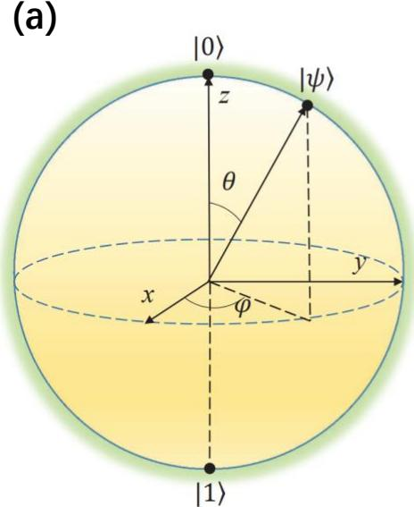

(b)  
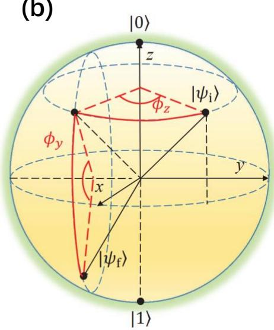  
图 1. 1 布洛赫球示意图。（a）定义量子比特的布洛赫球。其中|𝟎⟩和|𝟏⟩分别代表两种量子态在球面上的位置，球的半径为1，表示系数的归一化， $| \psi \rangle$ 表示量子比特的量子态，其在球面上任意一点都可以用极角 θ和方位角 ${ \pmb \varphi }$ 表示。（ ）在球面上展示的单量子比特操作。从初始态 $| \psi _ { i } \rangle$ 到达末态 $| \psi _ { f } \rangle$ 的过程可通过绕 z 轴转动角度 $\phi _ { \mathbf { z } }$ 以及绕 y轴转动角度 $\phi _ { \mathbf { y } }$ 实现。（图片引自文献[11]）

对于上述的单比特操作过程，如图 1. 1（b）所示，会引起量子态 |0⟩和 |1⟩二者系数的同时改变，相当于改变经典计算机的2 个比特状态，这意味着对单个量子比特的单次操作等同于对经典计算机的2 次操作。由于在量子计算机中所有量子态的系数是同时改变的，理论上对于一个拥有N个比特的量子计算机，实施一次操作即可完成经典计算机的 $2 ^ { N }$ 次操作，其运算速度随着比特数目的增加而指数上升，体现出量子计算机在提升运算速度上的巨大潜力。

## 1.2 半导体量子点中的量子比特

为了实现量子计算，除了基本的模型架构之外，还需要一个具体的用以承载量子比特的物理体系实体，量子点体系就是其中一种量子计算体系。通过限制材料尺寸、施加电势场挤压等方式，可以将半导体材料中一些本可以自由运动的载流子束缚在一个较小的区域内，这样的一个小结构就被称为一个量子点。在门控半导体量子点中，量子计算是通过一系列的逻辑门操作来完成的，这些门操作的实施对象即为量子比特。

半导体量子点中的量子比特可分为两种主要类型：自旋量子比特和电荷量子比特。在上一节已经提到，量子比特通过两个正交基矢|0⟩和 |1⟩来编码信息，因此从理论上来说，任何一个二能级系统都能用以定义量子比特。例如，在单量子点中，有利用单个电子的不同自旋态编码信息的自旋量子比特[12-14]；在双量子点中，有根据电荷在左右量子点的位置进行编码的电荷量子比特[15-17]；以及在双量子点中利用两个电子形成的 $\mathrm { S } { - } \mathrm { T } _ { 0 }$ 态编码的 S-T（单态-三重态，Singlet-Triplet）量子比特[18-19]等。

对自旋量子比特而言，通过将单个电子束缚在单量子点中，利用电子的两个自旋态 |↑⟩和 |↓⟩表示两种不同的状态，即有

$$
| 0 \rangle = | { \uparrow } \rangle , | 1 \rangle = | { \downarrow } \rangle ,\tag{1. 5}
$$

当电子处于磁场中时，塞曼效应导致两种自旋态之间产生能级劈裂，使得自旋态不再简并，从而形成一个二能级系统并以自旋方向作为不同态之间的区分。

电荷量子比特是根据双量子点中的单电子电荷所在位置不同而定义的。用$\left( N _ { \mathrm { l e f t } } , N _ { \mathrm { r i g h t } } \right)$ 表示左右两个量子点内的电子数，则量子比特的两个基矢为

$$
\left| 0 \right. = \left| L \right. = ( 1 , 0 ) , \left| 1 \right. = \left| R \right. = ( 0 , 1 ) ,\tag{1. 6}
$$

表示根据电荷在左点或右点来定义二能级系统和量子比特。

在 量子比特中，则通过双量子点内的两个电子共同形成的自旋态来对比特进行编码。两个电子自旋可以形成单态 $( S = 0$ ，自旋反对称）和三重态 $( S =$ 1，自旋对称）

$$
\left| S \right. = \frac { \left| \uparrow \downarrow \right. - \left| \downarrow \uparrow \right. } { \sqrt { 2 } } , \quad \left| T _ { 0 } \right. = \frac { \left| \uparrow \downarrow \right. + \left| \downarrow \uparrow \right. } { \sqrt { 2 } } ,\tag{1. 7}
$$

S-T 量子比特使用 |𝑆⟩ 和 $\left| { { T _ { 0 } } } \right.$ 态对信息进行编码，并且可以通过基于双量子点的泡利自旋阻塞[21]（Pauli spin blockade）读出，这种方法相对于直接测量自旋方向而言更简单可行。

这些量子比特都是在半导体量子点中进行定义的，对量子比特的初始化要求将特定栅极的电压精确的设置到某一个特定的大小，而为了实现任意量子计算操作并保证其可信度，需要对若干量子比特进行初始化和操作，手动控制电压的方式难以满足这样的需求，因此本文将在消除人工依赖的前提下，围绕实现量子点中的量子比特自动初始化的方法展开讨论。

(a)  
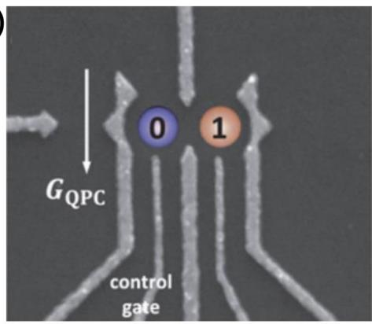

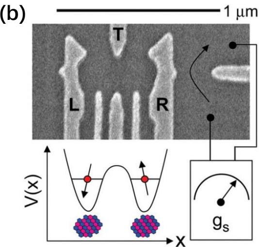  
图 1. 2 电荷量子比特和 S-T 量子比特。（a）电荷量子比特通过单电子电荷在左或右量子点中的位置来编码信息。（b）利用双电子自旋态定义的 S-T量子比特。（图片引自文献[20]）

## 1.3 量子点阵列

量子力学在求解多个存在相互作用的粒子时往往会出现极端复杂的状况，即多体系统的哈密顿量无法获得解析解，数值求解也可能由于过大的计算量而无法快速地获得答案。量子模拟则有可能克服这一困难[22-23]：通过建立特殊的量子系统来模拟目标哈密顿量，从而对复杂的量子问题进行求解。量子点系统是一个可通过外加势场进行调节的系统，凭借其高度可调性和可扩展性表现出了良好的量子模拟应用前景。

量子点阵列可以在一系列量子点中对单个电子进行束缚和操控，并且这些量子点之间的耦合、量子点与电子库之间的耦合以及量子点的电化学势都可以通过在对应栅极上施加特定的电压进行调控，在足够低的温度（ $( T \approx 1 0 { \sim } 1 0 0 \mathrm { m K } )$ 下，电子间的相互作用、自旋相互作用等将会变得足够明显，因此可以在量子点系统中进行观测。

因此，在量子点阵列中实现对电子的操控是实现量子模拟的一个重要前提条件。量子点中的电子不仅符合 Hubbard 模型的描述，即除了可用于模拟 Hubbard哈密顿量外，还可以通过对特定参数的调节实现特定形式的哈密顿量[24]。这些可调节的参数包含了充电能（ $\left( U \approx 1 \mathrm { m e V } \right)$ ，点间隧穿耦合（ $( t \approx 1 0 { \sim } 1 0 0 \mu \mathrm { e V } )$ 以及温度（ $( k T \approx 1 { \sim } 1 0 ~ \mu \mathrm { e V } )$ 等。在满足 $k T \ll t \ll U$ 的条件下，就可以在量子点阵列中完成量子比特的构建和操作，进而实现复杂体系的量子模拟。

## 1.4 半导体量子点的性质

对量子点内电子（空穴）输运过程的测量是表征量子点性质的一个重要手段。通过输运测量，可以得到量子点内的电子数量，量子点的点间耦合强度，电子的自旋状态等信息。然而，在实际测量过程中，表征量子点时需要考虑到的情况是非常复杂的，点内电子的数量、栅极电压、制备材料等参数都会对电子输运过程产生影响。这一小节将会对量子点的输运现象定性地进行解释，相关的数学模型请参见章节1.6。

## 1.4.1 能态密度

薛定谔方程给出单个粒子的能量可以表示为

$$
E ( k ) = { \frac { \hbar ^ { 2 } k ^ { 2 } } { 2 m ^ { * } } } ,\tag{1. 8}
$$

其中ℏ为普朗克常数，𝑘 为波函数的波矢， $m ^ { * }$ 为有效质量。三维 𝑘空间中的状态数为[25]

$$
N = 2 \times \frac { 1 } { 8 } \times \left( \frac { L } { \pi } \right) ^ { 3 } \times \frac { 4 \pi k ^ { 3 } } { 3 } ,\tag{1. 9}
$$

进而得到三维态密度为

$$
g ( E ) = { \frac { \mathrm { d } N } { \mathrm { d } E } } = { \frac { \mathrm { d } N } { \mathrm { d } k } } { \frac { \mathrm { d } k } { \mathrm { d } E } } = { \frac { { \sqrt { 2 } } } { \pi ^ { 2 } \hbar ^ { 3 } } } m ^ { * { \frac { 3 } { 2 } } } { \sqrt { E } } .\tag{1.10}
$$

同样地，二维、一维和零维的态密度分别为

$$
\begin{array} { l } { { \displaystyle g _ { 2 D } ( E ) = \frac { m ^ { * } } { \pi \hbar ^ { 2 } } \mathrm { f o r ~ 2 D } , } } \\ { { \displaystyle g _ { 1 D } ( E ) = \frac { 1 } { \pi \hbar } \sqrt { \frac { m ^ { * } } { 2 E } } \mathrm { f o r ~ 1 D } , } } \\ { { \displaystyle g _ { 0 D } ( E ) = 2 \sum _ { i } \delta ( E - E _ { i } ) \mathrm { f o r ~ 0 D } . } } \end{array}\tag{1.11}
$$

准零维情况下的 $E _ { i }$ 即为量子点内电子的各个激发态能级[25]。量子点态密度的表达式说明电子仅占据特定的能级 $E _ { i }$ ，而量子点的输运过程与这些能级的分布密切相关。

图 1. 3 展示了不同维度下能态密度的变化。随着维度的降低，电子的运动会受到限制。在量子点中，即准零维条件下，量子态之间相互分离，其能态密度为一系列的Delta函数。利用量子点中的电子能级分立的特性，可以实现对单个电子的操控和测量。

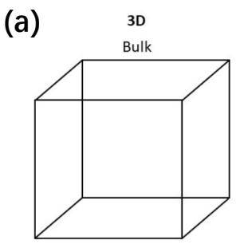

(b)  
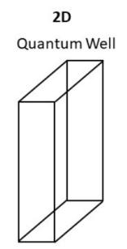

(c)  
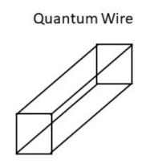

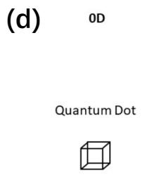

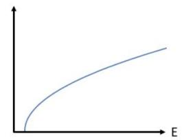

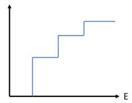

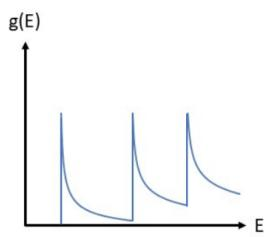

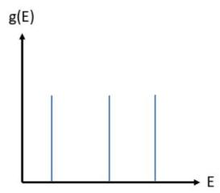  
图 1. 3 不同维度下能态密度的分布。（a）三维空间中态密度是 $\sqrt { E }$ 的函数。（b）在二维量子阱中，态密度是一个常数，而当达到激发态能级时会产生突变。（c）在量子线中，激发态能级位置态密度会出现奇点。（d）在量子点中，态密度是离散分布的。

## 1.4.2 单量子点的输运过程

为了更好地描述和处理量子点中的电子输运现象，通常将量子点的两个相邻能级间隔定义为增加能，将量子点中加入第 N 个电子所需要的能量定义为第 N个电子的电化学势。为了能够将量子点孤立于源漏极，需要保证量子点的增加能远大于电子的热涨落，也就是要求源极和漏极中的电子不会因为热激发而隧穿到量子点之中[26]。因此，为了能够了解量子点中电子所处的状态，一般会在极低温下对量子点器件的电流与电压关系进行测量。在本课题组使用的实验系统中，温度一般控制在20 mK 左右。

对于单量子点，通过改变对应的栅极电压 $V _ { \mathbf { g } } ,$ 可以控制量子点中电化学势的升高和降低，在低温下进行输运测量可以观察到库仑阻塞现象[27]。不断增大 $V _ { \mathrm { g } }$ 的过程中，可以观察到如图 1. 4（b）所示的电流信号。这种在特定栅压下电流降为0 的现象被称为库仑阻塞，此时量子点内的低能级已被电子填充，但高能级因高于源漏费米面无法被新的电子占据，因而无法产生电流。另外，如果量子点能级恰好落在源漏费米面中间，此时可以形成如图 1. 4（a）所示的通路，此时的电

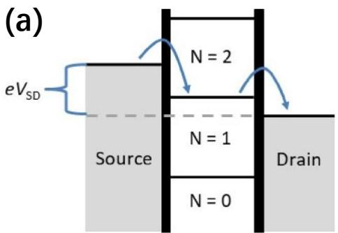

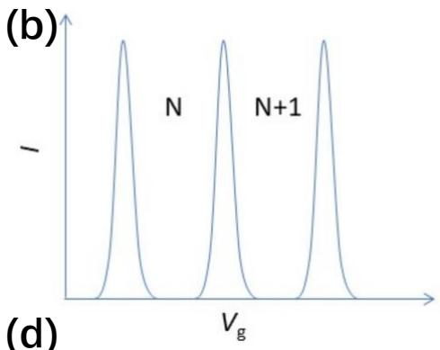

(c)  
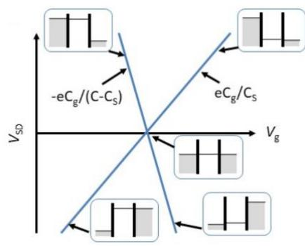

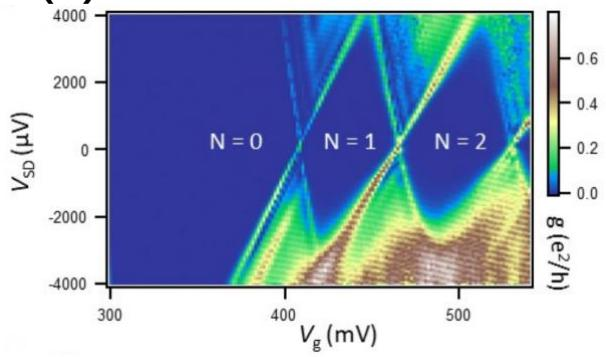  
图 1. 4 单量子点输运示意图。（a）通过对源漏施加偏压 $V _ { \mathsf { S D } }$ 产生势能差，电子在电场的作用下产生输运的过程。（b）当栅极电压 $\pmb { V _ { \textrm { g } } }$ 发生改变引起量子点中电化学势变化时，会观察到库仑振荡现象。（c）库仑菱形示意图。正斜率直线表示量子点能级与漏极费米面持平，负斜率直线表示量子点能级与源极费米面持平。（d）实验中观测到的库仑菱形。（图片引自文献[14]）

流信号峰被称为库仑峰。

库仑阻塞现象是由量子点特殊的能级分布引起的。费米—狄拉克分布指出，在极低温时几乎所有的电子都处于费米面以下，在不存在外界激发时，电子由低能级向高能级的跃迁过程难以发生，因此只有当源极—量子点—漏极的化学势呈阶梯状分布时电子才可以产生输运，即只有当量子点内一个能级落入源漏偏压窗口之间时才会产生电流。这里的源漏偏压窗口被定义为源漏之间电化学势（费米能级）的差值。当偏压刚好为0时，只有三者的电化学势持平才会产生电流，即出现库仑峰。随着源漏偏压的增大，库仑峰会不断加宽，实验中会观测到如图 1.4（d）所示的库仑菱形。当源漏的势能差大于等于增加能的时候，将不再存在库仑阻塞现象。从库仑菱形图中，通过计算其两条边的斜率，还可以得到量子点与栅极、量子点与源漏之间耦合强度的比值[28]。实验中也可以通过这种办法对量子点的耦合强度进行表征。

## 1.4.3 双量子点的输运过程

图 1. 5（a）展示了一个双量子点的输运过程示意图，即电子从源极移动到漏极的过程中需要经过两个量子点。这两个量子点拥有各自独立的能级分布，并且根据点间的势垒高低不同而存在不同程度的耦合。由于双量子点在源漏偏压为时测得的电荷稳定图（后文中也称之为相图）具有蜂巢的形状，因此又被称为蜂窝图；而在一定的偏压之下则会观察到偏压三角形。

本节首先从零偏压的情况进行说明。与单量子点不同，在双量子点输运测量中，对输运信号产生影响的因素除了能级分布以外，量子点之间的隧穿耦合强度大小也会改变电子的隧穿速率，从而对测量信号产生影响。耦合强度越大，则电子在两个量子点之间移动时受到的阻碍越小，反之则越难在两点之间移动。同时，产生电流所要求的化学势分布与单量子点类似，在零偏压情况下只有当源漏与两个量子点的电化学势持平的时候电子才能够自由进出量子点，否则电子会被限制在量子点内无法跳出。图 1. 5（a）展示了双量子点的输运过程示意图，（b）～（d）展示了在不同点间耦合强度下的电荷稳定图，图中的（𝑚,𝑛）表示左右两个点中的电子数量。当耦合强度为 0 时，可以认为两个量子点是完全独立互不影响的，在两点的电化学势不相等的情况下，电子无法在两个量子点中转移，即来自漏极的电子只能进入右边的量子点，而来自源极的电子只能进入左边的量子点，电荷态（1,0）和（0,1）仅通过一个点相连；当耦合强度增加到一定程度时，电子可以克服一定的阻碍在两个量子点之间进行转移，可以看到此时 $^ { ( 1 , 0 ) }$ 和 $^ { ( 0 , 1 ) }$ 两个电荷态的交界处由一个点变为了一条线段，线段的两个端点因为连接了三种电荷态，因此又被称为三相点；在耦合强度非常大的情况下，可以认为两个量子点已经无法进行区分，变为了一个单量子点，左右点的栅极是完全等价的，此时就退回到了上述的单量子点情况。

当源漏偏压不为 时，两个三相点会扩大变为两个偏压三角形。与单量子点的输运规则相同，电子不能从低能级跃迁到高能级，但可以轻易地从高能级进入低能级。在三角形内部和边上，电化学势均按照递增或递减分布，因此实验中在三角形所在区域可以测量到相应的电信号，而其他区域的隧穿电流则被抑制。

(a)  
(b)  
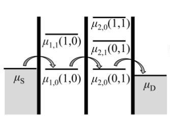

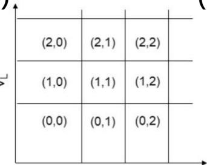

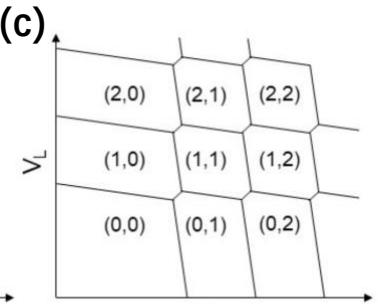

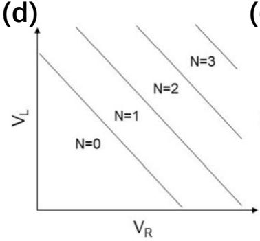

(e)  
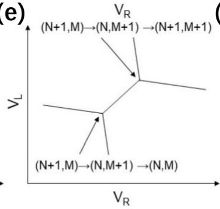

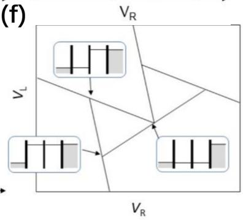  
图 1. 5 双量子点在不同情况下的输运示意图。（a）双量子点输运过程的示意图。（b）～（d）分别表示零偏压情况下双量子点之间无耦合、耦合适中和耦合过大时的电荷稳定图。（e）为图（c）的局部放大。在 2个三相点之间，电子处于混合态，无法被定义处于左点或右点。（f）在（e）的基础上将偏压加大，两个三相点扩大变为两个偏压三角形，三角形边长正比于偏压大小。在此偏压三角形内电子可以产生输运电流。（图片引自文献[14]）

## 1.4.4 多量子点的输运图像

在量子点阵列中，每一个量子点的能级分布都会对阵列中的电子输运产生影响。与调节单量子点和双量子点的能级方式相同，阵列中每个量子点的能级也可以通过改变对应的栅极电压进行控制。为了获取这样一个多点系统在不同栅压下对应的电荷信息，同样需要测量电荷稳定图来寻找和分辨电荷态。多点系统的完整电荷稳定图必定包含了所有栅压对电荷状态的影响，即该电荷稳定图是一个具有多个参数的函数。

图 1. 6 展示了几种多量子点器件结构和它们对应的三维电荷稳定图[29]。在双量子点中，电荷稳定图只包含两个参数，即两个量子点的栅压 $V _ { \mathbf { g } 1 }$ 和 $V _ { \mathbf { g } 2 }$ ，不同电荷态之间通过线段进行分隔；在三量子点中，电荷稳定图包含了三个量子点的栅压，其电荷态则需要通过曲面进行分隔；对于包含更多量子点的系统而言，其电荷稳定图所处的空间维度更高，对其电荷态的区分也会更加困难。此外，如果采用二维电荷稳定图进行分析，则必须对所有栅极两两之间分别进行测量；如果采用高维电荷稳定图进行分析，则必须计算出不同电荷态分界面的位置和形状。无论是哪种方法，都需要消耗大量的时间和计算资源，极大地降低调控过程的效率。

为了更进一步进行说明，在不考虑自旋的前提下，多点系统的哈密顿量可以表示为[30]

$$
H = - \sum _ { i } \mu _ { i } n _ { i } - \sum _ { i j } t _ { i j } \big ( c _ { i } ^ { \dagger } c _ { j } + \mathrm { h . c . } \big ) + \sum _ { i } \frac { U _ { i } } { 2 } n _ { i } ( n _ { i } - 1 ) + \sum _ { i j } U _ { i j } n _ { i } n _ { j } ,\tag{1.12}
$$

其中 $c$ 和 $c ^ { \dagger }$ 分别为电子的湮灭和产生算符， $n _ { i } = c ^ { \dagger } c$ 为粒子数算符， $\mu _ { i }$ 和 $t _ { i j }$ 分别对应化学势和隧穿耦合强度， $U _ { i }$ 和 $U _ { i j }$ 分别表示量子点内和量子点间的库仑相互作用。等式右边的四项分别为点内电子总能量、电子跃迁项、点内以及点间电子的静电能。在上式所描述的量子点系统中，对其能级的调控通常是通过改变栅压来实现的，即哈密顿量是栅压的函数 $H = H ( V _ { i } )$ ，这是因为在栅压 $V _ { i }$ 改变时，会导致 $\mu _ { i }$ 和 $t _ { i j }$ 也发生偏移，即哈密顿量的前两项应为栅压 $V _ { i }$ 的函数$\begin{array} { r } { - \sum _ { i } \mu _ { i } ( V _ { i } ) n _ { i } - \sum _ { i j } t _ { i j } ( V _ { i } ) \big ( c _ { i } ^ { \dagger } c _ { j } + \mathrm { h . c . } \big ) } \end{array}$ 。本文的调控过程正是基于这个原理，即通过改变确定的栅压来对特定量子点的电子数和隧穿耦合强度进行调节。

(a)  
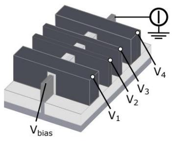

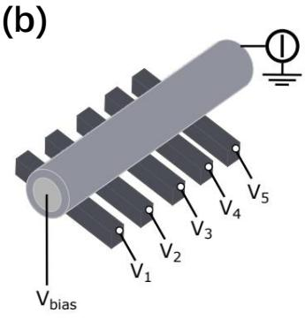

(c)  
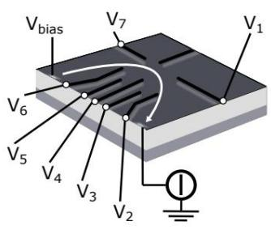

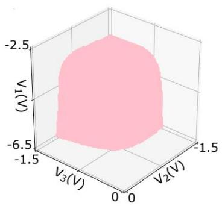

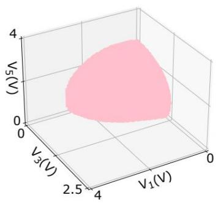

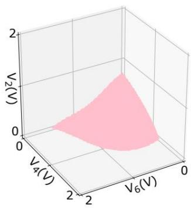  
图 1. 6 多量子点系统的输运图像。（a）硅基 FinFET量子点器件结构示意图以及三维电荷稳定图。（b）硅锗纳米线器件结构以及对应的电荷稳定图。（c）硅锗异质结器件结构以及对应的电荷稳定图。（图片引自文献[29]）

由于每一个量子点都会对应一套单独的参数，因此会导致多量子点系统的直接表征和分析难以实施。但是，如果在保证所有量子点的稳定性的前提下，将作为整体的多点系统进行切割并单独调控，即消除多参数之间的耦合，就可以重复单量子点和双量子点的分析和调控过程，最终以少量的时间和计算资源实现多点系统的调控。在后面的章节中，将以此想法作为切入点，引入自动调控方案中核心技术之一的虚拟电极和量子点遍历方法，用于消除栅极串扰并快速有效地将多个量子点调整到目标状态。

## 1.5 常用测量方法

由于所有的实验测量的物理现象都是基于量子力学原理的，为了避免电子因为热激发而产生能级跃迁，在上一节就解释了相关的实验都必须在极低温下进行。这是因为半导体量子点的能级基本都处于 meV 量级，其对应的电子热涨落温度仅有几百mK。要求极低温环境就是为了避免热噪声对样品测量产生影响。

低温下量子点中的电荷状态可以通过多种方法进行探测，其中最常用的包括直接对流过量子点的电流进行记录的输运测量[31]，以及利用量子点接触[32-33]（Quantum Point Contact, QPC）或者射频[34-36]（Radio Frequency, RF）进行的电荷感应测量。在这一节中将分别对这两类测量方法以及其原理进行介绍。

## 1.5.1 输运测量

输运测量又分为直流输运测量和交流输运测量，是一种通过将直流电压或交流电压直接施加到量子点的源漏极并测量其电学信号的方法。图 1. 7 展示了两种输运测量的线路示意图。

直流输运是基于电流-电压放大器的输运测量，且放大器与漏极相连接，并通过接入电压表进行信号测量，或者是接入采集卡或示波器进行实时观测。库仑峰与库仑菱形也是使用这种方法测量得到的。在恒定偏压的情况下，量子点所处电场是恒定的，整个系统达到稳态时的输运行为可以使用第一章给出的速率方程进行描述。

交流输运是基于锁相放大器的输运测量，获得的是通过器件的交流电信号，其偏置方式与直流输运测量相同。源漏的偏置除了一个固定大小的电压以外，还有锁相放大器提供的频率在70 Hz～1000 Hz之间的交流激励，二者通过叠加器共同作用到源极上面。锁相放大器可以从混杂的信号中分离出特定载波频率的信号，其本质为一个乘法器，通过将与参考信号同频同相的分量转化为直流，再经过低通滤波器得出该信号的大小。假设实际信号𝑆(𝑡) 和参考信号 $S _ { \mathrm { r } } ( t )$ 分别为

$$
\begin{array} { r } { S ( t ) = e \cos ( \omega _ { 0 } t + \theta _ { 0 } ) , } \\ { S _ { \mathrm { r } } ( t ) = e _ { \mathrm { r } } \cos ( \omega _ { \mathrm { r } } t + \theta _ { \mathrm { r } } ) , } \end{array}\tag{1.13}
$$

锁相放大器会将二者信号进行相乘得到

$$
\begin{array} { l } { E = S ( t ) \times S _ { r } ( t ) } \\ { = \displaystyle \frac { 1 } { 2 } e e _ { r } \{ \cos [ ( \omega _ { r } - \omega _ { 0 } ) t + \theta _ { t } - \theta _ { 0 } ] + \cos [ ( \omega _ { r } + \omega _ { 0 } ) t + \theta _ { t } + \theta _ { 0 } ] \} , } \end{array}\tag{1.14}
$$

上述信号经过低通滤波后，最终输出的信号为

$$
E = \frac { 1 } { 2 } e e _ { \mathrm { r } } \cos [ ( \omega _ { r } - \omega _ { 0 } ) t + \theta _ { r } - \theta _ { 0 } ] ,\tag{1.15}
$$

由于施加在源极的交流激励频率与参考信号相同，其电信号频率也与参考频率相同，因此当量子点内产生电子输运现象时，就可以通过锁相放大器在漏极观察到对应的输运信号。

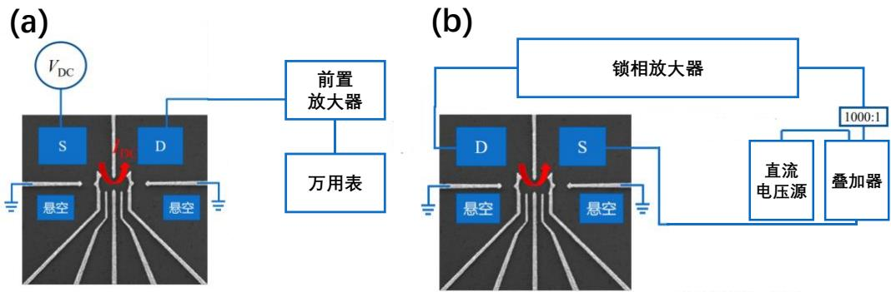  
图 1. 7 输运测量示意图。（a）直流输运测量线路。（b）交流输运测量线路。

## 1.5.2 电荷感应测量

量子点接触测量是一种利用量子点间的相互耦合作用来进行的测量，并且在测量过程中只会对量子态产生很小的干扰。对于两个或以上相互之间存在电容耦合的量子点，其中某一个或几个量子点内电子数目产生变化时，在电容耦合的作用下，会引起量子点接触的电导产生突变，从而观察到电信号的突变。利用此特点，将一个特定的量子点作为电荷感应器，测量通过其通道的电信号变化，即可得知待测量子点的电荷状态改变。一般来说，量子点间距越远，耦合强度越弱，测量到的电信号突变也就越弱。如图1. 8所示，量子点接触测量同样包括直流和交流两种测量方式。

量子点接触测量分为两类：直流测量和调制测量。由于测量的电信号实际上来自作为电荷传感器的量子点，因此其本质是根据传感器量子点的电导变化间接给出待测量子点的电荷态变化。例如，当被测量子点中出现电子数目变化时会引起传感量子点电导突变，使得电子输运增强或减弱，导致测量电流出现台阶状变化。而调制测量本质上则是在直流电信号的基础上再一次对栅极电压进行微分得到的结果，也就是说，在直流电信号的台阶位置可以观察到交流电信号出现峰或谷值。

输运测量和量子点接触测量这两种传统的测量方法在实际中容易受到 $1 / f$ 噪声的影响，甚至可能因为背景噪声过大而掩盖量子点的输运信号。一般在输运与量子点接触测量中，根据公式[35]

$$
f _ { \mathrm { R C } } = \frac { 1 } { 2 \pi R _ { \mathrm { Q P C } } C } ,\tag{1.16}
$$

可以计算出其带宽仅有数 $+ \operatorname { k H z } ^ { [ 3 6 ] }$ ，不容易获得更高的带宽。因此，研究者开始尝试使用射频反射这一不同于传统的测量方式，制作出了射频单电子晶体管，实现了对带宽（>100 MHz）的提升[37]，并通过将此工艺移植到量子点接触上而形成了射频量子点接触（Radio Frequency Quantum Point Contact, RF-QPC）测量[38-39]。以积分时间（分辨量子点中单个电子电荷变化所需的时间）作为对比，射频测量仅需约 $0 . 5 ~ \mu s ^ { [ 4 0 ] }$ ，而量子点接触测量需要约 $9 \mu s ^ { [ 4 1 ] }$ ，由此也说明了射频测量相对于传统测量的优势。图 1. 9 给出了RF 测量的示意图。

在射频反射测量中，信号的反射系数 𝛤 被定义为反射波和入射波振幅的比值，取决于量子点接触的等效电阻 $R _ { \mathrm { Q P C } }$ 以及线路的特征阻抗 $Z _ { 0 }$ ：

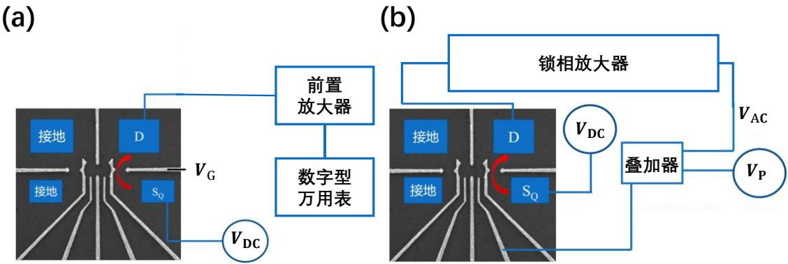  
图 1. 8 QPC 测量示意图。（a）QPC 直流测量的线路示意图。（b）QPC 交流测量的线路示意图。

$$
r = \left| \frac { z _ { l } - 1 } { z _ { l } + 1 } \right| = \left| \frac { \overline { { C _ { \mathrm { p } } R _ { \mathrm { Q P C } } } } - Z _ { 0 } } { \overline { { C _ { \mathrm { p } } R _ { \mathrm { Q P C } } } } + Z _ { 0 } } \right| .\tag{1.17}
$$

其中 $z _ { l } = Z _ { l } / Z _ { 0 }$ 为归一化阻抗， $Z _ { l } = L / C _ { \mathrm { p } } R _ { \mathrm { Q P C } }$ 为负载阻抗。当等效电阻 $R _ { \mathrm { Q P C } }$ 随着电子占据情况的不同而发生改变时，可以测量到反射系数 𝛤 产生的变化，通过计算其改变量Δ𝛤就可以得到量子点的信息。

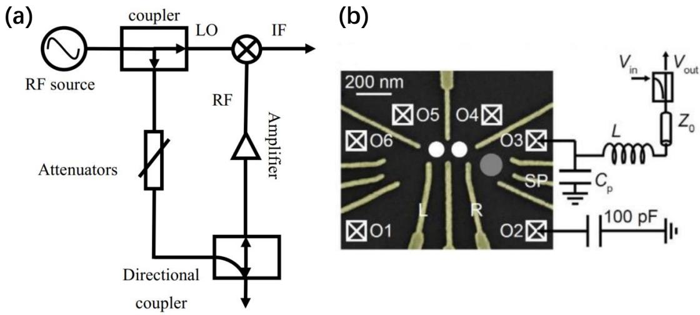  
图 1. 9 射频测量示意图。（a）射频反射测量的外部线路示意图。（b）射频反射测量的电路示意图。（图片引自文献[35]）

## 1.6 数据处理与分析

在样品的测量前后，需要不断向测量仪器输入新参数以及收集仪器返回的结果，测量结束以后还需要对实验中记录的数据进行整理总结，用以提取出样品的性能参数。因此数据的收集和处理在实验中也占据了非常重要的部分，将实验结果清晰明了地展示出来对于后续的样品和程序优化都能提供良好的参考效果。

## 1.6.1 测量程序

在实验中，需要通过电脑对相关仪器，例如任意波形发生器、采集卡、电压源等进行操控，因此编写相关的仪器控制程序也是样品制备与测量之外的重要一环。一个拥有良好运行逻辑的驱动和控制程序可以最大程度地防止由于实验中的错误操作而引起的样品和仪器损坏，能够为大部分实验环境提供安全保障。本课题组主要使用MATLAB 和 PYTHON 进行仪器测控代码的编写。

本课题组使用的测量程序主要由3个部分组成：（1）最基础的仪器类，能够为所有仪器提供标准的运行接口，同时允许对仪器进行某些特殊功能的拓展；（ ）满足最基本测量要求的测量类，提供了测量流程的函数实现，通过对其进行拓展也可以满足不同实验中所需的额外要求；（3）负责在测量中配置参数并与仪器进行实时交互的通讯类，用以保证仪器收到的指令和测量流程的同步性。

本组针对不同的实验需求编写了多个不同的配置有界面的测量程序，可以分别实现参数控制、相图扫描、相图生成以及数据模拟等功能。这些程序间的数据互通，可以很方便的实现移植与升级。

## 1.6.2 仿真与拟合

当测量完成以后，需要对实验测得的各项数据进行处理，并通过数值分析验证等方式进行拟合和提取参数。本课题组主要使用MATLAB 和 Origin 两个软件进行数据处理。MATLAB 强大的科学计算库能够对数据进行多方面的函数拟合以及可视化，Origin 操作简单，并且能够直接利用模板生成标准化的数据图像，在实验中能够及时为研究者提供数据反馈。

在理论分析方面，一般会凭借现有的或是根据实验需求专门编写的程序包来对理论模型进行数值计算和可视化，用以验证理论的正确性以及和实验的符合度。一般使用 MATLAB 进行数值模拟，使用 Mathematica 进行公式的推导和建立物理模型。对于一些专业性较强、复杂度较高的模拟，例如量子比特的含时演化以及求解电子能级分布时，可以选择基于Python 发布的Qutip 程序包进行仿真[42]；对于微磁体的磁场分布，可以使用Mathematica 的 Radia包进行数值仿真[43]以及利用 COMSOL 进行建模仿真，COMSOL 也可以通过建模的方式较好地仿真样品的电场分布以及特定位置的电荷密度[44]。

## 1.7 常用输运模型

本文的研究是基于对量子点输运过程的测量来进行的，因此需要对量子点内的电子输运过程建立起清晰的图像，而一套符合实际的数学模型会为分析过程提供非常大的帮助，也能让研究者更好地对实验结果进行验证。由于制备材料的性质，电子数目，电子自旋，点间耦合强度等多种物理因素都会对输运过程产生影响，对量子点体系进行精确描述的数学模型势必会带来巨大的参数量和极高的运算难度，而这对于模拟和仿真并不友好。因此，针对不同的研究目的，科学家们提出了各种简化后的数学模型，用以快速便捷地对目标物理量进行估算和验证。本小节一共介绍了三种数学模型，常相互作用模型能够很好地为量子点电荷态调控提供指导，是本文的主要参考模型；速率方程能够形象地解释1.3.小节中展示的能级分布对输运电流的影响；Hubbard 模型则能够很好的用于计算量子比特系统的能量。

## 1.7.1 常相互作用模型

常相互作用模型[45]（Constant-interaction Model）是在不考虑电子自旋的情况下对量子点体系进行的数学描述，是一个高度简化的模型。其包含两个基本假设：（1）在无相互作用时计算的单个电子的分立能级不受电子间相互作用的影响；

（2）量子点中电子间的相互作用、量子点中电子与周围环境电子的相互作用都可以用一个恒定的电容来描述。

一个包含有𝑁个电子的量子点系统，在上述假设下，其总能量可以表示为[45]

$$
U ( N ) = { \frac { Q ^ { 2 } } { 2 C } } + \sum _ { n = 1 } ^ { N } E _ { n } ,\tag{1.18}
$$

其中𝐶为总电容，𝑄 为总电荷量， $E _ { n }$ 为第 n个电子的轨道能量。图 1. 10 给出了常相互作用模型所使用的量子点等效电路图，以其中的单量子点电路为例，其总电容表示为

$$
C = C _ { \mathrm { S } } + C _ { \mathrm { D } } + C _ { \mathrm { g } } ,\tag{1.19}
$$

等式右边分别表示量子点与源极、漏极以及对应栅极之间的等效电容。在漏极接地，即 $V _ { \mathrm { D } } = 0$ 的情况下，点内的总电荷量为

$$
\begin{array} { l } { { Q = Q _ { \mathrm { 0 } } - \vert e \vert N } } \\ { { \phantom { = } C _ { \mathrm { S } } V _ { \mathrm { S D } } + C _ { \mathrm { g } } V _ { \mathrm { g } } - \vert e \vert N , } } \end{array}\tag{1.20}
$$

其中𝑁为当前电压下量子点内的电子数， $V _ { \mathrm { S D } }$ 表示源漏偏压， $Q _ { 0 } = C _ { \mathrm { S } } V _ { \mathrm { S D } } + C _ { \mathrm { g } } V _ { \mathrm { g } }$ 是电容耦合带来的等效电荷量。将上式代入公式1.18，可以计算出单量子点内填充𝑁个电子后系统的基态能量为

$$
U ( N ) = \sum _ { n = 1 } ^ { N } E _ { n } + \frac { \left[ - | e | N + C _ { \mathrm { S } } V _ { \mathrm { S D } } + C _ { \mathrm { g } } V _ { \mathrm { g } } \right] ^ { 2 } } { 2 C } ,\tag{1.21}
$$

第N个电子进入量子点所需的能量，即电化学势为

$$
\begin{array} { l } { { \displaystyle \mu ( N ) = U ( N ) - U ( N - 1 ) } } \\ { ~ } \\ { { \displaystyle ~ = - \frac { \left| e \right| } { C } \left[ - | e | N + C _ { \mathrm { S } } V _ { \mathrm { S D } } + C _ { \mathrm { g } } V _ { \mathrm { g } } \right] - \frac { e ^ { 2 } } { 2 C } + E _ { N } } } \\ { { \displaystyle ~ = ( N - 1 / 2 ) E _ { C } - \frac { E _ { C } } { | e | } \left( C _ { \mathrm { S } } V _ { \mathrm { S D } } + C _ { \mathrm { g } } V _ { \mathrm { g } } \right) + E _ { N } , } } \end{array}\tag{1.22}
$$

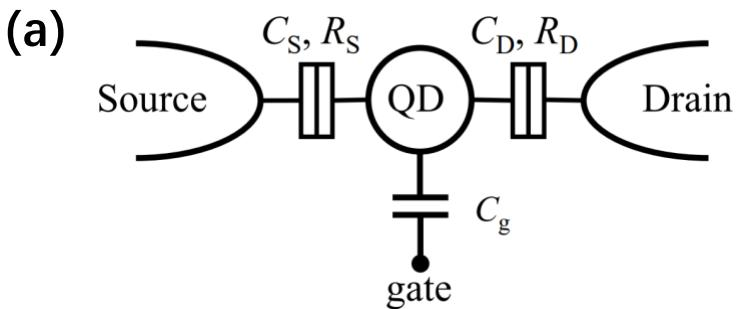

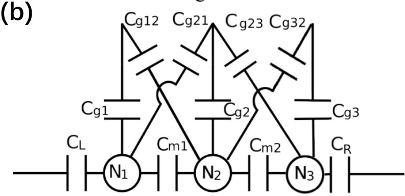  
图 1. 10 常相互作用模型下量子点的等效电路图。量子点与源漏栅极和栅极之间存在电容耦合。（a）、（b）分别为单量子点和多量子点的等效电路图。

其中 $E _ { C } = | e | ^ { 2 } / C$ 为充电能。分立能级之间的间隔大小被定义为增加能，表达式为

$$
E _ { \mathrm { a d d } } = \mu ( N + 1 ) - \mu ( N ) = E _ { C } + \Delta E = \frac { | e | ^ { 2 } } { C } + \Delta E .\tag{1.23}
$$

一般而言，充电能 $E _ { C }$ 要远大于量子点本身的能级间隔 $\Delta E$ ，所以 $E _ { \mathrm { a d d } }$ 主要受到 $E _ { C }$ 的影响。因此，在不考虑量子点本身能级间隔的情况下，增加能的大小和充电能相同，且能级间隔随着电子数增多而逐渐减小。

对多点系统而言，系统总能量与单量子点能量具有类似的形式。为了简便考虑，这里省略掉电子的轨道能 $E _ { N }$ 。首先按照 $Q = C V$ 的形式重新定义一个𝑛量子点系统的等效电压𝑽和等效电容𝑪[45]

$$
\pmb { Q } = \left( \begin{array} { c } { Q _ { 1 } + C _ { \mathbf { g } , 1 } V _ { \mathbf { g } , 1 } + \displaystyle \sum _ { m \neq 1 } C _ { g m , 1 } V _ { \mathbf { g } , m } } \\ { \qquad \quad \ldots } \\ { Q _ { n } + C _ { \mathbf { g } , n } V _ { \mathbf { g } , n } + \displaystyle \sum _ { m \neq n } C _ { g m , n } V _ { \mathbf { g } , m } } \end{array} \right) = \pmb { C V } ,\tag{1.24}
$$

$Q _ { n } = - | e | N _ { n }$ 表示第𝑛个量子点中的电子电荷量， $C _ { g m , n } V _ { \mathrm { g } , m }$ 表示第𝑛个量子点与近邻栅极𝑚因电容耦合引起的电荷量偏移，电容耦合关系如图 1. 10（b）所示。对于一个𝑛量子点系统，在仅考虑最近邻量子点的相互耦合的前提下，重新组合

后的电压和电容的矩阵形式分别为

$$
\begin{array} { r l r } & { } & { { \bf { \cal V } } = \left( \begin{array} { c } { V _ { 1 } } \\ { V _ { 2 } } \\ { \vdots } \\ { V _ { n - 1 } } \\ { V _ { n } } \end{array} \right) , } \\ & { } & { { \cal C } = \left( \begin{array} { c c c c c } { C _ { 1 } } & { - C _ { 1 2 } } & { } & { } & { 0 } \\ { - C _ { 2 1 } } & { C _ { 2 } } & { } & { } & { } \\ { } & { } & { \ddots } & { } & { } \\ { 0 } & { } & { } & { C _ { n - 1 } } & { - C _ { n - 1 , n } } \\ { } & { } & { } & { - C _ { n , n - 1 } } & { C _ { n } } \end{array} \right) , } \end{array}\tag{1.25}
$$

新的电压 $V _ { i }$ 可以理解为第𝑖个栅极上总的等效电压，同理， $C _ { i j }$ 可以理解为第𝑖个和第𝑗个量子点之间总的等效电容，当𝑖 =𝑗时表示该量子点自身的等效电容。在上式给出的表达方式下，与式 1.21 的形式相同，该 𝑛量子点系统的总能量表示为

$$
U = \frac { 1 } { 2 } V ^ { T } \pmb { C } \pmb { V } .\tag{1.26}
$$

对多点系统而言，采取这样的处理方式可以有效的减少参数的数量。除此以外，只要计算出量子点本身的电容（对角项）以及邻近两个点的耦合电容（非对角项），就可以得到量子点系统在任意电压下的能量分布，反之也可以根据量子点的目标状态计算出所需要的电压大小，这对于量子点的调控而言是非常重要的判断依据。具体的电容矩阵分析和参数计算会在后文2.2 小节中进行讨论。

## 1.7.2 速率方程

速率方程被广泛应用于求解含时演化的系统[46]，在量子力学中也被用于求解量子点中的电子输运过程[47]。速率方程中涉及到对电子隧穿速率的计算，通过求解对应的速率方程，可以很好的对1.3.2 小节中的库仑峰进行解释。

定义系统处于|𝛼⟩态的概率为 $P _ { \alpha }$ ，并且由 $| \alpha \rangle$ 态转变到 $| \beta \rangle$ 态的速率为 $\omega _ { \alpha , \beta }$ 二者之间存在如下的关系[47]

$$
\frac { d P _ { \alpha } } { d t } = \sum _ { \beta } \left( \omega _ { \beta . \alpha } P _ { \beta } - \omega _ { \alpha . \beta } P _ { \alpha } \right) ,\tag{1. 27}
$$

上式说明了概率 $P _ { \alpha }$ 的变化取决于系统向 |𝛼⟩态演化的总速率，若演化末态不为|𝛼⟩态，则需要额外取负，表明该演化过程会导致 $P _ { \alpha }$ 的值存在变小的趋势，反之

则会使得 $P _ { \alpha }$ 的值有变大的趋势。

对量子点而言，在不考虑自旋的前提下，可以用电子数𝑁来表示系统的状态|𝑁⟩。定义电子进入量子点的速率

$$
\omega _ { N - 1 , N } = { \cal T } _ { N - 1 , N } f ( \mu _ { N } ) ,\tag{1.28}
$$

表示进入一个电子使得电子占据数从𝑁 −1 到 𝑁所对应的隧穿速率。𝑁− 1为初态电子数，𝑁 为末态电子数， $T _ { N - 1 , N }$ 表示隧穿耦合强度， $f ( \mu _ { N } )$ 表示第𝑁个电化学势 $\mu _ { N }$ 对应的费米-狄拉克分布函数，表达式为

$$
f ( \mu _ { N } ) = \frac { 1 } { \mathrm { e } ^ { \frac { \mu _ { N } - \mu } { k T } } + 1 } ,\tag{1.29}
$$

其中 $\mu$ 表示费米能级，𝑘 表示玻尔兹曼常数，𝑇为温度。在式1.28中，电子的隧穿能力通过 $f ( \mu _ { N } )$ 的取值进行描述：当量子点能级低于源极费米面，即 $\mu _ { N } < \mu$ 时，电子可进入量子点，有 $\omega _ { N - 1 , N } \approx \varGamma _ { N - 1 , N }$ ，反之当 $\mu _ { N } > \mu$ 时，有 $\omega _ { N - 1 , N } \approx 0$ 电子几乎无法产生隧穿。总隧穿速率为电子跳出和跳入速率之和，即对电子在源漏与量子点之间的隧穿速率求和。电子跳入量子点形成 |𝑁⟩态的速率 $W _ { N - 1 , N }$ 为

$$
W _ { N - 1 , N } = \sum _ { l = \mathrm { L } , \mathrm { R } } W _ { N - 1 , N } ^ { l } = \sum _ { l = \mathrm { L } , \mathrm { R } } \Gamma _ { N - 1 . N } ^ { l } f ^ { l } ( \mu _ { N } ) ,\tag{1.30}
$$

以及电子从量子点跳出形成 $| N \rangle$ 态的速率 $W _ { N + 1 , N }$ 为

$$
W _ { N + 1 , N } = \sum _ { l = \mathrm { L } , \mathrm { R } } W _ { N + 1 , N } ^ { l } = \sum _ { l = \mathrm { L } , \mathrm { R } } \ : \Gamma _ { N + 1 . N } ^ { l } [ 1 - f ^ { l } ( \mu _ { N + 1 } ) ] ,\tag{1.31}
$$

$T ^ { \mathrm { L } }$ 和 $T ^ { \tt R }$ 分别表示量子点与源漏之间的隧穿耦合强度。现在可以得到量子点进入$| N \rangle$ 态 $( N \pm 1 \to N )$ ）和离开 $| N \rangle$ 态 $( N \to N \pm 1 )$ 的速率分别为

$$
\begin{array} { l } { { \displaystyle \sum _ { n = N \pm 1 } ( W _ { n , N } P _ { n } ) \mathrm { f o r } N \pm 1  N , } } \\ { { \displaystyle \sum _ { n = N + 1 } ( W _ { N , n } P _ { N } ) \mathrm { f o r } N  N \pm 1 , } } \end{array}\tag{1.32}
$$

二者之和即为速率方程在量子点系统中的表现形式，表示量子点中存在 𝑁个电子的概率随时间的变化快慢，可写为如下的等式

$$
\dot { P _ { N } } = \sum _ { n = N \pm 1 } \left( W _ { n , N } P _ { n } - W _ { N , n } P _ { N } \right) .\tag{1.33}
$$

我们关心的是系统达到稳态时电子的输运行为，此时量子点中的电荷累积速率为0，即 $\dot { P _ { N } } = 0$ 。在量子点系统中，电子可以通过源漏与量子点产生电子交换，因此需要对二者分别进行计算。如图 1. 11 所示，考虑 $W _ { n , N } = W _ { n , N } ^ { \mathrm { L } } + W _ { n , N } ^ { \mathrm { R } }$ ，表明与源漏进行电子交换均会影响量子点的电荷累积速率，通过与单电子电荷量−|𝑒|相乘，就可以得到通过源（漏）极的电流

$$
I _ { n , N } ^ { \mathrm { L ( R ) } } = - | e | W _ { n , N } ^ { \mathrm { L ( R ) } } P _ { n } ,\tag{1.34}
$$

$I _ { n , N } ^ { \mathrm { L } }$ 和 $I _ { n , N } ^ { \mathrm { R } }$ 分别表示量子点达到 $| N \rangle$ 态时通过源极和漏极的电流，并且在达到稳态时应满足 $I _ { n , N } ^ { \mathrm { L } } + I _ { n , N } ^ { \mathrm { R } } = I _ { N , n } ^ { \mathrm { L } } + I _ { N , n } ^ { \mathrm { R } }$ ，即能够保持量子点内电荷量不变。对所有可能的电子数状态对应的电流求和，可得到稳态时的总电流

$$
I ^ { \mathrm { L } ( R ) } = \sum _ { N } \sum _ { n } \left( I _ { n , N } ^ { \mathrm { L } ( R ) } - I _ { N , n } ^ { \mathrm { L } ( R ) } \right) = - | e | \sum _ { N } \sum _ { n = N \pm 1 } \left( W _ { n , N } ^ { \mathrm { L } ( R ) } P _ { n } - W _ { N , n } ^ { \mathrm { L } ( R ) } P _ { N } \right) ,\tag{1.35}
$$

上式中 $I ^ { \mathrm { L } ( R ) }$ 是通过源（漏）极的总电流，稳态时满足关系 $I ^ { \mathrm { L } } = I ^ { \mathrm { R } }$ ，此时不存在 流入量子点内的净电流，电荷累积量为0，满足 $\dot { P } _ { N } = 0$

在实际应用中，仅需计算 $I ^ { \mathrm { L } }$ 或 $I ^ { \mathsf { R } }$ 即可。在源漏零偏压下，当电化学势 $\mu _ { N } =$ $\mu$ 时，有 $f ( \mu _ { N } ) = 1 - f ( \mu _ { N } ) = 1 / 2$ ，静态电流达到最大，从而产生库仑峰；当 $\mu _ { N }$ 与费米面 $\mu$ 未对齐的情况下，有 $f ( { \mu } _ { N } ) \approx 0$ 或 $1 - f ( \mu _ { N } ) \approx 0$ ，无论哪种情况都会

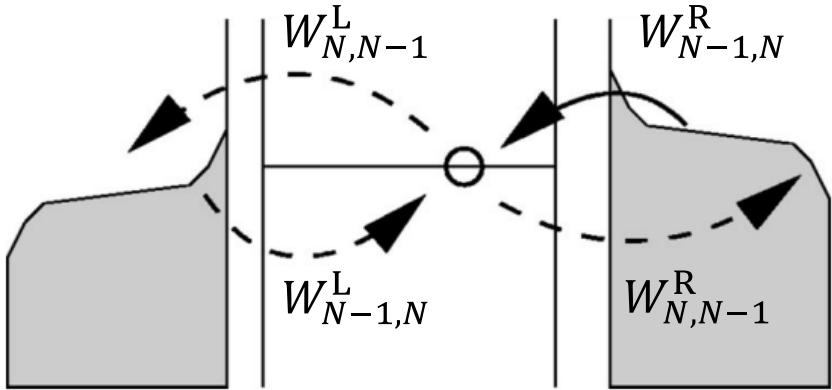  
图 1. 11 量子点与源漏进行电子交换示意图。上标𝐋(𝐑)代表源（漏）极， $W _ { N - 1 , N } ^ { l }$ 表示量子点向 |𝑵⟩态演化的速率， $W _ { N , N - 1 } ^ { l }$ 表示量子点远离 $| N \rangle$ 态的速率。（图片引自文献[47]）

导致静态电流很小，对应了实验中观察到的库仑阻塞。

## 1.7.3 Hubbard 模型

Hubbard 模型是一个研究量子比特的一般化模型，可以看作是对常相互作用模型的扩展。在Hubbard 模型中，系统由四种哈密顿量共同描述：

$$
H = H _ { \mu } + H _ { t } + H _ { U } + H _ { J } ,\tag{1.36}
$$

分别为电化学势项 $H _ { \mu }$ 、跃迁项 $H _ { t }$ 、库仑排斥项 $H _ { U }$ 和交换作用项 $H _ { J }$ 。在使用常相互作用模型推导出的结论中，只存在势能项和库仑排斥项，没有考虑自旋和电子跃迁的影响，将其对应到 Hubbard 模型中可以得到[48]

$$
H = H _ { \mu } + H _ { U } = - \sum _ { i } \mu _ { i } n _ { i } + \sum _ { i } \frac { U _ { i } } { 2 } n _ { i } ( n _ { i } - 1 ) + \sum _ { i j } U _ { i j } n _ { i } n _ { j } ,\tag{1. 37}
$$

其中 $n _ { i } = c _ { i } ^ { \dagger } c _ { i }$ 为第 𝑖个量子点的粒子数算符， $U _ { i }$ 和 $U _ { i j }$ 分别为量子点内和量子点间的库仑相互作用项。Hubbard 模型和常相互作用模型之间存在如下的映射关系：$\begin{array} { r } { U _ { i } = | e | \big ( C _ { i } + \sum _ { j } C _ { i j } \big ) / C _ { \Sigma } ^ { 2 } \ , \ U _ { i j } = | e | ^ { 2 } C _ { i j } / C _ { \Sigma } ^ { 2 } } \end{array}$ ，这里的 $C _ { \Sigma }$ 表示所有等效电容之和，$C _ { i }$ 和 $C _ { i j }$ 的定义可参照式1.25。在此基础上，如果用 $t _ { i j }$ 表示不同量子点间的隧穿耦合强度，并加入电子在不同点位之间的跃迁项 $\begin{array} { r } { { \cal H } _ { t } = - \sum _ { i j } t _ { i j } \big ( c _ { i } ^ { \dagger } c _ { j } + \mathrm { h . c . } \big ) } \end{array}$ ，即可在忽略自旋的前提下得到更精确的系统哈密顿量

$$
H = - \sum _ { i } \mu _ { i } n _ { i } - \sum _ { i j } t _ { i j } \big ( c _ { i } ^ { \dagger } c _ { j } + \mathrm { h . c . } \big ) + \sum _ { i } \frac { U _ { i } } { 2 } n _ { i } ( n _ { i } - 1 ) + \sum _ { i j } U _ { i j } n _ { i } n _ { j } .\tag{1.38}
$$

图 1. 12（a）和（b）分别展示了利用式 1.37和 1.38计算得到的电荷稳定图。图（b）的坐标 $\left( { \mu _ { 1 } , \mu _ { 2 } } \right)$ 是电压 $( V _ { \mathrm { L } } , V _ { \mathrm { R } } )$ 的一个线性组合，满足 $\mu _ { i } = | e | ( \alpha _ { i } V _ { \mathrm { L } } +$ $\beta _ { i } V _ { \mathrm { R } } ) + \gamma _ { i }$ ，系数 $\alpha _ { i } , \beta _ { i }$ 和 $\gamma _ { i }$ 取决于图中隧穿线的位置。在不考虑 $H _ { t }$ 的情况下，该结论和常相互作用模型一致；存在 $H _ { t }$ 的情况下，不同的 $t _ { i j }$ 取值会导致反交叉点出现轻微的偏移，该结论与实验现象更匹配。

总的来说，如果仅针对量子点中的电子数进行调控，抑或是对系统进行定性分析而不需要获取具体细节的情况下，常相互作用模型是一个非常简单且有效的参考模型；但如果需要更准确地对系统进行描述，例如在考虑点间耦合强度以及控制电子在不同点位之间的隧穿过程的情况下，则需要用到Hubbard 模型进行讨论。在本文的讨论中，仅将 模型作为参考，用以表明栅压能够对电化学势和隧穿耦合强度产生影响。由于具体的调控操作主要取决于对电荷稳定图的分析，因此后文将在常相互作用模型框架下进行讨论。

除了上述三种通过建立数学模型来研究量子点体系的方法，还可以使用数值方法对实验结果进行提前预测。数值方法更加适合用于仿真，但对于数据拟合和参数提取无法提供太大的帮助。实验中一般使用 Python 的 qtt（QuantumTechnology Toolbox）程序包建立对应器件的数值模型并进行模拟测量，并将结果用于评估物理模型的效率。虽然纯数值的方法对于研究者而言更像是一个黑箱，但可以为一些只要求结果而不关心过程的仿真计算提供非常接近真实的数据支持。其好处在于省去了繁杂的样品制备和测验时间，可以灵活快速地得到需要的结果。

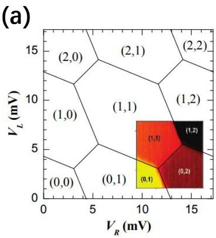

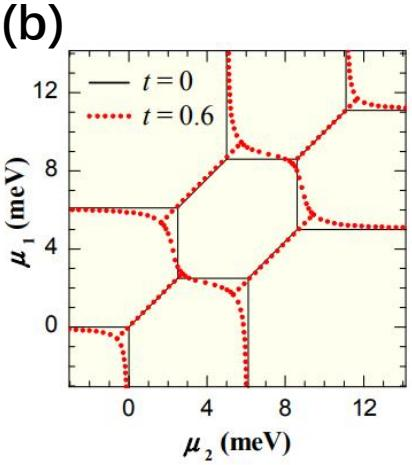  
图 1. 12 （a）不考虑跃迁项的情况下计算得到的电荷稳定图。（b）考虑跃迁项的情况下，不同隧穿耦合强度对应的电荷稳定图。（图片引自文献[48]）

## 1.8 本章小结

本章主要介绍了量子计算和量子比特的基本概念，半导体量子点的输运过程，实验测量和分析方法，以及几种常用的数学模型。本章首先引入了一些量子计算领域相关的基本概念和发展情况，介绍了半导体量子比特的构造条件和半导体量子点阵列的应用领域，解释了文章为什么要研究在量子点阵列中进行量子点的自动调控。紧接着对量子点输运过程进行了介绍，解释了输运结果中出现的各种现象，以三维电荷稳定图为例说明了多点系统的表征难度，并对实验中的三种常用的量子输运测量技术进行了展示，对测量前后所用到的数据处理和分析方法进行了解释。依赖于完善的测量流程以及配套的仪器控制程序和数据处理方法，可以为实验的高效进行提供保障。最后介绍了几种常用的数学模型和数值仿真方法，从不同视角对量子点输运现象的产生原因进行解释。本章的内容侧重于两个重点，一个是如何在量子点中构建量子比特，另一个是研究量子点阵列的原因以及量子点阵列中电子所具有的输运特征和操控方式。以上两点是本文研究的主要问题，自动调控方案则旨在提供一种对量子点阵列进行自动化调控的可行方案。

## 参考文献

[1] Feynman R P. Simulating physics with computers[M]//Feynman and computation. CRC Press, 2018: 133-153.

[2] Deutsch D, Jozsa R. Rapid solution of problems by quantum computation[J]. Proceedings of the Royal Society of London. Series A: Mathematical and Physical Sciences, 1992, 439(1907): 553-558.

[3] Shor P W. Algorithms for quantum computation: discrete logarithms and factoring[C]//Proceedings 35th annual symposium on foundations of computer Science. IEEE, 1994: 124-134.

[4] Grover L K. A fast quantum mechanical algorithm for database search[C]//Proceedings of the twenty-eighth annual ACM symposium on Theory of computing. 1996: 212-219.

[5] Mooij J E, Orlando T P, Levitov L, et al. Josephson persistent-current qubit[J]. Science, 1999, 285(5430): 1036-1039.

[6] Cirac J I, Zoller P. Quantum computations with cold trapped ions[J]. Physical Review Letters, 1995, 74(20): 4091-4094.

[7] Petta J R, Johnson A C, Taylor J M, et al. Coherent manipulation of coupled electron spins in semiconductor quantum dots[J]. Science, 2005, 309(5744): 2180-2184.

[8] Zhong H S, Wang H, Deng Y H, et al. Quantum computational advantage using photons[J]. Science, 2020, 370(6523): 1460-1463.

[9] Mong R S K, Clarke D J, Alicea J, et al. Universal topological quantum computation from a superconductor-abelian quantum hall heterostructure[J]. Physical Review X, 2014, 4(1): 011036.

[10] Nielsen M A, Chuang I L. Quantum computation and quantum information: 10th anniversary edition[M]. Cambridge: Cambridge University Press, 2011.

[11] Zhang X, Li H O, Wang K, et al. Qubits based on semiconductor quantum dots[J]. Chinese Physics B, 2018, 27(2): 020305.

[12] Zajac D M, Sigillito A J, Russ M, et al. Resonantly driven CNOT gate for electron spins[J]. Science, 2018, 359(6374): 439-442.

[13] Watson T F, Philips S G J, Kawakami E, et al. A programmable two-qubit quantum processor in silicon[J]. Nature, 2018, 555(7698): 633-637.

[14] Zajac D. Single Electron Spin Qubits in Silicon Quantum Dots[D]. Princeton: Princeton University, 2018.

[15] Cao G, Li H O, Tu T, et al. Ultrafast universal quantum control of a quantum-dot charge qubit

using Landau–Zener–Stückelberg interference[J]. Nature Communications, 2013, 4(1): 1401.

[16] Li H O, Cao G, Yu G D, et al. Conditional rotation of two strongly coupled semiconductor charge qubits[J]. Nature Communications, 2015, 6(1): 7681.

[17] Li H O, Cao G, Yu G D, et al. Controlled quantum operations of a semiconductor three-qubit system[J]. Physical Review Applied, 2018, 9(2): 024015.

[18] Barthel C, Reilly D J, Marcus C M, et al. Rapid single-shot measurement of a singlet-triplet qubit[J]. Physical Review Letters, 2009, 103(16): 160503.

[19] Shulman M D, Dial O E, Harvey S P, et al. Demonstration of entanglement of electrostatically coupled singlet-triplet qubits[J]. Science, 2012, 336(6078): 202-205.

[20] Darulová J. Automated Tuning of Gate-defined Quantum Dots[D]. Zurich: ETH Zurich, 2020.

[21] Koppens F H L, Buizert C, Tielrooij K J, et al. Driven coherent oscillations of a single electron spin in a quantum dot[J]. Nature, 2006, 442(7104): 766-771.

[22] Manousakis E. A quantum-dot array as model for copper-oxide superconductors: A dedicated quantum simulator for the many-fermion problem[J]. Journal of Low Temperature Physics, 2002, 126(5): 1501-1513.

[23] Byrnes T, Kim N Y, Kusudo K, et al. Quantum simulation of Fermi-Hubbard models in semiconductor quantum-dot arrays[J]. Physical Review B, 2008, 78(7): 075320.

[24] Barthelemy P, Vandersypen L M K. Quantum dot systems: a versatile platform for quantum simulations[J]. Annalen der Physik, 2013, 525(10-11): 808-826.

[25] Reed M A, Bate R T, Bradshaw K, et al. Spatial quantization in GaAs–AlGaAs multiple quantum dots[J]. Journal of Vacuum Science & Technology B: Microelectronics Processing and Phenomena, 1986, 4(1): 358-360.

[26] Zwanenburg F A, Dzurak A S, Morello A, et al. Silicon quantum electronics[J]. Reviews of Modern Physics, 2013, 85(3): 961-1019.

[27] Datta S. Electronic transport in mesoscopic systems[M]. Cambridge: Cambridge University Press, 1997.

[28] Hanson R, Kouwenhoven L P, Petta J R, et al. Spins in few-electron quantum dots[J]. Reviews of Modern Physics, 2007, 79(4): 1217-1265.

[29] Severin B, Lennon D T, Camenzind L C, et al. Cross-architecture Tuning of Silicon and SiGebased Quantum Devices Using Machine Learning[J]. arXiv preprint, 2021, arXiv:2107.12975.

[30] Hensgens T, Fujita T, Janssen L, et al. Quantum simulation of a Fermi–Hubbard model using a semiconductor quantum dot array[J]. Nature, 2017, 548(7665): 70-73.

[31] Elzerman J M, Hanson R, Greidanus J S, et al. Few-electron quantum dot circuit with integrated charge read out[J]. Physical Review B, 2003, 67(16): 161308.

[32] Wang L J, Cao G, Tu T, et al. A graphene quantum dot with a single electron transistor as an integrated charge sensor[J]. Applied Physics Letters, 2010, 97(26): 262113.

[33] Cassidy M C, Dzurak A S, Clark R G, et al. Single shot charge detection using a radiofrequency quantum point contact[J]. Applied Physics Letters, 2007, 91(22): 222104.

[34] Reilly D J, Marcus C M, Hanson M P, et al. Fast single-charge sensing with a rf quantum point contact[J]. Applied Physics Letters, 2007, 91(16): 162101.

[35] Noiri A, Takeda K, Yoneda J, et al. Radio-frequency-detected fast charge sensing in undoped silicon quantum dots[J]. Nano Letters, 2020, 20(2): 947-952.

[36] Vandersypen L M K, Elzerman J M, Schouten R N, et al. Real-time detection of single-electron tunneling using a quantum point contact[J]. Applied Physics Letters, 2004, 85(19): 4394-4396.

[37] Schoelkopf R J, Wahlgren P, Kozhevnikov A A, et al. The radio-frequency single-electron transistor (RF-SET): A fast and ultrasensitive electrometer[J]. Science, 1998, 280(5367): 1238- 1242.

[38] Biercuk M J, Reilly D J, Buehler T M, et al. Charge sensing in carbon-nanotube quantum dots on microsecond timescales[J]. Physical Review B, 2006, 73(20): 201402.

[39] Lu W, Ji Z, Pfeiffer L, et al. Real-time detection of electron tunnelling in a quantum dot[J]. Nature, 2003, 423(6938): 422-425.

[40] Reilly D J, Marcus C M, Hanson M P, et al. Fast single-charge sensing with a RF quantum point contact[J]. Applied Physics Letters, 2007, 91(16): 162101.

[41] Colless J I, Mahoney A C, Hornibrook J M, et al. Dispersive readout of a few-electron double quantum dot with fast rf gate sensors[J]. Physical Review Letters, 2013, 110(4): 046805.

[42] Johansson J R, Nation P D, Nori F. QuTiP: An open-source Python framework for the dynamics of open quantum systems[J]. Computer Physics Communications, 2012, 183(8): 1760-1772.

[43] Pioro-Ladriere M, Obata T, Tokura Y, et al. Electrically driven single-electron spin resonance in a slanting Zeeman field[J]. Nature Physics, 2008, 4(10): 776-779.

[44] Zajac D M, Hazard T M, Mi X, et al. A reconfigurable gate architecture for Si/SiGe quantum dots[J]. Applied Physics Letters, 2015, 106(22): 223507.

[45] Van der Wiel W G, De Franceschi S, Elzerman J M, et al. Electron transport through double quantum dots[J]. Reviews of Modern Physics, 2002, 75(1): 1-22.

[46] Bonet E, Deshmukh M M, Ralph D C. Solving rate equations for electron tunneling via discrete quantum states[J]. Physical Review B, 2002, 65(4): 045317.

[47] Harbola U, Esposito M, Mukamel S. Quantum master equation for electron transport through quantum dots and single molecules[J]. Physical Review B, 2006, 74(23): 235309.

[48] Yang S, Wang X, Sarma S D. Generic Hubbard model description of semiconductor quantum-

dot spin qubits[J]. Physical Review B, 2011, 83(16): 161301.

## 第2章 神经网络模型与电荷稳定图分析

本章的目标是建立一套能够实现自动识别和分析电荷稳定图的模型。本章内容讨论了如何利用前两章所讨论的半导体量子点输运过程以及理论模型来对实验中测量到的电荷稳定图进行分析，同时引入完成识别和分析所使用的辅助工具——机器学习与神经网络。本章内容更侧重于理论分析，主要围绕电荷稳定图中量子点电荷状态的呈现方式和神经网络的使用方法这两个方面进行展开。

## 2.1 机器学习简介

本文讨论的问题是如何将量子点阵列中的每个量子点在无人工干预的情况下自动调控到特定的状态，从而在该状态下实现可操控的量子比特。由于这种调控过程是基于对电荷稳定图的分析进行的，而神经网络恰好擅长对图像特征进行提取和识别，能够很好地将特定形貌的电荷稳定图对应到特定的量子点电荷状态，从而为后续的调控过程提供明确的方向。在本文的研究中所使用的就是机器学习中一类经典的模型——卷积神经网络。

## 2.1.1 卷积神经网络

人工神经网络（Artificial Neural Networks, ANN）通过对生物神经系统进行模仿从而实现分布式并行运算，属于一种数学算法模型。ANN 内部的神经元通过一定的权重相互关联，只要将模型内部的权重按照特定的分布进行调整，就可以实现对不同的问题以及信息进行处理的目标。卷积神经网络（ConvolutionalNeural Networks, CNN）则是在 ANN 基础上发展而来的一种包含若干卷积单元的前馈式神经网络，其利用卷积运算获得输入数据的特征，并且可以通过多层网络的迭代提取出数据中无法通过解析运算获得的更复杂的特征，在图像处理方面表现得尤为出色。

1962 年，美国哈佛大学的Hubel和 Wiesel首次提出了“感受野”的概念[1]。感受野（Receptive Field）是神经网络中神经元“看到的”输入区域，也就是说，输出特征图中的一个像素在计算过程中会受到输入数据中某个区域的影响，而这个区域就被称为该像素的感受野。1980 年，日本大阪大学的 Fukushima 提出了权重共享的卷积层[2]，被视为卷积神经网络的雏形。1989 年，当时还在AT&T 实验室工作的的 LeCun 基于反向传播算法和权值共享卷积层发明了现在的卷积神经网络[3]，并于 1998 年提出了经典网络模型 $\mathrm { L e N e t - } 5 ^ { [ 4 ] }$ ，使得 CNN 首次走入了实际的应用领域。

卷积神经网络的基本结构由输入层（input layer）、卷积层（convolutional layer）、池化层（pooling layer）、全连接层（fully connected layer）和输出层（output layer）构成，每一层的输出都是下一层的输入。卷积神经网络具有表征学习的能力，能够对输入信息进行平移不变分类[5]，因此又被称为平移不变神经网络（Shift-Invariant Artificial Networks, SIANN）。卷积层中输出特征图与其输入之间是局部连接的，并且每一层都有对应的权重以及偏置。这一系列的数据处理流程类似于卷积过程，卷积神经网络也就由此而得名。

卷积层和池化层是卷积神经网络对图像进行特征提取的重要部分，也是进行图像处理的关键。卷积的目的是提取图片中的特征，通常会使用多个可学习的卷积核对上一层的输出进行卷积操作，也就是将卷积层的输入矩阵与卷积核进行点积。池化层的目的则在于给数据降维，提升数据的尺度不变性和旋转不变性，同时还可以防止过拟合。图2. 1 给出了卷积和池化的原理示意图。

卷积操作的过程可以表示为

$$
a _ { j } ^ { l } = f \left( b _ { j } ^ { l } + \sum _ { i \in M ^ { l } } a _ { i } ^ { l - 1 } k _ { i j } ^ { l } \right) ,\tag{2.1}
$$

其中上下标l和j分别表示第l卷积层以及其第j单元的输出， $a ^ { l }$ 表示输出特征图， $a ^ { l - 1 }$ 表示输入图像， $k _ { i j } ^ { l }$ 表示卷积核中对应的元素， $b ^ { l }$ 为偏置量。卷积核作为一个滑动窗口，按照固定的步长遍历整个输入图像。输入图像大小用M表示，输出图像大小用N表示，用k表示卷积核大小，s表示卷积核步长，则输入和输出图像间存在如下关系

$$
N = { \frac { M - k } { s } } + 1 ,\tag{2. 2}
$$

N的值向上取整。如果 N的大小要求和 M一样，即卷积前后图像大小不变，则需要对原始图像外层进行全 0 填充，具体填充大小则取决于步长s和卷积核大小k。

同样地，池化操作可以表示为

$$
a _ { j } ^ { l } = f \left( b _ { j } ^ { l } + { \tt p o o l } \left( a _ { j } ^ { l - 1 } , { \cal M } ^ { l } \right) \right) ,\tag{2. 3}
$$

其中 $M ^ { l }$ 为池化框大小，pool函数表示池化后的输出结果。常用的池化方式有最值池化、平均值池化、随机池化、中值池化和组合池化等[6]，这几种方式各有优

缺点，需要根据具体需求而定。

在对图像进行卷积的过程中，不同的卷积核会对不同的特征敏感并产生不同的输出，因此卷积网络可用于进行图像识别；池化操作则会通过增大感受野的方式提升神经网络的泛用性。在电荷稳定图中，存在的特征包括电荷隧穿线的位置、宽度和形貌，以及不同隧穿线交叉而形成的反交叉点的位置和形状等。这些特征能够很好的通过卷积操作进行放大和检测，从而使得计算机可以根据电荷稳定图中的不同特征对当前电荷态进行分类。

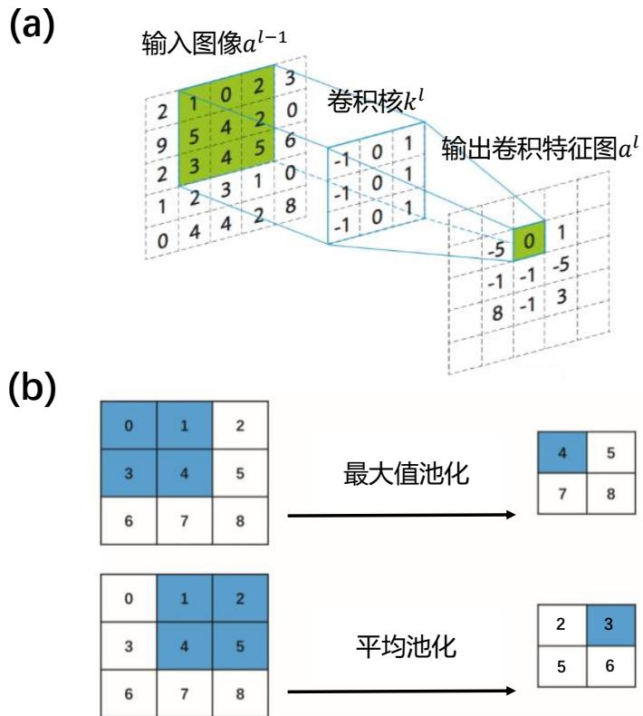  
图 2. 1 卷积和池化过程。（a）卷积操作。输入的图像经过卷积核后得到输出特征图，且长度和宽度减少量等于卷积核长宽减1。（b）池化操作。在平均池化中将选中区域求平均值并输出，在最大值池化中取选中区域的最大值并输出。

## 2.1.2 AlexNet

本文介绍的实验采用了一种特定的卷积神经网络结构——AlexNet。该模型结构在 2012 年由 Alex Krizhevsky 提出[7]，在其论文中给出了一个双 GPU 并行结构，每一个 GPU 只处理一半的神经元。由于硬件条件限制，在本文实际进行的实验中实际采取的是具有相同结构的单GPU 实现。

AlexNet包含了8层网络结构，其中包括5个卷积层和3 个全连接层，在部分卷积层后追加了池化层。AlexNet结构如图 2. 2 所示，在论文中使用了双CPU对该结构进行交叉处理。网络结构中的每一层都有专门的目的，接下来会按照图中展示的结构对网络的处理流程进行简要说明：

(1) 对输入图片进行卷积。这一步会一定程度地缩减图像的长度与宽度，同时提升图像深度。使用的卷积核（𝑘 = 11）和步长（𝑠 = 4）均较大，卷积核数量与输出特征图的深度相等，均为96。卷积输出会经过一次池化将长度和宽度减半，深度不变；

(2) 经过第一层卷积池化操作以后，对其输出按照卷积—池化—卷积—卷积—卷积—池化的顺序进行处理。在这些卷积操作中需要保持长宽不变，同时每一层会增加特征图的深度，而两个池化层则保持特征图深度不变，对长宽进行减半。在所有的卷积池化操作结束后，输入大小为 227×227×3 的图像变为了大小为 $6 \times 6 \times 2 5 6$ 的特征图。特征图是高度抽象化的矩阵，并不具备实际意义，并且将作为全连接层的输入；

(3) 将特征图展开为包含若干参数（神经元）的一维向量，在这一层中每一个神经元都与下一层所有神经元按照一定的权值进行连接，因此被称为全连接层。AlexNet中包含3个全连接层，前两层的神经元个数为4096，最终输出为1000 个参数的数组。

全连接层最后输出的元素并不是归一化的，因此无法直接使用，而应当经过Softmax 函数处理后将输出范围映射到 [0,1] 之间，且满足所有输出之和为 1，其对数据的处理方式如下：

$$
S _ { i } = \frac { \mathrm { e } ^ { v _ { i } } } { \sum _ { j } \mathrm { e } ^ { v _ { j } } } ,\tag{2. 4}
$$

其中 $v _ { i }$ 表示数组中第 i 个元素的值， $S _ { i }$ 表示对应元素经过 Softmax 函数后的值。Softmax 能够很好的适用于多分类问题，这是因为它并非通过寻找最值而获得一

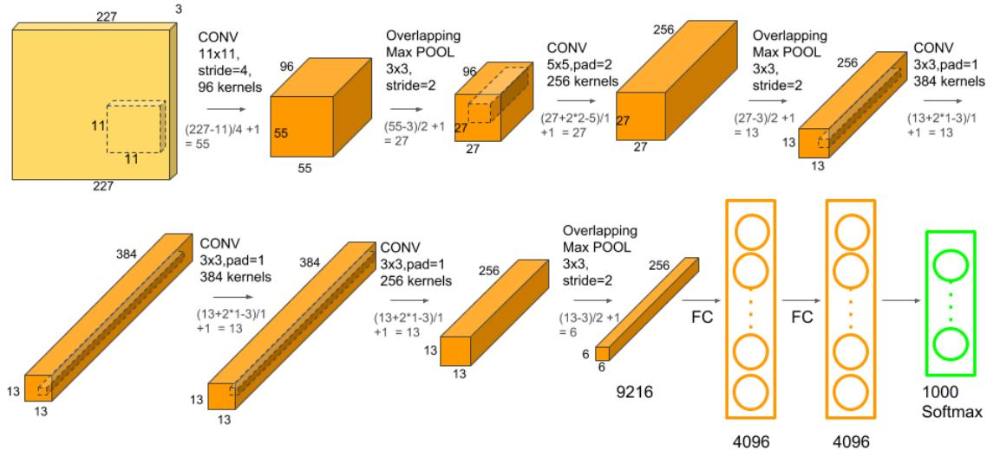  
图 2. 2 AlexNet 网络结构示意图。网络中包含5个卷积层，3个池化层以及 3个全连接层。（图片来自网络）

个确定的变量，而是给予数值大的一项更高被取到的概率，同时保证数值小的一项也有一定的概率被取到，即输出取到每个分类的概率[8]。通过比较概率大小，就可以得知当前图像更有可能属于哪一个分类，这就是AlexNet的工作原理。

## 2.1.3 神经网络的生成与优化

在建立好神经网络结构之后，还需要对网络中的参数进行优化。图2. 3给出了神经网络常用的训练流程以及在实验中使用的单 GPU 结构的神经网络。本文中使用的是有监督学习的网络[9]，即需要将预测结果与训练数据（输入数据）两者进行比较并不断迭代优化模型，直到模型的预测结果能够达到预期的准确率。

为了建立神经网络，在特定结构的基础上还需要对每一层定义权重 $w _ { i }$ 和偏置量 $b _ { i }$ ，从而使得每一层的输入数据 $x _ { i }$ 都可以获得如下的响应

$$
y _ { i } = f ( w _ { i } x _ { i } + b _ { i } ) ,\tag{2. 5}
$$

其中 $f$ 表示激活函数，在某些特定层需要使用到。通常激活函数都是非线性的，以便神经网络对各种曲线进行拟合[10-11]。

在神经网络的生成（即权重和偏置量参数的初始化）过程中，权重的初始分布对模型的收敛速度与性能有着重要的影响[12]。随机初始化和全 0 初始化虽然简单，但往往效果不尽如人意[13]。现在通常使用的是 Kaimin 和 He 初始化方法[14]，保证了参数在传播和更新过程中能够保持分布不变，提升训练效果。

在有监督学习模型中，为了对模型参数进行更新，需要对输入的每一份数据打上对应的标签，然后与模型的预测结果相对比，将两者之间的差异定义为损失函数。参数的更新方向取决于损失函数的值下降最快的方向，通常会使用梯度下降算法[15]进行参数优化。

为了对差距进行量化，本文选择使用交叉熵作为损失函数来进行计算[16]。在神经网络的有监督学习中，输入数据会预先人为地给定一个分类标签，该标签决定了对应数据的真实概率分布，交叉熵则很好地描述了神经网络和分类标签二者分别提供的两种概率分布之间的差异。交叉熵作为损失函数的表达式为

$$
\mathsf { l o s s } = - \sum _ { i } P _ { \mathrm { t a r g e t } } ( i ) \cdot \ln \big [ P _ { \mathrm { p r e d } } ( i ) \big ] ,\tag{2. 6}
$$

其中 $P _ { \mathrm { { t a r g e t } } }$ 为数据的真实概率分布， $P _ { \mathrm { p r e d } }$ 表示神经网络给出的预测概率分布。对神经网络进行训练和优化的目的在于寻找使该损失函数最小化的权重和偏置量，以使得模型对输入数据的预测能够更加符合真实结果。

(b)

以图 2. 3（b）为例，该图展示了神经网络对一个包含反交叉点的相图的处理过程。输入的相图在经过多次卷积和池化操作以后，被转化为一个高度特征化的一维数组，该数组中的每一个元素都会按照一定的权重在全连接层中进行传播，最后神经网络会按照训练的格式输出一个对应的概率数组，表示该相图处于某一电荷态的概率。输出概率与实际概率的交叉熵，即为式2.6所示的损失函数。

(a)  
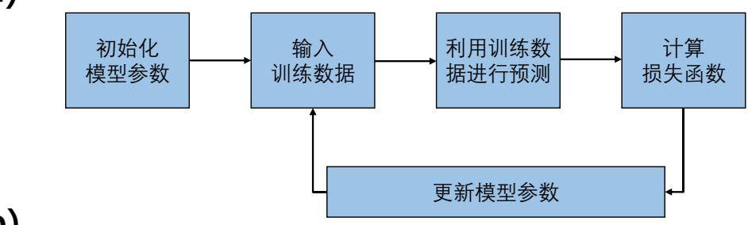

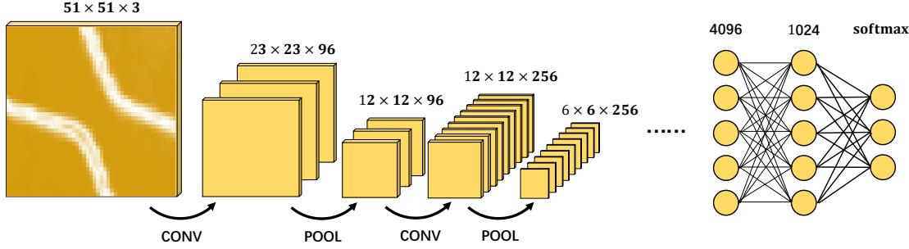  
图 2. 3 神经网络的处理流程。（a）神经网络的训练和优化流程示意图。（b）实验中应用的网络结构示意图。卷积层与池化层的数量与排布和 AlexNet 相同，但是将双 CPU结构更换为了单 GPU 结构，最终经过 softmax函数处理后的输出值根据实际需求进行了更改。

## 2.2 电荷稳定图的特征分析

卷积神经网络具有抓取和识别图像特征的能力，因此我们希望利用卷积神经网络来对量子点的电荷稳定图进行分析。为了建立起满足需求的神经网络，就需要在训练数据中给出对应的特征并提前进行分类，而如何找到满足实验需要的目标特征从而使得神经网络能够进行学习，则是另一个非常重要的工作。这一节将对半导体量子点的电荷稳定图中隐藏的物理信息以及对应的提取方法进行重点讨论，并展示如何运用相关的特征实现对神经网络的训练目的。

## 2.2.1 电荷稳定图

在 1.4 小节的内容中，我们对栅极电压影响量子点内电子输运过程的原因进行了解释。在不同的栅压下，由于不同的能级分布导致电子的输运性质产生变化，引起测量到的输运信号随之变化。这种变化在电荷稳定图中表现为不同分布形式的电荷隧穿线，对应量子点系统所处的不同物理状态。电荷稳定图的测量是对量子点系统最基础的表征手段之一[17-21]。

图 2. 4 展示了双量子点系统的等效电路图和典型的电荷稳定图，以及在不同能级分布下电子的输运情况。图中展示了四个不同的电荷态，它们的边界即为电荷隧穿线。点1 为三相点，此时源漏费米面和量子点能级持平，电子可以自由进出源漏以及量子点，形成了电荷态 $( \bf N _ { 0 } , \ N _ { 1 } )  \Phi ( \bf N _ { 0 } + 1 , \ N _ { 1 } )  \Phi ( \bf N _ { 0 } , \ N _ { 1 } + 1 ) $

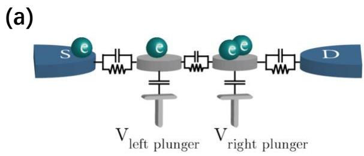

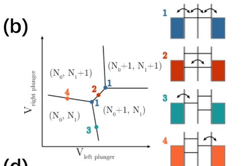

(c)  
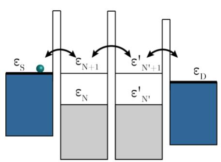

(d)  
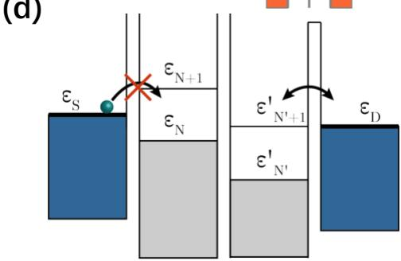  
图 2. 4 双量子点的输运原理。（a）双量子点的等效电路图。量子点与量子点之间，量子点与栅极之间通过电容产生耦合。（b）电荷稳定图。图中给出了当电子产生输运时对应的能级分布情况。（c）和（d）分别表示电子能顺利从源极输运到漏极的情况和在量子点中的输运被阻塞的情况。（图片引自文献[23]）

$( \Nu _ { 0 } , \Nu _ { 1 } )$ 的循环；点2表示两个量子点的能级相等，但低于源漏费米面，因此电子只能在点内进行输运，而不能跳出或跳入量子点，对应电荷态 $\left( \mathrm { N } _ { 0 } { + } 1 , \ \mathrm { N } _ { 1 } \right)$ $ ~ ( \mathrm { N } _ { 0 } , ~ \mathrm { N } _ { 1 } + 1 )$ 之间的转换；点 3 和点 4 是等效的，仅有左（右）量子点能级与源（漏）极费米面持平，对应电子只能进出单个量子点而无法在量子点间产生输运，即电荷态 $( \mathbf { N } _ { 0 } , \ \mathbf { N } _ { 1 } )  ( \mathbf { N } _ { 0 } , \ \mathbf { N } _ { 1 } + 1 )$ 和 $( \mathrm { N } _ { 0 } , \mathrm { ~ N } _ { 1 } )  ( \mathrm { N } _ { 0 } + 1 , \mathrm { ~ N } _ { 1 } )$ 的转换。通过这种方法，可以定位电子数发生改变时对应的电压位置，并用于对量子点内的电子进行计数。耦合强度的大小决定了两个三相点之间的距离。当不存在耦合时，在稳定性图中仅有1 个三相点存在（见图 1. 5（b））。

为了对相关参数进行说明，我们从 1.7.1 小节中给出的常相互作用模型下量子点的总能量入手

$$
U = \frac { 1 } { 2 } V ^ { T } \pmb { C V } ,\tag{2. 7}
$$

在双量子点系统中，认为相邻量子点间的等效电容满足 $C _ { 1 2 } = C _ { 2 1 } = C _ { m }$ ，同时考虑到施加在量子点上的栅压引起的量子点能量偏移为 $f ( V _ { 1 } , V _ { 2 } )$ ，代入得到

$$
\begin{array} { r l } & { I ( N ; V ) = \frac { 1 } { 2 } Q ^ { T } C ^ { - 1 } Q + f ( V _ { 1 } , V _ { 2 } ) } \\ & { \quad = \frac { 1 } { 2 } ( - | \mathrm { l o K } _ { 1 } , ~ - | \mathrm { l o K } _ { 3 } | ^ { 2 } ) \left\{ \underset { \mathrm { C } _ { 1 } \in \mathcal { C } _ { 2 } \cap \mathcal { E } _ { 1 } ^ { \bot } } { C _ { 2 } \cap \mathcal { E } _ { 1 } } ~ \frac { F _ { \mathrm { r o c } } } { C _ { 1 } \cap \mathcal { E } _ { 2 } - C _ { 2 } ^ { \bot } u _ { 1 } ^ { 3 } } \right\} ( - | \mathrm { l o K } _ { 1 } ^ { \bot } \rangle ) } \\ & { \quad \quad \quad + f ( V _ { 1 } , V _ { 2 } ) } \\ & { \quad \quad = \frac { 1 } { 2 } \frac { \mathrm { l o K } _ { 1 } ^ { 2 } \mathrm { l o K } _ { 2 } ^ { 2 } } { C _ { 1 } } \frac { C _ { \mathrm { c o } } } { C _ { 2 } \cap \mathcal { E } _ { 2 } ^ { \bot } } + \frac { 1 } { 2 } \frac { \mathrm { l } ^ { 3 } \mathrm { l o K } _ { 1 } ^ { 2 } \mathrm { l o K } _ { 2 } ^ { 2 } } { C _ { 2 } } \frac { C _ { \mathrm { c o } } } { C _ { 2 } \cap \mathcal { E } _ { 2 } - C _ { 2 } ^ { \bot } u _ { 1 } ^ { 3 } } } \\ & { \quad \quad \quad + \frac { N _ { 1 } M _ { 1 } ^ { 2 } \mathrm { l o K } _ { 2 } ^ { 2 } \mathrm { l o K } _ { 3 } ^ { 2 } } { C _ { 1 } C _ { 2 } } \frac { C _ { \mathrm { c o } } } { C _ { 2 } ^ { \bot } u _ { 2 } ^ { 3 } } + \frac { 1 } { 2 } f ( V _ { 1 } , V _ { 2 } ) } \\ &  \quad \quad \quad = \frac { 1 } { 2 } \frac  N _ { 2 } ^ { 3 } \mathrm { l o K } _ { 3 } ^ { 2 } \mathrm  l o K \end{array}\tag{2. 8}
$$

其中 $N _ { 1 }$ 和 $N _ { 2 }$ 为两个量子点内的电子数，等效充电能 $\begin{array} { r } { E _ { C 1 } = \frac { | e | ^ { 2 } } { C _ { 1 } } \frac { C _ { 1 } C _ { 2 } } { C _ { 1 } C _ { 2 } - C _ { m } ^ { 2 } } , E _ { C 2 } = } \end{array}$ $\begin{array} { r } { \frac { | e | ^ { 2 } } { C _ { 2 } } \frac { C _ { 1 } C _ { 2 } } { C _ { 1 } C _ { 2 } - C _ { m } ^ { 2 } } , E _ { C m } = \frac { | e | ^ { 2 } } { C _ { m } } \frac { C _ { m } ^ { 2 } } { C _ { 1 } C _ { 2 } - C _ { m } ^ { 2 } } } \end{array}$ ，以及栅压引起的能量偏移[22]

$$
\begin{array} { l } { { \displaystyle f ( V _ { 1 } , V _ { 2 } ) = - \frac { 1 } { | e | } [ C _ { 1 } V _ { 1 } ( N _ { 1 } E _ { C 1 } + N _ { 2 } E _ { C m } ) + C _ { 2 } V _ { 2 } ( N _ { 1 } E _ { C m } + N _ { 2 } E _ { C 2 } ) ] } } \\ { { \displaystyle ~ + \frac { 1 } { | e | ^ { 2 } } \Big [ \frac { 1 } { 2 } C _ { 1 } ^ { 2 } V _ { 1 } ^ { 2 } E _ { C 1 } + \frac { 1 } { 2 } C _ { 2 } ^ { 2 } V _ { 2 } ^ { 2 } E _ { C 2 } + C _ { 1 } V _ { 1 } C _ { 2 } V _ { 2 } E _ { C m } \Big ] , } } \end{array}\tag{2. 9}
$$

可以求出电化学势为

$$
\begin{array} { l } { { \mu _ { { 1 } } ( N _ { { 1 } } , N _ { { 2 } } ; V _ { { 1 } } , V _ { { 2 } } ) = U ( N _ { { 1 } } , N _ { { 2 } } ; V _ { { 1 } } , V _ { { 2 } } ) - U ( N _ { { 1 } } - { 1 } , N _ { { 2 } } ; V _ { { 1 } } , V _ { { 2 } } ) \ ~ } } \\ { { \displaystyle \qquad = \left( N _ { { 1 } } - \frac { 1 } { 2 } \right) E _ { { C 1 } } + N _ { { 2 } } E _ { { C m } } - \frac { 1 } { | e | } ( C _ { { 1 } } V _ { { 1 } } E _ { { C 1 } } + C _ { { 2 } } V _ { { 2 } } E _ { { C m } } ) , } } \end{array}\tag{2.10}
$$

同理有

$$
\mu _ { 2 } ( N _ { 1 } , N _ { 2 } ; V _ { 1 } , V _ { 2 } ) = \left( N _ { 2 } - { \frac { 1 } { 2 } } \right) E _ { C 2 } + N _ { 1 } E _ { C m } - { \frac { 1 } { | e | } } ( C _ { 1 } V _ { 1 } E _ { C \mathrm { m } } + C _ { 2 } V _ { 2 } E _ { C 2 } ) .\tag{2.11}
$$

如图 2. 5（b）所示，每一条电荷隧穿线都表量子点能级与源（漏）极的费米面持平，两个三相点之间的线段表示两个量子点的能级持平。首先对两条平行的

隧穿线进行分析：沿着电压 $V _ { 1 }$ 增大的方向，存在间距为 $\Delta V _ { 1 }$ 的两条平行隧穿线，它们分别代表两种状态下的电化学势与源极费米面持平：

$$
\mu _ { 1 } ( N _ { 1 } , N _ { 2 } ; V _ { 1 } , V _ { 2 } ) = \mu _ { 1 } ( N _ { 1 } + 1 , N _ { 2 } ; V _ { 1 } + \Delta V _ { 1 } , V _ { 2 } ) ,\tag{2.12}
$$

代入式 2.10，不难得到以下的关系

$$
\left( N _ { 1 } - \frac { 1 } { 2 } \right) E _ { C 1 } - \frac { 1 } { \left| e \right| } C _ { 1 } V _ { 1 } E _ { C 1 } = \left( N _ { 1 } + \frac { 1 } { 2 } \right) E _ { C 1 } - \frac { 1 } { \left| e \right| } C _ { 1 } ( V _ { 1 } + \Delta V _ { 1 } ) E _ { C 1 } ,\tag{2.13}
$$

求解得到

$$
\Delta V _ { 1 } = \frac { | e | } { C _ { 1 } } ,\tag{2.14}
$$

同理，沿着 $V _ { 2 }$ 增大的方向可以得到

$$
\Delta V _ { 2 } = \frac { | e | } { C _ { 2 } } .\tag{2.15}
$$

以上结果表明，电容矩阵的对角项，即量子点自身的电容，可以通过两条平行电荷隧穿线之间的电压间距进行提取，利用该电容值也可以估算量子点被特定电子数占据时所需要施加的电压大小。

除了电荷隧穿线，在图 2. 5（b）中还存在另一个特殊的电压位置，即三相点。定义两个近邻的三相点（白色圆点和黑色圆点）之间的电压差 $\boldsymbol { A } \boldsymbol { V } ^ { m } =$ $\sqrt { ( \varDelta V _ { 1 } ^ { m } ) ^ { 2 } + ( \varDelta V _ { 2 } ^ { m } ) ^ { 2 } }$ $\Delta V _ { 1 } ^ { m }$ 和 $\Delta V _ { 2 } ^ { m }$ 是 $\boldsymbol { \varDelta V } ^ { m }$ 在横轴和纵轴上的投影。三相点同样表示量子点能级和费米面持平，在两个三点之间，存在如下的电化学势关系

$$
\mu _ { 1 } ( N _ { 1 } , N _ { 2 } ; V _ { 1 } , V _ { 2 } ) = \mu _ { 1 } ( N _ { 1 } , N _ { 2 } + 1 ; V _ { 1 } + \Delta V _ { 1 } ^ { m } , V _ { 2 } ) ,\tag{2.16}
$$

代入式 2.10 得到

$$
N _ { 2 } E _ { C m } - \frac { 1 } { \vert e \vert } C _ { 1 } V _ { 1 } E _ { C 1 } = ( N _ { 2 } + 1 ) E _ { C m } - \frac { 1 } { \vert e \vert } C _ { 1 } ( V _ { 1 } + \Delta V _ { 1 } ^ { m } ) E _ { C 1 } ,\tag{2.17}
$$

求解得到

$$
\Delta V _ { 1 } ^ { m } = \frac { | e | C _ { m } } { C _ { 1 } C _ { 2 } } = \Delta V _ { 1 } \frac { C _ { m } } { C _ { 2 } } ,\tag{2.18}
$$

同理，对 $\mu _ { 2 } ( N _ { 1 } , N _ { 2 } ; V _ { 1 } , V _ { 2 } )$ 有同样的结论

$$
\Delta V _ { 2 } ^ { m } = \frac { | e | C _ { m } } { C _ { 2 } C _ { 1 } } = \Delta V _ { 2 } \frac { C _ { m } } { C _ { 1 } } .\tag{2.19}
$$

上面的结果说明，双量子点的点间耦合电容 $C _ { m }$ 与量子点自身电容共同决定了两个三相点之间的距离， $C _ { m }$ 越大，则三相点间隔越远，电荷稳定图上的反交叉点就越大。

在实验中，一般会通过测量二维相图对量子点的电荷状态进行分析，因此可以在双量子点系统中应用上述的结论，即量子点自身的电容决定了电荷隧穿线在相图上的位置和分布，并根据隧穿线的个数确定量子点中的电子占据数；量子点相互之间的耦合电容则决定了反交叉点中两条隧穿线的距离 $\Delta V ^ { m }$ ，反交叉点间隔越大，说明点间耦合电容越大，反之则说明耦合电容越小。通过改变 $V _ { 1 }$ 和 $V _ { 2 }$ 的大小，可以调节电化学势来对点内的电子占据数进行控制，而点间耦合电容$C _ { m }$ 则可通过势垒电压进行调节，进而改变量子点的点间隧穿耦合强度。

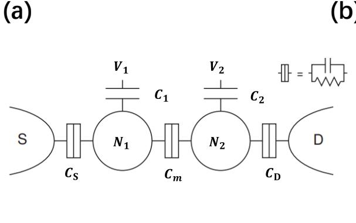  
(b)

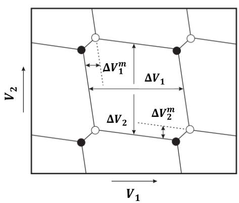  
图 2. 5 常相互作用模型下的双量子点。（a）双量子点的电容耦合示意图。（b）在电压空间中的蜂窝图。（图片引自文献[22]）

## 2.2.2 特征提取

在获得电荷稳定图以后，需要寻找少电子区并确定点间耦合的强度，而这些信息都可以通过分析电荷稳定图中的隧穿线获得。因此，只要能够找出不同电荷态在电荷稳定图中的特征表现，就可以使用神经网络进行分析，从而快速获得相关的电荷态信息。在这一节中将对如何寻找少电子区以及点间耦合在稳定性图中的特征进行解释说明。

少电子区的定义为量子点内的电子数较少的区域，在这个区域中可以实现对单个电子的操控和读取，这是构造自旋量子比特的必要条件。根据 小节中速率方程给出的结论，当量子点能级落在源漏费米面中间的时候静态电流最大，此时电子可以跳出或跳入量子点，导致量子点内出现电子数变化。在电荷稳定图中，电荷隧穿线所在的电压位置对应这一过程的发生，因此可根据隧穿线存在的数量来确定量子点中存在的电子个数。

一般而言，依赖隧穿线虽然可以知道电子数目的相对变化，但无法直接获得电子数目的绝对值。因此，寻找少电子区的关键在于定位到最后一条电荷隧穿线的位置。在一个二维的电荷稳定图中，少电子区表现为，在经过该位置以后，随着电压减小，测量的电信号仅存在背景波动而不存在突变。图 2. 6（a）和（b）中的（0，0）到（1，1）区间即为少电子区在相图中所处的位置。

在少电子区所对应的电压配置下，根据式2.18 和 2.19 的结论，量子点之间的耦合强度 $C _ { m }$ 可以通过隧穿线的反交叉点间隔大小进行判断。图 $2 . 6 ( \mathbf { g } ) \sim ( \mathbf { i } )$ 给出了在不同耦合强度下反交叉点的形貌。可以看到，耦合强度越小，隧穿线之间的“排斥”行为越弱；当耦合足够大时，电荷稳定图中的隧穿线几乎完全平行而无法找到反交叉点。

因此，在对电荷稳定图进行特征提取的时候，可以使用隧穿线是否存在作为代表电子数目变化的特征，使用反交叉点的形貌作为点间耦合的判定标准。在确定了电荷状态与电荷稳定图特征的对应关系和判断标准以后，即可开始从实际相图中提取对应的特征并应用到神经网络的训练过程。

(a)  
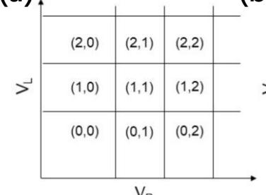  
(b)

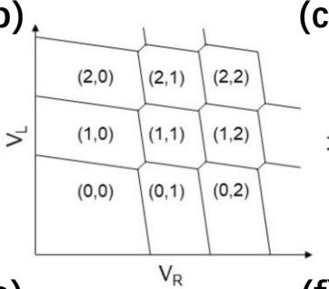  
(c)  
(e)  
(d)

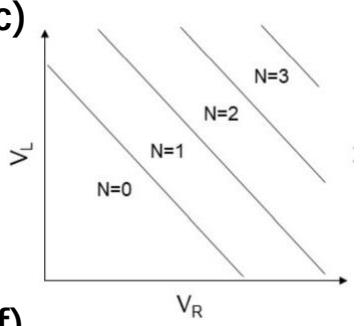

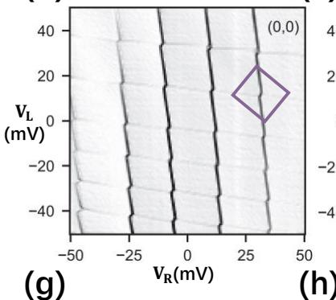

(f)  

  
图 2. 6 不同耦合强度下的电荷稳定图。（a）～（c）分别是使用常相互作用模型模拟的，不同耦合强度下的电荷稳定图，少电子区为 $( \mathbf { 0 } , \mathbf { 0 } ) \sim ( \mathbf { 1 } , \mathbf { 1 } )$ 附近的区域。（d）～（f）分别是实验中测量得到的不同耦合强度下的电荷稳定图，（0, 0）区域已在图上标出。 $( \mathbf { g } ) \sim ( \mathbf { i } )$ 分别是不同耦合强度下反交叉点的形貌。

## 2.3 基于神经网络的相图分析方法

为了获得能够针对特定类型的图像进行识别的卷积神经网络，需要提前使用含有对应特征并完成分类的样本对网络进行训练。通过建立不同特征与对应的分类标签之间的映射关系，一个训练好的神经网络将有能力对具有相似特征的图形进行正确的分类。因此，利用神经网络的这一特性，就可以对量子点电荷稳定图中存在的特征进行识别和分类，从而达到从相图中提取特定参数的目的。

## 2.3.1 相图分类

由于本文所使用的神经网络是基于单一特征训练得到的，而完成调控所依赖的电子数与点间耦合强度分属于不同的特征，因此需要针对两种特征分别训练对应的神经网络。前面提到，在神经网络的有监督学习中需要预先给训练样本分配确定的标签类别，因此首先需要定义相图的分类标准。对于电子数而言，可以利用隧穿线是否存在作为特征，将其分为存在电子数变化和无电子数变化两大类；对于耦合强度而言分类标准则非常直观，可分为欠耦合、适中耦合和过耦合三个类别。根据调控的目标，对电子数而言，首先需要从相图中找出存在电子数变化的位置，在此基础上进一步确定最后一条电荷隧穿线的位置，从而定位到少电子区；对点间耦合而言，则需要调节系统相图直到出现适中耦合的特征为止。

对神经网络的判断模式而言，不同耦合强度对应的特征在相图中的区分度足够明显，因此可以直接在实验中应用。然而，隧穿线的存在与否作为电子数目变化的特征并不合适，这是因为对于一个双量子点系统而言，相图中观测到隧穿线是两个量子点中电子输运过程的叠加，而由于双量子点的对称性，无法判断是哪一个量子点内产生了电子数变化，所以通过隧穿线判断某一个量子点中发生了电子数变化是不合理的。因此，在实际应用中并不直接对电子数目进行判断，而是通过区分相图处于单点或双点区域来确定少电子区。图 2. 7中展示了用于训练的样本示意图，其中每一个相图样本都按照 1：1 的分辨率比例截取，并且被等比例缩放为 51 px × 51 px。

基于少电子区的定义，在电压低于少电子区的相图区域中，只存在无信息的区域（无点），而在电压高于少电子区的相图区域中，则存在如下两种电荷占据形式：（1）双量子点中只存在一个电子，可以观察到单条隧穿线或多条平行隧穿线；（2）双量子点中都存在电子，根据相图的电压范围大小，可以观测到部分或者完整的隧穿线交叉点。

对于点间耦合，根据式2.18 的结论，两个三相点的间隔 $\Delta V _ { i } ^ { m } = | e | C _ { m } / ( C _ { 1 } C _ { 2 } )$ 随着耦合强度 $C _ { m }$ 的增大，隧穿线之间相互“排斥”更加明显：在欠耦合 $C _ { m } \approx 0$

(a)

时， $\Delta V _ { i } ^ { m } \approx 0$ ，两个三相点已经几乎重合；在适中耦合时，可以看到具有明显转折特征的隧穿线；当过耦合时，电荷稳定图变为多条几乎平行的隧穿线。

最后，需要为每一种分类分配一个数组标签，该标签对应的是CNN 识别每一个相图后的期望输出值。对于图中（a）所示的样本，我们定义了一个包含5个元素的数组标签 ${ l _ { \mathrm { a } } } = [ l _ { 1 } , l _ { 2 } , l _ { 3 } , l _ { 4 } , l _ { 5 } ]$ ，数组元素 $l _ { i }$ 只存在两种取值0和 1，表明该标签对应的样本是否属于某一个类别。例如，对于第三类的单点（多线）样本，其对应的标签为 $l _ { a } = [ 0 , 0 , 1 , 0 , 0 ]$ ，即仅有第 3 个元素取值为1，其他元素取值为0。同理，对于（b）所示的分类，其标签是一个包含 3 个元素的数组标签 $l _ { \mathrm { b } } =$ $[ l _ { 1 } , l _ { 2 } , l _ { 3 } ]$ ，且该数组的定义规则与 $l _ { a }$ 相同。

至此，就已经完成了对相图的特征分类工作。依赖于这一套分类标准所得到的神经网络可以对测量的相图进行识别并分类，是实现自动化调控过程中必不可少的准备工作。

  
图 2. 7 用于神经网络训练过程的相图样本以及对应的标签。（a）用于训练寻找少电子区的神经网络的样本示例。（b）用于训练判定耦合强度的神经网络的样本示例。

## 2.3.2 误差及其抑制

在用于训练的样本数据中，可以发现示例中截取的相图样本并非是平滑的。这是由于实验中的测量过程会受到样品、仪器、温度波动和实验线路等外界因素的影响而引入噪声，甚至可能因为噪声过大而导致电子输运信号无法在相图中清晰地显示出来。过大的噪声会引起信噪比降低，导致相图清晰度不足，从而对训练和识别过程造成影响。然而，适当的噪声能够提升神经网络的鲁棒性，同时还会减少网络过拟合的可能性。这是因为噪声会导致图像中的特征发生微弱的变形，利用含噪声的样本进行训练可以使得神经网络对于存在一定偏差的特征也具有良好的容忍度。

  
图 2. 8 原始相图以及经过 Laplace 算子预处理以后的相图。在处理后的图像中，背景信号的波动获得了良好的抑制，使得隧穿线表现得更加明显。

虽然可以对训练样本有目的地进行挑选和处理，但对于训练过程以外的输入数据无法进行人为干预。为了提升数据的对比度，减少特征模糊带来的误分类的可能性，对于输入图像则一般会在不改变数据分布以及特征形貌的前提下进行一次预处理，旨在减少噪声并且让图像更加平滑。

图 2. 8 中展示了预处理前后的效果。我们选择使用Laplace算子对图像进行平滑处理[24]。该算子属于一种微分算子，可以对图像进行锐化。该处理方法能够突出图像中变化强烈的位置，即隧穿线，而减弱变化缓慢的地方，即背景波动以及噪声。通过这样的处理，对于高信噪比的相图能够更明显的显示出隧穿线的形貌，同时使背景噪声变得平滑，能够有效地提升分类效率。

## 2.3.3 特殊情况与处理

对于相图中出现的一些异常现象，例如隧穿线不连续、图中出现未知的杂线、信号突变等情况，一般会将电压重新设置后再重复扫描相图。在实验过程中偶尔会出现此类不可控也无法避免的状况，而引起这些状况的因素大多是不可复现的，包括但不限于计算机内存溢出、仪器失灵、断电、网络连接中断等偶发因素。通常来说，如果发现扫描的相图出现异常，在重复扫描以后异常状况就会消失，如果多次的重复结果均存在问题，则需要考虑样品本身或者测量环境是否存在异常。在量子点的自动化调控过程中也需要考虑到类似的问题。在没有人工干预的情况下，虽然无法直接对异常相图进行判断，但此类相图往往无法在神经网络中进行正确识别，并且返回的分类结果大部分为空值。如果返回的结果空值太多，则可以考虑对相图进行重新扫描。在下一章中也会对自动调控过程进行详细分析。

## 2.4 本章小结

本章围绕神经网络的建立和训练过程以及样本的提取和收集方法进行了讨论。首先从卷积神经网络的概念出发，介绍了神经网络对量子点电荷态进行识别分类的原理以及优化方法。随后介绍了电荷稳定图的分析方法，对如何利用相图中隧穿线的特殊形貌提取相图中包含的电荷态信息进行了演示，同时说明了如何建立电荷态信息与对应特征的联系。最后介绍了对相图进行分类的标准以应用于训练特定的神经网络，对识别过程中噪声所带来的影响进行了说明，并给出了一种对数据进行预处理的方法。本章的内容展示了实现自动调控方案所必需的准备工作，即得到符合需求的神经网络，在此基础上才能够继续开展自动调控方案的完善和应用工作。

## 参考文献

[1] Hubel D H, Wiesel T N. Receptive fields, binocular interaction and functional architecture in the cat's visual cortex[J]. The Journal of Physiology, 1962, 160(1): 106-154.

[2] Fukushima K, Miyake S. Neocognitron: A self-organizing neural network model for a mechanism of visual pattern recognition[M]//Competition and cooperation in neural nets. Springer, Berlin, Heidelberg, 1982, 267-285.

[3] LeCun Y, Boser B, Denker J S, et al. Backpropagation applied to handwritten zip code recognition[J]. Neural Computation, 1989, 1(4): 541-551.

[4] LeCun Y, Bottou L, Bengio Y, et al. Gradient-based learning applied to document recognition[J]. Proceedings of the IEEE, 1998, 86(11): 2278-2324.

[5] Zhang W, Tanida J, Itoh K, et al. Shift-invariant pattern recognition neural network and its optical architecture[C]//Proceedings of Annual Conference of the Japan Society of Applied Physics. 1988: 2147-2151.

[6] Boureau Y L, Bach F, LeCun Y, et al. Learning mid-level features for recognition[C]//2010 IEEE computer society conference on computer vision and pattern recognition. IEEE, 2010: 2559-2566.

[7] Krizhevsky A, Sutskever I, Hinton G E. Imagenet classification with deep convolutional neural networks[J]. Advances in Neural Information Processing Systems. 2012, 25: 1097-1105.

[8] Hinton G, Vinyals O, Dean J. Distilling the knowledge in a neural network[J]. arXiv preprint, 2015, arXiv:1503.02531.

[9] Bzdok D, Krzywinski M, Altman N. Machine learning: supervised methods[J]. Nature Methods, 2018, 15(1): 5-6.

[10] Glorot X, Bordes A, Bengio Y. Deep sparse rectifier neural networks[C]//Proceedings of the fourteenth international conference on artificial intelligence and statistics. JMLR Workshop and Conference Proceedings, 2011: 315-323.

[11] Maas A L, Hannun A Y, Ng A Y. Rectifier nonlinearities improve neural network acoustic models[C]//Proc. icml. 2013, 30(1): 3-8.

[12] Yam J Y F, Chow T W S. A weight initialization method for improving training speed in feedforward neural network[J]. Neurocomputing, 2000, 30(1-4): 219-232.

[13] Cao W, Wang X, Ming Z, et al. A review on neural networks with random weights[J]. Neurocomputing, 2018, 275: 278-287.

[14] He K, Zhang X, Ren S, et al. Delving deep into rectifiers: Surpassing human-level performance

on imagenet classification[C]//Proceedings of the IEEE international conference on computer vision. 2015: 1026-1034.

[15] Kingma D P, Ba J. Adam: A method for stochastic optimization[J]. arXiv preprint, 2014, arXiv:1412.6980.

[16] Botev Z I, Kroese D P, Rubinstein R Y, et al. The cross-entropy method for optimization[M]// Handbook of Statistics. Elsevier, 2013, 31: 35-59.

[17] Elzerman J M, Hanson R, Greidanus J S, et al. Few-electron quantum dot circuit with integrated charge read out[J]. Physical Review B, 2003, 67(16): 161308.

[18] Zajac D M, Hazard T M, Mi X, et al. A reconfigurable gate architecture for Si/SiGe quantum dots[J]. Applied Physics Letters, 2015, 106(22): 223507.

[19] Borselli M G, Eng K, Ross R S, et al. Undoped accumulation-mode Si/SiGe quantum dots[J]. Nanotechnology, 2015, 26(37): 375202.

[20] Lawrie W I L, Eenink H G J, Hendrickx N W, et al. Quantum dot arrays in silicon and germanium[J]. Applied Physics Letters, 2020, 116(8): 080501.

[21] De Franceschi S, Sasaki S, Elzerman J M, et al. Electron cotunneling in a semiconductor quantum dot[J]. Physical Review Letters, 2001, 86(5): 878.

[22] Van der Wiel W G, De Franceschi S, Elzerman J M, et al. Electron transport through double quantum dots[J]. Reviews of Modern Physics, 2002, 75(1): 1-22.

[23] Darulová J. Automated Tuning of Gate-defined Quantum Dots[D]. Zurich: ETH Zurich, 2020.

[24] Wang X. Laplacian operator-based edge detectors[J]. IEEE Transactions on Pattern Analysis and Machine Intelligence, 2007, 29(5): 886-890.

## 第3章 双量子点体系的自动调控

在门控型半导体量子点中，目前几乎所有的调控过程都是依赖人工判断完成的，这是一个低效且耗时的过程，并且非常不利于量子点体系的规模化扩展。在调控过程中，需要对施加在每一条栅极上的电压都进行仔细的调校，因此需要花费较多的时间来确保器件形成可以工作的量子点。利用计算机对量子点进行自动调控是实现大规模半导体量子点参数优化的一个解决方案。本章以双量子点系统作为调控单元，展示了手动调控量子点的流程，并结合机器学习技术和调控算法实现了该调控流程的自动化。该自动调控流程体现出了一定程度的通用性，并且相对传统手动调控过程而言能够带来更良好的调控效率。

## 3.1 研究背景

对于量子点系统中量子比特的高保真度操控依赖于将量子点调节到适当的状态[1-9]，然而在量子点阵列的调控过程中，对多个量子点进行同时调控所涉及的参数过多，调控难度较大。鉴于半导体量子点的规模和调控模式的可扩展性[10-11]，本章将以双量子点作为基本的调控模板进行研究，在该系统下实现少电子区的定位和点间耦合的调节，并将相关结论作为整体嵌入到量子点阵列的调控过程中。

为了获得能够正常工作的量子点，需要将器件调整到符合量子计算要求的特定的配置上面。目前大部分实验在确认量子点工作参数的流程中使用的都是试探性的调整，即先将参数调至可能的范围中，再依据量子点的实际表现对相关参数进行微调。然而，这样的方法随着量子点数目的增加逐渐失去了可操作性。对于一般的半导体量子点器件而言，即便是单量子点结构，也至少需要对5个以上的栅极电压进行处理，而对于两个及以上的多量子点体系，栅极数量依据具体结构不同，可以达到数十甚至上百根[12-19]。因此，建立一套可靠的、不依赖人工经验和判断的自动化方案来对量子点器件进行调控是非常必要的[20-27]。

## 3.2 调控逻辑

本小节从传统的调控流程入手，解释了目前进行量子点的人工调控所需要测量的参数以及如何依据测量结果对调节方向进行判断。在对整个调控流程进行梳

理后，进一步将流程中的各个步骤拆分为独立的调控子模块，每个模块根据调控目标输入相应的参数并反馈调控结果，从而将人工流程逐步使用计算机进行替代。

## 3.2.1 传统调控流程

图 3. 1 展示了与本文实验具有相同结构的双量子点器件以及经过人工调控后的电荷稳定图。双量子点 $\mathrm { Q D } _ { 1 }$ 和 QD 由 5 条栅极控制，其中势垒电极 $( \mathtt { B _ { i } } ,$ $_ \mathrm { i } = 1 , 2 , 3 )$ 用于调节量子点之间以及与源漏电子库之间电子的隧穿能力，泵浦电极 $( \mathrm { P _ { i } } , \ \mathrm { i } = 1 , 2 )$ 用于对量子点内电子能级进行调节，量子点上方的单电子晶体管（single-electron transistor, SET）作为电荷感应器，被用于测量双量子点的电荷状态[28]，受栅极 $\mathrm { S B } _ { 1 } , \mathrm { S B } _ { 2 }$ 和SP 控制。通过调控栅极电压，我们希望得到类似于图3. 1（b）所示的相图。具体而言，在实验中需要通过调节泵浦电极电压控制量子点内的电子数目以实现对单个电子的操控，通过调节势垒电极电压改变量子点之间的隧穿耦合强度，从而为构建自旋量子比特提供实验条件。

在对栅极电压进行精确调控前，首先需要对量子点器件的开启（Turn on）电流曲线和夹断（Pinch-off）电流曲线进行测量来获得器件栅极的工作电压范围。在开启电流的测量中，需要先将所有栅极电压调整至0V，此时整个输运通道被关闭，电子无法进出量子点。随后，将所有栅极电压同步抬升，直到发现量子点的输运电流信号出现上升为止。正常的开启电压一般不会超过 1.2 V，如果电压设置过大，很有可能发生电击穿而导致样品损坏。

在确保输运通道能够正常开启后，接下来需要对每一条栅极关闭电流的能力进行测试。在这一步中，首先将所有的栅极电压初始化在开启电流曲线饱和时所对应的电压位置，保证量子点输运通道的开启。随后逐步降低施加在待测栅极上的电压直到降为0V。通常在夹断电压处会观察到电流的迅速下降，而在远离夹断电压的位置，电流几乎不会产生变化。对每一条栅极都需要重复以上的步骤，并且在每次测量结束后都需要将电压设置回开启电压以保证输运通道重新打开。

(a)  

(b)  
  
图 3. 1 （a）双量子点的电镜图（已上色）。（b）调控后的电荷稳定图。

图 3. 2 展示了开启和夹断电流曲线的测量结果。开启电流图中的单根曲线是根据所有栅极电压同步上升所测得的，而夹断电流图中则通过逐步减小待测栅极电压展示出了每一个栅极对电流的关闭能力。由于栅极在制备时可能存在大小宽度的不同，因此不同栅极的夹断电压也不同。在这一步的测量结束以后，就可以根据器件的大致状态开始对正式调控进行准备工作。

在准备阶段，需要获取的量子点状态信息有以下四点：泵浦电极的工作电压范围、势垒电极的电流曲线随电压变化最迅速的位置、SET 信号对电压变化最敏感的位置以及量子点的成点情况。图 3. 3（a）～（d）展示了上述四点的测量结果以及提取方式。获取泵浦电极电压范围是为了缩小扫描相图的范围以节省时间。在现有的测量方式下，由于测量仪器的带宽限制，每次改变电压后都需要毫秒级的等待时间才能获得一次有效的测量数据。因此，计算机每秒只能进行 10～20次采样，而精细扫描一张 $0 . 5 \ : \mathrm { V } \times 0 . 5 \ : \mathrm { V }$ 的相图通常包含60,000 左右的采样数据。因此，限制电压范围可以快速将少电子区纳入扫描的相图，减少了试错成本。寻找势垒电极电流对电压变化最敏感的位置是为了确定势垒电极电压的初始位置，这是因为在电流曲线斜率最大处所对应的势垒相对容易形成量子点。寻找SET 信号对电压变化最敏感的位置则是为了获得更好的信号对比度。在电荷稳定图的测量过程中，其横纵坐标均为栅极电压，并且采集的是通过SET 的电信号，因此要求 SET 对电压变化敏感，才能使量子点电荷态的改变引起 SET 信号发生明显变化。在确定量子点的成点情况时，需要在将所有电压设置完毕以后，通过扫泵浦电压检测 SET 信号是否会出现连续的振荡峰。当量子点中每发生一次电子数改

  
图 3. 2 开启和夹断电流测试。（a）量子点的开启电流。横坐标的电压表示所有栅极的同时改变。（b）量子点的夹断电流。不同的曲线分别代表不同的栅极。

(b)  

(c)  

(d)  
  
图 3 3 对量子点的初步表征。（ ）通过扫描泵浦电极电压的夹断曲线确定其大致的工作范围。P1 和 P2 栅极的电压范围分别用蓝点和橙点在图中标出。（b）通过扫描势垒电极电压的夹断曲线确定其初始电压位置。三个势垒电极B1、B2和 B3对应的初始电压分别由蓝点、橙点和绿点在图中标出。（c）通过扫描 LP 栅极确定 SET 的工作电压。其中 随电压响应最敏感的位置由红点在图上标出。（ ）通过扫描（或 ）栅极确认量子点的成点情况。在图中展示出了 个振荡峰，每个振荡峰都代表电子进出量子点的过程。顺利形成振荡峰意味着量子点可以正常工作。

变，就会引起SET 的电导突变，进而采集到SET 信号的突然上升或下降形成的突变信号。

接下来，需要根据之前确定的泵浦电极电压范围测量电荷稳定图。由于隧穿线仅在电子发生隧穿时才能被观测到，因此可以根据周围的隧穿线分布判断出电子是否已被排空，即找到少电子区。根据少电子区的隧穿线反交叉点的形貌，进一步调节势垒电极B2 的电压直到出现比较明显的耦合现象。从电荷稳定图来看，改变 B2 的效果等同于改变三相点的间距：增大 B2 电压，则点间耦合加强，三相点间距增大，反之则三相点间距减小。在图 3. 4（a）和（b）中，分别展示了

寻找少电子区和调节点间耦合的过程。

在电荷稳定图的调节过程中，有时会出现如图 （ ）和（d）所示隧穿线消失以及存在杂点的情况。在这两种情况中，隧穿线消失是由于过低的势垒电压降低了电子在量子点与电子库之间的隧穿速率[29]，因此无论如何调节泵浦电极P1和 P2的电压，其信号强度都不足以被观测到。在这种情况下，通常需要不断提高电子库与量子点之间的势垒电极 B1 或 B3 的电压并重复扫描，直到能够观测到明显的隧穿线为止。杂点则通常是由于器件中的电荷缺陷而形成的额外量子点，从而导致额外的隧穿线出现在正常情况下不发生电子隧穿的电压位置。根据式2.14 的结论，量子点对应的两条隧穿线间距满足 $\Delta V _ { i } = | e | / C _ { i }$ ，忽略栅压对 $C _ { i }$ 的影响后，可知隧穿线应当是等间距出现的，不符合该间距的隧穿线即可视为杂点引起的杂线，在实验中可以通过修改势垒电压尝试将杂点排空以防对其他量子点产生影响。

在获得类似图 3. 1（b）所示的电荷稳定图以后，在此基础上选择合适的栅极电压配置即可进一步实现对单电子的控制并构造自旋量子比特。本文的研究主要针对的是量子点的调控过程，对此不再深入讨论。

(a)  

(b)  

(c)  

(d)  
  
图 3. 4 基于电荷稳定图的调控。（a）、（b）分别为不同势垒电压下测量的相图。通过扫泵浦电极电压可以找到少电子区的位置，通过调节势垒电极电压可以得到如图所示的不同的反交叉点。（c）相图中由于量子点和电子库之间隧穿速率太小导致的隧穿线消失现象，通常出现在少电子区周围。（d）相图中显示出在势垒电极下形成的杂点。

在人工调控流程中，一共包含了以下几个主要步骤：确定栅极工作电压、测量电荷稳定图、寻找少电子区和调节点间耦合强度。在这之中确定栅极工作电压和电荷稳定图的测量仅涉及仪器操控而不涉及对量子点的状态进行分析。在自动调控过程中，此类过程将会凭借计算机的快速处理能力获得大幅度的效率提升。

## 3.2.2 调控流程中的模块化

明确了传统调控过程的流程以后，需要将其中的每个步骤单独独立出来，并使用程序实现每一个步骤，使得在计算机处理过程中针对不同阶段只需要调用对应的函数即可。本文使用如图 所示的结构来对调控流程中的参数结构进行汇总。图中展示了一个递进结构，每一层获取（用箭头表示）或关联（用横线表示）的参数和信息均来自上一层。

首先对实验涉及到的参数类型和结构进行一个简要的说明。对于每一次实验流程的参数信息，可以使用保存着完成实验所需的完整参数和仪器信息的配置文件进行记录，即图中的“file”。“Inputs”作为调控流程的入口，用来定义实验中涉及到的电压、待测栅极和相关仪器的参数，在图中分别使用“voltage”、“gates”和“instr”进行指代。电压包含起始电压、电压变化范围以及其他栅极的固定电压，待测栅极则定义了需要在实验中进行调节的栅极编号，而相关仪器则包含了完成实验所依赖的测量仪器，并在运行前被加载到程序中。一个可靠的调控流程应该遵循定义电压→分配电压到相应栅极→调用仪器并施加电压，否则有可能会因为仪器的初始值错误而造成样品烧毁。量子点的电信号将会由相应的采集仪器收集并记录（图中的“current”）。在测量过程结束以后则需要对收集到的数据进行整理和分析，即图中的“data”以及之后的结构。一般会对收集的电信号数据进行可视化，即生成电荷稳定图，进一步对当前的量子点状态进行分析，定性地判断是否处于少电子区以及点间耦合强度是否合适，以此为判据进行下一轮的调试。在数据分析的过程中，还可以进一步利用隧穿线的斜率或者间隔等信息（图中的“slope”），对量子点的点间耦合以及栅极之间的耦合大小进行量化（图中的“C”）。

虽然在不同的实验中，需要的参数内容与上述内容不尽相同，但是对于量子点调控的处理流程都是可以通用的。对于这些通用的数据处理与仪器操作等流程，本文将其分为了8个大类，并分别对其进行了函数封装。从实验的输入到输出结果的过程中，应用到了以下的函数模块：

（1）电压/电流处理模块：基于配置文件和实验窗口中输入的电压或电流数据，生成电压电流矩阵，用于了解当前进度以及提升程序的响应速度；

  
①：电压/电流处理模块 ②：仪器连接模块 ③：通信模块 ④数据收集模块 ⑤数据处理模块 ⑥参数提取及拟合模块 ⑦自动识别模块 ⑧日志记录模块

图 实验的数据结构示意图。各个数据点之间通过相关的模块进行处理，分别使用带圈数字进行标记，中括号内表示数据的格式。这些函数一共被分为了 8个种类。矩形框中表示实验中涉及到的相关参数信息，每一步之间会经过相应的函数模块进行处理。其中实箭头表示数据的递进关系，即要获得该数据必须先得到上一层的数据；虚箭头表示两套数据之间可以存在依赖也可以单独设置；实横线表示两套数据之间是独立的，不存在依赖关系；虚横线表示对应数据可以获得但不一定会在实验中使用。

（2）仪器连接模块：用于添加相关仪器到程序中。该模块会生成每一个仪器通道的索引，允许其他模块快速定位和设置仪器的对应参数；

（3）通信模块：用于与测量仪器和数据采集仪器进行通信。在仪器加载完成后，每一步对电压进行修改都需要通过该模块将相关指令发至对应仪器，并接收来自仪器的结果响应；

（4）数据收集模块：对仪器返回的数据进行收集和整理。每一次测量中获得的数据都会按照一个特定的标准格式进行记录，以便后期调用的时候

能够快速高效地读取大量的数据；

（5）数据处理模块：在测量中或测量结束以后对取得的数据进行图像可视化。通常会依据实际需要对函数模块的参数进行手动调整。

（6）参数提取及拟合模块：测量结束后从返回结果中提取相关信息。该模块通常用于计算不能从结果中直接进行提取的信息，通常会对可视化以后的数据或者直接使用原始数据进行参数拟合等方法进行计算。

（7）自动识别模块：利用神经网络对测量结果进行识别。该模块是完成自动调控过程的核心模块，旨在将输出结果与数据处理流程进行连接，从而减少调控过程中的人工干预；

（8）日志记录模块：记录实验中的调控流程、参数变化和结果，用于对实验进行后期评估。

基于以上的8个模块，以自动识别为中心，就可以将自动调节的流程搭建起来，从而消除调节过程中所需要的人工判断和参数设置等过程。

## 3.2.3 自动调控流程

自动调控流程是在传统的手动调控流程的基础上建立而来的，其主要的调控逻辑和操作思路都是仿照手动调控而形成的，因此，从调控路径层面而言，自动调控与手动调控并无本质的区别，唯一的不同仅在于对调控路径的判断标准和规划效率上存在些许的差别。在自动调控流程中，神经网络具有决策者的身份，将通过测量结果给出对应的量子点电荷状态，从而有目的地将量子点系统调控到目标状态。具体的自动调控流程结构如图 3. 6所示。

自动调控在传统人工调控流程的确认工作电压、测量电荷稳定图、定位少电子区和判断耦合强度这四个步骤的基础上，在后两个步骤中引入了神经网络以替代人工判断。依赖于CNN 在图像特征识别上的优势，通过识别量子点的电荷稳定图的特征，并对目标栅极电压进行迭代搜索来获得满足将少电子区调节至适中耦合强度的电压配置。

在本文使用的自动调控流程中，用于定位少电子区和确定耦合大小的神经网络是经过分别训练的两套网络，其训练样本则是分别针对隧穿线和反交叉点而选取的，因此二者对于不同图像特征的响应不同。此举的目的在于减少神经网络产生的误判，其原因在于如果使用一套通用的神经网络在寻找少电子区的同时对其耦合强度进行判定，其识别准确率会由于二者特征图的相似性而降低，也会更容易受到电荷稳定图中的失真信号的影响而输出错误结果。

在用于寻找少电子区的 CNN 1 中，主要用于判定输入的电荷稳定图是否具有双点电荷态的特征，并通过搜索对应最小电压的区域来确定少电子区的位置。

在用于判断耦合大小的 CNN 2 中，则根据对电荷稳定图的识别结果不断迭代势垒电极的电压，直到 CNN2 给出对应的判断为适中耦合为止。关于该步骤中更详细的处理方法会在下一节中进行讨论。

  
图 3. 6 双量子点自动调控的流程示意图。新加入的神经网络识别模块用于替换人工流程中的判断和迭代操作过程。

## 3.3 自动调控的实现

这一节将围绕自动调控流程的实现方式进行讨论。上节中介绍的自动化调控流程的核心是基于 CNN 输出的电荷稳定图特征识别结果确定调控路径，同时使用相关的优化算法用以对识别结果进行处理和整合。与人工调控的步骤相同，自动调控过程中会首先对量子点栅极的工作电压范围进行确认，在限制的电压范围内进行电荷稳定图的测量，进一步寻找电荷稳定图中的少电子区并调节对应势垒电极直至双量子点达到适中的耦合强度。接下来对这些步骤进行详细的解释和说明。

## 3.3.1 确定电压范围

在对量子点进行调控之前，首先需要对所有的参数进行初始化。除了仪器地址、电极编号、扫描速率等可以预先手动设置的工作参数以外，还需要对量子点器件进行一个粗略的表征，以获得每一条栅极最合适的工作电压或者电压范围。依据配置文件中所定义的待测栅极编号，分别测量对应的夹断电流曲线并确定势垒电极的初始电压位置或泵浦电极的工作电压范围。如图 3. 7 所示，通过对夹断电流曲线进行拟合并求解其一阶和二阶导数，可以分别获得斜率最大的位置（黄色虚线）和两个拐点的位置（绿色虚线）。

夹断电流曲线可以通过如下的函数进行拟合[30]：

$$
f = a ( 1 + \operatorname { t a n h } ( b x + c ) ) ,\tag{3. 1}
$$

其中参数𝑎表示曲线的幅值，𝑏 决定了曲线随电压变化的快慢，𝑐 的值则决定了函数在 x轴上的横移量和横移方向。

值得注意的是，虽然通过对曲线进行拟合来获取势垒电极的初始电压位置可以取得较好效果，但是对泵浦电极而言，电压范围可能会存在一些偏差，如图中所示的两条绿色虚线内的电压范围比实际拐点范围要更小，这会减少电压稳定图可以覆盖的隧穿线数量。因此，在实际应用过程中，需要适当地对拟合所得工作电压范围进行扩大，即降低下限的同时抬高上限。同样地，由于电压下限的降低，当泵浦电极被设置到低电压时，因为交叉电容引起的势垒过高可能会阻断电子输运通道。为了补偿低电压时引起的势垒升高，也需要将势垒电极的初始值在拟合值的基础上进行抬高。根据实际经验，一般将泵浦电极的工作电压范围上限提高0.08V，同时将下限降低0.08V，同时将势垒电极的初始电压在拟合值的基础上抬升 0.1 V。

完成量子点栅极的电压设置以后，还需要对 SET 进行设置。SET 作为探测量子点中电荷状态的传感器，要求其对量子点内电荷态变化敏感，因此需要将栅极SP 的电压设置在其信号斜率最大处。因此，同样需要对 SET 信号进行一次微分后取其最大绝对值的位置作为SET 的工作电压。图 3. 8展示了 SET 信号以及其微分信号。

  
图 3. 7 夹断电流曲线及其拟合曲线。曲线的最大斜率的位置以及两个拐点的位置分别通过计算一阶和二阶导数获得。

经过上述的步骤，量子点器件的所有栅极都完成了初始化设置，接下来将对电荷稳定图进行测量，以进行下一阶段的调控工作。

  
图 3. 8 SET 信号随泵浦电极 SP的变化以及信号的微分结果。栅极SP的电压会被设置在斜率最大处。

## 3.3.2 定位少电子区

在控制量子点器件中其他栅极电压不变的情况下，扫描双量子点的泵浦电极，就可以获得对应的电荷稳定图。将该相图作为输入，经过CNN 分析和识别以后，即可提取出双点态的位置并用以搜寻少电子区。实验中泵浦电极电压的可变范围一般在 0.4 V 左右，作为对比，一般精细扫描的电荷稳定图的电压变化范围在 0.04V 上下，电压步长为0.0006V 上下。然而，对于自动调控过程中所定义的范围如此巨大的电荷稳定图，精细扫描所花费的时间将会非常长，但是并不会明显地提高最终的识别效果。因此为了节约扫图时间，电压步长被预先设置为 0.002 V，对电信号的每一次采样都会在相图中生成一个像素，最终得到的电荷稳定图尺寸约 $2 0 0 \ \mathrm { p x } \times 2 0 0 \ \mathrm { p x } ($ （对应电压范围 $0 . 4 \ : \mathrm { V } \times 0 . 4 \ : \mathrm { V } )$ 。在2.3.1 小节中提到，用于 CNN训练的样本数据的尺寸都被固定在 $5 1 \mathrm { p x } \times 5 1 \mathrm { p x }$ ，完整的电荷稳定图尺寸过大，并不适于直接输入到CNN 中，因此需要先进行一次切割，将电荷稳定图分为若干小子图再分别交由CNN 处理。另外，由于在参数配置中设置的扫描步长较大，每个像素约对应1.5 mV，因此每一个子图尺寸实际上是按照 $3 1 \mathrm { p x } \times 3 1 \mathrm { p x }$ （对应电压范围 $4 5 ~ \mathrm { m V } \times 4 5 ~ \mathrm { m V } )$ ）进行切割，再经过后期插值处理将尺寸拉伸至 51 px$\times \ 5 1 \ \mathsf { p x }$ 。

在自动调控程序对双量子点进行少电子区定位的过程中，获得了如图 3. 9（a）所示的电荷稳定图。该相图被切割为若干个子图， 会对每一个子图进行一次判定并返回该子图所对应的区域为双点态的概率，并按照提前设置好的阈值对概率进行取舍：如果返回的概率值高于80%，则会将对应的区域标记为双点，同时弃置概率值低于 80%的区域。图 3. 9（b）展示出黄色矩形区域内的 9 个子图对应的概率值，绿色区域为符合双点态的区域，红色区域表示被弃置的区域。在图 3. 9（c）中，展示了完整电荷稳定图的 42 个区域的判定结果。在 CNN 完成对电荷态的评估以后，程序会对所有被标记为双点态的区域进行收集整合，按照其对应的电压大小进行排序并挑选出对应最小栅极电压的区域，并将对应的区域标记为少电子区。

(a)  

(c)  

(d)  
  
图 少电子区的搜索过程。（ ）双量子点的电荷稳定图。在处理过程中相图按照约$\mathbf { 0 . 0 6 \ V \times 0 . 0 6 \ V \ ( 3 1 \ p x ) }$ 的大小被划分为多个部分，在此例中相图被分为 42个部分，每一个部分将分别由 CNN 进行识别并分类。（b）CNN 给出的电荷稳定图中各区域处于双点状态的概率。图中给出了一部分详细的概率值，概率值高于 80%的部分被记录为双点态，低于 80%的部分被记录为非双点态，分别使用绿色和红色标注。（c）完整电荷稳定图中由 CNN给出的各区域处于双点态的概率。少电子区通过选取概率高于 0%的区域中拥有最低电压的部分进行定位。结果由红色框标注。（d）相图中电荷态识别的概率分布直方图。

为了选取最佳的阈值，我们对相图中CNN 给出的各区域处于双点态的概率进行了统计。从图 3. 9（d）展示的概率分布直方图中可以看出，返回的概率值主要分布在80%以上的区间和20%以下的区间。CNN 返回的概率值越高，则说明当前的电荷态更接近于双点态，即需要筛选出来的目标电荷态。需要注意的是，50%和80%区间内的概率分布占比极低，将其中的任意数值作为概率阈值似乎并不会带来太多的区别。然而，从结果准确性而言，低概率往往代表隧穿线的特征较为模糊，如果设定的阈值较低，放宽对结果的筛选要求，就会有更大的可能性引入错误的结果。为了尽可能地平衡准确性和误差容忍度，本文最终选择了 80%作为概率阈值。

实验中最终得到的少电子区在图中通过红色方框圈出。得到少电子区的位置以后，该区域的电压范围信息会被记录并应用于后面的流程。在该步骤中被选中的少电子区所对应的电荷稳定图将在加下来的步骤中作为耦合强度的判断依据，并且后续的耦合调节等操作都将在该区域对应的泵浦电极电压变化范围内进行。

## 3.3.3 判定耦合强度

对于最佳耦合强度的搜寻过程其实就是对势垒电极电压的迭代优化过程。以少电子区的相图作为起始点，CNN 首先对其进行耦合判定，如果耦合过小，则升高势垒电压，反之则降低势垒电压。CNN 在这里给出的耦合大小并不代表真实的点间耦合强度，而是表示当前量子点更有可能处于何种耦合状态。根据2.3.1小节展示的训练样本以及分配的标签，CNN 输出的结果是一个包含 3 个元素的数组 $[ l _ { 1 } , l _ { 2 } , l _ { 3 } ]$ ，分别表示量子点处于欠耦合、适中耦合以及过耦合的概率。为了对识别结果进行量化，需要将其与一个权重数组进行直积

$$
\begin{array} { r } { \mathrm { C o u p l i n g } = [ 0 , 0 . 5 , 1 ] [ l _ { 1 } , l _ { 2 } , l _ { 3 } ] } \\ { = 0 l _ { 1 } + 0 . 5 l _ { 2 } + l _ { 3 } . \qquad } \end{array}\tag{3. 2}
$$

对于一个包含欠耦合特征的相图，CNN 的输出值无限接近于 $0 { \mathrm { ; } }$ ；对于一个过耦合的相图，CNN 的输出值无限接近于1。利用上式的关系，就可以直接利用单个数值对耦合状态进行描述。通常来说，CNN 对量子点的耦合判定刚好为0.5 的可能性是很低的，适中耦合对应的输出值通常会在一定的区间内浮动。在本文中我们将输出值在0.3～0.7 之间（对应实际的耦合强度约9GHz～12GHz）所对应的相图认定为处于适中耦合状态，即在 0～1 的范围中取中间一半的区域作为耦合判定的合格范围。

图 （ ）展示了程序对量子点耦合进行调控的过程，曲线表示 对耦合强度的判断结果在 8 次迭代过程中的变化趋势。①为定位到少电子区的相图，其对应的势垒电压为0.23 V，随后程序进行了8次迭代，势垒电压按照步长逐步升高，最后被设置在 。可以看到，在前面 次迭代中，图①～⑥对应的耦合值几乎不变且均在 $1 0 ^ { - 3 }$ 量级，而在后面 3次迭代中，图⑦～图⑨的耦合迅速增长。这是因为量子点的耦合强度不是随势垒电压线性变化的，当势垒电压过小时可以看作完全没有耦合，势垒电压过大时两个量子点已不可区分，只有当电压处于合适的范围内时点间耦合强度才会因势垒电压的改变而出现明显变化，这也解释了图①～⑥的反交叉点几乎没有变化，而图⑦～图⑨的反交叉点快速变化的原因。在耦合调控流程的最后，输出的耦合为0.67，满足了适中耦合的要求，该搜索过程随即终止。

  
图 3. 10 对量子点间耦合的调控过程。（a）双量子点的电荷稳定图。在耦合调节过程中仅针对红色方框区域进行相图测量。（b）基于CNN的耦合调控过程。调节顺序按照 1～9 进行，其势垒电极电压按照 0.02V 的步长从初始的 0.23V 被调节到0.39V。相图下方的数字为 CNN 耦合识别的返回结果，表示对应相图所属的类别。

实验中偶尔也会出现CNN 对耦合判定的输出值一直保持不变或者变化过大，直接跳过了0.3～0.7 的范围的情况。对于输出值保持不变的情况，通常是由于栅极电压的设定范围太小，在达到合适的耦合状态前就由于电压超出范围而导致程序的强制终止；对于输出值变化过大的情况，程序会尝试减小势垒电压的调节步长，并以最后一次的判定电压为起始点，重新开始对耦合强度进行调控。

在完成量子点的耦合强度调控过程以后，即可认为此时的电压配置既对应了少电子区，同时也对应了量子点处于适中耦合的状态。通过使用 CNN 替代人工调控流程中的判断过程，自动调控流程也可以达到人工调控流程的效果。

## 3.4 实验结果及分析

图 3. 11 给出了双量子点调控前后电荷稳定图的对比。在调控前，量子点在少电子区处于欠耦合状态，在完成调控后，电荷稳定图可以被分为四个部分：（1）不存在隧穿线的无点区域；（2）只存在单量子点电子隧穿线的单点区域；（3）处于适中耦合的少电子区；（4）处于过耦合状态的双点区。可以发现，自动调控程序完成了对定位的少电子区进行耦合调控的任务。在增加泵浦电极电压的时候，随着量子点内电子数增多，量子点尺寸增大，导致大电压区域中量子点的点间耦合作用增强，从而产生图3. 11（b）所示的现象。不过由于量子比特的操作只在少电子区中进行，因此保证区域③的耦合强度处于适中状态即可。

  
图 3. 11 自动调控的结果。（a）自动调控前双量子点的电荷稳定图。（b）自动调控后双量子点的电荷稳定图。其中①②③④分别为无点区，单点区，适中耦合的双点区和过耦合的双点区。

除此之外，自动调控程序在一定程度上提升了量子点的调控速度。在自动调控流程中，切割相图并对少电子区进行定位、获取对应的电压范围所需的时间仅1 分钟左右，而在调整点间耦合强度过程中，每一次迭代后用于 CNN 进行耦合判定并设定势垒电压的时间要少于半分钟。这些都归功于提前设定好的调控流程与判定标准，以及 CNN 对图像特征的快速识别。计算机在处理此类重复化的工作时相比于人工具有得天独厚的优势，特别是在对各项操作进行标准化和优化以后，对于许多人工经验无法准确判断的情况也可以给出高效且准确的解决办法。

本文将实验中每一步流程的推进都与一个对应的函数模块进行关联，实验→数据采集→结果处理的流程之间的操作都可以通过调用对应函数来完成。因此对于不同的实验目的，只需要对数据和采集方式进行修改，再对相应的函数模块进行重新组合即可。这不仅简化了实验操作和数据设计，而且还为整套流程的扩展和通用化提供了一定的基础。实验结果表明，自动调控实现了对双量子点的少电子区定位以及点间耦合强度的调控，准确度可以达到90%上下。总体来说，在自动调控双量子点的结果上，可以进一步实现对量子点阵列的调控目标，在下一章中我们将对这一内容进行说明。

## 3.5 本章小结

本章系统地介绍了双量子点体系的自动调控流程，对双量子点的自动调控逻辑进行了研究和讨论。本章首先解释了为什么需要对量子点的自动调控进行研究，随后通过对量子点器件的人工调控过程进行说明，明确了调控过程中每个步骤的目的和方法。在此基础上，提出了基于CNN 图像识别的自动调控方案，阐述了其工作原理和流程，以及相关的逻辑依据。最后对双量子点的自动调控过程的实现方式以及调控结果进行了展示和说明。调控结果展示出自动调控可以很好地达到人工调控的效果，并且具有进一步对调控效果和效率进行优化提升的潜力。本章中双量子点自动调控的结果为后文扩展自动调控到多量子点系统打下了基础。

## 参考文献

[1] Li R, Petit L, Franke D P, et al. A crossbar network for silicon quantum dot qubits[J]. Science Advances, 2018, 4(7): eaar3960.

[2] Karzig T, Knapp C, Lutchyn R M, et al. Scalable designs for quasiparticle-poisoning-protected topological quantum computation with Majorana zero modes[J]. Physical Review B, 2017, 95(23): 235305.

[3] Neill C, Roushan P, Kechedzhi K, et al. A blueprint for demonstrating quantum supremacy with superconducting qubits[J]. Science, 2018, 360(6385): 195-199.

[4] Zajac D M, Hazard T M, Mi X, et al. Scalable gate architecture for a one-dimensional array of semiconductor spin qubits[J]. Physical Review Applied, 2016, 6(5): 054013.

[5] Saffman M. Quantum computing with atomic qubits and Rydberg interactions: progress and challenges[J]. Journal of Physics B: Atomic, Molecular and Optical Physics, 2016, 49(20): 202001.

[6] Sete E A, Zeng W J, Rigetti C T. A functional architecture for scalable quantum computing[C]//2016 IEEE International Conference on Rebooting Computing (ICRC). IEEE, 2016.

[7] Blais A, Huang R S, Wallraff A, et al. Cavity quantum electrodynamics for superconducting electrical circuits: An architecture for quantum computation[J]. Physical Review A, 2004, 69(6): 062320.

[8] Brown K R, Kim J, Monroe C. Co-designing a scalable quantum computer with trapped atomic ions[J]. npj Quantum Information, 2016, 2(1): 16034.

[9] Bernien H, Schwartz S, Keesling A, et al. Probing many-body dynamics on a 51-atom quantum simulator[J]. Nature, 2017, 551(7682): 579-584.

[10] Hanson R, Kouwenhoven L P, Petta J R, et al. Spins in few-electron quantum dots[J]. Reviews of Modern Physics, 2007, 79(4): 1217-1265.

[11] Zwanenburg F A, Dzurak A S, Morello A, et al. Silicon quantum electronics[J]. Reviews of Modern Physics, 2013, 85(3): 961-1019.

[12] Fogarty M A, Chan K W, Hensen B, et al. Integrated silicon qubit platform with single-spin addressability, exchange control and robust single-shot singlet-triplet readout[J]. arXiv preprint, 2017, arXiv:1708.03445.

[13] Malinowski F K, Martins F, Nissen P D, et al. Symmetric operation of the resonant exchange qubit[J]. Physical Review B, 2017, 96(4): 045443.

[14] Reed M D, Maune B M, Andrews R W, et al. Reduced sensitivity to charge noise in semiconductor spin qubits via symmetric operation[J]. Physical Review Letters, 2016, 116(11): 110402.

[15] Jones C, Fogarty M A, Morello A, et al. Logical qubit in a linear array of semiconductor quantum dots[J]. Physical Review X, 2018, 8(2): 021058.

[16] Veldhorst M, Eenink H G J, Yang C H, et al. Silicon CMOS architecture for a spin-based quantum computer[J]. Nature Communications, 2017, 8(1): 1766.

[17] Nichol J M, Orona L A, Harvey S P, et al. High-fidelity entangling gate for double-quantumdot spin qubits[J]. npj Quantum Information, 2017, 3(1): 3.

[18] Delbecq M R, Nakajima T, Otsuka T, et al. Full control of quadruple quantum dot circuit charge states in the single electron regime[J]. Applied Physics Letters, 2014, 104(18): 183111.

[19] Tosi G, Mohiyaddin F A, Schmitt V, et al. Silicon quantum processor with robust long-distance qubit couplings[J]. Nature Communications, 2017, 8(1): 450.

[20] Baart T A, Eendebak P T, Reichl C, et al. Computer-automated tuning of semiconductor double quantum dots into the single-electron regime[J]. Applied Physics Letters, 2016, 108(21): 213104.

[21] Kalantre S S, Zwolak J P, Ragole S, et al. Machine learning techniques for state recognition and auto-tuning in quantum dots[J]. npj Quantum Information, 2019, 5(1): 6.

[22] Van Diepen C J, Eendebak P T, Buijtendorp B T, et al. Automated tuning of inter-dot tunnel coupling in double quantum dots[J]. Applied Physics Letters, 2018, 113(3): 033101.

[23] Botzem T, Shulman M D, Foletti S, et al. Tuning methods for semiconductor spin qubits[J]. Physical review applied, 2018, 10(5): 054026.

[24] Bogan A, Bergeron L, Kam A, et al. Strategies for tuning a linear quadruple quantum dot array to the few electron regime[J]. Applied Physics Letters, 2016, 109(17): 173108.

[25] Mills A R, Feldman M M, Monical C, et al. Computer-automated tuning procedures for semiconductor quantum dot arrays[J]. Applied Physics Letters, 2019, 115(11): 113501.

[26] Lennon D T, Moon H, Camenzind L C, et al. Efficiently measuring a quantum device using machine learning[J]. npj Quantum Information, 2019, 5(1): 79

[27] Moon H, Lennon D T, Kirkpatrick J, et al. Machine learning enables completely automatic tuning of a quantum device faster than human experts[J]. Nature Communications, 2020, 11(1): 4161.

[28] Yang C H, Lim W H, Zwanenburg F A, et al. Dynamically controlled charge sensing of a fewelectron silicon quantum dot[J]. AIP Advances, 2011, 1(4): 042111.

[29] Borselli M G, Eng K, Ross R S, et al. Undoped accumulation-mode Si/SiGe quantum dots[J].

Nanotechnology, 2015, 26(37): 375202.

[30] Darulová J, Pauka S J, Wiebe N, et al. Autonomous tuning and charge-state detection of gatedefined quantum dots[J]. Physical Review Applied, 2020, 13(5): 054005.

## 第4章 量子点阵列的自动调控方法

在双量子点这种相对简单的体系中，自动调控相对于人工调控而言并不能展现出特别大的优势。自动调控的最终目的是解决多量子点调控的困难，对于复杂体系而言，计算机能够凭借其快速的数据处理能力有效地对系统的电容矩阵进行求解，从而对大量栅极进行处理。在多量子点系统中，新加入的栅极会与原有栅极之间产生串扰，并且栅极越多这种串扰就越复杂，最终导致凭借传统经验难以从测量结果中分辨出量子点参数信息。本章将围绕自动调控在多量子点系统中的实现方案进行讨论。

## 4.1 量子点阵列

对单个电子的高保真相干操作是实现实用化半导体量子点量子计算机的基础，而将单量子点扩展到多量子点则是建立规模化量子信息平台的先决条件。在量子点阵列中可以实现量子模拟以及多电子自旋相干操作，是解决复杂量子问题和处理量子信息的自然途径[1-8]。然而，随着阵列中量子点数目的增加，每个量子点单元与其近邻乃至次近邻单元之间的串扰[9-12]会使得对单量子点的操控变得更加困难。因此，量子点阵列的调控目前仍是一个亟待解决的问题。

## 4.1.1 量子点阵列的物理实现

目前有许多实验提出了多种量子点阵列结构，并且每种结构都拥有特定的操控模式。在这之中包括了对有限点间隧穿耦合条件下量子点的可调控性进行研究的线性阵列结构[13]、利用自旋轨道相互作用实现电子自旋操纵的实验[14]和利用量子逻辑电路实现量子误差校正和量子模拟[15]的实验中提出的四点封闭路径结构、以及在单电子自旋的二维相干控制实验中提出的二维 3×3 阵列结构[16]。图4. 1 中展示了几种常见的量子点阵列结构。

对大型量子点阵列的电荷稳定图进行表征是一个公认的挑战。随着栅极数目增多，对系统的表征需要在高维的栅极电压空间中进行，同时还需要处理栅极之间、量子点之间、以及栅极和量子点之间的串扰，很大程度上增加了系统的复杂性和进行调控所需的时间。对量子点阵列而言，由于器件上的栅极无法完全独立地控制量子点，因此找到一个最佳栅压配置并不容易。在本章中，我们考虑将多量子点系统划分为若干双量子点系统并分别调控，再通过特定的方法将多个完成调控后的双量子点系统进行组合，从而实现量子点阵列的整体调控。

(a)  

(d)  
  
图 4. 1 几种不同的量子点阵列结构。（a）线性阵列结构。（图片引自文献[13]）。（b）闭合路径阵列结构。（图片引自文献[14]）。（c）二维 3×3阵列结构。（图片引自文献[16]）。（d）矩形阵列结构。（图片引自文献[15]）。

## 4.1.2 多量子点的电荷稳定图

对于多点系统而言，由于涉及的栅极增多，栅极电压空间的维数也会随之增多，导致了电稳定性图的复杂性迅速增加。双量子点和三量子点系统对应着二维和三维的电荷稳定图，而当量子点数目超过了 个，电荷稳定图的维数也会超出第三维，此时电荷态的分布无法直观地利用图像展示出来。为了对多量子点的电荷稳定图进行比较清晰的展示，在这里使用常相互作用模型对量子点系统进行描述。

图 4. 2 展示了不同量子点数目的阵列对应的等效电路图。根据式 1.24 的结论，在一个𝑛量子点系统中，为了对不同栅压配置 $V _ { \mathrm { g } } = \left( V _ { \mathrm { g } , 1 } , V _ { \mathrm { g } , 2 } , \cdots , V _ { \mathrm { g } , n } \right)$ 下的系统 基 态 能 量 进 行 计 算 ， 首 先 假 设 量 子 点 系 统 的 电 荷 量 为 $\pmb { Q } _ { \mathrm { D } } =$ $- | e | ( N _ { 1 } , N _ { 2 } , \cdots , N _ { n } )$ ，由此给出量子点系统的电压向量[17]

$$
\begin{array} { r } { V _ { \mathrm { D } } = C _ { \mathrm { D D } } ^ { - 1 } \big ( \pmb { Q } _ { \mathrm { D } } - \pmb { C } _ { \mathrm { D g } } V _ { \mathrm { g } } \big ) , } \end{array}\tag{4. 1}
$$

其中 $c _ { \mathrm { { D D } } }$ 为量子点间的等效电容， $c _ { \mathrm { { D g } } }$ 为量子点与栅极之间的耦合电容。利用上式给出的电压 $V _ { \mathrm { { D } } }$ 可以进一步的计算出对应的系统静电能 $U ( V _ { \mathrm { D } } )$

(a)  

(c)  
  
(d)

  
图 4. 2 各种量子点阵列的等效电路图。（a）双量子点。（b）线性三量子点阵列，满足 ${ \cal { C } } _ { \bf { m } 1 3 }$ ≪$C _ { \mathrm { m } 1 2 } , C _ { \mathrm { m } 2 3 } \mathrm { ~ . ~ }$ 。（c）特殊的三量子点阵列，其中量子点之间的耦合电容 $c _ { m }$ 两两相同。(d)考虑次近邻耦合情况下的四量子点阵列。（e）和（f）为常相互作用模型下对四量子点阵列电荷稳定图的数值模拟计算结果。（图片引自文献[17]）

$$
U ( { \pmb V } _ { \mathrm { D } } ) = \frac { 1 } { 2 } { \pmb V } _ { \mathrm { D } } ^ { T } { \pmb C } _ { \mathrm { D D } } { \pmb V } _ { \mathrm { D } } ,\tag{4. 2}
$$

上式与 1.7.1 小节给出的结论相同。现在，静电能 $U ( V _ { \mathrm { D } } )$ 和电荷量 $\pmb { Q } _ { \mathrm { D } }$ 之间通过电压 $V _ { \mathrm { { D } } }$ 建立了联系，通过调节电荷量来最小化静电能即可获得量子点阵列的电荷稳定图。图4. 2（e）和（f）展示了在 $\mathrm { Q D } _ { 1 }$ 和 $\mathrm { Q D } _ { 4 }$ 的电压空间中对电荷稳定图的数值模拟结果。可以发现相比于双量子点系统的蜂窝状电荷稳定图，四量子点的电荷稳定图非常混乱，并且同时包含了四个点内电子的隧穿线。这是因为近邻与次近邻量子点之间存在相互作用，导致即使只对两个量子点的电压进行调节，也会引起其他量子点内电子能级的变化。

进一步分析可以发现，虽然电荷态的变化不存在明显规律，但是可以从电荷稳定图中提取出四种不同斜率的隧穿线，每一个斜率的隧穿线都对应于某一个量子点内电子数目的改变。与双量子点的电荷稳定图相同，这些隧穿线的斜率和间距中包含了量子点之间的耦合强度信息，并且同样可以使用 2.2.1 小节给出的公式进行计算。由于四量子点的完整电荷稳定图应当是四维的，仅从其在二维空间的投影无法获得全部的耦合信息，因此也自然无法基于单张电荷稳定图决定量子点的调控方向。

因此，对于多量子点阵列的调控，仿照调控双量子点的流程直接测量电荷稳定图是不可行的。对于高维度电荷稳定图的完整测量虽然可以提供完备的电荷态信息，但是测量本身所花费的时间会随维度呈指数增长，因此这种方法无法适用于可扩展的量子点系统。

针对这个问题，本文引入了虚拟电极的概念[18]，从局部调控过程入手，将多量子点划分为若干个独立的双量子点，并将双量子点的自动调控方案扩展到多量子点系统，以实现对量子点阵列的自动调控。在下一节中，将会对使用虚拟电极实现独立控制量子点的原理以及虚拟电极在量子点阵列的自动调控中的应用方法进行介绍。

## 4.2 虚拟电极

量子点阵列自动调控的实现思路是从局部入手，将复杂的调控过程由繁化简，将其拆分为可用已实现的调控流程处理的若干子部分，通过特殊方式组合每个子部分的调控结果以后达成对量子点阵列的自动调控。

对量子点阵列的结构进行拆分可以发现，其最小重复单元的结构与双量子点结构是类似的[19-20]。由于目前已经实现了基于双量子点的二维电荷稳定图的自动调控，因此，对于任意量子点数目的阵列，都可以以此为基础，先挑选出一对双量子点单独进行调控，同时保持操作过程中不影响其他的量子点所处的电荷态，就可以在不直接表征高维的电荷稳定图的前提下，仅利用二维电荷稳定图完成对量子点阵列的调控。利用虚拟电极可以实现对量子点的独立控制，是实现量子点阵列自动调控的核心技术之一。

## 4.2.1 虚拟电极的原理

在量子点阵列中，串扰可以通过虚拟电极技术进行补偿。虚拟电极本质上是多个物理栅极的线性变换，每一个虚拟电极都可以单独对所属量子点的电化学势或者势垒进行独立调节而不产生额外的影响。同时，利用虚拟电极测量得到的电荷稳定图相比于直接测量更易进行解读。图4. 3（a）和（b）给出了使用物理栅极和虚拟电极对量子点进行调控的示意图对比。在应用虚拟电极后，量子点只和对应的虚拟电极间存在电容耦合，不再受到其他虚拟电极的调控。

虚拟电极本质上是对物理电极进行线性变换后得到的结果，经过变换后的虚拟电极电压 $U _ { i }$ 只会影响对应量子点的电化学势 $\mu _ { i }$ ，而对其他量子点内的化学势则不产生影响，有效地避免了串扰。变换矩阵 被定义为如下形式[4]

$$
\Delta \pmb { \mu } = \alpha \pmb { T } \cdot \Delta \pmb { V } = \alpha \Delta \pmb { U } ,\tag{4. 3}
$$

上式的矩阵形式为

$$
\begin{array} { r } { \left[ \begin{array} { c } { \Delta \mu _ { 1 } } \\ { \vdots } \\ { \Delta \mu _ { n } } \end{array} \right] = \alpha \left[ \begin{array} { c c c } { t _ { 1 1 } } & { \cdots } & { t _ { m 1 } } \\ { \vdots } & { \ddots } & { \vdots } \\ { t _ { n 1 } } & { \cdots } & { t _ { m n } } \end{array} \right] \cdot \left[ \begin{array} { c } { \Delta V _ { 1 } } \\ { \vdots } \\ { \Delta V _ { m } } \end{array} \right] = \alpha \left[ \begin{array} { c } { \Delta U _ { 1 } } \\ { \vdots } \\ { \Delta U _ { n } } \end{array} \right] , } \end{array}\tag{4. 4}
$$

其中 $\Delta \pmb { \mu }$ 表示电化学势的变化量，𝛼 是一个由器件自身性质决定的常量， 为变换矩阵，Δ𝑽为物理栅极电压变化量，Δ𝑼被定义为虚拟电极的电压变化量。通过改变虚拟电极某一个单独分量，即可实现对量子点电化学势的独立控制。

在电荷稳定图中，沿着隧穿线改变电压时，对应量子点的电化学势保持不变。根据这一物理特性，当电压Δ𝑽沿着量子点i的隧穿线变化时，有 $\Delta \mu _ { i } = 0$ ，将其代入式 4.3 得到

$$
\Delta \mu _ { i } = \alpha \sum _ { n } t _ { i , n } \Delta V _ { n } = 0 .\tag{4. 5}
$$

在一个二维相图 $\left( V _ { p } , V _ { q } \right)$ 中，产生变化的电压分量仅有横纵轴对应的栅极电压，其余的电压分量变化均为0。因此上式简化为

(b)  
(d)  

  
图 4. 3 虚拟电极应用前后对比。（a）适用物理栅极对量子点进行调控的示意图。量子点会受到邻近多个物理栅极的共同影响。（ ）虚拟电极对量子点调控的示意图。虚拟电极下量子点不再受到邻近栅极的影响。（c）物理栅极下测量得到的电荷稳定图。（d）利用隧穿线斜率计算得到虚拟电极后重新测量得到的电荷稳定图。（图片（a）和（b）引自文献[4]）

$$
\Delta \mu _ { i } = \alpha \big ( t _ { i , q } \Delta V _ { q } + t _ { i , p } \Delta V _ { p } \big ) = 0 .\tag{4. 6}
$$

为了方便计算，一般会将变换矩阵的对角项设为 1。可以发现变换矩阵的非对角元素的取值与隧穿线的斜率有关

$$
\left\{ \begin{array} { c } { t _ { i , i } = 1 , } \\ { \displaystyle \frac { t _ { i , p } } { t _ { i , q \neq p } } = - \frac { \Delta V _ { q \neq p } } { \Delta V _ { p } } = - r _ { i } , } \end{array} \right.\tag{4. 7}
$$

其中角标p、 $q$ 分别表示横、纵轴所对应的栅极， $r _ { i }$ 表示量子点 i 的隧穿线的斜率。在如图 4. 3（c）所示的电荷稳定图中，可以得到量子点 $\mathrm { Q D } _ { 1 }$ 和 $\mathrm { Q D } _ { 2 }$ 的隧穿线斜率 $r _ { 1 } = - 8$ $r _ { 2 } = - 0 . 3 2 5$ ，由此可以计算出对应的变换矩阵为

$$
T = \left[ \begin{array} { c c } { { 1 } } & { { - \displaystyle \frac { 1 } { r _ { 1 } } } } \\ { { - r _ { 2 } } } & { { 1 } } \end{array} \right] = \left[ \begin{array} { c c } { { 1 } } & { { 0 . 1 2 5 } } \\ { { 0 . 3 2 5 } } & { { 1 } } \end{array} \right] ,\tag{4. 8}
$$

求解出变换矩阵以后，对式4.2 再次进行一次变形得到

$$
\Delta V = T ^ { - 1 } \cdot \Delta U = \alpha ^ { - 1 } T ^ { - 1 } \cdot \Delta \pmb { \mu } ,\tag{4. 9}
$$

将式 4.8 代入，可以得到该双点系统的物理栅极与虚拟电极之间的对应关系为

$$
\binom { \Delta V _ { 1 } } { \Delta V _ { 2 } } = \binom { 1 . 0 4 2 } { - 0 . 3 3 9 } \quad \stackrel { - 0 . 1 3 } { 1 . 0 4 2 } \bigg ( \stackrel { \Delta U _ { 1 } } { \Delta U _ { 2 } } \bigg ) ,\tag{4.10}
$$

当改变某一虚拟电极的电压时，可以利用上式反推出需要改变的物理栅极的电压值，即如何更改物理栅极才能保证只有目标量子点的电化学势产生改变。图 4. 3（d）展示了通过扫描虚拟电极电压得到的电荷稳定图，可以发现 (0,1)− (1,0)区域的电荷隧穿线相互垂直，表明两条隧穿线之间不再相互影响，证明虚拟电极实现了对量子点的独立操作。

在将虚拟电极扩展到多量子点系统时，对变换矩阵的更新只需要将新旧矩阵之间相乘即可[4]。例如对一个三量子点，最初的变换矩阵为一个单位矩阵 $\pmb { T } _ { 0 } = \pmb { I }$ 从 $\mathrm { Q D } _ { 1 }$ 和 $\mathrm { Q D } _ { 2 }$ 的电荷稳定图中按式 4.8 的形式提取出变换矩阵为 $\pmb { T } _ { 1 2 }$ ，从 $\mathrm { Q D } _ { 2 }$ 和$\mathrm { Q D } _ { 3 }$ 的电荷稳定图中提取出变换矩阵 $\pmb { T } _ { 2 3 }$ ，则最终的变换矩阵可根据如下的方法计算

$$
\begin{array} { r l } & { \pmb { T } _ { 0 } = \pmb { I } , } \\ & { \pmb { T } _ { 1 } = \pmb { T } _ { 1 2 } \cdot \pmb { T } _ { 0 } , } \\ & { \pmb { T } _ { 2 } = \pmb { T } _ { 2 3 } \cdot \pmb { T } _ { 1 } , } \end{array}\tag{4.11}
$$

$\pmb { T } _ { 2 }$ 即为该三量子点系统中最终的变换矩阵。在更一般化的表示中，用 $\pmb { T } _ { n - 1 }$ 表示更新前的变换矩阵， $T _ { \mathrm { u p d a t e } }$ 表示使用电荷稳定图得到的变换矩阵， $\pmb { T } _ { n }$ 表示更新后的变换矩阵，则有

$$
\pmb { T } _ { n } = \pmb { T } _ { \mathrm { u p d a t e } } \cdot \pmb { T } _ { n - 1 } .\tag{4.12}
$$

利用迭代更新的方法，仅测量新加入量子点对应栅极电压下的电荷稳定图即可，而不需要对已有栅极全部重新进行测量。

## 4.2.2 霍夫线变换

为了实现整个调控过程的完全自动化，虚拟电极的建立过程也需要利用计算机自动完成，因此需要采用一个可靠的算法从电荷稳定图中提取出隧穿线的斜率。在本文讨论的自动调控程序中，使用了霍夫线变换[21]（Hough Line Transform）来对线段进行检测并获取对应的斜率。

霍夫线变换是一种用于检测直线的算法，并且对于虚线或者某些部分缺失、被遮挡的直线也可以进行检测，其核心思想是获取直角坐标系中的点在极坐标系下的表达式。如图 4. 4（a）所示，对于直角坐标系上的一点 $( x , y )$ ），穿过该点的所有直线的集合在极坐标 $( \rho , \theta )$ 下的表达式为

$$
\rho = x \cdot \cos ( \theta ) + y \cdot \sin ( \theta ) .\tag{4.13}
$$

上式说明直角坐标系中的一点 $( x _ { i } , y _ { i } )$ 在 $\rho - \theta$ 空间中表现为一条连续的线。同理，极坐标系下的一点 $( \rho _ { i } , \theta _ { i } )$ ），在直角坐标系中表现为一条直线。因此，通过对直角坐标系图像中所有满足阈值条件的像素点进行采样，根据采样点坐标就可以在极坐标系中获得一系列的曲线。对于直角坐标系中实际存在的任意一条直线，在极坐标中对应的点可以观察到多条曲线穿过。通过寻找这些有多条曲线穿过的相交点，就可以获得原始图像中所存在的直线。图 4. 4展示了霍夫变换的主要流程。对于测量得到的电荷稳定图，首先对其超过一定阈值的像素点进行采样，对获得的采样点进行霍夫变换并对其中的交点进行统计，即可获得图像中直线的位置以及斜率信息。利用霍夫线变换的直线检测结果在图（f）中用红线描出。利用霍夫线变换的方法，就可以从原始的电荷稳定图中提取出存在的隧穿线，并利用中间参数𝜃 计算隧穿线的斜率，从而获得该相图中对应栅极的电容耦合参数。

(b)  

(c)  

(d)  

(e)  

(f)  
  
图 4. 4 霍夫线变换流程示意。（a）直线在极坐标系中的变化。（b）被用于进行霍夫线变换的原始图像。（c）对图像中的像素进行采样，根据数据点的集中程度确定直线位置。（d）将所有的采样点都转换为极坐标。图中每个点都对应直角坐标系的一条线，图中每条线都对应直角坐标系中的一个点。（e）统计（d）图中曲线在不同角度下的交点个数。相交于同一点的曲线数目越多，处于同一直线上的点越多，同一角度下交点越多，拥有相同斜率的直线越多。（f）霍夫线变换对直线的识别结果。对应的斜率可依据（e）图中的角度进行计算。（图片（d）和（e）引自文献[18]）

## 4.3 量子点阵列的自动调控逻辑

量子点阵列的调控逻辑包括两个主要部分：其一是双量子点系统的自动调控以及建立相应的虚拟电极，其二则是添加新的量子点形成新的双量子点并重复以上的调控步骤。除此之外，还需要将这两个主要的部分进行组合并形成一套完整的调控流程体系。本文使用量子点逐点遍历的方法实现了对双点调控和虚拟电极两个部分的组合，并将此自动调控方法在四量子点上进行了应用。

在本文的实验中使用了如图4. 5所示的四量子点器件。该器件共包含15 条可调控的栅极，形成了 个量子点和 个 传感器。量子点由五条势垒电极$( \mathrm { B i } , \ \mathrm { i } \mathrm { = } 1 , 2 , 3 , 4 , 5 )$ 和四条泵浦电极 $( \mathrm { P _ { i } } , \ \mathrm { i = } 1 , 2 , 3 , 4 )$ 进行控制。在这一节中，将会对如图所示的四量子点线性阵列的自动调控流程和调控结果进行说明。

  
图 4. 5 实验中用于自动调控流程的四量子点器件样品。

## 4.3.1 调控流程

图 4. 6 展示了一个完整的、可用于多量子点系统的自动调控流程图。该流程包括参数的初始化、确定并施加势垒电压、确定泵浦电压范围、测量电荷稳定图、判断少电子区和点间耦合强度并迭代调控势垒电压等在双量子点的自动调控中所用到的操作。双点的调控结束后，紧接着建立该双量子点的虚拟电极，并在后续调控步骤中将对应的物理栅极全部替换为虚拟电极。为了提升调控稳定性，本文还在流程中新添了回跳机制。该机制是为了保证在迭代过程中超出电压范围限制却依然不能得到期望的结果时，程序会返回到初始化位置并提升势垒电极的初始电压，并重新开始电荷稳定图的测量。这是因为为了更快的形成量子点，默认设置的势垒电压其实是偏小的，在将目标量子点调控至少电子区以后，新加入的点将会更难打开隧穿通道，因此需要提供更大的势垒电压以降低势垒高度。

  
图 4. 6 量子点阵列的调控流程。不同类型的操作在图中使用了不同的颜色进行标注。橙色表示对势垒电极进行的操作，蓝色表示对泵浦电极进行的操作，黄色表示获取电荷稳定图，绿色表示依赖于CNN进行的相图识别与分类过程，紫色为虚拟电极的建立过程。

对量子点阵列进行调控的基本思路在于将复杂的多点系统划分为简单的重复单元，即双量子点系统。图 4. 7 展示了量子点遍历方法的示意图。通过先对独立出来的双点进行调控，使其处于理想工作状态，再凭借电荷稳定图确定双量子点的虚拟电极参数并取代原有的物理栅极，用以实现对双量子点系统的独立控制。随后，加入一个新的量子点以形成一个新的双量子点系统，并开启新一轮的自动调控。新的调控过程在虚拟电极的作用下不会对已完成调控的量子点产生影响，且虚拟电极也不会对调控新的量子点产生阻碍。重复执行上述流程，最终在遍历阵列中所有的量子点以后，即可实现对阵列的调控，此时所有的量子点都应当处

(a)  

(b)  
  
(c)

  
图 4. 7 量子点遍历方法示意图。黄色和绿色分别表示建立虚拟电极前后的量子点，灰色表示等待调控的量子点。该方法通过不断循环加入新的量子点并建立对应的虚拟电极，最终实现量子点阵列的自动调控。

于具有适中耦合的少电子区。

在完成双点调控并建立虚拟电极，到开始新一轮双点调控流程之间，必须要完成新旧双量子点系统的切换过程，否则后续调控操作会对已调好的量子点产生影响导致其能级偏移，使得之前的调控结果失效。在这一步中，会将一个新的量子点加入程序，同时会将一个已经完成调控的量子点的势垒放开，但保持其调节参数不变。以四量子点器件为例，自动调控将按照 $\mathrm { Q D _ { 1 } } \mathrm { - Q D _ { 2 } } \mathrm { - Q D _ { 3 } } \mathrm { - Q D _ { 4 } }$ 的顺序进行。首先完成调控的是量子点 $\mathrm { Q D } _ { 1 } { \mathrm { - Q D } } _ { 2 }$ ，其虚拟电极 $\mathrm { V P } _ { 1 } { \cdot } \mathrm { V P } _ { 2 }$ 也随之建立。在加入新点 $\mathrm { Q D } _ { 3 }$ 的过程中，首先会将势垒电极 $\mathrm { B } _ { 3 } \mathrm { - B } _ { 4 }$ 设置到默认初始电压， ${ \mathrm { V P } } _ { 1 }$ 保持调好的参数不变，将 $\mathrm { Q D } _ { 2 } { \mathrm { - Q D } } _ { 3 }$ 作为新的双量子点开始调控过程。共用量子点 $\mathrm { Q D } _ { 2 }$ 在调控过程中会被视为新点，但因为量子点排空电子所需的电压是基本固定的，且已经在 $\mathrm { Q D } _ { 1 } { \mathrm { - Q D } } _ { 2 }$ 测量过程中被找到，因此 $\mathrm { Q D } _ { 2 }$ 实际上在加入QD3 的过程中起到了过渡的作用。完成 QD2-QD3 的虚拟电极测量以后，需要对原有的虚拟电极进行一次更新以加入 $\mathrm { V P } _ { 3 }$ ，更新方法可以参见4.2.1 小节。同理，加入 $\mathrm { Q D } _ { 4 }$ 的同时保持 ${ \mathrm { V P } } _ { 2 }$ 的调控参数不变，再将 $\mathrm { Q D } _ { 3 } { \cdot } \mathrm { Q D } _ { 4 }$ 作为新的双量子点进行调控。

图 4. 8 展示了虚拟电极的应用结果。对比（b）、（c）两图可以看出，在虚拟电极 $\mathrm { V P } _ { 1 } { \cdot } \mathrm { V P } _ { 2 }$ 空间中，加入 $\mathrm { V P } _ { 3 }$ 前后的少电子区域几乎不存在偏移，这证明了虚拟电极对量子点具有独立控制的能力并可以对量子点的电荷状态进行保护。比较图（d）和（e）可以发现，在虚拟电极没有对 $\mathrm { P } _ { 3 }$ 进行更新之前，虚拟电极 ${ \mathrm { V P } } _ { 2 }$ 和物理栅极 ${ \bf P } _ { 2 }$ 对 $\mathrm { Q D } _ { 3 }$ 的影响是相同的，这意味着在新加入量子点后，如果想要对虚拟电极进行更新，可以直接使用物理栅极下测量的电荷稳定图计算变换矩阵并使用式 4.12 的关系进行更新，这有效地简化了操作复杂度。

(a)  
  
(d)

(b)  

(c)  

(f)  

  
图 4. 8 虚拟电极对不同量子点的影响。 $\mathbf { \Sigma } ( \mathbf { a } ) \mathbf { \Lambda } \mathbf { Q D } _ { 1 } \mathbf { - } \mathbf { Q D } _ { 2 }$ 的电荷稳定图。（b） $\mathbf { V P _ { 1 } - V P } _ { 2 }$ 的电荷稳定图。（c）当加入新点 $\mathbf { Q } \mathbf { D } _ { 3 }$ 以后重新测量的 $\mathbf { V P _ { 1 } - V P } _ { 2 }$ 电荷稳定图。可以发现少电子区的位置几乎不存在偏移。（d） $\mathbf { Q } \mathbf { D } _ { 2 } \mathbf { - Q } \mathbf { D } _ { 3 }$ 的电荷稳定图。（e） $\mathbf { V P } _ { 2 } – \mathbf { P } _ { 3 }$ 的电荷稳定图。在虚拟电极没有对 $\mathbf { Q } \mathbf { D } _ { 3 }$ 进行更新之前， $\mathbf { V P } _ { 2 }$ 和 ${ \bf P } _ { 2 }$ 对于 $\mathbf { Q } \mathbf { D } _ { 3 }$ 点的影响是一样的。（f） $\mathbf { V P } _ { 2 } \mathbf { - V P } _ { 3 }$ 的电荷稳定图。虚拟电极对 ${ \bf P } _ { 3 }$ 进行更新以后，抑制了 $\mathbf { W } _ { 2 }$ 和$\mathbf { V P _ { 3 } }$ 之间的串扰。

## 4.3.2 量子点阵列的自动调控结果

图4. 9展示了对四量子点阵列进行自动调控后的结果。图中分别展示了QD -$\mathrm { Q D } _ { 2 } , \mathrm { Q D } _ { 2 } \mathrm { - Q D } _ { 3 }$ 和 $\mathrm { Q D } _ { 3 } { \cdot } \mathrm { Q D } _ { 4 }$ 的调控结果，其中红色方框内为每一个双量子点系统中定位到的少电子区，右边的小图展示了在势垒电压的迭代过程中少电子区对应的电荷稳定图中反交叉点的变化。在 $\mathrm { Q D } _ { 1 } { \mathrm { - Q D } } _ { 2 }$ 的调控过程中，初始的势垒电极${ \bf B } _ { 2 }$ 的电压为 0.6V，对应的耦合强度较大，因此在迭代过程中栅极 ${ \bf B } _ { 2 }$ 的电压被逐步减小，最终被设置到了0.56 V。在 $\mathrm { Q D } _ { 2 } { \mathrm { - Q D } } _ { 3 }$ 和 $\mathrm { Q D } _ { 3 } – \mathrm { Q D } _ { 4 }$ 的调控过程中，对应的势垒电极 $\mathrm { B } _ { 3 }$ 和 $\mathrm { B } _ { 4 }$ 的初始电压分别为 0.23 V 和 0.35 V，两者的初始耦合都过小，因此在迭代过程中势垒电压被逐步增大，最终分别被设置到了0.37V 和 0.51V。

另外，在 $\mathrm { Q D } _ { 1 } { \mathrm { - Q D } } _ { 2 }$ 和 $\mathrm { Q D } _ { 3 } – \mathrm { Q D } _ { 4 }$ 两个双量子点系统的调控结果中，可以发现定位的少电子区并不是单电子区，而是量子点内存在 1到 2个电子的区域。这是由于单电子区的隧穿线信号较弱， 不能够很好地分辨而导致的误判。但是从调控结果来看，即便定位到的区域稍微偏离了单电子区域，自动调控程序仍然可以对定位到的区域完成耦合强度的调控，并且整个流程并不会因此受到干扰。

在对四个量子点进行调控的过程中，调控程序自动建立的虚拟电极所对应的耦合矩阵参数如下：

$$
{ \pmb T } = \left[ \begin{array} { c c c c } { 1 } & { 0 . 1 2 5 } & { 0 } & { 0 } \\ { 0 . 3 2 5 } & { 1 } & { 0 . 1 6 7 } & { 0 } \\ { 0 } & { 0 . 0 9 1 } & { 1 } & { 0 . 2 5 7 } \\ { 0 } & { 0 } & { 0 . 2 7 } & { 1 } \end{array} \right] .\tag{4.14}
$$

为了简化操作流程，考虑到势垒电极在调控过程中涉及到的变化区间远小于泵浦电极电压的变化，能够引起的量子点能级偏移量很小，因此在建立虚拟电极的过程中只针对四条泵浦电极测量了对应的电荷稳定图，对势垒电极带来的串扰进行了忽略。

以上结果证明了本文的自动调控程序可以很好的实现对量子点阵列的电压配置进行调控，可以连续地将多量子点逐个调整至工作状态。虽然调控结果的准确性可能会受到 CNN 识别能力以及隧穿线信号对比度的限制，但是基于 CNN识别、优化算法和虚拟电极共同作用的自动调控程序依然拥有在量子点阵列中实

现自动调控的潜力。

(a)  
  
(b)

(c)  
  
图 4. 9 四量子点器件的自动调控结果。红色方框表示在电荷稳定图中找到的少电子区。$\mathbf { Q } \mathbf { D } _ { 1 } \mathbf { - } \mathbf { Q } \mathbf { D } _ { 2 }$ 的调控中初始耦合太强，在迭代中势垒电压减小；在 $\mathbf { Q } \mathbf { D } _ { 2 } \mathbf { - Q } \mathbf { D } _ { 3 }$ 和 $\mathbf { Q D } _ { 3 } .$ $\mathbf { Q } \mathbf { D } _ { 4 }$ 中初始耦合太弱，在迭代中势垒电压逐步增大。

## 4.4 实验结果分析

在调控四量子点器件的实验中，自动调控程序成功地将量子点阵列调控到了少电子区，同时通过迭代调节势垒电极电压成功地获得了合适的点间耦合强度。在少电子区的部分定位结果中存在偏差，尤其是对单电子区地定位准确度还有待提高；在点间耦合强度的调整过程中，调控程序将对应区域的耦合调控到了适中的强度，并且没有引起自动调控过程的紊乱和中断。在虚拟电极的作用下，改变新加入量子点的电压不会对已完成调控并应用虚拟电极的量子点产生影响，即排除了串扰的影响。这意味着自动调控程序可以适应多量子点系统的调控工作，通过遍历并逐个调控量子点阵列中的每一个量子点的方法，可以避免直接处理栅极之间复杂的串扰，同时不需要测量高维度栅极电压空间中的电荷稳定图，简化了操作复杂度的同时也提升了调控的速度。

尽管如此，上述结果表明本文采用的自动调控方案仍然有进一步提升的空间，特别是 CNN 识别能力的提高可以大幅改进调控的效率。目前本文使用的 CNN模型相对比较基础，神经网络的深度较浅，对于一些存在失真或者不清晰的特征图像进行识别时会受到限制。通过提升网络的深度或者使用具有更好效果的网络结构，可能会提高对相图的识别和分类准确率。在构建虚拟电极的过程中，将势垒电极也纳入矩阵进行计算可以进一步减小栅极之间的串扰，在常相互作用模型中加入次近邻甚至间隔更远的量子点之间的耦合作用能够进一步提高虚拟电极的有效范围。此外，提高电荷稳定图的清晰度，减少背景波动和噪声也可以提高调控的稳定性和正确率。将虚拟电极应用到电荷传感器用以屏蔽量子点栅极与电荷传感器栅极之间的串扰，也可以在一定程度上减弱电荷稳定图中的背景信号波动，带来更高的隧穿线对比度。

## 4.5 本章小结

本章介绍了量子点阵列的结构以及特性，说明了使用量子点阵列对应的高维电荷稳定图进行电荷态分辨的困难之处，使用相图展示了量子点栅极之间的串扰随着栅极数目的增多也会变得更加复杂。为了对这一问题进行解决，本文提出了从局部调控扩展到整体的方法，并引入了虚拟电极的概念。利用虚拟电极可以实现对量子点的独立控制，并防止完成调控的量子点再次受到其他量子点电荷状态变化带来的影响。同时，本章还展示了在自动调控过程中使用到的用于自动检测并计算隧穿线斜率的霍夫线变换方法。最后对四量子点器件中执行的自动调控程序的结果进行了展示，表明该调控思路可以顺利的完成多量子点系统的少电子区定位以及点间耦合调节，体现出其在大规模量子点阵列中应用的可行性。

## 参考文献

[1] Dagotto E, Rice T M. Surprises on the way from one-to two-dimensional quantum magnets: the ladder materials[J]. Science, 1996, 271(5249): 618-623.

[2] Ito T, Otsuka T, Amaha S, et al. Detection and control of charge states in a quintuple quantum dot[J]. Scientific Reports, 2016, 6: 39113.

[3] Fujita T, Baart T A, Reichl C, et al. Coherent shuttle of electron-spin states[J]. npj Quantum Information, 2017, 3(1): 22.

[4] Volk C, Zwerver A M J, Mukhopadhyay U, et al. Loading a quantum-dot based “Qubyte” register[J]. npj Quantum Information, 2019, 5(1): 29.

[5] Hensgens T, Fujita T, Janssen L, et al. Quantum simulation of a Fermi–Hubbard model using a semiconductor quantum dot array[J]. Nature, 2017, 548(7665): 70-73.

[6] Dehollain J P, Mukhopadhyay U, Michal V P, et al. Nagaoka ferromagnetism observed in a quantum dot plaquette[J]. Nature, 2020, 579(7800): 528-533.

[7] Thalineau R, Hermelin S, Wieck A D, et al. A few-electron quadruple quantum dot in a closed loop[J]. Applied Physics Letters, 2012, 101(10): 103102.

[8] Mukhopadhyay U, Dehollain J P, Reichl C, et al. A 2× 2 quantum dot array with controllable inter-dot tunnel couplings[J]. Applied Physics Letters, 2018, 112(18): 183505.

[9] Shor P W. Scheme for reducing decoherence in quantum computer memory[J]. Physical review A, 1995, 52(4): R2493-R2496.

[10] Bacon D. Operator quantum error-correcting subsystems for self-correcting quantum memories[J]. Physical Review A, 2006, 73(1): 012340.

[11] Fowler A G. Two-dimensional color-code quantum computation[J]. Physical Review A, 2011, 83(4): 042310.

[12] Fowler A G, Mariantoni M, Martinis J M, et al. Surface codes: Towards practical large-scale quantum computation[J]. Physical Review A, 2012, 86(3): 032324.

[13] Takakura T, Noiri A, Obata T, et al. Single to quadruple quantum dots with tunable tunnel couplings[J]. Applied Physics Letters, 2014, 104(11): 113109.

[14] Thalineau R, Hermelin S, Wieck A D, et al. A few-electron quadruple quantum dot in a closed loop[J]. Applied Physics Letters, 2012, 101(10): 103102.

[15] Hendrickx N W, Lawrie W I L, Russ M, et al. A four-qubit germanium quantum processor[J]. Nature, 2021, 591(7851): 580-585.

[16] Mortemousque P A, Chanrion E, Jadot B, et al. Coherent control of individual electron spins

in a two-dimensional quantum dot array[J]. Nature Nanotechnology, 2021, 16(3): 296-301.

[17] Fedele F. Spin interactions within a two-dimensional array of GaAs double dots[D]. Copenhagen: University of Copenhagen, 2020.

[18] Oakes G A, Duan J, Morton J J L, et al. Automatic virtual voltage extraction of a 2x2 array of quantum dots with machine learning[J]. arXiv preprint, 2020, arXiv:2012.03685.

[19] Van der Wiel W G, De Franceschi S, Elzerman J M, et al. Electron transport through double quantum dots[J]. Reviews of Modern Physics, 2002, 75(1): 1-22.

[20] Yang C H, Rossi A, Lai N S, et al. Charge state hysteresis in semiconductor quantum dots[J]. Applied Physics Letters, 2014, 105(18): 183505.

[21] Zhao K, Han Q, Zhang C B, et al. Deep hough transform for semantic line detection[J]. IEEE Transactions on Pattern Analysis and Machine Intelligence, 2021.

## 第5章 总结与展望

## 5.1 总结

本文主要针对量子点器件的自动调控过程进行了深入的研究。通过分析电荷稳定图，可以获得有关量子点所处的电荷态以及提取点间耦合信息。以此为前提，利用神经网络能够捕捉图像特征并进行识别和分类的特性，可以将传统调控过程中所需要的人工经验进行替代，结合相关的优化算法以及虚拟电极等技术，提出了一种自动完成量子点阵列优化调控的方法。

首先，本文简要地引入并分析了神经网络的工作原理，解释了为什么利用神经网络可以实现对不同图像间特征的识别和分类。通过对量子点的电子输运过程进行测量得到的电荷稳定图中包含了明显的隧穿线特征，并且量子点的电荷态与耦合信息均可以通过分析图中的隧穿线得到。利用电荷稳定图的这一特点，本文从多次的实验中针对不同的特征种类分别提取了典型的相图作为样本，用以对神经网络进行训练。训练得到的神经网络将能够对特定的特征图像进行识别并分类，这也是实现调控过程自动化的核心部分。

随后，本文对双量子点系统的自动调控流程的建立逻辑以及应用方法进行了阐述。在传统调控流程中，对量子点的表征过程包含了对各栅极的开启和夹断电流进行的测量，在确定大致的工作电压范围以后再寻找量子点系统的少电子区以及测量点间耦合强度。基于传统调控过程中的流程与操作，将流程模块化是实现自动调控功能的结构基础。本文将调控流程中的基础功能进行了函数封装，并以此建立了函数化的调控流程，保证了只需要调用对应的函数即可直接完成各种操作。同时还在双量子点中对调控程序进行了验证，实验结果展示了该方法的可行性。至于自动调控和人工调控之间效率的差异，则还需要进一步的实验和测试进行验证。

最后，针对量子点规模增大引入的串扰导致调控过程复杂性上升的问题，本文引入了虚拟电极技术用以屏蔽栅极之间的串扰并实现对量子点的独立控制，并在此基础上利用逐点添加的办法实现量子点阵列的优化调控。虚拟电极是通过计算电荷稳定图中的隧穿线斜率而建立的，而对于此类线段的斜率检测方法，本文又引入了霍夫线变换，利用该图像算法可以快速高效的对相图中存在的隧穿线进行提取，同时可以利用其中间参数计算斜率，对流程自动化起到了很好的推动作用。本文以双量子点调控思路为主干，以虚拟电极作为辅助手段，并通过切换新旧双量子点系统实现量子点阵列的遍历，获得了一套适用于多量子点系统的完整的自动调控方案。在对四量子点器件进行的自动调控实验中，该自动调控方案均成功实现了四个量子点的少电子区定位并完成了耦合调节，同时自动建立了对应栅极的虚拟电极。在部分调控结果中该方案没有定位到真正的单电子区，这是由于电荷稳定图中隧穿线受到背景噪声影响较大而不够明显，说明在信号对比度上还需要进一步对该方案进行优化。

总的来说，虽然目前的自动调控方案还存在些许的缺陷，但是将调控过程分步独立、组合实现的思路在实验中证明了其对于扩展方案的重要性。量子点的规模化对应的结构一定是具有可重复性的，因此只需要完成对特定结构的优化调控过程，就可以此为基础进行扩展，从而实现更高成功率和准确性的多量子点自动调控。

## 5.2 展望

在自动调控领域，最受关注的两个问题在于：如何高效地向调控过程中加入新的量子点，以及如何利用更好的机器学习技术将量子点更快地调控至工作状态。到目前为止，多数实验所考虑的情况仍然被限制在量子点的数量、需要操控的栅极数量以及读出信号的数量相对较少的情况。对于这类简单直观的系统，自动调控固然能够减轻人工压力并且提升调控效率，但是对于更大规模的量子点系统，现在被忽略的高阶耦合项也有可能会导致新的物理现象产生，从而导致现有的自动调控方案失效。对于此类问题，则需要将基本的调控单位进一步扩大，以三量子点系统或者更多量子点作为调控的基本单位，从而对难以直接处理的高阶耦合项进行消除。

本文的实验结果已经验证了，在向调控程序中加入新量子点时，虚拟电极会对原有的量子点电荷状态进行保护，使得在调控新点时不会对完成调控的量子点产生影响。但在本文的实验中，次近邻效应是被忽略掉的，因为基于双量子点调控方案以及虚拟电极的自动化流程无法处理存在明显次近邻效应的系统。如果次近邻栅极之间的串扰大到足以在局部产生明显的能级偏移，则可能需要进一步开发出能够同时对三量子点甚至是四量子点进行调控的方案以及对应的计算机算法，同时仍然必须保证每个量子点都可以实现独立的控制和测量。随着含噪声的中尺度量子（Noisy intermediate-scale quantum, NISQ）技术的提出[1]，重要的是考虑如何在实际中实现自动化的控制技术，这在目前而言是一个巨大的工程挑战[2-3]。

幸运的是，小型化的神经网络和高效的优化算法可能会对多量子点的同时调控提供帮助。Czischek等人最近的实验表明，只含有1个隐藏层的非常小的前馈神经网络（Fore-Forward Neural Network, FFNN）可以被训练用于检测量子点中的电荷态转变[4]。他们使用800 个合成的电荷稳定图数据集[5]用以训练一个只含有 10 个隐藏神经元的二元分类器并利用该网络成功地将量子点调控到了单电子状态，准确性高达 96%。Zwolak 提出了一种使用一系列一维射线取代传统的二维扫描和基于CNN 的分类器，其用于状态评估的参数数量约为 $1 . 2 \times 1 0 ^ { 4 }$ ，传统方法所需的参数量则在 $2 . 2 \times 1 0 ^ { 6 } .$ 量级，相比之下减少了两个数量级[6]，进一步提高了运行和计算效率，并为自动调控在低功耗小型硬件芯片上的实现提供了参考方向[7]。

针对半导体量子点器件的优化调控，目前有大量的工具和方法正在被探索和应用，以使得量子点系统更易于操作，执行更加可靠。对于材料领域的发展是否可以消除此类自动化调控的需要目前尚且未知，但是在可预见的未来，具有自动化性质的调控过程对于实现更复杂的实验仍然至关重要。

## 参考文献

[1] Preskill J. Quantum computing in the NISQ era and beyond[J]. Quantum, 2018, 2: 79.

[2] Vandersypen L M K, Bluhm H, Clarke J S, et al. Interfacing spin qubits in quantum dots and donors—hot, dense, and coherent[J]. npj Quantum Information, 2017, 3(1): 34.

[3] Geck L, Kruth A, Bluhm H, et al. Control electronics for semiconductor spin qubits[J]. Quantum Science and Technology, 2019, 5(1): 015004.

[4] Czischek S, Yon V, Genest M A, et al. Miniaturizing neural networks for charge state autotuning in quantum dots[J]. Machine Learning: Science and Technology, 2021, 3(1): 015001.

[5] Genest M A. Implémentation d’une méthode d’identification de l’occupation électronique d’une boîte quantique grâce à des techniques d’apprentissage profond[J]. Master’s Thesis, 2020.

[6] Zwolak J P, McJunkin T, Kalantre S S, et al. Ray-based framework for state identification in quantum dot devices[J]. PRX Quantum, 2021, 2(2): 020335.

[7] Sebastian A, Le Gallo M, Khaddam-Aljameh R, et al. Memory devices and applications for inmemory computing[J]. Nature Nanotechnology, 2020, 15(7): 529-544.

## 在读期间发表的学术论文与取得的研究成果

## 待发表论文：

1. Han-Wei Liu, Bao-Chuan Wang, Ning Wang, Zhong-Hai Sun, Hui-Li Yin, Hai-Ou Li, Gang Cao, and Guo-Ping Guo. An automated approach for consecutive tuning of quantum dot arrays. Submitted.

2. Zhong-Hai Sun, Bao-Chuan Wang, Ning Wang, Han-Wei Liu, Hai-Ou Li, Gang Cao, and Guo-Ping Guo. Fabrication and tuning of silicon quantum dot array. Submitted.

## 致 谢

宠辱不惊，闲看庭前花开花落；去留无意，漫随天外云卷云舒。

生活可能没有想象的那么好，但也没有想象的那么糟。初入科大，那时我并没有想过自己为什么会选择读研，也没有想过未来的我会是什么样，似乎一切如同顺水推舟，而我只是在随波逐流。但是走过这段旅程，肩负了许多的压力，也认识到了许多优秀的人，现在回想起来，倒也算是一段美好的回忆，有了一些不错的闲时谈资。三年时光，虽不能说在学术上有些许长进，但对世事可能还算是看开了一些。老实说，我并不是那种能够静下心来的人，尤其是当我意识到现实中的科研与想象相差甚远的时候，也产生过迷茫与不甘，接近两年的时间里我一直无法对未来的路下定决心。但也正是因为有过困惑，有过低落，才能带来对现在的坚定和认可。

饮水思其源，成学念吾师。这是本科时期学校就一直教导我的道理，而现在我总算是品出了一些味道。科学研究从来就不是一蹴而就的事情，我们做出的每一个成果，后面都堆满了前辈们无数次的试错。我衷心的感谢实验室的老师们，无论是在什么时候，总是能够及时的为自己的学生们提供最大的帮助，不仅仅是从工作上为学生们提供指导和建议，还会从生活上设身处地为大家着想，各位老师在我心中都是非常认真负责同时又非常可爱的人。我并不是一个优秀的学生，但是三年研读时光，幸遇良师教导，涓涓师恩，铭记于心。

独学而无友，则孤陋而寡闻。加入研究生会可能是我在研究生生涯中一件辛苦却又幸运的事。研究生会的事宜琐碎而又繁多，尤其是在竞选为研会主席以后，几乎每天都忙的焦头烂额，但依然无法在科研和学生活动之间进行平衡。那段时间压力很大，睡眠不足，但我也明显感觉到自己的成长大过以前的任何一段时间。所谓塞翁失马焉知非福，我有幸结识了许多优秀的老师和师兄师姐，彼此之间的交流让我对自己有了全新的认识。他们就像是一面镜子，让我看到了真正的自己，也让我明白了自己真正想要做的事情。感谢这些亦师亦友的人，不仅扫清了我心中的迷茫，也让我学会了宠辱不惊。山河不足重，重在遇知己。

父母之爱子，则为之计深远。走了那么远的路，也一直没有离开父母的支持。我向来对学习比较随性，不愿意接受别人的安排，感谢父母一直尊重我的意愿，也为我提供了很多的指导，在人生路上让我以正确的方向继续往下走。在此祝愿二老长安康，笑常在。

在此，也非常感谢各位专家在百忙之中抽出时间对我的论文进行审阅，并提

出您宝贵的意见。

最后，借用一句莎士比亚的话，凡是过往，皆是序章。所以词穷致谢，因为来日方长。