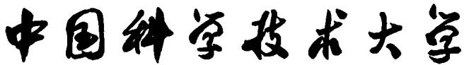

# 博士学位论文

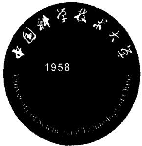

## 谐振腔与量子点耦合体系的研究

作者姓名： 张苗磊

学科专业： 光学

导师姓名： 郭国平教授

完成时间： 二〇一四年十月

万方数据

# University of Science and Technology of China A dissertation for doctor's degree

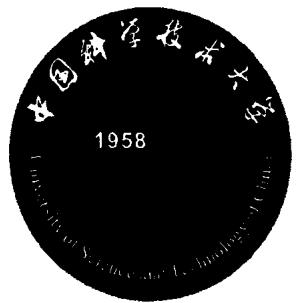

# The Study on Resonator and Quantum Dot Coupling System

Author : Miaolei Zhang

Speciality : Optics

Supervisor : Prof. Guoping Guo

Finished Time : October, 2014

## 中国科学技术大学学位论文原创性声明

本人声明所呈交的学位论文，是本人在导师指导下进行研究工作所取得的成果。除已特别加以标注和致谢的地方外，论文中不包含任何他人已经发表或撰写过的研究成果。与我一同工作的同志对本研究所做的贡献均已在论文中作了明确的说明。

作者签名：

张苗磊

签字日期：2014.11.4

## 中国科学技术大学学位论文授权使用声明

作为申请学位的条件之一，学位论文著作权拥有者授权中国科学技术大学拥有学位论文的部分使用权，即：学校有权按有关规定向国家有关部门或机构送交论文的复印件和电子版，允许论文被查阅和借阅，可以将学位论文编入《中国学位论文全文数据库》等有关数据库进行检索，可以采用影印、缩印或扫描等复制手段保存、汇编学位论文。本人提交的电子文档的内容和纸质论文的内容相一致。

保密的学位论文在解密后也遵守此规定。

公开 □保密年

作者签名：张苗磊

导师签名：新国平

签字日期：2014.11.4

签字日期：2014.11.4

万方数据

## 摘要

门控量子点是各种可能的量子计算实现中一个兼容性比较好的方案。谐振腔可提供一个单频的光子谐振环境，用作将两个相距较远的量子比特耦合起来，实现量子计算系统中量子比特数目的扩展。本文从这两点出发，以实现量子点和谐振腔耦合为目标，逐步研究了谐振腔的结构、设计和测量方法，谐振腔与二维电子气的耦合，谐振腔与量子点的相互作用等问题。本文主要包括以下内容：

1. 研究背景和基本概念。介绍了量子计算的基本知识。重点讨论了门控量子点结构的基本理论框架和实验现象，以及量子点中电荷量子比特编码。

2. 微纳加工工艺。介绍半导体量子点的加工工艺流程，低温平台的改建和基本的量子点测量方法。

3. 谐振腔基本知识。介绍了集总谐振电路和分布式谐振电路的理论以及量子化描述。仔细讨论了透射式谐振腔、反射式谐振腔和3D谐振腔等3种微波谐振腔的设计，加工和测量表征的方法。

4. 反射式谐振腔及其调谐。详细介绍了一个实际的反射式微波谐振腔，包括具体的样品结构和测量方法。研究了利用二维电子气调谐谐振腔的设计，可大范围地调节谐振腔的品质因子。

5. 谐振腔测量量子点复导纳。详细介绍了使用反射式微波谐振腔来测量孤立量子点的实验方法。通过谐振腔的反射频谱的振幅和相位的移动，可以测量出孤立量子点的电阻电容并估计出隧穿率。

6. 腔量子电动力学。介绍了基本概念，量子点与谐振腔耦合的理论分析，并结合具体的实验讨论了样品参数的提取过程。

本文的主要创新点有：

1. 设计并实现了一种半波长反射式微波谐振腔，这种结构具有易于加工，便干耦合多个系统的特点。研究发现了一种使用二维电子气调谐谐振腔的方法，可通过调整门电极电压大范围地控制谐振腔的品质因子。

2 利用高品质因子谐振腔实现了对近似孤立量子点的复导纳的测量，提供了一种灵敏探测孤立量子点的新方法。通过谐振腔反射谱振幅和相位变化的蜂窝状相图确定了双量子点的存在，并可从变化大小计算出量子点的隧穿率。

3. 模拟实现了3D谐振腔结构，并系统地讨论了在3D谐振腔中添加直流引线的可能性以及实际的影响。并通过实验测试了实际的效果。

4. 研究了谐振腔和量子点的电偶极子耦合结构。在弱色散极限区测量到了量子点的相图，并从中拟合出耦合参数。

关键词：门控量子点，反射式谐振腔，复电导，谐振腔调谐，3D谐振腔，偶极耦合

## ABSTRACT

In all possible implementation of quantum computing, gate-controlled quantum ot is a strong candidate that has better compatibility. Resonator, that provides single requency photons, could couple far apart qubits, realizing the extension of qubit numers in quantum computing systems. Starting from these two points, we study problems tep by step in order to realize quantum dots and cavity coupling, such as the design and neasurement of resonator, the coupling of two-dimensional electron gas and resonator, re interaction of quantum dots and resonator. The main content in this thesis has: 1. The research background and basic concept. Introduced the basic knowledge of quantum computing. Discussed the theory frame and experimental phenomena of gate-controlled quantum dot, and charge quantum dot qubit encoding. 2. Nano processing technology. Introduced the technology of the semiconductor quantum dot manufacture, low temperature platform and the basic measurement methods of quantum dots. 3. Basic knowledge of resonator. Introduced the theory of lumped and distributed resonant circuit, and its quantum description. Discussed the design, manufacture and characterization of the transmission resonator, the reflection resonator, and 3D resonator. 4. Reflection resonator and its tuning. Introduced a real experiment on reflection resonator, including specific sample structure and measuring method. Studied the tuning design of the resonator by two dimensional electron gas, which could adjust the quality factor in a large range. 5. Measurement of the complex admittance of quantum dot by resonator. Introduced the experimental method of using reflection resonator to measure isolated quantum dot. Through the amplitude and phase shift of the resonator reflection spectrum, the equivalent resistance and capacitance resistance and isolated quantum dot could be deduced and electron tunneling rate can be estimated. 6. Circuit-QED(quantum electrodynamics). Introduced the basic concepts, the theory analysis of the coupling of resonator and quantum dot. Discussed the parameter extraction process with the concrete experimental sample.

Following are the main innovations of this thesis:

1. Design and realize a new kind of half-wavelength reflection resonator, which is easy to manufacture, convenient for coupling multiple systems. Study a resonator tuning method by two-dimensional electron gas, which can adjust quality factor in a large range by controlling electrode voltage.

2. Use high quality factor resonator to realize the measurement of complex admittance of nearly isolated quantum dot, which provides a new method for sensitive detection of isolated quantum dot. Confirm the existence of double quantum dots by the honeycomb of the amplitude and phase shift of resonator reflection spectrum , and calculate electron tunneling rate.

3. Simulate and realize of 3D resonator structure. Systematically discussed the practical impact of adding dc leads to 3D resonator. Test the actual effect by the experimental data

4. Study the dipolar coupling of resonator and quantum dots. Get the quantum dots phase diagram in weak dispersive region and fit the coupling parameter.

Keywords: gate-controlled quantum dot, reflection resonator, complex admittance, resonator tuning, 3D resonator, dipolar coupling

## 目 录

摘要……Ⅰ  
ABSTRACT………………………………………………………  
目录………V  
第一章 研究背景介绍……1  
1.1 量子计算的基本概念………1  
1.11 基本结构………………………………………………………3  
1.1.2 单量子点的性质…4  
1.1.3 双量子点的性质8  
1.2 量子点中的电荷量子比特编码…………………………………………………10  
1.3 本文的结构… …12  
第二章 量子点的制备和基本性质表征…………15  
2.1 半导体量子点的制作工艺………………15  
2.2 低温测量平台………………………………………………………21  
2.3门控量子点的基本测量方法…………………………………………………………………26  
第三章 谐振腔的设计和制备……31  
3.1 谐振的一般理论……………………………………………………………………31  
3.1.1 集总振荡电路31  
3.1.2 传输线谐振电路33  
3.1.3 有载和无载Q…………………35  
3.1.4 量子化描述…35  
3.2 透射式共面波导传输线谐振腔…………………36  
3.2.1 设计模拟36  
3.2.2 制作加工…………………………41  
3.2.3 测量表征……………………………………………………42  
3.3反射式耦合线传输线谐振腔……………………………………………43  
3.3.1传输线实现……43  
3.3.2谐振腔分析…45  
3.3.3制作加工………………………47  
3.3.4 测量表征…… .47  
3.4 3D 谐振腔…………………………………………………………49  
3.4.1设计模拟49  
3.4.2 模拟52  
3.4.3 测量表征  
第四章 二维电子气对谐振腔调谐性质研究……………………………………57  
4.1 实验动机… …………………57  
4.2 样品结构和测量……………………………………………………57  
4.3 结果讨论………………………59  
4.4可调谐谐振腔…………………………………59  
4.5 本章小结…………63  
第五章 谐振腔测量量子点导纳性质……………65  
5.1 实验动机……………… …65  
5.2 样品结构和测量………65  
5.3 结果分析………………………68  
5.4 本章小节……………………………………69  
第六章 谐振腔与量子点的耦合……71  
6.1 腔电动力学的基本理论……71  
6.1.1 光与原子的相互作用71  
6.1.2 量子点与腔的耦合75  
6.2 实验样品结构…………………………………………………77  
6.3 结果分析………………………………………80  
6.4 本章小结……………………81  
参考文献…………83  
附录A 微纳加工工艺……85  
A.1 基片清洁……………………85  
A.2 光刻工艺………………85  
A3 刻蚀工艺…………………………86  
A.4 电子束曝光工艺………………………………………………………………………86  
A5 退火……………………………………………………………88  
致谢……  
在读期间发表的学术论文与取得的研究成果………………………………91

## 第一章 研究背景介绍

## 1.1 量子计算的基本概念

可控核聚变技术，高温超导技术和量子信息技术是现代物理学应用和研究中的“三座大山”。量子信息技术主要包括量子通讯和量子计算两个方面。在本文中，我们将关注的焦点放在量子计算上。

量子计算研究最早的起源是为了解决经典计算中的能耗问题。Bennett研究发现，在经典计算中，由于逻辑操作的不可逆性，计算过程中必然产生能量消耗。Bennett证明了所有经典不可逆的计算机都可以改造为可逆计算机，而不影响其计算能力[1]。可逆计算意味着所有操作为幺正变化，所有行为都可以用量子力学语言表述出来。但这种量子可逆计算机并没有用到量子叠加性和相干性等量子力学区别于经典力学的本质特性。1995年，Shor提出了可在多项式时间内完成大数质因子分解的量子算法，其核心是应用了量子快速傅立叶变换[2]。这个算法利用了量子叠加来实现并行性，展现出量子计算超越经典计算的强大潜力，直接推动量子计算成为科研前沿和战略目标。1996年，Grover提出了另一个实用的量子计算算法：可实现平方加速的量子搜索算法[3]。

有了量子计算数学架构的伟大成功，人们开始研究如何在真实的物理体系中实现量子计算。2000年，IBM科学家Divincenzo提出了在真实物理体系中实现量子计算所必须满足的五个基本要求[4]：

1. 具有可控的量子比特，并且具有可扩展性。首先要能够实现量子比特，能将真实体系的物理参数编码到逻辑上的0和1量子比特。其次，多比特的量子计算才能和经典计算相比体现出优越性，因此物理上实现的量子比特数目要有一定的规模性，量子比特之间能互相分辨，即系统可扩展。

2. 能够将量子比特制备到初态。在进行量子计算之前，所有量子比特都需要初始化到我们已知的简单状态。如果需要量子纠错，则体系在计算过程中能够提供这种已知状态的空白比特。

3. 能够在较长的时间内保持量子相干性。量子体系与环境的耦合必然会造成量子相干性的丧失，因此体系需要有比较长的退相干时间，使得量子运算操作和测量得以完成。

4. 能够实现普适的量子逻辑门操作。任意的量子幺正操作都可以通过一组普适量子逻辑门来完成，因此实现了普适逻辑门原则上就可以完成任意的量子计算。

5. 能够进行量子逻辑门测量。即量子体系的末态能够被测量读出。

当然没有一个真实的物理体系能够完美的实现五条Divincenzo判据，因此科学界在多种可能的物理体系中进行了探索研究。其中比较典型的有：

1. 线性光学方案[5,6]。利用光子的极化态作为量子比特编码。优势在于绝大多数操作都可在室温下完成，光子与环境相互作用弱，相于性非常好等。

2. 离子井方案 [7,8]。

3. 核磁共振方案 [9]。

4. NV色芯方案。这是一种利用自旋编码的方案。在金刚石晶体中掺入氮原子，氮空位上就会有多余的电子就会表现出自旋。NV色芯实现单个量子比特的效果非常好，因为其周围的自旋背景干扰非常小，所以消相干时间非常长，被认为是一种非常有潜力的量子计算体系。NV色芯的自旋可以通过激光和微波实现操作和测量。多个NV色芯之间的纠缠实现也在进一步研究之中。

5. 超导约瑟夫森结方案[10-12]。超导约瑟夫森结是由“超导体-绝缘体-超导体”组成的“三明治”结构，超导电子岛通过约瑟夫森结与外界相连，就构成了 Copper-pair box。约瑟夫森结两侧超导体的相位差与超导电子岛中额外的 Copper-pair 数相共轭，使其构成了一个良好的量子系统。随着超导约瑟夫森结充电能和耦合能的不同，可将量子比特编码在不同的物理量上，分别是电荷量子比特，磁通量子比特和相位量子比特。单个量子比特操作通过微波脉冲来实现，量子比特之间通过直接的电容耦合或微波谐振腔相互作用，就可实现两比特逻辑操作。随着 transmon 这一创造性结构的提出和腔量子电动力学的发展，超导量子比特的退相干时间得到很大的提升，各种复杂的量子操作也得以实现，如Telepotation操作等。这是目前发展较完善的固态量子计算体系。

6. 量子点方案。量子点是指人工制造的电子孤岛结构。由于电子在三维空间上的运动受到限制，量子点内部形成了分立的能级结构，体现出量子特性。量子比特通常编码在电荷或电子自旋上。另一种方案是采用电子自旋来编码。单个量子点的操作可通过微波脉冲来实现，多个量子点之间的也可通过直接电容或微波谐振腔来耦合。目前的实验瓶颈主要在于量子点与环境耦合较强，退相干时间短，很难实现复杂的量子操作。

本人研究生期间的工作主要集中在门控型量子点上展开的，因此下面着重讨论一下量子点体系的一些基本结构和研究方法。

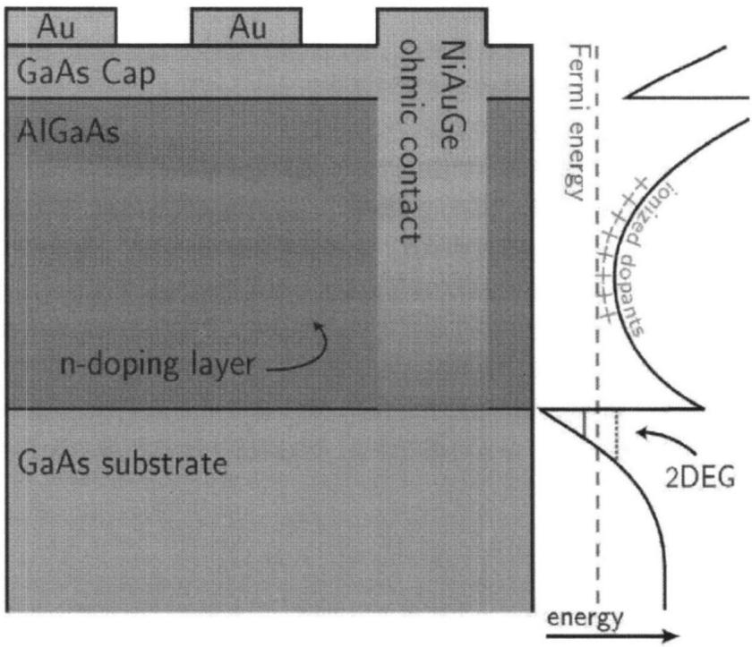  
图 1.1 GaAs 半导体异质结能带和二维电子气(2DEG) 示意图 [13]

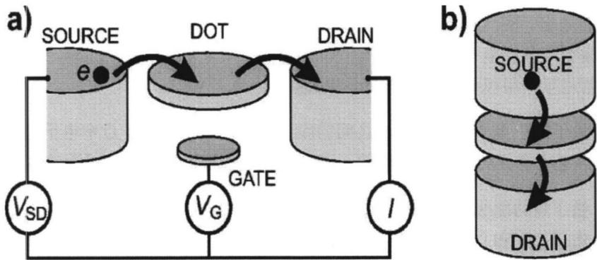  
图 1.2 (a) 横向量子点 (b) 纵向量子点 [15]

## 1.1.1 基本结构

半导体异质结中存有二维电子气层。以 $\mathsf { G a } \mathsf { A } s / \mathsf { A l } _ { \mathsf { x } } \mathsf { G a } _ { 1 - \mathsf { x } } \mathsf { A } s$ 为例，如图1.1所示。GaAs导带和价带之间的能量差为1.42eV， $\lambda \lambda _ { x } G a _ { 1 - x } A s$ 导带和价带之间的能量差为1.79eV(x=0.3时)，因此在两种材料的交界面出会出现能量不匹配的现象，造成能级扭曲。此时若材料中由于注入离子而产生多余的电子，则自由电子就会聚集在异质结结合处形成的势阱中。这层电子只能在平行于交界面的平面内自由移动，而不能穿过势阱沿垂直方向移动，故称为二维电子气[14]。如果将二维电子气层中自由移动的电子通过某种结构在空间上束缚到很小的范围内，就可以形成量子点。这种阻碍电子移动的结构被称为隧穿势垒，约束在量子点中的电子通过量子隧穿效应可穿过隧穿势垒进入或跳出外界电子库，电子进出的电子库分别称作源极和漏极。从电子隧穿的方向上分，量子点可大致分为纵向结构和横向结构两种，如图1.2所示。纵向量子点是指材料生长时在二维电子气层上下两侧用绝缘层隔开形成势垒，再将刻蚀成孤岛结构，就可以在三个方向上约束电子的运动形成量子点。这样源极和漏极分别在二维电子气上下两侧，电子需要纵向穿过绝缘层才能形成电流，故称为纵向量子点[16]。另一种结构是在二维电子气层上方制作表面电极，通过施加负电压局域地将电极下方的二维电子气排空，形成隧穿势垒。由于此时源极、漏极和量子点都在同一层二维电子气中，所以称为横向量子点[17]。由于横向量子点在加工制备和测量上都简单于纵向量子点，并且可调节性强，因此我们都是选用横向量子点作为研究工作对象。

## 1.1.2 单量子点的性质

通常量子点结构中还有一个或多个门电极，门电极通过电容耦合的方式作用于量子点中电子能级。改变门电极电压，量子点中电子的能级会随之抬高或降低。当电子能级高于（或低于）源/漏电极中的静电势时，就会发生电子跳出（或跳进）量子点的隧穿现象。因此可以通过调节门电极电压可以控制量子点中电子的进出。更一般地，可以将量子点看作是一个充放电子的孤岛，用常相互作用模型来分析电子的行为[18]。

常相互作用模型主要基于两个基本假设：

1. 量子点中电子与各个电极之间的库伦相互作用以及量子点中电子之间的库伦相互作用都是电容性质的，而且所有电容都可以简单地视为常数。

2. 量子点的能级为量子点中量子化能和它与源、漏、门电极之间的库伦相互作用能之和。它不受电子间相互作用的影响，即能级不随电子数量的变化而变化。

考虑最简单的单量子点的情况，量子点对外界总的电容C可以表示成量子点与源电极、漏电极和门电极之间的电容 $\complement _ { s } , \complement _ { \mathbf { d } }$ 与 $\complement _ { 9 }$ 之和：

$$
\mathsf C _ { \Sigma } = \mathsf C _ { s } + \mathsf C _ { \mathbf d } + \mathsf C _ { \mathbf g }\tag{1.1}
$$

当源电极电压为 $v _ { s }$ ，漏电极电压为 $\mathsf { v } _ { \mathsf { d } }$ ，门电极电压为 $\boldsymbol { \cdot } \boldsymbol { v } _ { \mathfrak { g } }$ 时，量子点上诱导出来的感应电荷为 $\mathsf { Q } = \mathsf { C } _ { s } \mathsf { V } _ { s } + \mathsf { C } _ { d } \mathsf { V } _ { d } + \mathsf { C } _ { g } \mathsf { V } _ { \mathsf { g } }$ 。因此对有N个电子的量子点体系，其总能量可以表示成为：

$$
\mathsf { U } ( \mathsf { N } ) = \frac { 1 } { 2 C _ { \Sigma } } [ - | e | \left( \mathsf { N } - \mathsf { N } _ { 0 } \right) + C _ { s } \mathsf { V } _ { s } + \mathsf { C } _ { \mathsf { d } } \mathsf { V } _ { \mathsf { d } } + C _ { g } \mathsf { V } _ { g } ] ^ { 2 } + \sum _ { \mathfrak { n } = 1 } ^ { \mathsf { N } } \mathsf { E } _ { \mathfrak { n } } ( \mathsf { B } )\tag{1.2}
$$

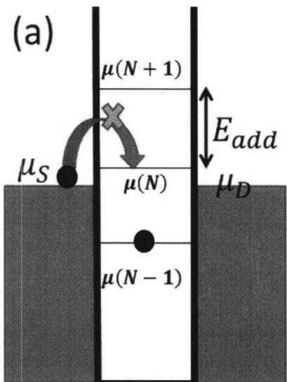

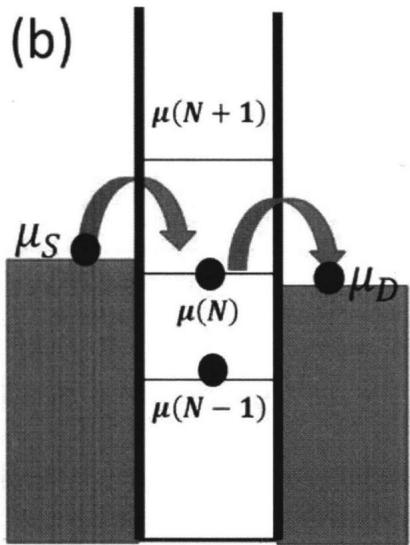  
图 1.3 (a) 库伦阻塞的情况(b) 有电流的情况

其中 $\mathsf { N } _ { 0 }$ 是门电极电压为零时量子点内的电子数目， $\mathtt { E } _ { \mathfrak { n } }$ 为第n个电子的单电子能级，它由束缚势阱的性质所决定，B表示单电子能级还和外加磁场有关。

为了更好的描述量子点的输运性质，通常引入电化学势的概念。量子点的电化学势定义为在量子点中加入第N个电子时所需要的最小能量，它可以看作是量子点中的能级：

$$
\begin{array} { l } { { \displaystyle { \bf { \boldsymbol { \mu } } } ( { \bf N } ) = { \bf { \boldsymbol { \mu } } } ( { \bf N } ) - { \bf { \boldsymbol { \mu } } } ( { \bf N } - { \bf { \boldsymbol { \mu } } } ) } \ ~ } \\ { { \displaystyle ~ = ( { \bf N } - { \bf { \boldsymbol { \mu } } } _ { 0 } - \frac { 1 } { 2 } ) { \mathbb E } _ { { \bf { c } } } - \frac { { \mathbb E } _ { { \bf c } } } { e } ( { \mathbb C } _ { s } { \bf V } _ { s } + { \mathbb C } _ { \bf d } { \bf V } _ { \bf d } + { \mathbb C } _ { 9 } { \bf V } _ { 9 } ) + { \mathbb E } _ { \bf N } } } \end{array}\tag{1.3}
$$

从上式可以看到，电化学势直接受到门电极电压的影响，通过调节门电压可以改变量子点中的能级结构。相邻两个能级的能量差被称为增加能：

$$
\mathsf { E } _ { \mathsf { a d d } } = \mathsf { \mu ( N ) } - \mathsf { \mu ( N - 1 ) } = \mathsf { E } _ { \mathsf { c } } + \Delta \mathsf { E } ( \mathsf { N } )\tag{1.4}
$$

上式由两项组成，一项是量子点内单电子能级的能量差 $\Delta \mathsf { E } ( \mathsf { N } ) = \mathsf { E } _ { \mathsf { N } } - \mathsf { E } _ { \mathsf { N } - 1 }$ 与电子具体的量子态形式有关。另一项为量子点上单电子电荷能 $\mathsf E _ { \mathsf C } = { \mathsf e } ^ { 2 } / { \mathsf C } _ { \Sigma }$ 是由经典的库伦相互作用所引起的，称之为量子点的充电能。通常量子点的尺寸非常小，因此C也特别小，充电能很大（约为几个到十几个meV)，远远大于量子点本身的单电子能级能量差。因此量子点能级差主要由充电能所决定，可以近似认为是等间隔的，不依赖与电子数目和电极电压。

在了解量子点内电子的能级分布后，我们进一步讨论电子的隧穿输运过程。量子点能级示意图如图1.3所示。左右两边分别是源漏电极，电子在其中按费米分布填充，费米能级分别为 $\mu _ { s }$ 和 $\mu _ { \mathsf { d } }$ 。中间分立的竖线表示量子点能级，两两间隔为 $\mathtt { E _ { a d d } }$ 。在其两侧的竖线表示量子点与源漏之间的势垒，电子可以通过量子隧穿效应穿过势垒进入源漏中形成电流。我们通常考虑两种不同的输运条件：

(a)  
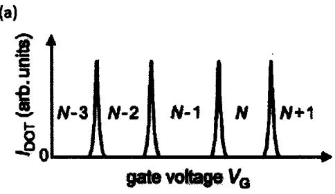

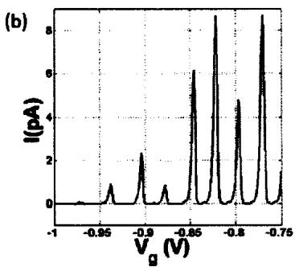  
图 1.4 库伦振荡 (a) 理论 (b) 实验

## 1. 量子点源漏的直流偏压很小或为零

此时源漏费米能级差 $\mu _ { s } - \mu _ { d } \approx 0$ ，左右费米面在同一条直线上。显然，所有量子点内能量低于费米面的能级都已经被电子填充，源漏电子不能隧穿到其上形成电流；所有能量高于费米面的能级虽然未被填充，但由于能量差的原因亦不能形成隧穿电流，量子点处于阻塞状态，称为库伦阻塞。库伦阻塞必须在低温环境下才能观察到，这是因为温度会造成费米分布的展宽，若源漏电极电子的费米展宽与量子点能级间隔相当，则电子还是有一定几率隧穿过量子点形成电流的。因此量子点工作时要求电子温度足够低，对应热涨落要远小于量子点充电能：

$$
{ \sf k T } _ { e } \ll { \sf E } _ { C } = e ^ { 2 } / { \sf C }\tag{1.5}
$$

另一方面，假设此时的等效电阻为R，则电子隧穿过量子点所需时间为 $\mathbf { t } \sim \mathbf { R } \mathbf { C }$ 对应能量的不确定度为 $\mathsf { E } \sim \mathsf { h } / \mathsf { t } \sim \mathsf { h } / \mathsf { R C }$ ，这个能量也要求远小于量子点充电能$h / R C < < e ^ { 2 } / C$ ，因此量子点的隧穿电阻应远大于标准电阻

$$
R > > R _ { 0 } = { \ h } / { e ^ { 2 } }\tag{1.6}
$$

通过改变控制门电极电压，我们可以线性的影响量子点内的能级位置，使其上下移动。当量子点的第N个能级恰好与源漏费米面平齐时，源电极上的电子隧穿进入第N个能级，再由第N个能级隧穿进入漏电极，形成单电子隧穿电流。由于量子点能级是近似等间隔的，所以不断地改变电压，我们就可在电压等间隔的位置上观察到一个个电流信号，这种周期性的电流信号被称为库伦振荡[18]。如图1.4所示。

2. 量子点源漏存在明显偏压。如图1.3所示，这种情况相当于在源漏电极费米面形成了一个偏压窗口，只要量子点的能级落入这个窗口中，就可以形成电流。因此通过控制门电极电压移动量子点能级和改变源漏偏压增大窗口，我们都可以观察到电流。将二者关系在同一张图上画出来，就得到了如图1.5所示的库伦菱形图。

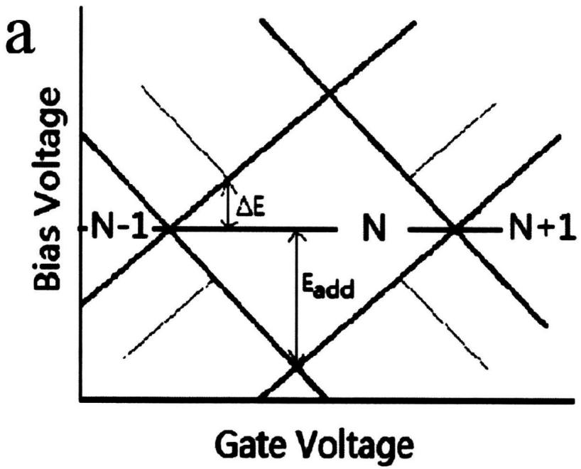

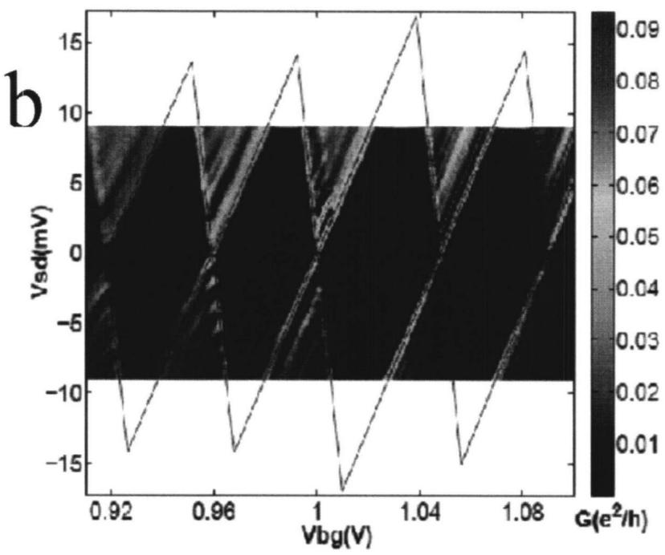  
图 1.5 库伦菱形(a) 理论 (b) 实验 [19]

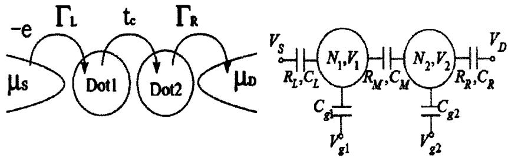  
图1.6 双量子点常相互作用示意图

## 1.1.3 双量子点的性质

双量子点的性质也可以用常相互作用模型来描述[20-24]。如图1.6所示，串联双量子点中每个量子点通过图示电容分别与门电极，源漏电极以及量子点之间相互作用。电路平衡条件为：

$$
\left( \begin{array} { c c } { { \mathrm { Q } _ { 1 } + \mathrm { C } _ { \mathrm { L } } \mathrm { V } _ { \mathrm { L } } + \mathrm { C } _ { { \mathrm { g } 1 } } \mathrm { V } _ { { \mathrm { g } 1 } } } } \\ { { \mathrm { Q } _ { 2 } + \mathrm { C } _ { \mathrm { R } } \mathrm { V } _ { \mathrm { R } } + \mathrm { C } _ { { \mathrm { g } 2 } } \mathrm { V } _ { { \mathrm { g } 2 } } } } \end{array} \right) = \left( \begin{array} { c c } { { \mathrm { C } _ { 1 } } } & { { - \mathrm { C } _ { \mathrm { m } } } } \\ { { - \mathrm { C } _ { \mathrm { m } } } } & { { \mathrm { C } _ { 2 } } } \end{array} \right) \left( \begin{array} { c c } { { \mathrm { V } _ { 1 } } } \\ { { \mathrm { V } _ { 2 } } } \end{array} \right)\tag{1.7}
$$

体系的总能量为：

$$
\mathsf { E } = \frac { 1 } { 2 } \sum _ { \mathrm { i } = 1 , 2 } \mathsf { V } _ { \mathrm { i } } \mathsf { Q } _ { \mathrm { i } }\tag{1.8}
$$

使用前面单量子点讨论中类似的方法，可以定义两个量子点的电化学势分别为：

$$
\begin{array} { r l } & { \mathfrak { u } _ { 1 } ( { \mathsf { N } } _ { 1 } , { \mathsf { N } } _ { 2 } ) = ( \mathsf { N } _ { 1 } - \frac { 1 } { 2 } ) \mathsf { E } _ { \mathsf { C } _ { 1 } } + \mathsf { N } _ { 2 } \mathsf { E } _ { \mathsf { C } _ { \mathsf { m } } } - \frac { 1 } { | e | } ( \mathsf { C } _ { 9 1 } \mathsf { V } _ { 9 1 } \mathsf { E } _ { \mathsf { C } _ { 1 } } + \mathsf { C } _ { 9 2 } \mathsf { V } _ { 9 2 } \mathsf { E } _ { \mathsf { C } _ { \mathsf { m } } } ) } \\ & { \mathfrak { u } _ { 2 } ( { \mathsf { N } } _ { 1 } , { \mathsf { N } } _ { 2 } ) = ( \mathsf { N } _ { 2 } - \frac { 1 } { 2 } ) \mathsf { E } _ { \mathsf { C } _ { 2 } } + \mathsf { N } _ { 1 } \mathsf { E } _ { \mathsf { C } _ { \mathsf { m } } } - \frac { 1 } { | e | } ( \mathsf { C } _ { 9 2 } \mathsf { V } _ { 9 2 } \mathsf { E } _ { \mathsf { C } _ { 2 } } + \mathsf { C } _ { 9 1 } \mathsf { V } _ { 9 1 } \mathsf { E } _ { \mathsf { C } _ { \mathsf { m } } } ) } \end{array}\tag{1.9}
$$

其中：

$$
\mathsf { E } _ { \mathsf { C } _ { 1 } } = e ^ { 2 } \frac { \mathsf { C } _ { 2 } } { \mathsf { C } _ { 1 } \mathsf { C } _ { 2 } - \mathsf { C } _ { \mathsf { m } } ^ { 2 } } , \mathsf { E } _ { \mathsf { C } _ { 2 } } = e ^ { 2 } \frac { \mathsf { C } _ { 1 } } { \mathsf { C } _ { 1 } \mathsf { C } _ { 2 } - \mathsf { C } _ { \mathsf { m } } ^ { 2 } } , \mathsf { E } _ { \mathsf { C } _ { \mathsf { m } } } = e ^ { 2 } \frac { \mathsf { C } _ { \mathsf { m } } } { \mathsf { C } _ { 1 } \mathsf { C } _ { 2 } - \mathsf { C } _ { \mathsf { m } } ^ { 2 } }\tag{1.10}
$$

由式1.9可以画出双量子点耦合系统的相图，如图1.7所示，量子点源漏偏压为零，红线表示电子数目改变1时电化学势不变的电压值。这张相图有3种典型的情况：

1. $\mathbb { C } _ { \mathfrak { m } } \sim 0 .$ ，此时两个量子点之间耦合很弱，改变左边门电极电压，基本上只是左边量子点的电化学势发生移动，电子一个个被排除，观察到库伦峰。同样右边门电极电压只影响右边的量子点。因此我们在相图上看到横平竖直两套相互独立的库伦峰，相互相交几乎成直角，如图1.7(a)所示。

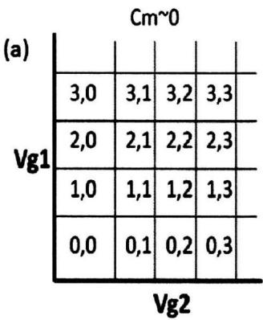

(b)  
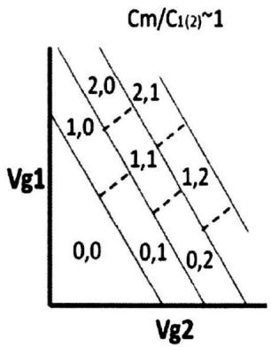

(c)  
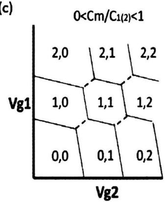

(d)  
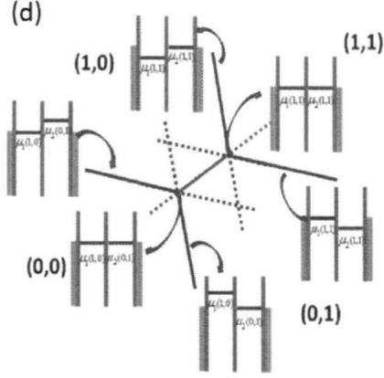  
图 1.7 双量子点蜂窝相图 (a) 弱耦合 (b) 强耦合(c) 中等耦合(d) 量子点能级分布的变化

2. $C _ { \mathfrak { m } } / C _ { 1 ( 2 ) } \sim 1$ 。此时两个量子点之间的耦合非常强，几乎可以把他们整体看作是一个量子点。改变左右门电极电压，都会等比例地影响到两个量子点。因此在相图1.7(b)上，我们只能看到一套倾斜的库伦峰，倾斜的角度由两个门电极的 lever arm 所决定。

3. $0 < \mathsf C _ { \mathsf m } / \mathsf C _ { 1 ( 2 ) } < 1$ 。此时处于两种极限情况之间。单独一个门电极电压会对左右两点电化学势产生不同的影响，可以使电子一个个排除量子点，或在左右两量子点之间隧穿。因此在相图上，每种电子数目不变的区域呈六边形，每边分别代表左/右量子点电子数目加/减1，以及两点之间电子数目差加/减1。如图1.7(c)所示。整个相图呈现出蜂窝状的形状，这就是双量子点典型的相图图样。

更进一步，通过相图中平行线中的间距，我们还可以提取出系统电容参数，如图1.8所示。由式1.9可以解得：

$$
\Delta V _ { g 1 } = \frac { | e | } { \mathsf { C } _ { 9 1 } } , \Delta V _ { g 2 } = \frac { | e | } { \mathsf { C } _ { 9 2 } }\tag{1.11}
$$

$$
\Delta V _ { g 1 } ^ { \mathrm { m } } = \frac { | e | C _ { \mathrm { m } } } { C _ { g 1 } C _ { 2 } } = \Delta V _ { g 1 } \frac { C _ { \mathrm { m } } } { C _ { 2 } } , \Delta V _ { g 2 } ^ { \mathrm { m } } = \frac { | e | C _ { \mathrm { m } } } { C _ { g 2 } C _ { 1 } } = \Delta V _ { g 2 } \frac { C _ { \mathrm { m } } } { C _ { 1 } }\tag{1.12}
$$

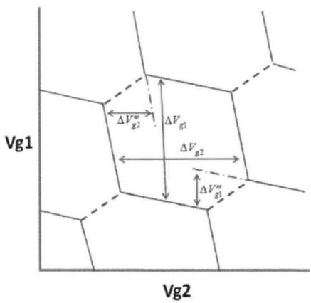

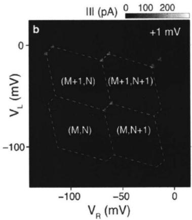  
图1.8 可从双量子点蜂窝相图中提取电容参数[25]

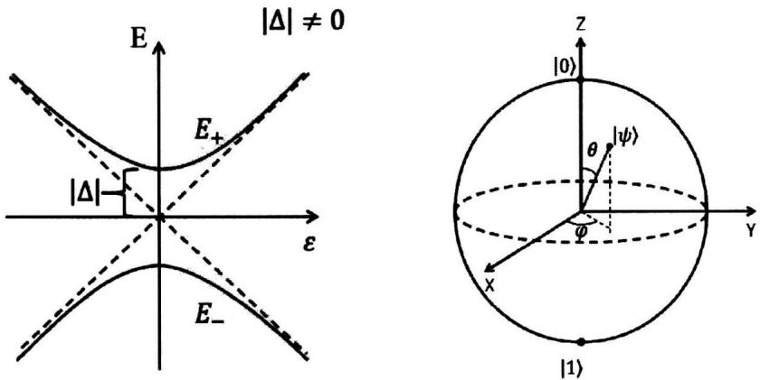  
图 1.9 二能级结构和 Bloch 波矢 [13]

## 1.2 量子点中的电荷量子比特编码

下面参照Divincenzo判据，讨论量子点中使用电子电荷作为量子比特编码方案。

1. 量子比特实现。处于能量的考虑，通常采用双量子点作为一个电荷量子比特。当量子点中的电子被排空到仅剩一个时，电子在左点和在右点就可以定义两个不同的态。若双量子点之间存在耦合，则整个双量子点可以用以下的哈密顿量描述：

$$
\mathsf { H } = \frac { 1 } { 2 } \varepsilon \sigma _ { z } + \Delta \sigma _ { \mathsf { x } }\tag{1.13}
$$

很自然地，可以将量子比特的0和1编码到由上式所定义的二能级体系的两个本征态上，也可以用Bloch波矢来表示，如图1.9所示。

2. 量子比特操作。单比特量子操作主要是实现量子非操作，这可以通过Rabi振荡来实现[26,27]。如图1.10所示。在量子点的表面电极上加上一个能量匹配的高频脉冲，就可以使电子在bloch球上以x轴为轴线发生旋转。选择合适的旋转时间，使其相位恰好增加π，就可以实现量子非操作。这方面的实验工作已由Petta等人完成。两比特量子操作的关键是实现控制非门[28]，目前基于电荷量子比特编码的实验工作还没有完成，我们小组正在积极开展这方面的研究。

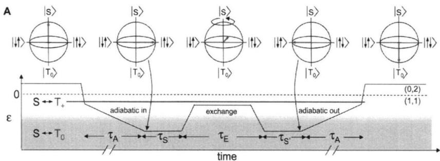  
图 1.10 Rabi 振荡中 Bloch 波矢的演化 [26]

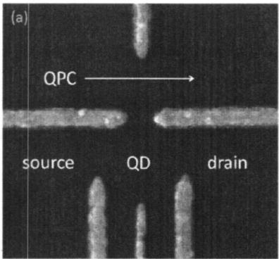

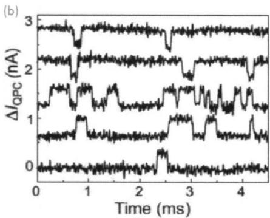  
图 1.11 (a)QPC 结构 (b) 使用 QPC 测得的量子点中电子隧穿信号 [15]

3. 量子比特测量。由于电荷量子比特的状态直接与电荷的分布情况有关，所以测量电荷量子比特是相对简单的。通常会采用QPC结构[29,30]，即在量子点附近形成一个很窄的电流通道。由于库伦相互作用，量子点中的电子会对QPC 中的电子产生排斥作用。量子点中电子多时 QPC电流小，电子少时QPC 电流大。因此通过测量QPC中电流的大小就可以推测出量子点中的电荷分布，进而得到电荷量子比特的状态[31]。

4. 退相干时间。退相干一直是量子点量子计算系统中非常严重的问题。对电荷量子比特编码来说，GaAs半导体上的退相干时间在百皮秒量级，远远达不到实现复杂量子操作的要求。对此，采用自旋量子比特编码可能是比较好的解决方案，目前在GeSi量子点上的自旋量子比特相干时间已经达到了几十微妙量级。使用Echo技术可以延长量子比特的退相干时间[26]，如图1.12所示。假设原本处在0态的 qubit 受到外界影响，沿x轴发生偏转。

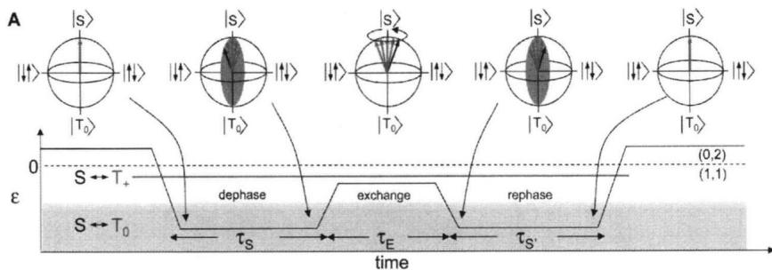  
图 1.12 Echo 技术中 Bloch 波矢的演化 [26]

这时我们迅速地将 qubit沿z轴旋转 π角度，则 qubit 受到外界影响继续发生偏转，但方向已于原来相反，在经过相同时间后又会重新回到0态。

5. 比特数目扩展。这也是量子点量子计算系统中比较受关注的问题。传统的方案是将临近的量子比特两两之间靠电容耦合起来。但这向多比特系统推广是有困难的。例如，电极的几何排列会变得非常复杂，处于中间位置的量子点很可能没有相应的OPC探测结构，两比特之间的门操作保真度会受到其他量子比特状态的影响[32]等。另一种可能的办法是仿照超导约瑟夫森结量子计算体系中借助微波谐振腔来实现量子比特之间的信息交换[33-39]。固态微波谐振腔可以将相隔距离较远的量子点耦合起来，每个量子点又可以保留原有的结构设计，是非常有希望的解决方案。这也是本文研究的出发点。

## 1.3 本文的结构

1. 研究背景介绍，包括量子计算的基本概念和各种可能的实现体系。重点介绍了门控量子点结构的基本理论框架。

2. 微纳加工工艺介绍，包括了半导体量子点的加工工艺流程。低温平台和测量方法介绍。

3. 谐振腔的基本知识，包括电路理论、测量理论和量子化描述。并且仔细讨论了3种不同形式的微波谐振腔的设计，加工和测量表征的方法。

4.详细介绍了一个透射式谐振腔的样品结构和测量实验，并研究了利用二维电子气调谐谐振腔的结构。通过这样的设计，我们能够控制谐振腔的能量泄漏率，大范围地调节谐振腔的品质因子。

5. 详细介绍了一个利用谐振腔测量量子点复电导的实验。得益于高0值谐振腔，我们能够通过谐振腔的反射频谱的移动来测量孤立量子点的电阻电容并估计出隧穿率。这样的结构提供了一种新的灵敏测量孤立量子点的手段。

6. 介绍了腔量子电动力学的基本概念，并结合具体的实验讨论了样品参数的提取过程。

# 此页不缺内容

万方数据

## 第二章 量子点的制备和基本性质表征

在本章中，我们将介绍微纳米加工工艺的一些基础知识，讨论门控量子点的制作工艺，以及基本的低温测量技术。

## 2.1 半导体量子点的制作工艺

量子现象通常在很小的尺度上才能体现出来。因此对于固态量子体系，微纳加工技术是制备样品的必须手段。实际上，随着科研条件技术的进步和实验仪器制作的发展，微纳加工技术已经成为固态体系研究中的标准技术，一流的物理研究单位都会配备微纳加工实验室。另一方面，我们实验中所使用的微纳加工技术和现在工业上使用的半导体加工工艺是完全兼容的。如果基于半导体量子点实现的量子计算方案能够发展成为主流的量子计算体系，那么现代半导体产业几乎不需要做大的改变就可以将其工业化生产，这是非常吸引人的。

在我们的样品制备过程中，主要用到的仪器设备包括紫外曝光机，电子束曝光机和蒸发镀膜设备等。下面我们将简要介绍这些设备的原理和使用。

紫外光学曝光机 紫外光学曝光与照相技术类似，利用了光刻胶对特定波长的紫外光线照射的敏感性。当紫外光透过设计好图形的掩模板照射到光刻胶后，照到光的部分和未照到光的部分性质变得不同。在显影步骤时，可以选择性地去除曝光或未曝光的部分后，于是就将掩模板上的图形结构转移为光刻胶的图形结构。

根据曝光部分和保留部分的不同，光刻胶的使用可以分为正胶和反胶两种，分别如图2.1所示。一般定义正胶为曝光部分被显影液洗掉，未曝光部分得以保留；反胶定义为未曝光部分被洗掉，曝光部分得以保留。正胶和反胶的效用没有本质区别，但在实际实验中，我们一般希望光刻掩模板大部分是透光的，这样便于在光镜下找到样品和对准光刻标记。但最终希望的到的光刻机图形不一定与掩模板阴影部分一致，因此需要配合光刻掩膜的设计来选择正胶或反胶工艺。由于光学曝光技术原理简单，操作方便，便于批量生产，所以我们在精度允许的范围内，总是优先使用光学曝光技术。我们实验室中使用的紫外光学曝光机型号为MJB3，如图2.2所示，实际可控的精度可以达到5微米。

成功的光学曝光需要注意以下几点：

1. 曝光参数的选择，包括甩胶转速和时间、烤胶时间、曝光时间和显影时间等。这些参数随着实验环境和仪器状态的不同而不同，合适的参数是经过大量试验总结积累得到的，需要非常细致的工作.

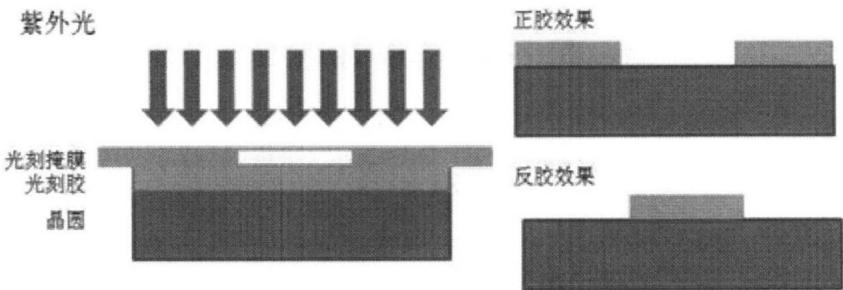  
图2.1 光学曝光正反胶示意图

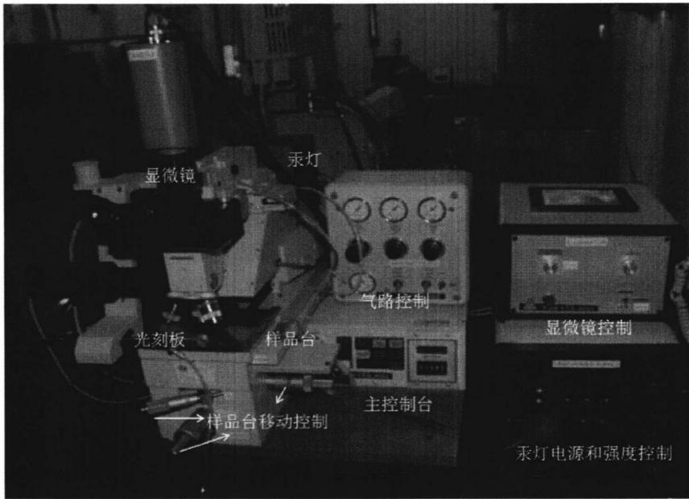  
图 2.2 紫外光学曝光平台

2. 掩模板的设计。光学曝光工艺比较流程化，关键的技术就在掩模板设计上。由于衍射效应，曝光后的得到的图形不是和掩模板上设计的图形完全一致的，尤其是在线宽比较细边缘区域，畸变较为严重。如果特别在意曝光后图形的形状，应在设计掩模板时予以补偿。另外，通常需要多次光学曝光才能完成样品的制作，两次曝光之间需要对齐位置，因此在设计相关掩模板时要留有对准标记和最外围的边线标记，以方便样品加工。

电子束曝光机 电子束曝光可以看作是光学曝光的提升。受到衍射极限的限制，光学曝光的精度只能与光的波长相当。即使使用波长较短的紫外光，一般实验室中使用的光学曝光机的精度仅为百纳米量级，在此长度之下的加工就要用到电子束曝光。通过高压电场，可以将电子加速到很高的能量，相应的德布罗意波长很短，因此就能达到更高的精度。

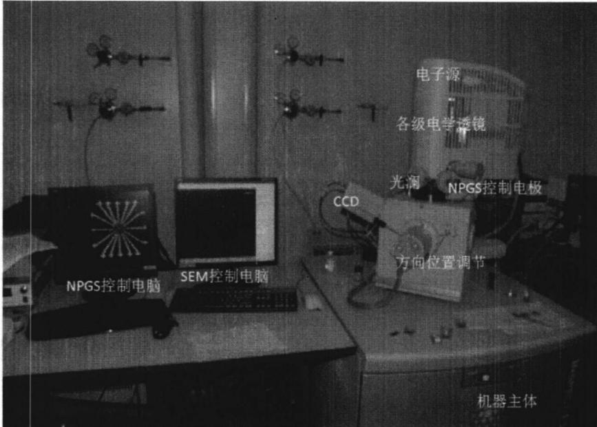  
图 2.3 电子束曝光平台

我们实验中使用的电子束曝光设备为一台美国FEI公司的 SEM（扫描电子显微镜）加上 Nanometer Pattern Generation System（NPGS）控制插件得到的简易系统。SEM 最高加速电压为 30kV，5 档光圈，7 档 spot size 可选。如图2.3所示与光学曝光类似，电子束曝光是利用了电子束曝光胶（如PMMA）对与电子照射的敏感性。PMMA受到电子照射后，分子链结构会发生变化，变得和未照射部分不同。在显影步骤时，将曝光部分溶解掉，就可以在PMMA胶层上制作出想要的图形。但与光学曝光不同，曝光结构不是由掩模板决定的，而是由电子束扫描路径决定的。在我们的仪器中，这项工作是由NPGS模块完成的。NPGS主要系统是一块数模转换卡，用于控制SEM中电子束的偏转，和一套控制软件，用于配置各种曝光参数。曝光图形的设计工作主要在装有NPGS插件的 DesignCAD 中完成。

与光学曝光相比，电子束曝光的操作较为复杂，注意事项多，且每个样品都需要单独加工，制作时间长。但电子束曝光的图形结构是直接在DesignCAD中设计的，更改很方便。通常可以用光学曝光技术批量制作好外围的电极结构，每次再根据实验目标和结构调整内部电子束曝光的设计图案。

成功的电子束曝光需要注意以下几点：

1. 曝光参数的选择，包括加速电压、光阑大小、spot size、曝光剂量、显影时间等。这些参数都是经过大量试验总结积累得到的，是非常细致的工作。受电子散射的影响，对于精细图形结构曝光剂量还会有差异，具体制作时还需进一步测试

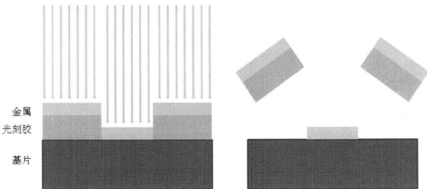  
图 2.4 镀膜和 lift off 示意图

2. 曝光图形的设计。电子束在偏移中难免会出现误差，因此在曝光时，最好让电子束从内到外，沿一个方向逐渐扫描，避免大范围的移动。在NPGS中，电子束移动的顺序是由设计图形的层次和顺序决定的。因此在DesignCAD软件中画好图形后，一定要一一检查每块图形的曝光方向和曝光顺序并模拟曝光，看是否和设想一致。

蒸发镀膜 前面的步骤只是将我们想要的图形结构制作到了光刻胶/电子束曝光胶层上，要将结构制作到样品表面，还需要经过金属蒸镀环节。在带图案的光刻胶上均匀蒸镀一层金属，光刻胶空隙处的金属就会直接吸附在样品表面。再经过溶胶环节，光刻胶和其上的金属会一起被剥离，最终附着在样品表面的金属就会呈现出我们设计的形状。这一过程被称作Lift-off。如图2.4所示

我们实验室主要有两台蒸镀设备：电子束蒸发镀膜机CHA40和国内设计制造的热蒸发镀膜机。如图2.5所示。金属蒸镀设备都是先将金属靶材变为气体，然后金属气体遇到冷的样品沉积在其表面。不同的是电子束蒸发是利用高能电子直接轰击金属靶材使其气化或升华，而热蒸发是通过电阻丝高温加热使其气化。CHA40的设计较为简单，使用时只需注意设定蒸镀厚度和蒸镀速率即可。热蒸发机主要提供了加热和测量膜厚的装置，蒸镀厚度和蒸镀速率需要靠人工调节来实现。

其他设备图2.6列举了一些在样品加工中使用的辅助设备，限于篇幅就不一一介绍了。

工艺流程 下面以GaAs量子点为例，介绍半导体量子点加工工艺[13,15,19,4047]。很多步骤是重复使用的，参数也基本相同，所以下面的介绍只是描述了每一步的作用和意义，具体的工艺参数详见附录。全部的制作流程大致分为四个步骤：

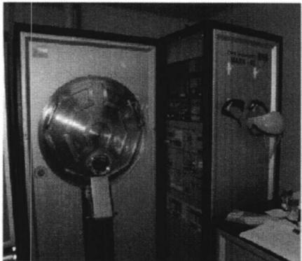

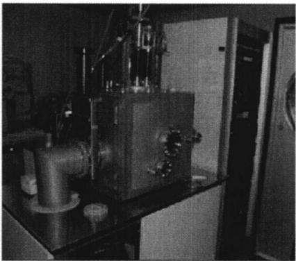  
图2.5 电子束镀膜机和热蒸发镀膜机

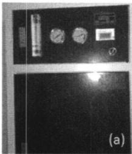

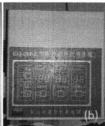

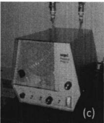

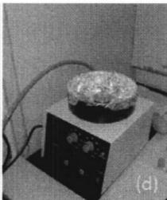

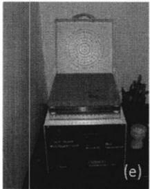

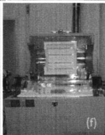

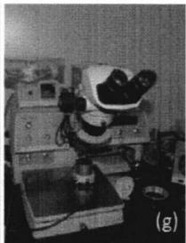

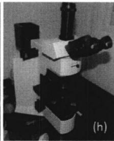  
图 2.6 辅助加工设备。(a) 去离子水机 (b) 超声清洗机(c) 等离子体清洗机(d) 甩胶机(e) 烤胶机 (f) 快速退火炉(g) 电焊机 (h) 光学显微镜

## 1. 刻蚀 mesa

(a) 晶圆切割。实验中使用的掺杂型 GaAs 晶圆是通过商业渠道购买的，一般采用分子束外延工艺生长而成，尺寸为4-6英寸。我们将一块完整的晶圆甩上保护胶（光刻胶）并烘干后，会用玻璃刀将其切割成小的晶片。一般1cmx1cm大小的方块比较合适，便于用镊子手持和后续加工。特别要注意的是整块的晶圆上是有晶向标记的，我们在切割好的晶片上也要标记好晶向。

(b)超声清洗。清洗是每进行一次新的加工步骤前都必须要采用的工序，目的在于去除晶片表面各种杂质和残胶。样品表面清洁与否，是成功制作出高质量量子点的关键。具体的清洗步骤和参数详见附录

(c) 曝光 mesa 掩膜。掩膜样例如图2.7(A)

(d)刻蚀基片。二维电子气约在基片表面下方百纳米处，为保证导电层刻蚀干净，我们选择刻蚀深度为200nm。

2. 制作欧姆电极。欧姆接触电极将二维电子气连通到样品表面，方便外部电路测量。

(a) 超声清洗。

(b)曝光欧姆电极掩膜。欧姆电极必然在mesa之上，所以这一步关键是要和已做好的 mesa嵌套对准。

(c) 蒸镀金属。经过前辈的摸索发现，Ni和 GeAu的混合物在熔融状态下可以很好的渗透半导体形成良好欧姆接触。我们在实验中使用的镀膜厚度和速率依次为 10nm Ni（1A/s）,150nm GeAu（2A/s）和 20nm Ni(2A/s)。

(d) Lift-off.

(e)退火。具体的参数也是前辈多次摸索研究得到的，详见附录。

## 3. 制作表面大电极

(a) 超声清洗。

(b)曝光电极掩膜。大电极需要越过mesa 台阶，一定要选择从 mesa侧坡面较平缓的一侧接入。因此在做光刻对准时要注意电极的走向和基片的晶向，对准正确的方向。

(c) 蒸镀金属。大电极材质为 Ti 和 Au，从样品外围一直延伸到 mesa 表面上，厚度至少要为mesa厚度的一半。我们实验中使用的镀膜厚度和速率依次为 10nm Ti（1A/s）和 100nmAu（2A/s)。

(d) Lift-off。这一步的结构尺寸较大，膜厚也小，因此很容易lift-off。通常用丙酮浸泡二十分钟后用吸管轻吹，即可将金属剥离下来。目测大部分金属脱离后，要将样品保持在液体浸润状态，在光学显微镜下仔细检查各处结构的金属剥离是否成功。如果剥离不彻底则可使用超声振动辅助，功率40%，35秒即可，不宜太猛。

## 4. 制作内部小电极

(a)超声清洗。特别要注意检查电子束曝光的核心区域是否干净，如果不干净则小电极制作必然失败。

(b)电子束曝光。一个基片上通常可以制作多个量子点，依次运行实现设计好的NPGS文件即可。详细参数见附录。

(a)  
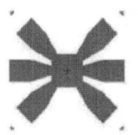

(b)  
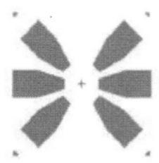

(c)  
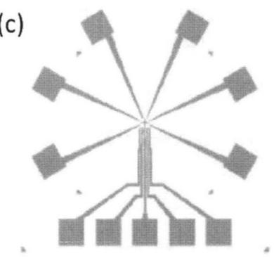

(d)  
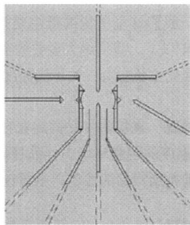  
图 2.7 (a)mesa 光学曝光掩膜 (b) 欧姆电极光学曝光掩膜  
(c) 表面大电极光学曝光掩膜(d) 内部小电极 NPGS 设计图样

(c) 蒸镀金属。这一步制作的电极是外部大电极的延伸，一般蒸镀5nm Ti(速率1A/s)和 45nm Au（速率 2A/s)。这样小电极厚度约为 50nm，为外部大电极的一半，与其搭接时不会发生断裂。

(d)Lift-off。由于这一步制作的电极尺寸非常小，而且间隔也很小，所以金属剥离的难度较大。我们现在采用的方法是使用RemovePG浸泡去胶，浸泡时间一般在12小时以上。浸泡完成后使用吸管吹离没有直接附着在基片表面上的金属，完成Lift-off。目测大部分金属脱离后，要将样品保持在液体浸润状态，在光学显微镜下检查内部细小结构的金属剥离是否成功。如果剥离不彻底则需进一步浸泡吹离，但切忌使用超声振动。

## 2.2 低温测量平台

低温是观察到量子点中量子效应的必要条件。由能量换算关系 $\mathsf { E } = \mathsf { k } _ { \mathsf { B } } \mathsf { T } =$ ħω可以知道，一般双量子点中的典型能级劈裂 $2 \mathrm { t } _ { \mathsf { C } } \sim 1 0 \mathsf { G } \mathsf { H } z \sim 4 8 0 \mathsf { m } \mathsf { K }$ ，因此环境温度必须降到300mK以下才能避免能级热展宽大于能级差，观察到量子效应。我们这里所说的低温是指环境温度在液氦温度4.2K以下，极低温是指300mK以下。我们绝大多数的实验都是在极低温环境下完成的。

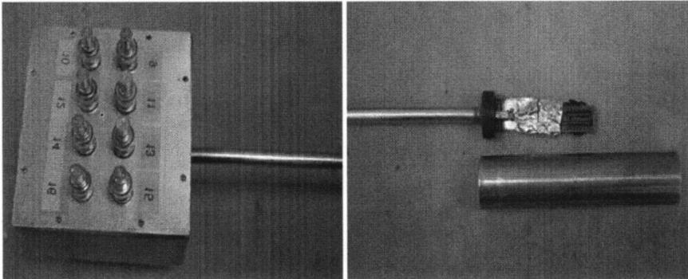  
图 2.8 液氮杜瓦样品杆

我们实验室有三种不同温度的低温测量平台：

液氦杜瓦直接将样品固定在自制的样品杆上，插入液氦杜瓦中，就可以获得4.2K温度的测量环境。样品杆如图2.8所示。4K温度下的测量主要用于在正式测量前判断样品的性质，主要包括：

a欧姆接触是否良好。在液氦温度下，二维电子气迁移率增加，电阻率降低，欧姆电极应呈导通状态。我们可以通过测量欧姆电极两两之间的电阻来判断欧姆接触制作的是否正常。在正常情况下，欧姆电极之间的电阻约为1KΩ量级。

b门电极之间是否短路和门电极和欧姆接触之间是否短路。最内层使用电子束曝光的电极可能在liftoff时金属剥离不彻底而造成短路，这种情况无法用光学显微镜观察到，只能依靠测量来判断。将20μV交流激励电压加在两门电极之间，测量漏电流来判断门电极是否短路。门电极与欧姆电极之间是否短路的判断方法于此类似。

c门电极的排空效应。给门电极加上负电压后会排斥其下方的电子，造成导电通道变小，对应的欧姆电极间电阻增加，观察到电流随着门电极负压绝对值的增大而减小。需要观察这种二维电子气排空效应是否是稳定的。例如将负电压固定到某值等待一段时间，观察电流是否稳定不变。如果电流随着时间变化（通常是慢慢变小)，说明二维电子气层存在耗尽现象，样品制作有问题，不宜进一步使用。还可将负电压逐渐改变后返回到之前的某个值，观察前后电流值是否一致。如果电流变化较大，也说明二维电子气不稳定。

d门电极的可调性。通常样品结构中会有多对可将电流彻底截断的门电极。对于这样的门电极，需要截止时加在电极上的负电压是否合理。截止电压会随着基片材料、样品结构、样品制作批次的不同而不同，但变化范围不会太大，通常在-0.7V到-1.5V之间。截止电压过大或过小说明门电极对其下方的二维电子气影响不理想，这样的样品往往不容易进一步精细调节。每对门电极电压之间的对称性也是非常重要的因素。可以记录门电极电压不同情况下的电流值，得到如图2.9所示的门电极关系相图。在2.9(B)中，等电流线（电流值相等的门电极电压组合点连成的线）呈明显的直角弯曲，任意一个门电极上的负电压增大一定程度就可以将电流完全截止，这说明二维电子气通道是被单个门电极所控制的，这样的样品可调性比较差，在极低温下不容易形成可控的量子点。在图2.9(A)中，等电流线呈一条斜线，而且斜率几乎不变。这说明这对门电极比较对称，当一个电极电压增大而另一个电极电压减小时，二维电子气通道收到均匀的影响而宽度几乎不变。这样的样品可控性很好，是非常理想的。

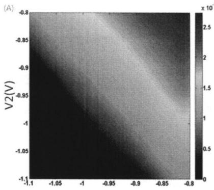  
V1(V)

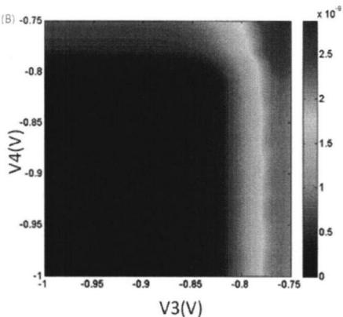  
图2.9 门电极电压对称关系图

He3 制冷机 He3制冷机是依靠He3 泵（活性炭）吸附 He3气体，降低蒸汽压使 He3 液体蒸发吸热而制冷的。我们实验室有台 Oxford 公司生产的 Heliox VL型号的 He3 制冷机，典型的 base温度约为 247mK，每次制冷可维持约 72 小时。He3制冷机的主体全部集中在He3杆上，如图2.10所示。我们在He3杆上4K层、1Kpot层和He3 壶都制作了额外的热沉，在其上密排缠绕固定了同轴线(Laskshore SS-1)作为测量引线，并自制了cold finger 和样品固定支架。

相比于稀释制冷机，He3杆结构比较简单，并且采用插拔设计，从室温冷至base温度的速度快，因此非常适合以研究样品输运性质为主的实验的快速测量。另外，我们He3系统的杜瓦附有磁体系统，一些和电子自旋有关的实验也主要在上面进行。除此之外还有一项在He3系统完成的常规工作，就是利用量子霍尔效应测定每批掺杂型wafer的电子迁移率和电子气浓度。测量样品结构和测量结果如图2.11所示

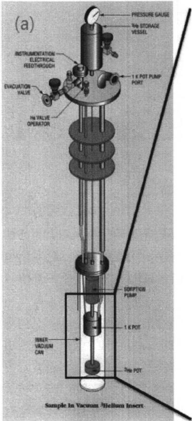

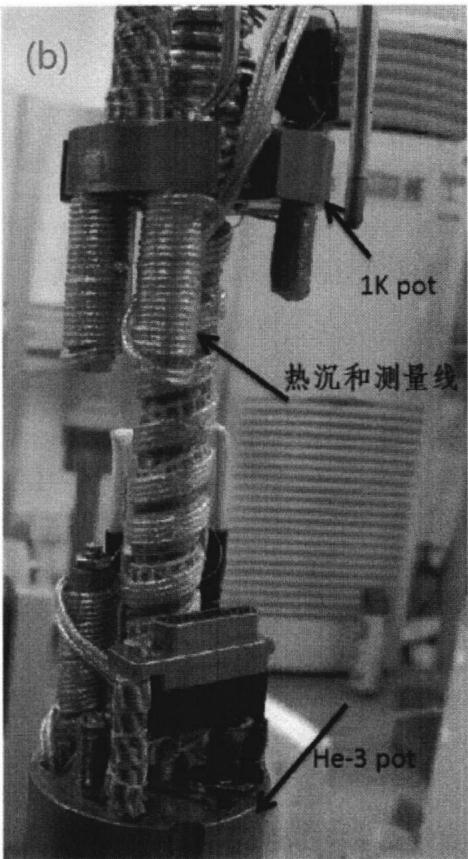  
图 2.10 (a)He3 制冷机结构示意图 (b) 热沉和测量引线

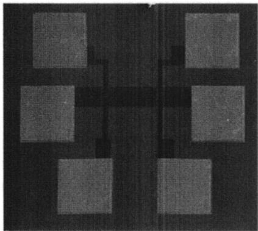

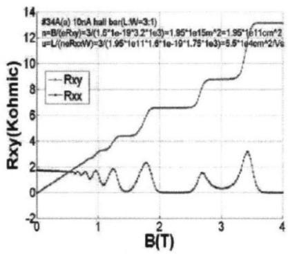  
图2.11 Hall Bar 样品结构和量子霍尔效应测量结果

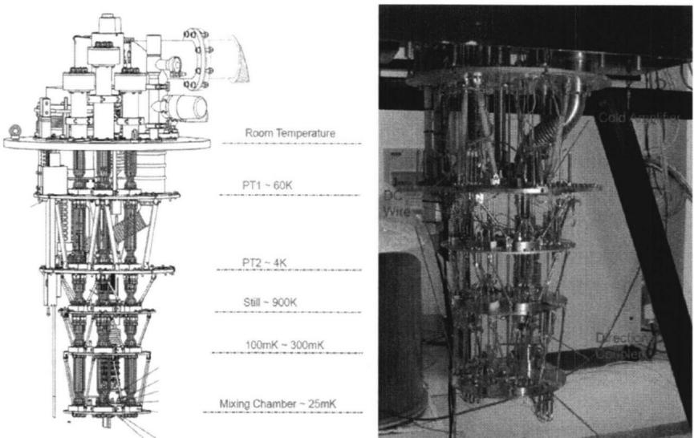  
图2.12 稀释制冷机示意图和实际结构

稀释制冷机稀释制冷机是目前商业化生产的最好的低温设备。He3、He4混合液在温度降到0.86K以下后会分离成两相，其中含He3多的相称为浓缩相，而含He3少的相称为稀释相。因为He3 在稀释相中的焓和熵比在浓缩相中要大得多，所以当从稀释相中取走He3原子时，为了保持两相的平衡，浓缩相中的3He会通过相界面进入稀释相而吸热，利用这个吸热现象就制成了稀释制冷机。我们实验中使用的是牛津仪器公司生产的无液氮Triton-300型稀释制冷机，base温度可达10mK。如图2.12所示

原装的稀释制冷机主要提供了低温测量环境，我们还需要根据实验的要求改装相应的电学测量环境。主要包括：

1. 低频直流引线。由于量子点结构中有大量的电极需要施加电压加以控制，因此我们需要在稀释制冷机系统中加入大量的低频直流引线。我们在实验中选用了Lakeshore SS 不锈钢同轴线作为测量和控制线。同轴线缆中心信号线芯被外层接地的屏蔽层所包围，克服了传统漆包线无屏蔽，易受外界交变信号干扰的缺点，可非常有效地提高皮安级微弱电流信号的信噪比。而且由于屏蔽层的存在，即使引线在密排的情况下也不容易相互串扰，门电极之间的控制不受影响。

2. 加装热沉。但这种不锈钢同轴线的缺点是截面积大，造成热负载较重。为此我们在稀释制冷机每一层温度隔板上都制作了专用的多层线夹板式热沉，如图2.13(a)所示。多层夹板类似于三明治结构，纯铜材质，表面镀金，底部通过专用的螺孔与温度隔板固定。同轴线在夹板之间预留的线槽中反复穿过，充分延长了夹板有效热接触面的长度，并且接触紧密线路平整，达到良好热沉的效果。经过实验证明，在Triton-300系统上PT1，PT2，

Still，100mK，MixChamber五层温度隔板上都使用这种热沉，加装120根Lakeshore不锈钢同轴线后，系统的 base温度依然可以达到20mK并稳定工作。由于有充足的线路，这样改装过的稀释制冷机在一次制冷过程中可以测量多块简单样品和多比特设计的复杂结构样品，提高了稀释制冷机的使用效率。

3. 滤波降噪。由于我们测量的电流信号都很微弱，一般为几到十几皮安量级，因此我们对测量线路中噪声干扰的要求也很高。为此，我们采用了多级滤波的方式来降低线路中的噪声和干扰信号。在室温部分，稀释制冷机上低频线路接入端都会加装低通滤波器。在极低温部分，直接安装样品的PCB板上都专门设计安装了铁氧体磁珠低通滤波器。板载的滤波器不但可以过滤噪声，而且还能有效地降低静电直接击穿样品的可能性。另外，在一些对高频噪声特别敏感的实验中，我们还使用了自行研制的铜粉滤波器用于过滤掉1GHz以上的高频干扰噪声。降噪去扰的另一个必备的做法是实现良好的接地。我们实验室埋设了实验专用的导地端子，避免了公共电网接地的干扰。在实验过程中，稀释制冷机外壳、所有测量仪器的接地端子等都依次有序地连接到了实验专用接地端，保证所有电平处于等电位状态。此外，在进行样品仪器连接拆卸过程中，也要将人体良好接地，以免实验操作人员所携带的静电不慎击损样品。

4. 射频测量线路的改装。这一部分在3.2.3节有详细的介绍。

## 2.3 门控量子点的基本测量方法

门控量子点主要是通过电学信号进行测量的。在形成量子点区域，源漏之间电阻通常很大（通常MΩ量级），而源漏之间的偏压又不能很大（通常 $\mu \nu$ 量级)，所以实际能测到电流是很小的(pA量级)。对于这种微弱信号，最常用的方法是使用锁相放大的办法进行测量。我们实验中使用的锁相放大器为美国SRS公司生产的 SR830。假设输入信号（SIGNAL INPUT）为 $\boldsymbol { e } _ { 1 } = \mathsf { E } _ { 1 } \sin ( \omega _ { 1 } \mathrm { t } + \phi _ { 1 } )$ 参考信号（REFERENCE INPUT）为 $\boldsymbol { e } _ { 2 } = \mathbb { E } _ { 2 } \sin ( \omega _ { 2 } \mathrm { t } + \Phi _ { 2 } )$ ，这两个信号通过混合器（或PSD）相乘后得到

$$
\begin{array} { l } { { \displaystyle e _ { 3 } = e _ { 1 } \times e _ { 2 } = \mathbb { E } _ { 1 } \mathbb { E } _ { 2 } \sin ( \omega _ { 1 } t + \Phi _ { 1 } ) \sin ( \omega _ { 2 } t + \Phi _ { 2 } ) } } \\ { { \displaystyle \quad = \frac { \mathbb { E } _ { 1 } \mathbb { E } _ { 2 } } { 2 } \cos [ ( \omega _ { 1 } - \omega _ { 2 } ) t + ( \Phi _ { 1 } - \Phi _ { 2 } ) ] - \frac { \mathbb { E } _ { 1 } \mathbb { E } _ { 2 } } { 2 } \cos [ ( \omega _ { 1 } + \omega _ { 2 } ) t + ( \Phi _ { 1 } + \Phi _ { 2 } ) ] } } \end{array}\tag{2.1}
$$

其中第一项为低频部分，第二项为高频部分。在通过低通滤波器后，高频部分将被过滤掉。如果输入信号和参考信号是相关的 $( \omega _ { 1 } \sim \omega _ { 2 } ) , e _ { 3 }$ 就会变为

$$
e _ { 3 } = { \frac { \mathtt { E } _ { 1 } \mathtt { E } _ { 2 } } { 2 } } \cos ( \Phi _ { 1 } - \Phi _ { 2 } )\tag{2.2}
$$

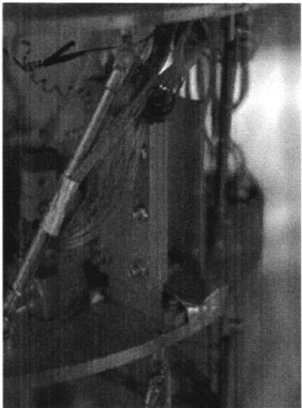

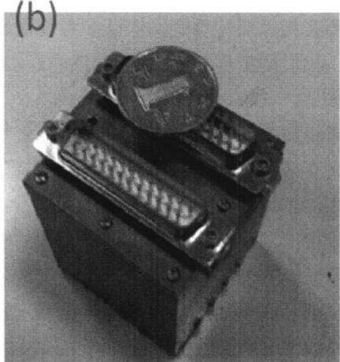

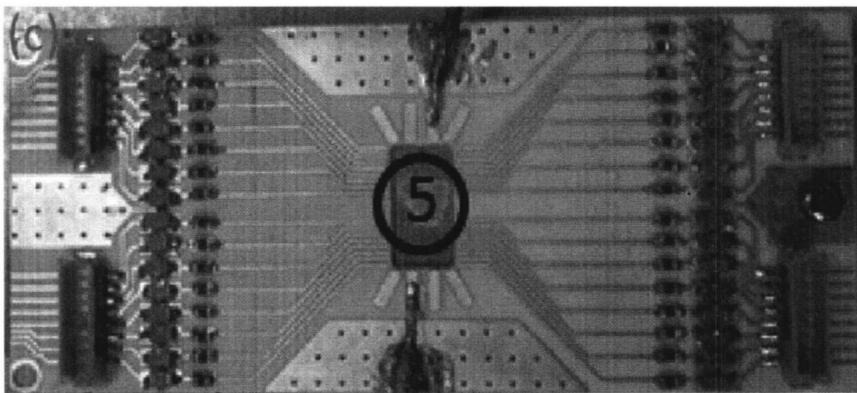  
图 2.13 (a) 多层夹板式热沉 (b) 铜粉滤波器 (c) 装有铁氧体磁珠低通滤波器的 PCB chipcarrier

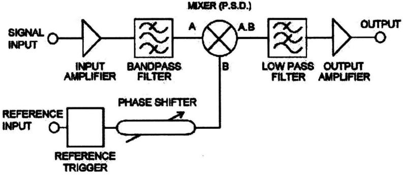  
图2.14 锁相放大器原理示意图

在已知参考信号 $\mathtt { E } _ { 2 }$ 的情况下，调节参考相位使得 $\cos ( \phi _ { 1 } - \phi _ { 2 } )$ 为1，我们就可以得到输入信号 $\mathtt { E } _ { 1 }$ 了。注意在上式中输入信号 $\bf { E } _ { 1 } ( t )$ 是可以随时间缓慢变化的，但只要其相位保持不变，保证参考信号和输入信号之间的相位差 $\Phi _ { 1 } - \Phi _ { 2 }$ 保持恒定，我们测量信号 $_ { e 3 }$ 的变化就是真实的信号 $\mathsf { E } _ { 1 }$ 的变化。这就是“锁相”一词的意义。

锁相放大器对输入信号测量精度上的提高主要来自于低通滤波。通常我们总会将有效的输入信号与参考信号保持同频，而干扰噪声信号则是在整个频带上分布的。经过低通滤波后的实际测量信号带宽集中在以参考信号频率为中心的一段很窄的频带范围内，这样有效的输入信号就被保留了下来，而大部分干扰噪声信号被过滤掉了，因此增强 $\daleth$ 信噪比。与直接的低通滤波相比，锁相放大器可以选择测量信号的中心频带位置，使其处于干扰噪声较弱的频段，而不是零频（通常零频附近的干扰噪声信号最强）。所以在实际使用中，我们可以尝试不同的参考信号频率，选择效果最好的频段加以测量。理论上说滤波带宽越窄则信噪比增强越明显，但滤波是需要一定积分时间的，滤波带宽越窄则所需要的积分时间越长，所以锁相放大器实质上也是一种用时间换取测量精度的仪器。

在实际的实验中，我们有三种不同的方法利用锁相放大器来测量量子点信号，分别是：

1. 通过量子点输运信号测量。这就是直接测量量子点源漏之间电流的方法。如图2.15(a)所示，将锁相放大器的激励信号加在源漏通道上，锁相放大器的输入信号则为源漏之间的电流。设激励信号为 $\pmb { e } _ { 1 } = \pmb { V } \sin ( \pmb { \omega } \mathbf { t } + \pmb { \phi } )$ ，量子点电阻为R，则输入信号为 $\begin{array} { r } { e _ { 2 } = \frac { V } { R } \sin ( \omega \mathrm { t } + \phi ) } \end{array}$ ，因此我们实际测得的就是流过量子点源漏的电流 $\begin{array} { r } { e _ { 3 } = \frac { V } { R } = { \ I _ { \circ } } } \end{array}$ 改变门电极电压，使量子点中的电子数目发生变化，电子隧穿 $\gnapprox$ 生电流信号时，我们就可以测得一个个库伦峰，如图2. ${ \bf l } \ 6 ( { \bf a } )$ 所示。直接测量电流的缺点是当电子与源漏之间的隧穿几率变小时，电流信号会进一步变小 $( < 1 { \mathfrak { p } } \mathsf { A } )$ ，这时即使用锁相方法的办法也不能测到微弱的电流信号了。但我们往往希望量子点工作在“少电子，弱源漏耦合”的区域，这时通常很难直接测量到输运信号。

2. 通过QPC输运信号测量。为了解决直接输运测量的弊端，人们提出了量子点接触QPC的概念。通过施加电压，在量子点附近形成一个狭小的二维电子气通道，就被称为 QPC，QPC输运直接测量的连接方式如图2.15(b)所示，锁相放大器的激励信号加在QPC的源漏通道上，输入信号则为QPC源漏之间的电流。显然这种测量方式测得的就是流过QPC的电流 $\tt I _ { Q P C } .$ 但QPC对周围电势场的变化非常敏感，当量子点中的电子数目发生变化时，QPC的电导也随之改变。因此当改变量子点门电极电压形成库伦振荡时，我们在库伦峰对应位置就会观察到QPC电流上出现跃变，如图2.16(b)所示。改变 QPC 控制门电极电压可以调整 QPC 灵敏度，通常要求 QPC 电流信号中的变化量要大于本底信号的5%。

3. 通过 QPC 调制信号测量。这种测量方式的连接示意图如图2.15(c)所示，锁相放大器的输入信号为QPC源漏电流，但激励信号加在量子点的控制门电极上。设激励信号为 $\pmb { e } _ { 1 } = \pmb { V } \sin ( \omega \mathbf { t } + \pmb { \phi } )$ ，门电极直流偏置电压为 $\mathsf { v _ { d } }$ o我们知道门电极上的电压会影响量子点的状态，进而影响QPC电流。通常$\boldsymbol { \mathsf { e } } _ { 1 }$ 很小，将QPC电流按正弦波近似展开，有：

$$
\begin{array} { r l } & { \mathrm { I } _ { \mathbb { Q P C } } = \mathrm { I } _ { \mathbb { Q P C } } ( \mathsf { V } _ { \mathsf { d } } + \mathsf { V } \sin ( \omega \mathsf { t } + \Phi ) ) } \\ & { \qquad \approx \mathrm { I } _ { \mathbb { Q P C } } ( \mathsf { V } _ { \bar { \mathsf { d } } } ) + \frac { \mathrm { d } \mathrm { I } _ { \mathbb { Q P C } } } { \mathrm { d } \mathsf { V } _ { \bar { \mathsf { d } } } } \mathsf { V } \sin ( \omega \mathsf { t } + \Phi ) + \cdots } \end{array}\tag{2.3}
$$

锁相放大器只测量和激励信号同频的输入信号部分，所以实际测得的信号就是 $\frac { \mathop { } \mathrm { d } \mathrm { I } _ { \mathrm { Q P C } } } { \mathop { } \mathrm { d } \mathrm { V } _ { \mathrm { d } } } \mathrm { V } _ { \circ }$ 这里的巧妙之处在于测量信号正比于 $\mathrm { d I _ { Q P C } / d V _ { d } }$ ，相当于直接在物理上实现对信号 $\boldsymbol { \mathrm { I } } _ { \boldsymbol { Q } \boldsymbol { P } \boldsymbol { C } }$ 的微分！如图2.16(c)所示，由于微分信号克服了QPC本底信号的干扰，突出了量子点信号随电极电压变化，所以这种测量方法的灵敏度是最高，可以在量子点电子隧穿率很低，量子点和QPC耦合较弱，采用前两种方法都不能探测信号的情况下，依然精确地确定量子点中电子数目发生变化的电压位置，得到量子点相图。因此我们在实验中调整量子点的位置和在少电子区进行测量时都主要采用这种方法。但这种方法中的 $\mathrm { d } \mathrm { I } _ { \mathrm { Q P C } } / \mathrm { d } \mathrm { V } _ { \mathrm { d } }$ 微分关系只是近似成立的，由此并不能给出电流信号绝对强度大小，只是对电子的跳跃敏感，因此也叫做 charge counting技术。对于参数拟合提取时需要用到信号的绝度变化量的实验，如测量双量子点耦合强度等，必须换用QPC输运信号测量方式甚至直接测量量子点输运信号。

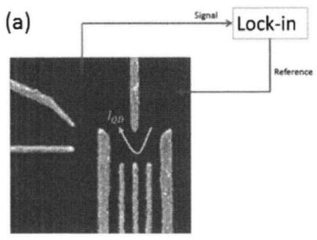

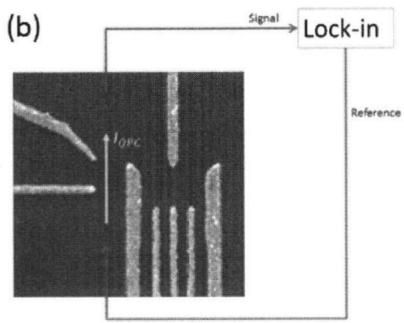

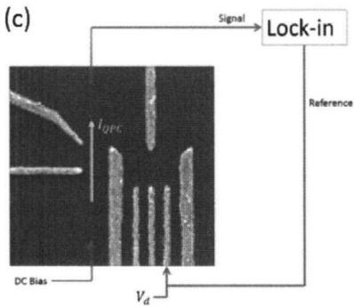  
图2.15 三种不同的lock-in 测量方式。(a)量子点输运信号测量(b)QPC 输运信号测量(c)QPC 调制信号测量

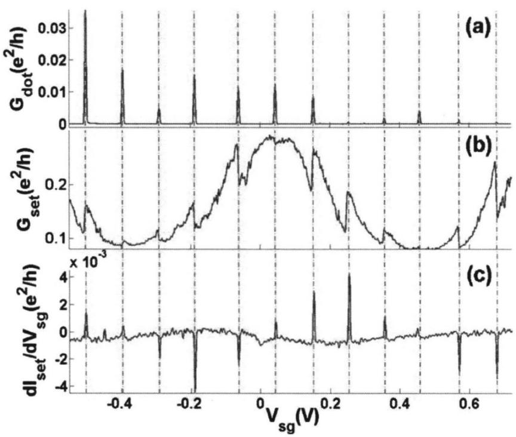  
图 2.16 三种 lock-in测量结果对比。(a)量子点输运信号测量 (b)QPC 输运信号测量(c)QPC调制信号测量

## 第三章 谐振腔的设计和制备

在本章，我们综述微波谐振腔系统的基本概念。

## 3.1 谐振的一般理论

## 3.1.1 集总振荡电路

最简单的由集总元件构成的并联LCR振荡器如图3.1所示

时域 电容中电荷随时间的演化可以用以下的微分方程描述：

$$
\frac { \mathrm { d } ^ { 2 } \mathrm { \bf q } } { \mathrm { d } \mathrm { t } ^ { 2 } } - \frac { 1 } { \mathrm { R C } } \frac { \mathrm { d } \mathrm { \bf q } } { \mathrm { d } \mathrm { t } } + \frac { \mathrm { \bf q } } { \mathrm { L C } } = 0\tag{3.1}
$$

该方程有一个本征解：

$$
\mathbf { q } ( \mathbf { t } ) = \mathbf { q } _ { 0 } \exp { ( \mathbf { j } ( \pmb { w } _ { 0 } + \mathbf { j } \kappa ) \mathbf { t } + \Phi ) }\tag{3.2}
$$

这是一个随时间周期性振荡的解，说明电路中存在本征的电荷振荡模式，振荡频率为 $\omega _ { 0 } = 1 / \sqrt { \mathrm { L C } }$ ，衰减速率为 $\kappa = 1 / \kappa C$

频域 并联LCR 谐振器的复输入阻抗为：

$$
Z _ { \mathrm { L C R } } ( \omega ) = \left( \mathrm { j } \omega \mathsf { C } + \frac { 1 } { \mathrm { j } \omega \mathsf { L } } + \frac { 1 } { \mathsf { R } } \right) ^ { - 1 }\tag{3.3}
$$

当复阻抗的虚部为0时，电路对外不会表现出容性或者抗性，不会存储释放能量，发生谐振。此时亦可得到谐振频率为 $\omega _ { 0 } = 1 / \sqrt { \mathrm { L C } }$

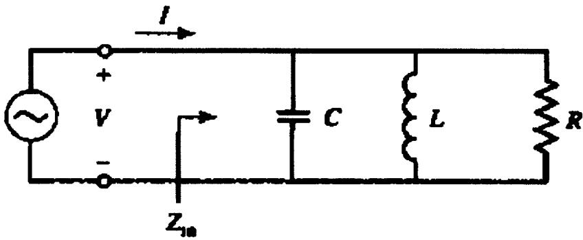  
图 3.1 集总并联谐振电路示意图 [48]

能量 消耗在电阻R上的功率为：

$$
\mathsf { P } _ { \mathsf { l o s s } } = \frac { 1 } { 2 } \frac { | \mathsf { V } | ^ { 2 } } { \mathsf { R } }\tag{3.4}
$$

存储在电容C 中的平均电能为：

$$
{ \cal W } _ { e } = \frac { 1 } { 4 } | V | ^ { 2 } \mathsf { C }\tag{3.5}
$$

存储在电感L中的平均电能为：

$$
W _ { \mathfrak { m } } = { \frac { 1 } { 4 } } | \mathrm { I } _ { \mathrm { L } } | ^ { 2 } \mathrm { L } = { \frac { 1 } { 4 } } | \mathrm { V } | ^ { 2 } { \frac { 1 } { \omega ^ { 2 } \mathrm { L } } }\tag{3.6}
$$

总的复数功率为：

$$
\mathsf { P } = \mathsf { P } _ { \mathsf { l o s s } } + 2 \mathsf { j } ( W _ { \mathsf { m } } - W _ { e } )\tag{3.7}
$$

谐振电路的品质因子定义为：

$$
Q = \omega \frac { \mathrm { a } v e \mathrm { r } \mathrm { a } g e e n e \mathrm { r } g \mathrm { y } \ s \mathrm { t o } \mathrm { r } \mathrm { a } g e } { e \mathrm { n } e \mathrm { r } g \mathrm { y } \ l \mathrm { o } s s / s e \mathrm { c o } \mathrm { n } \mathrm { d } } = \omega \frac { W _ { \mathrm { m } } + W _ { e } } { \mathsf { P } _ { \mathrm { l o } s s } }\tag{3.8}
$$

当发生谐振时，无功功率为零，平均存储的电能和磁能相等，亦可得谐振频率$\omega _ { 0 } = 1 / \sqrt { \mathrm { L C } }$ ，此时电路的品质因子可以表示为：

$$
Q = w _ { 0 } \frac { 2 W _ { \mathrm { m } } } { \mathsf { P } _ { \mathsf { l o s s } } } = \frac { \mathsf { R } } { \omega _ { 0 } \mathsf { L } } = \omega _ { 0 } \mathsf { R C } = \frac { \omega _ { 0 } } { \kappa }\tag{3.9}
$$

所以品质因子Q还可以表示为电路的能量衰减到1/e时电荷平均的振荡次数。

在谐振频率附近将输入阻抗展开，有 $\omega \approx \omega _ { 0 } + \Delta \omega$ ，可得

$$
\begin{array} { c } { \displaystyle 2 _ { \mathrm { i n } } \approx \left( \frac { 1 } { \tt R } + \mathrm { j } \frac { \Delta \omega } { \omega _ { 0 } ^ { 2 } \mathrm { L } } + \mathrm { j } \Delta \omega \mathrm { C } \right) ^ { - 1 } } \\ { \displaystyle \approx \frac { \mathsf { R } } { 1 + 2 \mathrm { j } \Delta \omega \mathrm { R C } } = \frac { \mathsf { R } } { 1 + 2 \mathrm { j } \mathrm { Q } \Delta \omega / \omega _ { 0 } } } \end{array}\tag{3.10}
$$

若电路中没有损耗 $R \to \infty$ ，上式可以简化为在无损情况下：

$$
Z _ { \mathrm { i n } } = \frac { 1 } { \mathrm { j } 2 \mathsf { C } ( \omega - \omega _ { 0 } ) }\tag{3.11}
$$

可以注意到有损耗的复阻抗相当于将无损耗的情况中的谐振频率用复数有效频率 $\omega _ { 0 } ( 1 + \mathrm { j } / 2 \mathrm { Q } )$ 来代替。重复上面类似的讨论，我们可以得出串联RLC电路的在谐振频率附近的输入阻抗为：

$$
Z _ { \mathrm { i n } } = \mathsf { R } + \mathsf { j } \frac { 2 \mathsf { R } \mathsf { Q } \Delta \omega } { \omega _ { 0 } }\tag{3.12}
$$

其中谐振频率 $\omega _ { 0 } = 1 / \sqrt { \mathrm { L C } }$ ，品质因子 $Q = \omega _ { 0 } \mathbf { L } / \mathsf { R } = 1 / \mathsf { w } _ { 0 } \mathbf { R } \mathbf { C }$ 0

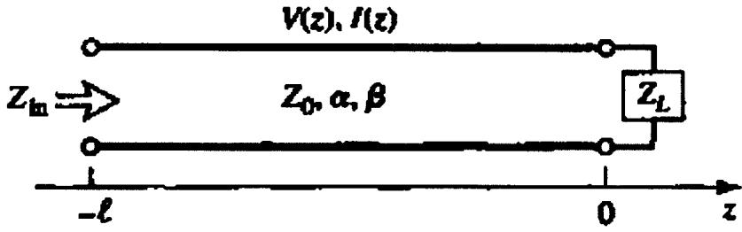  
图 3.2 传输线模型

## 3.1.2 传输线谐振电路

随着谐振频率的升高，电磁振荡的波长越来越小。在微波频段，波长只有1m到1mm之间。这已经和常见的集总元件的尺度差不多了。由于微波干涉效应的影响，电路元件的工作状态显著依赖于其尺寸结构，因此必须使用分布式模型来描述整个电路。传输线理论是最常用的分布式电路模型[48]。考虑一段长度为l，特征阻抗 $\scriptstyle { Z _ { 0 } }$ ，传播常数为 $\beta$ 和衰减常数为α的低耗传输线，其终端接有负载阻抗 $z _ { \mathrm { L } }$ 。在距离负载处的输入阻抗 $z _ { i \mathfrak { n } }$ 为：

$$
Z _ { \mathrm { i n } } = Z _ { 0 } \frac { Z _ { \mathrm { L } } + Z _ { 0 } \operatorname { t a n h } ( ( \alpha + \mathrm { j } \beta ) \mathbb { 1 } ) } { Z _ { 0 } + Z _ { \mathrm { L } } \operatorname { t a n h } ( ( \alpha + \mathrm { j } \beta ) \mathbb { 1 } ) }\tag{3.13}
$$

我们考虑几种特殊的情况。

1. 终端为开路，长度1为半波长的整数倍。此时 $Z _ { \mathrm { L } }  \infty$ ，输入阻抗化为

$$
Z _ { \mathrm { i n } } = Z _ { 0 } \coth ( \alpha + \mathrm { j } \beta ) \mathbb { l } = Z _ { 0 } { \frac { \mathbb { 1 } + \mathrm { j } \tan \beta \mathbb { l } \operatorname { t a n h } \alpha \mathbb { l } } { \operatorname { t a n h } \alpha \mathbb { l } + \mathrm { j } \tan \beta \mathbb { l } } }\tag{3.14}
$$

假设在微波频率 ${ \pmb w } = { \pmb w } _ { 0 }$ 时，传输线的长度恰好为半波长 $\lfloor = \lambda / 2$ 。我们在$\omega _ { 0 }$ 处展开，有 ${ \pmb w } = { \pmb w } _ { 0 } + \Delta { \pmb w }$ , tanh αl ≈ αl,

$$
\tan \beta \mathrm { l } = \tan ( \pi + \frac { \pi \Delta \omega } { \omega _ { 0 } } ) \approx \frac { \Delta \omega } { \omega _ { 0 } }\tag{3.15}
$$

将这些结果带入式3.14，可得：

$$
Z _ { \mathrm { i n } } = \frac { Z _ { 0 } } { \alpha \mathbf { l } + \mathbf { j } ( \Delta \omega \pi / \omega _ { 0 } ) }\tag{3.16}
$$

上式与并联RLC谐振电路的输入阻抗3.10形式完全一致，说明开路半波长传输线就相当于一个并联谐振电路，各等效参数如下

$$
\begin{array} { c } { { \mathsf { R } = \displaystyle \frac { \mathsf { Z } _ { 0 } } { \alpha \mathsf { L } } } } \\ { { \mathsf { C } = \displaystyle \frac { \pi } { 2 w _ { 0 } \mathsf { Z } _ { 0 } } } } \\ { { \mathsf { L } = \displaystyle \frac { 1 } { w _ { 0 } ^ { 2 } \mathsf { C } } } } \\ { { \mathsf { Q } = \omega _ { 0 } \mathsf { R C } = \displaystyle \frac { \pi } { 2 \alpha \mathsf { L } } = \displaystyle \frac { \mathsf { \beta } } { 2 \alpha } } } \end{array}
$$

2. 负载为短路，长度为半波长的整数倍。此时 ${ \cal Z } _ { \mathrm { L } } \to 0$ ，输入阻抗化为

$$
Z _ { \mathrm { i n } } = Z _ { 0 } \frac { \operatorname { t a n h } \alpha \mathrm { l } + \mathrm { j } \tan \beta \mathrm { l } } { 1 + \mathrm { j } \tan \beta \mathrm { l } \operatorname { t a n h } \alpha \mathrm { l } }\tag{3.17}
$$

同样在 $\omega = \omega _ { 0 }$ $\updownarrow = \lambda / 2$ 处展开，我们可以得到：

$$
Z _ { \mathrm { i n } } \approx Z _ { 0 } \frac { \alpha \mathrm { l } + \mathrm { j } ( \Delta \omega \pi / \omega _ { 0 } ) } { 1 + \mathrm { j } ( \Delta \omega \pi / \omega _ { 0 } ) \alpha \mathrm { l } } \approx Z _ { 0 } ( \alpha \mathrm { l } + \mathrm { j } \frac { \Delta \omega \pi } { \omega _ { 0 } } )\tag{3.18}
$$

上式与串联RLC谐振电路的输入阻抗3.12形式完全一致，说明开路半波长传输线就相当于一个串联联谐振电路，各等效参数如下

$$
\begin{array} { c } { { \tt R = Z _ { 0 } \alpha { \alpha } { 1 } } } \\ { { { \tt L } = \displaystyle \frac { Z _ { 0 } \pi } { 2 \omega _ { 0 } } } } \\ { { { \tt C } = \displaystyle \frac { 1 } { \omega _ { 0 } ^ { 2 } \mathrm { L } } } } \\ { { { \tt Q } = \displaystyle \frac { w _ { 0 } \mathrm { L } } { \mathrm { R } } = \displaystyle \frac { \pi } { 2 \alpha { 1 } } = \displaystyle \frac { \beta } { 2 \alpha } } } \end{array}
$$

3. 负载为短路，长度为四分之一波长的奇数倍。此时 $\pmb { Z } _ { \mathrm { L } }  0$ ，输入阻抗化为

$$
Z _ { \mathrm { i n } } = Z _ { 0 } \frac { 1 - \mathrm { j } \tan \beta \mathrm { l } \operatorname { t a n h } \alpha \mathrm { l } } { \operatorname { t a n h } \alpha \mathrm { l } - \mathrm { j } \tan \beta \mathrm { l } }\tag{3.19}
$$

假设在微波频率 $\omega = \omega _ { 0 }$ 时，传输线的长度恰好为四分之一波长 $\nu = \lambda / 4$ 我们在 $\omega$ 处展开，有 $\omega = \omega _ { 0 } + \Delta \omega$ , tanh αl ≈ αl,

$$
\cot \beta \mathbb { l } = \cot ( \frac { \pi } { 2 } + \frac { \pi \Delta \omega } { 2 \omega _ { 0 } } ) \approx - \frac { \pi \Delta \omega } { 2 \omega _ { 0 } }\tag{3.20}
$$

将这些结果带入式3.19，可得

$$
Z _ { \mathrm { i n } } = Z _ { 0 } \frac { 1 + \mathrm { i } \alpha \mathrm { l } \pi \Delta \omega / 2 \omega _ { 0 } } { \mathrm { a l } + \mathrm { j } \pi \Delta \omega / 2 \omega _ { 0 } } \approx \frac { Z _ { 0 } } { \alpha \mathrm { l } + \mathrm { j } \pi \Delta \omega / 2 \omega _ { 0 } }\tag{3.21}
$$

上式与并联RLC谐振电路的输入阻抗形式3.10完全一致，说明短路四分之一波长传输线就相当于一个并联谐振电路，各等效参数如下

$$
\begin{array} { c } { { \ R = { \displaystyle \frac { { \cal Z } _ { 0 } } { \alpha \mathrm { l } } } } } \\ { { { \displaystyle \mathbb { C } = { \displaystyle \frac { \pi } { 4 \omega _ { 0 } { \cal Z } _ { 0 } } } } } } \\ { { { \displaystyle \mathrm { L } = { \displaystyle \frac { 1 } { \omega _ { 0 } ^ { 2 } \mathbb { C } } } } } } \\ { { { \displaystyle \mathrm { Q } = w _ { 0 } \mathbb { R } \mathbb { C } = { \displaystyle \frac { \pi } { 4 \alpha \mathrm { l } } } = { \displaystyle \frac { \beta } { 2 \alpha } } } } } \end{array}
$$

从上面三种情况的讨论可以看出，在微波频段，虽然没有直接等效的电容电感元件，整个电路都是分布式的，但对于传输线结构，只要终端负载为开路或短路，并且长度合适，都可以等效为一个谐振腔。这为我们制作微波谐振腔提供了极大的方便。

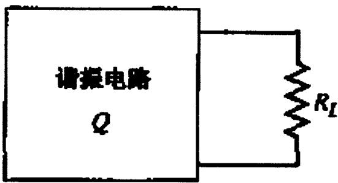  
图 3.3 谐振电路外接负载

## 3.1.3 有载和无载 Q

前面定义的品质因子Q是假设谐振电路没有耦合外部电路，不存在负载效应，称为无载Q（内部品质因子)，它描述的是谐振电路本身的性质。但实际上谐振电路总需要与外部耦合，这通常会使总的 $\mathbf { Q }$ 值下降，此时的品质因子值称为有载 $\mathbf { Q } \cdot$ ，考虑如图所示最简单的耦合情况，并联谐振电路直接与外负载 $\ R _ { \ L }$ 相连接，总体有效的电阻为 $R R _ { \mathrm { L } } / ( R + R _ { \mathrm { L } } )$ 。如果我们定义类比于内部品质因子，定义外部品质因子 $\mathsf Q _ { e } = \mathsf R _ { \mathrm { L } } / w _ { 0 } \mathsf L$ ，则可得有载品质因子满足

$$
\frac { 1 } { \mathsf { Q } _ { \mathrm { { L } } } } = \frac { 1 } { \mathsf { Q } _ { \mathrm { { i } } } } + \frac { 1 } { \mathsf { Q } _ { e } }\tag{3.22}
$$

这个式子对于各种负载情况具有普适性。定义耦合系数为：

$$
g = \frac { \mathrm { Q _ { i } } } { \mathrm { Q _ { e } } }\tag{3.23}
$$

它描述了谐振电路与外界功率传输是否匹配。通产 ${ \mathfrak { g } } > { \mathfrak { l } }$ 称为过耦合， ${ \mathfrak { g } } < 1$ 称为欠耦合， $g = 1$ 称为临界耦合。

对于谐振腔和量子点的耦合体系，谐振腔过耦合意味着总的品质因子很低，谐振腔适于用作量子比特的快速读取。而谐振腔欠耦合意味着总的品质因子很高，光子可以在谐振腔中很长时间不泄露，谐振腔适用于做一个量子存储器件。

## 3.1.4 量子化描述

我们可以使用简谐振子模型来量子化地描述谐振电路[49]。如果不考虑电阻 R 的损耗，一个LC 振荡电路的总能量为：

$$
\mathsf { E } = \frac { 1 } { 2 } \mathsf { L I } ^ { 2 } + \frac { 1 } { 2 } \mathsf { C } \mathsf { V } ^ { 2 }\tag{3.24}
$$

因此相应的哈密顿量为：

$$
{ \sf H } = \frac { { \sf q } ^ { 2 } } { 2 { \sf C } } + \frac { \delta ^ { 2 } } { 2 \mathrm { L } }\tag{3.25}
$$

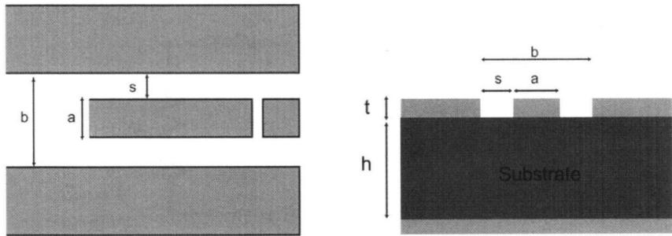  
图 3.4 共面波导结构示意图 [49]

其中q为电容中的电量，δ=LI为电感中的磁通量。和弹簧机械振子类似，我们可以直接定义正则算符 q和 δ:

$$
{ \frac { \partial \mathsf { H } } { \partial \mathsf { q } } } = { \frac { \mathsf { q } } { \mathsf { C } } } = - \mathsf { L } { \frac { \partial \mathsf { I } } { \partial \mathsf { t } } } = - \dot { \delta }\tag{3.26}
$$

$$
\frac { \partial \mathsf { H } } { \partial \delta } = \frac { \delta } { \mathsf { L } } = \mathsf { I } = \dot { \mathsf { q } }\tag{3.27}
$$

且满足对易关系 $[ \hat { \mathsf { q } } , \hat { \boldsymbol { \delta } } ] = - \mathrm { i } \hbar$ 更进一步，式3.25还可以二次量子化为

$$
\mathsf { H } = \hbar \boldsymbol { \omega } \big ( \mathbf { a } ^ { \dagger } \mathbf { a } + 1 / 2 \big )\tag{3.28}
$$

即谐振腔可以直接用单模光场的产生湮灭算符表示。光子湮灭算符满足：

$$
\mathfrak { a } = \frac { 1 } { \sqrt { 2 \hbar L _ { \mathrm { c } } } } ( \delta + \mathrm { j } Z _ { \mathrm { c } } \mathfrak { q } )\tag{3.29}
$$

其中谐振频率 $\omega = 1 / \sqrt { \mathsf { L C } }$ ，特征阻抗 $Z _ { \mathrm { c } } = \sqrt { \mathrm { L } / \mathrm { C } }$ 。对于微波电路，特征阻抗通常为50Ω。

## 3.2 透射式共面波导传输线谐振腔

## 3.2.1 设计模拟

## 3.2.1.1 传输线实现

从上一节的讨论可以看出，只要找到低损传输线的物理实现，并截取合适的长度，就可以制作出谐振腔结构了。实验中最早实现的平面超导谐振腔采用了共面波导（CPW）结构作为传输线的实现。CPW的结构如图3.4所示，在介质基片的平面上制作出中心导体带，并在紧邻中心导体带的两侧制作出导地平面，就构成了共面波导。共面波导的性质主要由以下几个参数控制：中心导带线宽度a，中心和地平面间距b，介质基底的厚度h和介电常数e。对于具体的传输线结构，我们最关心的是如何设计参数使得特征阻抗满足50欧姆匹配。共面波导的特征阻抗的理论表达式如下[49]:

$$
Z _ { 0 } ^ { C P W } = \frac { 6 0 \pi } { \sqrt { \varepsilon _ { e f f } } } \bigg ( \frac { \mathsf { K } ( \mathsf { k } ) } { \mathsf { K } ( \mathsf { k } ^ { \prime } ) } + \frac { \mathsf { K } ( \mathsf { k } _ { 3 } ) } { \mathsf { K } ( \mathsf { k } _ { 3 } { ' } ) } \bigg ) ^ { - 1 }\tag{3.30}
$$

其中有效介电常数：

$$
\varepsilon _ { e f f } = \frac { 1 + \varepsilon _ { \tau } \tilde { \mathsf { K } } } { 1 + \tilde { \mathsf { K } } }\tag{3.31}
$$

K为第一类椭圆积分，

$$
\tilde { \mathsf { K } } = \frac { \mathsf { K } ( \mathsf { k } ^ { \prime } ) \mathsf { K } ( \mathsf { k } _ { 3 } ) } { \mathsf { K } ( \mathsf { k } ) \mathsf { K } ( \mathsf { k } _ { 3 } { ' } ) }
$$

$$
{ \bf k } _ { 3 } = \frac { \operatorname { t a n h } ( \frac { \pi \alpha } { 4 \mathrm { h } } ) } { \operatorname { t a n h } ( \frac { \pi \mathrm { b } } { 4 \mathrm { h } } ) }
$$

$$
\pmb { \mathrm { k } } ^ { \prime } = \sqrt { 1 - \pmb { \mathrm { k } } ^ { 2 } }
$$

$$
{ \bf k } _ { 3 } ^ { \prime } = \sqrt { 1 - { \bf k } _ { 3 } ^ { 2 } }
$$

显然CPW阻抗的函数关系非常复杂，受到多参数调节控制。但正是这种参数调节的复杂性，为我们的设计带来了很大的便利性。实际上在介质介电常数一定的情况下，CPW的阻抗主要和几何参数之间的比例 ${ \mathfrak { a } } / { \mathfrak { b } }$ ${ \mathfrak { a } } / { \hbar }$ $b / h$ 有关，因此对于不同尺寸大小的设计要求，这要保持好参数值之间的比例关系，就都能保持阻抗匹配一致。在实际的实验中，从毫米量级的PCB板到微米量级的谐振腔样品，尽管基板的厚度和介电常数各部相同，我们都可以在数值合理的范围内计算出a和b以满足50欧姆阻抗匹配要求。当然在实际使用中，我们不需要去计算如此复杂的公式，而是使用电磁模拟软件来设计具体的参数值。

CPW结构作为最早在实验中采用的平面传输线结构，除了设计参数可调性高的特点外，还具有以下优点：

1. 能量密度高。由于地平面离中心导带线很近并且在同一平面内，所以电场分布相对集中，真空电场强度大，能量泄漏少，可以很容易实现很高的内部Q值，非常有利于实现强耦合。

2. 高频设计。可以很容易将传输频率做到10GHz以上

## 3.2.1.2 谐振腔设计

有了CPW传输线结构，我们只要截取合适的长度就可实现谐振腔了。通常我们采用半波长终端开路的设计。谐振腔有两个主要的参数，谐振频率和Q值。谐振频率是直接由中心导带线的长度决定的， $w = \pi v _ { e f f } / 1 = \pi c / 1 \sqrt { \varepsilon _ { e f f } }$ 。外部品质因子有谐振腔和外界耦合程度所决定。为了保持开路状态，中心导带线是通过电容的形式与外界馈线耦合在一起的。电容通常采用直接的缝隙或交趾的结构，缝隙的间距和重叠程度决定了耦合电容的大小，进而影响品质因子。在谐振腔的两侧都与外界耦合，这样微波可以从一端进入另一端输出，测量谐振腔的透射频谱。这样的谐振腔结构被称作透射式传输线谐振腔（TLR）。

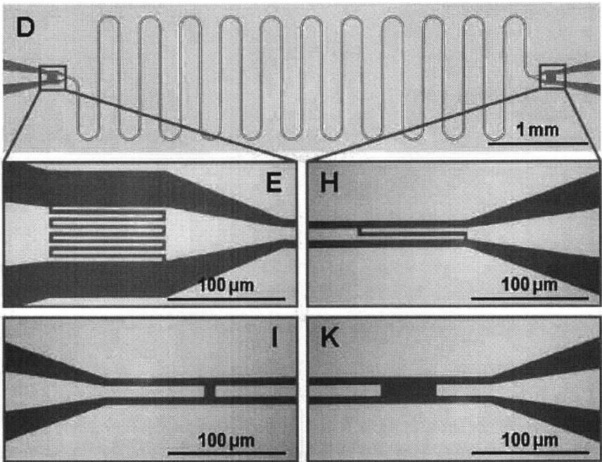

图 3.5 透射式谐振腔样品结构 [50]  
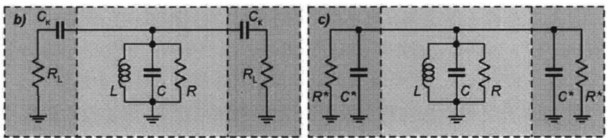  
图 3.6 透射式谐振腔等效电路 [50]

一个完整的CPW谐振腔如图3.5所示。为了减少芯片面积，通常会将中心导带线弯折起来。只要弧度不是太小，弯折就不会对谐振腔的性质没有任何实质影响。

这个谐振腔可以用图3.6所示的等效电路来分析[50]。我们假设透射式传输线谐振腔等效为一个并联的RLC谐振电路，两侧通过电容与外界耦合，外界电路的等效负载阻抗为。在谐振点附近，我们知道并联谐振电路阻抗近似展开为：

$$
Z \approx \frac { { \sf R } } { 1 + 2 \mathrm { j } { \sf R C } ( \omega - \omega _ { 0 } ) }\tag{3.32}
$$

无载品质因子为 $Q _ { \mathrm { i } } = \omega _ { 0 } \mathsf { R C }$ 。为了得到整个电路的有载品质因子，我们可以用诺顿变换将两侧串联的电容电阻变为并联结构并入到整个谐振电路中。假设输入输出耦合电容是对称的，有

$$
\mathsf { R } ^ { * } = \frac { 1 + \omega _ { 0 } ^ { 2 } \mathsf C _ { \mathsf { k } } ^ { 2 } \mathsf R _ { \mathrm { L } } ^ { 2 } } { w _ { 0 } ^ { 2 } \mathsf C _ { \mathsf { k } } ^ { 2 } \mathsf R _ { \mathrm { L } } }\tag{3.33}
$$

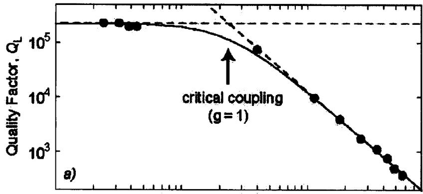

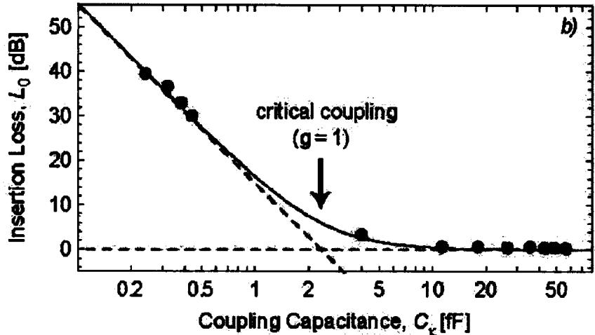  
图 3.7 有载品质因子和插入损耗随耦合电容的变化 [50]

$$
\mathsf C ^ { * } = \frac { \mathsf C _ { \mathsf k } } { 1 + \omega _ { 0 } ^ { 2 } \mathsf C _ { \mathsf k } ^ { 2 } \mathsf R _ { \mathsf L } ^ { 2 } }\tag{3.34}
$$

通常耦合电容 ${ { \mathbb { C } } _ { \bf { k } } }$ 很小， $\mathfrak { q } = w _ { 0 } \mathbb { C } _ { \mathtt { k } } \mathbb { R } _ { \mathtt { L } } \ll 1$ ，变换后 $\mathbb { R } ^ { * } \approx \mathbb { R } _ { \mathrm { L } } / \mathbb { q } ^ { 2 }$ 很大，而 $C ^ { * } \approx C _ { \boldsymbol { \mathbf { k } } }$ 很小。变换后，谐振频率基本不变 $w ^ { \star } = 1 / \sqrt { \mathrm { L } ( \mathsf { C } + 2 \mathsf { C } ^ { \star } ) } \approx 1 / \sqrt { \mathrm { L C } } = w _ { 0 }$ ，总的有载品质因子为：

$$
\mathsf { Q } _ { \mathsf { L } } = \omega ^ { * } \frac { \mathsf C + 2 \mathsf C ^ { * } } { 1 / \mathsf R + 2 / \mathsf R ^ { * } } \approx \pmb { w } _ { 0 } \frac { \mathsf C } { 1 / \mathsf R + 2 / \mathsf R ^ { * } }\tag{3.35}
$$

显然上式满足：

$$
\frac { 1 } { \mathrm { Q _ { L } } } = \frac { 1 } { \mathrm { Q _ { i } } } + \frac { 1 } { \mathrm { Q _ { e } } }\tag{3.36}
$$

其中：

$$
\mathsf Q _ { \mathsf Q } = w _ { 0 } \mathsf R C = \frac { \pi } { 2 \alpha \mathsf l }\tag{3.37}
$$

$$
{ \sf Q } _ { e } = \frac { \omega _ { 0 } { \sf R } ^ { * } { \sf C } } { 2 }\tag{3.38}
$$

我们可以画出测量到的有载品质因子随耦合电容的变化关系，如图3.7所示[50]。在过耦合区 $( \mathfrak { g } = \mathsf { Q } _ { \mathrm { i } } / \mathsf { Q } _ { e } \gg 1 )$ ，主要是由外部品质因子决定的，在图上如斜虚线所示 $\mathsf Q _ { \mathsf Q } \approx \mathsf C / 2 \omega _ { 0 } \mathsf R _ { \mathrm L } \mathsf C _ { \mathsf k } ^ { 2 } \propto \mathsf C _ { \mathsf k } ^ { - 2 }$ 。此时可以选择耦合电容的大小来控制有载品质因子。在欠耦合区 $( \mathsf { Q } _ { \mathrm { i } } \ll \mathsf { Q } _ { \mathrm { e } } )$ ，完全收到内部品质因子的影响，由谐振腔内在损耗决定的，如图水平虚线所示。在两条虚线的交叉点处，我们就可以得到临界耦合时所需要的耦合电容的大小[50]。除了用集总LCR电路模型等效，我们还可以用微波理论中ABCD传输矩阵方法来分析[50]。如图3.8所示，我们可以将耦合电容和CPW传输线都可以单独看作二端口网络，传输线的ABCD传输矩阵分别为：

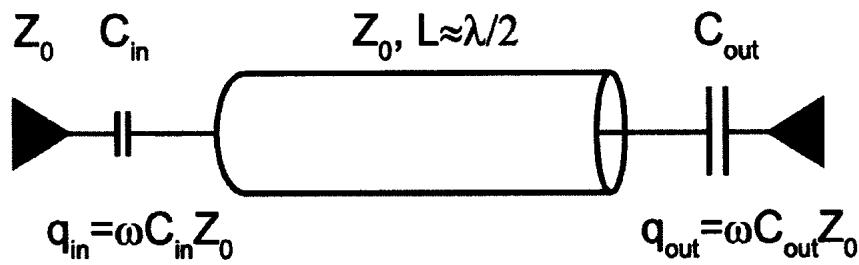  
图3.8 透射式谐振腔等效模型

$$
\left( \begin{array} { c c } { { A } } & { { B } } \\ { { { \bf C } } } & { { { \bf D } } } \end{array} \right) _ { \mathrm { T L } } = \left( \begin{array} { c c } { { \cosh ( \alpha + \mathrm { j } \beta )  l } } & { { Z _ { 0 } \sinh ( \alpha + \mathrm { j } \beta ) l } } \\ { { 1 / Z _ { 0 } \sinh ( \alpha + \mathrm { j } \beta ) \mathrm { l } } } & { { \cosh ( \alpha + \mathrm { j } \beta ) \mathrm { l } } } \end{array} \right)\tag{3.39}
$$

耦合电容的 ABCD 矩阵为：

$$
{ \left( \begin{array} { l l } { \tt A } & { \tt B } \\ { \tt C } & { \tt D } \end{array} \right) } _ { \tt C } = { \left( \begin{array} { l l } { 1 } & { 1 / { \tt j } \omega C _ { k } } \\ { 0 } & { 1 } \end{array} \right) }\tag{3.40}
$$

总的谐振电路的ABCD传输矩阵是每一级二端口网络传输矩阵的乘积。假设输入和输出耦合电容分别是 ${ \mathsf { C } } _ { \mathrm { i n } }$ 和 $\mathbf { C _ { o u t } }$ ，有

$$
\left( \begin{array} { l l } { \mathsf { A } } & { \mathsf { B } } \\ { \mathsf { C } } & { \mathsf { D } } \end{array} \right) = \left( \begin{array} { l l } { \mathsf { A } } & { \mathsf { B } } \\ { \mathsf { C } } & { \mathsf { D } } \end{array} \right) _ { \mathsf { C } _ { \mathsf { i n } } } \left( \begin{array} { l l } { \mathsf { A } } & { \mathsf { B } } \\ { \mathsf { C } } & { \mathsf { D } } \end{array} \right) _ { \mathsf { T L } } \left( \begin{array} { l l } { \mathsf { A } } & { \mathsf { B } } \\ { \mathsf { C } } & { \mathsf { D } } \end{array} \right) _ { \mathsf { C } _ { \mathsf { o u t } } }\tag{3.41}
$$

得到总的谐振电路ABCD矩阵后，整个系统的散射参数可由下式得到

$$
\begin{array} { c } { \displaystyle \mathsf { S } _ { 2 1 } = \frac { 2 } { \boldsymbol { \mathsf { A } } + \boldsymbol { \mathsf { B } } / \mathsf { R } _ { \mathrm { L } } + \boldsymbol { \mathsf { C } } \mathsf { R } _ { \mathrm { L } } + \boldsymbol { \mathsf { D } } } } \\ { \displaystyle \approx \frac { \mathsf { T } _ { 0 } } { 1 + \mathsf { j } \frac { \omega - \omega _ { 0 } } { ( \kappa _ { \mathrm { i n } } + \kappa _ { \mathrm { o u t } } ) / 2 } } } \end{array}\tag{3.42}
$$

其中泄漏率：

$$
\kappa _ { \mathrm { i n / o u t } } = \frac { 2 } { \pi } \omega _ { 0 } { \bf q } _ { \mathrm { i n / o u t } } ^ { 2 }\tag{3.43}
$$

最大透射率：

$$
\mathbb { T } _ { 0 } = \frac { \sqrt { \kappa _ { \mathrm { i n } } \kappa _ { \mathrm { o u t } } } } { \left( \kappa _ { \mathrm { i n } } + \kappa _ { \mathrm { o u t } } \right) / 2 }\tag{3.44}
$$

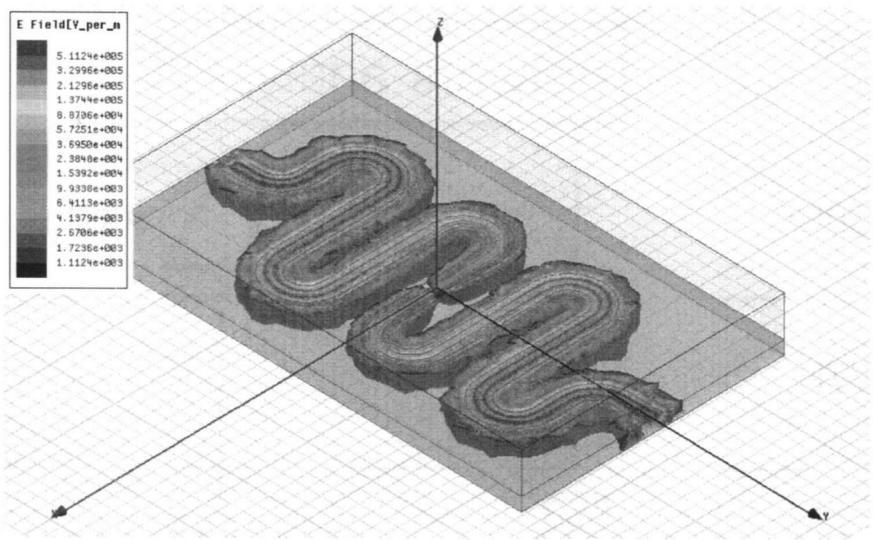  
图3.9 透射式谐振腔电磁模拟

从散射参数我们可以在谐振频率附件画出谐振腔透射谱的振幅和相位。显然振幅线型为洛仑兹型，我们对测量到的参数进行拟合，即可得到谐振频率和品质因子。

## 3.2.2 制作加工

前面的理论给出了我们计算谐振腔参数的方法。在实际操作中，我们在得到参数的初步估计后，会在电磁仿真软件中画出模型进行模拟，并调整优化参数以达到最优效果。图3.9是使用HFSS软件模拟的透射式谐振腔。可以看到在谐振时，两端开路处电场强度最大，与我们的预期相符。

按上述设计订做掩膜，使用光刻技术来制作样品，最后镀铝来就可以完成透射式谐振腔的制作。在制作过程中要注意以下几点：

1. 介质基片的选择。介电损耗是透射式谐振腔最主要的能量损耗来源。因此一定要选择电阻率大的基片制作样品。高Q值的谐振腔都是在本征非掺杂硅片或蓝宝石基片上制作的。若要使用掺杂型硅片，一定要使用轻度掺杂的，并且最好在基片表面生长一层SiO2绝缘层。对于掺杂型GaAs基片，在制作谐振腔的区域一定要刻蚀掉二维电子气。

2. 光刻精度。保证金属平滑整齐，电磁损耗小，无载品质因子高。所以在紫外曝光显影时一定要使光刻胶边缘平整，尤其是较窄的中心线末端，不要有明显的畸变。

3. 蒸镀金属要干净。当蒸镀A1时要保证腔体干净，避免有其他金属的污染。

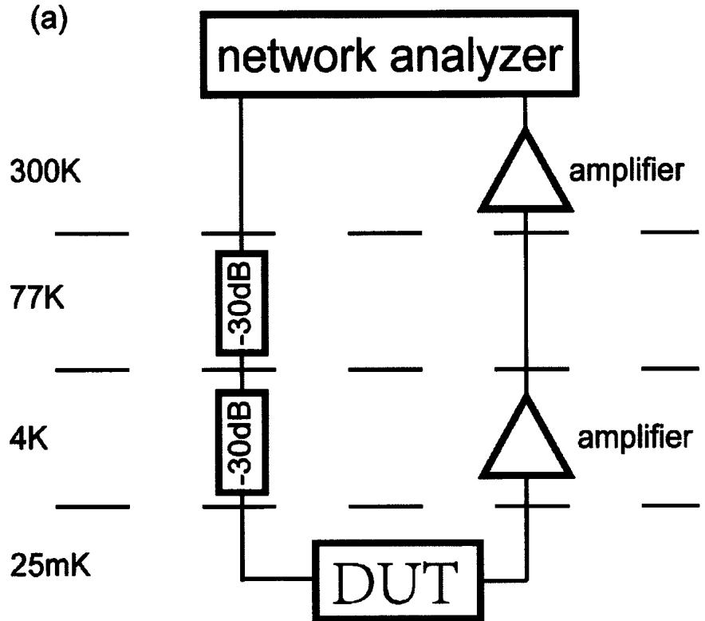  
图3.10 透射式谐振腔电磁模拟

## 3.2.3 测量表征

平面谐振腔在室温下导体损耗很大，不能形成谐振，必须将其置于低温下，金属处于超导状态时，才能观察到谐振信号。原装的稀释制冷机上并没有提供相应的微波测量条件，必须对其进行改装。透射式谐振腔典型的测量路线如图3.10所示

对稀释制冷机中测量线路的改造主要包括两个部分，输入部分的滤波和输出部分的放大。最终输入到样品上的微波信号功率通常只有-110dBm以下（纳瓦量级)，这比高温时热噪声的信号还要弱。因此为了避免噪声的影响，必须将高温热噪声信号滤掉，即微波信号也要做到良好的“热沉”。热噪声是宽频带的，所以最直接的做法就是在每个温度层都加一个宽频的衰减器，将这一层的热噪声直接衰减掉。当然这样也会衰减输入信号，但最初输入的信号可以比较强，经过层层衰减，最终达到样品上的功率满足要求即可。在每一温度层滤波时，输入信号都是强于热噪声信号的。

输出线路的要求则恰好相反，要将有效的信号迅速放大到强于热噪声信号。由于热功率的限制，微波放大器最低只能安装到4K温度层。为了防止放大器的噪声对样品进行反向干扰，需要在样品和放大器之间加装一个单向导通的环形器。从样品到放大器的信号可以正常通过，反向的信号则被大大衰减（20dB以上)。通常在室温时还会在加装一级放大器以便于测量。室温放大器只是增加了微波信号的绝对强度，信噪比还是有第一级的4K温层的放大器所决定的。

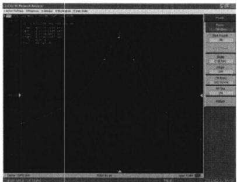

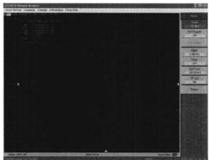  
图3.11 网络分析仪测得的透射式谐振腔振幅和相位的频谱

单纯的谐振腔比较简单，是一个标准的二端口器件，因此直接使用网络分析仪就可测量。图3.11显示了铝透射式谐振腔处于稀释制冷机base温度时的振幅和相位的频谱，与理论完全吻合。从中可以提取出谐振频率和品质因子。

超导谐振腔在极低温时才能达到最佳的工作状态，品质因子最高。随着温度的升高，超导性被破坏，金属电阻增大，谐振腔导体损耗增大，品质因子逐渐降低。当温度超过超导临界温度，谐振信号会因为电阻损耗太大而完全被破坏。因此做变温实验，观察谐振腔品质因子随温度的变化关系，是鉴别透射频谱S21中的尖峰是否是谐振腔信号的重要方法。

## 3.3 反射式耦合线传输线谐振腔

## 3.3.1 传输线实现

耦合微带线是另一种传输线实现。如图3.12所示，在介质基片上制作出两条相互平行的金属导带线，就构成了耦合微带线。耦合微带线的参数由以下几个参数控制：导带线的宽度w，线间距s，介质基底的厚度h和介电常数ε。实际上，耦合微带线和共面波导的金属平面是互补的，二者是对偶结构。

耦合微带线的电特性完全可以用等效电容来刻画[48]。如图3.12所示，设两个导体之间的电容为 ${ \sf C } _ { 1 2 }$ ，每个导体与地之间的电容为 $\mathsf { C } _ { 1 1 }$ 和 $C _ { 2 2 }$ 。采用奇偶模分析法来研究耦合微带线的特征阻抗。对于偶模激励，在两个导体带上的电流幅值相等，方向相同，此时电力线的分布如图3.13(a)所示。电场关于中心线偶对称，两根导体之间没有电流流过。因此等效电容网络中的 ${ \mathsf { C } } _ { 1 2 }$ 相当于开路。每根线到地的电容为

$$
{ \mathsf C } _ { e } = { \mathsf C } _ { 1 1 } = { \mathsf C } _ { 2 2 }\tag{3.45}
$$

偶模的特征阻抗为：

$$
Z _ { 0 } ^ { e } = \sqrt { \frac { \mathrm { \Delta } L } { \mathrm { \Delta } C _ { e } } }\tag{3.46}
$$

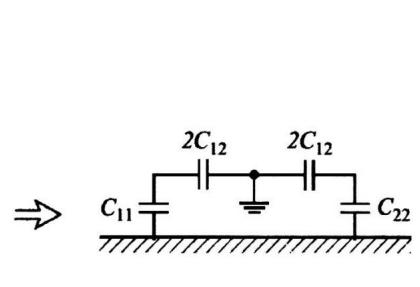

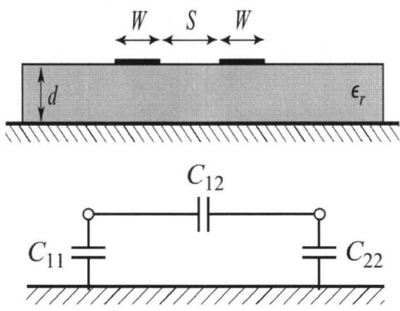  
图 3.12 耦合微带线截面示意图和电容模型[48]

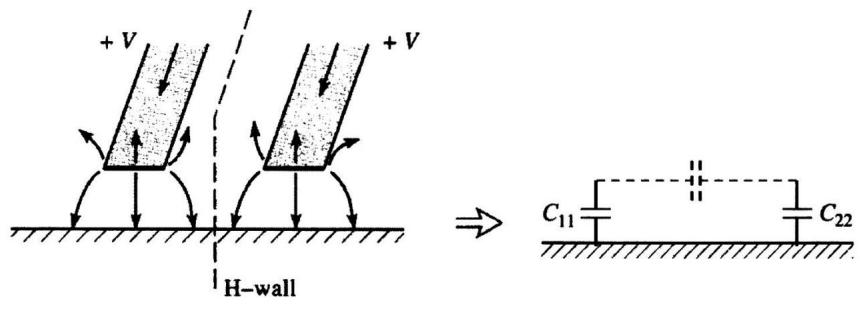  
(a)

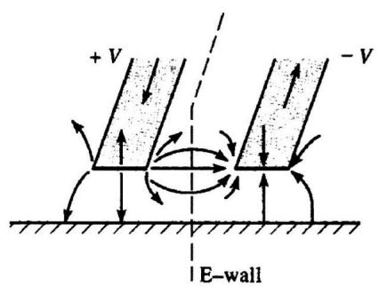  
(b)  
图 3.13 (a) 偶模激励 (b) 奇模激励 [48]

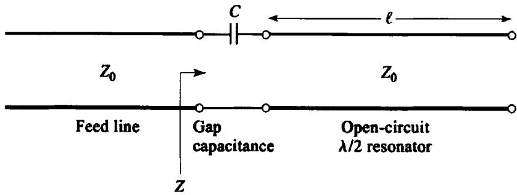  
图 3.14 谐振腔和耦合缝隙的等效电路 [48]

对于奇模激励，在两个导体带上的电流幅值相等，但方向相反，此时电力线的分布如图3.13(b)所示。电力线关于中心线奇对称，在两根导体之间存在零电压。我们可以假设在 $\mathsf C _ { 1 2 }$ 中间有一个接地平面，等效电路如图3.13(b)所示。这时每根线到地的电容为

$$
\mathrm { C } _ { \bullet } = \mathrm { C } _ { 1 1 } + 2 \mathrm { C } _ { 1 2 } = \mathrm { C } _ { 2 2 } + 2 \mathrm { C } _ { 1 2 }\tag{3.47}
$$

奇模的特征阻抗为：

$$
Z _ { 0 } ^ { \circ } = \sqrt { \frac { \mathrm { L } } { \mathsf { C } _ { \circ } } }\tag{3.48}
$$

耦合微带线的任何激励模式都可以看作偶模和奇模按一定比例叠加的效果。在反射式谐振腔中，我们使用的是奇模激励。

## 3.3.2 谐振腔分析

取耦合微带线的长度为设计频率波长的一半，并将微带线两端都开路，就可得到半波长开路谐振腔。通常采用缝隙将谐振腔耦合到外界电路，缝隙可近似为一个串联电容，总的等效电路如图3.14所示[48]。归一化输入阻抗为：

$$
z = \frac { Z } { Z _ { 0 } } = - \mathrm { j } \frac { 1 / \omega C + Z _ { 0 } \cot \beta \mathrm { l } } { Z _ { 0 } } = - \mathrm { j } \frac { \tan \beta \mathrm { l } + \mathrm { b } _ { c } } { \mathrm { b } _ { c } \tan \beta \mathrm { l } }\tag{3.49}
$$

其中 ${ \tt b } _ { \tt c } = Z _ { 0 } \omega { \tt C }$ 为耦合电容C的归一化电纳。在发生谐振时， $z = 0 ,$ 有

$$
\tan { \beta } \mathbf { l } + \mathbf { b } _ { c } = 0\tag{3.50}
$$

由于 ${ \sf b } _ { \sf c } \ll 1$ ，可以将 $z ( \omega )$ 在基模谐振频率 ${ \mathfrak { \beta } } { \mathfrak { l } } = \pi$ 处的谐振频率 $\omega _ { 1 }$ 展开，有

$$
\left. { \frac { \mathrm { d } z } { \mathrm { d } \omega } } \right| _ { w _ { 1 } } = { \frac { - \mathrm { j } \sec ^ { 2 } \beta \mathsf { l } } { \mathsf { b } _ { c } \tan \beta \mathsf { l } } } { \frac { \mathrm { d } ( \beta \mathsf { l } ) } { \mathrm { d } w } } = { \frac { \mathrm { j } ( 1 + \mathsf { b } _ { \mathrm { c } } ^ { 2 } ) } { \mathsf { b } _ { c } ^ { 2 } } } { \frac { 1 } { v _ { \mathsf { p } } } } \approx { \frac { \mathrm { j } } { \mathsf { b } _ { c } ^ { 2 } } } { \frac { 1 } { v _ { \mathsf { p } } } } \approx { \frac { \mathrm { j } \pi } { w _ { 1 } \mathsf { b } _ { c } ^ { 2 } } }\tag{3.51}
$$

所以归一化阻抗可展开为：

$$
z ( \omega ) \approx z ( \omega _ { 1 } ) + ( \omega - \omega _ { 1 } ) \frac { \mathrm { d } z ( \omega ) } { \mathrm { d } \omega } \bigg | _ { \omega _ { 1 } } = \frac { \mathrm { j } \pi ( \omega - \omega _ { 1 } ) } { \omega _ { 1 } \mathsf { b } _ { \mathrm { c } } ^ { 2 } }\tag{3.52}
$$

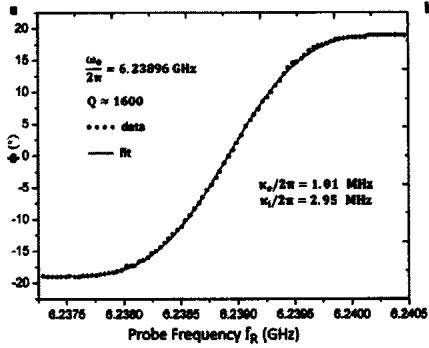

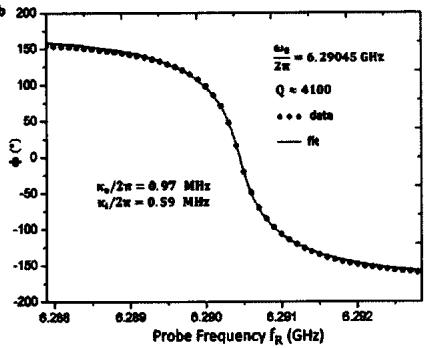  
图3.15 透射式谐振腔相位随频率的变化

对于有损耗的情况，用复谐振频率 $\omega _ { 1 } / ( 1 + \mathrm { j } / 2 0 )$ 替换掉谐振频率 $\omega _ { 1 }$ ，可得缝隙耦合有耗谐振腔的输入阻抗可以表示为：

$$
z ( w ) = \frac { \pi } { 2 \mathrm { Q b } _ { \mathrm { c } } ^ { 2 } } + \mathrm { j } \frac { \pi ( \omega - \omega _ { 1 } ) } { \omega _ { 1 } \mathbf { b } _ { \mathrm { c } } ^ { 2 } }\tag{3.53}
$$

可以注意到，无耦合的半波长开路传输线谐振器相当于一个并联的集总LC谐振电路，但经过缝隙电容耦合后，则是相当于一个串联的集总LC谐振电路。这是因为串联耦合电容有阻抗倒相器的作用。此处使用的品质因子 $\mathbf { Q }$ 为内部品质因子。

在谐振时输入电阻 $\mathtt { R } = Z _ { 0 } z ( \omega ) = Z _ { 0 } \pi / 2 \mathrm { Q } _ { \mathrm { i } } \mathfrak { b } _ { \mathtt { c } } ^ { 2 }$ ，可得耦合系数

$$
{ \mathfrak { g } } = { \frac { \mathrm { Q } _ { \mathrm { i } } } { \mathrm { Q } _ { \mathrm { e } } } } { = } { \frac { \mathrm { Z } _ { 0 } } { \mathrm { R } } } = { \frac { 2 \mathrm { Q } _ { \mathrm { i } } \mathrm { b } _ { \mathrm { c } } ^ { 2 } } { \pi } }\tag{3.54}
$$

将上式带入式3.52，可得：

$$
z ( \omega ) = \frac { 1 } { g } ( 1 + \mathrm { j } 2 \mathbb { Q } _ { \mathrm { i } } \frac { \Delta w } { \omega _ { 1 } } )\tag{3.55}
$$

所以缝隙耦合有耗谐振腔的反射谱为：

$$
\mathsf { S } _ { 1 1 } = \frac { z ( \omega ) - 1 } { z ( \omega ) + 1 } = \frac { 1 - \mathsf { g } + \mathsf { j } 2 \mathsf { Q } _ { \mathrm { i } } \frac { \Delta \omega } { \omega _ { 1 } } } { 1 + \mathsf { g } + \mathsf { j } 2 \mathsf { Q } _ { \mathrm { i } } \frac { \Delta \omega } { \omega _ { 1 } } }\tag{3.56}
$$

谐振腔反射谱相位的变化如图3.15所示，可以看到在过耦合区 $( \mathbf { g } = \kappa _ { e } / \kappa _ { \mathrm { i } } > 1 )$ 和欠耦合区 $( { \mathfrak { g } } < 1 )$ ，相位变化的方向是不同的。更一般地，我们可以微波理论进行分析。可以将耦合微带线看作以四端口网络，采用奇偶模分析，可以得到其散射矩阵为：

$$
\mathsf { S } = \left( \begin{array} { c c c c } { 0 } & { \frac { \sqrt { 1 - c ^ { 2 } } } { \sqrt { 1 - c ^ { 2 } } \cos \beta 1 + \mathrm { j } \sin \beta \mathrm { l } } } & { \frac { \mathrm { j } \cot \beta 1 } { \sqrt { 1 - c ^ { 2 } } + \mathrm { j } \tan \beta \mathrm { l } } } & { 0 } \\ { \frac { \sqrt { 1 - c ^ { 2 } } } { \sqrt { 1 - c ^ { 2 } } \cos \beta 1 + \mathrm { j } \sin \beta \mathrm { l } } } & { 0 } & { 0 } & { \frac { \mathrm { j } \cot \beta 1 } { \sqrt { 1 - c ^ { 2 } + \mathrm { j } \sin \beta \mathrm { l } } } } \\ { \frac { \mathrm { j } \tan \beta 1 } { \sqrt { 1 - c ^ { 2 } + \mathrm { j } \tan \beta \mathrm { l } } } } & { 0 } & { 0 } & { \frac { \sqrt { 1 - c ^ { 2 } } } { \sqrt { 1 - c ^ { 2 } } \cos \beta 1 + \mathrm { j } \sin \beta \mathrm { l } } } \\ { 0 } & { \frac { \mathrm { j } \mathrm { c u n } \beta 1 } { \sqrt { 1 - c ^ { 2 } + \mathrm { j } \tan \beta \mathrm { l } } } } & { \frac { \sqrt { 1 - c ^ { 2 } } } { \sqrt { 1 - c ^ { 2 } \cos \beta \mathrm { l } + \mathrm { j } \sin \beta \mathrm { l } } } } & { 0 } \end{array} \right)\tag{3.57}
$$

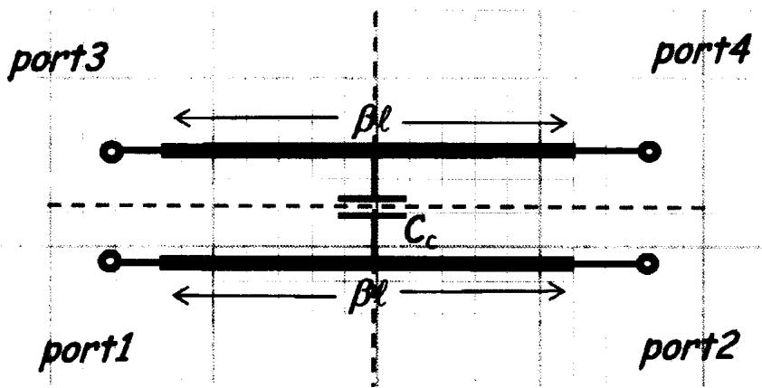  
图3.16 耦合微带线的四端口模型

其中电压耦合系数为

$$
\mathsf { c } = \frac { Z _ { 0 } ^ { \mathsf { e } } - Z _ { 0 } ^ { \mathsf { o } } } { Z _ { 0 } ^ { \mathsf { e } } + Z _ { 0 } ^ { \mathsf { o } } }\tag{3.58}
$$

对于谐振腔结构，可取βl=π，端口2和端口4端接无穷大电阻，端口1和端口3端接差分信号，将上述散射矩阵化为单端口网络的S参数。从此S参数和缝隙电容的ABCD矩阵出发，就可以得到最终谐振腔的散射参数。

## 3.3.3 制作加工

前面的理论给出了我们设计谐振腔的方法。在实际操作中，我们在得到参数的初步估计后，会在电磁仿真软件中画出模型进行模拟，并调整优化参数以达到最优效果。使用HFSS软件模拟反射式谐振腔，可以看到在谐振时，两端开路处电场强度最大，与我们的预期相符。

在模拟检查设计无误后，就可以按照设计订做掩膜，使用光刻技术来制作样品。具体的制作过程与反射式谐振腔类似，注意事项也一致。

## 3.3.4 测量表征

与透射式谐振腔类似，也必须在低温下金属处于超导状态时，才能观察到谐振信号。但由于测量的是反射信号，所以测量电路与透射式谐振腔有所不同，如图3.17所示。除了用作热沉的衰减器和增强信号的放大器外，测量电路中还有两个关键器件：环形器和180度混合环。180度混合环为自制的。当端口1接地后，在端口4施加的输入信号会在端口2和端口3等分成两个有180度相位差的分量，即形成差分信号。反之若输入信号在端口2和端口3，则在端口4会形成输入信号的差。因此180混合环提供了将同轴线上的单边信号和耦合线谐振腔需要的差分信号相互转化的作用。环形器是单向导通的3端口器件，微波输入信号从端口1到端口2进入样品，样品反射回来的信号从端口2到端口3进入接收线路。因此环形器实现了谐振腔输入信号和输出信号的分离。具体的测量实例详见第4章。

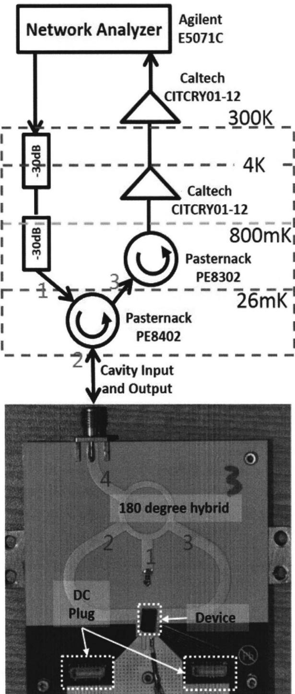  
图3.17 反射式谐振腔测量电路

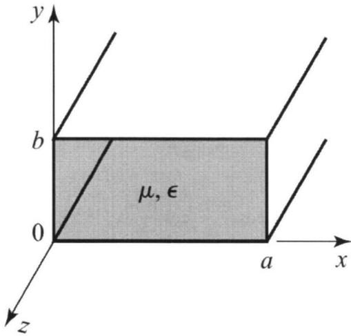  
图 3.18 矩形波导结构

## 3.4 3D 谐振腔

## 3.4.1 设计模拟

除了采用微纳加工工艺制作直接在晶圆上制作的平面谐振腔外，国际上最新的研究中开始采用3D结构的金属谐振腔。与平面谐振腔相比，3D谐振腔有一下点优势：

1. 3D谐振腔体积很大，完全依靠宏观的机械加工技术即可制成，可在工厂中批量加工。

2. 3D谐振强采用全封闭结构，因此辐射能量损失极小，可以获得极高的品质因子，可以更好地屏蔽电磁噪声。

3. 3D谐振腔和晶片上的量子比特系统是独立设计的，当希望二者耦合时只需要将固态量子系统放入谐振腔中即可，这样每次实验只需更换样品，谐振腔可重复利用。

## 3.4.1.1 矩形波导

矩形波导可以看作3D谐振腔中使用的传输线实现。波导结构如图3.18所示，四面为金属导体，波导中填充有介电常数为ε和磁导率为μ的材料。由于波导是由单个导体组成的，所以只能传播仅出现纵向磁场分量的TE波，或仅出现纵

向电场分量的 TM波。限于篇幅，我们值考虑最简单的TE模[48]。在电磁波传播的z方向上，有 $\mathtt { E } _ { z } = 0$ ，而 $\mathsf { H } _ { z }$ 满足：

$$
\left( \frac { \partial ^ { 2 } } { \partial \mathbf { x } ^ { 2 } } + \frac { \partial ^ { 2 } } { \partial \mathbf { y } ^ { 2 } } + \mathbf { k } _ { c } ^ { 2 } \right) \mathbf { h } _ { z } ( \mathbf { x } , \mathbf { y } ) = 0\tag{3.59}
$$

其中 $\mathsf { H } _ { z } ( \boldsymbol { \mathsf { x } } , \boldsymbol { \mathsf { y } } , z ) = \mathsf { h } _ { z } ( \boldsymbol { \mathsf { x } } , \boldsymbol { \mathsf { y } } ) e ^ { - \mathrm { j } \beta z }$ $\boldsymbol { \mathsf { k } } _ { \mathsf { c } } ^ { 2 } = \boldsymbol { \mathsf { k } } ^ { 2 } - \boldsymbol { \mathsf { \beta } } ^ { 2 }$ 为截至波数。由此可解得 ${ \mathsf { T E } } _ { \mathtt { m n } }$ 模的各电磁场分量为：

$$
\begin{array} { l } { { \displaystyle { \mathsf { H } } _ { z } = \lambda _ { \mathsf { m n } } \cos \cos \frac { \mathsf { m } \pi \pi } { \mathsf { a } } \cos \frac { \mathsf { n } \pi \mathsf { n } } { \mathsf { b } } e ^ { - \mathrm { j } \mathrm { \mathsf { s } } z } } } \\  { \displaystyle { \mathsf { E } } _ { \mathrm { x } } = \frac { \mathrm { j } \omega \mathsf { k n } \pi } { \mathsf { k } _ { c } ^ { 2 } \mathrm { b } } \boldsymbol { A } _ { \mathsf { m n } } \cos \frac { \mathsf { m } \pi \kappa } { \mathsf { a } } \sin \frac { \mathsf { n } \pi \mathsf { n } } { \mathsf { b } } e ^ { - \mathrm { j } \mathrm { \mathsf { s } } z } } \\  { \displaystyle { \mathsf { E } } _ { \mathrm { y } } = \frac { - \mathrm { j } \mathsf { w l } \pi \pi } { \mathsf { k } _ { c } ^ { 2 } \mathrm { a } } \boldsymbol { A } _ { \mathsf { m n } } \sin \frac { \mathsf { m } \pi \kappa } { \mathsf { a } } \cos \frac { \mathsf { n } \pi \mathsf { n } } { \mathsf { b } } \mathrm { e } ^ { - \mathrm { j } \mathrm { \mathsf { s } } z } } \\  { \displaystyle { \mathsf { H } } _ { \mathrm { x } } = \frac { \mathrm { j } \mathrm { j } \mathsf { m } \pi } { \mathsf { k } _ { c } ^ { 2 } \mathrm { a } } \boldsymbol { A } _ { \mathsf { m n } } \sin \frac { \mathsf { m } \pi \kappa } { \mathsf { a } } \cos \frac { \mathsf { n } \pi \mathsf { n } } { \mathsf { b } } e ^ { - \mathrm { j } \mathrm { s } z } } \\  { \displaystyle { \mathsf { H } } _ { \mathrm { y } } = \frac { \mathrm { j } \mathrm { B } \pi } { \mathsf { k } _ { c } ^ { 2 } \mathrm { b } } \boldsymbol { A } _ { \mathsf { m n } } \cos \frac { \mathsf { m } \pi \kappa } { \mathsf { a } } \sin \frac { \mathsf { n } \pi \mathsf { n } } { \mathsf { b } } e ^ { - \mathrm { j } \mathrm { s } z } } \end{array}\tag{3.60}
$$

传播常数：

$$
\beta = \sqrt { \ k ^ { 2 } - \ k _ { \mathrm { c } } ^ { 2 } } = \sqrt { \ k ^ { 2 } - \displaystyle ( \frac { \ m \pi } { \alpha } ) ^ { 2 } - \displaystyle ( \frac { \ n \pi } { \mu } ) ^ { 2 } }\tag{3.61}
$$

在大多数应用中，通过选择工作频率和波导尺寸，使得只有基模 $T E _ { 1 0 }$ 可以传播。$T E _ { 1 0 }$ 的具体参数如下：

$$
\begin{array} { l } { { \displaystyle { \mathbb { H } } _ { z } = { \mathsf { A } } _ { 1 0 } \cos { \frac { \pi x } { \mathbf { a } } } e ^ { - \mathrm { i } \beta z } } } \\ { { \displaystyle { \mathbb { E } } _ { \mathbf { y } } = \frac { - \mathrm { j } w \mathrm { j } \mathbf { a } } { \pi } { \mathsf { A } } _ { 1 0 } \sin { \frac { \pi x } { \mathbf { a } } } e ^ { - \mathrm { j } \mathrm { \beta } z } } } \\ { { \displaystyle { \mathbb { H } } _ { \mathbf { x } } = \frac { \mathrm { j } \beta \mathbf { a } } { \pi } { \mathsf { A } } _ { 1 0 } \sin { \frac { \pi x } { \mathbf { a } } } e ^ { - \mathrm { j } \mathrm { \beta } z } } } \\ { { \displaystyle { \mathbb { E } } _ { \mathbf { x } } = { \mathsf { E } } _ { z } = { \mathsf { H } } _ { \mathbf { y } } = 0 } } \\ { { \displaystyle { \mathsf { \beta } } = \sqrt { \mathbf { k } ^ { 2 } - ( \pi / \mathbf { a } ) ^ { 2 } } } } \end{array}\tag{3.62}
$$

由此可以得到具体的电磁场分布，如图3.19所示

## 3.4.1.2 矩形谐振腔

将矩形波导的两端封闭，就可以得到矩形谐振腔，实际上，矩形谐振腔就是一个全封闭的中空金属盒子。如图3.20所示，由边界条件 $z = 0$ 处 $\mathtt { E } _ { \mathtt { t } } = 0$ 和$z = \mathbf { d }$ 处 $\bar { \mathsf E } _ { \mathfrak t } = 0$ ，可以得到谐振频率满足：

$$
\beta _ { \mathfrak { m } \mathfrak { n } } \mathrm { d } = \mathrm { l } \mathfrak { p } . \qquad 1 = 1 , 2 , 3 , \cdot \cdot \cdot\tag{3.63}
$$

即腔的长度必须是半波导波长的整数倍，矩形谐振腔相当于短路 $\lambda / 2$ 传输线谐振腔。

$$
T E _ { 1 0 }
$$

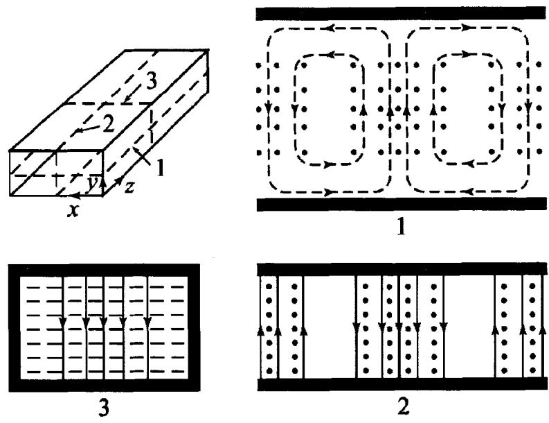  
图3.19 ${ \sf T E } _ { 1 0 }$ 模电磁场分布[48]

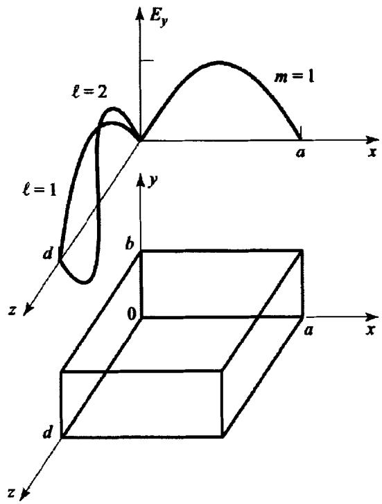  
图 3.20 矩形谐振腔 [48]

(b)

(a)  
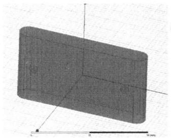

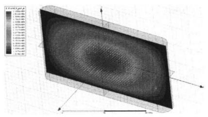

(c)  
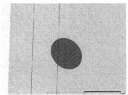

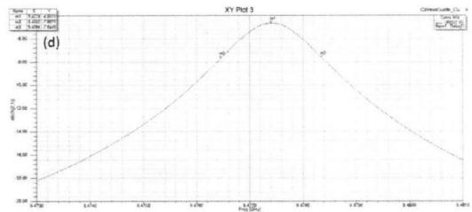  
图 3.21 (a)3D 谐振腔结构 (b) 谐振时电场分布(c) 阻抗线方向(d) 透射散射参数

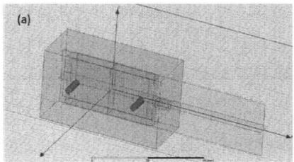

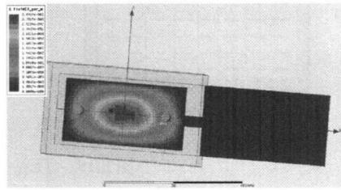

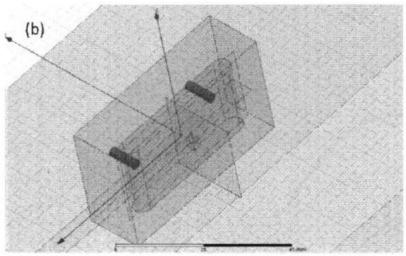

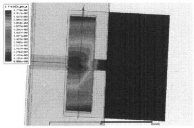  
图3.22 (a)侧壁开槽结构以及谐振时电场分布 (b)后壁开槽结构以及谐振时电场分布

## 3.4.2 模拟

根据以上理论，我们设计一个基模频率在9.5GHz附近的3D矩形谐振腔，并使用HFSS软件进行了模拟。如图3.21所示，对于基模谐振频率，波导传播方向为x方向，谐振电场方向垂直于yz平面。我们在平行于 $\mathbf { y } \mathbf { z }$ 平面的金属面上开了两个圆形小孔，作为谐振腔的输入输出，阻抗线方向为从圆形中心到其边缘。从透射谱 $S _ { 2 } 1$ 可以看出，在频率 $\mathsf { f } = 9 . 4 5 \mathsf { G } \mathsf { H } z$ 处确实能形成谐振，谐振处最大透射率较低，这是因为波导谐振腔是单导体结构，只能传播TE模或TM模，所以从TEM模的波端口向TE模的矩形谐振腔传播时会有一定的失配，能量传递效率低。

在进一步的实验中，我们希望能够实现3D谐振腔和量子点结构的耦合。但是量子点体系需要很多的控制门电极，需要有直流导线进出3D谐振腔。因此，除了上面讨论的全密封结构，我们还仔细研究了3D谐振腔壁上开洞，并考虑了引入直流引线的各种可能方案。我们使用HFSS软件，分别模拟了在3D谐振腔的侧壁和后壁上开槽的结构，如图3.22所示。从电磁场分布图可以看出，在平行与谐振电场方向的平面上开槽（如xz平面或xy平面)，并不会造成谐振腔能量的泄漏，对谐振状态的影响很小。

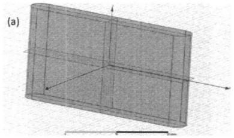  
(b)

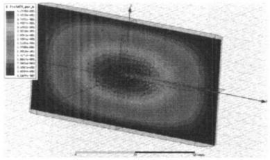

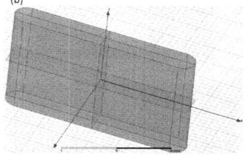

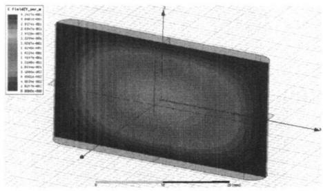  
图3.23 (a) 侧壁深入单根线对谐振腔电场分布的影响(b) 侧壁深入多根线对谐振腔电场分布的影响

出于加工上的便利，我们选择在平行与xy平面的面上开槽。我们还进一步研究了从槽中将金属引线深入到3D谐振腔中心的方案。如图3.23所示，我们讨论了金属线的长度、宽度和个数对谐振腔的影响。从图中可以看出，金属线伸展方向垂直于电场方向，所以长度本身对电场没有什么影响。但金属线总有一定的宽度，宽度方向与电场方向相同，所以会改变电场分布，“挤压”电磁场，造成电磁场向无金属处集中。同样，若增加金属线的个数，也使得平行于电场方向的金属宽度增加，影响原本的谐振电场分布。如果金属线有电阻，还会造成谐振腔能量的泄漏损耗。最终我们认为最有利的方案是在3D谐振腔的侧壁开槽，从这一侧垂直于电场方向将金属引线深入到3D谐振腔中心，而且引线的直径越细越好。

## 3.4.3 测量表征

根据上一节中设计模拟的结果，我们制作了金属Cu和金属A1的3D谐振腔，分别如图3.24所示。实验中需要注意的问题是如何将在同轴线中传播的TEM模微波转化为在谐振腔汇中传播的TE模微波。我们的方法是直接将同轴线的线芯裸露，将其插入到谐振腔中。具体的微波传播效率和线芯深入谐振腔的长度有关，需要在实际的样品中不断调节测试，才能得到最佳结果。和前面讨论的平面结构的谐振腔不同，3D谐振腔由于没有中心引线，导体损耗大大降低，因此在室温下就可以形成谐振。我们直接使用网络分析仪就可以测量得到3D谐振腔的透射谱。当然随着温度的降低，金属电阻减小，3D谐振腔侧壁产生的损耗也逐渐减少。当在超导温度以下，3D谐振腔可以获得最佳的工作状态。在base温度约为20mK，可以看到能量损耗明显减少，Q值大幅增加，达到10的5次方以上。

(a)  
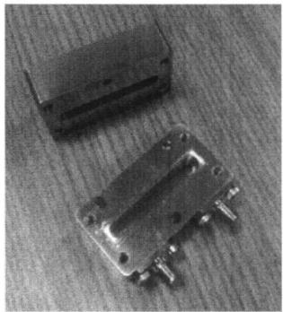

(b)  
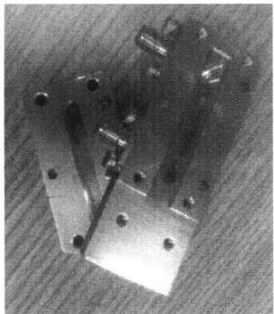

(c)  
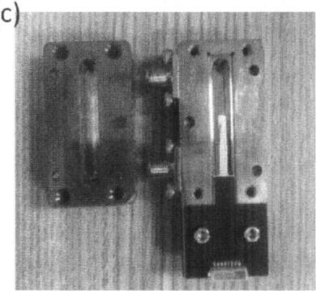

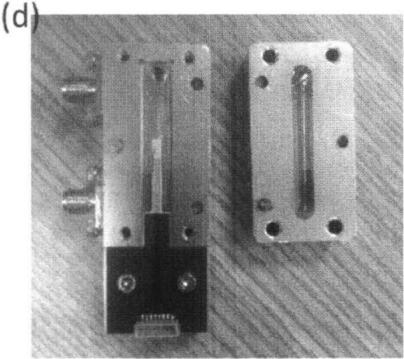

图 3.24 (a) 全封闭铝制 3D 谐振腔 (b) 侧壁开槽铝制 3D 谐振腔(c) 加有直流引线的铜制 3D谐振腔(d)加有直流引线的铝制3D谐振腔
<table><tr><td rowspan=1 colspan=1></td><td rowspan=1 colspan=1>室温Q值</td><td rowspan=1 colspan=1>低温Q值</td></tr><tr><td rowspan=1 colspan=1>全封闭铝制3D 谐振腔</td><td rowspan=1 colspan=1>~3500</td><td rowspan=1 colspan=1>~200000</td></tr><tr><td rowspan=1 colspan=1>侧壁开槽铝制 3D 谐振腔</td><td rowspan=1 colspan=1>~3000</td><td rowspan=1 colspan=1>~100000</td></tr><tr><td rowspan=1 colspan=1>加有直流引线的铝制3D谐振腔</td><td rowspan=1 colspan=1>~2000</td><td rowspan=1 colspan=1>~8000</td></tr></table>

表3.1 不同结构和温度下的谐振腔品质因子

我们还制作了侧壁带有开口的谐振腔，如图3.24所示。在室温下测的Q值约为3000，与不开口的同结构的谐振腔相当。这说明开口本身确实不会导致谐振腔能量泄漏，与理论模拟结果相符。

在此基础之上，我们制作了深入3D结构的直流线PCB板，如图3.24所示。由于电路加工工艺的限制，每条直流引线的线宽0.1mm，间距0.1mm。不同结构不同温度下谐振腔品质因子的变化总结于表3.1中

# 此页不缺内容

万方数据

## 第四章 二维电子气对谐振腔调谐性质研究

前一章中我们介绍了微波谐振腔的基本知识和各种不同类型的谐振腔。可以注意到谐振腔的性质主要是由其结构决定的，一旦结构固定了，谐振腔的性质也就确定了。但在实际应用中，我们总是希望能够即时地对谐振腔的结构进行调整。本章中，我们将讨论一个利用二维电子气浓度的变化调谐谐振腔的实验。通过调节控制电极电压，我们可以将谐振腔的Q值在2700到600之间大范围的变动。我们认为这种直接通过电压调制谐振腔的技术有着广泛的应用前景。

## 4.1 实验动机

基于平面波导结构（CPW）实现的超导传输线谐振腔在 Circuit QED量子计算架构中扮演了重要的角色[51-54]。在超导约瑟夫森结量子比特方案中，它已经成功地被用于单量子比特控制[55,56]，非破坏性量子比特读取[57,58]，以及作为量子总线耦合多个量子比特[59-61]。传输线谐振腔与门控量子点[62-65]之间的耦合也被实现[66,67]。但是，门控量子点的结构较为复杂，需要多个门电极加以控制，这些门电极在几何上需要占据大量面积。但是透射式传输线谐振腔中心信号线两侧完全是由地平面覆盖的，为了将量子点与中心线耦合，控制电极会大面积地占据谐振腔地平面，破坏其完整性造成了额外的能量泄漏。因此在和量子点系统耦合的方案中，我们认为使用无地平面的谐振腔是比较理想的选择。

在本章中，我们将讨论一个在GaAs衬底上实现的反射式谐振腔的具体结构和性质。并且通过控制反射式谐振腔下方的二维电子气，我们实现了对谐振腔的大范围调谐。UCBerkeley的实验小组曾提出了四分之一波长的反射式谐振腔结构[68,69]，四分之一波长谐振腔需要在谐振腔的一端生长一层绝缘的氧化层，并在其上覆盖设计好尺寸的金属层以实现射频短路。我们实验中采用的是半波长谐振腔方案。相比于UC Berkeley的设计方案，我们采用的结构只需要蒸镀一层金属，无需额外的氧化层，所以易于制作加工。而且半波长谐振腔两端都采用开路设计，都可用于连接其他量子系统，可以实现将多个量子比特耦合在一起，扩展性更高。

## 4.2 样品结构和测量

实验样品结构如图4.1(a)所示。反射式传输线谐振腔由一对耦合微带线组成，微带线线宽9um，线间距16um。谐振腔设计谐振频率5.5GHz，所以微带线总长9mm。微带线通过交趾电容与外界耦合，交趾电容结构如图4.1(d)所示，线长和间距分别为 ${ \mathfrak { s l } } = 1 0 0 \mu \mathrm { m }$ ${ \mathfrak { s } } 2 = 3 0 ~ { \mu } { \mathrm { m } }$ 和 ${ \mathfrak { s } } 3 = 5 0 \ { \mu } \mathbf { m }$ 。谐振腔是在掺杂型GaAs衬底上制作的，GsAs晶圆厚度为 650um，二维电子气约在晶圆表面下方

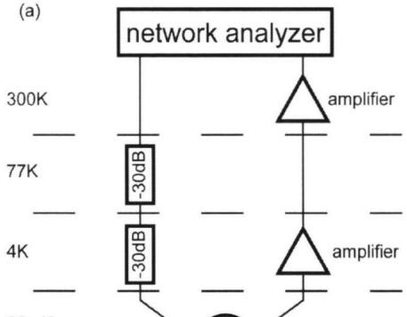

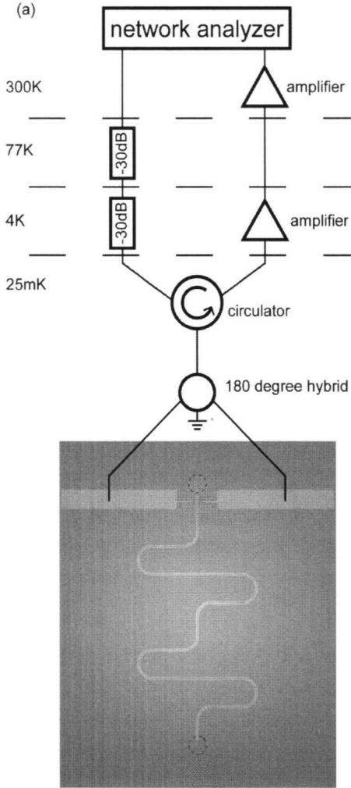

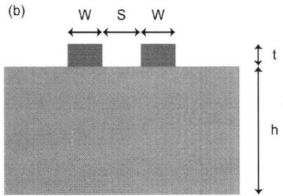

(c)  
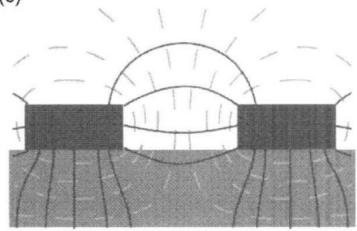

(d)  
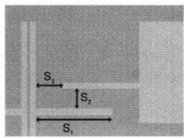

(e)  
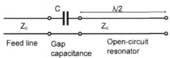  
图4.1 (a)反射式谐振腔在光学显微镜下的图像和微波测量电路示意图。浅色区域为谐振腔结构。(b)耦合微带线横截面示意图(c)耦合微带线电磁场分布示意图(d)交趾电容放大图像(e)反射式谐振腔等效电路模型

100nm处。在第一步的实验中，我们为了避免二维电子气能量泄漏降低谐振腔的品质因子，我们将二维电子气层全部刻蚀掉，刻蚀深度为200nm。谐振腔使用标准的紫外光学曝光工艺制作，热蒸发镀金属Al，厚度300nm。耦合微带线横截面结构如图4.1(b)所示。图4.1(c)示意了耦合微带线基模的电磁场分布。耦合微带线是一种对称结构，所以通常采用差分的激励方式，即加在耦合微带线两臂上的微波信号振幅相等，但相位差180度。

我们使用网络分析仪测量了样品的反射频谱。样品被置于稀释制冷机中，base温度20mK。测量电路如图4.1(a)所示。这里用到的两个核心器件是环形器和180度混合环。环形器利用了晶体的不对称性制成，是一种单向导通的射频元件，微波信号在环形器的3个端口只能沿某方向单向循环传播，反方向则不行。由网络分析仪发出的输入微波信号经过环形器后进入样品，样品反射回来的信号则再次经过环形器后进入输出线路被HEMT放大。环形器在这里主要作用将微波输入信号和样品反射回来的信号隔离开来。反射信号通常较微波输入信号很弱，直接使用同一线路测量很容易收到干扰，而且反射信号被分开的可以用射频放大器HEMT进一步放大，提高了信号强度。但是HEMT放大器本底噪声温度约为4K，远高于样品所处温度，直接将二者连接起来会造成HEMT本底热噪声对样品的反向干扰。使用了环形器，就可以避免HEMT本身的噪声反向传输到样品。耦合微带线属于对称结构，在激励时要用振幅相等但方向相反的差分信号。180度混合环的作用是将单端的输入微波信号变为相位相差180度的差分信号，并将耦合微带线谐振腔反射回来的差分信号再合成单端信号。最终反射回来的信号还需要经过液氦温区增益为32dB的放大器和室温增益为35dB的放大器二级放大，才能有效地被网络分析仪接收到。为了避免引起加热效应和非线性效应，我们控制加在谐振腔样品上的微波功率在-110dBm以下。

## 4.3 结果讨论

最终我们测量到的反射谱如图4.2所示。和开路半波长谐振腔的理论预期一样，我们可以观察到在谐振位置反射频谱的振幅会有一个吸收峰，而相位会反生反转。使用公式

$$
\mathsf { S } _ { 2 1 } = \frac { 1 - 9 + \mathbf { j } \times 2 \mathsf { Q } _ { \mathrm { i n t } } \frac { \Delta \omega } { \omega _ { 0 } } } { 1 + 9 + \mathbf { j } \times 2 \mathsf { Q } _ { \mathrm { i n t } } \frac { \Delta \omega } { \omega _ { 0 } } }\tag{4.1}
$$

对数据进行拟合，我们可以得到样品的内部品质因子 $\mathrm { Q } _ { \mathrm { i n t } } \approx 2 7 2 5$ ，外部品质因子为 $\mathrm { Q _ { e x t } } \approx 4 8 4 7$ 。注意到对于反射式谐振腔，通过一次拟合就可以同时得到内部品质因子 $\mathbf { Q _ { i n t } }$ 和外部品质因子 $\sf { Q } _ { e x t }$ 。但在透射式谐振腔的实验中，需要多批不同耦合电容的样品进行比较，才能将二者确定下来[70]。

内部品质因子和外部品质因子分别描述了谐振腔内部和外接电路上的能量损耗。内部损耗是由样品本身的性质决定的，主要包括导体电阻损耗，辐射损耗和介电损耗三个因素。我们的样品由金属A1制成，在低温下已处于超导状态，所以导体电阻损耗是很小的。在我们的样品中，电磁场主要分布于耦合微带线的两臂之间，由于样品的结构尺寸很小，耦合微带线距离很近，所以辐射损耗也不是谐振腔能量泄漏的主要原因。因此，介电损耗才是影响内部品质因子的主要因素。这是而对于都是采用本征硅片或蓝宝石基片作为衬底的。

## 4.4 可调谐谐振腔

但是利用这种介质损耗性质，我们设计了一种可对谐振腔进行调制的结构。如图4.3(a)所示，在对二维电子气进行刻蚀的步骤中，我们不是将所有的二维电子气都刻蚀掉，而是保留了一块200umx200um大小的mesa。其后光刻制作谐振腔，让谐振腔从mesa上方穿过，mesa距离谐振腔末端约1/8波长。为了能控制mesa下部的二维电子气，我们又制作了一层过量曝光的PMMA作为绝缘层覆盖在mesa和谐振腔之上，厚度约为50nm。在绝缘层之上，我们又制作了60nm 厚的金属 Al控制电极覆盖住 mesa所在区域。

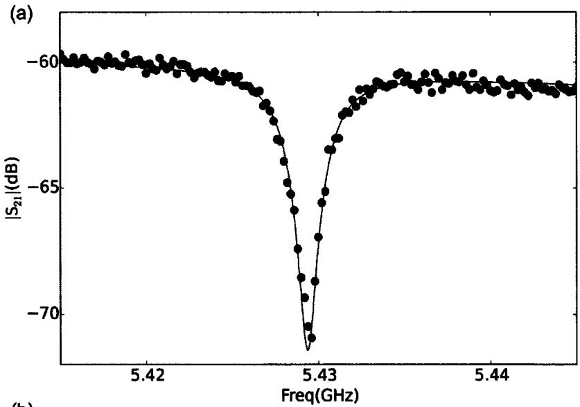

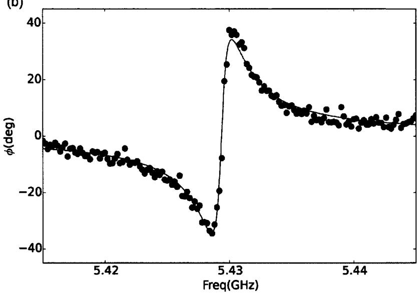  
图4.2 谐振腔反射频谱(a)幅值随频率的变化。(b)相位随频率的变化。

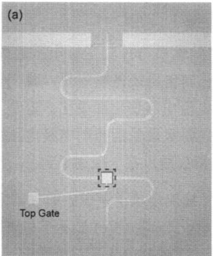

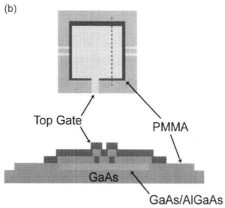

(c)  
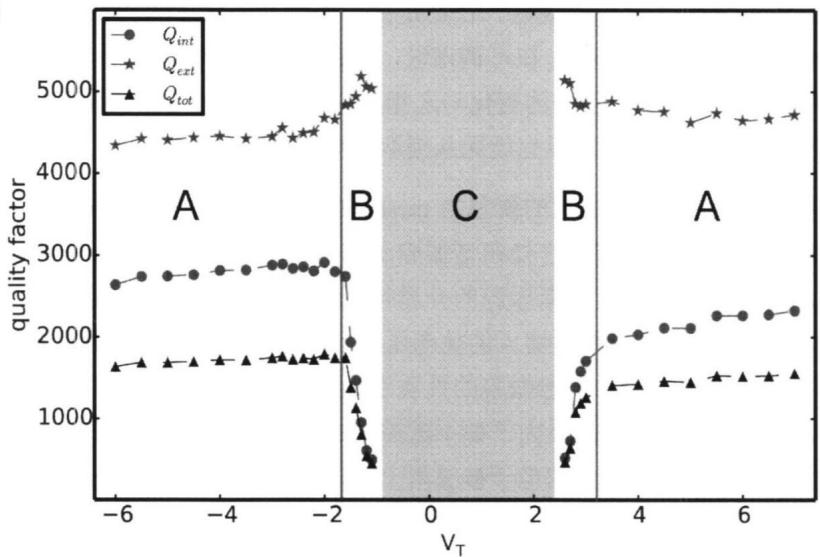  
(d)

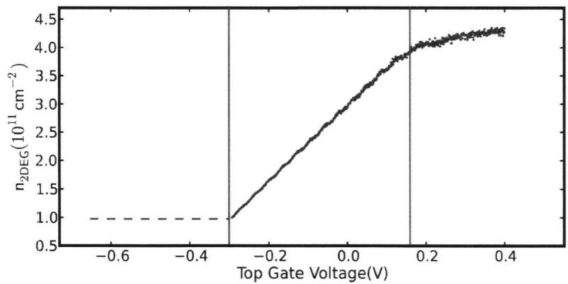  
图4.3 (a)耦合了二维电子气的反射式谐振腔光镜图像。(b) 包含二维电子气层、PMMA层和顶部控制门电极的谐振腔横截面。(c)三种不同电压区域下内部品质因子（红圈)、外部品质因子（蓝星）和总的有载品质因子（黑三角）的变化：（A）稳定器，（B）可调谐区，(C）消失区。(d)采用同样晶圆制作的Hall bar中电子气浓度随顶部控制电极的变化(无PMMA层）

在base温度下，我们研究了透射式谐振腔的性质与控制电极电压的关系。当在控制电极电压VT的绝对值很大，无论是正向电压还是负电压，我们都可以观察到很好的谐振信号，而且信号几乎不随电极电压变化而变化。但是，在VT较小的区间（-1.7V到3.2V)，谐振信号的强弱明显受到控制电极电压的影响。特别是在-0.9到2.4V的区间，谐振信号变得很弱，完全探测不到了。

为此，在从不同的控制电极电压下，我们仔细地记录了谐振腔的频谱信号，并进行数据拟合提取了内部品质因子和外部品质因子。图4.3(c)显示了品质因子随电极电压变化的情况。我们可以看住，这幅图可大致被分为了三个区域：A稳定区、B可调谐区和C消失区。在稳定区，外部品质因子和内部品质因子都不随门电极电压变化而变化。在可调谐区，内部品质因子快速地从2700左右跌至600左右，而外部品质因子的变化与之相反，有些轻微的增加。在消失区，已经无法观察到谐振信号，所以也就无从提取品质因子了。

我们认为图4.3(c)所示的现象与mesa中二维电子气的存在有关。二维电子气层相当于一层导电层，它处在谐振腔下方百纳米处，距离远小于耦合微带线间距，所以会极大地增加谐振腔的介质损耗，导致微波能量被吸收，无法形成谐振。当控制电压VT是足够大的负电压时，谐振腔下方的二维电子气都已被排空，不会吸收微波信号对谐振腔的性质造成影响。所以此时可以观察到较强的谐振，而且内部和外部品质因子都不随控制电压变化而变化。当控制电压VT是足够大的正电压时，大量的电子被吸附上来，我们猜测此时GaAs异质结的导带基本被填满，二维电子气层也没有自由的电子可以吸收微波能量的光子，所以也形成了微波能量不发生损耗的稳定区。

当控制电压小到超过某个阈值时，GaAs异质结的导带处于半满状态，电子气浓度开始受到控制电压的调制。随着电压的变化，mesa中二维电子层的电阻率发生改变，相应的介质损耗也发生变化，由此引起谐振腔能量泄漏的变化，内部品质因子随之改变。外部品质因子主要由外部电路的性质所决定，因此在控制电压改变时变化不大。

图4.3(d)所示的数据有力的支持了我们的猜测。我们采用同样的GaAs晶圆，制作了一块带有顶部控制电极的Hallbar样品，并在不同的控制电极电压下测定了二维电子气浓度。如图所示，随着控制电极电压由负变正，二维电子气载流子浓度逐渐从完全排空的状态变为饱和的状态，与上方图例所示的区域相对应。当然我们可以注意到图4.3(d)中控制电压的变化范围要比图4.3(c)中电压的变化范围小得多。这主要是由样品结构造成的。我们的谐振腔结构中有一层额外的过暴PMMA做作为绝缘层，用于隔离顶部控制电极和谐振腔，这导致控制电极的lever arm变小，因此需要更大的电压变化范围才能得到相同的结果。

## 4.5 本章小结

本章主要描述了一个在砷化镓基片上制作的反射式谐振腔的实例，并且研究了二维电子气对谐振腔的调制作用。我们用标准的开路半波长谐振腔模型解释了观察到的反射频谱，并直接从中同时提取了内部Q值和外部Q值。相比于传输线谐振腔，由我们设计改进的反射式谐振腔结构简单，金属占用面积少，可在基片上留出大量空间以便于耦合其他系统。实际上，我们实验室已经开始开展了使用这种类型的谐振腔同时耦合4个量子比特的实验。

当在谐振腔的中部位置制作一个二维电子气结构后，我们发现通过顶部电极电压就可以影响到谐振腔频率和品质因子。这种通过电信号实时改变谐振腔性质的能量为谐振腔在量子信息技术中的应用提供了额外的想象空间。由于二维电子气可以很方面地和其他类型的固态谐振腔体系耦合起来，我们期望这种电极调制现象能够在固态量子计算或其他平面谐振腔应用中发挥出潜在的应用作用。

# 此页不缺内容

万方数据

## 第五章 谐振腔测量量子点导纳性质

在本章中，我们测量了一块反射式谐振腔和Graphene量子点的耦合结构。石墨烯量子点与源漏之间的通道被刻蚀的很窄，隧穿率很低，无法通过输运直接测量信号。但是借助于高品质因子的谐振腔，我们依然能够通过谐振腔反射频谱振幅和相位的移动测的石墨烯双量子点稳态电荷分布相图。更进一步，通过电路模型分析，我们还能提出量子点的复导纳和电子隧穿率。我们展示的这项技术提供了一种新的灵敏探测孤立量子点的方法。

## 5.1 实验动机

由于潜在的消相干时间比较长，碳基材料在固态量子信息研究中得到了关注，特别是仅有单层碳原子构成的石墨烯[71-73]，更是被广泛研究。作为一种备选的量子比特方案，石墨烯量子点的性质也已经得到深入的研究[74-77]。量子点的消相干主要来源于各种电噪声干扰，其中包括量子点源漏的电荷抖动噪声。如果能将量子点与源漏隔离起来，做成孤立系统，则可进一步延长消相干时间[78–80]。但孤立系统的测量本身就是一个问题。最近，量子点的复导纳在理论[81]和实验[82-84,84]上得到了广泛的关注。在本章中，我们将展示一个利用片上谐振腔测量近似孤立的石墨烯双量子点复导纳的实验。有赖于片上谐振腔的高品质因子，我们可以很好的测量出近似孤立量子点的极大电阻和和极小的电容。这项技术提供了一种新的灵敏探测孤立量子点的方法，而且相比于QPC 等结构，更易于加工和设计[85,86]。

## 5.2 样品结构和测量

样品结构如图5.1(a)所示，由制作在同一基片上的石墨烯量子点和反射式谐振腔耦合而成[87]。石墨烯量子点采用刻蚀法制成：先用机械剥离的方法在硅片衬底上得到单层石墨烯，然后使用感应等离子体（ICP）将其刻蚀成双量子点的形状。量子点周围的电极使用电子束曝光工艺制作，由3nm的金属Ti和20nm的金属Au蒸镀而成。最外面的金属谐振腔使用光刻工艺制作，材质为Al，厚度300nm。如图5.1(b)所示，反射式谐振腔耦合微带线的两臂分别连接到量子点的源漏电极上。

测量电路如图5.1(a)所示。耦合微带线通过缝隙电容与外界微波测量电路相连。我们使用网络分析仪测量谐振腔的反射频谱。在谐振腔的中部伸出的两个电极用于给量子点源漏提供偏压并测量电流。理论模拟和实验都表明，这两个电极是从谐振腔微波振荡电场最弱的地方引出的，不会对谐振腔的振荡模式。控制门电极L、M和R用于改变双量子点中的静电势。整个样品被置于稀释制冷机（base温度约为30mK）中，并做了很好的热屏蔽以杜绝外界热辐射的影响。

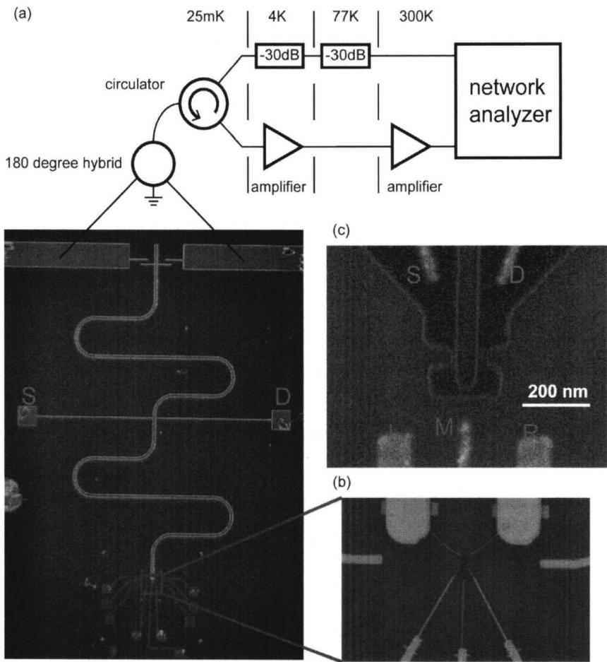  
图 5.1 (a) 反射式谐振腔和 Graphene 量子点耦合结构在光学显微镜下的图像，以及微波测量电路示意图 (b)量子点附近放大图像(c)量子点电子显微镜成像。黑色区域为Graphene 结构。量子点连接谐振腔的电极为 S 和 D，门控制电极为 L，M和 R。

实验测量分为三个步骤。首先，在控制门电极都接地，谐振腔不加载功率的情况下，我们在石墨烯量子点的源漏电极上加上偏压直接测量其输运性质。然而，即使将源漏之间的偏压加到50μV，我们也无法测的任何有效的电流(<10fA)。通过扫描门电极L、R和M也没有任何帮助，依旧无法探测到有效的电流。这说明量子点源漏之间电阻是非常大的（>5GΩ)，不能通过直接的输运测量来获取量子点的信息。量子点源漏电阻大是和结构相关的，如图5.1(c)所示，在石墨烯刻蚀过程中，量子点和源漏之间被刻蚀得很窄，因此隧穿势垒很大而隧穿率很低，导致不能测到源漏之间的电流。

其次，在所有量子点电极都接地的情况下，我们测量了反射式谐振腔的性质。通过拟合反射频谱，我们可以得到谐振腔的中心频率为6.291GHz，有载品质因子为4100。在整个实验中，直接加在谐振腔上的微波功率都在-110dBm以下，以避免热效应和非线性效应。再次，我们固定微波输入频率为6.2912GHz，记录谐振腔的反射信号，同时扫描量子点的控制门电极，使用谐振腔来探测量子点。量子点源漏电极接地，中间电极M的电压调整到合适的位置，门电极L和R可以分别控制量子点左右两点中电子的数目。如图5.2所示，通过谐振腔反射谱振幅和相位的变化，我们都可以清晰地观察到六角蜂窝状的图形。这是双量子点典型的输运相图结构[88,89]，说明我们刻蚀的 Graphene 结构实际上已经形成了量子点。虽然我们的双量子点是近似孤立的，不能通过电流信号探测到，但仍能通过谐振腔灵敏地探测到。谐振腔是一种灵敏的电荷变化探测结构。

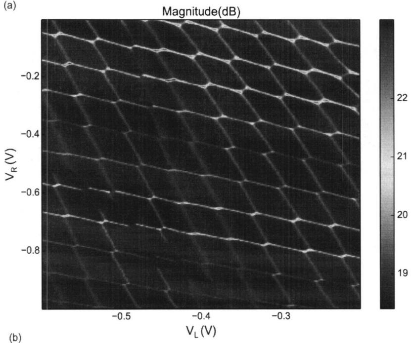

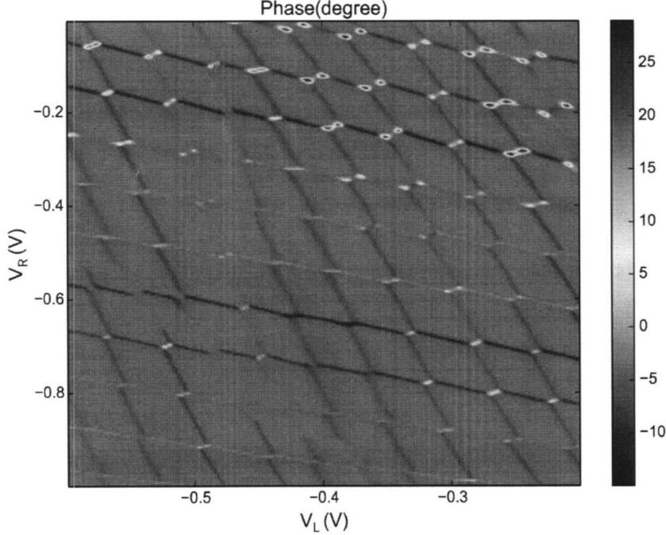  
图5.2 (a) 谐振腔反射谱振幅随控制门电极L 和 R 变化。六边形蜂窝形状是双量子点输运相图的典型图样(b)相同电压区域谐振腔相位的变化

(a)  
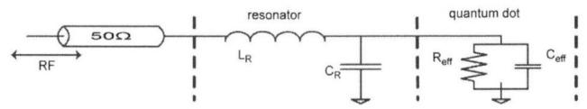

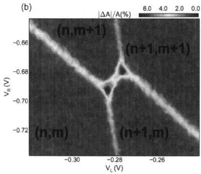

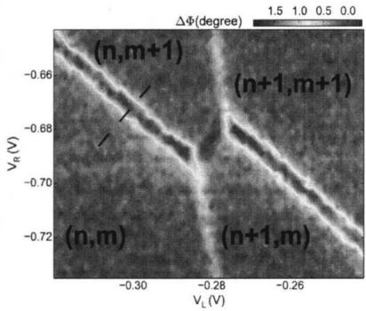  
图5.3 (a)谐振腔和双量子点的集总电路模型。在谐振频率附近，电容耦合的半波长反射谐振腔相当于串联LC谐振电路。量子点等效为一个并联的RC 电路。(b)量子点附近放大图像(c)量子点电子显微镜成像。黑色区域为 Graphene 结构。量子点连接谐振腔的电极为S和D，门控制电极为L，M和R。

## 5.3 结果分析

如图5.3(a)所示，为定量分析反射微波信号，我们可以将电容耦合的谐振腔等效为一个串联的集总谐振电路[48]。保持特征阻抗为50Ω，等效的LC谐振电路的电容值 $\mathrm { C } _ { \mathtt { R } } \approx 1 / \mathrm { Q } \omega _ { 0 } \overline { { \angle _ { 0 } } } \approx 0 . 1 2 \mathsf { f F }$ ，电感值 $\mathtt { L } _ { \mathtt { R } } = 1 / \omega _ { 0 } ^ { 2 } \mathtt { C } \approx 5 . 3 3 \mu \mathrm { H }$ 。同样，我们也可以将量子点等效为一个并联的RC电路，等效的复导纳可以表示为$\mathsf { Y } ( \omega _ { 0 } ) = \mathsf { R } _ { e f f } ^ { - 1 } + \mathsf { j } \omega _ { 0 } \mathsf { C } _ { e f f }$ 。在等效电路中，量子点门电极电压的变化会改变量子点中电子的分布，进而改变等效的复导纳，最终可通过微波信号探测到。

微波信号振幅的衰减与量子点的电阻有关[48,84]:

$$
\Delta \left. \mathbf { A } \right. / \mathbf { A } \approx 2 \mathbf { Q } ^ { 2 } \mathbf { Z } _ { 0 } / \mathbf { R }\tag{5.1}
$$

一个典型的电荷变化图样如图5.3(b)所示。在 triple point上，最大的振幅衰减约为6.4%，可得源漏之间的等效电阻约为25GΩ。如此大的等效电阻进一步说明我们量子点是近似孤立的，并解释了不能直接通过输运信号测量的原委。但是，

从式5.1可以看出，得益于片上谐振腔的高品质因子，我们可以探测到明显的微波反射信号。谐振腔反射谱相位的变化与量子点的等效电容有关：

$$
\Delta \Phi / \mathrm { C } \approx 2 \mathrm { Q } / \mathrm { C } _ { \mathrm { R } }\tag{5.2}
$$

如图5.3(b) 所示，穿过 $( \mathsf { n } , \mathsf { m } )  ( \mathsf { n } , \mathsf { m } + 1 )$ 的 charge transition 线，相位的移动约为1.6度，等效电容约为 $4 . 2 \times 1 0 ^ { - 4 } \mathrm { a F }$ 。这个值比典型的 Graphene 量子点的几何电容的值要小的多[74]，同样是由于我们的结构是近似孤立所造成的。

我们还可以换一个角度来理解电子在量子点和源漏之间的隧穿过程。输入与谐振频率相近的固定频率微波，会在谐振腔中建立谐振电场，进而在量子点源漏之间产生振荡电场，导致源漏费米面有随时间变化的能量差$\delta \varepsilon ( \mathrm { t } ) = \varepsilon _ { 0 } - e \alpha \mathsf { V } _ { \mathsf { R F } } ( \mathsf { t } )$ ，其中 ${ \pmb { \varepsilon } } _ { 0 }$ 为直流偏置， $\propto$ 为 lever arm。振荡电场会使电子在源漏和量子点之间来回隧穿，但这个过程还受到隧穿率Γ的影响，并通过复导纳描述出来。我们的体系处在非相干极限 $( \mathsf { h } \Gamma \ll \mathsf { k _ { B } } \mathsf { T } )$ 和不透明极限 $( \Gamma \ll \omega _ { 0 } )$ 下，等效的电阻和电容可以表示为[82,84,89]：

$$
\mathbb { R } _ { e f f } \approx \frac { 4 \nu _ { \mathbb { B } } \mathbb { T } } { e ^ { 2 } \alpha ^ { 2 } \Gamma } ( 1 + \frac { \Gamma ^ { 2 } } { \omega _ { 0 } ^ { 2 } } )\tag{5.3}
$$

$$
\displaystyle  { \mathbf { C } } _ { e f f } \approx \frac { e ^ { 2 } \alpha ^ { 2 } } { 4  { \mathbf { k } } _ { \mathrm { B } } \top } \frac { 1 } { 1 + \omega _ { 0 } ^ { 2 } / \Gamma ^ { 2 } }\tag{5.4}
$$

从上式可以看出，随着隧穿率Γ的降低，等效的电阻 $\pmb { { \mathrm { R } } _ { e f f } }$ 变大，电容 ${ \mathsf { C } } _ { \mathsf { e f f } }$ 变小，复导纳变小。在我们的实验中，电子温度约为100mK， $\mathrm { l e v e r a r m } \ \alpha \approx 0 . 0 5$ 。由$( \mathfrak { n } , \mathfrak { m } )  ( \mathfrak { n } , \mathfrak { m } + 1 )$ 的 charge transition 线处的电容变化，从式5.4可以得到隧穿率 $\Gamma \approx 3 7 M \mathrm { H z }$ 。将隧穿率带入式5.3,可得等效的电阻为2.3GΩ。虽然这个值比通过电路模型得到的电阻值要小，但仍然可以解释为什么不能通过直接输运测量到电流信号。

## 5.4 本章小节

在本章中，我们使用谐振腔测量了Graphene双量子点的复导纳。反射式谐振腔和量子点制作在同一基片上，我们记录了谐振腔幅值和相位随着量子点门控电极的变化，得到了双量子点电荷稳态分布相图。得益于谐振腔的高品质因子，几乎孤立的量子点可以被测量到。从相位信号的变化，我们还可以推断出量子点和源漏之间的隧穿率。本章展示的测量技术可被用于孤立量子点的灵敏电荷检测。

# 此页不缺内容

万方数据

## 第六章 谐振腔与量子点的耦合

## 6.1 腔电动力学的基本理论

## 6.1.1 光与原子的相互作用

光与物质的相互作用是量子电动力学重要的研究组成。其中最简单而重要的理论模型是 JC 模型

$$
{ \sf H } _ { \mathrm { J } { \sf C } } = \hbar \omega _ { \sf r } ( { \bf a } ^ { \dagger } { \bf a } + \frac { 1 } { 2 } ) + \hbar \frac { \omega _ { \sf a } } { 2 } \sigma _ { z } + \hbar g ( { \bf a } \sigma ^ { + } + { \bf a } ^ { + } \sigma ^ { - } )\tag{6.1}
$$

它描述了一个二能级原子和单模光场的相干相互作用。其中式6.1中第一项描述了电磁场的能量，每个光子的能量为 $\hbar \omega _ { \tau }$ ，第二项描述了跃迁能量为 $\hslash \omega _ { \bullet }$ 的自旋1/2的原子，可以用来描述二能级体系。第三项描述了原子和光子的偶极相互作用，原子可以速率 $\mathfrak { g }$ 吸收或发射光子。JC哈密顿量可以用来描述任何由费米子（二能级体系）和波色子（简谐振动）相互耦合的体系，只要满足旋波近似条件即可。

原子和光子的相互作用使得光子数态 $\vert \pmb { \mathrm { n } } \rangle$ 和原子的基态 $| { \mathfrak { g } } \rangle$ 、激发态|e)不再是体系的本征态。但在JC哈密顿量中，只有能级相近的原子和光子才会互相交换能量，体系总的激发数目保持不变。当原子处于基态时激发数目等于光子数，当原子处于激发态时激发数目为光子数加1。因此可以按激发数目将JC哈密顿量矩阵展开为：

$$
\left( \begin{array} { l l l l l l } { { 0 } } & { { } } & { { } } & { { } } & { { } } & { { 0 } } \\ { { } } & { { \left( \begin{array} { l l l } { { w _ { \tau } } } & { { } } & { { 9 } } \\ { { 9 } } & { { \omega _ { \tau } + \Delta } } \end{array} \right) } } & { { } } & { { } } & { { } } & { { } } \\ { { } } & { { } } & { { \left( \begin{array} { l l } { { 2 \omega _ { \tau } } } & { { \sqrt { 2 } { 9 } } } \\ { { \sqrt { 2 } { 9 } } } & { { 2 \omega _ { \tau } + \Delta } } \end{array} \right) } } & { { } } & { { } } & { { } } \\ { { } } & { { } } & { { \ddots } } & { { } } & { { } } \\ { { 0 } } & { { } } & { { } } & { { } } & { { \left( \begin{array} { l l } { { \ n \omega _ { \tau } } } & { { \sqrt { n } { 9 } } } \\ { { \sqrt { n } { 9 } } } & { { n \omega _ { \tau } + \Delta } } \end{array} \right) \Bigg ) , } } \end{array} \right)\tag{6.2}
$$

其中 $\Delta = \omega _ { \mathfrak { a } } - \omega _ { \mathfrak { r } }$ 为原子能级和光子能级之差。

对角线上不同激发数目的哈密顿矩阵相互独立，因此可以直接将每个小块的 $2 \mathbf { x } 2$ 哈密顿矩阵对角化，得到体系总的能级为：

$$
\begin{array} { l } { \displaystyle \mathsf { E } _ { \pm , \mathsf { n } } = \frac { \hbar } { 2 } ( ( \mathsf { n } - 1 ) \omega _ { \mathsf { r } } + \omega _ { \mathsf { a } } \pm \sqrt { 4 \mathsf { n } g ^ { 2 } + \Delta ^ { 2 } } ) } \\ { \displaystyle \mathsf { E } _ { 9 , 0 } = - \frac { \hbar \Delta } { 2 } } \end{array}\tag{6.3}
$$

$$
m ) \_ \_ \mathrm { = } \_ \mathrm { = } \_ \mathrm { = } - \frac { \frac { \omega _ { \mathrm { s } } = \omega _ { \mathrm { r } } } { 2  g \sqrt { n } \Big [ \omega \Big ] } } { \Big ] } \_ \mathrm { = } - \mathrm { ~ - ~ } \_ \mathrm { = } 1 \cdot
$$

$$
\lim \limits _ { i  \infty } = - \sum \limits _ { n = 1 } ^ { \infty } \int \limits _ { \frac { \sin \alpha } { \sin \alpha } } ^ { \frac { \cos \alpha - \cos \alpha } { \sin \alpha } } d x = - \infty ,
$$

$$
| 2 \rangle \ --- \ \overline { { 2 9 ^ { \prime } 2 ! } } \ \mathrm { ~ --- ~ } | 1 \rangle
$$

$$
| 2 \rangle \quad \mathrm { ~ -- ~ } \frac { ( \omega _ { a } + 3 g ^ { 2 } / \Delta ) } { 1 } \widehat { \Big / \left( \omega _ { r } + g ^ { 2 } / \Delta \right) } \ .
$$

$$
1 0 ) - \frac { \sqrt { 0 } } { 1 0 } - \frac { \sqrt { 0 } } { 1 0 } = \frac { - \sqrt { 0 } } { 1 0 }\tag{1}
$$

$$
I \underbrace { \int \limits _ { - \infty } ^ { \infty } \frac { - 9 ^ { 2 } ( \Delta ) } { v } d v } _ { \texttt { i p } } \left. \int \limits _ { - \mathrm { ~ - ~ } - \mathrm { ~ - ~ } - \mathrm { ~ I ~ } \theta } ^ { \texttt { i } } I _ { \texttt { i } } ^ { - 1 } ( 0 ) \right. _ { \texttt { i } } \left. \underbrace { \int \limits _ { \Delta } ^ { \cdot } \frac { 1 } { v } d v } _ { \texttt { i } } \right. _ { \texttt { i } = \texttt { i } }\tag{10>}
$$

图6.1 JC哈密顿量能级示意图。虚线表示无相互作用时的能级，实线表示偶极耦合后的能级。|g)和 $| e \rangle$ 表示二能级原子的基态和激发态，n)表示光子数为n的态[49]

相应本征态为：

$$
\begin{array} { c } { { \left| - , \mathsf { n } \right. = \cos \mathsf { \Theta } _ { \mathrm { n } } \left| \mathsf { g } , \mathsf { n } \right. - \sin \mathsf { \Theta } _ { \mathrm { n } } \left| \mathsf { e } , \mathsf { n } - 1 \right. } } \\ { { \left| + , \mathsf { n } \right. = \sin \mathsf { \Theta } _ { \mathrm { n } } \left| \mathsf { g } , \mathsf { n } \right. + \cos \mathsf { \Theta } _ { \mathrm { n } } \left| \mathsf { e } , \mathsf { n } - 1 \right. } } \end{array}\tag{6.4}
$$

其中：

$$
\theta _ { \mathfrak { n } } = \frac { 1 } { 2 } \arctan ( \frac { 2 9 \sqrt { \mathfrak { n } } } { \Delta } )\tag{6.5}
$$

我们考虑两种极限的情况。

1. 一种极限的情况是原子跃迁能级 $\omega _ { \pmb { \mathscr { a } } }$ 和单个光子能量 $\omega _ { \tau }$ 简并。此时原子和光子直接地交换能量，使得他们都失去了原来的特征，体系的本征态变为原子和光子的最大相干叠加态 $\left. \Psi _ { \pm } \right. = \left( \left. \mathfrak { g } \right. \left. \mathfrak { n } \right. \pm \left. e \right. \left. \mathfrak { n } - 1 \right. \right) / 2$ ，相应的能级差为 $2 { \mathfrak { g } } { \sqrt { \mathfrak { n } } }$ 。如图6.1(a)所示。在这种情况下，处于基态的原子可以相干地跃迁到激发态，同时湮灭掉一个光子。或者反之从激发态跃迁到基态，同时产生一个光子。这一过程就被称为真空Rabi振荡，相应的跃迁频率为$\sqrt { \mathtt { n } } \mathfrak { g } / \pi$ 。即使在初态光子数为0的情况下，真空能量扰动使得Rabi振荡也是可以发生的。

2. 另一种极限情况是大失谐条件，原子跃迁能级与单个光子能量差远大于耦合强度 $\Delta = | \omega _ { \circ } - \omega _ { \mathsf { r } } | \gg \mathfrak { g }$ 。此时原子和光子不会有直接的能量交换。但通过虚光子作用，体系的能级还是按比例的移动了 $g ^ { 2 } / \Delta$ ，如图6.1(b)所示。实际上，用 $\mathsf { U } = \mathtt { e x p } [ \mathrm { i } ( \sigma ^ { + } \mathbf { a } + \mathbf { a } ^ { + } \sigma ^ { - } ) ]$ 对JC哈密顿量做旋转，并利用

$$
e ^ { \pmb { A } } \mathrm { B } e ^ { - \pmb { A } } = \mathrm { B } + [ \pmb { A } , \mathsf { B } ] + \frac { 1 } { 2 ! } [ \pmb { A } , [ \pmb { A } , \mathsf { B } ] ] + \frac { 1 } { 3 ! } [ \pmb { A } , [ \pmb { A } , [ \pmb { A } , \mathsf { B } ] ] ] + \cdot \cdot \cdot\tag{6.6}
$$

将哈密顿量展开到 $9 / \Delta$ 二阶项，近似有

$$
{ \sf H } \approx \hbar \omega _ { \sf r } ( { \sf a } ^ { \dagger } { \sf a } + \frac { 1 } { 2 } ) + \hbar \frac { \omega _ { \sf a } } { 2 } \sigma _ { z } + \hbar \frac { g ^ { 2 } } { \Delta } { \sf a } ^ { + } { \sf a } \sigma _ { z } + \hbar \frac { g ^ { 2 } } { 2 \Delta } \sigma _ { z }\tag{6.7}
$$

对应的本征能量为：

$$
\mathsf { E } _ { \pm , \mathsf { n } } \approx \hbar \mathsf { n } \omega _ { \mathsf { r } } \pm ( \pmb { \Delta } + \frac { \hbar } { 2 } \mathsf { n } g ^ { 2 } / \Delta )\tag{6.8}
$$

本征态为：

$$
\begin{array} { r } { \left| - , \mathfrak { n } \right. = \left| \mathfrak { g } , \mathfrak { n } \right. - ( \mathfrak { g } \sqrt { \mathfrak { n } } / \Delta ) \left| \mathfrak { e } , \mathfrak { n } - 1 \right. } \\ { \left| + , \mathfrak { n } \right. = ( \mathfrak { g } \sqrt { \mathfrak { n } } / \Delta ) \left| \mathfrak { g } , \mathfrak { n } \right. + \left| \mathfrak { e } , \mathfrak { n } - 1 \right. } \end{array}\tag{6.9}
$$

即体系的本征态基本上就是无相互作用时的能态，再加上很小的能量匹配态，

可以把式6.7整理成

$$
{ \mathsf { H } } = \hbar ( \omega _ { \mathsf { r } } + \frac { \mathsf { g } ^ { 2 } } { \Delta } \sigma _ { z } ) ( \mathsf { a } ^ { + } \mathsf { a } + \frac { 1 } { 2 } ) + \frac { \hbar \omega _ { \mathsf { a } } } { 2 } \sigma _ { z }\tag{6.10}
$$

上式的第一项仍然是谐振子的形式，但原子的状态会对光子谐振频率产生频移 $\pm { \mathfrak { g } } ^ { 2 } / \Delta$ 。利用这个性质，我们可以通过谐振腔中光子频率的变化来判断原子能量的变化。注意到光子数算符与H是对易的，因此这种测量方式是对原子状态的量子非破坏性测量。量子非破坏性测量的一个重要用途是通过不断的测量将原子投影到大概率的测量状态上，进而增加保真度。

式6.7还可以整理为如下的形式：

$$
{ \sf H } = \hbar { \omega _ { \mathrm { r } } } ( { \sf a } ^ { + } { \sf a } + \frac { 1 } { 2 } ) + \frac { \hbar } { 2 } ( { \omega _ { \mathrm { a } } } + \frac { 2 g ^ { 2 } } { \Delta } { \sf a } ^ { + } { \sf a } + \frac { g ^ { 2 } } { \Delta } ) { \sigma _ { z } }\tag{6.11}
$$

上式也只包含描述光子和描述原子的两项，但光子能量保存不变，而原子的能级由于相互作用的影响发生了改变。原子跃迁频率的移动包括两项，其中依赖于光子数的频移 $2 n g ^ { 2 } / \Delta$ 被称作 Stark频移，另一项由真空能量涨落引起的 ${ \mathfrak { g } } ^ { 2 } / \Delta$ 被称作Lamb频移。同样这个性质也可用于量子非破坏性测量，通过原子跃迁能级的改变来判断光子数。实际上，式6.10和式6.11中原子能级和光子能级的相互影响是对偶的，可以看作是海森堡不确定性原理的体现。

JC哈密顿量只是描述了光与原子作用的相干行为，在实际的体系中，非相干行为也非常重要。消相干主要来自3个方面：谐振腔中光子的泄漏或吸收，这通常用光子衰减速率 $\kappa = 0 / \omega$ 来表示；原子的非辐射衰减速率 $\pmb { \gamma } _ { \pmb { \mathrm { i } } }$ 以及原子在谐振腔中停留的时间 $\mathsf { T } _ { \mathtt { t r a n s } }$ 。对于固态体系中的“人工”原子来说， $\mathsf { T } _ { \mathtt { t r a n s } }$ 是无限长的，可以不予考虑。谐振腔中光子衰减κ是测量必须的，它意味着一部分光子能够从谐振腔中泄漏出来，进而被探测电路检测到。原子的衰减可分为辐射和非辐射两部分，辐射衰减意味着有光子放出，完全可以等价为原子与谐振腔中光子的相干相互作用以及光子从谐振腔中的泄漏。原子的非辐射衰减是固态体系中最主要的退相干因素，它受到材料和结构多方面的限制。

体系的行为与耦合强度和消相干速率的相对强弱密切相关。在耦合很强而退相干很弱的情况下，处在谐振腔中的原子就相干地吸收或者发射光子，产生真空Rabi振荡。如果Rabi振荡频率大于体系的消相干速率，在原子退相干或光子泄漏之前就可以观察到多次Rabi振荡，这时我们称体系到达强耦合极限 $( { \mathfrak { g } } > \gamma , \kappa )$ 。在强耦合情况下，系统总的衰减速率是原子和光子二者的平均$\Gamma _ { e f f } = ( \gamma + \kappa ) / 2$ 。当 $\kappa \gg \gamma$ 时，谐振腔会加速原子的衰减，这种现象被称为Purcell效应。Purcell效应提供了一个将不可控的非辐射损耗变为可控的辐射损耗的方法。

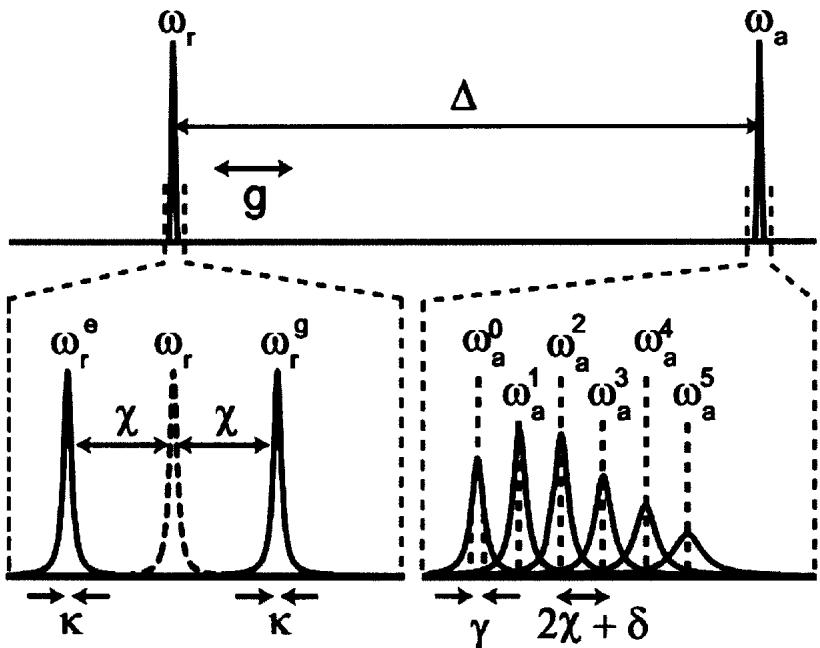  
图 6.2 强色散区中原子和光子的能谱[49]。

在大失谐情况下，我们需要比较dispersive频移和消相干速率的相对强弱。光子decay使得在测量光子频率时有κ的展宽，因此为了实现量子非破坏性测量，利用光子的频移来判断原子的状态，必须要求光子频移大于展宽 $\begin{array} { r } { \pmb { \chi } = \pmb { \mathrm { g } } ^ { 2 } / \Delta > \pmb { \kappa } . } \end{array}$ 同样，若利用量子非破坏性测量利用原子跃迁能级的变化来判断光子数，需要光子数引起的频移大于原子能级的展宽 $\chi = { \mathfrak { g } ^ { 2 } } / { \Delta } > \gamma$ ，如图6.2所示。我们称满足 $x > \gamma , \kappa$ 的体系处于强色散区。

更进一步，我们可以根据耦合强度q与消相干速率 $\Gamma = \operatorname* { m a x } ( \gamma , \kappa )$ 的比例，和频率差 $\Delta = | \omega _ { \mathsf { a } } - \omega _ { \mathsf { r } } |$ 与消相干速率Γ的比例，将原子与谐振腔的相互作用划分为以下几个区域，如图6.3所示：

在蓝色的强耦合区，原子和光子处于共振状态，可以观察到Rabi振荡。在红色的弱色散区，dispersive频移太小，是不能分辨光子数或原子状态的。在白色的强色散区，可以做量子非破坏性测量实验。在绿色区域，单个光子仍能分辨，但测量会对原子或光子的状态造成破坏。在黄色区域，谐振腔已经不是简谐振动模式了，需考虑到非线性效应，可以制备压缩态。

处在不同工作区域下的谐振腔可以用来研究不同的量子信息过程。强耦合区能实现Rabi振荡，可以用于量子信息在原子和光子之间的转移。弱色散区可以用来探测量子比特的状态，以及通过控制辐射来延长消相干时间。强色散区可以用来探测光子数，制备高级的量子光学态，甚至产生新的量子比特编码实现。这个体系为我们提供了广泛的研究空间。

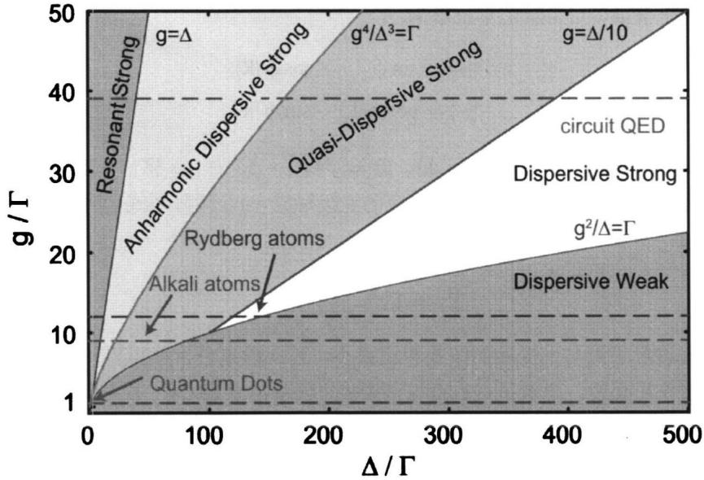

图 6.3 按耦合强度 g/Γ 和失谐量 Δ/Γ 划分的光与原子耦合体系的相图[49]。  
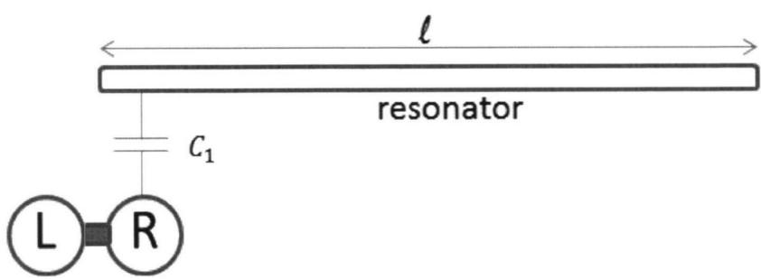  
图6.4 谐振腔与双量子点的耦合模型

## 6.1.2 量子点与腔的耦合

上一节我们讨论了腔与原子相互作用的一般理论。但在我们的实验中，并不是直接使用原子，而是用双量子点来“模拟”一个二能级的原子。本节我们将仔细讨论双量子点是如何与谐振腔相互作用的[90]。如图6.4所示，我们考虑只有一个电子的双量子点，标记电子处于左点和右点的状态分别标记为L)和R)，两点之间的隧穿耦合率为T。量子点的右点通过电极与谐振腔电容耦合，其余部分通过电容耦合至地。对双量子点来说，由于存在隧穿耦合，左点和右点的波

函数相干叠加，可得新的本征态为：

$$
\begin{array} { c } { { \left| + \right. = \sin \Phi \left| \mathrm { L } \right. + \cos \Phi \left| \mathrm { R } \right. } } \\ { { \left| - \right. = \cos \Phi \left| \mathrm { L } \right. - \sin \Phi \left| \mathrm { R } \right. } } \end{array}\tag{6.12}
$$

其中极化角 $\tan { \phi } = - 2 \mathsf { T } / ( \Omega + \Delta ) , \Omega = \sqrt { 4 \mathsf { T } ^ { 2 } + \Delta ^ { 2 } }$ 为|+)和|一)态之间的能量差，为据中心简并点的能量差。对应的能级写成pauli矩阵形式，有

$$
\begin{array} { l } { { \Sigma _ { Z } = \left| + \right. \left. + \right| - \left| - \right. \left. - \right| } } \\ { { \Sigma _ { + } = \Sigma _ { - } ^ { \dagger } = \left| + \right. \left. - \right| } } \end{array}\tag{6.13}
$$

我们假设量子点与谐振腔的波长相比很小，因此静电分析就可以得出二者之间的相互作用强度。若量子点右点与谐振腔之间的电容为 $\mathsf C _ { 1 }$ ，右点到地的电容为${ \mathsf { C } } _ { 2 }$ ，则当谐振腔中的电压为V时，加在量子点上的有效电压为vV，其中分压比$\pmb { \mathrm { v } } = \mathsf { C } _ { 1 } / ( \mathsf { C } _ { 1 } + \mathsf { C } _ { 2 } )$ 。因此相互作用的哈密顿量为：

$$
\mathsf { H } _ { \mathrm { i n t } } = \mathsf { e v } \hat { \mathsf { V } } | \mathbb { R } \rangle \langle \mathbb { R } |\tag{6.14}
$$

其中 $\hat { \boldsymbol { v } }$ 为谐振腔电场算符。若谐振腔的特征阻抗为 ${ \bf { Z } } _ { 0 }$ ，长度为L，单位长度电容为 $\complement _ { 0 }$ ，则谐振频率应为 ${ \omega _ { \mathrm { n } } } = { \epsilon _ { \mathrm { n } } } / { \Sigma _ { 0 } } Z _ { 0 }$ ，其中 $\pmb { \ k _ { \mathrm { { n } } } }$ 满足 ${ \bf k } _ { \mathbf { n } } = ( { \bf n } + 1 ) \pi / 1$ 。按正则量子化的方法，可以将电压算符表示为产生湮灭算符的形式：

$$
\hat { \nabla } = \sum _ { n } \sqrt { \frac { \hbar \omega _ { n } } { \mathbb { C } _ { 0 } } } ( \mathbf { a } _ { n } + \mathbf { a } _ { n } ^ { \dag } )\tag{6.15}
$$

整理可得整个体系的哈密顿量为：

$$
\mathsf { H } = \frac { \hbar \Omega } { 2 } \Sigma _ { z } + \sum _ { \mathfrak { n } } \hbar w _ { \mathfrak { n } } \mathsf { a } _ { \mathfrak { n } } ^ { \dagger } \mathsf { a } _ { \mathfrak { n } } + \hbar \big ( \mathsf { g } _ { z } ^ { \mathfrak { n } } \Sigma _ { z } + \mathsf { g } _ { x } ^ { \mathfrak { n } } \Sigma _ { x } \big ) \big ( \mathsf { a } _ { \mathfrak { n } } + \mathsf { a } _ { \mathfrak { n } } ^ { + } \big )\tag{6.16}
$$

其中耦合强度：

$$
\begin{array} { l } { g _ { z } ^ { n } = { 9 } { 0 } \displaystyle \frac { \mathsf { T } } { \Omega } \sqrt { \frac { \omega _ { n } } { \omega _ { 0 } } } } \\ { { \mathsf { g } } _ { x } ^ { n } = { 9 } { 0 } \displaystyle \frac { \Delta } { 2 \Omega } \sqrt { \frac { \omega _ { n } } { \omega _ { 0 } } } } \\ { { \mathsf { g } } _ { 0 } = { \omega _ { 0 } } { \mathsf { v } } \sqrt { \frac { 2 Z _ { 0 } } { \mathsf { R } _ { \mathrm { Q } } } } } \end{array}\tag{6.17}
$$

考虑到能量匹配，量子点只与谐振腔最低阶模发生耦合，并采用旋波近似，我们可以将哈密顿量化简为：

$$
\mathsf { H } \approx \mathsf { H } _ { \mathrm { J C } } = \frac { \hbar \Omega } { 2 } \Sigma _ { z } + \hbar \omega _ { 0 } \mathsf { a } ^ { \dagger } \mathsf { a } + \hbar \mathsf { g } _ { 0 } \frac { \mathsf { T } } { \Omega } \big ( \mathsf { a } \Sigma _ { + } + \mathsf { a } ^ { + } \Sigma _ { - } \big )\tag{6.18}
$$

这就是 JC 哈密顿量的形式！

值得注意的是，在腔与量子点的耦合体系中，耦合强度是直接与腔的谐振频率ω、分压比v，以及量子点的能级位置T/Ω相关的量。若要增强耦合强度，提高腔的谐振频率是非常有效的方法，但过高的谐振频率在实验上并不容易测量实现。分压比与量子点同外界的耦合电容有关，要提高分压比就要尽量是量子点只与谐振腔耦合，而减少其他对地耦合。但量子点的设计往往需要多个电极来调节，这些电极会增加量子点地的耦合。若腔的谐振频率为 $6 6 { \mathsf { H } } z ;$ ，分压比$\pmb { \nu } = 0 . 3$ ，在 $\Delta = 0$ 时T/Ω最大为1，可得耦合强度 ${ \mathfrak { g } } \approx { \mathfrak { 8 0 } } M { \mathsf { H } } z$ 。这与超导约瑟夫结体系的耦合强度在一个数量级，但对于量子点体系，通常退相于比较严重(<200ns)，因此很难实现强耦合。

## 6.2 实验样品结构

我们实验中使用的是 Graphene双量子点和谐振腔的耦合结构。样品结构如图6.5所示，石墨烯量子点采用刻蚀法加工而成。首先，我们使用机械剥离的方法在硅片上得到单层石墨，用电子束曝光技术在石墨上制作出量子点形状的掩膜，并用等离子体刻蚀掉多余的石墨得到石墨烯量子点。在这个实验中，我们还在量子点旁边一同制作了石墨烯QPC结构，用于量子点的灵敏测量。其后，我们在量子点和 QPC 周围制作了源漏电极和控制门电极，电极材质为 5nm Ti 和45nmAu。最后，我们使用光刻技术制作谐振腔，并将谐振腔和石墨烯量子点电极连接起来。谐振腔依然采用的是半波长的耦合微带线反射式谐振腔，材质为300nm厚的金属Al。本次实验与上一章的所使用的样品结构类似，关键是连接方式不同。本次实验是为了研究腔与量子点之间的耦合，量子点在谐振腔电场中等效为一个电偶极子，不需要直接与谐振腔导通，所以谐振腔耦合微带线的两臂连接的是量子点的控制门电极。而在上一章中，谐振腔是作为一个高灵敏度的探测器用以研究量子点复电导的性质，所以谐振腔耦合微带线的两臂连接的是量子点的源漏电极。

测量电路也如图6.5所示。谐振腔通过180度混合环和环形器与外界测量电路连接，网络分析仪输出的微波信号经过两级各30dB的衰减以做到良好热接触，谐振腔的反射频谱经过液氮温度和室温两级放大，最终被网络分析仪测的。整个样品被置于稀释制冷机（base温度约为26mK）中，并做了很好的热屏蔽以杜绝外界热辐射的影响。

首先，我们在量子点所有电极都接地的情况下测量了谐振腔的基本性质。谐振腔的基频中心频率约为6.2389GHz，总的品质因子约为1600。在实验中，我们直接加在谐振腔上的微波功率约为-110dBm以下，以避免热效应和非线性效应。

之后，我们测量了石墨烯量子点的基本性质。为了增加与谐振腔的耦合强度，我们期望量子点本身的电偶极矩较大，且电阻较大与外界能量泄漏少，因此制作我们将量子点与源漏之间的barrier刻蚀的较多，电子从石墨烯量子点到源漏的隧穿几率很小。这样的结构无法通过直接的量子点输运无法测量到信号，必须使用 QPC 进行测量。图6.6(a) 展示了通过 QPC 调制测量技术测到的石墨烯双量子点电荷蜂窝图。进一步地，我们测量当量子点处于电荷简并处时QPC信号的半高全宽（FWHM）随着温度的变化情况。FWHM与温度的关系如下[91]:

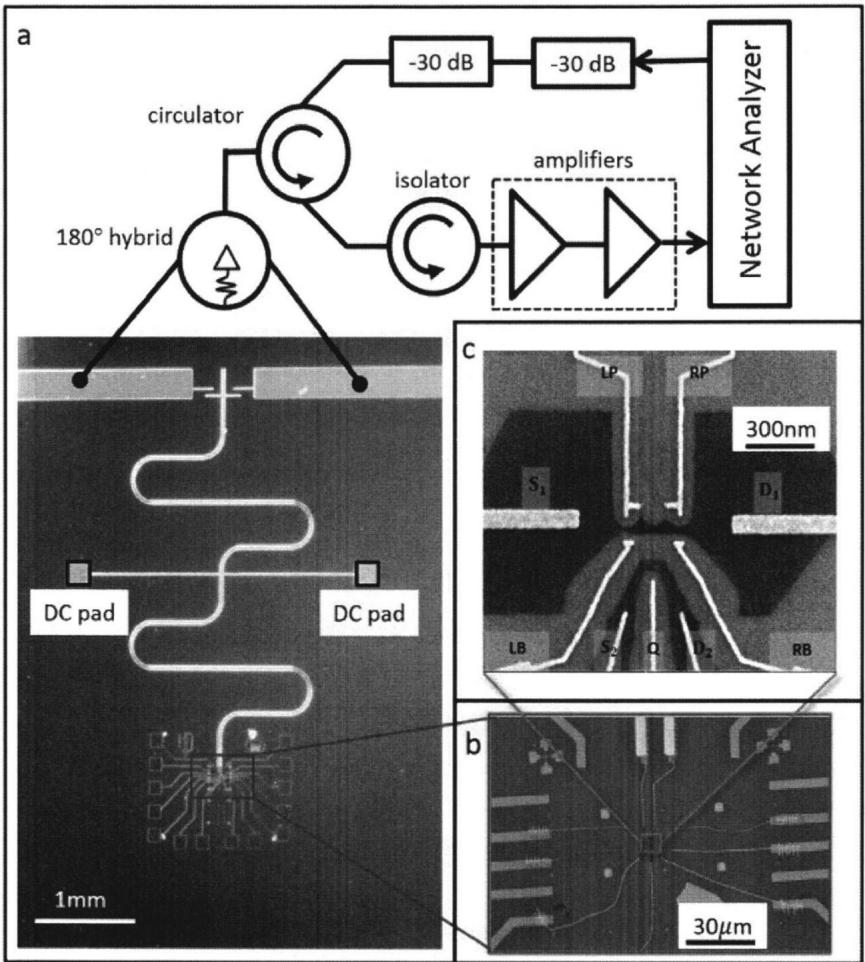  
图 6.5 反射式谐振腔与 Graphene 双量子点的耦合结构

$$
\begin{array} { c } { \displaystyle \frac { \operatorname { t a n h } ( \delta ) } { 2 \delta } = \displaystyle \frac { \delta ^ { 2 } } { \left( \delta ^ { 2 } + \mathrm { F } ^ { 2 } \right) ^ { \frac { 3 } { 2 } } } \operatorname { t a n h } ( \sqrt { \delta ^ { 2 } + \mathrm { F } ^ { 2 } } ) + \displaystyle \frac { \mathrm { F } ^ { 2 } } { \delta ^ { 2 } + \mathrm { F } ^ { 2 } } { \coth } ^ { - 2 } ( \sqrt { \delta ^ { 2 } + \mathrm { F } ^ { 2 } } ) } \\ { \displaystyle \mathrm { F } = \frac { \mathrm { F W H } ( \scriptstyle e V ) } { 2 } \frac { 1 } { 2 \mathrm { k } _ { \mathrm { B } } \mathrm { T } _ { e } } } \\ { \displaystyle \delta = \frac { 2 \mathrm { t } _ { c } } { 2 \mathrm { k } _ { \mathrm { B } } \mathrm { T } _ { e } } } \end{array}\tag{6.19}
$$

通过拟合上式，我们可以得到量子点中电子温度为150mK，控制门电极的leverarm 约为 3%。

然后，我们研究通过量子点与谐振腔的耦合作用。我们固定微波输入的频率在谐振腔中心振荡频率附近，为6.2385GHz，扫描量子点控制门电极，并且同时记录谐振腔反射信号振幅和相位的变化。结果如图6.7所示，我们可以清楚的看到在 interdot transition line 上谐振腔相位和振幅发生了移动，而在 cotunnelingline上则没有相应的信号。从量子角度来看，这种差别是由能量差所决定的。在interdot transition line上，电子在左右点之间调动，能量差 $\Omega = \sqrt { ( 2 \mathrm { t c } ) ^ { 2 } + \Delta ^ { 2 } }$ 约为10GHz，与谐振腔中单个光子的能量相近，因此二者可以相互作用。而在cotunnelingline上，量子点中总的电子数目发生改变，对应能量为单电子充电能约10meV，远大于单光子能量（约26ueV)，所以量子点中电荷的变化也就不会影响到谐振腔的状态了。

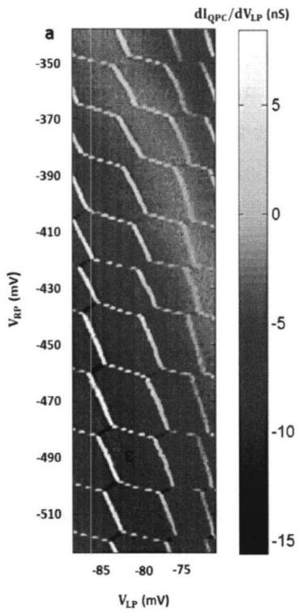

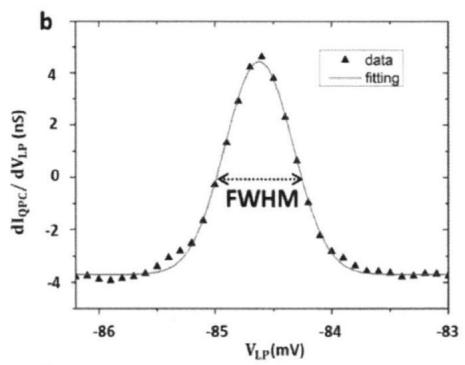

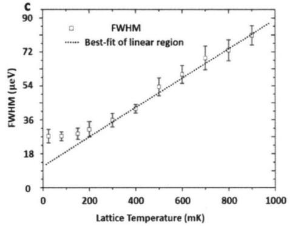  
图 6.6 QPC 信号线宽随温度的变化

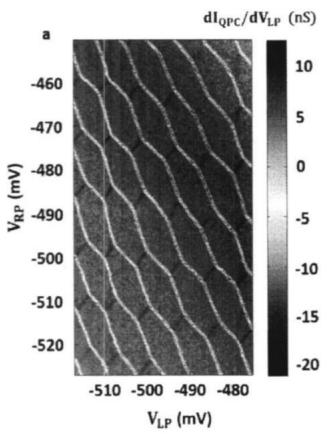

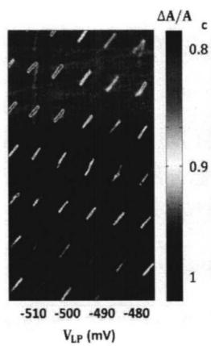

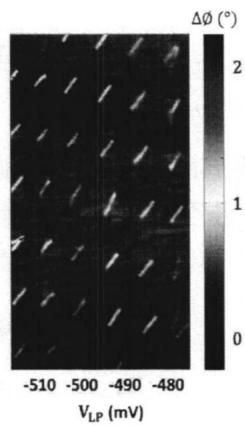  
图 6.7 Graphene 双量子点电荷稳态相图 (a) 使用 QPC 调制测量 (b) 同样电压扫描区域谐振腔振幅变化信号(c) 谐振腔相位变化信号

## 6.3 结果分析

上述观察到的现象可以用主方程模型解释[25]：

量子点与谐振腔通过偶极相互作用耦合可以用如下的哈密顿量来描述：

$$
\mathsf { H } = \hbar \Delta _ { 0 } \mathsf { a } ^ { + } \mathsf { a } + \frac { \hbar \Delta } { 2 } \sigma _ { z } + \hbar g _ { e f f } \left( \sigma _ { + } \mathsf { a } + \sigma _ { - } \mathsf { a } ^ { + } \right)\tag{6.20}
$$

其中 $\omega _ { 0 }$ 为谐振腔本身的谐振频率， $\omega _ { \mathsf { R } }$ 为探测微波的频率， $\Omega = \sqrt { \left( 2 \mathrm { t } _ { \mathrm { c } } \right) ^ { 2 } + \varepsilon ^ { 2 } }$ 为量子点上下能态的能级差。在探测微波能量的基准下， $\Delta _ { 0 } = \omega _ { 0 } - \omega _ { \mathrm { R } }$ $\Delta = \Omega - \omega _ { \mathrm { R } }$ 。有效耦合强度 $g _ { e f f } = { \bf g } _ { 0 } \cdot 2 \mathbf { t } _ { \mathrm { c } } / \Omega$

对于整个系统来说，能量耗散主要包括微波谐振腔内部本身的能量损耗 $\kappa _ { \mathrm { i n } }$ ，谐振腔向外界电路泄漏的能量 $\pmb { \kappa } _ { \pmb { \sigma } \pmb { u } \pmb { t } }$ ，量子点比特的退相干 $\boldsymbol { \mathsf { \pmb { \gamma } } }$ 。可以用主方程描述真个系统的演化：

$$
\begin{array} { r } { \dot { \boldsymbol { \rho } } = - \mathsf { i } [ \mathsf { H } , \mathsf { \rho } ] + \mathsf { \kappa D } [ \mathbf { a } ] \mathsf { \rho } + \gamma \mathsf { D } [ \sigma _ { - } ] \mathsf { \rho } } \end{array}\tag{6.21}
$$

其中 ${ \begin{array} { r } { \mathrm { D } [ \mathbf { a } ] \mathbf { \rho } = \mathbf { a } \mathbf { \rho a } ^ { + } - \frac { 1 } { 2 } \mathbf { a } ^ { + } \mathbf { a } \mathbf { \rho } - \frac { 1 } { 2 } \mathbf { \rho a } ^ { + } \mathbf { a } } \end{array} }$ 为 Lindblad 算子， $\kappa = \kappa _ { \mathrm { i n } } + \kappa _ { \mathrm { o u t } }$ 为谐振腔总的能量泄漏率。相应的算符演化方程为：

$$
\begin{array} { r } { \dot { \mathbf { a } } = - \mathrm { i } \Delta _ { 0 } \mathbf { a } - \mathrm { i } 9 _ { e ^ { \dagger \dagger } } \boldsymbol { \sigma } _ { - } - \cfrac { 1 } { 2 } \kappa \mathbf { a } + \sqrt { \kappa _ { e } } \mathbf { a } _ { \mathrm { i n } } } \\ { \dot { \mathbf { \sigma } } _ { - } = - \mathrm { i } \Delta \boldsymbol { \sigma } _ { - } + \mathrm { i } 9 _ { e ^ { \dagger \dagger } } \mathbf { a } \boldsymbol { \sigma } _ { z } - \cfrac { 1 } { 2 } \gamma \boldsymbol { \sigma } _ { - } } \end{array}\tag{6.22}
$$

在我们的测量中，控制门电极电压的变化速率远小于量子点能量弛豫的速率，量子点始终处于基态，所以有 $\sigma _ { z }  - 1$ 。将其代入上式，并有旋波近似$\dot { \mathfrak { a } } = - \mathfrak { i } ( \omega - \omega _ { \mathtt { R } } ) \mathfrak { a }$ ，我们可以得到：

$$
\begin{array} { r l } & { \quad - \mathrm { i } ( \omega - \omega _ { \mathsf { R } } ) \mathsf { a } = - \mathrm { i } \Delta _ { 0 } \mathsf { a } - \mathrm { i } 9 _ { e ^ { \mathsf { f } } \mathsf { f } } \sigma _ { - } - \displaystyle \frac { 1 } { 2 } \kappa \mathsf { a } + \sqrt { \kappa _ { e } } \mathsf { a } _ { \mathsf { i n } } } \\ & { \quad - \mathrm { i } ( \omega - \omega _ { \mathsf { R } } ) \sigma _ { - } = - \mathrm { i } \Delta \sigma _ { - } + \mathrm { i } g _ { e ^ { \mathsf { f } } \mathsf { f } } \mathsf { a } \sigma _ { z } - \displaystyle \frac { 1 } { 2 } \gamma \sigma _ { - } } \end{array}\tag{6.23}
$$

反射式谐振腔是单端泄漏的，根据谐振腔输入输出理论，有输入输出约束条件$\mathtt { a _ { i n } } + \mathtt { a _ { o u t } } = \sqrt { \kappa _ { e } } \mathtt { a }$ ，代入上式中，我们可以得到：

$$
\mathsf { S } _ { 1 1 } = \frac { \mathsf { a } _ { \mathsf { o u t } } } { \mathsf { a } _ { \mathsf { i n } } } = - \frac { \mathsf { i } ( \omega _ { 0 } - \omega ) + \mathsf { g } _ { e f f } \chi + \frac { \kappa _ { \mathrm { i } } - \kappa _ { e } } { 2 } } { \mathsf { i } ( \omega _ { 0 } - \omega ) + \mathsf { g } _ { e f f } \chi + \frac { \kappa _ { \mathrm { i } } + \kappa _ { e } } { 2 } }\tag{6.24}
$$

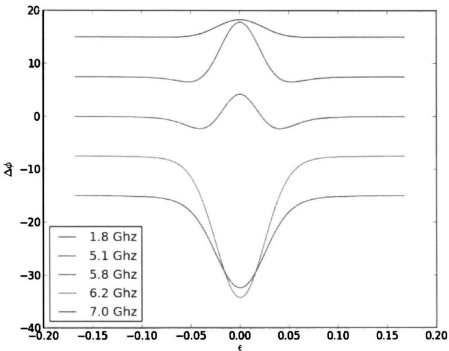  
图 6.8 不同 $2 \mathrm { t _ { c } }$ 下电子穿过 charge transition line 时谐振腔反射谱相位变化

$$
\chi = \frac { g _ { e \mathsf { f } \mathsf { f } } } { \mathsf { i } ( \Omega - \omega ) + \gamma }\tag{6.25}
$$

从上式可以看出，当电子穿过charge transition line时，上下能级差Ω发生变化，进而影响了系统极化率 $x :$ ，最终可通过谐振腔的反射谱 $\mathsf { S } _ { 1 1 }$ 探测到。假设谐振腔的参数为，我们可以得到在不同的 $2 \mathrm { t } _ { \mathrm { c } }$ 下谐振腔反射谱随ε的变化情况，如图6.8所示：可以看到在 $2 t _ { \mathrm { c } } < \omega _ { \mathsf { R } }$ 和 $2 t _ { \mathrm { c } } > \omega _ { \mathrm { R } }$ 的情况下，谐振腔幅值位移的方向是不同的。不过在我们的实验中，由于 $2 \mathrm { t } _ { \mathrm { c } }$ 不可调，实际观察到的都是$2 t _ { \mathrm { c } } > \omega _ { \mathsf { R } }$ 的情况，谐振腔振幅向同一个方向位移。沿垂直于 charge transition line方向做一条切线，我们可以用式6.24拟合实验数据，得到耦合系统的各项参数。如在图6.9中，电压为 $V _ { \mathrm { L P } } = 2 8 3 \mathrm { m V }$ $\mathsf { V } _ { \mathsf { R P } } = 2 1 7 \mathsf { m V }$ 处，可以拟合得到参数为$9 = 6 . 7 M \ H z , 2 \mathrm { t } _ { \mathrm { c } } = 7 . 3 M \ H z , \gamma = 0 . 4 3 G \ H z$

当然，在不同的量子点处，量子点所处的状态不同，耦合强度和弛豫时间也略有变化。在我们的实验中，耦合强度的变化范围约在6.5MHz到20MHz，电子点的弛豫时间变化范围约在0.4GHz到1.1GHz。这和谐振腔与其他量子点体系如GaAs量子点、InGs纳米线量子点所测的结果相一致。

## 6.4 本章小结

在这一章中，我们讨论了谐振腔与量子点耦合的基本理论模型，并研究了石墨烯量子点和反射式谐振腔耦合的实例。使用主方程耗散模型可以很好的解

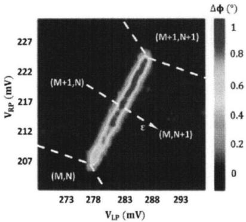

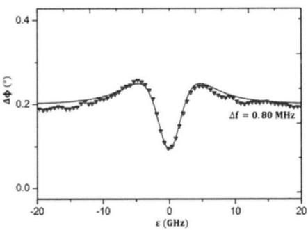  
图 6.9 (a) 谐振腔在 (M + 1,N) ↔ (M, N + 1) 处相位变化(b) 沿(a) 中虚线拟合参数

释实验现象，并且通过数据拟合，我们可以提取出耦合强度、量子点的退相干时间的物理参数。

## 参考文献

[1] Bennett C H. Sci. Am., 1987, 257:108.

[2] Shor P. Proc. 35th Annual Symposium on computer Science, IEEE, 1992. 181–182.

[3] Grover L. Proc. 28th Annual ACM Symposium on Theory of Computing, ACM, 1996. 212– 219.

[4] Divincenzo D, Loss D. Phys.Rev.A., 1998, 57:120.

[5] Zhao Z, Chen Y, Zhang A. Nature, 2004, 54:430.

[6] Guhne O, Lu C, Zhou X. Nature Physcis, 2007, 3:91.

[7] King B E, Wood C S, Myatt C J, et al. Phys. Rev. Lett., 1998, 81:1525.

[8] Cirac J I, Zoller P. Phys. Rev. Lett., 1995, 74:4091.

[9] Warren W S. Science, 1997, 277:1688.

[10] Bialczak R, Ansmann M, Hofheinz M, et al. Nature Physics, 2010, 6:409.

[11] Yamamoto Y, Pashkin Y, Astafiev O, et al. Nature, 2003, 425:941.

[12] Plantenberg J, Groot P, Harmans C, et al. Nature, 2007, 447:836.

[13]Shang R. [D]. Ph.d. thesis. University of Science and Technology of China, 2014.

[14] Switkes M. Decoherence and adiabatic transport in semiconductor quantum dot. Ph.D. thesis, 1999..

[15] Li H. [D]. Ph.d. thesis. University of Science and Technology of China, 2012.

[16] Kouwenhoven L, Marcus C. Physics World, 1999..

[17] Chen J C. Ph. D. Thesis, Purdue University, 2003..

[18] Kouwenhoven L P, Marcus C M. Electron Transport in Quantum Dots. NATO ASI Conference Proceedings, Klewer, 1997..

[19] Cao G. [D]. Ph.d. thesis. University of Science and Technology of China, 2012.

[20] Grabert H, Devoret M. Single Charge Tunneling, New York:Plenum, 1991..

[21] Beenakker C. Phys.Rev.B, 1991, 44:1646.

[22] Korotkov A, Averin D, Likharev K. Phys. Rev. B, 1991, 44:6199.

[23] Korotkov A, Averin D, Likharev K. Phys. Rev. B, 1990, 165:927.

[24] Jacak L, Harylak P, Wojs A. Quantum Dots, Berlin:Springer, 1998..

[25] Petersson K D, McFaul L W, Schroer M D, et al. Nature, 2012, 490:380.

[26] Petta J R, Johnson A C, Taylor J M, et al. Science, 2005, 309:5744.

[27] Petta J, Johnson A, Marcus C, et al. Phys. Rev. Lett., 2004, 93:186802.

[28] Shulman M, Dial O, Harvey S, et al. Science, 2012, 336:202.

[29] Wees B J, Houten H, Beenakker C W J, et al. Phys. Rev. Lett., 1988, 60:848.

[30] DiCarlo L, Lynch H J, Johnson A C, et al. Phys. Rev. Lett., 2004, 92:226801.

[31] Elzerman J M, Hanson R, Greidanus J S, et al. Phys. Rev. B, 2003, 67:161308.

[32] Braakman F, Barthelemy P, Reichl C, et al. Nat.Mat., 2013, 10:1038.

[33] Majer J, Chow J, Gambetta J, et al. Nature, 2004, 449:443.

[34] DiCarlo L, Reed M, Sun L, et al. Nature, 2010, 467:574.

[35] DiCarlo L, Chow J, Gambetta J, et al. Nature, 2009, 460:240.

[36] Bishop L, Chow J, Koch J, et al. Nature Physics, 2009, 5:105.

[37]Houck A, Schuster D, Gambetta J, et al. Nature, 2007, 449:328.

[38] Schuster D, Houck A, Schreier J, et al. Nature, 2007, 445:515.

[39] Wallraff D, Schuster D, Blais A, et al. Nature, 2004, 431:162.

[40] Johnson A. [D]. Ph.d. thesis. Harvard University, 2005.

[41] Hao X. [D]. Ph.d. thesis. University of Science and Technology of China, 2010.

[42] Cronenewett S. [D]. Ph.d. thesis. Stanford University, 2001.

[43] Beveren L W V. [D]. Ph.d. thesis. Delft University, 2005.

[44] Novack K. [D]. Ph.d. thesis. Delft University, 2009.

[45] Chen J. [D]. Ph.d. thesis. Purdue University, 2003.

[46] Lin Z. [D]. Ph.d. thesis. University of Science and Technology of China, 2011.

[47] Zhou C. [D]. Ph.d. thesis. University of Science and Technology of China, 2013.

[48] David M Pozar. Microwave Engineering. NJ: Wiley, 2012.

[49] Schuster D. [D]. Ph.d. thesis. Yale University, 2011.

[50] Göppl M, Fragner A, Baur M, et al. J.Appl.Phys, 2008, 104:113904.

[51] Blais A, Huang R S, Wallraff A, et al. Physical Review A, 2004, 69:062320.

[52] Schoelkopf R J, Girvin S M. Nature, 2008, 451:664.

[53] You J Q, Nori F. Physics Today, 2005, 58:42.

[54] Lin Z R, Guo G P, Tu T, et al. Phys Rev Lett, 2008, 101:230501.

[55] Wallraff A, Schuster D I, Blais A, et al. Nature, 2004, 431:162.

[56] Filipp S, Loo A F, Baur M, et al. Physical Review A, 2011, 84:061805.

[57] Wallraff A, Schuster D I, Blais A, et al. Physical Review Letters, 2005, 95:060501.

[58] Bianchetti R, Filipp S, Baur M, et al. Physical Review A, 2009, 80:043840.

[59]Majer J, Chow J M, Gambetta J M, et al. Nature, 2007, 449:443.

[60] Guo G P, Zhang H, Hu Y, et al. Physical Review A, 2008, 78:020302.

[61] Sillanpaa M A, Park J I, Simmonds R W. Nature, 2007, 449:438.

[62] Loss D, DiVincenzo D P. Physical Review A, 1998, 57:102.

[63] Cao G, Li H O, Tu T, et al. Nature Communication, 2013, 4:1401.

[64] Zhang H, Guo G P, Tu T, et al. Physical Review A, 2007, 76:012335.

[65] Guo G P, Zhang H, Hu Y, et al. Physical Review A, 2007, 75:050301.

[66] Frey T, Leek P J, Beck M, et al. Physical Review Letters, 2012, 108:046807.

[67] Petersson K D, McFaul L W, Schroer M D, et al. Nature, 2012, 490:380.

[68] Henry E, Schmidt A, House M G, et al. American Physical Society March Metting, 2012..

[69] House M. [D]. Ph.d. thesis. University of California Los Angeles, 2012.

[70] Göppl M, Fragner A, Baur M, et al. Journal of Applied Physics, 2008, 104:113904.

[71] Geim A K, Novoselov K S. Nat. Mater, 2007, 6:183.

[72] Novoselov K S, Geim A K, Morozov S V, et al. Nature, 2005, 438:197.

[73] Novoselov K S, Geim A K, Morozov S V, et al. Science, 2004, 306:666.

[74] Molitor F, Droscher S, Guttinger J, et al. Applied Physics Letters, 2009, 94:222107.

[75] Guttinger J, Frey T, Stampfer C, et al. Phys. Rev. Lett, 2010, 105:116801.

[76] Wang L J, Li H O, Tu T, et al. Applied Physics Letters, 2012, 100:022106.

[77] Wang L J, Guo G P, Wei D, et al. Applied Physics Letters, 2011, 99:102054.

[78] Yurkevich I V, Baldwin J, Lerner I V, et al. Physical Review B, 2010, 81:121305.

[79] Gorman J, Hasko D G, Williams D A. Phys. Rev. Lett, 2005, 95:090502.

[80] Rossi A, Ferrus T, Williams D A. Applied Physics Letters, 2012, 100:133503.

[81] Cottet A, Mora C, Kontos T. Physical Review B, 2011, 83:121311.

[82] Gabelli J, Feve G, Berroir J M, et al. Science, 2006, 313:499.

[83] Delbecq M R, Schmitt V, Parmentier F D, et al. Phys. Rev. Lett., 2011, 107:256804.

[84] Chorley S J, Wabnig J, Penfold-Fitch Z V, et al. Phys. Rev. Lett., 2012, 108:036802

[85]Biercuk M J, Reilly D J, Buehler T M, et al. Physical Review B, 2006, 73:201402.

[86] Wang L J, Cao G, Tu T, et al. Applied Physics Letters, 2010, 97:261113.

[87]Guang-Wei Deng M L Z, Li S X, Li H O, et al. Applied Physics Letters, 2014, 104:083511.

[88] Schroer M D, Jung M, Petersson K D, et al. Phys. Rev. Lett., 2012, 109:166804

[89] Jung M, Schroer M D, Petersson K D, et al. Applied Physics Letters, 2012, 100:055412.

[90] Childress L, Sørensen A S, Lukin M D. PHYSICAL REVIEW A, 2004, 69:042302

[91] Wei D, Li H O, Cao G, et al. Scientific Reports, 2013, 3:3175.

[92] Nayak C, Simon S, Stern A, et al. Rev.Mod.Phys., 2008, 80:1083.

[93] Frey T, Leek P J, Beck M, et al. Physical Review B, 2012, 86:115303.