# 博士学位论文

## 基于锗纳米线量子点的空穴自旋及其复合结构研究

作者姓名： 徐刚

学科专业： 物理学

导师姓名： 李海欧 研究员 郭国平 教授

完成时间： 二〇二〇年十月

# University of Science and Technology of China A dissertation for doctor’s degree

# Studies on Hole Spin and Hybrid System Based on Ge Hut Wire Quantum Dots

Author： Gang Xu

Speciality： Physics

Supervisors：Prof. Hi-Ou Li，Prof. Guo-Ping Guo

Finished time: October 2020

## 中国科学技术大学学位论文原创性声明

本人声明所呈交的学位论文,是本人在导师指导下进行研究工作所取得的成果。除已特别加以标注和致谢的地方外，论文中不包含任何他人已经发表或撰写过的研究成果。与我一同工作的同志对本研究所做的贡献均已在论文中作了明确的说明。

作者签名：

签字日期：

## 中国科学技术大学学位论文授权使用声明

作为申请学位的条件之一，学位论文著作权拥有者授权中国科学技术大学拥有学位论文的部分使用权，即：学校有权按有关规定向国家有关部门或机构送交论文的复印件和电子版，允许论文被查阅和借阅，可以将学位论文编入《中国学位论文全文数据库》等有关数据库进行检索，可以采用影印、缩印或扫描等复制手段保存、汇编学位论文。本人提交的电子文档的内容和纸质论文的内容相一致。

保密的学位论文在解密后也遵守此规定。

□公开 □保密（\_\_\_\_年）

作者签名：

导师签名：

签字日期：

签字日期：

## 摘 要

对基于量子点自旋量子比特的半导体量子计算来说，具有长的量子比特相干时间和能够对比特自旋态进行快速操控是两个关键条件。因此，寻找满足上述条件的合适平台已经变得越来越重要。在 IV 族半导体中，硅和锗具有核自旋为零的稳定同位素，纯化后的材料由于其较弱的超精细相互作用，使得电子自旋比特具有较长的相干时间。但是，在硅量子点体系中要实现对电子自旋比特的操控，就必须在量子点器件上集成额外组件，例如微型磁体或者微波条带线。这些集成组件使此类器件的制造工艺复杂化，不利于多比特的扩展。相比于电子自旋，锗量子点体系中的空穴载流子由于 P 轨道而具有更弱的超精细相互作用和更强的自旋轨道耦合，因此不需要集成额外的组件就可以实现对自旋比特的快速全电操控。因此，锗空穴量子点是一个非常理想的自旋量子比特平台。本论文主要对基于棚顶型锗纳米线的空穴量子点进行实验研究，主要内容包括：

1. 介绍了锗空穴材料体系的研究背景和目前取得的一些研究进展，以及半导体量子点中空穴自旋和腔量子电动力学的物理概念。

2. 详细地描述了棚顶型锗纳米线量子点器件的制备工艺，介绍了微纳加工相关的仪器设备及低温测量平台，给出了量子点的性质表征方法并评估了锗纳米线的迁移率。

3. 在棚顶型锗纳米线上制备了耦合高度可调的双量子点，并观测到了自旋阻塞现象。在自旋阻塞区域，通过分析漏电流随磁场的演化，证实了锗纳米线体系中有着很强的自旋轨道耦合。在实验上观测到了多种耦合模式的电偶极自旋共振谱线，并进一步实现了空穴自旋量子比特的超快操控。

4. 实现了棚顶型锗纳米线空穴型双量子点和超导微波腔的偶极耦合。利用微波腔实现了对双量子点中电荷态的探测，实现了可调的隧穿率和提取了电荷比特的退相干率。提取了空穴-腔的耦合强度并进一步评估了在单量子点和双量子点中空穴自旋-光子的耦合强度。

5. 介绍了新型定位型锗纳米线材料，基于两根相邻平行的纳米线制备了集成电荷感应器的双量子点器件，并利用电荷感应器对双量子点的电荷态进行探测，对多量子比特扩展结构进行了探索。

本文的主要创新点包括：

1. 实验上首次制备了耦合可调的锗纳米线双量子点，测量提取了其自旋轨道耦合强度 $t _ { s 0 } \sim 3 8 \pm 4 ~ \mu \mathrm { e V }$ 并评估了自旋轨道耦合长度 $l _ { s 0 } { \sim } 4 0 – 1 0 0 \ \mathrm { n m }$

2. 实验上首次观测到多种模式的电偶极自旋共振谱线并对其能谱进行分析。

3. 表征了空穴自旋单比特并得到了最快的 Rabi 频率 $f _ { R } { \sim } 6 9 8 { \pm } 2 \mathrm { M H z } .$

4. 首次实现了锗纳米线空穴型双量子点与超导微波腔耦合，耦合强度 $g _ { \mathrm { C } } / 2 \pi$ $1 5 \mathrm { M H z }$ o

5. 基于定位型锗纳米线首次实现了双量子点与其邻近的电荷感应器的电容耦合，探索了多量子点扩展的可行性。

关键词：棚顶型锗纳米线，双量子点，空穴自旋，自旋轨道耦合，自旋单比特，超导微波腔，定位型锗纳米线，多量子点扩展

## ABSTRACT

For spin qubit-based quantum computing, the long coherence time and fast electrical controllability of the spin states are two key characteristics. Therefore, searching for suitable platform has become significant over the past few years. The group IV semiconductors, such as silicon (Si) and germanium (Ge), have predominantly stable isotopes with zero nuclear spin, which limits the hyperfine interaction, leading to a long dephasing time. Holes in Ge have an even weaker hyperfine interaction and a stronger spin-orbit interaction (SOI), which can be exploited for faster spin manipulation. However, to implement electron spin qubits in Si, an integrated component, such as a micromagnet or a strip line, has to be incorporated, which will complicate the fabrication process of such devices for spin control. Holes in Ge have a strong spin–orbit interaction, which can be exploited for fast and all-electrical control of the spin without any additional components. Therefore, the Ge quantum dots is an ideal platform for quantum computing. The main content of this thesis is outlined as follows:

1. Introduced the research background of the Ge hole material system and some progress made so far, as well as the physical concepts of hole spin in semiconductor quantum dots and cavity quantum electrodynamics.

2. The fabrication process of the Ge hut wire quantum dot device is described in detail, the relevant equipment and low-temperature measurement platform are introduced, the characterization method of the quantum dot is given, and the mobility of the Ge hut wire is evaluated.

3. Fully tunable double quantum dots were prepared on the Ge hut wire, and the spin blockade phenomenon was observed. In the spin blockade regime, by analyzing the evolution of the leakage current with the magnetic field, it is confirmed that there is a strong spin-orbit coupling in the Ge hut wire system. We performed the electric dipole spin resonance experiments, and observed electric dipole spin resonance spectra in multiple modes. And the hole spin single bit of Ge hut wire was achieved and characterized.

4. The dipole coupling of Ge hut wire hole double quantum dots and

superconducting microwave resonator was realized. The charge states in the double quantum dots are detected by the microwave cavity and the tunable interdot tunneling rate and charge qubit decoherence rate were realized. The hole-resonator coupling strength was extracted and the hole spin-photon coupling strength in single quantum dots and double quantum dots were further evaluated.

5. We introduced the site-controled Ge hut wire. Based on two adjacent parallel nanowires, a double quantum dot device with integrated charge sensor was fabricated. And use the charge sensor to detect the charge state of the double quantum dots.

The innovations of this article include:

1. The tunable Ge hut wire double quantum dot was fabricated for the first time. The spin-orbit coupling strength $t _ { s 0 } \sim 3 8 \pm 4 ~ \mu \mathrm { e V }$ was extracted and the spinorbit coupling length $l _ { s 0 } { \sim } 4 0 – 1 0 0$ nm was evaluated.

2. We observed the electric dipole spin resonance spectrum in multiple modes for the first time and analyzed its energy spectrum.

3. Characterized the single hole spin qubit and obtained the fastest Rabi frequency $f _ { R } { \sim } 6 9 8 { \pm } 2 \ : \mathrm { M H z }$ 0

4. The coupling of Ge hut double quantum dots and superconducting microwave resonator is realized for the first time, the coupling strength $g _ { \mathrm { C } } / 2 \pi { \sim } 1 5 \ : \mathrm { M H z }$

5. Based on the site-controled Ge hut wires, the capacitive coupling between double quantum dots and its neighboring charge sensors was realized for the first time, and the possibility of scalable quantum dots was explored.

Key Words: Ge hut wire, double quantum dot, hole spin, spin-orbit coupling, single spin qubit, superconducting microwave resonator, site-controled Ge hut wire, scalable quantum dots

## 目 录

摘 要..  
ABSTRACT. .III  
目 录...... .V  
第1章 绪论.  
1.1 半导体量子点.  
1.2 量子点中的空穴自旋.  
1.2.1 泡利自旋阻塞.. .5  
1.2.2 自旋轨道耦合.. .6  
1.2.3 电偶极自旋共振. .6  
1.3 锗空穴体系..  
1.3.1 锗材料简介. .. 7  
1.3.2 锗量子器件... .11  
1.3.3 自旋量子比特.. ..12  
1.4 双量子点与腔量子电动力学. ..13  
1.4.1 双量子点与微波腔耦合 ... 14  
1.4.2 电荷-光子相互作用. ..15  
1.4.3 自旋-光子相互作用 ..16  
1.5 论文结构... ... 17  
参考文献.. ..18  
第2章 样品制备与性质表征. ..25  
2.1 棚顶型锗纳米线... ..25  
2.2 微纳加工技术以及常用仪器介绍. ..27  
2.3 量子点的制备工艺. ..29  
样品标记及外围电极制备 ..29  
2.3.2 定位拍照. ..30  
2.3.3 源漏电极制备. ..32  
2.3.4 顶层栅极制备. ..32  
2.4 量子点的性质表征.. ..33  
2.4.1 低温测量平台.... ..33  
2.4.2 低温测量(4.2 K) . .34  
2.5 锗纳米线的迁移率. ..37  
2.6 本章小结... ... 38  
参考文献... ..40  
第3章 锗纳米线双量子点中的空穴自旋 ..43  
3.1 锗纳米线双量子点. ..43  
3.1.1 双量子点样品结构 .43  
3.1.2 双量子点的电荷稳定性相图 ..44  
3.2 自旋阻塞与g因子的测量. ..45  
3.3 锗纳米线双量子点中的自旋轨道耦合 ..47  
3.3.1 自旋阻塞的解除. ..47  
3.3.2 自旋轨道耦合长度的评估. ..49  
3.4 电偶极自旋共振. ..49  
3.5 多种模式下电偶极自旋共振谱线的测量. ..50  
3.5.1 不同S-T态能级间的共振隧穿 .50  
3.5.2 理论模型. ..51  
3.6 锗空穴单比特的测量. ..53  
3.6.1 相干自旋振荡.. ..54  
3.6.2 退相干时间的提取 ..55  
3.7 本章小结.. ..56  
参考文献... ..57  
第4章 锗纳米线双量子点与超导微波腔的偶极耦合. ..61  
4.1 器件结构与实验装置. ..62  
4.2 微波腔对双量子点信号的读取.. ... 64  
4.2.1 微波腔幅值和相位的变化 ..64  
4.2.2 微波腔对空穴输运的探测 ..64  
4.3 双量子点与微波腔耦合.. ... 66  
4.3.1 Jaynes-Cummings 模型 ..66  
4.3.2 测量结果. ..68  
4.4 空穴自旋-光子耦合强度的评估 ..69  
隧穿率和比特的退相干率的研究 ..70  
4.6 本章小结. ..71  
参考文献.. .73  
第5章 定位型锗纳米线量子点的可扩展耦合 ..79  
5.1 样品结构与实验装置. ..81  
5.2 样品性质的表征.. ..82  
5.3 电荷感应器对双量子点电荷态的读取. ..83  
5.4 双量子点隧穿耦合的调节.. ... 84  
5.5 本章小结.. ..85  
参考文献... ... 86  
第6章 总结与展望. ..89  
6.1 总结... ..89  
6.2 展望... ... 90  
6.2.1 空穴自旋两比特... ... 90  
6.2.2 微波腔对空穴自旋态的读取. ..91  
6.2.3 自旋-光子强耦合的实现... ... 92  
6.2.4 定位型锗纳米线量子点阵列的探索.. ..93  
参考文献... ... 95  
附录 样品制备工艺流程. ..99  
A 锗纳米线双量子点与腔的复合器件. ..99  
B 定位型锗纳米线双量子点与电荷感应器的复合器件. ...100  
致 谢... ..102  
在读期间发表的学术论文与取得的其他研究成果. ..104

## 第 1 章 绪论

生活在信息技术时代，我们对更高性能计算机的需求越来越高，这就需要在计算机芯片中集成更多的晶体管，即要求晶体管的体积越来越小。上世纪 60 年代以来，硅(Si)成为半导体工业中最重要的材料，而锗(Ge)作为另外一种 IV族半导体，与标准 Si 的应用技术基本兼容，对于减小晶体管尺寸的研究同样具有重要意义。目前的晶体管尺寸已经达到几纳米级别，与电子波长相当，因此量子力学效应变得不可忽视。在经典计算机中，信息以位存储，分别记作为0和 1，而量子态可以是0和1的线性叠加，因此会形成量子位，又称之为量子比特(qubit)。量子比特可以作为量子计算机的基本信息存储单位，在特定的科学问题或者计算工作上性能将远远优于经典计算机[1,2]。

量子计算机的实现需要满足 DiVincenzo 提出的 5 个标准[3]。第一，要有一个可扩展的量子比特体系；第二，在开始任何类型的计算之前，量子比特状态需要以合理的速度可靠地初始化；第三，量子比特要有足够长的相干时间；第四，可以进行普适的门操作；第五，在计算结束时，读出结果的过程不会影响相邻的量子比特或总体上不会影响量子计算机的状态。而实际上构建量子计算机所面临的主要挑战则是要有一个可控的量子系统，能够在测量的时候不受外界环境的影响。此外，如果要实现容错量子计算，不仅要能处理存储量子信息带来的噪声，还要能处理错误的量子门和错误的测量，因此量子纠错也必不可少[4,5]。近年来，量子计算机已成为广泛的实验以及理论研究对象，IBM，微软，谷歌和英特尔等大公司对量子计算领域表现出了浓厚的兴趣，甚至宣称已经制造出量子计算机，但是目前的量子计算机和经典计算机相比，在计算能力与处理复杂问题的能力上仍有较大差距，因此量子计算机的研究仍处于基础阶段。

目前，量子计算在各种体系上都展开了研究，包括超导量子比特体系、离子阱量子比特体系、光学体系、半导体自旋量子比特体系等。但是从可扩展的角度来说，半导体自旋量子比特体系有一个很大的优势就是其纳米制造技术与微电子工业的技术非常相似，可以在毫米级芯片中集成多个量子比特，这对于量子芯片的构建具有重要的意义。

在本文的研究中，我们介绍了基于新型锗纳米线半导体材料的相关实验研究，包括空穴自旋量子比特的研究以及进行量子比特的可扩展耦合的探索。在本章中我们将对相关的材料体系以及物理概念进行简要的介绍，包括半导体量子点、量子点中的空穴自旋、锗空穴体系、以及双量子点与腔量子电动力学。

## 1.1 半导体量子点

在半导体中，当电子或者空穴在三个维度上都被限制在一个势阱中，只能通过隧穿耦合到源极(source, S)或者漏极(drain, D)的电荷库中，这样的系统我们称之为量子点(quantum dot, QD)。

图 1.1(a)为典型的空穴型单量子点电路模型示意图，量子点和源漏之间的隧穿势垒可以看成一个电容器，当给源漏施加一个偏压 $\mathrm { V } _ { \mathrm { S D } }$ 时，电荷就可以在源漏之间隧穿，从而测量到电流 $\mathrm { I _ { S D } }$ 。量子点中的电化学势 $\mu _ { \mathrm { N } }$ ，可以通过栅极(gate, G)来调节。 $\mu _ { \mathrm { N } }$ 表示量子点在填充第N个电子或者空穴时所需要的能量，表示为：

$$
\mu _ { \mathrm { N } } = \mathrm { U } ( \mathrm { N } ) - \mathrm { U } ( \mathrm { N } - 1 )\tag{1.1}
$$

其中U(N)表示量子点的总能量。则填充一个电荷所需要的能量 $\mathrm { E _ { a d d } }$ 为：

$$
\mathrm { E } _ { \mathrm { a d d } } = \mu _ { \mathrm { N } + 1 } - \mu _ { \mathrm { N } }\tag{1.2}
$$

图 1.1(b )为空穴在单量子点间输运的示意图， $\mu _ { S }$ 和 $\mu _ { \mathrm { D } }$ 表示源极和漏极的电化学势，空穴在量子点中电化学势为 $\mu _ { \mathrm { N } }$ ，通过调节栅极电压 $\mathrm { V _ { G } }$ 使得 $\mu _ { \mathrm { N } }$ 能级上下移动，当 $\mu _ { \mathrm { N } }$ 和源极或者漏极齐平时，空穴可以发生隧穿，从而产生一个输运电流峰，也称之为库伦峰，如图 1.1(c )所示。

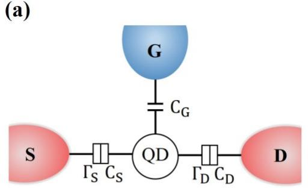

(b)  
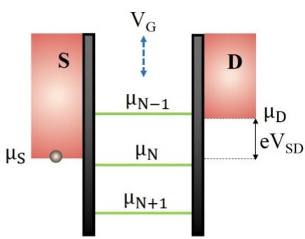  
(d)

(c)  
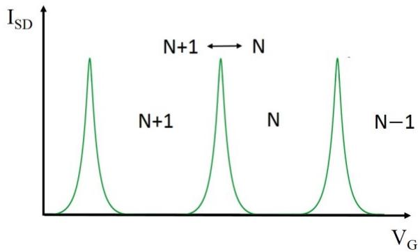

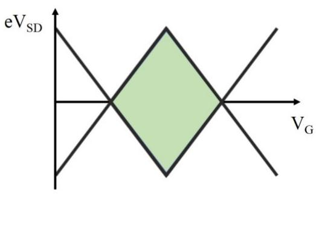  
图 1.1 单量子点电路模型示意图， $\Gamma _ { S }$ 和 $\mathrm { C } _ { \mathrm { S } }$ $( \Gamma _ { \mathrm { { D } } }$ 和 $\mathrm { C _ { D } ) }$ 代表量子点到源极 S(漏极 D)的隧穿耦合和电容耦合。(b) 空穴在单量子点间输运的示意图，调节栅极电压 $\mathrm { V _ { G } }$ 使得 $\mu _ { \mathrm { N } }$ 能级上下移动。(c) $\mu _ { \mathrm { N } }$ 和源极或者漏极齐平时，空穴可以发生隧穿，观测到库伦峰。(d) 库伦菱形图。

当连续扫描源漏偏压 $\mathrm { V } _ { \mathrm { S D } }$ 以及栅极电压 $\mathrm { V _ { G } }$ 并测量输运电流 I ，就可以得到菱形的单量子点电荷稳定性相图，又称之为库伦菱形图，如图 1.1(d)所示。库伦菱形的高即为充电能，菱形区域为库伦阻塞区域。

当两个单量子点距离很近且发生电容耦合和隧穿耦合时，就可以将其看作为一个双量子点(double quantum dot, DQD)。如图 1.2(a)所示，左边量子点 $\mathrm { Q D _ { L } }$ 和右边量子点 $\mathrm { Q D } _ { \mathrm { R } }$ 通过 $\Gamma _ { \mathbf { M } }$ 和 $\mathrm { C _ { M } }$ 耦合，栅极 $\mathrm { G } _ { \mathrm { L } }$ 和 $\mathrm { G } _ { \mathrm { R } }$ 分别控制 $\mathrm { Q D _ { L } }$ 和 $\mathrm { Q D } _ { \mathrm { R } }$ 中的电化学势。在实际的双量子点电极器件中，由于电极之间存在串扰电容，它们之间也相互耦合，即调节 ${ \mathrm { G } } _ { \mathrm { L } } ( \mathrm { G } _ { \mathrm { R } } )$ 同样会影响 $\mathrm { Q D } _ { \mathrm { R } } ( \mathrm { Q D } _ { \mathrm { L } } )$ 。和公式 1.1 类似，双量子点中的电化学势 $\mu _ { \mathrm { L ( R ) } } ( \mathrm { N } , \mathrm { M } )$ 表示 $\mathrm { Q D } _ { \mathrm { R } } ( \mathrm { Q D } _ { \mathrm { L } } ) ^ { \mathfrak { l } }$ 中有 M(N)个空穴时， $\mathrm { Q D } _ { \mathrm { L } } ( \mathrm { Q D } _ { \mathrm { R } } )$ 填充第N(M)个空穴所需要的能量。表示为：

$$
\mathsf { \Pi } \mathsf { \Pi } \mathsf { \mu } _ { \mathrm { L } } ( \mathrm { N } , \mathrm { M } ) \ = \ \mathrm { \Omega } \mathsf { U } ( \mathrm { N } , \mathrm { M } ) - \mathrm { \sqcup } ( \mathrm { N } - 1 , \mathrm { M } )\tag{1.3}
$$

$$
\mathsf { \Pi } \mathsf { \Pi } \mathsf { \mu } _ { \mathrm { R } } ( \mathrm { N } , \mathrm { M } ) \ = \ \mathrm { \Omega } \mathsf { U } ( \mathrm { N } , \mathrm { M } ) - \mathrm { \mathrm { U } } ( \mathrm { N } , \mathrm { M } - 1 )\tag{1.4}
$$

双量子点中电化学势 $\mu _ { \mathrm { L } }$ 和 $\mu _ { \mathrm { R } }$ 如图 1.2(b)所示， $\mu _ { \mathrm { L } }$ 和 $\mu _ { \mathrm { R } }$ 可以分别被栅极电压 $\mathrm { V _ { G L } }$ 和 $\mathrm { V } _ { \mathrm { G R } }$ 调节，只有当 $\mathrm { Q D } _ { \mathrm { R } }$ 和 $\mathrm { Q D _ { L } }$ 的电化学势 $\mu _ { \mathrm { L } }$ 和 $\mu _ { \mathrm { R } }$ 与偏压窗口齐平的时候，空穴才可以在双量子点中隧穿。

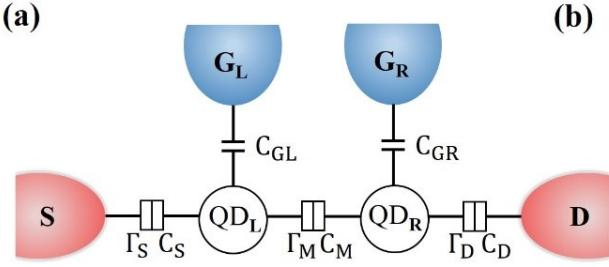

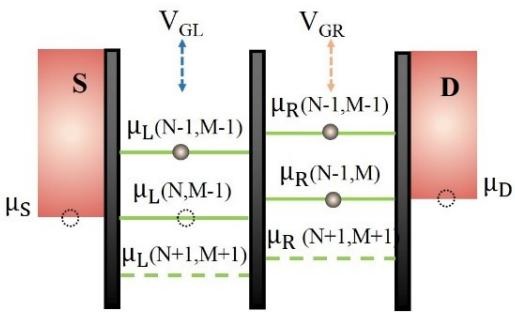

(c)
<table><tr><td rowspan=7 colspan=1>VGL</td><td></td><td></td><td></td><td></td><td></td></tr><tr><td rowspan=3 colspan=1>(3,0)</td><td rowspan=2 colspan=1></td><td rowspan=3 colspan=1>(1,0)</td><td rowspan=3 colspan=1>(0,0)</td><td></td></tr><tr><td rowspan=5 colspan=1>VGR</td></tr><tr><td rowspan=1 colspan=1>(2,0)</td></tr><tr><td rowspan=1 colspan=1>(3,1)</td><td rowspan=1 colspan=1>(2,1)</td><td rowspan=1 colspan=1>(1,1)</td><td rowspan=1 colspan=1>(0,1)</td></tr><tr><td rowspan=1 colspan=1>(3,2)</td><td rowspan=1 colspan=1>(2,2)</td><td rowspan=1 colspan=1>(1,2)</td><td rowspan=1 colspan=1>(0,2)</td></tr><tr><td rowspan=1 colspan=1>(3,3)</td><td rowspan=1 colspan=1>(2,3)</td><td rowspan=1 colspan=1>(1,3)</td><td rowspan=1 colspan=1>(0,3)</td></tr></table>

(d)

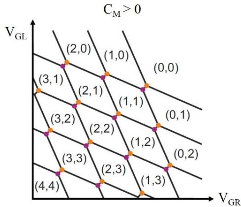  
图 1.2(a) 双量子点电路模型示意图，左边量子点 $\mathrm { Q D _ { L } }$ 和右边量子点 $\mathrm { Q D } _ { \mathrm { R } }$ 通过 $\Gamma _ { \mathbf { M } }$ 和 $\mathrm { C _ { M } }$ 耦合。(b) 双量子点中电化学势 $\mu _ { \mathrm { L } }$ 和 $\mu _ { \mathrm { R } }$ 的示意图。(c) 零源漏偏压下左右两个量子点的耦合 $C _ { \mathrm { M } } = 0$ 时双量子点的电荷稳定性相图。(d) 零源漏偏压下左右两个量子点的耦合$\mathrm { C } _ { \mathrm { M } } > 0$ 时双量子点的电荷稳定性相图。

图 1.2(c)和(d)分别为在零源漏偏压下左右两个量子点的耦合 $C _ { \mathrm { M } } = 0$ 和 $\mathrm { C } _ { \mathrm { M } } >$ 0时双量子点的电荷稳定性相图。当 $\mathrm { C } _ { \mathrm { M } } = 0$ 时，相图看上去是由方格组成，方格中的数字(N, M)代表着左右量子点中的电荷数目，例如(1, 1)表示 $\mathrm { Q D } _ { \mathrm { R } }$ 和 $\mathrm { Q D _ { L } }$ 中各有一个空穴占据 $\mu _ { \mathrm { L } } ( 1 , 1 )$ 和 $\mu _ { \mathrm { R } } ( 1 , 1 )$ 。 通过往正向扫描栅极电压，量子点中的空穴逐渐被排出直至排空。图中所示两个方向的实线交汇的黑点为三相点(triplepoints)，在三相点处电化学势 $\mu _ { \mathrm { L } } ( \mathrm { N } , \mathrm { M } )$ 和 $\mu _ { \mathrm { R } } ( \mathrm { N } , \mathrm { M } )$ 齐平。当 $\mathrm { C } _ { \mathrm { M } } \mathrm { > } 0$ 时，如图 1.2(d)所示，相图演化成由一个个的六边形，我们称之为蜂窝图。由于交互电容存在，三相点分开成两个，分别由紫色和橙色圆点表示。此时 $\mu _ { \mathrm { L } } ( \mathrm { N } , \mathrm { M } )$ 和 $\mu _ { \mathrm { R } } ( \mathrm { N } , \mathrm { M } )$ 齐平，两个点处于零失谐量 $( \varepsilon = 0 )$ 这条线上。橙色圆点表示量子点中输运循环为(N,$\mathbf { M } ) {  } ( \mathbf { N } { + } 1 , \mathbf { M } ) {  } ( \mathbf { N } , \mathbf { M } { + } 1 ) {  } ( \mathbf { N } , \mathbf { M } )$ ，紫色圆点表示量子点中输运循环为(N+1, M+1)${  } ( \mathrm { N + 1 } , \mathrm { M } ) {  } ( \mathrm { N } , \mathrm { M + 1 } ) {  } ( \mathrm { N + 1 } , \mathrm { M + 1 } )$ 。

当给双量子点施加一定的偏压时，三相点演化成偏压三角形(biastriangle)[6]，如图 1.3 所示。偏压三角形不同位置对应的双量子点中的电化学势如灰色箭头指向的插图所示。偏压三角形的底边代表着双量子点的基态，当 $\mathrm { V } _ { \mathrm { S D } }$ 增大时，则可以在偏压三角形内部观测到激发态，其电化学势在图中表示为$\mu _ { \mathrm { \Delta L } } ^ { \prime } ( \mathrm { N } , \mathrm { M } )$ 。在输运测量中，对偏压三角形的观测与表征很重要，它涉及到不同的电荷态以及自旋态，对我们之后进行单比特的读取与操控具有重要意义。

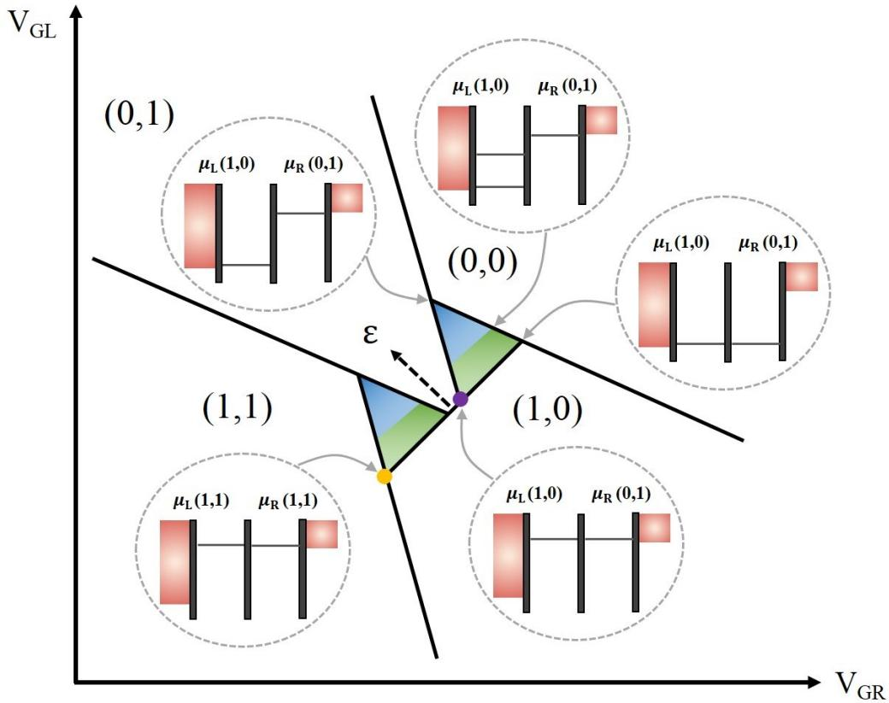  
图 1.3 $\mathrm { V _ { S D } } > 0$ 时两个空穴的双量子点电荷稳定性相图，图中观测到一组偏压三角形，虚线圆圈内插图为偏压三角形内部不同区域对应的量子点电化学势。

## 1.2 量子点中的空穴自旋

## 1.2.1 泡利自旋阻塞

我们已经讨论了不考虑自旋的空穴在单量子点和双量子点中的输运情况，然而实际上在量子点中，空穴的电荷态与自旋态息息相关[7]。以双量子点中的单重态(singlet)和三重态(triplet)为例，在只考虑两个空穴的区域中，由于泡利不相容原理，同一轨道的两个空穴不能出现相同的自旋，因此电荷在输运过程中就可能会出现跃迁被阻塞的情况。如图1.4(a)所示，当 $\mathrm { Q D _ { L } }$ 中已经占据了一个自旋向下的空穴时， $\mathrm { Q D } _ { \mathrm { R } }$ 中同样自旋向下的空穴是不能从 T(1,1)态跃迁到 S(2,0)态的，这一现象被称为泡利自旋阻塞(Pauli spin blockade, PSB)。当源漏偏压反向时，如图1.4(b)所示，自旋向上的空穴时可以从 $\mathrm { Q D _ { L } }$ 中 S(2,0)态跃迁到 $\mathrm { Q D _ { R } }$ 中的 S(1,1)态，因此自旋阻塞被解除。

在实验中我们发现，在零磁场下发生自旋阻塞的偏压三角形的底边基态线上往往会出现漏电流的现象，这种现象一般是由超精细相互作用诱导的自旋弛豫[8]或者是由自旋翻转共隧穿[9]所导致。而在非零磁场情况下，随着磁场增大，自旋轨道耦合机制便开始影响漏电流的产生[10]。因此，泡利自旋阻塞被广泛地应用于双量子点中自旋量子比特的读取，这在本文的第三章中会进行详细研究。

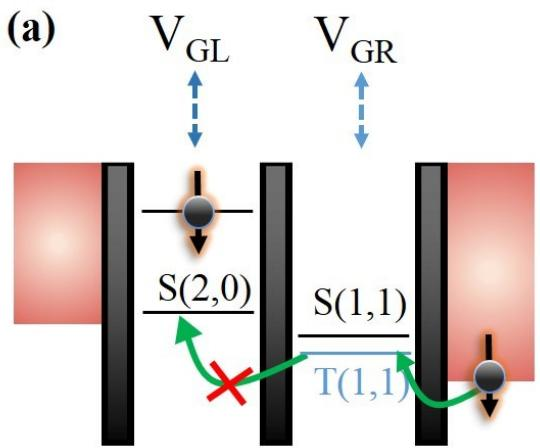

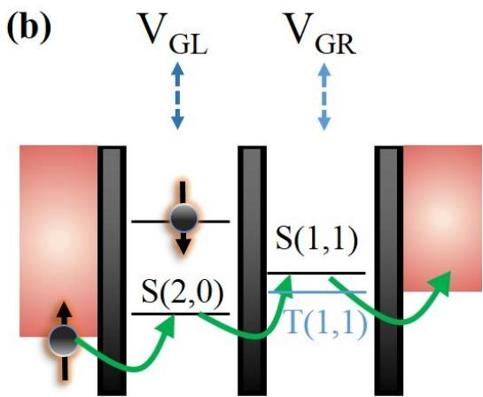  
图 1.4 (a) 双量子点中泡利自旋阻塞示意图。当 $\mathrm { Q D _ { L } }$ 中已经占据了一个自旋向下的空穴时，由于自旋不相容原理， $\mathrm { Q D } _ { \mathrm { R } }$ 中同样自旋向下的空穴不能从T(1,1)态隧穿到S(2,0)态。(b) 当源漏偏压反向时，自旋向上的空穴时可以从 $\mathrm { Q D _ { L } }$ 中 S(2,0)态输运到 $\mathrm { Q D } _ { \mathrm { R } }$ 中的 S(1,1)态，泡利自旋阻塞被解除。

## 1.2.2 自旋轨道耦合

在势场内运动的粒子的自旋和其动量相互作用，并通过电场耦合粒子的轨道动量和自旋自由度，这一效应被称为自旋轨道耦合。从粒子的角度观察时，电场相当于有效磁场B 。自旋轨道耦合来源于材料的体反演不对称或者结构反演不对称，分别称之为 Dresselhaus 自旋轨道耦合或者 Rashba 自旋轨道耦合[11]。自旋轨道耦合又可以理解为一种有效的塞曼劈裂能，它可以将相反自旋的态混合到一起，从而导致自旋弛豫[12,13]。

自旋轨道耦合的哈密顿量可以写为：

$$
\begin{array} { r } { H _ { \mathrm { S } 0 } = \frac { h } { 4 c ^ { 2 } m ^ { 2 } } ( \nabla V \times p ) \pmb { \sigma } } \end{array}\tag{1.5}
$$

这里 $\pmb { \sigma }$ 是泡利自旋算符。在原子物理中自旋轨道耦合又表示为角动量L 和自旋$s$ 项：

$$
H _ { \mathrm { S } 0 } = \lambda L S\tag{1.6}
$$

其中𝜆为常数项。对于空穴而言，自旋和轨道自由度混合程度更加强烈，这主要是由于自旋轨道耦合引起价带分裂所导致。另外，由于直接 Rashba 自旋轨道耦合的存在，Ge纳米线的空穴有具有非常强的自旋轨道相互作用[14]，这将在本文的第三章中进行具体研究。

## 1.2.3 电偶极自旋共振

对于一个空穴自旋量子比特而言，具有强自旋轨道耦合是实现全电控的必要条件。而电场和电荷自旋之间的耦合可以由电偶极自旋共振(electric dipole spinresonance, EDSR)实现。假设粒子动量沿着一维方向(y)，自旋轨道耦合的哈密顿量可以写为：

$$
H _ { \mathrm { S 0 } } = \alpha _ { \mathrm { R } } \kappa _ { \mathrm { y } } \sigma _ { \mathrm { x } }\tag{1.7}
$$

其中 $\alpha _ { \mathrm { R } }$ 为Rashba系数。电场的调制会引起波动函数的波动，波矢沿 y方向可表达为 $\dot { y } ( t ) = \omega y _ { 0 } c o s ( \omega t )$ ，动量 $p = m { \dot { y } } = \hbar \kappa _ { \mathrm { y } }$ ，则可以得到：

$$
\begin{array} { r } { \kappa _ { \mathrm { y } } ( t ) = \frac { 1 } { \hbar } m \omega y _ { 0 } c o s ( \omega t ) } \end{array}\tag{1.8}
$$

其中 $\omega$ 为电场频率。在外磁场 $\mathbf { B } = ( 0 , 0 , \ B _ { \mathbf { Z } } \ )$ 下，塞曼劈裂哈密顿量为：

$$
\begin{array} { r } { H _ { \mathrm { Z } } = \frac { 1 } { 2 } g \mu _ { \mathrm { B } } B _ { \mathrm { Z } } \sigma _ { \mathrm { Z } } } \end{array}\tag{1.9}
$$

则系统的总哈密顿量为：

$$
H = H _ { \mathrm { Z } } + H _ { \mathrm { S 0 } } = \left( \begin{array} { c c } { \frac { 1 } { 2 } g \mu _ { \mathrm { B } } B _ { \mathrm { Z } } } & { \frac { 1 } { \hbar } \alpha _ { \mathrm { R } } m \omega y _ { 0 } c o s ( \omega t ) } \\ { \frac { 1 } { \hbar } \alpha _ { \mathrm { R } } m \omega y _ { 0 } c o s ( \omega t ) } & { - \frac { 1 } { 2 } g \mu _ { \mathrm { B } } B _ { \mathrm { Z } } } \end{array} \right)\tag{1.10}
$$

可以看出，由于振荡电场的存在，所获得的矩阵具有时间相关的非对角项[7]。在Ge纳米线双量子点中利用电偶极自旋共振实现自旋翻转的实验现象以及比特操控的实验细节我们将在第三章进行详细描述和讨论。

## 1.3 锗空穴体系

由于 Ge 优异的的电学性质以及晶体管的制造和集成技术的成熟，Ge 材料正受到越来越多的关注。首先，Ge异质结的集成与传统的CMOS 工艺具有兼容性，避免了开发Ge衬底所需的额外的制造成本。其次，Ge异质结中的空穴在室温下有着很高的迁移率，是研究基于自旋[15]、拓扑[16]、以及门控超导[17]量子比特有潜力的平台。因此，Ge 被认为是超越摩尔限制的关键材料，有望将经典计算机的芯片摆脱微型化所带来的性能限制。

## 1.3.1 锗材料简介

在构建Ge量子信息处理设备的竞赛中，出现了三种材料平台，分别为 Ge/Si平面异质结(Planar Ge/SiGe heterostructures)、Ge/Si 核壳纳米线(Ge/Si core/shellnanowires)、棚顶型 Ge 纳米线(Ge hut wires)。这些材料有着各自的优势，我们将分别对它们进行介绍。

## Ge/SiGe 平面异质结

在 Ge/SiGe 平面异质结构中，压缩应变的 Ge 和弛豫的 $\mathrm { S i _ { 1 - x } G e _ { x } }$ 之间产生了能带边缘对准，将空穴限制在生长方向上，从而产生二维空穴气[18]。外延 Ge量子阱中的压缩应变由下层的弛豫 $\mathrm { S i _ { 1 - x } G e _ { x } }$ 缓冲层面内晶格参数决定，实际上 Si$\mathrm { \bf { { x } } G e _ { x } }$ 缓冲层需要 Ge 的含量较高 $( 0 . 6 { < } \mathbf { x } { < } 0 . 9 )$ ，使得应变 Ge 外延层有一个合理的厚度(10 到 30 nm )。Ge 量子阱中的空穴填充可以来自掺杂层或者通过非掺杂异质结中的欧姆接触，其压缩应变会在重空穴和轻空穴能带中产生较大的可调的能级劈裂，这就意味着 Ge 二维空穴气具有很高的迁移率。为了获得高迁移率的 P型通道，研究者们在上世纪 90 年代提出了通过分子束外延的方法生长调制掺杂的应变 Ge/SiGe 异质结，如图 1.5(a)所示，通过在 Ge 衬底代替 Si 衬底上生长SiGe 缓冲层，空穴的迁移率提升到了 $5 . 5 { \times } 1 0 ^ { 4 } ~ { \ c m } ^ { 2 } / ( V s ) [ 1 9 , 2 0 ]$ 。后来通过减压化学气相沉积(RP-CVD)的方式，在Si 衬底上直接生长高质量的 Ge，然后在 SiGe缓冲层中对 Ge 成分进行反向分级，在调制掺杂应变 Ge 量子阱中获得超过$1 0 ^ { 6 } \mathsf { c m } ^ { 2 } / ( V s )$ 的空穴迁移率[21]。迁移率提高一个数量级的关键因素是利用工业RP-CVD 方法进行生长，因此其电离杂质和 Ge 量子阱及周围 SiGe 外延层中的背景缺陷非常低。

出色的迁移率使 Ge/SiGe 作为适合构建量子设备的平台引起了越来越多的关注。另外，对Si / SiGe 异质结构的研究表明，掺杂层中的电离杂质可能会导致泄漏、寄生沟道和电荷噪声，因此非掺杂的结构更适合量子点和自旋量子比特的操控[22,23]。

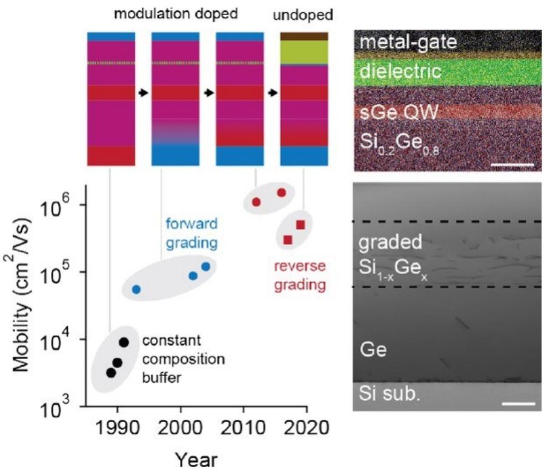  
图 1.5 Ge/SiGe 平面异质结结构以及空穴的迁移率随时间变化的示意图，图片引自[20]。

## Ge/Si 核壳纳米线

Ge/Si 核壳纳米线是在通过气-液-固生长模式生长的 Ge核上，利用气相沉积的方法生长 Si 壳层[24]。首先非晶态的 Si 在低温下生长以形成陡峭的 Ge/Si 界面，然后通过原位热退火使其完全结晶，如图 1.6(a)所示。后来在壳层的生长过程中，研究者发现生长温度的升高可以避免其应变驱动所导致的表面粗糙化，因此实现了低密度缺陷和界面清晰的 Ge/Si 核壳纳米线[25]。另外，径向多壳层掺杂以及调制掺杂的 Ge/Si 核壳纳米线也同样被报道过[26]。最近,一种名为 Ge-Al/Si 核壳纳米线的新型径向异质结构也引起了关注，它的核是由短节的 Ge晶和

Al 组成，并且被Si 壳层包围[27]，这种方法为在 Ge/Si 核壳纳米线中研究外延生长的超导-半导体结构提供了新的途径。

由于Ge/Si 核壳纳米线价带中有着约 500 meV的偏移量，因此空穴可以被强烈束缚在 Ge 核中[24]。在 Ge/Si 核壳纳米线生长完成以后，由于低温下的 Si 壳层可作为 Ge 核的隧穿势垒，研究者很快地就制备了一种可控的单空穴晶体管，并进行了对其一维空穴气的研究[28]。他们发现，在非掺杂结构中增强迁移率可以使载流子的平均自由程在低温和室温下具有高达数百纳米的弹道传输特征[28,29]。另外，进一步的研究表明 Ge/Si 核壳纳米线中空穴的迁移率也和其生长方向有关，如图1.6(b)所示，和[111]方向相比，[010]方向生长的纳米线的迁移率具有明显增强，最高可达 $4 2 0 0 \ c m ^ { 2 } / ( V s ) [ 3 0 ]$ 。Ge/Si 核壳纳米线良好的性质使得研究者能在低温下研究其量子输运的细节，在外磁场下，其自旋轨道耦合系数可以大范围的调制并观察到弱反局域化现象[31]，如图1.6(c)所示。最近，有研究表明Ge/Si 核壳纳米线自旋轨道耦合强度可以达到 6meV[32]，这几乎比 III-V族中的其它半导体大了一个量级。

(a)  
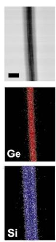

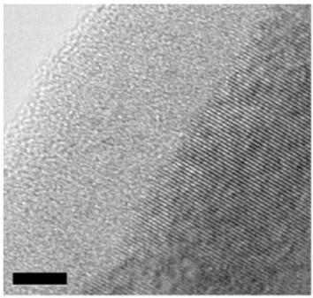

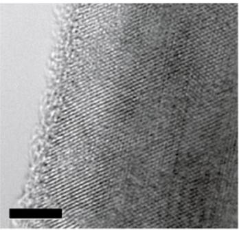

(b)  
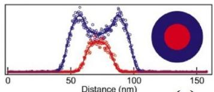

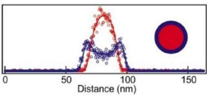

(c)  
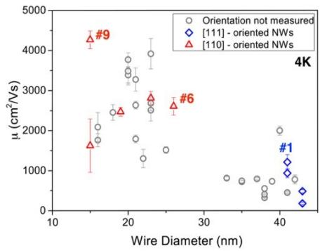

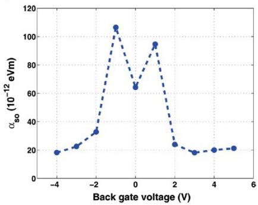  
图 1.6 (a)Ge/Si核壳纳米线结构示意图，图片引自[24]。(b)Ge/Si核壳纳米线中空穴迁移率随纳米线直径和方向的函数图，图片引自[30]。(c) Ge/Si 核壳纳米线的自旋轨道耦合系数与背栅电压关系的函数图，图片引自[31]。

Ge/Si 核壳纳米线虽然已经发展了这么多年，但仍然有两个关键问题需要解决。第一是无催化剂的生长方式，因为使用金属催化剂不可避免地会在半导体中引入金属污染。第二是如何把纳米线转移到面内并形成可扩展以及位置可控的阵列。目前在这方面的研究已经取得初步的进展，即通过纳米压印、刻蚀以及 CVD方法生长 Si/Ge/Si 核双壳纳米线[33]。

## 棚顶型Ge纳米线

棚顶型 Ge 纳米线的出现最初是受到分子束外延生长的自组织 Ge 量子点的启发，这种Ge量子点最初被称为“棚顶团簇”[34]，在 2012年，研究者们通过分子束外延以及退火技术，将棚顶型 Ge团簇沿着面内[100]和[010]方向使其延伸成微米级别的纳米线[35]，如图1.7(a)所示。这种纳米线具有面内均匀性，其横截面为三角形，纳米线高为 2 nm，侧边倾斜角为 11.3度。纳米线的载流子密度可以通过初始沉积 Ge 的含量决定，增加 Ge 的含量会使纳米线变短，载流子密度增加；反之减少Ge的含量会使纳米线变长，载流子密度减少。

相比于 Ge/Si 核壳纳米线，棚顶型 Ge 纳米是面内生长且不需要催化剂，但是其无序的生长模式也为量子器件的可扩展带来了瓶颈。因此研究者通过在预先光刻的图形化Si 衬底上，使Ge纳米线位置可控的自组织生长[36]。这种纳米线在 Si 衬底的凹槽边缘，在初始形成的一维 SiGe 层上沿着[100]方向选择性生长，如图1.7(b)所示 。它们的位置、长度、距离可以被精确地控制，因此可以获得方形或者T型等不同形状的结构以及间距紧密的平行纳米线。

本文的研究就是基于新型棚顶型 Ge 纳米线这种空穴型 Ge 基材料，其具体的物理性质以及实验细节将在后文中详细介绍。

(a)  
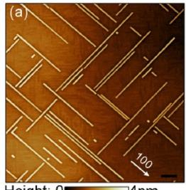

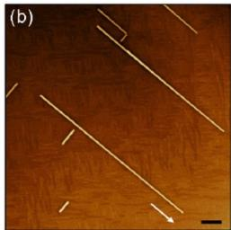

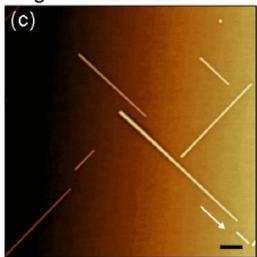

(b)  
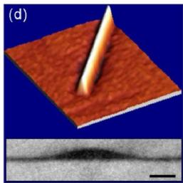

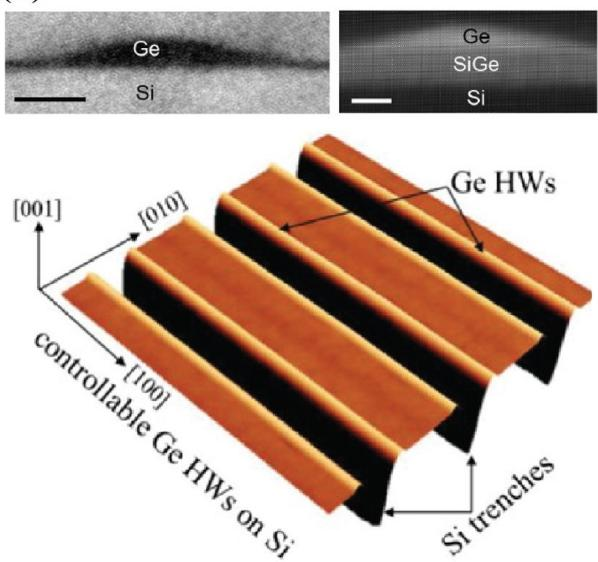  
图 1.7 (a) 棚顶型 Ge 纳米示意图，图片引自[35]。(b) 位置可控的棚顶型 Ge 纳米示意图，图片引自[36]。

## 1.3.2 锗量子器件

我们主要关注与量子计算相关的一些 Ge 量子器件，在过去多年的研究中，Ge/SiGe平面异质结、Ge/Si 核壳纳米线以及棚顶型 Ge纳米线已经成为研究这些器件的首选材料平台。平面异质结以及纳米线作为低维体系，自然地适用于量子点器件的研究，通过在栅极上施加电压形成势垒，能在一维或者二维维空间上形成束缚势，从而形成门控量子点。关于Ge量子点的很多实验已经被报道过，包括自旋态、g因子、电荷感应以及磁输运的测量，接下来我们就基于这些材料平台分别进行介绍。

高质量的无掺杂 Ge/SiGe平面异质结构被证实可行后，其相关量子点器件的研究取得了显著的进展，在短短两年时间里就从单量子点扩展到阵列式的四量子点[37,38]，如图 1.8(a)所示。由于其高迁移率和低空穴质量的特点，量子点尺寸可以被制备的比较大并且能被调节到单空穴区域。另外，Ge/SiGe平面异质结量子点面内 g 因子的大小为 $\mathbf { g } _ { \mathrm { i n } } \sim 0 . 2 – 0 . 3 [ 3 9 ]$ ，同时 g 因子具有很大的各向异性，$\mathrm { g _ { o u t } } / \mathrm { g _ { i n } } \mathord { \sim } 1 8$ ，这表明异质结在生长方向具有很强的限制，并且在第一子带具有重空穴的特性。Ge/SiGe平面异质结量子点具有非常好的调控量子点隧穿耦合以及失谐量的能力，可以在电荷对称点工作，从而达到优化量子调控的目的[38]。目前，Ge/SiGe平面异质结在多量子点耦合方面的研究也取得了一定进展，实现了RF电荷探测，并且操控了功能齐全的二维阵列量子点[38]，如图1.8(b)所示。

Ge/Si 核壳纳米线量子点的首次试验观测到了由于单空穴隧穿引起的库伦振荡以及规则的库伦菱形图[28]，这意味着纳米线中的杂质比较低，可通过增加门控栅极调节隧穿耦合以及势垒，从而可以由单量子点扩展为双量子点乃至三量子点[40]。Ge/Si 核壳纳米线可以集成电荷感应器来研究空穴的自旋驰豫[41]，如图1.8(c)和(d)所示。Ge/Si 核壳纳米线量子点中空穴的自旋态也可以通过输运测量探测，并且可以得到g因子\~2[42]，研究也证明了 Ge/Si 核壳纳米线的有效 g因子同样具有很强的各向异性 $\mathbf { g } _ { \mathrm { m a x } } / \mathbf { g } _ { \mathrm { m i n } } \sim 1 3 [ 4 3 ]$ 。另外，对Ge/Si 核壳纳米线双量子点中的泡利自旋阻塞以及在磁场下漏电流的分析可以研究自旋轨道耦合和自旋翻转共隧穿等机制[44, 45]。

与 Ge/Si 核壳纳米线类似，棚顶型 Ge 纳米线也是先制备了单量子点器件并观测到库伦菱形图[46]，随后由于材料的改进和工艺的提升，研究者又报道了 RF探测器[47]以及双量子点的研究[48]。棚顶型Ge纳米线的 g因子可以通过磁输运来测量[49]，其轻重空穴能带有非常大的劈裂，因此 g 因子有很大的各向异性$\mathbf { g } _ { \mathrm { m a x } } / \mathbf { g } _ { \mathrm { m i n } } \sim 1 8 [ 4 6 ]$ 。同时，实验也证明了棚顶型Ge纳米线具有强自旋轨道耦合[48]。

Ge hut wires

Ge/Si core/shell nanowires

Planar Ge/SiGe heterostructures

(a)  
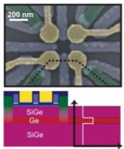

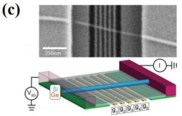

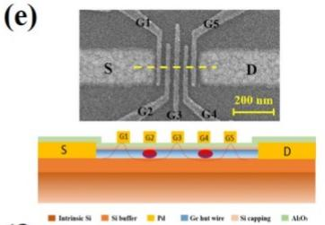

(b)  
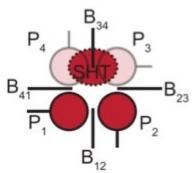

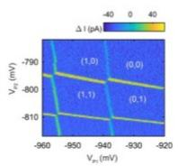

(d)  
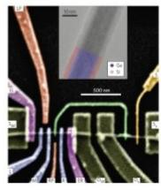

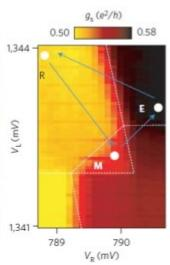

(f)  
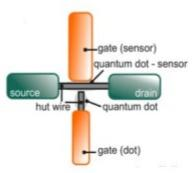

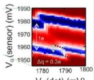  
图 1.8 (a)和(b) Ge/SiGe 平面异质结四量子点结构示意图，并基于此结构实现了 RF电荷探测，图片引自[38]。(c) Ge/Si 核壳纳米线三量子点结构示意图，图片引自[40]。(d) Ge/Si核壳纳米线双量子点，并集成电荷感应器来探测空穴的自旋驰豫，图片引自[41]。(e) 棚顶型Ge 纳米线双量子点结构示意图，图片引自[48]。(f) 基于棚顶型 Ge纳米线的 RF探测器，图片引自[47]。

## 1.3.3 自旋量子比特

对于量子信息处理来说，最关键的因素就是量子比特数目的扩展。在空穴自旋体系以外的其他体系中，例如 Si 电子自旋比特体系，为了实现比特的相干操控，需要额外集成小磁体或者微带线[53-55]，这无疑为比特的扩展增加了工艺上的难度。而对于Ge空穴体系来说，利用空穴的强自旋轨道耦合则可以避免这个难题，为未来的多比特实验研究提供了新的思路。

前文已经提到，利用电偶极自旋共振可以对空穴进行全电操控[56]，即在泡利自旋阻塞区域，通过外加微波频率的电场和磁场，使空穴自旋发生翻转，解除自旋阻塞并测量到漏电流。在自旋比特操控时，通过脉冲将比特制备到库伦阻塞区域并进行微波操控，之后再回到泡利自旋阻塞区域进行比特的读取，在不同的微波操控时间下读取，就可以观测到比特的相干自旋振荡。利用这种方法，最早的Ge空穴单比特操控在棚顶型Ge纳米线中双量子点中实现[51]，随后在Ge/SiGe平面异质结中，通过调节双量子点中的交换相互作用，也实现了两比特逻辑门[52]。Ge/Si 核壳纳米线中的空穴自旋驰豫以及相干时间也通过快速脉冲序列操控被测量[50]。这些通过微波脉冲和调节交换相互作用进行对比特自旋的操控实验，可以准确的表征自旋比特的弛豫时间和相干时间等重要参数，我们整理如图1.9 所示。

对于Ge空穴自旋量子比特而言，失谐噪声以及电荷噪声是影响退相干的主要因素，因此获得低杂质 Ge材料器件就变得十分关键。同时，对比特进行快速操控也是实现高保真度的必要条件。我们介绍了基于不同材料的 Ge 空穴自旋量子比特，它们都有各自的优点。如Ge/SiGe平面异质结具有最高的迁移率和最长的相干时间，Ge/Si 核壳纳米线具有强自旋轨道耦合，棚顶型 Ge 纳米线具有强自旋轨道耦合和可扩展的优点。把它们各自的优点相结合从而实现更完备的 Ge自旋量子计算的平台，是未来研究的主要方向和目标。

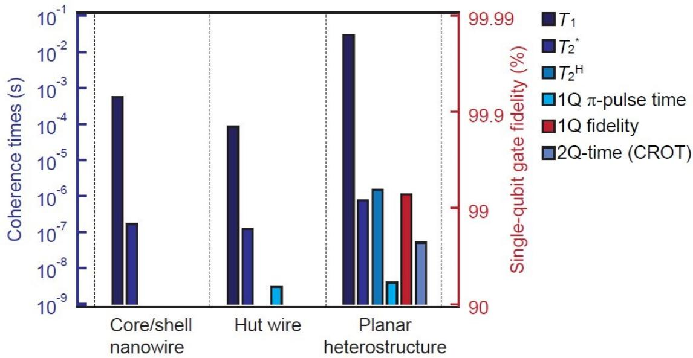  
图 1.9 Ge/SiGe 平面异质结、Ge/Si 核壳纳米线以及棚顶型 Ge 纳米线量子点中空穴自旋比特的弛豫时间、相干时间、比特保真度等参数的总结图表，图片引自[20]。

## 1.4 双量子点与腔量子电动力学

腔量子电动力学(cavity QED)是一种利用微波腔研究光与物质之间相互作用的学科。早期被应用在凝聚态物理中对限制在光子腔中的自组装量子点以及超导量子比特与微波腔耦合的研究[57-60]。这些实验都是基于量子器件与腔相互作用的研究，因为量子系统具有分立的能级，可以与腔内光子的能级相匹配。因此，研究者也利用腔量子电动力学来研究门控半导体量子点中的电荷或者自旋[61-63]。

从本质上来说，一个腔量子电动力学系统由两部分组成：一个在共振频率$f _ { \mathrm c }$ 下定义明确的光子模式的腔，以及一个二能级量子体系并且能量差接近腔中的光子能量 $h f _ { \mathrm { c } }$ ，ℎ为普朗克常数，如图1.10(a)所示。其最早是应用在铯原子中的

(a)  
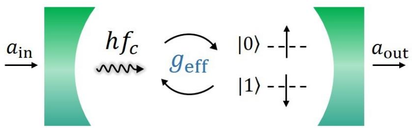

(b)  
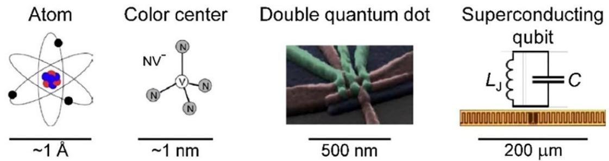  
图 1.10(a) 腔量子电动力学原理示意图。一个二能级的量子体系内置在光子能量为 $| h f _ { \mathrm { c } }$ 的腔内，量子体系与谐振腔的电磁场相互作用，这种相互作用以有效耦合强度 $g _ { \mathrm { e f f } }$ ，可以在色散状态下通过驱动 $a _ { \mathrm { i n } }$ 输入和测量 $a _ { \mathrm { o u t } }$ 来执行读出。(b) 腔量子电动力学在不同量子体系的应用，图片引自[63]。

Rydberg 态之间的微波跃迁[64]，图 1.10(b)也列举了腔量子电动力学在一些固态量子体系应用的例子。如金刚石中的氮空位(nitrogen vacancy, NV)色心[65,66]、半导体双量子点[61,68]、和超导量子比特[68,69]。这里我们主要关注半导体双量子点中的腔量子电动力学研究，量子点中的电荷可以通过电偶极与腔中电场相互作用[70,71]，而通过自旋轨道耦合也可以研究自旋-光子的相干作用[72,73]。

## 1.4.1 双量子点与微波腔耦合

双量子点的结构前面已经介绍过了，这里就不再赘述了。图1.11(a)为一个双量子点通过电偶极和微波腔耦合的示意图。对于包含一个电荷(空穴)的双量子点可以看作一个电荷量子比特，双量子点的能级失谐量 ε 和点间隧穿耦合 $2 t _ { \mathrm { c } }$ 可以被栅极电压调节，由哈密顿量来描述：

$$
H _ { 0 } = \binom { \varepsilon / 2 } { t _ { \mathrm { c } } } \quad \begin{array} { c c } { t _ { \mathrm { c } } } \\ { t _ { \mathrm { c } } } \end{array}\tag{1.11}
$$

其电荷态可写为 $\scriptstyle | L \rangle = | ( 1 , 0 ) \rangle , | R \rangle = | ( 0 , 1 ) \rangle$ ，其中|(N,M)⟩表示双量子点中左点(右点)中有 N(M)个电荷占据[74]。换句话说，|𝐿⟩和|𝑅⟩表示空穴在左点或者右点的电荷态。当左点和右点的能级齐平时(ε = 0), |𝐿⟩和|𝑅⟩态杂化为成键态和反键态|±⟩ =$| L \rangle \pm | R \rangle$ ；当失谐量比较大时 $( \varepsilon \gg t _ { \mathrm { c } } )$ ，|𝐿⟩和|𝑅⟩基本上不受隧穿耦合的影响。其能级能量 E 与失谐量的关系ε如图 1.11(b)所示。这里 $\Omega = \sqrt { \varepsilon ^ { 2 } + 4 t ^ { 2 } }$ 代表 |𝐿⟩与|𝑅⟩的能量差。

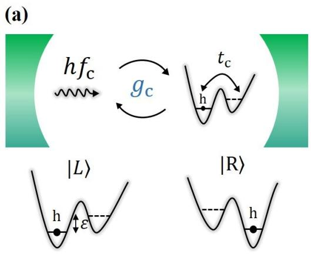

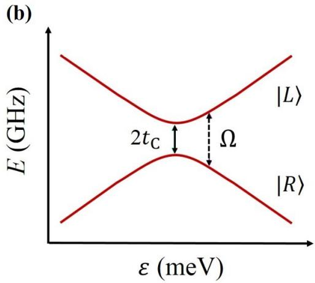  
图 1.11(a) 双量子点和微波腔耦合的示意图。(b) 双量子点电荷态的能级图。

## 1.4.2 电荷-光子相互作用

二能级量子点体系的能量结构尺度一般在 20-40 μeV 范围，和光子能接近，适合研究超导微波腔中的光子。对于微波腔来说，存在本征的内部损耗 $\kappa _ { \mathrm { i n t } }$ 以及通过腔输入输出的端口损耗 $\kappa _ { 1 }$ 和 $\kappa _ { 2 }$ 。电偶极相互作用使得双量子点中电荷与微波腔中的光子耦合，耦合强度用 $g _ { \mathrm { c } }$ 表示，而 $g _ { \mathrm { c } }$ 和电偶极矩ed以及微波腔内的真空电场幅值 $E _ { 0 }$ 成正比。在失谐量 ε =0时，电荷态被最大程度地杂化，电荷-光子耦合强度 $g _ { \mathrm { c } }$ 最大。随着 ε 增加，有效电偶极矩随 $2 t _ { \mathrm { c } } / \Omega$ 减小。

当一个双量子点置在超导微波腔内部时，腔内部的电场 $E _ { r e s }$ 使得左右点的能级差由 ε 变为 $\varepsilon + e E _ { r e s } d$ ，这里由于d要比腔内电磁场的波长要小很多，所以我们采用了电偶极近似。量子化的电场算符可以由腔内电磁场的产生和湮灭算符来表示，写为 $E _ { \mathrm { c a v } } = E _ { 0 } ( a + a ^ { \dagger } )$ 。综上所述，电荷量子比特和微波腔耦合的哈密顿量可以写为：

$$
H = H _ { 0 } + H _ { \mathrm { i n t } }\tag{1.12}
$$

其中 $^ { 1 } H _ { \mathrm { i n t } } = g _ { \mathrm { c } } ( a + a ^ { \dagger } ) \tau _ { \mathrm { z } } , ~ g _ { \mathrm { c } } = e E _ { 0 } d$ ，量子算符 $\tau _ { \mathrm { z } } | ( 1 , 0 ) \rangle = | ( 1 , 0 ) \rangle , \tau _ { \mathrm { z } } | ( 0 , 1 ) \rangle =$ $- | ( 0 , 1 ) \rangle$ 。这里耦合强度 $g _ { \mathrm { c } }$ 可以通过微波在腔内的输入输出理论来计算[75],把$H _ { 0 }$ 对角化，并利用旋波近似把快速振荡项忽略，可以得到：

$$
\begin{array} { r } { H = \frac { \Omega } { 2 } \tau _ { \mathrm { z } } + g _ { \mathrm { e f f } } ( a \tau _ { + } + a ^ { \dagger } \tau _ { - } ) + \Delta a ^ { \dagger } a } \end{array}\tag{1.13}
$$

其中 $g _ { \mathrm { e f f } } = g _ { \mathrm { c } } / \Omega$ 9 $\Delta / 2 \pi = f _ { \mathrm { c } } - f _ { \mathrm { R } }$ ， $f _ { \mathrm { R } }$ 为输入微波频率。τ 算子用来定义 $H _ { 0 }$ 的本征态，根据 Heisenberg-Langevin 方程，光子的动量算符可以写为：

$$
\begin{array} { r } { \dot { a } = - i \Delta a - \frac { \kappa } { 2 } a + \sum _ { n } \sqrt { \kappa _ { n } } a _ { n , i n } ( t ) - i g _ { \mathrm { e f f } } \tau _ { - } } \end{array}\tag{1.14}
$$

$$
\begin{array} { r } { \dot { \tau _ { - } } = - i \Omega \tau _ { - } - \frac { \gamma } { 2 } \tau _ { - } - i g _ { \mathrm { e f f } } a } \end{array}\tag{1.15}
$$

这里 $\gamma$ 为电荷量子比特的退相干率，由 $\dot { a } = \dot { \tau _ { - } } = 0$ ，我们可以得到腔的传输系数：

$$
\begin{array} { r } { \mathrm { A } = \frac { a _ { 2 , \mathrm { o u t } } } { a _ { 1 , \mathrm { i n } } } = \frac { \sqrt { \kappa _ { 2 } a } } { a _ { 1 , \mathrm { i n } } } = \frac { - i \sqrt { \kappa _ { 1 } \kappa _ { 2 } } } { \Delta - \frac { i \kappa } { 2 } + g _ { \mathrm { e f f } } \chi } } \end{array}\tag{1.16}
$$

其中， $\chi$ 为双量子点的极化率：

$$
\begin{array} { r } { \chi = \frac { g _ { \mathrm { e f f } } } { - \Omega + i \gamma / 2 } } \end{array}\tag{1.17}
$$

为简单起见，我们讨论没有内在损耗的对称腔 $( \kappa _ { \mathrm { i n t } } = 0 , \kappa _ { 1 } = \kappa _ { 2 } = \kappa / 2 )$ 且输入的微波频率和腔频共振 $( \Delta = 0 )$ 的情况，在不考虑双量子点 $( \chi = 0 )$ 时，微波可以无阻碍地在腔体里传输(A = 1)。而当两个量子点里的能级对称时 $( \varepsilon = 0 )$ ，极化率𝜒 最大。由此我们可以得知，双量子点里的电荷和与微波腔里的光子相互作用，电荷的动力学效应会影响微波腔的复导纳[76,77]，从而改变腔的幅值和相位，因此我们可以通过读取微波腔的信号来表征量子点的状态。

## 1.4.3 自旋-光子相互作用

我们知道，和自旋量子比特相比，电荷量子比特的相干时间通常很短，因此实现自旋量子比特与超导微波腔的耦合对实现多比特扩展以及超导-半导体量子器件具有重要意义。但是由于自旋并不会直接和微波腔里的电场相耦合，研究者们就提出了一些方案。其中一个就是利用自旋轨道耦合[62,78-80]，但只有一些空穴价带的半导体具有本征的强自旋轨道耦合，例如本章提到的 Ge/Si 核壳纳米线和棚顶型Ge纳米线。对于其他的电子型材料，例如Si，由于其自旋轨道耦合比较弱，研究者则提出了利用在基片上制备微型磁体来产生磁场梯度[72,73]，从而达到和自旋轨道耦合相同的效果。

前面已经提到，量子化的电场算符同样可以写为 $E _ { \mathrm { c a v } } = E _ { 0 } ( a + a ^ { \dagger } )$ ，微型磁体产生磁场梯度为 $\nabla _ { x } B$ ，左右两个量子点感应到的磁场变化量为 $\Delta B _ { x } = \nabla _ { x } B d$ 在外加磁场 $B _ { z } \mathrm { ~ \ r ~ { ~ F ~ } ~ }$ ，自旋会塞曼劈裂成自旋向上和自旋向下两个状态。同时考虑到自旋和电荷的双量子点，哈密顿量可以写为：

$$
H _ { 0 } = \left( \begin{array} { c c c c } { \varepsilon + B _ { z } } & { \Delta B _ { x } } & { 2 t _ { \mathrm { c } } } & { 0 } \\ { \Delta B _ { x } } & { \varepsilon - B _ { z } } & { 0 } & { 2 t _ { \mathrm { c } } } \\ { 2 t _ { \mathrm { c } } } & { 0 } & { - \varepsilon + B _ { z } } & { - \Delta B _ { x } } \\ { 0 } & { 2 t _ { \mathrm { c } } } & { - \Delta B _ { x } } & { - \varepsilon - B _ { z } } \end{array} \right)\tag{1.18}
$$

由于磁场 $\Delta B _ { x }$ 垂直于外加均匀场 $B _ { z }$ ，此时电荷比特与自旋比特杂化，使得自旋与微波腔中的光子耦合。系统的哈密顿量可以写为：

$$
\begin{array} { r } { H = H _ { 0 } + H _ { \mathrm { i n t } } = \frac 1 2 \Delta _ { S } \sigma _ { Z } + g _ { S } ( \sigma _ { + } + a ^ { \dagger } \sigma _ { - } ) } \end{array}\tag{1.19}
$$

其中， $\Delta _ { S } = E _ { z } - h f _ { c }$ ，为自旋塞曼劈裂能与光子能的失谐，对于一个对称的双量子点 $( \varepsilon = 0 )$ ，则自旋-光子耦合强度就可以写为：

$$
g _ { S } \cong g _ { \mathrm { c } } \Delta B _ { x } / 2 ( 2 t _ { c } - h f _ { c } )\tag{1.20}
$$

我们在Ge纳米线双量子点中实现了空穴与腔中的光子相互耦合，并利用本节介绍的腔量子电动力学对其进行研究，我们观测到的实验现象和具体实验细节将在第四章进行详细讨论。

## 1.5 论文结构

本文一共分为六个章节。第一章我们介绍了Ge相关材料体系以及物理概念，包括半导体量子点、量子点中的空穴自旋、锗空穴体系以及双量子点与腔量子电动力学。第二章我们将介绍基于棚顶型Ge纳米线量子点样品的制备与性质表征，包括相关微纳加工工艺、样品详细制备流程、4.2 K 低温下样品的性质表征以及Ge 纳米线迁移率的测量。第三章我们将展示 Ge 纳米线双量子点中的空穴自旋的实验研究结果，包括泡利自旋阻塞和电偶极自旋共振的观测以及自旋单比特的表征。第四章我们将研究锗纳米线双量子点与超导微波腔的偶极耦合，包括利用微波腔进行对双量子点电荷态的读取、电荷-光子耦合强度和电荷比特退相干率等重要参数的表征、以及自旋-光子耦合强度的评估。第五章我们将对量子点的扩展进行一些探索，在基于定位型的 Ge纳米线上实现了电荷感应器对双量子点的探测。最后一章对这些实验进行了总结，并对未来基于空穴自旋的两比特、自旋-光子耦合、量子点阵列探索进行了展望。

## 参考文献

[1] M. A. Nielsen, I. L. Chuang, Quantum Computation and Quantum Information, Cambridge: Cambridge University Press (2000).

[2] N. D. Mermin, Quantum computer science. Cambridge: Cambridge University Press (2007).

[3] D. P. DiVincenzo, The physical implementation of quantum computation. Fortschritte der Physik 48, 771–783 (2000).

[4] P. W. Shor, Scheme for reducing decoherence in quantum computer memory. Phys. Rev. A 52, R2493(R) (1995).

[5] A. M. Steane, Error correcting codes in quantum theory. Phys. Rev. Lett. 77, 793 (1996).

[6] L. P. Kouwenhoven, D. G. Austing, S. Tarucha, Fewelectron quantum dots. Rep. Prog. Phys. 64, 701 (2001).

[7] R. Hanson, L. P. Kouwenhoven, J. R. Petta, S. Tarucha, L. M. K. Vandersypen, Spins in few-electron quantum dots. Rev. Mod. Phys. 9(0), 1217–1265 (2007).

[8] K. Ono, S. Tarucha, Nuclear-Spin-Induced Oscillatory Current in Spin-Blockaded Quantum Dots. Phys. Rev. Lett. 92, 256803 (2004).

[9] W. A. Coish, F. Qassemi, Leakage-current line shapes from inelastic cotunneling in the Pauli spin blockade regime. Phys. Rev. B 84, 245407 (2011).

[10] J. Danon, Y. V. Nazarov, Pauli spin blockade in the presence of strong spin-orbit coupling. Phys. Rev. B 80, 041301(R) (2009).

[11] R. Winkler, Spin-Orbit Coupling Effects in Two-Dimensional Electron and Hole Systems. Springer, 2003.

[12] A. V. Khaetskii, Y. V. Nazarov, Spin-flip transitions between zeeman sublevels in semiconductor quantum dots. Phys. Rev. B 64, 25316 (2001).

[13] V. N. Golovach, M. Borhani, D. Loss, Electric-dipole-induced spin resonance in quantum dots. Phys, Rev. B 74, 165319 (2006).

[14] C. Kloeffel, M. Trif, D. Loss, Strong spin-orbit interaction and helical hole states in Ge/Si nanowires. Phys. Rev. B 84, 195314 (2011).

[15] D. P. DiVincenzo, D. Loss, Quantum computation with quantum dots. Phys. Rev. A 57, 120–126 (1998).

[16] A. Y. Kitaev, Unpaired majorana fermions in quantum wires. Physics-Uspekhi 44, 131– 136 (2001).

[17] T. W. Larsen, K. D. Petersson, F. Kuemmeth, T. S. Jespersen, P. Krogstrup, J. Nygård, C. M. Marcus, Semiconductor-Nanowire-Based Superconducting Qubit. Phys. Rev. Lett. 115, 127001 (2015).

[18] R. People, J. C. Bean, Band alignments of coherently strained GeSi/Si heterostructures on 001 GeSi substrates. Appl. Phys. Lett. 48, 538–540 (1986).

[19] Y. H. Xie, Don Monroe, E. A. Fitzgerald, P. J. Silverman, F. A. Thiel, G. P. Watson, Very high mobility two-dimensional hole gas in Si/GexSi1−x/Ge structures grown by molecular beam epitaxy. Appl. Phys. Lett. 63, 2263–2264 (1993).

[20] G. Scappucci, C. Kloeffel, F. A. Zwanenburg, D. Loss, M. Myronov, J. J. Zhang, S. De Franceschi, G. Katsaros, M. Veldhorst, The germanium quantum information route. arXiv:2004.08133v1(2020)

[21] A. Dobbiea, M. Myronov, R. J. H. Morris, A. H. A. Hassan, M. J. Prest, V. A. Shah, E. H. C. Parker, T. E. Whall, and D. R. Leadley, Ultra-high hole mobility exceeding one million in a strained germanium quantum well. Appl. Phys. Lett. 101, 172108 (2012).

[22] M. G. Borsellia, K. Eng, E. T. Croke, B. M. Maune, B. Huang, R. S. Ross, A. A. Kiselev, P. W. Deelman, I. Alvarado-Rodriguez, A. E. Schmitz, M. Sokolich, K. S. Holabird, T. M. Hazard, M. F. Gyure, A. T. Hunter, Pauli spin blockade in undoped Si/SiGe two-electron double quantum dots. Appl. Phys. Lett. 99, 063109 (2011).

[23] B. M. Maune, M. G. Borselli, B. Huang, T. D. Ladd, P. W. Deelman, K. S. Holabird, A. A. Kiselev, I. Alvarado-Rodriguez, R. S. Ross, A. E. Schmitz, M. Sokolich, C. A. Watson, M. F. Gyure, A. T. Hunter, Coherent singlet-triplet oscillations in a silicon-based double quantum dot. Nature 481, 344–347(2012).

[24] L. J. Lauhon, M. S. Gudiksen, D. Wang, C. M. Lieber, Epitaxial core-shell and coremultishell nanowire heterostructures. Nature 420, 57−61 (2002).

[25] I. A. Goldthorpe, A. F. Marshall, P. C. McIntyre, Inhibiting Strain-Induced Surface Roughening: Dislocation-Free Ge/Si and Ge/SiGe Core-Shell Nanowires. Nano Lett. 9, 3715–3719 (2009).

[26] D. C. Dillen, K. Kim, E. S. Liu, E. Tutuc, Radial modulation doping in core–shell nanowires. Nat. Nanotechnol. 9,116–120 (2014).

[27] M. Sistani, J. Delaforce, R. B. G. Kramer, N. Roch, M. A. Luong, M. I. den Hertog, E. Robin, J. Smoliner, J. Yao, C. M. Lieber, C. Naud, A. Lugstein, O. Buisson, Highly Transparent Contacts to the 1D Hole Gas in Ultrascaled Ge/Si Core/Shell Nanowires. ACS Nano 13, 14145–14151(2019).

[28] W. Lu, J. Xiang, B. P. Timko, Y. Wu, C. M. Lieber, One-dimensional hole gas in germanium/silicon nanowire heterostructures. Proc. Natl. Acad. Sci. 102, 10046–10051 (2005).

[29] D. K. Patil, B. M. Nguyen, J. Yoo, S. A. Dayeh, S. M. Frolov, Quasiballistic quantum transport through Ge/Si core/shell nanowires. Nanotechnology 28, 385204 (2017).

[30] S. Conesa-Boj, A. Li, S. Koelling, M. Brauns, J. Ridderbos, T. T. Nguyen, M. A. Verheijen, P. M. Koenraad, F. A. Zwanenburg, E. P. A. M. Bakkers, Boosting hole mobility in coherently strained [110]-oriented Ge−Si/core−shell nanowires. Nano Lett. 17, 4, 2259– 2264 (2017).

[31] X. J. Hao, T. Tu, G. Cao, C. Zhou, H. O. Li, G. C. Guo, W. Y. Fung, Z. Ji, G. P. Guo, W. Lu, Strong and tunable spin-orbit coupling of one-dimensional holes in Ge/Si core/shell nanowires. Nano Lett. 10, 2956 (2010).

[32] J. Sun, R. S Deacon, R. Wang, J. Yao, C. M. Lieber, K. Ishibashi, Helical hole state in multiple conduction modes in ge/si core/shell nanowire. Nano Lett. 18, 6144–6149 (2018).

[33] X. Zhang, W. Jevasuwan, Y. Sugimoto, N. Fukata, Controlling Catalyst-Free Formation and Hole Gas Accumulation by Fabricating Si/Ge Core-Shell and Si/Ge/Si Core-Double Shell Nanowires. ACS Nano 13, 13403–13412 (2019).

[34] Y. W. Mo, D. E. Savage, B. S. Swartzentruber, M. G. Lagally, Kinetic pathway in Stranski-Krastanov growth of Ge on Si (001). Phys. Rev. Lett. 65, 1020 (1990).

[35] J. J. Zhang, G. Katsaros, F. Montalenti, D. Scopece, R. O. Rezaev, C. Mickel, B. Rellinghaus, L. Miglio, S. De Franceschi, A. Rastelli, O. G. Schmidt, Monolithic growth of ultrathin Ge nanowires on Si (001). Phys Rev Lett. 109 (8), 085502 (2012).

[36] F. Gao, J. H. Wang, H. Watzinger, H. Hu, M. J. Rančić, J. Y. Zhang, T. Wang, Y. Yao, G. L. Wang, J. Kukučka, L. Vukušić, C. Kloeffel, D. Loss, F. Liu, G. Katsaros and J. J. Zhang, Site-controlled uniform Ge/Si hut wires with electrically tunable spin–orbit coupling. Adv Mater. 32, 1906523 (2020).

[37] N. W. Hendrickx, D. P. Franke, A. Sammak, M. Kouwenhoven, D. Sabbagh, L. Yeoh, R. Li, M. L. V. Tagliaferri, M. Virgilio, G. Capellini, G. Scappucci, M. Veldhorst, Gatecontrolled quantum dots and superconductivity in planar germanium. Nat. Commun. 9, 1– 7 (2018).

[38] W. Lawrie, H. Eenink, N. Hendrickx, J. Boter, L. Petit, S. Amitonov, M. Lodari, B. Paquelet Wuetz, C. Volk, S. Philips et al., Quantum dot arrays in silicon and germanium. Appl. Phys. Lett. 116, 080501 (2020).

[39] N. W. Hendrickx, D. P. Franke, A. Sammak, G. Scappucci and M. Veldhorst, Fast two-

qubit logic with holes in germanium. Nature 577, 487–491 (2020).

[40] F. N. M. Froning, M. K. Rehmann, J. Ridderbos, M. Brauns, F. A. Zwanenburg, A. Li, E. P. A. M. Bakkers, D. M. Zumbuhl, F. R. Braakman, Single, double, and triple quantum dots in Ge/Si nanowires. Appl. Phys. Lett. 113, 073102 (2018).

[41] Y, Hu, H. O. H. Churchill, D. J. Reilly, J. Xiang, C. M. Lieber, C. M. Marcus, A Ge/Si heterostructure nanowire-based double quantum dot with integrated charge sensor. Nat. Nanotechnol. 622-625 (2007).

[42] S. Roddaro, A. Fuhrer, P. Brusheim, C. Fasth, H. Q. Xu, L. Samuelson, J. Xiang, and C. M. Lieber, Spin states of holes in Ge/Si nanowire quantum dots. Phys. Rev. Lett. 101, 186802 (2008).

[43] M. Brauns, J. Ridderbos, A. Li, E. P. A. M. Bakkers, F. A. Zwanenburg, Electric-field dependent g-factor anisotropy in Ge-Si core-shell nanowire quantum dots. Phys. Rev. B 93, 121408 (2016).

[44] M. Brauns, J. Ridderbos, A. Li, E. P. A. M. Bakkers, G. Wilfred, van der Wiel, F. A. Zwanenburg, Anisotropic Pauli spin blockade in hole quantum dots. Phys. Rev. B 94, 041411 (2016).

[45] A. Zarassi, Z. Su, J. Danon, J. Schwenderling, M. Hocevar, B. M. Nguyen, J. Yoo, S. A. Dayeh, S. M. Frolov, Magnetic field evolution of spin blockade in Ge/Si nanowire double quantum dots. Phys. Rev. B 95, 155416 (2017).

[46] H. Watzinger, C. Kloeffel, L. Vukusic, M. D. Rossell, V. Sessi, J. Kukucka, R. Kirchschlager, E. Lausecker, A. Truhlar, M. Glaser, A. Rastelli, A. Fuhrer, D. Loss, and G. Katsaros, Heavy-hole states in germanium hut wires. Nano Lett. 16, 6879 (2016).

[47] L. Vukušic, J. Kukucka, H. Watzinger, G. Katsaros, Fast Hole Tunneling Times in Germanium Hut Wires Probed by Single-Shot Reflectometry. Nano Lett. 17, 5706–5710 (2017).

[48] G. Xu, F. Gao, K. Wang, T. Zhang, H. Liu, G. Cao, T. Wang, J. J. Zhang, H. W. Jiang, H. O. Li, G. P. Guo, Hole spin in tunable Ge hut wire double quantum dot. Applied Physics Express 18, 2091 (2020).

[49] S. X. Li, Y. Li, F. Gao, G. Xu, H. O. Li, G. Cao, M. Xiao, T. Wang, J. J. Zhang, G. P. Guo, Measuring hole spin states of single quantum dot in germanium hut wire. Appl. Phys. Lett. 110, (13), 133105 (2017).

[50] A. P. Higginbotham, T. W. Larsen, J. Yao, H. Yan, C. M. Lieber, C. M. Marcus, F. Kuemmeth, Hole spin coherence in a Ge/Si heterostructure nanowire. Nano Lett. 14, 3582- 3586 (2014).

[51] H. Watzinger, J. Kukučka, L. Vukušić, F. Gao, T. Wang, F. Schäffler, J. J. Zhang & G. Katsaros, A germanium hole spin qubit. Nat. Commun. 9, 3902 (2018).

[52] N. W. Hendrickx, D. P. Franke, A. Sammak, G. Scappucci and M. Veldhorst, Fast twoqubit logic with holes in germanium. Nature 577, 487–491 (2020).

[53] D. M. Zajac, A. J. Sigillito, M. Russ, F. Borjans, J. M. Taylor, G. Burkard, J. R. Petta, Resonantly driven CNOT gate for electron spins. Science 359, 439-442 (2018).

[54] T. F. Watson, S. G. J. Philips, E. Kawakami, D. R. Ward, P. Scarlino, M. Veldhorst, D. E. Savage, M. G. Lagally, M. Friesen, S. N. Coppersmith, M. A. Eriksson, L. M. K. A. Vandersypen, A programmable two-qubit quantum processor in silicon. Nature 555, 633- 637 (2018).

[55] W. Huang, C. H. Yang, C. K. Chan, T. Tanttu, B. Hensen, R. C. C. Leon, M. A. Fogarty, J. C. C. Hwang, F. E. Hudson, K. M. Itoh, A. Morello, A. Laucht, A. S. Dzurak, Fidelity benchmarks for two-qubit gates in silicon. Nature 569, 532 (2019).

[56] D. V. Bulaev, D. Loss, Electric dipole spin resonance for heavy holes in quantum dots. Phys. Rev. Lett. 98, 097202 (2007).

[57] J. P. Reithmaier, G. Sęk, A. Löffler, C. Hofmann, S. Kuhn, S. Reitzenstein, L. V. Keldysh, V. D. Kulakovskii, T. L. Reinecke, A. Forchel, Strong coupling in a single quantum dot– semiconductor microcavity system. Nature 432, 197 (2004).

[58] E. Peter, P. Senellart, D. Martrou, A. Lemaître, J. Hours, J. M. Gérard, J. Bloch, Excitonphoton strong-coupling regime for a single quantum dot embedded in a microcavity. Phys. Rev. Lett. 95, 067401 (2005).

[59] A. Blais, R. S. Huang, A. Wallraff, S. M. Girvin, R. J. Schoelkopf, Cavity quantum electrodynamics for superconducting electrical circuits: An architecture for quantum computation. Physical ReviewA 69, 062320 (2004).

[60] A. Wallraff, D. I. Schuster, A. Blais, L. Frunzio, R. S. Huang, J. Majer, S. Kumar, S. M. Girvin, R. J. Schoelkopf, Strong coupling of a single photon to a superconducting qubit using circuit quantum electrodynamics. Nature 431, 162 (2004).

[61] L. Childress, A. S. Sørensen, M. D. Lukin, Mesoscopic cavity quantum electrodynamics with quantum dots. Phys. Rev. A 69, 042302 (2004).

[62] M. Trif, V. N. Golovach, D. Loss, Spin dynamics in InAs nanowire quantum dots coupled to a transmission line. Phys. Rev. B 77, 045434 (2008).

[63] G. Burkard, M. J. Gullans, X. Mi, J. R. Petta, Nature Rev.Phys. 2, 129-140 (2020).

[64] R.G. Hulet, E. S. Hilfer, D. Kleppner, Inhibited spontaneous emission by a Rydberg atom. Phys. Rev. Lett. 55, 2137 (1985).

[65] D. Englund, B. Shields, K. Rivoire, F. Hatami, J. Vučković§, H. Park, M. D. Lukin, Deterministic coupling of a single nitrogen vacancy center to a photonic crystal cavity. Nano Lett. 10, 3922 (2010).

[66] A. Sipahigil, R. E. Evans, D. D. Sukachev, M. J. Burek, J. Borregaard, M. K. Bhaskar, C. T. Nguyen, J. L. Pacheco, H. A. Atikian, C. Meuwly, R. M. Camacho, F. Jelezko, E. Bielejec, H. Park, M. Lončar, M. D. Lukin, An integrated diamond nanophotonics platform for quantum-optical networks. Science 354, 847 (2016).

[67] X. Mi, M. Benito, S. Putz, D. M. Taylor, J. M. Burkard, J. R. Petta, A coherent spin– photon interface in silicon. Nature 555, 599 (2018).

[68] M. H. Devoret, R. J. Schoelkopf, Superconducting circuits for quantum information: an outlook. Science 339, 1169 (2013).

[69] Z. L. Xiang, S. Ashhab, J. Q. You, F. Nori, Hybrid quantum circuits: Superconducting circuits interacting with other quantum systems. Rev. Mod. Phys. 85, 623 (2013).

[70] X. Mi, J. V. Cady, D. M. Zajac, P. W. Deelman, J. R. Petta, Strong coupling of a single electron in silicon to a microwave photon. Science 355, 156 (2017).

[71] A. Stockklauser, P. Scarlino, J. V. Koski, Gasparinetti, C. K. Andersen, C. Reichl, W. Wegscheider, T. Ihn, K. Ensslin, A. Wallraff, Strong Coupling Cavity QED with Gate-Defined Double Quantum Dots Enabled by a High Impedance Resonator. Physical Review X, 7, 011030 (2017).

[72] X. Mi, M. Benito, S. Putz, D. M. Taylor, J. M. Burkard, J. R. Petta, A coherent spin– photon interface in silicon. Nature 555, 599 (2018).

[73] N. Samkharadze, G. Zheng, N. Kalhor, D. Brousse, A. A. Sammak, U. C. Mendes, A. Blais, G. Scappucci, L. M. K. Vandersypen, Strong spin-photon coupling in silicon. Science 359, 1123-1127 (2018).

[74] K. D. Petersson, J. R. Petta, H. Lu, A. C. Gossard, Quantum coherence in a one-electron semiconductor charge qubit. Phys. Rev. Lett. 105, 246804 (2010).

[75] M. Benito, X. Mi, J. M. Taylor, J. R. Petta, G. Burkard, Input-output theory for spinphoton coupling in Si double quantum dots. Phys. Rev. B 96, 235434 (2017).

[76] S. J. Chorley, J. Wabnig, Z. V. Penfold-Fitch, K. D. Petersson, J. Frake, C. G. Smith, M. R. Buitelaar，Measuring the Complex Admittance of a Carbon Nanotube Double Quantum Dot. Phys. Rev. Lett. 108, 036802 (2012).

[77] T. Frey, P. J. Leek, M. Beck, J. Faist, A. Wallraff, K. Ensslin, T. Ihn, M. Büttiker, Quantum dot admittance probed at microwave frequencies with an on-chip resonator. Phys. Rev. B 86, 115303 (2012).

[78] K. C. Nowack, F. H. L. Koppens, Y. V. Nazarov, L. M. K. Vandersypen, Coherent control of a single electron spin with electric fields. Science 318, 1430 (2007).

[79] S. Nadj-Perge, S. M. Frolov, E. Bakkers, L. P. Kouwenhoven, Spin-orbit qubit in a semiconductor nanowire. Nature 468, 1084 (2010).

[80] K. D. Petersson, L. W. McFaul, M. D. Schroer, M. Jung, J. M. Taylor, A. A. Houck, J. R. Petta, Circuit quantum electrodynamics with a spin qubit. Nature 490, 380 (2012).

## 第 2 章 样品制备与性质表征

## 2.1 棚顶型锗纳米线

前面章节已经介绍了几种受到广泛关注的 Ge 材料体系，而我们的工作主要是基于新型棚顶型 Ge 纳米线(Ge hut wire)材料。它是基于 Si 和 Ge 的晶格不匹配，利用外延技术在 Si衬底上生长出Ge的三维立体结构，这种生长机制被称为应力驱动型 Stranski-Krastano (SK)模式[1]。另一种基于 SK 生长模式的自组织Si/Ge纳米晶材料也被报道过[2]，其晶体的形状包括棚顶型，金字塔形以及圆顶型，如图 2.1 所示。但是由于 Si/Ge 纳米晶结构的尺寸非常小，制备双量子点器件的难度非常大，而基于双量子点的自旋操控又是很常用的技术。因此，在 2012年，研究者又利用分子束外延技术生长了棚顶型 Ge纳米线[3]。

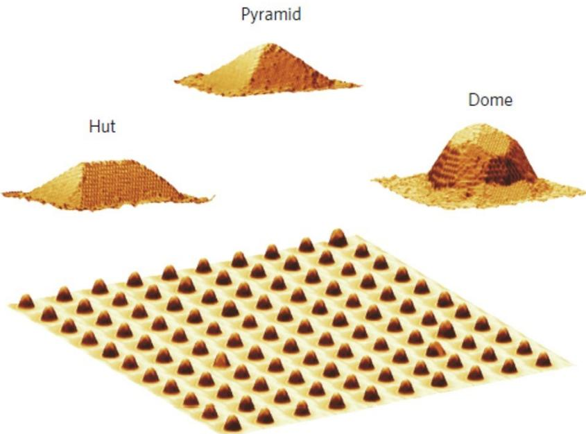  
图 2.1 自组织 Si/Ge 纳米晶结构的示意图，形状包括顶型，金字塔形，以及圆顶型，尺寸分别为 $5 0 { \times } 3 2 { \times } 7 ~ \mathrm { n m } ^ { 3 }$ $5 0 \times 3 2 \times 7 ~ \mathrm { n m } ^ { 3 }$ ，以及 $5 0 { \times } 5 0 { \times } 1 0 \mathrm { n m } ^ { 3 }$ C

棚顶型Ge纳米线的生长过程如下：首先，在Si 衬底上生长100 nm的Si 缓冲层，接着在 $5 4 0 ^ { \circ } \mathrm { C }$ 的条件下生长 6.5 Å厚的 Ge 团簇。然后经过 8 个小时的退火，这些 Ge 团簇在 Si 衬底上沿着[100]和[010]方向，延伸成几百纳米到几微米长的纳米线[4]，如图 2.2所示。最后，在 $3 3 0 ^ { \circ } \mathrm { C }$ 的条件下生长3.5 nm 厚的 Si 盖帽层来保护Ge纳米线，防止其被氧化。图2.3(a)和2.3(b)为 Ge纳米线径向和横截面的扫描透射电子显微镜图。棚顶型Ge纳米线的价带能级图如图2.2(c)所示，由于强的限制势和应力的作用，纳米线中轻空穴和重空穴能级产生很大的劈裂[5]。

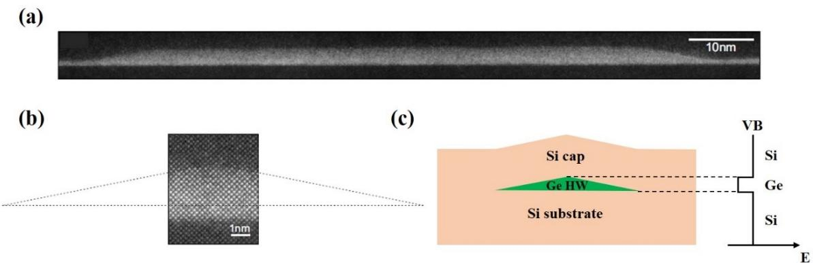

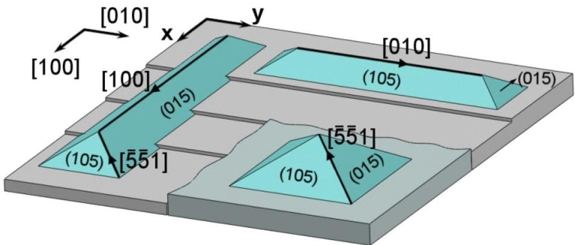  
图 2.2 棚顶型 Ge 纳米线在 Si 衬底上的示意图，图片引自[4]。  
图 2.3(a) Ge 纳米线径向截面的扫描透射电子显微镜图，图片引自[5]。(b) Ge 纳米线横截面的扫描透射电子显微镜图，虚线部分表示纳米线的形状，图片引自[5]。(c) Ge 纳米线的能带结构示意图。

我们在实验中所使用的棚顶型 Ge纳米线是生长在四寸的Si 衬底上的，如图2.4(a)所示，由中科院物理所的张建军老师研究组提供。我们在拿到基片后，先用原子力显微镜(AFM)观察，如图 2.4(b)所示，在基片上任意选取 4 个区域都可以清晰地看到纳米线。纳米线的生长方向为[100]和[010]方向，其高度约为 2 nm，长度最长可以达到 2 μm，完全满足我们对双量子点器件制备的要求。随后，我们把基片切成1cm×1cm尺寸大小，方便我们进行微纳加工。基片放置在干燥真空箱中保存，防止其被氧化。

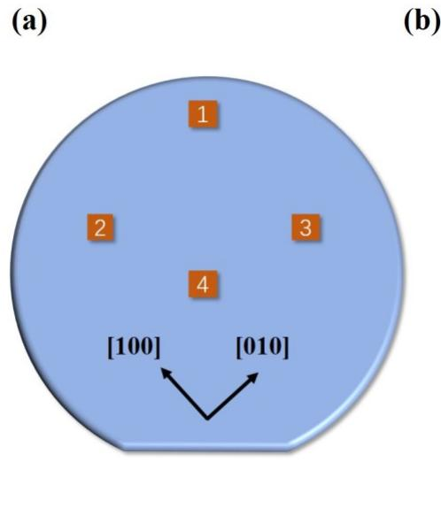

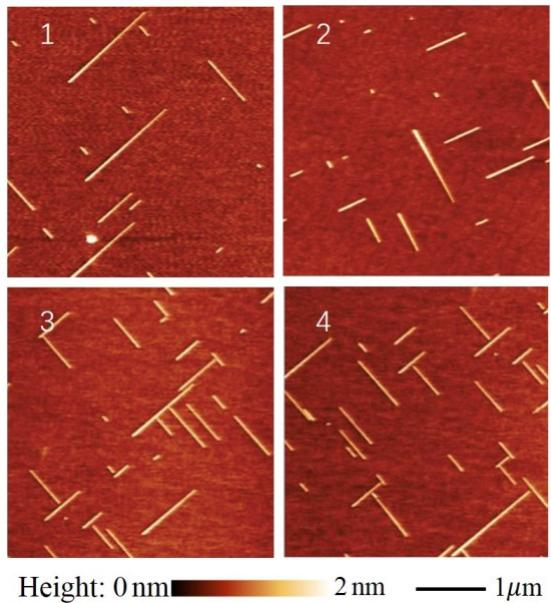  
图 2.4 (a) 实验中所使用的四寸 Si 衬底基片示意图。(b) Ge 纳米线的 AFM 图，对应于图(a)中 4 个区域。

## 2.2 微纳加工技术以及常用仪器介绍

微纳加工技术是我们研究低维材料以及量子器件的重要基础与必备手段，下面就介绍一些我们在制备Ge纳米线量子点样品的过程中常用的微纳加工技术以及相关仪器。

## 紫外光刻

紫外光刻（UV Lithography）是我们在实验室中常用的一种光刻手段，分为有掩模和无掩模。有掩膜光刻首先要设计好曝光的图案，接着制成有掩模光刻板，在基片上匀上对紫外光敏感的光刻胶后进行手动曝光。无掩膜光刻主要为激光直写，光束由计算机控制，不需要掩膜版就可以直接曝光。在光刻完成后进行显影，被紫外光照射到的光刻胶部分与显影液发生反应，呈现出所需要的图案。我们实验室常用的光刻机为MJB3 型紫外光刻机以及Microwriter ML3激光直写光刻机，如图 2.5(a)和(b)所示。这两套光刻设备精度可以达到 1 μm量级，可以用来制备对精度要求不高的外围大电极。

## 电子束曝光

电子束曝光（E-Beam Lithography）和光刻原理类似，只不过它是利用计算机控制高精度的电子束，在匀上电子束胶的基片上进行曝光。由于电子束的能量很高，轰击到电子束胶上使其高分子长链被打断，从而使电子束胶的性质发生改变。曝光完成后进行显影，被轰击到的电子束胶与显影液发生反应并溶解，使基片上呈现出所需要的图案。我们实验室常用的电子束曝光仪器为Raith公司的E-line，如图2.5(c)所示，其电子束能量最高可以达到 30kV。在设置好曝光剂量以及显影条件等参数后，我们可以实现曝光精度为 20 nm 的线宽，满足了制备量子点栅极的工艺条件。

## 镀膜及剥离

我们在实验中最常采用的镀膜技术为电子束蒸发镀膜(Electron BeamEvaporation)，它属于物理气相沉积。我们在曝光显影后把基片放进镀膜机里，电子束蒸发镀膜的原理是利用电磁场精准地控制高能电子束，轰击坩埚内靶材使之融化蒸发，然后沉积在基片上，从而可以得到高纯度的薄膜。图2.5(d)和(e)为我们实验室常用的电子束蒸发镀膜机，型号分别为 MARK-40以及 LJ-E400L，可以镀钛(Ti)、金(Au)、钯(Pd)、铝(Al)、锗金(GeAu)、镍(Ni)等金属。我们把镀膜完成后的基片放到特定的有机溶剂里，使得光刻胶或者电子束胶溶解。这样胶上的金属就被剥离下来，而与基片接触的金属则被保留了下来，形成我们所需要的电极图案。

## 原子层沉积

原子层沉积(Atomic Layer Deposition) 技术主要用于生长在制备器件过程中所需要的绝缘层，常用的如氧化铝 $\left( \mathrm { A l } _ { 2 } \mathrm { O } _ { 3 } \right)$ 以及氧化铪 $\left( \mathrm { H f O } _ { 2 } \right)$ 等。以氧化铝为例，它是由三甲基铝和水在高温下 $( 2 5 0 ^ { \circ } \mathrm { C } )$ 发生反应，从而生成氧化铝绝缘层，生长的绝缘层有良好的绝缘性和表面平整度。原子层沉积技术能够实现单原子层的生长，每层的厚度约为 1.1Å，通过设置生长的层数从而可以得到精准的厚度。我们实验中常用的原子层沉积仪器如图2.5(f)和(g)所示，其生长 15nm 厚度氧化铝绝缘层的击穿电压约为4V，完全满足实验需求。

## 刻蚀

刻蚀技术(Etching Technique)分为湿法刻蚀和干法刻蚀。湿法刻蚀是利用化学试剂腐蚀样品表层材料，从而达到所需要的刻蚀图案。湿法刻蚀也可以用来对样品表面进行处理，例如我们在处理Ge纳米线样品时，利用稀释的氢氟酸溶液除去样品表面的氧化硅 $\left( \mathrm { S i O } _ { 2 } \right)$ 。干法刻蚀的原理则是在高真空系统中电离刻蚀气体并加速高能离子，使其垂直地射向样品表面进行物理轰击，从而在样品上得到需要的图形。图2.5(h)为我们实验室中的一台反应离子刻蚀(RIE)机，常用的刻蚀气体有四氟化碳 $\ ( \mathrm { C F } _ { 4 ) } .$ 、氧气 $_ { 1 } ( \mathrm { O } _ { 2 } )$ 、氩气(Ar)、六氟化硫( $\mathrm { S F } _ { 6 } )$ 等气体，可以刻蚀铌(Nb)、Si、 $\mathrm { S i O } _ { 2 }$ 等材料。

除了上述这些微纳加工技术以及相关仪器以外，我们实验中还经常用到光学显微镜，扫描电子显微镜，原子力显微镜，匀胶机，烤胶台，去胶机，退火炉，划片机等许多常用的仪器，都在我们的实验中起到了非常重要的作用，这里就不再详细介绍。

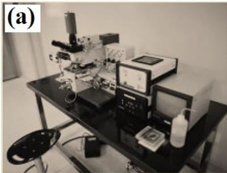

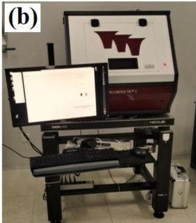

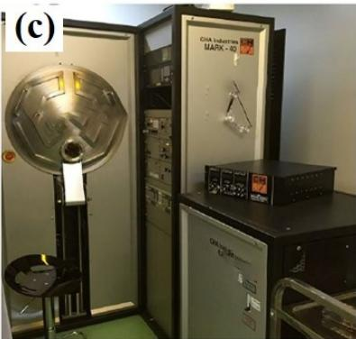

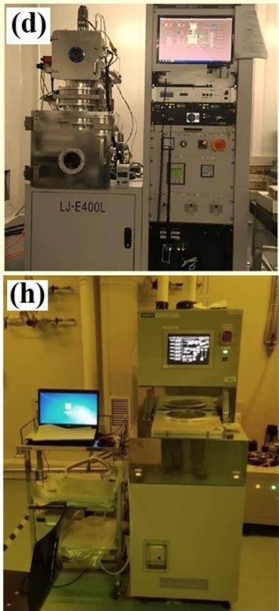

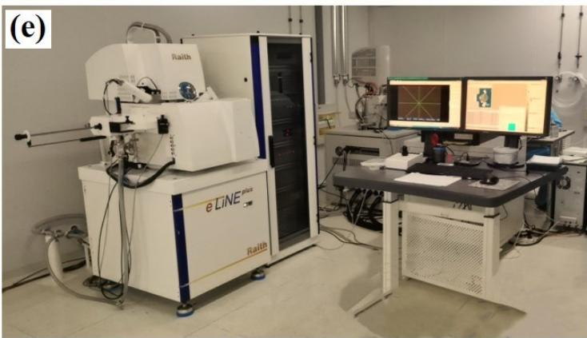

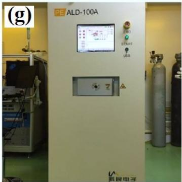

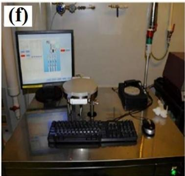  
图 2.5 微纳加工常用仪器设备：(a) MJB3 型紫外光刻机。(b) Microwriter ML3 激光直写光刻机。(c) MARK-40 电子束蒸发镀膜机。(d) LJ-E400L 电子束蒸发镀膜机。(e) E-line电子束曝光机。(f) 热型原子层沉积仪器 Thermal-ALD。(g) 等离子体型原子层沉积仪器PE-ALD。(h) 反应离子刻蚀机。

## 2.3 量子点的制备工艺

## 2.3.1 样品标记及外围电极制备

前面已经介绍了棚顶型 Ge 纳米线材料和相关的微纳加工技术，接下来我们就详细地介绍一下量子点的制备过程。首先是量子点的外围大电极以及所有的标记(mark)制备。这一步需要曝光微米尺寸的大电极以及100nm线宽的套刻标记，所以我们采用电子束曝光。我们把切成 1cm×1 cm 尺寸的基片从真空箱中取出，首先进行基片表面的清洗，除去基片表面杂物或者灰尘。清洗步骤为在丙酮(ACE)和异丙醇(IPA)各浸泡 3 分钟，或者各超声清洗 1 分钟。然后是匀电子束胶，我们采用的电子束胶为 PMMA-950，匀胶机转速为 4000r/min，时间为 40 s。接着放在烤胶台上进行烤胶，烤胶温度为 $1 8 0 ^ { \circ } \mathrm { C }$ ，时间为 5 min。此时第一层胶的厚度为 60 nm，考虑到电极以及 mark 的厚度，为了方便剥离，我们接着匀第二层胶，参数和第一层相同，烤胶时间为 10 min。之后在基片边缘点上镍粉，用于对电子束光斑的调节。

匀胶完成后放入 E-line里进行电子束曝光，我们先在基片上建立一个总体的坐标系，坐标范围如图 2.6 (a)所示。我们采用电子束 30kV高压、120 μm 光圈和$2 0 0 0 { \times } 2 0 0 0 ~ \mu \mathrm { m } ^ { 2 }$ 写场，曝光剂量为 $4 0 0 ~ \mu \mathrm { C } / \mathrm { c m } ^ { 2 }$ 。我们先曝光一组3×3 的 mark矩阵作为后续步骤的位置标记，间距为4000 μm，如图 2.6 (a)所示。接着再曝光一组2×2的量子点外围大电极，间距为 $4 0 0 0 ~ { \mu \mathrm { m } }$ ，图 2.6 (a)中蓝色虚线方框表示量子点外围大电极的区域。此时，位置标记以及外围大电极曝光完成，我们把样品取出，进行显影。显影液由四甲基二戊酮(MIBK)与 IPA 配比而成，比例为 1:3，显影时间为1min，然后立刻放入 IPA中定影 15s 后用氮气枪吹出。此时，在光学显微镜下可以清楚地看到曝光的位置标记以及外围大电极图案。

我们把样品再次放入 E-line中进行100nm 线宽的十字mark的曝光，这一组mark 是作为后面要曝光的源漏电极以及顶层栅极的对准标记。我们采用电子束10 kV 高压、 $1 0 ~ { \mu \mathrm { m } }$ 光圈和 $2 0 0 { \times } 2 0 0 ~ \mu \mathrm { m } ^ { 2 }$ 写场，曝光剂量为 $1 0 0 ~ \mu \mathrm { C } / \mathrm { c m } ^ { 2 }$ 。利用第一次曝光出的大 mark 进行套刻，分四次曝光出 100 nm 线宽的十字 mark。之后进行显影，显影步骤和前面相同。此时样品所有标记以及外围大电极曝光完成。

接下来就是镀膜，我们使用用电子束蒸发镀膜机镀上金属Ti/Au，厚度为5/45nm，其中Ti 作为粘附层，Au作为电极以及标记金属。镀膜完成后，把样品放入ACE 试剂中进行剥离，试剂温度为室温，浸泡时间为 3 h。待电子束胶溶解后，胶上的金属就被剥离下来，与基片接触的金属被保留了下来，形成我们所曝光的电极图案，如图2.6 (b)所示。此时样品所有标记以及外围电极制备完成。

## 2.3.2 定位拍照

我们在基片上已经制备了所需的金属 mark，接下来就是要对纳米线进行定位拍照，顾名思义就是利用 mark 的位置信息把 Ge 纳米线的位置确定下来，然后扫描拍照保存，这样照片就包含了 Ge纳米线的位置信息，可以用来设计搭在Ge纳米线上的源漏电极以及顶层栅极的曝光图案。

图2.7 (a)为我们制备完的其中一组大电极以及标记，对应于图 2.6(a)中蓝色虚线方框区域，其中绿色区域包含了许多 100 nm 线宽的十字 mark，这些 mark可以用来进行定位拍照以及作为后续曝光源漏电极以及制备顶层栅极的套刻标记。我们选择其中的一组 mark，如图2.7 (a) 白色虚线方框所示，利用E-line中自带的扫描拍照功能，得到同时包含mark以及纳米线的高分辨率图片，如图 2.7(b)所示。用E-line自带的绘图软件把图片打开放大后，我们可以清晰看到许多沿着[100]和[010]方向的纳米线。由于图片包含mark以及纳米线的位置信息，我们就可以把图片与曝光文件对应起来，进行下一步源漏电极图案的设计与绘制。

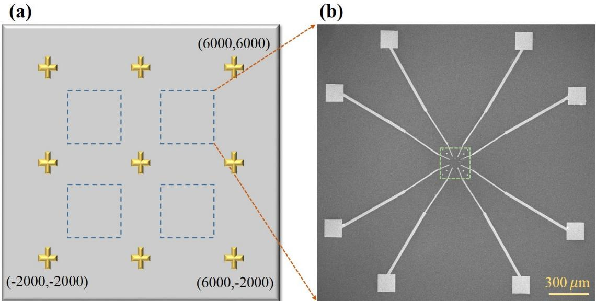  
图 2.6(a) 基片整体示意图，包括9 个位置标记以及标注的坐标系范围，蓝色虚线方框为 $2 0 0 0 { \times } 2 0 0 0 ~ \mu \mathrm { m } ^ { 2 }$ 的曝光区域。(b) 曝光的大电极的SEM 图片，对应于(a)中蓝色虚线方框区域。绿色区域用来曝光100 nm线宽的十字mark，写场为 $2 0 0 { \times } 2 0 0 ~ \mu \mathrm { m } ^ { 2 }$ C

  
图 2.7 (a) 对应于图 2.6(a)中蓝色虚线方框区域内的一组大电极以及标记。(b) 包含mark以及纳米线的高分辨率图像，对应于(a)中白色虚线方框区域。

## 2.3.3 源漏电极制备

在完成定位拍照以后，我们对应着包含 mark 以及纳米线位置信息的图片，设计并绘制好源漏电极的曝光文件，接下来就是进行源漏电极的曝光。我们首先把基片匀上电子束胶，匀胶的参数和第一步相同，这里就不过多赘述。接着使用E-line进行电子束曝光，电子束采用30 kV高压、 $1 0 ~ { \mu \mathrm { m } }$ 光圈和 $1 0 0 \times 1 0 0 ~ \mu \mathrm { m } ^ { 2 }$ 写场，曝光剂量为 $8 0 0 ~ \mu \mathrm { C } / \mathrm { c m } ^ { 2 }$ 。曝光之前利用上一步制备的 100 nm 线宽的十字mark进行写场校准，这样就会保证套刻的准确度。

曝光完成后我们采用低温显影，把盛有显影液的烧杯放置在冰水混合物中，待显影液的温度降到接近 $0 \mathrm { ‰}$ 时，把曝光完的样品放入显影液中显影 3 min，然后立刻放入 IPA 中定影 30 s 后用氮气枪吹出。采用低温显影的优点是样品表面残胶比较少，有利于制备性质良好的欧姆接触(Ohmic contact)。

显影完成后，此时纳米线上需要制备源漏电极的区域裸露了出来，接下来就要进行湿法刻蚀，除去纳米线表面的 $\mathrm { S i O } _ { 2 }$ 绝缘层，这是能测量到输运电流的必要步骤。我们把样品放入稀释的氢氟酸溶液中进行刻蚀，其刻蚀 $\mathrm { S i O } _ { 2 }$ 的速率为 1nm/s，我们刻蚀 $1 0 \mathrm s$ 以保证 $\mathrm { S i O } _ { 2 }$ 绝缘层完全被刻蚀掉。刻蚀完成后，为了防止纳米线表面被氧化，我们立即把样品放入镀膜机里抽真空，之后进行镀膜。我们镀膜采用的金属为Pd，厚度为30 nm，镀膜完成后，把样品放入 ACE溶液中进行剥离，浸泡时间为3h。剥离后，我们把样品放入 SEM 观察，如图2.8(a)所示，我们可以观察到源漏电极精准的搭在了纳米线的两端。这样，Ge 纳米线量子点源漏电极制备完成。

## 2.3.4 顶层栅极制备

源漏电极制备完成以后，接下来是生长绝缘层，绝缘层是用来防止顶层栅极和纳米线之间出现漏电的情况。我们把样品放入的原子层沉积仪器中，进行氧化铝绝缘层的生长，生长厚度为 20nm，生长时间约为 2h。生长完绝缘层后，我们对基片进行表面清洗，之后把基片匀上电子束胶，设计并绘制好曝光图案后，用E-line进行电子束曝光顶层栅极。

顶层栅极包括外围大电极和分立小电极，外围大电极曝光采用电子束 30kV高压、 $1 2 0 \mu \mathrm { m }$ 光圈和 $2 0 0 0 { \times } 2 0 0 0 ~ \mu \mathrm { m } ^ { 2 }$ 写场，曝光剂量为 $8 0 0 ~ \mu \mathrm { C } / \mathrm { c m } ^ { 2 }$ 。之后切换至 $1 0 ~ { \mu \mathrm { m } }$ 光圈和 $1 0 0 \times 1 0 0 ~ \mu \mathrm { m } ^ { 2 }$ 写场，进行分立小电极的曝光。曝光所用套刻标记均为第一步中所制备。曝光完成后同样采用低温显影，显影步骤和上一步相同。显影后把样品放入镀膜机里抽真空后进行镀膜，栅极所用金属为 Ti/Pd，厚度为

5/35 nm。镀膜完成后把样品放入一甲基二吡咯烷酮(NMP)试剂里进行剥离, 试剂温度为 $8 0 ^ { \circ } \mathrm { C }$ ，时间为 3 h。剥离完成后，我们把样品放入 SEM 中观察，如图2.8(b)所示，曝光的栅极完好且平整。至此，Ge 纳米线双量子点制备完成。因为我们以双量子点为例，所以是5根分立栅极，我们还制备过 1根栅极的单量子点以及3根栅极的双量子点，制备过程是相同的，这里就不再赘述。

(a)  

(b)  
  
图 2.8 (a) 源漏电极的 SEM 图，可以看到源漏电极精准的搭在了纳米线的两端。(b) 包含5 根栅极的 Ge纳米线双量子点 SEM 图。

## 2.4 量子点的性质表征

## 2.4.1 低温测量平台

表征Ge纳米线量子点器件的性质需要极低温的工作环境，这样量子点中电荷态就不会因受到热涨落的影响而不可控。我们实验室中有不同的低温设备，可以满足不同测量需求。图2.9(a)所示为液氦(He)杜瓦测量平台，其环境温度为 4.2K，样品放入后可以快速冷却，适合进行基本性质表征。更精细和更系统地测量需要在图 2.9(b)和(c)所示的 He-3 制冷机以及 He-3/He-4 稀释制冷机中进行，它们的工作基本温度可以分别达到240 mK和10mK，并且可以提供不同方向和强度的磁场以满足实验需求。图2.9(d)为我们设计的一种常用的样品底座，它集成有RC 滤波器，可以进行直流(DC)以及微波(RF)测量，并且通用于不同的测量平台，我们把样品在液氦杜瓦中粗略地测量表征以后，可以直接放入制冷机里进行具体地实验。

我们在测量中常用的仪器有数字电压表(Keithley 2015P)、锁相放大器(Stanford SR830 Lock-in)、前置放大器(Stanford SR570)、微波源(Keysight E8267D)、任意波形发生器(AWG Keysight M8190)等。

  
图 2.9 (a) 液氦(He)杜瓦测量平台，环境温度为 4.2 K。(b) He-3 制冷机示意图，环境温度为 240mK。(c)He-3/He-4 稀释制冷机示意图，环境温度为 10 mK。(d) 样品底座示意图。

## 2.4.2 低温测量(4.2 K)

前面提到液氦杜瓦测量平台的环境温度为 4.2 K，我们制备完样品后，需要把样品放入液氦杜瓦中进行粗略测量。相对于把样品放入制冷机里测量而言，4.2K粗略测量可以帮助我们便捷快速地了解样品的性质。因此，我们制备好 Ge纳米线量子点后，首先需要放入液氦里进行基本的性质表征。

我们以1根栅极的单量子点以及5根分立栅极的双量子点为例，其三维立体结构如图 2.10 所示。单量子点由源(S)漏(D)电极以及栅极(G)组成，栅极的宽度为100nm。我们首先表征量子点的接触性质，通过测量输运电流 $\mathrm { I _ { S D } }$ 与源漏偏压$\mathrm { V } _ { \mathrm { S D } }$ 的关系得到 I-V 曲线图，如图 2.11(a)所示。我们可以看出，在 $\mathrm { V _ { S D } } = 1 0 \ \mathrm { m V }$ 的时候，输运电流有10nA，这时接触电阻有1 MΩ左右，属于比较正常的范畴。从图中我们也可以看出接触势垒还是比较小的，满足作为量子点的需求。因为接触势垒过大的话，在低源漏偏压下无法测量到输运电流，量子点的能级淹没在势垒中，也就没法进一步的探测量子点的性质。

  
图 2.10 (a) 单量子点三维立体结构示意图。(b) 双量子点三维立体结构示意图。

接下来是进行对量子点栅极的调节能力测试。在第一章中我们已经介绍过，栅极电压可以调节量子点的电化学势，当费米面和源漏能级平行的时候，空穴会在量子点和源漏间发生隧穿，从而观测到库伦峰。我们设置源漏偏压为 $\mathrm { V } _ { \mathrm { S D } } = \ 0 . 5$ mV，然后观测输运电流 $\mathrm { I _ { S D } }$ 与栅极电压 $\mathrm { V _ { G } }$ 变化的关系，如图2.11(b)所示，随着栅极电压 $\mathrm { V _ { G } }$ 正向调节，空穴被逐渐排出量子点，电流 $\mathrm { I _ { S D } }$ 逐渐被截断(pinch off)，并观测到库伦峰。这一现象说明量子点的栅极具有良好的调节能力。我们同时扫描 $\mathrm { V } _ { \mathrm { S D } }$ 和 $\mathrm { V _ { G } }$ 并测量输运电流 $\mathrm { I _ { S D } }$ ，就可以得到经典的库伦菱形图，如图 2.12 所示。从库伦菱形图中我们可以看出，随着空穴逐渐被排出，量子点的充电能逐渐增大，从 6 meV 到 10 meV 不等[7]。

对于双量子点而言，接触性质与栅极调节能力的测试与上述类似。但双量子点的形成与每个栅极都有关系，我们制备了不同结构的双量子点样品，最后发现栅极线宽为30 nm，两个栅极间隔35 nm，这样的结构能形成性质以及调节能力较好的双量子点。如图 2.10(b)所示，栅极 G1和 G5用来调节空穴在量子点和源漏之间的隧穿率，G3 用来调节空穴在左边量子点和右边量子点之间的隧穿率 2t，G2 和 G4 分别调节左边量子点和右边量子点的电化学势。我们同样设置偏压为$\mathrm { V _ { S D } } = \ : 0 . 5 ~ \mathrm { m V }$ ，给G1 和G5 施加一定的电压以形成势垒 $( \mathrm { V } _ { \mathrm { G 1 } } = \mathrm { V } _ { \mathrm { G 5 } } = 0 . 5 \mathrm { \ V } )$ 分别在不同的中间栅极电压 $\mathrm { V } _ { \mathrm { G 3 } }$ 下扫描 $\mathrm { V } _ { \mathrm { G } 2 }$ 和 $\mathrm { V _ { G 4 } }$ 并读取输运电流 ISD。如图2.13(a)和(b)所示，我们观测到了两幅不同 2t 下的双点电荷稳定性相图，在 $\mathrm { { V } _ { G 3 } = }$ 0 V时，左边量子点和右边量子点耦合比较强，相图呈现出蜂窝结构。增加栅极电压至 $\mathrm { V _ { G 3 } } ~ = ~ 0 . 1 \ : \mathrm { V }$ 时，耦合减弱，2t 变小，此时相图呈现出排列整齐的三相点结构。

  
图 2.11 (a) 量子点输运电流随源漏偏压 $\mathrm { V } _ { \mathrm { S D } }$ 变化的 I-V 曲线图。(b) $\mathrm { V _ { S D } } { = } 0 . 5 \ : \mathrm { m V }$ 时量子点的库伦振荡曲线。

  
图 2.12 单量子点的库伦菱形图，随着栅极电压 $\mathrm { V _ { G } }$ 正向调节，空穴被逐渐排出量子点，量子点的充电能逐渐增大。

  
图 2.13 (a) $\mathrm { V _ { S D } } { = } 0 . 5 ~ \mathrm { m V }$ $\mathrm { V _ { G 1 } } = \mathrm { V } _ { \mathrm { G } 5 } = 0 . 5 \ : \mathrm { V }$ $\mathrm { V } _ { \mathrm { G 3 } } = 0 \mathrm { V }$ 时双量子点的蜂窝图。(b) 和(a)相同区域但是在 $\mathrm { V } _ { \mathrm { G 3 } } = 0 . 1 \mathrm { V }$ 下测量的双量子点相图。

由于我们是在4.2 K下测量，这个温度相对于稀释制冷机中的温度是比较高的，我们只能模糊地观测到双量子点的信号，但是由此可以判断出双量子点的基本性质。我们制备的所有 Ge 纳米线量子点样品都需经过 4.2 K 粗略测量，这样方便我们筛选出性质良好的样品去进行在制冷机里更低温度的具体实验。

## 2.5 锗纳米线的迁移率

我们知道半导体的迁移率直接和晶格缺陷相关，而Ge纳米线中的位错和杂质会通过背向散射效应降低电荷迁移率，导致结构内部形成多余杂乱的量子点[6]。为了更好的表征棚顶型 Ge 纳米线的电学性质，我们需要知道 Ge 纳米线中的空穴迁移率。我们实验室常用的表征迁移率的方法是将器件制备成 Hall bar，然后利用霍尔效应去测量[8,9]，但是由于纳米线的一维结构不适于制备成 Hallbar 器件，因此我们采用一种新的方式和方法去表征 Ge 纳米线的迁移率[10,11]。

如图2.14(a) 所示，我们将Ge纳米线制备成一种场效应晶体管结构的器件，它和单量子点结构类似，包含源极 S、漏极D、以及一个顶栅 G（和背栅的作用相同，可以调节纳米线中整体的电化学势），顶栅宽度为 150nm，覆盖了源漏之间的纳米线通道L(100 nm)。我们将器件置于基本温度为 240 mK的He-3 制冷机中进行测量，得到了不同的源漏偏压 $\mathrm { V } _ { \mathrm { S D } }$ 下输运电流 $\mathrm { I _ { S D } }$ 随顶栅电压 $\mathrm { V _ { G } }$ 的变化曲线，如图 2.14(b)所示。图中黄色、蓝色、红色的圆点分别对应 $\mathrm { V _ { S D } } ~ = 5 ~ \mathrm { m V }$

10mV、15 mV时提取的数据，对其进行线性拟合(对应图中黄色、蓝色、红色实线)就可以得到跨导，其表达式为：

$$
\begin{array} { r } { G _ { t } = - \frac { \Delta I } { \Delta V _ { \mathbf G } } } \end{array}\tag{2.1}
$$

跨导直接和迁移率 $\mu$ 正相关，迁移率的表达式为[12]:

$$
\begin{array} { r } { \mu = \frac { G _ { t } L ^ { 2 } } { V _ { \mathrm { S D } } C _ { \mathrm { G } } } } \end{array}\tag{2.2}
$$

其中L 为纳米线晶体管通道长度， $C _ { \mathrm { G } } = e / \Delta V$ 为顶栅到纳米线之间的电容，∆𝑉为排出一个空穴栅极电压的变化量。因此，我们可以计算出棚顶型 Ge 纳米线的迁移率约为 $7 8 0 ~ { \ c m ^ { 2 } } / ( V s )$ ，我们得到的迁移率的数值不算高，但是足够制备性质良好、缺陷较少的量子点器件，这为我们在之后进行基于Ge纳米线空穴自旋量子比特的研究提供了保障。

(a)  

(b)  
  
图 2.14 (a) Ge 纳米线场效应晶体管器件的 SEM 图，其中橙色虚线表示 Ge纳米线。它和单量子点结构类似，包括源极 S、漏极 D、以及一个顶栅 G。(b) 不同 $\mathrm { V } _ { \mathrm { S D } }$ 下输运电流 $\mathrm { I _ { S D } }$ 随顶栅电压 $\mathrm { V _ { G } }$ 的变化曲线以及对应的线性拟合。

## 2.6 本章小结

本章我们首先介绍了棚顶型Ge纳米线这种新型的空穴材料体系，描述了其生长模式以及形貌结构。接着我们介绍了实验中常用的微纳加工工艺以及相关仪器设备，并详细地阐述了基于 Ge纳米线量子点器件的制备流程。进一步地，我们介绍了实验室的低温测量平台，给出了在 4.2 K 温度下 Ge 纳米线单量子点和双量子点的性质表征方法以及样品筛选标准。最后，我们给出了基于 Ge纳米线晶体管的迁移率计算方法，评估了Ge纳米线的迁移率。这些研究可以帮助我们更好地了解了棚顶型 Ge纳米线的电学性质，为我们开展后续的实验提供了研究基础。从下一章开始我们将开展对 Ge纳米线量子点中空穴自旋以及其量子点复合结构器件的具体研究。

## 参考文献

[1] Y. W. Mo, D. E. Savage, B. S. Swartzentruber, M. G. Lagally, Kinetic pathway in Stranski-Krastanov growth of Ge on Si (001). Phys. Rev. Lett. 65, 1020 (1990).

[2] G. Katsaros, P. Spathis, M. Stoffel, F. Fournel, M. Mongillo, V. Bouchiat, F. Lefloch, A. Rastelli, O. G. Schmidt, S. D. Franceschi, Hybrid superconductor–semiconductor devices made from self-assembled SiGe nanocrystals on silicon. Nat. Nanotechnol. 5, 458−464 (2010).

[3] J. J. Zhang, G. Katsaros, F. Montalenti, D. Scopece, R. O. Rezaev, C. Mickel, B. Rellinghaus, L. Miglio, S. De Franceschi, A. Rastelli, O. G. Schmidt, Monolithic growth of ultrathin Ge nanowires on Si (001). Phys Rev Lett. 109 (8), 085502 (2012).

[4] H. Watzinger, M. Glaser, J. J. Zhang, I. Daruka, F. Sch¨affler, Influence of composition and substrate miscut on the evolution of 105-terminated in-plane Si1−xGex quantum wires on Si (001). APL Mater. 2, 076102 (2014).

[5] H. Watzinger, C. Kloeffel, L. Vukusic, M. D. Rossell, V. Sessi, J. Kukucka, R. Kirchschlager, E. Lausecker, A. Truhlar, M. Glaser, A. Rastelli, A. Fuhrer, D. Loss, and G. Katsaros, Heavy-hole states in germanium hut wires. Nano Lett. 16 (11), 6879 (2016).

[6] M. D. Schroer, J. R. Petta, Correlating the Nanostructure and Electronic Properties of InAs Nanowires. Nano Lett. 10,1618–1622 (2010).

[7] S. X. Li, Y. Li, F. Gao, G. Xu, H. O. Li, G. Cao, M. Xiao, T. Wang, J. J. Zhang, G. P. Guo, Measuring hole spin states of single quantum dot in germanium hut wire. Appl. Phys. Lett. 110, 133105 (2017).

[8] C. Jiang, D. C. Tsui, Threshold transport of high‐mobility two‐dimensional electron gas in GaAs/AlGaAs heterostructures. Appl. Phys. Lett. 53, 1533 (1988).

[9] K. Wang, H. O. Li, G. Luo, X. Zhang, F. Ming. Jing, R. Z. Hu, Y. Zhou, H. Liu, G. L. Wang, G. Cao, H. W. Jiang, G. P. Guo, Improving mobility of silicon metal-oxide– semiconductor devices for quantum dots by high vacuum activation annealing. Europhysics Letters 130, 27001 (2020).

[10] C. Rost, S. Karg, W. Riess, M. A. Loi, M. Murgia, M. Muccini, Ambipolar light-emitting organic field-effect transistor. Appl. Phys. Lett. 85, 1613 (2004).

[11] Olaf Wunnicke, Gate capacitance of back-gated nanowire field-effect transistors. Appl. Phys. Lett. 89, 083102 (2006).

[12] S. Conesa-Boj, A. Li, S. Koelling, M. Brauns, J. Ridderbos, T. T. Nguyen, M. A. Verheijen, P. M. Koenraad, F. A. Zwanenburg, E. P. A. M. Bakkers, Boosting hole

mobility in coherently strained [110]-oriented Ge−Si/core−shell nanowires. Nano Lett. 17, 4, 2259–2264 (2017).

## 第 3 章 锗纳米线双量子点中的空穴自旋

对基于量子点自旋比特的半导体量子计算来说，最为关键的因素是具有长的比特相干时间、能对自旋态进行快速操控、以及比特可扩展[1]。其中，Si 和Ge作为 IV 族半导体，具有核自旋为零的稳定同位素，纯化后的材料由于其较弱的超精细相互作用，使得电子自旋比特具有较长的相干时间[2-6]。而与 Si 相比，Ge 体系中的空穴载流子由于 P 轨道而具有更弱的超精细相互作用和更强的自旋轨道耦合，这些优点可以能够对比特自旋进行快速操控。因此，Ge 空穴量子点是一个非常理想的自旋量子比特平台[7,8]。

在第一章中我们已经介绍过，近些年来, 对 Ge 空穴量子点的研究广泛的集中于 Ge/Si 核壳纳米线体系[9-12]、Ge/SiGe 平面异质结体系[7]，以及棚顶型 Ge纳米线体系[13-18]。纳米线的一维结构使空穴有更强的自旋轨道耦合，但是 Ge/Si核壳纳米线的圆柱形结构会导致重空穴和轻空穴的混合，从而使相干时间变短。棚顶型Ge纳米线由于其横截面是三角形结构，在应力的作用下，体系中的轻空穴和重空穴能级产生较大的劈裂，这使得其超精细相互作用为非伊辛型，从而使比特相干时间增长。之前在而棚顶型Ge纳米线双量子点上对空穴自旋单比特的研究引起了广泛关注[18]，然而其双量子点只有两个栅极，左右量子点的隧穿耦合是不能够充分可调的，这样就限制了对后续可调双量子点以及两比特工作的研究。在一个可调的Ge纳米线双量子点中对空穴自旋态进行系统的研究不仅可以提升对其自旋驰豫机制的理解，也对自旋比特操控具有指导意义。

## 3.1 锗纳米线双量子点

## 3.1.1 双量子点样品结构

在上一章中我们已经介绍了样品的详细制备流程，这里就只进行简要概括。图 3.1(a)为我们实验中所使用的 Ge 纳米线基片的原子力显微镜图，我们选取其中较长的纳米线来制备双量子点。在用氢氟酸除去锗纳米线表面的氧化层后，镀上厚度为30 nm 的金属 Pd作为双量子点的源漏电极，接着生长 30 nm 厚的氧化铝作为绝缘层，最后在绝缘层的上方制备五根 3/25 nm 厚的Ti/Pd顶层栅极，图3.1(b)为我们制备的 Ge 纳米线双量子点的扫描电镜图片。我们设计的电极结构可以很好地调节 Ge 纳米线中的电势，从而形成双量子点，如图 3.1(c)所示，栅极G1和G5是用来调节量子点外部势垒，G2和 G4是用来调节左边量子点和右边量子点的能级和空穴的占据数，中间栅极G3 是用来调节空穴左边量子点和右

边量子点之间的隧穿率。

  
图 3.1(a)Ge 纳米线基片的原子力显微镜图。(b) 双量子点的扫描电镜图。黄色虚线代表纳米线。电极结构包括源漏电极和五个顶层栅极，中间用30 nm厚的氧化铝绝缘层隔开。每个栅极宽为 30nm，间距为 35nm。(c) Ge纳米线双量子点器件的截面示意图，五个栅极可以很好地调节纳米线中的电势，从而形成双量子点。

## 3.1.2 双量子点的电荷稳定性相图

我们把样品放置在 He-3制冷机中进行测量，制冷机的腔体温度为 240 mK。图3.2 (a)-(c)为一组在不同的中间栅极电压 $V _ { \mathrm { G 3 } }$ 下扫描 $V _ { \mathrm { G } 2 }$ 和 $V _ { \mathrm { G 4 } }$ 测到的双量子点输运电荷稳定性相图。此时，源漏电压和外部栅极 G1、G5电压保持固定 $( V _ { \mathrm { S D } } =$ $0 . 5 \mathrm { m V }$ $V _ { \mathrm { G 1 } } = - 0 . 8 2 \ : \mathrm { V }$ 9 $V _ { \mathrm G 5 } = - 0 . 2 \ : \mathrm { V } )$ 。在 $V _ { \mathrm { G 3 } } = 0 \mathrm { V }$ 时，左点和右点之间的隧穿耦合是很微弱的，因此我们观测到排列整齐分立的三相点，如图3.2(a)所示。调节 $V _ { \mathrm { G 3 } }$ 为负电压 $( V _ { \mathrm { G 3 } } = - 0 . 0 2 \ : \mathrm { V ) }$ ，此时左点和右点之间的隧穿耦合增强，我们观测到了边缘模糊的蜂窝结构相图，如图3.2(b)所示。最终在 $V _ { \mathrm { G 3 } } = - 0 . 0 4 \mathrm { V }$ 时，相图形成典型的蜂窝结构，如图3.2(b)所示。这些结果说明我们的双量子点的耦合是高度可调的。当 $V _ { \mathrm { S D } }$ 增大时，我们观测到了排列规则的偏压三角形，如图3.2(d)所示。此时 $V _ { \mathrm { S D } } = 2  { \mathrm { m V } }$ 9 $V _ { \mathrm { G 1 } } = - 0 . 8 2 \ : \mathrm { V }$ $V _ { \mathrm { G 3 } } = 0 . 0 0 8 \mathrm { V }$ $V _ { \mathrm { G 5 } } = - 0 . 1 7 \mathrm { V } .$ 我们从偏压三角形相图中可以提取双量子点的特征参数，包括栅极 G2对左点的(G4对右点)电容为 $C _ { \mathrm { G 2 } } = | \mathrm { e } | / \Delta V _ { \mathrm { G 2 } } = 6 . 7 ~ \mathrm { a F } ~ ( C _ { \mathrm { G 4 } } = 6 . 2 ~ \mathrm { a F } )$ ，以及栅极电压转换能量的杠杆因子 $\alpha _ { \mathrm { L } } = 0 . 1 4$ $\alpha _ { \mathrm { R } } = ~ 0 . 1 3$ 。左点和右点的总电容为 $C _ { \mathrm { L } } = C _ { \mathrm { G } 2 } / \alpha _ { \mathrm { L } } =$ 47.8 aF， $C _ { \mathrm { R } } = C _ { \mathrm { G } 4 } / \alpha _ { \mathrm { R } } = 4 7 . 7 \mathrm { a F } )$ ，对应量子点的充电能为 $E _ { \mathrm { C } } ^ { \mathrm { L } } = e ^ { 2 } C _ { \mathrm { R } } / ( C _ { \mathrm { L } } C _ { \mathrm { R } } -$

$$
C _ { \mathrm { M } } ^ { 2 } ) \approx e ^ { 2 } / C _ { \mathrm { L } } = ~ 4 . 3 ~ \mathrm { m e V } ~ ( E _ { \mathrm { C } } ^ { \mathrm { R } } = ~ 4 . 6 ~ \mathrm { m e V } ) \circ
$$

(a)  
  
VG4 (V)  
(c)

  
VG4 (V)  
图 3.2 (a)-(c) 当 $V _ { \mathrm { S D } } = 0 . 5 ~ \mathrm { m V } .$ $V _ { \mathrm { G 1 } } = - 0 . 8 2 \mathrm { ~ V ~ }$ $V _ { \mathrm { G 5 } } = - 0 . 2 \ : \mathrm { V }$ 时，在不同中间栅极电压 $V _ { \mathrm { G 3 } } ( 0 \mathrm { V } , \ - 0 . 0 2 \mathrm { V } , \ - 0 . 0 4 \mathrm { V } )$ 下，扫描 $V _ { \mathrm { G } 2 }$ 和 $V _ { \mathrm { G 4 } }$ 测到的输运相图。(d) 当 $V _ { \mathrm { S D } } = 2  { \mathrm { m V } }$ $V _ { \mathrm { G 1 } } = - 0 . 8 2 \mathrm { V } .$ $V _ { \mathrm { G 3 } } = 0 . 0 0 8 \ : \mathrm { V } .$ $V _ { \mathrm { G 5 } } = - 0 . 1 7 \mathrm { ~ V ~ }$ 时，观测到一组排列整齐的偏压三角形输运相图。

## 3.2 自旋阻塞与 g 因子的测量

前文已经介绍过，在双量子点体系中，对于研究电荷的自旋态到电荷态的转变以及自旋弛豫机制来说，自旋阻塞是一种十分重要的技术手段[19,20]。它主要存在于电荷在量子点间的输运过程中，受到泡利不相容原理的限制，使得相同方向自旋的电子或者空穴不能处在同一轨道上。例如，当空穴从左边量子点隧穿到右边量子点时，需要经历一个循环 $( 1 , 0 )  ( 2 , 0 )  ( 1 , 1 )  ( 1 , 0 )$ ，如图 3.3(a)所示。然而当源漏偏压方向相反时，三重态T(1, 1)→单重态S(2, 0)之间的输运是被禁止的，如图3.3(b)所示。在图3.3(c)和3.3(d)中，通过比较正偏压和反偏压下的三角形，我们发现输运电流在正向偏压下被抑制，发生了自旋阻塞。从图 3.3(d)所示的自旋阻塞区域中，我们可以提取三重态T(2, 0)和单重态S(2, 0)之间的能级差 $\Delta _ { S T }$ 约为 1.1 meV。

(a)  
  
(c)

(b)  

  
图 3.3 (a) 空穴在双量子点间输运的示意图，输运过程为 (1, 0) → (2, 0) → (1, 1) → (1,0)。(b) 源漏偏压方向相反时，由于泡利不相容原理，三重态(1, 1) →单重态(2, 0)之间的输运被禁止。(c) 当 $V _ { \mathrm { S D } } = - 2 . 5 \mathrm { m V }$ 时观测到的偏压三角形，输运过程对应于(a)。(d) 当$V _ { \mathrm { S D } } = 2 . 5 ~ \mathrm { m V }$ 时观测到的偏压三角形，输运过程对应于(b)。此时偏压三角形底部绿色虚线标注的区域电流被抑制，发生自旋阻塞。绿色虚线的间隔宽度对应于三重态T(2, 0)和单重态 ${ \mathrm { S } } ( 2 , 0 )$ 之间的能级差 $\Delta _ { S T }$

当我们给样品施加垂直于纳米线基片的方向磁场后再去测量双量子点的输运信号，如图 3.4(a)所示的偏压三角形区域和 3.3(d)相同，但是外加磁场为 2T。此时三重态T(2, 0)在磁场的作用下劈裂为三个态： $\mathrm { T } _ { - } ( 2 , 0 ) , \ \mathrm { T } _ { 0 } ( 2 , 0 )$ 和 $\mathrm { T } _ { + } ( 2 , 0 )$ 因此所测得的三重态和单重态之间的能级差 $\Delta _ { S T }$ 为 S(2, 0)和 $\mathrm { T } _ { - } ( 2 , 0 )$ 之间的能级差。所以 $\Delta _ { S T }$ 要小于零磁场下测得的三重态和单重态之间的能级差。图 3.4(b)为$\Delta _ { S T }$ 随外加磁场变化的示意图，随着外加磁场的增加， $\Delta _ { S T }$ 线性减小。我们可以用公式 $\Delta _ { S T } ( \mathrm { B } ) { = } \Delta _ { S T } ( 0 ) \ - \ \mathrm { g } \mu _ { \mathrm { B } } \mathrm { B }$ 来表示它们之间的关系。其中，𝜇 是玻尔磁子， $\mu _ { \mathrm { B } }$ $\mathbf { g }$ 是有效朗德 g 因子。对数据线性拟合可以得到 $\mathrm { ~ g ~ } = \ 3 . 4 \ \pm \ 0 . 2$ ，这一数值与之前的实验结果类似[15,16]。由于我们对自旋阻塞的测量是在多空穴区进行的，多的空穴数占据会改变双量子点的尺寸，从而导致轻重空穴的混合，所以我们测量的Ge纳米线双量子点的基态为重空穴和轻空穴的混合态。

(b)  
  
图 3.4 (a) 磁场为 2T时观测到的偏压三角形区域，电压范围和3.3(d)相同。(b) $\Delta _ { S T }$ 随外加磁场变化的示意图，对数据线性拟合可以得到 g因子。

## 3.3 锗纳米线双量子点中的自旋轨道耦合

## 3.3.1 自旋阻塞的解除

由于Ge纳米线的横截面为非中心反演对称的三角形结构，在外加垂直于基片的磁场作用下，其自旋轨道耦合为 Rashba 类型。这里为了研究其自旋轨道耦合，我们关注双量子点中的自旋阻塞区域在磁场下漏电流的演化，因为漏电流的产生来源于不同的自旋驰豫机制，包括自旋翻转共隧穿和自旋轨道耦合[21-26]。之前的研究已经证明了双量子点中的漏电流呈现出谷的形状就意味着有强自旋轨道耦合[24,25]。在塞曼劈裂和自旋轨道耦合共同作用下，外加磁场使得 S 态和T态混合，从而使自旋阻塞解除，产生漏电流，并且这种作用机制在越强磁场时就越明显，因此漏电流在零磁场附近呈现出谷的形状。

图3.5(a)为我们测量到的一处自旋阻塞区域，其中白色箭头为沿着失谐量 𝜀的方向。实验中测量到的自旋阻塞区域的漏电流随外加磁场以及失谐量 𝜀 的演化如图 3.5(b)所示。我们提取在 $\varepsilon = 0$ 处漏电流的数据，发现漏电流的线型呈现出在零磁场附近为谷的双峰结构，如3.5(c)所示。在磁场B = 0区域电流被抑制，在一定的范围内磁场增加，自旋阻塞被解除，漏电流增大，这表明三重态 T(1, 1)和单重态 S(2, 0)的能级在强的自旋轨道耦合作用下发生杂化。我们可以用方程(3.1)去拟合漏电流的演化[26]:

$$
\begin{array} { r } { I ( B ) = { \varGamma } _ { r e l } \frac { \left[ \omega - B ^ { 2 } + \tau ^ { 2 } \right] \left[ \omega \left( 1 + 4 \gamma \right) + B ^ { 2 } - \tau ^ { 2 } \right] } { 6 \gamma \omega ^ { 2 } + 2 B ^ { 2 } \eta ^ { 2 } t ^ { 2 } } } \end{array}\tag{3.1}
$$

其中， $\boldsymbol { { \Gamma _ { \mathrm { r e l } } } }$ 为自旋弛豫速率， $\omega = \sqrt { ( B ^ { 2 } - \tau ^ { 2 } ) ^ { 2 } + 8 B ^ { 2 } \eta ^ { 2 } t ^ { 2 } } , ~ \gamma = { T _ { \mathrm { r e l } } } / { T }$ , 𝛤为空穴到漏极的隧穿速率， $\tau = t \sqrt { 1 + 3 \eta ^ { 2 } }$ ，𝑡为左右量子点间的隧穿耦合强度， $t _ { s 0 }$ 为自旋轨道耦合强度， $\eta = t _ { s _ { 0 } } / t$ 。数据拟合可以得到 $t { \sim } 4 5 \pm 5 \mu \mathrm { e V } , t _ { s \circ } { \sim } 2 7 \pm 3 \mu \mathrm { e V }$

为了进一步研究自旋轨道耦合对自旋驰豫的影响，我们通过调节双量子的栅极 G2 和 G4 电压至更负方向，使得双量子点中的空穴数增加。此时我们观测到另外一个自旋阻塞的区域，如图 3.5(d)所示。图 3.5(e)为我们测量到的这一自旋阻塞区域漏电流随外加磁场和失谐量 𝜀 演化的图像，在 𝜀 = 0处，我们同样观测到了零磁场附近为谷但是间距更宽的双峰结构，如图 3.5(f)所示。我们也对数据进行拟合并分别提取了 $t \mathrm { \sim 8 4 } \pm 7 \mu \mathrm { e V }$ $t _ { s 0 } \sim 3 8 \pm 4 \mathrm { ~ \textmu e V }$ 。相比于图 3.5(a)的自旋阻塞区域，图3.5(d)中测到了更强的自旋轨道耦合 $t _ { s 0 }$ ，这是因为空穴数目的增加使得双量子点的形状和尺寸发生变化，轨道能级发生改变，自旋态的混合增强。

  
VG4 (V)  
(b)

(d)  

(e)  
VG4 (V)  

(c)  
B (T)  
  
B (T)

(f)  
B (T)  
  
B (T)  
图 3.5 (a) 在 $V _ { \mathrm { S D } } = 2 . 5 \mathrm { m V }$ $V _ { \mathrm { G 1 } } = 0 . 4 4 \ : \mathrm { V }$ $V _ { \mathrm { G 3 } } = - 0 . 0 2 \ : \mathrm { V }$ $V _ { \mathrm { G 5 } } = - 0 . 0 1 5 \mathrm { V }$ 时观测到的自旋阻塞区域，白色箭头为沿着失谐量 𝜀 的方向。(b) 图(a)中自旋阻塞区域漏电流随外加磁场及失谐量 𝜀 演化的图像。(c) 提取图(b)中 𝜀 = 0处漏电流的数据（红色圆点）并进行拟合（蓝色实线），漏电流的线型呈现出在零磁场附近为谷的双峰结构。(d) 双量子点中的空穴数增加，测量到另外一个自旋阻塞区域。(e) 图(d)中自旋阻塞区域漏电流随外加磁场和失谐量 𝜀 演化的图像。(f) 提取图(e)中 𝜀 = 0处漏电流的数据（红色圆点）并进行拟合（蓝色实线），漏电流的线型呈现出更宽的双峰结构。

## 3.3.2 自旋轨道耦合长度的评估

自旋轨道耦合长度 $l _ { s 0 }$ 是表征自旋轨道耦合强度大小的直接参数，它表示电子或者空穴在自旋轨道耦合的作用下，完成一个 π 角度的翻转所走过的距离，如图3.6所示。我们可以利用公式 $t _ { s _ { 0 } } / t \ \sim l / l _ { s _ { 0 } }$ 对自旋轨道耦合强度进行评估[22]，这里 𝑙 代表Ge纳米线量子点的径向尺寸，由公式计算得到 $l = \hbar / \sqrt { ( m ^ { * } \Delta _ { S T } ) } { \sim } 2 0 -$ 50 nm。其中Ge纳米线中的有效空穴质量是介于轻空穴和重空穴有效质量之间：$m _ { \mathrm { L H } } { < } m ^ { * } { < } m _ { \mathrm { H H } }$ $m _ { \mathrm { L H } } { = } 0 . 0 4 2 m _ { \mathrm { e } }$ $m _ { \mathrm { H H } } { = } 0 . 3 2 m _ { \mathrm { e } }$ ， $m _ { \mathrm { e } }$ 是自由电子质量。代入前面我们已经得到的三重态和单重态之间的能级差 $\Delta _ { S T }$ 为1.1 meV。因此，我们计算得到自旋耦合长度 $l _ { s 0 } { \sim } 4 0 { \sim } 1 0 0 \ \mathrm { n m }$ 0

  
图 3.6 Ge 纳米线中自旋轨道耦合长度 $l _ { s 0 }$ 示意图，外加磁场方向为 z方向。

我们所评估的Ge纳米线体系中的自旋轨道耦合长度相比于其他体系中要小，在铟砷纳米线体系中 $l _ { s 0 } { \sim } 1 0 0 \mathrm { n m } [ 2 7 ]$ ，在锑铟纳米线体系中 $l _ { s 0 } { \sim } 2 0 0 \mathrm { n m } [ 2 8 ]$ ，以及在锗硅核壳纳米线体系中 $l _ { s 0 } { \sim } 1 0 0 \mathrm { n m } [ 2 6 ]$ 。而越小的 $l _ { s 0 }$ 则表示越强的自旋轨道耦合，这意味着空穴在Ge纳米线体系中相比于其他一维体系有着更强的自旋轨道耦合，因此可以用来对自旋态进行更快速的操控。这也表明我们的体系可以进一步地用来研究电偶极矩自旋共振以及实现空穴自旋-轨道单比特[18,29]。

## 3.4 电偶极自旋共振

我们已经知道，双量子点中的自旋阻塞可以被空穴的自旋翻转所解除，而Ge纳米线体系有着很强的自旋轨道耦合，因此在外加微波和垂直基片磁场的情况下，空穴自旋会发生翻转，这种现象被称为电偶极自旋共振。电偶极自旋共振发生在当微波频率和塞曼能发生匹配时 $f _ { 0 } ~ = ~ \mathrm { g } \mu _ { \mathrm { B } } B / h$ ，其中 $f _ { 0 }$ 为外加微波的频率，g是朗德 g 因子， $\mu _ { \mathrm { B } }$ 是玻尔磁子，𝐵为外加静态磁场，ℎ为普朗克常数。我们在如图

3.5(a)所示的自旋阻塞区域进行测量，通过在 G4 电极上施加微波并匹配相应的磁场，此时，双量子点中的空穴自旋发生翻转，因此自旋阻塞被解除并测量到漏电流。通过 3.7(a)所示的漏电流随微波频率和外加磁场的演化图像，我们观测到一条明显的电偶极自旋共振谱线。从中我们可以提取朗德 g 因子的大小为 3.5，这也与我们在图3.4(b)中得到的结果类似。

我们可以从电偶极自旋共振谱线中提取空穴自旋退相干时间 $T _ { 2 } ^ { * }$ 的下限。如图3.7(b)所示，在固定微波频率下，沿着磁场提取漏电流的数据，可以拟合出共振峰的半高宽 $\Delta B _ { \mathrm { E D S R } }$ 约为1.5mT，并代入公式 $T _ { 2 } ^ { \ast } = 2 \hbar \sqrt { \ln { 2 } } / { \mathrm { g } \mu _ { \mathrm { B } } } \Delta B _ { \mathrm { E D S R } } [ 1 8 , 3 0 ]$ ，我们可以得到空穴自旋比特的退相干时间 $T _ { 2 } ^ { * }$ 约为 8 ns。这个退相干时间与我们之后进行的比特操控实验所测得的相比小很多，我们认为可能是以下两个原因导致的。首先，我们实验是在本底温度为 240 mK的液氦制冷机中进行的，电偶极自旋共振谱线半高宽 $\Delta B _ { \mathrm { E D S R } }$ 由于温度的原因会发生展宽[31]。其次，为了得到更好的信噪比，我们在测量时所施加的微波功率是相对较高的，这也会导致共振峰的展宽。虽然我们得到的 $T _ { 2 } ^ { * }$ 值比较低，但是这种方法给出了自旋退相干时间的下限，这对我们之后进行自旋比特操控具有参考意义。

(b)  
  
图 3.7 (a) 漏电流随微波频率和外加磁场的演化，呈现出线性关系。(b) 在微波频率为11.5 GHz、功率为−11.5 dBm时对共振峰进行高斯拟合(红色曲线)。

## 3.5 多种模式下电偶极自旋共振谱线的测量

## 3.5.1 不同 S-T态能级间的共振隧穿

通过增大中间栅极电压 $( V _ { \mathrm { G 3 } } = - 0 . 0 5 \ : \mathrm { V ) }$ 使得量子点间的隧穿耦合增强，我们继续研究图 3.7(a)所示自旋阻塞区域的漏电流随微波频率和外加磁场的演化。如图 3.8(a)所示，我们观测到多条不同模式下的电偶极自旋共振谱线，分别用红色虚线和黑色虚线标注。我们发现红色虚线标注的谱线会发生反交叉，从能级的角度上来说，随着外加磁场的增强，三重态T(1, 1)发生塞曼劈裂，处于能量最低的能态 $T _ { + }$ 会穿过单重态 S。但是在较强的自旋轨道耦合的作用下， $T _ { + }$ 态和 S 态会发生一个反交叉，这个反交叉的能量宽度就是由 $T _ { + }$ 态和 S 态之间的自旋轨道耦合的强度所决定[28]。

在相同的自旋阻塞区域，当我们把中间栅极电压 $V _ { \mathrm { G 3 } }$ 从 $- 0 . 0 5 \mathrm { ~ V ~ }$ 调节到$- 0 . 0 4 8 \mathrm { V }$ 时，量子点间的隧穿耦合减弱。我们重新测量电偶极自旋共振谱线图，如图3.8(b)所示，我们发现只观测到两条斜率相似的谱线，分别用棕色虚线和绿色虚线标注。这种现象在之前研究的 InAs 纳米线和 InSb 纳米线上也观测到过[32,33]，原因是由左边量子点中的空穴和右边的量子点中的空穴分别发生自旋翻转所导致。因此，这两个量子点的朗德 g 因子可分别提取为 ${ \bf g } _ { L } \sim 3 . 9$ 和 $g _ { R } { \sim } 3 . 7$ 而朗德 g 因子的差异也是是由于两个量子点的几何尺寸和束缚能级不同所导致。

  
B (T)

(b)  
  
B(T)  
图 3.8 (a) 在 $V _ { \mathrm { G 3 } } = - 0 . 0 5 \mathrm { ~ V ~ }$ 时漏电流随微波频率和外加磁场的演化，观测到多条不同模式下的电偶极自旋共振谱线，分别用红色虚线和黑色虚线标注。(b) 与(a)相同区域，中间栅极电压 $V _ { \mathrm { G 3 } }$ 从−0.05 V 调节到−0.048 V。观测到两条斜率相似的谱线，分别用棕色虚线和绿色虚线标注。

## 3.5.2 理论模型

图 3.8(a)和(b)中观测到的电偶极自旋共振谱线可以用双量子点中两个空穴自旋的低能级模型来定性地解释[28]。由于输运过程中的自旋阻塞，空穴的本征态为单重态 $S _ { 1 1 } , \ S _ { 2 0 }$ 和三重态 $T _ { + \setminus } ~ T _ { - \setminus } ~ T _ { 0 } [ 3 4 ]$ 。系统的哈密顿量可以写为：

$$
\begin{array} { r l } { H = } & { { } H _ { 0 } + H _ { S O } + H _ { Z } } \end{array}\tag{3.2}
$$

其中 $H _ { 0 }$ 表示单重态与单重态之间的耦合， $H _ { S O }$ 表示单重态和三重态之间的自旋轨道耦合， $H _ { Z }$ 表示外加磁场作用下的塞曼劈裂。这三项可以分别写成：

$$
\begin{array} { r l } { H _ { 0 } = } & { { } - \varepsilon | S _ { 2 0 } \rangle \langle S _ { 2 0 } | + t | S _ { 1 1 } \rangle \langle S _ { 2 0 } | + t | S _ { 2 0 } \rangle \langle S _ { 1 1 } | } \end{array}\tag{3.3}
$$

$$
H _ { S O } = \mathrm { ~ } i t _ { + } | T _ { + } \rangle \langle S _ { 2 0 } | + i t _ { - } | T _ { - } \rangle \langle S _ { 2 0 } | + h . c\tag{3.4}
$$

$$
\begin{array} { r l } { H _ { Z } = } & { { } - ( g _ { L } + g _ { R } ) \mu _ { B } B / 2 ( | T _ { + } \rangle \langle T _ { + } | - | T _ { - } \rangle \langle T _ { - } | ) + ( g _ { L } - g _ { R } ) \mu _ { B } B / 2 ( | T _ { 0 } \rangle \langle S _ { 1 1 } | + h . c . ) } \end{array}\tag{3.5}
$$

这里，ε 代表S(2,0)态到 S(1,1)之间的失谐量，𝑡 代表单重态-单重态隧穿矩阵元，$t _ { + }$ 和 𝑡 分别代表 $T _ { + }$ 、𝑇 到 S(2,0)态的隧穿矩阵元，由于时间反演对称性， $t _ { + } =$ $t \_ { \boldsymbol { g } _ { L } }$ 和 $g _ { R }$ 代表左边量子点和右边量子点的朗德 g 因子。由于超精细相互作用非常小，其导致的单重态和三重态之间的杂化可以忽略不计，因此并没有包括在模型里。

Idc  
  
(c)  
B (T)

(b)  
  
(d)  
B (T)

Idc  
  
B (T)

  
B (T)  
图 3.9 (a) 两个空穴自旋态的能级模型。在自旋轨道耦合作用下， $T _ { + }$ 态和 S 态会发生能级的反交叉。红色箭头表示 𝑇 (1, 1)态 → 𝑆态之间的输运，黑色箭头表示 $T _ { 0 }$ 态 $ T _ { + }$ 态之间的输运。(b) 隧穿耦合更弱时的能级模型。棕色箭头表示 $T _ { - } ( 1 , 1 )$ 态 → $T _ { 0 }$ 态之间的输运，绿色箭头表示 S态 $ T _ { + }$ 态之间的输运。(c) 基于两个空穴自旋态的能级模型的数值模拟图，对应于3.8(a)，参数为 $\lvert \mathfrak { E } = 5 0 \mu \mathrm { e V }$ $\mathrm { t } = 4 0 \ \mu \mathrm { e V }$ ，以及自旋轨道耦合能 $\Delta _ { S O } ^ { D D } = 5$ $\mu e V$ 。(d) 基于两个空穴自旋态的能级模型的数值模拟图，对应于3.8(b)，参数为 $\lvert \mathfrak { E } = 5 0 \mu \mathrm { e V }$ $\mathrm { t } = 2 0 \ \mu \mathrm { e V }$ ，以及自旋轨道耦合能 $\Delta _ { S O } ^ { D D } = 5 ~ \mu \mathrm { e V }$ o

图 3.8(a)中观测到的所有输运过程都可以用这个模型来解释。如图 3.9(a)所示，考虑到 $T _ { + }$ 态和 S 态在自旋轨道耦合作用下的杂化，从 𝑇 (1, 1)态 → S 态之间（红色箭头）以及 $T _ { 0 }$ 态 $ T _ { + }$ 态之间的输运（黑色箭头）是允许的。因此，图3.8(a)中可以观测到电偶极自旋共振谱线，分别对应于红色虚线和黑色虚线。当我们把隧穿耦合参数从 $4 0 ~ \mu \mathrm { e V }$ 调到 $2 0 ~ \mu \mathrm { e V }$ 时，此时的能级模型如图3.9(b)所示，𝑇 (1, 1)态 → $T _ { 0 }$ 态之间（棕色箭头）以及S态 $ T _ { + }$ 态之间的输运（绿色箭头）则和图3.8(b)观测到的电偶极自旋共振谱线对应，分别对应于棕色虚线和绿色虚线。其数值模拟如图3.9(c)和(d)所示，在一定的范围内和图3.8(a)和(b)基本吻合。

## 3.6 锗空穴单比特的测量

既然我们已经在 Ge纳米线体系上观测到了电偶极自旋共振现象，接下来就是要进行空穴单比特的研究。为了减小栅极带来的缺陷和电荷噪声，我们简化了双量子点的结构。其电极尺寸不变，只保留了三个栅极(L 和 R 用来调节左边量子点和右边量子点的能级，中间栅极 M 用来调节空穴在左边量子点和右边量子点之间的隧穿率)，如图 3.10(a)所示。实验所用的微波以及脉冲施加在栅极 R上，图 3.10(c)为微波以及脉冲对空穴自旋影响的示意图。我们也同样观测到了自旋阻塞区域，并进行了电偶极自旋共振的实验，如图 3.10(b)和3.10(d)所示。

(a)  

(c)  

(d)  
  
图 3.10 (a) 双量子点样品的扫描电镜图。(b) 自旋阻塞偏压三角 $\# \mathcal { Y } ( V _ { \mathrm { S D } } = 3 \mathrm { m V } )$ 。(c) 微波以及脉冲对空穴自旋影响的示意图。(d) 观测到的电偶极自旋共振谱线。

## 3.6.1 相干自旋振荡

为了进行对空穴自旋的相干操控，我们设计的微波及脉冲序列如图 3.11(a)所示。系统首先被初始化到处于自旋阻塞的T(1,1)态，然后施加方波使其处于库伦阻塞区，同时施加时长为 𝜏 的 𝜋 相位微波脉冲使空穴发生自旋翻转至 S(1,1)态，最后系统又回到自旋阻塞区进行读取。这时候空穴可以从 S(1,1)态隧穿到S(2,0)态，因此测量到信号增强的漏电流。增加微波脉冲的时长以及在不同的微波频率下，可以观测到振荡的电流，如图 3.11(b)所示，我们称之为比特的 Rabi振荡。同时从Rabi振荡的相图中我们也可以确定比特的中心频率 $f _ { 0 }$ 为 7.92 GHz。

为了确定比特的操控速度(Rabi 频率)，我们又测量了比特在不同微波功率下的 Rabi 振荡。如图 3.11(c)所示，随着微波功率的增加，Rabi 振荡的周期减少，振荡频率增加。我们选取了几个不同微波功率的振荡电流，并利用公式𝐴∙$\cos ( 2 \pi f _ { R } \tau + \varphi ) / \tau ^ { \alpha } + I _ { 0 }$ 进行拟合[35]，如图3.11(d)所示。我们得到了在9dBm 下的 Rabi 频率为 $5 4 2 { \pm } 2 \mathrm { M H z }$ 。在合适的范围内，Rabi 频率可以随功率的增加而进一步的增加，我们在实验中测到了最快的 Rabi 频率 $f _ { R }$ 为 $6 9 8 { \pm } 2 \mathrm { M H z }$ ，这是目前世界上最快的自旋比特操控速度。

(a)  

(c)  
  
τ (ns)

  
图 3.11 (a) 方波及脉冲序列图。(b) 外磁场 $\mathrm { B } = 1 0 0 \ \mathrm { m T } ,$ 功率 ${ \mathrm { P } } = - 1 5 { \mathrm { d B m } }$ 时比特的Rabi 振荡图。(c) 中心频率下，随功率变化的 Rabi 振荡图。(d) 选取−5、0、6、9 dBm下的振荡电流并拟合出 Rabi 频率。

## 3.6.2 退相干时间的提取

为了得到比特的退相干时间，我们又进行了 Ramsey实验。对比特的初始化和读取与前面类似，只是在微波操控上变为两个 $\pi / 2$ 相位脉冲，间隔时间为 𝜏。第一个 $\pi / 2$ 脉冲使比特绕 x 轴转，之后等待 𝜏 时间使比特绕 z 轴自由演化，接着第二个 $\pi / 2$ 脉冲使比特再次绕 x 轴转，最终在 z 轴读取比特的相位信息。我们测量微波脉冲间隔时长 𝜏 以及在不同的微波频率下 $( \Delta f = f - f _ { 0 }$ ，影响比特第二个 $\pi / 2$ 脉冲的旋转轴)的输运电流，如图 3.12(a)所示，我们观测到条纹式的Ramsey振荡电流。在固定频率下，两个 $\pi / 2$ 脉冲的相位差 $\Delta \varphi$ 使比特围绕的旋转轴不同，因此最终测量的电流不同，如3.12(b)所示，呈现出2𝜋 周期振荡。

在不同的 𝜏 下提取振荡电流的幅值并利用公式 $I = A \mathrm { c o s } ( f \tau + \varphi _ { 0 } ) \mathrm { e x p } { - } ( \tau /$ $T _ { 2 } ^ { * } ) ^ { 2 } + I _ { 0 }$ 进行拟合[36]，可以提取退相干时间 $T _ { 2 } ^ { * }$ 为 $6 5 { \pm } 2 \ \mathrm { n s }$ ，如图 3.12(c)所示。进一步地我们可以利用 Hahn 回波技术来扩展比特的相干性，消除来自缓慢变化的核磁场所引起的退相干。如图 3.12(d)所示，其原理是在总时长 𝜏 不变的前提下，施加第一个 $\pi / 2$ 脉冲并等待 $\tau / 2$ 后,再施加一个绕 y轴转的 𝜋 脉冲，使比特相位相位翻转180度，之后再施加第二个 $\pi / 2$ 脉冲去抵消第一个 $\pi / 2$ 脉冲带来的相位改变。我们用用 Hahn 回波技术提取的退相干时间 $T _ { 2 } ^ { H a h n }$ 为 $5 2 3 { \pm } 4 1 \ \mathrm { n s }$ 这相比于 $T _ { 2 } ^ { * }$ 有着明显地延长。

(c)  

图 3.12 (a) Ramsey 振荡图。(b) 测量电流随两个 $\pi / 2$ 脉冲的相位差 $\Delta \varphi$ 呈现出 2𝜋 周期振荡。(c) 退相干时间 $T _ { 2 } ^ { * }$ 的拟合提取。(d) Hahn 回波技术提升比特的退相干时间。

## 3.7 本章小结

我们基于棚顶型 Ge纳米线制备了耦合可调的双量子点，并观测到了自旋阻塞现象。在自旋阻塞区域，通过分析漏电流随磁场的演化，我们得到了自旋轨道耦合强度 $t _ { s 0 } \sim 3 8 \pm 4 \mu \mathrm { e }$ ，并评估了自旋轨道耦合长度 $l _ { s 0 } { \sim } 4 0 { \ - } 1 0 0 \mathrm { n m }$ ，这意味着在Ge纳米线体系中有着很强的自旋轨道耦合。因此我们进行了电偶极自旋共振的实验，并观测到多种模式下电偶极自旋共振谱线。接着我们进行了Ge空穴自旋单比特的测量与表征。我们观测到了比特的相干自旋振荡并得到了最快的Rabi频率 $f _ { R } { \sim } 6 9 8 { \pm } 2 \mathrm { M H z }$ ，最后进行了对比特两轴操控的 Ramsey实验并提取了退相干时间。总的来说，我们对 Ge纳米线空穴自旋的研究表明，其空穴自旋量子比特可以被便捷的全电快速操控，是基于自旋比特半导体量子计算的理想选择。另外，Ge纳米线量子点还可以和超导微波腔耦合[17,37] 以及通过位置可控的纳米线阵列扩展[8]，这些实验研究将在后面的章节详细展开。

## 参考文献

[1] K. C. Nowack, F. H. L. Koppens, Y. V. Nazarov, and L. M. K. Vandersypen, Coherent Control of a Single Electron Spin with Electric Fields. Science 318, 1430 (2007).

[2] J. J. Pla, K. Y. Tan, J. P. Dehollain, W. H. Lim, J. J. Morton, F. A. Zwanenburg, D. N. Jamieson, A. S. Dzurak, and A. Morello, High-fidelity readout and control of a nuclear spin qubit in silicon. Nature 496, 334 (2013).

[3] J. Fischer, W. A. Coish, D. V. Bulaev, D. Loss, Spin decoherence of a heavy hole coupled to nuclear spins in a quantum dot. Phys. Rev. B 78, 155329 (2008).

[4] X. J. Hao, T. Tu, G. Cao, C. Zhou, H. O. Li, G. C. Guo, W. Y. Fung, Z. Ji, G. P. Guo, W. Lu, Strong and Tunable Spin−Orbit Coupling of One-Dimensional Holes in Ge/Si Core/Shell Nanowires. Nano Lett. 10, 2956 (2010).

[5] C. Kloeffel, M. Trif, D. Loss, Strong spin-orbit interaction and helical hole states in Ge/Si nanowires. Phys. Rev. B: Condens. Matter Mater. Phys. 84, 195314 (2011).

[6] E. Marcellina, A. R. Hamilton, R. Winkler, D. Culcer, Spin-orbit interactions in inversionasymmetric two-dimensional hole systems: A variational analysis. Phys. Rev. B 95, 075305 (2017).

[7] N. W. Hendrickx, D. P. Franke, A. Sammak, G. Scappucci and M. Veldhorst, Fast twoqubit logic with holes in germanium. Nature 577, 487–491 (2020).

[8] F. Gao, J. H. Wang, H. Watzinger, H. Hu, M. J. Rančić, J. Y. Zhang, T. Wang, Y. Yao, G. L. Wang, J. Kukučka, L. Vukušić, C. Kloeffel, D. Loss, F. Liu, G. Katsaros and J. J. Zhang, Site-controlled uniform Ge/Si hut wires with electrically tunable spin–orbit coupling. Adv Mater. 32, 1906523 (2020).

[9] L. J. Lauhon, M. S. Gudiksen, D. Wang, C. M. Lieber, Epitaxial core–shell and core– multishell nanowire heterostructures. Nature 420, 57−61(2002).

[10] Y. J. Hu, H. O. H. Churchill, D. J. Reilly, J. Xiang, C. M. Lieber, C. M. Marcus, A Ge/Si heterostructure nanowire-based double quantum dot with integrated charge sensor. Nat. Nanotechnol. 2, 622−625(2007).

[11] S. Roddaro, A. Fuhrer, P. Brusheim, C. Fasth, H. Q. Xu, L. Samuelson, J. Xiang, C. M. Lieber, Spin States of Holes in Ge/Si Nanowire Quantum Dots. Phys. Rev. Lett. 101, 186802 (2008).

[12] M. Brauns, J. Ridderbos, A. Li, Erik. P. A. M. Bakkers, G. Wilfred, van der Wiel, F. A. Zwanenburg, Anisotropic Pauli spin blockade in hole quantum dots. Phys. Rev. B 94, 041411(2016).

[13] G. Katsaros, P. Spathis, M. Stoffel, F. Fournel, M. Mongillo, V. Bouchiat, F. Lefloch, A. Rastelli, O. G. Schmidt, S. De Franceschi, Hybrid superconductor–semiconductor devices made from self-assembled SiGe nanocrystals on silicon. Nat. Nanotechnol. 5, 458−464 (2010).

[14] J. J. Zhang, G. Katsaros, F. Montalenti, D. Scopece, R. O. Rezaev, C. Mickel, B. Rellinghaus, L. Miglio, S. De Franceschi, A. Rastelli, and O. G. Schmidt, Monolithic Growth of Ultrathin Ge Nanowires on Si (001). Phys Rev Lett. 109 (8), 085502 (2012).

[15] H. Watzinger, C. Kloeffel, L. Vukusic, M. D. Rossell, V. Sessi, J. Kukucka, R. Kirchschlager, E. Lausecker, A. Truhlar, M. Glaser, A. Rastelli, A. Fuhrer, D. Loss, G. Katsaros, Heavy-Hole States in Germanium Hut Wires. Nano Lett. 16, 6879 (2016).

[16] S. X. Li, Y. Li, F. Gao, G. Xu, H. O. Li, G. Cao, M. Xiao, T. Wang, J. J. Zhang, G. P. Guo, Measuring hole spin states of single quantum dot in germanium hut wire. Appl. Phys. Lett. 110, 133105 (2017).

[17] Y. Li, S. X. Li, F. Gao, H. O. Li, G. Xu, K. Wang, D. Liu, G. Cao, M. Xiao, T. Wang, J. J. Zhang, G. C. Guo, G. P. Guo, Coupling a Germanium Hut Wire Hole Quantum Dot to a Superconducting Microwave Resonator. Nano Lett. 18, 2091–2097 (2018).

[18] H. Watzinger, J. Kukučka, L. Vukušić, F. Gao, T. Wang, F. Schäffler, J. J. Zhang, G. Katsaros. A germanium hole spin qubit. Nat. Commun. 9, 3902 (2018).

[19] K. Ono, D. G. Austing, Y. Tokura, and S. Tarucha, Current Rectification by Pauli Exclusion in a Weakly Coupled Double Quantum Dot System. Science 297, 1313 (2002).

[20]N. S. Lai, W. H. Lim, C. H. Yang, F. A. Zwanenburg, W. A. Coish, F. Qassemi, A. Morello, A. S. Dzurak, Pauli Spin Blockade in a Highly Tunable Silicon Double Quantum Dot. Sci. Rep. 1, 110 (2011).

[21] J. T. Hung, E. Marcellina, B. Wang, A. R. Hamilton, D. Culcer, Spin blockade in hole quantum dots: Tuning exchange electrically and probing Zeeman interactions. Phys. Rev. B 95, 195316(2017)

[22] S. Nadj-Perge, S. M. Frolov, J. W. W. van Tilburg, J. Danon, Yu. V. Nazarov, R. Algra, E.P. A. M. Bakkers, and L. P. Kouwenhoven, Disentangling the effects of spin-orbit and hyperfine interactions on spin blockade. Phys. Rev. B 81, 201305(R) (2010).

[23] J. Danon and Y. V. Nazarov, Pauli spin blockade in the presence of strong spin-orbit coupling. Phys. Rev. B 80, 041301(R) (2009)

[24] R. Li, F. E. Hudson, A. S. Dzurak, and A. R. Hamilton, Pauli Spin Blockade of Heavy Holes in a Silicon Double Quantum Dot. Nano Lett. 15, 7314−7318 (2015).

[25] G. Yamahata, T. Kodera, H. O. H. Churchill, K. Uchida, C. M. Marcus, S. Oda, Magnetic field dependence of Pauli spin blockade: A window into the sources of spin relaxation in silicon quantum dots. Phys. Rev. B 86, 115322 (2012).

[26] A. Zarassi, Z. Su, J. Danon, J. Schwenderling, M. Hocevar, B. M. Nguyen, J. Yoo, S. A. Dayeh, S. M. Frolov, Magnetic field evolution of spin blockade in Ge/Si nanowire double quantum dots. Phys. Rev. B 95, 155416 (2017).

[27] C. Fasth, A. Fuhrer, L. Samuelson, V. N. Golovach, D. Loss, Direct Measurement of the Spin-Orbit Interaction in a Two-Electron InAs Nanowire Quantum Dot. Phys. Rev. Lett. 98, 266801 (2007).

[28] S. Nadj-Perge, V. S. Pribiag, J. W. G. van den Berg, K. Zuo, S. R. Plissard, E. P. A. M. Bakkers, S. M. Frolov, L. P. Kouwenhoven, Spectroscopy of Spin-Orbit Quantum Bits in Indium Antimonide Nanowires. Phys. Rev. Lett. 108, 166801 (2012).

[29] V. N. Golovach, M. Borhani, D. Loss, Electric-dipole-induced spin resonance in quantum dots. Phys. Rev. B 74, 165319 (2006).

[30] X. Hao, R. Ruskov, M. Xiao, C. Tahan, H. Jiang, Electron spin resonance and spin–valley physics in a silicon double quantum dot. Nature Commun. 5, 3860 (2014).

[31] C. H. Yang, R. C. C. Leon, J. C. C. Hwang, A. Saraiva, T. Tanttu1, W. Huang, J. Camirand Lemyre, K. W. Chan, K. Y. Tan, F. E. Hudson, K. M. Itoh, A. Morello, M. Pioro-Ladrière, A. Laucht, A. S. Dzurak, Operation of a silicon quantum processor unit cell above one kelvin. Nature 580, 350–354 (2020).

[32] K. D. Petersson, L. W. McFaul, M. D. Schroer, M. Jung, J. M. Taylor, A. A. Houck, J. R. Petta, Circuit quantum electrodynamics with a spin qubit. Nature 490, 380 (2012).

[33] J. W. G. van den Berg, S. Nadj-Perge, V. S. Pribiag, S. R. Plissard, E. P. A. M. Bakkers, S. M. Frolov, L. P. Kouwenhoven. Fast Spin-Orbit Qubit in an Indium Antimonide Nanowire. Phys. Rev. Lett. 110, 066806 (2013).

[34] K. Ono, G. Giavaras, T. Tanamoto, T. Ohguro, X. Hu, and F. Nori. Hole Spin Resonance and Spin-Orbit Coupling in a Silicon Metal-Oxide-Semiconductor Field-Effect Transistor. Phys. Rev. Lett. 119, 156802, (2017).

[35] F. H. L. Koppens, D. Klauser, W. A. Coish, K. C. Nowack, L. P. Kouwenhoven, D. Loss, L. M. K. Vandersypen, Universal Phase Shift and Nonexponential Decay of Driven Single-Spin Oscillations. Phys. Rev. Lett. 99, 106803 (2007).

[36] J. Yoneda, K. Takeda, T. Otsuka, T. Nakajima, M. R. Delbecq, G. Allison, T. Honda, T. Kodera, S. Oda, Y. Hoshi, N. Usami, K. M. Itoh, S. Tarucha, A quantum-dot spin qubit

with coherence limited by charge noise and fidelity higher than 99.9%. Nat. Nanotechnol. 13, 102-106 (2018).

[37] G. Xu, Y. Li, F. Gao, H. O. Li, H. Liu, K. Wang, G. Cao, T. Wang, J. J. Zhang, G. C. Guo, G. P. Guo, Dipole coupling of a hole double quantum dot in germanium hut wire to a microwave resonator. New J. Phys. 22, 083068 (2020).

## 第 4 章 锗纳米线双量子点与超导微波腔的偶极耦合

Si 量子点体系中的电子自旋比特相干时间很长，在样品制备上与成熟半导体技术兼容，因此被认为是研究量子计算的极有前途的候选者[1,2]。目前在 Si 体系上已经实现了高保真度的单比特门和两比特门[3-7]，以及自旋-光子强耦合[8-10]，还包括与其他量子系统的长程耦合和杂化集成[11,12]。这些结果使得基于自旋量子比特与光子耦合的量子计算机的构建成为了可能。但是为了在 Si 量子点体系中实现对电子自旋比特的操控，必须要并入集成组件，例如微磁体[3,5]或者条带线[4,6,7]，这些集成组件使此类器件的制造工艺复杂化。而 Ge 材料体系中的空穴的具有很强的自旋轨道相互作用[13,14]，因此不需要并入额外的集成组件就可以实现对自旋比特快速和全电操控[15-17]。目前在Ge材料体系中已经实现了单比特和两比特逻辑门操作[16,17]，这为实现量子信息处理提供了另外一种可行的方案。

前面章节中我们已经提到过，Ge材料体系中超精细相互作用比较弱[18，19]，因此，Ge材料体系中的空穴自旋比特具有较长的相干时间。近些年来, 对 Ge空穴量子点的研究广泛集中于 Ge/Si 核壳纳米线体系[20-12]、Ge/SiGe 平面异质结体系[17]，以及棚顶型 Ge 纳米线体系[23-29]。与 Ge/SiGe 平面异质结以及 Ge/Si核壳纳米线相比，棚顶型 Ge 纳米线由于其特殊的生长机制而具有独特的优势。棚顶型Ge纳米线具有强自旋轨道耦合以及特殊结构所带来的长相干时间，另外，其SK生长模式可以使得纳米线在预设好图形基片上生长，纳米线的位置和尺寸可控[29]，这些优点在前面章节已经详细探讨过，这里就不再赘述。目前在棚顶型Ge纳米线体系上的研究包括单量子点的输运测量[23-25]，空穴自旋态的测量[26]以及空穴自旋单比特[16]。进一步地，为了实现量子点的扩展以及对量子点中空穴态更加灵敏的读取，我们组也研究了Ge纳米线单量子点与超导微波腔的耦合[27]。然而，与单量子点相比，双量子点中的电荷量子比特能级可以调节到接近微波腔中光子的能级。因此，为了实现可调谐的空穴-光子相互作用，双量子点和超导微波腔的偶极耦合是更好的选择[30]。此类复合结构器件已在多种材料上实现，包括 Si 体系 [7,8]，GaAs 体系 [9,31]，碳纳米管(Carbon nanotube)体系[32，33]，石墨烯体系(Graphene)[34,35]，InAs 纳米线体系[36,37]，InSb 纳米线体系[38]和 Ge/Si 核壳纳米线体系[39]，如图 4.1 所示。然而在 Ge 纳米线双量子点与超导微波腔耦合这一领域，还没有人探索过。

  
图 4.1 不同材料体系上双量子点和超导微波腔耦合的复合结构器件，图片引自[31]。

本章研究了基于 Ge纳米线双量子点和超导微波腔耦合的复合结构器件。我们从微波腔的反射微波振幅和相位变化中提取的双量子点电荷稳定性相图与从直流输运测量中获得的双量子点电荷稳定性相图非常吻合。进一步地，我们从左右量子点间电荷隧穿线提取了复合结构的特征参数，包括空穴-腔耦合强度，电荷量子比特退相干率和左右量子点间隧穿率。最后，我们评估了空穴自旋-光子的耦合强度，并证明了左右点间隧穿耦合以及比特退相干率的可调性。

## 4.1 器件结构与实验装置

实验中制备的复合结构器件如图 4.2(a)所示，由 Ge 纳米线双量子点和超导微波腔组成。超导微波腔由厚度为200 nm 的金属 Al 制成，特征阻抗约为 50Ω。图 4.2(a)底部为我们制备的 Ge 纳米线双量子点的扫描电镜图片。在用氢氟酸除去 Ge 纳米线表面的氧化层后，镀上厚度为 30 nm 的金属 Pd 作为双量子点的源漏电极，接着生长了 30 nm 厚度的氧化铝作为绝缘层，最后在绝缘层的上方制备五根3/25 nm 厚的 Ti/Pd顶层栅极。栅极可以很好地调节纳米线中的电势，从而形成双量子点。栅极 BL和 BR是用来调节量子点外部势垒，L和R是用来调节左边量子点和右边量子点中的能级和空穴数，中间栅极 M 是用来调节空穴左边量子点和右边量子点之间的隧穿率，双量子点通过源漏电极耦合到微波腔。

图 4.2(b)为该复合结构的示意图，包括一个半波长(λ/2)反射腔和四个 Ge 纳米线双量子点。本文仅对其中一个双量子点(DQD2)与腔耦合进行研究，其余量子点的所有电极均已接地。微波腔由两条平行的超导条带线组成，每个条带线的两端都可以连接量子点。微波腔通过交趾电容器连接到交流电板(AC pad)，用于微波的输入和输出。与共面波导(CPW)的传输线微波腔相比，我们设计的反射腔没有地平面。微波腔通过对称差分激励电场与量子点耦合，具有更大的耦合强度以及对共模噪声有更强的抑制能力[40,41]。

(a)  

(c)  
  
图 4.2(a) 复合结构的光学显微镜图和Ge纳米线双量子点扫描电子显微镜图。双量子点通过其源漏电极耦合到微波腔。(b) 复合结构的示意图。半波长(λ/2)微波腔的长度是$l = 1 2 . 5 \mathrm { m m }$ ，由两条超导带状线组成，通过交趾电容器耦合到微波输入和输出端口。两条带状线上的电势会产生相位相反的稳定电磁场。

实验的测量装置和等效电路的示意图如图 4.3所示。网络分析仪产生的微波信号，经过两个衰减器和一个环形器之后，再传输到 180°相位混合器。此时，连续的微波信号被分成相位相反的两个差分分量，然后施加到腔的条带线上以形成电场。复合结构样品放在基本温度为18 mK的稀释制冷机中进行测量。

  
图 4.3实验装置的等效电路示意图。

## 4.2 微波腔对双量子点信号的读取

## 4.2.1 微波腔幅值和相位的变化

我们首先通过分析反射信号频谱的幅度和相位的变化来表征微波腔的性质。图4.4(a)和(b)中所示的黑色实线代表裸腔本身的幅值和相位的信号，随外加微波频率变化呈现出洛伦兹线型。我们可以从中提取出腔的谐振频率 $\mathrm { f } _ { 0 } = \omega _ { 0 } / 2 \pi =$ $6 . 0 3 8 \mathrm { G H z }$ 。基于半波长（λ/ 2）开路微带线谐振腔模型[40, 42]，我们可以提取腔的内部损耗、外部损耗和总损耗 $\cdot ( \kappa _ { \mathrm { i } } / 2 \pi , \ \kappa _ { \mathrm { e } } / 2 \pi , \ \kappa / 2 \pi )$ 约为 2.6 MHz、4.0 MHz和6.6 MHz。我们还可以得到腔的品质因子 $Q = \omega _ { 0 } / \kappa = 8 2 0$ 。在整个测量过程中，输入到微波腔端口的微波信号的功率为 $\mathrm { P _ { i n } } \sim - 1 1 0 ~ \mathrm { d B m }$ ，这个数值对应着腔内光子数大约为 $\mathrm { n } \sim 2 \mathrm { P i n } / \hbar \mathrm { f } _ { 0 } \kappa \sim 4 0 $ 个[43]。

  
图 4.4 微波腔的幅值(a)和相位(b)随驱动频率演化的函数。黑色实线代表当量子点进入库伦阻塞区腔的信号，红色实线代表当量子点进入库伦共振区腔的信号。幅值和相位的变化分别用 $\Delta A$ 和 $\Delta \phi$ 表示，可以清楚地观测到。

## 4.2.2 微波腔对空穴输运的探测

我们利用微波腔去探测量子点中空穴的输运性质，探测频率固定为微波腔的共振频率。在测量过程中，通过双量子点的直流输运信号由放大器放大并转化为电压信号，再由数字万用表进行读出，微波腔反射的信号由网络分析仪读出。由于微波腔和双量子点存在电容耦合，当改变双量子点中电荷态时，反射的微波信号的幅值和相位会发生相应的变化。如图4.4所示，当空穴从量子点从库伦阻塞区[图 4.5(a)，蓝色矩形]隧穿到到库伦共振区[图 4.5(a)，黄色圆圈]时，在微波腔共振频率处的幅值变化 $\Delta A$ 和相位变化 $\Delta \phi$ 都能被明显地探测到。

1.71 1.65

  
VR (V)

(b)  
  
VR (V)

(c)  
  
VR (V)  
图 4.5(a)双量子点直流输运的电荷稳定性相图，空穴在左点和源极之间隧穿用绿色虚线表示，在右点和漏极之间隧穿用白色虚线表示。(b)和(c)分别对应着与(a)相同栅极电压范围内幅值和相位变化的相图。

在源漏偏压 $\mathrm { V _ { S D } = 0 . 1 ~ m V }$ 下，我们分别得到了如图 4.5(a)所示的直流输运电荷稳定性相图，以及如图 4.5(b)和 4.5(c)所示的根据幅值和相位信号的变化绘制的相图。这三幅相图显示了相似的双量子点蜂窝结构，腔反射的微波信号和输运信号吻合，表明微波腔可用于探测 Ge 纳米线双量子点中的电荷状态。但是，对于相似的蜂窝结构，微波信号的幅值和相位的响应行为与输运测量不同。从直流输运测量相图中可以清楚的看到电荷在右点和漏极之间隧穿的共振线（白色虚线表示），而对应于微波测量信号，如图 4.5(b)和4.5(c)所示，电荷在左点和源极之间隧穿的共振线更加明显。这种现象出现的原因是因为我们所设计的双量子点是通过左边源极与微波腔相连，意味着腔与左边电极有着更强的电容耦合，因此，在用腔探测空穴在量子点中的输运时，相比于右边量子点，对左边量子点中的空穴隧穿探测更加灵敏。

当我们增大源漏偏压至 $\mathrm { V } _ { \mathrm { S D } } = 1 . 5 \ : \mathrm { m V }$ 时，从输运信号的电荷稳定性相图中我们可以得到排列规则的偏压三角形，如图 4.6(a)所示。从中我们可以提取双量子点的本征参数，包括左边量子点的充电能 $\mathrm { U } _ { \mathrm { L } } { = } 4 . 5 ~ \mathrm { m e V }$ 和右边量子点的充电能 $\mathrm { U _ { R } } = 4 . 3 ~ \mathrm { m e V }$ 。可以分别得到对应于栅极电压转换成能量的杠杆因子 $\alpha _ { \mathrm { { L } } } =$ 0.13 和 $\alpha _ { \mathrm { R } } = 0 . 1 4$ 。图 4.6(b)和(c)分别对应着相同栅极电压范围内的幅值和相位变化相图。偏压三角形的尺寸和形状在测量过程中始终保持一致，说明双量子点中的电化学势可以被电极稳定地调节，也证明了输运测量和微波探测信号的稳定性。

  
VR(V)

  
VR(V)  
图 4.6 (a) 源漏偏压 $\mathrm { V _ { S D } } = 1 . 5 ~ \mathrm { m V }$ 时，双量子点直流输运的电荷稳定性相图，空穴在量子点中和源漏之间隧穿用白色虚线表示。 $\delta V _ { \mathrm { L } }$ 和 $\delta V _ { \mathrm { R } } ^ { }$ 对应偏压三角形的尺寸， $\Delta V _ { \mathrm { L } }$ 和 $\Delta V _ { \mathrm R }$ 表示在左点和右点增加或者删减一个空穴时，左右栅极电压的变化量。(b)和(c)分别对应着相同栅极电压范围内的幅值和相位变化相图。

## 4.3 双量子点与微波腔耦合

## 4.3.1 Jaynes-Cummings 模型

为了进一步研究双量子点中空穴与微波腔中电场的相互作用，我们分析了微波腔对电荷在 $( \mathrm { M } , \mathrm { N } + 1 )  ( \mathrm { M } + 1 , \mathrm { N } )$ 区域隧穿的响应，其中 M 和N代表左边量子点和右边量子点中空穴的数目。我们在多空穴数区域测量，每个量子点中的空穴数目都在10个以上。如图 4.7(a)所示，双量子点形成了一个二能级体系，能级劈裂表示为 $\scriptstyle \varOmega = \sqrt { ( 2 t _ { \mathrm { C } } ) ^ { 2 } + \varepsilon ^ { 2 } }$ ，其中 𝜀 代表失谐量，量子点间的隧穿耦合作用使电荷态在失谐量 $\varepsilon \sim 0$ 处杂化，隧穿率为 $2 t _ { \mathrm { C } }$ 。在第一章中我们介绍过，考虑到双量子点的能级结构，我们的复合结构系统可以看作一个量子二能级体系与超导微波腔偶极耦合的系统。图4.7(b)为 $( \mathrm { M } , \mathrm { N } + 1 )  ( \mathrm { M } + 1 , \mathrm { N } )$ 隧穿线区域反射微波相位信号变化的相图，绿色虚线箭头表示沿着失谐量方向。为了解释光子在微波电场和双量子点中的交换相互作用，我们采用了 Jaynes-Cummings 模型[45]，系统的哈密顿量可以写为：

$$
\begin{array} { r } { H = \hbar \Delta _ { 0 } a ^ { + } a + \frac { \hbar \Delta } { 2 } \sigma _ { \mathrm { Z } } + \hbar g _ { \mathrm { e f f } } ( \sigma _ { + } a + \sigma _ { - } a ^ { + } ) } \end{array}\tag{4.1}
$$

这里, $\omega _ { 0 }$ 是微波腔的共振频率，ω 是探测频率, $\begin{array} { r } { g _ { \mathrm { e f f } } = g _ { \mathrm { C } } \frac { 2 t _ { \mathrm { C } } } { \Omega } } \end{array}$ 是双量子点和微波腔之间的有效耦合强度。 $\Delta _ { 0 } = \omega _ { 0 } - \omega , \Delta = \Omega - \omega _ { 0 }$ 。对于整个体系而言, 能量损

耗主要由微波腔的内部损耗 $\kappa _ { i }$ 和外部损耗 $\kappa _ { \mathrm { e } }$ 以及电荷量子比特的退相干率 𝛾 组成。我们用Markovian 主方程近似来描述系统的动力学演化过程：

$$
\dot { \rho } = - i [ H , \rho ] + \kappa D [ a ] \rho + \gamma D [ \sigma _ { - } ] \rho\tag{4.2}
$$

其中， $\begin{array} { r } { D [ a ] \rho = a \rho a ^ { + } - \frac { 1 } { 2 } a ^ { + } a \rho - \frac { 1 } { 2 } \rho a ^ { + } a } \end{array}$ 是 Lindblad 算符, 微波腔的总损耗 $\kappa =$ $\kappa _ { \mathrm { i } } + \kappa _ { \mathrm { e } }$ 。可以得到：

$$
\begin{array} { r } { \dot { a } = - i \Delta _ { 0 } a - i g _ { \mathrm { e f f } } \sigma _ { - } - \frac { 1 } { 2 } \kappa a + \sqrt { \kappa _ { \mathrm { e } } } a _ { \mathrm { i n } } } \end{array}\tag{4.3}
$$

$$
\begin{array} { r } { \dot { \sigma _ { - } } = - i \Delta \sigma _ { - } + i g _ { \mathrm { e f f } } a \sigma _ { \mathrm { Z } } - \frac { 1 } { 2 } \gamma \sigma _ { - } } \end{array}\tag{4.4}
$$

在本实验中，我们认为量子点大概率处在能量最低的能态，因此可以得到 $\sigma _ { \mathrm { Z } } $ −1。采用旋波近似 $\dot { a } = - i ( \omega _ { 0 } - \omega ) a$ ，可以得到：

$$
\begin{array} { c } { { - i ( \omega _ { 0 } - \omega ) a = - i \Delta _ { 0 } a - i g _ { \mathrm { e f f } } \sigma _ { - } - \frac 1 2 \kappa a + \sqrt { \kappa _ { \mathrm { e } } } a _ { \mathrm { i n } } } } \\ { { - i ( \omega _ { 0 } - \omega ) \sigma _ { - } = - i \Delta \sigma _ { - } - i g _ { \mathrm { e f f } } a - \frac 1 2 \gamma \sigma _ { - } } } \end{array}\tag{4.5}
$$

(4.6)

根据输入-输出理论约束条件 $a _ { \mathrm { i n } } + a _ { \mathrm { o u t } } = \sqrt { \kappa _ { \mathrm { e } } } a$ [34]，可以得到:

$$
\begin{array} { r } { \mathrm { S } _ { 1 1 } ( \omega ) = - \frac { \mathrm { j } ( \omega _ { 0 } - \omega ) + g _ { \mathrm { e f f } } \chi + \frac { 1 } { 2 } ( \kappa _ { \mathrm { i } } - \kappa _ { \mathrm { e } } ) } { \mathrm { j } ( \omega _ { 0 } - \omega ) + g _ { \mathrm { e f f } } \chi + \frac { 1 } { 2 } ( \kappa _ { \mathrm { i } } + \kappa _ { \mathrm { e } } ) } } \end{array}\tag{4.7}
$$

其中 $\chi = \frac { g _ { \mathrm { e f f } } } { \mathrm { j } ( \varOmega - \omega ) \ + \ \gamma }$ 表示双量子点对微波电场的极化率。根据之前得到的参数 $\kappa _ { \mathrm { i } }$ 和 $\kappa _ { \mathrm { e } }$ ，代入公式，通过拟合 ∆∅ 和 ε 可以得到其余参数，包括耦合强度 $g _ { \mathrm { C } }$ ，隧穿率 $2 t _ { \mathrm { C } }$ ，电荷量子比特的退相干率 $\begin{array} { r } { \gamma = \frac { 1 } { 2 } \gamma _ { 1 } \gamma _ { \emptyset } } \end{array}$ ，其中 $\gamma _ { 1 }$ 为驰豫速率， $\gamma _ { \emptyset }$ 为退相位率。

(a)  

  
VR(V)  
(c)

  
图 4.7 (a) 双量子点沿着失谐量方向的能级结构表示为 $\Omega { = } \sqrt { ( 2 t _ { \mathrm { C } } ) ^ { 2 } + \varepsilon ^ { 2 } }$ ，在失谐量 $\mathbf { \varepsilon } _ { \mathcal { E } } = 0$ 时，有一个最小能级劈裂 $2 t _ { \mathsf { C } ^ { \circ } }$ 。(b) 空穴在 $( \mathbf { M } , \mathbf { N } { + } 1 )  ( \mathbf { M } { + } 1 , \mathbf { N } )$ 点间区域隧穿时相位变化的电荷稳定性相图，绿色箭头的方向表示沿着失谐量的方向。(c) 蓝色圆点为沿着失

谐量提取的相位变化数据, 红色曲线为用公式 4.7得到的拟合结果。

## 4.3.2 测量结果

我们测量的反射微波信号的幅值和相位可以表示为 $\phi = \mathrm { a r g ( S _ { 1 1 } ) }$ 和 $A = | S _ { 1 1 } |$ o图 4.7(c)中蓝色圆点为沿着隧穿线区域的失谐量方向提取的相位变化数据，红色曲线为利用公式4.7得到的拟合结果。从拟合结果上我们可以得到量子点间的隧穿率 $2 t _ { \mathrm { C } } / h$ 为6.20 GHz，双量子点和微波腔的耦合强度 $g _ { \mathrm { C } } / 2 \pi$ 为 15 MHz，电荷量子比特的退相干率 $\gamma / 2 \pi$ 为 0.28 GHz。

由于我们腔和量子点复合结构是采用量子点的源极与微波腔耦合，而源极的杠杆因子 $\alpha _ { S }$ 在我们的体系中为 0.04，这相对其他体系而言是比较小的。耦合强度的表达式可以写成 $g _ { \mathrm { c } } / 2 \pi = \alpha V _ { r m s } / \hslash$ ，α为耦合电极的杠杆因子， $V _ { r m s }$ 为腔内真空电场涨落。由表达式可以看出，耦合强度的大小是和α及 $V _ { r m s }$ 直接相关。对比之前得到的量子点栅极杠杆因子 $\alpha _ { \mathrm { L } } = \ 0 . 1 3 ( \alpha _ { \mathrm { R } } = \ 0 . 1 4 )$ ，这个数值比 $\alpha _ { S }$ 要大很多，或许在之后的研究中，我们如果采用栅极与微波腔进行耦合，这样耦合强度将会有几倍的提升。

越低的比特退相干率意味着越高的相干时间。我们体系中提取的电荷量子比特的退相干率比GeSi 核壳纳米线体系低了一个量级(在GeSi 核壳纳米线体系中$\gamma / 2 \pi \sim 4 { - } 6 \ \mathrm { G H z } [ 3 9 ] )$ , 数值上与之前研究过的碳纳米管体系[32]以及石墨烯体系接近[35], 但是还是要大于 Si 体系以及 AsGa 体系[46, 47]。表 4.1 为我们整理的不同体系中耦合强度 $g _ { \mathrm { C } } / 2 \pi$ 和退相干率 $\gamma / 2$ 的比较。

  
表4.1 不同体系中耦合强度 $g _ { \mathrm { C } } / 2 \pi$ 和退相干率 $\gamma / 2 ($ 为方便比较，数值均取对数)。

## 4.4 空穴自旋-光子耦合强度的评估

尽管双量子点中空穴的自旋不能直接和微波腔中的电场耦合，但是在自旋轨道耦合强的体系中，自旋轨道相互作用可以通过作用于空穴波函数的轨道分量，将自旋和轨道自由度混合在一起，导致自旋态具有一定的轨道特性，从而实现对自旋的操控。因此，利用自旋轨道耦合是实现自旋-光子耦合的可行方案。

双量子点中的自旋-光子耦合强度可以表示为 $g _ { \mathrm { S } } \approx 2 g _ { \mathrm { C } } ( \Delta E _ { 0 } E _ { \mathrm { Z } } / E _ { \mathrm { q b } } ^ { 2 } ) ( L /$ $\lambda _ { \mathrm { { S O } } } ) ~ \eta$ ，这里 $\eta = { s } / { \sqrt { 1 - { s } ^ { 2 } } }$ $s = e ^ { - ( L / l ) ^ { 2 } } [ 3 9 , 4 8 ]$ ， $g _ { C }$ 代表双量子点中空穴-腔耦合强度， $E _ { \mathrm { Z } }$ 表示自旋态的塞曼劈裂能， $\varDelta E _ { 0 }$ 是轨道能级间隔，l为单个量子点的尺寸， $\lambda _ { S 0 }$ 是自旋轨道长度 $( \lambda _ { \mathrm { { S 0 } } }$ 越小，自旋轨道耦合越强）。为了计算由自旋轨道相互作用引起的自旋-光子耦合的强度，光子的能量应该接近塞曼劈裂能，和微波腔处于最低能量的模式一个量级[48]。塞曼劈裂能 $E _ { \mathrm { Z } } = h \mathrm { f } _ { 0 } \sim 2 5 \ \mu \mathrm { e V } ,$ , 对应于外加磁场B为 0.1 T， $g$ 因子约为4。根据之前的工作[26]可以得到轨道能级间$\Delta E _ { 0 }$ 约为 1 meV，单量子点尺寸l为20nm。这里，对应Ge纳米线中的重空穴电荷态，自旋轨道长度 $\lambda _ { S 0 }$ 为40 nm[26]，L 为左点和右间距离的一半，大约 40nm，在失谐量 ε = 0 处比特能级 $E _ { \mathrm { q b } } \approx ~ 2 t _ { \mathrm { C } } \approx 4 0 ~ \mu \mathrm { e V }$ 。因此，可以得到双量子点在失谐量 $\varepsilon = 0$ 处自旋-光子耦合强度 $g _ { \mathrm { S } } / 2 \pi \sim 3 \ : \mathrm { M H z } _ { \circ }$ 当失谐量 $\varepsilon \neq 0$ 时，空穴自旋可视为处于单量子点中，此时自旋-光子耦合强度可以表示为 $g _ { \mathsf { S } } \approx g _ { \mathsf { C } } ( E _ { \mathsf { Z } } /$ $\Delta E _ { 0 } ) ( l / \lambda _ { \mathrm { S } 0 } ) [ 3 6 , 4 8 ]$ ，因此可以计算得到 $g _ { \mathrm { S } } / 2 \pi \sim 0 . 2 2 ~ \mathrm { M H z }$ 。这一数值与在 AsIn纳米线体系中得到的自旋-光子耦合强度相近 $( g _ { \mathrm { S } } / 2 \pi \sim 0 . 2 \ : \mathrm { M H z } ) [ 3 6 ]$ 。我们也整理了不同量子点体系中对自旋-光子耦合强度的理论评估[48]，如下表所示。

<table><tr><td colspan="2">Inhomogeneous field</td><td>Spin-Orbit</td></tr><tr><td>GaAs DQD</td><td>0.5 MHz</td><td>0.05 MHz</td></tr><tr><td>Si DQD</td><td>0.6 MHz</td><td></td></tr><tr><td>InAs DQD</td><td></td><td>1 MHZ</td></tr><tr><td>SQD</td><td>0.2-5 kHz</td><td>0.01-0.1 MHz</td></tr><tr><td>Ge hut wire</td><td></td><td>0.22 MHz(SQD)/3 MHz(DQD)</td></tr></table>

表 4.2 在非均匀磁场/自旋轨道耦合下不同量子点体系中对自旋-光子耦合强度的评估，其中锗纳米线体系为空穴型，其余体系为电子型。

我们知道，要想实现自旋-光子强耦合就必须要满足 $g _ { \mathrm { S } } > \gamma _ { \mathrm { S } }$ ，𝜅。因此， 我们还需要进一步的提高双量子点和微波腔的耦合强度。而耦合强度是和 $\sqrt { Z _ { \mathrm { r } } }$ 呈正相关， $Z _ { r }$ 是腔的阻抗。通过优化微波腔的结构设计，采用更高阻抗的材料来制备微波腔[49,50]，并进一步的减小腔的损耗 𝜅，这样自旋-光子耦合强度 $g _ { S } / 2 \pi$ 就有比较显著的提高。同时，Ge 纳米线体系中的自旋量子比特又拥有较长的相干时间，这意味着 $\gamma _ { S }$ 比较小。因此，空穴体系中的自旋-光子强耦合在未来的研究中是有可能实现的。

## 4.5 隧穿率和比特的退相干率的研究

为了详细研究微波腔的相位信号在 (M, N+1) ⟷ (M+1, N) 区域量子点间隧穿率的变化，我们调节中间栅极电压 $V _ { \mathbf { M } }$ ，得到了在不同点间隧穿率 $2 t _ { \mathrm { C } } / h$ 下相位变化的电荷稳定性相图。如图 4.8(a)-(d)所示，从相图中可以明显的观测到隧穿线的变化情况。我们发现，随着栅极电压 $V _ { \mathbf { M } }$ 增大，隧穿率 $2 t _ { \mathrm { C } } / h$ 增加，隧穿线的展宽增大。这种现象出现是因为微波读取属于色散读取，腔的频率随比特能级的变化表示为\~ $g _ { \mathrm { e f f } } { } ^ { 2 } / | \Omega - \omega _ { 0 } | [ 4 3 ]$ 。因此，隧穿率 $2 t _ { \mathrm { C } } / h$ 增加导致比特频率失谐量增大，所以读取的隧穿线信号展宽增加。

在不同中间栅极电压 $V _ { \mathbf { M } }$ 测到的相图中，分别提取沿着失谐量方向的相位变化，并用公式 4.7 进行拟合，我们得到了隧穿率 $2 t _ { \mathrm { C } } / h$ 和比特退相干率 𝛾 随栅极电压 $V _ { \mathbf { M } }$ 的关系。如图4.8(e)和(f)所示。隧穿率 $2 t _ { \mathrm { C } } / h$ 可调的范围为6.2 到 8.5GHz，从图中可以看出隧穿率随着栅极电压的增大趋于饱和（6 GHz 附近）。我们没有得到更低的隧穿率，通常隧穿率 $2 t _ { \mathrm { C } } / h$ 的饱和是受到空穴温度 $T _ { h }$ 的影响，可以用 $k _ { B } T _ { h } \lesssim 2 t _ { C }$ 表示。我们系统中的空穴温度大约为 125 mK，这个温度对隧穿率 $2 t _ { \mathrm { C } } / h$ 并没有太大的影响。所以我们认为是双量子点样品的工作区域存在一些缺陷和杂质电荷，从而影响了对隧穿率 $2 t _ { \mathrm { C } } / h$ 的调节能力。

另外，我们得到的退相干率 $\gamma / 2 \pi$ 的变化范围为 0.28 到 0.32 GHz，这个退相干率的数值与 Si 体系中电荷比特的退相干率相比较大，我们认为可能是两个原因所导致。第一，随着栅极电压 $V _ { \mathbf { M } }$ 的正向增大，电极会产生较大的电场，而正向电场会对电荷产生排斥作用，导致电荷的无序和杂乱，从而带来较大的电荷噪声，减小比特的相干时间；第二，在我们的测量中施加的微波功率比较大，这也会对隧穿线的展宽有影响[53]，从而得到的退相干率也比较大。

(a)  
  
(c)

(b)  
  
(d)  
(e)

  
图 4.8 (a)-(d) 不同中间栅极电压 $V _ { \mathbf { M } }$ 下，点间隧穿区域相位变化的电荷稳定性相图，黄色箭头的方向表示沿着失谐线的方向。(e) 不同中间栅极电压下沿着失谐线提取的相位变化，并分别用公式 4.7拟合。拟合结果为 $[ 2 t _ { \mathrm { C } } / \mathrm { h }$ ${ \mathit { g } } _ { \mathtt { C } } / 2 \pi ,$ $\gamma / 2 \pi ] = [ 6 . 2 \ \mathrm { G H z } ,$ 15.0 MHz,0.28 GHz] $( V _ { \mathrm { M } } { = } 1 . 3 8 \ : \mathrm { V } )$ $[ 2 t _ { \mathrm { C } } / \mathrm { h }$ ${ \mathit { g } } _ { \mathtt { C } } / 2 \pi .$ , 𝛾/2π] = [6.4 GHz, 14.5 MHz, 0.33 GHz] $( V _ { \mathrm { M } } { = } 1 . 4 0$ V)， $[ 2 t _ { \mathrm { C } } / \mathrm { h }$ ${ \mathit { g } } _ { \mathtt { C } } / 2 \pi ,$ 𝛾/2π] = [7.7 GHz, 16.6 MHz, 1.70 GHz] $( V _ { \mathrm { M } } { = } 1 . 4 2 \ : \mathrm { V } )$ ， $[ 2 t _ { \mathrm { C } } / \mathrm { h }$ $g _ { \mathrm { C } } / 2 \pi$ $\gamma / 2 \pi ] = [ 8 . 5 \ : \mathrm { G H z } ,$ 17.8 MHz, 2.32 GHz] $( V _ { \mathrm { M } } { = } 1 . 4 2 \ : \mathrm { V } )$ 。(f) 隧穿率 $2 t _ { \mathrm { C } } / h$ 和退相干率 $\gamma / 2 \pi$ 对应于不同中间栅极电压 $V _ { \mathbf { M } }$ 下绘制的曲线图。

## 4.6 本章小结

我们已经知道了棚顶型 Ge纳米线具有很强的自旋轨道耦合，而且由于非常大的重空穴和轻空穴能级劈裂，使得其自旋比特具有较长的相干时间。这些特点使 Ge 纳米线成为实现空穴与超导微波腔耦合以及自旋-光子强耦合的优越体系。在本章中，我们实现了 Ge纳米线空穴型双量子点和超导微波腔的偶极耦合。我们从微波腔反射的幅值和相位信号变化得到的双量子点电荷稳定性相图与通过输运测量获得的电荷稳定性相图吻合，这说明我们可以利用微波腔对双量子点中的电荷态进行探测。我们通过调节栅极电压得到量子点间隧穿率在 6.2 GHz 至8.5 GHz 范围内，这表明电荷比特的频率可调。此外，我们实现了 15 MHz 的空穴-腔耦合强度，并提取了电荷量子比特退相干率为 0.28 GHz。同时，我们进一步评估了在单量子点和双量子点中空穴自旋-光子的耦合强度，分别为0.22 MHz和 3 MHz。另外，Ge 纳米线体系中双量子点的空穴可以通过偶极耦合到微波腔中的光子，从而有可能通过自旋轨道耦合在 Ge纳米线中实现可调的空穴自旋-光子相互作用。

这些结果表明我们的 Ge纳米线双量子点可以利用超导微波腔进行读取，未来的研究可以通过改进腔的结构，利用超导微波腔进行空穴自旋的读取，包括实现自旋-光子强耦合以及多个量子比特的长程耦合。同时，我们的Ge纳米线采用不同的生长方式，还可实现大规模定位和尺寸可控生长[29]，这也为实现多量子比特通过微波腔耦合提供了一个优越的平台。我们将在下一章展开对定位型 Ge纳米线的实验研究。

## 参考文献

[1] M. Veldhorst, J. C. C. Hwang, C. H. Yang, A. W. Leenstra, B. Ronde, J. P. Dehollain, J. T. Muhonen, F. E. Hudson, K. M. Itoh, A. Morello, A. S. Dzurak, An addressable quantum dot qubit with fault-tolerant control-fidelity. Nat. Nanotechnol. 9, 981 (2014).

[2] M. Veldhorst, C. H. Yang, J. C. C. Hwang, W, Huang, J. P. Dehollain, J. T. Muhonen, S. Simmons, A. Laucht, F. E. Hudson, K. M. Itoh, A. Morello, A. S. Dzurak, A two-qubit logic gate in silicon. Nature 526, 410 (2015)

[3] J. Yoneda, K. Takeda, T. Otsuka, T. Nakajima, M. R. Delbecq, G. Allison, T. Honda, T. Kodera, S. Oda, Y. Hoshi, N. Usami, K. M. Itoh, S. Tarucha, A quantum-dot spin qubit with coherence limited by charge noise and fidelity higher than 99.9%. Nat. Nanotechnol. 13, 102-106 (2018).

[4] C. H. Yang, K. W. Chan, R. Harper, W. Huang, T. Evans, J. C. C. Hwang, B. Hensen, A. Laucht, T. Tanttu, F. E. Hudson, S. T. Flammia, K. M. Itoh, A. Morello, S. D. Bartlett, A. S. Dzurak, Silicon qubit fidelities approaching incoherent noise limits via pulse engineering. Nat. Electron. 2, 151 (2019).

[5] D. M. Zajac, A. J. Sigillito, M. Russ, F. Borjans, J. M. Taylor, G. Burkard, J. R. Petta, Resonantly driven CNOT gate for electron spins. Science 359, 439-442 (2018).

[6] T. F. Watson, S. G. J. Philips, E. Kawakami, D. R. Ward, P. Scarlino, M. Veldhorst, D. E. Savage, M. G. Lagally, M. Friesen, S. N. Coppersmith, M. A. Eriksson, L. M. K. A. Vandersypen, A programmable two-qubit quantum processor in silicon. Nature 555, 633- 637 (2018).

[7] W. Huang, C. H. Yang, C. K. Chan, T. Tanttu, B. Hensen, R. C. C. Leon, M. A. Fogarty, J. C. C. Hwang, F. E. Hudson, K. M. Itoh, A. Morello, A. Laucht, A. S. Dzurak, Fidelity benchmarks for two-qubit gates in silicon. Nature 569 ,532 (2019).

[8] X. Mi, M. Benito, S. Putz, D. M. Taylor, J. M. Burkard, J. R. Petta, A coherent spin– photon interface in silicon. Nature 555, 599 (2018).

[9] N. Samkharadze, G. Zheng, N. Kalhor, D. Brousse, A. A. Sammak, U. C. Mendes, A. Blais, G. Scappucci, L. M. K. Vandersypen, Strong spin-photon coupling in silicon. Science 359, 1123-1127 (2018).

[10] A. J. Landig, J. V. Koski, P. Scarlino, U. C. Mendes, A. Blais, C. Reichl, W. Wegscheider, A. Wallraff, K. Ensslin, T. Ihn, Coherent spin–photon coupling using a resonant exchange qubit. Nature 560, 179-184 (2018).

[11] P. Scarlino, D. J. van Woerkom, U. C. Mendes, J. V. Koski, A. J. Landig, C. K. Andersen, S. Gasparinetti, C. Reichl, W. Wegscheider, K. Ensslin, T. Ihn, A. Blais, A. Wallraff,

Coherent microwave-photon-mediated coupling between a semiconductor and a superconducting qubit. Nat. Commun. 10, 3011(2019).

[12] A. J. Landig, J. V. Koski, P. Scarlino, C. Müller, J. C. Abadillo-Uriel, B. Kratochwil, C. Reichl, W. Wegscheider, S. N. Coppersmith, Mark Friesen, A. Wallraff, T. Ihn, K. Ensslin, Virtual-photon-mediated spin-qubit–transmon coupling. Nat. Commun. 10, 5037 (2019).

[13] R. Li, F. E. Hudson, A. S. Dzurak, A. R. Hamilton, Pauli Spin Blockade of Heavy Holes in a Silicon Double Quantum Dot. Nano Lett. 15, 7314 (2015).

[14] C. Kloeffel, M. Trif, D. Loss, Strong spin-orbit interaction and helical hole states in Ge/Si nanowires. Phys. Rev. B 84, 195314 (2011).

[15] R. Maurand, R. X. Jehl, D. Kotekar-Patil, A. Corna, H. Bohuslavskyi, R. Lavieville, L. Hutin, S. Barraud, M. Vinet, M. Sanquer, S. De Franceschi, A CMOS silicon spin qubit. Nat. Commun. 7, 13575(2016).

[16] H. Watzinger, J. Kukučka, L. Vukušić, F. Gao, T. Wang, F. Schäffler, J. J. Zhang, G. Katsaros, A germanium hole spin qubit. Nat. Commun. 9, 3902(2018).

[17] N. W. Hendrickx, D. P. Franke, A. Sammak, G. Scappucci and M. Veldhorst, Fast twoqubit logic with holes in germanium. Nature 577, 487–491 (2020)

[18] J. Fischer, D. Loss, Hybridization and spin decoherence in heavy-hole quantum dots. Phys. Rev. Lett. 105, 266603 (2010).

[19] L. J. Lauhon, M. S. Gudiksen, D. Wang, C. M. Lieber, Epitaxial core-shell and coremultishell nanowire heterostructures. Nature 420, 57−61 (2002).

[20] A. P. Higginbotham, T. W. Larsen, J. Yao, H. Yan, C. M. Lieber, C. M. Marcus, F. Kuemmeth, Hole spin coherence in a Ge/Si heterostructure nanowire. Nano Lett. 14, 3582−3586 (2014).

[21] M. Brauns, J. Ridderbos, A. Li, Erik. P. A. M. Bakkers, G. Wilfred, van der Wiel, F. A. Zwanenburg, Anisotropic Pauli spin blockade in hole quantum dots. Phys. Rev. B 94, 041411(2016).

[22] J. J. Zhang, G. Katsaros, F. Montalenti, D. Scopece, R. O. Rezaev, C. Mickel, B. Rellinghaus, L. Miglio, S. De Franceschi, A. Rastelli, O. G. Schmidt, Monolithic growth of ultrathin Ge nanowires on Si (001). Phys Rev Lett. 109 (8), 085502 (2012).

[23] H. Watzinger, C. Kloeffel, L. Vukusic, M. D. Rossell, V. Sessi, J. Kukucka, R. Kirchschlager, E. Lausecker, A. Truhlar, M. Glaser, A. Rastelli, A. Fuhrer, D. Loss, and G. Katsaros, Heavy-hole states in germanium hut wires. Nano Lett. 16 (11), 6879 (2016).

[24] S. X. Li, Y. Li, F. Gao, G. Xu, H. O. Li, G. Cao, M. Xiao, T. Wang, J. J. Zhang, G. P. Guo, Measuring hole spin states of single quantum dot in germanium hut wire. Appl. Phys. Lett.

110, 133105 (2017).

[25] G. Xu, F. Gao, K. Wang, T. Zhang, H. Liu, G. Cao, T. Wang, J. J. Zhang, H. W. Jiang, H. O. Li, G. P. Guo, Hole spin in tunable Ge hut wire double quantum dot. Applied Physics Express 18, 2091 (2020).

[26] L. Vukušić, J. Kukučka, H. Watzinger, G. Katsaros, Fast hole tunneling times in Germanium hut wires probed by single-shot reflectometry. Nano Lett. 17, 5706–5710 (2017).

[27] Y. Li, S. X. Li, F. Gao, H. O. Li, G. Xu, K. Wang, D. Liu, G. Cao, M. Xiao, T. Wang, J. J. Zhang, G. C. Guo, G. P. Guo, Coupling a germanium hut wire hole quantum dot to a superconducting microwave resonator. Nano Lett. 18, 2091–2097 (2018).

[28] J. Stangl, V. Holy, G. Bauer, Structural properties of self-organized semiconductor nanostructures. Rev. Mod. Phys. 76, 725 (2004).

[29] F. Gao, J. H. Wang, H. Watzinger, H. Hu, M. J. Rančić, J. Y. Zhang, T. Wang, Y. Yao, G. L. Wang, J. Kukučka, L. Vukušić, C. Kloeffel, D. Loss, F. Liu, G. Katsaros and J. J. Zhang, Site-controlled uniform Ge/Si hut wires with electrically tunable spin–orbit coupling. Adv Mater. 32, 1906523 (2020).

[30] T. Frey, P. J. Leek, M. Beck, A. Blais, T. Ihn, K. Ensslin, A. Wallraff, Dipole coupling of a double quantum dot to a microwave resonator. Phys. Rev. Lett. 108, 046807 (2012).

[31] G. Burkard, M. J. Gullans, X. Mi, J. R. Petta, Superconductor–semiconductor hybridcircuit quantum electrodynamics. Nature Reviews Physics 2, 29–140 (2020).

[32] J. J. Viennot, M. R. Delbecq, M. C. Dartiailh, A. Cottet, T. Kontos, Out-of-equilibrium charge dynamics in a hybrid circuit quantum electrodynamics architecture. Phys. Rev. B 89, 165404 (2014).

[33] J. J. Viennot, M. C. Dartiailh, A. Cottet, T. Kontos, Coherent coupling of a single spin to microwave cavity photons. Science 349, 408 (2015).

[34] G. W. Deng, D. Wei, S. X. Li, J. R. Johansson, W. C. Kong, H. O. Li, G. Cao, M. Xiao, G. C. Guo, F. Nori, H. W. Jiang, G. P. Guo, Coupling two distant double quantum dots with a microwave resonator. Nano Lett. 15, 6620-6625 (2015).

[35] G. W. Deng, D. Wei, J. R. Johansson, M. L. Zhang, S. X. Li, H. O. Li, G. Cao, M. Xiao, T. Tu, G. C. Guo, H. W. Jiang, F. Nori, G. P. Guo, Charge number dependence of the dephasing rates of a graphene double quantum dot in a circuit QED architecture. Phys. Rev. Lett. 115, 126804 (2015).

[36] K. D. Petersson, L. W. McFaul, M. D. Schroer, M. Jung, J. M. Taylor, A. A. Houck, J. R. Petta, Circuit quantum electrodynamics with a spin qubit. Nature 490, 380 (2012).

[37] Y. Y. Liu, K. D. Petersson, J. Stehlik, J. M. Taylor, J. R. Petta, Photon emission from a cavity-coupled double quantum dot. Phys. Rev. Lett. 113, 036801 (2014).

[38] R. Wang, R. S. Deacon, D. Car, E. P. A. M. Bakkers, K. Ishibashi, InSb nanowire double quantum dots coupled to a superconducting microwave cavity. Appl Phys. Lett. 108, 203502 (2016)

[39] R. Wang, S. Deacon, J. Sun, J. Yao, C. M. Lieber, K. Ishibashi, Gate tunable hole charge qubit formed in a Ge/Si nanowire double quantum dot coupled to microwave photons. Nano Lett. 19, 1052-1060 (2019).

[40] M. L. Zhang, G. W. Deng, S.X. Li, H.O. Li, G. Cao, T. Tu, M. Xiao, G. C. Guo, H.W. Jiang, I. Siddiqi, G. P. Guo, Symmetric reflection line resonator and its quality factor modulation by a two-dimensional electron gas. Appl. Phys. Lett. 104, 083511 (2014).

[41] M. G. House, Ph.D. dissertation, University of California Los Angeles, (2012).

[42] D. M. Pozar, Microwave Engineering. Wiley, (2004).

[43] A. Blais, R. S. Huang, A. Wallraff, S. M. Girvin, R. J. Schoelkopf, Cavity quantum electrodynamics for superconducting electrical circuits: An architecture for quantum computation. Physical ReviewA 69, 062320 (2004).

[44] T. Frey, P. J. Leek, M. Beck, J. Faist, A. Wallraff, K. Ensslin, T. Ihn, M. Büttiker, Quantum dot admittance probed at microwave frequencies with an on-chip resonator. Phys. Rev. B 86, 115303 (2012).

[45] A. F. Kockum, A. Miranowicz, S. D. Liberato, S. Savasta, F. Nori, Ultrastrong coupling between light and matter. Nature Reviews Physics 1, 19–40 (2019).

[46] X. Mi, J. V. Cad1, D. M. Zajac, P. W. Deelman, J. R. Petta1, Strong coupling of a single electron in silicon to a microwave photon. Science 355, 156 (2017).

[47] P. Scarlino, D. J. van Woerkom, A. Stockklauser, J. V. Koski, M. C. Collodo, S. Gasparinetti, C. Reichl, W. Wegscheider, T. Ihn, K. Ensslin, A. Wallraff, All-Microwave Control and Dispersive Readout of Gate-Defined Quantum Dot Qubits in Circuit Quantum Electrodynamics. Phys. Rev. Lett. 122, 206802 (2019).

[48] M. Trif, V. N. Golovach, D. Loss, Spin dynamics in InAs nanowire quantum dots coupled to a transmission line. Phys. Rev. B 77, 045434 (2008).

[49] A. Stockklauser, P. Scarlino, J. V. Koski, Gasparinetti, C. K. Andersen, C. Reichl, W. Wegscheider, T. Ihn, K. Ensslin, A. Wallraff, Strong Coupling Cavity QED with Gate-Defined Double Quantum Dots Enabled by a High Impedance Resonator. Physical Review X, 7, 011030 (2017).

[50] N. Samkharadze, A. Bruno, P. Scarlino, G. Zheng, D. P. DiVincenzo, L. DiCarlo, L. M. K.

Vandersypen, High-Kinetic-Inductance Superconducting Nanowire Resonators for Circuit QED in a Magnetic Field. Phys. Rev. Applied 5, 044004 (2016).

[51] J. Basset, D. D. Jarausch, A. Stockklauser, T. Frey, C. Reichl, W. Wegscheider, T. Markus, T. Ihn; K. Ensslin, A. Wallraff, Single-electron double quantum dot dipole-coupled to a single photonic mode. Phys. Rev. B 88, 125312 (2013).

[52] C. Buizert, F. H. L. Koppens, M. P. Ladrière, H. P. Tranitz, Ivo T. Vink, S. Tarucha, W. Wegscheider, L. M. K. Vandersypen, InSitu reduction of charge noise in gaas/alxga1−xas schottky-gated devices. Phys. Rev. Lett. 101, 226603 (2008).

[53] M. Boissonneault, J. M. Gambetta, B. Alexandre, Improved superconducting qubit readout by qubit-induced nonlinearities. Phys. Rev. Lett. 105,100504 (2010).

## 第 5 章 定位型锗纳米线量子点的可扩展耦合

对于量子计算的发展而言，如何进行比特扩展仍面临着巨大挑战，集成多个物理比特以及阵列式的器件仍需要一个合适的平台。由于 Si 基量子点具有合适的尺寸和高保真度的量子门等特点[1-3]，其多比特体系被认为是一个有希望的平台。研究者们已经提出了一些可行的方案，例如表面码、交叉网络、以及超导网格总线等方法去实现量子比特的扩展[4-6]，如图 5.1所示。

  
(b)

(c)  

  
图 5.1(a) 硅基表面编码量子计算方案，图片引自[4]。(b) 基于纳米线的超导网格总线，图片引自[5]。(c) 硅量子比特的交叉网络，图片引自[6]。

尽管这些研究已经取得了一定的进展，但是还没有达到量子信息处理对比特的可扩展性以及可寻址性的要求。基于纳米线的量子器件同样是一个有潜力的平台，一些 III-IV族半导体的纳米线量子器件网络已经成功实现[7,8]。然而，衬底面外生长的纳米线要被转移到第二个衬底上去制备量子器件，这一过程导致工艺流程变得复杂，同时也限制了比特的可扩展性。定位型Ge纳米线作为一种高质量的面内生长网络式纳米线新型材料而引起了广泛地关注[9]。如图5.2所示，纳米线是生长在硅图形衬底的沟槽边缘上，这些图形沟槽可以预先设计好，所以纳米线的形状、位置、尺寸可以精确地控制，从而具有高度的均匀性。因此，对于多比特量子计算而言，定位型 Ge纳米线作为一种量子网络器件满足了其扩展性以及可寻址性的要求。

(a)  

(b)  

  
图 5.2 (a) 定位型 Ge 纳米线的原子力显微镜图。(b) 定位型 Ge 纳米线的横向和纵向截面的透射显微镜图。图片引自[6]。

前面章节已经介绍过，由于Ge材料体系的本征特点，定位型Ge纳米线中同样具有强的自旋轨道耦合，可以实现对自旋态的快速操控。同时，由于应力导致的重空穴和轻空穴能级劈裂，其波函数几乎为重空穴性质，因此具有较长的相干时间[10-14]。这些特点使得定位型 Ge 纳米线有希望成为实现高保真度的多比特体系。另外，两根邻近平行的纳米线有着很强的电容耦合，因此可以设计成电荷感应器件，能对比特进行有效地读取。

利用电荷感应对量子点进行读取是一种常用的技术手段，曾被广泛的应用于二维电子气双量子点体系[15-18]。在一维量子点体系中，如Ge/Si 核壳纳米线和InAs纳米线，电荷感应这种读取方式也被详细地研究过[19-22]，因为它是一种更加灵敏的读取方式，可以对少电荷区进行探究。这两种纳米线体系在器件制备上都是采用传统的方式，通过转移另外一根纳米线到已经制备好的纳米双量子点周围作为电荷感应器。在非定位型的 Ge纳米线上，单空穴晶体管输运探测器也被报道过[23]，但是由于这种器件上纳米线的位置是随机的，需要找到两根邻近且互相垂直的纳米线，其中一根设计为单空穴输运探测器。这两种方法在样品制备上都带来了不确定性，增加了工艺制备的难度。

结合上述的定位型 Ge 纳米线的诸多优点，在本章中我们基于定位型的 Ge纳米线制备了一种可扩展耦合的复合器件。它是由两个邻近平行的Ge纳米线量子点组成，二者之间电容耦合，其中一个作为双量子点，可以进行输运实验的测量；另外一个量子点作为电荷感应器，可以对双量子点的电荷态进行读取，且这种读取方式属于非破坏性测量。我们对双量子点进行了输运测量和表征，同时用电荷感应器对双量子点进行探测。通过调节双量子点中间栅极电压，我们也实现了可调的点间隧穿耦合。这些结果说明，利用 Ge纳米线的定位和阵列生长，是实现基于Ge纳米线的多量子点耦合和量子器件集成的前提，对于实现多量子比特扩展具有重要意义。

## 5.1 样品结构与实验装置

图 5.3(a)为本实验中定位型 Ge 纳米线的原子力显微镜图片，纳米线自组织地生长在硅图形衬底的沟槽边缘上。其中，黑色矩形区域为刻蚀出的沟槽，沟槽边缘的亮线为纳米线。Ge纳米线长约4 μm，宽度约 80 nm，高度约15 nm。我们选取沟槽两侧距离最近的两根平行的纳米线进行量子点样品制备，纳米线之间的距离为200nm。图 5.3(b)为样品的扫描电子显微镜图，它由两个结构相同的双量子点构成，其中一个作为电荷感应器(CS-QD)。双量子点包括源漏电极和三根顶层栅极，其制备过程与之前类似。首先 35nm 厚的 Pd 作为源漏电极，接着生长了20 nm 厚的氧化铝作为绝缘层，最后镀上 5/35 nm 的Ti/Pd金属作为顶层分立栅极。顶层栅极(G1, G2, G3, g1, g2, g3)宽度为 30 nm，间距为 35 nm，可以分别调节 Ge 纳米线中的电化学势从而形成量子点。图 5.3(c)为样品的三维立体结构示意图。

在整个实验中，样品放在基本温度为240mK的液氦制冷机中进行测量。测量时采用锁相测量(Lock in)读取电荷感应器中的微分电导信号，同时也对双量子点进行直流输运测量。

  
图 5.3 (a) 定位型 Ge 纳米线的原子力显微镜图，纳米线生长在硅图形衬底的沟槽边缘上。(b) 样品的扫描电子显微镜图，它由两个结构相同的双量子点构成，其中一个作为电荷感应器(CS-QD)。(c) 样品的三维立体结构示意图。

## 5.2 样品性质的表征

我们首先表征了双量子点的输运性质。图 5.4(a)为扫描双量子点栅极电压$\mathrm { V } _ { \mathrm { G 1 } }$ 与 $\mathrm { V } _ { \mathrm { G 3 } }$ 测到的直流电荷稳定性相图，此时， $\mathrm { V } _ { \mathrm { S D } } = 2 \ : \mathrm { m V }$ ，中间栅极电压 $\mathrm { V } _ { \mathrm { G } 2 }$ $= 1 . 2 \mathrm { ~ V ~ }$ 。我们观测到了排列整齐的偏压三角形，从中可以提取双量子点的特征参数[24]，包括栅极 G1 对左点（G4 对右点）的电容 $C _ { \mathrm { G 1 } } = | \mathrm { e } | / \Delta V _ { \mathrm { G 1 } } = 6 . 7 2 ~ \mathrm { a F }$ $( C _ { \mathrm { G 3 } } = 7 . 0 4 \mathrm { a F ) }$ ，以及栅极电压转换能量的杠杆因子 $\alpha _ { \mathrm { L } } { = } 0 . 1 6 , \alpha _ { \mathrm { R } } = 0 . 1 8$ 。左点和右点的总电容为 $C _ { \mathrm { L } } = C _ { \mathrm { G 1 } } / \alpha _ { \mathrm { L } } = 4 0 . 2 \mathrm { a F } , C _ { \mathrm { R } } = C _ { \mathrm { G 3 } } / \alpha _ { \mathrm { R } } = 3 9 . 3 \mathrm { a F }$ ，对应量子点的充电能为 $E _ { \mathrm { C } } ^ { \mathrm { L } } = e ^ { 2 } C _ { \mathrm { R } } / ( C _ { \mathrm { L } } C _ { \mathrm { R } } - C _ { \mathrm { M } } ^ { 2 } ) \approx e ^ { 2 } / C _ { \mathrm { L } } = 5 . 0 \mathrm { m e V } ( E _ { \mathrm { C } } ^ { \mathrm { R } } = 5 . 4 \mathrm { m e V } )$ 。我们从这些偏压三角形中也可以观测到自旋阻塞现象，这是也是研究定位型 Ge纳米线中空穴自旋机制的一种重要手段[25-27]。

当电荷感应器对双量子点进行探测时，空穴在双量子点之间输运会引起电荷感应器的电导变化。图 5.4(b)为电荷感应器的微分电导信号，当调节双量子点的栅极电压 $\mathrm { V } _ { \mathrm { G 1 } }$ 时，可以观测到微分电导峰。在空穴较少的区域，直流输运信号很难被探测到，但是电荷感应测量的方式属于非破坏性测量，而且灵敏度很高，所以可以测量更多的电荷状态信息。

(a)  

(b)  
  
图 5.4 (a) $\mathrm { V } _ { \mathrm { S D } } = 2 \mathrm { m V }$ $\mathrm { V } _ { \mathrm { G } 2 } = 1 . 2 \mathrm { V }$ ，双量子点直流输运的电荷稳定性相图。(b) 空穴在双量子点之间输运时，会引起电荷感应器的电导变化从而观测到微分电导峰。

## 5.3 电荷感应器对双量子点电荷态的读取

为了更好的研究电荷感应器对双量子点中电荷态的读取，我们首先在 $\mathrm { \Delta V _ { S D } = }$ 0.05mV下测量双量子点的输运电流，图5.5(a)为扫描双量子点栅极电压 $\mathrm { V } _ { \mathrm { G 1 } }$ 和$\mathrm { V } _ { \mathrm { G 3 } }$ 测到的直流输运电荷稳定性相图。我们把栅极电压尽可能地向正向调节到更少的空穴区域，此时输运电流很小。而由于源漏隧穿势垒不同，我们只能观测到蜂窝结构一侧的模糊边缘，另外一边探测不到电流。当我们用电荷感应器进行探测时，先调节电荷感应器的栅极电压 $\mathrm { V } _ { \mathrm { g } 2 }$ 使其工作在库伦峰一侧斜率较大的位置，以保证其有最大灵敏度，之后再测量读取其微分电导信号 $\mathrm { d g _ { S } / d V _ { G 1 } }$ 。如图 5.5(b)所示，我们观测到了清晰的蜂窝结构双量子点电荷稳定性相图。与直流输运测量对比，电荷感应器对双量子点电荷态的读取更加灵敏，即使空穴在量子点与源漏电极之间隧穿耦合很弱的情况下也能探测到信号，这为在少空穴区对比特的操控和读取带来了极大的便捷性。

  
图 5.5 (a) $\mathrm { V _ { S D } } = 0 . 0 5 \ : \mathrm { m V }$ $\mathrm { V } _ { \mathrm { G } 2 } = 1 . 2 \ : \mathrm { V }$ 时，双量子点直流输运的稳定性相图。(b) 电荷感应器读取的微分电导相图。

## 5.4 双量子点隧穿耦合的调节

在证明了电荷感应器对双量子点可以进行更加灵敏地探测后，我们在直流输运探测不到的双量子点区域，通过读取电荷感应器的微分电导信号来表征双量子点隧穿耦合的可调性。如图 $5 . 6 ( \mathrm { a } ) \mathrm { - } ( \mathrm { d } )$ 所示，双子点源漏接地，在不同的中间栅极电压 $\mathrm { V } _ { \mathrm { G } 2 }$ 下(对应着不同的点间隧穿耦合)，扫描双量子点栅极电压 $\mathrm { V } _ { \mathrm { G 1 } }$ 和 $\mathrm { V } _ { \mathrm { G 3 } }$ 同时读取微分电导信号 $\mathrm { d g s / d V _ { G l } }$ 。对于较强地耦合 $( \mathrm { V } _ { \mathrm { G } 2 } = 0 . 3 2 ~ \mathrm { V } )$ ，我们发现微分电导信号线近似呈现出单量子点相图结构。通过逐渐正向调节栅极电压，减小点间隧穿耦合，微分电导信号线逐渐演化成蜂窝结构的相图 $( \mathrm { V } _ { \mathrm { G 2 } } = 0 . 3 7 ~ \mathrm { V } )$ 。继续增加中间栅极电压，蜂窝结构边缘的共隧穿输运电流逐渐被抑制，当两个量子点的电化学势和源漏齐平时则观测到三相点处排列整齐的微分电导信号亮点。

(c)  
  
VG3 (V)

  
1.641.48  
VG3 (V)  
图 5.6 (a)-(d) 双量子点源漏接地，在不同的中间栅极电压 $\mathrm { V } _ { \mathrm { G } 2 }$ 下，扫描双量子点栅极电压 $\mathrm { V _ { G 1 } }$ 和 $\mathrm { V } _ { \mathrm { G 3 } }$ 时，荷感应器读取的微分电导相图。

## 5.5 本章小结

本章我们介绍了定位型 Ge纳米线这种新型材料，并基于两根相邻平行的纳米线制备了集成电荷感应器的双量子点器件。我们实现了定位型Ge纳米线双量子点与其邻近的电荷感应器的电容耦合，并利用电荷感应器对双量子点的电荷态进行探测。我们展示了电荷感应测量在少空穴区域相比于直流输运测量的优越性，同时也证明了双量子点隧穿耦合的充分可调性。另外，定位型 Ge纳米线的形状、位置、尺寸可以被精确控制，从而具有高度的均匀性。这些结果是实现基于定位型 Ge纳米线多量子点耦合和量子器件集成的前提，对于实现多量子比特扩展具有重要意义。同时，定位型 Ge纳米线也为研究马约拉纳量子比特[28-30]提供了一个有潜力的平台。

## 参考文献

[1] M. Veldhorst, C. H. Yang, J. C. C. Hwang, W. Huang, J. P. Dehollain, J. T. Muhonen, S. Simmons, A. Laucht, F. E. Hudson, K. M. Itoh, A. Morello, A. S. Dzurak, A two-qubit logic gate in silicon. Nature 526, 410 (2015).

[2] D. M. Zajac, A. J. Sigillito, M. Russ, F. Borjans, J. M. Taylor, G. Burkard, J. R. Petta, Resonantly driven CNOT gate for electron spins. Science 359, 439 (2018).

[3] T. F. Watson, S. G. J. Philips, E. Kawakami, D. R. Ward, P. Scarlino, M. Veldhorst, D. E. Savage, M. G. Lagally, M. Friesen, S. N. Coppersmith, M. A. Eriksson, L. M. K. Vandersypen, A programmable two-qubit quantum processor in silicon. Nature 555, 633 (2018).

[4] C. D. Hill, E. Peretz, S. J. Hile, M. G. House, M. Fuechsle, S. Rogge, M. Y. Simmons, L. C. L. Hollenberg, A surface code quantum computer in silicon. Sci. Adv. 1, e1500707 (2015).

[5] S. Nigg, E, A. Fuhrer, D. Loss, Superconducting grid-bus surface code architecture for holespin qubits. Phys. Rev. Lett. 118, 147701 (2017).

[6] R. Li, L. Petit, D. P. Franke, J. P. Dehollain, J. Helen, M. Stouter, N. K. Thomas, Z. R. Yoscovits, K. J. Singh, S. Wehner, L. M. K. Vandersypen, J. S. Clarke, M. Veldhorst, A crossbar network for silicon quantum dot qubits. Sci. Adv. 4. Eaar3960 (2018).

[7] H. Yan, H. S. Choe, S. W. Nam, Y. Hu, S. Das, J. F. Klemic, J. C. Ellenbogen, C. M. Lieber, Programmable nanowire circuits for nanoprocessors. Nature 470, 240 (2011).

[8] S. Gazibegovic, D. Car, H. Zhang, S. C. Balk, J. A. Logan, M. W. A. de Moor, M. C. Cassidy, R. Schmits, D. Xu, G. Wang, P. Krogstrup, R. L. M. Op het Veld, K. Zuo, Y. Vos, J. Shen, D. Bouman, B. Shojaei, D. Pennachio, J. S. Lee, P. J. van Veldhoven, S. Koelling, M. A. Verheijen, L. P. Kouwenhoven, C. J. Palmstrøm, E. P. A. M. Bakkers, Epitaxy of advanced nanowire quantum devices. Nature 2017, 548, 434.

[9] F. Gao, J. H. Wang, H. Watzinger, H. Hu, M. J. Rančić, J. Y. Zhang, T. Wang, Y. Yao, G. L. Wang, J. Kukučka, L. Vukušić, C. Kloeffel, D. Loss, F. Liu, G. Katsaros, J. J. Zhang, Site-controlled uniform Ge/Si hut wires with electrically tunable spin–orbit coupling. Adv Mater. 32, 1906523 (2020).

[10] J. Fischer, W. A. Coish, D. V. Bulaev, D. Loss, Spin decoherence of a heavy hole coupled to nuclear spins in a quantum dot. Phys. Rev. B 78, 155329 (2008)

[11] X. J. Hao, T. Tu, G. Cao, C. Zhou, H. O. Li, G. C. Guo, W. Y. Fung, Z. Ji, G. P. Guo, W. Lu, Strong and tunable spin-orbit coupling of one-dimensional holes in Ge/Si core/shell nanowires. Nano Lett. 10, 2956 (2010).

[12] C. Kloeffel, M. Trif, D. Loss, Strong spin-orbit interaction and helical hole states in Ge/Si

nanowires. Phys. Rev. B 84, 195314 (2011).

[13] E. Marcellina, A. R. Hamilton, R. Winkler, D. Culcer, Spin-orbit interactions in inversionasymmetric two-dimensional hole systems: A variational analysis. Phys. Rev. B 95, 075305 (2017).

[14] N. W. Hendrickx, D. P. Franke, A. Sammak, G. Scappucci and M. Veldhorst, Fast twoqubit logic with holes in germanium. Nature 577, 487–491 (2020).

[15] Y, Hu, H. O. H. Churchill, D. J. Reilly, J. Xiang, C. M. Lieber, C. M. Marcus, A Ge/Si heterostructure nanowire-based double quantum dot with integrated charge sensor. Nat. Nanotechnol. 622-625 (2007).

[16] W. Lu, Z. Q. Ji, L. Pfeiffer, K. W. West, A. J. Rimberg, Real-time detection of electron tunnelling in a quantum do. Nature 423, 422 (2003).

[17] J. M. Elzerman, R. Hanson, L. H. W. van Beveren, B. Witkamp, L. M. K. Vandersypen, L. P. Kouwenhoven, Single-shot read-out of an individual electron spin in a quantum dot. Nature 430, 431 (2004).

[18] J. M. Elzerman, R. Hanson, J. S. Greidanus, L. H. Willems van Beveren, S. De Franceschi, L. M. K. Vandersypen, S. Tarucha, L. P. Kouwenhoven, Few-electron quantum dot circuit with integrated charge read out. Physical Review B 67(16), 161308(R) (2003).

[19] S. Gustavsson, R. Leturcq, B. Simovic, R. Schleser, T. Ihn, P. Studerus, K. Ensslin, D. C. Driscoll, A. C. Gossard, Counting statistics of single electron transport in a quantum dot. Phys. Rev. Lett. 96, 076605 (2006).

[20] Y. Hu, F. Kuemmeth, C. M. Lieber, C. M. Marcus, Hole spin relaxation in Ge–Si core– shell nanowire qubits. Nat. Nanotechnol. 7, 47 (2012).

[21] D. Wallin, A. Fuhrer, L. E. Froberg, L. Samuelson, H. Q. Xu, S. Hofling, A. Forchel, Detection of charge states in nanowire quantum dots using a quantum point contact. Appl. Phys. Lett. 90,172112 (2007).

[22] T. Choi, T. Ihn, S. Sch¨on, K. Ensslin, Counting statistics in an InAs nanowire quantum dot with a vertically coupled charge detector. Appl. Phys. Lett. 100, 072110 (2012).

[23] L. Vukuši´c, J. Kukuˇcka, H. Watzinger, G. Katsaros, Fast hole tunneling times in germanium hut wires probed by single-shot reflectometry. Nano Lett. 17, 5706- 5710 (2017).

[24] W. G. van der Wiel, S. De Franceschi, J. M. Elzerman, T. Fujisawa, S. Tarucha, L. P. Kouwenhoven, Electron transport through double quantum dots. Reviews of Modern Physics 75(1), 1 (2002).

[25] K. Ono, D. G. Austing, Y. Tokura, S. Tarucha, Current Rectification by Pauli Exclusion

in a Weakly Coupled Double Quantum Dot System. Science 297,1313 (2002).

[26]N. S. Lai, W. H. Lim, C. H. Yang, F. A. Zwanenburg, W. A. Coish, F. Qassemi, A. Morello, A. S. Dzurak, Pauli spin blockade in a highly tunable silicon double quantum dot. Sci. Rep. 1, 110 (2011).

[27] G. Xu, F. Gao, K. Wang, T. Zhang, H. Liu, G. Cao, T. Wang, J. J. Zhang, H. W. Jiang, H. O. Li, G. P. Guo, Hole spin in tunable Ge hut wire double quantum dot. Applied Physics Express 18, 2091 (2020).

[28] V. Mourik, K. Zuo, S. M. Frolov, S. R. Plissard, E. P. A. M. Bakkers, L. P. Kouwenhoven, Signatures of majorana fermions in hybrid superconductor-semiconductor nanowire devices. Science 336, 1003 (2012).

[29] S. M. Albrecht, A. P. Higginbotham, M. Madsen, F. Kuemmeth, T. S. Jespersen, J. Nygård, P. Krogstrup, C. M. Marcus, Exponential protection of zero modes in Majorana islands. Nature 531, 206 (2016).

[30] L. A. Landau, S. Plugge, E. Sela, A. Altland, S. M. Albrecht, R. Egger, Towards realistic implementations of a majorana surface code. Phys. Rev. Lett. 116, 050501 (2016).

## 第 6 章 总结与展望

## 6.1 总结

本文从基于自旋的半导体量子计算出发，探讨了 Ge材料中的空穴自旋量子比特的优势。我们基于新型棚顶型Ge纳米线空穴材料体系，首先制备了双量子点并研究了其中的空穴自旋机制。进一步地，我们将Ge纳米线双量子点与超导微波腔耦合起来，利用微波腔对量子点中空穴的电荷态进行读取。接着我们探索了定位型Ge 纳米线并制备了集成电荷感应器的量子点器件。具体如下：

第一章主要介绍了与本文相关的研究背景以及一些物理概念。我们首先描述了半导体量子点的定义，接着又对量子点中的空穴及其自旋的相关性质进行介绍。然后我们回顾了Ge空穴材料体系的发展以及目前取得的一些成果，并阐述了基于Ge空穴材料体系研究量子计算的优越性。最后我们介绍了双量子点与腔量子电动力学的相关概念，研究了量子点中电荷及其自旋与微波腔中光子的相互作用机制。

第二章我们首先介绍了棚顶型 Ge纳米线空穴材料，描述了其生长模式以及形貌结构。然后介绍了实验中常用的微纳加工工艺以及相关仪器设备，并详细地总结了棚顶型Ge纳米线量子点器件的制备流程。进一步地，我们介绍了实验室的低温测量平台，并给出了在 4.2 K 温度下棚顶型 Ge 纳米线单量子点和双量子点的性质表征方法以及样品筛选标准。最后，我们给出了基于 Ge纳米线晶体管的迁移率计算方法，评估了棚顶型Ge纳米线的迁移率。这些研究帮助我们更好的了解了棚顶型Ge纳米线的电学性质，为开展后续的实验研究提供了基础。

第三章我们在棚顶型 Ge纳米线上制备了耦合高度可调的双量子点器件，并观测到了自旋阻塞现象。在自旋阻塞区域，通过分析漏电流随磁场的演化，得到了自旋轨道耦合强度 $t _ { s 0 } \sim 3 8 \pm 4 \mathrm { ~ \textmu e V }$ ，并评估了自旋轨道耦合长度 $l _ { s 0 } \sim 4 0 – 1 0 0$ nm，这些结果证实了 Ge纳米线空穴体系中有着很强的自旋轨道耦合。因此，我们进行了电偶极自旋共振的实验，并观测到了多种模式下的电偶极自旋共振谱线。进一步地，我们进行了 Ge空穴自旋单比特的测量与表征，观测到了比特的相干自旋振荡并得到了最快的 Rabi 频率 $f _ { R } { \sim } 6 9 8 { \pm } 2 ~ \mathrm { M H z }$ 。最后我们进行了对比特两轴操控的 Ramsey 实验并提取了退相干时间。总的来说，我们对 Ge 纳米线空穴自旋的研究表明，其空穴量子比特可以被便捷的全电快速操控，这些研究对基于自旋的半导体量子计算具有重要意义。

第四章我们实现了棚顶型Ge纳米线空穴型双量子点和超导微波腔的偶极耦合。我们发现从微波腔反射的幅值和相位信号得到的双量子点电荷稳定性图与通过输运测量获得的电荷稳定性图相吻合，这说明我们可以利用微波腔对双量子点中的电荷态进行探测。我们通过调节栅极电压得到量子点间隧穿率在6.2 GHz 至8.5 GHz 范围内，这意味着比特的频率可调。此外，我们实现了 15 MHz 的空穴-腔耦合强度，提取了电荷量子比特退相干率为0.28 GHz。同时，我们进一步评估了在单量子点和双量子点中空穴自旋-光子的耦合强度，分别为 0.22 MHz 和 3MHz。另外，Ge 纳米线体系中双量子点的空穴可以通过偶极耦合到微波腔中的光子，从而有可能通过自旋轨道耦合在 Ge纳米线中实现可调谐的空穴自旋-光子相互作用。这些结果表明 Ge纳米线双量子点可以利用超导微波腔进行读取，未来的研究可以利用超导微波腔进行多个量子点的耦合以及实现多个量子比特的长程耦合。

第五章我们介绍了新型定位型Ge纳米线材料，并基于两根相邻平行的纳米线制备了集成电荷感应器的双量子点器件。我们实现了定位型 Ge纳米线双量子点与其邻近电荷感应器的电容耦合，并利用电荷感应器对双量子点的电荷态进行探测，展示了电荷感应测量在少空穴区域相比于直流输运测量的优越性，同时也证明了双量子点隧穿耦合的充分可调性。另外，定位型 Ge纳米线的形状、位置、尺寸可以被精确控制，从而具有高度的均匀性。这些研究结果是实现基于定位型Ge 纳米线多量子点耦合和量子器件集成的前提，对于实现多量子比特扩展具有重要意义。

## 6.2 展望

## 6.2.1 空穴自旋两比特

我们已经利用电偶极自旋共振实现了棚顶型Ge纳米线双量子点中的空穴自旋单比特，并且得到了超快的 Rabi 频率，这说明我们可以对比特进行快速的全电操控。我们接下来的目标就是把比特扩展，进行两比特[1-4]的探索。

目前空穴自旋两比特仅在 Ge/SiGe 平面异质结上实现过[4]，其原理如图 6.1所示。图 6.1(a)中的两个空穴分别各占据双量子点中的左点和右点，单比特操控是使其中一个空穴的自旋翻转，可以观测到一条电偶极共振谱线。而当两个空穴的自旋都发生翻转时，就会观测到两条斜率不同的谱线，如图6.1(b)所示，这一现象在本文第三章的实验中也观测到过。因此，在交换作用能下，施加不同频率的微波脉冲，就可以使对应不同自旋的比特发生翻转，从而进行两比特的操控，如图 6.1(c)和(d)所示。与 Ge/SiGe 平面异质结相比，棚顶型 Ge 纳米线中具有更强的自旋轨道耦合和更快的操控速度，因此有望实现更高保真度的两比特门操控。

(b)  

  
(d)

B (T)  
  
图 6.1 (a) 双量子点中两比特示意图。(b) 两个空穴的自旋都发生翻转时，观测到两条斜率不同的电偶极自旋共振谱线。(c) 两比特不同自旋态的能级，可以通过交换作用能J 进行调节。(d) 不同频率的微波脉冲序列示意图。图片引自[4]。

## 6.2.2 微波腔对空穴自旋态的读取

能对比特状态进行快速有效读取是量实现量子计算的关键要求[5-8]，我们实验中对空穴自旋态的研究都是利用输运测量方式进行的，这就对隧穿电流有较高的要求(至少有0.1pA 可测的电流)。因此，在少空穴区用输运的方式测量自旋阻塞就很难实现，所以我们利用超导微波腔对双量子点进行读取。由于目前实验制备的微波腔是 Al 腔，在磁场下比较容易失去超导性，所以我们之后的实验将采用 NbTiN 材料来制备微波腔[9]，它具有高阻抗和高的临界磁场，适合用来进行对自旋读取的实验。

之前的一些利用微波色散读取自旋态的实验是利用低频RF电路[10-14]和超导微波腔实现的 $[ 1 5 , 1 6 ] _ { \circ }$ 。在前面章节中我们提到过，电荷在量子点中输运的时候，会引起量子点电极化率和复导纳的变化，因此会影响微波腔的幅值和相位信号。而当量子点处于 $T _ { \pm } ( 1 , 1 )$ 态时，其极化率为零，不会影响微波信号。如图 6.2(a)所示[11]，在外加磁场下， $T _ { \pm } ( 1 , 1 )$ 劈开并逐渐占据量子点的基态，从而使得腔读取到的微波信号逐渐消失，因此可以来判断量子点中电荷的自旋态。同样地，我们也可以利用微波腔进行电偶极自旋共振以及自旋比特的读取和测量，如图 6.2(b)所示[15]。上述这些实验都是在电子体系中进行的，对于空穴体系还没有人探索过。因此在未来的实验中，我们利用超导微波腔研究 Ge纳米线中量子点中的空穴自旋是具有创新意义。

  
图 6.2(a) 低频RF电路对双量子点电子自旋态的色散读取，图片引自[11]。(b) 微波腔对电偶极自旋共振以及自旋比特的读取和测量，图片引自[15]。

## 6.2.3 自旋-光子强耦合的实现

强耦合的实现可以使得腔中的光子作为远距离比特之间的传输介质，因此对量子信息处理具有重要意义[17-20]。量子点中的比特与微波腔中的光子实现强耦需要满足以下条件：耦合强度大于比特的退相干率和腔中光子的耗散率 $( g _ { c } >$ 𝛾, κ)。在 GaAs 以及 Si 量子点体系中已经实现了电荷比特与微波腔中的光子的强耦合[21,22]，然而相对于自旋比特来说，电荷比特退相干时间较短，因此研究者们又进一步地在Si体系上实现了自旋比特与微波腔中的光子的强耦合[23,24]，如图6.3(a)和(b)所示。但是由于目前实现腔耦合的这些量子点体系都是电子型的，其自旋轨道耦合作用比较弱，需要在样品上集成小磁体，给样品制备增加了难度，不利于多比特的扩展。前文中我们已经证实了 Ge纳米线中的空穴具有强的自旋轨道耦合，其自旋比特的实现不需要在样品上制备额外的小磁体或微带线。

对于我们已经实现的 Ge纳米线量子点和超导微波腔耦合来说，我们评估的自旋-光子耦合强度 $g _ { S }$ 为3 MHz，其自旋比特的退相干率 $\gamma _ { S }$ 约为 10 MHz。要想实现自旋-光子强耦合就必须要满足要求 $g _ { \mathrm { S } } > \gamma _ { \mathrm { S } } \mathrm { ~ , } \kappa _ { \mathrm { S } }$ ，因此， 我们还需要进一步的提高量子点和微波腔的耦合强度。而耦合强度是和 $\sqrt { Z _ { \mathrm { r } } }$ 呈正相关， $Z _ { r }$ 是腔的阻抗。目前我采用的是 Al 腔，其阻抗约为50 Ω，在之后的实验中通过优化微波腔的结构设计，采用 NbTiN 材料制备更高阻抗(阻抗约为 4 kΩ)的微波腔[9]，这样自旋-光子耦合强度 $g _ { \mathrm { S } } / 2 \pi$ 可以提升一个量级。因此在 Ge 纳米线空穴体系中的自旋-光子强耦合在未来的研究中是有可能实现的。

(a)  

(b)  
  
图 6.3 (a)和(b) 在 Si双量子点与微波腔耦合体系上观测到了真空 Rabi 劈裂，实现了自旋-光子强耦合。图片(a)引自[23]，图片(b)引自[24]。

## 6.2.4 定位型锗纳米线量子点阵列的探索

由于量子点中的自旋比特具有高保真度以及长退相干时间，所以基于阵列式量子点的多比特扩展对量子信息处理或量子模拟来说是必要的[25,26]。目前这方面的研究在Si 和Ge平面异质结上已经取得了一些进展[27-32]。前面我们已经探讨了定位型Ge纳米线的优越性，制备了集成电荷感应器的双量子点器件并对其性质进行了表征，实现了可扩展量子点器件的初步探索。未来的研究则是利用 Ge纳米线其位置、尺寸可控的优点来制备量子点阵列，从而大大降低工艺复杂度。

如图6.4所示，我们在之前两根平行的纳米线的基础上重新设计，使其扩展成一个个的 2 ×2 阵列，纳米线的距离可以设计的足够近使得量子点两两之间互相产生电容耦合。或者更进一步地利用超导微波腔进行量子点之间的长程耦合，这在我们今后的实验中也会进行探讨。

  
图6.4 基于定位型Ge纳米线可扩展的量子点阵列示意图。

## 参考文献

[1] M. Veldhorst, C. H. Yang, J. C. C. Hwang, W, Huang, J. P. Dehollain, J. T. Muhonen, S. Simmons, A. Laucht, F. E. Hudson, K. M. Itoh, A. Morello, A. S. Dzurak, A two-qubit logic gate in silicon. Nature 526, 410 (2015).

[2] T. F. Watson, S. G. J. Philips, E. Kawakami, D. R. Ward, P. Scarlino, M. Veldhorst, D. E. Savage, M. G. Lagally, M. Friesen, S. N. Coppersmith, M. A. Eriksson, L. M. K. A. Vandersypen, A programmable two-qubit quantum processor in silicon. Nature 555, 633- 637 (2018).

[3] W. Huang, C. H. Yang, C. K. Chan, T. Tanttu, B. Hensen, R. C. C. Leon, M. A. Fogarty, J. C. C. Hwang, F. E. Hudson, K. M. Itoh, A. Morello, A. Laucht, A. S. Dzurak, Fidelity benchmarks for two-qubit gates in silicon. Nature 569 ,532 (2019).

[4] N. W. Hendrickx, D. P. Franke, A. Sammak, G. Scappucci and M. Veldhorst, Fast twoqubit logic with holes in germanium. Nature 577, 487–491 (2020).

[5] J. R. Petta, A. C. Johnson, J. M. Taylor, E. A. Laird, A. Yacoby, M. D. Lukin, C. M. Marcus, M. P. Hanson, A. C. Gossard, Coherent Manipulation of Coupled Electron Spins in Semiconductor Quantum Dots. Science 309, 2180 (2005).

[6] J. M. Elzerman, R. Hanson, L. H. Willems van Beveren, B. Witkamp, L. M. K. Vandersypen, L. P. Kouwenhoven, Single-shot read-out of an individual electron spin in a quantum dot. Nature 430, 431–435 (2004).

[7] K. W. Lehnert, K. Bladh, L. F. Spietz, D. Gunnarsson, D. I. Schuster, P. Delsing, R. J. Schoelkopf, Measurement of the Excited-State Lifetime of a Microelectronic Circuit. Phys. Rev. Lett. 90, 027002 (2003).

[8] D. J. Reilly, C. M. Marcus, M. P. Hanson, A. C. Gossard, Fast single-charge sensing with a rf quantum point contact. Appl. Phys. Lett. 91, 162101(2007).

[9] N. Samkharadze, A. Bruno, P. Scarlino, G. Zheng, D. P. DiVincenzo, L. DiCarlo, and L. M. K. Vandersypen, High-Kinetic-Inductance Superconducting Nanowire Resonators for Circuit QED in a Magnetic Field. Phys. Rev. Applied 5, 044004 (2016).

[10] K. D. Petersson, C. G. Smith, D. Anderson, P. Atkinson, G. A. C. Jones, D. A. Ritchie, Charge and Spin State Readout of a Double Quantum Dot Coupled to a Resonator. Nano Lett. 10, 2789–2793 (2010).

[11] M. D. Schroer, M. Jung, K. D. Petersson, and J. R. Petta, Radio Frequency Charge Parity Meter. Phys. Rev. Lett. 109, 166804 (2012).

[12] M. G. House, T. Kobayashi, B. Weber, S. J. Hile, T. F. Watson, J. van der Heijden, S. Rogge, and M. Y. Simmons, Radio frequency measurements of tunnel couplings and

singlet–triplet spin states in Si:P quantum dots. Nat. Commun. 6, 8848 (2015).

[13] A. C. Betz, R. Wacquez, M. Vinet, X. Jehl, A. L. Saraiva, M. Sanquer, A. J. Ferguson, and M. F. Gonzalez-Zalba, Dispersively Detected Pauli Spin-Blockade in a Silicon Nanowire Field-Effect Transistor. NanoLett. 15, 4622 (2015).

[14] M. Urdampilleta, A. Chatterjee, C. Chi Lo, T. Kobayashi, J. Mansir, S. Barraud, A. C. Betz, S. Rogge, M. F. Gonzalez-Zalba, J. J. L. Morton, Charge Dynamics and Spin Blockade in a Hybrid Double Quantum Dot in Silicon. Physical Review X 5, 031024 (2015).

[15] K. D. Petersson, L. W. McFaul, M. D. Schroer, M. Jung, J. M. Taylor, A. A. Houck, J. R. Petta, Circuit quantum electrodynamics with a spin qubit. Nature 490, 380 (2012).

[16] P. Scarlino, D. J. van Woerkom, A. Stockklauser, J. V. Koski, M. C. Collodo, S. Gasparinetti, C. Reichl, W. Wegscheider, T. Ihn, K. Ensslin, A. Wallraff, All-Microwave Control and Dispersive Readout of Gate-Defined Quantum Dot Qubits in Circuit Quantum Electrodynamics. Phys. Rev. Lett. 122, 206802 (2019).

[17] J. P. Reithmaier, G. Sęk, A. Löffler, C. Hofmann, S. Kuhn, S. Reitzenstein, L. V. Keldysh, V. D. Kulakovskii, T. L. Reinecke, A. Forchel, Strong coupling in a single quantum dotsemiconductor microcavity system. Nature 432, 197–200 (2004).

[18] A. Wallraff, D. I. Schuster, A. Blais, L. Frunzio, R. Huang, J. Majer, S. Kumar, S. M. Girvin, R. J. Schoelkopf, Strong coupling of a single photon to a superconducting qubit using circuit quantum electrodynamics. Nature 431, 162–167 (2004).

[19] M. A. Sillanpää, J. I. Park, R. W. Simmonds, Coherent quantum state storage and transfer between two phase qubits via a resonant cavity. Nature 449, 438–442 (2007).

[20] J. Majer, J. M. Chow, J. M. Gambetta, J. Koch, B. R. Johnson, J. A. Schreier, L. Frunzio, D. I. Schuster, A. A. Houck, A. Wallraff, A. Blais, M. H. Devoret, S. M. Girvin, R. J. Schoelkopf, Coupling superconducting qubits via a cavity bus. Nature 449, 443–447 (2007).

[21] A. Stockklauser, P. Scarlino, J. V. Koski, S. Gasparinetti, C. K. Andersen, C. Reichl, W. Wegscheider, T. Ihn, K. Ensslin, A. Wallraff, Strong coupling cavity QED with gatedefined double quantum dots enabled by a high impedance resonator. Phys. Rev. X 7, 011030 (2017).

[22] X. Mi, J. V. Cady, D. M. Zajac, P. W. Deelman, J. R. Petta, Strong coupling of a single electron in silicon to a microwave photon. Science 355, 156–158 (2017).

[23] X. Mi, M. Benito, S. Putz, D. M. Taylor, J. M. Burkard, J. R. Petta, A coherent spin– photon interface in silicon. Nature 555, 599 (2018).

[24] N. Samkharadze, G. Zheng, N. Kalhor, D. Brousse, A. A. Sammak, U. C. Mendes, A. Blais, G. Scappucci, L. M. K. Vandersypen, Strong spin-photon coupling in silicon. Science 359, 1123-1127 (2018).

[25] T. Byrnes, N. Y. Kim, K. Kusudo, Y. Yamamoto, Quantum simulation of Fermi-Hubbard models in semiconductor quantum-dot arrays. Phys. Rev. B 78, 075320 (2008)

[26] P. Barthelemy, L. M. K. Vandersypen, Quantum Dot Systems: a versatile platform for quantum simulations. Ann. Phys. (Berl.) 525, 808 (2013).

[27] A. R. Mills, M. M. Feldman, C. Monical, P. J. Lewis, K. W. Larson, A. M. Mounce, J. R. Petta, Computer-automated tuning procedures for semiconductor quantum dot arrays. Appl. Phys. Lett. 115, 113501 (2019).

[28] U. Mukhopadhyay, J. P. Dehollain, C. Reichl, W. Wegscheider, and L. M. K. Vandersypen, A 2 × 2 quantum dot array with controllable inter-dot tunnel couplings. Appl. Phys. Lett. 112, 183505 (2018).

[29] A. R. Mills, D. M. Zajac, M. J. Gullans, F. J. Schupp, T. M. Hazard, and J. R. Petta, Shuttling a single charge across a one-dimensional array of silicon quantum dots. Nat. Commun. 10, 1063 (2019)。

[30] Y. P. Kandel, H. Qiao, S. Fallahi, G. C. Gardner, M. J. Manfra, J. M. Nichol, Coherent spin-state transfer via Heisenberg exchange. Nature 573, 553 (2019).

[31] C. Volk, A. M. J. Zwerver, U. Mukhopadhyay, P. T. Eendebak, C. J. van Diepen, J. P. Dehollain, T. Hensgens, T. Fujita, C. Reichl, W. Wegscheider, L. M. K. Vandersypen, Loading a quantum-dot based “Qubyte” register. npj Quantum Inf. 5, 29 (2019).

[32] W. Lawrie, H. Eenink, N. Hendrickx, J. Boter, L. Petit, S. Amitonov, M. Lodari, B. Paquelet Wuetz, C. Volk, S. Philips, G. Droulers, N. Kalhor, F. van Riggelen, D. Brousse, A. Sammak, L. M. K. Vandersype, G. Scappucci, M. Veldhorst, Quantum dot arrays in silicon and germanium. Appl. Phys. Lett. 116, 080501 (2020).