# 博士学位论文

# 低维半导体材料中门控量子点及自旋量子比特研究

作者姓名： 王柯

学科专业： 光学

导师姓名： 李海欧研究员

郭国平教授

完成时间： 二〇二〇年五月

University of Science and Technology of China A dissertation for doctor's degree

# Gate-Defined Quantum Dot and Spin Qubit in Low-Dimensional Semiconductors

Author: Ke Wang

Speciality: Optics

Supervisor: Prof. Hai-Ou Li

Finished Time: May, 2020

## 中国科学技术大学学位论文原创性声明

本人声明所呈交的学位论文，是本人在导师指导下进行研究工作所取得的成果。除已特别加以标注和致谢的地方外，论文中不包含任何他人已经发表或撰写过的研究成果。与我一同工作的同志对本研究所做的贡献均已在论文中作了明确的说明。

作者签名：

签字日期：

## 中国科学技术大学学位论文授权使用声明

作为申请学位的条件之一，学位论文著作权拥有者授权中国科学技术大学拥有学位论文的部分使用权，即：学校有权按有关规定向国家有关部门或机构送交论文的复印件和电子版，允许论文被查阅和借阅，可以将学位论文编入《中国学位论文全文数据库》等有关数据库进行检索，可以采用影印、缩印或扫描等复制手段保存、汇编学位论文。本人提交的电子文档的内容和纸质论文的内容相一致。

保密的学位论文在解密后也遵守此规定。

□公开 □保密（\_\_年）

作者签名：

导师签名：

签字日期：

签字日期:

## 摘 要

早在30多年前，量子点就是科研工作者关心的物理体系之一，更是在微纳加工技术不断进步的今天作为量子计算的潜在候选者之一受到了极大的关注。特别是，利用量子点中载流子的自旋态进行比特编码已然成为实现量子计算的重要方式。相比于其他可实现量子比特的体系，量子点由于其固态可扩展性的优势得到了进一步的重视，在量子计算中扮演着十分重要的角色。因此，对于半导体量子点本身性质和其作为量子比特应用于量子计算的可行性的研究显得非常有意义。本文中，我们主要对三种半导体量子点系统进行研究和探索，主要内容包括：

1、简单介绍了量子点系统应用于量子计算的相关背景，双量子点系统的基本电学性质，电子系统和空穴系统的区别，量子点中的泡利自旋阻塞现象，量子点的信号读取方式，自旋比特的相关定义以及量子比特的物理实现。

2、简单介绍了本文中用于样品器件制备过程中所使用到的微纳加工设备和技术，用于低温测量的基本设备和其工作原理，进行比特操控所搭建的测量平台。

3、设计和制备了基于III/V族半导体 GaAs/AIGaAs异质结中空穴型双量子点并进行了表征，进一步研究了该系统中声子与电荷的相互作用。

4、研究和探索了商业硅晶圆应用于半导体量子点制造的可行性，利用低温输运测量进行了基本的性质表征，将我们所使用的实验参数和传统参数进行了比较，实现了硅晶圆量子器件的参数优化，最后利用硅晶圆制备了半导体单量子点并进行了实验验证。

5、搭建测量系统，并实现了基于自组织锗硅纳米线的空穴型量子点的自旋单比特控制。利用空穴量子点的电偶极自旋共振，对该量子系统进行了自旋编码，成功实现了单量子比特的实验操作，分别完成了自旋态绕x轴（拉比操作）和z轴（拉莫尔进动）的操作，提供了一种新的空穴自旋比特实验研究体系。

本论文的主要创新点在于：

1、制备了多种不同结构的空穴型砷化镓量子点，然后对其形成的双量子点进行表征，首次在该体系中观测到了电荷与声子相互作用产生的相干振荡，研究了该体系中电荷与声子相互作用产生的影响。

2、标定了我们实验室所使用的商业硅晶圆制成的量子器件的一些特征参数，并且通过实验条件的优化，可以将电子迁移率提升一倍，同时降低缺陷浓度，工

艺优化后的硅基量子器件结构为实现高质量的硅基量子比特制备和操控奠定了样品基础。3、验证了自组织锗硅纳米线中不同空穴自旋态都可以应用于单自旋量子比特的编码与控制。4、利用空穴载流子所具有的强自旋轨道耦合特性实现了基于电偶极自旋共振的全电控自旋量子比特操控。5、测量了至今为止，量子点单自旋体系中最快的自旋拉比振荡，比特操控速度达到了690MHz以上，证明强自旋轨道耦合对比特操作速度的重要性。6、首次完成了自组织锗硅纳米线体系中空穴自旋量子比特的自旋回波操作退相干时间从65ns提升到了523ns，实现了动力学解耦。

关键词：量子计算；半导体量子点；空穴自旋；量子比特；锗硅纳米线；拉比操作；拉莫尔进动

## ABSTRACT

As a potential for quantum computing, quantum dot has been widely studied. Owing to its natural potential, it has become one of the most attractive research topics and been an important part of quantum computing by coded spin states. For semiconductor quantum dot system, it plays an important role in quantum computing on account of its scalable property. Thus, it is meaningful to investigate the characteristic and the possibility for quantum computing with semiconductor quantum dot. In this thesis, we focus on three types of quantum-dot system and our main text contains:

1. Briefly introducing the background of quantum dot for quantum computing, basic electrical property of this system, differences between electron and hole systems, Pauli spin blockade in quantum dots, the readout methods used for detecting the signal of dots, definition of a spin quantum bit (qubit) and the experimental realization of qubits.

2. Briefly introducing the micro-nano fabrication techniques for sample preparation, low- temperature techniques and the setup for spin qubits.

3. After designing and fabricating the hole double quantum dots on the group III/V GaAs/AlGaAs heterostructure, we characterized the basic property of dot and studied related phonon-hole interaction in it.

4. We investigate the possibility of industrial silicon wafer for quantum devices. And we compared our parameters with the traditional ones by low temperature transport measurement. As a result, we achieve the improvements of the devices with proper optimization. At last, we identify the quality of our device by a single-dot device.

5. We realize the single hole spin qubit on a germanium hutwire after building up the measurement platform. Taking advantage of the electric-dipole spin resonance in hole quantum dots, a single spin qubit is achieved with a x-rotaion (Rabi operation) and a z-rotation (Lamor procession) after coding the spin system. These studies identify a new spin qubit system based on hole spin.

The creative points in this thesis contains:

1. Three different structures for hole double quantum dots on GaAs/AlGaAs heterostrure are designed and tested. It is the first time to realize the phonon-hole interaction in this system and the related effects of this interaction are studied.

2. Characteristic properties of the devices by our industrial silicon wafers are demonstrated. A two-fold improvement of electron mobility is achieved by decreasing the defects density. Optimized silicon devices has laid the foundation for high quality silicon quantum qubit. 3. Possibility of different modes of hole spin coding for a single spin qubit is identified. 4. Identify the electrically operations of a spin qubit mediated by electric-dipole spin resonance based on hole spin with strong spin-orbit interaction. 5. The fastest Rabi oscillation > 690 MHz of single spin qubit is achieved, identifying the importance of strong spin-orbit interaction on quantum bit operation rates. 6. A Hahn-echo experiment is achieved in our system for the first time in the world and the dephasing can be extended to 523 ns from 65 ns after dynamic decoupling.

Key Words: quantum computing; semiconductor quantum dot; hole spin; quantum bit; germanium nanowire; Rabi operation; Larmor procession

## 目 录

摘要……  
Abstract......... III  
第1章绪论……  
1.1量子计算……  
1.1.1量子计算的发展与现状…………………  
1.1.2量子计算的模型和物理实现…  
1.2门控半导体量子点……3  
1.2.1 门控半导体量子点结构… 3  
1.2.2量子点中电子的电学性质……………… 4  
1.3量子点系统中的信号读取……… 6  
1.3.1泡利自旋阻塞效应 6  
1.3.2输运测量……………………… 8  
1.3.3电荷感应技术……………………………………………………  
1.3.4电子自旋的单发读取  
1.4自旋量子比特的定义………  
1.4.1单自旋量子比特（LD量子比特）…11  
1.4.2单三态自旋量子比特(ST量子比特)…11  
1.4.3 交换自旋量子比特（Exchange-only 量子比特） ... . . .... . . . .... .. . ... 12  
1.4.4电荷量子比特（Charge量子比特）12  
1.4.5 杂化量子比特（Hybrid量子比特)13  
1.4.6自旋弛豫时间和退相干时间…13  
1.5载流子自旋的操作控制……15  
1.5.1 电子自旋共振-ESR ........... . 15  
1.5.2 电偶极自旋共振-EDSR .......... ·. 16  
1.5.3各个小组在单自旋量子比特上的进展· . 17  
1.6本章小结…… ………18  
参考文献…18  
第2章微纳加工和低温测量技术………………………………………25  
2.1微纳加工技术…………………………………………………………………25  
2.1.1电极制备…25  
2.1.2原子层沉积(ALD)…27  
2.1.3氢氟酸刻蚀…27  
2.1.4退火艺28  
2.1.5其他28  
2.2低温测量介绍………28  
2.2.14.2K测量平台29  
2.2.2极低温制冷机…30  
2.2.3输运测量…31  
2.2.4比特线路33  
2.2.5I/Q混频技术…33  
2.2.6操控比特的脉冲波形实现和优化…35  
2.3本章小结…………38  
参考文献……38  
第3章 非掺杂型砷化镓空穴型量子器件……41  
3.1样品结构和制备过程………………………………………………………………………………………………42  
3.2非掺杂型砷化镓空穴双量子点器件……43  
3.3 非掺杂型砷化镓空穴双量子点中的强自旋轨道耦合效应.…·44  
3.4 非掺杂型砷化镓空穴双量子点中的空穴与声子相互作用......... 45  
3.5本章小结……………………………………………………………………………… 49  
………49  
第4章 硅金属氧化物半导体上的量子器件………53  
4.1 样品结构与制备过程… …54  
4.2 硅金属氧化物半导体中二维电子气的研究……56  
4.2.1 电子型的硅金属氧化物半导体霍尔棒的初步测量…............... 56  
4.2.2电子浓度和迁移率的表征…57  
4.2.3临界态载流子浓度的标定· 61  
4.2.4 硅金属氧化物半导体的输运弛豫时间和量子弛豫时间·.............· 61  
4.3硅金属氧化物半导体中的单量子点……63  
4.4本章小结………………… 64  
参考文献…64  
第5章 自组织锗硅棚顶型纳米线上的空穴自旋量子比特….....69  
5.1 自组织锗硅纳米线简介… 69  
5.1.1IV族半导体锗硅材料简介…69  
5.1.2核壳型锗硅纳米线………70  
5.1.3 棚顶型锗硅纳米线·..... 71  
5.2空穴型量子点上的电偶极自旋共振………71  
5.2.1锗硅纳米线空穴型量子点…72  
5.2.2 量子点中的自旋轨道耦合·. 73  
5.2.3 量子点中自旋轨道耦合引起的电偶极自旋共振…74  
5.2.4电偶极自旋共振的实验现象76  
5.3锗硅纳米线空穴单自旋量子比特………………77  
5.3.1 拉比 (Rabi) 振荡 · . . . ..· .  
5.3.2绕z轴的自由演化和动力学解耦…79  
5.4不同模式下的单自旋量子比特……81  
5.5补充材料………………………85  
5.6本章结…………………………………………………………………………………………90  
参考文献………………………90  
第6章总结与展望……95  
6.1总结…95  
6.2展望…………………………………………………………………………………………97  
参考文献………………98  
致谢……… ···101  
在读期间发表的学术论文与取得的研究成果…....

## 第1章 绪论

## 1.1 量子计算

## 1.1.1 量子计算的发展与现状

近些年来，量子计算引起了学术界和产业界的广泛关注。微纳电子加工技术不断成熟的同时，电子线路的尺寸也在随之缩小。一方面当不同线路之间的距离接近甚至小于原子尺寸的量级时，依赖于经典电子线路模型来处理问题的方式将变得不再可靠，这种情况下需要考虑量子力学带来的量子效应。对于经典模型不适用的问题，建立在量子力学基础上的量子计算，它在原理上就与经典计算有着根本的不同，因而量子计算机可以解决一些经典计算机无法解决但是可以用量子计算处理的问题。另外，科技发展的同时，人们解决问题所需要的计算复杂度及其对应的计算量也在急剧上升。一些问题使用经典计算机进行计算时，需要花费巨大的计算成本才能获得结果甚至在有效时间内根本无法得到结果；具有并行计算能力的量子计算可以基于某些量子算法降低计算复杂度，对处理的特殊问题的过程进行加速。

1982年，Feynman最早提出了利用量子力学来解决计算问题的想法[1]。他提出可以通过标准的量子系统来模拟复杂的量子系统，之后可以利用这种标准系统来解决经典计算机解决不了的问题。于是，如何实现一个可实用的量子系统成为了重要问题。但当时的技术水平还不足以支持量子计算机的研制和开发。到了1985年，Deutsch提出了一款类似于图灵机的量子图灵机[2]，指导人们如何利用量子力学的模型来实现具体的计算。之后他与Jozsa一同提出了一种相对于经典算法具有指数性加速的量子算法，即D-J算法[3]。之后人们又相继提出了几个相比于经典计算更具优势的量子算法，例如可以有效进行大数因子分解的 Shor算法[4,5]和具有较快搜索能力的 Grover算法[6]，为了解决具体现实问题的量子算法的开发和研究还有待人们进一步的探索。

## 1.1.2 量子计算的模型和物理实现

量子图灵机是最早的量子计算的模型，随着时间的发展，它逐渐发展为多种量子计算模型：量子线路模型、绝热量子计算模型、基于测量的量子计算模型和拓扑量子计算模型等。针对不同问题，各种模型都存在各自不同的优缺点，当然，在某些情况下也是等价的，可以进行相互转化。实现量子线路模型需要将经典的逻辑门转化成量子逻辑门[7]。通常我们所讨论的一个量子计算过程都可以表示成一个幺正变换（无能量损失），并且可以证明的是任意一个幺正变换都可以表示为一个单比特旋转操作和一个两比特受控非门的组合。这个组合的过程也就是我们的量子线路。也就是说，只要我们能够很好地分别独立实现单比特旋转操作和两比特受控非门，就可以实现任意一个普适的量子计算过程。而绝热量子计算则是另一种基于量子绝热定理的量子模型[8]。主要的原理是：如果系统的初态处于基态，只要足够缓慢的变化该系统的哈密顿量，那么在不受外界于扰或于扰小于系统本身能量差的情况下，该系统将一直处于基态。这种方法的价值在于，它虽然不能够实时地表示出态的演化过程，但是可以提供取得一般哈密顿量基态的方法[9]。针对具体问题，如取极值问题，取局部最优解问题等，往往可以依据量子绝热算法进行处理，美国D-wave公司就是基于这个模型研制出了超导系统的量子退火机[10]。基于测量的量子计算模型也是一种比较热门的模型[11]。众所周知，量子力学的一大特点是，量子具有纠缠性，如果能够制备大量相互纠缠的比特，那么就可以通过单比特操作来实现复杂的普适量子计算。当然，这种模型的难度在于对比特的纠缠性质有一定的要求，同时对比特的数量规模也有具体的要求，这也是实现这种模型的难点。对于拓扑量子计算模型来说，其最重要的特点在于它的比特是一种被称为满足非阿贝尔统计的任意子(任意互换两个比特，他们的波函数将发生一次幺正变换）[12]。使用任意子实现一个普适的量子计算对该体系的特性也有较为严苛的要求。但这种体系的优势在于，任意子本身满足拓扑特性，所以它往往能够很大程度上免疫外界噪声，这对于构建一个稳定的量子计算机是至关重要的。

量子计算的模型既然已经有很多分类，那么如何在具体的系统上实现以上模型则成为了大家关心的问题。DiVincenzo在2000年很好地回答了这个问题，并以他的名字定义了以下判据[13]:

1）系统可以由定义好的量子比特来表示。

2）量子比特的初态可以被有效制备。

3）系统能够实现一个任意的幺正变换过程（普适逻辑门）。

4）系统具有良好的相干特性，要求该系统能够在相干时间内完成 $1 0 ^ { 4 }$ 个门操作。

5）每个比特都能够被有效测量。

根据这一判据，人们已经在多种物理体系（离子阱系统[14]、超导系统[15]、量子点系统[16]、光学系统[17]、冷原子系统[18]、金刚石色心系统[19]和核磁共振系统[20]等）上进行了探索和尝试。目前为止，量子计算在离子阱和超导系统这两个体系中发展较为迅速。尤其是离子阱体系由于其是最早被研究用于量子计算的系统，它的很多性质已经满足DiVincenzo的判据，但这种体系最大的限制存在于系统的可扩展性问题。而超导体系由于其与现代微纳加工技术的紧密结合，拥有可扩展性方面的优势，这使它成为了另一个很有前景的体系。量子点系统同样具有扩展性方面的优势，尤其是利用了传统工业中的CMOS工艺，可以大大推进集成化的进度。通常情况下，这三种系统为了实现量子计算，我们需要极低温（百mK量级）来降低热噪声以作为实现量子化的条件，相比于超导系统，量子点对温度的敏感度更小，目前已经实现了1K温度的比特操控[21,22]，这为更高温度的量子计算提供了一种可能性。另外，量子点系统还具有物理尺寸小和操作速度快的优势[23]。目前各种不同体系都有各自的优缺点，到底哪种或者几种系统能够最终成为实现量子计算的载体还未可知。本论文重点讨论的对象就是其中之一的半导体量子点系统。

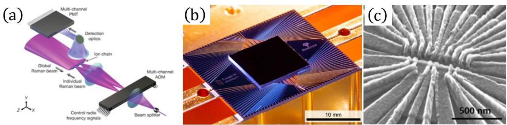  
图1.1 三种研究进展较快的量子计算系统。（a）离子阱系统。图片来自[14]。（b）50比特的超导量子芯片。图片来自 Martinis 实验组[15]。(c)硅锗异质结上的9个量子点。图片来自 Petta 实验组 [16]。

## 1.2 门控半导体量子点

## 1.2.1 门控半导体量子点结构

量子点往往被人们称为“人造原 $\vec { \mathrm {  ~ \int ~ } } ^ { p } ,$ 主要的原因是它可以将载流子（电子或者空穴等）限制在束缚势阱中，拥有天然的量子化特性。而门控量子点则是利用人为构造的金属电极结构来控制势垒的量子点形式之一，并且这种量子点内载流子的隧穿条件也受到这些电极的调控，因而人们可以很精细地利用电极上的电压来实现对这种量子系统的控制。典型的量子点系统有横向平面和垂直型两种结构（如图1.2所示），后来的研究过程中，人们发现横向的平面结构更容易进行电极的设计与制备，于是之后的研究慢慢地更倾向于使用这种结构来制备量子点器件，当然即使是类似的结构形状，不同的基片材料上的量子点的性质也是天差地别的。

早期比较成功的量子点器件都是在砷化镓（GaAs/AIGaAs）异质结体系上实现的，主要原因在于它具有很高的电子迁移率，这对于减少了器件中样品缺陷等来的噪声影响很有帮助，器件性能比较优良。之后工艺技术不断成熟，高迁移率的锗硅（Si/SiGe）异质结、硅金属氧化物半导体（Si-MOS）、石墨烯以及其他新型材料都可以被制备成比较好的量子器件。当然，研究过程不断深入的过程中，问题也接踵而至，尤其是为了满足DiVincenzo判据，量子点体系的相干时间显得尤为重要。例如掺杂体系中的相于时间受到掺杂原子的严重制约，人们就将掺杂性的结构[24]改造成了非掺杂的结构[25]。另外，核自旋也是影响相干时间的重要因素之一，/V族半导体的砷化镓中，电子受到其核自旋的影响（超精细相互作用）很难被忽略；即使是IV族半导体的材料，29Si的存在也使得载流子的相干过程受到核自旋的干扰[26]，针对这个问题，现阶段人们采用同位素纯化的技术来减弱超精细相互作用对载流子退相干时间的负面影响[27]。

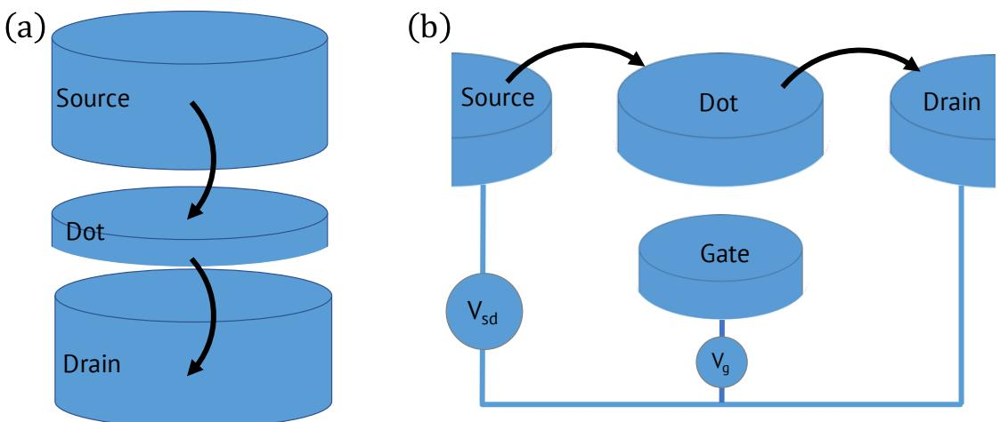  
图1.2 按空间方向分类的两种量子点结构。（a）垂直型结构的单量子点。（b）横向平面结构的单量子点。

## 1.2.2 量子点中电子的电学性质

为了研究量子点系统，并将其应用于量子计算，在进行编码前，首先要对其基本性质有一定的表征和标定。单量子点和双量子点作为最简单的量子点体系，常常被用于比特编码的研究和讨论中。利用常相互作用模型[28]，单量子点器件的特征通过“库仑棱形图”来进行表征，从这种相图中我们可以提取各个有效参数，获取单量子点能级的相关信息。在这里，电子的轨道能级主要受到电子间的库仑相互作用和限域势本身形成的分立能级的影响。类似的，对于双量子点系统，当我们忽略电子自旋带来的影响时，电荷稳态图（也可以称之为“蜂窝图”）上的相关信息可以很好的体现双量子点系统的电学性质。如图1.3所示，两个量子点之间的耦合作用可以由耦合能 $( E _ { \mathrm { C M } } )$ 表示， $E _ { \mathrm { C M } }$ 的大小一般情况下可以由电极电压来控制，所以实际情况中，调节电极电压就可以实现对耦合能的调控，完成对两个量子点耦合大小的改变。

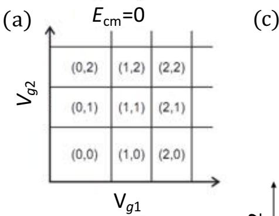

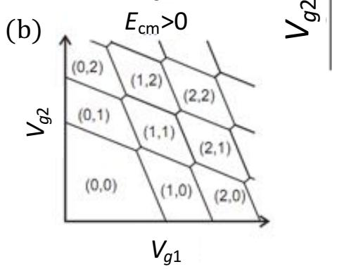

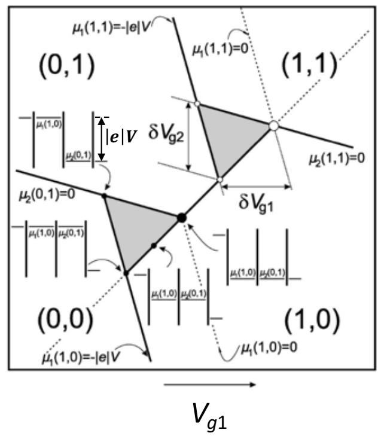  
图1.3 常相互作用模型下双量子点的电荷稳态图。（a）无偏置电压时两个量子点之间不存在耦合的情况。（b）无偏置电压时两个量子点之间耦合较大的情况。（c）外加偏压时的电荷图，存在一对“偏压三角形”。图片来自[28]。

按照常相互作用模型，一个双量子点系统中的左、右两个量子点中的电化学势随电子数目和电极电压(g1、 $g 2$ 为控制左、右量子点能级的电极)关系写为：

$$
\mu _ { 1 } \left( N , M ; V _ { g 1 } , V _ { g 2 } \right) = \left( N - \frac { 1 } { 2 } \right) E _ { \mathrm { C 1 } } + M E _ { \mathrm { C M } } - \frac { 1 } { \left. e \right. } \left( C _ { g 1 } V _ { g 1 } E _ { \mathrm { C 1 } } + C _ { g 2 } V _ { g 2 } E _ { \mathrm { C M } } \right) ,\tag{1.1}
$$

$$
\mu _ { 2 } \left( N , M ; V _ { g 1 } , V _ { g 2 } \right) = N E _ { \mathrm { C M } } + \left( M - \frac { 1 } { 2 } \right) E _ { \mathrm { C 2 } } - \frac { 1 } { | e | } \left( C _ { g 1 } V _ { g 1 } E _ { \mathrm { C M } } + C _ { g 2 } V _ { g 2 } E _ { \mathrm { C 2 } } \right) ,\tag{1.2}
$$

其中 $E _ { \mathrm { C 1 } }$ 和 $E _ { \mathrm { C 2 } }$ 分别是左、右量子点各自的充电能，N和M分别是左右量子点中的载流子数， $C _ { g 1 }$ 和 $C _ { g 2 }$ 分别是左右两个量子点对与控制电极间的等效电容。公式中，电化学势与电极电压的依赖关系很好地表现了电极对量子点的电学调节作用。那么电荷稳态图是如何和电极电压相关联的呢？一般分为有偏置电压和没有偏置电压两种情况讨论。我们这里主要考虑有偏置电压的情况，如图1.3（c）

中所示，在给出的“偏压三角形”中，有三种斜率的直线信号，正斜率的信号线代表着左右两个量子点能级相互对齐时的情况，负斜率的两组线分别表示器件的源极与左点、器件的漏极与器件的右点能级相互对齐的情形。从相图中，我们可以将电极电压对能级的调制作用进行定量标定：源极费米面抬高的高度（或者漏极费米面下降的高度）就是我们实际外加偏压产生的能量，等于eV；然后通过偏压三角形内的能量变化值，就可以很好的标定出杠杆因子（单位电压下对能量产生的改变)，最终得到常相互作用模型中的各个电容值。之前提到了，常相互作用都是不考虑自旋而只考虑轨道能级的影响，需要注意的是自旋的作用在稳态图中也会有一定的显示，我们将在下一小节进行说明。

## 1.3 量子点系统中的信号读取

## 1.3.1 泡利自旋阻塞效应

泡利自旋阻塞效应与泡利不相容原理原则上是完全一致的，并在多种不同体系中都有体现，这里我们只针对半导体量子点中出现的泡利自旋阻塞效应进行讨论。要指出的是，我们讨论的范围主要是通过电学信号反映出的背后物理机制和对应原理的实验现象，其中的物理过程，原则上不只限于半导体量子点体系。通常我们所熟知的泡利不相容原理：在一个由费米子组成的系统中，不存在两个或两个以上处于完全相同状态的粒子。在量子点体系中，我们的载流子往往都是费米子，具体的表现形式为同一个轨道中不能容纳两个相同自旋的载流子[29]。也就是说，两个相同自旋的载流子只能处于不同轨道态，并且由于费米子交换反对称性的存在，两个自旋不同的载流子在处于同一个或者分别处于两个耦合的量子点中的能级态也是比较复杂的。以下我们将以一个双量子点中的电子行为作为例子进行说明（空穴行为的能级相反，原理相同）。

在一个双量子点中，为了简化处理多电子区域的行为，往往将总电子数目为偶数的情况等效为双电子的情况，此时需要引入电子自旋单重态（S态）和三重态（T态）的影响。这里将两个电子分别位于左右量子点的情况记为（1,1）（括号中左、右边数字分别为左、右量子点中的电子数目），这时，单重态的情况记为$S ( 1 , 1 )$ ，三重态的情况记为 $T ( 1 , 1 )$ ；类似的，两电子都位于其中一个量子点（不妨假设都在右边量子点）中时，我们我们将其记为 $\begin{array} { r } { S ( 0 , 2 ) = \frac { | { \uparrow } \downarrow \rangle - | { \downarrow \uparrow } \rangle } { \sqrt { 2 } } } \end{array}$ 和 $T ( 0 , 2 )$ 这里为了方便讨论，我们的三重态只考虑能级最低的那一支，对于电子体系来说一般考虑三重态为 $T ( 0 , 2 ) = \lvert \uparrow \uparrow \rangle$ 。如图1.4（a)中的第二张图所示，假定我们的双量子点处于负偏压状态下（左侧源极S高于右侧漏极D）时，电子可以完成一个 $( 0 , 1 )  ( 1 , 1 )  ( 0 , 2 )  ( 0 , 1 )$ 电子占据的序列变化。这种情况下，始终有一个电子在右侧量子点中，我们假定这个电子的自旋状态为自旋向上，那么在整个过程中，要形成一个序列，只有在左侧量子点中的电子为自旋向下的情况才可以实现。如果此时左侧量子点内的电子处于自旋向上的状态，那么由于泡利不相容原理，S(0,2)和T(0,2)必定处于两个不同的轨道态，导致有一个很大的能级差，电子无法跳入能级较高的 $T ( 0 , 2 )$ 中。在不断循环的过程中，左侧电子总有概率为自旋向上，形成T(1,1)，一旦形成，则不能够再次往右侧跃迁，从而无法继续完成循环形成电流。如果右侧的电子是自旋向下的情况也是类似。最后的表现形式就是在这种情况下，内部电荷始终保持在T(1,1)态，无法产生电流信号。相反的，如果所加的偏置电压为正（左侧源极S低于右侧漏极D），如图1.4（a）和（b）中绿色方块区域所示电子的跳跃过程是 $( 0 , 1 )  ( 0 , 2 )  ( 1 , 1 )  ( 0 , 1 )$ 右侧电子跳跃过程中不受到泡利不相容原理的影响，始终可以完成完整序列的电子数目变化，也就是一直会有向右的电流信号存在。对比这两种不同偏压下的情况，我们能够发现，得到的电流信号有较大的差异，其中电流信号受到抑制的情形所对应的也就是泡利自旋阻塞现象。利用这种现象，我们可以对电子的自旋态进行区分，发生了泡利自旋阻塞现象的情况所对应的就是T(1,1)。如果对这种情况下的T(1,1)进行自旋操作使得其转变为 S(1,1)，那么电子则又可以进行跃迁产生电信号，通过对电信号的大小的分析，我们可以判断出 $T ( 1 , 1 )$ 是否变化成了S(1,1)。这就是我们后文所涉及到的比特自旋态读出的具体原理。需要注意的是，这种泡利自旋阻塞效应引起的电流抑制效果只有在部分范围内才能被实现（如图1.4（c）中紫色五角星区域，T态电子与电子库中S态电子交换，自旋阻塞消失），在其他区域由于高阶激发态和共遂穿等效应的存在，这种现象会被掩盖掉，无法被观测到。

(a)  
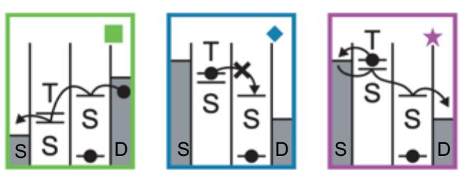

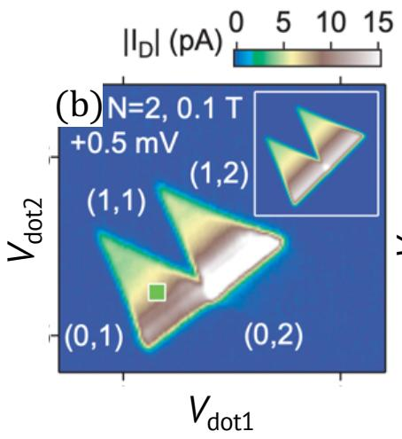

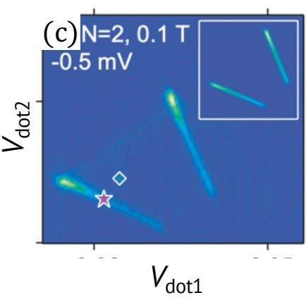  
图1.4 (a)正负偏压下对应的能级图。三角形边缘及内部，在正偏压下电子从源极可以一直向左跃迁，形成向右的电流，在负偏压下只有跳跃到S态的电子才能完成跃迁循环，只要维持在T态，就无法完成向右的跃迁，形成向左的电流。（b）正偏压下的电子数为2的偏压三角形。（c）负偏压下的三角形。图片来自[30]。

## 1.3.2 输运测量

上文提到的电荷稳态图，最直接得到这种信号的方法就是输运测量。使用这种方式，我们需要将器件的源漏两端分别连接到一个直流偏置或者交流信号和一个电流表上，之后可以得到如图1.5（a）所示的电流信号 $I _ { \mathrm { D O T } }$ 。IDOT 反应的是单位时间单位面积内的电子跳跃速率。通过这种方式，在合适的条件下我们可以直接得到上文提及的“偏压三角形”。我们后面的比特读取就是建立在这个基础上的。这种方式的优势在于可以直接读取电信号，线路简单，如果设置合理，器件性能足够优秀，这种测量毫无疑问是最直接的。但是，输运测量也有它的缺点，最明显的就是对电流信号的大小有一定的要求。实验室中常用的直流或者交流仪表都存在一定的测量灵敏度，如果实验中，电子跳跃产生的电流远小于电流表的最高灵敏度，那么这个时候直流输运测量也就无法得到任何有效的数据了。当然，输运测量除了用于量子点这种器件以外，更为常见的是在各种低温输运实验中，比如量子霍尔效应的测量等。

(a)  
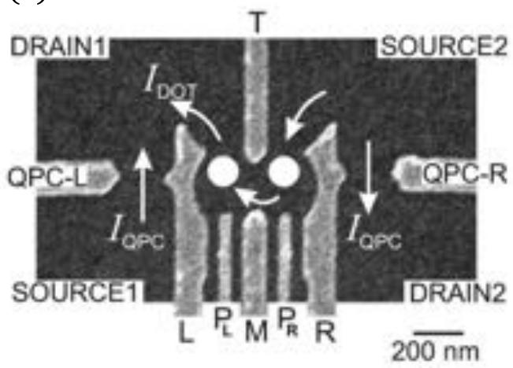

(b)  
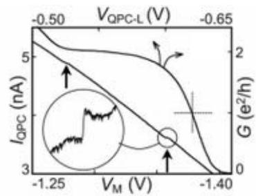

(c)  
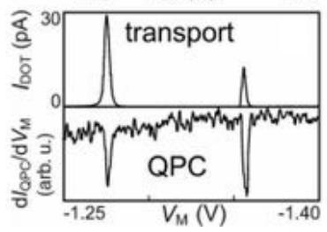  
图1.5 (a)砷化镓的双量子点结构和测量线路。 $I _ { D O T }$ 为量子点中直接输运测量信号。 $I _ { Q P C }$ 为利用边上的量子点接触完成的电荷感应放大信号。（b）直流的电荷感应信号。（c）量子点输运信号与交流的电荷感应信号对比。图片来自[31]。

## 1.3.3 电荷感应技术

除了直接的输运测量以外，另一种有效的测量方式称为电荷感应技术[32]。相比于输运测量，电荷感应技术可以测量更微弱的信号，在量子点系统中，可以用于测量更少载流子情况下的电荷状态。另外，由于这种技术所探测的是电荷本身的跳跃行为而不是电荷循环跳跃过程中产生的电流，因此，它可以用于探测只有一个电子库或者没有电子库的器件。下面我们将具体讨论如何实现这种技术。

电荷感应技术最主要的是要制备一个电荷感应器，一般使用“量子点接触”(QPC或者单电子晶体管（SET）作为这个感应器。我们以量子点接触为例，这种感应器我们都放置在量子点的周围来实现近邻耦合，然后利用电荷之间的相互作用来实现非破坏性测量。如图1.5（a）所示，该量子点器件周围设置了两个量子点接触，这种感应器起到了信号放大器的作用。我们有两种方式利用这个放大器，一种是直接将源漏接于QPC两端，类似于输运测量来测量QPC的电流信号，如果量子点中的电子发生了跳跃，那么QPC中的电流也会由于电容耦合的影响发生变化（如图1.5（b）所示）。这种方式可以通过感应器中电流的变化直接反应量子点器件中电子跳跃的行为。另一种方式则是将激励信号添加在量子点电极上，通过量子点接触接收这种微弱的激励信号然后获取电子运动的行为。这种情况下可以有很高的信噪比，如图1.5（c）显示，电子跃迁对应的QPC信号明显地强于直接的量子点输运电流信号 $I _ { \mathrm { D O T } } .$ 。所以，当我们无法用量子点输运测量获取我们所需信息时，往往会采用这种电荷感应技术。但是电荷感应技术本身还是存在一定的难度和要求的。例如，这种电荷感应器它的电极电压响应范围有限，想要大范围测量电子行为，还是难以实现的。如果只是针对于一定范围内的电荷状态测量，尤其是精确测量时，我们需要通过改变电极电压的方式来改变QPC的工作范围，最好是能够将其保持在最灵敏的区域工作。这种器件最灵敏的工作点位于电导变化最陡峭的地方，一般情况下是在 $\begin{array} { r } { G \approx \frac { e ^ { 2 } } { h } } \end{array}$ 的位置，在图中以十字虚线标注。利用这种技术，即使在输运信号 $I _ { \mathrm { D O T } }$ 小于噪声的情况下，我们也能够判定电子的具体行为，这为明确量子点中电子占据数提供了很好的实验方法。这种方法被广泛应用于砷化镓量子点系统中，之后QPC慢慢地演化为更高级的单电子晶体管，原理大致相同，区别在于单电子晶体管具有更高的灵敏度。尤其在碳纳米管[33]，锗硅核壳型纳米线[34],石墨烯[35]和硅金属氧化物半导体场效应管[36]等体系中都有广泛应用。

值得一提的是，电荷感应技术对电子的隧穿速率相当敏感。如果单电子隧穿的时间远大于测量时间，那么也将无法测得相对应的信号。那么相对的，也可以利用这种特性，通过施加可变宽度的脉冲信号来标定电子的隧穿速率。只有当脉冲宽度逐渐接近电子隧穿需要的时间时，电子跃迁的过程才能被探测到。也是利用了这种特点，电子本身的弛豫时间也可以通过改变脉冲信号来进行标定。因而这种方式电荷感应技术除了单纯的用于测量电子跳跃的行为以外，还有其他可取之处。

## 1.3.4 电子自旋的单发读取

以上两种测量方式读取的都是平均信号，也即多电子的平均行为，那有没有办法直接读取某一个电子的状态呢？答案是肯定的，我们把它称之为单发读取（Single-shotreadout）。再具体细分也可以分为两类，一种是能级选择性的读取[37]，另一种是隧穿速率选择性的读取[38]。能级选择性读取的方式主要是通过区别两个能级的高度来完成的，在能级差较大的情形下，读取的准确性也更高。至于隧穿速率选择性的读取则不一样，它主要区分不同能级上电子自旋的跃迁速率来识别不同的状态，理所应当的，它适用于跃迁速率差别比较大的情形。两种方式在特定情况下也可以进行互补。由于我们的实验体系中暂时不涉及这两种测量方式，所以这里不具体展开说明。

## 1.4 自旋量子比特的定义

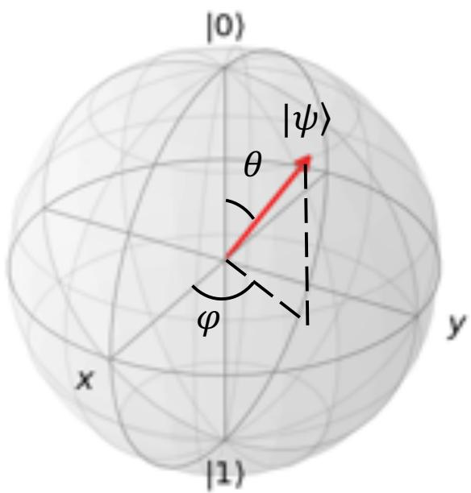  
图1.6 布洛赫球。北极为基态，南极为激发态。球面上任意一点对应的态矢为 $| \psi \rangle ~ =$ $\cos \textstyle { \frac { \theta } { 2 } } \left. 0 \right. + e ^ { i \varphi } \sin \frac { \theta } { 2 } \left. 1 \right.$

1998年Loss和DiVincenzo提出了利用量子点中的自旋态来构建量子比特[39]，尤其是利用双量子点来进行比特编码更是成为了主流方式的一种[40]。任意一个二能级系统都可以定义成一个比特，并且可以利用半径为1的布洛赫球来对其进行表示。如图1.6，布洛赫球的北极代表着二能级中的基态0)，南极代表激发态|1)。这个球上的任意一点代表着由基态和激发态组成的任意一个叠加的纯态 $\left| \psi \right. = \alpha \left| 0 \right. + \beta \left| 1 \right.$ ，这里的复数α和 $\beta$ 满足 $| \alpha | ^ { 2 } + | \beta | ^ { 2 } = 1$ 。同时球内所有点的集合代表着基态和激发态叠加产生的所有混合态。用布洛赫球来描述时，任意的纯态也可以表示为 $\begin{array} { r } { \left| \psi \right. = \cos \frac { \theta } { 2 } \left| 0 \right. + \mathrm { e } ^ { \mathrm { i } \varphi } \mathrm { s i n } \frac { \theta } { 2 } \left| 1 \right. } \end{array}$ 。这里的极角θ代表了基态和激发态分别占据的概率，方位角 $\varphi$ 代表了比特的相位信息。

## 1.4.1 单自旋量子比特(LD 量子比特）

在各种体系中，类似单光子这样的玻色子的自旋为±1或者0，作为费米子的电子的自旋一般为 $\pm \frac { 1 } { 2 }$ ，经常涉及的空穴自旋为 $\pm \frac { 1 } { 2 }$ 和 $\pm \frac { 3 } { 2 }$ (分别为轻空穴和重空穴)。在量子点体系中，我们可以通过将量子点的电荷、自旋或者两者杂化在一起进行编码。由于编码方式的不同，我们讨论的比特可以有不同种分类，这里我们主要讨论的是单自旋的Loss-DiVincenzo比特(LD自旋比特)。LD自旋比特主要将自旋上和下（自旋 $+ \frac 1 2$ 和自旋 $- \frac { 1 } { 2 } )$ 作为二能级进行编码，自旋向上对应布洛赫球的|0〉态，自旋向下对应布洛赫球的|1〉态。在不加外磁场时，|0〉态和0态相互简并。只有外加磁场 $( B _ { \mathbf { z } } )$ 时，两个自旋态才会沿着磁场的方向进行劈裂（塞曼效应），磁场的方向也就是布洛赫球的z轴，此时以自旋向上态和自旋向下态为基矢的哈密顿量可以写作：

$$
H = \frac { \mu _ { B } g B _ { \mathrm { z } } } { 2 } \sigma _ { \mathrm { z } \circ }\tag{1.3}
$$

## 1.4.2 单三态自旋量子比特(ST 量子比特)

当双量子点中存在两个电荷（或者等效成两个电荷）时，这两个电荷的自旋单重态 $\begin{array} { r } { ( S = \frac { | \uparrow \downarrow \rangle - | \downarrow \uparrow \rangle } { \sqrt { 2 } } ) } \end{array}$ 和自旋三重态 $( T _ { + } = | \uparrow \uparrow \rangle$ ， $\begin{array} { r } { T _ { 0 } = \frac { | \uparrow \downarrow \rangle + | \downarrow \uparrow \rangle } { \sqrt { 2 } } } \end{array}$ 和 $T _ { - } = \left| \downarrow \downarrow \right. )$ 中的S态和 $T _ { 0 }$ 态可以被编码成|0态和|1〉态，这种编码方式也被称作ST自旋比特。这时，有效的哈密顿量是[41]：

$$
H _ { \mathrm { S } T } = \frac { J ( \varepsilon ) } { 2 } \sigma _ { \mathrm { z } } + \frac { \Delta E _ { z } } { 2 } \sigma _ { \mathrm { x } } ,\tag{1.4}
$$

$J ( \varepsilon )$ 代表S态和 $T _ { 0 }$ 态之间的能量差， $\varepsilon$ 代表的是电荷占据数变化时对应的电化学势的失谐量。 $\Delta E _ { z }$ 代表的是左右两个自旋的塞曼能量的差别。它一般由$g$ 因子的差别或者电荷感受到的磁场差别引起，分别表示为 $\Delta E _ { z } = \Delta g \mu B$ 和$\Delta E _ { z } = g \mu \Delta B$ 。在 $g$ 因子变化量很小的情况下， $\Delta E _ { z }$ 的大小主要由 $\Delta B$ 提供。在GaAs量子点中，不同自旋间的 $\Delta B$ 主要是由核自旋产生的，可以说，正是由于核自旋的存在，才使得这种比特能够完成绕x轴方向的操控。这种方案的单比特控制最早由 Petta等人在 GaAs的电子型双量子点中实现[41]，后来由 Yacoby组进一步延伸完成了两比特门的研究并且通过状态层析（State tomography）得到了密度矩阵的各个矩阵元以证明自旋态之间的纠缠特性。这种编码方式的好处是不需要额外引入交变电场或者交变磁场，控制比特绕x轴旋转的能量由核磁场提供，但是问题也较为明显，半导体中核磁场的不均一性会大幅缩短退相于时间，保真度有限。因而，Yacoby组通过实时监测系统的哈密顿量来对核磁场进行有效反馈控制，将退相干时间从10ns提升到 $ { J 2 } \mu \mathrm { s } \left[ 4 2 \right]$ 。之后他们发现较大$\Delta E _ { z }$ 有助于压制系统中的噪声，配合使用实时反馈技术后在GaAs量子点系统中得到了门保真度达到99%的自旋量子比特[43]。相比于LD自旋比特，ST自旋比特的构建需要成倍的量子点物理结构（一个ST自旋比特可以编码成两个LD自旋比特），并且ST自旋比特的多量子比特系统哈密顿量描述也十分复杂，因而ST自旋比特的多比特研究较为困难，目前采用该方案进行编码的比特最大数目也仅限于两个。

## 1.4.3 交换自旋量子比特（Exchange-only 量子比特）

ST自旋量子比特始终需要一定的塞曼能量差才能完成一个普适的量子比特门，但这个方式始终受到核磁场的影响。为了解决这个问题，可以利用不同自旋之间的交换相互作用来实现量子比特的编码[44]。这种编码的比特由三个量子点中的三个自旋组成，有这三个自旋组成的基矢有八个，只取其中两个态$| 0 \rangle = 1 / \sqrt { 6 } ( | \uparrow \uparrow \downarrow \rangle + | \downarrow \uparrow \uparrow \rangle - 2 | \uparrow \downarrow \uparrow \rangle ) \mathcal { \bar { H } } | 1 \rangle = 1 / \sqrt { 2 } ( | \uparrow \uparrow \downarrow \rangle - | \downarrow \uparrow \uparrow \rangle )$ 进行编码[45]。

$$
H _ { \mathrm { E } X } = - \frac { J ( \varepsilon ) } { 2 } \sigma _ { \mathrm { l } } - \frac { J ( \varepsilon ) } { 2 } \sigma _ { \mathrm { r } } ,\tag{1.5}
$$

这里 $\sigma _ { 1 } = ( \sigma _ { z } - \sqrt { 3 } \sigma _ { x } ) / 2 , \sigma _ { \mathrm { r } } = ( \sigma _ { z } + \sqrt { 3 } \sigma _ { x } ) / 2$ ，在布洛赫球上， $\sigma _ { \mathrm { l } }$ 和 $\sigma _ { \mathrm { r } }$ 的夹角为$1 2 0 ^ { \circ } \mathrm { C } _ { \mathrm { c } }$ 这两个基矢之间的能量差主要由交换相互作用提供，并且这个能级差在某些区域对电压的变化不敏感，因而这种比特可以较大程度地免疫噪声带来的影响，拥有相对较长的相于时间。2013年，Medford等人就利用该方案在GaAs上完成了比特控制，获得了 $1 9 \mu \mathrm { s }$ 的退相干时间和100MHz的拉比速率[46]。相对的，这个比特编码更为复杂，多比特的构建也存在一定难度，因而短期内也仅限于单比特的研究。

## 1.4.4 电荷量子比特（Charge 量子比特）

除了研究不同编码方式的自旋量子比特的退相干性质外，拉比速率也是个重要参数（拉比速率越快，单位时间内的操作数越多，越接近量子计算所需的判据)。在各种不同量子比特的编码方式中，电荷量子比特的编码方式就拥有较快的操作速度这一优势。它由一个双量子点体系构成，电子分别位于左、右量子点中的状态分别记为L〉态和R〉态，在这两个基矢下，系统可以由哈密顿量 $H _ { c }$ 描述[47,48]:

$$
H _ { \mathrm { c } } = \frac { \varepsilon _ { \mathrm { c } } } { 2 } \sigma _ { \mathrm { z } } + t \sigma _ { \mathrm { x } } ,\tag{1.6}
$$

$\varepsilon _ { \mathrm { c } }$ 代表L〉态和R〉态之间的失谐量，t代表量子点之间的隧穿耦合。我们组使用这种量子比特编码方式实现了100GHz的比特控制，可惜的是电荷态的编码使得系统更容易受到噪声影响（电荷直接与外界环境相互作用），因而退相于时间始终无法突破纳秒量级[24]，也是这个原因暂时限制了电荷量子比特的进一步发展。

## 1.4.5 杂化量子比特（Hybrid 量子比特）

为了结合自旋量子比特和电荷量子比特两者的优势，杂化量子比特应运而生[49]。这种编码方式的构建需要在双量子点中存在三个自旋，系统中最低的两个能级为 $| 0 \rangle = | \downarrow \rangle _ { L } | S \rangle _ { R } \mathcal { \hat { H } } | 1 \rangle = 1 / \sqrt { 3 } | \downarrow \rangle _ { L } | T _ { 0 } \rangle _ { R } - \sqrt { 2 / 3 }$ |↑ $_ L \mathinner { | { T _ { - } } \rangle } _ { R }$ ，L和R代表的是自旋在左边和右边量子点中的状态。以0态、1〉态和L〉态为基矢的哈密顿量为[50]:

$$
H = \left( \begin{array} { c c c } { - \varepsilon / 2 } & { t _ { 1 } } & { t _ { 2 } } \\ { t _ { 1 } } & { - \varepsilon / 2 } & { 0 } \\ { t _ { 2 } } & { 0 } & { - \varepsilon / 2 + \Delta } \end{array} \right) ,\tag{1.7}
$$

式中 $\varepsilon$ 表示(1,2)和(2,1)电荷态之间的失谐量， $t _ { 1 } ~ ( t _ { 2 } )$ 代表|0态和1态（0态和L〉态）之间的隧穿耦合。 $\Delta$ 代表的是右侧量子点中最低两个轨道能级的能量差。这种方式由Kim等人在Si/SiGe异质结双量子点中最先实现量子比特操控[51]，后来我们组在GaAs体系中实现了该方案的量子比特控制，且操控速度可以由 2 GHz 到 15 GHz 进行调控 [52, 53]。

## 1.4.6 自旋弛豫时间和退相干时间

载流子的自旋态除了受到外磁场的影响外，无时无刻不与其他周围环境发生着作用，尤其是电荷噪声、声子和自旋库的作用等都会对自旋比特的状态产生影响，主要表现在自旋弛豫时间和退相于时间的变化上。

自旋的弛豫时间定义为自旋自发从激发态衰减到基态所用的时间，记为 $T _ { 1 }$ 如图1.7（a）所示。在不进行人为干预的情况下，可以用以下公式进行弛豫过程

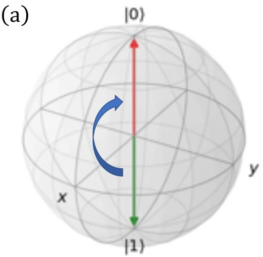

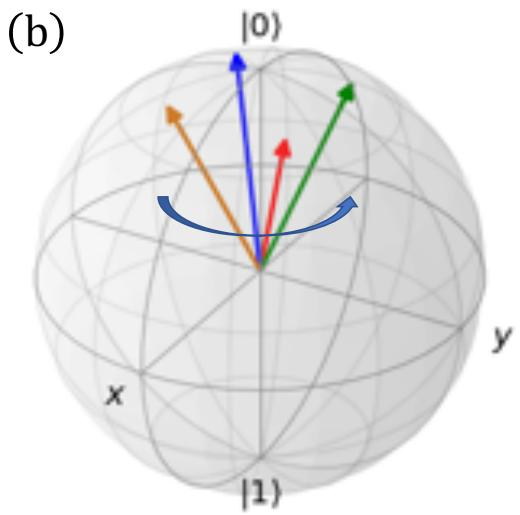  
图1.7 自旋弛豫时间和退相干时间的演示。（a）自旋态从激发态衰减到基态的过程。（b）自旋绕z轴后 $2 \pi$ 后退相干的过程。

的描述：

$$
\rho ( t ) = \rho ( 0 ) \exp ( - t / T _ { 1 } ) ,\tag{1.8}
$$

$\rho ( 0 )$ 代表初始时刻自旋处于激发态的概率， $\rho ( t )$ 代表经过时间t后自旋仍旧保留的激发态概率。自旋从0时刻起，进行指数形式的衰减，衰减的速率由 $T _ { 1 }$ 所决定。

除了自旋弛豫时间以外，另一个重要的参数是自旋的退相于时间。它是自旋绕着z轴旋转 $2 \pi$ 后相位退化的时间 $( T _ { 2 } )$ ，代表的是能级态之间的相干性。退相于过程会严重影响比特操作的过程，使得最终能级态与目标态之间产生区别，失去量子特性。理想情况下，系统不受退相干影响时， $T _ { 2 }$ 为无穷大。类似于 $T _ { 1 }$ 在自旋操作过程中， $T _ { 2 }$ 也可以通过经过时间t后自旋处于激发态的概率进行公式描述：

$$
\rho ( t ) = \rho ( f ) - \rho ( 0 ) ) \cos ( \omega t ) \exp ( - t / T _ { 2 } ) + \rho ( 0 ) ,\tag{1.9}
$$

$\rho ( f )$ 代表自旋完全消相于后处于激发态的概率， $\omega$ 代表自旋在基态和激发态之间振荡的角频率。作为理论计算时，由于弛豫过程不能比退相于过程快，这两个时间满足 $T _ { 2 } < 2 T _ { 1 }$ 这样一个边界条件。实际情况中，可以通过获取不同时刻的$\rho ( t )$ 来获取 $T _ { 2 }$ 。另外要指出的是，我们实验过程中提取的退相干时间（一般记为$T _ { 2 } ^ { \star } )$ 往往受到其他各种条件的影响，会小于真正的 $T _ { 2 } [ 5 4 ]$ 。在量子点的自旋比特中 $T _ { 1 }$ 一般远大于 $T _ { 2 } ^ { \star }$ ，因而主要限制量子点自旋比特性能的主要是 $T _ { 2 } ^ { \star }$

## 1.5 载流子自旋的操作控制

我们这里以LD自旋比特为例讨论单电子自旋比特的操作与实现。任意一个纯态可以表示为 $\left| \psi \right. = \alpha \left| 0 \right. + \beta \left| 1 \right.$ ，那么任意一个自旋态经过一个幺正变换后演化到另一个自旋态的过程则可以通过一个布洛赫球上的欧拉转动 $R \left( \theta \right) =$ $\exp \left( - i \theta \sigma / 2 \right)$ （σ为泡利算符）来实现。比如， $X \left( \theta \right) = \exp \left( - i \pi \sigma _ { x } / 2 \right)$ 表示的就是绕x轴旋转 $1 8 0 ^ { \circ }$ ，这种|0态到1〉态的变换对应于传统意义上的非门；在具体情况中，自旋绕着z轴的旋转则比较容易实现，只要提供一个静态外磁场，那么系统在这个外磁场作用下产生的塞曼能总是能够使得自旋绕着z轴进行匀速转动，我们称之为拉莫尔进动。在总能量不改变的情况下，按照欧拉转动定理，可以证明的是初始态绕任意轴转动到末态的过程总可以转化为绕x轴（或者y轴）和z轴转动的组合。也就是说，只要分别能够完成绕x轴和z轴的操作，那么绕任意轴旋转任意角度的操作都可以由这两种操作进行组合，最终完成一个普适的单比特操作。我们可以认为一个普适的单比特操作的构成条件就是需要绕x轴和z轴的操作。其实，上文已经说明了，绕z轴操作通过外加静态磁场来实现，剩下的问题就落在了如何实现绕x轴旋转的操作。在量子点体系中，我们依据工作原理将引起自旋翻转的总体效应分为两大类：电子自旋共振以及电偶极自旋共振。其中，电偶极自旋共振又可以按照耦合机理不同细分为三种，这三种耦合机制分别是非均匀磁场、自旋轨道耦合和q张量调制。

## 1.5.1 电子自旋共振-ESR

Engel 和 Loss[55, 56] 最早在 2001 年提出通过电子自旋共振来实现量子点中的量子比特操控方案，后来由Koppens等人在GaAs双量子点体系中于 2006年实现[57]。这种方案后来才逐渐应用到硅基的量子器件中，首先在2012年被澳大利亚的Morello组应用于硅基的单原子的电子自旋比特实验中[58]。之后，Dzurak组在 Si-MOS 量子点的自旋单比特[59]和自旋两比特[60]实验中都采用了这种方案。近期由 Veldhorst 组在1K温度下的 Si/SiGe异质结上的自旋两比特门也采取了这种方式[22]。描述这个控制的过程，我们需要对照布洛赫球，按照布洛赫球的定义，我们有一个实验室坐标系。在这个坐标系中，对于LD自旋比特来说，为了实现绕z轴的比特控制，就需要外加一个z方向的静态磁场。绕x轴的操作则是通过x轴方向的周期性交变磁场来实现。在电子自旋共振这项技术中，这是最为核心的部分。我们将这个交变磁场的振荡角频率记为 $\omega ,$ 则$B _ { \mathrm { a c } } = B _ { \mathrm { a c } } \cos \left( \omega t + \varphi \right)$ ，那么系统的简化哈密顿量就可以写作：

$$
H = \frac { \mu _ { B } g B _ { \mathrm { z } } } { 2 } \sigma _ { \mathrm { z } } + \frac { \mu _ { B } g B _ { \mathrm { A C } } } { 2 } \sigma _ { \mathrm { x } } \cos \left( \omega t + \varphi \right) ,\tag{1.10}
$$

由于存在一个静态磁场，这种情况下的自旋态可以写为 $\begin{array} { r } { | \psi \rangle ^ { r o t } = \exp \left( i \frac { \omega _ { \mathrm { z } } t } { 2 } \sigma _ { \mathrm { z } } \right) | \psi \rangle } \end{array}$ $\begin{array} { r } { ( \omega _ { \mathrm { z } } = \frac { \mu _ { B } g B _ { \mathrm { z } } } { \hbar } ) } \end{array}$ ，为了方便后续讨论，我们对坐标系进行变换，将其实验室坐标系下的哈密顿量用新的形式在旋转坐标系下进行表示，容易得到进行旋波近似后的哈密顿量为：

$$
H = \frac { \hbar \left( \omega _ { \mathrm { z } } - \omega \right) } { 2 } \sigma _ { \mathrm { z } } + \frac { \hbar \omega _ { 1 } } { 2 } \left[ \sigma _ { \mathrm { x } } \cos \varphi - \sigma _ { \mathrm { y } } \sin \varphi \right] ,\tag{1.11}
$$

这里 $\begin{array} { r } { \omega _ { 1 } = \frac { \mu _ { B } g B _ { \mathrm { A C } } } { 2 \hbar } } \end{array}$ 。在旋转坐标系下，我们可以认为电子绕z轴的旋转由 $\omega$ 和 $\omega _ { \mathrm { z } }$ 共同控制，特殊情形下，当交变电场的频率满足 $\omega = \omega _ { \mathrm { z } }$ 时，自旋态在这个坐标系下将不再绕z轴转动，只剩下绕x轴和y轴的转动。这时电子自旋将绕x-y平面内的某一轴在|0〉态和|1〉态之间来回振荡，我们称之为拉比（Rabi）振荡，这个转动频率 $\omega _ { 1 }$ 我们称为拉比频率。为了方便讨论，我们不妨将 $\varphi$ 设为0，那么电子将绕x轴在|0〉态和|1〉态之间旋转。当振荡的时间确定下来并且满足转动角度 $\begin{array} { r } { T _ { \pi } = \frac { \pi } { \omega _ { 1 } } } \end{array}$ 时，量子非门就得以实现。此外，当 $\omega \neq \omega _ { \mathrm { z } }$ 时，电子本身就绕着夹角为 $\begin{array} { r } { \arctan \left( \frac { \omega _ { \mathrm { z } } - \omega } { \omega _ { 1 } } \right) } \end{array}$ 的轴以角频率为 $\omega _ { 2 } = \sqrt { \omega _ { 1 } { } ^ { 2 } + \left( \omega _ { \mathrm { z } } - \omega \right) ^ { 2 } }$ 进行进动。

在具体实验过程中， $B _ { \mathrm { A C } }$ 是通过条带电极上添加幅值足够强的交变电流产生的，这种方式存在着一些弊端，尤其是当需要很强驱动时，交流电也就相应需要增强，由于电路本身往往存在一定的电阻，那么较大的电流就会产生相应较大的发热情况，这在实验中都被证明了，所以发热作用是限制这种自旋共振技术应用于自旋控制的主要因素之一。另外这种条带结构一般都需要占用较大的物理空间，不适合用于大规模的扩展。

## 1.5.2 电偶极自旋共振-EDSR

为了应对以上电子自旋共振的弊端，电偶极自旋共振应运而生。上面提到按照耦合机制不同，我们可以将电偶极自旋共振分为三小类，这里我们着重讨论利用非均匀磁场和自旋轨道耦合作用来实现电偶极自旋共振的这两类情况。g张量调制的方法也有一定的发展，但在量子点方面研究进展缓慢，我们这里不再仔细说明。类似于电子自旋共振，电偶极自旋共振也需要一个外加静态磁场 $\scriptstyle B _ { \mathrm { z } }$ ，但不同的是，我们需要用不同的方式来产生一个等效于 $B _ { \mathrm { A C } }$ 的场，这种等效的过程就是我们的耦合过程。对应的系统哈密顿量为：

$$
H = \frac { \mu _ { B } g B _ { \mathrm { z } } \sigma _ { \mathrm { z } } } { 2 } + \frac { \mu _ { B } g B _ { \mathrm { e f f } } \cdot \pmb { \sigma } } { 2 } ,\tag{1.12}
$$

进行旋转坐标系变换后为：

$$
H = \frac { \hbar ( \omega _ { \mathrm { z } } - \omega ) } { 2 } \sigma _ { \mathrm { z } } + \frac { \hbar \omega _ { 1 } } { 2 } \sigma _ { \mathrm { x } } ,\tag{1.13}
$$

$\begin{array} { r } { \omega _ { 1 } = \frac { \mu _ { B } g B _ { \mathrm { e f f } } } { 2 \hbar } } \end{array}$ ，由于耦合的机制不同， $B _ { \mathrm { e f f } }$ 有不同的表达形式。现阶段比较流行的方案是利用非均匀磁场下载流子的运动产生的等效磁场来控制自旋。这种方案原则上是通过交流磁场控制波函数的位置，再经过人造非均匀磁场来等效自旋轨道耦合作用，等效的有效磁场的具体形式是：

$$
B _ { \mathrm { e f f } } = b _ { \mathrm { s l } } \frac { e E \left( t \right) l _ { \mathrm { d o t } } ^ { 2 } } { \Delta } ,\tag{1.14}
$$

$b _ { \mathrm { s l } }$ 代表的人为设计的沿着x轴（或者y轴）方向的倾斜磁场的梯度，也就是磁场在该处的变化梯度。在研究发展的过程中，人们一般是通过人为地在量子点器件设计添加铁磁性材料钴，来实现局部的非均匀磁场。这种方案最早由Tarucha组于2008年在设计的GaAs量子点器件中得到实现[61]，并且在2011年应用于GaAs 的两比特门控制中[62]。后来这种方式被推广到 Si/SiGe 异质结中,Petta组[63]和 Vandersypen组[64]的两比特门也都是采用这种机理实现对自旋的控制。

当考虑自旋轨道耦合机制且外加电场E(t) 方向与 $B _ { \mathrm { e f f } }$ 垂直时，有效磁场可以写作：

$$
B _ { \mathrm { e f f } } = 2 B _ { \mathrm { z } } \frac { e E \left( t \right) l _ { \mathrm { d o t } } ^ { 2 } } { l _ { \mathrm { s o } } \cdot \Delta } ,\tag{1.15}
$$

公式中的自旋轨道耦合长度 $\begin{array} { r } { l _ { \mathrm { s o } } = \frac { \hbar } { m ^ { \star } \sqrt { \alpha ^ { 2 } + \beta ^ { 2 } } } } \end{array}$ (α 和 β 分别是 Rashba 常数和 Dres-selhaus 常数)， ${ l } _ { \mathrm { d o t } }$ 是量子点的大小， $\Delta$ 是量子点势阱中形成的轨道能级差， $m ^ { \star }$ 是载流子的有效质量。这种机制主要是由交流电场控制电荷态，再通过自旋轨道耦合项来控制自旋状态，最终达到调控交流电场来实现自旋的控制的目的。我们后续论文中实现的比特操控也就是通过这种方式来实现的，研究细节将在第五章中展开讨论。

## 1.5.3 各个小组在单自旋量子比特上的进展

在量子点体系中，美国的Petta组、日本的 Tarucha组、荷兰的 Vandersypen组和澳大利亚的Dzurak组都通过LD自旋比特编码实现了自旋量子比特的操控并且为了标定系统的保真度，都采用了随机基准（Randomized benchmarking）的方式得到了Clifford门保真度[59]。以下结果集中在使用ESR方案的 Si-MOS体系和使用EDSR的 Si/SiGe体系中，虽然在自旋弛豫时间、自旋退相干时间和操作速度方面有一定差异，但是通过28Si纯化技术都将退相干时间进行了提升。可以预见，将来在半导体量子点自旋比特的研究趋势会是更多的比特、更高温的工作条件、更长的相干时间和更高的保真度等方面。

表1.1 不同小组单比特的结果对比
<table><tr><td rowspan=1 colspan=1>小组</td><td rowspan=1 colspan=1> $T _ { 1 } \left( m s \right)$ </td><td rowspan=1 colspan=1> $T _ { 2 } ^ { \star } \left( \mu s \right)$ </td><td rowspan=1 colspan=1> $f _ { \mathrm { R a b i } } \left( \mathrm { M H z } \right)$ </td><td rowspan=1 colspan=1>Clifford门失真度 $\left( 1 0 ^ { - 3 } \right)$ </td><td rowspan=1 colspan=1>材料体系默认 &lt; 100 mK</td></tr><tr><td rowspan=1 colspan=1>Petta 组 [63]</td><td rowspan=1 colspan=1>22</td><td rowspan=1 colspan=1>1.4</td><td rowspan=1 colspan=1>4.8</td><td rowspan=1 colspan=1>3</td><td rowspan=1 colspan=1>natSi/SiGe</td></tr><tr><td rowspan=1 colspan=1>Petta 组 [65]</td><td rowspan=1 colspan=1>52</td><td rowspan=1 colspan=1>10.4</td><td rowspan=1 colspan=1>&gt;1.8</td><td rowspan=1 colspan=1>?</td><td rowspan=1 colspan=1>2⁸Si/SiGe</td></tr><tr><td rowspan=1 colspan=1>Tarucha 组 [66]</td><td rowspan=1 colspan=1>？</td><td rowspan=1 colspan=1>1.84</td><td rowspan=1 colspan=1>34</td><td rowspan=1 colspan=1>4</td><td rowspan=1 colspan=1>natSi/SiGe</td></tr><tr><td rowspan=1 colspan=1>Tarucha 组 [67]</td><td rowspan=1 colspan=1>&gt;100</td><td rowspan=1 colspan=1>20.4</td><td rowspan=1 colspan=1>30</td><td rowspan=1 colspan=1>1.4</td><td rowspan=1 colspan=1>2⁸Si/SiGe</td></tr><tr><td rowspan=1 colspan=1>Vandersypen 组 [64]</td><td rowspan=1 colspan=1>&gt;50</td><td rowspan=1 colspan=1>1</td><td rowspan=1 colspan=1>2</td><td rowspan=1 colspan=1>12</td><td rowspan=1 colspan=1>natSi/SiGe</td></tr><tr><td rowspan=1 colspan=1>Vandersypen 组 [22]</td><td rowspan=1 colspan=1>3.7</td><td rowspan=1 colspan=1>2.7</td><td rowspan=1 colspan=1>1</td><td rowspan=1 colspan=1>7</td><td rowspan=1 colspan=1>2⁸Si-MOS (1K)</td></tr><tr><td rowspan=1 colspan=1>Dzurak 组 [59]</td><td rowspan=1 colspan=1>&gt;1000</td><td rowspan=1 colspan=1>120</td><td rowspan=1 colspan=1>0.3</td><td rowspan=1 colspan=1>19</td><td rowspan=1 colspan=1>2⁸Si-MOS</td></tr><tr><td rowspan=1 colspan=1>Dzurak 组 [68]</td><td rowspan=1 colspan=1>&gt;1000</td><td rowspan=1 colspan=1>33</td><td rowspan=1 colspan=1>0.3</td><td rowspan=1 colspan=1>1.7</td><td rowspan=1 colspan=1>2⁸Si-MOS</td></tr><tr><td rowspan=1 colspan=1>Dzurak 组 [21]</td><td rowspan=1 colspan=1>20</td><td rowspan=1 colspan=1>2</td><td rowspan=1 colspan=1>1</td><td rowspan=1 colspan=1>14</td><td rowspan=1 colspan=1>2⁸Si-MOS (1K)</td></tr></table>

## 1.6 本章小结

首先简述了量子计算的发展过程与研究现状，然后说明了实现量子计算的物理模型和具体要求，其次针对本人在博士期间的实验体系（半导体门控量子点）做了一些阐述。之后，再具体讨论了利用半导体门控量子点实现量子计算的实验手段，主要包括半导体量子点的基本电学性质表征手段，量子点中电学信号的读取原理与方式，如何利用量子点的自旋构建成一个比特和通过对自旋的操作最终实现一个简单的比特操作。在后续的论述中，着重讨论本人博士期间在三个不同体系上的研究进展，分别是非掺杂的砷化镓异质结体系，硅金属氧化物半导体体系和硅锗自组织棚顶型纳米线体系。

## 参考文献

[1] Feynman R P. Simulating physics with computers. Int. J. Theor. Phys, 1999, 21(6/7).

[2] Deutsch D. Quantum theory, the Church–Turing principle and the universal quantum computer. Proceedings of the Royal Society of London. A. Mathematical and Physical Sciences, 1985, 400(1818):97–117.

[3] Deutsch D, Jozsa R. Rapid solution of problems by quantum computation. Proceedings of the Royal Society of London. Series A: Mathematical and Physical Sciences, 1992, 439(1907):553–558.

[4] Shor P W. Algorithms for quantum computation: discrete logarithms and factoring. Proceedings of Proceedings 35th annual symposium on foundations of computer science. IEEE, 1994. 124–134.

[5] Shor P W. Polynomial-time algorithms for prime factorization and discrete logarithms on a quantum computer. SIAM Review, 1999, 41(2):303–332.

[6] Grover L K. Quantum mechanics helps in searching for a needle in a haystack. Physical Review Letters, 1997, 79(2):325.

[7] Roland J, CerfN J. Quantum-circuit model ofHamiltonian search algorithms. Physical Review A, 2003, 68(6):062311.

[8] Albash T, Lidar D A. Adiabatic quantum computation. Reviews of Modern Physics, 2018, 90(1):015002.

[9] Farhi E, Goldstone J, Gutmann S, et al. Quantum computation by adiabatic evolution. arXiv preprint quant-ph/0001106, 2000..

[10] Boixo S, Rønnow T F, Isakov S V, et al. Evidence for quantum annealing with more than one hundred qubits. Nature Physics, 2014, 10(3):218–224.

[11] Raussendorf R, Browne D E, Briegel H J. Measurement-based quantum computation on cluster states. Physical Review A, 2003, 68(2):022312.

[12] Freedman M, Kitaev A, Larsen M, et al. Topological quantum computation. Bulletin of the American Mathematical Society, 2003, 40(1):31–38.

[13] DiVincenzo D P. The physical implementation of quantum computation. Fortschritte der Physik: Progress of Physics, 2000, 48(9-11):771–783.

[14] Debnath S, Linke N M, Figgatt C, et al. Demonstration of a small programmable quantum computer with atomic qubits. Nature, 2016, 536(7614):63–66.

[15] Arute F, Arya K, Babbush R, et al. Quantum supremacy using a programmable superconducting processor. Nature, 2019, 574(7779):505–510.

[16] Zajac D, Hazard T, Mi X, et al. Scalable gate architecture for a one-dimensional array of semiconductor spin qubits. Physical Review Applied, 2016, 6(5):054013.

[17] Matthews J C, Politi A, Stefanov A, et al. Manipulation of multiphoton entanglement in waveguide quantum circuits. Nature Photonics, 2009, 3(6):346.

[18] Gaëtan A, Miroshnychenko Y, Wilk T, et al. Observation of collective excitation of two individual atoms in the Rydberg blockade regime. Nature Physics, 2009, 5(2):115–118.

[19] Doherty M W, Manson N B, Delaney P, et al. The nitrogen-vacancy colour centre in diamond. Physics Reports, 2013, 528(1):1–45.

[20] Vandersypen L M, Steffen M, Breyta G, et al. Experimental realization of Shor's quantum factoring algorithm using nuclear magnetic resonance. Nature, 2001, 414(6866):883–887.

[21] Yang C H, Leon R, Hwang J, et al. Operation of a silicon quantum processor unit cell above one kelvin. Nature, 2020, 580(7803):350–354.

[22] Petit L, Eenink H, Russ M, et al. Universal quantum logic in hot silicon qubits. Nature, 2020, 580(7803):355–359.

[23] Dijk J P, Charbon E, Sebastiano F. The electronic interface for quantum processors. Microprocessors and Microsystems, 2019, 66:90–101.

[24] Cao G, Li H O, Tu T, et al. Ultrafast universal quantum control of a quantum-dot charge qubit using Landau-Zener-Stückelberg interference. Nature Communications, 2013, 4(1):1–7.

[25] Li H O, Cao G, Xiao M, et al. Fabrication and characterization of an undoped GaAs/AlGaAs quantum dot device. Journal of Applied Physics, 2014, 116(17):174504.

[26] Bluhm H, Foletti S, Mahalu D, et al. Enhancing the coherence of a spin qubit by operating it as a feedback loop that controls its nuclear spin bath. Physical Review Letters, 2010, 105(21):216803.

[27] Itoh K M, Watanabe H. Isotope engineering of silicon and diamond for quantum computing and sensing applications. MRS Communications, 2014, 4(4):143–157.

[28] Wiel W G, De Franceschi S, Elzerman J M, et al. Electron transport through double quantum dots. Reviews of Modern Physics, 2002, 75(1):1.

[29] Ono K, Austing D, Tokura Y, et al. Current rectification by Pauli exclusion in a weakly coupled double quantum dot system. Science, 2002, 297(5585):1313–1317

[30] Johnson A C, Petta J R, Marcus C, et al. Singlet-triplet spin blockade and charge sensing in a few-electron double quantum dot. Physical Review B, 2005, 72(16):165308.

[31] Elzerman J, Hanson R, Greidanus J, et al. Few-electron quantum dot circuit with integrated charge read out. Physical Review B, 2003, 67(16):161308

[32] DiCarlo L, Lynch H, Johnson A, et al. Differential charge sensing and charge delocalization in a tunable double quantum dot. Physical Review Letters, 2004, 92(22):226801.

[33] Biercuk M, Reilly D, Buehler T, et al. Charge sensing in carbon-nanotube quantum dots on microsecond timescales. Physical Review B, 2006, 73(20):201402.

[34] Hu Y, Churchill H O, Reilly D J, et al. A Ge/Si heterostructure nanowire-based double quantum dot with integrated charge sensor. Nature Nanotechnology, 2007, 2(10):622–625.

[35] Wei D, Li H O, Cao G, et al. Tuning inter-dot tunnel coupling of an etched graphene double quantum dot by adjacent metal gates. Scientific Reports, 2013, 3:3175.

[36] Yang C, Lim W, Zwanenburg F, et al. Dynamically controlled charge sensing of a few-electron silicon quantum dot. AIP Advances, 2011, 1(4):042111.

[37] Elzerman J, Hanson R, Van Beveren L W, et al. Single-shot read-out of an individual electron spin in a quantum dot. Nature, 2004, 430(6998):431–435.

[38] Hanson R, Beveren L W, Vink I, et al. Single-shot readout of electron spin states in a quantum dot using spin-dependent tunnel rates. Physical Review Letters, 2005, 94(19):196802.

[39] Loss D, DiVincenzo D P. Quantum computation with quantum dots. Physical Review A, 1998, 57(1):120.

[40]DiVincenzo D P. Double quantum dot as a quantum bit. Science, 2005, 309(5744):2173–2174.

[41] Petta J R, Johnson A C, Taylor J M, et al. Coherent manipulation of coupled electron spins in semiconductor quantum dots. Science, 2005, 309(5744):2180–2184.

[42] Shulman M D, Harvey S P, Nichol J M, et al. Suppressing qubit dephasing using real-time Hamiltonian estimation. Nature Communications, 2014, 5(1):1–6.

[43] Nichol J M, Orona L A, Harvey S P, et al. High-fidelity entangling gate for double-quantum-dot spin qubits. npj Quantum Information, 2017, 3(1):1–5.

[44] DiVincenzo D P, Bacon D, Kempe J, et al. Universal quantum computation with the exchange interaction. Nature, 2000, 408(6810):339–342.

[45] Medford J, Beil J, Taylor J, et al. Self-consistent measurement and state tomography of an exchange-only spin qubit. Nature Nanotechnology, 2013, 8(9):654–659.

[46] Medford J, Beil J, Taylor J, et al. Quantum-dot-based resonant exchange qubit. Physical Review Letters, 2013, 111(5):050501.

[47] Petta J R, Johnson A, Marcus C, et al. Manipulation of a single charge in a double quantum dot. Physical review letters, 2004, 93(18):186802.

[48] Petersson K, Petta J R, Lu H, et al. Quantum coherence in a one-electron semiconductor charge qubit. Physical Review Letters, 2010, 105(24):246804.

[49] Shi Z, Simmons C, Prance J, et al. Fast hybrid silicon double-quantum-dot qubit. Physical Review Letters, 2012, 108(14):140503.

[50] Thorgrimsson B, Kim D, Yang Y C, et al. Extending the coherence of a quantum dot hybrid qubit. NPJ Quantum Information, 2017, 3(1):1–4

[51] Kim D, Shi Z, Simmons C, et al. Quantum control and process tomography of a semiconductor quantum dot hybrid qubit. Nature, 2014, 511(7507):70–74.

[52] Cao G, Li H O, Yu G D, et al. Tunable hybrid qubit in a GaAs double quantum dot. Physical Review Letters, 2016, 116(8):086801.

[53] Wang B C, Cao G, Li H O, et al. Tunable hybrid qubit in a triple quantum dot. Physical Review Applied, 2017, 8(6):064035

[54] Ladd T D, Jelezko F, Laflamme R, et al. Quantum computers. Nature, 2010, 464(7285):45–53.

[55] Engel H A, Loss D. Detection of single spin decoherence in a quantum dot via charge currents. Physical Review Letters, 2001, 86(20):4648.

[56] Engel H A, Loss D. Single-spin dynamics and decoherence in a quantum dot via charge transport. Physical Review B, 2002, 65(19):195321.

[57] Koppens F H, Buizert C, Tielrooij K J, et al. Driven coherent oscillations of a single electron spin in a quantum dot. Nature, 2006, 442(7104):766–771.

[58] Pla J J, Tan K Y, Dehollain J P, et al. A single-atom electron spin qubit in silicon. Nature, 2012, 489(7417):541–545.

[59] Veldhorst M, Hwang J, Yang C, et al. An addressable quantum dot qubit with fault-tolerant control-fidelity. Nature Nanotechnology, 2014, 9(12):981.

[60] Veldhorst M, Yang C, Hwang J, et al. A two-qubit logic gate in silicon. Nature, 2015, 526(7573):410–414.

[61] Pioro-Ladriere M, Obata T, Tokura Y, et al. Electrically driven single-electron spin resonance in a slanting Zeeman field. Nature Physics, 2008, 4(10):776–779.

[62] Brunner R, Shin Y S, Obata T, et al. Two-qubit gate of combined single-spin rotation and interdot spin exchange in a double quantum dot. Physical Review Letters, 2011, 107(14):146801.

[63] Zajac D M, Sigillito A J, Russ M, et al. Resonantly driven CNOT gate for electron spins. Science, 2018, 359(6374):439–442.

[64] Watson T, Philips S, Kawakami E, et al. A programmable two-qubit quantum processor in silicon. Nature, 2018, 555(7698):633–637.

[65] Sigillito A, Loy J, Zajac D, et al. Site-Selective Quantum Control in an Isotopically Enriched Si 28/Si 0.7 Ge 0.3 Quadruple Quantum Dot. Physical Review Applied, 2019, 11(6):061006.

[66] Takeda K, Kamioka J, Otsuka T, et al. A fault-tolerant addressable spin qubit in a natural silicon quantum dot. Science Advances, 2016, 2(8):e1600694.

[67] Yoneda J, Takeda K, Otsuka T, et al. A quantum-dot spin qubit with coherence limited by charge noise and fidelity higher than 99.9%. Nature Nanotechnology, 2018, 13(2):102–106.

[68] Yang C, Chan K, Harper R, et al. Silicon qubit fidelities approaching incoherent noise limits via pulse engineering. Nature Electronics, 2019, 2(4):151–158.

## 第2 章 微纳加工和低温测量技术

本章主要分为两个部分，首先介绍论文中涉及的半导体器件加工工艺和相应的微纳加工技术；其次讨论进行电学测量所涉及的低温测量技术。本论文中涉及的三类材料上的半导体器件都是在我们小组实验室内部自主完成的，虽然各种器件在细节上会因为设计和要求的不同而做出相应的改变，但所使用的加工技术和原理基本一致。所以在这里进行统一介绍，主要包括电极和绝缘层的制备方法，退火工艺对量子器件性能的影响以及如何将器件与测量线路进行集成等。之后，将会简单介绍涉及的不同温区的测量平台，并说明如何利用低温测量技术来表征器件的性能和低温下输运测量在表征过程中的应用，接着会讨论比特线路的搭建以及线路连接的注意点，最后会重点介绍几项操作量子比特时的测量技术。

## 2.1 微纳加工技术

作为量子器件，故名思义，其最大的特点就是小，但要实现极小尺度的物理结构，特定的技术必不可少。常见的手段就是纳米级的芯片制作，本文所涉及的样品加工方式与工业级的略有区别，主要包括基片的表面处理，电极制备，金属镀膜，绝缘层生长，器件退火还有金属连接线的键合等[1]，对其中几个部分进行重点介绍。

## 2.1.1 电极制备

电极制备一般分为几个步骤，最主要的两个步骤就是形成掩膜的过程和之后的金属沉积。形成掩膜的方法也有多种，这里讨论的是利用光刻技术进行掩膜制备的方式，按照尺度的大小，常常会用到紫外光刻和电子束曝光这两种不同的技术。紫外光刻可应用于微米级和微米级以上的掩膜制作（2017年时，已经可以使用极紫外光刻实现7nm精度的FinFET制造[2]），而电子束曝光比较适合于纳米级与微米级之间的电极制作。原则上微米级以上的电极也可以使用电子束曝光来实现，但是这是以更长的时间和更昂贵的曝光成本为代价的，所以一般小结构（纳米级与微米级）电极使用电子束进行曝光完成，而较大电极（十微米或百微米以上）的制作使用紫光光刻就可以满足要求。

## 紫外光刻（UV Lithography）

紫外光刻技术[3]的主要步骤包括在需要进行刻蚀或沉积的材料表面进行光刻胶涂抹和烘烤，然后将自己设计的光刻胶掩膜板覆盖在其上，再使用汞灯照射被掩膜板盖住的基片，使得被曝光部分光刻胶发生化学反应，之后利用光刻胶的正胶（反胶）性质将曝光区域（未曝光区域）进行显影溶解，这样就形成了一层由光刻胶形成的掩膜，最后将基片进行刻蚀或者镀膜处理就可以得到图形化的材料或者金属电极。光学光刻可以分为三类：投影式曝光、接近式曝光和接触式曝光。实验过程中采用的是接触式曝光，具体操作过程中需要将基片和掩膜板相互贴合，然后再进行曝光。

## 电子束光刻技术(EBL)

与紫外光刻技术不同的是，电子束曝光的原理是利用聚焦的高能电子束对基片上的胶体进行轰击曝光，使其发生化学发应[4]。由于电子束光刻的精度已经到达十纳米级的尺度，这就要求对电子束光刻胶的后续处理也要十分注意。以我们小组的情况为例，主要采用的PMMA胶，PMMA胶被高能电子束轰击过的区域，其中的长链高分子将被打断，变成小分子，然后通过显影溶液（采用MIBK和IPA的3：1混合溶液）进行溶解，没被曝光的大分子区域得到保留，小分子被溶解。这样就完成了掩膜制备。值得注意的是，电子束光刻胶对电子束极为敏感，不适当地对局部区域进行观察也会导致曝光，产生意外曝光的情况。另外，胶的剂量，显影的温度和时间等参数都需要根据特定的设计要求进行严格测试，这样才能达到比较好的曝光效果。对于样品来说，尽可能避免高能电子束的照射有利于保证器件的质量。我们研究的体系常常是异质结交界处的电子（空穴）气，它一般位于材料表面一定深度下，有研究证明，电子束曝光对电子（空穴）气的性质会带来负面影响[5]。所以，如何有效的进行电子束光刻的掩膜制备，同时又最大程度上不影响基片的质量，这其中需要不断的设计改良和经验积累。

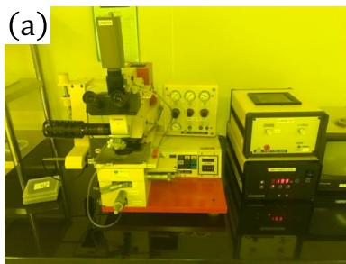

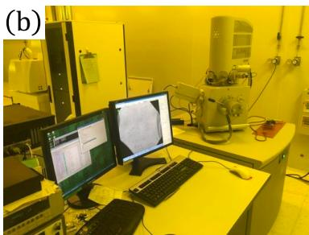

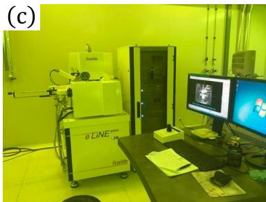  
图2.1 光刻加工设备：(a) SuSS MJB3型紫外光刻机。(b）配备了纳米图形生成系统的扫描电子显微镜 FEI Inspect F50，可以进行电子束曝光。（c）用于电子书曝光的 Raith E-line plus。

## 金属沉积

上面提到了，金属沉积是在已经进行好掩膜的基片上进行金属镀膜，然后采用剥离技术，可以得到特定结构和尺寸的金属电极。我们实验过程中常用的镀膜技术有两种，分别是电子束蒸发镀膜（E-BeamDeposition）[6]和热蒸发镀膜(Thermal Evaporation Deposition）[7]。电子束蒸发镀膜采用的是高能电子束对金属靶材进行轰击加热，将其金属原料直接蒸发至靶材上侧的基片处，完成镀膜过程。这种方式下一般蒸镀的金属有Ti、Au、Pd、AuBe、AuGe。热蒸发镀膜使用电阻丝加热的方式，直接将电流产生的热量传导给金属靶材，使其融化后并蒸发至样品表面，形成金属层。我们一般使用热蒸发镀膜进行金属铝的沉积。

在对基片完成光刻和金属沉积的操作后，还需要进行金属剥离才能完成申极的制作。在实验过程中，使用的光刻胶AZ5214E和电子束胶PMMA都可以被丙酮（ACE）溶解，但处理两种胶需要浸泡的时间有差异，AZ5214E只需要半小时左右可以完成溶解，PMMA则需要数小时才能基本完成溶解。如果实在无法完全剥离残余金属，可以利用超声仪在低功率下进行辅助剥离。

## 2.1.2 原子层沉积 (ALD)

在具体的器件制备过程中，经常需要利用到绝缘层来隔绝不同层之间的金属接触。尤其对于量子点来说，绝缘层的质量对器件特性起到至关重要的作用。常用的作为绝缘层的介质材料有氧化铝 $( \mathrm { A l O _ { x } } )$ ，氧化铪 $\left( \mathrm { { H f O _ { 2 } } } \right)$ 和氮化硅 $\mathrm { ( S i _ { 3 } N _ { 4 } ) }$ 等。本文中涉及的器件使用的绝缘层是氧化铝 $( \mathrm { A l O _ { x } } )$ ，我们以此为例进行介绍。

$\mathrm { { A l O } _ { x } }$ 的沉积是由化学反应过程和物理沉积过程相结合的共同结果[8]。生长过程中的前驱源包括三甲基铝（TMA）和水，在 $1 5 0 ^ { \circ } \mathrm { C }$ 到 $2 5 0 ^ { \circ } \mathrm { C }$ 的温度和0.11torr左右的气压环境中，样品表面的羟基会和TMA结合，同时产生一个甲烷分子，直到表面所有羟基均完成反应，然后再与水反应，形成新的羟基，这样就完成了一层的生长过程。每一层的厚度约为 $\mathrm { 1 \mathring { A } }$ ，所以可以通过控制生长的层数来精确控制绝缘层的厚度。实验过程中一般生长30nm左右厚度的 $\mathrm { { A l O } _ { x } }$ 作为绝缘层使用。

## 2.1.3 氢氟酸刻蚀

在半导体器件的加工过程中，在某些情况下需要对绝缘层进行图形化处理，那么就需要对 $\mathrm { S i O _ { 2 } }$ 进行刻蚀，形成特殊图案。为此，我们会选择稀释过的氢氟酸溶液（RIE）进行湿法刻蚀，该过程需要严格控制时间，以保证完成刻蚀的同时，没有过度腐蚀周围氧化层，保证器件的完整性。

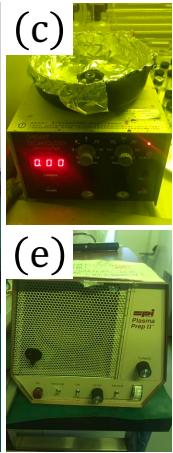

## 2.1.4 退火工艺

在实验的过程中，退火工艺主要起到三个作用：1、形成更好的欧姆接触[9]。2、激活离子注入[10]。3、器件钝化处理[11]，减少缺陷。在制备非掺杂GaAs空穴型器件时，欧姆接触的退火处理在制备过程中必不可少，将退火炉上升到$4 3 0 ^ { \circ } \mathrm { C }$ ，然后快速降温，使得金属渗入到二维空穴气中，完成欧姆接触到制备。对于硅金属氧化物半导体器件来说，完成离子注入到过程后， $1 0 0 0 ^ { \circ } \mathrm { C }$ 左右的快速热退火可以实现离子注入的激活；另外制备得到器件后的低温热退火，可以实现样品的钝化，有效减少其中的缺陷浓度[12]。

## 2.1.5 其他

除了以上加工技术以外，实验过程中还涉及一些的其他处理方式，包括基片的清洗、匀胶、加热以及最后将器件和测量线路连接前的金属键合。下面是这些实验技术中用到的仪器。

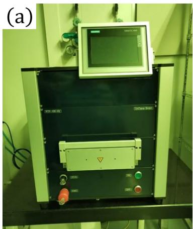

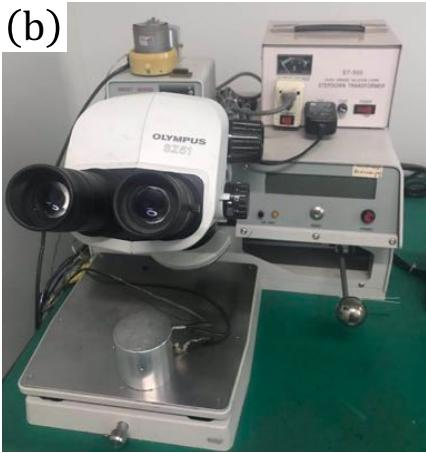

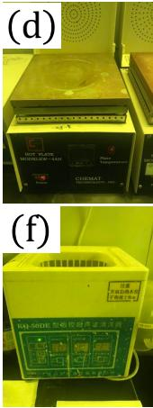  
图2.2 我们实验室使用的其他设备：（a）退火炉。（b）键合机。（c）匀胶机。（d）加热板。（e)等离子清洗机（f) KQ-50DE型超声仪。

## 2.2 低温测量介绍

量子器件的工作环境是比较严苛的，尤其对温度的控制要求比较高。如果温度过高，量子态就会受到热涨落的影响被破坏，丢失相关信息，目前大部分的量子芯片都是在极低温的环境下进行工作的。例如超导比特中的transmon比特，一般工作在30mK以下温度的环境中[13]。相比之下，量子点器件由于其能级差相对更大，抗热噪声性能更优异，近期人们在量子点系统中已经实现了1K下的比特操作[14,15]。在实验过程中，对于同一批完整的样品，首先会进行基本的判定，使用显微镜等观察样品的完整性，然后在液氦中进行测试，之后再针对样品进行后续的研究和探索。

## 2.2.1 4.2 K 测量平台

除了室温的基本外围线路标定外，实验过程中需要将一些样品放在4.2K的液氦中进行初步筛选。以量子点为例，大部分器件在室温下是无法测到其量子特性的，需要在4.2K的温度下，初步判定样品是否能够正常工作，基本性质是否正常等等。

样品在完成金属键合安装在样品底座后，被放置于初测样品杆中。样品杆由外部接口部分、中间线路和样品装载区组成，其中样品装载区主要包括测量杆底部、内部电路板和外部保护套筒（如图2.5（b)）。在具体测试过程中，需要使用50Ω的BNC头连接在外部接口处进行接地处理，防止外部静电使得样品受到不可逆损伤。从室温到低温的转变，是从样品杆从室温开始插入4.2K液氦杜瓦罐的过程中实现的。在这个过程中，需要缓慢的将样品杆插入其中，尽量减少因液氦潜热的影响而导致的氦气挥发，同时降低因快速降温导致的金属连接线断裂的可能性。待样品完全浸入液氦后可以进行之后的测量。

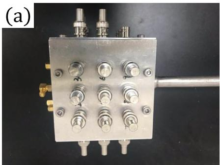

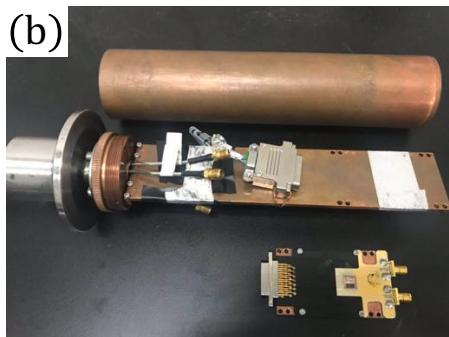  
图2.3自制样品测量杆。（a）外部接口。（b）装载样品的电路板、测量杆底部和外部保护套筒。

初步测量的过程中，一般会用到一至两台Standford的锁相放大器（SR830lockin-in）进行交流信号的测试。如果需要直流信号，会采用Keithley的稳压电源（Keithley 2400 source meter）来提供直流电压。若是需要直接测量直流信号，就选择前置放大器(Standford SR560/570 low-noise current preamplifier) 和万用表（Keithley2015P）进行测试。另外还会需要使用到自制的分压盒（100：1或者1000：1）将电压分压后加载到样品上，这样可以更大程度地扩大扫描电极电压的精细度，同时有效防止突然的静电损伤。在这一步的测量过程中，主要会进行欧姆接触的测试，通过外加交流（一般 $2 0 \mu \mathrm { V }$ 左右）或者直流电压信号（1mV以下)，然后利用lock-in或者2015P读出的电压值进行简单计算，可以得到回路电阻值。检测门电极之间是否互相连通也是十分重要的，由于门电极之间最小尺度在纳米尺度，通过正常的显微镜已经无法观察；并且不同层之间的电极还受到绝缘层的质量影响，所以需要通过直接测量来验证门电极之间的隔绝情况。一般将所有门电极的BNC头拔掉后，将任意两个电极连接到外围回路中，一端输入交流或直流电压，另一端进行信号读取，如果测得电流信号，说明两电极之间发生短路，这样的样品往往是不可用的。下图就是实际的测量的GaAs器件中以绝缘层隔开的两层电极之间的互通情况，电流与外加电压现象表明，电极之间等效的存在一个大电阻。这样的样品往往会产生漏电，工作时会有额外的电流产生，不是我们需要的样品。

在完成样品的初步测试后，将样品从杜瓦罐中取出的过程也需要缓慢进行，防止快速升温对样品的损伤的同时也尽量减少液氦的损失。在完全取出样品杆后，需要使用氮气不间断地吹走周围空气，防止水蒸气凝结于温度较低的器件上，待样品完全到达室温后取出样品，做后续处理。

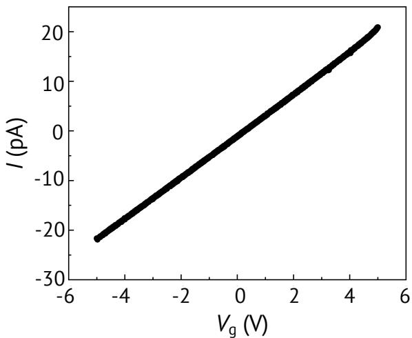  
图2.4 GaAs基片上的漏电流测试。直流电压接顶部栅极，万用表接下层电极，栅极和下层之间由绝缘层隔绝，如果绝缘性质良好，将不会测得电流变化。

## 2.2.2 极低温制冷机

有些量子效应需要在远低于液氦温度（4.2K）的条件下才能被观测到。原则上，越接近绝对零度，样品中的热噪声就越小，性质也就会越好。极低温平台也成了研究量子效应的一个重要手段，另外对于一些特定的实验，给样品提供一定强度的磁场也是必不可少的。为了实现以上的实验环境，极低温的制冷机就显得必不可少。

实验中所用的主要有三种制冷机，它们分别都配备有低温强磁场。第一种是He-3制冷机，最低温度能达到240mK左右，且能够提供8T磁场；第二种是利用液氦提供4.2K环境，进一步利用He-3/He-4稀释制冷将局部温度冷却至10 mK左右，拥有最大16 T 磁场的 top-1oading式He-3/He-4稀释制冷机；最后一种是以多级脉冲管的方式提供4.2K环境代替液氦的无液氦稀释制冷机（干式），最低能够到10mK以下，并且它带有三位矢量磁体，单个方向最大能提供3T的磁场。

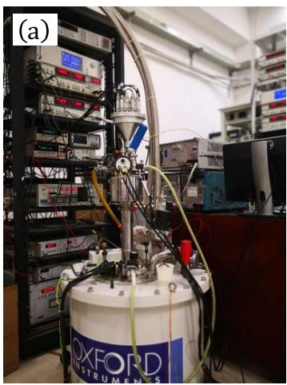

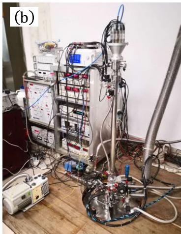

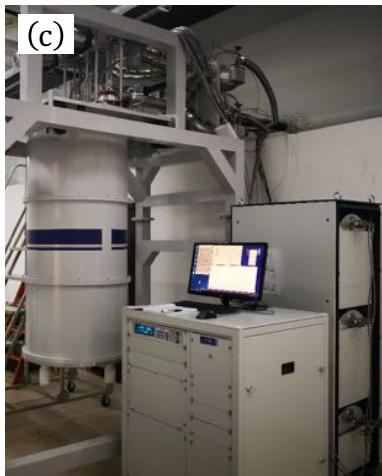  
图 2.5 稀释制冷机（a） He-3稀释制冷机。（b） Top-loading 式 $\mathrm { H e } { - } 3 / \mathrm { H e } { - } 4$ 稀释制冷机。(c)无液氦稀释制冷机。

## 2.2.3 输运测量

量子器件中二维电子（空穴）气的性质对整个器件的性能是至关重要的，在实验过程中，会先制备霍尔棒（Hallbar）来对载流子进行表征，这种制备过程和量子点相比，除了电极图案形状的差别外，基本没有太大的区别。一般比较关注两个参数：载流子的浓度和迁移率。通俗地说，载流子浓度表示的是单位面积内的载流子个数，迁移率表征的是载流子在器件中的定向漂移速度，高迁移率反映了载流子在散射过程中受到的限制较弱，某种程度上代表了杂质缺陷带来的负面效应较小。尤其对量子点器件来说，相同的电子态浓度下，越高的迁移率意味着越好的质量。需要对霍尔棒这种器件进行低温输运测量才能表征出这两个比较重要的参数。霍尔棒的基本结构如图2.8所示，测量时需要按照图中线路进行连接。GaAs和Si-MOS基片制成的霍尔棒都需要使用顶栅极来调制整体的空穴（电子）浓度，此处为了更清楚表现器件的内部结构省去了顶部栅极的示意。

这里以非掺杂型GaAs的空穴霍尔棒的测量为例，介绍测量和表征的基本过程。在将样品降至足够低的温度和连接好线路（先不加 $R _ { \mathrm { s } } )$ 后，首先要测量电路中的传导电流的大小，在这个过程中如果材料本身的性质不够优秀，就基本没办法测得电流。当有电流导通时，由于非掺杂样品的载流子浓度和迁移率受到顶部栅极的极大影响，需要测量不同栅极电压下的电流大小，观测器件的阈值电压和饱和电流等特性。图2.9（a）中，空穴器件在-1V左右的就开始导通，由于空穴的性质，外加的负电压的绝对值越大，导电沟道中载流子数越多，电流的值越大，直到顶栅极电压达到-2.5V时，电流逐渐饱和。在某个外加顶栅电压 $V _ { \mathrm { t } }$ 下，可以得到一个电阻值 $R = I / V _ { \mathrm { s d } }$ ，但是由于线路中电阻和接触电阻的存在，这个值无法很好地表征二维空穴气的电阻特性，因而需要用四端法来有效提取二维空穴气的电阻 $R _ { \mathrm { 2 D H G } }$ 。当回路工作在横流情况（I）时，可以得到空穴气的纵向电阻 $R _ { \mathrm { x x } } = V _ { \mathrm { x x } } / I$ 和横向电阻 $R _ { \mathrm { x y } } = V _ { \mathrm { x y } } / I$ 。为了减少噪声，使用了上面提到的 SR830锁相放大器，工作在17.3Hz左右。由于激励源由lock-in提供，所测得的 $V _ { \mathrm { x x } }$ 和 $V _ { \mathrm { x y } }$ 都拥有相同的频率，就可以完成锁相放大的过程，得到放大后的信号。当固定一个顶栅电压并改变磁场大小时，由于量子霍尔效应的存在，$R _ { \mathrm { x x } }$ 和 $R _ { \mathrm { x y } }$ 都会随磁场发生变化，如图2.9（b）所示。对于被束缚在二维平面内的载流子，有[16]：

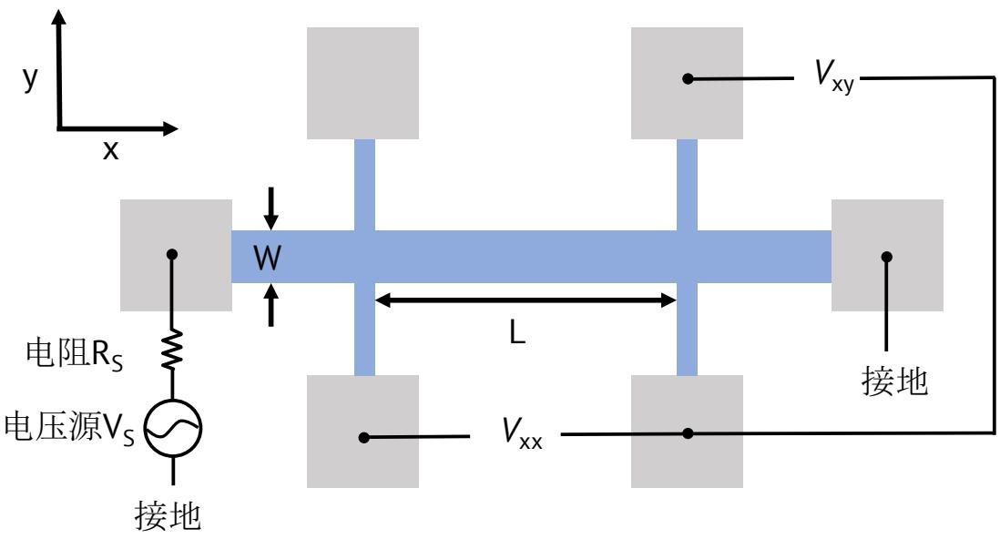  
图2.6 霍尔棒的基本结构和四端法线路连接。线路中x方向的直流是通过在欧姆接触一端添加电压偏置产生的，电压源和欧姆接触连接之间会增加一个10MΩ或者100MΩ的电阻$R _ { \mathrm { s } }$ 来保证电流的稳定性。非掺杂型霍尔棒内部的电阻由顶栅控制，需要保证它远小于 $R _ { \mathrm { s } }$ 这样才能使整个线路基本上工作在恒流状态。需要测量的两个主要参数是x方向的电势差$V _ { \mathrm { x x } }$ 和y方向的电势差 $V _ { \mathrm { x y } }$ 。在测量量子霍尔效应的过程中，会在垂直于器件的z方向外加一个磁场。测量区域的尺寸分别用长度（L）和宽度（W）表示。

(a)  
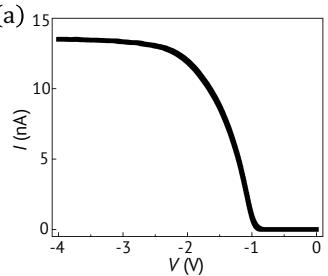

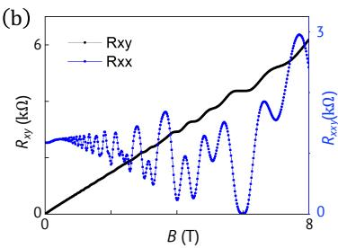

(c)  
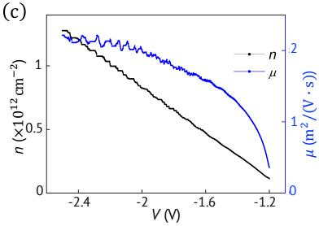  
图2.7 （a）在外加20 $\mu \mathrm { V }$ 交流激励时，不同顶栅电压下回路中的总电流。（b）顶栅电压为-2V时，不同磁场下的纵向电阻 $R _ { \mathrm { x x } } = V _ { \mathrm { x x } } / I$ 和横向电阻 $R _ { \mathrm { x y } } = V _ { \mathrm { x y } } / I$ 。(c) 通过 $R _ { \mathrm { x x } } = V _ { \mathrm { x x } } / I$ 和 $R _ { \mathrm { x y } } = V _ { \mathrm { x y } } / I$ 计算所得的不同顶栅电压下的空穴态浓度和迁移率。

$$
n = \frac { I \cdot \Delta B } { e \cdot \Delta V _ { \mathrm { x y } } }\tag{2.1}
$$

I是恒流下的传导电流，这里设置为100nA。

在图2.9（c）中很好地展示了不同的顶栅电压下载流子浓度n的变化趋势，载流子浓度与顶栅电压之间基本呈现线性依赖关系。利用霍尔棒中传导电流与电场的关系[16]，可知：

$$
I = \frac { n e \mu V _ { \mathrm { x x } } W } { L }\tag{2.2}
$$

将上述公式变形可以得到：

$$
\mu = { \frac { I \cdot L } { n e V _ { \mathrm { { x x } } } \cdot W } }\tag{2.3}
$$

$V _ { \mathrm { x x } }$ 是零磁场下的纵向电势差。通过公式（2.3）和图2.9（b）中数据，可以得到某一个顶栅电压下的迁移率。被制备成二维平面霍尔棒的基片材料一般都可以按照以上方法获得载流子浓度和迁移率这两个重要参数。

## 2.2.4 比特线路

进行比特控制的时候，对环境和线路的要求也是很高的，这里将展示实验中量子点自旋比特线路的连接方式和制冷机内部的具体情况。用于比特控制的外部信号包括直流电压和各种不同频段的波形。直流信号由自制的直流源提供，波形序列由矢量微波源（Keysight E8267D）和任意波形发生器（Keysight M8190）通过微波源内部的 $\mathrm { I / Q }$ 调制提供，得到的高频信号再与方波通过叠加器直接相加。最后，直流信号和所有高频信号一起通过Bias-tee进行耦合叠加进入量子点器件。采集的信号通过直流平均进行读取，从样品欧姆接触一端出来的信号首先通过前置放大器 (Standford SR560/570 low-noise current preamplifier) 进行放大，之后再由可编程控制的万用表（Keithley2015P）接收电压信号，最后由计算机将获取信号转化为电流信号。

## 2.2.5 I/Q 混频技术

I/Q混频技术就是通过I/Q混频器实现上变频或者下变频。对于一个理想的 $\mathrm { I / Q }$ 混频器，它是一个由两个混频器，两个功分器和一个移相器共同构成的四端口器件。内部的构造如图2.11所示，器件与外界通过LO端，Ⅰ端，Q端和RF端连接。当一个连续波输入LO端时，它被功分器分为完全相同的两路信号，其中一路连接添加了一个90度移相器，从而产生了正交的 $\mathrm { L O _ { 1 } }$ 和 $\mathrm { L O _ { 2 } }$ 两路信号。这两路信号分别被加入到两个完全相同的混频器的LO端，同时这两个混频器的IF端作为I端和Q端输入与 $\mathrm { L O _ { 1 } }$ 和 $\mathrm { L O _ { 2 } }$ 进行混频（这里I/Q端信号称之为“基带”信号），混频后的信号通过功分器进行叠加后从RF端输出。理想情况下，RF的输出是一个不带相位偏移（两个混频器输出的信号之间不引入额外相位），以LO端信号为载波的调制信号。

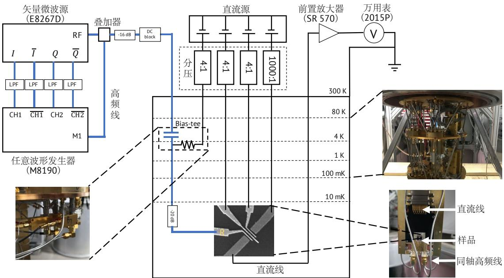  
图2.8 量子比特线路连接以及无液氦稀释制冷机内部主要器件。

在某些情况下，为了产生带有双边带信号的调制信号，需要在Ⅰ端添加基带信号，Q端不进行输入（或者Ⅰ和Q端信号互换），假设的四个输入端分别是$\mathrm { L O _ { 1 } } = \sin ( \omega _ { \mathrm { c } } \mathrm { t } ) , \ \mathrm { L O _ { 2 } } = \cos ( \omega _ { \mathrm { c } } \mathrm { t } ) , \ \mathrm { I } = \mathrm { A s i n } ( \omega _ { \mathrm { m } } \mathrm { t } )$ 和 $\mathrm { Q } = 0$ ，在叠加过程中考虑理想情况（线形叠加），那么 $\begin{array} { r } { \mathrm { R F } _ { 1 } = \sin ( \omega _ { \mathrm { c } } \mathrm { t } ) \cdot \mathrm { A s i n } ( \omega _ { \mathrm { m } } \mathrm { t } ) = \frac { \mathrm { A } } { 2 } \cdot \cos ( ( \omega _ { \mathrm { c } } - \omega _ { \mathrm { m } } ) \mathrm { t } ) - \frac { \mathrm { A } } { 2 } } \end{array}$ $\cos ( ( \omega _ { \mathrm { c } } + \omega _ { \mathrm { m } } ) \mathrm { t } )$ $\mathrm { R F _ { 2 } } = \cos ( \omega _ { \mathrm { c } } \mathrm { t } ) \cdot 0 = 0$ ，最终的输出

$$
\mathrm { R F } = \mathrm { R F } _ { 1 } + \mathrm { R F } _ { 2 } = \frac { \mathrm { A } } { 2 } \cdot \cos ( ( \omega _ { \mathrm { c } } - \omega _ { \mathrm { m } } ) \mathrm { t } ) - \frac { \mathrm { A } } { 2 } \cdot \cos ( ( \omega _ { \mathrm { c } } + \omega _ { \mathrm { m } } ) \mathrm { t } ) ,\tag{2.4}
$$

这样完成了具有 $\omega _ { c } - \omega _ { m }$ 和 $\omega _ { c } + \omega _ { m }$ 两个频率边带的调制信号输出。

假如需要的RF输出端只有一个单边带信号，那么这里对I和Q端的输入信号就有另外的要求，即Ⅰ和Q端的输入必须也存在90度的相位差，这里以上变频为例（下变频只需要将Ⅰ端和Q端输入信号互换)，假设 $\mathrm { L O _ { 1 } } = \sin ( \omega _ { \mathrm { c } } \mathrm { t } ) , \ \mathrm { L O _ { 2 } } =$ $\cos ( \omega _ { \mathrm { c } } \mathrm { t } ) , \mathrm { ~ I = A c o s } ( \omega _ { \mathrm { m } } \mathrm { t } ) , \mathrm { Q = A s i n } ( \omega _ { \mathrm { m } } \mathrm { t } )$ ，那么 $\mathrm { R F _ { 1 } } = \sin ( \omega _ { \mathrm { c } } \mathrm { t } ) \cdot \mathrm { A c o s } ( \omega _ { \mathrm { m } } \mathrm { t } ) =$

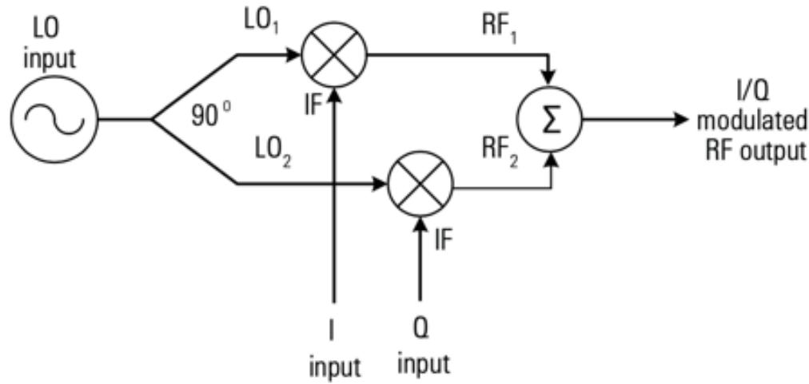  
图 2.9 四端口 I/Q 混频器原理图

$$
\begin{array} { r l } & { \frac { \Delta } { 2 } \cdot \sin ( ( \omega _ { \mathrm { c } } + \omega _ { \mathrm { m } } ) \mathrm { t } ) + \frac { \Delta } { 2 } \cdot \sin ( ( \omega _ { \mathrm { c } } - \omega _ { \mathrm { m } } ) \mathrm { t } ) , ~ \mathrm { R F } _ { 2 } = \cos ( \omega _ { \mathrm { c } } \mathrm { t } ) \cdot \mathrm { A s i n } ( \omega _ { \mathrm { m } } \mathrm { t } ) = \frac { \Delta } { 2 } \cdot \sin ( ( \omega _ { \mathrm { c } } + \omega _ { \mathrm { m } } ) \mathrm { t } ) , } \\ & { \omega _ { \mathrm { m } } ) \mathrm { t } ) - \frac { \Delta } { 2 } \cdot \sin ( ( \omega _ { \mathrm { c } } - \omega _ { \mathrm { m } } ) \mathrm { t } ) , ~ \frac { \sqrt { \omega } } { \mathrm { H K } } \frac { \mathrm { t } } { 2 \mathrm { H K } } \frac { \mathrm { t } } { \mathrm { H K } } \frac { \mathrm { t } } { 2 \mathrm { H K } } \frac { \mathrm { t } } { \mathrm { H K } } \frac { \mathrm { t } } { 2 \mathrm { H K } } \frac { \mathrm { t } + \mathrm { t } } { 2 \mathrm { H K } } \mathrm { . } } \end{array}
$$

$$
\mathrm { R F } = \mathrm { R F _ { 1 } } + \mathrm { R F _ { 2 } } = \mathrm { A } \cdot \sin ( ( \omega _ { \mathrm { c } } + \omega _ { \mathrm { m } } ) \mathrm { t } )\tag{2.5}
$$

可以实现只具有 $\omega _ { c } + \omega _ { m }$ 这一个频率单边带调制信号输出。这也是在比特操作过程中使用的方案。

上面说到以上过程考虑的是理想情况，但实际情况并不是这样，两路LO信号之间往往并不正交（由移相器，或者两个混频器工作状态不一样等原因导致)，这里会带来一个不想要的镜像信号。具体如下(下变频为例):假设 $\mathrm { L O } _ { 1 } = \sin ( \omega _ { \mathrm { c } } \mathrm { t } )$ $\mathrm { L O _ { 2 } } = \sin ( \omega _ { \mathrm { c } } \mathrm { t } + \alpha ) , \mathrm { I } = \mathrm { A s i n } ( \omega _ { \mathrm { m } } \mathrm { t } ) , \mathrm { Q } = \mathrm { A c o s } ( \omega _ { \mathrm { m } } \mathrm { t } )$ ，那么最终结果

$$
\begin{array} { r } { \mathrm { R F } = \mathrm { R F } _ { 1 } + \mathrm { R F } _ { 2 } = \mathrm { A c o s } ( \frac { \alpha } { 2 } ) \mathrm { c o s } ( ( \omega _ { \mathrm { c } } - \omega _ { \mathrm { m } } ) \mathrm { t } - \frac { \alpha } { 2 } ) } \\ { - \mathrm { A s i n } ( \frac { \alpha } { 2 } ) \mathrm { s i n } ( ( \omega _ { \mathrm { c } } + \omega _ { \mathrm { m } } ) \mathrm { t } + \frac { \alpha } { 2 } ) } \end{array}\tag{2.6}
$$

这样的结果中存在的 $\omega _ { c } + \omega _ { m }$ 这一支信号往往不是想要的，所以在实际情况下，要通过调节Ⅰ和Q路的输入信号的相位差来抵消α带来的影响。同理，输入的I和Q端的幅值信号A往往也是不一致的，也需要进行校正。

## 2.2.6 操控比特的脉冲波形实现和优化

实验过程中需要控制仪器的包括有：直流电压源、矢量微波源、任意波形发生器、锁相放大器以及一些其他有源器件。为了实现完整的自动化过程，使用计算机中的代码进行控制，实现对磁场，电压，波形等一系列变量的控制。这里介绍利用Matlab进行波形文件的生成后如何通过I/Q调制的方法改变波形中的相关信息以及如何从时域和频域优化适合比特操作的波形。

AWG中导入的波形文件是由代码编写后生成text文档来的实现。实验过程中，AWG的 channel1和 channel2的正负端分别生成差分混频的IIQQ四路信号，同时也利用了AWG中marker生成的方波作为后续的脉冲信号。波形生产过程中主要涉及的参数有AWG使用的采样频率，波形长度，周期信号的频率，不同通道之间的相位等。主要通过参数的修改生成不同的波形文件，然后通过仪器更改输入的波形文件最后获取不同量子操作对应的量子态结果。

在实际过程中，即使选择好合适的采样频率，微波源输出了正确的波形，但由于I/Q调制和仪器本身的一些匹配问题，波形往往会发生一些畸变，这种效果会对比特的量子态控制产生极大的影响，最直接的结果是对比特进行长时间的热激发，量子信号完全被热噪声给掩盖。这里不再赘述I/Q调制的原理，直接介绍如何将微波源和任意波形发生器进行调制后的波形通过示波器和频谱仪分别进行时域和频域的波形优化。

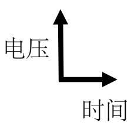

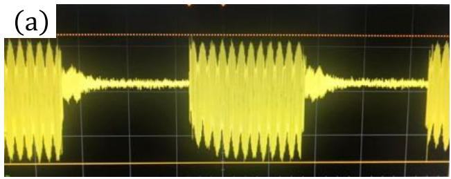

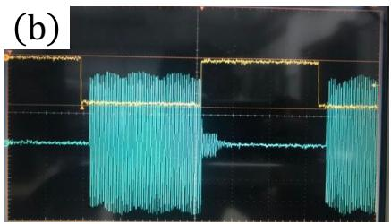

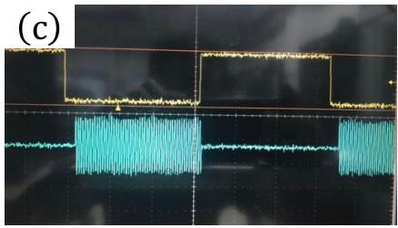  
图2.10 混频后的时域信号（a）直接混频，不进行任何参数优化时结果。（b）进行IQ本征泄漏压制后的信号。（c）在各个连接处添加3dB的衰减器后结果。

在波形初步设计完成后，可以将输出的波形直接连接到示波器中，如果参数设定比较合理，会得到如图2.12（a）所示的情况，可以看到生成的微波信号前部和尾部的幅值不一致。这主要是几个原因导致的，一个是线路中的阻抗不匹配，一个是微波时间太短导致仪器的反馈输出出现问题，最后一个是I/Q调制过程中的泄漏（从输入端直接到达输出端的信号）。针对这三种情况分别需要做不同的处理。阻抗不匹配时，可以在不影响输入功率的前提下，适量在连接处添加衰减器，尽量使阻抗接近50Ω的阻抗匹配。在矢量微波源输出信号时，由于仪器默认开启，使用时需要关闭E8267D的ALC电平自动控制功能来避免第二种情况的发生。最后I/Q调制的本征泄漏情况（LO端信号直接从RF端输出）则主要是通过调整输入混频器的直流偏移来优化，通过频谱仪在频率域完成这个步骤。最后波形优化后的情况如图2.12（c）。

另外需要注意的是，时域上的方波与微波信号的时间差需要根据实际线路进行调整，这是因为不同长度的连接线和器件都会影响波形到达样品端的传播时间（纳秒级的时序影响十分明显），所以测试过程中线路的连接需要和最终到达样品端的波形线路一致才能不影响脉冲和微波之间的时序差。

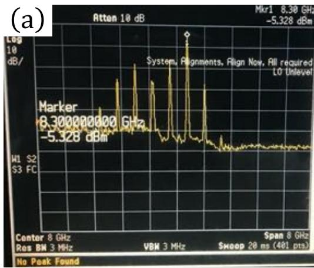

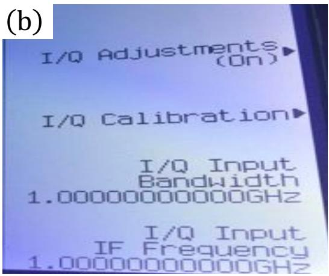

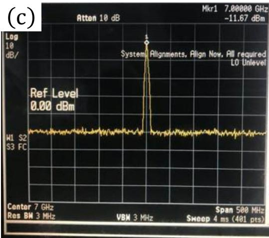

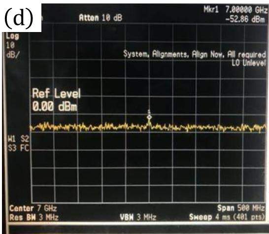  
图2.11 混频后的频域信号(a)直接混频后出现了多个边带。中心频率为7GHz，进行1GHz的上变频，希望只保留8GHz处信号。（b）本征信号在进行优化调控前的情况。（c）完成本征泄漏抑制的信号。达到了40dB以上的抑制。

频率域的优化有助于最大程度地降低波形边带带来的热激发，保证比特的相干特性。通过I/Q调制后的一般频率信号如图2.13（a)，I/Q调制后的信号明显能看到多个频率的信号峰，这些信号除了一支与比特频率对应的频率信号外，其他信号在操作比特过程中都是于扰信号，需要将其最大程度的进行压制。调节过程中，要对AWG输出的幅值和通道中信号的延时进行调节，而影响I/Q调制的信号泄漏并不在AWG上进行，通过E8267D内部的混频参数进行调节，具体模块如图2.13（b）所示。在7GHz位置边带压制信号（保留上变频信号）为例，原始信号功率达到了-11.67dBm。经过对以上参数的精细调节，最后压制到了-52dBm以下。这样的效果可以有效降低7GHz处的微波信号产生的热效应。由于各个优化参数会随着频率变化，当较大范围调节频率时，参数优化就需要重新进行。

## 2.3 本章小结

本章首先阐述了制备样品所涉及的微纳加工工艺原理，然后介绍了低温测量的原理和平台，之后分析了比特实验中涉及的线路搭建，最后说明了具体实现相关操作的实验方法。后面的章节中，将介绍利用以上的技术展开的研究和获得的成果。

## 参考文献

[1] Stepanova M, Dew S. Nanofabrication: techniques and principles. Springer Science & Business Media, 2011.

[2] Song T, Kim H, Rim W, et al. 12.2 A 7nm FinFET SRAM macro using EUV lithography for peripheral repair analysis. Proceedings of 2017 IEEE International Solid-State Circuits Conference (ISSCC). IEEE, 2017. 208–209.

[3] Wu B, Kumar A. Extreme ultraviolet lithography: A review. Journal of Vacuum Science & Technology B: Microelectronics and Nanometer Structures Processing, Measurement, and Phenomena, 2007, 25(6):1743–1761.

[4] Vieu C, Carcenac F, Pepin A, et al. Electron beam lithography: resolution limits and applications. Applied Surface Science, 2000, 164(1-4):111–117.

[5] Kim J S, Tyryshkin A M, Lyon S A. Annealing shallow Si/SiO2 interface traps in electronbeam irradiated high-mobility metal-oxide-silicon transistors. Applied Physics Letters, 2017, 110(12):123505.

[6] Utke I, Hoffmann P, Dwir B, et al. Focused electron beam induced deposition of gold. Journal of Vacuum Science & Technology B: Microelectronics and Nanometer Structures Processing, Measurement, and Phenomena, 2000, 18(6):3168–3171.

[7] Huang L, Yang S, Li T, et al. Preparation of large-scale cupric oxide nanowires by thermal evaporation method. Journal of Crystal Growth, 2004, 260(1-2):130–135.

[8] Kang M H, Ok Y W, Rohatgi A. Investigation of Atomic Layer Deposition $\mathrm { { A l } _ { 2 } \mathrm { { O } _ { 3 } } }$ Passivation for Screen-Printed Large-Area Solar Cells. IEEE Journal of Photovoltaics, 2016, 6(4):869– 874.

[9] Chen Z, Qin Z, Hu C, et al. Ohmic contact formation of Ti/Al/Ni/Au to n-GaN by two-step annealing method. Materials Science and Engineering: B, 2004, 111(1):36–39.

[10] Chui C O, Gopalakrishnan K, Griffin P B, et al. Activation and diffusion studies of ionimplanted p and n dopants in germanium. Applied physics letters, 2003, 83(16):3275–3277.

[11] Spruijtenburg P C, Amitonov S V, Mueller F, et al. Passivation and characterization of charge defects in ambipolar silicon quantum dots. Scientific Reports, 2016, 6:38127.

[12] Eng K, McFarland R N, Kane B. Integer quantum Hall effect on a six-valley hydrogenpassivated silicon (111) surface. Physical Review Letters, 2007, 99(1):016801.

[13] Koch J, Terri M Y, Gambetta J, et al. Charge-insensitive qubit design derived from the Cooper

pair box. Physical Review A, 2007, 76(4):042319.

[14] Yang C H, Leon R, Hwang J, et al. Operation of a silicon quantum processor unit cell above one kelvin. Nature, 2020, 580(7803):350–354.

[15] Petit L, Eenink H, Russ M, et al. Universal quantum logic in hot silicon qubits. Nature, 2020, 580(7803):355-359.

[16] Datta S. Electronic transport in mesoscopic systems. Cambridge University Press, 1997.

## 第3章 非掺杂型砷化镓空穴型量子器件

使用量子点中的自旋来进行比特编码的这种方案，早期的研究对象主要是高迁移率的砷化镓材料。Petta等人在2005年首先在电子型的砷化镓中完成了自旋单态和三态的单比特编码[1]。[2-5]至今为止该体系中的相关研究仍在发展过程中。为了更好的探索各种基于不同体系编码量子比特的潜在可能性，基于砷化镓的栅极结构型的掺杂和非掺杂型量子点都被进行了广泛的研究。量子态的相于时间作为衡量一个比特好坏的重要标准之一，它在掺杂和非掺杂的砷化镓电子型量子点中的表现不是很优异，退相于时间只有30ns[6]。相比与GaAs电子系统，GaAs重空穴系统的自旋为，单电子处于s轨道，受到核自旋的影响更弱，可以具有更长的退相于时间。再加上这种体系中具有很强的自旋轨道耦合效应，这种特性使得它有望被利用来完成自旋控制。综合这些因素，GaAs重空穴量子点成为了人们的重点关注的量子点体系之一。另外，异质结中掺杂层的电荷涨落和门电极的漏电流影响会很大程度上增加电荷噪声，最终影响量子比特系统的相干时间。为了减少甚至消除这些影响，非掺杂型空穴砷化镓量子点系统成了研究者们探索的目标之一[7,8]，这种体系为制备具有更低噪声、更长相于时间的比特系统提供了一条值得探索的道路。在该体系中，电荷与声子相互作用也会对量子态的相干性产生影响，缩短相干时间[9]。尤其是在砷化镓空穴型量子点中，这方面的研究还是空白，因而针对这一重要的效应，我们做出了相关的研究和探索。

本章介绍使用自己研制开发的双层门电极结构[10]制备的非掺杂的空穴型砷化镓双量子点器件。并且设计和完成了三种不同的双量子点结构（都配有QPC电荷感应通道作为探测器）。之后，通过低温下的直流输运测量，我们发现这三种器件都能很好地表现出双量子点特有的“蜂窝图”特性，并且在结构优化后，电荷感应技术也可以在量子点中得到实现。接着，我们利用直流输运测量获得“偏压三角形”的相关信息，再改变磁场验证了该系统下存在的强自旋轨道耦合效应。最后，我们使用电荷感应技术探测到了空穴和声子相互作用产生的相于振荡效应，并且提取了该体系中能够被量子点吸收或者释放的声子能量 $\delta = 1 4 0 \mu \mathrm { e V }$ 利用理论模型进行验证，计算所得的量子点距离与设计基本符合，保证了我们模型和数据的自洽性。

## 3.1 样品结构和制备过程

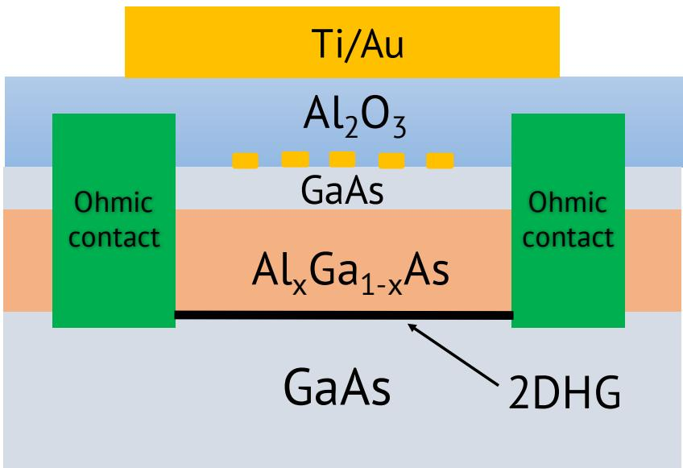  
图3.1 空穴型砷化镓的双量子点截面示意图

非掺杂的砷化镓空穴型量子点的制备沿用我们实验组在电子型量子点上的双层电极设计（图3.1)。双层电极包括顶部大栅极和绝缘层与异质结之间的内部小电极。大电极用来调整整体的费米面，主要控制沟道电流的开关，形成二维空穴气（2DHG）。小电极用于精细调节量子点的行为，我们设计的三种不同结构区别就在于这层小电极，如图3.2（a）～（c)。相比于电子型砷化镓量子点，在设计量子点小电极时，空穴型砷化镓量子点和它主要存在两点差异：空穴型器件由于是价带导电，所以用于形成二维空穴气的欧姆接触需要改用AuBe来代替AuGe这种电子型器件中所使用的合金；另外重要的一点在于砷化镓中空穴的有效质量 $\left( 0 . 4 5 m _ { 0 } \right)$ 远大于电子的有效质量 $\left( 0 . 0 6 7 m _ { 0 } \right)$ ，根据 $\begin{array} { r } { L \propto \frac { 1 } { \sqrt { m ^ { \star } } } } \end{array}$ (L： 量子点的尺寸宽度， $m ^ { \star }$ ：载流子有效质量)，为了得到相同能级差，我们所设计的空穴器件的尺寸要比电子型结构要缩小接近三倍，这时候量子点周围电极大小的设计已经快接近我们纳米加工仪器精度极限了 $( 2 0 \sim 3 0 \mathrm { n m } )$ ，这种要求在电子束曝光仪器不稳定时是致命的，所以这种器件的加工过程具有一定难度。下面简单介绍加工流程：

1.欧姆接触的制备。我们先使用试剂将样品清洗干净（依次为ACE、TCE、IPA、DI)，然后进行甩胶（500rpm转速持续3 s和4000rpm转速持续40 s）烘烤$( 9 5 ^ { \circ } \mathrm { C } , \ 9 0 \mathrm { s } )$ ，在基片上完成紫外光刻和显影步骤，形成欧姆接触的窗口。然后进行120nm左右厚度的AuBe合金的蒸镀（速率为 $1 { - } 2 \stackrel { \circ } { \mathrm { A } } / { \mathrm { s } } )$ 以及金属剥离（ACE浸泡20min）。AuBe合金本身无法很好的扩散进入二维空穴气形成所需要的位置深度，所以需要进行退火加工来完成欧姆接触的制备。我们采用 $4 3 0 ^ { \circ } \mathrm { C }$ 进行连续30min的加热和后续的降温处理。原则上更高温度、更长时间的加热有利于金属的渗透，但是加热过程中金属会产生鼓包，这种鼓包会严重影响我们器件的绝缘性，所以如何有效将金属渗透入合适深度同时又不至于破坏绝缘性成了影响器件的重要因素之一。

2.外围小电极的制备。类似于欧姆接触制备，完成清洗、甩胶和烘烤后，再次进行紫外光刻和显影，通过显微镜检查曝光图案是否与光刻板设计图案一致，没有问题后进行大电极的金属镀膜。这里选择Ti（速率 $\mathrm { 1 \mathring { A } / s } )$ 和Au（速率 $2 \mathring { \mathrm { A } } / \mathrm { s } \big )$ Ti的选择是为了保证Au能够更好的粘在样品表面， $5 \sim 1 0 \mathrm { n m }$ 的厚度即可，作为导电的主体的Au的厚度我们选取为45～70nm。最后进行和欧姆接触类似的金属剥离即可。

3.内部纳米尺度的小电极制备。这一步是真正决定量子点结构大小和形状的，主要通过电子束光刻机中的图案设计和曝光来完成。涂上电子束胶后进行烘烤，然后点镍粉用于电子束光刻（EBL）的定位和对焦，调整合适的曝光参数进行曝光，再进行显影（MIBK:IPA=1：3，60s；IPA，15s)，然后进行金属镀膜$( \mathrm { T i } / \mathrm { A u } , ~ 4 / 4 5 \mathrm { n m } )$ ，最后金属剥离。

4.绝缘层氧化铝的生长。这一步的目的是保证所有电极都被绝缘层覆盖在下面与顶部大栅极完全隔离。由于涉及化学生长，对基片表面洁净度要求比较高，所以要进行两次重复清洗（TCE、ACE、IPA、DI)。然后放置于ALD中在$1 5 0 ^ { \circ } \mathrm { C }$ 生长 $8 0 - 1 0 0 \mathrm { n m }$

5.顶部栅极的制备。这一层结构位于绝缘层上方，需要进行清洗，甩胶，烘烤，光刻，显影，镀膜和剥离等步骤。

完成的样品进行切割封装、金属线键合后就可以进行测量筛选，暂时不用的样品需要保存于干燥柜中。

## 3.2 非掺杂型砷化镓空穴双量子点器件

我们知道体材料中价带内的轻空穴和重空穴的能级是简并的，但是在二维平面结构中，重空穴带和轻空穴带存在着能量差，虽然存在一定的相互耦合，但由于二维平面器件的z方向的束缚，重空穴与轻空穴能带会发生劈裂，所以我们在这里所有沟道内导电的载流子都可以认为是重空穴。但是重空穴因为有效质量的原因调控起来也会相对困难，为此，我们设计了三种不同的双量子点电极结构，按照第二章的输运测量方式对三种样品进行了低温表征，对比双量子形成和调制的效果。

在图3.2中展示了三种不同的内部小电极结构，将每种器件按照量子点输运测量方式读取信号，当我们在顶部栅极上加合适负电压形成二维空穴气后，可以通过小电极上添加的电压在空穴气中形成束缚势，最终形成量子点。左右两个量子点之间以及它们与源漏之间的势垒大小都可以通过电极电压来控制，改变这些电极中的L和R电极上的电压可以调制左右量子点内能级，读取电流信号可以得到相应的“蜂窝图”。从图3.2（d)、（e）和（f）中，我们可以发现每个器件的电流信号都呈现出两套斜率的电流峰，展现了双量子点的标准电学特性-“蜂窝图”。这证明我们设计的三种结构原则上都是可行的。但经过比较不难发现，图3.2（f)的信号更规则，电流变化也更缓慢，这意味着这种结构形成的量子点可以更好地被电极电压调制。因此，在这三种器件中，我们最终选择了图3.2（c）的结构进行后续的研究。

(a)  
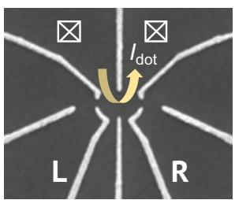

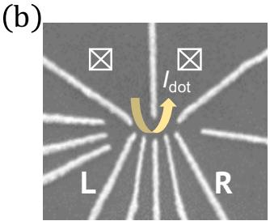

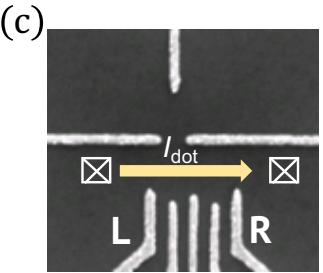

(d)  
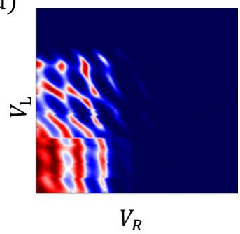

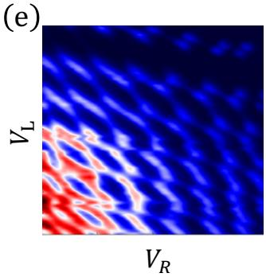

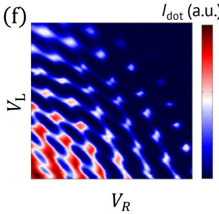  
图3.2 （a）～（c）三种不同电极结构量子点的扫描电子显微镜图片。（d）～（f)三种结构对应的电荷稳态图。结构中 $I _ { \mathrm { d o t } }$ 表示量子点中的电流导通沟道。白色带叉方块代表欧姆接触。

## 3.3 非掺杂型砷化镓空穴双量子点中的强自旋轨道耦合效应

自旋轨道耦合效应在固体体系中是一个非常重要的分支，涉及了各个方面。对于自旋量子比特来说，自旋轨道耦合作用可以用来实现全电的自旋控制。因而，关于空穴型双量子点中的自旋轨道效应的探索也显得十分重要。我们从图3.2(f) 中已经得到了双量子点的部分信息，要验证我们体系中存在自旋轨道效应，需要采用直流的方式获取“偏压三角形”并利用它来提取相关信息。具体地，当我们采取直流信号时，每一个蜂窝图中的交叉位置都会形成如图3.3（a）的三角形。然后沿着图中黄线位置改变电压来改变失谐量（ε），电流信号发生变化。

然后再改变平行于样品平面的外部磁场（B），可以得到图3.3（b）的信号。结果显示电流的有效信号与ε和B都有一定的依赖关系。一般为了避免高阶激发态带来的影响，我们会选择失谐量为零处的基态信号（图3.3（b）白色虚线处）。然后将提取的直流传导电流随磁场的变化描绘在图3.3（c）中。最后，我们将这部分数据进行理论公式拟合，发现它很好地满足了自旋阻塞效应中的漏电流机制[11]。从结果中我们可以看到电流信号在磁场大小为±500mT处才趋于平缓。在另一种具有强自旋轨道耦合的锗硅纳米线体系中[12]，这种效应在±1T也满足这样的拟合公公式，从漏电流的角度来说，这两种体系的自旋轨道耦合强度可能较为接近。这里我们证明了我们的体系拥有接近于锗硅纳米线的自旋轨道耦合强度，但是还未进行定量表征，后续的研究还值得进一步探索。

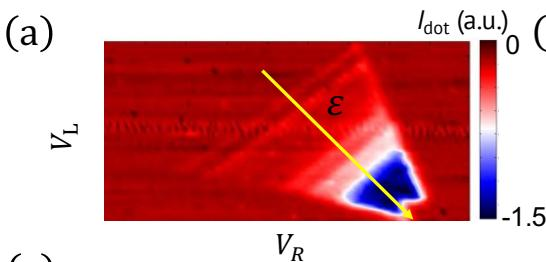

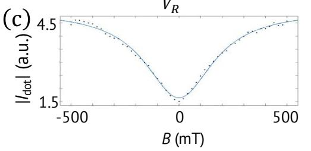

(b)  
  
B (mT)  
图3.3 （a）偏压三角形。（b）不同失谐量和磁场下电流信号。（c）从（b）图中虚线提取的数据以及自旋轨道效应引起漏电流随磁场的变化关系，拟合公式为 $\begin{array} { r } { I = I _ { \mathrm { m a x } } \left( 1 - \frac { 8 B _ { c } ^ { 2 } } { 9 ( B ^ { 2 } + B _ { c } ^ { 2 } ) } \right) } \end{array}$ 引用于[11]。

## 3.4 非掺杂型砷化镓空穴双量子点中的空穴与声子相互作用

在凝聚态系统中晶格振动是普遍存在的。如果把这种振动进行量子化，那就是我们所说的声子。探测声子的相关信息一般是通过声子参与的相关辐射效应来进行测量，例如使用拉曼散射来测量声子态密度[13]。在量子点体系中，由于轨道分立能级的存在，并且双量子点的电控性非常优越，可以有效调制量子点中的能级，这非常有利于探索电荷吸收或放出声子发生的跃迁情况，当电荷吸收或放出声子能量时会发生非弹性隧穿，这种效应就可以用来测量电荷与声子之间的相互作用。下面我们介绍采用砷化镓空穴型双量子点来探测体系中声子的具体结果。

(a)  

  
图3.4（a）空穴型GaAs双量子点结构。（b）使用电荷感应技术得到的电荷稳态图。测量的是 QPC通道中电流 $I _ { \mathrm { Q P C } }$ 的微分电导 $\mathrm { d } I _ { \mathrm { Q P C } } / \mathrm { d } V _ { 6 }$ ，此时交流激励添加在G6上，白色带叉方块代表欧姆接触。

在使用电荷感应技术时，我们需要在顶栅上添加了-2.4V的直流电压来积累二维空穴气，然后调节G2\~G8这七个电极上的电压来束缚出一个双量子点。按照设计，左右量子点形成的位置大约位于G4和G6上方，位置会因为各个电极上电压的改变有微小的移动。G5可以控制两个量子点之间的耦合强度，G2和G8在形成量子点的同时，与G1一同形成了QPC通道，我们用G1来控制QPC的工作状态。器件工作在QPC的调制状态时，我们在电极G6上加在 $5 0 \mu \mathrm { V }$ 右的交流调制信号（1ockin的交流输出端提供），然后将lockin的接收端连接到G8上侧的欧姆接触上，同时为了保证QPC的工作区域，会在G2上侧的欧姆接触上添加直流电压偏置（1～2mV）。当外加电压调节到合适情况下，我们扫描电极G3/G7或者G4/G6的时候，都可以得到很好的双量子点相图，区别在于G3/G7对量子点的电子调节作用更显著，对于电子与源漏之间的耦合调节也更强烈。如果需要更缓慢地调节量子点的能级，我们一般采取扫描G4/G6的方法。图3.4（b）展示了器件使用电荷感应技术测定的双量子行为，并且从数据图中可以看出电压更正的区域已经没有信号，表明空穴数已经基本排空，这对后续研究有重要意义。

当量子点两侧未被添加任何直流偏置的时候，我们可以得到较为于净的“蜂窝图”。此时源漏能级相互平行，电子自由跳跃过程中，共隧穿占主导作用。但是当源漏处外加直流偏置（1～2mV）时，我们发现“蜂窝图”产生了明显的变化，如图3.5（a）所示。从右上角的放大图可以发现，出现了类似于直流输运测量过程中的偏压三角形，并在其中可观测到平行的条纹状信号。我们将其中信号沿着变化的失谐量 $( \bigtriangleup \varepsilon )$ 增加的方向提取这些条纹状信号。如图3.5（b）所示，得到的是间距基本相等振荡信号，周期为 $\delta = 1 4 0 \mu \mathrm { e V }$ 。在量子点中，如果电流信号出现变化，一般对应着电荷的跳跃。对于这个振荡信号，我们首先可以排除申子激发态占据产生的影响（由于电子高阶激发态之间能级差往往不同，条纹间隔不应该一致)。自然地，这让我们联想到了以声子为媒介的非弹性隧穿，这种物理现象发生时，由于能级差固定，电荷不断吸收声子提供的能量，发生受激辐射，或者电荷不断放出声子发生自发辐射。这种辐射过程由于能级差固定，需要的声子能量保持不变，因而量子点在 $\bigtriangleup \varepsilon$ 调节过程中始终能够发生辐射，形成周期性信号。为了探索这是量子点内部声子的行为还是QPC中声子的行为，我们分别对量子点的源漏偏置（图3.6（c)）和QPC的源漏偏置（图3.6（e)）进行了改变，测量振荡峰位置的偏移量，结果发现，只有量子点上的偏置能够影响最外围条纹与中心位置的距离，且偏置的大小对这种距离调制呈线性。这说明量子点中发生这种相于振荡需要的能量是由量子点源漏能级差产生的声子提供的，排除QPC通道中声子的影响。

(b)  
  
图3.5（a）空穴型砷化镓双量子点结构。（b）在量子点上添加源漏偏置后的电荷稳态图。

为了更好地理解这个现象，我们对这个非弹性隧穿的过程建立一个模型，并且假设非弹性隧穿所需要的能量由声子提供。在砷化镓中声子和电荷之间的这种耦合作用一般是由于形变势耦合引起的。在一个双量子点中，我们可以将一个电荷占据左侧量子点位置的状态视为L〉态，占据右侧量子点位置的状态视为|R〉态。那么可以得到 $\left| \psi _ { + } \right. = c _ { L } \left| L \right. + c _ { R } \left| R \right.$ 和 $\left| { \psi _ { - } } \right. = { c _ { R } } \left| { L } \right. - { c _ { L } } \left| { R } \right.$ 这两个系统本征态，其中 $c _ { L }$ 和 $c _ { R }$ 满足 $| c _ { L } | ^ { 2 } + | c _ { R } | ^ { 2 } = 1$ 。由于吸收或者放出特定的声子能量，电荷可以在这两个态之间发生转化。转化过程可以通过跃迁矩阵元$M = \left. \psi _ { + } \right| e ^ { i \mathbf { q } r } \left| \psi _ { - } \right.$ 描述[14-16]，其中q代表声子的准动量，r代表位矢。那么

(c)  

(e)  
  
图3.6 分别改变量子点源漏偏压和QPC源漏偏压对应的稳态图变化。（a）源漏偏置为-2mV，QPC偏执为0.5mV。（b）源漏偏置为2mV，QPC偏执为0.5 mV。（c）最大失谐量与量子点源漏电压关系。（d）源漏偏置为2mV，QPC偏执为1mV。（e）最大失谐量与QPC偏置关系。

根据费米黄金定则跃迁概率可以写成：

$$
\Gamma = \frac { 2 \pi } { \hbar } \sum _ { q } ( n _ { q } + \frac { 1 } { 2 } \pm \frac { 1 } { 2 } ) \times | M | ^ { 2 } \delta ( \triangle - \hbar \omega ( q ) ) ,\tag{3.1}
$$

$n _ { q }$ 代表能级阶数， $\triangle$ 代表|L与|R的能级差， $\omega ( q )$ 代表声子能量对应的频率。

$$
M = \left. \psi _ { + } \right| e ^ { i q r } \left| \psi _ { - } \right. = c _ { L } c _ { R } \left. L \right| e ^ { i q r } \left| L \right. ( 1 - e ^ { i q r } ) ,\tag{3.2}
$$

由式（3.1）中各非负项可以得到 $\Gamma \propto | M | ^ { 2 } \propto ( 1 - \cos ( q d ) )$ ，d代表两个态之间的位矢差，也就是两个量子点之间的距离向量。那么我们就能发现，跃迁概率（相干振荡）的周期由qd决定。由 $\begin{array} { r } { q = \frac { \triangle } { \hbar v } ~ ( v = 5 0 0 0 \mathrm { m / s } } \end{array}$ 是砷化镓中声子的传播速度）可以得到我们的跃迁周期为 $\textstyle { \frac { \hbar v } { d } }$ 。最后可以得到 $\begin{array} { r } { \delta = \frac { \hbar v } { d } } \end{array}$ 。按照实验测量所得的 $\delta = 1 4 0 \mu \mathrm { e V }$ ，可以反推出左右量子点之间距离为150nm，这与我们设计值（100～200nm）基本相符，也表明了我们的模型是自洽的。

按照这种模型，我们可以将实验测得的相于振荡现象理解为两个不同态之间的持续性跃迁，这个过程中，处于激发态的电荷随着失谐量的变化电荷位置会在左侧量子点和右侧量子点之间交换。在这种图像下，条纹是等间隔且平行于失谐量为零的直线。如图3.7（a）所示，由于偏置的存在，可以提供一个一个能量为hf =δ的声子，空穴从G(1,0)态向G(0,1)态跃迁过程中，吸收或者放出这部分能量，就会发生这样一个非弹性的过程，在实验上就是周期性的电流信号。

(b)  
  
图3.7（a）量子点能级示意图。（b按照模型计算的量子点间隔

## 3.5 本章小结

本章首先介绍了非掺杂砷化镓空穴型量子点的基本情况和制备流程。然后展示了三种不同结构的双量子点的电荷稳态图并且使用其中一种结构形成的量子点验证了该系统存在的自旋轨道耦合效应。之后利用电荷感应测量探测了该体系中空穴和声子相互作用引起的相十振荡，最后按照理论模型进行验证。

## 参考文献

[1] Petta J R, Johnson A C, Taylor J M, et al. Coherent manipulation of coupled electron spins in semiconductor quantum dots. Science, 2005, 309(5744):2180–2184.

[2] Koppens F H, Buizert C, Tielrooij K J, et al. Driven coherent oscillations of a single electron spin in a quantum dot. Nature, 2006, 442(7104):766–771.

[3] Nowack K C, Koppens F, Nazarov Y V, et al. Coherent control of a single electron spin with electric fields. Science, 2007, 318(5855):1430–1433.

[4] Shulman M D, Dial O E, Harvey S P, et al. Demonstration of entanglement of electrostatically coupled singlet-triplet qubits. Science, 2012, 336(6078):202–205.

[5] Brunner R, Shin Y S, Obata T, et al. Two-qubit gate of combined single-spin rotation and interdot spin exchange in a double quantum dot. Physical Review Letters, 2011, 107(14):146801.

[6] Yoneda J, Otsuka T, Nakajima T, et al. Fast electrical control of single electron spins in quantum dots with vanishing influence from nuclear spins. Physical Review Letters, 2014, 113(26):267601.

[7] Wang D Q, Klochan O, Hung J T, et al. Anisotropic Pauli spin blockade of holes in a GaAs double quantum dot. Nano Letters, 2016, 16(12):7685–7689.

[8] Bogan A, Studenikin S, Korkusinski M, et al. Landau-Zener-Stückelberg-Majorana interferometry of a single hole. Physical Review Letters, 2018, 120(20):207701.

[9] Hung J T, Marcellina E, Wang B, et al. Spin blockade in hole quantum dots: Tuning exchange electrically and probing Zeeman interactions. Physical Review B, 2017, 95(19):195316.

[10] Li H O, Cao G, Xiao M, et al. Fabrication and characterization of an undoped GaAs/AlGaAs quantum dot device. Journal of Applied Physics, 2014, 116(17):174504.

[11] Danon J, Nazarov Y V. Pauli spin blockade in the presence of strong spin-orbit coupling. Physical Review B, 2009, 80(4):041301.

[12] Brauns M, Ridderbos J, Li A, et al. Anisotropic Pauli spin blockade in hole quantum dots. Physical Review B, 2016, 94(4):041411.

[13] Dresselhaus M S, Dresselhaus G, Saito R, et al. Raman spectroscopy of carbon nanotubes. Physics Reports, 2005, 409(2):47–99.

[14] Weber C, Fuhrer A, Fasth C, et al. Probing confined phonon modes by transport through a nanowire double quantum dot. Physical Review Letters, 2010, 104(3):036801.

[15] Stavrou V, Hu X. Charge decoherence in laterally coupled quantum dots due to electron-

phonon interactions. Physical Review B, 2005, 72(7):075362.

[16] Roulleau P, Baer S, Choi T, et al. Coherent electron-phonon coupling in tailored quantum systems. Nature Communications, 2011, 2(1):1–6.

## 第4章 硅金属氧化物半导体上的量子器件

硅金属氧化物半导体经过了长期的发展，在工业上已经形成了完整的产业技术。因此人们考虑是否能将这些成熟的工业技术移植到半导体量子芯片领域[1,2]。特别是2Si同位素纯化技术的出现[3]，更是为延长量子点自旋比特的退相干时间提供了很好的途径[4-7]，大大地推动了硅基量子点自旋比特的发展，高质量的硅基材料从根本上决定了容错自旋量子比特的实现[8-10]。现阶段已经有利用工业金属氧化物半导体技术应用于自旋比特的相关报道[11,12]。

本章我们主要探索了工业生产方式获得的半导体硅金属氧化物晶圆用于实现半导体量子点的可能性。首先我们利用工业生产的硅晶圆进行了一种霍尔棒的制备，然后对不同种晶圆和加工方式得到的器件进行了表征，分析了影响器件质量的重要参数，证明了用高真空退火的方式能够有效增加二维电子气的迁移率，最后制备了一种单量子点结构，表现出了很好的电学性能，并验证了硅金属氧化物半导体用于量子计算的可行性。

  
图4.1工业使用的8英寸硅晶圆，由硅和二氧化硅两层组成。图片来自百度百科。

工业中所使用的硅晶圆一般采用直拉法（Czochralski-Cz）和悬浮区熔法（FloatZone-FZ）这两种生长方式。市场上绝大部分晶圆还是采用早期的直拉法来得到的，这类单晶硅含氧量较高，电阻值较低，生长过程中可以进行高度掺杂且获取的晶圆直径也较大，可以超过200mm。悬浮区熔法生长的单晶硅含氧量更低，纯度更高，可以达到很高的电阻值，能够满足一些特殊器件的需求，例如高功率对晶闸管和整流器等。一般获得的单晶硅按生长出来的晶向有：[110]、[100]和[111]。生长得到的单晶硅再经过滚圆、切片、倒角和研磨等加工手段，就能得到特定尺寸的硅晶圆。如图4.1所示，8英寸硅晶圆经过后续的半导体加工后可以应用于器件生产。我们所使用的晶圆会涉及直拉法法生长的低阻硅(20～30Ω·cm）和悬浮区熔法生长的高阻硅（大于10kΩ·cm)，晶向都是[100]。

## 4.1 样品结构与制备过程

硅金属氧化物半导体相比砷化镓材料，除了材料的组成元素不同外，自身晶圆结构也更为简单，由一层硅衬底 $( 7 2 5 \mu \mathrm { { m } ) }$ 和表面的二氧化硅保护层(10nm)两层构成，如图4.2（a）中所示。我们将不同的晶圆制备成了霍尔棒器件，然后对其进行了表征。这里我们讨论的晶圆主要包含3类：由直拉法后再通过实验室手段进行二氧化硅生长的晶圆（基片型号：1.1～1.4)；由直拉法后再通过工业热氧化法生长二氧化硅的晶圆（基片型号：2.1和2.2)；由悬浮区熔法再通过工业热氧化法生长二氧化硅的晶圆（基片型号：3.1和3.2）。

(b)  
  
图4.2 硅金属氧化物半导体制成的Hall器件的切面结构和表面电极结构。从（b）图可以得到导电沟道用于四端法测量的有效长度 $\mathrm { L } = 3 0 0 \mu \mathrm { m }$ ，宽度 $\mathrm { W } = 1 0 0 \mu \mathrm { m }$

下面我们介绍制备霍尔棒和单量子点的工艺流程：

1.基片的获取。首先我们要取得利用直拉法生长的弱掺杂硅或者是使用悬浮区熔法生长的本征硅。且在衬底上采用热氧化法生长一层厚度为10nm的二氧化硅 $\left( \mathrm { { S i O } _ { 2 } } \right)$ O

2.进行离子注入。离子注入的目的是为了给二维载流子气提供电子库，一般而言，提供电子（空穴）气对应的注入离子是磷离子（硼离子）。注入深度要根据注入元素和基片结构进行仿真，计算出离子注入到形成载流子的界面层处所需要的注入能量，然后按照该参数进行实际注入。如图4.3所示，在由10nm的二氧化硅和1μm厚的硅组成的晶圆中，使用10keV的离子注入能量注入磷元素，可以得到接近16.7nm深的注入深度。由于仪器参数对注入能量的步长有限制，我们无法对这个参数进行微小控制，并且在10keV时得到对深度已经基本满足我们的设计需要，因此我们最终采用10keV的能量进行注入。

  
图4.3 使用SRIM软件进行仿真的注入计算结果。横轴为垂直晶圆表面的Z方向深度，纵轴为平行于晶圆表面的Y轴方向。

3.注入离子的激活。采用高温下的尖峰退火技术 $( 1 0 5 0 ^ { \circ } \mathrm { C } , 3 \mathrm { s } )$ ，能够有效激活注入离子，为形成二维载流子气垫定基础。这个过程我们对不同批次的样品分别采用了高真空和氮气两种方式进行处理，并将这两种退火方式进行了后续比较。

4.紫外光刻定义欧姆接触区。使用与制备砷化镓器件欧姆接触（3.1节）相同的方式，完成欧姆接触区的掩膜制作。

5.氢氟酸刻蚀氧化硅。金属氧化物半导体由于二氧化硅这层保护层的存在，有效隔绝了金属与下面载流子库的连接，为了将载流子库处的界面与金属很好进行物理接触，我们需要在金属镀膜前需要对部分区域进行刻蚀处理。我们将样品放于刻蚀速率为1nm/s的稀释后氢氟酸溶液（BOE）进行15s浸泡，将欧姆接触区的氧化硅处理干净，使下方硅衬底层得以裸露。

6.金属蒸镀形成欧姆电极。我们采用Ti/Au作为此处的金属，厚度为 $1 0 / 7 0 \mathrm { n m } _ { \odot }$

7.电子束光刻制备小电极（霍尔棒无此步骤)。依照砷化镓中小电极的制备，完成曝光，显影，镀膜和剥离。此处不在具体介绍(3.1节)。

8. 生长氧化铝绝缘层。

9.刻蚀表面氧化铝露出欧姆电极。这一步的操作是为了后期键合过程中外围金属导线和欧姆接触能够导通。

10.制备顶部栅极。

11.后退火。完成样品后还要进行 $4 0 0 ^ { \circ } \mathrm { C }$ 的后退火处理，降低样品中制备过程中绝缘层等带来的不良影响，减少杂质和缺陷浓度。

制备完成后的样品，进行切片处理，所得到的霍尔棒的内部电极结构如图4.2（b）所示。再按照第二章中方式将器件进行安装和连接，然后进行后续测试。

## 4.2 硅金属氧化物半导体中二维电子气的研究

## 4.2.1 电子型的硅金属氧化物半导体霍尔棒的初步测量

  
图4.4 4.2K下两端法直接测量电流电压关系。外加的偏置电压为 $2 0 \mu \mathrm { V } .$

对于制备的电子型的硅金属氧化物半导体霍尔棒，我们首先进行4.2K低温初步表征。具体方式是将样品浸泡至液氦中，将器件电路按照图2.8的方式，进行线路连接后，然后对沟道的导通情况进行表征。通过外加顶部栅极的电压，可以将电子对费米面调整到电子库附近（由注入的磷提供）。然后随着顶部栅极电压的增大，载流子数目逐渐增多，电流逐渐增大，最终到达饱和。工作原理与N沟道增强型场效应管类似。图4.4是沟道电流在4.2K时随顶部栅极的曲线图。该器件在1.9V附近，通道开始打开，这个开启电压值表明需要1.9V的顶栅极电压才能将电子的费米面调至导带区。需要注意的是，由于10nm的 $\mathrm { S i O _ { 2 } }$ 对应的击穿电压在10V左右或者更低[13]，过大的开启电压会使得器件还未被调制到工作区域就被过大的电压所损坏。所以这个开启电压的值在1～2V是比较合适的。在器件被开启后，当顶栅极电压处于1.9～2.3V时器件工作在线性区域。电子迁移率与线性区的伏安特性曲线的斜率呈正比，线性区的电压范围越小，电子迁移率越大。我们的器件的线性区的电压范围一般都小于0.5V，如果发现某个器件的这个测试结果范围大于0.5V，那么这种迁移率较低的器件往往会被舍弃。需要说明的是利用这个工作区估算迁移率的方法仅适用于小范围线性区的工作电压范围，并且估算结果的准确度会受到功函数、器件尺寸和 $\mathrm { S i O _ { 2 } }$ 质量等因素的影响。所以实验过程中一般不采用这种方法进行标定，准确表征电子迁移率这个参数这一过程需要通过磁输运测试才能实现，会在下一小节具体说明。当工作电压处于2.3～2.6V附近时，电流逐渐开始趋于饱和，这个过程也是器件中导电电子数急剧增加的过程，这个工作范围对应着电子迁移率上升的过程，磁输运测量结果中这个关系可以直接观测到。当顶栅电压进一步增大，沟道电流基本不再变化，此时的饱和电流表现的是整个导电沟道完全打开时的情况。如图4.4中，饱和电流的大小约为7.6nA，由于外加的偏置电压为 $2 0 \mu \mathrm { V }$ ，所以可以计算电路的总电阻为 $\begin{array} { r } { R = \frac { 2 0 \mu \mathrm { V } } { 7 . 6 \mathrm { n A } } = 2 . 6 \mathrm { k } \Omega } \end{array}$ ，那么作为总电阻一部分的欧姆接触电阻必然小于2.6kΩ。欧姆接触的值越小，测量时电子气的性质就更容易被表征（电流信号随电子气的变化更明显）。kΩ量级其至更小的欧姆接触是比较理想的结果，如果器件被测量得到的总电阻在MΩ量级以上，那么这类器件的基本性质就很难达到我们的要求，它们会被筛选掉。

## 4.2.2 电子浓度和迁移率的表征

电子浓度和迁移率是表征器件性能的重要指标，相同电子浓度的情况下，迁移率越高，样品受到缺陷杂质的影响就越小，质量就越高。尤其对于量子点器件来说，迁移率越高代表着不同器件之间的一致性越好，也就越有利于将工业技术应用于可扩展的量子点系统中[14]。早期，有研究者将具有较低迁移率$\mathrm { ( 0 . 5 m ^ { 2 } / ( V \cdot s ) ) }$ 的硅金属氧化物半导体应用到量子点体系中[15]。后来研究者发现二氧化硅和硅界面处的缺陷严重限制了该类器件的电子迁移率[16-19]。因此，通过各种方法解决界面缺陷这个问题成为了重要的研究课题之一。研究者们将这里的缺陷分为四大类，其中比较重要的就是硅与二氧化硅成键后多余的悬挂键，这种悬挂键会形成名为Pb中心的杂质，严重制约电子迁移率[20,21]。之后，研究者发现，通过混合气退火的方式可以抑制界面处悬挂键带来的负面影响，有效提高电子迁移率，在该体系中达到了 $2 . 3 \mathrm { m } ^ { 2 } / ( \mathrm { V } \cdot \mathrm { s } ) [ 2 2 ]$ ，并且在此基础上得到了低缺陷的双量子点器件[23]。为了确定制约迁移率的其他因素，该体系中相关的磁输运研究也有了一定的发展历史[24-27]。类似的实验分别在砷化镓异质结[28-30]和硅锗异质结[31-33]方面都有相关结果。另外，除了混合气退火，我们在加工过程中的离子激活这一步骤中也进行了退火，不同的是气体环境组分不同，并且温度和时间也不一样。之前的研究中，研究者们往往把重点放在混合气环境中的“后退火”上，而忽略了离子激活过程中气体带来的影响，普遍都采用氮气环境进行激活[34,35]。除了氮气条件外，我们尝试使用了高真空的环境进行退火激活，并且之后将氮气环境和高真空环境下制备的器件性能进行了比较。

进行性能测试时，首先我们将制备完成的样品经过初步测试，然后在He-3制冷机（0.24K～4.3K）中进行低温输运测量，进一步表征样品。按照2.2.3节所说的输运测量方式，固定顶部栅极电压，得到器件的横向电阻率和纵向电阻率随外加垂直磁场的变化关系（如图4.5（a）所示）。我们在第二章中提及了霍尔效应测量时的两个重要量 $R _ { \mathrm { x x } }$ 和 $R _ { \mathrm { x y } }$ ，这里因为器件尺寸的原因我们做这样的标记， $\begin{array} { r } { \rho _ { \mathrm { x x } } = \frac { W } { L } R _ { \mathrm { x x } } , \rho _ { \mathrm { x y } } = R _ { \mathrm { x y } \circ } \rho _ { \mathrm { x x } } } \end{array}$ 和 $\rho _ { \mathrm { x y } }$ 在不同磁场强度下的变化情况展现了量子霍尔效应的基本特征。利用这种量子霍尔效应测量的过程，我们可以从线性区域（磁场小于1T），提取得到此时的电子浓度n以及电子迁移率 $\mu _ { \circ }$ 这里我们取型号为3.2的基片制备的样品的结果为例。当电子浓度为 $9 . 0 6 \times 1 0 ^ { 1 1 } \mathrm { { c m } ^ { - 2 } }$ 时，从高磁场下量子霍尔效应的结果，我们可以发现在0.7T的时候开始有SdH振荡，从数据中我们发现只有偶数阶量子平台可以被观测到，奇数阶平台由于硅材料中能谷的简并而被消除了。另外可以观测到，在磁场为3.1T的时候， $\rho _ { \mathrm { x x } }$ 发生了劈裂，这个劈裂对应了塞曼效应。当我们改变外加的顶部栅极电压时，电子浓度和迁移率这两个参数也会发生变化。如图4.5（b）和（c）所示，随着顶部栅极电压的增加，电子浓度在线性增加，同时电子的迁移率也在逐步变化。从电子迁移率和电子浓度的关系可以看出，当电子浓度 $n < 6 \times 1 0 ^ { 1 1 } \mathrm { c m ^ { - 2 } }$ 时，电气迁移率近似满足 $\mu \propto n ^ { 3 }$ (虚线处），这种现象表明此时器件中的固定缺陷对迁移率起主要作用[36]。当 $n > 1 \times 1 0 ^ { 1 2 } \mathrm { c m ^ { - 2 } }$ 时，电子迁移率明显随着浓度增加而下降，这种情况是由于氧化硅与硅基底之间界面的不平整性引起的散射导致的[37]。另外，我们器件的峰值迁移率在电子浓度为 $9 . 0 6 \times 1 0 ^ { 1 1 } \mathrm { { c m } ^ { - 2 } }$ 时可以达到 $1 . 5 \mathrm { m ^ { 2 } / ( V \cdot s ) }$ ，电子迁移率接近所报道的最大值 $2 . 3 \mathrm { m } ^ { 2 } / ( \mathrm { V } \cdot \mathrm { s } ) [ 2 2 ]$

上文我们提到了，国际上有很多实验组利用混合气退火的方式可以有效地提高电子迁移率[18,21,22,38–40]。我们在此基础之上又进行了离子激活的环境对迁移率影响的比较，在表4.1中，我们统计了三种不同批次晶圆在不同离子激活环境下得到的器件峰值迁移率和对应电子浓度的结果。不同批次的样品结果显示虽然电子浓度不一致，但是经过高真空退火的峰值迁移率都要比氮气环境中退火的要高。为了确定这一结果，需要将相同电子浓度下迁移率进行比较。由于顶栅极电压的变化会使得电子浓度产生相应的线性变化，同时引起电子迁移率的改变，因而为了对不同样品的结果进行对比，我们需要在电子迁移率与电子浓度的关系图中，选取某一固定电子浓度下的电子迁移率进行比较。如图4.6显示的第一批次的两种离子激活下的结果，在不同电子浓度下，高真空（HV）激活的电子迁移率的结果始终比氮气 $\left( \mathrm { N } _ { 2 } \right)$ 要高出一倍。为了对不同批次进行比较，我们选取了电子浓度为 $1 \times 1 0 ^ { 1 2 } \mathrm { c m ^ { - 2 } }$ 下的电子迁移率进行比较，如图4.6（b）中高真空对三批不同晶圆的电子迁移率提高都有效果，并且都能达到一倍的提升。这种在不影响电子浓度的前提下对迁移率的提升为有效提高器件的性能提供了一种重要手段。另外，我们会发现，使用高阻硅的样品获得的电子迁移率比低阻硅要高出一倍以上，这说明对于电子迁移率有特殊需求的样品制备，尤其是低杂质的高性能量子点器件来说，高阻硅是一种更好的选择。

(a)  

(b)  

  
图4.5（a）横向电阻率和纵向电阻率随磁场的变化。此时顶部栅压为2.5V，电子浓度为$9 . 0 6 \times 1 0 ^ { 1 1 } \mathrm { { c m } ^ { - 2 } }$ 。(b）电子浓度与顶部栅压之间关系。（c）电子迁移率跟随浓度的变化关系。

表4.1 不同晶圆及不同离子注入激活状态下的性能表现
<table><tr><td rowspan=1 colspan=1>基片型号</td><td rowspan=1 colspan=1>生长方式</td><td rowspan=1 colspan=1>离子激活环境</td><td rowspan=1 colspan=1>峰值迁移率 $\mathrm { ( m ^ { 2 } / ( V \cdot s ) ) }$ </td><td rowspan=1 colspan=1>对应电子浓度 $( 1 0 ^ { 1 2 } / ( \mathrm { c m } ^ { 2 } ) )$ </td></tr><tr><td rowspan=1 colspan=1>1.1</td><td rowspan=1 colspan=1>直拉法</td><td rowspan=1 colspan=1>氮气</td><td rowspan=1 colspan=1>1.5</td><td rowspan=1 colspan=1>0.48</td></tr><tr><td rowspan=1 colspan=1>1.2</td><td rowspan=1 colspan=1>直拉法</td><td rowspan=1 colspan=1>氮气</td><td rowspan=1 colspan=1>1.5</td><td rowspan=1 colspan=1>0.48</td></tr><tr><td rowspan=1 colspan=1>1.3</td><td rowspan=1 colspan=1>直拉法</td><td rowspan=1 colspan=1>氮气</td><td rowspan=1 colspan=1>1.5</td><td rowspan=1 colspan=1>0.48</td></tr><tr><td rowspan=1 colspan=1>1.4</td><td rowspan=1 colspan=1>直拉法</td><td rowspan=1 colspan=1>高真空</td><td rowspan=1 colspan=1>1.5</td><td rowspan=1 colspan=1>0.88</td></tr><tr><td rowspan=1 colspan=1>2.1</td><td rowspan=1 colspan=1>直拉法</td><td rowspan=1 colspan=1>氮气</td><td rowspan=1 colspan=1>3</td><td rowspan=1 colspan=1>0.80</td></tr><tr><td rowspan=1 colspan=1>2.2</td><td rowspan=1 colspan=1>直拉法</td><td rowspan=1 colspan=1>高真空</td><td rowspan=1 colspan=1>1.5</td><td rowspan=1 colspan=1>1.20</td></tr><tr><td rowspan=1 colspan=1>3.1</td><td rowspan=1 colspan=1>悬浮区熔法</td><td rowspan=1 colspan=1>氮气</td><td rowspan=1 colspan=1>2</td><td rowspan=1 colspan=1>1.00</td></tr><tr><td rowspan=1 colspan=1>3.2</td><td rowspan=1 colspan=1>悬浮区熔法</td><td rowspan=1 colspan=1>高真空</td><td rowspan=1 colspan=1>1</td><td rowspan=1 colspan=1>1.50</td></tr></table>

我们对比了不同种晶圆和不同离子注入激活环境（主要是氮气和高真空的退火环境）下器件的电子迁移率和电子浓度。之后我们研究了相同电子浓度的情况下，电子迁移率与退火环境的关系。三种不同晶圆的结果都惊人的一致：经过高真空退火的离子激活器件的迁移率都要比氮气环境下退火的高出一倍。这个结论指出，使用高真空退火取代氮气退火的离子注入激活过程对于优化器件性能起到重大作用。

(a)  

(b)  
  
图4.6(a）选取第一批次的样品，不同离子激活退火条件下的电子迁移率和电子浓度关系进行比较。(b）三种批次，不同离子激活退火条件下获得的器件在电子浓度为 $1 \times 1 0 ^ { 1 2 } \mathrm { c m ^ { - 2 } }$ 时的电子迁移率对比。

  
图4.7 不同温度条件下，零磁场下横向电阻率隧电子浓度的变化关系图。

## 4.2.3 临界态载流子浓度的标定

为了进一步标定我们体系中的缺陷浓度，我们进行了多组变温实验。通过$\rho _ { \mathrm { x x } }$ 随电子浓度的变化关系，我们可以得到一个持续存在的不动点。器件在这个不动点之前表现出绝缘体的性质（电阻随温度增加而减小），在不动点之后为金属性质(电阻随温度增加而增大)，所以说，此处的电子浓度意味着器件从绝缘体转变为金属的过程，也反映了样品中此时存在的缺陷浓度。我们实验得到的这个缺陷浓度 $n _ { c } = 2 . 6 \times 1 0 ^ { 1 1 } \mathrm { { c m ^ { - 2 } } }$ ，这个结果与之前报道的数据也比较相近[41-44]。

## 4.2.4 硅金属氧化物半导体的输运弛豫时间和量子弛豫时间

我们将图4.5（a）中发生塞曼效应前的SdH振荡信号进行变温测量，得到图4.8（a)，从中提取的幅值信号满足以下理论公式[45]:

$$
\Delta \rho _ { x x } ( B ) = 4 \rho ( 0 ) \cdot \cos ( \frac { E _ { F } } { \hbar \omega _ { c } } ) \cdot D ( m ^ { \star } , T ) \cdot \exp ( \frac { - \pi } { \omega _ { c } \tau _ { q } } ) ,\tag{4.1}
$$

公式中最主要的参数 $\tau _ { q }$ 是电子的量子弛豫时间，将公式4.1变形取自然对数后可以得到以下两种形式：

$$
\ln ( \frac { \Delta \rho _ { x x } } { T } ) = \mathrm { C } _ { 1 } - \frac { 2 \pi ^ { 2 } \cdot k _ { B } } { \hbar \cdot e } \cdot m ^ { * } \cdot T ,\tag{4.2}
$$

(a)  

(b)  
  
T (K)

(c)  

(d)  
  
图4.8（a）电子浓度与顶部栅压之间关系。（b）电子迁移率跟随电子浓度的变化。（c）横向电阻率和纵向电阻率随磁场的变化。此时顶部栅压为2.5V，电子浓度为 $9 . 0 6 \times 1 0 ^ { 1 1 } \mathrm { { c m } ^ { - 2 } }$ （d)不同温度下，0.7T到2T的SdH振荡傅立叶谱。（e）不同温度下，对数形式的横向电阻率随 $1 / B$ 的变化情况。(f) 电子量子寿命和散射寿命的温度关系。

$$
\ln ( \frac { \Delta \rho _ { x x } \cdot \sinh ( \xi ) } { \xi } ) = \mathrm { C } _ { 2 } - \frac { \pi \cdot m ^ { * } } { e \cdot B \cdot \tau _ { q } } ,\tag{4.3}
$$

其中 $\xi = 2 \pi ^ { 2 } k _ { B } T / \hbar \omega _ { c }$ ，C1和 $\mathrm { C _ { 2 } }$ 是不依赖于温度和磁场的常数。当我们将图4.8（a）数据处理成 $\begin{array} { r } { \ln ( \frac { \Delta \rho _ { x x } } { T } ) } \end{array}$ 与 $T$ 的关系以及 $\ln ( \frac { \Delta \rho _ { x x } \cdot \sinh ( \xi ) } { \xi } )$ 与 $1 / B$ 的关系，可以得到图4.8（b）和（c），按照公式（4.2）和（4.3），图中数据的斜率分别对应着$\frac { 2 \pi ^ { 2 } \cdot k _ { B } } { \hbar \cdot e } \cdot m ^ { * }$ 和 $\frac { \pi { \cdot } m ^ { * } } { e { \cdot } \tau _ { q } }$ 。分别代入已知常数，就可以先后获得此时的有效质量和 $\tau _ { q }$ 的值。我们实验数据中获取的有效质量 $m ^ { * } \approx 0 . 2 m _ { 0 } ~ ( m _ { 0 }$ 是自由电子的有效质量)，与理论和之前的实验结果基本一致。此外， $\tau _ { q }$ 和 $\tau _ { t }$ 随温度的变化关系也在图4.8（d）中描绘出来。根据 $\tau _ { q } \approx 0 . 8 \mathrm { p s }$ 这个值，我们可以估算出此时的朗道能级展宽为 $\begin{array} { r } { \Gamma = \frac { \hbar } { 2 \tau _ { q } } = 4 1 0 \mu \mathrm { e V } } \end{array}$ ，与已报道的 $4 1 0 \mu \mathrm { e V }$ 能级宽度相接近。同时，这个值也表示了此时我们体系中谷能级劈裂大小的上限值。作为影响器件性质的另一重要参数，谷能级的大小影响到了量子比特的性能，对于将该体系应用比特具有重要意义。在之前的实验报道中，这个值一般在0.7到1.5meV[46-49]。这种差异可以归结为结构和电极电压对谷能级劈裂大小的调制。图4.8（d)中另外一项重要参数电子输运的弛豫时间 $\begin{array} { r } { \tau _ { t } = \frac { \mu \cdot m ^ { \star } } { e } } \end{array}$ 是从电子迁移率转换而来的，我们将不同温度下的电子量子弛豫时间和输运弛豫时间进行比较，可以发现，在这个温区，声子对晶格中电子在这方面的影响可以基本忽略[50]。而在另外两种受到较多关注的砷化镓和锗硅体系中，温度会产生显著作用。所以，对于进一步优化器件性能这个方面来说，可能需要关注的侧重点并不一样。另外，值得一提的是，$\tau _ { q } / \tau _ { t }$ 这个比例系数反映了电子散射过程中能量耗散主要集中于短程散射还是长程散射。我们的实验中，这个系数非常接近1，表明短程散射起主导性作用。这就是说，我们器件中的近距离缺陷还是制约器件进一步提升的主要因素。如果需要进一步优化，则之后的关注点还需要放在近程缺陷上。

## 4.3 硅金属氧化物半导体中的单量子点

(a)  

  
图4.9（a）硅金属氧化物半导体上的单量子点内部结构。（b）采用电荷感应技术测到的电荷稳态图。

实验证明，无论是直拉法生长的低阻硅还是悬浮区熔法生长的高阻硅都可以被用于量子点的制备[38-40]，我们选取了直拉法生长的峰值迁移率为 $1 . 2 \mathrm { m } ^ { 2 } / ( \mathrm { V } \cdot$ s)的晶圆进行了单量子点的制备[51,52]。采用了与砷化镓一致的双层结构，内部小电极结构如图（a)。通过多个电极的束缚，我们可以在电极G2\~G6间形成量子点，并用G1控制的QPC通道完成电荷感应测量。在电荷稳态图中，我们发现器件很好地呈现出单量子点的行为，库仑振荡现象明显，有很强的信噪比，并且振荡信号之间基本没有交错，呈现较为规则的平行线图像。没有看到因为杂质电子跃迁引起的杂散信号。这个数据结果很好的证明了我们的方法将硅金属氧化物半导体应用于半导体量子点的可实现性。如果采用质量更高的晶圆和更优化的工艺方法，那么硅金属氧化物非常有机会制备成高品质的量子点，用于半导

体量子计算也是指日可待。

## 4.4 本章小结

本章中，我们介绍了如何在硅金属氧化物半导体上制备霍尔棒和单量子点器件。在该类器件上的电子迁移率达到了 $1 . 5 \mathrm { m ^ { 2 } / ( V \cdot s ) }$ ，得到的电子迁移率接近于报道的最高水平 $2 . 3 \mathrm { m ^ { 2 } / ( V \cdot s ) }$ 。表征了该体系器件的性能，主要参数有电子浓度，电子迁移率，电子输运弛豫时间和量子弛豫时间等，证明了限制我们这种量子器件迁移率的主要原因在于短程缺陷问题。然后归纳总结了离子激活过程中的高真空这种环境对于提高电子迁移率的重要意义。最后通过单量子点器件的测试结果，证明了我们采用硅金属氧化物半导体来实现半导体量子点量子计算的有效性和可行性。

## 参考文献

[1] Zwanenburg F A, Dzurak A S, Morello A, et al. Silicon quantum electronics. Reviews of Modern Physics, 2013, 85(3):961.

[2] Vandersypen L, Bluhm H, Clarke J, et al. Interfacing spin qubits in quantum dots and donors —hot, dense, and coherent. NPJ Quantum Information, 2017, 3(1):1–10.

[3] Itoh K M, Watanabe H. Isotope engineering of silicon and diamond for quantum computing and sensing applications. MRS Communications, 2014, 4(4):143–157.

[4] Veldhorst M, Yang C, Hwang J, et al. A two-qubit logic gate in silicon. Nature, 2015, 526(7573):410–414.

[5] Zajac D M, Sigillito A J, Russ M, et al. Resonantly driven CNOT gate for electron spins. Science, 2018, 359(6374):439–442.

[6] Watson T, Philips S, Kawakami E, et al. A programmable two-qubit quantum processor in silicon. Nature, 2018, 555(7698):633–637.

[7] Yoneda J, Takeda K, Otsuka T, et al. A quantum-dot spin qubit with coherence limited by charge noise and fidelity higher than 99.9%. Nature Nanotechnology, 2018, 13(2):102–106.

[8] Fowler A G, Mariantoni M, Martinis J M, et al. Surface codes: Towards practical large-scale quantum computation. Physical Review A, 2012, 86(3):032324.

[9] Hill C D, Peretz E, Hile S J, et al. A surface code quantum computer in silicon. Science Advances, 2015, 1(9):e1500707.

[10] Zhang X, Li H O, Cao G, et al. Semiconductor quantum computation. National Science Review, 2019, 6(1):32–54.

[11] Maurand R, Jehl X, Kotekar-Patil D, et al. A CMOS silicon spin qubit. Nature Communications, 2016, 7(1):1–6.

[12] Barraud S, Coquand R, Casse M, et al. Performance of omega-shaped-gate silicon nanowire MOSFET with diameter down to 8 nm. IEEE Electron Device Letters, 2012, 33(11):1526– 1528.

[13] Verweij J, Klootwijk J. Dielectric breakdown I: A review of oxide breakdown. Microelectronics Journal, 1996, 27(7):611–622.

[14] Sabbagh D, Thomas N, Torres J, et al. Quantum Transport Properties of Industrial Si 28/Si O 2 28. Physical Review Applied, 2019, 12(1):014013.

[15] Angus S J, Ferguson A J, Dzurak A S, et al. Gate-defined quantum dots in intrinsic silicon.

Nano Letters, 2007, 7(7):2051–2055.

[16] Eng K, McFarland R N, Kane B. Integer quantum Hall effect on a six-valley hydrogenpassivated silicon (111) surface. Physical Review Letters, 2007, 99(1):016801.

[17] Jupina M, Lenahan P M. Spin dependent recombination: a/sup 29/Si hyperfine study of radiation-induced P/sub b/centers at the Si/SiO/sub 2/interface. IEEE Transactions on Nuclear Science, 1990, 37(6):1650–1657.

[18] Spruijtenburg P C, Amitonov S V, Mueller F, et al. Passivation and characterization of charge defects in ambipolar silicon quantum dots. Scientific Reports, 2016, 6:38127.

[19] Sarma S D, Stern F. Single-particle relaxation time versus scattering time in an impure electron gas. Physical Review B, 1985, 32(12):8442.

[20] Thoan N, Keunen K, Afanas' ev V, et al. Interface state energy distribution and P b defects at Si (110)/SiO 2 interfaces: Comparison to (111) and (100) silicon orientations. Journal of Applied Physics, 2011, 109(1):013710.

[21] Eng K, McFarland R, Kane B. High mobility two-dimensional electron system on hydrogenpassivated silicon (111) surfaces. Applied Physics Letters, 2005, 87(5):052106.

[22] Kim J S, Tyryshkin A M, Lyon S A. Annealing shallow Si/SiO2 interface traps in electronbeam irradiated high-mobility metal-oxide-silicon transistors. Applied Physics Letters, 2017, 110(12):123505.

[23] Kim J S, Hazard T M, Houck A A, et al. A low-disorder metal-oxide-silicon double quantum dot. Applied Physics Letters, 2019, 114(4):043501.

[24] Bianchi R, Bouche G, Buisson O. Accurate modeling of trench isolation induced mechanical stress effects on MOSFET electrical performance. Proceedings of Digest. International Electron Devices Meeting,. IEEE, 2002. 117–120.

[25] Wang M C, Yang H C, Liao W S. MOSFET Performance Manufactured on< 100> Silicon Wafer Using CESL Strain Technology with Temperature Effect. Proceedings of Advanced Materials Research, volume 287. Trans Tech Publ, 2011. 2974–2977.

[26] Saks N, Klein R, Griscom D. Formation of interface traps in MOSFETs during annealing following low temperature irradiation. IEEE Transactions on Nuclear Science, 1988, 35(6):1234– 1240.

[27] Chain K, Huang J h, Duster J, et al. A MOSFET electron mobility model of wide temperature range (77-400 K) for IC simulation. Semiconductor Science and Technology, 1997, 12(4):355– 358.

[28] Jiang C, Tsui D, Weimann G. Threshold transport of high-mobility two-dimensional electron gas in GaAs/AlGaAs heterostructures. Applied Physics Letters, 1988, 53(16):1533–1535.

[29] Coleridge P. Small-angle scattering in two-dimensional electron gases. Physical Review B,

1991, 44(8):3793.

[30] Tarquini V, Knighton T, Wu Z, et al. Degeneracy and effective mass in the valence band of two-dimensional (100)-GaAs quantum well systems. Applied Physics Letters, 2014, 104(9):092102.

[31] Li J Y, Huang C T, Rokhinson L P, et al. Extremely high electron mobility in isotopicallyenriched 28Si two-dimensional electron gases grown by chemical vapor deposition. Applied Physics Letters, 2013, 103(16):162105.

[32] Ismail K, Arafa M, Saenger K, et al. Extremely high electron mobility in Si/SiGe modulationdoped heterostructures. Applied Physics Letters, 1995, 66(9):1077–1079.

[33] Mi X, Hazard T, Payette C, et al. Magnetotransport studies of mobility limiting mechanisms in undoped Si/SiGe heterostructures. Physical Review B, 2015, 92(3):035304.

[34] Rim K, Hoyt J L, Gibbons J F. Fabrication and analysis of deep submicron strained-Si n-MOSFET's. IEEE Transactions on Electron Devices, 2000, 47(7):1406–1415.

[35] Antoniadis D A, Aberg I, Chleirigh C N, et al. Continuous MOSFET performance increase with device scaling: The role of strain and channel material innovations. IBM Journal of Research and Development, 2006, 50(4.5):363–376.

[36] Ando T, Fowler A B, Stern F. Electronic properties of two-dimensional systems. Reviews of Modern Physics, 1982, 54(2):437.

[37] Gold A. Peak mobility of silicon metal-oxide-semiconductor systems. Physical Review Letters, 1985, 54(10):1079.

[38] Petit L, Boter J, Eenink H, et al. Spin lifetime and charge noise in hot silicon quantum dot qubits. Physical Review Letters, 2018, 121(7):076801.

[39] Nordberg E, Ten Eyck G, Stalford H, et al. Enhancement-mode double-top-gated metaloxide-semiconductor nanostructures with tunable lateral geometry. Physical Review B, 2009, 80(11):115331.

[40] Rochette S, Rudolph M, Roy A M, et al. Quantum dots with split enhancement gate tunnel barrier control. Applied Physics Letters, 2019, 114(8):083101.

[41] Popović D, Fowler A, Washburn S. Metal-insulator transition in two dimensions: Effects of disorder and magnetic field. Physical Review Letters, 1997, 79(8):1543.

[42] Kravchenko S V, Kravchenko G, Furneaux J, et al. Possible metal-insulator transition at B= 0 in two dimensions. Physical Review B, 1994, 50(11):8039.

[43] Morello A, Pla J J, Zwanenburg F A, et al. Single-shot readout of an electron spin in silicon. Nature, 2010, 467(7316):687–691.

[44] Zhu W, Ma T. Temperature dependence of channel mobility in HfO/sub 2/-gated NMOSFETs. IEEE Electron Device Letters, 2004, 25(2):89–91.

[45] Ando T, Uemura Y. Theory of quantum transport in a two-dimensional electron system under magnetic fields. I. Characteristics of level broadening and transport under strong fields. Journal of the Physical Society of Japan, 1974, 36(4):959–967.

[46] Pudalov V, Semenchinskii S, Édel'Man V. Valley splitting in the electron spectrum of a Si inversion layer. JETP Letters, 1985, 41(6).

[47] Takashina K, Ono Y, Fujiwara A, et al. Valley polarization in Si (100) at zero magnetic field. Physical Review Letters, 2006, 96(23):236801.

[48] Köhler H, Roos M. Quantitative determination of the valley splitting in n-type inverted silicon (100) MOSFET surfaces. Physica Status Solidi (b), 1979, 91(1):233–241.

[49] Gamble J K, Harvey-Collard P, Jacobson N T, et al. Valley splitting of single-electron Si MOS quantum dots. Applied Physics Letters, 2016, 109(25):253101.

[50] Sarma S D, Hwang E, Kechedzhi K, et al. Signatures of localization in the effective metallic regime of high-mobility Si MOSFETs. Physical Review B, 2014, 90(12):125410.

[51] Li H O, Cao G, Xiao M, et al. Fabrication and characterization of an undoped GaAs/AlGaAs quantum dot device. Journal of Applied Physics, 2014, 116(17):174504

[52] Xiao M, House M, Jiang H. Measurement of the spin relaxation time of single electrons in a silicon metal-oxide-semiconductor-based quantum dot. Physical Review Letters, 2010, 104(9):096801.

## 第5章 自组织锗硅棚顶型纳米线上的空穴自旋量子比特

前两章节主要介绍了两种有望实现比特操作的体系以及这两种体现上的相关研究，这两张体系中的比特实现还在探索过程中。在本章中，会介绍如何利用材料的性质来构建自旋比特（这里利用了强自旋轨道耦合作用），最终完成一个完整的单自旋量子比特的演示操作。我们首先实现了超快的x轴操作，操作速度达到了690MHz，实现了门控半导体量子点体系中最快的单自旋编码控制。再结合绕z轴的自由演化过程，不仅完成了单比特的双轴控制操作，还提取了退相于时间。之后我们还进行了动力学的解耦过程，将退相于时间从65ns延长到523ns。接着我们根据实验结果计算得到，我们的自旋比特具有90的高品质因子(退相于时间与实现单个π周期操作所需要时间的比值)。一般情况下，品质因子为100时对应于的比特保真度99%，与硅量子点上实现的高于99.9%的保真度[1]相比，限制我们体系的主要因素还是相对较短的退相干时间。最后，我们还发现同一个单比特上可以利用不同自旋共振的模式进行比特控制，在退相于性质基本没有变化的前提下实现更快的比特操作，也就是说，单位时间内的可以完成的操作数更多，这样的特性为在这种体系中进一步实现高品质因子的自旋比特提供了可能性。

## 5.1 自组织锗硅纳米线简介

## 5.1.1 IV 族半导体锗硅材料简介

Ⅲ/V族半导体由于核自旋的存在往往很难有较长的自旋弛豫时间和退相于时间，相比之下，IV族半导体材料的硅体系可以利用同位素纯化技术减弱超精细相互作用带来的副作用，将退相于时间从55ns延长到了270μs，达到了5500倍的提升[1,2]。同为IV族半导体材料的锗的纯化技术也得到了实现[3]，将这项技术应用于自旋退相干时间的延长指日可待。且纳米线中73Ge带来的超精细相互作用引起的低频高斯噪声较弱[4]，退相于过程较为缓慢，因而锗硅纳米线是一种有望拥有长退相于时间的材料体系。另外，从量子比特的品质因子的角度出发，除了较长的退相于时间的要求外，快速的比特操作是另一项重要指标。而硅体系中由于耦合机制等原因的限制，纯自旋比特的操作频率只能达到57MHz的量级[5]，受到了很大的制约。在这方面，锗硅材料有着天然的优势，它自身的强自旋轨道耦合效应，可以用来实现电场对自旋的调制。我们的研究目标之一就是在锗硅体系中实现超快操控的自旋控制。综合以上两点，可以相信锗硅材料体系是实现高品质自旋量子比特的理想平台之一。

## 5.1.2 核壳型锗硅纳米线

核壳型纳米线的研究追溯于2002年[6]，2005年这种通过CVD生长出来的圆柱形纳米线已经被证明具有很好的输运性质[7]。它的结构内层是锗核层，外面有几纳米厚的硅作为保护层覆盖。这种结构下的能带中，只有锗阱中的价带（硅和锗之间具有500meV的能级带差）可以提供自由运动的载流子，因此这种纳米线呈现出空穴导电的性质。作为最早被研究的锗硅材料，人们将其制备成量子点器件后，对它的基本性质做了单量子点的表征并引起的广泛关注。在2011年该体系在双量子点方面有了长足的进步，三年之后该体系的退相干时间也被表征出来 $T _ { \mathrm { 2 } } ^ { \star } = 0 . 1 8 \mu \mathrm { s }$ [4]。

  
图5.1 核壳型锗硅纳米线双量子点。（a）结构与能级。（b）样品制备成双量子点器件后的实物图。图片引自[4]

锗硅材料中门控量子点的研究进展如火如荼，锗硅二维异质结中可以实现两比特的控制操作，但是操作速度依旧不如人意。除了二维异质结以外，一维束缚的纳米线的相关研究也进行了很多年，例如核壳型锗硅纳米线被证明了拥有远大于砷化铟纳米线的自旋轨道耦合作用[8-10]。作为核壳型锗硅纳米线的“双胞胎兄弟”，棚顶型锗硅纳米线的研究还有待深入，我们基于这些出发点，专注于探索作为实现自旋比特重要材料的棚顶型锗硅纳米线的潜力。

## 5.1.3 棚顶型锗硅纳米线

棚顶型锗硅纳米线的出现还要归结于锗硅纳米晶体颗粒这种准零维材料的出现。早在1990年，研究者们就利用了Stranski-Krastanow模式生长出这种材料，一般根据条件不同会形成不同的结构形状：金字塔型（Pyramid)，圆顶型（dome）和棚顶型（hut)。后来经过了20多年的研究发展，棚顶型结构才被衍生发展为棚顶型纳米线[11]。然后该体系上的相关研究得到迅速发展，研究者们利用这种纳米线实现了单空穴晶体管、单量子点和双量子点等器件[12-14]。我们实验小

  
图5.2棚顶型锗硅纳米线。（a）和（b）原子力显微镜下的纳米线。（c）在透射显微镜下的锗硅纳米线切面图。(d)～(f)不同生长条件下生长出来的纳米线在透射电子显微镜下的实物图。图片引自[11]

组也在该体系中进行了单量子点的相关研究[15,16]，后续也进行了双量子点的制备和探索[17]。

## 5.2 空穴型量子点上的电偶极自旋共振

第一章中有提到，实现自旋控制最直接的方法是电子自旋共振。在电子自旋共振中，交流磁场产生的磁偶极跃迁能够对比特自旋态直接控制，但同时产生这样一个交流磁场也会带来副作用（此处不做赘述）。人们从而把关注点放在了交流电场与自旋的直接作用上-电偶极自旋共振。尤其是在重空穴体系的出现后，由于价带的p型对称性，它很少受到晶格中核自旋的影响，另一方面，相比于电子，重空穴中的自旋弛豫时间有望更长[18]，而且更重要的是，对于重空穴系统来说，在偶极近似情况下，磁场无法直接与重空穴相互耦合（自旋 $\pm \frac { 3 } { 2 }$ 态之间发生禁戒跃迁），即无法在重空穴系统中实行电子自旋共振。所以对于重空穴系统来说，电偶极自旋共振成了控制自旋的主要手段。早在2007年就有理论学家提出在重空穴量子点中实现电偶极自旋共振的具体方案[19]。使用该方案在不同的量子点体系中已经有了广泛应用[20,21]，我们的实验过程中也是采用这种机制来实现自旋态的翻转的。

## 5.2.1 锗硅纳米线空穴型量子点

锗硅类材料一般可以被制备成电子导电（硅作为势阱层）和空穴导电（锗作为势阱层）的这两类器件，虽然电子体系往往比空穴体系在迁移率方面具有一定的优势，但由于空穴体系的波函数是p轨道态，相比于电子的s轨道态可以进一步减弱核磁场的影响，实现更长的退相于时间。更重要的是，空穴体系相比于电子体系往往具有更强的自旋轨道耦合效应[22]。因而，近年来也有较多关于IV族半导体空穴型量子点体系的相关研究被报道，尤其是在硅金属氧化半导体[23,24]，非掺杂锗量子阱[25-27]，核壳型锗硅纳米线[4,9,28,29]和棚顶型锗硅纳米线[15-17,30,31]这些体系中。我们小组将研究对象放在空穴导电的IV族锗硅纳米线上。这里我们介绍一种基于棚顶型锗硅纳米线设计和制备的双量子点结构（如图5.3（a）和（b）所示）。这种结构中，源漏由欧姆接触S和D来定义，纳米线中的势垒主要由三根电极L，M和R来控制。如上文提及的，由于能带结构的原因，只能进行空穴导电。电极L和R主要用于控制两个量子点中空穴的能级，电极M可以调制两点之间的耦合。在量子点的表征过程中，我们选择直流偏压通过1000：1的分压盒加载在源极上，最终到达样品上的电压为3mV，电流信号的读取是通过前置放大器（SR570）和直流表（Keithley2015P）进行读取。在信号读取的过程中，由于信号频段的不同，我们要按照实际情况对前置放大器的档位进行切换，由于我们样品上的实际欧姆接触在MΩ量级，所以我们需要将档位调到内部阻抗为精度在1MΩ的nA/V以上的档位。在空穴数较多的区域，测量的电流值较大，这时我们可以选择nA/V级档位。在进行小信号的精密测量时，我们一般采用5pA/V的直流档位，这时候的测量带宽是10Hz，仪器内部的噪声为5fA/√Hz，温度带来的噪声也最小。按照上文的直流测量方式，我们将电极电压通过4：1分压盒后通过BNC连接线，然后经过制冷机内部线路到达样品电极端（如图2.10)。通过扫描电极L和R两端的电极电压，我们可以从直流端测得“偏压三角形”。这是双量子点行为的重要特征之一，在这样一张相图上，为了方便讨论，标记了等效的空穴占据数（图5.3（c)）。另外，为了进行对比，我们进行的负偏压的电信号测量（图5.3（d)），可以发现，在失谐量为零处，正偏压下的电信号明显受到抑制，这是自旋阻塞效应的特征现象，我们后续的比特读取也是在这一区域进行的。

(a)  

  
(d)

(c)  

  
图5.3（a）锗硅纳米线双量子点的SEM结构实物图和纳米线方向的切面示意图。SEM图中白色盒子代表欧姆接触。（b）双量子点结构的示意图，通过外加在电极L，M和R上的直流电压对纳米线中的势垒进行调控，最终在电极L和R下方附近形成双量子点，电极M可以调制两个量子点之间的耦合作用大小。直流电压R电极除了添加直流电压外，在进行比特控制时，微波和脉冲信号也从该电极进入器件。门电极与源漏电极之间由氧化铝绝缘层进行隔离。实验中外加磁场垂直于基片。（c）扫描电极L和R得到的“偏压三角形”电荷稳态图，从相图中可以得知，量子点形成位置基本处于L和R金属电极的下方。方波信号代表比特操作时的方向。（d）负偏压下的“偏压三角形”电荷稳态图，在失谐量为零处仍然存在较大的电流信号。

## 5.2.2 量子点中的自旋轨道耦合

在具体介绍锗硅材料制备成的量子点中的自旋轨道耦合前，必须明确一点：半导体中的电子自旋已经不再是单纯的自由电子自旋，g因子也不再是自由电子的 $g = 2$ 。它通常是电子自旋与轨道角动量共同作用的结果。在非相对论极限的条件下电荷自旋轨道耦合的哈密顿量为：

$$
H _ { \mathrm { s o } } = \frac { 1 } { 4 m _ { 0 } ^ { 2 } c ^ { 2 } } \pmb { \sigma } \cdot ( \pmb { p } \times \pmb { \nabla } V ( \pmb { r } ) )\tag{5.1}
$$

m0、c和 $\sigma$ 分别是自由电子质量，真空光速和电子的泡利算符。这个哈密顿量表明，一个以动量为ρ的电子或空穴在原子势场 $V ( r )$ 的作用下会感应到一个等效磁场，这个等效过程就是自旋轨道相互作用。

自旋轨道耦合效应主要包括由体不对称性（BIA）导致的Dresselhaus项，结构反演不对称性导致（SIA）的Rashba项和应变导致的旋轨耦合等。量子点系统中最主要研究的是 Dresselhaus 效应和 Rashba 效应。对于Dresselhaus效应来说，主要发生在砷化镓（GaAs）和砷化铟（砷化铟）这类ⅢI/V族的闪锌矿结构材料中，它主要受到晶格中原子核的影响。对于平面的二维电子（空穴）气来说，Dresselhaus效应引起的旋轨耦合可以写作：

$$
H _ { \mathrm { D } } = \beta [ - p _ { x } \sigma _ { x } + p _ { y } \sigma _ { y } ] ,\tag{5.2}
$$

$\beta$ 代表Dresselhaus 效应的强度，也称为Dresselhaus系数。而对于Rashba 效应来说，一般是由宏观电场的存在引起的，它的形式是：

$$
H _ { \mathrm { R } } = \alpha [ - p _ { y } \sigma _ { x } + p _ { x } \sigma _ { y } ] ,\tag{5.3}
$$

同样的，Rashba效应的强度也由Rashba系数α来表示。如果两种效应共同存在时，自旋轨道耦合的强度可以通过自旋轨道耦合长度来表示，

$$
l _ { \mathrm { s } o } = \frac { \hbar } { m \sqrt { \alpha ^ { 2 } + \beta ^ { 2 } } } ,\tag{5.4}
$$

$l _ { \mathrm { s } o }$ 这个值可以理解为由于自旋轨道耦合效应，电荷自旋完全翻转所运动的距离，自旋轨道效应越强，这个值越小。在GaAs中，这个值在几十微米的量级，在砷化铟和InSb纳米线中， $l _ { \mathrm { s } o }$ 在两百纳米左右[8,32,33]，在锗硅纳米线中更小，只有几十纳米[34]。

## 5.2.3 量子点中自旋轨道耦合引起的电偶极自旋共振

最早在1962年，块体半导体中的电偶极自旋共振就被观测到了[35]，之后这方面的研究拓展到了 $\mathrm { C d _ { 1 - x } M n _ { x } S e }$ 施主电子[36]、二维电子气[37,38]和外延层中的电子[39]上。在2003年，Rashba和Efros就提出了在量子阱中实现电偶极自旋共振的方案[40]，后来经过Golovach等人在量子点电子体系中实现电偶极自旋共振的理论研究进行了更深入的研究[41]，并且由Bulaev等人在空穴体系中进行了延伸[19]。经过长达半个世纪的研究，人们终于将原本禁戒的电偶极跃迁在在量子点体系中利用自旋轨道耦合效应进行了比特控制的实现[42]。

正如第一章所介绍的，在量子点中的自旋控制主要由电子自旋共振和电偶极自旋共振两种方式来实现。采用电子自旋共振方案时，一般在微结构中的电介质条带线，利用交变电流直接生成交变磁场与自旋耦合进行操控[43,44]。相对的，采用电偶极自旋共振的方案主要分为两种：一种方案是体系自身的自旋轨道耦合效应不强[45]，并且该体系受到其他因素的影响（例如硅量子点中谷能级大小的影响）[46]，需要在量子点器件中形成合适的非均匀磁场，通过控制量子点波函数位置使载流子感受到交变磁场，这个过程可以等效地达到自旋轨道耦合的作用。在实际情况下，需要在量子点附近设计结构合适的微纳尺寸的钴磁体(具有铁磁性)，并且在外加磁场的极化下形成非均匀磁场，近些年来这种方式主要在自旋轨道耦合效应较弱的硅量子点电子体系得到了实现[2,47-50]。另一种方案则直接利用部分体系中强自旋轨道耦合强度的优势，通过操控轨道态来实现对自旋态的控制[51]。研究者们早期在铟砷纳米线体系中就是利用该体系较强的自旋轨道耦合效应达到量子点中自旋比特控制的目的的[42]。利用体系自身自旋轨道耦合作用的电偶极自旋共振的主要优势在于通过局域电场直接调控自旋状态，不需要额外设计微纳米级的磁体。相比于电子自旋共振中需要的强交变磁场，电偶极自旋共振中的强交变电场可以更直接地获得，同时不至于引起特别严重的加热效应。

在量子点中，我们可以将一个处于交流电场和静磁场下的电荷的哈密顿量写作[41]:

$$
H = H _ { \mathrm { d } } + H _ { \mathrm { z } } + H _ { \mathrm { s o } } \circ\tag{5.5}
$$

其中， $H _ { d }$ 是处于量子点限域势V(r) 中电荷的哈密顿量：

$$
H _ { \mathrm { d } } = \frac { p ^ { 2 } } { 2 m } + V ( \pmb { r } ) ,\tag{5.6}
$$

$H _ { z }$ 是静磁场B引入的塞曼劈裂能：

$$
H _ { \mathrm { z } } = { \frac { 1 } { 2 } } g \mu _ { B } \mathbf { { \cal B } } \cdot \mathbf { \nabla } \sigma ,\tag{5.7}
$$

$H _ { s o }$ 是Rashba效应和 Dresselhaus 效应产生的旋轨耦合能，这里的 Dresselhaus 项我们只考虑p的一次项：

$$
H _ { \mathrm { s o } } = \alpha ( p _ { x } \sigma _ { y } - p _ { y } \sigma _ { x } ) + \beta ( - p _ { x } \sigma _ { x } + p _ { y } \sigma _ { y } ) \circ\tag{5.8}
$$

通过 Schrieffer-Wolff（S-W）变换后，在交流电场 $E ( t ) = ( 1 / e ) \left. \psi _ { 0 } \right. \nabla V ( \pmb { r } ) \left. \psi _ { 0 } \right.$ $( | \psi _ { 0 } \rangle$ 为量子点的基态）下的有效哈密顿量可以写为：

$$
H _ { \mathrm { e f f } } = \frac { 1 } { 2 } g \mu _ { B } \pmb { B } \cdot \pmb { \sigma } + \frac { 1 } { 2 } \pmb { h } ( t ) \cdot \pmb { \sigma } ,\tag{5.9}
$$

$$
\pmb { h } ( t ) = 2 g \mu _ { B } \pmb { B } \times \pmb { \Omega } ( t ) ,\tag{5.10}
$$

$$
\Omega ( t ) = \frac { - e } { m \omega _ { 0 } ^ { 2 } } ( \frac { E _ { y } ( t ) } { \lambda _ { - } } , \frac { E _ { x } ( t ) } { \lambda _ { + } } , 0 ) ,\tag{5.11}
$$

其中 $\begin{array} { r } { \lambda _ { \pm } ~ = ~ \frac { \hbar } { m ( \beta \pm \alpha ) } } \end{array}$ 是由Rashba和 Desselhaus效应决定的自旋轨道耦合长度，$E _ { x } ( t )$ $E _ { y } ( t )$ 是S-W变换后电场沿x、y方向的分量。Ω(t)描述了外加电场通过自旋轨道耦合效应产生的等效磁矩作用，该哈密顿量与式（1.12）的形式也是一致的，对应关系为 $\boldsymbol { B } _ { \mathrm { e f f } } = 2 \boldsymbol { B } \times \Omega _ { 0 }$ ，也就是说电场和旋轨耦合共同作用产生了一个等效磁场来直接驱动自旋状态。

## 5.2.4 电偶极自旋共振的实验现象

(a)  
  
(b)

  
图5.4（a）电偶极自旋共振能谱。不同斜线信号对应着不同的自旋共振现象，我们将研究对象区域对应的模式记为A和B。不同频率下的周期性条纹是由于器件本身对不同频率的响应不同。由于低频噪声的影响，我们的能谱会发生低频的跳动，所以我们对数据进行了本底扣除。（b）A和B区域的放大图。将（b）中信号沿着虚线（f=8GHz）处提取的数据在（c）展示，两种共振情形分别在100mT和 $1 6 0 \mathrm { m T }$ 附近发生电流的突然增大。所有信号都是单次测量结果，没有进行多次测量取平均。

为了区分自旋状态的变化，我们这里需要利用到前文所说的泡利自旋阻塞效应。直观地，不同的电流大小对应于不同的自旋状态。当发现“偏压三角形”中的电流信号被明显抑制时，我们认为其空穴自旋被阻塞。这里要指出的是，不是所有的自旋阻塞状态都可以用来进行自旋共振的信号读取。某些情况下，不同的机制效应（共振隧穿，超精细相互作用和自旋轨道耦合等）都会引起电流的变化。我们这里只利用自旋轨道耦合机制来解除自旋阻塞效应，对于无法利用自旋轨道耦合有效控制的自旋态是无法进行区分的。实验中，我们往往通过自旋翻转引起的电流峰来确认自旋共振的发生（如图5.4所示）。

在具体操作时，我们通过电极R，持续外加连续微波信号，将电极电压固定于“偏压三角形”中电流被抑制的区域。我们先选取较小的微波功率（避免加热效应导致信号被淹没），然后不断改变外加微波的频率和静磁场（由于垂直于样品方向的g因子最大，故而选择外加垂直磁场）的大小，同时观测电流的变化。当我们的微波频率正好满足 $h f = \Delta E ~ ( \Delta E$ 为两个自旋态之间的能级差）时，由于自旋轨道耦合的存在，空穴自旋可以进行自旋翻转。翻转后，泡利阻塞效应被解除，被压制的电流会突然增大（如图5.4（c）所示）。这一结果，就是量子点中的电偶极自旋共振现象。我们的实验体系中，由于多空穴以及轻重空穴混合等因素的存在，我们很难确定各个共振条件下对应的自旋态。我们将研究重点放在A和B这两种共振情形下，并且微波频率尽量远离共振谱交叉区域来减少各种态混合带来的附加影响。

## 5.3 锗硅纳米线空穴单自旋量子比特

第一章介绍了一个普适的单比特包括绕x轴的Rabi振荡和z轴的Larmor进动。所以，首先我们需要完成的是绕x轴的Rabi操作。我们先在B共振模式下，将磁场控制在156mT附近，此时比特频率为7.88GHz，完成单个比特的普适控制。

## 5.3.1 拉比 (Rabi) 振荡

实验中，我们首先选择在B共振情形下进行Rabi操作，测量的具体原理如图5.5（a）所示，周期性的方波用来将量子点的能级从自旋阻塞（Spinblockade）区与库仑阻塞（Coulombblockade）区进行不断切换。在测量开始阶段，双量子点的自旋状态被制备到了处于自旋阻塞区的反平行态。然后当方波将能级调动至库仑阻塞区，空穴依旧无法发生跃迁，在这个过程中，通过外加时间长度为τ的共振微波使得自旋发生翻转，随着这个时间τ的变化，空穴自旋会在反平形态和平形态来会振荡。最后重新将双量子点调回自旋阻塞区用于信号的读取。在读取的过程中，信号的强度（电流大小）直接正比于|1〉态到|0〉态的投影概率。1〉态对应着直流电流的测量峰值，0〉态对应谷值。中间电流代表两者的叠加态。整个过程重复循环，最后读取平均直流信号进行分析，我们就能发现空穴自旋随着τ在|1〉态和|0)态之间来回振荡（图5.5（d)），这就是该自旋量子比特的拉比振荡（Rabi oscillation)。在实验测量过程中，微波频率的工作范围设置在4～9GHz，信噪比足够时，可以达到更大的范围。要注意的是，EDSR的能谱表现的是自旋态之间非相干的现象，不带有相位信息，而拉比振荡对应的是比特的相于控制，微波控制的过程中包含相位。

(a)  

  
I (pA)  
τ (ns)

(d)  
  
τ (ns)  
图5.5B模式下（外磁场为156mT）的Rabi操作。（a）拉比振荡的测量原理图。每次测量包含初始化，控制和读取三个部分。底部能级图对应着各阶段相应的量子点状态。微波和方波通过叠加器，一起从R电极进入样品。（b）功率为-15dBm（此处的功率为微波源直接输出功率，到达样品的实际功率还要减去中间线路产生的36dBm衰减）时的拉比振荡的V型图案，比特的中心频率为7.88 GHz。（c）控制微波频率为7.88 GHz，改变微波功率时的拉比振荡。（d）微波在7.88GHz时高功率下的相干振荡，实线是按照公式$I = A \cos ( f _ { R } \tau + \varphi ) \cdot \exp ( - ( \tau / T _ { 2 } ^ { R } ) ^ { 2 } ) + I _ { 0 }$ 的拟合结果，从下往上对应的拉比频率分别为$1 0 0 \pm 0 . 2 , ~ 1 4 0 \pm 0 . 3 , ~ 2 0 2 \pm 0 . 5$ 和 $2 9 1 \pm 0 . 9 \mathrm { M H z }$

图5.5（b）是拉比振荡的典型团案-V型条纹，按照旋波近似后的系统哈密顿量（式（1.13)），当外加微波频率 $\omega = \omega _ { z }$ 时，哈密顿量中的 $\sigma _ { z }$ 项为零，对应于图中7.88GHz（对称中心的频率）处振荡信号。此时系统仅保留 $\sigma _ { x }$ (或 $\sigma _ { y } )$ 项，结果为自旋态仅绕x轴（或y轴）进行旋转。当我们固定这个中心频率后，从图5.5（c）中可以发现，振荡周期随着微波的功率发生变化。可以说，外加微波的频率控制着比特绕z轴的运动，微波的功率控制着比特绕x轴的运动，通过控制微波可以实现自旋绕两个正交轴旋转的控制。除了振荡周期外，图5.5（c）也可以一定程度地反应系统的相干特性。当功率从-15dBm增加至0dBm时，自旋量子比特在200ns内依然着保持良好的振荡信号（超过20个以上的周期），振荡幅度没有因为退相干而完全衰减。以0dBm的振荡为例，此时的信号在50ns内保持了5个完整的周期，对应的振荡频率我们称之为拉比（Rabi）频率。从加快操作速度（提高拉比频率）的角度出发，除了增加微波功率可以加快操作速度外，按照 $\boldsymbol { B } _ { \mathrm { e f f } } = 2 \boldsymbol { B } \times \Omega _ { 0 }$ ，只要增加外磁场大小，就能提高等效磁场的大小。那么，我们的比特在高磁场下（高微波频率）可能会有更好的表现。另外我们对比特的自旋弛豫时间进行了表征，提取到的自旋弛豫时间为 $T _ { 1 } = 3 . 6 5 \mu \mathrm { s }$ (见补充材料，图5.11）。我们在进行相于操作时的脉冲序列长度约为 $1 \mu \mathrm { s }$ ，我们进行操作的时间 $\tau \ll 3 \mu \mathrm { s }$ ，所以基本可以忽略自旋弛豫对自旋控制过程中比特振荡幅度衰减带来的影响。

## 5.3.2 绕z 轴的自由演化和动力学解耦

(a)  

(b)  

(d)  

  
图5.6 B模式下（外磁场为156mT）的Ramsey和Hahn回波实验。（a）不同频率下绕z轴自由演化的Ramsey振荡。微波功率为dBm，外磁场为 $1 5 6 \mathrm { m T } .$ 。对图（a）中的演化时间进行傅立叶变换后的实验结果，虚线标注了振荡频率随着失谐频率的变化值，满足 $f _ { \mathrm { R a m s e y } } =$ $f _ { \mathrm { M W } } - f _ { 0 \circ } \ : \mathrm { ~ ( ~ c ~ ) ~ }$ 改变第二个 $\frac { \pi } { 2 }$ 的相位测的的振荡现象，满足以 $2 \pi$ 为周期的振荡。（d）在微波频率为7.88GHz，功率为0dB下的相位控制信号。利用该数据提取振幅，可以较为精确地拟合退相干时间。（e）按照（d）图中的方法提取幅值，幅值随演化时间在减小的过程对应着退相于过程。依据公式 $\begin{array} { r } { I = A \exp \bigl ( - \bigl ( \frac { \tau } { T _ { \mathrm { o } } ^ { \star } } \bigr ) ^ { 2 } \bigr ) } \end{array}$ 提取退相干时间 $T _ { 2 } ^ { \star }$ 。(f)进行动力学解耦后的Hahn回波测量，依据公式 $\begin{array} { r } { I = A \exp ( - \tilde { ( \frac { \tau } { T _ { \mathrm { o } } ^ { \mathrm { H a h n } } } ) } ^ { 1 + \alpha } ) } \end{array}$ 提取 $T _ { \mathrm { 2 } } ^ { \mathrm { H a h n } } ~ ( \alpha = 0 . 9$ ，具体见补充材料)，有效延长退相干时间。以上实验过程中所有的 $\frac { \pi } { 2 }$ 脉冲为2.5ns，π脉冲为 $5 \mathrm { n s }$

完成了绕x轴操作的拉比振荡实验后，我们需要进行绕z轴操作的实验，由于我们无法直接观测拉莫尔进动，因而需要在具体实验中引入拉姆齐振荡(Ramseyoscillation）。按照图5.6（e）中上方的的测量原理，我们在操作阶段需要添加两个相对相位可控的短脉冲信号（长度为 $\pi / 2$ ，具体时间为2.5ns）。在旋转坐标系下，自旋态从z轴（|0〉态）经过 $\pi / 2$ 绕x轴的旋转到达y轴。然后经过时间为 $\tau$ 的绕z轴自由演化后，再进行绕x轴 $\pi / 2$ 的旋转。最后读取不同演化时间下对应的z轴分量，就能提取比特在z轴演化的相位信息。在外磁场场固定时（比特频率固定），不同频率对应的 $\pi / 2$ 脉冲长度不一致，这就导致了外加微波失谐时会有不同的振荡曲线，如图5.6（a）。再对其进行傅立叶变换后能很好得到 $f _ { \mathrm { R a m s e y } } = f _ { \mathrm { M W } } - f _ { 0 }$ ，证明这个过程是由自旋共振的一阶项产生，与高阶项无关[52]。在操作过程中，自旋态在z轴方向的分量严格依赖于二个 $\pi / 2$ 脉冲之间的相对相位 $\Delta \varphi ~ ( \Delta \varphi = 0$ 对应于投影测量前的旋转轴为x轴， $\Delta \varphi = \pi / 2$ 对应于y轴）。在图5.6（c）中我们很好的验证了比特的相位控制，沿着图中的虚线处我们可以提取出自旋随着相位的变化（图5.6（d)）。然后我们描绘出该振荡的幅度随着自由演化时间 $\tau$ 的变化曲线，最终提取得到对应的退相于时间为$T _ { 2 } ^ { \star } = 6 5 \pm 2 \mathrm { n s }$ （图5.6（e)）。该结果也与图5.6（a）一致，在60ns附近信号由于退相干的影响已经得到清晰的振荡信号。我们得到的结果与砷化铟纳米线上的利用自旋轨道耦合控制自旋的得到的 $T _ { 2 } ^ { \star } = 8 \pm 2 \mathrm { n s }$ 也有较大的提升。

在Ramsey实验中，我们发现退相于时间较短，为此我们使用Hahn回波技术来去除低频的噪声，达到了将比特的相于时间延长的目的。在回波实验中，如图5.6（f）上示意图所示，我们会在两个 $\pi / 2$ 脉冲之间额外引入一个 $\pi$ 脉冲， $\pi$ 脉冲和两个 $\pi / 2$ 脉冲之间的自由演化时间为 $\tau / 2$ ，保证总时间长度为 $\tau _ { c }$ 。回波的基本原理是在自旋经过 $\pi / 2$ 绕x轴的旋转到达y轴后完成 $\tau / 2$ 的演化，之后 $\pi$ 脉冲起到的作用是绕x轴进行 $\pi$ 的角度翻转，另一半 $\tau / 2$ 的自由演化与前一部分的方向相反，最终再将自旋投影到z轴读取演化的相位信息。整个过程中的两次自由演化可以有效地对低频噪声进行滤波，达到延长相于时间的目的。在实验中，我们保证第一个 $\pi / 2$ 脉冲和 $\pi$ 脉冲之间的相对相位为零，主要通过控制第三个相位来进行比特的控制。类似地，通过振荡信号随相位对变化得到的幅度可以提取得到 $T _ { \mathrm { 2 } } ^ { \mathrm { H a h n } } = 5 2 3 \pm 4 1 \mathrm { n s } .$ 。退相干时间得到了明显的延长。原则上，比特的退相干时间可以通过进一步的解耦（CDD、CMPG技术等）来延长[43,53]。总体而言，这些都是技术上的提升，并没有对比特本身的性质有进一步的改良。如果要从比特自身性能出发，该体系的退相于性质的提升可以通过纯化的技术进一步得到提高，纳米线体系在这方面的研究暂时还处于空白阶段，将来还需要研究者的进一步探索。

## 5.4 不同模式下的单自旋量子比特

对于同一个自旋态，我们可以通过增加磁场强度（提高微波频率）来提高操作速率（拉比频率)。那么如果体系中存在多个不同的自旋共振现象，我们是否可以对其进行比对，挑选更适用于比特的自旋态呢？为了探索我们体系的比特性能与自旋共振的相关性，除了B模式的电偶极自旋共振，我们也利用A模式下的自旋共振完成了完整的比特控制。

(b)  

(d)  
  
图5.7 A模式下的Rabi振荡。（a）外磁场 $B = 1 0 0 \mathrm { m T }$ ，微波功率为 $- 1 5 \mathrm { d B m }$ 时的拉比振荡V型图，比特中心频率为7.92GHz，与EDSR谱中位置一致。（b）微波频率为7.92GHz，不同驱动功率 $( 0 \sim 9 \mathrm { d B m } )$ 下的拉比振荡。（c）微波频率为7.92GHz时的振荡信号，按照相同的理论公式 $I = A \cos ( f _ { \mathrm { R } a b i } \tau + \varphi ) \cdot \mathrm { e x p } ( - ( \tau / T _ { 2 } ^ { \mathrm { R a b i } } ) ^ { 2 } )$ +I0拟合，由下到上对应的拉比频率分别为 $1 1 2 \pm 2$ $2 0 2 \pm 2$ $3 9 3 \pm 2$ 和 $\mathrm { 5 4 2 \pm 2 M H z }$ （d）微波频率与比特频率相同时(7.92 GHz)，拉比频率 $f _ { \mathrm { R a b i } }$ 与外加微波功率的依赖关系。当微波幅值大于9dBm时，拉比频率的上升过程开始趋于饱和，我们将这个结果归结于加热效应。我们将横轴的间隔按照$P ( \mathrm { m W } ) = 1 0 ^ { ( P ( \mathrm { d B m } ) - 3 6 ) / 1 0 } , V _ { p } ( \mathrm { m V } ) = ( 2 * P ( \mathrm { m W } ) * 5 0 \Omega ) ^ { 0 . 5 }$ 的关系进行重新变换。

类似于B模式下的自旋操作，我们将磁场改至100mT后，对处于A模式下的自旋共振进行比特控制研究。此时的比特频率为7.92GHz，-15 dBm的微波时，在180ns内能够观察到超过6个周期的振荡信号（图5.7(a))。振荡过程随着功率的上升直到9dBm处都保持很好的相于性质（图5.7（b）和（c)），能够在16ns内保持9个周期的振荡，此时的拉比频率为542MHz。进一步增加功率依然可以提升拉比频率，测得最快的拉比频率为 $f _ { \mathrm { R a b i } } = 6 9 8 { \pm } 2 \mathrm { M H z }$ (微波频率为7.92GHz，微波源输出功率为12dBm)，但此时的拉比频率与外加功率已经不是在是线性关系。主要原因是功率过高，使得能量满足光子辅助遂穿的条件，微波提供的部分能量被共遂穿所吸收，不能完全用于驱动自旋翻转[54,55]。相比于其他利用自旋轨道耦合效应完成的单比特结果，我们的操作速度已经远超于之前砷化铟纳米线上的 58MHz[42]和相同体系中的140MHz[30]。无论是操作速度还是退相于时间，锗硅纳米线上的自旋量子比特性质都优于砷化铟纳米线。

  
图5.8（a）A模式下-15～0dBm的拉比振荡的傅立叶变换结果，虚线的轨迹表征的就是拉比频率随外加功率的变化关系。（b）B模式下的相同功率范围内的傅立叶变换。（c）A模式下(g因子为4.5，外磁场100mT，激发态与基态能隙差为1meV)，改变旋轨耦合时拉比频率和外加功率关系的模拟结果。（d）B模式下（g因子为3，外磁场156mT，激发态与基态能隙差为1meV)，改变旋轨耦合时拉比频率和外加功率关系的模拟结果。(e）拉比频率随外加功率变化的线形依赖关系。横轴按照图5.7（c）进行了相同的重新变换。（f）模拟了微波频率为8GHz不变时，不同旋轨耦合长度和外加功率下，比特可以达到的拉比频率。

将图5.7(a)和图5.5(b)相比，我们明显能够观察到100mT处的共振(A)中的振荡条纹更多，意味着更快的操作速度。我们将A和B模式下的-15～0dBm的拉比振荡信号进行了处理，得到拉比频率与频率的依赖关系（如图5.8（a）和(b)）。可以发现在不同功率下A模式的拉比频率始终比B模式的更快。为了进一步讨论这个现象背后的原因，我们这里要引入一个特征参数，自旋轨道耦合长度 $\begin{array} { r } { l _ { \mathrm { s o } } = \frac { \hbar } { m \sqrt { ( \beta ^ { 2 } + \alpha ^ { 2 } ) } } } \end{array}$ (β 和 α 分别时 Dresselhaus 和 Rashba 常数)。自旋轨道耦合相互作用会引起载流子相位信息的丢失，这个长度代表的是在相位信息完全丢失前载流子所走的平均路程。换句话说，自旋轨道耦合作用越强，这个参数的值就越小。在我们的量子点体系中，假定 $l _ { \mathrm { s o } } \approx \lambda _ { + } \approx \lambda _ { - }$ 。此时式5.12中决定等效磁矩的仅为外加电场的x方向和y方向分量，这两个分量我们可以利用实验中的具体参数进行COMSOL的电场模拟（见补充材料-有效驱动场的拟合），再依据公式（5.9\~5.11），我们可以分别得到A和B模式下，不同旋轨耦合长度时的拉比频率与外加功率的关系（图5.8（c）和（d)）。我们从中找到与实验结果相一致的关系后就能得到对应的自旋轨道耦合长度。A模式下我们模拟得到的自旋轨道耦合长度为30nm，而B模式对应的结果是62nm。此外我们将A和B两种模式下的振荡频率在图5.8（e）中描绘出来，两者在线性区满足的线性关系的斜率也在另一方面反映了自旋轨道耦合强度的大小。总而言之，A模式由于更强的自旋轨道耦合作用得到了更快的拉比频率。

(a)  

(b)  

(c)  

(d)  
  
图5.9 A模式下的自由演化和退相于。(a)输运电流随着微波频率和自由演化时间的变化关系。(b)不同微波驱动频率下的拉比振荡。微波功率为0dBm(c)微波频率 $f _ { M } = 7 . 9 2 \mathrm { G H z }$ 时，不同微波功率下的拉比振荡。(d)两个不同共振情况下，拉比频率 $f _ { R }$ 于外加微波功率的依赖关系。当微波幅值大于15mV时，拉比频率的上升过程开始趋于饱和，我们将这个结果归结于加热效应。我们将功率单位从dBm按照50Ω匹配进行换算。 $P ( \mathrm { m W } ) = 1 0 ^ { ( \mathrm { P ( d B m ) } - 3 6 ) / 1 0 }$ $V _ { p } ( \mathrm { m V } ) = ( 2 * \mathrm { P ( m W ) * 5 0 } \Omega ) ^ { 0 . 5 }$ 。（e）两个不同模式下自旋比特的品质因子Q随外加驱动功率的变化。 $Q = T _ { 2 } ^ { \star } / t _ { \pi } , ~ t _ { \pi }$ 为完成一个π操作需要的时间。这里的 $T _ { 2 } ^ { \star } = 8 8 \mathrm { n s }$ O

由以上结果我们发现，模式A由于更强的自旋轨道耦合相互作用，可以得到更快的拉比频率。但是对于比特的性能来说，衡量的一个重要标准是品质因$\mp \ Q = T _ { 2 } ^ { \star } / t _ { \pi } , \ t _ { \pi }$ 为完成一个π操作需要的时间。也就是说，除了更快的操作速度（更小的 $t _ { \pi } )$ 外， $T _ { 2 } ^ { \star }$ 也对品质因子有很大的影响。所以我们要确认模式A的退相干时间与模式B相比是否维持不变甚至有所提升，否则的话，即使提高了操作速度也无法有效提升高品质因子。因此，我们也对模式A进行了自由演化的实验研究（图5.9)。通过比对相同功率 $( P = 0 \mathrm { d B m } )$ 下两种模式的自由演化过程（图5.6（e）和图5.9（d)），我们发现两种模式对应的退相干时间分别为$T _ { 2 } ^ { \star } = 6 5 \pm 2 \mathrm { n s }$ 和 $T _ { 2 } ^ { \star } = 6 6 \pm 6 \mathrm { n s }$ ，两者基本没有变化。由此可以得知，A模式下的品质因子都会更高于B模式。按照未受到加热效应影响的9dBm时的结果计算，我们自旋比特拥有约为90的Q因子 $( f _ { \mathrm { R a b i } } = 5 4 0 \mathrm { M H z }$ $T _ { 2 } ^ { \star } = 8 8 \mathrm { n s } )$ 。由于我们的锗硅纳米线这种复杂体系存在各种不同自旋态对应的共振，我们可以相信，存在更高自旋轨道耦合对应的自旋共振情况，从这个角度出发，就能获取更高品质因子的量子比特。另外，如果比特的退相于时间能够利用纯化等技术进一步延长，那么该体系中的量子比特性能将有飞跃般的提升。

## 5.5 补充材料

## 方波高度和时间周期矫正

由于实际电路中，外加波形在不同频率下的衰减不同，所以需要校准加载在样品上的真实电压深度。如下图所示，当我们在R电极上外加方波时，三角形的电流信号会因为高低电平发生劈裂，这个劈裂的大小对应的就是我们外加上去的真实电压。我们对比了两种不同占空比下的情况，第一种情况（图（a)），比特处于库仑阻塞区的时间设置为320ns，自旋阻塞区的时间也为320ns。第二种情况（图(b)）我们将自旋阻塞区的时间延长至640ns。我们发现除了电压劈裂有微小的变化外，电流本身的变化是巨大的。劈裂的三角形电流大小由本身的1:1变成了1:2。

  
图5.10 （a）3 mV偏压下不加微波，只加方波，外加电压高度为 600 mV时的电流情况$\Delta V _ { R }$ ，方波占空比为1:1，总长为640ns。（b）将占空比改为1:2，总长设为960ns后的实际情况。

## 自旋弛豫时间的测量

为了测量自旋弛豫时间，我们需要外加一个π脉冲，将自旋态完全制备到激发态。然后通过改变等待时间t，测量自旋状态的变化取得弛豫时间为 $3 . 6 5 \mu \mathrm { s } _ { \mathrm { { \ell } } }$ 下图数据中我们将电流的本底信号取为 $I _ { 0 } = 0 \mathrm { f A }$ 。测量过程中为了保证电流信号只是由于自旋弛豫产生，而不是由方波占空比的改变引起的变化，我们需要将占空比固定，高低电平的时间比例适中为1：2。

  
图5.11 自旋状态随时间的弛豫过程。使用的拟合公式为 $\begin{array} { r } { \Delta I = I _ { 0 } + A \exp ( - \frac { t } { T _ { 1 } } ) } \end{array}$ ，这里的 $\pi$ 脉冲设置为3.8ns，微波功率为0dBm

## 脉冲相位信号的矫正

我们以Ramsey实验为例，振荡信号严格受制于两个脉冲间的相对相位差。我们将相位差分别为 $\pi / 2$ 和0的情况进行对比。最明显的现象是，在比特中心频率处态演化的过程不相同。相位差为 $\pi / 2$ 时中 $\iota \dot { \cup }$ 频率除没有电流变化，说明比特始终处于基态；没有相位差时，在中心频率位置的比特状态会从激发态持续向基态衰减。利用中心曲线可以粗略地提取退相干时间。

  
图 5.12 Ramsey 实验。(a) 两个 $\pi / 2$ 脉冲间的相位差为 $\pi / 2$ 时的情况。（b）相位差为0的情况。此处的外加功率为-10dBm。

## 不同功率下退相干时间

在实验过程中，我们虽然对比了不同模式的相同功率下的退相于时间，并目结果显示惊人的一致。但是考虑到功率大小对于噪声的影响，我们也对模式A进行几组不同功率的退相于时间测量，具体结果如下。对于以下数据，我们选取了-5dBm处的退相干时间88ns用于上文中的品质因子Q的计算。

  
图5.13 模式B在0dBm时的退相干时间和模式A在不同功率下的退相干时间。

## 噪声谱

为了提取系统中的噪声类型，我们进行了噪声能谱的测量。通过持续测量某一演化时间下的Ramsey振荡，我们发现振荡过程会随着时间发生频率偏移。按照Welch测量方法[1]，我们可以提取出我们体系中的噪声系数α = 0.9。这个值也是我们用于Hahn回波实验中的拟合参数。

(a)  

(b)  
  
图5.14（a）测量自旋处于激发态随外加微波频率的变化，总的测量时间为 $t _ { m } = 1 2 \mathrm { l }$ 1。所选取的自由演化时间为30ns，从虚线位置提取数据进行参数拟合。（b）噪声谱随频率的变化关系，基本满足 $1 / f ^ { 0 . 9 }$ 的线性。从虚线数据到噪声谱的过程采用： $S ( f _ { k } ) \ =$ N $\begin{array} { r } { | \sum _ { n = 1 } ^ { N } v ( t _ { n } ) e ^ { - 2 \pi i f _ { k } t _ { n } } | ^ { 2 } } \end{array}$ $t _ { d }$ 是采样间隔，N是采样点数。

## 有效驱动场的拟合

我们通过COMSOL软件对实际情况下的电场进行拟合。对于起到束缚作用的静电场，我们只需要考虑z方向分量。而对于微波产生的作用，由于外加磁场方向为z方向，所以交流电场的z分量在这里不做考虑。我们只需模拟实际情况下交流电场沿x轴和y轴方向的分量大小。我们假设操作的空穴位于电极R下的量子点中， $E _ { a c } ^ { x } = 1 8 1 0 \mathrm { V / ( m V ) }$ $E _ { a c } ^ { y } = 7 1 5 \mathrm { V / ( m V ) }$ (外加功率为0dBm时)。然后根据这些数值进行拉比频率的仿真，最终可以得到两种模式下自旋轨道耦合长度分别为 $l _ { s o } ^ { A } = 3 0 \mathrm { n m }$ $l _ { s o } ^ { B } = 6 2 \mathrm { n m }$

(a)  

(c)  

(d)  
  
图5.15 （a)用于 $\mathrm { C O M S O L }$ 计算的电极结构尺寸(从 SEM中获得)。(b)直流电场在z方向的仿真结果。这里用到的参数有 $V _ { L } = 0 . 1 7 \mathrm { V }$ $V _ { M } = 0 . 0 8 5 \mathrm { V }$ $V _ { R } = 0 . 3 5 5 \mathrm { { I } }$ T, $V _ { s d } = 3 \mathrm { m V }$ 。(c)和（d）不加直流电场，只考虑外加0dBm功率的微波时，量子点处（白色圆点）受到的有效电场分别在x和y方向的分量大小。

## 5.6 本章小结

我们首先对锗硅体系进行了简单的介绍，并阐述了锗硅棚顶型纳米线在其中扮演的角色；其次我们介绍了在空穴量子点体系中实现电偶极自旋共振的基本原理和实验方法；之后利用以自旋轨道耦合为媒介的电偶极自旋共振完成了单自旋量子比特控制。最后对比了不同自旋共振情形下的比特情况，结论是更强自旋轨道耦合作用的模式可以实现更快的拉比频率，另外比较了不通模式的退相干时间，发现基本没有变化。因此，在现有情况下，在我们体系中可以通过进一步增强自旋轨道耦合强度获得更快的比特操控速度来提高自旋量子比特的品质因子。

## 参考文献

[1] Yoneda J, Takeda K, Otsuka T, et al. A quantum-dot spin qubit with coherence limited by charge noise and fidelity higher than 99.9%. Nature Nanotechnology, 2018, 13(2):102–106.

[2] Takeda K, Kamioka J, Otsuka T, et al. A fault-tolerant addressable spin qubit in a natural silicon quantum dot. Science Advances, 2016, 2(8):e1600694.

[3] Churbanov M F, Gavva V A, Bulanov A D, et al. Production of germanium stable isotopes single crystals. Crystal Research and Technology, 2017, 52(4):1700026.

[4] Higginbotham A P, Larsen T W, Yao J, et al. Hole spin coherence in a Ge/Si heterostructure nanowire. Nano Letters, 2014, 14(6):3582–3586.

[5] Harvey-Collard P, Jacobson N T, Rudolph M, et al. Coherent coupling between a quantum dot and a donor in silicon. Nature Communications, 2017, 8(1):1029.

[6] Lauhon L J, Gudiksen M S, Wang D, et al. Epitaxial core-shell and core-multishell nanowire heterostructures. Nature, 2002, 420(6911):57–61.

[7] Lu W, Xiang J, Timko B P, et al. One-dimensional hole gas in germanium/silicon nanowire heterostructures. Proceedings of the National Academy of Sciences, 2005, 102(29):10046– 10051.

[8] Fasth C, Fuhrer A, Samuelson L, et al. Direct measurement of the spin-orbit interaction in a two-electron InAs nanowire quantum dot. Physical Review Letters, 2007, 98(26):266801.

[9] Hao X J, Tu T, Cao G, et al. Strong and Tunable Spin- Orbit Coupling of One-Dimensional Holes in Ge/Si Core/Shell Nanowires. Nano Letters, 2010, 10(8):2956–2960.

[10] Kloeffel C, Trif M, Loss D. Strong spin-orbit interaction and helical hole states in Ge/Si nanowires. Physical Review B, 2011, 84(19):195314.

[11] Zhang J, Katsaros G, Montalenti F, et al. Monolithic growth of ultrathin Ge nanowires on Si (001). Physical Review Letters, 2012, 109(8):085502.

[12] Ares N, Golovach V, Katsaros G, et al. Nature of tunable hole g factors in quantum dots. Physical Review Letters, 2013, 110(4):046602.

[13] Ares N, Katsaros G, Golovach V N, et al. SiGe quantum dots for fast hole spin Rabi oscillations. Applied Physics Letters, 2013, 103(26):263113.

[14] Watzinger H, Kloeffel C, Vukusic L, et al. Heavy-hole states in germanium hut wires. Nano Letters, 2016, 16(11):6879–6885.

[15] Li S X, Li Y, Gao F, et al. Measuring hole spin states of single quantum dot in germanium hut

wire. Applied Physics Letters, 2017, 110(13):133105.

[16] Li Y, Li S X, Gao F, et al. Coupling a germanium hut wire hole quantum dot to a superconducting microwave resonator. Nano Letters, 2018, 18(3):2091–2097.

[17] Xu G, Gao F, Wang K, et al. Hole spin in tunable Ge hut wire double quantum dot. Applied Physics Express, 2020..

[18] Bulaev D V, Loss D. Spin relaxation and decoherence of holes in quantum dots. Physical Review Letters, 2005, 95(7):076805.

[19] Bulaev D V, Loss D. Electric dipole spin resonance for heavy holes in quantum dots. Physical Review Letters, 2007, 98(9):097202.

[20] Pribiag V, Nadj-Perge S, Frolov S, et al. Electrical control of single hole spins in nanowire quantum dots. Nature Nanotechnology, 2013, 8(3):170.

[21] Studenikin S, Takahashi M, Austing G, et al. EDSR of a single heavy hole in a lateral GaAs/AlGaAs quantum dot qubit. Proceedings of APS Meeting Abstracts, 2019.

[22] Liu H, Marcellina E, Hamilton A, et al. Strong Spin-Orbit Contribution to the Hall Coefficient of Two-Dimensional Hole Systems. Physical Review Letters, 2018, 121(8):087701.

[23] Maurand R, Jehl X, Kotekar-Patil D, et al. A CMOS silicon spin qubit. Nature Communications, 2016, 7(1):1–6.

[24] Liles S, Li R, Yang C, et al. Spin and orbital structure of the first six holes in a silicon metaloxide-semiconductor quantum dot. Nature Communications, 2018, 9(1):1–7.

[25] Hendrickx N, Franke D, Sammak A, et al. Gate-controlled quantum dots and superconductivity in planar germanium. Nature Communications, 2018, 9(1):1–7.

[26] Hardy W J, Harris C T, Su Y H, et al. Single and double hole quantum dots in strained Ge/SiGe quantum wells. Nanotechnology, 2019, 30(21):215202.

[27] Hendrickx N, Franke D, Sammak A, et al. Fast two-qubit logic with holes in germanium. Nature, 2020. 1–5.

[28] Hu Y, Kuemmeth F, Lieber C M, et al. Hole spin relaxation in Ge-Si core-shell nanowire qubits. Nature Nanotechnology, 2012, 7(1):47.

[29] Brauns M, Ridderbos J, Li A, et al. Electric-field dependent g-factor anisotropy in Ge-Si coreshell nanowire quantum dots. Physical Review B, 2016, 93(12):121408.

[30] Watzinger H, Kukučka J, Vukušić L, et al. A germanium hole spin qubit. Nature Communications, 2018, 9(1):3902.

[31] Vukušić L, Kukučka J, Watzinger H, et al. Single-shot readout of hole spins in Ge. Nano Letters, 2018, 18(11):7141–7145.

[32] Schroer M, Petersson K, Jung M, et al. Field tuning the g factor in InAs nanowire double quantum dots. Physical Review Letters, 2011, 107(17):176811

[33] Nadj-Perge S, Pribiag V, Berg J, et al. Spectroscopy of spin-orbit quantum bits in indium antimonide nanowires. Physical Review Letters, 2012, 108(16):166801.

[34] Yang S, Prendergast D, Neaton J B. Strain-induced band gap modification in coherent core/shell nanostructures. Nano Letters, 2010, 10(8):3156–3162.

[35] Bell R. Electric dipole spin transitions in InSb. Physical Review Letters, 1962, 9(2):52.

[36] Dobrowolska M, Drew H, Furdyna J, et al. Electric-Dipole Spin Resonance of Bound Electronic States in Cd 1- x Mn x Se. Physical Review Letters, 1982, 49(11):845.

[37] Schulte M, Lok J, Denninger G, et al. Electron spin resonance on a two-dimensional electron gas in a single AlAs quantum well. Physical Review Letters, 2005, 94(13):137601.

[38] Duckheim M, Loss D. Electric-dipole-induced spin resonance in disordered semiconductors. Nature Physics, 2006, 2(3):195–199.

[39] Kato Y, Myers R, Gossard A, et al. Coherent spin manipulation without magnetic fields in strained semiconductors. Nature, 2004, 427(6969):50–53.

[40] Rashba E, Efros A L. Orbital mechanisms of electron-spin manipulation by an electric field. Physical Review Letters, 2003, 91(12):126405.

[41] Golovach V N, Borhani M, Loss D. Electric-dipole-induced spin resonance in quantum dots. Physical Review B, 2006, 74(16):165319.

[42] Nadj-Perge S, Frolov S, Bakkers E, et al. Spin-orbit qubit in a semiconductor nanowire. Nature, 2010, 468(7327):1084–1087.

[43] Veldhorst M, Hwang J, Yang C, et al. An addressable quantum dot qubit with fault-tolerant control-fidelity. Nature Nanotechnology, 2014, 9(12):981.

[44] Veldhorst M, Yang C, Hwang J, et al. A two-qubit logic gate in silicon. Nature, 2015, 526(7573):410–414

[45] Harvey-Collard P, Jacobson N T, Bureau-Oxton C, et al. Spin-orbit Interactions for Singlet-Triplet Qubits in Silicon. Physical Review Letters, 2019, 122(21):217702.

[46] Gamble J K, Harvey-Collard P, Jacobson N T, et al. Valley splitting of single-electron Si MOS quantum dots. Applied Physics Letters, 2016, 109(25):253101.

[47] Tokura Y, Wiel W G, Obata T, et al. Coherent single electron spin control in a slanting Zeeman field. Physical Review Letters, 2006, 96(4):047202.

[48] Pioro-Ladriere M, Obata T, Tokura Y, et al. Electrically driven single-electron spin resonance in a slanting Zeeman field. Nature Physics, 2008, 4(10):776–779.

[49] Zajac D M, Sigillito A J, Russ M, et al. Resonantly driven CNOT gate for electron spins. Science, 2018, 359(6374):439–442.

[50] Watson T, Philips S, Kawakami E, et al. A programmable two-qubit quantum processor in silicon. Nature, 2018, 555(7698):633–637.

[51] Weber B, Hsueh Y L, Watson T F, et al. Spin-orbit coupling in silicon for electrons bound to donors. NPJ Quantum Information, 2018, 4(1):1–5.

[52] Scarlino P, Kawakami E, Ward D, et al. Second-harmonic coherent driving of a spin qubit in a Si/SiGe quantum dot. Physical Review Letters, 2015, 115(10):106802.

[53] Medford J, Barthel C, Marcus C, et al. Scaling of dynamical decoupling for spin qubits. Physical Review Letters, 2012, 108(8):086802.

[54] Koppens F H, Buizert C, Tielrooij K J, et al. Driven coherent oscillations of a single electron spin in a quantum dot. Nature, 2006, 442(7104):766–771.

[55] Nowack K C, Koppens F, Nazarov Y V, et al. Coherent control of a single electron spin with electric fields. Science, 2007, 318(5855):1430–1433.

## 第6章 总结与展望

## 6.1 总结

半导体量子计算以量子点体系为基础来编码量子比特和实现逻辑门操控，经过了多年的发展取得了一系列重要研究成果。以现在主流的自旋比特为例，早期的研究主要着重于砷化镓量子点体系，实验上很好地实现了自旋单比特门和两比特门的控制。但是制约砷化镓系统进一步发展的主要限制在于较短的退相于时间这个核心问题，由于核自旋这个干扰因素的存在，砷化镓量子点中的电子自旋退相于时间只能达到几十纳秒的量级。与此同时，各种不同材料上的自旋系统也得到了发展。为了解决砷化镓系统中相于时间短的核心问题，人们把目光转移到了受到核自旋影响较小的硅和锗体系中。逐渐成熟的硅、锗纯化技术更是能够进一步降低自旋体系中超精细相互作用的影响，可以进一步延长硅、锗量子点体系中自旋量子比特的退相干时间。截至目前为止，虽然量子点中自旋系统的退相于时间得到了一定的提升，比特保真度也在稳步上升，但距离达到实现量子计算的判据还是有一定的距离。所以我们还是需要从多方面去考量各种材料和机制的可能性，发展新材料，研究新体系，探索新机理等方面的研究都是必不可少的。

本人在攻读博士学位期间的主要研究工作从这三个方面展开，分别探索了砷化镓非掺杂空穴型异质结、硅金属氧化物半导体和锗硅自组织棚顶型纳米线这三种不同体系用于实现量子计算的可行性，并在纳米线上完成了高品质的自旋量子比特操控。砷化镓这种最为经典的体系中电子占据的是s轨道能态，超精细相互作用影响十分严重，但是重空穴由于占据p轨道能级态，这个影响就小的多，所以成了近些年来大家重点研究的对象之一。同时非掺杂的结构又有效地减轻了掺杂粒子对自旋带来的负面作用，所以该系统是实现半导体量子计算的潜在候选者之一。2019年，人们在该体系中实现了单空穴的控制，距离单空穴自旋的控制还有一定距离，我们的目标就是探索其原理上实现自旋量子比特制备与操控的可行性。我们研究了砷化镓非掺杂空穴型异质结中双量子的不同量子点的结构，发现不同的结构都可以很好的实现双量子点的束缚阱。我们通过其中一种结构验证了该体系中存在的自旋轨道耦合效应。该现象有效契合了砷化镓非掺杂空穴型异质结中具有强自旋轨道耦合的理论研究，为利用该效应实现自旋比特控制提供了基础证明。但是利用砷化镓空穴自旋进行比特控制仍有一些难点，例如砷化镓量子点的有效质量偏大，需要制备成更小的量子点结构才能达到少载流子区域；二维空穴气的q因子的理论值为7，实验上测得的 $g = 1 . 4 2 7$ 相比于InSb或InAs纳米线还有不小的差距。这些都可能成为这种体系作为自旋轨道比特的限制因素，具体情况还有待实验上的进一步证明。

此外，我们在该体系中还有一些有趣的发现，砷化镓这种材料具有很好的压电特性，其中的声子作用也在实验中有所体现。我们发现，当量子点中声子能量满足空穴中特定的电荷态能级差时，这时电荷会在两种态之间发生相于振荡这在早期的电子体系以及一些其他量子点体系中也被具体研究过。在我们的体系中，相于振荡的主要能量直接来自于量子点源漏间的能级差，我们按照电荷态的模型进行理论模型分析，很好地解释了实验中发现的相于振荡效应，按照模型得到了我们双量子点之间的电偶极距离，计算结果和实验设计基本吻合，最后提供了体系中声子与空穴相互作用产生的单位能量，为将来进一步研究砷化镓空穴型量子点中声子的相关研究提供了有效参考依据。

将工业成熟方案应用于半导体量子计算是现在的大势所趋，硅金属氧化物半导体这种材料由于 $\mathrm { S i O _ { 2 } }$ 的良好性质而在工业界有广泛的应用，更发展出了成熟的互补金属氧化物工艺（CMOS），研究该体系能否实现高品质的自旋量子比特成了工业与学术相结合的重要方案之一。目前在该体系上的前沿研究主要由澳大利亚的Dzurak等人在进行，他们已经在硅金属氧化物半导体量子点体系上实现了保真度超过99.9%的比特操作[1]。已知他们所使用基片的电子迁移率达到了 $1 0 0 0 0 \mathrm { c m ^ { 2 } / ( V \cdot s ) }$ ，我们在本论文的第四章中介绍了如何制备硅金属氧化物半导体霍尔棒和单量子点器件，然后我们获取了电子迁移率为 $1 5 0 0 0 \mathrm { c m ^ { 2 } / ( V \cdot s ) }$ 硅金属氧化物半导体器件，更是通过低温输运测量标定了我们实验过程中的缺陷浓度。并且通过对比，我们发现在电子浓度不变化的情况下，电子迁移率可以通过离子激活过程中的高真空退火得到进一步提高。最后我们测量了一组晶圆制备的单量子点器件，器件的性能表明我们使用的硅晶圆制备的单量子点器件可以表现出标准的电学性质特性。至此，我们证明了硅金属氧化物半导体用于半导体量子计算的基本可行性，为该体系中自旋量子比特研究的前进奠定了基础。

在第五章中，我们介绍了一种价带导电的锗硅自组织纳米线，并且利用该系统中的强自旋轨道耦合效应实现了锗硅自组织棚顶型纳米线中高品质的单自旋量子比特制备与操控。我们首先进行了x轴方向的拉比控制，得到了至今为止单自旋编码的自旋比特中最快的690MHz的操作速度；完成了z方向的自由演化过程，获取了体系中的退相干时间。虽然测量得的退相于时间数据只达到了65ns，但通过动力学解耦的方式，我们将退相干时间提升了将近一个量级达到了523ns。最后将另一种不同自旋共振对应能态下的自旋比特操作与前面的进行比较，发现了有效提高操作速度的方案，基于退相干时间基本没有变化这一结果，确认这种体系中可以利用更快的操作速度来实现更高品质的量子比特的这一结论。

## 6.2 展望

## 空穴型砷化镓量子点

从量子比特角度来说，早在2005年Nowack等人就在砷化镓电子体系中成功利用电偶极自旋共振实现了自旋比特的控制[2]。但是，砷化镓电子体系由于受到核自旋的影响，作为自旋比特并不理想，砷化镓空穴体系在这方面的表现如何一直受到人们的关注。故而研究如何在砷化镓空穴型门控量子点体系中实现这一目标正是该体系研究的重要方向，目前在该体系中的研究已经进展到了单空穴的控制，并且该体系中的自旋阻塞效应也被证明，但距离单自旋量子比特还有一定距离。并且在该体系中，已经从理论上证明，温度变化会影响电子和轻空穴的自旋弛豫，重空穴在这方面有更好的特性，对温度不敏感，所以对于在温度变化略大的环境中，重空穴砷化镓自旋器件将会有更广阔的前景。同时，重空穴也受到了较大有效质量 $\left( 0 . 4 5 m _ { 0 } \right)$ 的限制，相比之下，二维平面结构的砷化镓异质结的价带中的轻空穴体系的有效质量 $\left( 0 . 0 8 m _ { 0 } \right)$ 和电子有效质量 $\left( 0 . 0 6 7 m _ { 0 } \right)$ 差别不大，对量子点的尺寸要求也就没有那么苛刻，从制备角度来说是更容易成功的一种方案。同时，轻空穴中也满足空穴的基本性质，同样给可以利用轻空穴态的自旋轨道耦合或者局域梯度磁场方式进行比特操控。轻空穴的砷化镓门控量子点至今都还未被实现，将来也不失为一种实现自旋比特的有效平台。另外，空穴型量子点的能级由于能级的特殊性，也有一些相关的物理研究，例如2009年Brunner等人就在空穴型砷化镓中利用相干布局数占据的物理原理进行单空穴自旋的光学探测[3]，从另外从学术探索的角度出发，这种体系还具有很多未知数值得讨论。

## 硅金属氧化物半导体量子点

硅金属氧化物半导体量子点体系是最早使用纯化技术进行退相于时间提升的，该体系中的相于时间已经得到稳步提升并有望在近几年达到量子计算对退相于时间的要求。另外，比特的可扩展性问题无疑是不可避免的，目前，人们已经通过超导微波腔这种媒介来实现了量子点体系中长程的电荷之间的耦合以及自旋与自旋之间的耦合。将这种方案应用于该体系中，也是近期有望被研究者们实现的重要课题之一。达到了这个目标后，多个自旋之间的相互耦合也将可预见被实现，量子计算的扩展性问题也会迎刃而解。

## 锗硅纳米线量子点

在完成一个比特的基础上，我们可以对样品结构和自旋的控制方式等多方面进行优化来得到更适合量子计算的自旋比特。可以从多个角度出发进行后续研究，从数量来讲，我们可以设计生长多根互相平行且距离较近的纳米线，然后制备大量电极实现多量子点的制备，实现多量子比特的物理构造；对于不同器件之间，再使用微波腔进行不同纳米线上量子点之间的相互连接，通过微波腔这个媒介完成自旋的相互耦合，有望完成多个量子比特之间的信息传递。从质量来说，选择自旋轨道耦合效应更强的能级态进行操作可以获取更快的操作速度；在锗硅材料上进行基片纯化，然后在生长出我们使用的纳米线，可以有效提高相干时间；从数据读取的角度来说，可以使用单发读取的方式取代输运测量，这样可以更有效地读取各个态占据的概率，可以进行更细致的标定，更有效表征比特具体保真度。以上方案都还需要不断的研究和探索。

## 参考文献

[1] Yang C, Chan K, Harper R, et al. Silicon qubit fidelities approaching incoherent noise limits via pulse engineering. Nature Electronics, 2019, 2(4):151–158.

[2] Nowack K C, Koppens F, Nazarov Y V, et al. Coherent control of a single electron spin with electric fields. Science, 2007, 318(5855):1430–1433.

[3] Brunner D, Gerardot B D, Dalgarno P A, et al. A coherent single-hole spin in a semiconductor. Science, 2009, 325(5936):70–72.

## 致 谢

“当他回首往事的时候，不因虚度年华而悔恨，也不因碌碌无为而羞耻。

-尼古拉·奥斯特洛夫斯基

博士研究的生涯虽不至于像解放人类那般崇高，但却于我而言存在着难以言说的意义。2014到2020年这六年的时间，让我体验到了各种滋味，酸甜苦辣应有尽有。酸的是样品制备过程中的不易，甜的是获取实验成果的兴奋，苦的是研究遇到瓶颈的烦闷，辣的是熬夜通宵完成进度的恣意。在这些不同体验中，正是有了很多人的帮助我才能够坚持完成我的研究和学业。在此我要向期间所有关系和帮助过我的表示衷心的感谢。

感谢实验室郭光灿院士为我们提供可以进行科学研究的这份沃土。郭老师以十年如一日的奋斗精神在我的记忆中尤为深刻，以年迈之躯奋斗在科研领域的前线令人敬佩。生活中的郭老师除了学识渊博外又很平易近人，对物理问题有着深刻的理解。方方面面都为我树立了一个很好的榜样，在此向郭老师致以崇高的敬意。

感谢我们实验小组的创造人，我的导师郭国平教授。郭老师以无限的热情和忘我的精神带领着我们在科研领域爬山涉水。在研究过程中，郭老师尽可能地为我们提供最大的帮助，使我们在开放的学术氛围中迅速成长。生活上，在我困惑时，郭老师也会为我指引方向，高屋建瓴地指出我需要解决的问题，给我提供了巨大的精神财富。

加州大学洛杉矶分校的姜弘文教授对我的科研工作起到了不可磨灭的帮助作用，在我实验遇到瓶颈的时候，姜老师会以平和的心态告诉我坚持的重要性。在面对庞大的知识体系茫然无措时，姜老师会为我指出一条可行的道路。研究过程中，姜老师一丝不苟，认真严谨。生活中和蔼健谈，十分热情，仍记得您带我参观学校过程时的冰激凌，至今无法忘怀。感谢纽约州立大学布法罗分校的胡学东老师，胡老师扎实的理论支持给我们提供了信心。和胡老师的讨论中，总是能让我理解从理论工作者角度认识同一个问题，这对我对科研有了更全面的认识。感谢实验室的汪成友老师，汪老师在低温领域的造诣让我感触颇深，什么事情都亲力亲为，有一双灵巧的双手，变温器件的整合信手拈来。另外感谢汪老师在实验室进行大量维护工作。感谢实验室的肖明教授，在我阅读文献及实验操作感到困惑时，是你不厌其烦其烦为我解惑，仍记得有一次，当下你也不记得具体细节，但事后突然的邮件解答让我受宠若惊。沉默寡言的外表下掩盖着一颗热情的心。

感谢李海欧教授和曹刚教授。从我进实验室至今为止，李老帅和曹老帅已经慢慢完成了从博士后到老师的转变。在这个过程中，你们始终奋战在科研第一线，从制冷机的工作原理，线路的基本控制和搭建，到论文的撰写更改，你们带给我的影响是十分深远的。亦师亦友的你们让我真切地感受到，面对困难重重的科研问题，只有砥砺前行才能不断达到目标，实现突破。你们是我科研道路的指路明灯。

感谢曾经和现在的师兄弟以及师妹们：尚汝南、宋骧骧、尤杰、韩天一、魏达、邓光伟、余国栋、陈宝宝、王保传、李舒啸、郑智雄、罗刚、张拙之、孔伟成、李炎、刘頔、贾志龙、苗强、朱栋、杨晖、段鹏、袁龙、徐刚、张庭、杨鑫鑫、张弛、井方铭、张鑫、陈明博、刘赫、胡睿梓、周圆、林霆、倪铭、马荣龙、楚凝等在我科研过程中的帮助。除此之外还要感谢特别感谢曾经在我们实验室一起经历岁月的薛光明老师、谭浩老师、邱奎霖老师和两位留学生Vahid Mosallanejad和Nayyar。在我生活中提供各种调节剂的各位，是你们为我科研以外的生活平添了一丝色彩，为读博这项苦行增加了些许甜味，感谢你们的关心照顾！感谢我的两位研究生好友，郑振飞和周坤，你们的存在为我的人生注入了许多美好的味道，愿同心而共济，始终如一。

还要特别感谢我的未婚妻李阳，感谢你八年来的相伴，感谢你物质和精神上的支持，感谢你的不离不弃，感谢你在我感到困难彷徨时给予的信心和力量，人生路漫漫，一起迎接新的挑战；同时，感谢杨维亚女士，杨维苹女士和李志清先生的支持，你们辛苦了。

最后，谨以此文，献给生我养我的父母，献给我过世的爷爷、奶奶、外公、外婆。

2020年5月

## 在读期间发表的学术论文与取得的研究成果

## 已发表论文

1. Ke Wang, Hai-Ou Li, Gang Luo, Xin Zhang, Fang-Ming Jing, Rui-Zi Hu, Yuan Zhou, He Liu, Gui-Lei Wang, Gang Cao, Hong-Wen Jiang and Guo-Ping Guo, “Improving mobility of silicon metal-oxide—semiconductor devices for quantum dots by high vacuum activation annealing", EPL (Europhysics Letters) 130, 27001(2020).

2. Ke Wang, Hai-Ou Li, Ming Xiao, Gang Cao and Guo-Ping Guo, "Spin manipulation in semiconductor quantum dots qubit", Chinese Physics B 27, 090308 (2018).

3. Gang Xu, Fei Gao, Ke Wang, Ting Zhang, He Liu, Gang Cao, Ting Wang, Jian-Jun Zhang, Hong-Wen Jiang, Hai-Ou Li and Guo-Ping Guo, "Hole spin in tunable Ge hut wire double quantum dot", Applied Physics Express 13, 065002(2020).

4. Yan Li, Shu-Xiao Li, Fei Gao, Hai-Ou Li, Gang Xu, Ke Wang, Di Liu, Gang Cao, Ming Xiao, Ting Wang, Jian-Jun Zhang, Guang-Can Guo, and Guo-Ping Guo , “Coupling a Germanium Hut Wire Hole Quantum Dot to a Superconducting Microwave Resonator", Nano letter 18, 2091 (2018).

5. Yan Li, Shu-Xiao Li, Fei Gao, Hai-Ou Li, Gang Xu, Ke Wang, He Liu, Gang Cao, Ming Xiao, Ting Wang, Jian-Jun Zhang, and Guo-Ping Guo, "Measuring the complex admittance and tunneling rate of a germanium hut wire hole quantum dot", Journal of Applied Physics 123, 174305 (2018).

6. Xin Zhang, Hai-Ou Li, Ke Wang, Gang Cao, Ming Xiao and Guo-Ping Guo , “Qubits based on semiconductor quantum dots", Chinese Physics B 27, 020305 (2018).

7. Xin Zhang, Hai-Ou Li, Ke Wang, Gang Cao and Guo-Ping Guo “Quantum computation based on semiconductor quantum dots", SCIENTIA SINICA Informationis 47, 1255 (2017).

8. Jie You, Hai-Ou Li, Ke Wang, Gang Cao, Xiang-Xiang Song, Ming Xiao, and Guo-Ping Guo, “Suppression oflow-frequency charge noise in gates-defined GaAs quantum dots", Applied Physics Letters 107, 233104 (2015).

## 待发表论文

1. Ke Wang, Gang Xu, Fei Gao, He Liu, Ting Zhang, Gang Cao , Ting Wang, Jian-Jun Zhang, Xue-Dong Hu, Hong-Wen Jiang, Hai-Ou Li, Guang-Can Guo and Guo-Ping Guo, “Ultra-fast Control of a Quality Hole Spin Qubit in a Quantum Dot Formed on Germanium Hut Wire" (2020).

2. Ke Wang, Jin Leng, Gang Cao, Xue-Dong Hu, Hong-Wen Jiang, Hai-Ou Li, Guang-Can Guo and Guo-Ping Guo, “Observation of phonon-induced interference patterns in a hole double quantum dots" (2020).

## 已授权专利

1. 李海欧，王柯，袁龙，曹刚，郭光灿，郭国平。“一种半导体量子器件”，ZL20172 0693828.9。

2. 李海欧，袁龙，王柯，曹刚，郭光灿，郭国平。“空穴型半导体异质结霍尔棒”，ZL 20172 0754071.X。

3. 李海欧，袁龙，王柯，张鑫，郭光灿，郭国平。“空穴型半导体电控量子点器件和装置”,ZL20172 0754015.6。

4. 李海欧，徐刚，王柯，曹刚，郭光灿，郭国平。“自组织锗硅纳米线量子点芯片”，ZL 2018 22253149.7。

## 待授权专利

1. 李海欧，王柯，袁龙，曹刚，郭光灿，郭国平。“一种半导体量子器件及其制备方法”，201710447858.6。

2. 李海欧，袁龙，王柯，曹刚，郭光灿，郭国平。“空穴型半导体异质结霍尔棒、其制备和使用方法及用途”，201710498740.6。

3. 李海欧，袁龙，王柯，张鑫，郭光灿，郭国平。“空穴型半导体电控量子点器件，其制备及使用方法”，201710498737.4。

4. 李海欧，徐刚，王柯，曹刚，郭光灿，郭国平。“自组织锗硅纳米线量子点芯片及其制备方法”，201811638245.1。

5. 李海欧，井方铭，王柯，罗刚，王桂磊，郭国平。“半导体量子芯片及其制作方法”，201910366161.5。

6. 李海欧，井方铭，王柯，罗刚，王桂磊，郭国平。“半导体量子芯片”，20192 0623000.5。

7. 李海欧，胡睿梓，王柯，张鑫，罗刚，郭国平。“半导体栅极电控量子点及其制备方法”，201910366140.3。

8. 李海欧，胡睿梓，王柯，张鑫，罗刚，郭国平。“半导体栅极电控量子点”，2019 2 0622930.9。