# 博士学位论文

## 半导体量子点与腔杂化系统的动力学耦合研究

作者姓名： 陈明博

学科专业： 物理学

导师姓名： 曹刚 教授 郭国平教授

完成时间： 二〇二一年十月十四日

# University of Science and Technology of China A dissertation for doctor’s degree

# Circuit quantum electrodynamics with semiconductor quantum dots

Author: Ming­Bo Chen

Speciality: Physics

Supervisors: Prof. Gang Cao, Prof. Guo­Ping Guo

Finished time: October 14, 2021

## 中国科学技术大学学位论文原创性声明

本人声明所呈交的学位论文，是本人在导师指导下进行研究工作所取得的成果。除已特别加以标注和致谢的地方外，论文中不包含任何他人已经发表或撰写过的研究成果。与我一同工作的同志对本研究所做的贡献均已在论文中作了明确的说明。

作者签名：

签字日期：

## 中国科学技术大学学位论文授权使用声明

作为申请学位的条件之一，学位论文著作权拥有者授权中国科学技术大学拥有学位论文的部分使用权，即：学校有权按有关规定向国家有关部门或机构送交论文的复印件和电子版，允许论文被查阅和借阅，可以将学位论文编入《中国学位论文全文数据库》等有关数据库进行检索，可以采用影印、缩印或扫描等复制手段保存、汇编学位论文。本人提交的电子文档的内容和纸质论文的内容相一致。

保密的学位论文在解密后也遵守此规定。

□✓ 公开 □ 保密（ 年）

作者签名：

导师签名：

签字日期：

签字日期：

## 摘 要

在电路量子电动力学的研究中，固态量子比特与微波光子的相干耦合为量子比特的读取与扩展提供了一种有效的途径，受到了广泛的关注。近年来，由于高阻抗腔的应用与器件结构的优化，半导体量子比特与超导谐振腔的耦合取得了突破性进展，成功实现了电荷比特、自旋比特与微波光子的强耦合。本文围绕半导体量子点与超导腔的耦合，探讨了实现电路量子点电动力学强耦合的方法，介绍了我们基于砷化镓双量子点–超导腔杂化系统进行的动力学耦合研究。主要内容包括：

1. 简要介绍了电路量子电动力学在半导体体系的发展历史和相关背景，说明了主要的研究难点与研究现状。

2. 简要介绍了电路量子电动力学、半导体量子点与超导谐振腔的基本知识。介绍了高动态电感谐振腔与超导量子干涉器件（SQUID）阵列谐振腔，推导了杂化系统的耦合强度。

3. 展示了SQUID阵列谐振腔、铌钛氮纳米线腔与砷化镓双量子点杂化器件的耦合结构设计和样品测量线路。以铌钛氮腔与两个双量子点耦合结构为例，对样品进行了表征，探测到真空拉比劈裂，讨论了几种常用的参数提取方法。

4. 研究了腔探测的量子点激发谱。通过给量子点电极施加连续的方波脉冲，利用铌钛氮腔探测到了电子在不同能级间的跃迁。受益于高阻抗腔的高探测灵敏度，能够从激发谱中分辨出不同自旋态参与的跃迁过程。

5. 研究了腔耦合的双量子点的发光现象。利用源漏偏置的双量子点，探测到量子点间能级跃迁时发光导致的腔信号幅值增益，表征与分析了不同量子点状态下的腔响应。

6. 利用谐振腔探测了强驱动双量子点系统的Floquet动力学。通过给双量子点施加连续微波，观察到腔光子辅助的 Landau­ Zener ­Stükelberg ­Majorana (LZSM)干涉。以半倍的腔频驱动时，发现了新的干涉图案，通过理论模拟证明了新的干涉现象是由于Floquet态布居重新分布抑制了腔信号。

本论文的创新点在于：

1. 实现了两个半导体量子点电荷比特与铌钛氮高阻抗反射腔的强耦合。

2. 首次使用谐振腔探测到了脉冲驱动量子点的激发态跃迁，可以用于自旋比特态的读出。

3. 首次在 SQUID 阵列反射腔与源漏偏置的量子点杂化系统中观测到量子点发光增益信号。

4. 使用谐振腔探测到了强驱动量子点系统中腔光子辅助的 LZSM 干涉，在

特定驱动频率下观察到了电荷态布居重新分布导致的干涉孔洞新现象，仔细研究并验证其形成机制，可以应用于强驱动动力学的研究。

关键词：砷化镓量子点，腔量子电动力学，电路量子电动力学，高阻抗微波谐振腔，电子–光子强耦合

## ABSTRACT

In the study of circuit quantum electrodynamics (cQED), coherent coupling between solid­state qubits and microwave photons provides a promising approach to qubit readout and scaling­up, which has attracted broad audience. In recent years, with the help of high­impedance resonators and improvement of coupling architecture, coupling between a semiconductor qubit and a superconducting resonator has achieved great progress. Strong coupling between charge/spin qubits and microwave photons has been realized. This thesis focuses on the coupling between semiconductor quantum dots and superconducting resonators. The method to achieving strong coupling cQED is discussed. Our investigation of strong coupling dynamics in a GaAs double quantum dot– resonator hybrid system is introduced.

The main context includes:

1. Brief introduction of the development and background of cQED. Main challenges and the latest progress are discussed.

2. Brief introduction of the fundamental knowledge about cQED, semiconductor quantum dots and supercondcuting resonators. High­kinetic­inductance resonators and superconucting quantum interference device (SQUID) array resonators are introduced. The expression of the coupling strength is derived.

3. Demonstration of the hybrid device composed of a SQUID array resonator or NbTiN nanowire resonator and GaAs double quantum dots. The design of the architecture, measurment setup and electronics are introduced. Taking a NbTiN resonator coupling with two double quantum dots as an example, the hybrid device is characterized and vacuum Rabi splitting is observed. Several methods for extracting parameters are introduced.

4. Investigation of cavity­detected excited­state spectroscopy of quantum dots. Applying squre pulses to the quantum dot electrode, state transitions are observed by the NbTiN resonator. Taking advantage of good sensitivity of the high­impedance resonator, different spin states could be distinguished in the excited­state spectrum.

5. Investigation of photon emission from a cavity­coupled double quantum dot. Interdot electron transitions in a source­drain biased double quantum dot lead to the photon emission that increases the cavity reflection amplitude. The signal gain is measured and analysed in different conditions.

6. Investigation of Floquet dynamics of a strongly driven double quantum dot sys-

tem measured by the resonator. Applying continuous microwave to the double quantum dot, photon­assisted Landau ­Zener­ Stükelberg­ Majorana (LZSM) interferometry is performed. Driving with half­resonance frequency of the resonator, new interference patterns are observed. The new interference pattern results from the population redistribution of Floquet states that suppresses the cavity response, and is further proved by theoretical simulations.

The creative points in this thesis contain:

1. Realization of strong coupling between two charge qubits confined in semiconductor quantum dots and a NbTiN high­impedance reflection line resonator.

2. First experiment of microwave­resonator­detected excited­state spectroscopy, which can be employed to readout spin states.

3. First discovery ofthe resonator signal gain induced by the photon emission from the hybrid system consisted of a source­drain biased double quantum dot and a SQUID array resonator.

4. Experiment of photon­assisted LZSM interference in a strongly driven quantum dot system measured by the resonator. With specific driving frequencies, population redistribution of the electron states leads to novel interference patterns, which is further investigated and explained in detail. The hybrid device provides an excellent platform for studying strong driving dynamics.

Key Words: GaAs quantum dots; cavity quantum electrodynamics; circuit quantum electrodynamics; high­impedance microwave resonator; electron­photon strong coupling

## 目 录

第 1 章 绪论ꞏ  
1.1 腔量子电动力学  
1.2 量子计算与半导体量子比特ꞏ  
1.3 半导体量子点­超导腔杂化电路 ꞏ  
1.4 器件优化与强耦合  
1.5 论文结构  
参考文献 8  
第 2 章 理论与实验背景 ꞏ 14  
2.1 电路量子电动力学 14  
2.2 半导体量子点ꞏ 16  
2.3 超导谐振腔 ꞏ 20  
2.3.1 LC 谐振电路与量子化 ꞏ 20  
2.3.2 共面波导谐振腔 21  
2.3.3 高动态电感谐振腔ꞏ 24  
2.3.4 SQUID 阵列谐振腔 26  
2.4 半导体量子点与谐振腔耦合ꞏ 29  
参考文献 ꞏ 33  
第 3 章 强耦合结构设计与实验表征 ꞏ ꞏ ꞏ ꞏ ꞏ ꞏ ꞏ 36  
3.1 耦合结构设计ꞏ 36  
3.2 样品封装 40  
3.3 测量线路 40  
3.4 双量子点cQED 系统强耦合实验 ꞏ 43  
3.4.1 量子点的基础表征ꞏ 43  
3.4.2 谐振腔的表征 ꞏ 45  
3.4.3 量子点与腔的强耦合与表征 46  
3.4.4 两电荷比特之间的长程耦合 49  
3.5 参数提取常用方法 51  
3.5.1 光子辅助隧穿 ꞏ 51  
3.5.2 双色调制频谱（two­tone spectroscopy) ꞏ ꞏ ꞏ 52  
3.5.3 利用可调腔提取部分参数 54  
3.6 本章小结 54  
参考文献 56  
第 4 章 微波腔探测的双量子点激发态能谱ꞏ ꞏ 58  
4.1 半导体量子点探测技术 58  
4.2 样品结构与基本表征ꞏ 59  
4.3 低频脉冲测量双量子点激发态 62  
4.4 自旋参与的态跃迁谱线 63  
4.5 量子点系统参数的影响 65  
4.6 本章小结 68  
参考文献 ꞏ 69  
第 5 章 基于双量子点–腔耦合系统的微波激光器ꞏ ꞏ 73  
5.1 样品结构与基本表征ꞏ 73  
5.2 量子点发光现象 75  
5.3 量子点发光信号与频移信号的区分ꞏ 77  
5.4 本章小结 79  
参考文献 81  
第 6 章 强驱动的腔量子电动力学系统ꞏ ꞏ ꞏ 83  
6.1 Floquet 理论简介 83  
6.1.1 Floquet 理论及其特点 83  
6.1.2 二能级系统的 Floquet 方程 86  
6.2 样品结构与基本表征 87  
6.3 双量子点的 LZSM 干涉 88  
6.4 双共振 LZSM 干涉与 Floquet 态消耗 ꞏ ꞏ ꞏ ꞏ ꞏ 90  
6.5 Flouqet 谱与系统稳态 91  
6.6 其它参数对LZSM 干涉谱的影响 92  
6.6.1 不同谐振腔频率的LZSM 干涉 92  
6.6.2 非半腔频驱动下的双共振 LZSM 干涉 ꞏ 94  
6.7 本章小结 95  
参考文献 97  
第 7 章 总结与展望 ꞏ 100  
7.1 总结 ꞏ 100  
7.2 展望 ꞏ 101  
7.2.1 多比特强耦合 ꞏ 101  
7.2.2 超强耦合 ꞏ 102  
7.2.3 自旋比特与腔的耦合 ꞏ 102  
7.2.4 腔的耗散与片上滤波 ꞏ 104  
参考文献 ꞏ ꞏ 105  
附录 ꞏ ꞏ ꞏ ꞏ 106  
A 半导体量子点­超导腔耦合芯片制作工艺 ꞏ 106  
B 制作工艺注意事项ꞏ ꞏ ꞏ ꞏ ꞏ 111  
C 高阻抗LC谐振腔与量子点耦合 ꞏ ꞏ 114  
D 激发幅值谱中的本底处理ꞏ ꞏ ꞏ 118  
E 强驱动对测量线路的影响 ꞏ ꞏ ꞏ 119  
F 不同驱动频率下的功率校准ꞏ ꞏ ꞏ 121  
G 量子点发光实验中的其它尝试 ꞏ ꞏ 123  
参考文献 ꞏ ꞏ 124  
致谢 ꞏ ꞏ ꞏ ꞏ 125  
在读期间发表的学术论文与取得的研究成果ꞏ ꞏ ꞏ 127

## 第 1 章 绪 论

## 1.1 腔量子电动力学

光与物质的相互作用是自然界中最常见也是最重要的物理过程之一。腔量子电动力学（Cavity quantum electrodynamics，缩写为 CQED），就是在单粒子尺度上研究光场与原子相互作用的物理学科。最早以 H. J. Kimble[1] 和 Serge Haroche[2]等人为代表，将光子束缚在图1.1(a) 所示的超导反射镜制成的光腔内，通过测量穿过腔的原子束性质来探测、操控光子，研究该量子系统的演化。

在 1963 年，E. T. Jaynes 和 F. W. Cummings 提出了 CQED 杂化量子系统的理论模型[3]，也就是今天耳熟能详的“Jaynes­Cummings model”。J–C 模型指出，一个处于激发态的二能级原子如果位于谐振腔内，且这个原子的跃迁频率与腔的谐振腔频率匹配，系统的能量损耗足够小时，原子就会与真空涨落场发生相互作用，相干地吸收或是辐射光子。我们称该杂化系统达到了“强耦合”区域，原子与腔光子的相干作用被称为真空拉比振荡（vacuum Rabi oscillation），最早于1996 年在里德堡原子（Rydberg atom）体系内观测到[4]，测量到的真空 Rabi 振荡结果如图1.1(b) 所示。

研究 CQED 系统不仅是为了探究光与物质相互作用的本质，也为量子信息处理和量子计算提供一种非常重要的手段。接下来我们将把目光放到半导体量子比特与谐振腔的杂化量子系统，来解决大规模量子计算中的扩展问题。

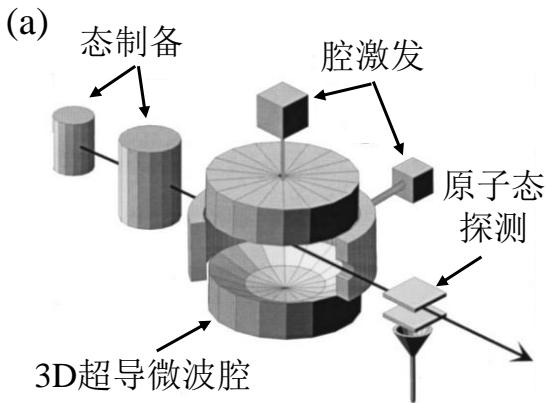

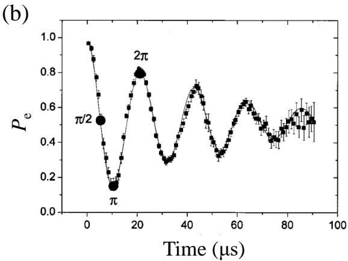  
图 1.1 腔量子点动力学的Reydberg原子实验。(a)样品装置图。原子在左侧被初始化到激发态上，然后经过一个 3D 微波谐振器并被冷却到 ∼ 1K，与腔内的光子相互作用，穿过谐振腔后被右侧的测量装置探测到。(b) 在 Rydberg 原子系统中首次观测到的真空Rabi 振荡。 $P _ { \mathrm { { e } } }$ 表示原子处于激发态的概率。图片引自文献[5]。

## 1.2 量子计算与半导体量子比特

量子计算的概念一般认为最早是由 Richard Feynman 在 1981 年的一场演讲中提出[6]，他认为量子力学系统可以解决经典计算机无法解决的复杂问题，或是用来模拟其它量子系统。在随后的数十年内，量子计算得到了快速的发展，一些著名的量子算法被提出，包括Shor质因数分解算法[7] 和Grover搜索算法[8]。与此同时，人们也在探索着各种可能实现量子算法的物理体系。

类似于经典比特，我们可以将一个物理系统的两种不同状态定义为|0⟩态和|1⟩态，但与经典比特不同的是，量子比特还能够被制备到它们的任意叠加态上，$| \psi \rangle = a | 0 \rangle + b | 1 \rangle$ ，其中 $| a | ^ { 2 } ( | b | ^ { 2 } )$ 代表我们测量得到比特态 |0⟩ (|1⟩) 的概率，且$| a | ^ { 2 } + | b | ^ { 2 } = 1$

各种二能级量子系统，都可以编码为量子比特。除了原子以外，其它可行的体系包括超导量子电路[9]、金刚石中的氮空位色心（nitrogen­vacuum centers）[10]、离子阱（trapped ions）[11] 和马约拉纳费米子（Majorana fermions）[12] 等。那么，如何评判一个量子体系能够用于量子计算呢？David DiVincenzo 在 2000 年总结了五条基本判据[13]：

1. 具有可扩展的量子比特；

2. 能够将量子比特制备到初态；

3. 具有较长的量子相干时间，超过逻辑门的操作时间；

4. 能够实现普适的量子逻辑门操作；

5. 能够高保真地读出量子比特状态。以及为了实现量子通信增加的两条：

6. 飞行量子比特（flying qubits）与静态量子比特（stationary qubits）之间可以相互转换；

7. 能在指定位置之间准确地传输飞行比特。

我们的研究集中在半导体栅控量子点编码的电荷比特，最早由 Daniel Loss和 David DiVincenzo 于 1998 年提出[14]。半导体量子点具有良好的集成性和可扩展性[15]、与传统半导体制造工艺兼容[16]、量子门操控速度快[17] 等众多优点, 是目前量子计算的主要研究平台之一。

不管是为了满足 DiVincenzo 判据中的量子比特可扩展性，还是为了可编程容错量子计算[9] 和未来大规模量子计算[18­19]，都要求极大的量子比特数目。这不仅对工艺提出了很高的要求，多个比特的表征、操控和读取，以及非相邻比特之间的耦合与态传递也是一个很大的技术难题。通常人们可以利用库伦相互作用或交换相互作用来实现近邻比特之间的耦合[15,20­22]，但是这种近邻耦合的作用距离较短，无法有效地实现大规模、长距离的比特耦合和扩展。

目前在半导体量子点体系，已经提出数个方案来实现比特之间的长程耦合，比如在一串耦合的量子点阵列中传递单个电子并保持其自旋态[23­24]，或是通过表面声波相干地传输单个电子[25]。而利用微波谐振腔作为长程耦合的媒介是目前最有望成功的方案之一[26­27]，相关的技术也已经在超导量子比特系统中发展得相当成熟[28­29]。应用 CQED 的知识和技术，我们能够实现相距数个毫米的量子比特之间的耦合，有望解决比特的扩展难题。

## 1.3 半导体量子点­超导腔杂化电路

将腔量子电动力学（Cavity QED) 推广到芯片上的半导体量子点与超导谐振腔耦合系统的研究，被称为电路量子电动力学（circuitQED，简写做cQED）。cQED和 CQED 都是研究腔光子与二能级系统的相互作用，但在我们研究的 cQED 系统中，二能级系统选用的是“人造原子”——量子点，谐振腔则是可集成在片上的超导微波谐振腔，它们都与传统半导体工艺兼容，可以利用微纳加工技术制备而成，所以比传统的 CQED 系统有更好的可扩展性。但是，量子点构成的二能级系统由于与外界环境存在耦合，所以相干性通常比真实的原子差。

自 2004 年耶鲁大学的 R. J. Schoelkopf 等人[30­31] 在超导量子比特与超导腔电路系统中引入腔量子电动力学，从理论和实验上证明了利用微波腔实现量子比特扩展的可行性后，半导体量子点体系也陆续有理论方案提出[32­38]。这些理论方案计算了谐振腔与量子点电荷/自旋量子比特的耦合强度、系统的相干时间，介绍了如何利用谐振腔对量子比特进行探测，以及如何将腔作为量子总线实现比特之间的长程耦合、实现量子比特的门操控。

除了这些理论工作，各个实验组对不同半导体材料的量子点体系也展开了研究，这些材料包括碳纳米管[39,44,46]、砷化铟（InAs）纳米线[41,47]、石墨烯[48­49]和 GaAs/AlGaAs 异质结[40,43,50] 等。表1.1总结了这些实验中表征得到的各个材料的 cQED 系统参数。仔细分析这些实验参数可以发现，较弱的量子点–谐振腔耦合强度（尤其是自旋比特）以及较快的退相干速率，是使得这个杂化系统无法达到强耦合区域的主要原因，限制了半导体量子点cQED的进一步发展。所以早期的实验研究集中在表征cQED系统的基本性质、利用腔探测量子点状态，而无法实现比特之间的长程耦合。

尽管这些先驱性的实验工作没有办法更深入地研究半导体量子比特与微波谐振腔的相互作用，实现比特扩展，但是为接下来的发展积累了技术知识，也激励着各个实验组寻找提高比特性质和耦合强度的方法。

## 1.4 器件优化与强耦合

在上一小节中，我们简单介绍了过去半导体量子点 cQED 的理论与实验发展，了解到耦合强度与比特退相干是限制量子点比特–腔光子强耦合的主要原因，而这一瓶颈在2017 年终于得到了突破。

2016 年，L. M. K. Vandersypen 实验组创新性地提出使用高阻抗谐振腔来提高半导体量子点与腔的耦合强度[51]。量子点电荷比特通过电偶极相互作用耦合到谐振腔上的耦合强度与腔产生的真空电场大小相关，而这个真空涨落场正比于 ${ \sqrt { Z _ { \mathrm { r } } } } , \ Z _ { \mathrm { r } }$ 是谐振腔的特征阻抗， $Z _ { \mathrm { r } } = { \sqrt { L / C } } , L$ 和𝐶 分别是谐振腔的电感和电容。所以提高腔的电感，提高阻抗，可以有效地提高耦合强度。虽然相关推导结果早在2004年的理论计算中就已经得到[32]，且高动态电感材料（具体概念将在第2章中介绍）在单光子探测领域也已经发展得比较成熟[52­54]，但是并没有应用在早期的腔耦合杂化器件设计中。

Vandersypen 组利用 NbTiN 这种具有高动态电感的材料，制备出了图1.2(a)中所示的薄膜纳米线谐振腔[51]。经过表征与模拟计算，发现这种高阻抗谐振腔不仅具有较高的品质因子，还对磁场有较好的抗干扰性。类似的高动态电感材料还有 NbN[55­56]、NbSi[57]、TiN[58­59] 和颗粒铝[60]（granular aluminium）等。

除了利用具有动态电感的特殊材料以外，Andreas Wallraff、Kluas Ensslin 和T. M. Ihn 的合作研究组在 2017 年利用约瑟夫森结（Josephson junction）制备了超导量子干涉器件阵列（superconductin quantum inference device array，简写做

表 1.1 半导体量子点cQED先驱性实验结果
<table><tr><td>单位</td><td>年份</td><td>量子点材料</td><td>体系</td><td>腔材料</td><td>耦合强度 (MHz)</td><td>比特退相干 速率 (MHz)</td><td>腔耗散速率 (MHz)</td></tr><tr><td>法国国家科学研究中心 Kontos 组[39]</td><td>2011</td><td>碳纳米管</td><td>单点电子-源漏</td><td>Nb</td><td>140</td><td></td><td>31.1</td></tr><tr><td>苏黎世联邦理工学院 Wallraff组[40]</td><td>2012</td><td>GaAs</td><td>电荷</td><td>Al</td><td>50</td><td>900</td><td>2.6</td></tr><tr><td>普林斯顿大学 Petta 组[41]</td><td>2012</td><td>InAs 纳米线</td><td>电荷 自旋</td><td>Nb</td><td>30 0.2</td><td>66.7 -</td><td>3.1</td></tr><tr><td>苏黎世联邦理工学院 Wallraff 组[42]</td><td>2013</td><td>GaAs</td><td>电荷</td><td>Al</td><td>25</td><td>&gt;500</td><td>7.3</td></tr><tr><td>苏黎世联邦理工学院 Wallraff组[43]</td><td>2015</td><td>GaAs</td><td>电荷</td><td>Al</td><td>11</td><td>250</td><td>3.3</td></tr><tr><td>瑞士巴塞尔大学 Schönenberger 组[44]</td><td>2015</td><td>碳纳米管</td><td>电荷</td><td>Nb</td><td>37</td><td>&gt;1000</td><td>0.3</td></tr><tr><td>中国科学技术大学 郭国平组[45]</td><td>2015</td><td>石墨烯</td><td>电荷</td><td>Al</td><td>12</td><td>&gt;300</td><td>2.0</td></tr><tr><td>法国国家科学研究中心 Kontos 组[46]</td><td>2015</td><td>碳纳米管</td><td>自旋</td><td>Nb</td><td>1.3</td><td>2.5</td><td>0.61-1</td></tr></table>

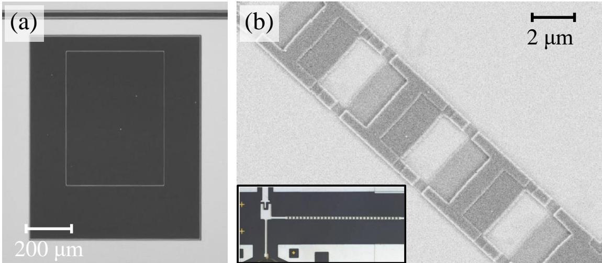  
图 1.2 高阻抗超导谐振腔的扫描电子显微镜图。(a)由8nm厚的NbTiN薄膜制备而成的纳米线腔，线宽为100nm，围成了矩形形状。白色为NbTiN薄膜，黑色对应薄膜被刻蚀掉之后的衬底颜色。图片引自[61]。(b)超导量子干涉器件阵列构成的微波腔。左下角插图为量子点与腔耦合的整体结构图。图片引自[51]。

SQUID array），同样得到了高阻抗的超导腔 [如图1.2(b) 所示]，耦合强度显著提升，成功地实现了GaAs 双量子点电荷比特与谐振腔的强耦合[61]。

几乎在同一时间，也就是2017年初，JasonPetta组在Si/SiGe异质结上制备的双量子点电荷比特与超导 Nb 腔也达到了强耦合[62]。虽然他们并没有使用高阻抗腔，耦合强度并不高，但是他们通过优化量子点电极结构、采用高品质的基片并加入片上滤波线路[63]，提升了量子比特的相干时间，抑制了谐振腔的微波泄漏，使得耦合强度超过了系统的耗散速率，实现了强耦合。

自此之后，半导体–超导cQED迅速地发展起来。仅仅过了一年，于2018年，Vandersypen[64] 组、Petta[65] 组几乎同时在《科学》《自然》期刊上发表论文，报导了半导体量子点电子自旋比特与谐振腔的强耦合。

相比于电荷比特，自旋比特与电场之间没有直接的相互作用，受到外界电荷噪声的影响小，所以具有更长的相干时间[66­67]。但正因如此，单个自旋的磁偶极矩很小，直接与微波腔耦合的耦合强度很弱，不会超过1kHz[68­69]。为了提高自旋比特与腔的耦合强度，一般都选择在量子点上方制作微磁子产生非均匀磁场，利用人造自旋–轨道耦合使得电子自旋与电荷态产生杂化[37,70]，使电子自旋态通过电荷态间接地与腔光子发生耦合，耦合强度超过10MHz。Wallraff等人则是在三量子点内编码的共振交换比特（resonantexchangequbit）上，通过自旋交换相互作用实现了电子与自旋的杂化，也成功观测到了自旋比特与腔的强耦合[71]。

在上述这些半导体量子比特–超导微波腔强耦合的基础上，Wallraff组[26] 和Petta组[27] 分别于2018年和2020年利用腔光子作为媒介，实现了两个非局域的电荷比特以及自旋比特之间的长程耦合，半导体量子点 cQED 的发展进入了高潮。在最新的报导中[72]，已经采用3D封装的双层结构，利用超导腔来实现比特的读取、耦合与扩展。以目前的工艺技术，预计在4.6×1.2mm的大小范围内可以制作出 64位的自旋量子比特芯片。

科学家们除了在 cQED 强耦合实验上的突破外，也在 cQED 其它相关的课题上展开了研究，包括利用谐振腔实现比特的快速测量和单发读出（single­shotreadout）[73­74]，利用脉冲或微波探测比特的谷能级、自旋态[75­77]，寻找进一步优化器件结构的方法[78­79]，以及尝试将量子点通过谐振腔耦合到其它的体系上[80]。

在 2021 年，我们实验组也报导了利用 NbTiN 纳米线、SQUID 阵列这两种高阻抗腔实现电荷比特与腔光子的强耦合，并基于该 cQED 系统研究了两比特长程耦合关联谱[81]、比特激发态探测[82]、Landau­Zener­Stückelburg­Majorana 干涉[83] 和量子点发光现象[84]。

表1.2总结了近几年半导体量子点–超导腔强耦合的进展。为了定量对比，我们引入协同系数[62]（cooperativity）， $C = g ^ { 2 } / \kappa \gamma$ ，表示系统的相干速率与非相干速率之比，其中𝑔 是耦合强度，𝜅 是腔光子耗散速率，𝛾 是比特的退相干速率。伴随着半导体–超导 cQED 系统强耦合的实现，量子计算技术发展的新帷幕已经拉开。

表 1.2 半导体量子点cQED强耦合新进展
<table><tr><td>单位</td><td>年份</td><td>量子点 材料</td><td>体系</td><td>腔材料</td><td>耦合强度 (MHz)</td><td>比特退相干 速率 (MHz)</td><td>腔耗散速率 (MHz)</td><td>协同系数</td></tr><tr><td>普林斯顿大学 Petta 组[62]</td><td>2017</td><td>Si</td><td>电荷</td><td>Nb</td><td>6.7</td><td>2.6</td><td>1.0</td><td>17.3</td></tr><tr><td>苏黎世联邦理工学院 Wallraff 组[61]</td><td>2017</td><td>GaAs</td><td>电荷</td><td>SQUID</td><td>119</td><td>40</td><td>12.3</td><td>28.8</td></tr><tr><td>荷兰代尔夫特大学 Vandersypen 组[64]</td><td>2018</td><td>Si</td><td>电荷 自旋</td><td>NbTiN</td><td>200 13</td><td>52 2.5</td><td>bare 2.7 disepersive 5.4</td><td>142.5 12.5</td></tr><tr><td>普林斯顿大学 Petta 组[65]</td><td>2018</td><td>Si</td><td>电荷 自旋</td><td>Nb</td><td>40 5.5</td><td>35 2.4</td><td>bare 1.3 disepersive 1.8</td><td>25.4 7.0</td></tr><tr><td>苏黎世联邦理工学院 Wallraff组[71]</td><td>2018</td><td>GaAs</td><td>共振交换 自旋比特</td><td>NbTiN</td><td>31.4</td><td>19.6</td><td>47.1</td><td>1.1</td></tr><tr><td>苏黎世联邦理工学院 Wallraff 组[26]</td><td>2018</td><td>GaAs</td><td>电荷两比特</td><td>SQUID</td><td>53</td><td>4.8</td><td>33</td><td>17.7</td></tr><tr><td>苏黎世联邦理工学院 Wallraff组[85]</td><td>2020</td><td>GaAs</td><td>电荷 电四极矩</td><td>SQUID</td><td>150</td><td>32</td><td>18</td><td>39.1</td></tr><tr><td>普林斯顿大学 Petta 组[27]</td><td>2020</td><td>Si</td><td>自旋两比特</td><td>Nb</td><td>10.7</td><td>4.7</td><td>2.0</td><td>12.2</td></tr><tr><td>中国科学技术大学 郭国平组[81]</td><td>2021</td><td>GaAs</td><td>电荷两比特</td><td>SQUID</td><td>80</td><td>55</td><td>35.0</td><td>3.3</td></tr><tr><td>中国科学技术大学 郭国平组[82]</td><td>2021</td><td>GaAs</td><td>电荷</td><td>NbTiN</td><td>104.5</td><td>72</td><td>35.3</td><td>4.3</td></tr></table>

## 1.5 论文结构

这篇论文分成以下几个章节：

第 2 章介绍了半导体量子点与腔杂化系统的基础理论背景。首先介绍了光子与二能级系统的基础相互作用模型，然后讨论了半导体量子点与超导谐振腔的形成与性质，特别是利用高动态电感材料和约瑟夫森结制成的高阻抗谐振腔。最后介绍了双量子点与谐振腔的耦合模型，给出了耦合强度的表达式和影响强耦合的主要因素。

第 3 章介绍了实验测量中样品器件的结构设计与测量线路。以两个双量子点与 NbTiN 腔耦合结构为例，介绍了量子点与谐振腔的基本表征方法，展示了电荷比特与腔的强耦合结果以及两电荷比特的长程耦合。这一章末尾还介绍了几种常用的系统参数表征方法。

第 4 章展示了我们利用高阻抗 NbTiN 腔测量量子点激发谱，表征量子点的能级跃迁。通过给量子点电极施加周期方波脉冲，调制量子点之间的失谐量，引起电子在不同能级间的跃迁。由于较大的耦合强度导致谐振腔的高探测灵敏度，我们可以从激发谱中分辨出不同的电子自旋态占据。

第 5 章介绍了基于双量子点–腔耦合系统的微波激光器。利用源漏偏置的双量子点，通过腔探测到了腔光子的增益信号，提供了一种实现微纳尺寸的半导体片上相干光源的可能方案。

第 6 章研究了双量子点–谐振腔杂化系统中的量子干涉现象。通过给双量子点施加连续微波，使电荷态布居重新分布，用腔探测到了腔光子辅助的 Landau ­Zener­ Stükelberg ­Majorana 干涉现象，并发现了特定驱动频率下的非平衡态布居变化导致的月牙状新干涉图案。表明量子点–腔耦合系统是研究强驱动动力学的良好平台。

第 7 章总结了论文中涉及的主要工作，对未来的研究方向进行讨论与展望。

## 参考文献

[1] Kimble H J. Strong interactions of single atoms and photons in cavity QED. Physica Scripta T, 1998, 76(T76):127.

[2] Haroche S, Raimond J M. Exploring the quantum: Atoms, cavities, and photons. Oxford: Oxford University Press, 2006.

[3] Jaynes E T, Cummings F W. Comparison of quantum and semiclassical radiation theories with application to the beam maser. Proc. IEEE, 1963, 51(1):89.

[4] Brune M, Schmidt­Kaler F, Maali A, et al. Quantum Rabi oscillation: A direct test of field quantization in a cavity. Physical Review Letters, 1996, 76(11):1800.

[5] Raimond J M, Brune M, Haroche S. Colloquium: Manipulating quantum entanglement with atoms and photons in a cavity. Reviews of Modern Physics, 2001, 73(3):565.

[6] Feynman R P. Simulating physics with computers. International Journal of Theoretical Physics, 1982, 21(6/7).

[7] Shor P W. Algorithms for quantum computation: Discrete logarithms and factoring.// Goldwasser S. Proc. 35th Annual Symposium on the foundations of computer science. Los Alamitos, CA: IEEE Computer Society Press, 1994: 124.

[8] Grover L K. A fast quantum mechanical algorithm for database search//Proceedings of the twenty­eighth annual ACM symposium on theory of computing. 1996: 212.

[9] Devoret M H, Schoelkopf R J. Superconducting circuits for quantum information: An outlook. Science, 2013, 339(6124):1169.

[10] Jelezko F, Gaebel T, Popa I, et al. Observation of coherent oscillation of a single nuclear spin and realization of a two­qubit conditional quantum gate. Physical Review Letters, 2004, 93 (13):130501.

[11] Häffner H, Roos C F, Blatt R. Quantum computing with trapped ions. Physics Reports, 2008, 469(4):155.

[12] Mourik V, Zuo K, Frolov S M, et al. Signatures of Majorana fermions in hybrid superconductorsemiconductor nanowire devices. Science, 2012, 336(6084):1003.

[13] DiVincenzo D P. The physical implementation of quantum computation. Fortschritte der Physik, 2000, 48(9­11):771.

[14] Loss D, DiVincenzo D P. Quantum computation with quantum dots. Physical Review A, 1998, 57(1):120.

[15] Zajac D M, Hazard T M, Mi X, et al. Scalable gate architecture for a one­dimensional array of semiconductor spin qubits. Physical Review Applied, 2016, 6(5):54013.

[16] Veldhorst M, Eenink H G J, Yang C H, et al. Silicon CMOS architecture for a spin­based

quantum computer. Nature Communications, 2017, 8(1):1766.

[17] Cao G, Li H O, Tu T, et al. Ultrafast universal quantum control of a quantum­dot charge qubit using Landau–Zener–Stückelberg interference. Nature Communications, 2013, 4(1):1401.

[18] Vandersypen L M K, Bluhm H, Clarke J S, et al. Interfacing spin qubits in quantum dots and donors—hot, dense, and coherent. npj Quantum Information, 2017, 3(1):34.

[19] Li R, Petit L, Franke D P, et al. A crossbar network for silicon quantum dot qubits. Science Advances, 2018, 4(7):eaar3960.

[20] Hensgens T, Fujita T, Janssen L, et al. Quantum simulation of a Fermi­Hubbard model using a semiconductor quantum dot array. Nature, 2017, 548(7665):70.

[21] Mortemousque P A, Chanrion E, Jadot B, et al. Coherent control of individual electron spins in a two­dimensional quantum dot array. Nature Nanotechnology, 2021, 16(3):296.

[22] Kandel Y P, Qiao H, Fallahi S, et al. Adiabatic quantum state transfer in a semiconductor quantum­dot spin chain. Nature Communications, 2021, 12(1):2156.

[23] Fujita T, Baart T A, Reichl C, et al. Coherent shuttle of electron­spin states. npj Quantum Information, 2017, 3(1):1.

[24] Mills A R, Zajac D M, Gullans M J, et al. Shuttling a single charge across a one­dimensional array of silicon quantum dots. Nature Communications, 2019, 10(1):1.

[25] Jadot B, Mortemousque P A, Chanrion E, et al. Distant spin entanglement via fast and coherent electron shuttling. Nature Nanotechnology, 2021, 16(5):570.

[26] Van Woerkom D J, Scarlino P, Ungerer J H, et al. Microwave photon­mediated interactions between semiconductor qubits. Physical Review X, 2018, 8(4):41018.

[27] Borjans F, Croot X G, Mi X, et al. Resonant microwave­mediated interactions between distant electron spins. Nature, 2020, 577(7789):195.

[28] Sillanpää M A, Park J I, Simmonds R W. Coherent quantum state storage and transfer between two phase qubits via a resonant cavity. Nature, 2007, 449(7161):438.

[29] Majer J, Chow J M, Gambetta J M, et al. Coupling superconducting qubits via a cavity bus. Nature, 2007, 449(7161):443.

[30] Blais A, Huang R S, Wallraff A, et al. Cavity quantum electrodynamics for superconducting electrical circuits: an architecture for quantum computation. Physical Review A, 2004, 69(6): 62320.

[31] Wallraff A, Schuster D I, Blais A, et al. Strong coupling of a single photon to a superconducting qubit using circuit quantum electrodynamics. Nature, 2004, 431(7005):162.

[32] Childress L, Sørensen A S, Lukin M D. Mesoscopic cavity quantum electrodynamics with quantum dots. Physical Review A, 2004, 69(4):42302.

[33] Burkard G, Imamoglu A. Ultra­long­distance interaction between spin qubits. Physical Review

B, 2006, 74(4):41307.

[34] Guo G P, Zhang H, Hu Y, et al. Dispersive coupling between the superconducting transmission line resonator and the double quantum dots. Physical Review A, 2008, 78(2):20302.

[35] Trif M, Golovach V N, Loss D. Spin dynamics in InAs nanowire quantum dots coupled to a transmission line. Physical Review B, 2008, 77(4):045434.

[36] Cottet A, Kontos T. Spin quantum bit with ferromagnetic contacts for circuit QED. Physical Review Letters, 2010, 105(16):160502.

[37] Hu X, Liu Y X, Nori F. Strong coupling of a spin qubit to a superconducting stripline cavity. Physical Review B, 2012, 86(3):035314.

[38] Kloeffel C, Trif M, Stano P, et al. Circuit QED with hole­spin qubits in Ge/Si nanowire quantum dots. Physical Review B, 2013, 88(24):241405.

[39] Delbecq M R, Schmitt V, Parmentier F D, et al. Coupling a quantum dot, fermionic leads, and a microwave cavity on a chip. Physical Review Letters, 2011, 107(25):256804.

[40] Frey T, Leek P J, Beck M, et al. Dipole coupling of a double quantum dot to a microwave resonator. Physical Review Letters, 2012, 108(4):46807.

[41] Petersson K D, McFaul L W, Schroer M D, et al. Circuit quantum electrodynamics with a spin qubit. Nature, 2012, 490(7420):380.

[42] Basset J, Jarausch D D, Stockklauser A, et al. Single­electron double quantum dot dipolecoupled to a single photonic mode. Physical Review B, 2013, 88(12):125312.

[43] Stockklauser A, Maisi V F, Basset J, et al. Microwave Emission from Hybridized States in a Semiconductor Charge Qubit. Physical Review Letters, 2015, 115(4):046802.

[44] Ranjan V, Puebla­Hellmann G, Jung M, et al. Clean carbon nanotubes coupled to superconducting impedance­matching circuits. Nature Communications, 2015, 6(1):1.

[45] Deng G W W, Wei D, Johansson J R, et al. Charge number dependence of the dephasing rates of a graphene double quantum dot in a circuit QED architecture. Physical Review Letters, 2015, 115(12):126804.

[46] Viennot J J, Dartiailh M C, Cottet A, et al. Coherent coupling of a single spin to microwave cavity photons. Science, 2015, 349(6246):408.

[47] De Lange G, Van Heck B, Bruno A, et al. Realization of Microwave Quantum Circuits Using Hybrid Superconducting­Semiconducting Nanowire Josephson Elements. Physical Review Letters, 2015, 115(12):127002.

[48] Zhang M L, Wei D, Deng G W, et al. Measuring the complex admittance of a nearly isolated graphene quantum dot. Applied Physics Letters, 2014, 105(7):073510.

[49] Deng G W, Wei D, Li S X, et al. Coupling Two Distant Double Quantum Dots with a Microwave Resonator. Nano Letters, 2015, 15(10):6620.

[50] Toida H, Nakajima T, Komiyama S. Vacuum Rabi splitting in a semiconductor circuit QED system. Physical Review Letters, 2013, 110(6):66802.

[51] Samkharadze N, Bruno A, Scarlino P, et al. High­kinetic­inductance superconducting nanowire resonators for circuit QED in a magnetic field. Physical Review Applied, 2016, 5(4):44004.

[52] Kerman A J, Dauler E A, Keicher W E, et al. Kinetic­inductance­limited reset time of superconducting nanowire photon counters. Applied physics letters, 2006, 88(11):111116.

[53] Dorenbos S N, Reiger E M, Perinetti U, et al. Low noise superconducting single photon detectors on silicon. Applied Physics Letters, 2008, 93(13):131101.

[54] Annunziata A J, Santavicca D F, Frunzio L, et al. Tunable superconducting nanoinductors. Nanotechnology, 2010, 21(44):445202.

[55] Gao J R, Hajenius M, Tichelaar F D, et al. Monocrystalline NbN nanofilms on a 3C­SiC/Si substrate. Applied Physics Letters, 2007, 91(6):62504.

[56] Niepce D, Burnett J, Bylander J. High kinetic inductance NbN nanowire superinductors. Physical Review Applied, 2019, 11(4):44014.

[57] Calvo M, D’Addabbo A, Monfardini A, et al. Niobium silicon alloys for kinetic inductance detectors. Journal of Low Temperature Physics, 2014, 176(3):518.

[58] Leduc H G, Bumble B, Day P K, et al. Titanium nitride films for ultrasensitive microresonator detectors. Applied Physics Letters, 2010, 97(10):102509.

[59] Shearrow A, Koolstra G, Whiteley S J, et al. Atomic layer deposition of titanium nitride for quantum circuits. Applied Physics Letters, 2018, 113(21):212601.

[60] Maleeva N, Grünhaupt L, Klein T, et al. Circuit quantum electrodynamics of granular aluminum resonators. Nature Communications, 2018, 9(1):1.

[61] Stockklauser A, Scarlino P, Koski J V, et al. Strong coupling cavity QED with gate­defined double quantum dots enabled by a high impedance resonator. Physical Review X, 2017, 7(1): 011030.

[62] Mi X, Cady J V, Zajac D M, et al. Strong coupling of a single electron in silicon to a microwave photon. Science, 2017, 355(6321):156.

[63] Mi X, Cady J V, Zajac D M, et al. Circuit quantum electrodynamics architecture for gatedefined quantum dots in silicon. Applied Physics Letters, 2017, 110(4):43502.

[64] Samkharadze N, Zheng G, Kalhor N, et al. Strong spin­photon coupling in silicon. Science, 2018, 359(6380):1123.

[65] Mi X, Benito M, Putz S, et al. A coherent spin­photon interface in silicon. Nature, 2018, 555 (7698):599.

[66] Hanson R, Kouwenhoven L P, Petta J R, et al. Spins in few­electron quantum dots. Reviews of Modern Physics, 2007, 79(4):1217.

[67] Zwanenburg F A, Dzurak A S, Morello A, et al. Silicon quantum electronics. Reviews of Modern Physics, 2013, 85(3):961.

[68] Imamoğlu A. Cavity QED based on collective magnetic dipole coupling: spin ensembles as hybrid two­level systems. Physical Review Letters, 2009, 102(8):83602.

[69] Bienfait A, Pla J J, Kubo Y, et al. Controlling spin relaxation with a cavity. Nature, 2016, 531 (7592):74.

[70] Benito M, Mi X, Taylor J M, et al. Input­output theory for spin­photon coupling in Si double quantum dots. Physical Review B, 2017, 96(23):235434.

[71] Landig A J, Koski J V, Scarlino P, et al. Coherent spin­photon coupling using a resonant exchange qubit. Nature, 2018, 560(7717):179.

[72] Holman N, Rosenberg D, Yost D, et al. 3D integration and measurement of a semiconductor double quantum dot with a high­impedance TiN resonator. npj Quantum Information, 2021, 7 (1):137.

[73] Zheng G, Samkharadze N, Noordam M L, et al. Rapid gate­based spin read­out in silicon using an on­chip resonator. Nature Nanotechnology, 2019, 14(8):742.

[74] Scarlino P, van Woerkom D J, Stockklauser A, et al. All­microwave control and dispersive readout of gate­defined quantum dot qubits in circuit quantum electrodynamics. Physical Review Letters, 2019, 122(20):206802.

[75] Mi X, Péterfalvi C G, Burkard G, et al. High­resolution valley spectroscopy of Si quantum dots. Physical Review Letters, 2017, 119(17):176803.

[76] Landig A J, Koski J V, Scarlino P, et al. Microwave­cavity­detected spin blockade in a fewelectron double quantum dot. Physical Review Letters, 2019, 122(21):213601.

[77] Borjans F, Mi X, Petta J R. Spin digitizer for high­fidelity readout of a cavity­coupled silicon triple quantum dot. Physical Review Applied, 2021, 15(4):044052.

[78] Harvey­Collard P, Zheng G, Dijkema J, et al. On­chip microwave filters for high­impedance resonators with gate­defined quantum dots. Physical Review Applied, 2020, 14(3):034025.

[79] Holman N, Dodson J P, Edge L F, et al. Microwave engineering for semiconductor quantum dots in a cQED architecture. Applied Physics Letters, 2020, 117(8):083502.

[80] Landig A J, Koski J V, Scarlino P, et al. Virtual­photon­mediated spin­qubit–transmon coupling. Nature Communications, 2019, 10(1):1.

[81] Wang B C, Lin T, Li H O, et al. Correlated spectrum of distant semiconductor qubits coupled by microwave photons. Science Bulletin, 2021, 66(4):332.

[82] Chen M B, Jiang S L, Wang N, et al. Microwave­resonator­detected excited­state spectroscopy of a double quantum dot. Physical Review Applied, 2021, 15(4):044045.

[83] Chen M B, Wang B C, Kohler S, et al. Floquet state depletion in ac­driven circuit QED.

Physical Review B, 2021, 103(20):205428.

[84] Chen M B B, Wang B C C, Gu S S S, et al. Micro­scale photon source in a hybrid cQED system. Chinese Physics B, 2021, 30(4):048507.

[85] Koski J V, Landig A J, Russ M, et al. Strong photon coupling to the quadrupole moment of an electron in a solid­state qubit. Nature Physics, 2020, 16(6):642.

## 第 2 章 理论与实验背景

## 2.1 电路量子电动力学

电路量子电动力学（cQED）和腔量子电动力学（CQED）一样，都是研究光与物质的相互作用。考虑一个二能级原子通过电偶极耦合到谐振腔上，与腔内的光子发生作用（如图2.1所示）。这个最简单的杂化系统的哈密顿量可以用CQED中的量子 Rabi 模型[1­2] 来描述：

$$
H _ { \mathrm { R a b i } } = \hbar \omega _ { \mathrm { r } } ( a ^ { \dagger } a + \frac { 1 } { 2 } ) + \frac { 1 } { 2 } \hbar \omega _ { \mathrm { a } } \sigma _ { z } + \hbar g ( a ^ { \dagger } + a ) ( \sigma _ { - } + \sigma _ { + } ) .\tag{2.1}
$$

哈密顿量中的第一项表示腔电磁场的单模式能量， $\omega _ { \mathrm { r } }$ 是光子频率， $a ^ { \dagger } ( a )$ 是光子产生（湮灭）算符， $a ^ { \dagger } a = n$ 是光子数算符，ℏ 是约化普朗克常数。第二项表示二能级原子的能量， $\omega _ { \mathrm { a } }$ 是两个能级间的频率差， $\sigma _ { z }$ 是泡利 𝑧 算符。最后一项表示原子与腔场之间的电偶极相互作用，𝑔 是耦合强度， $\sigma _ { - } ( \sigma _ { + } )$ 是二能级原子的降（升）算符。

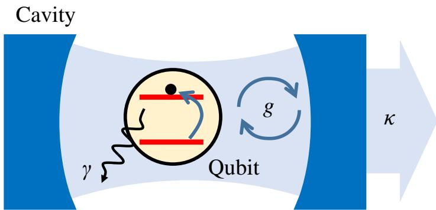  
图 2.1 腔量子电动力学系统示意图。原子与腔内光子相互作用速率为 $_ { g , }$ ，光子的耗散速率为 𝜅，比特的退相干速率为𝛾。

在大部分实验中，耦合系统都满足旋波近似条件， $g \ll \omega _ { \mathrm { a } } , \omega _ { \mathrm { r } }$ ，且 $| \omega _ { \mathrm { r } } - \omega _ { \mathrm { a } } | \ll$ $| \omega _ { \mathrm { r } } + \omega _ { \mathrm { a } } |$ ，那么量子Rabi哈密顿量中的相互作用项可以消去 $( a ^ { \dagger } \sigma _ { + } + a \sigma _ { - } )$ ，对应二能级原子与腔被同时激发和弛豫的二阶过程。经过旋波近似后，哈密顿量简化为著名的 Janes­Cummings 哈密顿量：

$$
H _ { \mathrm { J C } } = \hbar \omega _ { \mathrm { r } } ( a ^ { \dagger } a + \frac { 1 } { 2 } ) + \frac { 1 } { 2 } \hbar \omega _ { \mathrm { a } } \sigma _ { z } + \hbar g ( a ^ { \dagger } \sigma _ { - } + a \sigma _ { + } ) .\tag{2.2}
$$

这里的第三项描述了二能级系统以 $2 g$ 的速率吸收 $( a \sigma _ { + } )$ ）或放出 $( a ^ { \dagger } \sigma _ { - } )$ 一个腔光子发生跃迁或弛豫，总的激发数守恒。

由于电偶极相互作用，系统中的光子数态 $| n \rangle$ 和原子的基态|𝑔⟩、激发态 $| e \rangle$

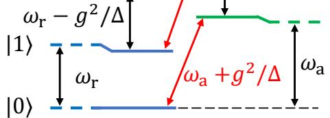

发生杂化。将 $H _ { \mathrm { J C } }$ 对角化后，可以得到这个杂化系统的基态|𝑔,0⟩ 和激发态

$$
| + , n \rangle = \sin \phi _ { n } | g , n \rangle + \cos \phi _ { n } | e , n - 1 \rangle ,\tag{2.3}
$$

$$
| - , n \rangle = \cos \phi _ { n } | g , n \rangle - \sin \phi _ { n } | e , n - 1 \rangle ,\tag{2.4}
$$

其中 $\begin{array} { r } { \phi _ { n } = \frac { 1 } { 2 } \arctan \frac { 2 g \sqrt { n } } { \Delta } , ~ \Delta = \omega _ { \mathrm { a } } - \omega _ { \mathrm { r } } } \end{array}$ 是原子–腔的能量失谐。相应的本征能量为

$$
E _ { g , 0 } = - \frac { 1 } { 2 } \hbar \Delta ,\tag{2.5}
$$

$$
E _ { \pm , n } = n \hbar \omega _ { \mathrm { r } } \pm \frac { 1 } { 2 } \hbar \sqrt { 4 g ^ { 2 } n + \Delta ^ { 2 } } .\tag{2.6}
$$

当原子和光子共振， $\Delta = 0$ ，系统的本征态是二能级原子和腔的最大混合态，$\left| \pm , n \right. = ( \left| g , n \right. \pm \left| e , n - 1 \right. ) / \sqrt { 2 }$ ，能级差为 $2 g \sqrt { n }$ ，如图2.2(a) 所示。假如初始时刻腔光子数为0，我们把二能级原子制备到激发态，此时腔内的真空涨落场激发二能级系统吸收或辐射光子，那么系统就会在 $| e , 0 \rangle$ 和 |𝑔,1⟩ 之间发生相干振荡，被称为真空 $\mathrm { R a b i }$ 振荡，振荡速率为 $2 g _ { \circ } \ | + , 1 \rangle$ 与 |−,1⟩ 之间的能级间隔 $2 g$ 也被称作真空 Rabi劈裂。

在共振极限下 $( | \omega _ { \mathrm { a } } - \omega _ { \mathrm { r } } | \ll g )$ ，原子与光子会交换能量，系统能级发生杂化。但是多数情况下，我们希望相互作用是色散的（dispersive），即光子与二能级原子没有实际的能量交换，原子不吸收实光子。这要求 $| \omega _ { \mathrm { a } } - \omega _ { \mathrm { r } } | \gg g$ （一般我

(a)

$$
\omega _ { \mathrm { a } } = \omega _ { \mathrm { r } }\tag{|𝑛⟩}
$$

$$
\mathrm { ~ --- ~ } \left] \frac { 2 g \sqrt { n } ! } { \ d t } \mathrm { ~ --- ~ } | n - 1 \rangle \right.\tag{|3⟩}
$$

|2⟩

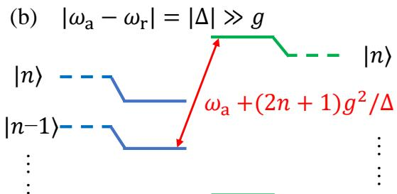

|1⟩

|2⟩

|1⟩

|1⟩

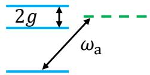  
|𝑒⟩  
|𝑔⟩  
|𝑒⟩  
图 2.2 Jaynes­Cummings哈密顿量的能级示意图。虚线是未耦合系统的本征能量，左侧虚线对应比特处于基态|𝑔⟩，右侧对应比特处于激发态|𝑒⟩，|𝑛⟩为光子数态。实线是比特与腔光子在电偶极相互作用下的能级。(a)比特与谐振腔共振， $\omega _ { \mathbf { a } } = \omega _ { \mathbf { r } }$ 时，能级劈裂形成新的本征态，劈裂大小正比于 $2 g { \sqrt { n } } .$ 。(b)在色散极限区， $| \omega _ { \mathbf { a } } - \omega _ { \mathbf { r } } | \gg g$ ，腔频受到比特影响发生偏移， $\omega _ { \mathrm { r } } ^ { \prime } \approx \omega _ { \mathrm { r } } \pm g ^ { 2 } / \Delta$ 。而原子的有效频率为 $\omega _ { \mathbf { a } } ^ { \prime } \approx \omega _ { \mathbf { a } } + ( 2 n + 1 ) g ^ { 2 } / \Delta$ o

|0⟩

|0⟩

们取 $| \Delta | > 1 0 g \AA ,$ ），系统达到 $\mathcal { \boxplus }$ 散耦合极限。此时我们可以用微扰论将J­C哈密顿量按 $g / \Delta$ 展开到二阶项，得到

$$
H _ { \mathrm { J C } } ^ { \mathrm { d i s p } } \approx \hbar ( \omega _ { \mathrm { r } } + \frac { g ^ { 2 } } { \Delta } \sigma _ { z } ) ( a ^ { \dagger } a + \frac { 1 } { 2 } ) + \frac { 1 } { 2 } \hbar \omega _ { \mathrm { a } } \sigma _ { z } ,\tag{2.7}
$$

本征能量为

$$
E _ { \pm , n } ^ { \mathrm { d i s p } } \approx \hbar n \omega _ { \mathrm { r } } \pm ( \Delta + \frac { 1 } { 2 } \hbar n g ^ { 2 } / \Delta ) .\tag{2.8}
$$

色散极限下系统的光子数与原子态不发生变化，但是还可以通过色散偏移项 $g ^ { 2 } / \Delta$ 发生相互作用，改变原子和光子的能量，如图2.2(b) 所示。

式2.7中的第一项仍然是腔谐振子的形式，但是腔的频率发生了 $\pm g ^ { 2 } / \Delta$ 的偏移，正负号取决于原子的状态 $\sigma _ { z } \mathrm { ~ \mathrm { ~ } ~ }$ 。所以在色散耦合极限，我们可以利用的腔频偏移读取原子态，实现非破坏性测量[3]。这种测量操作对比特态进行投影后不会改变其状态，这样就可以对末态进行重复测量来提高读取的保真度。

式2.7还可以改写为

$$
H _ { \mathrm { J C } } ^ { \mathrm { d i s p } } \approx \hbar \omega _ { \mathrm { r } } ( a ^ { \dagger } a + \frac { 1 } { 2 } ) + \frac { 1 } { 2 } \hbar ( \omega _ { \mathrm { a } } + \frac { 2 g ^ { 2 } } { \Delta } a ^ { \dagger } a + \frac { g ^ { 2 } } { \Delta } ) \sigma _ { z } ,\tag{2.9}
$$

此形式中的原子能级受到色散相互作用发生改变，该变量为 $( 2 n + 1 ) g ^ { 2 } / \Delta$ ，其中依赖于光子数的 $2 n g ^ { 2 } / \Delta$ 项被称为 AC­Stark shift，而另一项由真空能量涨落引起的 $g ^ { 2 } / \Delta$ 偏移被称为 Lamb shift。类似的，我们也可以利用 AC­Stark shift 来测量腔内的光子数。

J­C哈密顿量仅描述了耦合系统的相干相互作用，但是真实的物理系统都会有退相干作用。在 cQED 系统中，退相干主要来自谐振腔内光子的泄露以及原子通过腔以外其它途径的消相干，它们会阻碍光子与原子之间信息的相干交换。当腔光子耗散速率 $\kappa$ 和原子的退相干速率 $\gamma$ 小于耦合强度 $g$ 时，我们称系统达到了强耦合，原子与腔在共振极限下 $( | \Delta | \ll g )$ ）就可以在系统的激发信号丢失之前完成数个 $\mathrm { R a b i }$ 振荡，此时系统的总耗散为 $T _ { \mathrm { e f f } } = ( \kappa + \gamma ) / 2$ 。而在色散极限区$( | \Delta | \gg g )$ ），腔的展宽 $\kappa$ 和比特的展宽 $\gamma$ 也会影响信号的读出，只有当色散频移项 $g ^ { 2 } / \Delta > \kappa , \gamma$ 时，我们才可以从原子（腔）能谱上分辨出光子数（原子态），此时我们称 cQED 系统达到了强色散区域。

## 2.2 半导体量子点

半导体量子点作为人造二能级原子，在过去数十年内已经受到了广泛的探究。这一小节中仅针对本论文中涉及到的相关基本概念作介绍，更加完整、详细的内容请查看综述[4­6] 和博士论文[7­9]。

半导体量子点是一种三维可控的纳米级电荷束缚结构。在本文中研究的平面双量子点器件，由美国或是日本的 GaAs/AlGaAs 异质结基片制备得到，典型

(a)

的剖面结构如图2.3(a) 所示。异质结从上往下，依次为 GaAs cap 层、AlGaAs 层和 GaAs 基底，其中 AlGaAs 层有 30% 的 Ga 被 Al 取代构成 $\mathrm { { A l } _ { 0 . 3 } \mathrm { { G a } _ { 0 . 7 } \mathrm { { A s } } } }$ ，中间有一层硅原子 n 型重掺杂层，掺杂浓度为 $7 . 0 \times 1 0 ^ { 1 7 } \mathrm { c m } ^ { - 3 }$ 。这样的异质结结构在𝑧轴方向上的导带变化如图2.3(b)所示。n型掺杂的AlGaAs引入自由电子，并且由于靠近 GaAs 基底的 AlGaAs 附近，导带弯曲到费米面之下，所以会在距离晶圆表面的90nm深度附近形成 𝑧 方向受限但是在 𝑥­𝑦 平面内可自由移动的二维电子气（two­dimensional electron gas，简写为 2DEG）。

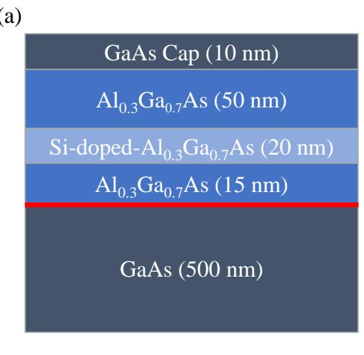

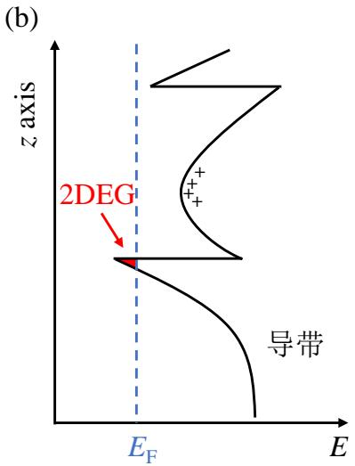  
图 2.3 GaAs/AlGaAs 异质结中二维电子气（2DEG）的形成。(a) $\mathbf { G a A s } / \mathbf { A l } _ { x } \mathbf { G a } _ { 1 - x } \mathbf { A s }$ 异质结构，其中 Al 的质量分数为 30%。(b) 沿垂直方向的导带图，在靠近 $\mathbf { G a A s }$ 基底的AlGaAs 附近，导带位于红色虚线所指的费米面下方，形成 2DEG。

在后续的加工工艺中，我们在基片表面制备好如图2.4(a) 所示的经过仔细设计的金属电极。通过给电极施加负偏压，形成图中虚线圆圈所标示的零维量子点结构，将电子束缚在图2.4(b) 所示的量子点势阱中。

如果单个量子点可以看做是人造原子的话，那么双量子点就可以看做是人造分子[10]。图2.4(c) 展示了一个简化的双量子点（double quantum dot，简写做DQD）电路结构图，它由两个单量子点通过隧穿耦合 $t _ { \mathrm { c } }$ 构成，点之间存在电容耦合 $C _ { \mathrm { m } }$ 。其中，电极L和R分别控制左点和右点到源漏的隧穿势垒（可以视作由电容与电阻并联构成），电子发生交换。电极PL和PR控制两个量子点内的电化学势𝜀 和𝜀 ，从而改变量子点之间的失谐量 $\varepsilon _ { L }$ $\varepsilon _ { R } :$ $\varepsilon = \varepsilon _ { L } - \varepsilon _ { R }$ 。电极U控制两点之间的隧穿。根据点间隧穿耦合速率 $t _ { \mathrm { c } }$ 的大小，双量子点可以构成弱耦合的“离子键”和强耦合的“共价键”。当 $t _ { \mathrm { c } }$ 较小，电子局域在两个点内；而当 $t _ { \mathrm { c } }$ 较大，电子是非局域的，在双点内构成成键态（bonding state）和反键态（antibonding state）。

为了得到量子点对表面电极电压的响应情况，通常我们测量双量子点电荷探测装置输出信号随电极电压变化的相图，一般称之为电荷稳定图（chargestability

(a)  
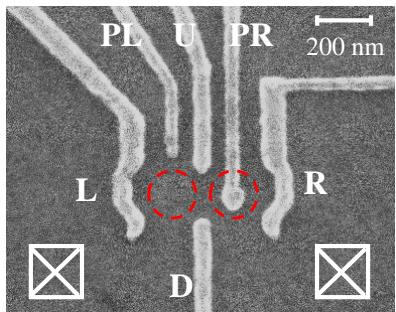

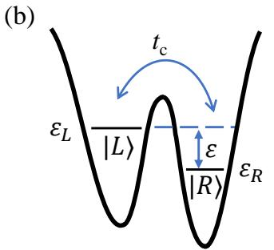

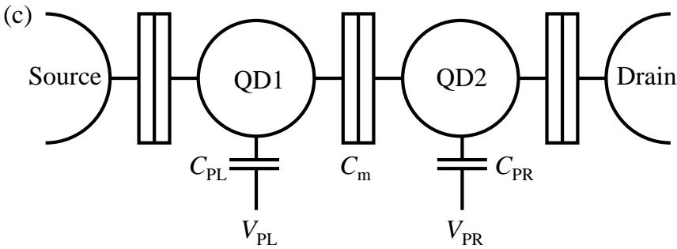  
图 2.4 (a)量子点金属电极电镜图。通过给电极L、PL、U、PR、R和D施加合适的偏置电压，会在两个虚线圆圈所指示的位置处形成量子点。(b)双量子点束缚势示意图。电荷态

$$
| R \rangle
$$

$$
t _ { \mathbf { c } }
$$

$$
\varepsilon _ { L } - \varepsilon _ { R } = \varepsilon _ { \circ }
$$

(c) 双量子点电路示意图。两点之间通过电容相互耦合，并各自耦合到相邻的源漏上。通过电极PL和 PR和可以调节两个点内的电化学势。

diagram）或蜂窝图（honeycomb diagram）。图2.5(a) 是当两个量子点之间的电容耦合 $C _ { \mathrm { m } } = 0$ 时扫描电极PL和PR得到的电荷稳定示意图，它们分别控制左点和右点的电化学势，形成图中水平方向与竖直方向的电子跃迁线。其中，绿色水平（蓝色竖直）线对应左（右）点的电化学势与左侧（右侧）源漏费米面齐平时，电子在源漏与量子点之间发生跃迁。在这两组线的交点处，双点与源漏的电化学势均一样高。这些线将电荷稳定图分成了多个方形区域，每个区域内双点的电子数由于库伦阻塞而保持不变，记为 $( m , n )$ 0

在实际实验中，由于量子点到邻近的电极、电极与电极之间都存在耦合电容，产生串扰，所以电极 PL 和 PR 不仅会改变相应量子点的电化学势，还会影响近邻的量子点电化学势以及隧穿势垒。图2.5(b)展示了当量子点之间的电容耦合 $C _ { \mathrm { m } } \neq 0$ 时，有串扰影响下的电荷稳定示意图，具体的计算模拟可以通过常相互作用模型得到[5,8]。

因为串扰，电荷稳定图中量子点到源漏的隧穿线会发生倾斜。而量子点间电容 $C _ { \mathrm { m } }$ 会使某个点内电子的填充导致另一个点的电化学势改变 $E _ { C \mathrm { m } }$ ，使原来图 $2 . 5 ( \mathrm { a } )$ 中源漏跃迁线的交点劈裂成两个三重点（triple point)。这两个三重点之间的连线就是量子点间电荷隧穿线。沿着这条线点间隧穿线，两个点的电化学势保持齐平，失谐量 $\varepsilon = 0$ ，电子可以从一个点隧穿到另一个点。

图2.5(c)是量子点间跃迁线的局部放大图。如果隧穿耦合速率 $t _ { \mathrm { c } }$ 比较小，那么量子点间跃迁线的长度主要由 $E _ { C \mathrm { m } }$ 决定。如果 $t _ { \mathrm { c } }$ 比较大，量子点内的电子不再局域在单个点内，三重点附近的源漏隧穿线发生弯曲，形成图2.5(c) 中的黑色实线。

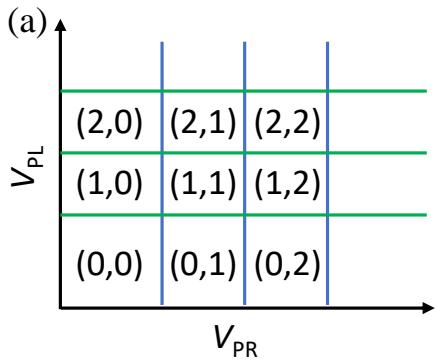

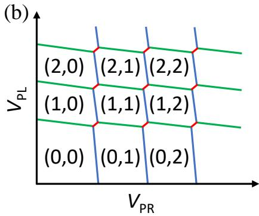

(c)  
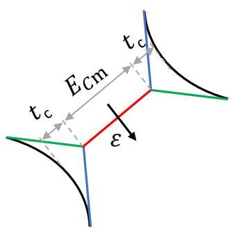

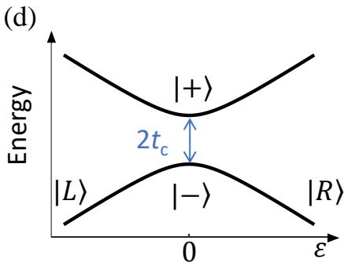  
图 2.5 (a)–(b) 双量子点随两个柱状电极（plunger gate）扫描得到的电荷稳定示意图。(a)图中量子点器件为无寄生电容，且量子点间耦合电容 $C _ { \mathbf { m } } = 0 .$ 。(b) 图中存在寄生电容，且 $C _ { \mathbf { m } } \neq 0$ 。(c) 图 (b) 中量子点间隧穿线的放大图。(d) 双量子点电荷态随失谐量 𝜀变化的轨道能级图。

在成点良好的量子点间电荷跃迁线附近，根据单个多余电子位于左点或是右点内，可以定义电荷比特态 $| L \rangle = | ( m + 1 , n ) \rangle$ 和 $| R \rangle = | ( m , n + 1 ) \rangle$ 。在 $\{ | L \rangle , | R \rangle$ }构成的基矢下，双量子点的哈密顿量为

$$
H _ { \mathrm { D Q D } } = \frac { \varepsilon } { 2 } \tau _ { z } + t _ { \mathrm { c } } \tau _ { x } ,\tag{2.10}
$$

其中 $\tau _ { x }$ 和 $\tau _ { z }$ 是在 $\{ | L \rangle , | R \rangle \}$ 位置空间内的泡利算符。将这个哈密顿量对角化，得到本征矢与本征矢下的哈密顿量：

$$
\begin{array} { r } { | + \rangle = \cos { ( \theta / 2 ) } | L \rangle + \sin { ( \theta / 2 ) } | R \rangle , } \end{array}\tag{2.11}
$$

$$
\begin{array} { r } { | - \rangle = \sin { ( \theta / 2 ) } | L \rangle - \cos { ( \theta / 2 ) } | R \rangle , } \end{array}\tag{2.12}
$$

$$
H _ { \mathrm { D Q D } } = \frac { 1 } { 2 } \hbar \omega _ { \mathrm { a } } \sigma _ { z } ,\tag{2.13}
$$

其中，混合角𝜃 定义为 $\tan \theta = 2 t _ { \mathrm { c } } / \varepsilon$ ，取值范围为0到 $\pi , \hbar \omega _ { \mathrm { a } } = \sqrt { \varepsilon ^ { 2 } + ( 2 t _ { \mathrm { c } } ) ^ { 2 } }$ 是两个本征态之间的能量差， $\sigma _ { z }$ 是本征矢下的泡利矩阵。该二能级系统的能级结构如图2.5(d) 所 $\overline { { \overline { { \mathbf { \Omega } } } } }$ 。当 $\varepsilon = 0$ 时， $| L \rangle$ 和 $| R \rangle$ 构成最大杂化态， $| \pm \rangle = ( | L \rangle \pm | R \rangle ) / \sqrt { 2 }$ |−⟩ 即为成键态，|+⟩ 为反键态。

## 2.3 超导谐振腔

超导谐振腔由于其简单的制作工艺、较高的品质因子，常常被应用于科学实验中，例如光子探测[11]、参量放大[12­13]、带通滤波[14] 等等。而在量子信息领域中，它们可以被用作互联单元[15]、存储单元[16] 或是信息读出单元[17]。

在本论文中使用到的超导谐振腔是具有高动态电感的纳米线谐振腔和超导量子干涉器件阵列腔，谐振频率都在微波频段4­8GHz。在这一小节中，将简单介绍这两种超导谐振腔的模型和特点。

## 2.3.1 LC 谐振电路与量子化

考虑一个最简单的集总式 LC 谐振电路，如图2.6所示。电路中所有电感元件由电路左支的电感 𝐿 描述，而电容元件由右支的电容 𝐶 表示。根据法拉第定律，穿过电感的磁通量大小 $\phi$ 由电路中的电流 𝐼 决定， $\phi = L I$ 。存储在这个谐振电路中的电磁能量分别由电容和电感给出， $\begin{array} { r } { U _ { C } = \frac { 1 } { 2 } C V ^ { 2 } } \end{array}$ 以及 $\begin{array} { r } { U _ { L } = \frac { 1 } { 2 L } \phi ^ { 2 } } \end{array}$ ，其中 $V ( t ) = \dot { \phi } ( t )$ 是经过电容的电压。把 $U _ { C }$ 当做系统动能，把 $U _ { L }$ 当做势能，那么我们可以写出这个并联 LC电路的拉格朗日量

$$
\mathcal { L } = \frac { 1 } { 2 } C \dot { \phi } ^ { 2 } - \frac { 1 } { 2 L } \phi ^ { 2 } .\tag{2.14}
$$

把 $\phi$ 作为广义坐标，通过 ℒ 找到广义动量 $Q$ （在 LC 谐振电路中广义动量即代表电荷量），并利用勒让德变换得到哈密顿量 $H _ { \mathrm { r } }$ ：

$$
\begin{array} { l } { { \displaystyle Q = \frac { \partial \mathcal { L } } { \partial \dot { \phi } } = C \dot { \phi } , } } \\ { { \displaystyle H _ { \mathrm { r } } = Q \dot { \phi } - \mathcal { L } = \frac { 1 } { 2 C } Q ^ { 2 } + \frac { 1 } { 2 L } \phi ^ { 2 } , } } \end{array}\tag{2.15}
$$

且泊松括号 $\{ \phi , Q \} = 1$ 0

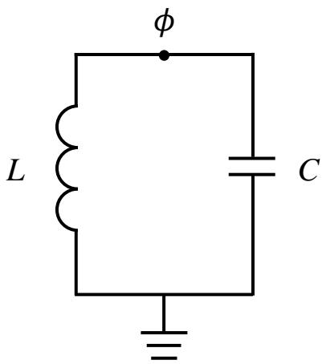  
图 2.6 LC 并联电路图。

接下来对该电路进行量子化，我们把磁通和电荷用算符表示，可以得到：

$$
\begin{array} { c } { { \phi  \hat { \phi } , } } \\ { { \phi  \hat { Q } , } } \\ { { \{ \phi , Q \} = 1  [ \hat { \phi } , \hat { Q } ] = i \hbar . } } \end{array}\tag{2.16}
$$

为了方便，后文中我们把算符上方的“帽子”记号给去掉。这样就得到该LC谐振腔电路的哈密顿量，它具有量子简谐振子的形式，谐振频率 $\omega _ { \mathrm { r } } = 1 / \sqrt { L C }$ 。定义标准产生和湮灭算符

$$
\begin{array} { r } { a = \frac { i } { \sqrt { 2 C \hbar \omega _ { \mathrm { r } } } } Q + \frac { 1 } { \sqrt { 2 L \hbar \omega _ { \mathrm { r } } } } \phi , } \\ { a ^ { \dagger } = \frac { - i } { \sqrt { 2 C \hbar \omega _ { \mathrm { r } } } } Q + \frac { 1 } { \sqrt { 2 L \hbar \omega _ { \mathrm { r } } } } \phi , } \end{array}\tag{2.17}
$$

这样定义的算符满足对易关系 $[ a , a ^ { \dagger } ] = 1$ ，那么 LC 谐振电路的哈密顿量就可以简化为

$$
H _ { \mathrm { r } } = \hbar \omega _ { \mathrm { r } } ( a ^ { \dagger } a + \frac { 1 } { 2 } ) .\tag{2.18}
$$

## 2.3.2 共面波导谐振腔

共面波导谐振腔（coplanar waveguide resonator）是超导谐振腔中最常见的一种，基本结构如图2.7所示。它采用了共面波导的结构，类似于二维的同轴线缆，中心导体作为传输线位于地平面之间，线宽为𝑎，中心导体到地平面的距离为𝑏，膜厚为 𝑡，一般不超过几百纳米，远小于衬底厚度，因此模型处理时可以把衬底近似为无穷厚。

这是一种分布式的谐振电路，谐振波波长与器件的尺寸相当。因为它较大的尺寸，所以在设计与制备时能够非常容易地调整它的谐振频率、特征阻抗等参数。共面波导传输线的特征阻抗为

$$
Z = \sqrt { \frac { R _ { l } + i \omega L _ { l } } { G _ { l } + i \omega C _ { l } } } ,\tag{2.19}
$$

其中 $R _ { l }$ ， $G _ { l }$ ， $L _ { l }$ 和 $C _ { l }$ 分别是单位长度的电阻、电导、电感和电容。在超导材料中（如常用的铝或者铌），损耗可以忽略不计，这样传输线的特征阻抗为 ${ Z = \sqrt { L _ { l } / C _ { l } } }$

共面波导的电感可以分为几何电感与动态电感这两部分，对于厚度较厚、中心导体截面积较大的一般超导材料，动态电感可以忽略不计（相关内容在下一小节）。共面波导的几何电感与电容的表达式为[18­19]：

$$
L _ { l } = \frac { \mu _ { 0 } } { 4 } \frac { K ( k ^ { \prime } ) } { K ( k ) } ,\tag{2.20}
$$

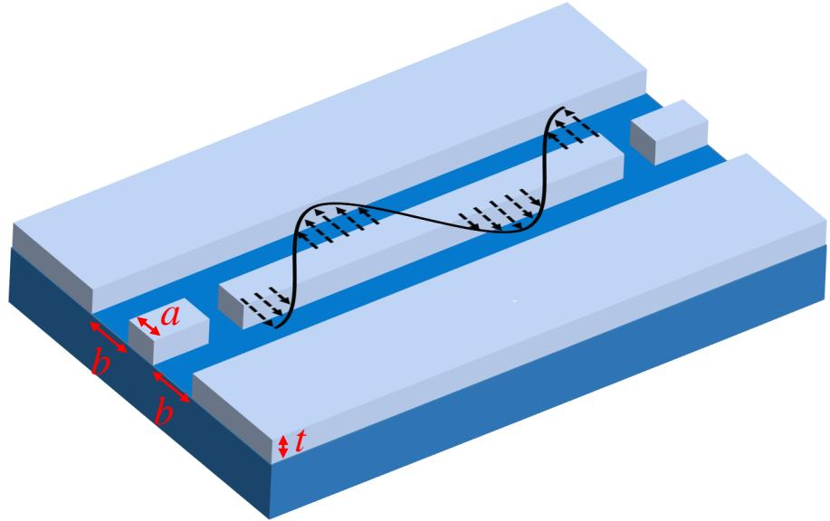  
图 2.7 共面波导传输线谐振腔示意图。中心导体线宽为𝑎，导体到地平面的距离为𝑏，膜厚为 𝑡。

$$
C _ { l } = 4 \varepsilon _ { 0 } \varepsilon _ { \mathrm { e f f } } \frac { K ( k ^ { \prime } ) } { K ( k ) } .\tag{2.21}
$$

式中的 𝜇 为真空磁导率， $\mu _ { 0 }$ $\varepsilon _ { 0 }$ 为真空介电常数，𝐾 是第一类完全椭圆积分， $k =$ $a / ( a + 2 b )$ ， $k ^ { \prime } = \sqrt { 1 - k ^ { 2 } }$ $\varepsilon _ { \mathrm { e f f } }$ 是有效介电常数，在这里定义为共面波导与真空的电容比，可以近似为 $\varepsilon _ { \mathrm { e f f } } = ( 1 + \varepsilon _ { \mathrm { r } } ) / 2$ ， $\varepsilon _ { \mathrm { r } }$ 是衬底的相对介电常数。

通过改变几何结构，我们能够方便地改变共面波导的电容电感以及特征阻抗。通常，传输线的标准特征阻抗为50Ω，与商用器件阻抗匹配，减少微波信号的反射或变形失真。

为了将共面波导传输线制作成谐振腔，我们需要对传输线的两端增加边界条件。如果一端形成开路，外界馈线到中心导线形成电容，功能类似于CQED中的反射镜，那么这一端的电压处于波腹位置；如果一端短路接地，那么这一端的电压处于波节位置。一个两端开路、总长度为𝑙 的共面波导就构成了一个二分之一波长（𝜆/2）的透射式传输线腔，谐振频率为

$$
\omega _ { \mathrm { n } } = \frac { n } { 2 l \sqrt { L _ { l } C _ { l } } } ,\tag{2.22}
$$

当 $n = 1$ 时对应基频。也可以将共面波导谐振腔设计成一端开路而另一端短路的𝜆/4 反射式谐振腔。在实际设计时，我们并不需要用到这一节中介绍的复杂计算公式，通常利用仿真模拟软件（例如Sonnet、HFSS等）来设计、验证具体的参数结果。

在实际测量中，谐振腔与周围电磁环境耦合，导致光子能量泄漏，以 $\kappa$ 的速率发生耗散。我们把 $\kappa$ 区分为内部损耗 $\kappa _ { \mathrm { i } }$ 与外部损耗 $\kappa _ { \mathrm { e } } :$

$$
\kappa = \kappa _ { \mathrm { i } } + \kappa _ { \mathrm { e } } ,\tag{2.23}
$$

其中外部损耗 $\kappa _ { \mathrm { e } }$ 是由于谐振腔与传输线通过电容耦合导致的光子泄露，与耦合处电容大小有关。对于透射式谐振腔，它的两端都与传输线耦合，耦合速率分别为 $\kappa _ { 1 }$ 和 $\kappa _ { 2 }$ （如图2.8所示），那么外部损耗为这两者之和， $\kappa _ { \mathrm { e } } = \kappa _ { 1 } + \kappa _ { 2 }$ 。而内部损耗的途径主要为超导体准粒子导致的电阻损耗[20]、来自衬底材料或是界面处二能级系统导致的介电损耗[21­22]，以及量子点电极与腔之间寄生电容导致的微波泄漏[23­25]。

实验上常常用品质因子 $Q$ 来量化描述谐振腔的性质，它与腔损耗速率的关系为

$$
Q = \omega _ { \mathrm { r } } \frac { \mp \pm \frac { } { } \mp \pm \frac { } { } \mp \frac { } { } \mp \frac { } { } \mp \frac { } { } \mp \frac { } { } \mp \frac { } { } \mp \frac { } { } \mp \frac { } { } \mp \frac { } { } \mp \frac { } { } \mp }  { \pm \frac { } { } \pm \frac { } { } \pm \frac { } { } \pm \frac { } { } \mp \frac { } { } \mp \frac { } { } \mp } = \frac { \omega _ { \mathrm { r } } } { \kappa } .\tag{2.24}
$$

它可以理解为谐振电路的能量衰减到1/𝑒时电路的平均振荡次数。根据不同的光子泄露途径，

$$
\frac { 1 } { Q } = \frac { 1 } { Q _ { \mathrm { e } } } + \frac { 1 } { Q _ { \mathrm { i } } } ,\tag{2.25}
$$

即总品质因子的倒数是外部品质因子 $Q _ { \mathrm { e } }$ 与内部品质因 $\daleth Q _ { \mathrm { i } }$ 的倒数之和。

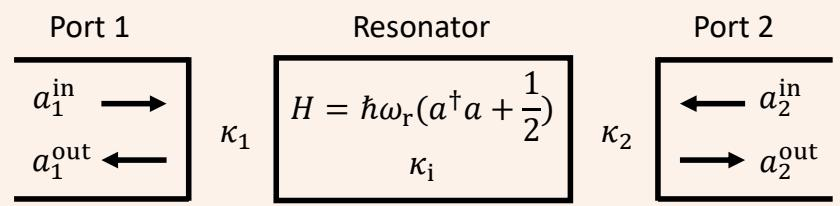  
图 2.8 共面波导传输线谐振腔的二端口网络示意图。

共面波导谐振腔作为一个两端口器件，它在微波工程中常常是利用散射矩阵（𝑆­参数）来描述[26]。其中散射参数 $S _ { i j }$ 定义为端口 𝑖 的反射波电压与端口𝑗的入射波电压之比。例如图2.8中的共面波导传输线谐振腔的二端口网络示意图，常利用 $S _ { 2 1 }$ 表示从端口 1 输入、从端口 2 输出的电压透射系数，根据输入–输出理论（input­output theory）[27]，具体表达式为

$$
S _ { 2 1 } ( \omega ) = \frac { a _ { 2 } ^ { \mathrm { o u t } } } { a _ { 1 } ^ { \mathrm { i n } } } = \frac { - i \sqrt { \kappa _ { 1 } \kappa _ { 2 } } } { ( \omega _ { \mathrm { r } } - \omega ) - i \kappa / 2 } ,\tag{2.26}
$$

其中 $\kappa _ { 1 }$ 和 $\kappa _ { 2 }$ 分别为端口 1 和端口 2 与共面波导腔通过电容耦合的耦合速率。

实验中常通过仪器采集谐振腔的输出幅值、功率和相位随探测频率变化的频谱。一般测量透射式谐振腔得到功率谱形式为

$$
| S _ { 2 1 } | ^ { 2 } ( \omega ) = A \frac { \kappa _ { 1 } \kappa _ { 2 } } { ( \omega - \omega _ { \mathrm { r } } ) ^ { 2 } + ( \kappa / 2 ) ^ { 2 } } ,\tag{2.27}
$$

相位为

$$
\phi ( \omega ) = \arctan { \left( \frac { 2 ( \omega - \omega _ { \mathrm { r } } ) } { \kappa } \right) } .\tag{2.28}
$$

功率谱表达式中的𝐴是待定的缩放常数参数（scalingparameter），由测量线路中的散射、放大等因素决定，所以处理数据时通常会根据本底噪声数据归一化。功率谱具有洛伦兹线型，它的半高宽（full width at halfmaximum，FWHM）就对应腔光子的耗散速率 𝜅，峰值位于谐振频率 $\kappa ,$ $\omega = \omega _ { \mathrm { r } }$ 处，仅允许谐振频率的微波透射。图2.9(a)展示了模拟计算得到的𝜆/2 透射式共面波导谐振腔频谱图。

类似的，对于反射式的谐振腔，它只有一个端口进行信号的输入输出，所以用散射参数 $S _ { 1 1 }$ 来描述：

$$
\begin{array} { c } { S _ { 1 1 } ( \omega ) = \frac { i ( \omega _ { \mathrm { r } } - \omega ) - ( \kappa _ { \mathrm { i } } - \kappa _ { \mathrm { e } } ) / 2 } { i ( \omega _ { \mathrm { r } } - \omega ) + ( \kappa _ { \mathrm { i } } + \kappa _ { \mathrm { e } } ) / 2 } } \\ { = 1 + \frac { i \kappa _ { \mathrm { i } } } { \omega _ { \mathrm { r } } - \omega - i ( \kappa _ { \mathrm { i } } + \kappa _ { \mathrm { e } } ) / 2 } . } \end{array}\tag{2.29}
$$

它与透射腔的区别在于它的幅值或是功率谱在远离谐振频率处反射信号为单位1，即被谐振电路完全反射，而在谐振频率附近形成一个吸收谷存储能量，如图2.9(b) 所示。

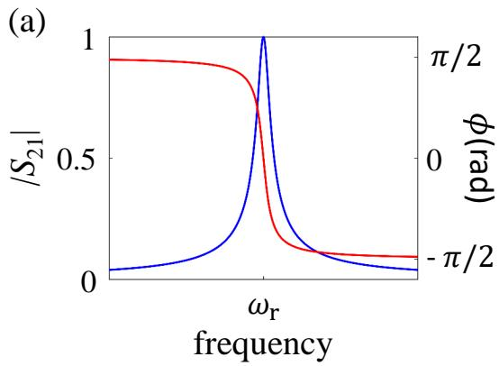

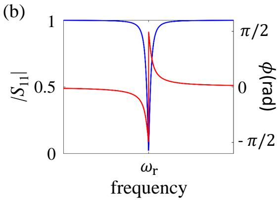  
图 2.9 透射式 (a) 和反射式(b) 谐振腔的幅值谱与相位谱示意图。

## 2.3.3 高动态电感谐振腔

在超导电路或是 cQED 实验中，一般使用传统 50Ω 阻抗的超导谐振腔来实现与外部测量线路的阻抗匹配。但是一些实验中，根据实验需求，会用到阻抗更高或是更低的谐振腔。通过提高（降低）阻抗，可以提高零点电压（电流）涨落（zero­point fluctuation)，从而增强到二能级系统的电[28]（磁[29]）偶极耦合强度。在我们的工作中，目标是提高电偶极耦合强度，所以需要制备更高阻抗的谐振腔。

因为超导谐振腔的阻抗 $Z _ { \mathrm { r } } = { \sqrt { L / C } }$ ，所以提高阻抗的有效方法是增大电感、减小电容。共面波导式谐振腔的电容𝐶可以通过增大中心导体到地面的距离，减小对地电容提高阻抗，而想要增大电感 $L$ 则可以利用 NbN、TiN 或是 NbTiN 这类高动态电感材料来制备谐振腔。

动态电感来自于载流子在导体内运动产生的动能。如图2.10所示，考虑一段长度为 𝑙、横截面积为 $w \times d$ 的超导纳米线，库珀对以速度 𝑣 运动产生的动能等价于纳米线内存储的电感能量[30]：

$$
E _ { \mathrm { k } } = { \frac { 1 } { 2 } } n _ { \mathrm { s } } ( l w d ) ( 2 m _ { \mathrm { e } } ) v ^ { 2 } = { \frac { 1 } { 2 } } L _ { \mathrm { k } } I ^ { 2 } ,\tag{2.30}
$$

其中，𝑛 是库珀对密度， $n _ { \mathrm { s } }$ $2 m _ { \mathrm { e } }$ 是一个库珀对的质量，𝐼 是超导纳米线的超流， $L _ { \mathrm { k } }$ 是动态电感。又因为电流 $I = n _ { \mathrm { s } } w d ( 2 e ) v$ ，代入上式得到动态电感的表达式为

$$
L _ { \mathrm { k } } = \frac { m _ { \mathrm { e } } } { 2 n _ { \mathrm { s } } e ^ { 2 } } \frac { l } { w d } .\tag{2.31}
$$

根据此表达式，减小纳米线的横截面积可以有效地提高它的动态电感，所以在制备高动态电感谐振腔时，我们会尽可能地减小薄膜的厚度和中心导体的宽度。

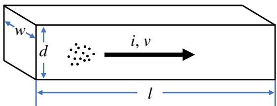  
图2.10 动态电感原理解释示意图。

根据 Ginzburg­Laudau 理论[31]，库珀对密度与温度的依赖关系为 $n _ { \mathrm { s } } ( T ) ~ \approx$ $n _ { \mathrm { s } } ( 0 ) ( 1 - T / T _ { \mathrm { c } } )$ ，其中 $T _ { \mathrm { c } }$ 为超导临界温度，即有

$$
L _ { \mathrm { k } } ( T ) = L _ { \mathrm { k } } ( 0 ) \left( \frac { 1 } { 1 - T / T _ { \mathrm { c } } } \right) .\tag{2.32}
$$

所以在材料的超导临界温度以下，越接近 $T _ { \mathrm { c } }$ ，动态电感越强。

我们也可以引入磁穿透深度（magnetic penetration depth）公式[31]

$$
\lambda ^ { 2 } ( T ) = \frac { m _ { \mathrm { e } } } { \mu _ { 0 } n _ { \mathrm { s } } ( T ) e ^ { 2 } } ,\tag{2.33}
$$

得到动态电感的表达式为

$$
L _ { \mathrm { k } } ( T ) = \mu _ { 0 } \lambda ^ { 2 } ( T ) \left( \frac { l } { w d } \right) .\tag{2.34}
$$

这样我们在选择超导腔薄膜材料时，优先考虑穿透深度大的材料。

在设计样品结构与制备高阻抗腔时，除了总的动态电感大小外，我们对单位长度的动态电感以及方块动态电感（sheetinductance）更感兴趣，其中方块动态电感 $L _ { \mathrm { s } }$ 与总动态电感 $L _ { \mathrm { k } }$ 的关系为

$$
L _ { \mathrm { s } } = L _ { \mathrm { k } } { \frac { w } { l } } .\tag{2.35}
$$

## 2.3.4 SQUID 阵列谐振腔

除了上一小节介绍的利用高动态电感材料制备纳米线高阻抗腔外，基于约瑟夫森结（Josephson junction）超材料（metamaterial）的超导量子干涉器件（su-perconducting quantum interference device，简称 SQUID）阵列制作的微波谐振腔，也可以达到高电感、高阻抗[32]。

一个约瑟夫森结由两个超导体夹着一个薄绝缘体构成，如图2.11(a)所示。每个超导体内的载流子由库珀对构成，所有的库珀对拥有集体相位 $\theta _ { \mathrm { L / R } }$ 。无外置偏压下，库珀对能够无损耗地隧穿过结产生超流，超流大小与结两侧的相位差有关[31]：

$$
I = I _ { \mathrm { c } } \sin \varphi ,\tag{2.36}
$$

其中 $\varphi = \theta _ { \mathrm { L } } - \theta _ { \mathrm { R } }$ ， $I _ { \mathrm { c } }$ 是临界电流。如果给约瑟夫森结施加一个直流偏置电压𝑉，相位差 $\varphi$ 就会随时间线性变化：

$$
{ \frac { \mathrm { d } \varphi } { \mathrm { d } t } } = { \frac { 2 e V } { \hbar } } ,\tag{2.37}
$$

即产生一个幅值为 $I _ { \mathrm { c } } .$ 、频率为 2𝑒𝑉/ℏ 的交流。

我们引入磁通 $\Phi ( t ) = \int _ { - \infty } ^ { t } V ( t ^ { \prime } ) \mathrm { d } t ^ { \prime }$ ，经过简单的计算就可以得到 $\textstyle \varphi = { \frac { 2 e } { \hbar } } \Phi =$ $2 \pi \frac { \Phi } { \Phi _ { 0 } }$ ，其中 $\varPhi _ { 0 } = h / 2 e$ 是磁通量 $\vec { \mathrm { \Delta } }$ 。那么

$$
I = I _ { \mathrm { c } } \sin { \left( 2 \pi \frac { \Phi } { \Phi _ { 0 } } \right) } .\tag{2.38}
$$

根据电感的定义𝑉 = 𝐿d𝐼/d𝑡，约瑟夫森结的电感

$$
L _ { \mathrm { J } } = { \frac { \Phi _ { 0 } } { 2 \pi I _ { \mathrm { c } } \cos \varphi } } .\tag{2.39}
$$

式中的 1/cos𝜑 体现出约瑟夫森结电感的非线性。因为超导电流的运动并不会产生磁感应能量，所以约瑟夫森结的电感一般被理解为动态电感而不是磁感，主要来自于库珀对隧穿过结时的惯性（inertia）[33]。正是动态电感导致了约瑟夫森结在单位面积内可以产生很高的电感。

在这个约瑟夫森上累积的能量为

$$
E ( t ) = \intop _ { - \infty } ^ { t } I ( t ^ { \prime } ) V \mathrm { d } t ^ { * } = - E _ { \mathrm { J } } \cos \varphi ( t ) ,\tag{2.40}
$$

其中， $E _ { \mathrm { J } } = I _ { \mathrm { c } } \Phi _ { 0 } / 2 \pi$ 是约瑟夫森能。

当我们像图2.11(b)所示的那样，把两个约瑟夫森结并联在一起，就得到了一个 SQUID 环。从左侧进入的超流会分成两路经过两个约瑟夫森结发生干涉，干涉结果与相位有关，受磁通影响。为了处理磁场作用下的 SQUID 环，需要引入规范不变相位差 $\begin{array} { r } { \tilde { \varphi } = \varphi - \frac { 2 \pi } { \Phi _ { 0 } } \int \mathbf { A } \mathrm { d } \mathbf { s } } \end{array}$ ，A是磁矢势，第二项代表将A沿某个路径积分。如果我们选择的积分路径经过 SQUID 环的两个约瑟夫森结构成闭环，那么积分结果就等于穿过该SQUID环的磁通 $\Phi _ { \mathrm { m } }$ 。假设SQUID环的两条路径完全对称，那么受到 $\Phi _ { \mathrm { m } }$ 调制的 SQUID 环的超流为

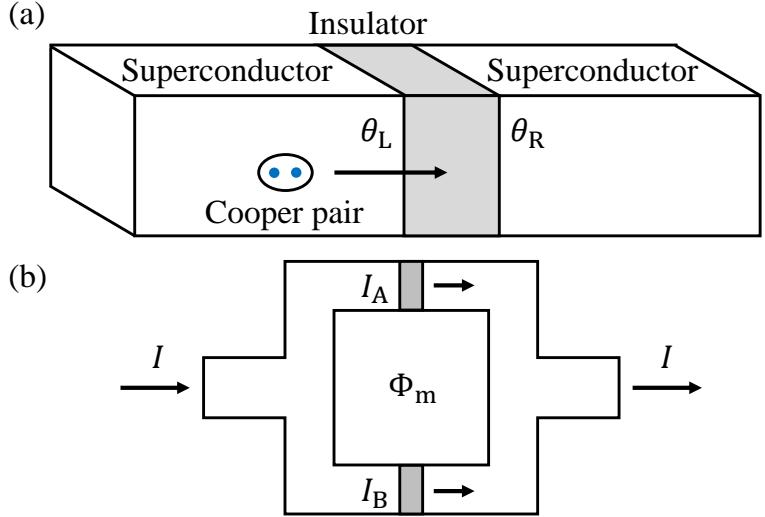  
图 2.11 (a)约瑟夫森结结构示意图。(b)SQUID结构示意图。由两个约瑟夫森结并联组成。

$$
I _ { \mathrm { S } } = 2 I _ { \mathrm { c } } \left| \cos \left( \pi \frac { \Phi _ { \mathrm { m } } } { \Phi _ { 0 } } \right) \right| .\tag{2.41}
$$

由于量子干涉，最大超导电流发生了改变。类似的，我们也能得到 SQUID 环的电感和能量：

$$
L _ { \mathrm { S } } = \frac { 1 } { 2 } L _ { \mathrm { J } } \left. \cos { \left( \pi \frac { \Phi _ { \mathrm { m } } } { \Phi _ { 0 } } \right) } \right. ^ { - 1 } ,\tag{2.42}
$$

$$
E _ { \mathrm { S } } = 2 E _ { \mathrm { J } } \left( \cos \left( \pi { \frac { \Phi _ { \mathrm { m } } } { \Phi _ { \mathrm { 0 } } } } \right) \right| .\tag{2.43}
$$

对比单个约瑟夫森结，SQUID 环同样具有非线性与无损性，区别在于它的临界电流与电感等参数都可以通过外加磁场来改变磁通 $\Phi _ { \mathrm { m } }$ 进行调节。因此计算时，我们可以把单个SQUID 环等效为一个临界电流可调的约瑟夫森结来处理。

由于约瑟夫森结和 SQUID 都有很强的非线性，当光子数增多时，谐振模式的频率间隔不等，所以不适合用来制作谐振腔。不过，如果把大量的 SQUID 串连起来做成阵列，就能在较大的参数范围内，将这个谐振电路近似为线性的[13]。

尽管SQUID阵列中非线性电感分布在整个电路中，但是不能把这个SQUID阵列谐振腔按照分布式电路处理。在它的谐振频率附近，表现为集总式电路[13]。如图2.12(a)所示的SQUID阵列结构示意图，它由相同结构、相同参数的SQUID重复排列。每个SQUID环作为一个组成单元，电容、电感分别为 $C _ { \mathrm { { S } } } , ~ L _ { \mathrm { { S } } }$ ，对地电容为 $C _ { 0 }$ 。由𝑁 个 SQUID 单元成的SQUID 阵列的拉格朗日量为

$$
\mathcal { L } = \sum _ { n = 1 } ^ { N } \left[ \frac { 1 } { 2 } C _ { 0 } \dot { \Phi } _ { n } ^ { 2 } + \frac { 1 } { 2 } C _ { \mathrm { S } } ( \dot { \Phi } _ { n } - \dot { \Phi } _ { n + 1 } ) ^ { 2 } - \frac { 1 } { 2 } \frac { ( \Phi _ { n } - \Phi _ { n + 1 } ) ^ { 2 } } { L _ { \mathrm { S } } } \right] ,\tag{2.44}
$$

其中， $\Phi _ { n }$ 是约瑟夫森结的节点磁通（node flux）。与2.3.1小节中处理 LC 电路类似，求和中的前两项分别是对地电容和结电容的能量，第三项是结电感的能量。我们将每个节点磁通进行傅里叶展开，方便后面哈密顿量的对角化：

$$
\Phi _ { n } = { \frac { 1 } { \sqrt { N } } } \sum _ { k = 1 } ^ { N } e ^ { i k \pi n / N } \Phi _ { k } ,\tag{2.45}
$$

则新傅里叶基矢下的哈密顿量[34] 为

$$
H = \sum _ { k , k ^ { \prime } = - N / 2 } ^ { N / 2 } Q _ { k } \mathbb { C } _ { k k ^ { \prime } } ^ { - 1 } Q _ { - k ^ { \prime } } + \Phi _ { k } \mathbb { L } _ { k k ^ { \prime } } ^ { - 1 } \Phi _ { - k ^ { \prime } } ,\tag{2.46}
$$

其中， $Q _ { k }$ 是磁通 $\Phi _ { k }$ 的共轭变量，相当于电荷，而电容、电感矩阵

$$
\mathbb { C } _ { k k ^ { \prime } } = \delta _ { k k ^ { \prime } } \left[ \frac { C _ { 0 } } { 2 } + C _ { \mathrm { S } } ( 1 - \cos \frac { \pi k } { N } ) \right] ,\tag{2.47}
$$

$$
\mathbb { L } _ { k k ^ { \prime } } = \delta _ { k k ^ { \prime } } \frac { L _ { \mathrm { S } } } { 1 - \cos \frac { \pi k } { N } } .\tag{2.48}
$$

那么这个 SQUID 阵列的色散关系[34]

$$
\omega _ { k } = \frac { 1 } { \sqrt { \mathbb { L } _ { \mathbb { k } \mathbb { k } } \mathbb { C } _ { \mathbb { k } \mathbb { k } } } } = \omega _ { 0 } \sqrt { \frac { 1 - \cos \frac { \pi k } { N } } { \frac { C _ { 0 } } { 2 C _ { \mathrm { s } } } + ( 1 - \cos \frac { \pi k } { N } ) } } ,\tag{2.49}
$$

$$
\omega _ { 0 } = \frac { 1 } { \sqrt { L _ { \mathrm { s } } C _ { \mathrm { S } } } } .\tag{2.50}
$$

$\omega _ { 0 }$ 被称为单个结的等离子体频率（plasmafrequency）。只要我们设计合适的结参数、SQUID 数目，就可以制备出符合频率要求、高阻抗的 SQUID 阵列谐振腔，且谐振频率可以通过外加磁通进行调节。

这里我们仅仅考虑了最简单的情况，推导过程也比较简略。在样品制备过程中，通常采用两次斜蒸发镀膜与氧化的工艺来制作约瑟夫森结，所以两个相邻的 SQUID 之间实际还存在一个很大的结。真实的 SQUID 阵列重复单元应该如图2.12(b) 一样，由两个串联的岛构成，其中两个并联的约瑟夫森结 $\{ L _ { \mathrm { S } } , C _ { \mathrm { S } } \}$ 与对地电容 $C _ { 0 }$ 组成一个岛，一个大约瑟夫森结 $\{ L _ { \mathrm { J } } , C _ { \mathrm { J } } \}$ 与对地电容 $C _ { 0 }$ 组成另一个岛。但由于连接在 SQUID 之间的约瑟夫森结面积很大，它的非线性可以忽略不计。这种更复杂的模型也可以采用和本小节类似的处理方法。此外，为了将SQUID 阵列作为高阻抗微波谐振腔使用，我们会将阵列的一端通过电容耦合到馈线上，而在另一端制作了一个极大的电容接地，这样形成一个四分之一波长的反射腔。更加复杂的模型和更加详细的理论计算可以参考文献[33­34]。

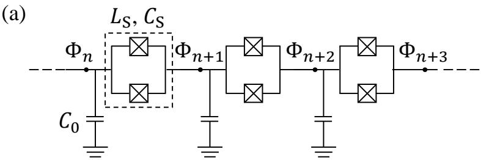  
(b)

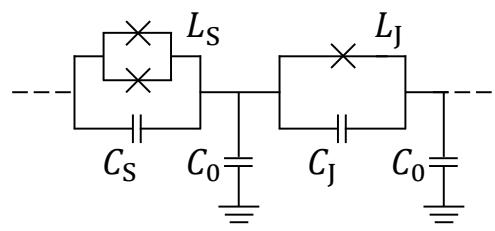  
图 2.12 SQUID 阵列示意图. (a) 串联起来的 SQUID 环构成的谐振电路。(b) 实际样品中组成 SQUID 阵列的重复单元。

## 2.4 半导体量子点与谐振腔耦合

在前面几节中已经介绍了cQED的基本知识，以及组成cQED系统的基本单元——半导体量子点和超导谐振腔。在这一节中，我们把量子点与谐振腔组合起来，给出耦合强度的具体表达式与参数依赖关系，并讨论在半导体量子点cQED中量子点状态的读取。

图2.13展示了微波谐振腔与双量子点的耦合结构。𝜆/2 共面波导谐振腔的一端伸出一根电极与双量子点中的左点电容耦合。我们选择双量子点而非单量子点是因为双量子点的轨道能量可以通过电极调控，达到20–40µeV，这个能量恰好处于微波谐振腔的一般设计频率范围 5–10GHz （1GHz ∼ 4.2µeV），而单量子点的能级轨道劈裂一般大于这个数值。此外，双量子点两个点之间的间隔普遍在100nm量级，导致它的电偶极矩远大于单量子点，与腔光子的耦合强度更大。

谐振腔内产生的电场涨落通过耦合电极作用到左侧量子上，影响双量子点电荷态的失谐量，因此腔与量子点的相互作用

$$
\hat { H } _ { \mathrm { i n t } } = e c _ { \mathrm { c } } \hat { \tau } _ { z } \hat { V } ,\tag{2.51}
$$

其中， $\hat { \tau _ { z } }$ 是以量子点电荷态 |𝐿⟩ 和 $| R \rangle$ 为基矢的泡利 $z$ 算符； $( c _ { \mathrm { c } } \hat { V } )$ 是左量子点感受到的有效腔场， $c _ { \mathrm { c } } = C _ { \mathrm { L } } / C _ { \Sigma }$ ，表示左侧耦合电极到量子点的电容 $C _ { \mathrm { { L } } }$ 与左点的总电容 $C _ { \Sigma }$ 之比， $e c _ { \mathrm { c } }$ 即耦合电极的“杠杆臂”（leverarm），𝑉̂ 是谐振腔末端产生的电压，即左点上方耦合电极的电压，表达式为[35]

$$
\hat { V } = V _ { \mathrm { r m s } } ( \hat { a } ^ { \dagger } + \hat { a } ) = \sqrt { \frac { \hbar \omega _ { \mathrm { r } } } { l C _ { l } } } ( \hat { a } ^ { \dagger } + \hat { a } ) ,\tag{2.52}
$$

$V _ { \mathrm { r m s } }$ 是谐振腔在量子点上方产生的真空涨落场的均方根， $\omega _ { \mathrm { r } } = \pi / l C _ { l } Z _ { \mathrm { r } }$ 是腔的谐

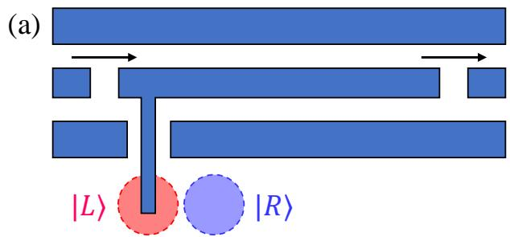

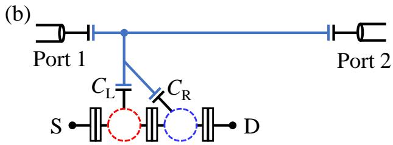  
图 2.13 微波谐振腔与双量子点的耦合。(a) 耦合结构示意图。(b) 耦合电路示意图。

振基频， $Z _ { \mathrm { r } }$ 是腔的特征阻抗， $l C _ { l }$ 是腔的总电容， $\hat { a } ^ { \dagger }$ 和 $\hat { a }$ 分别是腔光子的产生和湮灭算符。为了方便，我们把算符上方的“帽子”记号去掉。

参考第2.2节中的方法，我们把坐标系旋转到双量子点 $\{ | + \rangle , | - \rangle \}$ 本征矢下，那么相互作用哈密顿量可以写为

$$
H _ { \mathrm { i n t } } = \hbar \omega _ { \mathrm { r } } c _ { \mathrm { c } } \sqrt { \frac { 2 Z _ { \mathrm { r } } } { R _ { \mathrm { Q } } } } ( \sigma _ { z } \cos \theta + \sigma _ { x } \sin \theta ) ( a ^ { \dagger } + a ) ,\tag{2.53}
$$

其中， $R _ { 0 } = h / e ^ { 2 } \approx 2 6 \mathrm { k } \Omega$ 是电阻量子， $\sigma _ { x }$ 和 $\sigma _ { z }$ 是双量子点本征矢下的泡利算符，混合角 $\theta = \arctan { ( 2 t _ { \mathrm { c } } / \varepsilon ) }$ ，且有 $\sin \theta = 2 t _ { \mathrm { c } } / \hbar \omega _ { \mathrm { a } } , ~ \cos \theta = \varepsilon / \hbar \omega _ { \mathrm { a } }$

现在即可定义全局耦合强度（overall coupling strength，有文献也称为 barecoupling strength）

$$
g _ { \mathrm { 0 } } = \omega _ { \mathrm { r } } c _ { \mathrm { c } } \sqrt { \frac { 2 Z _ { \mathrm { r } } } { R _ { \mathrm { Q } } } } .\tag{2.54}
$$

在哈密顿量 (2.53) 中， $\sigma _ { z }$ 对应的 $g _ { 0 } \cos \theta$ 是纵场耦合强度， $\sigma _ { x }$ 对应的 $g _ { 0 } \sin \theta$ 是横场耦合强度。在旋波近似条件下， $g _ { \mathrm { 0 } } \ll \omega _ { \mathrm { a } } , \omega _ { \mathrm { r } }$ ，且 $| \omega _ { \mathrm { a } } - \omega _ { \mathrm { r } } |$ ≪ $\omega _ { \mathrm { a } } + \omega _ { \mathrm { r } }$ ，那么我们可以忽略掉哈密顿量中的导致能量不守恒的项，完整的哈密顿量写作

$$
\begin{array} { l } { { H = H _ { \mathrm { r } } + H _ { \mathrm { D Q D } } + H _ { \mathrm { i n t } } } } \\ { { \ } } \\ { { = \hbar \omega _ { \mathrm { r } } ( a ^ { \dagger } a + \displaystyle \frac { 1 } { 2 } ) + \displaystyle \frac { 1 } { 2 } \hbar \omega _ { \mathrm { a } } \sigma _ { z } + \hbar g _ { 0 } \sin \theta ( a ^ { \dagger } \sigma _ { - } + a \sigma _ { + } ) . } } \end{array}\tag{2.55}
$$

该哈密顿量与第2.1节中的 J­C 哈密顿量形式一致，区别在于双量子点到腔的有效耦合强度

$$
g _ { \mathrm { c } } = g _ { 0 } \sin \theta = g _ { 0 } \frac { 2 t _ { \mathrm { c } } } { \hbar \omega _ { \mathrm { a } } } ,\tag{2.56}
$$

随着量子点系统参数的改变而发生变化。混合角 $\theta$ 可以理解为双量子点的极化率，即量子点系统受谐振腔电场诱导产生偶极矩的能力。当量子点的失谐量𝜀较

小时， $\sin \theta \approx 1$ ，量子点的本征态 $| \pm \rangle = ( | L \rangle \pm | R \rangle ) / \sqrt { 2 }$ 为最大混合态，电子的波函数弥散在两个点内，所以点的极化率达到最大，耦合强度也最大。当量子点的失谐量 𝜀 较大时， $\sin \theta \approx 0$ ，电子则被局限在单个点内，所以耦合强度也很小。

需要说明的是，这里我们只考虑基模下谐振腔与量子点的耦合，对于高阶模式 𝑛，耦合强度为

$$
g ^ { ( n ) } = g _ { 0 } \sin \theta \sqrt { \frac { \omega _ { n } } { \omega _ { r } } } .\tag{2.57}
$$

此外，在考虑谐振腔电场对量子点失谐量的影响时，我们认为作用强度与耦合电极对左量子点的电容耦合比 $c _ { \mathrm { c } } = C _ { \mathrm { L } } / C _ { \Sigma }$ 相关，但是在更为完善的模型中的还应该考虑耦合电极对右点的电容耦合，如图2.13(b) 所示，尽管这一电容一般很小。这样耦合强度应当正比于 $( C _ { \mathrm { L } } - C _ { \mathrm { R } } ) / C _ { \Sigma }$ ，详细推导与讨论请读者阅读文献 [36]，在该文献中还利用量子点间耦合电容随电极的易调节性来大范围调节耦合强度，最大达到了 619MHz，是目前已知的最大量子点电荷量子比特与腔的耦合强度，$g _ { \mathrm { c } } / \omega _ { \mathrm { r } } \sim 0 . 1 1$ ，实现了超强耦合。因此，仔细分析与深入理解耦合强度表达式中的各个参数，对提高耦合强度、实现强耦合非常重要。

在量子点与腔耦合的杂化系统中，可以利用谐振腔来探测量子点的电荷状态以及它们之间的相互作用。根据输入–输出理论[27,37­38]，透射式共面波导微波谐振腔的透射系数

$$
S _ { 2 1 } = \frac { - i \sqrt { \kappa _ { 1 } \kappa _ { 2 } } } { \omega _ { \mathrm { r } } - \omega + g _ { \mathrm { c } } \chi - i \kappa / 2 } .\tag{2.58}
$$

在上式 $\sharp , \chi$ 是双量子点内电子的磁化系数 （susceptibility)，具体表达式为

$$
\chi = \frac { g _ { \mathrm { c } } } { - \Delta + i \gamma } ,\tag{2.59}
$$

其中 $\Delta = \omega _ { \mathrm { a } } - \omega$ 是电荷比特频率与探测频率之间的失谐量， $\gamma = \gamma _ { 1 } / 2 + \gamma _ { \phi }$ 是电荷比特的消相干速率， $\gamma _ { 1 }$ 和 $\gamma _ { \phi }$ 分别是比特的弛豫速率和退相位速率。

类似的，反射式谐振腔对量子点的响应也可以通过反射系数得到，

$$
S _ { 1 1 } = 1 + \frac { i \kappa _ { \mathrm { i } } } { \omega _ { \mathrm { r } } - \omega + g _ { \mathrm { c } } \chi - i \kappa / 2 } .\tag{2.60}
$$

如果耦合强度 $g _ { \mathrm { c } }$ 很小，或是电荷比特的失谐量很大导致 $\chi \approx 0$ ，双量子点与腔的耦合消失，那么 $S$ 参数会简化为公式2.26和公式2.29给出的洛伦兹线型的谐振腔响应。

最后，我们把公式2.58或是公式2.60中的分母按照实部与虚部分类，讨论比特对谐振腔的影响。可以发现，实部会影响谐振腔的频率而虚部会影响腔的展宽：

$$
\omega _ { \mathrm { r } } ^ { \prime } = \omega _ { \mathrm { r } } + \mathrm { R e } \left( g _ { \mathrm { c } } \chi \right) = \omega _ { \mathrm { r } } - \frac { g _ { \mathrm { c } } ^ { 2 } \Delta } { \Delta ^ { 2 } + \gamma ^ { 2 } } ,\tag{2.61}
$$

$$
\kappa ^ { \prime } = \kappa - 2 \mathrm { I m } ( g _ { \mathrm { c } } \chi ) = \kappa + \frac { 2 g _ { \mathrm { c } } ^ { 2 } \gamma } { \Delta ^ { 2 } + \gamma ^ { 2 } } .\tag{2.62}
$$

在色散耦合区， $| \Delta | \gg g _ { \mathrm { c } }$ ，那么频率的色散偏移 $\Delta \omega _ { \mathrm { r } } \approx g _ { \mathrm { c } } ^ { 2 } / \Delta$ ，该结果与通过 J–C 哈密顿量在色散耦合极限下推导出来的结果（公式2.7）一致。而在近共振区，$| \Delta | \sim 0$ ，比特与腔的耦合引入了额外的腔光子耗散通道，腔的性质会受到比特的显著影响，导致展宽增大、可见度下降。

## 参考文献

[1] Rabi I I. Space quantization in a gyrating magnetic field. Physical Review, 1937, 51(8):652.

[2] Xie Q, Zhong H, Batchelor M T, et al. The quantum Rabi model: Solution and dynamics. Journal of Physics A: Mathematical and Theoretical, 2017, 50(11):113001.

[3] 张苗磊. 谐振腔与量子点耦合体系的研究. 中国科学技术大学,2014.

[4] Kouwenhoven L P, Marcus C M, McEuen P L, et al. Electron transport in quantum dots. Dordrecht: Kluwer, 1997: 105.

[5] van der Wiel W G, Franceschi S D, Elzerman J M, et al. Electron transport through double quantum dots. Reviews of Modern Physics, 2003, 75(1):1.

[6] Hanson R, Kouwenhoven L P, Petta J R, et al. Spins in few­electron quantum dots. Reviews of Modern Physics, 2007, 79(4):1217.

[7] 李海欧. 砷化镓量子点中强测量反作用下的单电子电荷和自旋研究. 中国科学技术大学,2012.

[8] 曹刚. 半导体双量子点系统中的量子输运研究. 中国科学技术大学,2012.

[9] 尤杰. 新型砷化镓量子点的制备与量子输运研究. 中国科学技术大学, 2016.

[10] Oosterkamp T H, Fujisawa T, van der Wiel W G, et al. Microwave spectroscopy of a quantumdot molecule. Nature, 1998, 395(6705):873.

[11] Day P K, LeDuc H G, Mazin B A, et al. A broadband superconducting detector suitable for use in large arrays. Nature, 2003, 425(6960):817.

[12] Tholén E A, Ergül A, Doherty E M, et al. Nonlinearities and parametric amplification in superconducting coplanar waveguide resonators. Applied physics letters, 2007, 90(25):253509.

[13] Castellanos­Beltran M A, Lehnert K W. Widely tunable parametric amplifier based on a superconducting quantum interference device array resonator. Applied Physics Letters, 2007, 91 (8):83509.

[14] Endo A, Sfiligoj C, Yates S J C, et al. On­chip filter bank spectroscopy at 600–700 GHz using NbTiN superconducting resonators. Applied Physics Letters, 2013, 103(3):32601.

[15] Landig A J, Koski J V, Scarlino P, et al. Virtual­photon­mediated spin­qubit–transmon coupling. Nature Communications, 2019, 10(1):1.

[16] Naik R K, Leung N, Chakram S, et al. Random access quantum information processors using multimode circuit quantum electrodynamics. Nature Communications, 2017, 8(1):1.

[17] Blais A, Huang R S, Wallraff A, et al. Cavity quantum electrodynamics for superconducting electrical circuits: an architecture for quantum computation. Physical Review A, 2004, 69(6): 62320.

[18] Simons R N. Coplanar waveguide circuits, components, and systems: volume 165. John Wiley

& Sons, 2004.

[19] Göppl M, Fragner A, Baur M, et al. Coplanar waveguide resonators for circuit quantum electrodynamics. Journal of Applied Physics, 2008, 104(11):113904.

[20] Kuhr S, Raimond J M, Jacques E, et al. An ultrahigh Finesse Fabry­Perot superconducting resonator as a photon box for cavity­QED experiments. 2006.

[21] Gao J, Daal M, Vayonakis A, et al. Experimental evidence for a surface distribution of twolevel systems in superconducting lithographed microwave resonators. Applied Physics Letters, 2008, 92(15):152505.

[22] O’Connell A D, Ansmann M, Bialczak R C, et al. Microwave dielectric loss at single photon energies and millikelvin temperatures. Applied Physics Letters, 2008, 92(11):112903.

[23] Mi X, Cady J V, Zajac D M, et al. Circuit quantum electrodynamics architecture for gatedefined quantum dots in silicon. Applied Physics Letters, 2017, 110(4):43502.

[24] Holman N, Dodson J P, Edge L F, et al. Microwave engineering for semiconductor quantum dots in a cQED architecture. Applied Physics Letters, 2020, 117(8):083502.

[25] Harvey­Collard P, Zheng G, Dijkema J, et al. On­chip microwave filters for high­impedance resonators with gate­defined quantum dots. Physical Review Applied, 2020, 14(3):034025.

[26] Pozar D M. Microwave engineering. John wiley & sons, 2011.

[27] Collett M J, Gardiner C W. Squeezing of intracavity and traveling­wave light fields produced in parametric amplification. Physical Review A, 1984, 30(3):1386.

[28] Samkharadze N, Bruno A, Scarlino P, et al. High­kinetic­inductance superconducting nanowire resonators for circuit QED in a magnetic field. Physical Review Applied, 2016, 5(4):44004.

[29] Eichler C, Sigillito A J, Lyon S A, et al. Electron spin resonance at the level of 1 0 4 spins using low impedance superconducting resonators. Physical review letters, 2017, 118(3):37701.

[30] Annunziata A J, Santavicca D F, Frunzio L, et al. Tunable superconducting nanoinductors. Nanotechnology, 2010, 21(44):445202.

[31] Tinkham M. Introduction to superconductivity. Courier Corporation, 2004.

[32] Stockklauser A, Scarlino P, Koski J V, et al. Strong coupling cavity QED with gate­defined double quantum dots enabled by a high impedance resonator. Physical Review X, 2017, 7(1): 011030.

[33] Stockklauser A. Strong coupling circuit QED with semiconductor quantum dots. ETH Zurich, 2017.

[34] Masluk N A, Pop I M, Kamal A, et al. Microwave characterization of Josephson junction arrays: Implementing a low loss superinductance. Physical Review Letters, 2012, 109(13): 137002.

[35] Childress L, Sørensen A S, Lukin M D. Mesoscopic cavity quantum electrodynamics with

quantum dots. Physical Review A, 2004, 69(4):42302.

[36] Scarlino P, Ungerer J H, van Woerkom D J, et al. In­situ tuning of the electric dipole strength of a double dot charge qubit: Charge noise protection and ultra strong coupling. arXiv:2104.03045, 2021.

[37] Petersson K D, McFaul L W, Schroer M D, et al. Circuit quantum electrodynamics with a spin qubit. Nature, 2012, 490(7420):380.

[38] Burkard G, Gullans M J, Mi X, et al. Superconductor–semiconductor hybrid­circuit quantum electrodynamics. Nature Reviews Physics, 2020, 2(3):129.

## 第 3 章 强耦合结构设计与实验表征

## 3.1 耦合结构设计

为了获得GaAs双量子点与超导谐振腔的强耦合样品，我们必须仔细设计样品结构，尽可能地提高耦合强度并减小微波腔的信号泄露。在第2章中，我们已经给出了耦合强度的公式：

$$
g _ { \mathrm { 0 } } = \omega _ { \mathrm { r } } c _ { \mathrm { c } } \sqrt { \frac { 2 Z _ { \mathrm { r } } } { R _ { \mathrm { Q } } } } .\tag{2.54}
$$

因此，要想提高耦合强度，从结构设计上，一是要增大耦合电极到量子点的电容占比 $c _ { \mathrm { c } }$ ，二是要提高谐振腔的阻抗 $Z _ { \mathrm { r } } 。$ 。针对这两点要求，设计时的主要注意点如下：

1. 适当增大量子点的尺寸，从而增大电子波函数的空间分布，提高电偶极矩。但是过大的量子点会导致能级过密，电子难以排干净达到少电子区域。

2. 使超导腔伸出的耦合电极尽可能接近量子点成点位置，也可以适当增大量子点区域上方耦合电极的面积，从而增大耦合电容。

3. 尽可能减小耦合电极在二维电子气平台上的延伸长度，从而减小异质结上其它二能级系统的寄生电容导致的微波泄漏。

4. 腔的特征阻抗 $Z _ { \mathrm { r } } = { \sqrt { L / C } }$ ，与电感、电容有关，所以要选择具有高电感的材料或结构制作谐振腔，同时把中心导体到两侧地平面的距离拉开，减少腔的对地电容，提高阻抗。

为了获得高阻抗的谐振腔，我们尝试了不同的方案，包括高几何电感的集总式 LC 谐振腔（见附录部分）、SQUID 阵列腔、高阻抗Nb 纳米线腔和NbTiN 纳米线腔，而最终获得成功的是NbTiN腔和SQUID阵列腔，均实现了与双量子点的强耦合。在后文中，第4章的样品采用了NbTiN纳米线腔与两个双点耦合的结构，第5章和第6章的样品采用了SQUID 阵列腔与两个双点耦合的结构。

我们首先制备成功的是 SQUID 阵列谐振腔，它的耦合结构设计如图3.1所  
示，经过微纳工艺加工后得到的样品如图3.2所示。SQUID 阵列的尺寸较小，总  
长度约为 $2 0 0 \mu \mathrm { m }$ ，阵列由 38 个 SQUID 串联构成，最右端通过一个很大的电容  
接地，构成四分之一波长（𝜆/4）反射腔。腔的左端连接到一个较大的铝岛上，岛  
的一侧连接着两个双量子点，另一侧通过交指电容耦合到共面波导传输线实现  
微波的输入和腔信号的读取。外围结构则主要由量子点大电极、二维电子气平台  
和谐振腔地平面构成，总尺寸为 $3 \times 3 \mathrm { m m } ^ { 2 }$ 0

在这种耦合结构设计中，两个双量子点通过耦合电极连接到 SQUID 腔的同一侧，可能由于表面栅极存在直接的电容耦合。为了确定该电容耦合的影响，我们测量了两个双量子点之间的串扰，发现这个电容相互作用可以忽略不计。在文献 [1] 的补充材料中我们对该问题进行了详细的讨论。

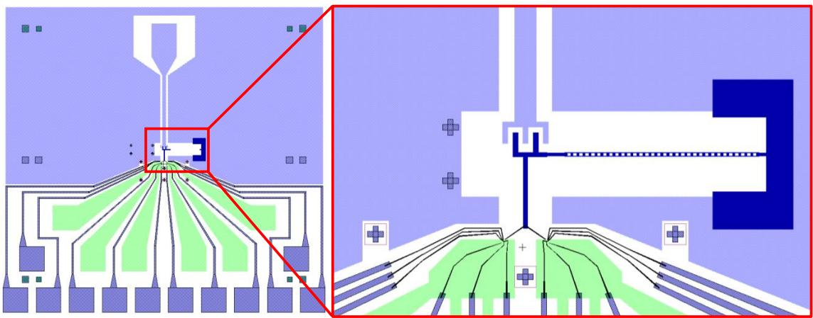  
图 3.1 SQUID 阵列谐振腔和 GaAs 两个双量子点耦合结构的设计图。

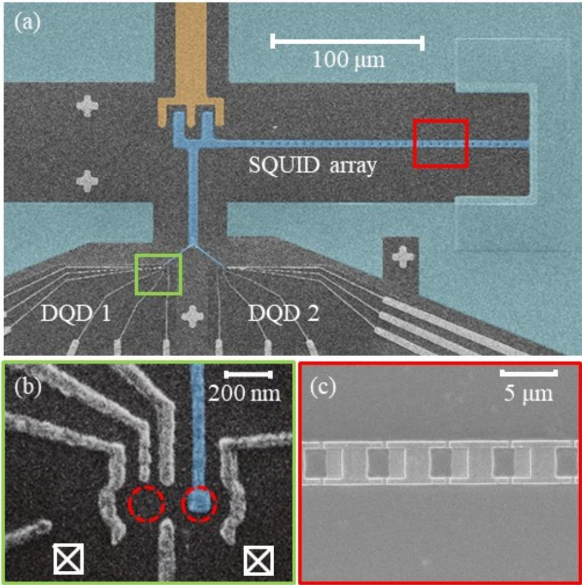  
图 3.2 SQUID 阵列谐振腔和 GaAs 两个双量子点耦合样品的扫描电子显微镜图。(b) 和 (c)分别是图 (a) 中放大的双量子点结构和 SQUID 阵列结构。

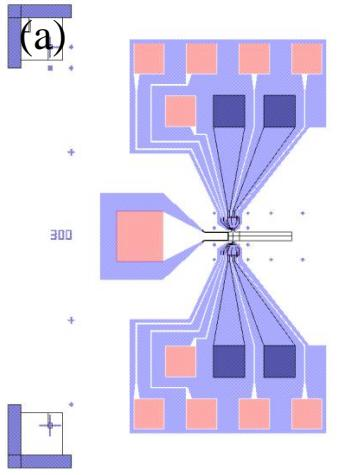

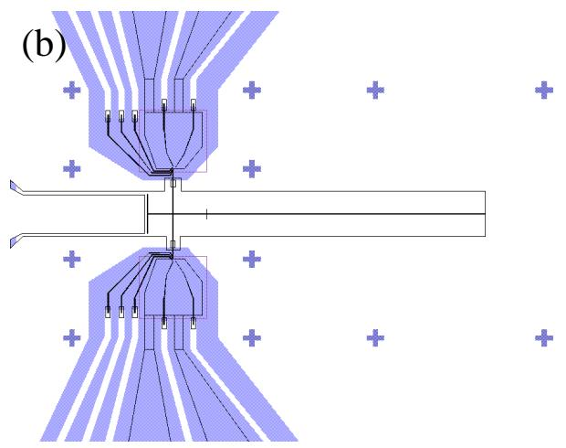

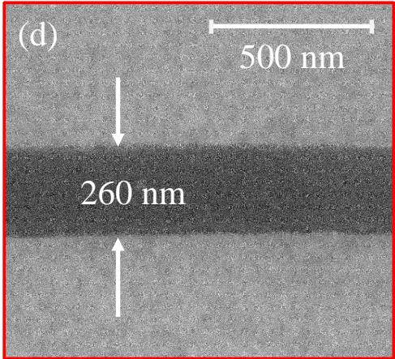

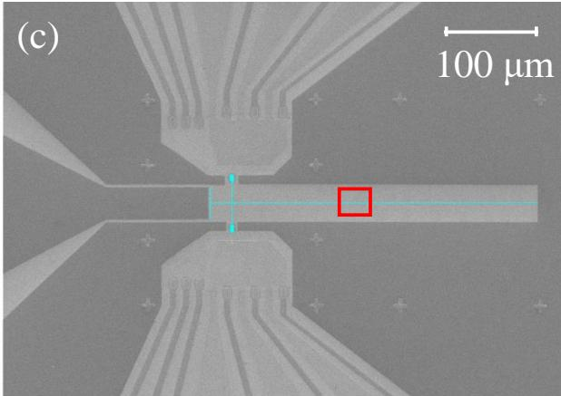  
图 3.3 NbTiN 纳米线腔与 GaAs 两个双量子点耦合结构。(a) 结构设计图。(b) 设计图的核心结构放大。(c)样品的扫描电子显微镜图。(d)放大后的NbTiN腔中心导体，宽度为 260 nm。

虽然SQUID腔可以通过改变外加磁场来调节谐振频率，但是当磁场较大时，铝制成的 SQUID 失超，不能用于与自旋比特的耦合。此外 SQUID 性质随磁通的变化非常灵敏，如果磁噪声比较大，或者样品制作不佳，那么它的频率会受到影响而不稳定。所以我们后来放弃了 SQUID 腔这条强耦合路线，尝试了抗磁性较好、有较大动态电感的NbTiN腔，其耦合结构设计和样品如图3.3所示。

公式2.34已经给出了动态电感的表达式 $L _ { \mathrm { k } } \propto l / w d$ ，其中 𝑙 为超导线的长度、𝑤为宽度、𝑑 为厚度，所以为了得到足够高的动态电感提高耦合强度，NbTiN腔的中心导体横截面被设计得尽可能小。我们的NbTiN腔膜厚约为11nm，中心导体宽度设计为 350nm，腔长 $3 0 0 \mu \mathrm { m }$ ，经过高精度的电子束曝光与反应离子刻蚀制作而成。但是实际电子束曝光时，由于线宽过窄，会有轻微过曝，实际宽度在250–300nm 之间。由于过窄的线宽对工艺稳定性要求很高，所以要额外注意曝光剂量与显影环境。最终得到的 NbTiN 纳米线腔阻抗约为 2.5kΩ。NbTiN 纳米线的一端接地，另一端电容耦合到馈线上，构成一个𝜆/4反射腔。当然我们也可以像普通的共面波导传输线腔一样，将两端均电容耦合到外部传输线路中做成透射腔，两者除了测量线路外本质上没有太大差别，不会影响与量子点的耦合与测量。由于谐振腔场的波腹位置靠近腔与馈线耦合的电容处，电场最强，所以从这里上下各伸出去一根电极耦合到双量子点上。总的样品尺寸也是 $3 \times 3 \mathrm { m m } ^ { 2 }$ o

在这两种耦合结构中，由于SQUID阵列以及NbTiN有比较高的电感，所以在我们设计的谐振频率 5–7GHz 频段内，腔长（百 µm 量级）远小于传统 50Ω阻抗的 mm 量级的共面波导谐振腔，所以量子点到腔的耦合电极的长度相对谐振腔长不可忽略。比如在我们的 NbTiN 反射腔与两比特耦合的结构中，耦合电极的总长度约为 $4 2 \mu \mathrm { m }$ ，分成了 $2 8 \times 0 . 5 \mu \mathrm { m } ^ { 2 }$ 的 NbTiN 和 $1 4 \times 0 . 3 2 \mu \mathrm { m } ^ { 2 }$ 的 Al 两部分。这个耦合电极也可能具有较高的动态电感，产生自谐振从而影响谐振腔信号。所以在设计时，我们尽量减小量子点到腔的距离，减小耦合电极的长度。

为了检验这一段耦合电极的影响，我们利用“Sonnet”软件分别模拟了在无耦合电极和有耦合电极结构时探测到的反射腔幅值信号，如图3.4所示。从模拟结果可以看到，尽管原来设计的谐振频率由于耦合电极引入的额外寄生电容发生了偏移，在我们关心的 0–10GHz 频段并没有看到额外的寄生模式。所以这样的设计结构并不会因为耦合电极对谐振腔造成较大的影响。

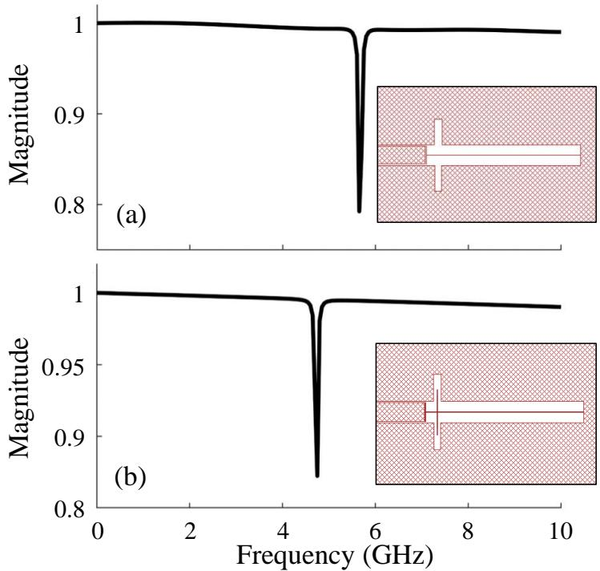  
图 3.4 使用“Sonnet”模拟软件模拟耦合电极对腔反射频率谱的影响。(a)无耦合电极。(b)有耦合电极。

## 3.2 样品封装

制备完成后的样品会被封装到样品盒内，等待测量与表征。为了实现样品上直流、交流电路与外部测控线路的连接，需要专门的PCB板和样品盒来转接。图3.5展示了三个版本的样品盒，其中第一代、第二代为了能够调控SQUID阵列腔的谐振频率，我们在样品底座上方设计了一个线圈盒，将手绕的磁线圈放置其中倒扣在样品上方。这样给线圈外加直流就可以产生一个大小可调的弱磁场来调控穿过 SQUID 的磁通，改变其谐振频率。在设计这种样品盒的尺寸时需要使用仿真软件进行模拟计算，防止在谐振腔的工作频段内（4­8GHz）产生寄生频率与腔发生串扰。此外，PCB 微波线路的设计阻抗为 50Ω，与外部测量线路阻抗匹配，减少信号的反射与损失。

考虑到在未来的自旋比特实验中需要外加磁场控制电子自旋的能级，而铝制的 SQUID 阵列在大磁场下无法继续工作，所以新的第三代的样品盒适配的是NbTiN、TiN这类具有抗磁性的高阻抗薄膜样品，不再选用SQUID阵列，因此也不再配备有磁线圈。

未来我们的研究目标将向着多比特扩展、大规模集成发展，比特数目会越来越多，样品尺寸越来越大，所以我们在设计新 PCB 板时增加了直流线与微波高频线的数目，并考虑芯片尺寸的适配性问题。为了尽可能减小样品盒的尺寸，仔细设计了线路的排布，并且把原来的SMA高频头更换为尺寸更小的SMP头，将PCB 板上的滤波器改为滤波盒放置在了制冷机的 4K 层。而为了接线的方便性，我们将最初版的插拔式直流接线柱改为31 针转接头。

目前的第三代样品盒一共有31根直流线和6个SMP高频头，高频头中2个用于连接腔的输入与输出，另外 4 个将连接到测量线路中的偏置器（Bias Tee）上用于比特的微波操控。这样的样品盒勉强能满足六个双量子点耦合到单个谐振腔总线上的测量实验，将来如果要提高比特可调节的电极数目、增加量子比特数，还需要设计新的样品盒来满足测量需求。

## 3.3 测量线路

完成封装的样品将被安装在稀释制冷机混合腔（mixingchamber）的冷指上，冷却到大概 20mK 进行测量。测量线路如图3.6所示，它分为直流线路与交流线路，从室温仪器经过制冷机内各层的线路与功能器件连接到样品盒内的 PCB 板上。

直流线路中用到的电子器件主要有两个作用，分别是给量子点电极提供直流偏置电压和测量量子点的输运信号。从直流电压源输出的电压先经过5:1的分压盒和低通滤波，进入制冷机内部，然后经过位于4K层的RC滤波盒，输入到最底层的 PCB 板上来控制量子点电极电压。在量子点输运测量中，使用锁相放大器（lock­inamplifier）给量子点的源漏施加激励信号，然后测量电子的输运信号，表征量子点的基本性质，后续更细致的表征则是通过谐振腔的测量来完成。

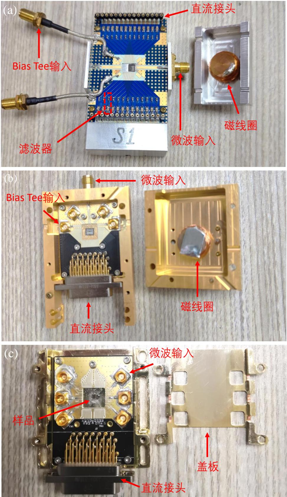  
图3.5 不同版本的样品盒，自上而下分别为第一代、第二代和第三代。

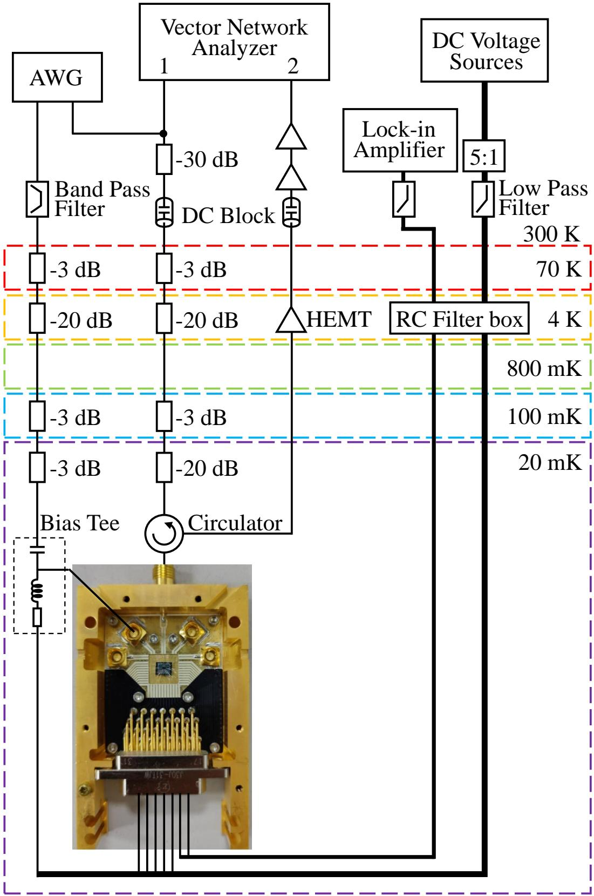  
图 3.6 从室温环境到稀释制冷机内样品的测量电路总览。

相比直流线路，交流线路的设计与搭建更加复杂，需要考虑制冷机各层之间的热噪声、工作频段以外的电噪声以及满足腔信号探测需求的各类微波器件[2]。这些微波器件与交流线路主要用于探测谐振腔信号、给量子点施加操控微波和快速调制脉冲。在我们大部分的实验中是利用矢量网络分析仪（vector networkanalyzer）来探测微波谐振腔。从矢量网络分析仪的端口 1 输出驱动微波，经过线路上的各级衰减与滤波抵达 PCB 板后激励样品中的超导反射腔；从超导腔反射出来的微波信号经过环形器进入到高频读出线路中，然后经由低温放大器、两级室温放大器与滤波，进入矢量网络分析仪的端口2 中，测量得到𝑆 参数。

我们也可以把矢量网络分析仪更换成微波源输出驱动微波，腔反射的信号经过混频器与模数转换器，利用数据采集卡采得信号，最后通过电脑分析处理数据。在应用 FPGA（Field­Programmable Gate Array）后，处理数据会更加快速，是实现腔的快速读取的必要技术[3­4]。

为了实现比特的操控，我们使用任意波发生器（Arbitrary Wavefunction Gen-erator，AWG）来产生脉冲序列或是高频微波，经过带通滤波、衰减器和偏置器后输入到量子点的势垒电极上，调制量子点的失谐量对比特进行操控。微波信号也可以选择叠加到腔的高频输入线路中，通过腔的耦合电极施加到量子点上，但是这时需要注意腔的工作频段以及输出功率的大小。

## 3.4 双量子点 cQED 系统强耦合实验

经过我们实验小组长时间的工艺摸索与样品测量、优化，已经实现了NbTiN高阻抗腔以及 SQUID 阵列谐振腔与双量子点电荷比特的强耦合。因为本人主要负责NbTiN腔相关样品的设计、制备与测量，因此这里以NbTiN反射腔–双量子点体系为主介绍实验测量与基本表征结果。两种结构的样品在测量表征方法上基本一致，如果对于SQUID 阵列腔有需要特殊说明的地方会进行补充。

## 3.4.1 量子点的基础表征

图3.7展示了NbTiN 纳米线腔与两个双量子点耦合的结构示意图。每个双量子点由六根金属电极控制，一根柱状电极（plungergate）连接到谐振腔的波腹处，另外五根电极标为L、P、U、R和D，其中U和D控制量子点之间的隧穿速率，P控制一侧量子点内的电化学势，L和R控制量子点到两边源漏的隧穿速率，也可以控制两个点的电子填充。双量子点电极中离耦合电极较远的势垒电极（减小对腔耦合的影响）连接到偏置器（Bias Tee）上，允许外部微波源输入微波信号或是脉冲信号。

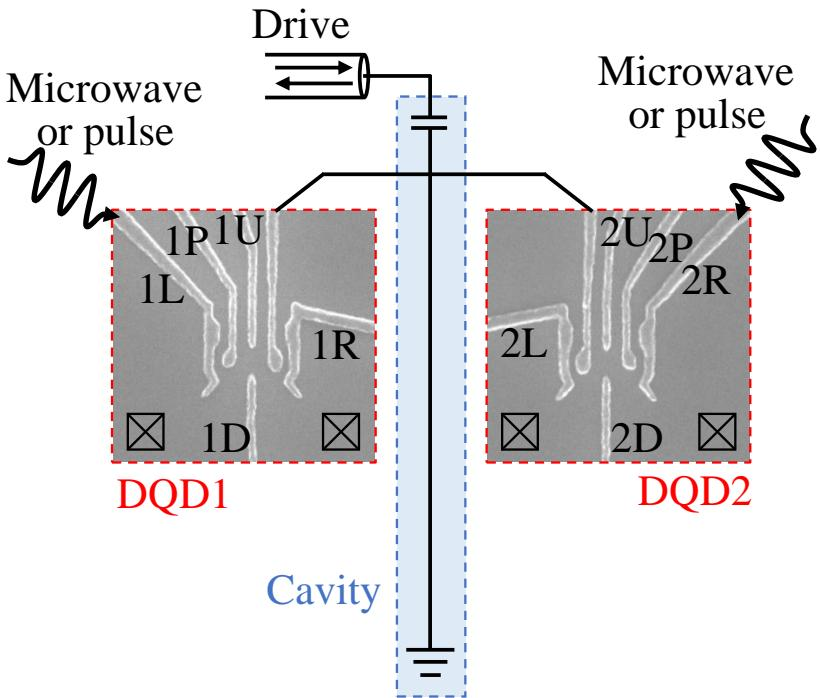  
图 3.7 NbTiN反射腔与两个双量子点耦合的结构示意图。可以给量子点的势垒电极施加微波或脉冲信号。

连接好直流线路之后，首先确认量子点上的各个电极是否能正常工作。我们将锁相放大器的输入与输出端连接在源极与漏极通道上，以 20mV 大小、低频交流（一般选择73Hz、177Hz这种远离市电50Hz倍频的质数，减小噪声），经过1000倍的衰减后激励量子点产生源漏输运，输运电流为数个nA，量子点电阻为 10kΩ 量级。

为了确认电极的好坏，我们给双量子点下侧的电极 D 与上侧其它电极成对施加负的偏置电压来限制源漏输运，测量输运电流。如果电极反应正常，那么负偏压会耗尽电极下方量子阱中的二维电子气，减小源漏导电通道内的电流[5]。当指向相对的两个电极（如 D 和 U）电压小到一定程度，能够将输运通道完全关闭，输运电流为零。我们把使得输运电流恰好消失的偏置电压称为截止电压（pinch­off voltage）。

图3.8(a) 给出了样品表征实验中扫描 DQD1 的一组电极 1D–1U 的电压得到的输运电流相图（后面的电压数值都默认是经过 5:1 分压前的偏置电压），当这两个电极的电压都小于 −6V 时，输运电流为 0。为了获得更加准确的截止电压，我们沿着图3.8(a)中的斜对角拉线，得到图(b)中的输运电流–电极电压关系图，根据输运电流达到零点的位置，我们可以得到 1U 和 1D 这组电极的截止电压 $V _ { \mathrm { 1 U 1 D } } = - 6 . 2 \ : \mathrm { V }$ 。一般我们希望截止电压在−5V到−8V之间，这既不太小超

(b)

过纳米电极能够承受的最小电压，又不太大导致量子点的可调性较差。

重复上述步骤，扫描电极1D与其它所有电极之间的截止电压就可以大致了解 DQD1 的电极响应性质，然后对 DQD2 进行相同的表征。如果所有电极都能正常地耗尽电极下方电子气、截止输运电流，且截止电压大小合适，就可以进行后续的表征实验。

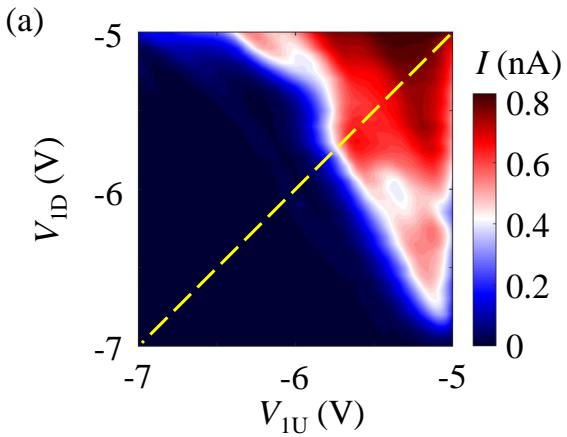

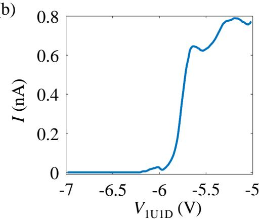  
图 3.8 DQD1 的电极 U 和电极 D 之间的输运截止电压。(a) 扫描输运电流 𝐼 随这两个电极电压变化的相图。(b) 沿相图的斜对角拉线得到电流–电压关系图，用来确定截止电压大小。

## 3.4.2 谐振腔的表征

在对谐振腔进行表征前，需要把量子点的电极电压都设置到它们各自的截止电压以下或是量子点电子的库伦阻塞区，同时把源极和漏极接地，防止电子在量子点内的隧穿或是与源漏的耦合影响谐振腔的信号。

使用矢量网络分析仪扫描探测频率 $f _ { \mathfrak { p } }$ ，测量腔的反射信号，会得到反射系数$S _ { 1 1 }$ 的幅值与相位两个信息，如图3.9所示。图3.9(a)中测量得到的反射幅值 $\vert S _ { 1 1 } \vert$ 由于线路上的反射、吸收、放大导致信号有起伏本底，需要归一化处理。通常认为本底反射信号为单位1，可以利用变功率或变温的方法来改变腔频吸收谷位置，但是不会改变线路的本底反射幅值，从而得到谐振腔正常工作频段附近的本底信号。或者更简单的，如果腔的展宽不大，且谐振吸收谷附近的本底接近线性变化，则可以直接利用线性拟合的方式得到谐振频率附近的本底。将测量到的腔信号除以本底信号就是归一化后的频谱。同样的，直接用网络分析仪探测到的图3.9(b)中的腔相位信号也有一个随频率线性变化的本底，该相位本底的处理则简单得多。

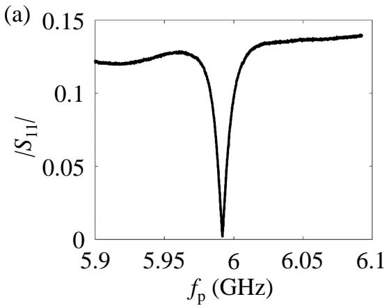

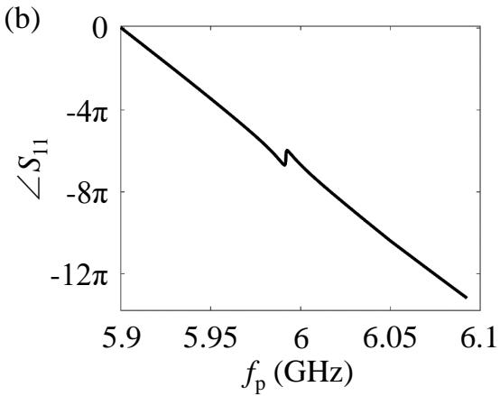  
图 3.9 测量 NbTiN 纳米线腔得到的反射信号 $S _ { 1 1 }$ 。(a) 幅值信号 $\vert S _ { 1 1 } \vert$ 。(b) 相位信号 $\angle S _ { 1 1 }$ 利用第2.3.2节中输入–输出理论给出的反射腔 $S _ { 1 1 }$ 参数公式：

$$
\begin{array} { c } { S _ { 1 1 } ( \omega ) = \frac { i ( \omega _ { \mathrm { r } } - \omega ) - ( \kappa _ { \mathrm { i } } - \kappa _ { \mathrm { e } } ) / 2 } { i ( \omega _ { \mathrm { r } } - \omega ) + ( \kappa _ { \mathrm { i } } + \kappa _ { \mathrm { e } } ) / 2 } } \\ { = 1 + \frac { i \kappa _ { \mathrm { i } } } { \omega _ { \mathrm { r } } - \omega - i ( \kappa _ { \mathrm { i } } + \kappa _ { \mathrm { e } } ) / 2 } , } \end{array}\tag{2.29}
$$

就可以拟合得到这个反射腔的谐振频率 $\nu _ { \mathrm { r } } = \omega _ { \mathrm { r } } / 2 \pi = 5 . 9 9 2 \mathrm { G H z }$ ，内部损耗速  
率 $\kappa _ { \mathrm { i } } / 2 \pi = 7 . 2 7 \mathrm { M H z }$ ，外部损耗速率 $\kappa _ { \mathrm { e } } / 2 \pi = 7 . 2 7 \mathrm { M H z }$ ，总的腔耗散速率 $\kappa / 2 \pi =$   
14.53MHz。相应的内部品质因子 $Q _ { \mathrm { i } } = 8 2 4$ ，外部品质因子 $Q _ { \mathrm { e } } = 8 2 4$ ，负载品质  
因子 $Q _ { \mathrm { l } } = 4 1 2 _ { \circ }$ 。

与NbTiN 纳米线腔不同的是，SQUID 阵列谐振腔的谐振频率会随着外加磁通而改变，所以通过给样品盒上方的磁线圈加电流，就能够调节腔频，如图3.10所示。当改变线圈电流 $I _ { \mathrm { c o i l } }$ ，腔频可以从 6.6GHz 调节到 6.2GHz 以下，这样可以使得在量子点频率不方便调节的情况下，通过调节腔频来达到腔与量子点的共振，或是实现其它的实验目的。在一般的腔探测实验中，我们把腔的谐振频率固定在极值点，比如图3.10中 6.5GHz 的位置，对外界磁通扰动有较好的抗性。但需要注意的是，极值处的腔品质因子并不一定是最大的。

## 3.4.3 量子点与腔的强耦合与表征

在确认了量子点电极与超导谐振腔的性质后，我们把腔的探测频率设置在腔的谐振频率处， $f _ { \mathrm { p } } = \nu _ { \mathrm { r } }$ ，并将量子点各个电极电压设置在合适的电压范围，然后用腔探测量子点的电荷稳定图。一般粗扫双量子点成点性质时，把两侧控制源漏隧穿的电极R和L设置为略大于截止电压，而控制量子点间隧穿的U和D电极可以先放开一点，比截止电压大2–3V 均可，电极P 暂时置零。

扫描 $V _ { \mathrm { 2 L } }$ 和 $V _ { \mathrm { 2 R } }$ 得到的电荷稳定图如图3.11所示，横向与纵向各有一套量子点，分别由电极2L和2R控制，对应左点与右点。在这两套线的交点处，左点与右点之间电化学势齐平，形成图中量子点间的电子隧穿线。在 $V _ { \mathrm { 2 I } }$ 较大时，还能够在电荷稳定图的顶部附近观察到左点与源漏发生电子交换导致的横向充电线；而当 $V _ { \mathrm { 2 L } }$ 减小时，该电子隧穿通道被逐渐关闭，只剩下腔探测到的量子点间隧穿线。图中并没有看到右点与源漏的电子隧穿，说明此时右侧量子点到源漏的耦合速率已经不太大，如果把 $V _ { \mathrm { 2 R } }$ 放开一点也可以看到类似的纵向充电线。此外，电荷稳定图中还穿插着几条无规则的斜线，这些大概率是量子点周围杂质、缺陷这类二能级系统，或是非理想位置处形成了杂点导致的电子跃迁，一般情况下我们要避开它们。

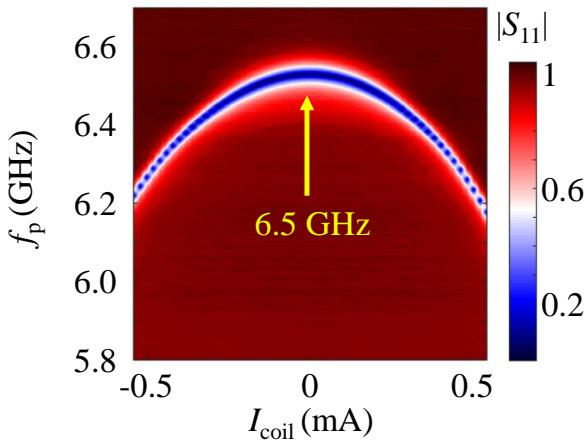  
图 3.10 SQUID 阵列谐振腔的谐振频率随线圈电流 $I _ { \mathrm { c o i l } }$ 的变化关系。

在测量了电荷稳定图、知晓了量子点的成点性质后，接下来的首要任务就是寻找双量子点与谐振腔的强耦合区域，并表征出耦合强度 $g _ { \mathrm { c } } \cdot$ 、电子隧穿耦合速率 $2 t _ { \mathrm { c } } \cdot$ 、电极的电压–能量转换系数 $\alpha$ （或者称为 lever arm）和电荷退相干速率 $\gamma$ 等参数。

在寻找腔与量子点强耦合时的注意点有：

1. 优先寻找电荷稳定图中幅值最大的量子点间隧穿线，这代表着 $2 t _ { \mathrm { c } } / h$ 与谐振腔频率 $\nu _ { \mathrm { r } }$ 接近且耦合强度相对较大。

2. 一般先调节电极U 来控制 $2 t _ { \mathrm { c } }$ 的大小，使得它接近腔频来确认耦合强度。

3. 通常小范围内同一套隧穿线对应的电子耦合强度比较接近。

4. 在改变电极 U 也找不到合适的量子点时，尝试大范围改变电极 D 的电压，使量子点重新排布，可能会找到耦合强度更大的双量子点。

5. 量子点内电子数较多时，波函数分布较大，耦合强度更大，但还是优先在电子数较少的区域进行筛选。

6. 尽量寻找远离杂点的隧穿线，避免受到影响。

7. 如果发现量子点间隧穿线很长，说明 $V _ { \mathrm { { L } } }$ 和 $V _ { \mathrm { R } }$ 太小，量子点到两边源漏的隧穿掐得太死，可以适当放开这两个电极。

图3.12(a)–(b) 给出了筛选后的 DQD1 和 DQD2 的电子隧穿线。如果我们直接沿某个方向拉线穿过隧穿线，得到幅值或相位信号随电极电压的变化关系，就可以根据输入–输出理论给出的腔对量子点电荷态的响应公式：

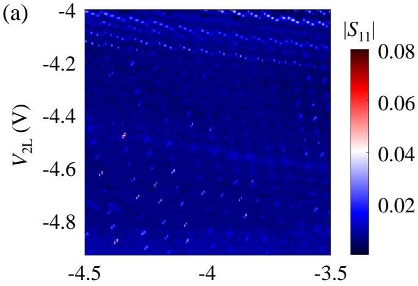  
V2R (V)

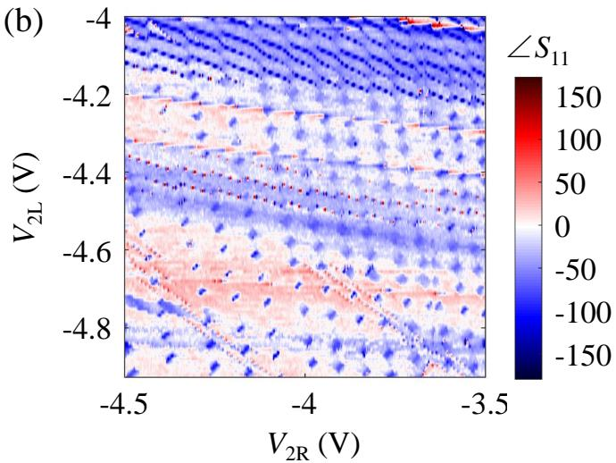  
图 3.11 腔探测的双量子点电荷稳定图。(a) 幅值信号 $\vert S _ { 1 1 } \vert$ 。(b) 相位信号 $\angle S _ { 1 1 }$

$$
S _ { 1 1 } = 1 + \frac { i \kappa _ { \mathrm { i } } } { \omega _ { \mathrm { r } } - \omega + g _ { \mathrm { c } } \chi - i \kappa / 2 } ,\tag{2.60}
$$

直接拟合得到耦合强度 𝑔 、隧穿耦合速率 𝑡 、比特退相干速率 𝛾 等参数[6­8]。但 $g _ { \mathrm { c } }$ $t _ { \mathrm { c } }$ 是使用这种方法，需要拟合的参数太多，而且拟合函数对 $g _ { \mathrm { c } }$ 和 $\gamma$ 的变化并不灵敏，所以误差较大。当已经确定部分参数的情况下，使用输入–输出理论拟合将更加精确。

一种直接测量耦合强度的方法是观测腔与量子点的真空 Rabi 劈裂。比如我们固定 DQD1 的其它各个电极电压，沿着图3.12(a) 中的虚线改变 $V _ { \mathrm { 1 L } }$ 穿过图中的电子跃迁线，扫描微波腔谐振频率附近的频谱，就得到了图3.12(c)中所示的真空 Rabi 劈裂。其中，水平方向的蓝色线对应谐振腔频，而开口朝上的抛物线对应DQD1电荷比特随电极1L变化的跃迁能级。当两者相交时，腔的谐振频率等于比特频率， $\omega _ { \mathrm { a } } = \omega _ { \mathrm { r } }$ ，腔光子与量子点内电子的相互作用导致光子态与电荷态的杂化，能级发生劈裂，此即真空Rabi劈裂，劈裂的大小为 $2 g _ { \mathrm { c } }$ ，而免交点处这两条谱线的展宽等于光子耗散速率与比特退相干速率的平均值[9]。真空 Rabi 劈裂是半导体双量子点与腔强耦合的直接证据，说明了耦合强度 $g _ { \mathrm { c } }$ 大于腔的耗散速率与比特的退相干速率，能够直接从频谱中分辨出两个杂化态。图3.12(d) 也给出了 DQD2 的真空 Rabi劈裂。

为了获得全局耦合强度 $g _ { 0 }$ ，我们使用电极U来调节电子的隧穿速率 $2 t _ { \mathrm { c } }$ ，使得 $2 t _ { \mathrm { c } }$ 接近腔的谐振频率，如图3.13(a)所示。沿对称中心即失谐量为零处扫描频谱， 经过 10 次平均后得到图3.13(b) 的能级劈裂，提取得到 DQD1 的耦合强度$2 g _ { 0 , 1 } / 2 \pi \approx 7 4 \mathrm { M H z }$ 。同理，我们也能得到 $2 g _ { 0 , 2 } / 2 \pi \approx 1 1 9 \ : \mathrm { M H z }$

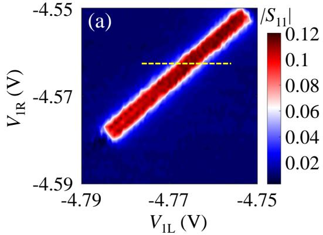

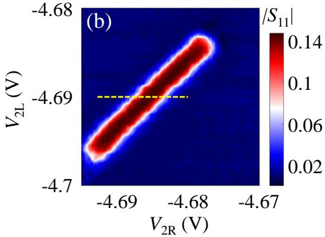

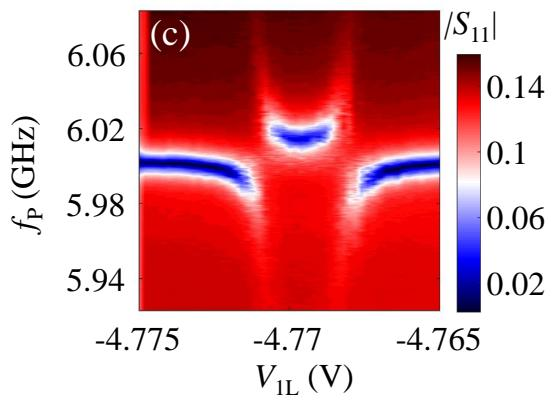

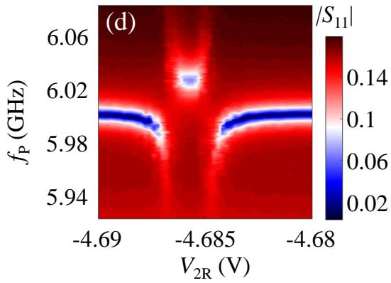  
图 3.12 电子隧穿线与真空Rabi劈裂。(a)–(b)DQD1和DQD2的量子点间电子隧穿导致的腔幅值信号 $\vert S _ { 1 1 } \vert$ 变化。(c)–(d) 沿图 (a) 与图 (b) 中横向虚线测量的真空 Rabi 劈裂图。

## 3.4.4 两电荷比特之间的长程耦合

多比特与腔耦合的系统需要使用Tavis­Cummings哈密顿量来描述[10]

$$
H = \hbar \omega _ { \mathrm { r } } a ^ { \dagger } a + \frac { 1 } { 2 } \hbar \sum _ { k } \omega _ { { \mathrm { a } } , k } \sigma _ { z , k } + \hbar \sum _ { k } g _ { 0 , k } \sin \theta _ { k } ( a ^ { \dagger } \sigma _ { - , k } + a \sigma _ { + , k } ) ,\tag{3.1}
$$

其中𝑘表示第𝑘个二能级系统，在我们的样品结构中𝑘 = 2， $\omega _ { k } = \sqrt { \varepsilon _ { k } ^ { 2 } + ( 2 t _ { \mathrm { c } , k } ) ^ { 2 } }$ 是量子点的本征态跃迁能量，混合角 $\tan \theta _ { k } = 2 t _ { \mathrm { c } , k } / \varepsilon _ { k }$

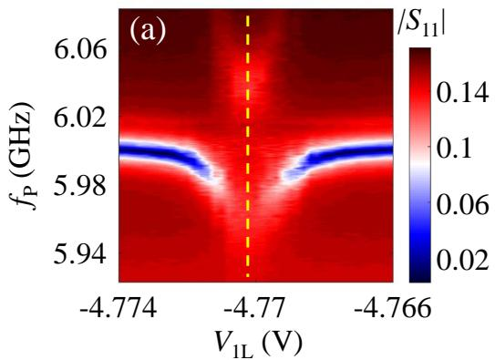

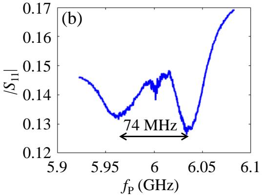  
图 3.13 (a) DQD1 的量子点间隧穿速率 $2 t _ { \mathrm { c } } / \hbar$ 接近腔频 $\omega _ { \mathbf { r } }$ 时的真空 Rabi 劈裂。(b) 在失谐量为0 处扫描的频谱，可以提取得到耦合强度 $2 g _ { 0 } / 2 \pi = 7 4 \mathrm { M H z }$

为了实现两个电荷比特之间的长程耦合，我们需要把比特的能级调节到共振位置， $\omega _ { \mathrm { a } , 1 } = \omega _ { \mathrm { a } , 2 }$ ，借助光子实现它们的相互作用。因为耦合强度并不太高，所以这里我们把量子点与谐振腔的耦合设置在共振区域进行实验（在耦合强度较大时，也可以在色散耦合区利用虚光子实现两比特的耦合）， $2 t _ { \mathrm { c } , 1 } = 2 t _ { \mathrm { c } , 2 } = \omega _ { \mathrm { r } } \approx 6 . 0 \mathrm { G H z }$ 。首先调节好两个双量子点隧穿耦合速率均接近腔频，然后固定 DQD1 的电极电压使它处于零失谐量处，再扫描 DQD2 的电极电压 $V _ { \mathrm { 2 R } }$ 与探测频率 $f _ { \mathfrak { p } }$ 就能观察到图3.14(a)展示的结果。它从原来的单比特的真空Rabi劈裂谱进一步发生劈裂，构成两比特的真空Rabi劈裂。

图3.14(b) 展示了两个比特与腔耦合的能级示意图，其中 |𝑔⟩ 和 |𝑒⟩ 是比特的基态和激发态，|0⟩ 和 |1⟩ 是腔的光子数态。两个双量子点与腔光子发生相互作用，|𝑔𝑔1⟩、 $| g e 0 \rangle$ 与 |𝑒𝑔0⟩ 在共振处发生杂化，形成了新的本征态：

$$
\begin{array} { l } { | - \rangle _ { \mathrm { C } } = \displaystyle \frac { 1 } { \sqrt { 2 } g _ { \mathrm { C } } } ( g _ { \mathrm { c } , 2 } | g e 0 \rangle + g _ { \mathrm { c } , 1 } | e g 0 \rangle - g _ { \mathrm { C } } | g g 1 \rangle ) , } \\ { | 0 \rangle _ { \mathrm { C } } = \displaystyle \frac { 1 } { g _ { \mathrm { C } } } ( g _ { \mathrm { c } , 1 } | g e 0 \rangle - g _ { \mathrm { c } , 2 } | e g 0 \rangle ) , } \\ { | + \rangle _ { \mathrm { C } } = \displaystyle \frac { 1 } { \sqrt { 2 } g _ { \mathrm { C } } } ( g _ { \mathrm { c } , 2 } | g e 0 \rangle + g _ { \mathrm { c } , 1 } | e g 0 \rangle + g _ { \mathrm { C } } | g g 1 \rangle ) , } \end{array}\tag{3.2}
$$

对应的本征能量

$$
E _ { 0 } = 0 , \quad E _ { \pm } = \pm g _ { \mathrm { C } } ,\tag{3.3}
$$

其中 $g _ { \mathrm { C } } = \sqrt { g _ { \mathrm { c , 1 } } ^ { 2 } + g _ { \mathrm { c , 2 } } ^ { 2 } }$ ，被称为两比特的集体增强耦合速率（collectively enhancedcoupling rate）。当 $g _ { \mathrm { c } , 1 } = g _ { \mathrm { c } , 2 }$ ，两个比特到腔的耦合完全对称时，本征态 $| 0 \rangle _ { \mathrm { C } }$ 是暗态，波函数是反对称的，与腔的电偶极耦合为0，此时真空Rabi劈裂图上看不到中间的能级。

在我们的实验中，可以测量得到两比特与腔共振的真空 Rabi 劈裂的大小为$2 g _ { \mathrm { C } } / 2 \pi \approx 1 7 7 \mathrm { M H z }$ 。因为每个比特到腔的耦合强度并不大，比特退相干又比较快，所以真空 Rabi 劈裂的效果并不太好，能级的线宽相比劈裂大小都比较粗，也没有办法进一步实现两比特门。

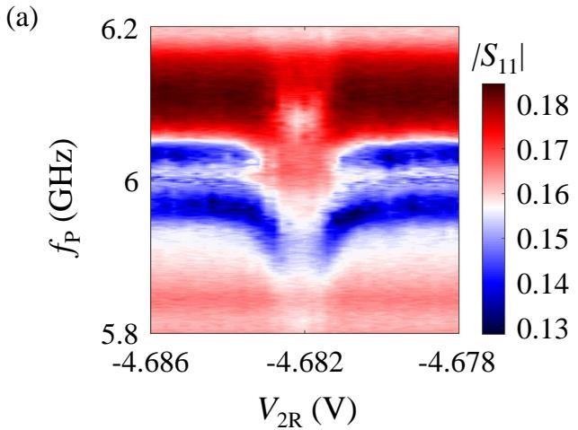

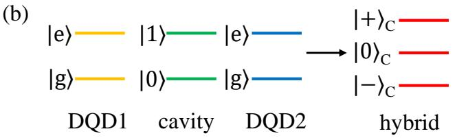  
图 3.14 (a)两比特与腔共振的真空Rabi劈裂。(b)两个双量子点与腔共振时的能级示意图。

## 3.5 参数提取常用方法

除了耦合强度 $g _ { \mathrm { c } }$ 、腔耗散速率 𝜅 之外，量子点与腔耦合的杂化系统还有一些比较重要的参数需要提取，比如双量子点的点间隧穿耦合速率 $2 t _ { \mathrm { c } }$ 、电极的电压–能量转换系数等。这一小节中将介绍几种常用的参数提取方法。

## 3.5.1 光子辅助隧穿

大部分实验中，我们仅用DQD1右侧的电极R来控制失谐量𝜀，但是由于电容耦合，扫描电极电压 $V _ { \mathrm { R } }$ 不仅会对右量子点的电化学势产生影响，也会对改变左点的电化学势，使得整个双量子点的能量发生变化。从技术上讲，如果仅仅改变失谐量而不对整体电化学势产生影响，我们需要对各个表面金属电极进行精确标定与校准，实际操控比特时联合调控电极偏压，从而补偿各个电极之间的串扰[11­12]。

但是为了实验方便，只对一根电极施加电压脉冲或调节偏置电压也是可行的[13­15]。在一阶近似下，有效失谐量与电极电压之间是线性关系，他们之间的转换关系称为电压–能量转换系数 𝛼（也可称为 lever arm)。一种简单方便的提取 𝛼的方法是光子辅助隧穿（photon­assisted tunneling）实验[16]，具体做法如下：利用偏置器通过电极 R 给量子点施加一个高频微波驱动（在我们的实验中驱动频率 $f _ { \mathrm { d } } = 1 0 \mathrm { G H z } )$ ），如果微波幅值 $V _ { \mathrm { A C } }$ 和频率 $f _ { \mathrm { d } }$ 满足 $e V _ { \mathrm { A C } } h f _ { \mathrm { d } } \ll ( 2 t _ { \mathrm { c } } ) ^ { 2 }$ ，当双量子点的基态与激发态的能量差恰好是光子频率的整数倍时，量子点电荷态就可以通过微波驱动光子发生跃迁，引起腔的响应。

我们扫描腔的响应信号 $S _ { 1 1 }$ 随电极电压 $V _ { \mathrm { R } }$ 和微波幅值 $V _ { \mathrm { A C } }$ 的变化，得到的光子辅助隧穿结果如图3.15所示。图中出现多个电子隧穿线，除了中间对称的主带，各个边带对应共振隧穿 $\hbar \omega _ { \mathrm { a } } = \varepsilon _ { 0 } \pm n h f _ { \mathrm { d } } = \varepsilon _ { 0 } \pm n \alpha V _ { \mathrm { R } }$ ，其中 𝑛 取整数。那么每一侧边带之间的距离就对应一个光子的能量，这样提取得到栅极R的电压–能量转换系数 $\alpha / h \approx 2 0 . 8 \mathrm { G H z / m V } .$

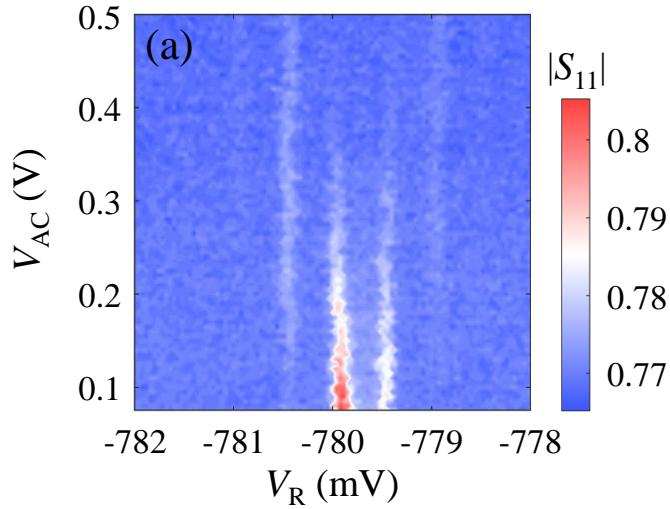

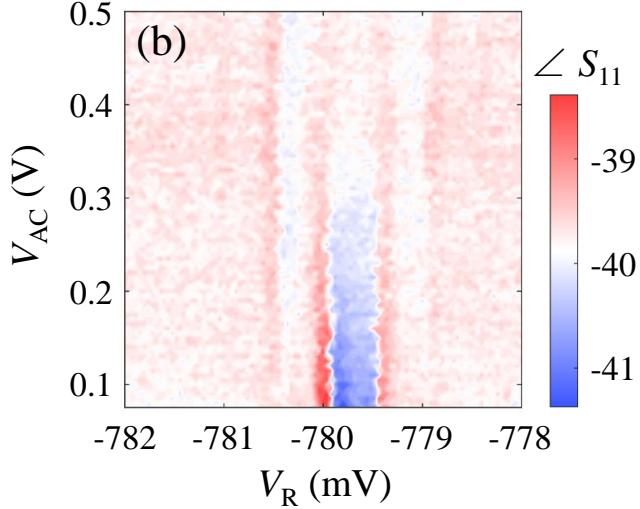  
图 3.15 改变量子点电极电压 $V _ { \mathbf { R } }$ 与微波幅值 $V _ { \mathbf { A C } }$ ，利用超导腔探测的双量子光子辅助隧穿谱。(a) 幅值信号谱，(b) 相位信号谱。

## 3.5.2 双色调制频谱（two­tone spectroscopy)

在 cQED 实验中，two­tone spectroscopy 是一个非常有效的探测比特能量色散关系的方法。它需要两路输入微波，一路为探测微波，测量腔的响应，一般固定在腔的谐振频率上， $\omega _ { \mathrm { p } } = \omega _ { \mathrm { r } } ;$ ；另一路为驱动微波，可以通过某个量子点电极或是腔持续地施加在量子点上。大部分情况下，电荷比特处于基态上， $\langle \sigma _ { z } \rangle = - 1$ 但是在实验中，我们会连续地改变驱动频率 $\omega _ { \mathrm { d } }$ ，当驱动频率恰好与比特频率匹配时， $\omega _ { \mathrm { d } } = \omega _ { \mathrm { a } }$ ，比特态受到激励发生跃迁，其稳态布居发生改变[17]

$$
\langle \sigma _ { z } \rangle = \frac { - 1 } { 1 + \frac { 4 g _ { \mathrm { c } } ^ { 2 } n _ { \mathrm { d } } } { \gamma _ { 1 } } \frac { \gamma } { \Delta _ { \mathrm { d } } ^ { 2 } + \gamma ^ { 2 } } } ,\tag{3.4}
$$

其中 $n _ { \mathrm { d } }$ 表示驱动微波强度， $\gamma = \gamma _ { 1 } / 2 + \gamma _ { \phi }$ 是比特退相干速率， $\gamma _ { 1 }$ 是比特弛豫速率， $\Delta _ { \mathrm { d } } = \omega _ { \mathrm { a } } - \omega _ { \mathrm { d } }$ 是比特和驱动微波的频率差。这样，在比特与驱动微波共振处，腔对比特布居变化产生响应：

$$
S _ { 1 1 } = 1 + \frac { i \kappa _ { \mathrm { i } } } { \omega _ { \mathrm { r } } - \omega - g _ { \mathrm { c } } \chi \langle \sigma _ { z } \rangle - i \kappa / 2 } .\tag{3.5}
$$

谐振腔频率也会随比特布居发生偏移：

$$
\begin{array} { r l } & { \Delta \omega _ { \mathrm { r } } = \mathrm { R e } ( g _ { \mathrm { c } } \chi ) \langle \sigma _ { z } \rangle } \\ & { \qquad = \frac { g _ { \mathrm { c } } ^ { 2 } \Delta } { \Delta ^ { 2 } + \gamma ^ { 2 } } \frac { - 1 } { 1 + \frac { 4 g _ { \mathrm { c } } ^ { 2 } n _ { \mathrm { d } } } { \gamma _ { \mathrm { l } } } \frac { \gamma } { \Delta _ { \mathrm { d } } ^ { 2 } + \gamma ^ { 2 } } } , } \end{array}\tag{3.6}
$$

其中 $\Delta = \omega _ { \mathrm { a } } - \omega _ { \mathrm { p } }$ 是比特频率与探测频率之差。

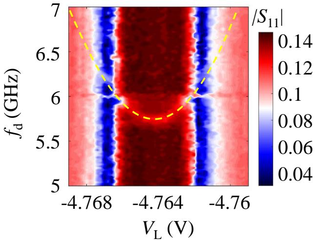  
图 3.16 扫描电极电压 $V _ { \mathbf { L } }$ 和驱动微波频率 $f _ { \mathbf { d } }$ 得到的 two­tone spectroscopy。图中虚线对应量子点能级随电极电压的变化。

图3.16展示了在比特失谐量等于零附近，测量得到的 DQD1 的 two­tone spec-troscopy，横坐标是零失谐量附近电极L的电压 $V _ { \mathrm { { L } } }$ ，纵坐标是驱动频率 $f _ { \mathrm { d } } = \omega _ { \mathrm { d } } / 2 \pi$ 图中 $f _ { \mathrm { p } } \approx 6 \mathrm { G H z }$ 处的水平线是腔的谐振信号，腔对比特受激跃迁的响应由虚线标出，沿着此虚线，电荷比特与驱动微波共振， $\omega _ { \mathrm { a } } = \omega _ { \mathrm { d } }$ ，其抛物线型符合双量子点电荷比特与量子点间能量失谐量的色散关系 $\hbar \omega _ { \mathrm { a } } = \sqrt { \varepsilon ^ { 2 } + ( 2 t _ { \mathrm { c } } ) ^ { 2 } }$ 。当 $\varepsilon = 0$ 时， $\hbar \omega _ { \mathrm { a } } = 2 t _ { \mathrm { c } }$ ，处于抛物线的最低点位置，可以直接得到此时量子点之间的隧穿耦合速率 $2 t _ { \mathrm { c } } / h \approx 5 . 7 \mathrm { G H z }$ 。拟合这条抛物线可以进一步提取电极 L 的电压–能量转换系数 $\alpha = \Delta \varepsilon / \Delta V _ { \mathrm { L } }$ o

当驱动频率很小，满足 $\begin{array} { r } { \frac { 4 g _ { \mathrm { c } } ^ { 2 } n _ { \mathrm { d } } } { \gamma _ { 1 } } \frac { \gamma } { \Delta _ { \mathrm { d } } ^ { 2 } + \gamma ^ { 2 } } \ll 1 } \end{array}$ 时， $\begin{array} { r } { \Delta \omega _ { \mathrm { r } } \approx \mathrm { R e } ( g _ { \mathrm { c } } \chi ) ( - 1 + \frac { 4 g _ { \mathrm { c } } ^ { 2 } n _ { \mathrm { d } } } { \gamma _ { \mathrm { l } } } \frac { \gamma } { \Delta _ { \mathrm { d } } ^ { 2 } + \gamma ^ { 2 } } ) } \end{array}$ 所以我们固定失谐量 $\varepsilon = 0$ ，沿着频谱纵向拉线，可以得到一条以 $f _ { \mathrm { d } }$ 为函数的洛伦兹曲线，其半峰宽就是退相干速率 𝛾[7,18­19]。不过这种测量方法对耦合强度有一定要求，要保证在较大的比特频率范围内都有比较好的腔信号可见度。

## 3.5.3 利用可调腔提取部分参数

前面介绍的表征、测量方法，都是固定探测频率为腔频，给比特外加驱动，在色散耦合区用腔来测量。但是对于 SQUID 阵列谐振腔，我们可以利用它频率可调的特点，在无外加量子点激励下，测量量子点的能量–失谐量色散关系[18]。具体做法如下：

1. 在 SQUID 阵列腔频率为 $\nu _ { \mathrm { r } } ( I _ { \mathrm { c o i l } } )$ 时，测量腔频附近幅值信号 $\vert S _ { 1 1 } \vert$ 随电极电压变化的频谱，得到比特能级与腔频的两个交点。

2. 改变磁线圈的电流 $I _ { \mathrm { c o i l } }$ 调节外加磁通从而调节SQUID 阵列腔的频率。

3. 重复上述步骤，直到得到足够多的共振点，然后用量子点电荷比特跃迁能量随失谐量的变化关系来拟合这些交点， $\hbar \omega _ { \mathrm { a } } = \sqrt { \varepsilon ^ { 2 } + ( 2 t _ { \mathrm { c } } ) ^ { 2 } }$ o

经过这一系列操作，我们可以得到图3.17所示的能谱图，它是由多次测量组合在一起的结果，图中的虚线抛物线就是拟合得到的量子点能级随失谐量的变化，可以提取得到双量子点的 $2 t _ { \mathrm { c } }$ 和电极的 lever arm。

这种调节腔频来表征双量子点性质的方法的缺点也是显而易见的，只能在腔频可调范围内进行测量，且要求 $2 t _ { \mathrm { c } } < \hbar \omega _ { \mathrm { r } }$ 。对于我们制作的SQUID阵列谐振腔，可调范围约为1GHz，所以它的适用性并没有其它表征方法广。

## 3.6 本章小结

在本章中，介绍了 SQUID 阵列谐振腔和 NbTiN 纳米线腔这两种高阻抗谐振腔与GaAs双量子点强耦合的结构设计、样品测量线路与基本表征方法，并以NbTiN 腔与两个双量子点耦合的样品为例，详细介绍了半导体量子点 cQED 杂化体系中各个组成部分的表征步骤，给出了电荷比特–谐振腔强耦合的实验结果与两比特的耦合现象。最后介绍了几种重要的系统参数提取方法。

受限于耦合强度与比特的退相干，我们只能停留在电荷比特与腔强耦合的基础表征上，没有办法进一步实现两比特操控、纠缠的实验。在后续的章节中，我们将基于现有的样品与实验条件，在外加驱动的条件下对比特非平衡态的平

均结果进行测量、实验。

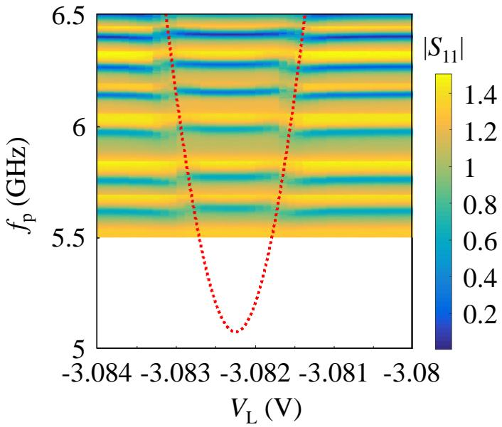  
图 3.17 SQUID阵列谐振腔反射信号 $\vert S _ { 1 1 } \vert$ 在不同腔频下，随探测频率 $f _ { \mathbf { p } }$ 和电极电压 $V _ { \mathbf { L } }$ 的变化关系。水平方向的深色线对应不同磁通下SQUID阵列谐振腔的腔频，在与比特共振交点处会发生腔频偏移。红色虚线为拟合共振点得到的比特跃迁能级。

## 参考文献

[1] Wang B C, Lin T, Li H O, et al. Correlated spectrum of distant semiconductor qubits coupled by microwave photons. Science Bulletin, 2021, 66(4):332.

[2] Krinner S, Storz S, Kurpiers P, et al. Engineering cryogenic setups for 100­qubit scale superconducting circuit systems. EPJ Quantum Technology, 2019, 6(1):2.

[3] Scarlino P, van Woerkom D J, Stockklauser A, et al. All­microwave control and dispersive readout of gate­defined quantum dot qubits in circuit quantum electrodynamics. Physical Review Letters, 2019, 122(20):206802.

[4] Zheng G. Circuit quantum electrodynamics with single electron spins in silicon. TU Delft University, 2019.

[5] 尤杰. 新型砷化镓量子点的制备与量子输运研究. 中国科学技术大学,2016.

[6] Viennot J J, Dartiailh M C, Cottet A, et al. Coherent coupling of a single spin to microwave cavity photons. Science, 2015, 349(6246):408.

[7] Mi X, Cady J V, Zajac D M, et al. Strong coupling of a single electron in silicon to a microwave photon. Science, 2017, 355(6321):156.

[8] Landig A J, Koski J V, Scarlino P, et al. Microwave­cavity­detected spin blockade in a fewelectron double quantum dot. Physical Review Letters, 2019, 122(21):213601.

[9] Wallraff A, Schuster D I, Blais A, et al. Strong coupling of a single photon to a superconducting qubit using circuit quantum electrodynamics. Nature, 2004, 431(7005):162.

[10] Van Woerkom D J, Scarlino P, Ungerer J H, et al. Microwave photon­mediated interactions between semiconductor qubits. Physical Review X, 2018, 8(4):41018.

[11] Hensgens T, Fujita T, Janssen L, et al. Quantum simulation of a Fermi­Hubbard model using a semiconductor quantum dot array. Nature, 2017, 548(7665):70.

[12] Mills A R, Zajac D M, Gullans M J, et al. Shuttling a single charge across a one­dimensional array of silicon quantum dots. Nature Communications, 2019, 10(1):1.

[13] Petersson K D, Petta J R, Lu H, et al. Quantum coherence in a one­electron semiconductor charge qubit. Physical Review Letters, 2010, 105(24):246804.

[14] Dovzhenko Y, Stehlik J, Petersson K D, et al. Nonadiabatic quantum control of a semiconductor charge qubit. Physical Review B, 2011, 84(16):2.

[15] Shi Z, Simmons C B, Ward D R, et al. Coherent quantum oscillations and echo measurements of a Si charge qubit. Physical Review B, 2013, 88(7):1.

[16] Kouwenhoven L P, Jauhar S, McCormick K, et al. Photon­assisted tunneling through a quantum dot. Physical Review B, 1994, 50(3):2019.

[17] Viennot J J, Delbecq M R, Dartiailh M C, et al. Out­of­equilibrium charge dynamics in a hybrid

circuit quantum electrodynamics architecture. Physical Review B, 2014, 89(16):165404.

[18] Stockklauser A, Scarlino P, Koski J V, et al. Strong coupling cavity QED with gate­defined double quantum dots enabled by a high impedance resonator. Physical Review X, 2017, 7(1): 011030.

[19] Samkharadze N, Zheng G, Kalhor N, et al. Strong spin­photon coupling in silicon. Science, 2018, 359(6380):1123.

## 第 4 章 微波腔探测的双量子点激发态能谱

超导谐振腔作为电路量子电动力学系统中的一个组成要素，在超导–半导体杂化系统中实现高灵敏的探测起到了重要作用。

本章研究了腔探测的GaAs半导体量子点的激发态能谱。通过给量子点电极施加电压脉冲，调制双点的能级失谐量，在零失谐量处产生电荷态跃迁，然后利用高阻抗NbTiN 腔探测其跃迁谱线得到电荷态能谱。得益于NbTiN 谐振腔的高阻抗特性，探测灵敏度高，我们利用泡利不相容原理可以从能谱中分辨不同自旋态参与的跃迁过程。此外，我们还研究了隧穿耦合速率对腔信号的影响，实验结果与利用模型模拟的结果一致。

## 4.1 半导体量子点探测技术

人们通常可以通过直流输运测量来研究半导体量子点内定义的量子比特[1­3],但是在少电子区，隧穿电流弱，读取保真度会受到限制。量子点接触（quan-tum point contact）和单电子晶体管（single electron transistor）这类的外部静电计（external elctrometer）弥补了直流输运测量的劣势，被广泛应用于量子点器件上[4­7]。但是由于库伦相互作用距离短，这类探测器件在比特扩展上的应用比较困难[8­10]。此外，直流输运测量和外部静电计这两种读出方法都不可避免地引入与外界环境的耦合，影响量子系统的相干性[11­13]，或是对量子点系统产生反馈，引起量子点与源漏之间不必要的电荷非弹性隧穿 [14­15]。

使用片上超导谐振腔[16­17] 或是集总式谐振腔[18­21] 制作成的电极式静电计（gate­based electrometer），作为一种新的探测方案已经发展了起来，能够实现高保真的读取。这种电极式静电计，只需要一根耦合电极用作读出，极大地简化了量子点的电极排布。除此以外，谐振腔还能够实现量子非破坏性测量 [22]、用作比特长程耦合与纠缠的中介[23­24]，为可扩展的半导体量子计算提供了可行途径。

近年来，在半导体量子点cQED杂化器件上的研究取得了巨大的突破。借助于高阻抗的谐振腔，耦合强度得到了显著提升[25­29]。高阻抗谐振腔也在各种实验中用于读取、表征比特性质，例如探测电荷稳定图，测量 Valley态的能谱[30]，以及区分双电子自旋态等[31]。

在这一章中，我们利用高阻抗NbTiN超导谐振腔，在GaAs双量子点的四电子区域施加 50% 占空比的方波脉冲[32­35]，色散地测量激发态能谱。通过读取谐振腔的响应信号，我们可以探测到电压脉冲引起的电子态跃迁[16,30]，并从中分辨出不同自旋与轨道态参与的量子点间跃迁动力学过程。利用半导体双量子点系统参数可调的特点，我们进一步研究了谐振腔探测的激发谱对各个参数的依赖关系。这种能谱测量方法结合了低频电极脉冲技术与电极式腔耦合探测技术，为单态–三重态比特的探测、多能级量子点系统的表征提供了一种有效方案。

## 4.2 样品结构与基本表征

如图4.1(a)–(c) 所示，我们的样品由一个 GaAs 双量子点和一个四分之一波长（𝜆/4）的NbTiN超导谐振腔构成。量子点制备在GaAs/AlGaAs异质结上，除了有双量子点的平台区域外，通过基片刻蚀破坏能带结构的方法去除其它所有的二维电子气，防止腔光子与额外的电子气耦合产生泄露[36]。通过给表面金属电极L，R，U和D施加直流偏压束缚出双量子点。其中电极U和D控制量子点间隧穿耦合速率 $2 t _ { \mathrm { c } }$ ，电极P 空置电压为零。实验过程中，源极与漏极均接地。

(a)  
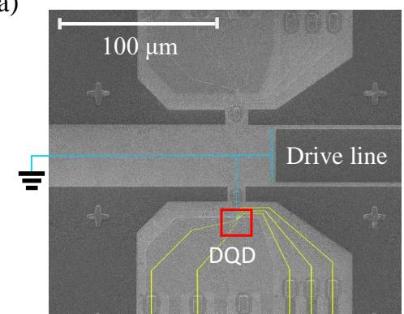

(b)  
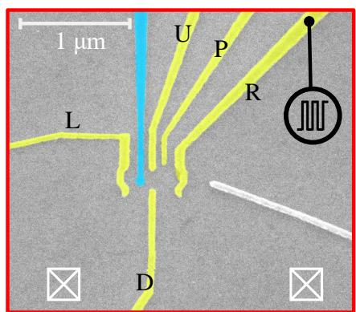

(c)  
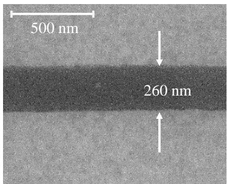

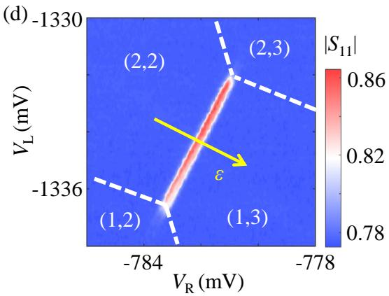  
图 4.1 杂化耦合器件结构与电荷稳定图。(a)样品的扫描电子显微镜图，展示了谐振腔与量子点的耦合结构。NbTiN制成的超导谐振腔一端接地，另一端耦合到馈线上。(b)双量子点电极的扫描电镜图。左侧蓝色标记的一根金属电极连接到 NbTiN 超导谐振腔上，右侧的势垒电极 R 上施加脉冲激励。(c) NbTiN 腔中心导体的扫描电子显微镜图，线宽为260nm。(d)用腔探测到的(2,2)–(1,3)电荷态之间的跃迁线。由箭头标出的失谐量 𝜀 在实验中通过电极 R，四根虚线对应双量子点与源漏之间的电荷隧穿线。

双量子点的左侧一根电极直接连接到超导谐振腔的电压波腹处，使腔与比特耦合。这里使用的超导谐振腔由仅11nm厚的NbTiN纳米线制成，使用电子束曝光工艺与刻蚀工艺，中心导体宽度为260nm，长为 $3 0 0 \mu \mathrm { m }$ ，一端接地，另一端耦合到传输线上用作微波信号的输入输出。中心导体距离地平面很远，从而减小对地电容，提高特征阻抗。谐振腔下方、衬底上方有一层15nm厚的 ${ \bf A l } _ { 2 } { \bf O } _ { 3 }$ ，作为阻刻层。由于选用了NbTiN 这种特殊材料，并把谐振腔的截面积设计得很小，因此谐振腔具有很大的动态电感， $L _ { \mathrm { k } } \approx 3 2 0 \mathrm { p H } \cdot \mathrm { \mu m } ^ { - 1 }$ ，从而也具有很大的特征阻抗， $Z _ { \mathrm { r } } \approx 2 . 5 \mathrm { k } \Omega$ ，远远超过传统的50Ω阻抗腔[37­38]。由于耦合强度 $g _ { \mathrm { c } } \propto \sqrt { Z _ { \mathrm { r } } }$ 所以这个高阻抗谐振腔有助于提高双量子点与腔之间耦合强度。

测量时，量子器件被放置在环境温度为 ∼ 23mK 的稀释制冷机内，利用矢量网络分析仪，输入频率为 $f _ { \mathfrak { p } }$ 的微波来读取腔的信号。微波光子会在抵达芯片上的谐振腔前经过 70dB 的衰减，由样品上的 NbTiN 反射腔反射后经过环形器进入读取高频线，然后经过4K层的低温放大器与室温的两级放大器，最后被矢量网络分析仪读取到。根据测量得到的反射信号 $S _ { 1 1 }$ ，我们能够提取得到腔的谐振频率 $\nu _ { \mathrm { r } } = \omega _ { \mathrm { r } } / 2 \pi = 6 . 0 4 \mathrm { G H z }$ ，光子耗散速率 $\kappa / 2 \pi = 3 5 . 3 \mathrm { M H z }$

实验中为了减小电荷噪声对腔探测的影响，我们通常把源漏以及量子点接触（quantumpointcontact）接地，直接用超导谐振腔来扫描量子点的电荷稳定图，寻找最佳的工作点。我们固定探测频率在腔谐振频率处， $f _ { \mathfrak { p } } = \nu _ { \mathrm { r } }$ ，测量谐振腔的反射信号随电极电压 $V _ { \mathrm { { L } } }$ 和 $V _ { \mathrm { R } }$ 变化，得到的电荷稳定图如图4.2所示，图中 $( m , n )$ 表示左侧（右侧）量子点内有𝑚(𝑛) 个电子。

通常情况下，直接使用腔扫描双量子点到少电子区并确认电子数是比较困难的，因为受限于腔的探测范围，我们一般只能探测到腔频附近 $1 0 g _ { \mathrm { c } }$ 量级范围的信号。比如腔频设计在 6GHz，那么探测能量范围大概在 $4 { - } 8 \operatorname { G H z }$ ，如果超出这个频率范围，那么腔的响应比较弱，被淹没在噪声中。所以，这里为了确定各个电荷区两个量子点内的电子数，我们大范围地扫描势垒电极电压 $V _ { \mathrm { { L } } }$ 和 $V _ { \mathrm { R } }$ ，同时利用电极 U 和 D 把量子点隧穿耦合速率 $2 t _ { \mathrm { c } }$ 控制在腔频附近合适的范围。基于以下几点，我们标定出了电荷稳定图4.2中各个区域内的电子数：

1. 电荷稳定图中最后几条充电线间距突然增大，充电能增加，说明接近少电子区。

2. 大范围电极电压的扫描下，可以测量到左右量子点内(𝑛,0)和(0,𝑚)最后的几条充电线，再往负偏压扫描确定没有更多的充电线。

3. 由于谐振腔对双量子点电荷态的灵敏度取决于量子点间隧穿耦合速率，所以我们也大范围改变了中间势垒电极U和D的电压，但是在对应的充电蜂窝图中没有找到更多的电荷跃迁线或充电线。

最后我们选择(2,2)–(1,3)这个四电子区进行实验，因为电子较少时，能级更加简单，方便后面的结果分析，且图中该区域的腔信号响应比较大，腔与量子点的耦合比较强。

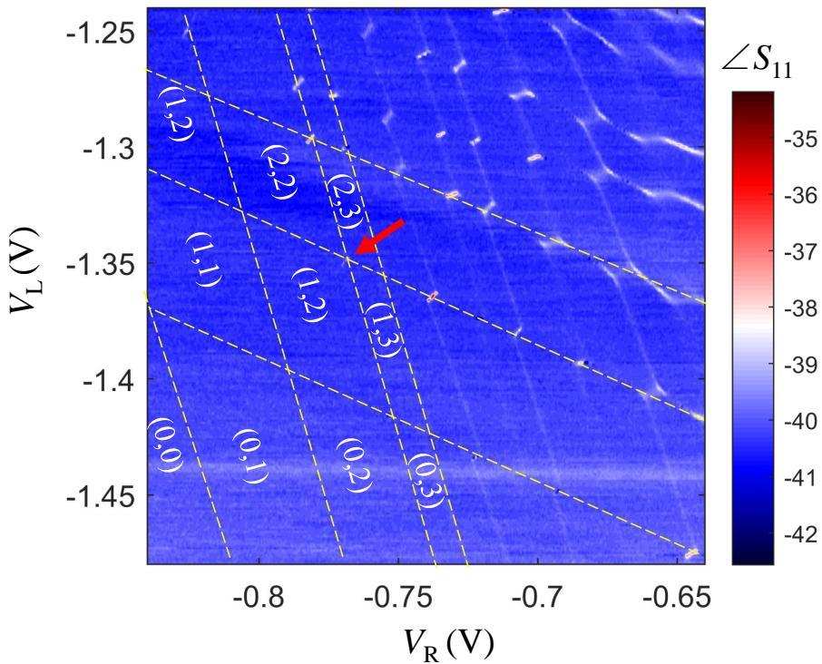  
图 4.2 大范围扫描电极电压 $V _ { \mathbf { L } }$ 和 $V _ { \mathbf { R } }$ ，测量腔相位得到的电荷稳定图。箭头指出了我们实验中的工作区域，在 (1,3)–(2,2) 电荷区。

仔细扫描 (2,2)–(1,3) 电荷区附近 $\vert S _ { 1 1 } \vert$ 随 $V _ { \mathrm { { L } } }$ 和 $V _ { \mathrm { R } }$ 的变化响应如图4.1(d) 所示。我们定义左右两点之间的电化学势之差为失谐量𝜀，在图中用垂直于隧穿线的箭头表示。为了方便，实验中我们通过改变右侧势垒电极来控制失谐量的变化，对应的电压–能量转换系数 $\alpha / h \approx 2 0 . 8 \mathrm { G H z / m V ^ { [ 3 9 ] } }$ 。在适当的电极电压下，两个量子点的电化学势对齐，失谐量 $\varepsilon = 0$ ，电荷态可以在量子点内发生相干跃迁，导致腔幅值信号 $\vert S _ { 1 1 } \vert$ 增加。图4.1(d) 中的亮线就对应腔探测到的电荷态跃迁线。我们将 $S _ { 1 1 }$ 随 $V _ { \mathrm { R } }$ 的变化曲线利用输入–输出理论拟合[27,31,40]，可以提取得到系统的耦合强度 $g _ { 0 } / 2 \pi \approx 1 0 4 . 5 \mathrm { M H z }$ 、比特的退相干速率 $\gamma / 2 \pi \approx 7 2 \mathrm { M H z }$ 、量子点隧穿耦合速率 $2 t _ { \mathrm { c } } / h \approx 5 . 8 \mathrm { G H z }$ , 说明这个双量子点–谐振腔杂化系统已经达到了强耦合[25­29]。较大的耦合强度使我们能够以较高的分辨率色散读取双量子点电荷态。由于实验中，右侧量子点内的两个核电子占据了最低轨道，形成了孤立壳层，因此在后面我们的分析中可以忽略这两个电子对量子系统的影响，将量子点间的电子跃迁动力学过程简化为在双电子区域的 (2,0)–(1,1)电荷态之间的跃迁[41­43]。

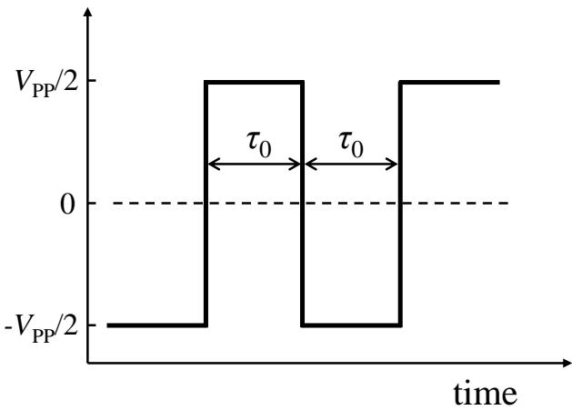  
图 4.3 方波脉冲及其参数。

## 4.3 低频脉冲测量双量子点激发态

为了在实验中测量到双量子点的激发态，我们给电极 R 持续施加 50% 占空比的方波脉冲，方波的宽度 $\tau _ { 0 } = 3 0 \mathrm { n s }$ ，脉冲重复率 $1 / 2 \tau _ { 0 } \approx 1 6 . 6 7 \mathrm { M H z }$ ，峰–峰值电压为 $V _ { \mathrm { p p } }$ ，如图4.3所示。通过改变 $V _ { \mathrm { R } }$ 扫描失谐量 𝜀 穿过 (2,0)–(1,1) 跃迁线时，这个方波脉冲就会周期地调制失谐量大小，然后我们读取腔的振幅响应 $\Delta | S _ { 1 1 } |$ （扣除本底信号后）随 $V _ { \mathrm { p p } }$ 和 𝜀 的变化。

图4.4(a) 展示了测量得到的激发态幅值谱，已经经过本底的处理，扣掉了库伦阻塞区的本底信号。在幅值谱中可以清楚地看到三条跃迁谱线，划分成了四个部分。我们把这四条线段命名为A、B、C和D，并在示意图4.5中画出了它们各自对应的动力学过程。因为这里的双量子点到源漏的耦合速率远远低于量子点之间的隧穿耦合速率和谐振腔的频率，所以在后面的分析中我们忽略了电子从源漏到量子点的隧穿。

当脉冲电压 $V _ { \mathrm { p p } }$ 比较弱时，我们只能看到A和B这两条隧穿线。在方波脉冲的高（低）电平作用下，电荷态之间的能量失谐𝜀在由脉冲电压 $\pm V _ { \mathrm { p p } }$ 补偿，双点内 (2,0) 和 (1,1) 电荷态的电化学势达到平齐，使得电子能够以 $2 t _ { \mathrm { c } }$ 的隧穿速率在量子点间相干跃迁，在激发谱中形成隧穿线 A（B）。在这两种情况下，在 $\varepsilon \neq 0$ 处也能够通过腔探测到隧穿线，𝜀越大，用于补偿的 $V _ { \mathrm { p p } }$ 也越大，因此在图4.4(a)中为两条对称的斜线。

当脉冲电压增大到 $V _ { \mathrm { p p } } = 0 . 1 3 \ : \mathrm { V }$ 时，跃迁线 A 分裂成了 C 和 D 两条线。此时，脉冲电压已经足够大到在高电平的半个周期内引起激发态 (2,0) 和 (1,1) 态之间的电子跃迁，如示意图4.5(c)所示。根据两条的平行跃迁线B和C之间的距离，我们可以直接提取得到 (2,0)的激发态到基态的能量差 $\Delta E = 3 3 0 \mu \mathrm { e V }$

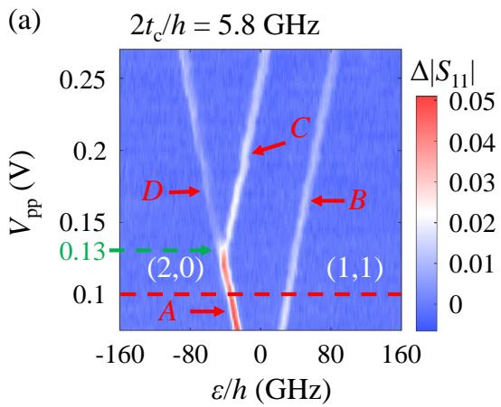

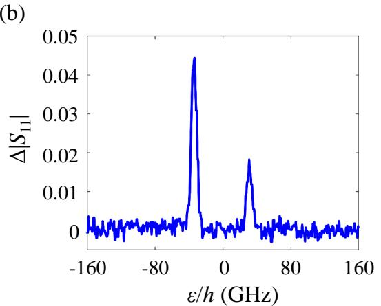  
图 4.4 (a) 反射幅值信号 $\Delta | S _ { 1 1 } |$ 随失谐量 𝜀 和脉冲电压 $V _ { \mathbf { p } \mathbf { p } }$ 变化的激发谱，数据已经经过处理扣除了库伦阻塞区的本底。(b) 沿幅值谱图中 $V _ { \mathbf { p } \mathbf { p } } = 0 . 1 \mathrm { V }$ 的水平截线。

## 4.4 自旋参与的态跃迁谱线

更有意思的是，仔细观察图4.4(a) 可以发现，在低脉冲电压 $V _ { \mathrm { p p } }$ 下，跃迁线A的幅值比B的幅值远大得多。例如图4.4(b)给出了沿 $V _ { \mathrm { p p } } = 0 . 1 \ : \mathrm { V }$ 的截线，跃迁线 A 对应的左侧幅值峰远大于右侧跃迁线 B 的幅值峰。这个现象需要考虑电子的自旋自由度，用泡利自旋阻塞来解释。

图4.5(a)展示了双电子自旋态的能级示意图。在失谐量 $\varepsilon < 0$ 时，(2,0) 电荷态是量子点系统的基态，两个电子更倾向于占据能量最低的自旋单重态S(2,0)，而三重态T(2,0)由于脉冲电压小 $( V _ { \mathrm { p p } } < 0 . 1 3 \mathrm { V } )$ ），能量上受到阻塞。当 $\varepsilon > 0$ ，两个电子更倾向于各自处于一个量子点内，占据(1,1)电荷态。无外加磁场下，双电子自旋单重态S(1,1)和三重态 $\Gamma _ { 0 , \pm } ( 1 , 1 )$ 简并，都有可能被占据。这些双电子自旋态在GaAs核自旋的耦合作用下会充分混合，对应的自旋弛豫时间为 $3 { - } 1 0 \mathrm { n s }$ [44­45]。因为我们的脉冲频率远小于这个弛豫速率，所以我们假设这四个自旋态在负电平的脉冲周期内是完全混合的。

对于跃迁线 A，在脉冲序列的高电平下基态为 S(2,0)，如图4.5(b) 所示。随着接下来的低电平脉冲，双点的电化学势齐平，电子态在S(2,0)和S(1,1)之间隧穿。而对于跃迁线 B，低电平下系统的基态电荷态为 (1,1)[图4.5(c)]，所有的自旋态——S(1,1) 和 $\Gamma _ { 0 , \pm } ( 1 , 1 )$ ，都可能被电子占据，然而随后的高电平脉冲只允许S(1,1)–S(2,0) 跃迁发生，T(1,1)–S(2,0) 的跃迁由于自旋阻塞而被禁止[46­47]。因此，在脉冲幅值不太大的情况下测量的到的激发态跃迁谱，只有自旋单态间的跃迁会对腔的信号响应起作用，导致跃迁线 B 的幅值响应受到极大地抑制，远小于跃迁线A。所以图4.4(b)中，沿 $V _ { \mathrm { p p } } = 0 . 1 \ : \mathrm { V }$ 的截取的数据线上，跃迁线A对应的左峰比跃迁线B 对应的右峰更高，这是自旋阻塞导致。

当脉冲幅值 $V _ { \mathrm { p p } }$ 大于 0.13V 时，三重态 $\mathrm { T _ { 0 , \pm } }$ 的能量阻塞解除。在脉冲序列作用下，当 T(2,0) 和 T(1,1) 的电化学势齐平时 [图4.5(d)]，电子就可以在这两个自旋态之间以隧穿速率 $2 t _ { \mathrm { c } } ^ { \prime }$ 发生跃迁，对应激发能谱中的跃迁线 C。而最后一条跃迁线D，对应S(2,0)–S(1,1)的跃迁，也会受到电子自旋态影响。由于脉冲电压$V _ { \mathrm { p p } }$ 很大，电子在高电平电压下不仅可以载入（load）到S(2,0)态，还有可能载入到T(2,0)上，如图4.5(e)所示，但是在另外半个周期的低电平作用下，只允许单重态S(1,1)和S(2,0)之间的电子跃迁，而三重态不参与跃迁过程，所以跃迁线D的腔反射信号 $\vert S _ { 1 1 } \vert$ 受到抑制，也比跃迁线A弱很多。综上，我们使用超导谐振腔色散探测技术与电极脉冲技术有效地读取与区分了电子自旋单重态与三重态。

(a)  
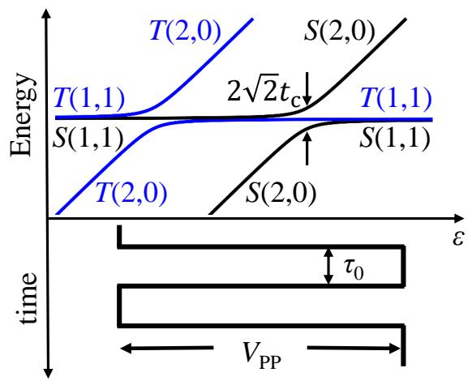

(b)  
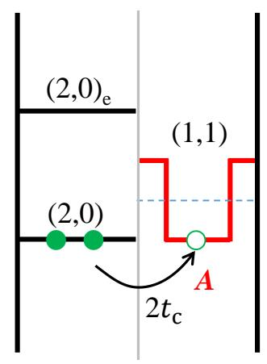

(c)  
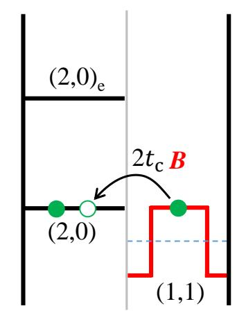

(d)  
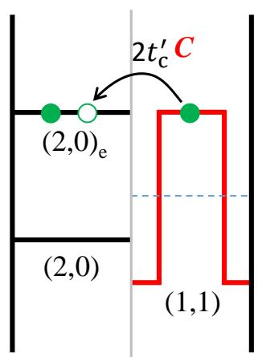

(e)  
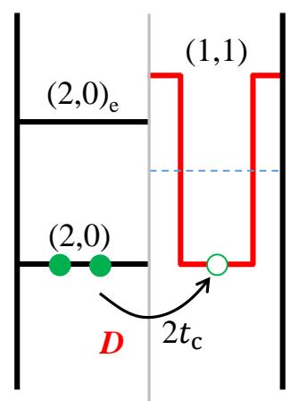  
图 4.5 给双量子点施加方波脉冲后，电子的能级跃迁示意图。(a) 上侧：无外加磁场时的双电子自旋态的能级示意图。下侧：方波脉冲引起失谐量 𝜀 随时间变化的示意图。(b)–(e) 在图4.4(a) 中跃迁线 A、B、C 和 D 对应的能级跃迁示意图。

## 4.5 量子点系统参数的影响

接下来我们考察量子点间隧穿耦合速率 $2 t _ { \mathrm { c } }$ 对激发态幅值谱的影响。通过调节电极 U 上施加的直流偏置电压，大范围地调节 $2 t _ { \mathrm { c } }$ ，在 $2 t _ { \mathrm { c } } / h = 7 . 5 \mathrm { G H z }$ 和5.0GHz时测量得到的激发谱结果如图4.6(a)和(b)所示。对比两者发现它们的信噪比有很大差异， $2 t _ { \mathrm { c } } = 5 . 0 \mathrm { G H z }$ 的激发态幅值谱更清晰，这是因为谐振腔对比特跃迁的响应与耦合强度 $g _ { \mathrm { c } }$ 、谐振腔–双量子点能量差 $\Delta$ 有关，都是量子点间隧穿耦合速率 $2 t _ { \mathrm { c } }$ 的函数。

我们利用 J–C 哈密顿量计算频率偏移量 $\Delta \nu _ { \mathrm { r } }$ 随 $2 t _ { \mathrm { c } }$ 和 $\varepsilon$ 的关系如图4.7(a) 所示。当 $2 t _ { \mathrm { c } } / h > \nu _ { \mathrm { r } }$ 时，比特能量 $\hbar \omega _ { \mathrm { a } } = \sqrt { \varepsilon ^ { 2 } + ( 2 t _ { \mathrm { c } } ) ^ { 2 } }$ 总是大于谐振腔频率，频移$\Delta \nu _ { \mathrm { r } }$ 会随着 $2 t _ { \mathrm { c } }$ 的增加快速地减小。因此，对于 $2 t _ { \mathrm { c } } / h = 7 . 5 \mathrm { G H z }$ ，隧穿耦合速率远大于谐振频率 $\nu _ { \mathrm { r } } = 6 . 0 4 \mathrm { G H z }$ ，导致图4.6(a)中激发谱信噪比较小。当 $2 t _ { \mathrm { c } } / h < \nu _ { \mathrm { r } }$ 时，双量子点能级与谐振腔频率在 $\varepsilon = \pm \sqrt { ( h \nu _ { \mathrm { r } } ) ^ { 2 } - ( 2 t _ { \mathrm { c } } ) ^ { 2 } }$ 处相交。在这两个共振点处， $\Delta \nu _ { \mathrm { r } }$ 达到最大值，使得图4.6(b)中的谐振腔有良好响应，因此 $2 t _ { \mathrm { c } } = 5 . 0 \mathrm { G H z }$ 时激发态幅值谱的信噪比较高。由于能量共振时正负两处失谐量之间的能量差$2 | \varepsilon |$ 远小于幅值谱中其他参数的能量量级，所以在图4.6(b) 中本该由两条共振线构成的态跃迁线比较模糊，并使得此 $2 t _ { \mathrm { c } }$ 下的跃迁线宽度大于图4.6(a) 的跃迁线宽度。

此外，图4.6(b) 中 $( 2 , 0 ) _ { \mathrm { e } } { - } ( 1 , 1 )$ 的腔幅值响应远比 $2 t _ { \mathrm { c } } = 5 . 8 \mathrm { G H z [ }$ [图4.4(a)] 和7.5GHz[图4.6(a)] 大。我们认为这是由于激发态具有更大的波函数空间分布，使得双量子点内电荷态的波函数重叠部分更多，所以 $( 2 , 0 ) _ { \mathrm { e } } { - } ( 1 , 1 )$ 电荷态跃迁处的隧穿耦合速率 $2 t _ { \mathrm { c } } ^ { \prime } > 2 t _ { \mathrm { c } } , \ 2 t _ { \mathrm { c } } ^ { \prime }$ 更接近超导腔谐振 $\nu _ { \mathrm { r } }$ ，导致谐振腔对激发态 (2,0) –(1,1)的跃迁响应更灵敏，在图4.6(b) 中激发态的跃迁线幅值响应更强。

为了验证上述解释，我们建立了一个理论模型来模拟实验结果。在无外加磁场下，所有的双电子自旋三重态 $\mathrm { T _ { \pm } }$ 和 $\mathrm { { T _ { 0 } } }$ 都是简并的。所以为了计算方便，我们可以把双量子点双电子自旋系统的哈密顿量以单重态 S(1,1)、S(2,0) 和三重态

(d)  
(a)  
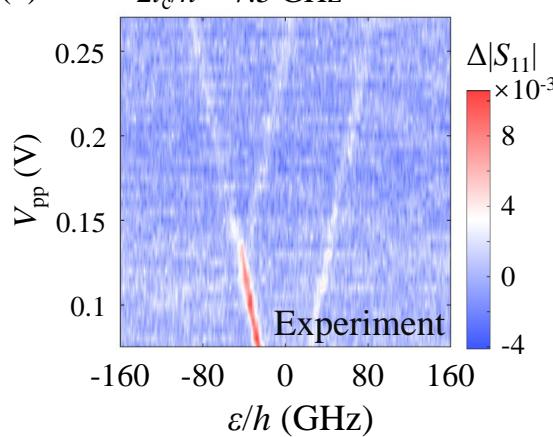

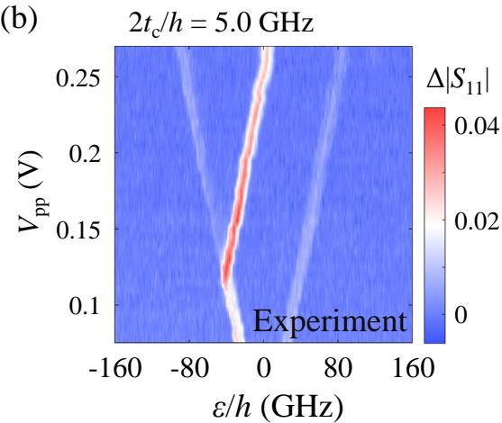

(c)  
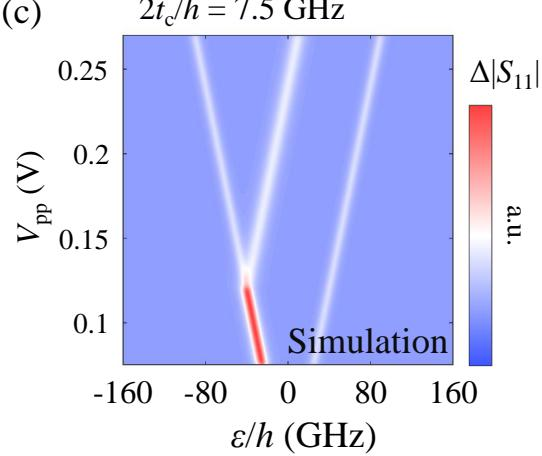

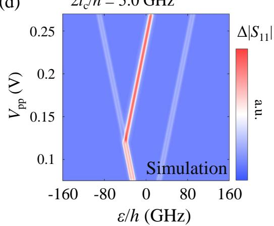  
图 4.6 (a)–(b) $2 t _ { \mathrm { c } } / h = 7 . 5 \mathrm { G H z }$ 和 5.0 GHz 时实验测量得到的激发谱。(c)–(d) 相同参数下的模拟结果。

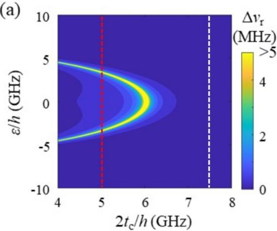

(b)  
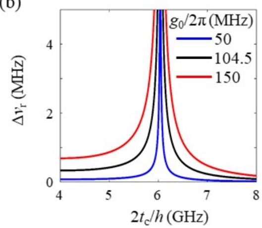  
图 4.7 (a) 频率偏移 $\Delta \nu _ { \mathbf { r } }$ 随 $2 t _ { \mathbf { c } }$ 和 𝜀 变化的模拟图。左侧虚线和右侧虚线分别对应图 ${ \bf 4 . 6 ( a ) }$ 和 (b) 激发谱的隧穿耦合速率 $2 t _ { \mathbf { c } }$ 。其它参数和实验一致。(b) 沿 (a) 图中零失谐量，耦合强度 $g _ { 0 } / 2 \pi = 5 0 \mathrm { M H z }$ （下方蓝色曲线）、 $g _ { 0 } / 2 \pi = 1 0 4 . 5 \mathrm { M H z }$ （中间黑色曲线）和$g _ { 0 } / 2 \pi = 1 5 0 \mathrm { M H z }$ （上方红色曲线）时的 $\Delta \nu _ { \mathrm { r } } - 2 t _ { \mathrm { c } }$ 关系曲线。

T(1,1)、T(2,0) 为基矢写作

$$
H _ { 0 } = \left( \begin{array} { c c c c c } { { 0 } } & { { } } & { { t _ { \mathrm { c } } } } & { { } } & { { 0 } } & { { 0 } } \\ { { t _ { \mathrm { c } } } } & { { } } & { { \varepsilon } } & { { 0 } } & { { 0 } } \\ { { 0 } } & { { } } & { { 0 } } & { { } } & { { 0 } } & { { t _ { \mathrm { c } } ^ { \prime } } } \\ { { 0 } } & { { } } & { { 0 } } & { { } } & { { t _ { \mathrm { c } } ^ { \prime } } } & { { \varepsilon + \Delta E } } \end{array} \right) .\tag{4.1}
$$

这里 $t _ { \mathrm { c } }$ 是单重态S(1,1)–S(2,0)之间的隧穿耦合速率， $t _ { \mathrm { c } } ^ { \prime }$ 是三重态 T(1,1)–T(2,0) 之间的隧穿耦合速率， $\Delta E$ 是 S(2,0) 和 T(2,0) 之间的能量劈裂。

给双量子点施加一路低频脉冲序列对失谐量进行调制时，失谐量是脉冲展宽的周期函数，

$$
\varepsilon ( \tau )  \{ \begin{array} { c c } { \varepsilon + \alpha V _ { \mathrm { p p } } / 2 , } & { 2 n \tau _ { 0 } \leqslant \tau < ( 2 n + 1 ) \tau _ { 0 } , } \\ { \varepsilon - \alpha V _ { \mathrm { p p } } / 2 , } & { ( 2 n + 1 ) \tau _ { 0 } \leqslant \tau < ( 2 n + 2 ) \tau _ { 0 } , } \end{array} 
$$

其中 $n$ 为整数，脉冲展宽为𝜏 ，对应的脉冲重复率为 $\tau _ { 0 }$ $1 / 2 \tau _ { 0 }$ $V _ { \mathrm { p p } }$ 为脉冲电压峰–峰值， $\alpha$ 为脉冲电压的电压–能量转换比。为了简化电子库耦合到双点电子态的作用，我们假设当量子点的电化学势低于电子库费米面时，电子能够以相同的概率载入到所有的双电子自旋态上，因此对于 (1,1) 电荷分布，所有自旋态的初始化概率均为四分之一，而对于(2,0)电荷分布，自旋态的初始化与脉冲幅值有关。如果 $V _ { \mathrm { p p } }$ 足够大（在我们的实验中为0.13V），三重态 $\mathrm { T } _ { 0 , \pm }$ 能级也能够达到。由于脉冲频率远小于退相干速率（GaAs中核自旋产生的核磁场均方根 $B _ { \mathrm { n u c } } \approx 2 - 6 \mathrm { m T }$ 导致的典型退相干时间 $t _ { \mathrm { n u c } } \approx 3 - 1 0 \mathrm { n s } ^ { [ 4 4 ] }$ ），腔的反射信号就可以认为是由两个不同脉冲电平下的平衡态占据概率决定。

利用输入–输出理论[27,31,40]，我们代入实验参数模拟激发态幅值谱，模拟结果如图4.6(c)–(d) 所示。相关的实验参数包括耦合强度 $g _ { 0 } / 2 \pi \approx 1 0 4 . 5 \mathrm { M H z }$ ，光子的内部、外部和整体耗散速率 $( \kappa _ { \mathrm { i } } , \kappa _ { \mathrm { e } } , \kappa ) / 2 \pi = ( 4 . 8 , 3 0 . 5 , 3 5 . 3 ) \mathrm { M H z }$ ，比特退相干速率 $\gamma / 2 \pi \approx 7 2 \mathrm { M H z }$ ，以及量子点间隧穿速率 $2 t _ { \mathrm { c } } / h \approx 7 . 5 \mathrm { G H z }$ 和 5.0GHz。考虑到电荷噪声会引起失谐量的缓慢涨落[48­49]，导致激发谱的各向异性展宽（图中沿横向 𝑥 轴的失谐量），所以所有的模拟图都经过了 4 $\mu \mathrm { e V }$ 展宽的高斯卷积。又因为直接提取高阶的隧穿耦合速率 $t _ { \mathrm { c } } ^ { \prime }$ 与 $g _ { 0 } ^ { \prime }$ 比较困难，所以在模拟中我们假设 $g _ { 0 } ^ { \prime } \approx g _ { 0 } .$ $2 t _ { \mathrm { c } } = 5 \mathrm { G H z }$ 时 $2 t _ { \mathrm { c } } ^ { \prime } = 6 \mathrm { G H z }$ $2 t _ { \mathrm { c } } = 7 . 5 \mathrm { G H z }$ 时 $2 t _ { \mathrm { c } } ^ { \prime } = 1 0 \mathrm { G H z }$ ，这是因为激发态的波函数更大，态叠加导致的隧穿耦合速率也更大。图4.6(c)–(d) 中的模拟结果与实验结果符合得较好，也从另一方面说明我们的测量结果还可以用于估计激发态之间的隧穿速率等其它系统参数。

除了隧穿耦合速率，电荷–光子耦合速率 𝑔 也对腔响应有影响。图4.7(b) 给 $g _ { 0 }$ 出了在零失谐量处、不同耦合强度 $g _ { 0 }$ 下，腔频偏移量 $\Delta \nu _ { \mathrm { r } }$ 与 $2 t _ { \mathrm { c } }$ 的依赖关系图。当耦合强度 $g _ { 0 }$ 越大，腔频偏移 $\Delta \nu _ { \mathrm { r } }$ 越大，导致𝑆 矩阵参数幅值响应 $\vert S _ { 1 1 } \vert$ 越大。

## 4.6 本章小结

在本章中，我们通过给 GaAs 双量子点上的电极施加 50% 占空比的方波脉冲，利用高阻抗超导 NbTiN 谐振腔来探测四电子电荷态的能谱。由于泡利自旋阻塞，脉冲电压作用下的电子在不同自旋态能级的跃迁过程不同，使得激发态驱动幅值谱上谐振腔的信号响应也不同。通过改变势垒电极电压调节量子点间隧穿耦合速率，探究它对激发谱的影响，并通过理论模型给予了验证。

我们利用腔探测到的激发谱背景比较干净，因为谐振腔仅对接近腔频的弹性共振隧穿有响应。即使在少电子区，谐振腔也有较好的分辨率。如果要进一步提高读取品质，还需要使用精细设计的滤波电路抑制通过量子点金属电极泄漏的微波信号[50­51]，并应用约瑟夫森参量放大器提高信噪比[52]。

我们的实验结果为单重态–三重态量子比特的灵敏读出提供了一种简单实用的方法。这种电极式的腔读出技术不仅仅适用于门控型双量子点器件，也可以推广到其它腔耦合的杂化系统，用来测量比特能谱，表征能级关系。

## 参考文献

[1] Tarucha S, Austing D G, Honda T, et al. Shell filling and spin effects in a few electron quantum dot. Physical Review Letters, 1996, 77(17):3613.

[2] Watzinger H, Kukučka J, Vukušić L, et al. A germanium hole spin qubit. Nature Communications, 2018, 9(1):3902.

[3] Hendrickx N W, Franke D P, Sammak A, et al. Fast two­qubit logic with holes in germanium. Nature, 2020, 577(7791):487.

[4] Watson T F, Philips S G J, Kawakami E, et al. A programmable two­qubit quantum processor in silicon. Nature, 2018, 555(7698):633.

[5] Mills A R, Zajac D M, Gullans M J, et al. Shuttling a single charge across a one­dimensional array of silicon quantum dots. Nature Communications, 2019, 10(1):1.

[6] Asaad S, Mourik V, Joecker B, et al. Coherent electrical control of a single high­spin nucleus in silicon. Nature, 2020, 579(7798):205.

[7] Broome M A, Gorman S K, House M G, et al. Two­electron spin correlations in precision placed donors in silicon. Nature Communications, 2018, 9(1):980.

[8] Vandersypen L M K, Bluhm H, Clarke J S, et al. Interfacing spin qubits in quantum dots and donors—hot, dense, and coherent. npj Quantum Information, 2017, 3(1):34.

[9] Veldhorst M, Eenink H G J, Yang C H, et al. Silicon CMOS architecture for a spin­based quantum computer. Nature Communications, 2017, 8(1):1766.

[10] Jones C, Fogarty M A, Morello A, et al. Logical qubit in a linear array of semiconductor quantum dots. Physical Review X, 2018, 8(2):21058.

[11] Bermeister A, Keith D, Culcer D. Charge noise, spin­orbit coupling, and dephasing of singlespin qubits. Applied Physics Letters, 2014, 105(19):192102.

[12] Martins F, Malinowski F K, Nissen P D, et al. Noise suppression using symmetric exchange gates in spin qubits. Physical Review Letters, 2016, 116(11):116801.

[13] Dial O E, Shulman M D, Harvey S P, et al. Charge noise spectroscopy using coherent exchange oscillations in a singlet­triplet qubit. Physical Review Letters, 2013, 110(14):146804.

[14] Granger G, Taubert D, Young C E, et al. Quantum interference and phonon­mediated backaction in lateral quantum­dot circuits. Nature Physics, 2012, 8(7):522.

[15] Cao G, Xiao M, Li H, et al. Back­action­driven electron spin excitation in a single quantum dot. New Journal of Physics, 2013, 15(2):23021.

[16] Zheng G, Samkharadze N, Noordam M L, et al. Rapid gate­based spin read­out in silicon using an on­chip resonator. Nature Nanotechnology, 2019, 14(8):742.

[17] Scarlino P, van Woerkom D J, Stockklauser A, et al. All­microwave control and dispersive

readout of gate­defined quantum dot qubits in circuit quantum electrodynamics. Physical Review Letters, 2019, 122(20):206802.

[18] Colless J I, Mahoney A C, Hornibrook J M, et al. Dispersive readout of a few­electron double quantum dot with fast rf gate sensors. Physical Review Letters, 2013, 110(4):46805.

[19] West A, Hensen B, Jouan A, et al. Gate­based single­shot readout of spins in silicon. Nature Communications, 2019, 14(5):437.

[20] Crippa A, Ezzouch R, Aprá A, et al. Gate­reflectometry dispersive readout and coherent control of a spin qubit in silicon. Nature Communications, 2019, 10(1):2776.

[21] Schaal S, Ahmed I, Haigh J A, et al. Fast gate­based readout of silicon quantum dots using Josephson parametric amplification. Physical Review Letters, 2020, 124(6):67701.

[22] Wallraff A, Schuster D I, Blais A, et al. Approaching unit visibility for control of a superconducting qubit with dispersive readout. Physical Review Letters, 2005, 95(6):60501.

[23] Van Woerkom D J, Scarlino P, Ungerer J H, et al. Microwave photon­mediated interactions between semiconductor qubits. Physical Review X, 2018, 8(4):41018.

[24] Borjans F, Croot X G, Mi X, et al. Resonant microwave­mediated interactions between distant electron spins. Nature, 2020, 577(7789):195.

[25] Stockklauser A, Scarlino P, Koski J V, et al. Strong coupling cavity QED with gate­defined double quantum dots enabled by a high impedance resonator. Physical Review X, 2017, 7(1): 011030.

[26] Landig A J, Koski J V, Scarlino P, et al. Coherent spin­photon coupling using a resonant exchange qubit. Nature, 2018, 560(7717):179.

[27] Mi X, Benito M, Putz S, et al. A coherent spin­photon interface in silicon. Nature, 2018, 555 (7698):599.

[28] Samkharadze N, Zheng G, Kalhor N, et al. Strong spin­photon coupling in silicon. Science, 2018, 359(6380):1123.

[29] Wang B C, Lin T, Li H O, et al. Correlated spectrum of distant semiconductor qubits coupled by microwave photons. Science Bulletin, 2021, 66(4):332.

[30] Burkard G, Petta J R. Dispersive readout of valley splittings in cavity­coupled silicon quantum dots. Physical Review B, 2016, 94(19):195305.

[31] Landig A J, Koski J V, Scarlino P, et al. Microwave­cavity­detected spin blockade in a fewelectron double quantum dot. Physical Review Letters, 2019, 122(21):213601.

[32] Elzerman J M, Hanson R, van Beveren L H W, et al. Excited­state spectroscopy on a nearly closed quantum dot via charge detection. Applied Physics Letters, 2004, 84(23):4617.

[33] Johnson A C, Marcus C M, Hanson M P, et al. Charge sensing of excited states in an isolated double quantum dot. Physical Review B, 2005, 71(11):115333.

[34] Shi Z, Simmons C B, Ward D R, et al. Fast coherent manipulation of three­electron states in a double quantum dot. Nature Communications, 2014, 5(1):3020.

[35] Chen B, Wang B, Cao G, et al. Enhanced readout of spin states in double quantum dot. Science Bulletin, 2017, 62(10):712.

[36] Zhang M L, Deng G W, Li S X, et al. Symmetric reflection line resonator and its quality factor modulation by a two­dimensional electron gas. Applied Physics Letters, 2014, 104(8):83511.

[37] Petersson K D, McFaul L W, Schroer M D, et al. Circuit quantum electrodynamics with a spin qubit. Nature, 2012, 490(7420):380.

[38] Deng G W W, Wei D, Johansson J R, et al. Charge number dependence of the dephasing rates of a graphene double quantum dot in a circuit QED architecture. Physical Review Letters, 2015, 115(12):126804.

[39] Kouwenhoven L P, Jauhar S, McCormick K, et al. Photon­assisted tunneling through a quantum dot. Physical Review B, 1994, 50(3):2019.

[40] Viennot J J, Dartiailh M C, Cottet A, et al. Coherent coupling of a single spin to microwave cavity photons. Science, 2015, 349(6246):408.

[41] Cao G, Li H O, Yu G D, et al. Tunable hybrid qubit in a GaAs double quantum dot. Physical Review Letters, 2016, 116(8):86801.

[42] Yang C H, Leon R C C, Hwang J C C, et al. Operation of a silicon quantum processor unit cell above one kelvin. Nature, 2020, 580(7803):350.

[43] Petit L, Eenink H G J, Russ M, et al. Universal quantum logic in hot silicon qubits. Nature, 2020, 580(7803):355.

[44] Johnson A C, Petta J R, Taylor J M, et al. Triplet­singlet spin relaxation via nuclei in a double quantum dot. Nature, 2005, 435(7044):925.

[45] Petta J R, Lu H, Gossard A C. A coherent beam splitter for electronic spin states. Science, 2010, 327(5966):669.

[46] Ono K, Austing D G, Tokura Y, et al. Current rectification by Pauli exclusion in a weakly coupled double quantum dot system. Science, 2002, 297(5585):1313.

[47] Johnson A C, Petta J R, Marcus C M, et al. Singlet­triplet spin blockade and charge sensing in a few­electron double quantum dot. Physical Review B, 2005, 72(16):165308.

[48] Forster F, Petersen G, Manus S, et al. Characterization of qubit dephasing by Landau­Zener-Stückelberg­Majorana interferometry. Physical Review Letters, 2014, 112(11):116803.

[49] Cao G, Li H O, Tu T, et al. Ultrafast universal quantum control of a quantum­dot charge qubit using Landau–Zener–Stückelberg interference. Nature Communications, 2013, 4(1):1401.

[50] Mi X, Cady J V, Zajac D M, et al. Circuit quantum electrodynamics architecture for gatedefined quantum dots in silicon. Applied Physics Letters, 2017, 110(4):43502.

[51] Harvey­Collard P, Zheng G, Dijkema J, et al. On­chip microwave filters for high­impedance resonators with gate­defined quantum dots. Physical Review Applied, 2020, 14(3):34025.

[52] Stehlik J, Liu Y Y, Quintana C M, et al. Fast charge sensing of a cavity­coupled double quantum dot using a Josephson parametric amplifier. Physical Review Applied, 2015, 4(1):14018.

## 第 5 章 基于双量子点–腔耦合系统的微波激光器

束缚在光学腔内的原子受激辐射导致布居数反转，会在能级跃迁中辐射出大量相干光子[1]。根据该原理制作的相干光源是量子光学中的重要元件，作为腔量子电动力学的一个重要应用，它被广泛用于频谱测量、成像、信息传输中。相干光源已经在原子系统[2]、固态系统[3­6] 中得到实现，但是想要制备微纳尺寸的半导体相干光发射器件并集成在微型芯片上，仍然是不小的难题。目前已有实验组在源漏偏置的半导体双量子点系统中研究光子发射现象，并用微波谐振腔探测取得了一定成果[7­8]。

本章介绍了我们首次在高阻抗的反射式微波谐振腔与源漏泵浦的 GaAs 量子点杂化系统中，测量得到量子点发光导致的腔幅值增益。通过表征与分析在不同量子点状态下的腔信号响应，我们可以从幅值增益中分辨出微波光子发射与腔频偏移。该研究为实现半导体 cQED 系统中的微型放大器与相干微波光源提供了一种可能的方法[9]。

## 5.1 样品结构与基本表征

样品由一个 𝜆/4 的超导反射谐振腔和门控 GaAs 双量子点构成，如图5.1(a)所示。其中，谐振腔由SQUID阵列构成[10]，具有谐振频率𝜈 可调的特点。在实 $\nu _ { \mathrm { r } }$ 验中，我们把 SQUID 腔的谐振频率 𝜈 调节至 6.758GHz，而它的总线宽、内部 $\nu _ { \mathrm { r } }$ 损耗速率和外部损耗速率经过表征为 $( \kappa , \kappa _ { \mathrm { i } } , \kappa _ { \mathrm { e } } ) / 2 \pi = ( 5 8 . 9 , 3 6 . 9 , 2 2 . 0 ) \mathrm { M H z }$ 。由于SQUID阵列具有很高的电感，所以它的特征阻抗 $Z _ { \mathrm { r } }$ 可以达到1kΩ，远远超过典型的 50Ω 共面波导谐振腔。

通过图5.1(a)中标为L、P、U、R和D的金属电极上施加偏置电压，可以在GaAs/AlGaAs异质结的二维电子气上束缚电子形成双量子点。在实验中，我们通过调节电极L、P和R的电压来控制两个量子点的电化学势。为了实现双量子点与 SQUID 谐振腔的耦合，我们将它的右侧量子点上方电极直接连接到谐振腔的电压波腹处。通过输入–输出理论[11­12]，我们拟合实验数据得到电子–光子的最大耦合速率为 $g _ { 0 } / 2 \pi \approx 5 7 \mathrm { M H z }$

由于双量子点与微波谐振腔的耦合，双点内电子电荷态的变化会引起谐振腔磁化系数 𝜒 的改变，从而导致腔的谐振频率产生偏移 $\chi$ $\Delta \omega _ { \mathrm { r } }$ 。在色散耦合区域，谐振腔和电荷比特的频率差 $\Delta = \omega _ { \mathrm { a } } - \omega _ { \mathrm { r } }$ 远大于耦合速率 $g _ { \mathrm { c } }$ ，此时频率偏移量$\Delta \omega _ { \mathrm { r } } \propto ( g _ { \mathrm { c } } ^ { 2 } / \Delta ) \sigma _ { z }$ ，因此，可以通过观测谐振腔的响应来得到双量子点的电荷状态。实验中，我们给 SQUID 谐振腔输入一个探测微波，然后测量它的反射信号

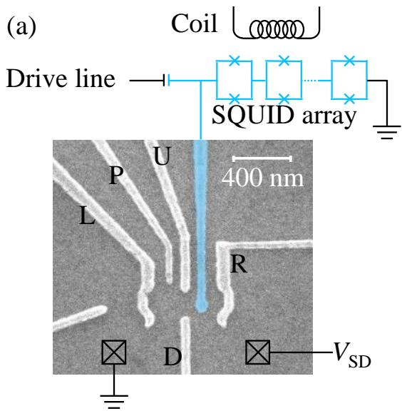

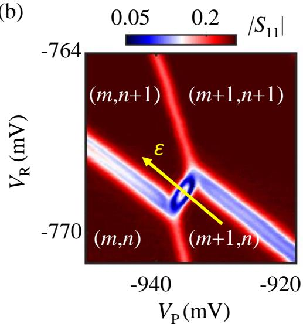  
图 5.1 (a) 样品的扫描电子显微镜图。通过给金属电极 L、P、U、R 和 D 施加负偏置电压形成双量子点，同时在源漏上加直流电压 $V _ { \mathbf { S D } }$ 来驱动双点。量子点的右侧电极连接到 SQUID 阵列构成的谐振腔上，通过测量馈线上谐振腔反射的微波信号可以测得量子点的电荷态。(b)在 $V _ { \mathrm { S D } } = 0$ 时，测量SQUID腔幅值信号 $\vert S _ { 1 1 } \vert$ 得到的双量子点电荷稳定图，可以观察到双点与源漏之间的隧穿信号，以及量子点之间正斜率的电荷跃迁线。失谐量𝜀 由垂直于量子点间隧穿线的箭头标出。

$S _ { 1 1 }$ ，从而探测双点。为了方便，我们把这个探测微波的频率设置在共振频率上，$f _ { \mathrm { p } } = \nu _ { \mathrm { r } }$ ，这样，谐振腔的频移会导致反射信号幅值 $\vert S _ { 1 1 } \vert$ 的增强。得益于SQUID腔的高阻抗，该cQED杂化系统的耦合强度比较大，我们可以非常灵敏地探测双量子点的电荷态。

实验过程中，样品被置于腔体温度约为25mK的稀释制冷机中。由矢量网络分析仪输出功率为 −30dBm 的探测微波，经过线路上约 70dB 的衰减到达样品上。测量反射幅值信号 $\vert S _ { 1 1 } \vert$ ，我们可以得到源漏偏置 $V _ { \mathrm { S D } } = 0$ 时，在双量子点多电子区域的电荷稳定图，如图5.1(b)所示。稳态图被5条隧穿线分割成了4个区域， $( m , n )$ 电子区代表着有 𝑚 个电子在左量子点，𝑛 个电子在右量子点。中央的正斜率斜线是量子点之间的电荷隧穿线，两个点的电化学势沿着这条隧穿线齐平，失谐量 $\varepsilon = 0$ ，而双点内的总电荷数在隧穿过程中保持不变。其余的 4 条线对应电子在量子点与相邻源漏之间的跃迁，被称作充电线。由于腔对量子点–电子库之间的隧穿响应取决于源漏隧穿速率 ${ \cal T } _ { \mathrm { L , R } }$ [13­14]，所以当右点与右侧电子库的耦合 ${ \cal T } _ { \mathrm { R } }$ 非常强时，导致电荷稳定图5.1(b) 中右点到源漏的充电线有较大的展宽和较强的腔响应。

由于我们把探测频率 $f _ { \mathfrak { p } }$ 固定在反射腔的谐振频率处，处在频谱的最小值处，所以在隧穿线附近探测电子跃迁引起腔频偏移信号时，预期测量得到增强的反射信号 $\vert S _ { 1 1 } \vert$ 。但是除了量子点之间的隧穿信号，实际所有充电线的信号幅值 $\vert S _ { 1 1 } \vert$ 相比于库伦阻塞区的幅值都有所减小。这是由于在这些隧穿线上，量子点与源漏的耦合给谐振腔–量子点杂化系统打开了额外的耗散通道，当电子发生到源漏的跳迁时，腔光子也同时被耗散，破坏了谐振腔的品质因子，使得腔的展宽更大，频谱中的吸收谷更深。

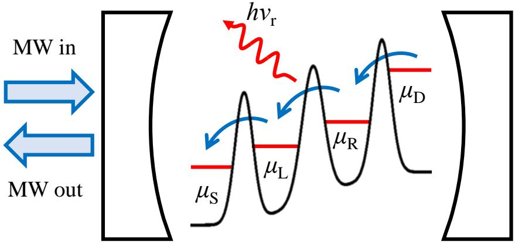  
图 5.2 量子点发光模型示意图。双量子点被置于谐振腔内，在源漏驱动下发生电子的连续跃迁发出光子。

## 5.2 量子点发光现象

通常情况下，一个相干光发射装置包含了增益介质、泵浦源和谐振腔这几个必要组成部分。在我们的 GaAs 双量子点–SQUID 谐振腔组成的杂化系统中，双量子点作为增益介质，穿过双点的直流偏置电压作为稳定的泵浦源，从而实现受激辐射产生光子。图5.2展示了这样一个杂化系统的发光过程：双量子点位于谐振腔内，在源漏偏置作用下，电子从高费米面向低费米面运动，连续地从漏极跃迁进右量子点内，再跃迁进左量子点，最后跃迁进源极。由于非弹性隧穿，电子会在隧穿过程中同时发射出一个微波光子，当这个微波光子的频率与谐振腔频率匹配时，这个光子就会被腔俘获并存储。

令源漏偏置 $V _ { \mathrm { S D } } = 0 . 5 \mathrm { m V }$ ，使得源漏两侧的费米面产生高低差，为电子的隧穿打开了一个窗口，使电子能够连续地从漏极跳向源极，在电荷稳定图上形成了两个偏压三角形，如图5.3(a)所示。在每个偏压三角形的底边处，即失谐量 $\varepsilon \approx 0$ 的附近，测量得到的腔的反射幅值信号比库伦阻塞区的腔信号更大，这些区域被称为“增益区域（hot spot）”。为了定量地描述幅值增益，我们定义增益系数$G = | S _ { 1 1 } | / | S _ { 1 1 } ^ { ( \mathrm { c ) } } |$ ，其中 $\vert S _ { 1 1 } ^ { \mathrm { ( c ) } } \vert$ 是在库伦阻塞区的腔幅值大小。在库伦阻塞区，双量子点电荷态远离隧穿线，完全被束缚在量子点内，难以产生电荷态激发或跃迁，所以此时的增益 $G = 1$

在上侧的偏压三角形内（虚线边标出的三角形），两个量子点的电化学势都位于偏压窗口内，在源漏偏置电压的泵浦下，使电子发生连续的跳迁循环，循环过程为 $( m , n ) \to ( m , n + 1 ) \to ( m + 1 , n ) \to ( m , n )$ 。在增益区域， $\varepsilon > 0$ ，电子从漏极加载到右量子点内，然后跃迁到左点，随后跳出左点进入源极，最终在源漏偏置下被重新泵浦，周而复始地完成电子隧穿循环。由于右点的势能 $\mu _ { \mathrm { R } }$ 比左点 $\mu _ { \mathrm { L } }$ 更高，所以在量子点间跃迁过程中的能量损耗会转化成一个光子和一个声子[15]。当发射出来的光子频率与谐振腔共振频率匹配时，它就会被存储在谐振腔内，直到它被外界读取或是耗散掉。与之相反的，若 $\varepsilon < 0$ ，即 $\mu _ { \mathrm { R } } < \mu _ { \mathrm { L } }$ ，则双量子点会通过吸收一个光子和声子克服能量差，从 $| R \rangle$ 跃迁到|𝐿⟩，导致信号增益 $G < 1$ ，对应图5.3(a)中虚线箭头所指的区域。由于有效耦合强度 $g _ { \mathrm { c } } = g _ { 0 } \cdot 2 t _ { \mathrm { c } } / \hbar \omega _ { a } = g _ { 0 } \cdot 2 t _ { \mathrm { c } } / \sqrt { \varepsilon ^ { 2 } + ( 2 t _ { \mathrm { c } } ) ^ { 2 } }$ 会随着失谐量 |𝜀| 的增大而快速减小，所以在大失谐量下量子点电荷态对谐振腔频率的作用消失，增益系数 𝐺 趋向于 1。故增益区域仅出现在图5.3(a) 的零失谐量附近。

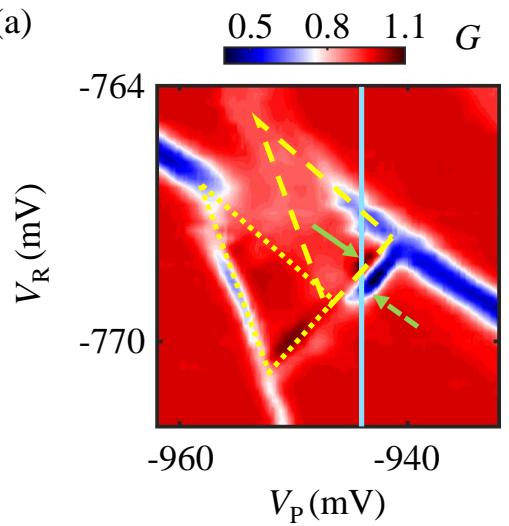

(b)  
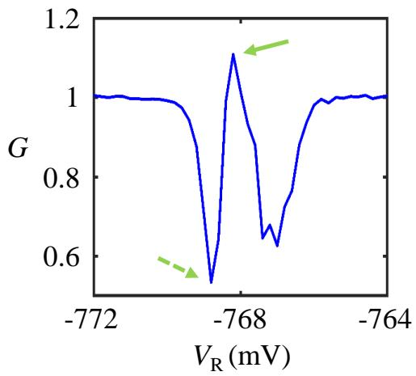  
图 5.3 (a) 源漏偏置 $V _ { \mathbf { S D } } = 0 . 5 \mathrm { m V }$ 时，以电极电压 $V _ { \mathbf { P } }$ 和 $V _ { \mathbf { R } }$ 为扫描参数，测量腔信号增益𝐺 得到的稳态图。其中上侧的偏压三角形轮廓由虚线标出，下侧的偏压三角形轮廓由点线标出。实线箭头所指的区域腔信号幅值增强， $G > 1$ ；虚线箭头所指的区域腔信号幅值被抑制， $G < 1 _ { \circ } \ ( \mathbf { b } )$ 沿图 (a) 中 $V _ { \mathbf { p } } = - 9 4 4 \mathrm { m V }$ 截取的一条竖线。尖峰处对应光子发射，而左侧低谷对应光子吸收。

为了能够更加清楚地对比光子发射和光子吸收现象，我们沿着穿过图5.3(a)中偏压三角形的竖线测量幅值 $\vert S _ { 1 1 } \vert$ 随电极电压 $V _ { \mathrm { R } }$ 的变化曲线，结果如图5.3(b)所示。扫描结果图中有两个谷和一个峰，其中右侧谷对应双量子点–电子库隧穿，左侧谷对应光子吸收导致的增益减小（虚箭头标出），而中间的幅值峰对应量子点发光导致的增益增大（实线箭头标出），达到最大增益 $G = 1 . 1$ 0

## 5.3 量子点发光信号与频移信号的区分

在我们的样品中，我们选择将 𝜆/4 的 SQUID 阵列反射腔耦合到 GaAs 半导体双量子点上，在源漏驱动下进行量子点动力学过程的平均测量。当探测微波固定在谐振腔频率，对于反射腔，除了量子点发光导致的幅值增益外，量子点内电荷态变化导致的腔频偏移也会使微波探测的幅值响应增大，而对于𝜆/2的透射腔则是幅值响应减小。因此，相比于透射腔，在我们的实验中需要额外区分增益区域内观测到的幅值增强来自于光子发射还是腔频移动。

首先，我们通过抬高量子点之间的隧穿势垒来抑制电子跃迁导致的光子辐射。我们把势垒电极电压 $V _ { \mathrm { { U } } }$ 从 −900mV 减小到 −1300mV，从而极大地减小量子点间隧穿速率 $2 t _ { \mathrm { c } }$ ，并且小于谐振腔频率 $\nu _ { \mathrm { r } }$ 。此外，当 $2 t _ { \mathrm { c } }$ 减小时要求更大的的失谐量 $\varepsilon = \pm \sqrt { ( \hbar \omega _ { \mathrm { a } } ) ^ { 2 } - ( 2 t _ { \mathrm { c } } ) ^ { 2 } }$ 来匹配腔的谐振频率达到共振，从而减小了有效耦合强度 $g _ { \mathrm { c } }$ ，进一步抑制了光子发射导致的信号增益。改变参数后，在 $V _ { \mathrm { S D } } = 0 . 5 \mathrm { m V }$ 下扫描 $V _ { \mathrm { R } }$ 和 $V _ { \mathrm { { L } } }$ 测量得到的 $\vert S _ { 1 1 } \vert$ 相图如图5.4(a) 所示，图中的信号增益区域来自于腔频偏移。

为了更直观地说明频移现象，我们以库伦阻塞区（圆形）的频谱作为参考基准，将增益区域（三角形）测到的频谱与在库伦阻塞区域（圆形）的测量结果进行比较。我们分别在这两个区域测量反射幅值 $\vert S _ { 1 1 } \vert$ 随探测频率 $f _ { \mathfrak { p } }$ 变化的关系，如果增益信号不是来自量子点发光，那么我们应该如示意图5.4(b)在频谱上测量到腔频的小幅移动。图5.4(c) 给出了实际的测量关系图，结果与预期一致，两条$\vert S _ { 1 1 } \vert$ 曲线中虚线代表的增益区域相比实线代表的库伦阻塞区域有明显的水平平移，这是量子点间隧穿导致腔频偏移的直接证据。将两条曲线进行洛伦兹拟合，提取得到腔频的偏移量 $\Delta \nu _ { \mathrm { r } } = 0 . 5 \mathrm { M H z }$ ，偏移的方向取决于比特与谐振腔之间的频率差 $\Delta = \omega _ { \mathrm { a } } - \omega _ { \mathrm { r } }$ 。不过腔频偏移导致的信号增益非常小，相对于参考信号的增量 $| \Delta S _ { 1 1 } | / | S _ { 1 1 } ^ { ( \mathrm { c ) } } |$ 只有大约1.7%。

为了重新探测量子点发光，我们将电极电压 $V _ { \mathrm { { U } } }$ 调回−900mV，提高量子点之间的隧穿速率。如果此时量子点能够在电子隧穿时发射出来微波光子并被腔探测到，那么探测得到的腔频谱曲线应符合示意图5.4(e)，相对于库伦阻塞区的参考线有显著的抬升。同腔频偏移实验一样，令源漏偏置 $V _ { \mathrm { S D } } = 0 . 5 \mathrm { m V }$ ，在电荷稳定图5.4(d) 的增益区域与库伦阻塞区域分别测量 $\vert S _ { 1 1 } \vert$ 随探测微波 $f _ { \mathfrak { p } }$ 变化的频谱，结果如图5.4(f)所示。除了能够看到明显的谱线上移之外，虚线（增益区域）相对实线（库伦阻塞区域）略微的向左平移，腔频也有小幅频移，但是这个平移贡献的幅值增益非常小。在减去频移导致的增益后，提取到量子点发光导致的相对幅值增量 $| \Delta S _ { 1 1 } | / | S _ { 1 1 } ^ { ( \mathrm { c ) } } | \approx 6 . 3 \%$ ，远大于频移贡献量（2.9%）。利用上述的频谱比较方法，我们成功把量子点发光贡献的部分从增益区域的反射信号里分辨出来。

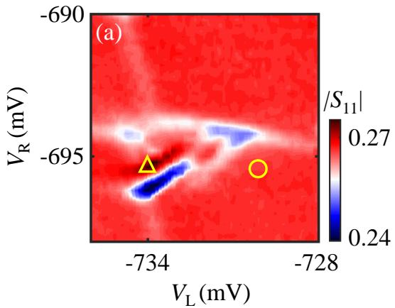  
(b)

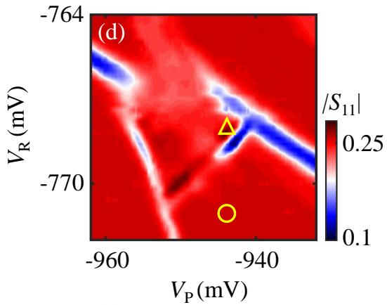  
(e)

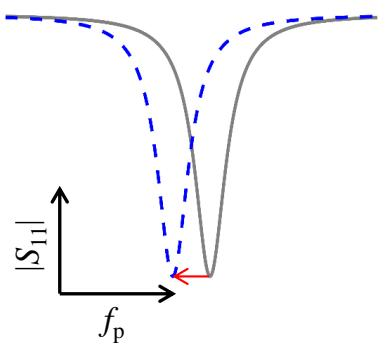

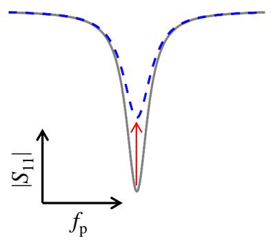

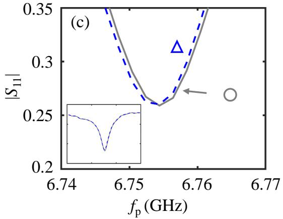

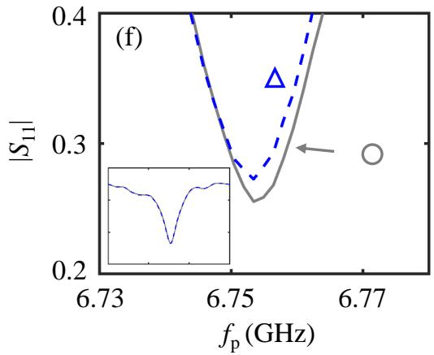  
图 5.4 (a),(d) $V _ { \mathbf { S D } } = 0 . 5 \mathrm { m V }$ 时测量腔幅值信号得到的电荷稳定图，用三角形标记出了增益区域，用圆形标记出了库伦阻塞区。(b),(e) 腔频偏移与量子点发光导致的腔信号幅值增益示意图。 ${ \bf ( c ) , ( f ) }$ 在增益区域（虚线）和库伦阻塞区（实线）测量得到的频谱信号，放大展示了谐振谷附近的细节。左下角插图为完整的频谱曲线，几乎重叠在了一起。

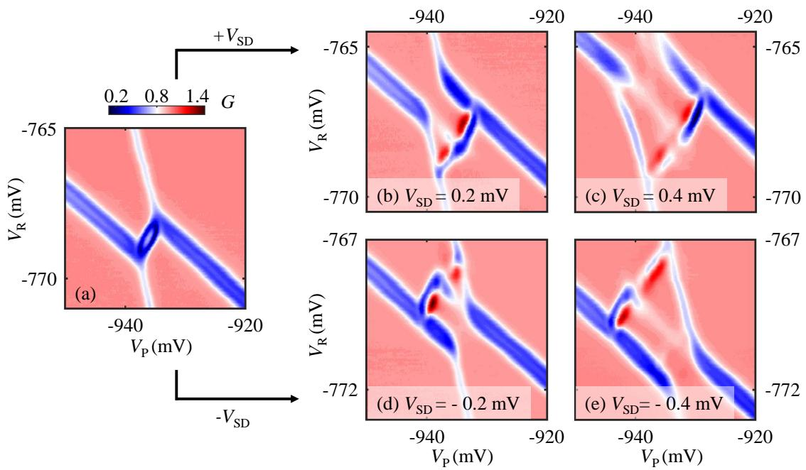  
图 5.5 不同源漏偏置下的量子点发光。 $V _ { \mathrm { S D } } = 0$ (a)，0.2 mV (b)，0.4 mV (c)，−0.2 mV (d)，−0.4 mV (e)。

最后，我们测量不同源漏偏置电压下的电荷稳定图，从 −0.4mV 至 0.4mV，改变偏压窗口的大小，结果如5.5所示。这些不同大小和方向的直流偏置导致了不同形状大小的偏压三角形。电压越大，偏压三角形面积越大，增益区域的面积也越大。但是在 $| V _ { \mathrm { S D } } | = 0 . 4 \mathrm { m V }$ 时测量得到的增益却比 $| V _ { \mathrm { S D } } | = 0 . 2 \mathrm { m V }$ 时的增益小，这是由于受到了双量子点–电子库隧穿速率的影响。因为偏压窗口越大，可能会有能量更高的电子与更多的声子参与到泵浦循环中，同时引入额外的退相干通道，破坏杂化系统的量子相干性，导致量子点发光产生光子与光子耗散最终达到平衡时，腔内存储的光子变少，增益也随之减小。

## 5.4 本章小结

我们在 SQUID 阵列谐振腔与双量子点构成的 cQED 系统中，观测到了由于量子点发光导致的腔响应增强。由于 SQUID 腔的高阻抗特征，光子与双量子点内的电子耦合比较强，所以在双量子点受到持续的直流电压泵浦作用，电子在两量子点间发生隧穿时，可以有效地实现电子到微波光子的转换，并通过腔读取得到增益信号。通过对比增益区域与库伦阻塞区域的频谱信号，我们可以区分出量子点发光产生的增益与腔频移动。

在我们的实验中，使用的是𝜆/4的SQUID阵列反射腔对双量子点进行探测，相比于半波长的传输线谐振腔有以下两点优势：1.我们的谐振腔尺寸更小，有助于未来片上集成其他器件；2. 单端口的微波谐振腔可以抑制输入与输出之间的串扰，提升谐振腔频谱的对称性[16­17]。尽管我们能够通过矢量网络分析仪探测到反射谐振腔的增益信号，但是由于较快的光子耗散速率和量子点退相干速率，当我们把谐振腔的输出端口外接到频谱仪上时，并没有直接测量到光子辐射信号，即我们目前的源漏偏置半导体量子点系统还无法实现稳定的受激辐射，有效地发射微波光子。但是，在将来对双量子点与谐振腔进行优化、提高品质因子，并增大耦合强度后，我们相信腔光子的增益可以达到足够高的水平，在该杂化系统中实现微纳尺寸的相干光源。另外，如果能够应用片上的约瑟夫森参量放大器（Josephson parametric amplifier），放置在与样品同一层的稀释制冷机混合腔内放大输出信号，可以显著提高信噪比，有助于弱微波信号的探测[7,9]。

## 参考文献

[1] Walls D F F, Milburn G J G J. Quantum optics. 2nd ed. Heidelberg: Springer, 1995.

[2] Haken H. Laser theory//Light and Matter Ic/Licht und Materie Ic. Springer, 1970.

[3] Xie Z G, Götzinger S, Fang W, et al. Influence of a single quantum dot state on the characteristics of a microdisk laser. Physical Review Letters, 2007, 98(11):117401.

[4] Nomura M, Kumagai N, Iwamoto S, et al. Laser oscillation in a strongly coupled singlequantum­dot–nanocavity system. Nature Physics, 2010, 6(4):279.

[5] Astafiev O, Inomata K, Niskanen A O, et al. Single artificial­atom lasing. Nature, 2007, 449 (7162):588.

[6] Li Y Y, Liu J Q, Wang T, et al. High­power and high­efficiency operation of terahertz quantum cascade lasers at 3.3 THz. Chinese Physics Letters, 2015, 32(10):104203.

[7] Stockklauser A, Maisi V F, Basset J, et al. Microwave emission from hybridized states in a semiconductor charge qubit. Physical Review Letters, 2015, 115(4):46802.

[8] Samkharadze N, Zheng G, Kalhor N, et al. Strong spin­photon coupling in silicon. Science, 2018, 359(6380):1123.

[9] Liu Y Y, Stehlik J, Eichler C, et al. Semiconductor double quantum dot micromaser. Science, 2015, 347(6219):285.

[10] Stockklauser A, Scarlino P, Koski J V, et al. Strong coupling cavity QED with gate­defined double quantum dots enabled by a high impedance resonator. Physical Review X, 2017, 7(1): 011030.

[11] Viennot J J, Dartiailh M C, Cottet A, et al. Coherent coupling of a single spin to microwave cavity photons. Science, 2015, 349(6246):408.

[12] Wang B C, Lin T, Li H O, et al. Correlated spectrum of distant semiconductor qubits coupled by microwave photons. Science Bulletin, 2021, 66(4):332.

[13] Frey T, Leek P J, Beck M, et al. Quantum dot admittance probed at microwave frequencies with an on­chip resonator. Physical Review B, 2012, 86(11):115303.

[14] Li Y, Li S X, Gao F, et al. Measuring the complex admittance and tunneling rate of a germanium hut wire hole quantum dot. Journal of Applied Physics, 2018, 123(17):174305.

[15] Gullans M J, Liu Y Y, Stehlik J, et al. Phonon­assisted gain in a semiconductor double quantum dot maser. Physical Review Letters, 2015, 114(19):196802.

[16] Deng C, Otto M, Lupascu A. An analysis method for transmission measurements of superconducting resonators with applications to quantum­regime dielectric­loss measurements. Journal of Applied Physics, 2013, 114(5):54504.

[17] Pompeo N, Torokhtii K, Leccese F, et al. Fitting strategy of resonance curves from mi-

crowave resonators with non­idealities//2017 IEEE International Instrumentation and Measurement Technology Conference (I2MTC). 2017: 1.

## 第 6 章 强驱动的腔量子电动力学系统

对一个二能级量子系统施加周期性的强驱动会产生各种量子效应，比如Landau­Zener­Stükelberg­Majorana (LZSM) 干涉和多光子共振[1­2]。这些现象为研究物理系统的量子相干性提供了清楚有力的证据[3­13]，并能够应用于探测系统能谱[14­15] 和 Floquet 谱[16]。在量子计算中，量子系统的驱动与调控是量子电路的重要组成部分，所以对强驱动量子比特动力学的深入了解有助于探索量子比特控制的机制与极限。

在近几年内，有关受驱耗散系统的理论研究取得了一些有趣的结果。比如在低温下，受驱耗散量子系统的稳态通常是某个 Floquet 态，根据系统参数与驱动频率的不同，这个Floquet态可能对应特定的准能量[17­18]，或是具有最小的平均能量[19]。但是在Floquet能谱的能级交叉点[18] 或是免交叉点[19] 处，该稳态可能会从某个纯态演化到多个 Floquet 态组成的混合态。理论中把强驱动的量子系统Floquet 态动力学与其能谱联系了起来，但是相关实验研究在半导体系统中并不常见[20]。

本章中，我们在双量子点–谐振腔杂化系统中研究了强驱动二能级系统的Floquet 动力学。通过给双量子点施加连续微波，使双量子点的本征态布居数发生变化，导致腔辅助的LZSM干涉。利用一个高品质、高阻抗的超导谐振腔作为探测装置[21­22]，对双量子点系统进行高灵敏的色散光子探测[23­24]。当这个杂化系统受到半倍的超导腔谐振频率驱动时，在干涉图案中出现了新的月牙形状孔洞，类似于光学烧孔[25]。根据受驱系统的色散读取理论，我们发现这个新的干涉图案是由于量子系统在某个特定的双共振条件下，Floquet 态布居数于准能量免交叉点处重新分布，导致腔响应信号的衰减。我们通过理论模拟证实了我们的推测，并在不同实验参数下演示了对“月牙”孔洞的调控。

## 6.1 Floquet 理论简介

这一章中我们将使用 Floquet 理论来解释强驱动的量子点系统，所以这一小节将简要介绍Floquet理论的基础知识和计算方法。

## 6.1.1 Floquet 理论及其特点

考虑一个受到周期驱动的量子系统，周期为 𝑇，角频率 $\omega _ { \mathrm { d } } = 2 \pi f _ { \mathrm { d } } = 2 \pi / T$ 哈密顿量可以写做

$$
H ( t ) = H _ { 0 } + V ( t ) .\tag{6.1}
$$

其中， $V ( t )$ 来自于系统与外加周期驱动场的相互作用， $V ( t ) = V ( t + T )$ 。而没有受到扰动的哈密顿量 $H _ { 0 }$ 有一组正交完备的本征值和本征态：

$$
H _ { 0 } | \alpha \rangle = E _ { \alpha } ^ { 0 } | \alpha \rangle , \quad \langle \beta | \alpha \rangle = \delta _ { \alpha \beta } .\tag{6.2}
$$

这个受驱系统的薛定谔方程可以改写做

$$
\mathcal { H } ( t ) | \psi ( t ) \rangle = 0 .\tag{6.3}
$$

其中 $\mathcal { H } ( t ) \equiv H ( t ) - i \hbar \partial / \partial t$ 。根据Floquet理论[26]，这种周期驱动量子系统的解应当具有以下形式[27]:

$$
| \psi ( t ) \rangle = e ^ { - i \mu t / \hbar } | \phi ( t ) \rangle .\tag{6.4}
$$

其中 $\mu$ 被称为准能量（quasienergy)，而 |𝜙(𝑡)⟩ 被称为准能量态（quasienergystate），也具有周期性， $| \phi ( t ) \rangle = | \phi ( t + T ) \rangle \rangle$ 。经过一个周期 𝑇， $| \psi ( t + T ) \rangle =$ $| \phi ( t + T ) \rangle e ^ { - i \mu ( t + T ) / \hbar } = | \psi ( T ) \rangle e ^ { - i \mu T / \hbar }$ ，即波函数在一个周期后累积的相位与准能量$\mu$ 有关。

从形式上看，Floquet 理论与固体物理中的布洛赫理论非常相似，只不过后者具有空间周期性，而前者具有时间周期性，两者的求解、推导和理解可以进行类比。

把形式解6.4代入到薛定谔方程6.3中，可以得到

$$
\mathcal { H } ( t ) | \phi ( t ) \rangle = \mu | \phi ( t ) \rangle .\tag{6.5}
$$

公式6.5被称作 Floquet 本征方程。如果我们将准能量和准能量态变换为 $\mu ^ { \prime } \ =$ $\mu + m \hbar \omega _ { \mathrm { d } } , | \phi ^ { \prime } ( t ) \rangle = e ^ { i m \omega _ { \mathrm { d } } t } | \phi ( t ) \rangle$ ，𝑚 为任意整数，不难验证， $\mu ^ { \prime }$ 和 $\vert \phi ^ { \prime } ( t ) \rangle$ 依然满足 Floquet 本征方程，而 $| \psi ( t ) \rangle$ 保持不变。这意味着准能量之间相差 $m \hbar \omega _ { \mathrm { d } }$ 的Floquet 态在物理上是等价的。

接下来，我们对Floquet本征方程进行求解。利用哈密顿量𝐻(𝑡)和准能量态$| \phi ( t ) \rangle$ 的周期性，对 $| \phi ( t ) \rangle$ 做傅里叶展开， $\begin{array} { r } { | \phi ( t ) \rangle = \sum _ { n = - \infty } ^ { + \infty } | u ^ { ( n ) } \rangle e ^ { i n \omega _ { d } t } } \end{array}$ ，然后进一步把 $| u ^ { ( n ) } \rangle$ 展开到 $H _ { 0 }$ 的一组正交完备基 $\{ | { \alpha } \rangle \}$ 上， $\begin{array} { r } { | u ^ { ( n ) } \rangle = \sum _ { \alpha } { c _ { \alpha } ^ { ( n ) } | \alpha \rangle } } \end{array}$ , 则[28­29]

$$
\vert \phi ( t ) \rangle = \sum _ { \alpha } \sum _ { n = - \infty } ^ { + \infty } c _ { \alpha } ^ { ( n ) } \vert \alpha \rangle e ^ { i n \omega _ { \mathrm { d } } t } .\tag{6.6}
$$

从物理图像上理解，我们把原来量子系统的希尔伯特空间 $\mathcal { H } _ { 0 }$ 通过周期为𝑇的函数 $\varkappa _ { T }$ ，扩展到了一个复合空间 $\mathcal { H } _ { 0 } \otimes \mathcal { H } _ { T }$ 上，其中 $\varkappa _ { T }$ 的基矢 $B _ { T } = \{ | n \rangle , n \in$ ℤ; $\langle t | n \rangle = \exp { ( i n \omega _ { \mathrm { d } } t ) } \}$ 。这个复合希尔伯特空间 $\mathcal { H } _ { 0 } \otimes \mathcal { H } _ { T }$ 通常被称为 Sambe 空间[30]，则公式6.6是把准能量态按照Sambe空间的基矢进行展开。为了方便，我们可以引入 Dirac 记号： $| \alpha , n \rangle \equiv | \alpha \rangle \otimes | n \rangle$ ，这个态就被称为 Floquet 态。定义$\mathcal { H } _ { 0 } \otimes \mathcal { H } _ { T }$ 复合空间中Floquet态的内积

$$
\langle \alpha , n | \beta , m \rangle \equiv \frac { 1 } { T } \intop _ { 0 } ^ { T } \mathrm { d } t e ^ { - i ( n - m ) \omega _ { \mathrm { d } } t } \langle \alpha | \beta \rangle = \delta _ { m n } \delta _ { \alpha \beta } .\tag{6.7}
$$

Floquet态构成了Sambe空间一组完备正交的基矢。

利用 Floquet态记号，公式6.6可以简写做

$$
| \phi ( t ) \rangle = \sum _ { \alpha } \sum _ { n = - \infty } ^ { \infty } c _ { \alpha } ^ { ( n ) } | \alpha , n \rangle ,\tag{6.8}
$$

其中非含时系数

$$
c _ { \alpha } ^ { ( n ) } \equiv \langle \alpha , n | \phi ( t ) \rangle = \frac { 1 } { T } \intop _ { 0 } ^ { T } \mathrm { d } t \langle \alpha | \phi ( t ) \rangle e ^ { - i n \omega _ { \mathrm { d } } t } .\tag{6.9}
$$

将公式6.8代入到Floquet本征方程6.5中，继而可以得到矩阵形式的本征方程：

$$
\sum _ { \beta } \sum _ { m = - \infty } ^ { \infty } ( \langle \alpha , n | H ( t ) | \beta , m \rangle + m \hbar \omega _ { \mathrm { d } } \delta _ { \alpha \beta } \delta _ { m n } ) c _ { \beta } ^ { ( m ) } = \mu c _ { \alpha } ^ { ( n ) } .\tag{6.10}
$$

令

$$
H _ { \alpha \beta } ^ { ( n , m ) } \equiv \langle \alpha , n | H ( t ) | \beta , m \rangle = \frac { 1 } { T } \intop _ { 0 } ^ { T } \mathrm { d } t \langle \alpha | H ( t ) | \beta \rangle e ^ { - i ( n - m ) \omega _ { \mathrm { d } } t } ,\tag{6.11}
$$

即有

$$
\sum _ { \beta } \sum _ { m = - \infty } ^ { \infty } ( H _ { \alpha \beta } ^ { ( n , m ) } + m \hbar \omega _ { \mathrm { d } } \delta _ { \alpha \beta } \delta _ { m n } ) c _ { \beta } ^ { ( m ) } = \mu c _ { \alpha } ^ { ( n ) } .\tag{6.12}
$$

到此，我们利用 Floquet 理论和方法，将周期驱动系统的含时薛定谔方程转化为不含时的本征值问题：

$$
H _ { \mathrm { F } } | \phi \rangle = \mu | \phi \rangle ,\tag{6.13}
$$

其中 $H _ { \mathrm { F } }$ 称为Floquet矩阵，具有无穷维秩，其矩阵元满足 $\langle \alpha , n | H _ { \mathrm { F } } | \beta , m \rangle = H _ { \alpha \beta } ^ { ( n , m ) } +$ $m \hbar \omega _ { \mathrm { d } } \delta _ { \alpha \beta } \delta _ { m n }$ 。求解该矩阵的特征值问题即可得到受驱系统的准能量 $\mu$ 和准能量态 |𝜙⟩。

无穷维的本征值方程6.13一般需要通过矩阵截断，近似数值求解。由于受驱系统的周期性，求解得到的准能量也具有周期性，其结构类似布里渊区。我们总能找到这么一组Floquet态，其准能量位于0阶布里渊区内，满足 $- \textstyle { \frac { 1 } { 2 } } h f _ { \mathrm { d } } \leqslant \mu _ { \alpha }$ ⩽$\begin{array} { r } { \frac { 1 } { 2 } h f _ { \mathrm { d } } } \end{array}$ ，并得到其他无穷多组准能量 $\mu _ { \alpha } ^ { \prime } = \mu _ { \alpha } + n h f _ { \mathrm { d } }$ （𝑛为整数）和本征态 $| \phi _ { \alpha } , n \rangle$ 而它们都对应同一个薛定谔方程的解 $| \psi ( t ) \rangle$ ，相邻的一组准能量由驱动频率 $h f _ { \mathrm { d } }$ 划分。因此，只需要数值求解出驱动能量 $h f _ { \mathrm { d } }$ （对应单个布里渊区）内的的准能量和准能量态即可。由于 Floquet 态的周期性，在布里渊区的边界上，能量相互排斥，形成免交叉点。在这些免交叉点处，参与作用的 Floquet 态会交换物理性质（physical properties），平均能量

$$
E _ { \alpha } = \frac { 1 } { T } \intop _ { 0 } ^ { T } \mathrm { d } t \langle \psi _ { \alpha } ( t ) | H ( t ) | \psi _ { \alpha } ( t ) \rangle\tag{6.14}
$$

相交。

## 6.1.2 二能级系统的 Floquet 方程求解

我们以双量子点编码的电荷态这个二能级系统为例，简要说明一般的Floquet态求解方法。一个受微波驱动的双量子点系统，在|𝐿⟩和|𝑅⟩基矢下的的含时哈密顿量为：

$$
H ( t ) = t _ { \mathrm { c } } \tau _ { x } + \frac { 1 } { 2 } ( \varepsilon + A _ { \mathrm { d } } \cos { ( \omega _ { \mathrm { d } } t ) } ) \tau _ { z } .\tag{6.15}
$$

按照上一小节的Floquet理论，薛定谔方程的解的形式为

$$
\begin{array} { l } { { \displaystyle | \psi ( t ) \rangle = e ^ { - i \mu t / \hbar } \sum _ { n = - \infty } ^ { + \infty } e ^ { i n \omega _ { d } t } | u ^ { ( n ) } \rangle } } \\ { { \displaystyle ~ = e ^ { - i \mu t / \hbar } \sum _ { n = - \infty } ^ { + \infty } e ^ { i n \omega _ { d } t } ( c _ { L } ^ { ( n ) } | L \rangle + c _ { R } ^ { ( n ) } | R \rangle ) . } } \end{array}\tag{6.16}
$$

将上式代入到薛定谔方程中，可以得到系数 $c _ { L , R } ^ { ( n ) }$ 的关系式

$$
\begin{array} { r } { \left\{ \begin{array} { l l } { - \displaystyle \frac { \varepsilon } { 2 } c _ { L } ^ { ( n ) } + t _ { \mathrm { c } } c _ { R } ^ { ( n ) } - \frac { A _ { \mathrm { d } } } { 4 } ( c _ { L } ^ { ( n + 1 ) } + c _ { L } ^ { ( n - 1 ) } ) } & { = ( \varepsilon - n \hbar \omega _ { \mathrm { d } } ) c _ { L } ^ { ( n ) } , } \\ { \displaystyle \frac { \varepsilon } { 2 } c _ { R } ^ { ( n ) } + t _ { \mathrm { c } } c _ { L } ^ { ( n ) } + \frac { A _ { \mathrm { d } } } { 4 } ( c _ { R } ^ { ( n + 1 ) } + c _ { R } ^ { ( n - 1 ) } ) } & { = ( \varepsilon - n \hbar \omega _ { \mathrm { d } } ) c _ { R } ^ { ( n ) } . } \end{array} \right. } \end{array}\tag{6.17}
$$

这无穷多组方程可以写成Floquet矩阵 $H _ { \mathrm { F } }$ 的本征值方程形式： $\begin{array} { r } { H _ { \mathrm { F } } | \phi \rangle = \mu | \phi \rangle } \end{array}$ ，其中 $| \phi \rangle = ( \cdots , c _ { L } ^ { ( - 1 ) } , c _ { R } ^ { ( - 1 ) } , c _ { L } ^ { ( 0 ) } , c _ { R } ^ { ( 0 ) } , c _ { L } ^ { ( 1 ) } , c _ { R } ^ { ( 1 ) } , \cdots ) ^ { T }$ ，Floquet 矩阵

$$
H _ { \mathrm { F } } = \left[ \begin{array} { c c c c c c c c } { \cdots } & & & & & & & & { \frac { 1 } { 4 } A _ { 4 } } & \\ & { - \frac { 1 } { 2 } \varepsilon - \hbar \omega _ { \mathrm { d } } } & { t _ { \mathrm { c } } } & { - \frac { 1 } { 4 } A _ { 4 } } & & & & & \\ & { t _ { \mathrm { c } } } & { \frac { 1 } { 2 } \varepsilon - \hbar \omega _ { \mathrm { d } } } & & & { \frac { 1 } { 4 } A _ { 4 } } & & & \\ & & & { - \frac { 1 } { 2 } \varepsilon } & { t _ { \mathrm { c } } } & { - \frac { 1 } { 4 } A _ { \mathrm { d } } } & & & & \\ & & & { \frac { 1 } { 4 } A _ { 4 } } & & { t _ { \mathrm { c } } } & { \frac { 1 } { 2 } \varepsilon } & & & { \frac { 1 } { 4 } A _ { 4 } } \\ & & & & { - \frac { 1 } { 4 } A _ { 4 } } & & & { - \frac { 1 } { 2 } \varepsilon + \hbar \omega _ { \mathrm { d } } } & { t _ { \mathrm { c } } } & \\ & & & & { \frac { 1 } { 4 } A _ { 4 } } & & { t _ { \mathrm { c } } } & { \frac { 1 } { 2 } \varepsilon + \hbar \omega _ { \mathrm { d } } } & \\ & & & & & { \frac { 1 } { 2 } \varepsilon + \hbar \omega _ { \mathrm { d } } } & & & \\ & & & & & { \cdots } & \end{array} \right]\tag{6.18}
$$

所以，周期驱动的双量子点二能级系统问题就变成求解式6.18中 Floquet 矩阵的本征值问题。如果对该问题比较熟练，或是使用计算机软件求解 Floquet 问题时，我们可以直接利用关系式6.12流程化地得到Floquet矩阵内的各个矩阵元。

数值求解时，我们需要将这个无穷维矩阵进行截断，在 $- n _ { \mathrm { m a x } } \leqslant n \leqslant + n _ { \mathrm { m a x } }$ 内，将 $H _ { \mathrm { F } }$ 对角化，求解处在零阶布里渊区内，满足 $\begin{array} { r } { - \frac 1 2 h f _ { \mathrm { d } } < \mu _ { 0 } \leqslant \mu _ { 1 } \leqslant \frac { 1 } { 2 } h f _ { \mathrm { d } } } \end{array}$ 的准能量，而其它的准能量 $\mu _ { \alpha , n } = \mu _ { \alpha } + n h f _ { \mathrm { d } } , \ \alpha = 0$ 或1，𝑛为整数。如果 $( n _ { \mathrm { m a x } } + 1 )$ 时计算得到的准能量与 $n _ { \mathrm { m a x } }$ 的结果之差小于某个给定精度（比如选择 $1 \% ^ { [ 3 1 ] } )$ 那么我们就认为 Floquet 矩阵截断后的计算精度已经满足我们的要求。在我们的计算中，我们选择 $n _ { \mathrm { m a x } } = 3 0$

## 6.2 样品结构与基本表征

我们的样品由一个半导体双量子点和一个𝜆/4的高阻抗SQUID阵列腔构成，如图6.1(a)所示，腔的阻抗 $Z _ { \mathrm { r } } \approx 1 \mathrm { k } \Omega$ 。数个电子通过金属电极施加的电场被束缚在GaAs/AlGaAs异质结上的双点中，由电极电压 $V _ { \mathrm { { L } } }$ 和 $V _ { \mathrm { R } }$ 来控制点内电子的占据数目，测量得到的电荷稳定图如图6.1(b)所示，点内电子占据状态记作(𝑚,𝑛)。在左态|𝐿⟩和右态|𝑅⟩基矢下，双量子点的哈密顿量可以写作 $H _ { \mathrm { D Q D } } = \varepsilon \tau _ { z } / 2 + t _ { \mathrm { c } } \tau _ { x }$ 其中𝜀是|𝐿⟩和|𝑅⟩之间的能量失谐， $\tau _ { z }$ 和 𝜏 是 Pauli 矩阵， $\tau _ { x }$ $t _ { \mathrm { c } }$ 是量子点间隧穿耦合速率。将 $H _ { \mathrm { D Q D } }$ 对角化，可以得到自由比特的能级劈裂， $\hbar \omega _ { \mathrm { a } } = \sqrt { \varepsilon ^ { 2 } + ( 2 t _ { \mathrm { c } } ) ^ { 2 } }$

双量子点通过右侧电极连接到一个高阻抗的谐振频率可调的 SQUID 阵列腔上。在不特别说明的情况下，腔谐振频率 $\nu _ { \mathrm { r } } = 6 . 5 1 \mathrm { G H z }$ ，其内部损耗速率、外部耦合速率和总的线宽为 $( \kappa _ { \mathrm { i } } , \kappa _ { \mathrm { e } } , \kappa ) / 2 \pi = ( 3 1 . 0 , 3 4 . 2 , 6 5 . 2 ) \mathrm { M H z } ^ { [ 3 2 ] }$ 。当 $2 t _ { \mathrm { c } } / h = 6 . 2 \mathrm { G H z }$ 量子点与腔达到共振时，双量子点–谐振腔的耦合强度 $g _ { \mathrm { c } } / 2 \pi \approx 7 0 \mathrm { M H z } ^ { [ 3 3 ] }$ 。该耦合强度大于量子比特的退相干速率 $\gamma / 2 \pi \approx 5 0 \mathrm { M H z }$ 和光子损耗速率 $\kappa / 2 \pi \approx$ 65.2MHz，说明这个 cQED 系统处在强耦合区[34­36]，使得谐振腔探测比特状态时，比传统50Ω 谐振腔有更好的分辨率。

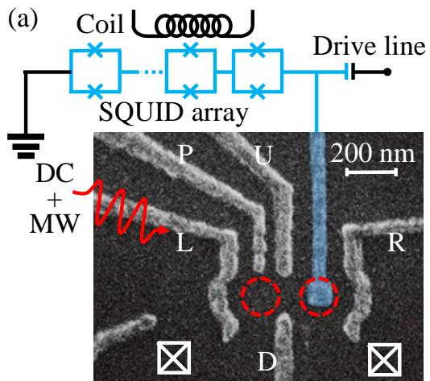

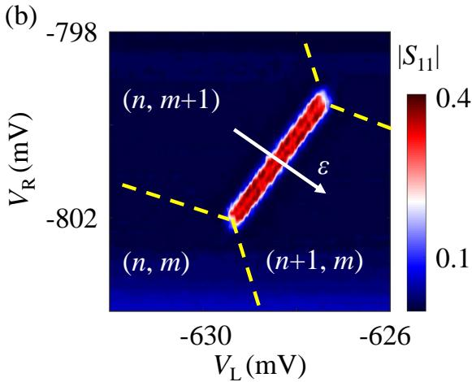  
图 6.1 (a) 双量子点电极的扫描电子显微镜图和耦合结构示意图。图中用圆圈标出了通过金属电极束缚的两个量子点，右侧量子点上方的电极直接连接到 SQUID 阵列谐振腔上。实验中给左侧的势垒电极 L 施加连续微波，驱动量子比特。(b) 腔探测的双量子点电荷稳定图。

## 6.3 双量子点的 LZSM 干涉

我们给左侧的势垒电极 L 施加上一个连续的微波调制信号，使量子点失谐量产生周期性地变化， $\varepsilon  \varepsilon + A _ { \mathrm { d } } \cos { ( 2 \pi f _ { \mathrm { d } } t ) }$ ，其中 $A _ { \mathrm { d } }$ 是微波振幅， $f _ { \mathrm { d } } = 1 / T$ 是驱动频率，𝑇 是驱动周期。该周期驱动的二能级系统可以用 Floquet 理论来描述[27]，求解薛定谔方程得到具有如下形式的解， $e ^ { - 2 \pi i \mu _ { \alpha } t / h } | \phi _ { \alpha } ( t ) \rangle , \alpha = 0 , 1$ ，其中$| \phi _ { \alpha } ( t ) \rangle$ 是Floquet态，具有周期性， $| \phi _ { \alpha } ( t + T ) \rangle = | \phi _ { \alpha } ( t ) \rangle$ ，指数上的相位因子则由准能量决定。准能量与系统中能量的时间平均值不同，后者是一段时间的能量期望，定义为 $\begin{array} { r } { E _ { \alpha } \equiv \frac { 1 } { T } \int _ { 0 } ^ { T } d t \langle \phi _ { \alpha } ( t ) | H ( t ) | \phi _ { \alpha } ( t ) \rangle } \end{array}$ 。这些Floquet态可以经过傅里叶分解到由驱动场能量 $h f _ { \mathrm { d } }$ 划分的分量上，如示意图6.2(a)。不同Floquet态之间的准能量差 $\mu \equiv \mu _ { 1 } - \mu _ { 0 }$ 决定了单个驱动周期 𝑇 内，Flouqet 态之间的相对相位 2π𝜇𝑇 /ℎ。当相位 $2 \pi \mu T / h$ 接近 $2 \pi$ 的整数倍时 $( \mu / h \approx k f _ { \mathrm { d } }$ ，𝑘 为整数），这两个 Floquet 态将相干相长，态占据数均会显著增加[1]，此时通过输运或是电荷探测装置就能测到受驱双量子点系统的 LZSM干涉图案[5,7,10]。

实验中，我们使用谐振腔来探测双量子点的受驱动力学[21]，给超导腔输入谐振频率的探测微波， $\nu = \nu _ { \mathrm { r } }$ 。因为双量子点与谐振腔的耦合会导致谐振频率的色散偏移， $\nu _ { \mathrm { r } } \to \nu _ { \mathrm { r } } + ( g _ { \mathrm { c } } ^ { 2 } / 2 \pi ) \chi ^ { ( 0 ) } ( \nu )$ ，所以测量腔的反射信号可以得到量子点的信息。根据输入–输出理论[21,37]，反射矩阵

$$
S _ { 1 1 } = 1 + \frac { i \kappa _ { \mathrm { i } } } { 2 \pi \nu _ { \mathrm { r } } - 2 \pi \nu + g _ { \mathrm { c } } ^ { 2 } \chi ^ { ( 0 ) } ( \nu ) - i \kappa / 2 } .\tag{6.19}
$$

这里起主要作用的参数是双量子点电偶极算符的相位平均磁化系数[16]（phase-averaged susceptibility） $\chi ^ { ( 0 ) }$

$$
\chi ^ { ( 0 ) } ( \nu ) = ( p _ { 0 } - p _ { 1 } ) \sum _ { k } \frac { | Z _ { 1 0 , k } | ^ { 2 } } { 2 \pi \nu - 2 \pi \mu / h + 2 \pi k f _ { \mathrm { d } } + i \gamma / 2 } ,\tag{6.20}
$$

其中 $Z _ { 1 0 , k }$ 是跃迁矩阵元 $\langle \phi _ { 0 } ( t ) | \tau _ { z } | \phi _ { 1 } ( t ) \rangle$ 中的第 𝑘 阶傅里叶项， $p _ { \alpha }$ 是 Floquet 态$| \phi _ { \alpha } \rangle$ 稳定时的占据概率，可以通过求解Bloch­Redfield主方程的稳态解得到， $-$ 般用在弱耗散量子比特系统中，具体的求解参考文献 [16,38]。而其它阶的磁化系数 $\chi ^ { ( n ) } ( \omega )$ 在色散读取时几乎都可以被忽略[16]。

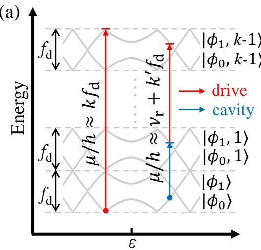

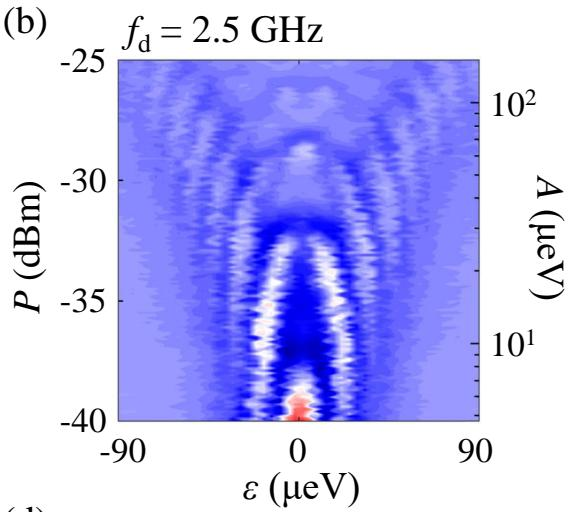

(c)  
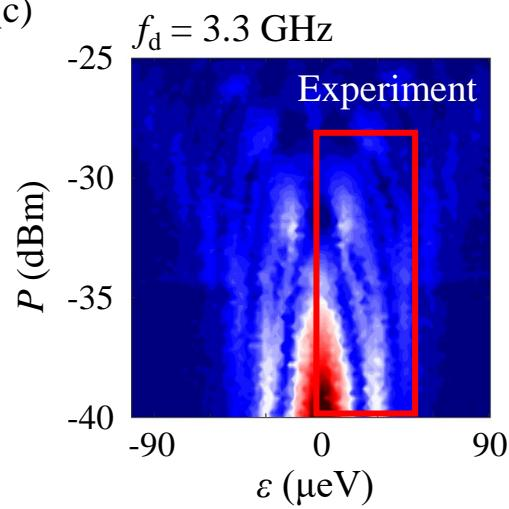

(d)  
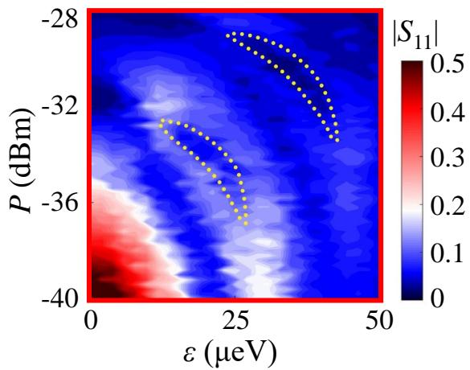

(e)  
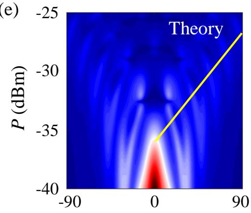  
ε (μeV)

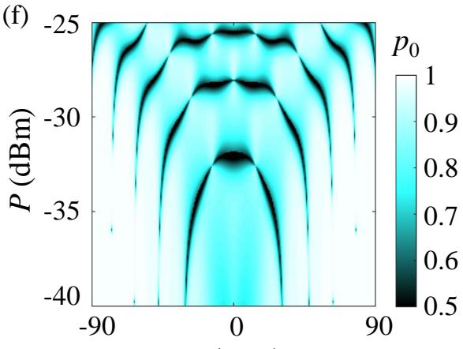  
ε $( \mu \mathrm { e V } )$  
图 6.2 (a) Floquet 态的能级示意图。Floquet 态的准能量谱类似布里渊区结构，按驱动场能量 $h f _ { \mathbf { d } }$ 划分为不同区域。可以通过布居数共振（左侧红色箭头）或是腔辅助的LZSM 共振（右侧蓝色加红色箭头）来实现两个 Flouqet 态 $| \phi _ { 0 } \rangle$ 和 $| \phi _ { 1 } , k \rangle$ 之间的跃迁。(b)–(d) 不同驱动频率 $f _ { \mathbf { d } }$ 下的 LZSM 干涉图案。谐振腔反射幅值 $\vert S _ { 1 1 } \vert$ 作为失谐量 𝜀 和驱动功率 𝑃 的函数，分别在 (b) $f _ { \mathrm { d } } = 2 . 5 \mathrm { G H z }$ 和 (c) $f _ { \mathrm { d } } = 3 . 3 \mathrm { G H z }$ 时的测量结果， $2 t _ { \mathrm { c } } / h \approx 6 . 2 \mathrm { G H z }$ 。(d)是(c)的局部放大图。(e)使用图(c)实验参数模拟得到的结果，功率 $P = - 2 9 \mathrm { d B m }$ 对应 $A _ { \bf d } = 6 0 \mu \mathrm { e V }$ 。计算时考虑了由于失谐量 𝜀 缓慢涨落导致的LZSM干涉图案横向展宽[6­7,11]，对数值进行了展宽为 $2 . 5 \mu \mathrm { e V }$ 的高斯卷积。黄色线段标记出了图6.3中的参数范围。(f) 计算得到的 Floquet 态 $| \phi _ { 0 } \rangle$ 的平均布居数。

根据公式6.20，当系统参数满足以下两个条件时， $\chi ^ { ( 0 ) } ( \nu )$ 以及对应的腔反射信号幅值较大：

1. 探测频率定在腔谐振频率处， $\nu = \nu _ { \mathrm { r } }$ ，根据式中的分母可以得到共振条件$\mu / h = \nu _ { \mathrm { r } } + k ^ { \prime } f _ { \mathrm { d } }$ ，𝑘′ 为整数。这个共振条件与布居共振条件相似，但是多了一个腔光子项，这时腔探测到的干涉条纹可以解释为腔光子辅助的 LZSM干涉，腔光子参与调制了系统的量子态[11,16,31,39]。

2. 系统布居数必须主要占据在某个 Flouqet 态上，使得 $\left| p _ { 0 } - p _ { 1 } \right| \approx 1$ 图6.2(b) 给出了扫描量子点间失谐量 𝜀 和驱动功率 $P ~ ( { P } ~ \propto ~ A _ { \mathrm { d } } ^ { 2 } )$ ，测量腔反射信号 $\vert S _ { 1 1 } \vert$ 得到的 Floquet 谱，驱动频率 $f _ { \mathrm { d } } = 2 . 5 \mathrm { G H z }$ ，量子点间隧穿耦合速率$2 t _ { \mathrm { c } } / h \approx 6 . 2 \mathrm { G H z }$ 。我们的结果与文献[31] 中的结果类似，符合预期。

在更一般的多能级系统中， $\chi ^ { ( 0 ) }$ 的计算公式为：

$$
\chi ^ { ( 0 ) } ( \omega ) = \sum _ { \alpha , \beta , k } \frac { ( p _ { \alpha } - p _ { \beta } ) | Z _ { \alpha \beta , k } | ^ { 2 } } { \omega + \mu _ { \alpha } - \mu _ { \beta } - k \omega _ { \mathrm { d } } + i \gamma _ { \alpha \beta } / 2 } ,\tag{6.21}
$$

其中， $\begin{array} { r } { Z _ { \alpha \beta , k } = \frac { 1 } { T } \int _ { - T / 2 } ^ { T / 2 } \mathrm { d } t \langle \phi _ { \alpha } ( t ) | Z | \phi _ { \beta } ( t ) \rangle e ^ { - i k \omega _ { \mathrm { d } } t } } \end{array}$ ，在量子点与腔耦合的系统中，算符$Z = \tau _ { z }$ o

## 6.4 双共振 LZSM 干涉与 Floquet 态消耗

当 Floquet 态跃迁共振条件与腔辅助跃迁共振条件同时满足，达到双共振条件：

$$
k f _ { \mathrm { d } } = \mu / h = \nu _ { \mathrm { r } } + k ^ { \prime } f _ { \mathrm { d } } ,\tag{6.22}
$$

将有更加有趣的现象出现。此时的驱动频率满足 $f _ { \mathrm { d } } = \nu _ { \mathrm { r } } / 2 , \nu _ { \mathrm { r } } / 3 , \cdots ~ ( f _ { \mathrm { d } } = \nu _ { \mathrm { r } }$ 并没有考虑在内，因为此时驱动微波会直接影响腔读取信号）。

图6.2(c) 展示了在半倍谐振频率 $f _ { \mathrm { d } } = 3 . 3 \mathrm { G H z } \approx \nu _ { \mathrm { r } } / 2$ 驱动下的 LZSM 干涉图案。相比图6.2(b) 中的腔辅助 LZSM 干涉图案，每一个干涉条纹都从中间劈开，产生月牙形状的孔洞，孔洞中间的反射信号被极大地抑制。这些“月牙”图案的出现是因为Floquet态布居受到强驱动的影响，导致腔辅助的LZSM干涉图案发生了变化。

Floquet 态布居动力学变化对腔响应的影响可以从公式6.20看出来。除了式子中分母给出的共振条件会对磁化系数有显著作用外，态占据概率 $p _ { \alpha }$ 也起到了重要作用。当系统满足跃迁共振条件， $\mu / h = k f _ { \mathrm { d } }$ 时，Floquet 态之间相位的相干相长会导致两个 Floquet 态的占据概率发生变化，使得 $p _ { 0 } \approx p _ { 1 } = 1 / 2$ ，即$p _ { 0 } - p _ { 1 } \approx 0$ ，所以 $\chi ^ { ( 0 ) }$ 被极大地抑制，腔信号也因此减弱。根据公式6.20计算得到的数值模拟结果如图6.2(e) 所示，与实验结果符合得很好。我们还计算了较低准能量的Floquet态的平均布居数，如图6.2(f)所示，证实了月牙孔洞总是出现在Floquet态占据概率减小的地方。

## 6.5 Flouqet 谱与系统稳态

前文的分析直观与定性地解释了腔辅助 LZSM 图案中出现“月牙”孔洞的原因，并指出了 Floquet 态的能谱与布居的重要性。在这一节，我们将在理论上作进一步验证，计算Floquet态的能量、布居与干涉谱的关系。

图6.3(a)展示了准能量 $\mu _ { 0 , 1 }$ 和它们的边带与功率𝑃 的变化关系，其中失谐量𝜀 随着功率按照图6.2(e) 标出的斜线同时发生变化。我们最关心在布里渊区中心和边界上Floquet态能级的交点，因为在这些交点处 $\mu / h = k f _ { \mathrm { d } }$ ，满足布居共振条件，导致LZSM干涉。但是由于Floquet态之间存在相互作用，这些能级线并非完全相交，而是形成免交叉点，所以对于布居共振条件给出的 $\mu / h = k f _ { \mathrm { d } }$ 实际上只能近似满足。但在这些准能量的免交叉点处，受驱二能级系统的平均能量能够精确地相交。

事实上，谐振腔的响应信号强弱与干涉图案形状的关键不在于共振条件$\mu / h = k f _ { \mathrm { d } }$ 是否能够完全满足，而在于 Floquet 态的布居占据情况。如图6.3(b)

(a)  
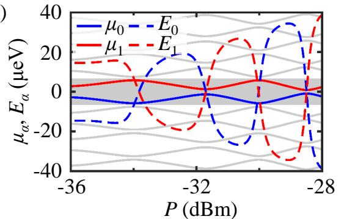

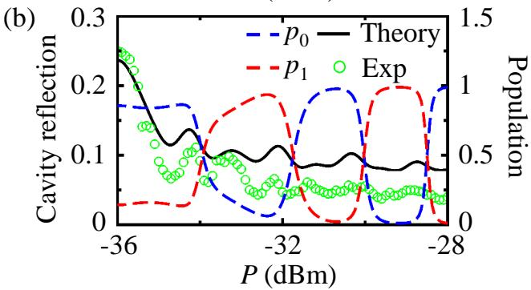  
图 6.3 (a) 在第一布里渊区（阴影区域）内的 Floquet 能谱线（实线），和其对应的平均能量（虚线）。旁边的灰色线对应准能量的边带。微波功率𝑃 与失谐量𝜀沿着图6.2(e)中的黄色斜线变化。(b) 稳态对应的布居数（虚线）、测量结果（圆圈）以及模拟的腔响应（实线）。

所示，受驱系统一般占据在平均能量较低的 Floquet 态上，这种情况下， $p _ { 0 } \approx 1$ 磁化系数 $\chi ^ { ( 0 ) }$ （公式6.20）的前系数因子接近 1。但是在准能量免交叉附近，两个Floquet态的布居相同， $p _ { 0 } \approx p _ { 1 } = 1 / 2$ ，导致双量子点的磁化系数 $\chi ^ { ( 0 ) }$ 减小，模拟的腔反射幅值也达到极小值点。在图6.3(b)中对比了实验结果与模拟结果，极值点位置符合得较好，不管是幅值的大小，还是干涉条纹的可见度都比较一致。在第二个平均能量交点的右侧，由于驱动功率增大导致系统加热严重，降低了比特系统的退相干性，所以模拟结果与实验结果有一定偏差，只能定性地比较。这些实验与模拟结果说明我们能够利用谐振腔色散地读取 Floquet 稳态布居数的变化以及准能量免交叉点的位置。

当我们固定谐振腔频率 $\nu _ { \mathrm { r } }$ 与驱动功率 𝑃，可以通过扫描驱动频率 $f _ { \mathrm { d } }$ 与失谐量 𝜀 来寻找满足双共振条件的参数值。根据前面讨论的结果，我们预期在$\mu / h = \nu _ { \mathrm { r } } + k ^ { \prime } f _ { \mathrm { d } }$ 处腔响应幅值为峰，而在 $\mu / h = k f _ { \mathrm { d } }$ 处为谷。当我们以 $f _ { \mathrm { d } }$ 为扫描参数，那么在 LZSM 干涉谱上腔的峰信号和谷信号因斜率不同而相交，交点处的 𝜀 和 $f _ { \mathrm { d } }$ 满足双共振条件， $\mu / h = \nu _ { \mathrm { r } } + k ^ { \prime } f _ { \mathrm { d } } = k f _ { \mathrm { d } } ( k \neq k ^ { \prime } )$ o

图 $6 . 4 ( \mathrm { a } )$ 给出了在驱动频率接近半谐振频率 $\nu _ { \mathrm { r } } / 2$ 处，驱动功率 $P = - 3 6 \mathrm { d B m }$ 时，腔反射信号 $\vert S _ { 1 1 } \vert$ 随𝜀和 $f _ { \mathrm { d } }$ 的测量结果。和预期结果一样，当增加驱动频率$f _ { \mathrm { d } }$ 时，在条带状干涉亮条纹中间有一条腔响应幅值受抑制的斜线沿着箭头从内向外穿过，并在 $f _ { \mathrm { d } } = \nu _ { \mathrm { r } } / 2$ 处相交。为了更加清楚地展示“月牙”随驱动频率的演化，我们选择 3.2GHz 到 3.5GHz 四个接近半腔频的驱动频率，测量其 LZSM干涉谱，如图6.5所示，月牙孔洞用虚线圈出。这些孔洞随着驱动频率 $f _ { \mathrm { d } }$ 的增加，从内向外移动，与图6.4(a)中的箭头所指演化方向一致。

我们同样模拟计算了随驱动频率 𝑃 变化的干涉结果与 Floquet 态 $| \phi _ { 0 } \rangle$ 的占据概率，如图6.4(b)–(c)所示。模拟结果与实验结果一致，而图6.4(a)中干涉条带沿箭头的信号减弱线，恰好与布居数图中𝑝 远小于 1 的线条重合，说明了 $p _ { 0 }$ $| \phi _ { 0 } \rangle$ 态平均布居数的减少是引起腔幅值信号抑制从而产生“月牙”孔洞的根本原因。图6.4对应的实验与结果不仅再次证实了双共振条件下的强驱动 cQED 现象，也表明我们可以通过电学操控来影响Floquet态的动力学。

## 6.6 其它参数对 LZSM 干涉谱的影响

## 6.6.1 不同谐振腔频率的 LZSM 干涉

SQUID 阵列谐振腔具有频率可调的特点，我们可以通过样品盒盖子上厘米尺寸的线圈来控制超导腔的谐振频率。给线圈施加电流 $I _ { \mathrm { c o i l } }$ ，通电线圈产生一个磁场。当 $I _ { \mathrm { c o i l } }$ 变化时，线圈产生的磁场发生变化，使穿过 SQUID 的磁通也发生变化，改变SQUID阵列腔的频率，可以从最大6.5GHz减小到5.2GHz以下，如

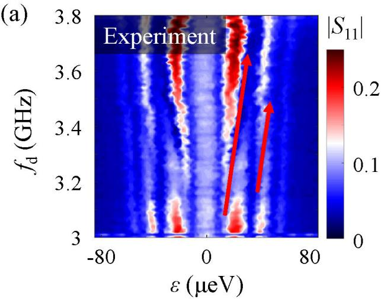

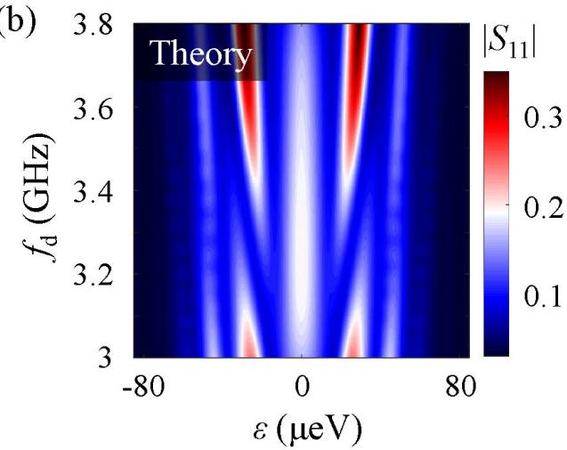

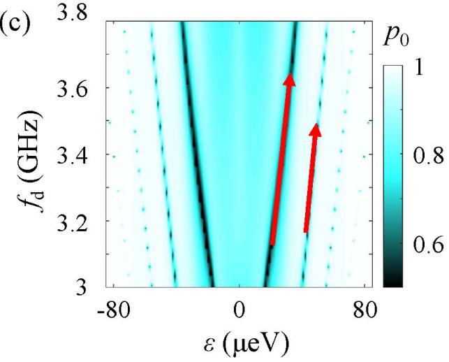  
图 6.4 (a)谐振腔反射信号 $\vert S _ { 1 1 } \vert$ 以失谐量𝜀和驱动频率 $f _ { \mathbf { d } }$ 为函数扫描的LZSM干涉谱，驱动功率 $P = - 3 6 \mathrm { d B m }$ $2 t _ { \mathrm { c } } / h = 6 . 2 \mathrm { G H z }$ 。红色箭头指出了“月 $\bar { \lambda } ^ { \dag }$ 的演化方向。(b)数值模拟结果，模拟参数与 (a) 中的实验参数相同。(c) 理论计算的 Floquet 态 $| \phi _ { 0 } \rangle$ 的平均布居数。

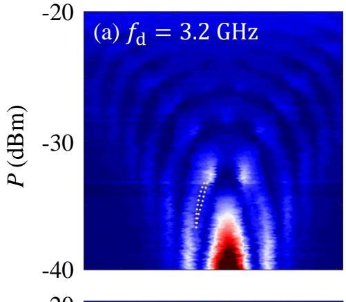

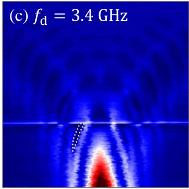

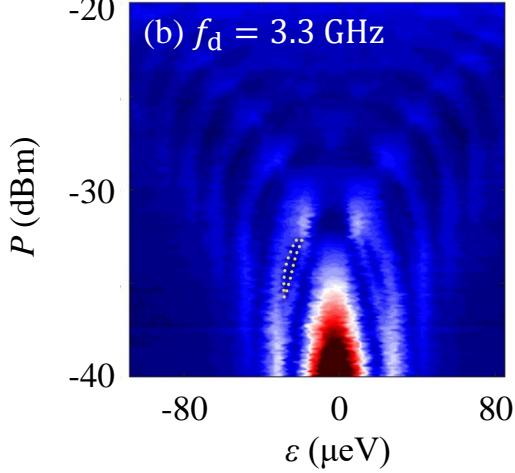

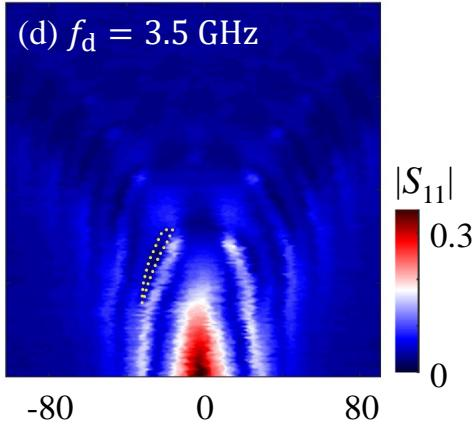  
ε (μeV)  
图 6.5 半腔频附近， $f _ { \mathrm { d } } = 3 . 2 \mathrm { G H z }$ (a)，3.3 GHz (b)，3.4 GHz (c) 和 3.5 GHz (d) 时的 LZSM干涉谱。

图6.6(a) 所示。

我们将谐振频率 $\nu _ { \mathrm { r } }$ 从最大值处的 6.51GHz 减小到 6.07GHz，但是保持驱动频率 $f _ { \mathrm { d } } = 3 . 3 \mathrm { G H z }$ 不变。此时因为双共振条件 $\nu _ { \mathrm { r } } = n f _ { \mathrm { d } } \left( n \geqslant 2 \right)$ 不再满足，图6.6(d)的LZSM干涉图案中的“月牙”消失。作为对比，我们把 $f _ { \mathrm { d } }$ 减小到 2.9GHz，使得驱动频率再次接近半倍的谐振频率 $\nu _ { \mathrm { r } }$ （真正半谐振频率应该为3GHz，比实际加的驱动频率更大，这里出现的偏差可能是由于磁场环境不稳定引起的腔频漂移），“月牙”重新出现在图6.6(c) 中。所以这里再次证实了 Floquet 态布居对腔反射信号的影响。到此为止，我们已经改变了所有实验中可以独立调节的参数来验证我们的模型。

## 6.6.2 非半腔频驱动下的双共振 LZSM 干涉

在上述实验中，利用高阻抗超导谐振腔，我们能够在半谐振频率 $f _ { \mathrm { d } } = \nu _ { \mathrm { r } } / 2$ 处测量得到月牙状干涉图案。理论上，除了半腔频，当 $f _ { \mathrm { d } } = \nu _ { \mathrm { r } } / 3 , \nu _ { \mathrm { r } } / 4 , \cdots$ 时，我们在更高阶的双共振条件下也应该可以看到类似的图案。但是，随着驱动频率的减小，LZSM干涉条纹间隔减小[1]，最终使得较窄的“月牙”孔洞小于实验可观

(a)  
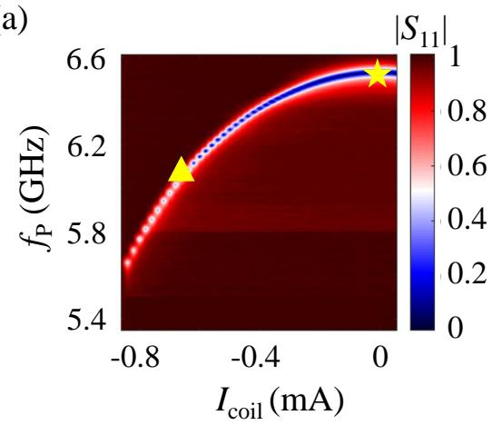

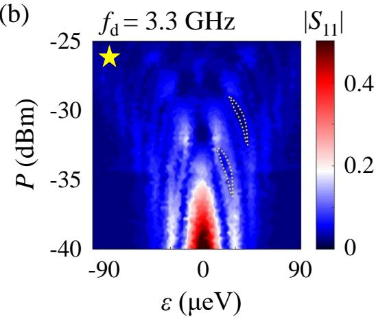

(c)  
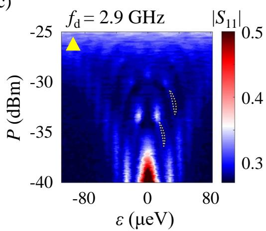

(d)  
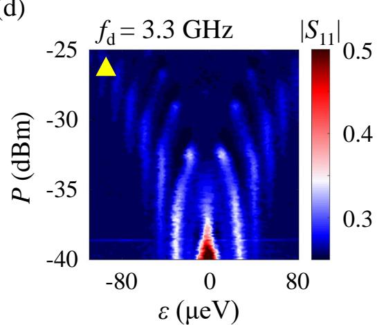  
图 6.6 (a) 腔反射信号 $\vert S _ { 1 1 } \vert$ 作为探测频率 $f _ { \mathbf { p } }$ 和电流 $I _ { \mathrm { c o i l } }$ 的函数，测量得到的频率谱。我们将谐振频率 $\nu _ { \mathbf { r } }$ 从 6.51GHz 调节到 6.07GHz，分别用五角星和三角形在图中标出。(b)–(d) 图 (a) 中不同谐振频率 $\nu _ { \mathbf { r } }$ 和驱动频率 $f _ { \mathbf { d } }$ 下的LZSM 干涉谱。  
测的分辨率，并在噪声涨落的影响下变得模糊或是消失。

我们在图6.7(a) 中展示了以三分之一谐振频率驱动时的模拟结果，此时的“月牙”图案变得非常窄。考虑到实际实验中量子点失谐量 𝜀 的缓慢涨落，会导致各向异性的展宽，大小在几个µeV[6­7,40]。所以我们在图6.7(b)的模拟预测结果中假设了展宽为2.5µeV的噪声，对理论数值做高斯卷积处理，导致图中的“月牙”明显被噪声干扰而消失。不过，在这三分之一谐振频率驱动的模拟结果中，我们仍然能够在干涉亮条纹末端看到小幅度的劈裂，使得原来 LZSM 干涉谱中的条纹变成了“蟹钳”一样的形状，也是一种非常有趣的特征。这个模拟结果同样在实验测量得到的图6.7(d) 中得到了验证。

## 6.7 本章小结

在本章中，我们利用高阻抗谐振腔探测了受驱半导体量子点 Floquet 态的干涉现象。特别地，当我们对量子点系统施加二分之一腔频的驱动微波时，在原来的 LZSM 腔幅值干涉峰上出现了月牙形状的孔洞。我们将这个现象的物理原因归结为 Floquet态在强驱动下的布居数重新分布，从而影响了谐振腔响应信号。

我们系统地研究了各个参数对干涉图案的影响，证实了态布居共振条件在准能量免交叉点处可以近似满足，使得受驱二能级系统从一个近乎百分之百的纯态过渡到一个混合态，即两个Floquet态的平均占据概率相等。因此，这些“月牙”是腔探测的受驱二能级系统在强驱动下达到稳态后的一个实验特征。此外，双共振条件下出现的这些LZSM干涉图案不仅仅只局限在半导体量子点–谐振腔杂化系统，还可以容易地推广到其它cQED系统，并进一步用来研究强驱动作用下的 Floquet 态动力学。

(a)  
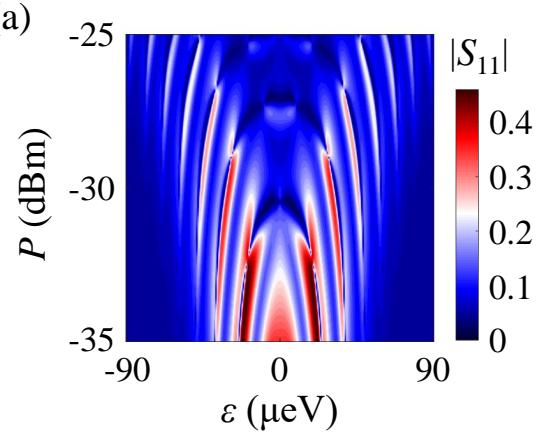

(b)  
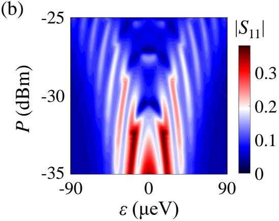

(c)  
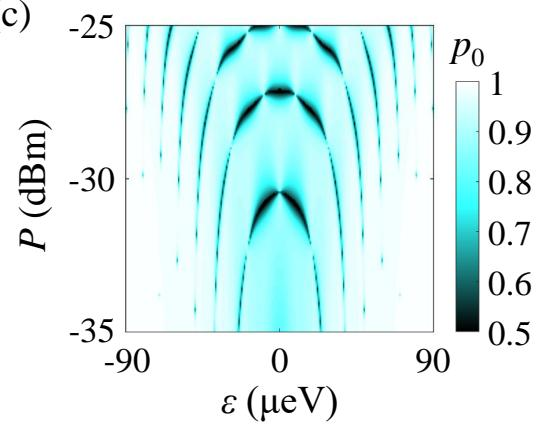

(d)  
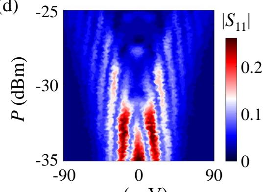  
图 6.7 (a) 驱动频率 $f _ { \mathrm { d } } = 2 . 2 7 \mathrm { G H z }$ 在接近三分之一谐振频率处的理论预言结果，驱动功率$P = - 2 9 \mathrm { d B m }$ ，对应幅值 $A _ { \bf d } = 4 5 \mu \mathrm { e V } ,$ 。(b) 相同的数值计算，但是额外考虑了失谐量 $\varepsilon$ 具有 $2 . 5 \mu \mathrm { e V }$ 的噪声展宽。(c) 理论计算的 Floquet 态 $| \phi _ { 0 } \rangle$ 平均布居。(d) 驱动频率 $f _ { \mathrm { d } } = 2 . 2 7 \ : \mathrm { G H z }$ 时的谐振腔响应实验结果。

## 参考文献

[1] Shevchenko S N, Ashhab S, Nori F. Landau­Zener­Stückelberg interferometry. Physics Reports, 2010, 492(1):1.

[2] Silveri M P, Tuorila J A, Thuneberg E V, et al. Quantum systems under frequency modulation// Reports on Progress in Physics. 2017.

[3] Oliver W D, Yu Y, Lee J C, et al. Mach­Zehnder interferometry in a strongly driven superconducting qubit. Science, 2005, 310(5754):1653.

[4] Sillanpää M, Lehtinen T, Paila A, et al. Continuous­time monitoring of Landau­Zener interference in a Cooper­pair box. Physical Review Letters, 2006, 96(18):187002.

[5] Stehlik J, Dovzhenko Y, Petta J R, et al. Landau­Zener­Stückelberg interferometry of a single electron charge qubit. Physical Review B, 2012, 86(12):121303.

[6] Cao G, Li H O, Tu T, et al. Ultrafast universal quantum control of a quantum­dot charge qubit using Landau–Zener–Stückelberg interference. Nature Communications, 2013, 4(1):1401.

[7] Forster F, Petersen G, Manus S, et al. Characterization of qubit dephasing by Landau­Zener-Stückelberg­Majorana interferometry. Physical Review Letters, 2014, 112(11):116803.

[8] Silveri M P, Kumar K S, Tuorila J, et al. Stückelberg interference in a superconducting qubit under periodic latching modulation. New Journal of Physics, 2015, 17(4):43058.

[9] Gonzalez­Zalba M F, Shevchenko S N, Barraud S, et al. Gate­sensing coherent charge oscillations in a silicon field­effect transistor. Nano Letters, 2016, 16(3):1614.

[10] Bogan A, Studenikin S, Korkusinski M, et al. Landau­Zener­Stückelberg­Majorana interferometry of a single hole. Physical Review Letters, 2018, 120(20):207701.

[11] Mi X, Kohler S, Petta J R. Landau­Zener interferometry ofvalley­orbit states in Si/SiGe double quantum dots. Physical Review B, 2018, 98(16):161404.

[12] Han Y, Luo X Q, Li T F, et al. Time­domain grating with a periodically driven qutrit. Physical Review Applied, 2019, 11(1):14053.

[13] Wen P Y, Ivakhnenko O V, Nakonechnyi M A, et al. Landau­Zener­Stückelberg­Majorana interferometry of a superconducting qubit in front of a mirror. Physical Review B, 2020, 102 (7):75448.

[14] Berns D M, Rudner M S, Valenzuela S O, et al. Amplitude spectroscopy of a solid­state artificial atom. Nature, 2008, 455(7209):51.

[15] Ferrón A, Domínguez D, Sánchez M J. Dynamic transition in Landau­Zener­Stückelberg interferometry of dissipative systems: The case of the flux qubit. Physical Review B, 2016, 93 (6):64521.

[16] Kohler S. Dispersive readout: Universal theory beyond the rotating­wave approximation.

Physical Review A, 2018, 98(2):1.

[17] Hartmann M, Poletti D, Ivanchenko M, et al. Asymptotic Floquet states of open quantum systems: the role of interaction. New Journal of Physics, 2017, 19(8):83011.

[18] Engelhardt G, Platero G, Cao J. Discontinuities in driven spin­boson systems due to coherent destruction of tunneling: breakdown of the Floquet­Gibbs distribution. Physical Review Letters, 2019, 123(12):120602.

[19] Kohler S, Utermann R, Hänggi P, et al. Coherent and incoherent chaotic tunneling near singletdoublet crossings. Physical Review E, 1998, 58(6):7219.

[20] Magazzù L, Forn­Díaz P, Belyansky R, et al. Probing the strongly driven spin­boson model in a superconducting quantum circuit. Nature Communications, 2018, 9(1):1403.

[21] Blais A, Huang R S, Wallraff A, et al. Cavity quantum electrodynamics for superconducting electrical circuits: an architecture for quantum computation. Physical Review A, 2004, 69(6): 62320.

[22] Arute F, Arya K, Babbush R, et al. Quantum supremacy using a programmable superconducting processor. Nature, 2019, 574(7779):505.

[23] Petersson K D, McFaul L W, Schroer M D, et al. Circuit quantum electrodynamics with a spin qubit. Nature, 2012, 490(7420):380.

[24] Frey T, Leek P J, Beck M, et al. Dipole coupling of a double quantum dot to a microwave resonator. Physical Review Letters, 2012, 108(4):46807.

[25] Walls D F F, Milburn G J G J. Quantum optics. 2nd ed. Heidelberg: Springer, 1995.

[26] Floquet G. Sur les équations différentielles linéaires à coefficients périodiques. Annales scientifiques de l’École normale supérieure, 1883, 12:47.

[27] Shirley J H. Solution of the Schrödinger equation with a Hamiltonian periodic in time. Physical Review, 1965, 138(4B):B979.

[28] Chu S I, Telnov D A. Beyond the Floquet theorem: generalized Floquet formalisms and quasienergy methods for atomic and molecular multiphoton processes in intense laser fields. Physics Reports, 2004, 390(1):1.

[29] Silveri M, Tuorila J, Kemppainen M, et al. Probe spectroscopy of quasienergy states. Physical Review B, 2013, 87(13):134505.

[30] Sambe H. Steady states and quasienergies of a quantum­mechanical system in an oscillating field. Physical Review A, 1973, 7(6):2203.

[31] Koski J V, Landig A J, Pályi A, et al. Floquet spectroscopy of a strongly driven quantum dot charge qubit with a microwave resonator. Physical Review Letters, 2018, 121(1):43603.

[32] Petersan P J, Anlage S M. Measurement of resonant frequency and quality factor of microwave resonators: Comparison of methods. Journal of applied physics, 1998, 84(6):3392.

[33] Wang B C, Lin T, Li H O, et al. Correlated spectrum of distant semiconductor qubits coupled by microwave photons. Science Bulletin, 2021, 66(4):332.

[34] Stockklauser A, Scarlino P, Koski J V, et al. Strong coupling cavity QED with gate­defined double quantum dots enabled by a high impedance resonator. Physical Review X, 2017, 7(1): 011030.

[35] Mi X, Cady J V, Zajac D M, et al. Strong coupling of a single electron in silicon to a microwave photon. Science, 2017, 355(6321):156.

[36] Bruhat L E, Cubaynes T, Viennot J J, et al. Circuit QED with a quantum­dot charge qubit dressed by Cooper pairs. Physical Review B, 2018, 98(15):155313.

[37] Collett M J, Gardiner C W. Squeezing of intracavity and traveling­wave light fields produced in parametric amplification. Physical Review A, 1984, 30(3):1386.

[38] Chen M B, Wang B C, Kohler S, et al. Floquet state depletion in ac­driven circuit QED. Physical Review B, 2021, 103(20):205428.

[39] Shevchenko S N, Ryzhov A I, Nori F. Low­frequency spectroscopy for quantum multilevel systems. Physical Review B, 2018, 98(19):195434.

[40] Petersson K D, Petta J R, Lu H, et al. Quantum coherence in a one­electron semiconductor charge qubit. Physical Review Letters, 2010, 105(24):246804.

## 第 7 章 总结与展望

## 7.1 总结

本论文以半导体量子点与超导微波腔的耦合为研究核心，以实现强耦合与多比特扩展为研究目标，介绍了本人在攻读博士期间在电路量子电动力学领域进行的一系列研究。这一小节内是对我们研究进展和关键内容的总结。

第 1 章和第 2 章主要介绍了腔量子电动力学的发展和背景。对腔量子电动力学系统的研究不仅能够帮助人们理解光与物质相互作用的本质，对于量子信息处理、量子比特的耦合扩展与读取也具有非常重要的意义。在半导体量子点体系，实现量子比特与腔光子的强耦合非常具有挑战性。在早期的研究中，往往是耦合强度限制了实验进展，所以提高耦合强度至关重要。在第2章中详细推导了耦合强度的表达式，它与谐振腔的阻抗直接相关，因此制备高阻抗的谐振腔是提高耦合强度的主要方法，也是我们实验小组微纳加工技术的主要突破方向。

在第3章中，我们介绍了两种不同的结构设计来实现GaAs量子点与超导腔的强耦合。目前实现高阻抗腔的途径有利用高动态电感材料制备纳米线薄膜腔，比如NbTiN、TiN等，或是利用约瑟夫森结制作成的SQUID阵列谐振腔。经过样品结构的不断优化与微纳加工工艺的改进，我们已成功制备出高阻抗的 NbTiN腔与 SQUID 阵列腔，并均已实现了它们与双量子点的强耦合。其中 SQUID 阵列谐振腔具有腔频可调的优点，而 NbTiN 腔具有良好的抗磁性，适用于电子自旋比特的耦合与探测。因为我主要负责 NbTiN 腔的结构设计与工艺制备，所以这一章中以 NbTiN 腔与两个双量子点的耦合结构为例，介绍了样品的测量与表征过程。在实验中我们观测到了真空 Rabi 劈裂，它是实现强耦合的标志。我们利用真空 Rabi 劈裂提取了耦合强度，并讨论了几种实验中实用的系统参数提取方法。

在后续章节中，我们利用制备成功的量子点–超导腔样品，研究动力学耦合中的各种量子现象。因为谐振腔对 cQED 系统中量子比特的探测具有很高的灵敏度，可以作为一种良好的读取手段，所以第 4 章介绍了第一个研究——利用NbTiN谐振腔来探测量子点的激发态能谱。我们通过给量子点施加方波脉冲，激励双量子点内的电子在不同能级之间跃迁，利用超导腔探测激发态的信息。由于较大的耦合强度，NbTiN腔的探测灵敏度高，根据泡利自旋阻塞原理能够从能级跃迁线中分辨出不同自旋态参与的跃迁过程，可以用作自旋比特的读出。我们还比较了不同量子点参数下，量子点能级间跃迁对腔信号的影响。该研究说明了我们制备的高阻抗腔能够良好地探测 cQED 杂化系统的量子态信息，为后面的受驱量子态的探测与研究打下了基础。

第 5 章介绍了我们在 SQUID 阵列腔与双量子点的耦合体系中，利用源漏偏置给双量子点施加持续的泵浦，研究量子点的发光现象。由于源漏之间的电势差，电子可以在偏压窗口内实现连续的隧穿，在量子点间跃迁时发射光子。如果发射的光子频率与腔频匹配，就会被谐振腔吸收。通过表征与分析腔在不同量子点状态下的信号响应，我们在量子点的偏压窗口内观测到了腔反射信号的增益，并且能够与腔的频移信号区分出来，验证了来自受驱量子点的光子辐射是腔信号增强的主要原因。该研究为片上微型放大器与相干微波光源提供了一种可能的方法。

最后，我们在第6章介绍了受驱双量子点cQED系统的量子干涉现象。通过给量子点施加连续的微波强驱动，我们用腔探测到双量子点不同能级间干涉导致的腔光子辅助 LZSM 图案。在半腔频驱动这一特殊条件下，在 LZSM 干涉谱中出现了新的干涉条纹，这是由于半倍的腔频驱动恰好满足文中指出的“双共振条件”，导致强驱动的量子点Floquet态布居发生变化，抑制了腔信号。我们基于理论模型模拟了实验结果，很好地解释了实验现象，并利用量子点与 SQUID 腔的良好可调性研究了不同系统参数下的干涉条纹的演化。该研究对强驱动理论提供了很好的实验支持，可以将双量子点–超导腔杂化系统作为探测 Floquet 态能级的良好平台。

综上，我们的研究围绕着半导体量子点与微波腔杂化系统，对其动力学耦合展开了研究。在实现强耦合的基础上，探索了量子点在不同驱动形式下的系统响应，对未来腔光子辅助的多比特耦合、操控与比特读出具有指导意义。

## 7.2 展望

尽管目前我们已经实现了两个双量子点与腔的强耦合，但是受限于系统的耗散，我们并没有实现单发读取（single­shot readout）、腔光子辅助的两比特门以及多比特扩展。这一小节中将简要讨论我们在半导体量子点–超导腔杂化系统中需要改进之处，展望今后可能实现的实验方案。

## 7.2.1 多比特强耦合

利用超导谐振腔实现比特的扩展是一个非常有前景的方案。在超导量子比特电路中，已经实现使用谐振腔作为总线的多比特耦合结构[1]，半导体量子点系统也可以采用类似的方法实现多比特的扩展。

图7.1展示了我们设计的 GaAs 量子点六比特与 NbTiN 高阻抗腔耦合结构图和初步制作出来的样品扫描电镜图。在长度为700µm的NbTiN纳米线透射腔两端，各耦合了三个双量子点，比特的读取与耦合均通过谐振腔来实现。对已有的样品进行测量表征，虽然可以通过腔测量得到量子点的信号，但是耦合强度并不大。我们还没有找到确切的原因与解决方法，可能是当耦合的比特数目增多时，各个量子点表面电极的寄生电容导致量子点上方耦合电极处的谐振腔电场受到了抑制。接下来还是要以进一步提高耦合强度为主，同时寻找减小腔耗散和比特退相干的方法。

## 7.2.2 超强耦合

如何进一步提高耦合强度是我们目前的主要研究方向。我们测试了 TiN 这种高动态电感材料制作的谐振腔，发现在类似的结构参数下，TiN薄膜腔的阻抗能达到NbTiN材料的两倍。因此利用TiN来代替NbTiN可以进一步提高耦合强度，但是镀膜与刻蚀工艺略有差别。相信在不久的将来，应用了TiN材料后，我们距离多比特强耦合的目标会更近一步，比特的快速读取与多比特的操控也将实现。

在Wallraff组最新的报导中[2]，他们利用约瑟夫森结阵列首次达到了半导体量子点与超导腔的超强耦合区域， $g _ { \mathrm { c } } / \omega _ { \mathrm { r } } \sim 0 . 1 1 \pm 0 . 0 1$ ，Jaynes­Cummings 模型将不再适用，我们不能再忽略光子与比特间的高阶相互作用。在这个情况下，必然有很多新的、有意思的物理现象出现，值得我们探索。各种高阻抗腔的出现与超强耦合的实现鼓舞着我们寻找进一步提高耦合强度的方法。

## 7.2.3 自旋比特与腔的耦合

在我们的实验中，都是使用电荷比特与谐振腔耦合。但是由于电荷比特与外界环境噪声有很大的电耦合，所以比特的退相干比较快，也成为了限制强耦合的因素。相比电荷比特，电子自旋比特的磁偶极矩非常小，所以与外界电荷噪声的耦合非常弱，相干时间很长。利用自旋编码的量子比特是当下的主要趋势，电子自旋与腔的强耦合研究受到了科研人员的广泛关注，也是我们未来的主要目标之一。

正因为电子自旋与电磁场的耦合很弱，所以很难直接实现自旋与谐振腔的强耦合。有研究表明，利用电子自旋磁偶极矩到谐振腔的耦合速率只有 10­$1 0 0 \mathrm { H z } ^ { [ 3 - 4 ] }$ 。目前的主流方案是利用自旋–轨道耦合，在自旋态内引入电荷态的成分，从而实现自旋比特与腔的间接耦合[5­7]。所以，自旋比特与腔的强耦合是一项非常具有挑战性的课题。目前实现单电子自旋比特与腔强耦合的只有 Petta 组[8]与 Vandersypen 组[9]，均是利用钴微磁体的梯度磁场，产生人造自旋–轨道耦合，使得自旋态与电荷态杂化。目前这种方案至多能实现两个自旋比特的操控与耦合[10]，当比特数目增多，新的困难也随之而来。但无论有多困难，这都是我们必须跨过去的障碍。我们小组现在在SiGe异质结量子点样品上有了一定的进展，而利用纯化 Si 制备高保真度的自旋比特，实现与腔的强耦合，还需要时间来累积技术经验、优化样品工艺。

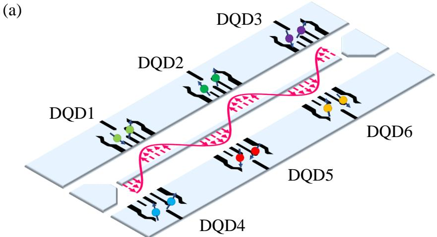

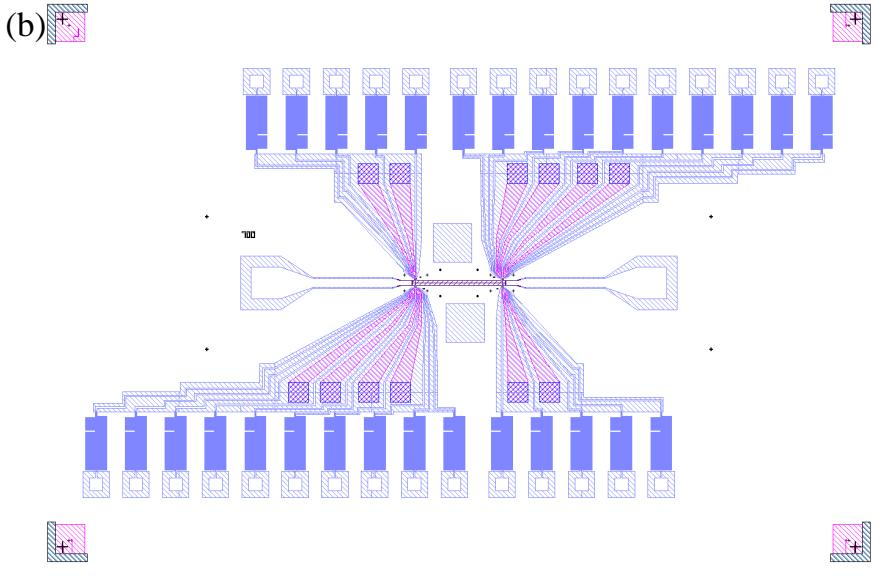

(c)  
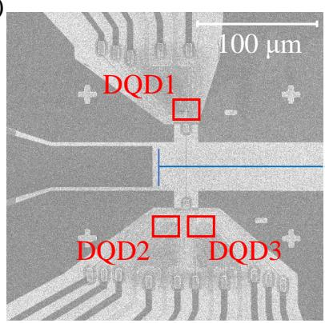

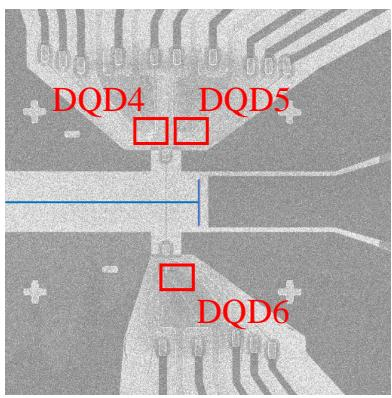  
图 7.1 谐振腔耦合的半导体量子点六比特。(a) 耦合结构示意图。(b) 耦合结构设计图。(c)六比特样品的扫描电子显微镜图。

## 7.2.4 腔的耗散与片上滤波

当使用电子自旋编码比特，退相干速率显著减小后，腔耗散就会成为限制强耦合的主要因素。在工艺与结构设计上，界面处的介电损耗和寄生电容导致的微波泄漏是我们优化改进的重点。

我们制作的样品中，都在腔与衬底之间生长了一层 10–20nm 的氧化铝，作为离子束刻蚀的阻刻层，保护量子点区域。在该介质层界面处的二能级系统会导致额外的耗散，所以后续工艺中，可以仅保留量子点区域覆盖的氧化铝，而把腔下方的氧化铝在镀膜腔金属薄膜前就刻蚀掉，减少介电损耗。

杂化系统中微波腔信号的另一种主要耗散途径是腔耦合电极到量子点其它电极的电容耦合。目前我们设计的平面电极结构中，各个电极之间的间距并不太近，耦合电容比较小，所以腔信号泄露还不明显。但是当要求量子点尺寸减小，电极间距靠近，使用互搭（overlapping）结构的电极设计时，耦合电容显著增大，就必须在电极上加上额外的滤波。一般的滤波方案是设计特定参数的大电容大电感来实现片上的LC滤波，比如利用河曲电感加上交指电容[11]，或是利用动态电感和高介电常数作为介质层的平行板电容[12] 实现滤波功能。而另一种方案是设计专门的低阻抗电极，通过改变腔谐振的环境阻抗抑制泄漏[13]。

目前我们已经设计了片上的LC滤波结构并经过了初步的测试，但是缺点在于片上滤波结构会占据较大的空间，增加单个样品的尺寸，对于样品设计与结构调整增加了一定的难度。

## 参考文献

[1] Song C, Xu K, Liu W, et al. 10­qubit entanglement and parallel logic operations with a superconducting circuit. Physical Review Letters, 2017, 119(18):180511.

[2] Scarlino P, Ungerer J H, van Woerkom D J, et al. In­situ tuning of the electric dipole strength of a double dot charge qubit: Charge noise protection and ultra strong coupling. arXiv:2104.03045, 2021.

[3] Imamoğlu A. Cavity QED based on collective magnetic dipole coupling: spin ensembles as hybrid two­level systems. Physical Review Letters, 2009, 102(8):83602.

[4] Bienfait A, Pla J J, Kubo Y, et al. Controlling spin relaxation with a cavity. Nature, 2016, 531 (7592):74.

[5] Hu X, Liu Y X, Nori F. Strong coupling of a spin qubit to a superconducting stripline cavity. Physical Review B, 2012, 86(3):035314.

[6] Viennot J J, Dartiailh M C, Cottet A, et al. Coherent coupling of a single spin to microwave cavity photons. Science, 2015, 349(6246):408.

[7] Benito M, Mi X, Taylor J M, et al. Input­output theory for spin­photon coupling in Si double quantum dots. Physical Review B, 2017, 96(23):235434.

[8] Mi X, Benito M, Putz S, et al. A coherent spin­photon interface in silicon. Nature, 2018, 555 (7698):599.

[9] Samkharadze N, Zheng G, Kalhor N, et al. Strong spin­photon coupling in silicon. Science, 2018, 359(6380):1123.

[10] Borjans F, Croot X G, Mi X, et al. Resonant microwave­mediated interactions between distant electron spins. Nature, 2020, 577(7789):195.

[11] Mi X, Cady J V, Zajac D M, et al. Circuit quantum electrodynamics architecture for gatedefined quantum dots in silicon. Applied Physics Letters, 2017, 110(4):43502.

[12] Harvey­Collard P, Zheng G, Dijkema J, et al. On­chip microwave filters for high­impedance resonators with gate­defined quantum dots. Physical Review Applied, 2020, 14(3):034025.

[13] Holman N, Dodson J P, Edge L F, et al. Microwave engineering for semiconductor quantum dots in a cQED architecture. Applied Physics Letters, 2020, 117(8):083502.