# 博士学位论文

## 基于半导体量子点的电荷量子比特和量子输运

作者姓名： 尚 汝南

学科专业： 光 学

导师姓名： 郭光灿 教授 郭国平 教授

完成时间： 二〇一四年五月

# University of Science and Technology of China A dissertation for doctor degree

# Charge Quantum Qubit and Quantum Transport on Semiconductor Quantum Dots

Author’s Name :

Runan Shang

Speciality :

Supervisor :

Optics

Prof.Guangcan Guo

Prof. Guoping Guo

Finished Time :

May, 2013

## 中国科学技术大学学位论文原创性声明

本人声明所呈交的学位论文, 是本人在导师指导下进行研究工作所取得的成果。除已特别加以标注和致谢的地方外，论文中不包含任何他人已经发表或撰写过的研究成果。与我一同工作的同志对本研究所做的贡献均已在论文中作了明确的说明。

作者签名：

签字日期：

## 中国科学技术大学学位论文授权使用声明

作为申请学位的条件之一，学位论文著作权拥有者授权中国科学技术大学拥有学位论文的部分使用权，即：学校有权按有关规定向国家有关部门或机构送交论文的复印件和电子版，允许论文被查阅和借阅，可以将学位论文编入《中国学位论文全文数据库》等有关数据库进行检索，可以采用影印、缩印或扫描等复制手段保存、汇编学位论文。本人提交的电子文档的内容和纸质论文的内容相一致。

保密的学位论文在解密后也遵守此规定。

□ 公开 □ 保密 ( 年)

作者签名：

导师签名：

签字日期：

签字日期：

## ᪎ 㾷

半导体异质结门控量子点，在目前试图实现量子计算的各种方案中，是一个有力的竞争者。同时也是研究量子输运过程一个优秀平台。本文针对这两个方面，在极低温环境下展开了一些工作：1 研究了半导体平行串联双量子点 (单比特) 上的光子辅助隧穿过程；在此基础上，进一步研究了电容耦合四量子点(两比特)的比特间耦合强度，为进一步完成受控非门量子操作打下了基础。2在电容耦合四量子点上，探索了近藤效应这一量子输运过程。

本文主要包括以下内容：

1介绍了关于半导体量子点上实现量子计算的基本概念以及原理。

2 介绍了从晶圆开始，完成半导体量子点样品的整个微纳加工工艺流程，包括一些技巧和经验。以及搭建一个实验所需要的极低温平台。

3 从一个串联双量子点上的光子辅助隧穿实验出发，介绍了基本的测量方法和原理。最高我们观察到了 14 阶光子的过程，并从干涉图样证明了这是一个Landau-Zener-Stükerlberg(LZS) 过程。

4 介绍了半导体门控量子点上实现量子受控门的基本原理。我们设计了量两比特的实现结构，将双量子点扩展到电容耦合四量子点。我们实现了其中非常重要的参数，两组量子点之间的电容偶和强度J的测量。数值在20GHz左右。结合之前测得的双量子点间的隧穿耦合强度来看，完全有希望在这个系统上实现一个受控非门操作。

5 介绍了半导体门控量子点上近藤效应的一些主要进展，包括单量子点上的单磁性杂质近藤效应和双量子点上的双磁性杂质近藤效应。我们进一步研究了四量子点上的近藤效应。通过一组双量子点来调制另一组双量子点，我们发现了一种新的近藤效应电导图样。

本文的主要创新点有：

1 在较高的电子温度 (3-4K) 下，观察到了阶数非常高 (14 阶) 的光子辅助隧穿过程。并进一步证明了 LZS 干涉过程的存在。这为在双量子点上完成一个单比特操作提供了一个重要保证。

2 在半导体门控量子点体系上，两比特实验研究的数目非常少。文中详细描述了一个电容耦合四量子点结构，并测量出了这个系统哈密尔顿量中的最重要参数。这为在四量子点上完成一个两比特操作提供了一个重要保证。

3 在半导体门控四量子点体系上，从未有过关于近藤过程的实验研究。本文首次对一组双量子点受到另一组双量子点耦合调制情况下的近藤效应进行了研究，发现了一些从未报道过的全新现象。

关键字：半导体量子点，量子比特，光子辅助隧穿，电容耦合四量子点，近藤效应

## ABSTRACT

In current various plans for quantum computation, semiconductor heterostructure gate controlled quantum dot is a strong candidate. Also, it is a very good platform for quantum transport investigation. In the two aspects, we realize some works in the condition of extremely low temperature: 1 we studied the photon assisted tunneling(PAT) process in the parallel series double quantum dots(single qubit).Further more, we studied the coupling strength between the qubits in the capacitive coupled quadruple dots(two qubits) and pave the way for the controlled quantum gate. 2 We investigated the Kondo effect in the capacitive coupled quadruple dots. The main content in this thesis is: 1 We introduce some basic concepts about the realization of quantum computation based on semiconductor quantum dots. 2 We introduce all the nanoscale manufacture process from semiconductor wafer to quantum dots, including some tricks and experience. Then we provide a example of building up a extremely low temperature platform. 3 We introduce some basic measurement skills from the PAT experiment in series double quantum dots. We observed up to 14-order photons process, and proved it as a Landau-Zener-Stükerlberg(LZS) process based on the interference pattern. 4 We introduce the basic concept about the controlled quantum gates based ont the semiconductor dots. We designed a real two qubits structure to expand our double quantum dots to capacitive coupled quadruple dots. We realized the measurement about the important parameter, which is the capacitive coupling strength J between the two sets of qubits, as the value about 20GHz. It is very possible to realized a controlled quantum not operation considering with the intra-dot coupling we measured before. 5 We introduce some main works about the Kondo effect on semiconductor dots, including the single impurity Kondo effect on single dot and tow impurities Kondo effect on double dots. Further more, we investigated the Kondo effect on the quadruple dots and found some novel Kondo effect conductor patterns when we modulated one qubit with the other one.

Following are the main innovations of this thesis:

Under the condition of relative high electron temperature(3-4K), we observed a rather high order(14-order) PAT process and proved the existence of LZS interference process. It provided a steady promising for the single qubit operation.

2 The experiment about two qubits on semiconductor quantum dots is very rear. We introduced a capacitive coupled quadruple dots and measure the key parameter in the Hamiltonian of this system. It provide a steady promising for the controlled quantum gate.

3 There is never a Kondo effect study in experiment on the semiconductor quadruple dots before. We start some investigation about the Kondo effect in one set of double quantum dots under the modulations of the other one and found some novel phenomenons which are never reported before.

Key Words: Semiconductor quantum dot; Quantum qubit; Photon assisted tunneling; Capacitive coupled quadruple dots; Kondo effect

Keywords: University of Science and Technology of China (USTC), Thesis, LATEX Template

## 目 ᖋ

摘要……  
ABSTRACT III  
目录…… .... V  
第1章研究背景介绍……  
1.1 本文的结构  
1.2 半导体上的二维电子气 2  
1.3 一个全电控量子点 3  
1.4 如何实现一台量子计算机（Divicenzo五条判据） 6  
1.4.1 实现一个量子比特 7  
1.4.2 实现一个任意的幺正变换（门操作）  
1.4.3 实现对系统量子状态的测量 11  
1.4.4 退相干时间 12  
1.4.5 扩展比特数的扩展 14  
1.5 其他量子计算机实验方案 14  
1.6 本章小结 15  
第2章 半导体全电控量子点工艺和极低温技术 17  
2.1 制作一个全电控量子点 1（切割和清洗）  
2.2 制作一个全电控量子点 2（光刻，镀膜和刻蚀） 18  
2.3 制作一个全电控量子点 3（电子束曝光）  
2.4 制作一个全电控量子点 4（底座安装和焊接）  
2.5 制作一个全电控量子点 5(简单的初测) 23  
2.6 实现mK量级的极低温环境和测量1（稀释制冷机简介） 25  
2.7 实现mK量级的极低温环境和测量2（一个改装实例） 29  
2.8 本章小结 33  
第3章 双量子点中的光子辅助隧穿 …35  
3.1 实验的动机和准备 35  
3.1.1 对样品的基本描述 35  
3.1.2 He3-低温平台 36  
3.1.3 测量方法 36  
3.1.4 测量 level-arm 和电子温度 40  
3.1.5 测量耦合强度 t 40  
3.2 PAT 简介 41  
3.3 高功率下的PAT过程 42  
3.4 本章小结 48  
第4章 半导体量子点上的两比特系统 51  
4.1 基于电荷量子比特的受控量子门 51  
4.2 比特间偶和强度的测量 54  
4.3 本章小结 58  
第5章 半导体量子点系统中的近藤效应 61  
5.1 半导体中量子点的 Kondo效应 61  
5.1.1 单自旋杂质的 Kondo 效应 61  
5.1.2 半导体量子点中的 1-IK Kondo 问题 62  
5.1.3 两自旋杂质的 Kondo 效应 64  
5.1.4 半导体双量子点中的 2-IK Kondo 问题 66  
5.2 四量子点中的 Kondo 效应 68  
5.3 本章小结 77  
第6章 全文总结 79  
参考文献 81  
致谢…………… 87  
在读期间发表的学术论文与取得的研究成果 89

## ㅢ 1 章 ⹊ガ㜂Ქ介㔃

## 1.1 本文的结构

量子计算机这一概念正在吸引越来越多人的关注，原因在于人类期待它能够带来更快更强大的计算能力。理论上，人们提出了量子傅里叶算法，使得未来的量子计算机能够在大数分解算法（Shor 算法）或者搜索算法（Grover 算法）上展现自己远超经典计算机的可能性 [1]。但是在实验上或者工程技术上，一切美好的愿望，距离实现依然非常遥远。如果以大厦建设作为比喻，不必讳言，目前大概还在挖掘地基的过程中。不仅如此，最终建起量子计算机大厦的方案也没有完全确定，核磁共振（NMR）[2; 3]，量子光学（Quantum Optics）[4; 5]，超导体约瑟夫森结（Superconductor Josephson）[6–8]，纳米线 (nanowire)[9; 10]，基于拓扑量子计算（topological quantum computing）[11] 的其它材料等等。诸如此类，都是有力的竞争者。

本人研究生期间的工作是在竞争者之一：半导体砷化镓异质结量子點（GaAs semiconductor heterostructure quantum dot）上展开的。全文包括以下几个部分：

第 1 章，研究的背景：主要介绍一些关于半导体量子点上实现量子计算的基本概念以及原理。还包括一些主要进展。

第 2 章，实验所需要的基本硬件条件：主要介绍半导体量子点样品的微纳加工工艺流程，还有如何搭建一个实验所需要的极低温平台。

第 3 章，介绍了一个双量子点结构中的工作：光子辅助隧穿（PhotonAssisted Tunneling）过程。我们最高观察到高达 14 光子的过程。同时还介绍了一些量子点体系基本参数的测量技术。

第 4 章，基于电荷量子比特的两比特工作：制作了一个电容耦合的两比特（四量子点）结构样品，成功测出了两个比特之间的耦合强度，为接下来的量子受控非门奠定了基础。

第 5 章，基于电容耦合四量子点结构的近藤效应：虽然量子计算是我们一直追求的目标，但是量子点同样也是展现一些基本物理现象的优秀平台。我们在四量子点结构上观察到了一些全新的近藤效应过程。

## 1.2 半导体上的二维电子气

在 GaAs/AlGaAs 半导体异质结上，我们可以实现门控量子点。原因在于异质结中存在一个二维电子气层 (2-dimensional electron gas,2DEG)。一个典型的GaAs 异质结的半导体层结构如图（1.1）所示。半导体异质结是通过分子束外延（MBE）技术，按某个方向依次生长的GaAs层和AlGaAs层形成的。其中的AlGaAs 的制备可以通过用 Al 离子来替代 GaAs 中的 Ga 离子来实现。分子束外延技术可以形成相当纯净的一层 GaAs 或是 AlGaAs 层，如果需要的话，生长过程中也可以进行掺杂。

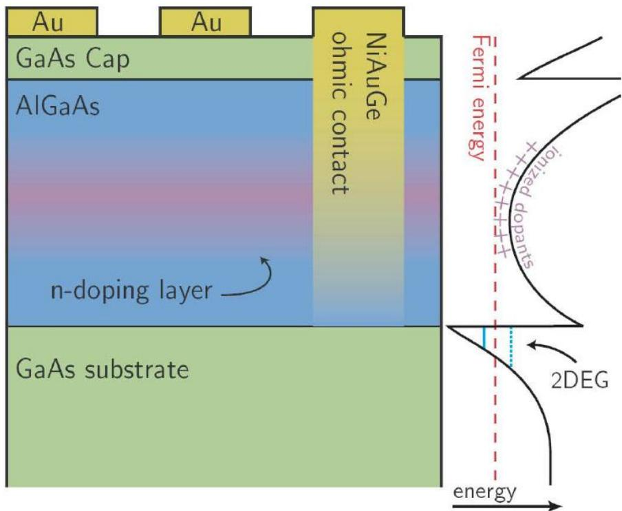  
图1.1 典型的GaAs半导体异质结能带示意图，二维电子气（2DEG层）就是形成量子点的地方，图片来自 [12]。

通过用 Al 原子来替代 GaAs 中的 Ga 原子，我们可以获得 $A l _ { x } G a _ { 1 - x } A s .$ GaAs 的导带和价带之间的带宽 $E _ { g }$ 为 1.42V，而 $A l _ { x } G a _ { 1 - x } A s  ~ ( x = 0 . 3 $ 时）的导带和价带之间的带宽为 1.79eV。故要大于 GaAs。因此，如果我们将 GaAs 和AlGaAs 粘合为一个异质结，在两种材料的交界处会出现能带不匹配现象，具体的形状如图（1.1）。当我们向 $A l _ { x } G a _ { 1 - x } A s$ 中掺入Si离子（通常为厚度65nm的$A l _ { x } G a _ { 1 - x } A s$ 中掺杂度为 $1 0 ^ { 1 8 } / c m ^ { 3 } )$ , 自由电子会聚集在结合处形成的三角势阱中，通常距离材料表面 90-100nm左右，并在生长方向被强烈地束缚住，形成分离的态。这一层中的电子只能在垂直生长方向的平面上移动，因而就形成了所谓的二维电子气。

二维电子气（2DEG）通常用一层未掺杂的“空白”层来与掺杂的n-AlGaAs层分离开，相距约 20nm，因此极大地减少了与 Si 施主离子的散射，故而这种分离导致了二维电子气具有相当高的迁移率，使得 GaAs 可以用在高于 250GHz的场合。

## 1.3 一个全电控量子点

一般来说，材料上表面安装的金属门电极上，施加的电压大小与金属和半导体的化学势相关，即 $e V _ { g } = \mu _ { s } - \mu _ { m } , ( V _ { g }$ 为金属门电极上的电压)。金属门电极与半导体材料之间存在一个肖特基势垒，从而保证了不会有电流从金属门电极上漏到半导体材料中。金属门电极与半导体材料的交界面上比较陡峭的电势形状，是由表面态的高电荷密度造成的；这些电荷需要掺杂施主离子来平衡，而且大多数施主离子需要来中和肖特基势垒；只有一小部分会对二维电子其中的电子有贡献。

如果金属门电极上加的电压太大，或者n-AlGaAs层太厚，又或者n-AlGaAs层掺杂度太高，都可能会导致 n-AlGaAs 层的导带的最小值落到费米面以下，从而在 n-AlGaAs 中出现一个电子聚集区域。这种情况被称为平行导通或者双子带。这会严重影响到金属电极对量子点的控制，因为电极产生的电势会被n-AlGaAs中新产生的电子层屏蔽。判断是否出现平行导通的方法，如图（1.2），可以先利用半导体晶圆制作一块霍尔棒（Hall bar），增加霍尔棒上顶电极（topgate）上负电压，电导会逐渐降低。如果电阻先升高，突然降低，并再次升高[如图 (1.2 b) 中箭头位置所示]，则可以判断是该晶圆出现了平行导通，很可能不适合用来制作全电控量子点。当然，通过观察量子霍尔效应，霍尔棒还可以告诉我们二维电子气中电子密度和迁移率的结果。许多教科书都给出了一般过程，这里不再赘言。我们希望的样品，应当是尽量低掺杂，高迁移率的样品。

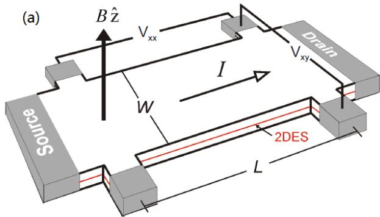

(b)  
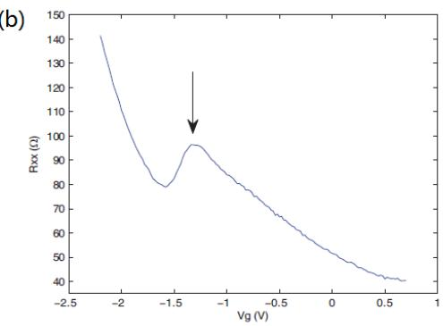  
图1.2 (a) 是一块典型的 Hall bar 样品。在制作量子点之前，我们首先可以制作一块 Hall bar 来判断这块半导体晶圆的基本物理性质。(b) 是源漏电流与Hall bar 表面电极电压之间的 I-V 曲线，如果出现如图中箭头所标注的情形，很可能是出现了平行导通。

在 4.2K 的环境温度下，典型的二维电子气迁移率为 $1 0 ^ { 5 } - 1 0 ^ { 6 } c m _ { 2 } / V s$ ，电子密度为 $1 0 ^ { 1 } 1 c m ^ { - 2 }$ 。在相对较低的电子密度下，二维电子气的费米波长较长（约为几 $+ \mathsf { n m } )$ ，并且屏蔽长度较大。二维电子气的这些特性使得我们能够通过对材料表面安装金属门电极来施加电场，局域地排空二维电子气，从而将电子约束在如图（1.3）红色虚线部分所示的 0 维区域内。这个区域这就是所谓的量子点。量子点与源极（source）和漏极（drain）之间存在隧穿势垒。由于源极，漏极和量子点都在同一层二维电子气内，通常也称为横向量子点。

a)  
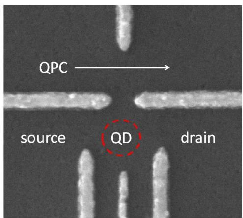

d)  
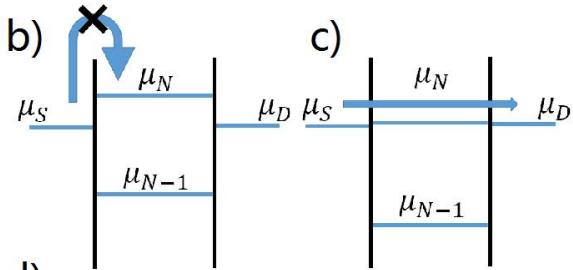

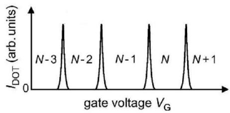  
图 1.3 (a) 是一块典型的单量子点（single quantum dot）样品的 SEM 照片。白色部分是金属电极。通常红色虚线所表示的尺寸大约在 200nm。尽管它是有确实的尺寸，但是我们依然可以将它视为没有维度的点。两个平行方向的电极，把量子点和用来测量的 QPC 通道部分断开。(b) 和 (c) 是量子点中电子阻塞或隧穿的示意图。当量子点中电子能级接近源漏极化学势的位置，则隧穿。否则就阻塞。(d) 是一个典型的典型的库伦阻塞图，我们可以清晰地输出电子数目。

半导体物理的基本知识告诉我们，0 维量子点中的能态分布是一些列分立的能级，因而量子点也被称为人造原子（artifical atom）。通过多年来经验和技术的积累，人类已经能通过改变电极上的电压，一个一个的排出量子点中的电子直至最后一个。这一点可以通过观察点量子点的库伦阻塞效应（CoulombBlockade effect）来证明。

库伦阻塞：图 (1.3 b) 是一个量子点中的能级示意图。其中 $\mu _ { 1 }$ 和 $\mu _ { 2 }$ 是量子点两边的化学势； $E _ { N }$ 是到导带底的单电子能量； $\varphi _ { N }$ 是静电势能。量子点中电子的化学势为 $\mu _ { N } = E _ { N } + \varphi _ { N }$ 。量子点和中的电子和外界源漏极的电子库（resovior）之间存在如图的一个势垒。假定两边电化学势高度相同， $\mu _ { 1 } = \mu _ { 2 } ,$ 则对于 N 1 能级位置的电子，不能穿越势垒跳出所在的势阱（尽管量子力学告诉我们存在跳出势阱的可能，但能极差较大时，可能性无疑是非常小的）。这就是所谓的阻塞。如果我们通过在电极上施加负电压来使得电子获得更大的静电势能，电子的能量越来越靠近化学势所在的位置。当二者非常接近（以致对齐，这时候跃迁概率最大）的时候，电子就可以离开势阱，跳到左边或者右边的电子库中，电子库中的电子也可以跃迁到势阱中的电子能级上。这里无疑产生了一个电流。如图 (1.3) 我们可以观察到这个电流。继续抬高静电势能，第N个电子的能级开始远离化学势位置，因此，第N-1 个电子的库伦阻塞开始了。

如果两个化学势的位置不相同，显然，如图 (1.4) 所示的窗口区域（源漏化学势的差值），都能够出现电子和电子库之间的跃迁。因此，以化学势差为纵轴，静电能量（电压）为横轴，出现了一个典型的图样：库伦菱形（CoulombDiamond）。不仅仅电子中的数目，一些其他的表征系统状态的参数也可以从库伦菱形图中得出。我们将在后面的第三章详细谈到。

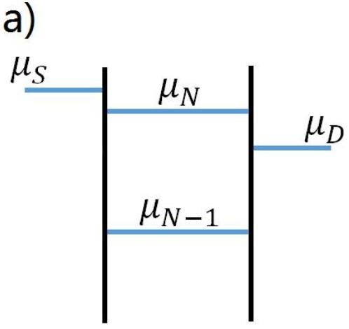

b)  
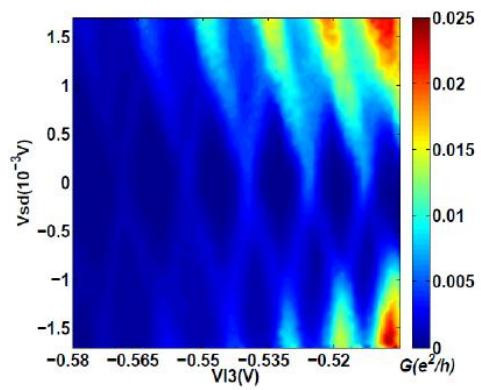  
图1.4 (a)和 (b) 是源漏极化学势不相等时，量子点中电子阻塞或隧穿的示意图。电子电极落到源漏化学势之间的区间中时，都可以隧穿。(c) 是一张典型的库伦菱形图，我们一样可以读取其中的电子数目。

如上所述，基于库伦阻塞和库伦菱形图，我们可以一个一个读出单个量子点中的电子数目。更进一步，我们可以用这种方法读出两个量子点 (双量子点)中的电子数目。在双量子点系统中，这种基本图样被称为蜂窝图 (honeycombdiagram)

## 蜂窝图：

如图（1.5），图（1.5 a）展示了一张串联双量子点的扫描电子显微镜下的照片。两个白色圆点 (后期标注) 各自代表了一个量子点。图（1.5 b）是一个用来描述双量子点的电容模型。

我们首先只考虑电容耦合的情况。左边的量子点与左边的电子库的耦合电容是 $C _ { L }$ ；右边量子点与右边电子库的耦合电容是 $C _ { R } ;$ 两个量子点之间的电容

$C _ { M }$ 。这被称作常电容模型（constant capacity model）[13–17]。常电容模型有更一般和复杂的描述，我们这里不再罗列一些列方程细节。从 $C _ { L }$ ， $C _ { R }$ 和 $C _ { M }$ 的关系，已经可以说明蜂窝图：

$C _ { M } \sim 0 ;$ ：在左边电极上施加电压，我们能看到左边量子点一个个排出电子，显因而有一条条的库伦峰；在右边电极上施加电压，我们能看到右边量子点一个个排出电子和库伦峰，如图 (1.5 c)。理想的情况下，我们能看到横平竖直，相交成直角的两套库伦峰。这种直角是非常自然的，因为耦合很弱，左右两个量子点几乎独立，对右边进行任何操作都不会影响左边量子点，反之亦然。如图中标记的电子数 $\mathbf { \Gamma } ( \mathrm { N } , \mathrm { M } )$ ），代表左边量子点中有N个电子，右边量子点中有M个电子。

$C _ { M } / C _ { 1 ( 2 ) } \sim 1$ ：两个量子点之间的耦合如此之强，以至于完全可以把他们看成一个单量子点。这样我们就可以看到单个库伦阻塞现象，如图 (1.5 e)，只是有个倾斜角度。因为左右两边电极电压都对这个单量子点中电子能级产生影响。当然，从这个倾斜角度，我们可以推测左右两个电极电容的比例。

$0 < C _ { M } / C _ { 1 ( 2 ) } < 1$ ：在两个极端之间。每个电子占据区域呈现六边形，展现出来蜂窝状的图形，如图 (1.5 d)。而通常我们关心的，就是电子电荷状态发生变化 $( N + 1 , M ) \mathrel { \mathop { \longleftrightarrow } } ( N , M + 1 )$ 的区域。这里能够产生量子计算所需要的二能级体系。

尽管这是一个经典物理下的电容模型，但是还是能提供给我们很多关于系统状态的参数。后文会给出一些具体的例子，来展示这个模型是如何发挥它的作用的。

## 1.4 如何实现一台量子计算机（Divicenzo五条判据）

David Divincenzo 等人于 1998 年，基于半导体量子点上自旋量子比特，提出了实现一个量子计算机需要的五条基本判据 [18](有时候也称为 7 条，表述的具体内容也略有不同，但基本意思都是一样)。不仅仅是半导体，对于其它体系，这个判据也是适用的。这五条判据是：

1系统的基本单元是量子比特，能够制备一个量子比特；

2系统能够实现一个任意的幺正变换（门操作）；

3 能够实现对系统量子状态的测量；

4有足够的相干时间，以便系统完成足够多的幺正变换（门操作）；

5量子比特之间可以交换信息，比特数目可以扩展；

任何普适量子计算机（universal quantum computor）都应该满足这五个条件。下面我们将按照这五条，依次介绍基于电荷量子比特 (charge qubit) 的半导体门控量子点量子计算，同时也兼顾介绍一下其他相近似的体系。

a)  
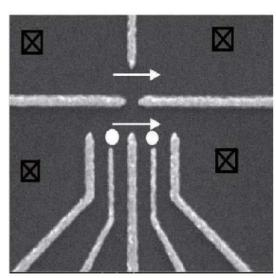

b)  
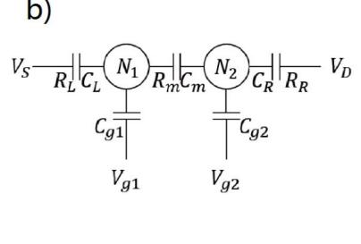

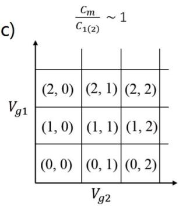

d)  
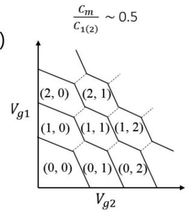

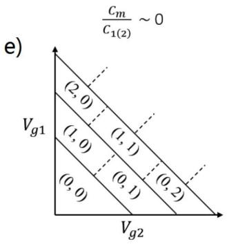  
图1.5 (a) 是一个典型的串联双量子点结构。(b) 是常电容模型下，串联双量子点的等效电路图。量子点与门电极和源漏 (电子库) 之间，两个量子点之间，通过等效电容耦合起来。(c-e) 展现了双量子点之间耦合 $C _ { m }$ 和量子点与电子库之间耦合 $C _ { 1 , 2 }$ 处在不同区域时，分别呈现的‘弱耦合’，‘一般耦合’，‘强耦合’三种情况。

## 1.4.1 实现一个量子比特

两能级体系（two-level system）是量子力学教科书中的经典范例，也是实现量子比特的基础。我们能够实现一个两能级体系，则可以定义一个量子比特。

电荷量子比 (charge qubit) 如图（1.5 a）所示，这是一个典型的平行串联半导体门控双量子点。各个电极的名称和用处, 以及其他物理细节，我们等到第三章，描述一个实验实例的时候再介绍。双量子点可以看成是两个单量子点 (图 1.3 a) 组合在一起。(图 1.3 a) 中虚线用来大致描画二维电子气中，因为表面电极施加电压而形成的势阱形状。理想的情况，每个量子点中要么约束了一个电子，要么电子全部排空。习惯上，我们可以称呼每个虚线范围为一个量子点。左右两个量子点里的电子一共有四种电荷 （charge）状态，我们标记为：（0,0），（0,1）（1,0）（1,1）。其中（0,1）指左边量子点排空，右边量子点包含有一个电子。其余类似。如果（0,1）和（1,0）两个电荷态之间存在耦合，那么我们得到了一个两能级体系。如图（1.6），定义 $| 0 \rangle \equiv ( 1 , 0 )$ 9$| 1 \rangle \equiv ( 0 , 1 )$ ，我们得到了一个量子比特，它可以是 0 或者 1 或者是某个中间态 $| \psi \rangle = c o s ( \theta / 2 ) | 0 \rangle + s i n ( \theta / 2 ) e ^ { i \phi } | 1 \rangle$ 。如图 (1.6 b), 我们可以用 Bloch 球来很方便地表示这个态。

电荷量子比特通常可以由这样一个二能级体系的 Hamiltonian(2  2) 来描述：

$$
H _ { d q d } = \frac { 1 } { 2 } \epsilon ( t ) \sigma _ { z } + \Delta \sigma _ { x }\tag{1.1}
$$

其中 $\epsilon$ 是两能级体系失谐量（detunning）， $\Delta$ 是两个量子点中电子之间的耦合能。 $\sigma$ 是 Pauli 矩阵。

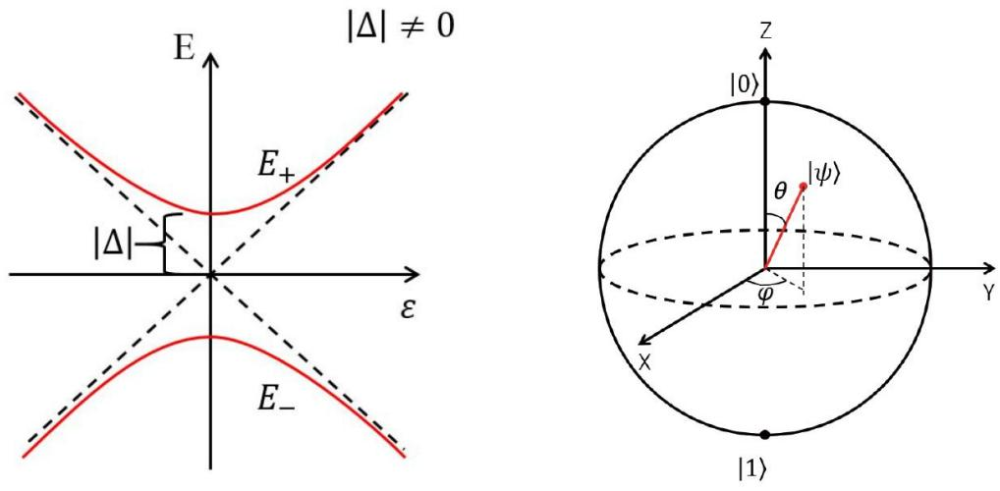  
图1.6 (a) 一个典型的两能级体系的能级图，横轴为失谐量 $\epsilon _ { \circ } ~ \epsilon = 0$ 时，上下两个电极之间的差值为2∆。(b)bloch 球上的每一点都代表了一个态

自旋量子比特(spinqubit)如上所述。在电荷态（1,1）的基础上，考虑到每个电子带有 1/2 的自旋，两个电子自旋耦合则产生自旋单态（singlet）和自旋三态（triplet）。忽略 $T _ { \pm }$ 。如果自旋单态 $S _ { 0 }$ 和 $T _ { 0 }$ 存在耦合，那么我们又得到了一个两能级体系。定义 $\left| 0 \right. \equiv { { S } _ { 0 } } , \left| 1 \right. \equiv { { T } _ { 0 } }$ ，我们又得到了了一个量子比特，它可以是 0 或者 1 或者是某个叠加态 [19–21]。

如前蜂窝图章节所述，我们能够得到一张标记着电子在两个量子点中的电荷布居（M，N）的图片，并且可以读出电子是否进入或离开了量子点，但并不是总能确定量子点中是否留下了最后一个电子。例如当最后几个电子和源漏电极耦合非常小，隧穿速率也很小，以至于电流弱到无法测量，那么显然我们是看不见最后几个电子了。但是通常我们不用关心能级更低的状态，亦即更多的电子带来的多体效应，而只关心浮在最上面的能级。也就是说我们将（N+1，M）视同（1,0）。

这里我们进一步说明一下电荷量子比特：电荷量子比特的一个好处就在于，由于我们读出的信息就是电荷在两个量子点中的分布情况（具体的读出方法会在第三章实例中介绍），因此定义的同时也就完成了读出。如果是自旋量子比特，需要先实现自旋阻塞（spin blockade）[22; 23] 过程来完成自旋 $( S _ { 0 }$ 或者$T _ { 0 } )$ ）状态的读出。

## 1.4.2 实现一个任意的幺正变换（门操作）

对于定义在 GaAs 半导体门控双量子点上的电荷量子比特来说，单个量子比特的操作中，最重要的无疑就是量子非（Quantum Not）操作。也就是完成0 到 1 （或相反）的反转过程。实现这个过程通常可利用拉比振荡（RabiOscillation）或者 Landau-Zener-Stükerlberg 过程（LZS）过程来实现。

Rabi Oscillation: 假设如图（1.7）的布洛赫球。南北两极分别是 0 和 1 ，假如我们能驱动电子在 0 和 1 翻转（以 x 轴为轴心），那么这就是 RabiOscillation。为了实现这一点，我们在量子点样品的表面电极上加上一个高频调制信号，也就是一个脉冲信号（pulse）。通常这个信号是 GHz 宽度的方形脉冲，脉冲时长为 $\mathrm { T }$ （考虑到真实脉冲需要从外界一路沿着高频信号线，通过许多接口、PCB板印刷电路，bonding铝线等等，所以真正到达的样品上的可能是三角波或其他无法预知的形状）。

假如我们有这样一种测量工具，能够通过测量某个物理量 I 来知道系统内量子比特的情况。当系统处于量子比特 1 时， $I = I _ { m a x } ,$ ，当系统处于量子比特0 时， $I = I _ { m i n } \circ$ 。当然，测量是某个态向布洛赫球上 $\sigma _ { z }$ 方向投影，总归要落在$I = I _ { m a x }$ 和 $I = I _ { m i n }$ 之间。这时我们再有一个时间为 $T _ { 0 }$ 的脉冲信号，它使得位于某个失谐位置 ϵ 的态 0 ，移动到 $\epsilon = 0$ 的位置开始演化 [因为如方程 (1.1) 所示 $\sigma _ { z }$ 项等于零，因此也就是态矢量绕着 $\sigma _ { x }$ 旋转] 并且 $T _ { 0 }$ 的时间正好使得这个态演化到 1 。假如一切都成功了，那我们完成了一次量子态的翻转，并且通过测量物理量I 读出了这个翻转。

理想情况下，旋转的周期 $T _ { 1 }$ 被两能级的耦合强度 ∆ 所决定 ( 1/∆)。所以连续变化方形脉冲宽度（时长T），我们应当能看到一种 0 和 1 的周期性的振荡。振荡幅度发生在 $I = I _ { m a x }$ 和 $I = I _ { m i n }$ 之间。这种振荡就是 Rabi Oscillation。从概念上来说，这样一个单比特操作无疑是最简单的。

Landau-Zener-Stükerlberg 过程: 硬件条件有时候会限制我们，使得理论上最简单清晰的 Rabi 振荡很难观察到。比如样品感受到的真实脉冲是个三角波，这样 $\epsilon = 0$ 位置处根本就没有那么理想的演化了；或者脉冲的最高点位置根本不在 $\epsilon = 0$ 位置处。如图 (1.8) 在三角形脉冲作用下，某个态穿过了 $\epsilon = 0$ 的位置，继续进入 $\epsilon > 0$ ，演化了一段时间后，再次穿过 $\epsilon = 0$ 的位置，回到 $\epsilon < 0$ 的区域。光学分束器给了我们一个非常好的类比。一束光在路径 1 和路径 2 中积累了不同的相位，正如在 $\epsilon > 0$ 区域的两个态之间会积累不同的相位。

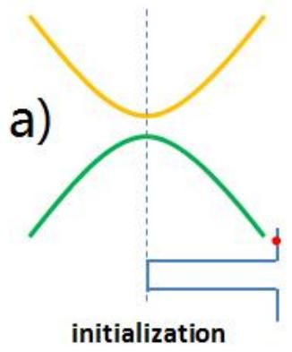

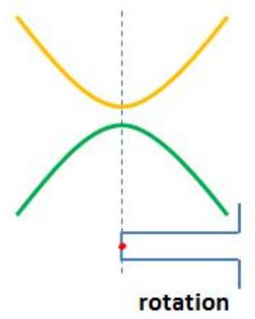

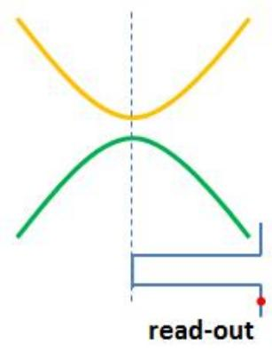

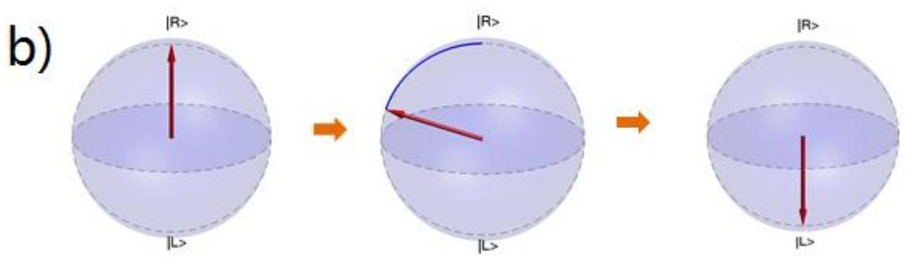  
图1.7 a)展示了Rabi振荡过程的三个不同时间阶段，分别用红色圆点标记。(b)给出了 bloch 球上，每个演化阶段 qubit 相应的运动行为。

绝热 -脉冲模型（Adiabatic Impulse Model）对这个过程给出了很好的描述。这里我们不关心其中的推导细节，直接给出结果[24–26]：

假定我们施加这样一个三角波，它的幅度是 A，上升沿和下降沿都是 $t _ { r } ,$ 那么它的效果是使得布洛赫球上的一个态转动了这样两个角度：

$\sigma _ { z }$ 方向：

$$
\phi = \frac { ( A - \epsilon _ { 0 } ) ^ { 2 } } { A } \cdot \frac { t _ { r } } { \hbar }\tag{1.2}
$$

$\sigma _ { x }$ 方向：

$$
\theta = 4 \sin ^ { - } 1 \sqrt { e x p ( - 2 \pi \Delta ^ { 2 } t _ { r } / \hbar A ) }\tag{1.3}
$$

如图（1.8）。尽管要比 Rabi 操作麻烦很多，但只要选择的参数合适，我们总能在布洛赫球上把 1 旋转到 0 。我们小组的曹刚，李海鸥等人于 2013 年成功地在GaAs 门控双量子点上完成了这一试验[25]。

更进一步，人类设计了很多种两比特量子门，有 Control-Not、Swap、

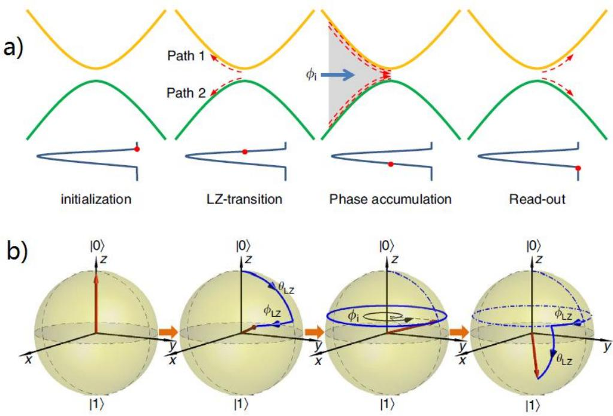  
图1.8 a) 展示了 LZS 干涉过程的四个不同时间阶段，分别用红色圆点标记。(b)给出了 bloch 球上，每个演化阶段 qubit 相应的运动行为。

Control-phase、Hadamard 等等。但是假如我们有一个单比特的量子非门，再有一个两比特的 Control-Not 门，任意的量子门就都可以用这两个门组合来完成，正如经典计算机里实际上只要一种门：与非门。如前所述，我们已经有了一个量子非门，那么我们还需要一个 Control-Not 门。在半导体量子点上，目前只实现了唯一一种构成两比特门的方式，就是直接耦合。亦即两组双量子点直接在几何空间上放在一起，从而通过库伦相互作用相互耦合起来。哈佛大学的Yacoby 实验组制作完成了一个基于自旋量子比特的受控相位门 (Control-Phasegate) 操作，这是我们目前知道的最好的结果 [27]。

## 1.4.3 实现对系统量子状态的测量

对电荷量子比特来说，测量是相对简单的事情，因为 0 和 1 两个量子态直接与电荷分布相关。考虑只有一个电子的情况，量子比特为 0 的时候，一个电子在左边；反之电子在右边。通常我们用一种叫做量子点接触（quantumpoint contact，QPC）通道的结构来探测量子点中的电荷分布情况 [28–31]。如图(1.9)。其原理非常简单，电子在左边，由于离QPC通道近，通过库伦相互作用，对 QPC 通道里电子斥力大，电流小。反之，电子在右边则电流大。因此我们通过读出QPC 通道中的电流大小就可以知道量子点中电荷分布的情况了。

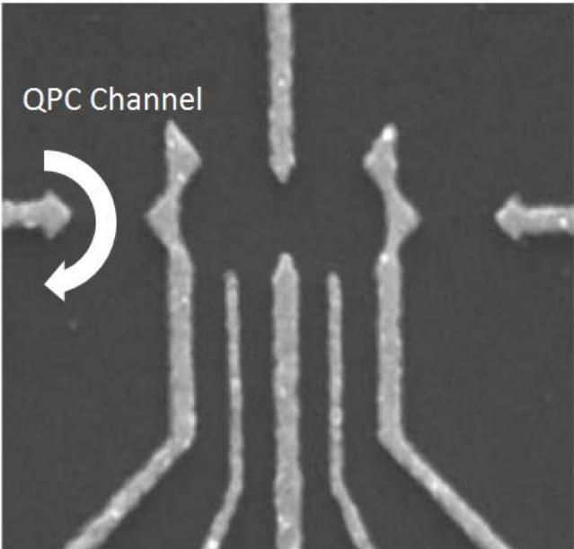  
图 1.9 QPC 通道示意图，白色箭头标示了QPC 电流

对于自旋量子比特，系统的Hamilton是

$$
H _ { d q d } = \frac { 1 } { 2 } J ( \epsilon ) \sigma _ { z } + B _ { n u c l e a r } \sigma _ { x }\tag{1.4}
$$

其中 $B _ { n u c l e a r }$ 是表征量子点中的电子与周围原子核自旋的耦合。通常，一个电子大约与 $1 0 ^ { 6 }$ 个原子核通过超精细作用耦合起来。核自旋磁场 $B _ { n u c l e a r }$ 大约在在 1-5mT 左右。 $J ( \epsilon )$ 表征了自选单态 S 和自旋三态 $T _ { 0 }$ 之间的能极差。当$\epsilon \ll 0$ 时， $J ( \epsilon ) \approx 0 , S _ { 0 } ( 1 , 1 )$ 和 $T _ { 0 } ( 1 , 1 )$ 这两个能级几乎简并。当 $\epsilon > 0$ 时，J将增大。S 和 T 之间不再简并。由于更低的能级是 $S _ { 0 } ( 0 , 2 )$ ，所以 $S _ { 0 } ( 1 , 1 )$ 可以变成 $S _ { 0 } ( 0 , 2 )$ ；同时 $T _ { 0 } ( 1 , 1 )$ 由于自旋阻塞，却不能变成 $S _ { 0 } ( 1 , 2 )$ 。注意到，这里尽管依然是自旋单态 S，但是却处在不同的电荷态。因此和电荷量子比特一样，我们能够通过测量知道一开始到底是 $S _ { 0 } ( 1 , 1 )$ 态还是 $T _ { 0 } ( 1 , 1 )$ 态，因为施加测量手段（增大ϵ）之后，两个自旋态却呈现不同的电荷分布。

## 1.4.4 退相干时间

量子比特显然不是一个孤立系统，它与环境的耦合促使量子比特退相干，因而降低了门操作的保真度。相对其它系统，比如超导约瑟夫森结或者 NV 色芯来说，电荷量子比特的相干时间很难令人满意。我们必须使用极低温设备，在几十 mK 的温度水平，才能使得共振隧穿或者电声相互作用之类与温度相关的过程尽可能收到压制。同时，外界电路设备可能带入高频噪声，特别是 GHz量级的噪声显然会影响到操作过程（因为对电荷量子比特的操作频率也在这个水平上），从而降低门操作保真度。另一方面，低频的 1/f噪声也是影响量子比特退相干的重要因素，而且对 1/f噪声的来源至今仍然不是非常清楚（可能是来源于衬底中被杂质束缚住的电子）。总的来说，GaAs 半导体上电荷量子比特的退相干时间只能保持在 100ps 量级，这是非常难以令人满意的。在退相干时间内，目前只来得及做十个左右操作。离一般期待的退相干时间内完成 $1 0 ^ { 5 }$ 个操作还非常远。

作为一种延长退相干时间的手段，我们可以用动态解耦和 （dynamic decou-ple）技术来尽量消除环境和量子比特之间的耦合 [32–36]。这种技术的基本思想称作回声（Echo）。如图 (1.10) 原本在 $T = 0$ 时刻处在 0 位置的 qubit，受到外界影响，可能在 $T = T _ { 0 }$ 时间内沿 x 轴转动了一定角度 θ, 如果我们对 qubit 做一个操作，目标是使得 qubit 快速地沿 z 轴转动 π 角度，则它在下一个 $T = T _ { 0 }$ 时间内继续转动θ，则又重新回到 0。

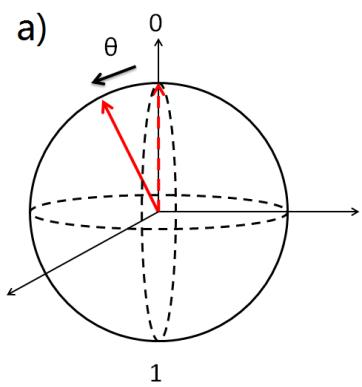

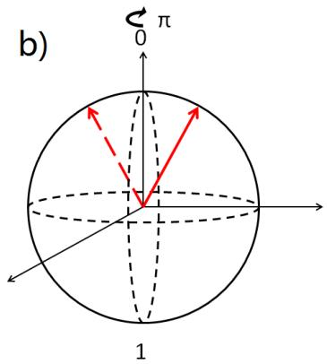

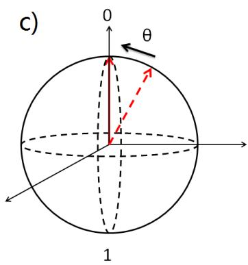  
图 1.10 原本在 $T = 0$ 时刻处在 0 位置的 qubit，收到外界影响，可能在 $T = T _ { 0 }$ 时间内沿 x 轴转动了一定角度 θ, 如果我们对 qubit 做一个操作，目标是使得 qubit 快速地沿 z 轴转动 $\pi _ { : }$ ，则它在下一个 T = $T _ { 0 }$ 时间内继续转动θ，则又重新回到 0。红色虚线和实线分别代表一段时间内起始态和终了态。

对于自旋量子比特来说，电荷噪声造成的影响要相对小一些。主要的退相干因素是原子核自旋影响，因为核自旋仍然有一定的抖动。相对电荷量子比特，自旋量子比特退相干时间会略微长一些，达到百纳秒量级。但是相应的，自旋量子比特的操作速度差多不多在几十纳秒量级。从退相干时间内可以完成的操作数目来看，在 GaAs 材料里，自旋量子比特尽管略好一点，但也并没有特别的优势。目前世界上报道的最好的结果是哈佛的Yacoby实验组。他们经过echo操作，退相干时间可以延长到数微秒，但退相干时间内依然不够完成一个保真度足够高的操作(他们的保真度大约只有0.7)。

为了改善这个情况，基于 GeSi 半导体异质结材料的量子点最近正在兴起。威斯康星大学的 Esillion 实验组最近实现了一个 GeSi 量子点上的电荷量子比特，但是退相干时间依然只略高于 1ns。所以 GeSi 上的主要优势还在本底核自旋没有高阶磁矩，从而提高了自旋量子比特的相干时间。澳大利亚悉尼大学的Maune 等人在 GeSi 量子点上成功制备和操作来了一个自旋量子比特，最大相干时间达到了几十微秒量级[37]。这是目前半导体量子点上的最好水平。

## 1.4.5 扩展比特数的扩展

如何让更多的量子比特参与进来。对于半导体量子点来说依然是一个严峻的挑战。如前面小节所示，我们用电容耦合的方式来实现两个量子比特之间的耦合。但试图推进到更多比特的时候无疑是困难的，特别是电极几何排列中的限制。如 Yacoby 小组设计的串行排列的四量子点（两比特）结构，假如试图扩展到三比特，则需要串行排列六个量子点。在作者个人看来，一个显而易见的问题是，没法给中间的一组双量子点设计一个 QPC 测量通道。也许我们能通过直接测量中间源漏通道的电信号来知道中间比特的状态，但依然有其他问题，比如最左侧的比特和最右侧的比特之间存在耦合。三个比特中间任意两个都有耦合，整个 Hamiltonian 会非常复杂，很难期待两个比特的门操作保真度不会被第三个比特的状态影响。事实上，荷兰 Delft 大学的 Vandersypen 实验组最近完成了一个实验，恰恰说明了一串量子点的两个端点可以通过中间的量子点耦合起来 [38]。

一个可能的解决办法是模仿在超导量子比特系统里的方案。人们使用高品质因数的固态微波腔来实现两个超导量子比特之间信息的交换 [39–45]。这大大扩展了量子比特数目。在半导体量子点上，人们做了类似的尝试。一个最近的例子是法国的 Delbecq[46] 等人将两组量子点通过微博腔连接在一起。但是他们的实验并未观察到量子点之间的耦合，而仅仅只有两组相距较远的量子点的电极之间通过腔实现的电容耦合。尽管如此，在作者看来，固态微波腔依然是目前最值得尝试的办法。

## 1.5 其他量子计算机实验方案

## 超导量子比特（superconductor quantum qubit）

超导约瑟夫森结同样是一种基于固态系统的量子比特方案。超导约瑟夫森结是一种超导体 - 绝缘体 -超导体的三明治结构，通过微纳加工的办法，可以制作库伯对盒子（cooper pair box），一对库伯对束缚在 cooper pair box 中或跳出cooper pair box，可以在定义电荷量子比特。除了 charge qubit 以外，还可以制作超导环路电路，环路电路中正向流动的电流和反向流动的电流可以产生方向相反的磁通量。基于磁通量，可以定义磁通量子比特 (flux qubit)。超导量子比特的操作和读出与半导体量子点非常类似。

离子阱量子比特 (ion trap qubit) 离子阱系统利将离子约束在一定的电磁场空间内。利用激光冷却，将离子冷却到极低温度。这里的两能级体系，可以通过离子的超精细能级结构中，光学跃迁的基态和激发态来定义一个量子比特。而对量子比特的操作是通过电磁辐射来实现的。对量子比特的测量和读出，则通过观测离子荧光的方式。离子阱量子比特的扩展，则通过离子的集体作用作为量子数据总线。离子阱系统已经实现了多比特纠缠和高保真度的门操作。

NV 色芯量子比特 (N-V center qubit) 如果金刚石材料中存在氮空位，则氮空位中心可能存在电子。这种电子有非常稳定的自旋，而且周围的自旋背景非常纯净，相干时间极高。量子比特的定义是通过电子的自旋。量子比特的操作则通过外界微波场或者激光。量子比特的测量和读出则通过激光扫描。NV 色芯单个量子比特的实现非常好，但是比特纠缠还未得到实现。

## 1.6 本章小结

本章中，我们介绍了基于半导体异质结门控量子点的量子计算方案的基本概念。包括什么是半导体量子点，如何定义一个量子比特。进一步，我们介绍了 Divincenzo 的五条基本判据，并基于五条判据，逐一介绍了在目前电荷量子比特的现状。在有了这些基本概念之后，下面我们将介绍如何制作这样一个量子点系统，以及它需要什么样的测量环境。

## ㅢ 2 章 半导体全电控量子点工㢰和极低温技术

1947 年，AT&T 的 Bell 实验室 John Bardeen，Walter Brattain 和 Willam Shock-ley 制作了世界上第一块半导体点接触型晶体管。自此以后，随着微纳加工技术的发展，晶体管的集成度越来越高。现在，半导体技术极大地改变了世界。不必多言，我们身边无处不体现着半导体工业技术的一系列成果。

为什么我们要在半导体上实现一个量子点，并将它作为未来量子计算的一个有力候选者？尽管如第一章介绍，在单个比特和最基本的门操作上，基于半导体量子点方案量子计算相对于其他物理体系，并没有什么优势，反而略输一筹。但半导体量子点一个巨大优势就在于：样品的加工完全可以通过工业上已经成熟的平面加工处理技术完成。可以说，就样品的制备技术而言，除了一些技巧之外，实验室甚至未来的工厂中几乎不需要什么新设备和新技术，一切都已经非常成熟。同时，现代半导体集成化电路的成功强烈暗示了未来量子门电路的集成化成功，这一点是相当吸引人的。

在我们的实验室中，用到的典型的加工技术包括：化学清洗和等离子体清洗、光刻技术、电子束曝光技术、金属沉积技术。其它技术：如等离子体刻蚀、原子力显微镜局域氧化、原子沉积生长等，在各种不同的半导体材料量子点加工上（GaAs或者GeSi，掺杂或非掺杂），也可能使用到。[47–57]这里我们主要介绍掺杂型 GaAs 异质结半导体上量子点的加工工艺。完全可以将它视作加工工艺的基本形式，其它材料上更复杂的工艺可以视为它的变体。

## 2.1 制作一个全电控量子点1（切割和清洗）

整个工艺开始，我们得到的是一块通过分子束外延（MBE）生长的晶圆（wafer）。这是我们通过商业购买的形式获得的。晶圆尺寸通常为 3 英寸或 4 英寸。首先在整片晶圆上甩上一层保护胶 (通常用光刻胶就可以了) 并烤干 (后面会介绍)。然后沿着与晶圆切口标记平行和垂直的方向，用玻璃刀将晶圆切割为1cm 见方的方片。每个切片大约可以做 9 （3x3）或 12 （3x4）个量子点样品。一个量子点样品尺寸大约在 2-3mm 左右。切片不宜更大，否则使用普通镊子时夹取困难，光刻时对准也不宜，而且制作中如果产生失误则损失很大。

清洗的目的，在于除去晶圆表面的离子的、有机的或者金属杂质。我们采用的清洗包括以下五个标准步骤：

1将切片放入三氯乙烯（TCE）溶液中，超声清洗50s；

2将切片从三氯乙烯转移到丙酮（ACE）溶液中，超声清洗 50s；

3将切片从丙酮转移到异丙醇（IPA）中，超声清洗50s；

4将切片从异丙醇转移到去离子水（DI，）中，超声清洗50s；

5将切片从去离子水中转移到无尘纸上，用高纯氮气吹干表面。

有时如果有必要，还可以使用表面等离子体清洗。如果感觉有碎裂的危险（作者个人的经验表明，清洗次数太多，清洗中可能突然碎裂。尽管不能作为一个一般性的证据，但是显微镜下如果发现晶圆边缘破损严重，超声中碎裂的可能性就很大。特别是使用镊子时，希望夹紧而过于用力，会对晶圆切片边缘造成很大损伤。），可以把超声清洗改为浸泡5min。

清洗原理十分简单，但非常重要，需要反复的练习才能熟练做出表面清洁的样品。样品表面清洁与否，经常成为量子点质量的关键。特别是在电子束曝光前或者整个制作完毕后，光学显微镜下观看电子束曝光电极部分，表面如果有大量的脏污，实际经验发现这样的量子点工作很可能失败。又如，在切割完毕后的第一道清洗工序时，因为几乎无法分辨晶圆正反面，所以万万要注意不能出现在转移过程中把晶圆切片正反弄错的情况。

如果确实发生了无法确定正反面这样的问题，应当将晶圆切片转移到有IPA 或者其他有机溶剂的培养皿 (或其他易于在显微镜下观察的容器) 中，在显微镜下观察晶圆边缘，有明显切割痕迹的，基本是正面。

## 2.2 制作一个全电控量子点2（光刻，镀膜和刻蚀）

以我们的半导体双量子点为例，清洗完毕的晶圆切片，首先制作台阶（mesa）。Mesa 是半导体表面一块高地。高地以下的半导体，其包含二维电子部分已经被刻蚀掉。只剩下高地上的半导体中还存在二维电子气。接下来光刻技术完成的部分包括：1 欧姆接触电极（Ohmic Contact gate）2 表面电极（surface gate）。我们是用的光刻设备是 Karl Suss MJB-3，极限在 1µm。首先介绍一下光刻。

光刻： 光刻技术是现代半导体工业技术的核心之一。通过复杂的紫外光、深紫外曝光等技术，光刻曝光的分辨率已经可以达到 20nm 以下。但实验室由于设备的限制，通常利用光刻曝光完成微米或百纳米量级的加工。更高精度的电极交给电子束曝光来解决。

光刻胶有正（性）胶和反（性）胶两种。正胶经过光照后，在显影剂中将会分解，而反胶在光照后，将会形成聚合物，从而不在显影剂中分解，分解的部分是未光照部分。由此，我们得到想要的图形。图 (2.1) 提供了一个直观的解释。

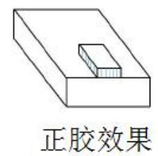

a)  
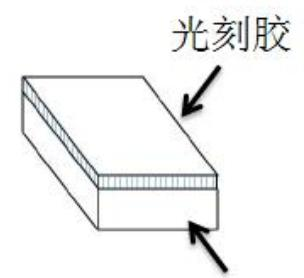

b)  
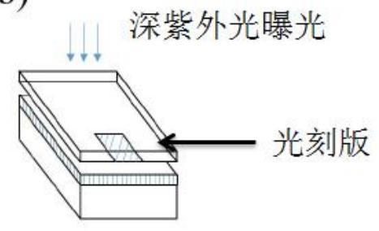  
待处理半导体

c)  
d)  
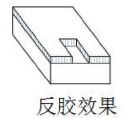  
图2.1 如图 (a) 和 (b)，光刻胶覆盖在待处理半导体表面，画好图案的光刻板覆盖在胶上。(b) 图中是一块反版，有图案处不透光。(c) 和 (d) 分别显示了曝光完成，并显影后显示出的图案。(c) 是正胶的效果，图案处留下了光刻胶，其余被清洗掉；(d) 是反胶效果，图案处被清洗掉，其余部分留下光刻胶。

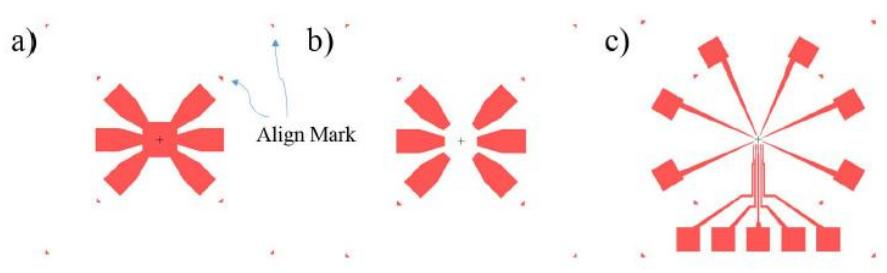

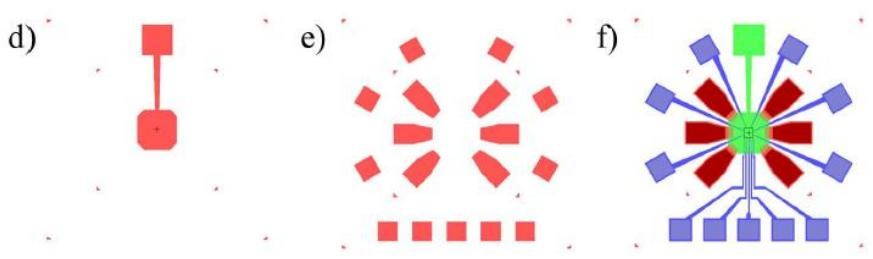  
图2.2 这是一组用 Altium 软件绘制的光刻版 CAD 图样。(a)mesa; 其中虚线箭头处标示了对准位置。(b) 欧姆接触电极；(c) 表面电极;(d)top gate, 在有些样品，比如非掺杂的 GaAs 晶圆上需要使用；(e) 统称为 pad 的大电极；(d) 总体效果。  
label1-2-1

## 这里的基本步骤是：

1 制版。根据实际的需要，我们要制作相应几何图样的光刻板, 如图 (2.2)。实际中我们采用 Altium 或其他 CAD 软件来完成绘制工作。通常可以选择正版和反版两种。正版既有图样处透光，其余部分不透光。反版正好相反。

## 2晶圆清洗（见上节）

3脱水烘烤。通常使用 $9 5 \mathrm { { ^ \circ C } }$ 烘烤 90s。目的是除去表面任何湿气。

4甩胶。将光刻胶（AZ5214E）滴注在切片中心，将切片放置在高速旋转甩胶台上（4000r/min，厚度1.4µm），利用高速离心力使得光刻胶均匀的附着在切片上。形成一定厚度的光刻胶层。注意，甩胶前的清洗非常重要。甩胶完毕可以在黄光下用肉眼观察一下甩胶结果：1 如果有相对较大的颗粒附着在晶圆表面，甩胶完毕后可以直接看到胶在离心力扩散下被颗粒阻挡的图样。这样甩胶就失败了；2 除切片的四角外，其他地方几乎看不到因为光刻胶的厚薄不同出现的干涉现象。

5烘烤。通常使用 $9 5 \mathrm { { ^ \circ C } }$ 烘烤 90s。目的是使胶硬化。

6 对准和曝光。利用光刻版上的对准标记，与切片上的对准标记，来确定光刻版上图样和切片上预定曝光位置之间的对准。举例而言，做完 mesa 后，半导体表面会留下如图 (2.2 a) 中箭头所示小图案。下一步我们制作欧姆接触时，需要将光刻版上欧姆接触部分相应的图案与半导体晶圆上已经存在的图案对齐，这样确定欧姆接触图案的曝光位置。完毕后，使用曝光机曝光。我们使用的是Karl Suss 公司生产的 MJB-3 型曝光机。曝光精确度可以到达 1µm。我们使用的光刻胶为 AZ5214E。这种胶根据处理的不同，可以在正胶和反胶之间转变。基于反版的基础上，如果使用正胶，需要曝光 6s 并显影；如果使用反胶，曝光 6s后，在 $1 8 0 \mathrm { { } ^ { \circ } C }$ 条件下烘烤 2min，然后直接暴露在曝光灯下60s。

7 显影。将曝光后的切片放入显影剂中进行显影。我们使用的显影剂为AZ400K 混合 DI （1:6），显影时间为 30-40s。具体时间可以灵活掌握，显影的结果一般肉眼可见。

8烘烤。目的是使光刻胶变硬。

以上，我们完成了一个标准的光刻步骤。图样已经被显现出来，等待着进行下一步合适的操作。

湿法刻蚀： 使用酸性刻蚀液“吃掉”表面的半导体。我们使用硫酸：双氧水：去离子水 =1:6:100 配制的刻蚀液。曝光完成后，图样部分半导体表面是裸露的，会和刻蚀液发生反应；其他部分有光刻胶保护，不会和刻蚀剂反应。

## 这里的基本步骤是：

1 将曝光后的晶圆切片放入刻蚀剂中 15s。刻蚀时尽量匀速地在显影液中移动样品，以便更好地反应。这种剂量的刻蚀液，通常刻蚀厚度在10nm/s

215s 后取出，用 DI water 冲洗 10s 以上。

3将切片放入丙酮中去除剩余的光刻胶。

## 4 清洗

到此，Mesa 制作完毕。

在 Mesa 上，我们要制作欧姆接触电极（Ohmic Contact Gate）。欧姆电极将进入二维电子气层，从而使得二维电子气能够连接到外部电路。制作金属电极的一个重要步骤是镀膜。常见的镀膜方法有磁控溅射镀膜，热蒸发镀膜和电子束镀膜。这里，我们使用的是电子束镀膜。其基本原理为高压系统提供的高电压将加速电子束轰击坩埚中的金属，使金属蒸发。蒸发的金属气体会扩散到整个腔室，遇到样品表面会遇冷后均匀地沉积下来。

## 这里的基本步骤是：

1光刻，做出欧姆接触图样。

2 镀膜。镀膜的顺序依次为厚度为 100A 的 Ni，厚度为 1500A 的 GeAu 合金，厚度为100A 的Ni。

3 金属剥离（lift-off）。镀膜完毕后，金属薄膜在金属上有两种状态：附着在半导体上或者附着在光刻胶上。将切片放入丙酮溶剂中浸泡，光刻胶溶解后，附着的金属薄膜会跟随者脱落。剩下的只有附着在半导体上的金属。通常浸泡十分钟左右即可。如果对于特别精细的电极，可以浸泡一整天的时间。不宜脱落金属薄膜，可用小的塑料移液管吹动液体，利用液体的快速流动带走薄膜。

4清洗。到此为止，金属存在于半导体表面，尚未和二维电子气导通。

5退火（Aneal）。退火过程可以使得金属向下渗透到二维电子气层中。方法为：15% 的氢气和氮气混合气氛下，60s 内升至 430◦，维持 5min，4 分钟内退火至 100◦。等到完全冷却后取出。退火之后的欧姆电极，光学显微镜下可以发现表面不再平整，有很明显的坑洼，如图 (2.7 e)。

表面电极（Surface Gate） 如第一章中介绍。排开二维电子气，形成量子点，需要电极上施加电压。这些电极因为只在半导体表面，而不连通二维电子气层。因此，因此被称作表面电极。表面电极包括用光刻和电子束曝光两个部分，分别完成 1 微米和几十 nm 级的电极。表面电极制作方法与欧姆电极一致，此处不再赘述。只是不需要退火，金属层为 100A 的 Ti，1000A 的 Au。光刻最终效果见图 (2.7)

至此，光刻部分结束。

## 2.3 制作一个全电控量子点3（电子束曝光）

受到光波长的限制和实际购买的光刻机的工作能力，我们组内通常只能达到最小 1 微米精度。更细微的结构（几十纳米），我们需要波长更小的电子束曝光法。电子束曝光不需要制作掩膜板，而是预先写入 CAD 图形，由软件控制光阑开关来实现。电子束曝光需要相应的电子束光刻胶，基本原理与普通光刻没有什么区别。这里的基本步骤是：

1 清洗。这一步清洗需要确保最中心约 $1 0 \times 1 0 \mu m ^ { 2 }$ 的区域非常清洁。否则更精细的电极可能在污损处断裂。

2甩胶。这里我们使用的光刻胶是聚甲基丙烯酸甲酯（Polymethylmethacry-late PMMA，950 A2）。需要甩两层。第一层：用 500r/m 条件下 3s，然后在180◦ 条件下烘烤 5min。第二层：4000r/m 条件下 40s，然后在 180◦ 条件下烘烤10min。硬化后等待曝光。两次甩胶结束后，总厚度约在120nm。

3镍粉标记。曝光图样时，我们需要电子束聚焦在半导体表面。但是电子束一旦照射到光刻胶上，曝光也就开始了。所以不能直接将电子束移动到曝光区域观察，而是需要一个确定焦距的手段。镍粉就起到这个作用。我们用异丙醇混合镍粉，利用牙签或其他物品尖端蘸取一点液体沾在样品的四个角上（不要触碰到电极）。聚焦一个待曝光区域四角的镍粉，调整到 100 万倍率下焦距和相散最优处，记录下此时的焦距。依次完成四角，以焦距平均值为中心区域焦距。

利用镍粉确定焦距之前还有一些细微而繁琐的调整工作，例如测量电子束电流强度，以便确定最终的曝光时间等等。这里就不再一一介绍。

4曝光开始。按照事先编写的CAD 图样完成曝光。

5 显影。这里的显影剂是 MIBK：IPA=1:4。显影 45s，异丙醇中冲洗 15s，吹干。MIBK气味具有很强的刺激性，注意做好防护。

6 镀膜。

7 金属剥离。这里最细的电极只有 10nm 量级。需要在丙酮中浸泡一天，然后用塑料软移液管吹掉表面的金属薄膜。并用 IPA 反复冲洗吹干。此时切忌用超声清洗。

至此，电子数曝光流程结束。后续的两个基本步骤是:

1甩胶和烤胶。目的是将样品表面保护起来，并准备切割。

2将 3x3 的样品切割成独立样品。每个大小约3mm见方左右。

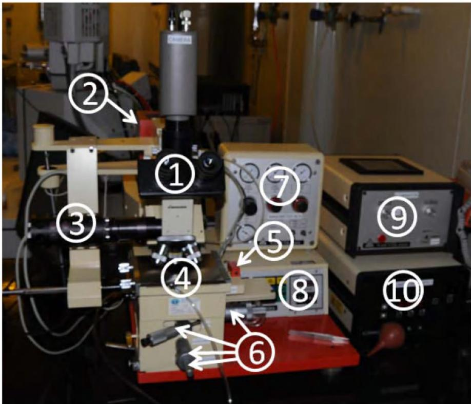  
图2.3 光刻机 KarlSuss MJB-3。各组件为:1 光学显微镜 2 汞灯光源（曝光光源）3光学显微镜光源4光刻板台，放置光刻版5样品台，防止样品6样品台控制杆，用于控制样品的位置，以便和光刻版上图案对齐 7 气路控制器8 光刻控制器，开启曝光，控制曝光时间 9 显微镜光源控制器 10 汞灯光源控制器

## 2.4 制作一个全电控量子点4（底座安装和焊接）

切割完毕后的样品，在丙酮溶液中溶解掉表面的保护胶，并用 IPA 冲洗表面。之后需要在光学显微镜（这里我们用 100 倍）下仔细观察电子束曝光和镀膜之后的结果。如果有电极断裂或者电极尖端脱落，常常会有暗场下的微弱亮点。凭借经验观察预先筛选出制作失败的样品，对于节省时间，也是很重要的。判断可以放入稀释制冷机的样品，需要安装在相应的底座上，然后完成外界电路和样品表面电极之间的焊接。用焊接（wire-bonding）机器完成 PCB 开口周围电极到样品相应电极之间的焊接，焊接用Al 线。

## 2.5 制作一个全电控量子点5(简单的初测)

并不是每一块样品都能很好的工作。制作了一批新样品，用肉眼剔除了有制作缺陷的样品之后，我们可以选取其中剩余中的一块来进行初测，如果合格，后面的样品再放心地转移到稀释制冷机中，这样比较节省时间 (因为稀释制冷机冷却很消耗时间)。初测在室温和液氦下分别进行一次。

室温下。如图（2.8 a,b），是我们自制的初测杆，底部为普通的 16pin 或者

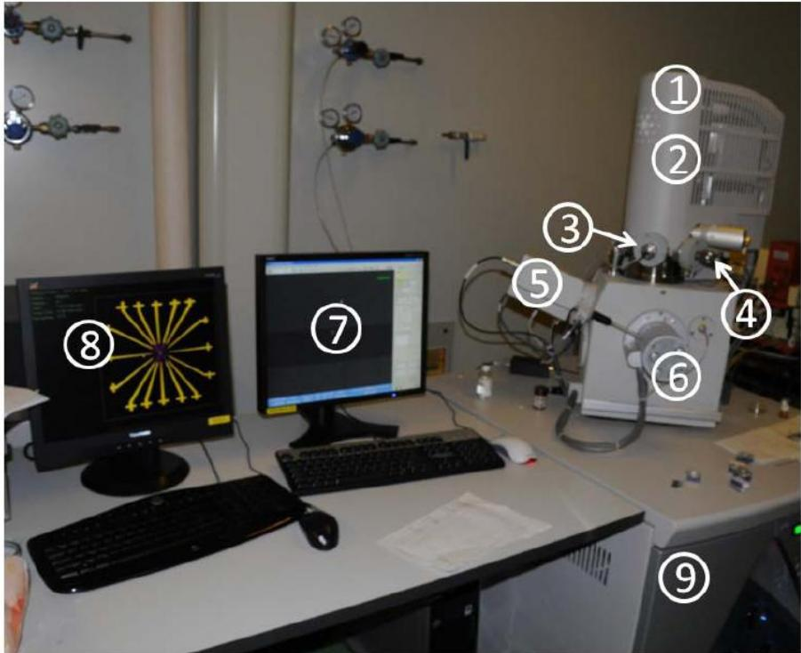

图2.4 扫描电子显微镜 (SEM) 和电子束直写（EBL）装置。各组件为:1 高压电子束发射源 2 各级电学透镜 3 扫面电子显微镜光阑 (光阑的开关构成曝光图样) 4 纳米图形产生系统 (Nanometer Pattern Generation System,NPGS)控制系统，用于产生光阑图形5CCD探测器6样品位置调节装置(手动在x,y,z 三个方向调节) 7SEM 控制主机 8NPGS 控制主机 9SEM 机柜  
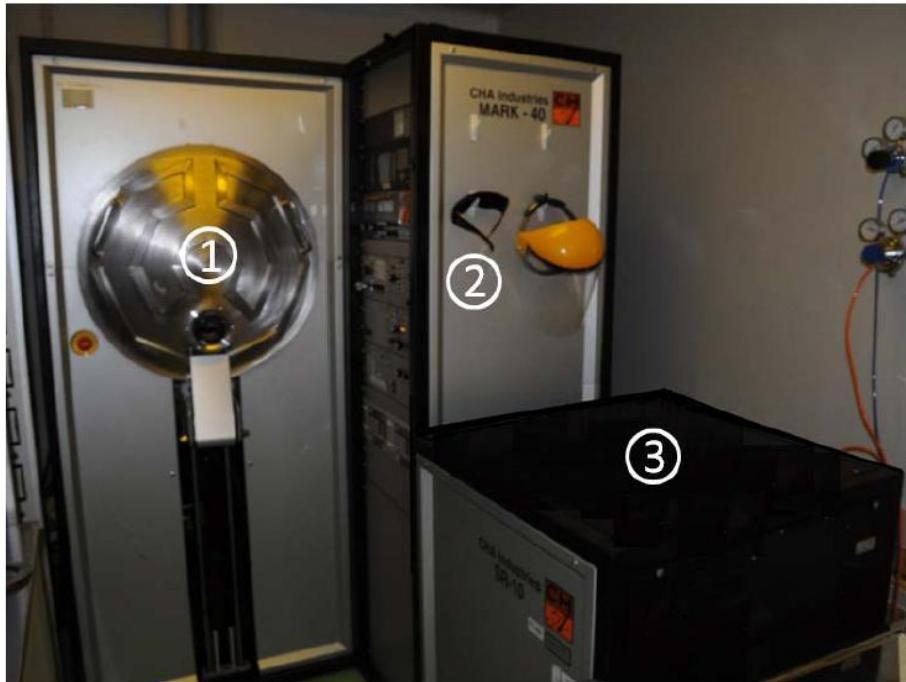  
图2.5 CHA 40 电子束蒸发镀膜机。1 蒸发腔室。样品和待蒸发金属都放置在腔室中 2 参数控制柜，控制镀膜时的金属种类，速率，先后顺序，蒸发电子束轨迹等参数3 高压控制系统，用于产生电高压。

24pin 商业化 socket。如上一节中所述，我们将样品焊接在 plug 上 (如图 2.8 c)，并插入初测杆底部socket中。注意初测杆顶部的所有接头需要用50Ω接头接地，以防止对样品造成静电电击。拔下所有欧姆接触电极的接头，测量任意两个欧姆接触电极之间的电阻。一般来说，不推荐使用手持万用表一类的测量工具，因为手持万用表自动换挡时可能有产生电压跳变。推荐使用锁相放大器或者专门的万用表来实现测量。电阻的大小通常应在 10kΩ 左右。如果太大 (几百 kΩ)或太小 < 1kΩ，则可能有问题。不过室温下测量的结果并不是特别重要，即使不是太理想，也可以继续在液氦温度下测量。测量完毕后，安装上所有的接地接头。

液氦温度下。将初测杆分次缓慢插入液氦杜瓦，大约 20 分钟内完成。不要太快，以防止温度突然降低，造成银胶碎裂，样品脱落。我们进行如下测量：

1 如室温中同样操作，测量两个欧姆接触之间的电阻。通常我们测得的电阻值在3kΩ，一般来说这个电阻越小越好。

2测量表面门电极之间是否短路。(不应短路)

3欧姆接触和表面门电极之间是否导通。(不应导通)

4 门电极是否能排开二维电子气。对于双量子点来说，我们特别关注，两个量子点之间能否形成足够的势垒，完全阻断电流；单个量子点和源漏电极之间能够形成足够的势垒，完全阻断电流。如果不能，那么这块样品一般不能使用。完全阻断电流的电压我们也称为截止电压，不同的样品，截止电压也不同。但对于GaAs 异质结半导体量子点来说，通常在-0.5V 到-1V 左右。

最后，我们用图（2.6）和 (2.7) 来总结一下整个流程。图 (2.6) 中，蓝色部分代表晶圆，其中的白线代表二维电子气，红色部分代表光刻胶，黄色部分代表光刻版，咖啡色和黑色部分分别是欧姆接触电极和表面电极。电子束曝光部分没有在图(2.6) 中说明。如图(2.7d) 展示了电子束曝光的结果。

如果上面一切操作都没有问题。那么这一批制作的量子点可以放入稀释制冷机系统，开始真正的试验了。

## 2.6 实现mK量级的极低温环境和测量1（稀释制冷机简介）

量子点需要很低的温度，量子效应才能够展现出来。所以通常我们需要极低温实验技术。

液态氦的沸点是 4.2K，利用 He-4 泵减压制冷，最低可以达到略高于 1K的温度。同样原理，如果制冷剂换做 He-4 的同位素 He3，最低可以达到略高于200mK 的温度。为了达到 10mK 水平的温度，现在通常使用的是稀释制冷技术。稀释制冷技术（稀释制冷机）的原理由 H.London 于 1951 年提出，十余年后制造成功。两种氦的同位素（He-3 和 He-4）混合后，降低到关键温度（约800mK）以下时，两种同位素分成不同的相。较轻的称为“集中相”，主要是He-3；较重的称为“稀释相”，主要是 He4 （“集中”与“稀释”相对 He3 而言）和 6-7% 的 He-3。利用 He-3 泵在稀释相自由表面（这个位置称为 still，温度约为 0.7K，此时 He-3 的蒸汽压约是 He-4 的 1000 倍）减压制冷，集中相的He-3 将向稀释相中扩散。He-3 在两种相中的熵不同，因此当 He-3 从集中相向稀释相“蒸发”的时候可以实现制冷。

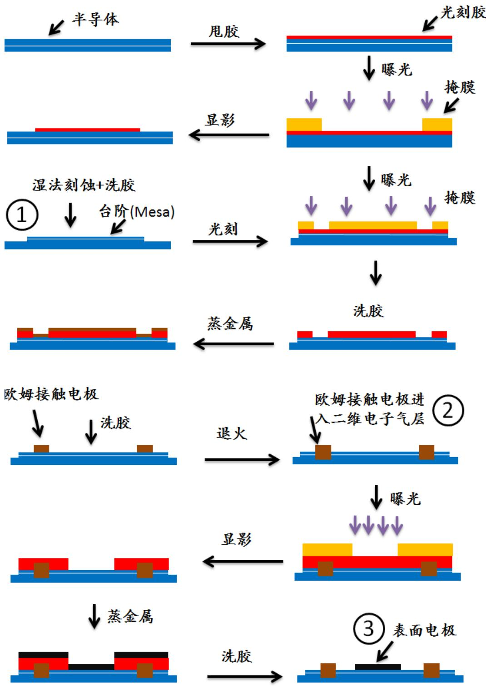  
图2.6 到电子束曝光之前，整个流程示意图。红色部分代表光刻胶，黄色部分代表光刻版，咖啡色和黑色部分分别是欧姆接触电极和表面电极。圆圈内的 1,2,3与下图的 1,2，3对应。

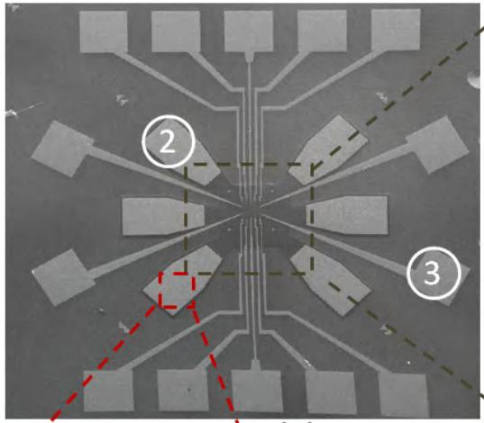  
(a)

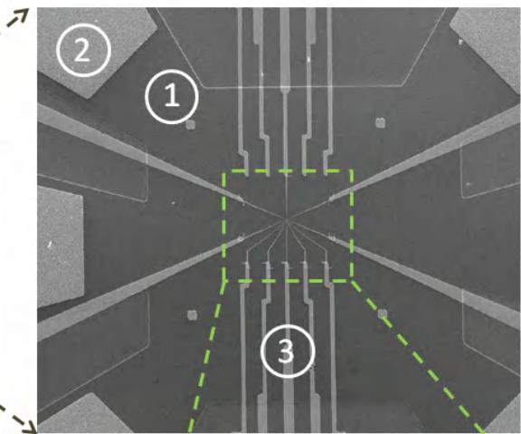  
(b)

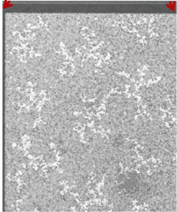  
(e)

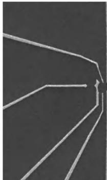

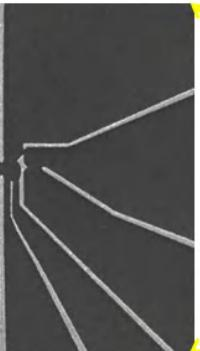  
(d)

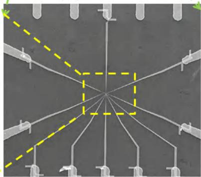  
(c)  
图2.7 (a) 是整体效果图 (b) 是局部放大图，图中绿色方框外围四个小方形位置，就是电子束曝光对准标记 (c) 是电子束曝光部分图 (d) 是双量子点核心区域电极，最细处大约在 10nm。电子束曝光电极和光刻曝光电极交接处，存在一些 Z 字形图样，目的是防止对准时出现偏差，增加二者接触的可能性 (e) 是欧姆接触电极退货后表面形状，坑洼不平。圆圈内的 1,2,3，分别对应着Mesa，欧姆接触电极和表面电极。

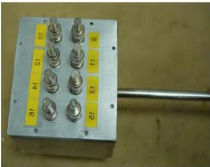

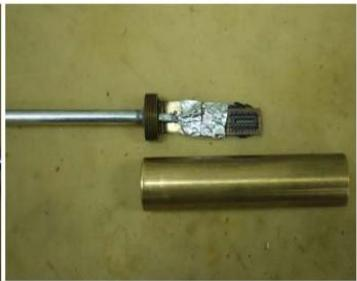  
图 2.8 (a) 和 (b) 是我们自制的测量杆。(c) 是我们购买的初测用的 chip-carrier(也就是 plug)。样品用银胶粘在中央，并用 bonding machine 完成 bonding 操作。

这里我们使用的是牛津仪器公司商业化生产的稀释制冷机 Triton-300。安装完毕后，基本的结构如图(2.9)。

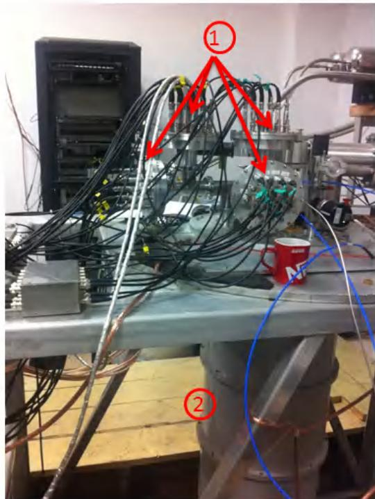  
图2.9 照片中是我们购买的 Triton 300 型稀释制冷实际改装完成照片。1 是我们自制的真空密封法兰，使用真空 BNC 接头与外界相连。2 是稀释制冷机杜瓦。

传统的稀释制冷机工作时需要液氦来提供 4.2K的环境温度，然后在此基础上开始稀释制冷循环。而我们使用的无液氦 Triton-300 型稀释制冷机，利用多级脉冲管制冷机完成原本需要液氦来完成的预冷工作。考虑到液氦价格昂贵且供应不稳定，这种产品的好处是显然易见的。这款稀释制冷机的基本结构包括五层冷板，按温度从高到低依次为 70K，4.2K，800mK，100mK，10-20mK。实验中所需要的样品，就被固定在最低温的冷板上。

(a)  
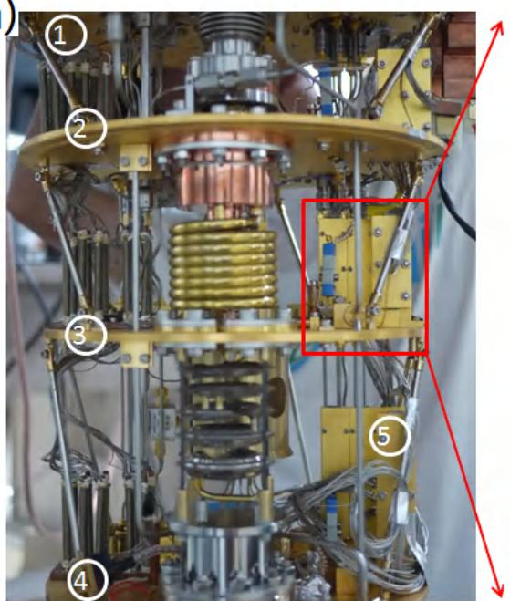

(b)  
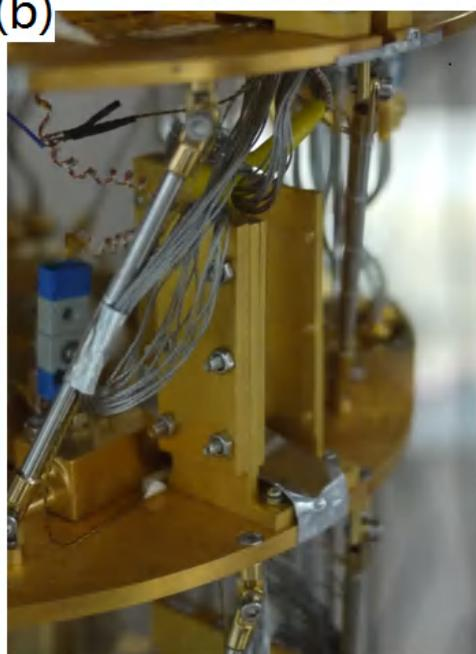  
图2.10 (a) 展示了移除杜瓦外壳和全部冷屏后暴露出来的内部结构。1-4 分别是4.2K 冷盘，still 冷盘，100mK 冷盘，Mix Chamber 冷盘。5 是我们自制的线夹式热沉。(b) 是线夹式热沉的大图。可以看出是由多层热沉板通过螺丝固定在一起，形成的三明治结构。线路从中间反复穿过。热忱表面镀金，以保证热导和平整度。

## 2.7 实现mK量级的极低温环境和测量2（一个改装实例）

在量子计算实验物理学领域，特别是基于半导体或超导结构的物理实验中，需要探测的物理量都极其微弱。以电流为例，一般为几个到十几个 pA，因此对实验中的噪声要求极小，能否尽可能的降噪，是实验成败的一个关键要素。同时，随着两比特甚至更多比特实验的推进，对样品的测量需要更多的电极。以后文中我们将提到的 GaAs 半导体异质结两比特量子点为例，典型的样品已经需要 24 根引线（直流电控制和测量部分），由于极低温实验仪器价格昂贵，单个仪器的负载不能无限提高，因此日益增长的需求对实验设备的使用效率提出了挑战。

这里，至少有两个基本问题需要解决：

（1）样品所在环境温度和热噪声。 该领域对于极低温设备和极低温环境的需求非常高。由于极低温设备结构复杂且在实验室级别难以自制，通常实现这一条件的方法是购买商用极低温制冷机。目前一个先进的制冷机型号是 Oxford公司生产的 Triton 系列稀释制冷机。该型号核心参数为：混合室 (温度最低处)温度 10-20mK。该型号制冷机无需液氦作为制冷机，结构较以往产品更为简单，放置样品空间较大。但是价格昂贵，占用的空间也不小。故而当前在如上所述的试验中，一个基本的要求在于：希望实现对制冷机效率利用的最大化，在制冷机中放置更多的样品；同时，放置更多的样品意味着引入更多的控制/测量引线，所有引线的一端在样品上，另一端最终与室温相连。引线越多，稀释制冷机的热负载越大，对核心参数的偏离也越大。因此，需要解决的一个问题是，在于在对混合室温度无较大影响（温度升高不超过 10mK，不引入更大热噪声）的情况下，设计一种热沉（heatanchor）结构，实现对稀释制冷机制冷效率利用的最大化。

（2）电路噪声。测量和控制设备的输出端口、线路两端的温度梯度（室温- 接近绝对零度）、线路焊接处不同金属材料，都有可能带来电路噪声。其中高频噪声会使样品中电子温度升高，同时由于实验中需要施加高频信号（几到几十个 GHz）来进行操作，直接干扰了操作脉冲信号。考虑到该类实验需要的严格的信号质量，因此很有必要通过设计合适的滤波电路来降噪。同时，由于核心电极的宽度最小只有 20nm，因此在将样品从制作间向稀释制冷机转移安装的过程中, 轻微的脉冲放电或者电压源的突然掉电，完全可能将电极击穿，需要降噪电路同时起到保护电路的作用。

为了解决这两个问题，我们设计了一套结构, 包括三个部分：热沉部分，铜粉滤波部分，PCB板载滤波器部分。下面依次介绍这三个部分。

热沉部分：实验中，我们使用 Lakeshore SS1 微型同轴线作为控制和测量线。这是一种带屏蔽层的不锈钢同轴线，信号质量要比普通的漆包线更好，但也意味着更大的截面积和热负载。我们设计了一种夹板热沉。多层夹板之间可以像三明治一样夹起来，夹板之间设计了供线路穿过的线槽，信号/控制线可以来回反复穿过热沉中间的布线槽。夹板最后固定在稀释制冷机相应的冷板上。线从室温进入热沉部分，依次通过五层热沉至稀释制冷机混合室冷板。离开最后一级冷板后，焊接在 25Pin D 型接口上，D 型接口与铜粉滤波器 D 型接口入口相连。经过铜粉滤波器后，由铜粉滤波器 D 型接口出口离开，通过一段lakeshore SS1 线后，通过排针接口进入 PCB 板载滤波电路，并最后进入样品。热沉部分用以对测量/控制线路提供充分的热交换，使得该处的测量/控制线路的温度降低到与冷板温度一致，从而降低热噪声。热沉部分由 PT1 层，PT2 层，Still 层，100mK 层级，MC 层级五层极热沉组成。每层热沉通过多层夹板，延长热交换线路的长度。夹板全部镀金以增强平整度和热导，如图（2.10）。

铜粉滤波器部分：对于极低温下 GHz 水平高频信号滤波，铜粉滤波器是一种有效的工具 [58; 59]。测量和控制线路经过热沉到达稀释制冷机最下层（MC层）后，由于测量和控制设备的输出端口、线路两端的温度梯度（室温 - 接近绝对零度）、线路焊接处不同金属材料等影响因素，线路中仍然存在一定的噪声，直流信号必须进行滤波才可以保证纯净。传统 RC 滤波器和其他商用贴片滤波器，性质最优秀者也无法达到 3G 以上的滤波效果。而这个频率及之上的频率，正是半导体量子点进行高频操作时所使用的典型频率段。高频操作信号经由专门高频线路进入样品，因此直流部分中不应有高频噪声。在 GHz 波段，需用铜粉滤波器部分用以提供对直流线路中噪声信号进行压制。我们使用直径50um 的青铜粉末和环氧树脂粘合剂制作铜粉混合物作为填充物, 使用 25pin-D型接头作为线路进出口，如图（2.11）。

PCB 板载滤波器部分：PCB 板载滤波器用以两个用途：（1）PCB 板载滤波器是保护电路。在样品固定在紫铜底座，并通过 bonding 线与 PCB 板 bonding端连接后，有一段从微纳加工车间到稀释制冷机上转移的过程。该过程中轻微的脉冲放电，都有可能击毁样品。因此需要板载滤波器作为高频脉冲信号的保护电路。用以保证样品在转移过程中的完好。（2）由于铜粉滤波器的工作特性，1G 以下的低频噪声无法通过铜粉滤波器进行滤波。此时需要传统的 RC 滤波器和其他贴片滤波器配合来实现滤波效果。我们使用 DC-300MHz 低通 RC 贴片滤波器和 DC-1GHz 的铁氧体磁珠低通滤波器来覆盖 1GHz 一下的噪声，如图(2.12)。当然，我们承认，极低温下的滤波性质，无法和常温下的滤波参数一致，甚至可能有很大偏差。但是实际使用效果还是令人满意的。

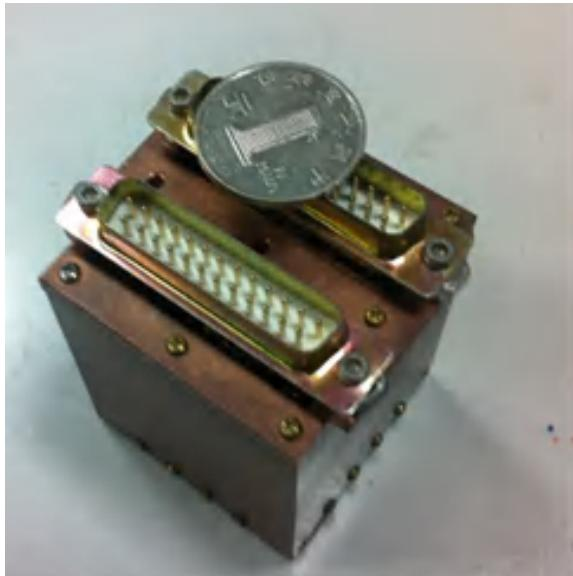  
图2.11 自制铜粉滤波器。1 元硬币作为尺寸参照物。采用 25pin-D 型头作为借口。一路进一路出。

综上，以上三个测量部分以热沉 -铜粉滤波器 -PCB 板载滤波器级联的方式组合在一起。包括以下几个特点：

（1）传统使用漆包线或双绞漆包线作为测量和控制线，此类线无屏蔽，易于受到外界高频信号的干扰，在密排情况下会增加线路间串扰，直接影响皮安级别极微弱电流的测量结果。我们使用的 Lakeshore SS1 本身的不锈钢屏蔽层具

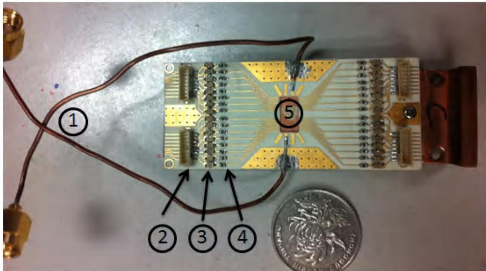  
图2.12 自制PCB板载滤波chip-carrier。1是软质高频线及接口2是普通直流控制测量线路 (lakeshore SS1) 插头 3 是 RC 贴片滤波器 4 铁氧体磁珠滤波器 5是样品放置的位置。

有阻断线路之间串扰的效果。

（2）尽管 lakeshore SS1 线的截面积（49mm2）远大一般漆包线（9mm2），造成了严重的热负载，这里我们设计的多层线夹式热沉为线路提供了足够的热交换长度，能成功解决同时在稀释制冷机中放入一百根以上的 lakeshore SS1 测量/控制线后给系统带来的额外热负载问题。对最低温度的影响不超过 5mK。完全可以至少为 4 块典型的半导体两比特量子点样品提供足够的测量线路和实验温度环境；且结构简单，固定测量/控制线时十分快捷方便，节省了宝贵的实验时间，保证了稀释制冷机使用效率的高效性。

（3）传统的铜粉滤波器如果同时为 25 路直流信号滤波，体积过大，故无法放入稀释制冷机中，通常在稀释制冷机外部作为滤波器，因而对稀释制冷机内部进入线路的噪声无能为力。本发明中，采用绕线柱间共用滤波铜粉的方法和改换 SMA 接口为 25pin D 型接口的办法，成功地将铜粉滤波器的体积缩小到可以放入稀释制冷机最底层的程度。从而可以近乎直接与样品相连，提高了滤波的实际效果。

（4）传统所使用的 PCB 板仅仅为样品提供与测量/控制线路相连的通道，这里使用 PCB 板载滤波器，能够直接在距样品最近的地方完成滤波和保护两个作用。

此外，在稀释制冷机外部，如图（2.9）我们制作了喇叭状的铝制接线盘，通过法兰面密封。盘面制作了 25 个 BNC接头，用来将外界的 BNC 线接入稀释制冷机内部的线路。通过这样一个改装，量子点源漏极（source to drain）之间噪声实际效果可以在500fA 以下。

## 2.8 本章小结

本章包括两个主要部分：

1对半导体量子点样品的加工。分五个节，罗列了如何利用现代半导体微纳加工技术完成半导体全电控量子点加工的整个工艺流程，并解释了的基本的操作含义。同时，制作中要涉及的一些需要注意的地方也做了说明。制作样品的工艺一旦确定，对实验者提出的要求也只剩下熟练和耐心，但这也只有在反复的制作中才能得到足够的训练，以积累足够的经验来保证较高的成功率。

2低温实验平台 半导体加工技术和极低温技术可以认为是该实验领域的两大技术基础。分两个节，以 Oxford Instrument 公司的 Triton-300 为例，罗列了如何改装一台稀释制冷机的整个工艺流程。

到此，我们制作了完成一个半导体量子点样品，并准备好了相应的测量平台。从下面一章起，我们开始量子点上的实验。

## ㅢ 3 章 双量子点中的光子䖻ࣟ䳝サ

光子辅助隧穿（Photon-assisted-tunneling，PAT）是一种研究量子点中能谱的有力工具 [60–62]。通过向样品施加微波信号，我们在 GaAs 双量子点样品上完成了一个光子辅助隧穿实验。在电子温度（>1K）远大于晶格温度（250mK）时，我们观察到至多14阶光子过程。同时我们还观察到了LZS干涉的特征。另外一方面，我们测量了在大功率微波信号下，电子电荷态的弛豫时间 $T _ { 1 }$ 。结果约为8ns，这与之前人们观察到的一致。从而证明了在高功率，高电子温度下的弛豫时间 $T _ { 1 }$ 几乎不变。

## 3.1 实验的动机和准备

由静态电势阱定义的半导体量子点是研究二能级体系下的电荷和自旋量子比特的一种优秀的平台 [63–67]。再众多的操作技术中，微波信号激励下的输运谱测量，也就是光子辅助隧穿，是一种研究量子点中能谱和动态过程的常用工具。我们研究了双量子点中电荷态在非常大功率微波信号下的行为。在很强的激励（如这个实验中使用的 10dbm 或更高），电子温度已经远远超越了晶格温度，不再处于热平衡的状态。介观系统中非热平衡现象已经引起了许多的关注，这是因为现在的电子器件尺寸已经非常小，比较容易被外界引导到非热平衡状态。电子温度与晶格温度显著不同时，两能级体系的动力学过程（比如电荷态的弛豫过程）强烈地引起了我们的兴趣。

## 3.1.1 对样品的基本描述

我们的样品材料是 $G a A s / A l _ { 0 . 3 } G a _ { 0 . 7 } A s$ ，二维电子气曾大约在晶圆表面下 100nm 左右。晶圆的基本参数是：电子密度 $2 . 0 \times 1 0 ^ { 1 1 } c m ^ { - 2 }$ ，迁移率 $6 \times$ $1 0 ^ { 4 } c m ^ { 2 } / V s$ 。如图 (3.1)

这是实际测量样品的 SEM 照片。其中表面电极 1-7 用数字做了标记；8 和9 和欧姆接触联通。在半导体量子点领域，通常这样称呼各个电极：1 和 5 称作barrier gate， 因为它们的作用是在量子点和电子库之间制造和调节一个 barrier，以调节电子和电子库之间的耦合强度；2 和 4 被称作 plunge gate，通过在电极上施加负电压，改变量子点中电子的静电势，排出电子。5 和 6 被称作 middlegate， 用处是调节两个量子点之间的耦合强度；7 被称作 QPC gate，作用是调节QPC通道的形状，使得QPC 工作在合适的区域。

(a)  
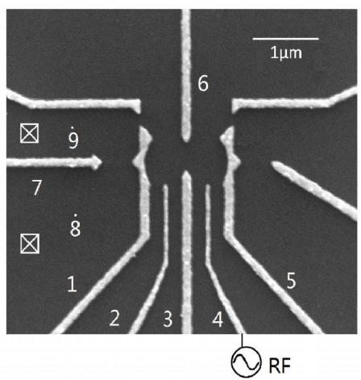

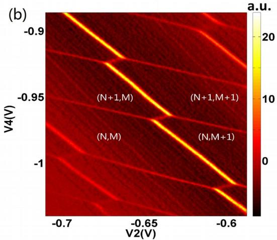  
图 3.1 (a)Ti/Au 电极 1-6 定义了一个典型的双量子点结构。电极 7 称为 QPC 电极，用来调节 QPC 通道。电极 2 和 4 称为 plunge gate。电极 1 和 5 称为barrier gate。电极 3 称为 middle gate。QPC 电通通过源极 8 流向漏极 9(数字上方加一点表示连接到欧姆接触)。

## 3.1.2 He3-低温平台

实验中实现低温环境的平台是 He-3 制冷机（Helium3 refrigeration ），型号为 Heliox VL，Oxford Instrument 公司制造。这种 He-3 制冷机通过吸附泵对液态He-3 蒸发气实现减压制冷，可以实现的最低温度是 240mK。通常可以在这个温度下维持 3 天左右。等待液态 He-3 耗尽，需要加热到 10K，放出吸附的气体，重新冷却成液体He-3。如图（3.2）

我们使用的 He-3 制冷机为插入式，整体形状如同一根长杆。其中 1K 池（1-Kpot）部位通过吸取He-4减压制冷来实现1.4K左右的预冷。我们在He-3机适当的位置上安装若干紫铜柱作为热沉，并将测量和控制线（Lake shore-SS1）绕行固定在紫铜柱上。样品最终固定在 He-3 壶的位置。He-3 制冷机整体插入一个液氦杜瓦中。

## 3.1.3 测量方法

为了测量 1pA 量级的信号，我们使用锁相放大器（Lock-in;type：StanfordSR830）作为基本仪器。

量子点输运测量：如前“蜂窝图”所述，将激励信号（µV 量级）加载在源漏测量通道上，直接探测通过测量源漏之间的锁相电流，可以读出量子点系统内电子电荷状态。激励信号的频率通常是十几到两百这个区间，注意需要避开50Hz 及其倍频。不同的激励频率下，信噪比可能会略有不同。如果愿意，可以通过扫频来寻找感觉最好的信噪比位置。这种方法被称为量子点输运测量（transport measurement）。如图（3.3）。它的局限性在于：

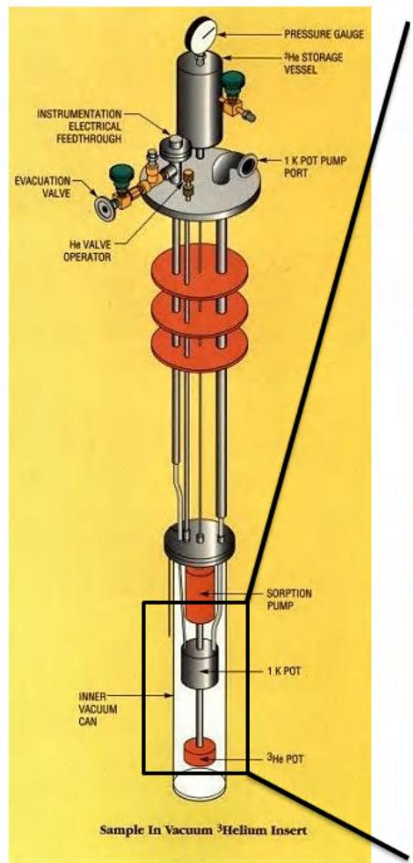

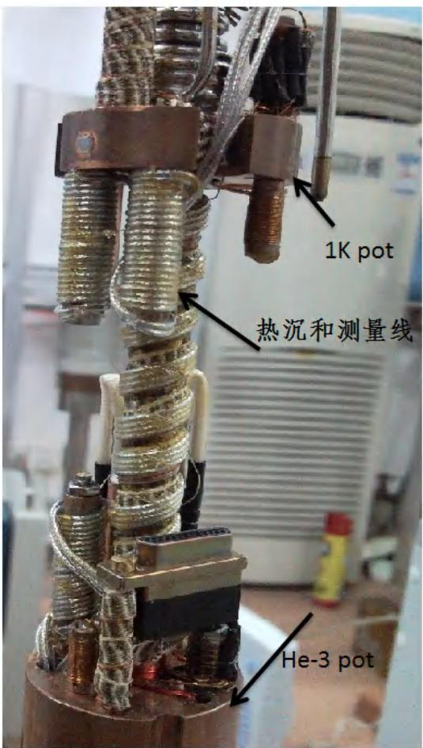  
图3.2 ((a)是He3制冷机的基本结构图，其中方框的实物部分如(b)。(b)中表示了 1K pot 和 He3 pot 的位置，二者的温度分别是 1.4K 和 240mK。我们这里使用的是柱状热沉结构，测量和控制线通过绕线的方式固定在热沉结构上。

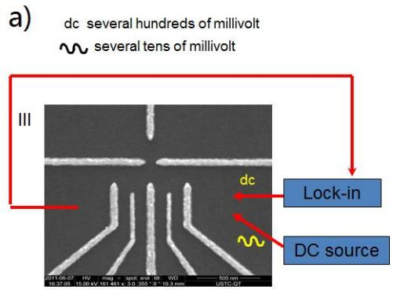

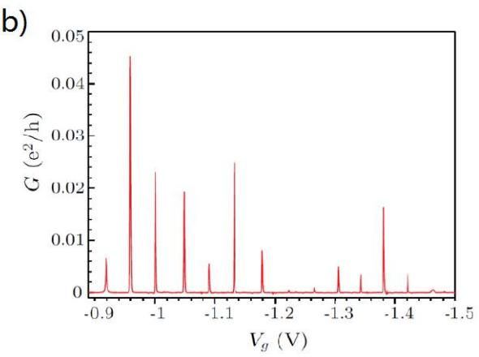  
图 3.3 (a) 样品的基本电路图，QD transport measurement (b) 展示了实际的测量结果。

1 虽然我们能够通过库伦阻塞读出电子的变化，但是当量子点中电子和电子库的隧穿几率太小时，我们就很难测量到这个电流信号。举个例子，假如这个跃迁几率在 600kHz，那么对应的电流就是 100fA。就我们小组目前的技术来看，这就是噪声的水平。

2 量子点与源漏极电子库之间的耦合意味着退相干和弛豫。对于量子计算来说，这是我们不希望看到的。通常，我们希望量子点工作在所谓的“少电子，源漏弱耦合”区域，这样才更接近标准的两能级体系。这时候就需要不依赖源漏耦合的量子点接触测量。

## 量子点接触（quantum point contact，QPC）测量

通过在 QPC 电极上施加电压，我们可以在二维电子气层形成一条狭窄的通道，从欧姆接触 8 通向 9。这就是 QPC 通道。如前所述，QPC 通道电流（亦即电导）大小受到量子点中电荷状态的影响。我们将量子点源漏之间偏压设置为零（直接接地， $\mu _ { S } = \mu _ { D } )$ 。扫描一个电极 2，当量子点中电子数目改变时，QPC通道中的电导也会产生跳变。由于表面电极和QPC通道之间电容耦合的存在，跳变可以看成一个标准的台阶和一段本底信号的叠加。这种方法被称作量子点接触输运测量[68]。如图（3.4）

a)  
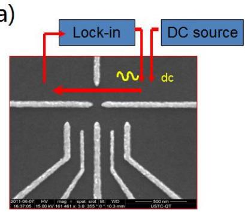

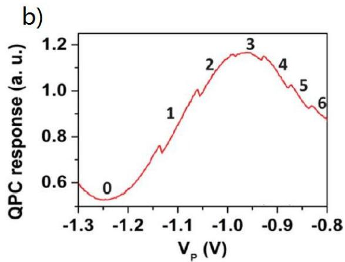  
图 3.4 (a) 样品的基本电路图，QPC transport measurement (b) 展示了实际的测量结果。

假如我们将激励信号放大一千倍（mV），并将激励加载在电极 2 上，仍然读取 QPC 通道的源漏电导，此时测得的是微分电流信号 $d I _ { q p c } / d V _ { g a t e }$ 。这种方法被称作量子点接触调制信号（Modulation）测量。如图（3.5）

如图（3.6），展示了三种不同的测量方式，从上到下依次是量子点输运测量，量子点接触输运测量，量子点接触调制信号测量。可以看出，对同样的扫描电压过程，电导出现跳变的位置完全一致。在利用 QPC 测量的两种方法里，相比较而言我们更偏好量子点接触输运测量。原因在于如图（3.4）所示，我们更容易取出本地信号，从而在量子点中电子数目变化时得到一个近似台阶的电导变化。后文会说明，这种台阶具有一定的坡度，对应了两个电荷态 0 和 1 之间的不同几率。如果我们对如图（3.5）曲线进行积分，理论上也能得到类似的结果，但实际操作中，由于本地信号的形状比较复杂，效果并不总是理想。

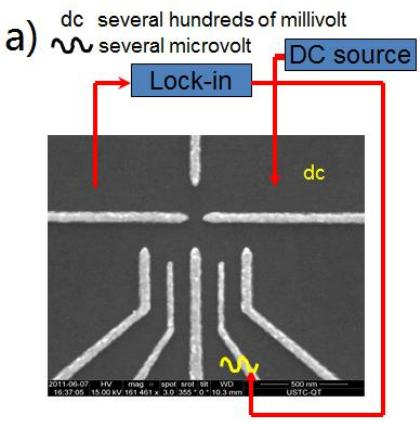

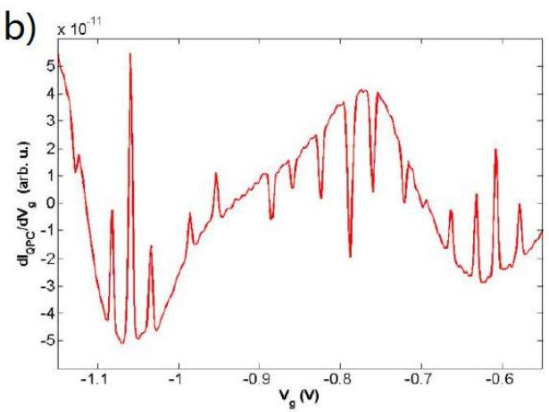  
图 3.5 (a) 样品的基本电路图，QPC modulation measurement (b) 展示了实际的测量结果。

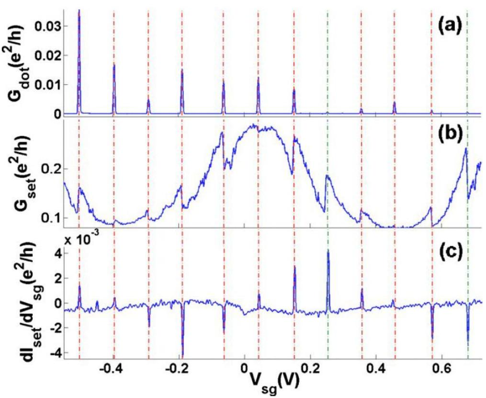  
图3.6 三种不同测量方式的直接比较。可以看出，这几种方法对量子点中电子数目变化时的相应位置完全一致 [69]。

## 3.1.4 测量 level-arm 和电子温度

我们在表面电极上施加 1V 的负电压，量子点中的电子并不会获得 1eV 的能量，而是远小于此的能量。通常这个比例系数称为 level-arm。测量 level-arm的方法是前所述的库伦菱形。如图 (3.7), 库伦菱形的角度就是 level-arm。通常，GaAs 半导体量子点中的 level-arm 值是：plunge gate 0.05，barrier gate 0.1。当然这个值只是一个参考。需要测量哪个电极的 level-arm，就利用哪个电极排出量子点中的电子，并绘制和源漏电压关联的库伦菱形图。这是这里的基本方法。

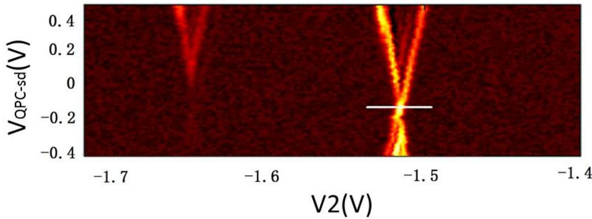  
图 3.7 测量电子温度的方法。如图中白线标记源漏偏压 $V _ { s } d = 0$ 处，测量点到峰的半高宽。

样品所在的环境温度取决于制冷机。通常稀释制冷机可以提供 20mK环境，He-3 制冷机可以提供 240mK。样品的晶格温度可以冷却到环境温度的水平，但是由于各种噪声（外界电路噪声、散粒噪声等等），电子温度实际上要比晶格温度高。我们的实际测量经验表明：稀释制冷机中，电子温度通常为 100mK左右；He3 制冷机中通常在 300mK 左右。测定电子温度的方法依然是利用库伦菱形。量子点源漏 $V _ { S D } = 0$ 时，如图（3.7），测量 $V _ { s d } = 0$ 时（白线所示位置）电导峰的半高宽（full width at half maximum，FWHM）。 把宽度（电压）利用level-arm系数折算到能量E。这里电子温度 $T _ { E }$ 满足 $E = 3 . 5 k _ { B } T _ { e \circ } ~ k _ { B }$ 是玻尔兹曼常数。

## 3.1.5 测量耦合强度 t

如前所述，在（N+1，M）和（N，M+1）之间的转变区域，双量子点形成了一个两能级体系。描述它的参数是失谐量 ϵ 和两个量子点之间的隧穿耦合 t。

隧穿耦合 t 控制了两个量子点中的电荷态从非局域到局域的转变。这种隧穿耦合的可调节性非常重要，它是驱动量子比特在 Bloch 球上旋转的关键。我们向负方向增加 middle gate 上的电压，相应地隧穿偶和强度也会随之变化。利用QPC 输运测量方法，沿着 detunning 的方向扫描，测量 QPC 的电导响应，我们能得到耦合t 的具体数值。

DiCarlo 等人于 2004 年提出 [30]，QPC 的相应和量子点间耦合强度存在关系：

$$
M = \frac { 1 } { 2 } [ 1 - \frac { \epsilon } { \sqrt { \epsilon ^ { 2 } + t ^ { 2 } } } \operatorname { t a n h } { ( \frac { \sqrt { \epsilon ^ { 2 } + 4 t ^ { 2 } } } { 2 k _ { B } T _ { e } } ) } ]\tag{3.1}
$$

其中M是表征了量子点中的电荷状态，在0（有一个电子在左边）和1（有一个电子在右边）取值。具体的步骤是：固定一个middlegate电压，将QPC测得的电导峰减去本底，形成有一定滑落宽度的的台阶状曲线。把电导曲线线性映射为（0,1）之间的数值。如前，电子温度已经测得。带入曲线拟合出 t[29]。如图（3.8）,

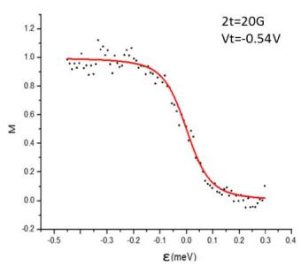

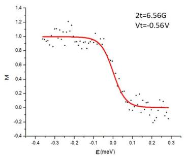

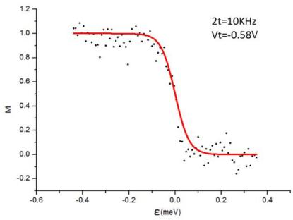  
图3.8 三种不同 middle gate(V) 电压时，测得的两个量子点之间的耦合强度。分别是 $V _ { t } { = } { - } 0 . 5 4 \mathrm { V } { , } { - } 0 . 5 6 \mathrm { V } { , } { - } 0 . 5 8 \mathrm { V }$ 时，耦合强度分别为 20GHz，6.56GHz，10kHz。可以看出，随着增加 middle gate 上的负电压，我们实现了对两个量子点之间耦合的调节。

middle gate 上电压依次为 -0.54V，-0.56V，-0.58V 时，测得的相应耦合强度为 20GHz，6.56G，10kHz。我们能够看出，耦合强度对于中间电极电压非常敏感。这是一个好消息，因为我们希望尽量小的电压变化，以免造成整个势阱形状有大的变动。

## 3.2 PAT 简介

在双量子点中，当电子能够以一定的速率，相干地从一个点隧穿到另一个点中时，系统的本征态就不再是非局域的，而是扩展到整个双量子点系统。一般来说，耦合双量子点中的电子是个多体问题，而多体问题常常是很难处理的。

因此，我们通常只考虑每个点中最高的占据态，而忽略更低的能态，从而将系统简化成一个两能级体系。例如一个（N+1，M）到（N，M+1）的电荷态转变过程，我们直接将其简化为（1,0），（0,1）。幸运的是，两能级体系模型确实很有效。

如果我们对这个二能级体系施加一个额外的随时间变化的项，也就是$\epsilon  \epsilon ( t ) = \epsilon + V _ { a c } \cos 2 \pi f t ,$ ，则电子与能量为 $h f$ 的微波光子交换能量时，会导致电子产生一个非弹性隧穿过程。这样一种因为交换离散的能量单位 $( h f )$ ，而发生的非弹性隧穿过程，被称为光子辅助隧穿（Photon Assisted Tunneling, PAT）。对于研究量子点中的能谱来说，光子辅助隧穿是一种强有力的工具。Stoof和Nazarov 等人于 1996 年对 PAT 过程进行了理论研究 [70; 71]。假设 Γ(E) 是能量未施加交流信号时，能量为 E 的电子的隧穿几率。那么当时加一个交流信号$V _ { a c } \cos 2 \pi f t$ 时，隧穿几率为：

$$
\Gamma ( \tilde { E } ) = \sum _ { + \infty } ^ { - \infty } J _ { n } ^ { 2 } ( \alpha ) \Gamma ( E + n h f )\tag{3.2}
$$

其中， $\mathrm { n } { = } _ { \dots , - 2 , - 1 , 0 , 1 , 2 , \dots } , J _ { n } ^ { 2 } ( \alpha )$ 是第一类 n 阶 Bessel 函数的平方， $a l p h a =$ $e V _ { a c } / h f$ ，它描述了电子吸收或者放出nhf 个电子的几率。因此我们可以这样理解，单个电子和微波场耦合的效果是，原能级 E 劈裂成一些列能级 E+nhf。这就是 PAT 是一个研究能谱的有力工具的原因：PAT 过程只在能极差是 hf的整数倍，也就是吸收或放出整数个微波光子的地方才发生。如图（3.9）。

## 3.3 高功率下的 PAT过程

如图 (3.10)。此图是利用 QPC modulation 方法测得的电子电荷态为 (N,M)附近蜂窝图。其中，(N+1,M)和(N，M+1)之间，表征电子在左右两个量子点之间隧穿的“亮线”(也就是两个电荷态之间的隧穿线， intra-dot tunneling line) 清晰，是一个非常有希望看到PAT过程的区域。

我们使用连续正弦波信号发生器 (Agilent 8253D) 产生 GHz 量级的微波，微波功率定在 -5dbm。将微波信号通过半硬高频线加载在样品右侧 plunge gate(gate 4) 上。这里我们没有测量半硬线对高频信号的衰减作用，因为在 20GHz下，这个衰减不是很大，而且我们更关心的是功率和频率的相对变化量。

图 (3.11) 展现的区域位置和图 (3.10) 中一致，但由于外界微波信号的驱动，平行于 (N+1,M) 和 (N，M+1) 之间亮线的地方，出现了多条其他的线（如黑色虚线所标示）。这就是发生 PAT 效应的证据。这些多出的平行线，说明了 (N+1,M) 到 (N,M+1)(或相反) 的隧穿过程。这里最大光子过程的阶数可以通过数线的数目直接数出来。当微波频率为 12GHz 时，每边出现了 3 条 PAT 线。这与之前人们观察到的现象完全一致 [72; 28; 29; 73]。当微波频率为 15GHz 时，每边出现了 5 条 PAT 线。如图 (3.11b)。如果我们增加频率，也就是增加微波光子的能量，对应于电子向相应的电子库之间跃迁的线 (也就是库伦峰) 也会变宽。更大的微波光子能量意味着更高的电子温度，相应的本底电流噪声也会增大。这些因素在频率为30GHz时，显现出来。如图(3.11c)，在功率不变，只变频率的前提下，整个PAT过程的图样已经非常模糊了。

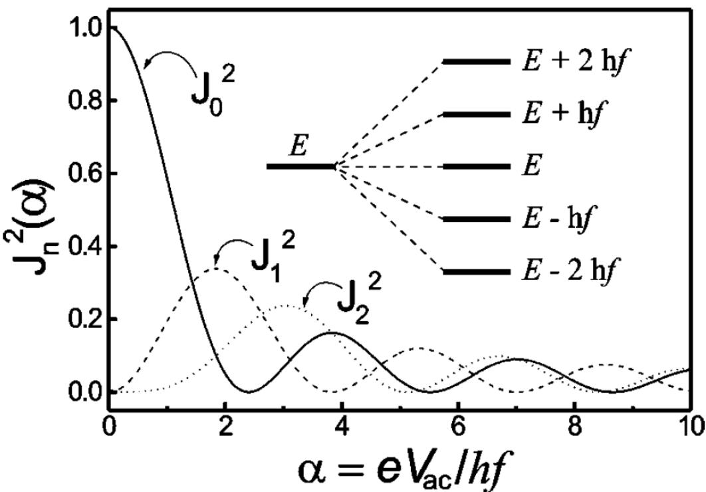  
图 3.9 第一类 Bessel 函数 $J _ { n } ^ { 2 } ( \alpha )$ ，inset 中显示了因为外界微波场的作用下，原能级劈裂成一些列能级。n>0 时，表示吸收光子；n<0 时，放出光子。n=0 对应一个弹性隧穿过程。图片引自[67]

为了确认这个过程是 PAT 过程，基本的方法是测量微波频率和相邻 PAT 线之间间距的关系。其形式为：

$$
\alpha \epsilon = \sqrt { ( h f ) ^ { 2 } - ( t ) ^ { 2 } }\tag{3.3}
$$

这里 α 和 ϵ 是相应参与扫描的电极的 level arm 和二能级体系的失谐量detunning；t是左右量子点之间的隧穿耦合强度，前面都已经介绍过。如图(3.11d)，我们 9GHz 开始，到 20GHz 为止，每增大 1GHz，测量两条相邻 PAT 线之间的间距（如图 (3.11 a) 中相邻黑色箭头之间间距），并按上述公式拟合，绘制成图 (3.11 d)。可以清楚地看出，当较大频率时，整个曲线接近线性。这充分证明了这是一个 PAT 过程。拟合同时可以得到 level arm 和 t 这两个参数，分别为

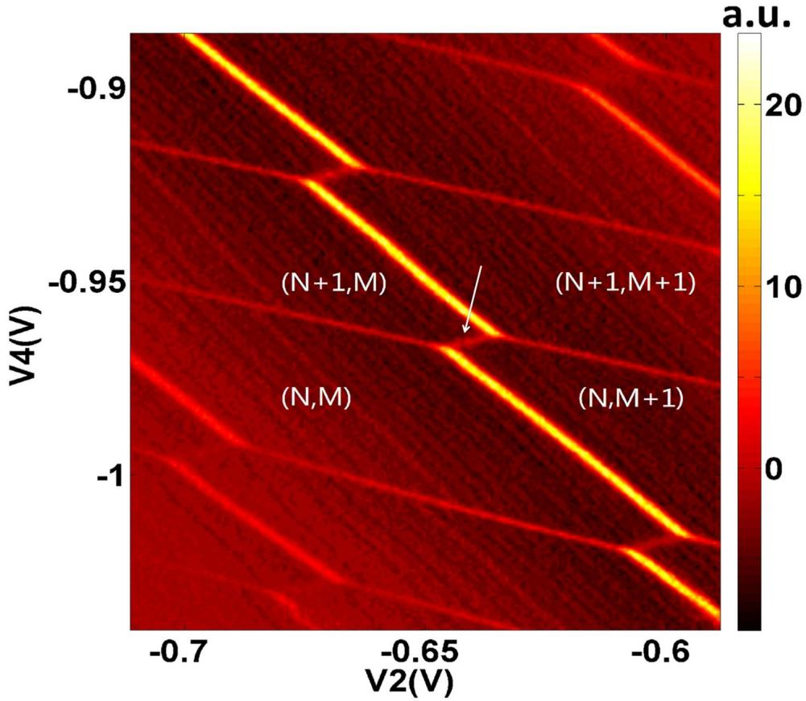  
图3.10 此图是利用 QPC modulation 方法测得的蜂窝图。展示了四个不同电荷态 (N,M),(N+1,M),(N,M+1),(N+1,M+1)。我们关心的就是 (N+1,M),(N,M+1) 的转变区域。之间的线表征了两个量子点中电子耦合隧穿 (白色箭头标示处)。

0.04 和 8GHz。功率为 5dbm 时，我们测量电子温度大约在 2K。电子温度可以通过拟合公式（3.1）的曲线来得到。(这里我们假定了，PAT 没有改变两能级系统中的参数t，所以我们先测得t，并根据曲线形状拟合的处电子温度)

这是一个较低功率情况下的结果。如果我们增加微波功率，那么一个电子吸收多个光子的可能性会增加，因此更高阶的 PAT 线也会出现。由于我们使用的极低温平台是 He-3 制冷机，实际操作中，较高功率 (比如几个 dbm) 情况下，微波会剧烈地加热 He-3 壶，导致 He-3 液体在一个小时左右的时间内就会蒸发完毕，系统被迫要升温。因此在较高功率的情况下，如果想要通过扫描一张蜂窝图来读出高阶 PAT 过程的情况，显然是无理的。因此，我们通过一种折中的办法，也就是扫描一条垂直穿过 intra-dot tunneling line 的线 (亦即沿着 detunning的方向)来研究高功率情况下PAT过程。通过这条线，我们可以提取出诸如隧穿电流大小，PAT 峰的间距和峰的数目之类的重要信息。在施加微波过程中，整个蜂窝图并不会有移动。所以我们可以固定这种扫描方式，改变其他参数，比如微波功率。通过分析在相同扫描方向下，不同参数的电流曲线，我们可以研究PAT过程的演化。

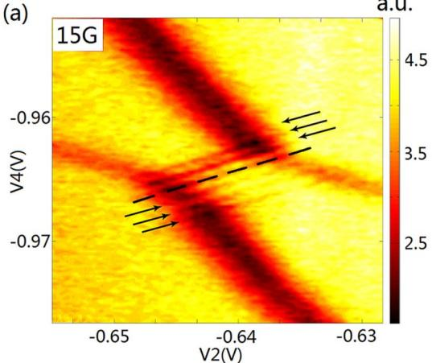

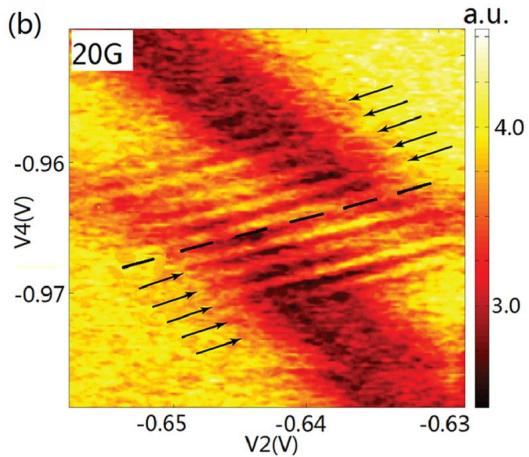

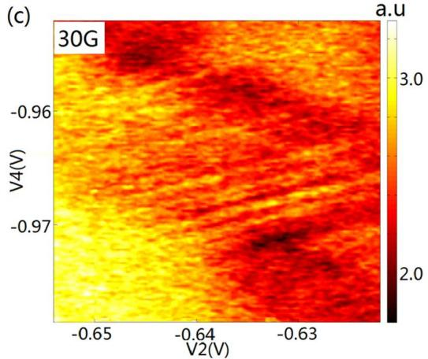

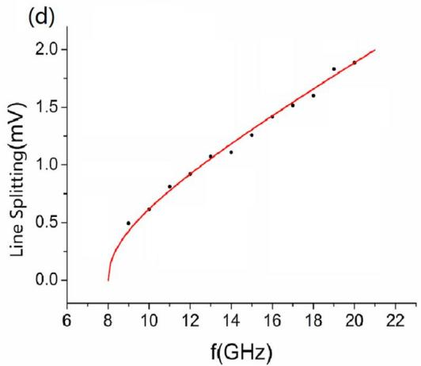  
图3.11 (a-c)是在功率为5dbm条件下测量的结果。在(a)和(b)中，黑色虚线指出了 $\epsilon = 0 ( 0 \gamma )$ 的位置。(a) 和 (b) 显示了不同频率下的 QPC 微分电流dI/dV 蜂窝图，在 12GHz 和 20GHz 情况下 $\epsilon = 0$ 两侧分别出现 3 条和 5条平行线。(c) 的微波频率为 30GHz，在这个条件下，量子点中电子到电子库之间的跃迁几率明显增大，对应的库伦峰也明显增宽，背景噪声也明显增大。整个图片变得模糊。(d) 通过拟合不同微波频率和 PAT 线之间间距的关系式，我们证明了这是一个PAT过程

如图（3.12），这是一条微分电流 (dI/dV) 曲线。横轴是 detunning 方向（蓝色虚线表示了 $\epsilon = 0$ 的位置），纵轴是读到的电流的大小。下面的实验中，我们将频率定在 ${ \bf 1 5 G H z , }$ ，改变功率。

功率为零时，我们可以发现，曲线的中央出现一个“谷”，它区分了两个不同的电荷态 (N+1,M) 和 (N，M+1)。功率增加时， $\epsilon > 0$ 区域出现了更多的 PAT峰。最多的峰 (14 阶) 出现在功率为 10dbm 时。为了增加信噪比，曲线上的每一个点都是读取了 10 次之后的平均值。如前所述，5dbm 时，电子温度大约在2K。因此，考虑到 10dbm 是 5dbm 大小的三倍，我们估计功率为 10dbm 时，电子温度大约在3-4K。我们相信这个估计是合理的。

我们考虑一个在一个振幅足够大的周期性势场中的两能级体系。在外界势场的驱动下，两能级体系中会发生连续不断的态的转变过程。在转变过程中，波函数会出现相位的积累 (也就是 Stückelberg 相位)，这会导致增强和消失的干涉图样。改变这个物理系统中的许多参数，都可能会导致这种干涉发生，这种干涉也称为 Landau-Zener-Stückelberg(LZS) 过程。它可以发生在多种物理体系中，比如在超导量子比特或半导体量子比特中 [74–76]。人们已经观察到了非常清晰地LZS 干涉过程。

在这种情况下，LZS 模型比 PAT 模型 (尽管我们施加的都是周期性微波信号，除了功率什么都没变) 更好地描述了我们观察到的现象。在图 (3.12) 中，不同功率下的曲线在电流上被连续地平移了 20pA，以方便我们清楚地画在同一张图片内。两条很短的平行线间所夹的高度 (6dbm 曲线) 定义为峰高 h，峰高 h会随着微波功率变化。观察 $1 \gamma$ 峰的高度 $( 1 \gamma$ 峰用红色虚线标记出来) 可以发现，$h _ { \gamma 1 }$ 从功率 -4dbm 到 4dbm 出现震荡。在 -4dbm，0dbm，4dbm 附近位置， $h _ { \gamma 1 }$ 几乎为 0。 $h _ { \gamma 2 } .$ 也表现出类似的行为 (没有画在图上)。当功率增加到 10dbm 时，7阶甚至更高阶数的PAT吸收峰都明显地出现了。

如前所述，由于条件所限制，我们没有时间来完成一幅完整的蜂窝图，如在超导库伯对盒子 (cooper-pairbox) 体系上过观察到的那样。但是，这些不同功率下的曲线存在着三个特征，这些特征证明了它是一个LZS干涉过程：

1 峰的高度随着功率的变化而变化，并在某些特别的功率位置，高度几乎为 0。

2增加功率时，更多的峰会出现。

3峰之间的间距完全一致。

这些特征强烈地说明了即使在电子温度达到数 K 的情况下，依然能够观察到LZS 干涉图样。

在我们使用的半导体异质结量子点中，PAT 过程可以看成是一种二能级体系的共振激发过程，我们可以从中抽取出电荷弛豫甚至退相干时间的信息。在量子计算中，我们关心的一个重要参数就是 $T _ { 1 }$ 时间。在两能级体系里， $T _ { 1 }$ 可以看做电子从高能级跃迁到低能级需要的时间。我们感兴趣的是: 在较高的电子温度下，弛豫时间 $T _ { 1 }$ 是否会变化？

为了测量 $T _ { 1 }$ ，我们首先要处理一下微波信号。我们使用一个混频器 (type：Marki M80420MS 1120) 和一个信号发生器 (type：Agilent E8257D) 来实现一个斩波器。斩波器的功能是是原来连续的正弦微波信号，变成一半时间 τ 是正弦微波信号，一半时间 τ 内是 0 电平，如图 (3.13 inset)。测量时，使用之间所述的 QPC 输运测量的方法，这样能够很容易地讲电流大小处理成电荷态的分布值(0,1 之间)。我们定义在某个 τ 时间的电荷分布值与 $\tau = 0$ 的电荷分布值之比为$M ( \tau )$ 0

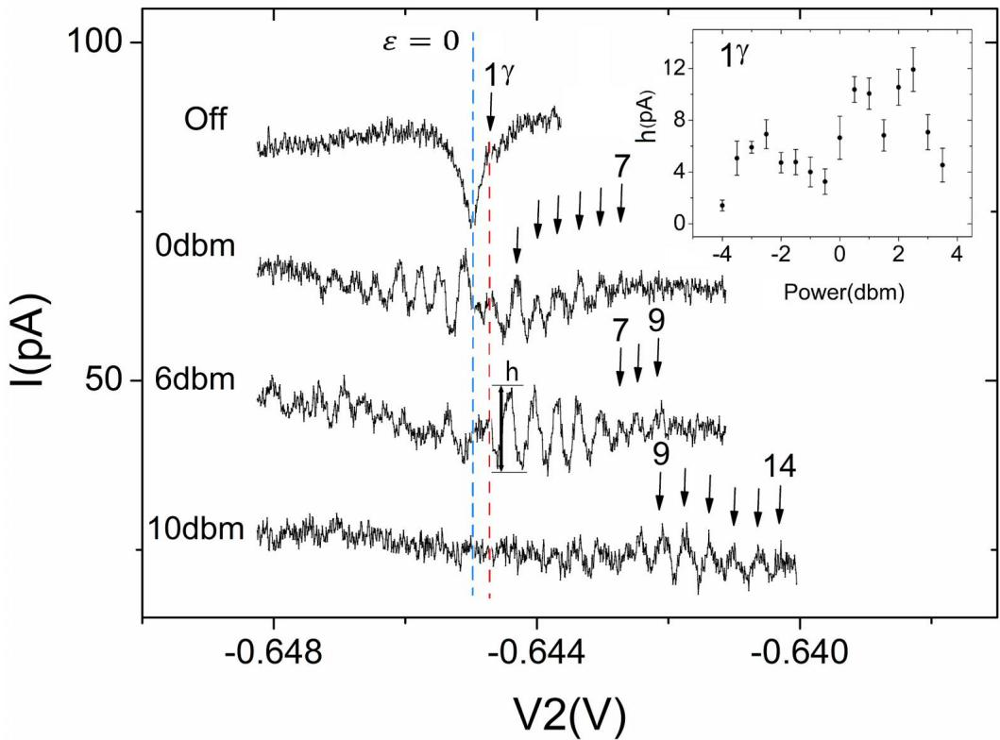  
图3.12 此图展示类一系列不同微波功率下的微分电流 dI/dV 曲线，固定频率在15GHz。为了提高信噪比，每个点采样 10 次求平均值。蓝色虚线表示$\textsf { T } \epsilon = 0$ 的位置。曲线表示的功率分别为off，0dbm，6dbm和10dbm(从上到下)，曲线在纵轴上连续地移动了 20pA，以便能画在同一张图上。两条平行的短线中间所夹的距离，定义为峰高 h。Inset 显示了 1γ 峰(用红色的虚线标示) 的高度在 3pA 和 12pA 之间振荡，大约在 -4dbm，0dbm，4dbm 附近达到最小值。 $2 \gamma - 6 \gamma$ 表现出了同样的行为。在微波功率提高到10dbm以后， $7 \gamma$ 直至 14γ 过程逐渐展现出来。

我们应当注意到，对与我们使用的锁相放大技术而言，测量时一段时间内测量的平均值。通常这由锁相放大器内部积分时间所决定的。一般我们将积分时间设定在在 300ms。当 $\tau \gg T _ { 1 }$ 时，电子有足够的时间来回到低能级态，因此QPC测量值应为0.5。当τ 接近于0的时候，电子没有时间来完成弛豫过程，而始终处在高能态。在这种情况下，我们认为 $M ( \tau = 0 ) = 1$ 。当 $\tau$ 增加时，PAT峰的高度开始减低，因此我们能测量到比例值 $M ( \tau )$ 随着时间 $\tau$ 开始降低。

这里要注意的一个问题是，用示波器来观察自制的斩波器的实际效果，可以发现当 τ 短于 3ns 时，正弦波部分几乎不能再保持很好的形状。因此我们假定了条件 $\begin{array} { r } { M ( \tau = 0 ) = M ( \tau = 3 n s ) = 1 } \end{array}$ 。这里我们将微波功率设定在 12dbm，测量电子温度在1K以上。在M和 τ 之间，存在一个指数关系[29;77]，如下：

$$
M ( \tau ) = \frac { 1 } { 2 } + \frac { 1 - e ^ { \frac { - \tau } { 2 T _ { 1 } } } } { \tau }\tag{3.4}
$$

如图(3.12)，通过拟合上式，我们得到 $T _ { 1 } = 8 n s$ 。这个结果与之前的测量结果基本一致[29;78]，尽管这里的电子温度在1K以上，远高于稳定在250mK的晶格温度。我们推测这里的原因在于， $T _ { 1 }$ 弛豫基本上由电声相互作用决定，晶格温度基本决定这一相互作用的强度，因而电子温度的影响不大

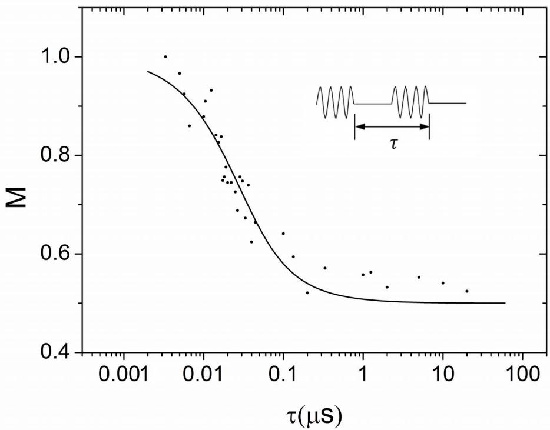  
图 3.13 在频率 15GHz，功率 12dbm 条件下，与 $\tau = 3 n s$ 时的共振幅度比例随着τ 增加出现指数函数形状降低。拟合曲线的结果，可以提取出弛豫时间 $T _ { 1 } = 8 n s$

## 3.4 本章小结

本章主要描述了一个砷化镓半导体量子点上的实验实例：外界高功率微波信号驱动下，量子点中发生的PAT过程。

在本章的前半部分，我们描述了实验用的各种基本技术，包括测量电子点温度，量子点之间的耦合强度，电极电压 -能量转换系数 (level arm) 等等。通过这些基本技术，我们能够在两能级系统这个模型上，建立起对量子点中物理系统的描述。这些技术也将在后面两章中继续出现。我们不会再次说明。

在本章的后半部分，我们描述了一个 PAT 实验的过程。在这个实验中，我们实现了一个远离热平衡条件下的电荷量子比特中的 PAT 过程。实验中观察到了最高 14 阶的 PAT 过程，同时在电子温度高于 2K的条件下，证明了存在一个LZS 干涉过程。进一步，我们测量了电荷态弛豫时间 $T _ { 1 }$ 约在 8ns，与之前人们在稀释制冷机(更低的晶格温度) 上完成的实验结果基本一致。

## ㅢ4 章 半导体量子点上的两比特系统

## 4.1 基于电荷量子比特的受控量子门

如前两章中所述，通过微纳加工的方法，我们在砷化镓半导体异质结上实现了一个双量子点结构。这种了量子器件提供了一种非常优秀的，可控性很好的两能级体系 [63; 64; 79; 66; 67]，这已经通过 PAT 实验得到了验证。这个在更加精细的脉冲波的控制下，我们可以进一步实现一个门操作。2013 年，我们组的曹刚、李海鸥博士完成了这一工作[25]。

GaAs 和 GeSi 材料上单比特上的成功 [80–84; 75; 37; 85; 86]，激励着我们继续走向更深远的量子计算。接下来的问题是，为了实现一个普适门操作，我们还需要一个两比特操作。既然一个两能级体系 (双量子点结构) 可以提供一个比特，那么最自然地想法就是在两个两能级体系，也就是四量子点结构上，完成一个两比特操作。如图（4.1）。目前最好的结果是Havard大学的Yacoby小组完成的受控相位门[27]。

这是一个很直观的结构。我们可以将它视为两个双量子点。而它们之间的耦合，则是因为它们之间的距离很近，可以直接实现电容耦合。在某个双量子点中，电子处在 (M+1,N) 或者 (M,N+1) 态时候，我们可以标记为 L (这里，我们依然遵从前一章的假定，只考虑单个量子点中能量最高的态)。因此对于四量子点，我们标记其中的电荷态为 mn ，其中 $\scriptstyle \mathrm { m = L , R } , 0 , 2 ,$ 。态 LL 表示上面的双量子点在 L 态，下面的双量子点也在 L 态。其余类推。m=0时候，表示一个电子都没有；m=2时表示两个量子点中各有一个电子。

为了简单起见，首先忽略退相干因素的存在。我们标记电荷态为 mn 的能量为 $E _ { m n }$ 。假如四量子点系统中只有 1 个电子那么它有四个可能的能量 $E _ { L 0 } ,$ $E _ { R 0 } , \ E _ { 0 L } , \ E _ { 0 R }$ 。对于有两个电子的状态 20 ，其能量为 $E _ { 2 0 } = E _ { L 0 } + E _ { R 0 } + U _ { 1 }$ 这里 $U _ { 1 }$ 代表两个电子之间的静电耦合能。类似的，我们可以得到 $E _ { L L } =$ $E _ { L 0 } + E _ { O L } + U _ { l l }$ 或者 $E _ { L T } = E _ { L 0 } + E _ { 0 R } + U _ { L R }$ 。其余类推。我们定义第一组双量子点中，两个量子点中的能极差 $\epsilon _ { 1 } \equiv E _ { L 0 } - E _ { R 0 }$ ，第二组中， $\epsilon _ { 2 } \equiv E _ { 0 L } - E _ { 0 R }$ o两组量子点之间的耦合 $\mathrm { J } = ( U _ { L L } + U _ { R R } - U _ { L R } - U _ { R L } ) / 4$ 。因此，我们可以将以下四个态的能量写为一个更简单的形式：

$$
E _ { L L } = \epsilon _ { 1 } + \epsilon _ { 2 } + J\tag{4.1}
$$

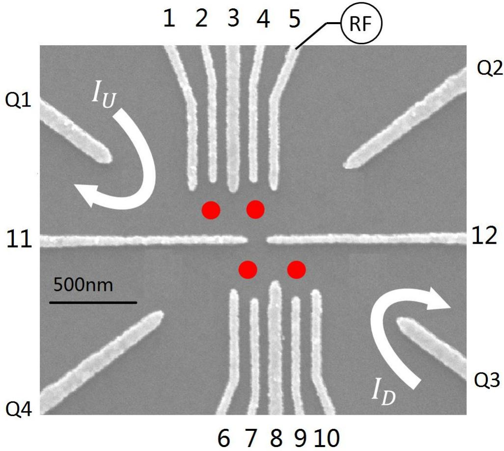  
图4.1 (a)Ti/Au 电极 1-12 定义了一个典型的四量子点结构。在上下两组量子点共用横向电极 11 和 12 的基础上，电极 1-5 定义了一个典型的双量子点；电极 6-10 同样定义了一个典型的双量子点。电极 Q1-Q4 是四个 QPC 电极，用来形成四个 QPC 测量通道。白色箭头表示了测量电流流过的方向。红色的四个圆点表示了四个量子点的假想位置

$$
E _ { L R } = \epsilon _ { 1 } - \epsilon _ { 2 } - J\tag{4.2}
$$

$$
{ \cal E } _ { R L } = - \epsilon _ { 1 } + \epsilon _ { 2 } - J\tag{4.3}
$$

$$
E _ { R R } = - \epsilon _ { 1 } - \epsilon _ { 2 } + J\tag{4.4}
$$

量子点之间的跃迁，可以用 Hamiltonian 的非对角项来描述。因此整个Hamiltonian 可以写成：

$$
H _ { 2 q } = \sum _ { i = 1 } ^ { 2 } \frac { 1 } { 2 } ( \epsilon _ { i } \sigma _ { z i } + t _ { i } \sigma _ { x i } ) + J \sigma _ { z 1 } \sigma _ { z 2 }\tag{4.5}
$$

写成矩阵形式为：

$$
\left( \begin{array} { c c c c } { \epsilon _ { 1 } + \epsilon _ { 2 } + J } & { 0 } & { \Delta _ { 1 } } & { 0 } \\ { 0 } & { \epsilon _ { 1 } - \epsilon _ { 2 } + J } & { 0 } & { \Delta _ { 1 } } \\ { \Delta _ { 2 } } & { 0 } & { - \epsilon _ { 1 } + \epsilon _ { 2 } + J } & { 0 } \\ { 0 } & { \Delta _ { 2 } } & { 0 } & { - \epsilon _ { 1 } - \epsilon _ { 2 } - J } \end{array} \right)
$$

基于这个 Hamiltonian，我们可以构造一个受控旋转门 (Control RotationGate，CROT)。受控旋转门的意思是：当 qubit2(控制比特) 处在 R 时，给qubit1(目标比特) 施加某个驱动脉冲，qubit1 会在 RR 和 $| L R \rangle$ 之间旋转；当qubit2(控制比特) 处在 |L⟩ 时，给 qubit1(目标比特) 施加同样的驱动脉冲，qubit1不会在 RR 和 LR 之间旋转。

为了求解方便，我们假设两组双量子点内两点之间的耦合强度 $t _ { 1 } = t _ { 2 }$ , 固定$\epsilon _ { 1 } = J / 2$ ，求解上面这个 Hamiltonian。它的本征态是：

$$
| C _ { + } ^ { \prime } \rangle \simeq \frac { 1 } { \sqrt { 2 } } [ | L R \rangle + | R R \rangle - \frac { \Delta } { 2 ( \epsilon _ { 2 } + J / 2 ) } | L L \rangle - \frac { \Delta } { 2 \epsilon _ { 2 } - J / 2 } | R L \rangle ]\tag{4.6}
$$

$$
| C _ { - } ^ { \prime } \rangle \simeq \frac { 1 } { \sqrt { 2 } } [ | L R \rangle - | R R \rangle - \frac { \Delta } { 2 ( \epsilon _ { 2 } + J / 2 ) } | L L \rangle - \frac { \Delta } { 2 \epsilon _ { 2 } - J / 2 } | R L \rangle ]\tag{4.7}
$$

$$
| R L ^ { \prime } \rangle \simeq | R L \rangle - \frac { \Delta } { 2 J } | L L \rangle + \frac { \Delta } { 2 \epsilon _ { 2 } - J / 2 } | R R \rangle\tag{4.8}
$$

$$
| L L ^ { \prime } \rangle \simeq | L L \rangle - \frac { \Delta } { 2 J } | L R \rangle + \frac { \Delta } { 2 \epsilon _ { 2 } + J / 2 } | R L \rangle\tag{4.9}
$$

相应的本征能量是：

$$
E _ { C _ { + } ^ { \prime } } \simeq - \frac { \epsilon _ { 2 } } { 2 } + \frac { \Delta } { 2 } - \frac { \epsilon _ { 2 } \Delta ^ { 2 } } { 4 \epsilon _ { 2 } ^ { 2 } - J ^ { 2 } }\tag{4.10}
$$

$$
E _ { C _ { - } ^ { \prime } } \simeq - { \frac { \epsilon _ { 2 } } { 2 } } - { \frac { \Delta } { 2 } } - { \frac { \epsilon _ { 2 } \Delta ^ { 2 } } { 4 \epsilon _ { 2 } ^ { 2 } - J ^ { 2 } } }\tag{4.11}
$$

$$
E _ { R L ^ { \prime } } \simeq \frac { \epsilon _ { 2 } } { 2 } - \frac { J } { 2 } - \frac { \Delta ^ { 2 } } { 4 J } + \frac { \Delta ^ { 2 } } { 4 \epsilon _ { 2 } - 2 J }\tag{4.12}
$$

$$
E _ { L L ^ { \prime } } \simeq \frac { \epsilon _ { 2 } } { 2 } + \frac { J } { 2 } + \frac { \Delta ^ { 2 } } { 4 J } + \frac { \Delta ^ { 2 } } { 4 \epsilon _ { 2 } + 2 J }\tag{4.13}
$$

本正能量可以用图 (4.2) 表示。

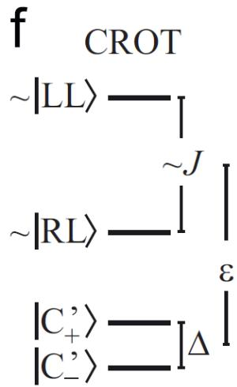  
图 4.2 形成 CROT 门时，各个态形成的的能谱。图片引自 [87]

如果 $\Delta \ll J$ ，我们可以发现，上述四个本征态都可以近似为 $\frac { 1 } { \sqrt { ( 2 ) } } | L R \rangle +$ $\begin{array} { r } { | R R \rangle , \frac { 1 } { \sqrt { ( 2 ) } } | L R \rangle - | R R \rangle , | L L \rangle , | R L \rangle } \end{array}$ 。正如单比特操作那样，如果我们施加频率为J 的脉冲并实现了一个很好的 Rabi 振荡，那么可以实现 $| L L \rangle$ 和 $| R L \rangle$ 之间的旋转。同时，另外两个能级之间能极差太小，则几乎不会在这个脉冲下旋转。这样我们就实现了一个受控旋转 (CROT 门)。受控非门 (Controlled Not Gate，CNOT) 则可以看做是旋转角度为 $\pi$ 的特例。有了受控非门，加上之前的单比特非门，理论上我们可以构造任意我们想要的量子门，后面困扰我们的是门的保真度问题。

## 4.2 比特间偶和强度的测量

如前一章中介绍的办法，在一组双量子点中，我们可以测量出两个量子点之间的耦合 t。如果我们知道两组双量子点之间的耦合 J，这样实验上完全可以把四能级模型建立起来了。下面我们介绍一个实验实例，来说明如何测量J。

我们的样品材料是 $G a A s / A l _ { 0 . 3 } G a _ { 0 . 7 } A s$ ，二维电子气曾大约在晶圆表面下 100nm 左右。晶圆的基本参数是：电子密度 $2 . 0 \times 1 0 ^ { 1 1 } c m ^ { - 2 }$ ，迁移率 $6 \times$ $1 0 ^ { 4 } c m ^ { 2 } / V s$ 。样品放置在稀释制冷及中，最低环境温度为20mK。

图 (4.1) 展示了我们使用 EBL 技术制作的样品的 SEM 图片。我们称呼这种样品为” 电容耦合双 - 双量子点 (capacitive coupled double-double quantum dot)”

或者“四量子点“。图 (4.3) 展示了这种样品的简单电容模型。Γ 是每个量子点到相应的电子库之间的耦合强度。t 是一组双量子点中，两个量子点之间的耦合能。U 和 $U '$ 是上下两组量子点之间的电容耦合。我们这里做了简单化的处理，认为这是一个非常对称的系统。当然在实验中，尽管门控量子点系统有非常好的可控性，想要整个系统变得非常对称也是不容易的。

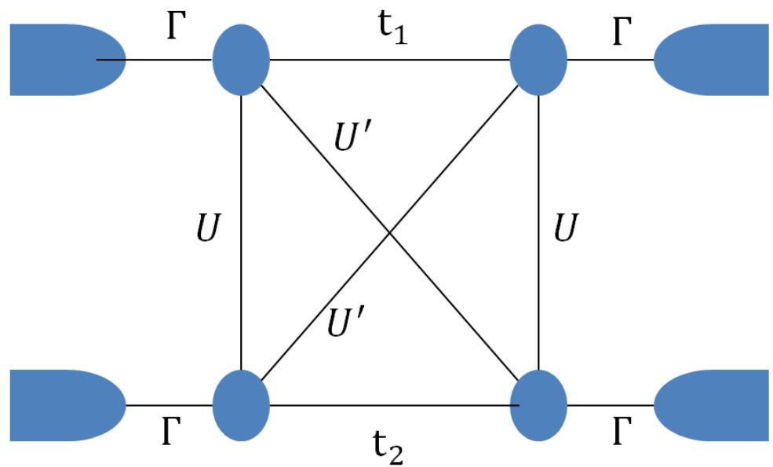  
图4.3 图片给出了四量子点系统的基本参数，包括量子点到相应电子库的跃迁速率 Γ；两点之间的耦合能t；上下两组量子点之间的电容耦合U 和 $\mathrm { U } '$

平行的一对电极 11 和 12 分开了两组双量子点。电极 1-5，加上共用的 11和 12，定义了一个典型的双量子点结构 (参考前一章)，以后我们称之为”上面的双（量子）点“；电极 6-10 定义了”下面的双点“。上面和下面的双点通过电容耦合在一起。电极Q1-Q4各自定义了一个QPC通道。通过标准的锁相放大技术测量通过 QPC 通道的微分电流 [图 (4.1) 白色箭头]，我们可以探测相应双量子点中的电荷态。微分电流 $I _ { U }$ 对应上面的双点， $I _ { D }$ 对应下面的双点。当上面的双点和下面的双点分别工作时，由于电极 11 和 12 形成了一个足够大的势垒，它们之间并不会存在隧穿电流。这可以通过测量上下两组量子点之间的输运电流(也就是根本没有电流) 来证明。

单独一组双量子点中的电荷态定义为 $( N , M ) _ { i }$ ，代表 N 个电子在左边，M个电子在右边，i=U，D 表示上下两组双量子点。图 (4.4) 分别占了上下两组量子点在 $( N , M ) _ { U }$ 和 $( N , M ) _ { D }$ 附近的蜂窝图。接下来的内容里，我们关注从$( N + 1 , M ) _ { U }$ 到 $( N , M + 1 ) _ { U }$ 和 $( N + 1 , M ) _ { D }$ 到 $( N , M + 1 ) _ { D }$ 之间的电荷转变区域。我们估计 N 和 M 的数值在 10 左右，当然具体数值并不是很重要，因为和

之前一样，我们只考虑最上面的能级。

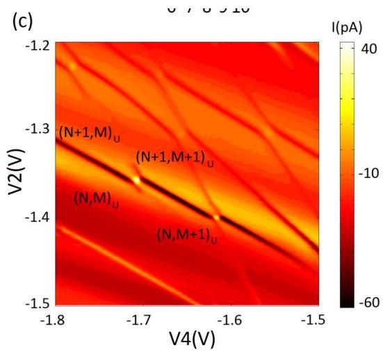

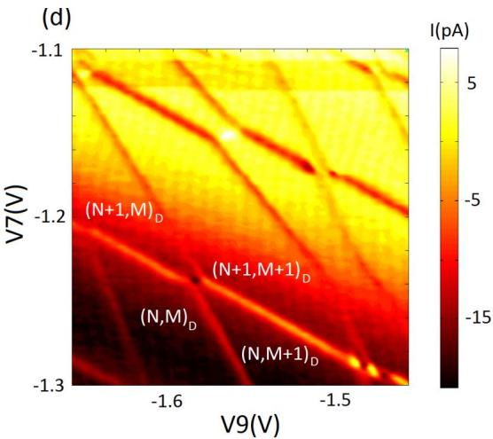  
图4.4 (a)和(b)分别显示上下两组量子点，在 $( N , M ) _ { U }$ 和 $( N , M ) _ { D }$ 附近的蜂窝图

下面我们来通过测量得到 J。首先，对上面的双量子点，沿着 detunning 的方向(同时扫描电极2和4)扫描，我们称为沿着line1，可以得到 $( N + 1 , M ) _ { U }$ 到$( N , M + 1 ) _ { U }$ 电荷态的转变曲线。如前章所述，我们采用QPCmodulation测量方法，得到的结果类似图 (3.12 0dbm)。同时，我们对下面的双量子点采取同样的扫描方式 (同时扫描电极 7 和 9)，从 $( N + 1 , M ) _ { D }$ 到 $( N , M + 1 ) _ { D }$ ，沿着 line2。也就是说，从 line2 上初始点开始，每扫一条 line1，沿着 line2 前进到 line2 上下一个点，再扫描一条 line1，得到微分电流 $I _ { U }$ 。这样我们就可以得到一张二维图。其横坐标为下面双量子点的 detunning 方向 (实际中用 V9)，纵坐标为上面双量子点的 detunning 方向 (实际中用 V4)，每个点的值是微分电流。如图 (4.5)。

如果上下两组双量子点之间没有耦合，那么在图 (4.5) 中，我们应该看到一条直线。这条直线有略微的倾斜，这是因为上下两组电极之间总会有电容耦合，注意这是电极之间的耦合，而不是量子点之间的耦合。但实际上我们可以看到，在电极 9 上的电压 V9=-1.537V 时 (也就是 $\epsilon _ { 2 } = 0 )$ ，发生了一个跳跃 (drift)。这是普通的电极耦合不能解释的，其原因在于在 $\epsilon _ { 2 } = 0$ 处，下面双点电荷状态发生了一个 R 到 L 的突变，导致上面双点的电场 (势阱) 发生突变，也就是两组双量子点通过电容耦合耦合在了一起。

为了进一步证明这里确实是因为有耦合的存在，我们交换上下两组量子点的扫描顺序，重复这个实验。亦即每扫描 line2，改变 line1。结果见图 (4.5 b)。在对应 $\epsilon _ { 1 } = 0$ 的位置，同样发生了跳跃。我们可以看到，图 (4.5 a) 中 V9 对应$\epsilon _ { 2 } = 0$ 的位置与图(4.5b)中的微分电流形成的直线位置一致。对V4电极，情况也是一样。

从图(4.5a)中，我们可以读出电荷转变位置处的跳跃的宽度W(对应的电压大小)。如前章所述，我们可以通过库伦菱形测量出相应电极的电压 -能量转换系数 (level arm)α[88]。这样我们可以估计出上下两组双量子点之间的偶和强度约为 $\scriptstyle \mathbf { J } = 2 0 \mathrm { G H z }$ o

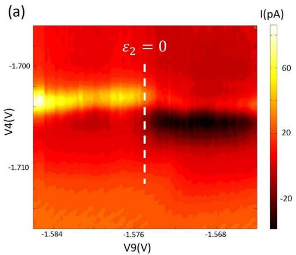

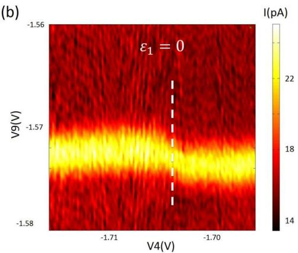  
图 4.5 (a) 沿着电荷态 $( N + 1 , M ) _ { U }$ 到 $( N , M + 1 ) _ { U }$ 转变的方向扫描，用 QPCmodulation 方法测得微分电流 $I _ { U }$ 。由于耦合 J 的存在，下面的双量子点发生电荷态从 $( N + 1 , M ) _ { D }$ 到 $( N , M + 1 ) _ { D }$ 之间的改变时， $\epsilon _ { 2 } = 0$ 处 $I _ { U }$ 的位置发生了一个跳跃。(b) 与 (a) 实验方法完全一致，只是改变了控制和目标双量子点的顺序，测量下面的双点。

两个耦合的两能级系统组成了一个四能级系统。其能级情况的理论模拟前面已经给出。在实验上，非常自然地，我们可以在这个体系上使用光子辅助隧穿(PAT) 方法来探测这个四能级系统的能谱。

我们在电极 5(上面双量子点) 上施加一个频率为 20GHz，功率为 -10dbm 的连续正弦波。完全在相同区域重复之间描述的扫描过程，结果展示如图 (4.6)。从右往左看，我们可以观察到出现了一些列的平行线，对应了最高到 3 阶光子过程的 PAT 过程 [60–62]。这个过程发生了一个两能级体系里，和上一章中的图形完全一致。这里由于某些原因，我们没有准确测量量子点间耦合 t 的大小。但从 1 阶发射和 1 阶吸收之间的间距，接近 1 阶发射和 2 阶发射之间的两倍，结合上一章的公式 (3.3) 可以推测这里的 t 不会很大，应该在几个 GHz。在发生跳跃附近的区域 (V9=-1.537V 附近)，也就是四能级系统存在的位置，我们能发现一些多余的激发线 (用黑色的虚线曲线标示)。在两能级体系下，这些激发线是无法解释的。

为了解释这一现象，我们假设 $t _ { 1 } = t _ { 2 } = 5 G H z [ 2 5 ;$ 89]，并求解式（4.5）中的 Hamiltonian 并绘制一张本征能量与 $\epsilon _ { 1 } - \epsilon _ { 2 }$ 关系的能级图。固定在某个ϵ ，我 $\epsilon _ { 1 }$ 们可以得到一张横轴 $\epsilon _ { 2 }$ ，纵轴为本征能量的能谱图，如图（4.7）。我们把这个数值模拟的结果和实验结果相比较。在图 (4.6) 中，两条白色的虚线 [用 (i) 和(ii)标示]对应着不同 $\epsilon _ { 1 }$ 处的能级情况。在图(4.7)中，红色箭头指出了从电荷态

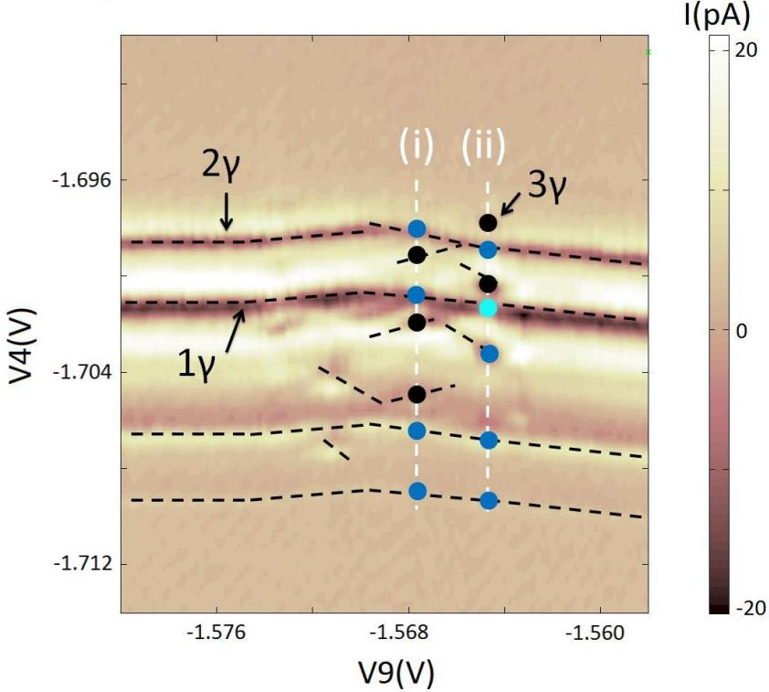  
图4.6 (施加了频率 20GHz，功率 -10dbm 连续正弦信号，量子点呈中呈现出许多微波光子辅助隧穿。为了清晰起见，我们用黑色虚线来表示。白色虚线 (i) 和 (ii) 分别对应于图 (4.7 a) 和 (4.7 b) 的情况。不同颜色的点对应着不同的跃迁终态

RR 到 RL ， LR 或 LL 所对应的位置。红色虚线箭头表示这里应该有一个跃迁过程，也就是对应图(4.6) 上的一个峰，但是我们实验中并没有观察到。

为了更直观的说明这个对比，图(4.6)中，在辅助虚线(i)和(ii)与PAT激发线的交叉点上，我们用黑色，蓝色和亮绿色的原点来表示。这里颜色直观地与图(4.7)中微波光子辅助跃迁末能级的颜色对应起来。黑色对应 LL ，蓝色对应LR ，亮绿色对应 RL 。例如，如图 (4.6) 线 (i) 中，最上方的蓝色圆点的位置发生了一个 RR 到 LR 的两光子辅助跃迁，在图 (4.7 a) 中对应了左起第一个红色箭头。蓝色圆点下面的黑色圆点表示了一个 RR 到 LL 的跃迁，对应图(4.7 a) 中左起第二个红色箭头。在图 (4.7 b) 中显示了一个最多高达三阶的光子辅助跃迁过程。其它位置的情况不再赘述。到此，我们在实验上证明了这个四能级模型的正确性。

## 4.3 本章小结

在这一章中，我们介绍了基于两比特的量子受控门操作的基本实现方法。在实验上，我们展示了一个电容耦合四量子点系统的实际例子。这种四量子点结构由两个通过电容耦合在一起的双量子点结构来实现，其中最关键的地方在于测量其中的耦合强度，这是实现受控非门操作的基础。基于上一章中介绍的光子辅助隧穿方法，我们成功的测量了这个量，并与理论上计算的能级结果相比较。比较结果令人满意。这为下一步进行受控非门操作铺垫了道路。

a)  
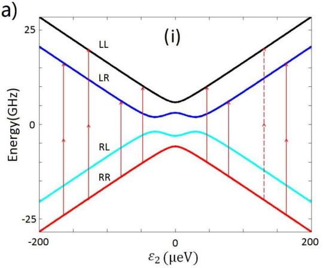

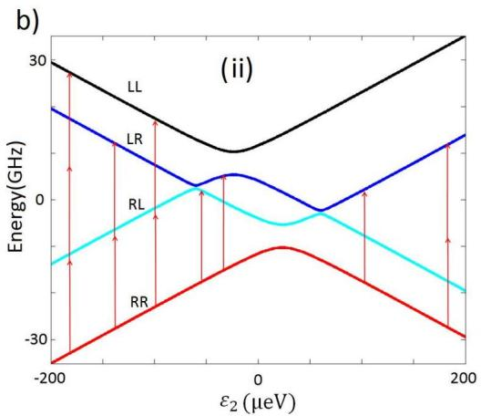  
图4.7 (a) 和 (b) 是四量子点 Hamiltonian能级的数值模拟结果。红色箭头表示了微波光子辅助下的跃迁过程。红色虚线箭头表示这里应该有一个跃迁，但没有在实验上观察到

## ㅢ5 章 半导体量子点系统中的䘇㰚效应

## 5.1 半导体中量子点的Kondo效应

尽管半导体量子点作为各种量子计算方案的有力候选者之一，除了量子计算，在量子输运领域，半导体门控量子点同样是一种非常优秀的系统。特别是门控半导体量子点系统成熟的加工工艺，对于各种参数良好的可调性，都是它的巨大优势。

量子相变 (Quantum Phase Transition，QPT) 是凝聚态和量子场论中非常活跃的一个领域。在描述一个物理系统的 Hamiltonian 中，一些参数的改变，导致了不同特征之间的量子态基态之间的转变，这就是量子相变。Kondo 系统中有丰富的现象，是一个发生量子相变的很好的例子 [90; 91]。近年来，许多体系中的Kondo 效应，比如金属量子点 [92–94]，金属隧穿结 [95]，原子分子系统 [96–98]中，都有了很大的进展。

这一章，我们就围绕半导体量子点上的Kondo 效应来展开。

## 5.1.1 单自旋杂质的 Kondo 效应

降低温度，金属的电阻通常会减小。这很容易解释，因为金属原子的振动变小，电子受到的散射过程减少，更容易穿过金属。但是实验表明，对于有些金属，比如 Co，Au 等等，大约在温度到达 10K 左右，电阻饱和，不再随着温度变化。如果我们在其中参入微量的磁性杂质, 例如 Fe，Mn，形成的稀磁合金会在某个低温位置 (大多在 10K-20K) 达到电阻的极小值。这种反常的现象被日本科学家近藤（Kondo）于 1964 年给出了一个初步的解释：在这些金属中存在着磁性杂质，当电子被磁性杂质散射时，电子和杂质的自旋状态都会发生改变，这导致了所谓的近藤效应 (Kondo Effect)。

单自旋杂质的 Kondo 效应 (single spin impurity Kondo effect，1-IK)，是一种多体效应 (many-body effect)。它可以被一个多体能量标度来表征，这个标度就是Kondo 温度 (Kondo temperature)，或者说 Kondo 能量（ $( \mathrm { K o n d o e n e r g y } , T _ { k } = E _ { k } / k _ { B }$ 9$k _ { B }$ 是玻尔兹曼常数）。因此，电子温度 $T _ { e }$ 不同时，自旋杂质表现出不同的行为：当 $T _ { e } > T _ { K }$ 时，自旋杂质的行为更像一个自由自旋；当 $T _ { e } > T _ { K }$ 时，自旋杂质不再那么自由，开始出现了束缚共振(boundresonance)。

1964 年，Jun Kondo 提出 Hamiltonian 模型：

$$
H = \sum _ { k \sigma } \epsilon _ { k } c _ { k \sigma } ^ { \dagger } c _ { k \sigma } + J s _ { i m p } \cdot s _ { c o n d }\tag{5.1}
$$

这里， $\epsilon _ { k }$ 是导带 k-态的能量； $c _ { k \sigma } ^ { \dagger }$ 和 kσ 是 k- 态的产生 -湮灭算符； $s _ { i m p }$ 是杂质自旋； $s _ { c o n d }$ 是传导电子的自旋；J>0, 说明两种自旋是反铁磁耦合。基于这个Hamiltonnian，利用格林函数方法求解，Kondo 提出电阻与温度之间的关系：

$$
\rho ( T ) = \rho _ { 0 } + a T ^ { 2 } + b T ^ { 5 } + c J ^ { 2 } + J ^ { 3 } D ( E _ { F } ) l n ( E _ { B W } / T )\tag{5.2}
$$

这里， $\rho _ { 0 }$ 是温度 T=0 时候的非磁性静态缺陷产生的电阻； $a T ^ { 2 }$ 来自费米液体 (Fermi-liquid)； $b T ^ { 5 }$ 来自声子； $D ( E _ { F } )$ 是传导电子在费米能级附近的态密度；$E _ { B W }$ 是传导电子带宽。显然，在 T 接近 0 的时候，电阻出现了发散，这里可以使用重整化群方法 (renormalization method) 解决这个问题。重整化群方法给出了方程(1) 中耦合强度随着能量的具体形式：

$$
J ( E ) = E _ { B W } { \frac { 1 } { 1 - J D ( E _ { F } ) l n ( E / E _ { B W } ) } }\tag{5.3}
$$

显然，在 $E _ { K } = k T _ { K } = { \cal E } _ { B W } e x p [ - 1 / J D ( E _ { F } ) ]$ 时，J(E)项出现发散，说明杂质自旋和电子库中传导电子之间形成了 Kondo 自旋单态。这个标度只在能量大于 $E _ { K }$ 才正确。

在 Kondo 的 Hamiltonian 的基础上，进一步出现了 Anderson 的 s-d 混杂模型。这个模型加入了两点变化：1对于自旋杂质原子的d壳层电子，电子之间存在库伦相互作用U，这与自由原子形成的固有磁矩相似；2自旋杂质的d壳层轨道态不是严格的本征态，而是倾向于退局域化为 s 态，二者之间存在着电子的相互转移。

## 5.1.2 半导体量子点中的 1-IK Kondo 问题

尽管以上的模型，都建立在对金属和金属中磁性杂质的考察基础上。但是，半导体量子点（由于它的电子性质类似于真是的原子，因此也被称为“人造原子”）中的电子总自旋数目如果是 1/2 （或者其奇数倍），我们也可以把量子点看做是在费米海洋中嵌入的一个自旋杂质。因此，我们能在半导体量子点上观察到 Kondo 效应。。如图 (5.1)，在源漏偏压为 0 的位置，出现了一个原本不应存在的 Kondo 态。尽管此时量子点中电子的能级在费米面下方，但是源漏中的电子可以通过这个态穿过量子点。

这里的 Hamiltonian 是：

$$
H = H _ { R } + H _ { L } + H _ { Q D } + H _ { I }\tag{5.4}
$$

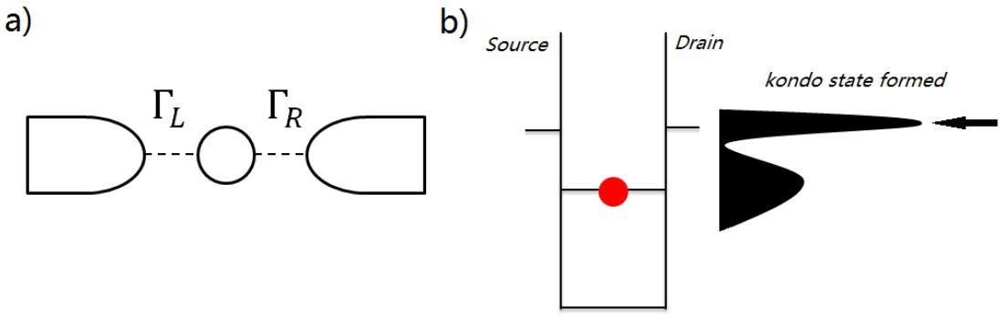  
图5.1 (a) 描述了一个基本的单量子点模型。量子点到源漏的隧穿几率为 Γ。(b)描述了单量子点中 Kondo 能态的位置，在源漏偏压为 0 的位置，会出现一个 Kondo 态，导致源漏在零偏压时，有电子可能穿过。

其中，

$$
H _ { L ( R ) } = \sum _ { k \sigma } \epsilon _ { L ( R ) } c _ { L ( R ) k \sigma } ^ { \dagger } c _ { L ( R ) k \sigma }\tag{5.5}
$$

描述左右源漏电极传导电子, 如式 (1)；

$$
H _ { Q D } = \sum _ { s i g m a } \epsilon _ { d } d _ { \sigma } ^ { \dagger } d _ { \sigma } + U n _ { \uparrow } n _ { \downarrow }\tag{5.6}
$$

描述了量子点中电子， $d _ { \sigma } ^ { \dagger }$ 和 $d _ { \sigma }$ 分别是量子点中电子的产生 -湮灭算符；U 表示了如果有两个电子，分别占据上下两个自旋态时，二者间的的库伦能。

$$
H _ { I } = \sum _ { k } V _ { R k \sigma } [ c _ { R k \sigma } ^ { \dagger } d _ { \sigma } + h . c . ] + \sum _ { k } V _ { L k \sigma } [ c _ { L k \sigma } ^ { \dagger } d _ { \sigma } + h . c . ]\tag{5.7}
$$

尽管这是和两个电极的耦合，但是我们只要做一个变换，把左右两个电极处理成一个电极，既可以变换到安德森模型。亦即：

$$
H _ { I } = \sum _ { k } \sqrt { V _ { R k \sigma } ^ { 2 } + V _ { L k \sigma } ^ { 2 } } [ c _ { + k \sigma } ^ { \dagger } d _ { \sigma } + h . c . ]\tag{5.8}
$$

这里： $c _ { + k \sigma } ^ { \dagger } = \cos \theta c _ { R k \sigma } ^ { \dagger } + \sin \theta c _ { L k \sigma } ^ { \dagger } , c _ { - k \sigma } ^ { \dagger } = - \sin \theta c _ { R k \sigma } ^ { \dagger } + \cos \theta c _ { L k \sigma } ^ { \dagger } , \theta = V _ { R } / V _ { L } ,$

到此，量子点中的 Kondo 效应问题，与一般的金属中的 Kondo 效应问题一致了。系统的Kondo 温度为：

$$
T _ { k } = \sqrt ( U \Gamma ) e x p [ - \frac { \pi | \epsilon _ { d } | ( \epsilon _ { d } + U ) } { 2 U \Gamma } ]\tag{5.9}
$$

其中，Γ 是量子点(自旋杂质) 和电极(传导电子) 之间的耦合强度。

在实验上，我们判断是否观察到 Kondo 效应的一个基本依据是，如图（5.2），在量子点源漏偏压 $V _ { s d }$ 为 0 的情况下，原本出现库伦阻塞的区域 (亦即微分电导 dI/dV=0) 的位置，出现了一个中央微分电导零偏压峰 (zero bias peak,

ZBP)。进一步，我们有两种基本手段验证这个峰是否是 Kondo 峰：1 加平行磁场，则该峰会劈裂成两个，它们的间距与塞曼分裂能一致；2 提高温度，则峰高 (微分电导值) 应当下降 (开始可能会上升，但随着温度升高，最终应当表现下降行为)，直至消失。

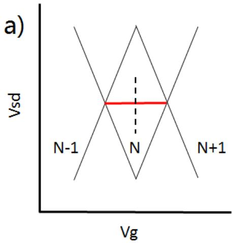

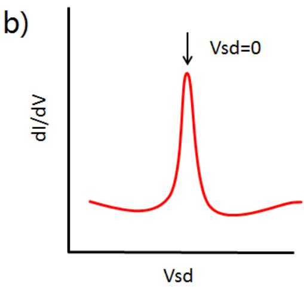  
图5.2 (a)是一个典型的库伦阻塞。如果出现Kondo效应，那么我们能在红线所表示的位置上观察到电导不为 0 的现象。虚线是沿着源漏偏压 Vsd 方向扫描，可以绘制出如 (b) 的图。(b) 上的中央电导峰，一般认为是 Kondo效应的基本特征。

## 5.1.3 两自旋杂质的 Kondo 效应

在单自旋杂质的基础上，人们进一步发展了两自旋杂质下的 Kondo 效应(two-impurity Kondo effect，2-IK)。这里的基本图像是：在每个自旋杂质和电子库之间耦合的基础上，两个自旋杂质之间存在反铁磁耦合。这导致两自旋杂质体系里，不同基态中出现了一种竞争关系：一方面是单个自旋杂质与相应电子库中电子之间的耦合；另一方面，两个磁性杂质通过相互作用绑定在一起，能够形成自旋单态(singlet)，总自旋为 0，从而消除了杂质的自旋。

19 世纪 80 年代，Jones 等人首先研究了 2-IK 中的问题。他提出的 Hamilto-nian 为：

$$
H = \sum _ { k \sigma } \epsilon _ { k } c _ { k \sigma } ^ { \dagger } c _ { k \sigma } + J _ { 0 } [ s _ { c o n d 1 } \cdot s _ { i m p 1 } + s _ { c o n d 2 } \cdot s _ { i m p 2 } ] + J _ { 1 } s _ { i m p 1 } \cdot s _ { i m p 2 }\tag{5.10}
$$

这里 $s _ { c o n d 1 }$ 和 $s _ { i m p 1 }$ 描述一个自旋杂质和相应的电子库之间的自旋耦合，下标为 2 的描述了另一个。 $J _ { 0 }$ 描述了耦合强度大小。 $J _ { 1 }$ 是两个自旋杂质之间的耦合强度。σ 标记自旋。

如果我们仅仅考虑s波的耦合，这个Hamiltonian可以简化成一个1维模型，其中描述相互作用的项的具体形式为：

$$
\begin{array} { r l r } & { } & { H _ { i n t e r a c t i o n } = J _ { + } ( s _ { i m p 1 } + s _ { i m p 2 } ) \cdot \displaystyle \sum _ { k ^ { \prime } k } ( c _ { k ^ { \prime } e } ^ { \dagger } \sigma c _ { k e } + c _ { k ^ { \prime } o } ^ { \dagger } \sigma c _ { k o } ) + } \\ & { } & { J _ { - } ( s _ { i m p 1 } + s _ { i m p 2 } ) \cdot \displaystyle \sum _ { k ^ { \prime } k } ( c _ { k ^ { \prime } e } ^ { \dagger } \sigma c _ { k e } - c _ { k ^ { \prime } o } ^ { \dagger } \sigma c _ { k o } ) + } \\ & { } & { J _ { m } ( s _ { i m p 1 } - s _ { i m p 2 } ) \cdot \displaystyle \sum _ { k ^ { \prime } k } ( i c _ { k ^ { \prime } e } ^ { \dagger } \sigma c _ { k e } + h . c . ) + } \\ & { } & { J _ { k } ( s _ { i m p 1 } \cdot s _ { i m p 2 } ) \cdot \displaystyle \sum _ { k ^ { \prime } k } ( s _ { i m p 1 } \cdot s _ { i m p 2 } ) } \end{array}\tag{5.11}
$$

这里，产生算符 $c _ { k ^ { \prime } e } ^ { \dagger }$ 和 $c _ { k ^ { \prime } o ^ { \dag } }$ 从 $c _ { k ^ { \prime } \sigma } ^ { \dagger }$ 构造而来，其中 e 和 o 代表奇 (even) 和偶 (odd) 宇称。两个自旋杂质之间的交换耦合 (exchange coupling) 强度 ${ \cal J } _ { + , - } =$ $( J _ { e } \pm J _ { o } ) / 2 , J _ { m } = ( J _ { e } J _ { o } ) ^ { 1 / 2 }$ , 其中 $J _ { e , o } = ( J _ { o } / 2 ) ( 1 \pm s i n k _ { F } R / k _ { F } R )$ 。R 是两个杂质之间的距离，并且这里用费米波失 $k _ { F }$ 代替k。

在上面的耦合表达式中，前三项描述了局域化的自旋杂质和传导电子之间的交换耦合； $J _ { 1 }$ 描述了自旋杂质之间的耦合。这样， $J _ { + } , J _ { - } , J _ { m } , J _ { 1 }$ 构成了四个独立的参数。调节这些参数，可以描述从 $J \to - \infty$ (铁磁，ferromagnetic FM) 到$J \to + \infty$ （反铁磁，AF）的整个范围。

如上所述，两自旋杂质系统和但自旋杂质系统的最大的不同就在于两个自旋杂质之间存在反铁磁耦合 J，这导致了两种量子基态之间的竞争关系。当 J 强度比较弱，并且强度比单个杂质自旋和相应的传导电子之间的 Kondo 能量要弱时，整个系统表现地像单独的两个 Kondo 系统。这两套系统分别是一个杂质自旋和奇宇称通道耦合，另一个杂质自旋和偶宇称通道耦合。这里两种宇称通道指的是两侧传导电子和自旋杂质之间通道的线性叠加。另一方面，当 J 很强，两个单独的自旋杂质，它们每个都携带一个1/2自旋，会形成一个自旋单态。这样两个杂质作为一个整体，总自旋就为0，不会再再有Kondo 效应了。

如前所述，在一个双量子点中，每一个量子点都构成了一个自旋杂质，二者之间存在耦合。我们要在注意的是，如图 (5.3)，这里存在两种双量子点结构量子点：串联双量子点 (series coupled DQD) 和并联双量子点 (parallel coupledDQD)。在串联双点中，每个量子点和左右电极中的某一个耦合起来；在并联双点中，每个量子点和两个电极都和起来。这里同时存在两种耦和：隧穿耦合(tunneling coupling) 和电容耦合 (capacitive coupling)。前者存在两个电子之间的波函数的重叠，后者仅仅是库伦相互作用。

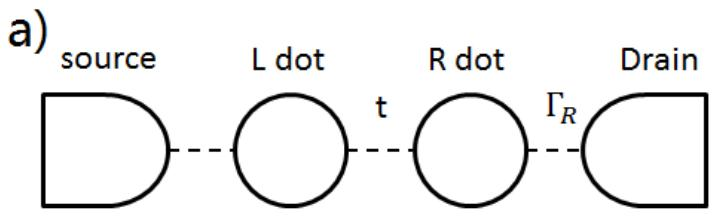

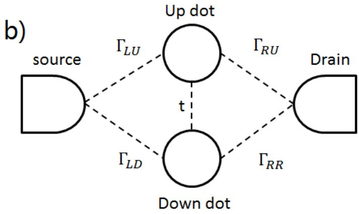  
图5.3 (a) 是一个典型的串联双量子点。每个量子点和源漏电极中的一个单独耦合起来，二者之间存在耦合。(b) 是一个典型的并联双量子点，每个量子点和两个源漏电极都耦合起来，同时二者之间存在耦合。

## 5.1.4 半导体双量子点中的 2-IK Kondo 问题

串联双量子点之间存在隧穿耦合，其Hamiltonian形式为：

$$
H = H _ { R } + H _ { L } + H _ { R - Q D } + H _ { L - Q D } + H _ { R - Q D } + H _ { R - I } + H _ { L - I } + H _ { D Q D }\tag{5.12}
$$

从左往右，各项依次表示：右侧传导电子；左侧传导电子；右侧量子点；左侧量子点；右侧传导电子 -自旋杂质耦合；左侧传导电子 -自旋杂质耦合；两个量子点之间的耦合。最后一项的表达形式为：

$$
{ \cal H } _ { D Q D } = t \sum _ { \sigma } [ d _ { U \sigma } ^ { \dagger } d _ { L \sigma } + h . c . ]\tag{5.13}
$$

每个量子点，到相应电极偶和强度为：

$$
\Gamma _ { R ( L ) } = \sum _ { k } | V _ { R ( L ) k } | ^ { 2 } \delta ( \epsilon _ { R ( L ) k } - E _ { F } )\tag{5.14}
$$

如果两个量子点之间的耦合足够小，套用式 (5.9)，可以得到两个量子点的各自的 Kondo 温度。假如我们的系统非常对称，也就是左右两边 (量子点) 内的充电能和杂质 -传到电子耦合强度都相等，那么当我们调节两个量子点之间的耦合 t 时候，耦合 t，反铁磁耦合 $J = 4 t ^ { 2 } / U$ 和 Γ 之间存在竞争关系。令人感到有趣的是，理论上[99]，这里存在两种相变过程，分别是atomicKondo（也就是两个单独的 Kondo）到 Conherent bonding Kondo Singlet；atomic Kondo 到 Singlet。如图5.4 显示了调节各个参数下的相变过程。

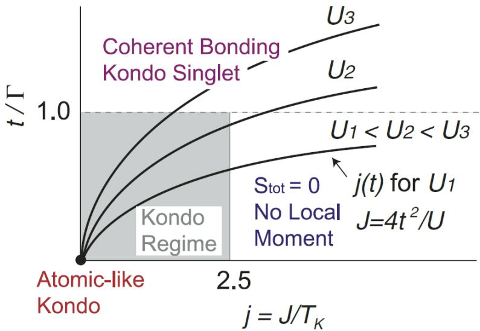  
图5.4 串联双量子点 2-IK 相图。这里， $j = J / T _ { K } = 4 t ^ { 2 } / U$ ，J 是两个量子点之间等效反铁磁耦合能，t 是两个量子点之间的隧穿耦合能。Γ 是量子点到源漏电极的隧穿速率。 $T _ { K }$ 是 Kondo 温度。这里假定了整个系统是完全对称的，不再区分左右不同。横纵坐标并不独立。电子充电能 U 不同的条件下，单独调节 t，在像图上走过的轨迹也不一样。相图的左下角，t 很小时，系统近似为两个独立的 Kondo 过程，称为 atomic Kondostate； $t > \Gamma$ 时，系统的基态是 coherent bonding Kondo 态；当 $t < \Gamma$ 时，如果 ${ \mathrm { j } } { > } 2 . 5$ ，则系统的基态是两个自旋杂质绑定成的 Singlet 态。图片摘自[99]。

当 $t < \Gamma$ 时，可以认为系统处在两自旋杂质情形。这里的关键参数 (criticalparameter) 是 $J / T _ { K }$ 。当 $J = 4 t ^ { 2 } / U \leqslant 2 . 5 T _ { K }$ 时，双量子点系统表现的像两个独立的自旋杂质，各自存在一个 Kondo 效应。当 $J > 2 . 5 T _ { K }$ 时，两个杂质自旋绑定成一个自旋单态，总自旋为0，不再显示出Kondo 效应。

当 $t > \Gamma$ 时，反铁磁偶和强度 J 不是那么重要了。两个量子点之间的隧穿导致每个量子点中 Kondo 态的相干叠加。这里形成了一个 Coherent Bonding KondoSinglet。

对于并联双量子点，如果我们只考虑反铁磁耦合，总的来说和串联双量子点的讨论非常相似。但是这里，单个自旋杂质和传导电子之间的耦合应当是$\Gamma = \Gamma _ { L } + \Gamma _ { R }$ 。但是从几何上可以看出来，如果 t 非常小，那么在串联双点钟，整个电导值必然会非常中。当 t=0 时，也就没有电流了。但对于并联双点，则不存在这种问题，因为每个量子点都独立形成了一个通道，那么不管它们之间的耦合如何，总归会有电流的。在关键点附近，串联双量子点中的电导理想值是 $2 e ^ { 2 } / h$ ，而并联双点的电导理想值是 $4 e ^ { 2 } / h$

尽管上面的理论给出了若干量子相变过程，但是在耦合双量子点系统中，量子点间隧穿矩阵 t 对关键参数来说是一个相对微扰，j 和 t、Γ 也不是独立的坐标，很难精确地实现这个相变过程。相对的，在交界处存在“两个单独的Kondo 态”，“Coherent Bonding Kondo 态”和“Singlet 态”的混合。在输运过程上，基于 slave-boson 平均场方法的数值据算表明:1 当 t 足够大，以至于系统处于 Coherent Bonding Kondo 态时；2 t 较小，但是 $J = 4 t ^ { 2 } / U$ 足够大，系统处于Singlet 态。这两种情况下，我们能够观察到随着源漏电压，原本的中央 Kondo峰的劈裂。这样，如果我们能调节两个量子点之间的耦合 t，那么我们显然应当能观察到单峰到双峰的转变过程。这个过程已经被 Jeong 和 A.Chang 等人在砷化镓半导体双量子点系统中观察到。在我们要介绍的四量子点系统中，同样可以观察到这一特征现象。

## 5.2 四量子点中的 Kondo 效应

在过去的十几年中，在操作半导体量子点上，人类取得了一些列进步，使得我们能够非常精确地调节系统中的参数 [100–103; 90; 91; 104–107]。在前文中，我们介绍了在半导体量子点上，Kondo 效应研究的一些基本进展。许多理论和实验工作，已经是我们对单量子点上 Kondo 效应有了非常坚实的认识[100; 99]; 进一步的，从单量子点到双量子点，更多丰富的物理过程出现了并在实验上被观察到了[103;90;91;107]。结合上一章的内容，非常自然地，在2-IK基础上，我们可以考虑两个耦合的 2-IK 系统，是否可能存在什么新的物理过程。也就是四量子点上的Kondo 效应。

这里，我们研究了一个四量子点系统个，它包括两组 (平行) 双量子点和三种相互作用：1 在某一组双量子点中，每个量子点和它相应的电子库中的传导电子之间的 Kondo 相互作用；2 在某一组双量子点中，两个量子点之间的Heisenberg 相互作用；3 在两组量子点之间的 Ising 相互作用。只含有 Ising 或者Heisenberg相互作用的情况，已经在实验上被报道过。但是到本文完成为止，我们并没有发现有实验上报道过一个同时含有这两种相互作用的系统中的 Kondo效应。

这里，我们是用的是电容耦合双量子点系统 (亦即四量子点)。这种系统已经被包括我们组在内的许多组所制作和研究过，工艺和物理参数描述上已经非常成熟[108; 109; 27]。接下来的内容，我们会介绍在这个系统上观察到的现象。

我们使用的是 $G a A s / A l _ { 0 . 3 } G a _ { 0 . 7 } A s$ 异质结晶圆。在晶圆表面下方 100nm 处，存在着一层二维电子气，其基本参数为：电子密度 $\rho = 2 . 0 \times 1 0 ^ { 1 } 1 c m ^ { - 2 }$ , 迁移率$\mu = 6 \times 1 0 ^ { 4 } c m ^ { 2 } / V \cdot s$ s。样品放置在稀释制冷及中，最低环境温度为40mK。

图(5.5b)展示了我们制作的四量子点器件的SEM图。它由两套双量子点构成。门电极 1-5 定义了一个典型的串联双量子点结构 (称作” 上面的双量子点”)；门电极 6-10 定义了另一个双量子点（称作“下面的双量子点”）。两组量子点由水平方向的两个电极 11 和 12 分隔开。两边量子点工作的时候，电极 11 和 12上的电压足够大，两边双量子点中的电子不能通过中央的缝隙隧穿，两边只能通过电容耦合起来。这里，我们使用如第三章中介绍的” 量子点输运测量”，通过标准的锁相放大技术测量通过一组双量子点源漏 [如图 (5.5 a)， $u s  u d$ 或者$d s \to d d ]$ 的微分电导 $\scriptstyle { \mathrm { G } } = \mathrm { d I } / \mathrm { d V }$ o

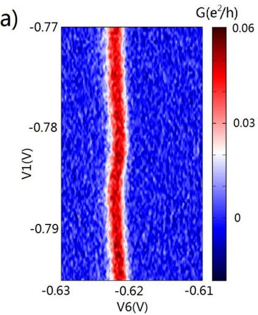

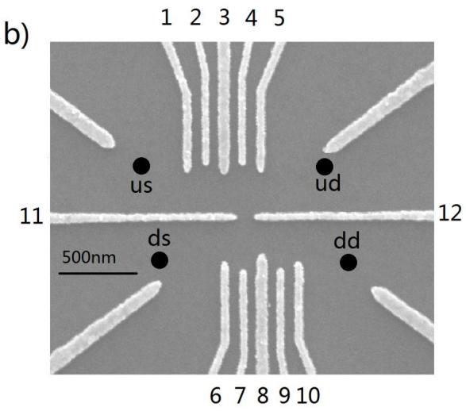  
图5.5 (a)图展示了扫描下面的双量子点，从 $( N , M ) _ { D }$ 到 $( N + 1 , M ) _ { D }$ 时，上面双量子点通道的微分电导 dI/dV。从 $V _ { 1 } = - 0 . 7 8 5 V$ 处的跳跃，我们可以从中估计出上下两组双量子点的耦合强度在 8GHz。(b)Ti/Au 电极 1-5 和11,12 定义了一个典型的串联双量子点，6-10,11,12 定义了另一个。黑色圆点“us”，“ud”代表上面双量子点的源漏电极，“ds”，“dd“代表下面双量子点的。电极11和12 分隔了两个双量子点。

图 (5.6 a) 和 (5.6 b) 展示了上下两组双量子点的” 蜂窝图”。我们定义一组双量子点中的电荷态为 $( N , M ) _ { i }$ ，意思是左边单量子点中有 N 个电子，右边单量子点中有 M 个电子。i=U，D 用来区别上面 (up) 和下面（down）的两组双量子点。后面我们要观察的 Kondo 效应和对 Kondo 效应的控制，都在 $( N , M ) _ { U }$ 和$( N , M ) _ { D }$ 附近。

如前面的简介中所述，为了理解量子点中 Kondo 效应和推测到底发生了什么过程，知道量子点中的各种参数是非常重要的。这些参数可以从相应的蜂窝图中提取出来 (为了使各种参数方便比较，我们统一选择 GHz 作为能量单位，特别考虑到在量子点里，各种参数以 GHz 为单位，通常在十几到几百这么一个非常易于记忆的范围。)：

1 充电能可以通过直接读取库伦峰的间距来得到。对上面的量子点来说，左边量子点充电能 $U _ { U L }$ 和右边量子点充电能 $U _ { U R }$ 大小相近，在 340GHz 左右。对下面的量子点来说，左边量子点充电能 $U _ { D L }$ 大约为 590GHz，右边量子点充电能 $U _ { D L }$ 大约为 530GHz。

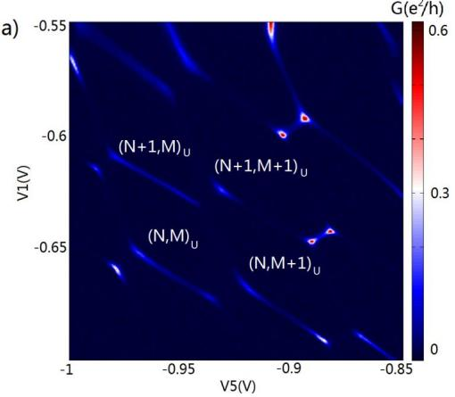

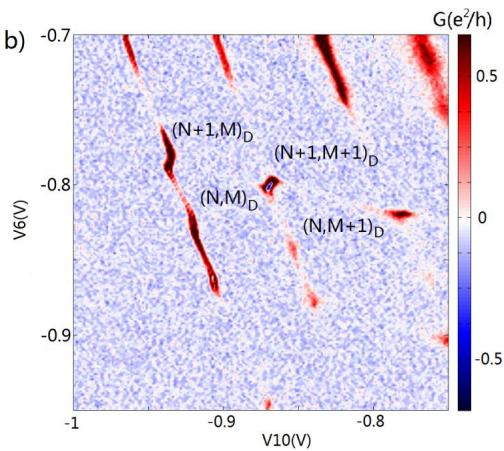  
图5.6 (a) 上面的双量子点，四个不同的电荷态 $( N , M ) _ { U }$ $( N + 1 , M ) _ { U } ,$ (N, M + 1)U， $( N + 1 , M + 1 ) _ { U }$ 。(b) 下面的双量子点，四个不同的电荷态 $( N , M ) _ { D }$ $( N + 1 , M ) _ { D } \colon$ $( N , M + 1 ) _ { D }$ $( N + 1 , M + 1 ) _ { D }$ 0

2 电子到相应的电子库的隧穿几率可以由相应库伦峰的半高宽来估计。对上面的量子点来说，左侧的量子点隧穿几率 $\Gamma _ { U L }$ 大约为 18GHz。右侧的量子点隧穿几率 $\Gamma _ { U R }$ 不宜估计，因为相应的库伦峰很模糊。对下面的量子点来说 $\Gamma _ { D L }$ 和 $\Gamma _ { D R }$ 都很难估计，因为相应的库伦峰都很模糊。

3 一组双量子点中，两个量子点之间的耦合能 (intra-dot coupling)。对上面的串联双量子点来说，不可避免的同时存在两种耦合: 一种是库伦相互作用耦合 (电容耦合能)，一种是隧穿耦合。从蜂窝图六边形的形状 [110]，我们能够得到库伦耦合能为 16GHz；从 PAT 技术 [89]，我们能够得到隧穿耦合能为 7GHz，差不多是电容耦合能的一半。对于下面的双量子点，我们只实现了电容耦合能的测量，其值为15GHz。

4 两组双量子点之间的电容耦合能。这里的测量技术见第四章。如图 (5.5a)，同时沿着 detunning 方向扫描上下两个双量子点 $( N + 1 , M ) _ { i }  ( N , M + 1 )$ i的电荷转变区域，从这里的“跳跃(drift)”可以读出两个双量子点之间的耦合在8GHz。

到此，我们的到了这个四量子点系统的一些列基本参数。尽管有些参数不能准确测量出来，但总的来说，我们可以认为整个系统并没有严重偏离对称的状态。

仔细地调节上下两组双量子点的门电极，在上面的双量子点中，如图 (5.7)中的曲线所示，我们观察到了 Kondo 效应标志性的特征——零偏压峰 (ZBP)。

此时，上下两个量子点都形成了，各个电极上的电压依次为 V1-V12=-0.63V，-0.7V,-0.65V,-0.7V,-0.945V,-0.81V,-0.4V,-0.55V,-0.4V,-0.84V,-0.8V,-0.8V（V1 代表电极1 上的电压，其余类推）。

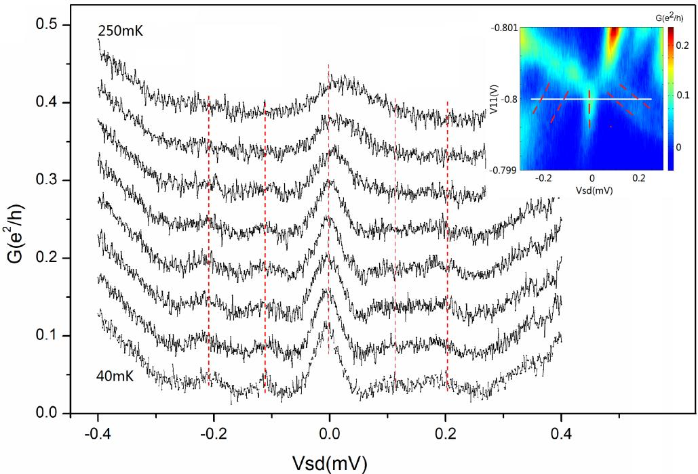  
图 5.7 一系列的微分电导 dI/dV 曲线 (V 6=-0.81V,V10=-0.84V), 温度分别在50mk,60mk,70mk,80mk,100mk,150mk,200mk 和 250mK(从下到上的顺序)。每一条曲线较上一条增加了 0.05e2/h，以便绘制在一起。这一系列曲线是从该图右上角 inset 中白色线所在位置处截取的。子图中绘制了微分电导 dI/dV 随着 V11(V12 保持和 V11 一致) 的变化关系。图中出现的五个峰用五个红色虚线来标记。

如前所述，变温实验时，Kondo 峰会随着温度升高而降低。将稀释制冷机的最低温度从 50mK调高到 800mK，可以发现 Kondo ZBP 的高度呈现出单调下降的趋势，如图（5.8 b）。从 50mK 时的 0.082e2/h (已经扣除本底) 一直到接近零。我们从中推测Kondo 温度在 800mK左右。

更近一步，为了证明这个 ZBP 确实是因为 Kondo 效应，我们轻微地调节上面上量子点上中间电极上的电压 V3，同时保证其他电极上电压不变 (这里，V6=-0.774V，V10=-0.885V，其他电极电压不变)。相应的，上面双量子点左右两个量子点之间的耦合也会相应地改变 (参见第三章)，那么我们有希望观察到从 atomic Kondo state 到 coherent bonding Kondo 或者 anti-ferromagneticstate 的相变过程 [90; 91]。V3 的变化范围是 -0.651V 到 -0.645V，更负的电压对应着双量子点中两个量子点之间的耦合强度 t 更小。如图 (5.8 a) 中所示，在$V 3 \approx - 0 . 6 4 8 V$ 时，出现了从单峰到双峰的劈裂现象。当 V3 继续向接近零的方向变化时，劈开的双峰之间的距离变大，同时变得越来越不对称。这种不对称的增加可能是因为随着电压的改变幅度增大，上面双量子点中电子波函数不对称的增加。这种劈裂现象与 Jeong 和 A.Chang 等人观察到的双量子点上的Kondo 现象现象完全一致。

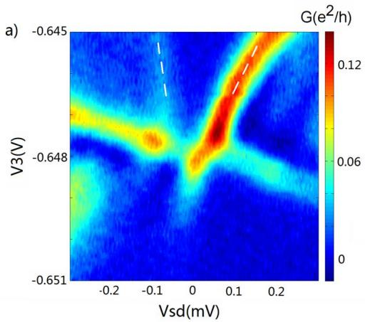

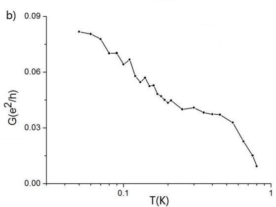  
图5.8 (a) 显示了微分电导 dI/dV 随着上面双量子点中间电极 V3 的变化关系。V3 的调节范围从 -0.651V 到 -0.645V。在 $\mathrm { V } 3 { = } . 0 . 6 4 7 \mathrm { V }$ 处，出现了一个单峰到双峰的劈裂现象 (白色虚线标示，此时 $\scriptstyle \mathrm { V } 6 = - 0 . 7 7 4 \mathrm { V }$ $\mathrm { V } 1 0 { = } { \ - } 0 . 8 8 5 \mathrm { V }$ 其余见正文)。(b) 显示了 Kondo 中央峰随着温度的依赖关系 (本底已扣除)，我们推测 Kondo 温度大约在 900mK

简单起见，我们假设上面双量子点的充电能 U 是左边量子点充电能$U _ { U L }$ 右边充电能 $U _ { U R }$ 的平均值，即 U=340GHz；尽管我们不知道 $\Gamma _ { U R }$ ，但是仍然假设 $\Gamma = \Gamma _ { U L } { = } 1 8 \mathrm { G H z } $ ；双量子点内，两个量子点间的耦合取为库伦耦合能 $E _ { U m } { = } 1 6 \mathrm { G H z }$ 。基于这些参数和简单的计算，由于这里 $t / \Gamma \approx 1$ ，但是$j = 4 t ^ { 2 } T _ { K } / U$ 远小于关键参数的转变位置 2.5，因此我们推测这里发生的相变过程非常可能是从 atomic Kondo 到 coherent bonding Kondo 态的相变 [111; 112]。整个相变过程中，尽管我们确信两个单量子点之间的耦合相互作用发生了变化，但是这里非常难以确定具体的变化值 (不管是电容耦合强度还是隧穿耦合强度)，因为整个过程中，相应的 V3 的电压变化值不到 1mV，实在是太小。因此正如前面所说，t的变化通常非常小。

这里值得指出的是，除了之前已经被观察到的中央峰之外，另一方面，中央峰的每一侧，还至少出现了两条额外的峰 [如图 (5.7) 中红色虚线标记的位置上]，我们从未看到过类似的报道。图（5.7）中的一系列微分电导 dI/dV 曲线，显示了这一系列峰对温度的依赖关系。从下到上，对应的温度依次为 50mK，60mK，70mK，80mK，100mK，150mK，200mK 和 250mK。可以观察很明显的峰高随着温度的升高而降低，直至消失。

到此为止，我们很好地重复了双量子点上 2-IK 模型下的基本结果。但是更让我们感兴趣的是，另外一组双量子点的存在，是否可以产生超越传统的只有一组双量子点的新现象？因此，我们将注意力放在下面一组量子点上。

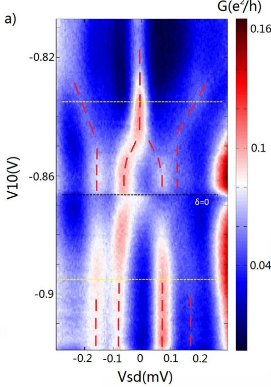

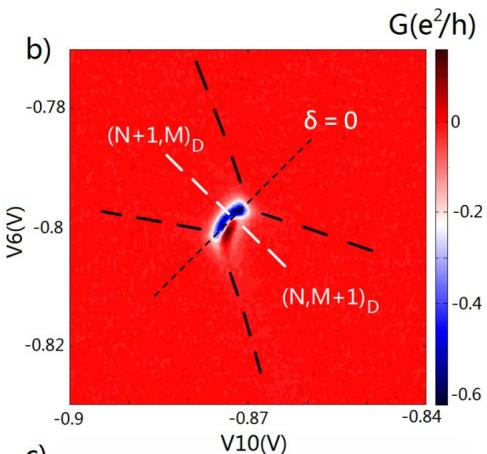

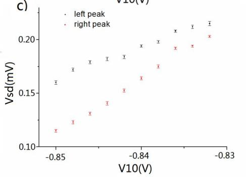  
图5.9 (a) 显示了当沿着 (b) 中白色虚线所示的路径，扫描下面双量子点的相应电压时，上面双量子点源漏通道的微分电导dI/dV的变化情况。Kondo峰用红色虚线标记出来。从 $\mathrm { V } 1 0 { = } { \ - } 0 . 8 2 \mathrm { V }$ 到 $\mathrm { V } 1 0 { = } { \ - } 0 . 8 5 \mathrm { V }$ 阶段，这里出现了中央峰，连同其他两个不断靠拢的侧峰。在 $\mathrm { V } 1 0 { = } { - } 0 . 8 6 6$ 的位置，这里出现了一个跳跃 (位置用黑色虚线标记)，对着下面双量子点出现了一个电子态的变化[从 $( N + 1 , M ) _ { D }$ 到 $( N , M + 1 ) _ { D } ]$ 。(b) 显示了 $( N , M ) _ { D }$ 区域附近的细节。黑色虚线标记了库伦峰的位置；较细的虚线标记了失谐量$\delta = 0$ 的位置；白色虚线标记了扫描路径, 从 $( \mathrm { V } 5 6 { = } { - } 0 . 8 5 5 \mathrm { V } , \mathrm { V } 1 0 { = } { - } 0 . 8 0 7 \mathrm { V } )$ 到 $( \mathrm { V } 6 { = } . 0 . 7 5 2 \mathrm { V } , \mathrm { V } 1 0 { = } . 0 . 9 1 9 \mathrm { V } )$ 。(c) 展示了左右两峰到 $\scriptstyle \mathrm { V = 0 }$ 位置的绝对距离。可以发现，随着V10 从 -0.83V变化到-0.85V，其差距越来越大。

图 (5.9 b) 显示了从 $( N + 1 , M ) _ { D }$ 到 $( N , M + 1 ) _ { D }$ 的电荷转变区域。也就是图（5.6 b）中相应区域的放大版。这里，黑色虚线标记了库伦峰所在的位置。可以通过图（5.6 b）来保证这些虚线标示位置的正确性。保持上面双量子点的位置不变 (也就是之前我们观察到 Kondo 效应的位置， $\mathrm { V } 1 { - } 5 { = } { - } 0 . 6 3 \mathrm { V }$ 9-0.7V，-0.65V，-0.7V，-0.945V），沿着图 (5.6) 中的白色虚线，扫描下面的双量子点。扫描的起始点为 $[ \mathrm { V } 6 { = } . 0 . 8 5 5 \mathrm { V } , \mathrm { V } 1 0 { = } . 0 . 8 0 7 \mathrm { V }$ ，处于 $( N , M + 1 ) _ { D }$ 态)], 终点为 $[ \mathrm { V } 6 { = } . 0 . 7 5 2 \mathrm { V } , \mathrm { V } 1 0 { = } . 0 . 9 1 9 \mathrm { V }$ ，处于 $( N + 1 , M ) _ { D }$ 态)]。在扫描的同时，我们测量的依然是上面一组双量子点的源漏微分电流 dI/dV。也就是说，我们希望看到下面量子点处在不同位置时，对上面双量子点中 Kondo 效应的影响。测量结果图如（5.9a）。横轴是上面双量子点的源漏电极偏压，纵轴是V10的电压。由于我们总是按某个比例，同时调节两个电极上的电压，因此只用一个电压来标记就够了。

沿着 V10 从 -0.807V 减小的方向 (远离 0 点的方向)，我们可以观察到一个非常明显的中央峰。中央峰的高度一直在增长，大约在 V10=-0.85V 时达到最大值 0.08e2/h。同时，从 V10=-0.825V 开始，出现了另外两个峰 (用红色虚线标示)，它们分布在中央峰的两侧。随着 V10 的减小，两个侧峰的距离开始缩小。Kogan 等人曾经在半导体 SET 上观察到了类似的结果 [103]。但是，我们的结果中依然有一些新现象，与 Kogan 等人的结果有所不同：1，当两侧的峰出现时，中央峰不仅没有消失，反而得到了加强。这种情况更类似与 Okazaki 等人曾经观察到的在并联双量子点中的包含轨道自由度 (orbital freedom) 的情况[104]。其次，仔细的检查外侧的两个峰的位置的演化，我们能发现，两个峰的演化过程并不是相对于零偏压位置完全对称的 [113]。如图 (5.9 c) ，通过绘出不同 V10[-0.825V,-0.85V] 下两个峰的各自的顶点位置，显示了二者演化的不同。我们将偏压为负值的曲线翻转成偏压为正值，可以看出沿着扫描的方向，二者之间的间距差越来越大。

继续保持我们的扫描方向看下去，紧接着，在 V10 到达 -0.85V 时，中央峰出现了劈裂。我们推测，这可能是一个 atomic Kondo 到 bonding singlet 的相变过程，类似于我们在上面双量子点中调节 V3，以改变双量子点内两个量子点间耦合时观察到的现象。最左侧的峰高得到了加强，并且和最中间的两个峰平行。最右边的峰没有出现同样的加强现象，而是变得很迷糊，但仍然存在并且能够分辨出来。我们先忽略在V10=-0.866V处发生的跳跃(用黑色虚线标记，我们在之后会讨论)，最终，在中央峰发生劈裂之后，出现了一个四个峰的图样 (用红色虚线标示)，尽管最右边的峰比较模糊。

当然，到此为止，我们不能确定这是否就是因为存在另一组双量子点，并且两组双量子点之间存在耦合造成了这种新现象。因为也可能是上下两组双量子点之间门电极之间存在的耦合，从而间接等价于上面双量子点电极上电压产生了变化。为了确认一点，我们移除了下面的双量子点 (亦即不让下面形成量子点，尽管这时候电极依然施加电压)，然后重复如上述的整个实验。

我们将 V7 和 V9(也就是下面双量子点的两个 plunge gates) 上的电压从原先的 -0.4V 退到 0，保持其它所有电极上的电压不变。此时我们测量通过原来下面双量子点 (尽管现在没有形成量子点) 源漏电极的微分电流，其值在百皮安左右。这证明了下面(亦即电极6-10,11,12)没有形成双量子点。当然，由于电极之间的电容耦合相互作用 (尽管如电极 6 和电极 1-5 之间的距离相对较远，但这个耦合总是存在的)，上面双量子点的蜂窝图会有细微的变化。为了证明这个变化非常小，我们将 V9 调节至 0，然后比较两张 $( \mathrm { V 9 { = } } { \bf - } 0 . 4 , ~ \mathrm { V 9 { = } } 0 .$ , 其余电压完全一致) 上面双量子点的蜂窝图可以发现，整体向 V5 方向 (远离 0V 位置) 只移动了大约 10mV。因此，我们相信，下面 plunge gate V7 和 V9 的变化并不会对上面双量子点造成太大影响。这个结果是非常合理的，因为下面的两个 plunge gates离上面的双量子点比较远，而且我们仅仅从-0.4V 移动到 0V。

方便起见，我们称呼下面双量子点形成 $( \mathrm { V } 7 , 9 \mathrm { = } \mathrm { - } 0 . 4 \mathrm { V } )$ 时为情况 1，下面双量子点不形成 $( \mathrm { V } 7 , 9 { = } 0 )$ 时为情况 2。两种情况下上面双量子点的电荷态$( N , M ) _ { U }$ 保持不变。在情况 2 中，我们同时调节 V6 和 V10，起始点分别为$( \mathrm { V } 6 { = } \mathrm { - } 0 . 7 3 \mathrm { V } , \mathrm { V } 1 0 { = } \mathrm { - } 0 . 8 6 \mathrm { V } ) , ( \mathrm { V } 6 { = } \mathrm { - } 0 . 5 5 \mathrm { V } , \mathrm { V } 1 0 { = } \mathrm { - } 1 . 0 4 \mathrm { V } )$ 。我们测量通过上面双量子点源漏电极的微分电流，观察到一个 Kondo 峰，并且和上面一样，观察它随着电极V6 和V10 电压的演化过程。整个过程如图(5.10)

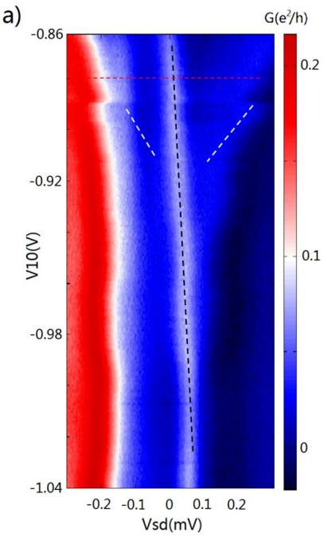

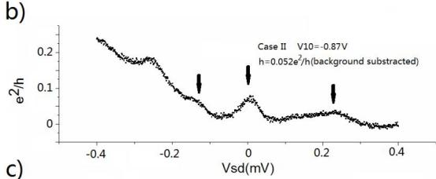

d)  
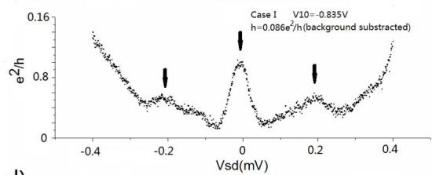

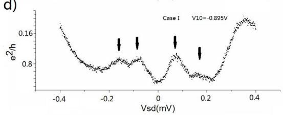  
图 5.10 为了证明我们在图 (5.9 a)(情况 1) 中观察的现象是来自于上下两组双量子点之间的耦合，我们将下面双量子单的两个 plunge gate V7 和 V9 从-0.4V 变化到 0V(情况 2)。同时扫描 V6 和 V10，读出上面双量子点的微分电导 dI/dV。(a) 中，V10=-0.875 处的跳跃是一个偶然的随机跳跃，量子点系统中偶尔会出现这种整体的突然移动，可以被忽略。白色虚线标记了中央峰两侧相互靠近的两个“隆起”。它们从 V10=-0.86V 到$\mathrm { V } 1 0 { = } { \ - } 0 . 9 3 \mathrm { V }$ 的区域，依然保持了靠拢的趋势。之后随着 V10 向负方向的增加而消失。(b) 是从 (a) 中抽取的曲线，位置在 (V10=-0.87V)，(c)和 (d) 是从图 (5.9 a) 中抽取的曲线，位置在 (V10=-0.835V,-0.895V)。(b)中，中央峰的高度明显降低了，约在 $0 . 0 5 2 e ^ { 2 } / h$ ，而且整在整个 V10 范围内变化不大。(c) 中的中央峰高度则有 $0 . 0 8 6 e ^ { 2 } / h$ 。(d) 图清晰地展示了一个四峰结构(情况1)。

我们用黑色虚线标记了中央峰，很明显它峰横跨了整个图片。另外还有两条白色虚线标记了两个” 隆起”(bump)。我们相信这个隆起对应着之前情况 1 中对称出现的两侧的峰。总的来说，图 (5.10)(情况 2) 有许多地方与图 (5.9)(情况1) 中不同：

1 最明显的是，移出了下面的双量子点后，在 V6 和 V10 电压的变化基本重复了情况 1 中电压轨迹的区段，但是这里再也没有出现中央峰的分裂，和图(5.10 d) 中的四峰的情况。取而代之的是中央峰横跨了整个图 (5.10 a)。甚至在V6 和 V10 的变化范围超过了情况 1 中的区段，中央峰的情况也是一样。此外，原本随着 V10 变化出现靠拢行为的两个峰，从情况 1 中的“峰”退化成了情况 2 中的“隆起”。这暗示作为了重要标度的 Kondo 温度的变化。当 V10 超过-0.93V 时，两个靠拢的峰消失了。

2 我们比较情况 1 和情况 2 在三峰 (中央峰 + 两个侧峰) 区段时候，中央峰的高度。在情况1下，中央峰最高达到0.086e2/h[如图(5.9a)，本底已扣除]；在情况 2 下，中央峰高度随着 V10 变化不大，约在 0.052e2/h[如图 (5.10 a), 本底已扣除]。这种 Kondo 效应变弱的情况不能用下面电极和上面电极存在耦合来解释，原因在于：如果我们认为是电极间电容耦合的作用，那么我们将 V7 和 V9调节到 0，上面双量子点的 Kondo 峰峰高应当被加强而不是被削弱。这为“情况1 中，中央峰的加强效应的来源，是下面的双量子点”这一推断提供了证据。

如上所述，关于 Kondo 效应，我们的四量子点系统中出现了许多全新的现象。但是，我们没有发现任何理论工作 (事实上，非常可惜的是，到本文完成为止，我们仅仅发现了一篇理论工作对四量子点上的 Kondo 效应给出了一些讨论)能够解释我们发现的现象。尽管，我们相信这里多峰情况的出现于这里自旋杂质数目的增加相关，但是非常不幸运的是，这块样品所在的低温设备中移除了磁场设备，因此我们缺乏了一个强有力的工具来进一步证明这一个观点，以及明确其中的细节。

最后，我们讨论图(5.9a)中在V6=-0.866V处出现的跳跃。产生这个跳跃的原因，与第四章中我们介绍的跳跃产生的原因完全一致。由于两组量子点之间的电容耦合，对于下面的量子点，从 $( N + 1 , M ) _ { D }$ 到 $( N , M + 1 ) _ { D }$ 的电荷态的转变，会导致上面量子点整体产生一个跳跃。图 (5.9 a) 中，在 $\mathrm { V } 1 0 { = } { \_ { } } 0 . 8 5 1 \mathrm { V }$ 和V10=-0.87V 位置，我们分别抽取了两条曲线，将他们绘制在图 (5.11 a) 中。可以发现除了边缘本底的位置，其他几乎完全重合。我们可以这样理解：下面的双量子点作为控制比特，当我们改变其电压进行扫描的时候，等于上面的双量子点沿着一条参数曲线连续变化；当控制比特出现 $( N + 1 , M ) _ { D }$ 到 $( N , M + 1 ) _ { D }$ 的转变时，上面双点就被拉回参数曲线上之前的某个位置。这样我们就用下面的双量子单作为控制比特实现了一个”Kondo 开关”。在图 (5.11 b) 中，我们轻微地调节两个横向电极的电压，从 $\mathrm { V } 1 1 { = } \mathrm { V } 1 2 { = } { \cdot } 0 . 8 \mathrm { V }$ 到 $\scriptstyle \mathrm { V } 1 1 = \mathrm { V } 1 2 = \dotsc 0 . 8 0 0 3 \mathrm { V }$ 。这里并没有更多的物理出现，但是在紧邻跳变位置的两侧，中央峰高度分别为$0 . 0 5 6 2 e ^ { 2 } / h$ 和 $0 . 0 3 6 2 e ^ { 2 } / h$ 。我们完全相信，如果能够实现一个更强的双量子点之间的耦合 (毕竟这里只有 8GHz。但是更大的耦合是完全是可能的，可以参见第四章。)，并且更加仔细地调节各个电极，这样我们完全可以在四量子点系统上实现Kondo 效应的开关。

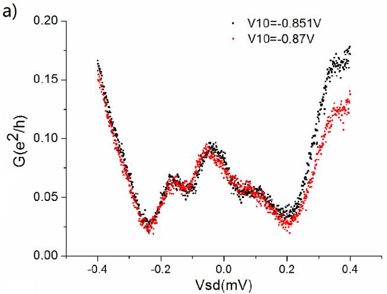

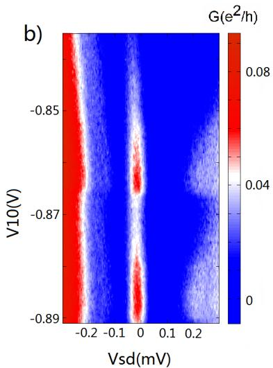  
图 5.11 (a) 比较了图 (5.9 a) 中 V10=-0.851 和 V10=-0.87V 两处的曲线，除了最右边的本底以外，几乎完全一致。(b) 将 V11 和 V12 从 -0.8V 改变到-0.8003V，观察上面双量子点微分电导 dI/dV 随着 V10(V6) 的变化。中央峰在 V10=-0.866V 处发生了一个明显的跳跃。这里我们可以用下面的双量子点作为控制比特，来实现一个Kondo 效应开关。

到此为止，我们在电容耦合四量子点系统上观察到了一些列全新的 Kondo效应，它们的特征是：存在一个中央峰，同时每侧至少存在两个额外的 Kondo峰。进一步，如果我们调节下面的双量子点，能够发现一个从 atomic Kondo 到coherent singlet 的相变过程，不同的是，这里微分电导出现了一个四峰的新特征。移除下面的双量子点，重复这个实验，我们发现四峰的特征消失，因此证明了这种新特征来源于两组量子点之间的耦合。

为了更加精确和透彻地研究四量子点系统中 Kondo 效应的新行为，平面磁场将起到无可比拟的重要作用，这也是我们下一步的目标。此外，如果我们能够更加精确地调节整个系统的参数，从而实现双量子点中两个量子点之间的Ising 耦合和两组双量子点之间的 Heisenberg 耦合之间的竞争，那我么相信会观察到更多有趣的新现象[107]。

## 5.3 本章小结

本章主要关注了电容耦合双量子点上的Kondo 输运性质。

Kondo 效应来源于杂质电子和传导电子之间散射过程中自旋的交换。它首先发现于磁性金属，但是量子点也是一个观察 Kondo 效应的极好的体系。我们依次介绍了量子点中的 1-Ik和 2-IK过程。它们分别对应了单量子点和双量子点的情况。

非常自然地，我们引入了四量子点，并对其中的 Kondo 过程进行了研究并观察到了一些列全新的 Kondo 效应，它们的特征是：存在一个中央峰，同时每侧至少存在两个额外的 Kondo 峰。进一步，如果我们调节下面的双量子点，能够发现一个类似从 atomic Kondo 到 coherent singlet 的相变过程，并最终出现四个 Kondo 峰。

由于硬件条件上的一些限制，实验中存在一些缺陷，特别是不能通过施加磁场来确认多峰过程和自旋之间的关系。我们希望未来能够进一步深入地研究这个问题。

## ㅢ 6 章 全文ᙱ结

本文主要围绕着 GaAs/AlGaAs 半导体双量子点的量子控制和输运性质来展开。

第一章，我们对半导体异质结门控量子点的基本概念做了介绍: 包括二维电子气的概念，如何形成量子点，如何进行基本的控制和读出以及最基本的模型“常相互作用模型”。由于我们的目的是为了在半导体门控量子点上制作量子计算机，或者说一系列量子门，于是我们从 DiVincenzo 的五条判据出发，以电荷量子比特为基础，依次介绍了半导体门控量子点在这五条基本判据上的进展。同时简要涉及了一些其他实现体系。我们的目的，是对半导体量子点的优势和不足给出一个全面的介绍。

第二章，我们主要介绍完成实验所需要基本硬件条件，包括样品的制作过程和极低温微纳信号平台的建设。首先在制作过程中，我们完整地给出了样品制作中的所有步骤: 清洗，湿法刻蚀，紫外光刻，金属镀膜，退火，电子束刻蚀，wire-bonding，初步测量甄别等等，以及我们认为是一些技巧或者需要重点注意的地方。由于加工仪器的具体参数和操作步骤不同，这里没有涉及到具体加工仪器的使用。在极低温和微纳信号平台建设部分，我们以 Oxford 公司的Triton 300 无液氦稀释制冷机为基础，描述了一个改装的具体实例，包括我们自己设计和使用的线夹式热沉，铜粉滤波器以及 PCB 板载滤波器等等。这些技术是在参考国内外其他小组和继承本小组多年来技术积累的基础上，摸索和总结的一套方法。

第三章，我们以一个双量子点结构上真实的光子辅助隧穿 (PAT) 实验为出发点，介绍了一些实验用的各种基本技术，包括测量电子点温度，量子点之间的耦合强度，电极电压 -能量转换系数 (level arm) 等等。通过这些基本技术，我们能够在两能级系统这个模型上，建立起对量子点中物理系统的描述。这些技术也将在后面两章中继续出现。紧接着，我们描述了一个 PAT 实验的过程。在这个实验中，我们实现了一个远离热平衡条件下的电荷量子比特中的PAT过程。实验中观察到了最高 14 阶的 PAT 过程，同时在电子温度高于 2K的条件下，证明了存在一个LZS干涉过程。进一步，我们测量了电荷态弛豫时间T 约在8ns，与之前人们在稀释制冷机(更低的晶格温度) 上完成的实验结果基本一致。

第四章，在证明了对双量子点 (单比特) 量子操纵的能力之后，为了实现受控量子门操作，我们必须进步一开展两比特操作的实验。我们选择的实现方式是直接电容耦合双量子点 (四量子点)。首先我们以受控量子非门为基础，介绍了实现受控量子门的方法。这里的关键在于明确系统的所有参数，特别是两组双量子点之间的耦合强度 J。我们通过将上一章中的 PAT 技术应用到四量子点上，成功了测量了耦合强度J。这为我们实现两比特受控量子非门的操作奠定了坚实的基础。

第五章，在量子操作之外，量子点本身的输运性质一直也是人们关注的重点。特别是它具有参数可控性好这一优秀特点，使得本身成为了细致研究 Kondo 效应的有力工具。这一章中，我们首先介绍了单量子点上的单杂质Kondo 效应和双量子点上的双杂质 Kondo 相应。因此非常自然地，我们在四量子点系统上展开了对 Kondo 效应的研究，观察到了一些列全新的物理现象：存在一个中央峰，同时每侧至少存在两个额外的 Kondo 峰。调节其中一组双量子点，能够发现另一组双量子点中出现一个类似于从 atomic Kondo 到 coherentsinglet 的相变过程，并存在一个四峰的新特征。移除下面的双量子点，重复这个实验，我们发现四峰的特征消失，因此证明了这种新特征来源于两组量子点之间的耦合。

## ৸㘹文⥤

[1] P.W. Shor. Proceeding of the 35th IEEE Symposium on Foundations of Computer Science.

[2] D.A. Lidar, I.L. Chuang, and K.B. Whaley. Phys.Rev.Lett., 81:2954, 1998.

[3] X.H. Peng, Z.Y. Liao, N.Y. Xu, G. Qin, X.Y Zhou, D. Suter, and J.F. Du. Phys.Rev.Lett., 101: 220405, 2008.

[4] O. Guhne, C.Y. Lu, and X.Q. Zhou. Nature Physcis, 3:91, 2007.

[5] Z. Zhao, Y.A. Chen, and A. Zhang. Nature, 430:54, 2004.

[6] J.H. Plantenberg, P.C. de Groot, C.J. Harmans, and J.E. Mooij. Nature, 447:836, 2007.

[7] R.C. Bialczak, M. Ansmann, M. Hofheinz, E. Lucero, M. Neeley, A.D. O’Connell, D. Sank, H. Wang, J. Wenner, M. Steffen, A.N. Cleland, and J.M. Martinis. Nature Physics, 6:409, 2010.

[8] Y. Yamamoto, Y.A. Pashkin, O Astafiev, Y. Nakamura, and J.S. Tsai. Nature, 425:941, 2003.

[9] S. Nadj-Perge, S.M. Frolov, E. Bakkers, and L.P. Kouwenhoven. Nature, 468:1084, 2010.

[10] K.D. Petersson, L.W. McFaul, M.D. Schroer, M. Jung, J.M. Taylor, A.A. Houck, and J.R. Petta. Nature, 490:380, 2012.

[11] C. Nayak, S.H. Simon, A. Stern, M. Freedman, and S. Das Sarma. Rev.Mod.Phys., 80:1083, 2008.

[12] M. Switkes. Decoherence and adiabatic transport in semiconductor quantum dot. Ph.D. thesis, 1999.

[13] L. Jacak, P. Harylak, and A. Wojs. Quantum Dots, Berlin:Springer 1998.

[14] A.N. Korotkov, D.V. Averin, and K.K. Likharev. Phys.Rev.B, 165:927, 1990.

[15] D.V. Averin, A.N. Korotkov, and K.K. Likharev. Phys.Rev.B, 44:6199, 1991.

[16] C.W.J. Beenakker. Phys.Rev.B, 44:1646, 1991.

[17] H. Grabert and M.H. Devoret. Single Charge Tunneling, New York:Plenum 1991.

[18] D.P. Divincenzo and D. Loss. Phys.Rev.A., 57:120, 1998.

[19] S. Folleti, H. Bluhm, D. Mahalu, V. Umansky, and A. Yacoby. Nature Physics, 5:903, 2009.

[20] H. Bluhm, S. Foletti, V. Mahalu, D. andUmansky, and A. Yacoby. Phys.Rev.Lett., 105:216803, 2010.

[21] E.A. Laird, J.R. Petta, A.C. JOhnson, C.M. Marcus, A> Yaboby, M.P. Hanson, and A.C. Gossard. Phys.Rev.Lett., 97:056801, 2006.

[22] A.C. Johnson, J.R. Petta, and M. Marcus. Phys.Rev.B., 72:165308, 2005.

[23] M. Poiro-Ladriere, T. Obata, Y. Tokura, Y.S.a Shin, K. Yoshida, T. Taniyama, and S. Tarucha. Nature Physics, 776:4, 2008.

[24] M. Grifoni and P. Haanggi. Physics Reports, 304:229, 1998.

[25] G Cao, H. Li, T. Tu, L. Wang, C. Zhou, M. Xiao, G.C. Guo, H.W. jiang, and G.P. Guo. Nat.Comm., 4:1401, 2013.

[26] S.N. Shevchenko, S. Ashhab, and F. Nori. Physics Report, 492:1, 2010.

[27] M.D. Shulman, O.E. Dial, S.P. Harvey, H. Bluhm, V. Umansky, and A. Yacoby. Science, 202: 336, 2012.

[28] J.M. Elzerman, R. Hanson, J.S. Greidanus, L.H. Willems van Beveren, S. De Franceschi, L.M.K. Vandersypen, and L.P. Tarucha, S.and Kouwenhoven. Phys.Rev.B, 67:161308, 2003.

[29] J.R. Petta, A.C. Johnson, C.M. Marcus, M.P. Hanson, and A.C. Gossard. Phys.Rev.Lett., 93: 186802, 2004.

[30] L. DiCarlo, H.J. Lynch, A.C. Johnson, L.I. Childress, K. Crockett, C.M. Marcus, M.P. Hanson, and A.C. Gossard. Phys.Rev.Lett., 92:226801, 2004.

[31] M. Pioro-Ladriere, M.R. Abolfath, P. Zawadzki, J. Lapointe, S.A. Studenikin, A.S. Sachrajda, and P. Hawrylak. Phys.Rev.B, 72:125307, 2005.

[32] E. Hahn. Phys.Rev., 80:580, 1950.

[33] A. Schwiger and G. Jeschke. Principles ofPulse Electron Paramagnetic Resonance, Oxford Univ. Press,2001.

[34] K. Khodjasteh and D.A. Lidar. Phys.Rev.Lett., 95:180501, 2005.

[35] W. Witzel and S. Das Sarma. Phys.Rev.Lett., 98:077602, 2007.

[36] H. Bluhm, S. Foletti, I. Neder, M. Rudner, D. Mahalu, V. Umansky, and A. Yacoby. Nature Physics, 7:109, 2011.

[37] B.M. Maune, M.G. Borselli, B. Huang, T.D. Ladd, P.W. Deelman, K.S. Holabird, A.A. Kiselev, I. Alvarado-Rodriguez, R.S. Ross, A.E. Schmitz, M. Sokolich, C.A. Watson, M.F. Gyure, and A.T. Hunter. Nature, 481:345, 2012.

[38] F.R. Braakman, P. Barthelemy, C. Reichl, W. Wegscheider, and L.M.K. Vandersypen. Nat.Mat., 10:1038, 2013.

[39] D.I. Wallraff, D.I. Schuster, A. Blais, L. Frunzio, R.S. Huang, J. Majer, S. Kumar, S.M. Girvin, and R.J. Schoelkopf. Nature, 431:162, 2004.

[40] D.I. Schuster, A.A. Houck, J.A. Schreier, A. Wallraff, J.M. Gambetta, A. Blais, L. Frunzio, J. Majer, B.R. Johnson, M.H. Devoret, S.M. Girvin, and R.J. Schoelkopf. Nature, 445:515, 2007.

[41] A.A. Houck, D.I. Schuster, J.M. Gambetta, J.A. Schreier, B.R. Johnson, J.M. Chow, L. Frunzio, J. Majer, M.H. Devoret, S.M. Girvin, and Schoelkopf.R.J. Nature, 449:328, 2007.

[42] J. Majer, J.M. Chow, J.M. Gambetta, J. Koch, B.R. Johnson, J.A. Schreier, L. Frunzio, D.I. Schuster, A.A. Houck, A. Wallraff, A. Blais, M.H. Devoret, S.M. Girvin, and R.J. Schoelkopf. Nature, 449:443, 2004.

[43] L.S. Bishop, J.M. Chow, J. Koch, A.A. Houck, M.H. Devoret, E. Thuneberg, s.M. Girvin, and R.J. Schoelkopf. Nature Physics, 5:105, 2009.

[44] L. DiCarlo, J.M. Chow, J.M. Gambetta, L.S. Bishop, B.R. Johnson, D.I. Schuster, J. Majer, A. Blais, L. Frunzio, S.M. Girvin, and R.J. Schoelkopf. Nature, 460:240, 2009.

[45] L. DiCarlo, M.D. Reed, L. Sun, B.R. Johnson, J.M. Chow, J.M. Gambetta, L. Frunzio, S.M. Girvin, M.H. Devoret, and R.J. Schoelkopf. Nature, 467:574, 2010.

[46] M.R. Delbecq, L.E. Bruhat, J.J. Viennot, S. Datta, A. Cottet, and T. Kontos. Nat.Comm., 4: 1400, 2012.

[47] A.C. Johnson. Ph.d. thesis. Harvard University 2005.

[48] X.J. Hao. Ph.d. thesis,univ. University of Science and Technology of China 2010.

[49] S.M. Cronenewett. Ph.d. thesis. Stanford University 2001.

[50] L.H. Willems Van Beveren. Ph.d. thesis. Delft University 2005.

[51] K.C. Novack. Ph.d. thesis. Delft University 2009.

[52] J.C. Chen. Ph.d. thesis. Purdue University 2003.

[53] Lin.Z.R. Ph.d. thesis. University of Science and Technology of China 2011.

[54] G. Cao. Ph.d. thesis. University of Science and Technology of China 2012.

[55] H.O. Li. Ph.d. thesis. University of Science and Technology of China 2012.

[56] Zhou.C. Ph.d. thesis. University of Science and Technology of China 2013.

[57] M. Xiao, M.G. House, and H.W. Jiang. Phys.Rev.Lett., 104:096801, 2010.

[58] G.A. Keefe, J.R. Rozen, and F.P. Milliken. Rev.Sci.Instrum., 78:024701, 2007.

[59] J.M. Martinis, M.H. Devoret, and J. Clarke. Phys.Rev.B., 35:4682, 1987.

[60] L.P. Kouwenhoven, S. Jauhar, J. Orenstein, and P.L. McEuen. Phys.Rev.Lett, 73:3443, 1994.

[61] T.H. Oosterkamp, L.P. Kouwenhoven, A.E.A. Koolen, N.C. Van der Vaart, and C.J.P.M. Harmans. Phys.Rev.Lett, 78:1536, 1997.

[62] T.H. Oosterkamp, T. Fujisawa, W.G. Van der Wiel, K. Ishibashi, R.V. Hijiman, S. Tarucha, and L.P. Kouwenhoven. Nature, 395:873, 1998.

[63] M. Ciorga, A.S. Sachrajda, P. Hawrylak, C. Gould, P. Zawadzki, S. Jullian, Y. Feng, and Z. Wasilewski. Applied Physics Letters, 61:16315, 2000.

[64] L.P. Kouwenhoven, D.G. Austing, and S. Tarucha. Rep.Prog.Phys, 64:701, 2001.

[65] W.G. Van der Wiel, S. De Franceschi, J.M. Elzerman, T. Fujisawa, S. Tarucha, and L.P. Kouwenhoven. Rev.Mod.Phys, 75:1, 2002.

[66] T. Fujisawa, T. Hayashi, and S. Sasaki. Rep.Prog.Phys., 69:759, 2006.

[67] R. Hanson, L.P. Kouwenhoven, J.R. Petta, and L.M.K. Vandersypen. Rev.Mod.Phys., 79: 1217, 2007.

[68] H.O. Li, M. Xiao, G. Cao, Shang.R.N., T. Tu, H.W. Jiang, and G.P. Guo. Appl.phys.Lett., 100: 092112, 2012.

[69] L.J. Wang, G. Cao, T. Tu, H.O. Li, C. Zhou, X.J. Hao, Z. Su, G.C. Guo, and H.W. Jiang. Appl.Phys.Lett., 97:262113, 2010.

[70] T.H. Stoof and Yu.V. Nazarov. Phys.Rev.B., 53:1050, 1996.

[71] B.L. Hazelzet, M.R. Wegewijs, T.H. Stoof, and Yu.V. Nazarov. Phys.Rev.B., 63:165313, 2001.

[72] G. Platero and R. Aguado. Phys.Rep., 395:1, 2004.

[73] B Dupont-Ferrier, E¡¡and Roche, B.a Voisin, X. Jehl, R. Wacquez, M. Vinet, M. Sanquer, and S. De Franceschi. Phys.Rev.Lett., 110:136802, 2013.

[74] J. Stehlik, Y. Dovzhenko, J.R. Petta, J.R. Johansson, F. Nori, H. Lu, and A.C. Gossard. Phys.Rev.B, 86:121303, 2012.

[75] W.D. Oliver, Y. Yu, J.C. Lee, K.K. Berggren, L.S. Levitov, and T.P. Orlando. Science, 310: 1653, 2005.

[76] C.M. Wilson, T. Duty, F. Persson, M. Sandberg, G. Johansson, and P. Delsing. Phys.Rev.Lett, 98:257003, 2007.

[77] K.W. Lehnert, K. Bladh, L.F. Spietz, D. Gunnarsson, D.I. Schuster, P. Delsing, and R.J. Schoeldopf. Phys.Rev.Lett, 90:027002, 2003.

[78] O.E. Dial, M.D. Shulman, S.P. Harvey, H. Bluhm, V. Umansky, and A. Yacoby. Phys.Rev.Lett., 110:146804, 2013.

[79] W.G. Wiel, S Franceschi, J.M. Elzerman, T Fujisawa, S Tarucha, and L.P. Kouwenhoven. Rev.Mod.Phys., 75:1, 2002.

[80] K.D. Petersson, J.R. Petta, H Lu, and A.G. Gossard. Phys.Rev.Lett., 105:246804, 2010.

[81] T Hayashi, T Fujisawa, Cheong H.D., Jeong Y.H., and Y. Hirayama. Phys.Rev.Lett, 105: 246804, 2003.

[82] K.C. Nowack, F.H.L Koppens, Y.V. Nazarov, and L.M.K Vandersypen. Science, 318:1430, 2007.

[83] J.R. Petta, H. Lu, and A.C. Gossard. Science, 327:669, 2010.

[84] L. Gaudreau, G. Grange, A. Kam, G.C. Aers, S.A. Studenikin, P. Zawadzki, M.P. Ladriere, Z.R. Wasilewski, and A.S. Sachrajda. Nat.Phys., 8:54, 2012.

[85] J. Berezovsky, M.H. Mikkelsen, N.G. Stoltz, L.A. Coldren, and D.D. Awschalom. Science, 320:349, 2008.

[86] D. Press, T.D. Ladd, B. Zhang, and Y. Yamamoto. Nature, 456:218, 2008.

[87] T. Fujisawa, G. Shinkai, T. Hayashi, and T. Ota. Phys.Rev.E, 43:730, 2011.

[88] G Cao, H. Li, T. Tu, C. Zhou, X.J. Hao, G.C. Guo, and G.P. Guo. Chin.Phys.lett., 26:097302, 2009.

[89] R. Shang, H. Li, G. Cao, M. Xiao, T. Tu, H.W. Jiang, G.C. Guo, and G.P. Guo. Appl.Phys.Lett., 103:162109, 2013.

[90] H. Jeong, A.M. Chang, and M.R. Melloch. Science, 293:2221, 2001.

[91] J.C. Chen, A.M. Chang, and M.R. Melloch. Phys.Rev.Lett., 92:176801, 2004.

[92] D.C. Ralph and R.A. Buhrman. Phys.Rev.Lett, 69:2118, 1992.

[93] A.A. Houck. Nano Lett., 5:1685, 2005.

[94] H.B. Heersche, Z. de Groot, J.A. Folk, H.S. Kouwenhovne, L.P. van der Zant, A.A. Houck, J. Labaziewcz, and I.L. Chuang. Phys.Rev.Lett., 96:017205, 2006.

[95] S. Yeh and J. Lin. Phys.Rev.B, 79:012411, 2009.

[96] J.N. Nygard, D.H. Cobden, and P.E. Lindelof. Nature, 408:342, 2000.

[97] A. Makarovski, J. Liu, and G. Finkelstein. Phys.Rev.Lett., 99:066801, 2007.

[98] N. Roch, S. Florens, V. Bouchiat, W. Wernsdorfer, and F. Balestro. Nature, 453:633, 2008.

[99] A.M. Chang and J.C. Chen. Rep.Prog.Phys., 72:096501, 2009.

[100] M. Grobis, I.G. Rau, and R.M. Potok. arXiv:cond-mat/0611480.

[101] D. Goldhaber-Gordon, H. Shtrikman, D. Mahalu, D. Abusch-Magder, U. Meirav, and M.A. Kastner. Nature, 391:156, 1998.

[102] S.M. Cronenwett, T.H. Oosterkamp, and L.P. Kouwenhoven. Science, 281:540, 1998.

[103] A. Kogan, G. Granger, M.A. Kastner, and Goldhaber-Gordon£¬D. Phys.Rev.B, 67:113309, 2003.

[104] Y. Okazaki, S. Sasaki, and K. Muraki. Phys.Rev.B., 84:161305, 2011.

[105] N.J. Craig, J.M. Taylor, E.A. Lester, C.M. Marcus, M.P. Hanson, and A.C. Gossard. Science, 304:565, 2004.

[106] R.M. Potok, I.G. Rau, H. Shtrikman, Y. Oreg, and D. Goldhaben-Gordon. Nature, 446:167, 2007.

[107] D.E. Liu, S. Chandrasekharan, and H.U. Baranger. Phys.Rev.Lett., 105:256801, 2010.

[108] K.D. Petersson, C.G. Smith, D. Anderson, P. Atkinson, G.A.C. Jones, and D.A. Ritchie. Phys.Rev.Lett, 103:016805, 2009.

[109] G. Sinkai, T. Hyashi, T. Ota, and T. Fujisawa. Phys.Rev.Lett., 103:056802, 2009.

[110] W.G. Van der Wiel, S. De Franceschi, J.M. Elzerman, T. Fujisawa, S. Tarucha, and L.P. Kouwenhoven. Rev.Mod.Phys., 75:1, 2003.

[111] R. Aguado and D.C. Langreth. Phys.Rev.Lett., 85:1946, 2000.

[112] B.A. Jones and C.M. Varma. Phys.Rev.Lett., 58:843, 1987.

[113] W. Hofstetter and H. Schoeller. Phys.Rev.Lett., 88:016803, 2011.

[114] E.B. Foxman, U. Meirav, P.L. McEuen, M.A. Kastner, O. Klein, P.A. Belk, and D.M. Abusch. Phys.Rev.B, 50:14193, 1994.

[115] W.G. Van der Wiel, T. Fujisawa, T.H. Oosterkamp, and L.P. Kouwenhoven. Physica B, 272: 31, 1999.

[116] I. Weperen, B.D. Armstrong, E.A. Laired, J. Medford, C.M. Marcus, M.P. Hanson, and A.C. Gossard. Phys.rev.lett. 107:30506, 2007.

[117] N. Andrei, K. Furuya, and J.H. Lowensten. Rev.Mod.Phys., 55:331, 1983.

## 䉘

论文到这里就已经全部完成了。

这篇论文，是我对过去五年研究生工作的一个简单总结。回首以前的工作，为什么要做这些工作？这些工作是否连贯？它们有多大的价值？我完成得怎么样？和刚刚成为研究生时候相比，我相信自己能回答得更加自信。这种自信也使我个人感到非常愉快，我毕竟因此成长了一些。

所以，我要感谢许多人在这个过程中给我的帮助：

首先感谢实验室主任郭光灿院士。我所在的实验室，是一个硬件设备一流，学术氛围浓厚的实验室，这无疑首先归功于郭光灿院士。郭光灿院士对科研的热情，对前沿问题的把握，对全体学生的关怀，使我走上了现在的科研方向，取得了今天的这样的进步。高山景行，是我们后辈的楷模。

感谢我的导师郭国平教授。郭老师思维敏捷，对科研中的关键问题，始终明烛在心。郭老师帮助我制定了具体的研究方向，并给予了细致耐心的指导。我初来这个小组，当时不过只有一台稀释制冷机，大家也不知道如何制作样品；而今我们已经有多台低温设备，还有独立的纳米加工车间，大家都能熟练地做出各种样品，这些光荣的成就，都离不开郭老师敢于拼搏的奋斗精神。再次向郭老师表示诚挚的谢意和敬意。

感谢涂涛副教授对我科研、学习和生活上的帮助。涂老师物理知识丰富，对科研充满热情，是我们学习的榜样。涂涛老师在关键问题上的多次点拨，无疑使我少走了许多弯路。

感谢肖明教授对我科研工作的指导帮助。肖明教授向我们小组传授了纳米加工的许多知识和技巧。他学风严谨，眼光敏锐，我向他学到了很多。

感谢加州大学洛杉矶分校的姜宏文教授。姜老师长久以来始终不懈地给予了我们小组帮助和支持。姜老师学识渊博，经验丰富，对于一些令人困惑之处，言必有中。

特别感谢汪成友工程师，曹刚博士，李海鸥博士。我从他们那里学会了半导体量子点领域的三种基本技术：在和汪老师一起安装改造极低温设备的过程中，学到了极低温技术的知识；从坐在曹刚后面，看着他做了两个月实验的过程中，学到了如何测量；在每天看着李海鸥如何做样品的过程中，学会了纳米加工。你们三位，无疑是我在实验技术工作中最直接的指导者。直到现在，在和你们的谈话中，我依然常常能学到新的知识。再次向你们致以真诚的谢意。

感谢已经毕业的张辉，郝晓杰，朱飞云，感谢你们在我初进实验室对我的帮助。特别感谢周诚师兄在仪器建设和维护上做出的巨大贡献。另外，周诚师兄对于科研的执着也令我深感钦佩。

感谢我的同期王力同学和张苗磊同学，几年间我们建立了深厚的友谊。王力同学外拙内秀，每每有计算机或程序方面的问题，总是能给予我及时的帮助，并毫不在意我对他一贯的讽刺和挖苦；而张苗磊同学在生活上的丰收令我羡慕不已。

感谢更低年级的师弟们：宋骧镶，刘哲雨，尤杰，邓光伟，韩天一，余果冻，魏达，李舒啸，罗刚，陈宝宝，王宝传，郑智雄，李炎，刘頔，张拙之，孔伟成，龚波。感谢你们这些年或大或小的帮助和支持。

感谢常来我们实验室的牛津仪器公司的吴刚工程师，我一直相信你的技术很好。

感谢日本推理作家京极夏彦 (尽管您当然不认得我)，感谢您的《铁鼠之槛》带领我走进推理小说的世界，这对填补我的业余生活有着莫大的意义。

特别感谢我国的两大弹幕视频网站：Acfun 和 Bilibili。如果没有你们，简直不敢想象我本来就已经单调乏味的业余生活会变成什么样！

最后，感谢我的父母，你们是我取得一切成绩的基础。任何语言都是无力的，即使上面所有的感谢加起来，和对你们的感谢相比，也根本不值一提。

尚汝南

2014 年 4 月 25 日

## 在䈱ᵕ间发表的学术论文ф਌ᗍ的⹊ガ成᷒

## 已发表论文：

1. Shang,R.N.,Li,H.O.,Xiao,M.,Tu,T.,Guo,G.C.,Jiang,H.W. and Guo,G.P. ”Photonassisted-tunneling in a coupled double quantum dot out of thermal equilibrium” Appl.Phys.Lett. 103,162109(2013)

2. Shang,R.N.,Li,H.O.,Cao,G.,Yu,G.D.,Xiao,M.,Tu,T. and Guo,G.P. ”Probing Energy Spectrum of Quadruple Quantum Dots with Microwave Field” Chin.Phys.Lett. 31,050302(2014)

3. Li,H.O.,Xiao,M.,Cao,G.,Zhou,C.Shang,R.N.,Tu,T.,Guo,G.C.,Jiang,H.W. and Guo,G.P. ”Back-action-induced non-equilibrium effect in electron charge counting statistics” Appl.Phys.Lett. 100,9(2012)

4. Cao,G.,Xiao,M.,Li,H.O.,Zhou,C.,Shang,R.N.,Tu,T.,Jiang,H.W. and Guo,G.P. ”Backaction-driven electron excitation in single quantum dot” New J.Phys. 15,023021(2013)

## 待发表论文：

1. Shang,R.N.,Li,H.O.,Cao,G.,Yu,G.D.,Xiao,M.,Tu,T.,Guo,G.C.,Jiang,H.W.,Chang,A.M. and Guo,G.P. ”Observation of Kondo effect in a Quadruple Quantum Dots” arXiv:1312:2376(2013)