Y3227121

中国科学技术大学

University of Science and Technology of China

# 博士学位论文

论文题目半导体量子点中量子比

作者姓名 王保传

学科专业 物理学

导师姓名郭国平教授曹刚特任研究员

完成时间 一〇一七十五月

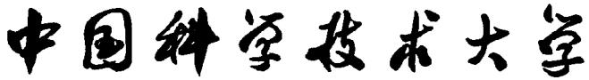

# 博士学位论文

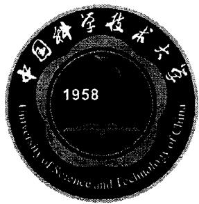

# 半导体量子点中量子比特编码研究

作者姓名： 王保传

学科专业： 物理学

导师姓名：郭国平教授曹刚特任研究员

完成时间： 二〇一七年五月

万方数据

Y3227121

# University of Science and Technology of China A dissertation for doctor's degree

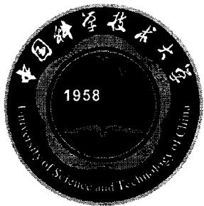

# Quantum bit encoding based on semiconductor quantum dots

Author : Bao-Chuan Wang

Speciality : Physics

Supervisor : Prof. Guo-Ping Guo R.P. Gang Cao

Finished Time : May, 2017

## 中国科学技术大学学位论文原创性声明

本人声明所呈交的学位论文，是本人在导师指导下进行研究工作所取得的成果。除已特别加以标注和致谢的地方外，论文中不包含任何他人已经发表或撰写过的研究成果。与我一同工作的同志对本研究所做的贡献均已在论文中作了明确的说明。

作者签名：

王保传

签字日期：2017.06.05

## 中国科学技术大学学位论文授权使用声明

作为申请学位的条件之一，学位论文著作权拥有者授权中国科学技术大学拥有学位论文的部分使用权，即：学校有权按有关规定向国家有关部门或机构送交论文的复印件和电子版，允许论文被查阅和借阅，可以将学位论文编入《中国学位论文全文数据库》等有关数据库进行检索，可以采用影印、缩印或扫描等复制手段保存、汇编学位论文。本人提交的电子文档的内容和纸质论文的内容相一致。

保密的学位论文在解密后也遵守此规定。

公开 保密

作者签名：王保传

导师签名：郭1月平.

签字日期：2017.06.05

签字日期：2017.6.05

万方数据

## 摘要

经过数十年的发展，量子信息科学已经成为当今最前沿的科学，量子计算更是得到了各国科学家和研究机构的极大关注。与此同时，经过半个多世纪的高速发展，半导体工业的技术水平已经达到极致。利用成熟的微纳加工技术我们能够得到纳米尺度的人工结构，从而使得精确操控单个原子和电子成为可能。在此基础之上，科学家们发展出了多种物理体系进行量子计算研究，半导体量子点正是其中最具潜力的物理体系之一。通过将囚禁在量子点中的电子的自旋或电荷分布作为构成量子比特的基本单元，利用磁场或电场精确地控制电子的状态，从而完成量子计算所需的基本门操作。在这一过程中，选择合适的电子状态作为量子比特的计算基态，即量子比特的编码，是需要重点关注和研究的方向。在本论文中，我将简单总结近年来国际上的研究成果，并对我们所做的研究工作做详细深入的介绍。

论文的主要内容包括以下几个方面：

1. 对量子计算和量子比特的基本知识进行简单的介绍，还包括半导体量子点的形成，单、双量子点的基本性质及制备样品的工艺流程；

2. 简单介绍常用的两种自旋量子比特的编码和操控方式，在实验上制备出了GaAs双量子点并介绍了我们对其中的三电子自旋态进行研究的初步结果；

3. 在双量子点中进行电荷量子比特的编码和操控，利用非绝热脉冲实现了单个比特的任意操控并利用回声技术延长了比特的消相干时间：

4. 介绍一种新的基于电子自旋和电荷分布混合编码的杂化量子比特以及其分别在 Silicon 体系和 GaAs 体系中的实验验证；

5. 在实验上制备出性质良好的线性耦合三量子点样品，并利用光子辅助隧穿技术探究其中各量子点间的相互关系；

6. 提出利用三量子点构造用于比特编码的平行能级的设想，并成功地在三量子点中构造出了平行能级，然后利用电压脉冲对其进行相于操控并给出定性的理论解释。

关键词：量子计算，半导体量子点，量子比特编码，光子辅助隧穿，杂化量子比特，消相干时间。

## ABSTRACT

Owing to the pioneers' continuos effort and great works, quantum information has become one of the most concerned research frontiers. Beyond that, quantum computation has been paid widespread attentions by science research institutes and governments around the world. In the meantime, the technological state of the art of the semiconductor industry is reaching the limit with the rapid development of half a century. Structures into nanoscale can be achieved utilizing the well-developed micro and nano fabricaiton technique, which makes it possible to manipulating a single atom or electron precisely. On this basis, scientists exploited several kinds of physical systems for realizing quantum computation. Semiconductor quantum dot shows the highest potential as one of the candidates for quantum computation. The spin or charge states of electrons trapped in quantum dots can be used for constructing a qubit, and performing the universal sets of gates needed for quantum computation through the assistance of magnetic or electric field. The quantum states of electrons that chosen to be the computational base states become the central issue of quantum dot based qubit research. In this thesis, a brief summary of several qubit encoding methods is introduced and the latest results of our own researches are presented.

The thesis is outlined as follows:

1. A brief introduction into quantum computaion and quantum bit. The structure of an identical quantum dot and the properties of single and double dot. The fabrication process of a quantum dot.

2. The encoding and manipulating of two kinds of spin qubit. High spin states research in a double quantum dot containing three electrons.

3. The encoding and manipulating of a double quantum dot charge qubit. The Larmor, Ramsey and echo experiments on charge qubit.

4. The hybrid qubit based on Silicon and GaAs double quantum dot.

5. The characterisation of a linear triple quantum dot and the strange PAT phenomenon in triple dot.

6. The proposal of forming a pair of parallel energy levels in an asymmetrically coupled triple quantum dot. The experimental realization and coherent manipulation of the parallel states in triple quantum dot.

Keywords: Quantum computaion, Semiconductor quantum dots, Qubit encoding, Photonassisted tunneling, Hybrid qubit, Decoherence time.

## 目 录

摘要……  
ABSTRACT.... . III  
目录…… V  
第一章 量子计算与半导体量子点………  
1.1 量子计算…………  
1.2 半导体量子点.. 4  
1.2.1 单量子点的基本性质.. 4  
1.2.2 双量子点的基本性质.. 8  
1.3 半导体量子点的制备… 11  
第二章 基于电子自旋编码的自旋量子比特….... . 15  
2.1 单电子自旋量子比特的编码和操控.. 15  
2.2 两电子 $S - T _ { 0 }$ 量子比特的编码和操控……………… …17  
2.3 双量子点中三电子自旋态的研究 · 20  
2.4 本章小结…. 23  
第三章 基于电子电荷分布编码的电荷量子比特研究…27  
3.1 电荷量子比特的编码方式.. … 27  
3.2 电荷量子比特的操控和读取..... . 28  
3.3 电荷量子比特的σz操作及相干性…... $\sigma _ { z }$ . 35  
3.4 利用回声技术延长电荷量子比特的相干时间....... .. 38  
3.5 本章小结………… … 42  
第四章 基于电子自旋和电荷分布混合编码的杂化量子比特…...45  
4.1 Silicon 体系中杂化量子比特的编码和操控…... . 45  
4.2 GaAs 体系中杂化量子比特的编码和操控…. . 52  
4.3 本章小结. … 57  
第五章 线性耦合的三量子点的制备和表征…… …59  
5.1 三量子点的基本结构. 59  
5.2 光子辅助隧穿 62  
5.3 三量子点体系中的光子辅助隧穿… 64  
5.4 本章小结.. 71  
第六章 利用三量子点体系实现杂化量子比特………………………………73  
6.1 三量子点体系中的比特编码方案…73  
6.2 利用电压脉冲实现三量子点中电子态的相干操控................76  
6.3 三量子点体系对平行能级的调制…79  
6.4一个可能的理论解释…………………………………………………81  
6.5 本章小结……84  
第七章总结与展望……85  
7.1总结………………………………………………85  
7.2展望……  
参考文献…… …89  
致谢…… ……………95  
在读期间发表的学术论文与取得的研究成果………………………………………97

## 第一章 量子计算与半导体量子点

## 1.1 量子计算

二十世纪以后，计算机技术的发明和进步对人类社会的发展产生了深远的影响。特别是晶体管技术的出现，不仅缩小了计算机的体积，提高了运算速度，而且极大地加速了计算机工业的进程。数十年来，计算机处理器中晶体管的集成度按照“摩尔定律”快速增加[1]，由此出现了个人计算机，掌上电脑，智能手机等现代化的计算机设备，使人类的生活变得丰富而多元。但是，随着集成度的增加，晶体管的尺寸也逐渐缩小。现代半导体工业已经开始进入7纳米制程时代，最小的晶体管尺寸不过10纳米上下。在这种极小尺度下，遵循量子力学规律的现象开始出现，晶体管的稳定性受到质疑，晶体管计算机的发展似乎正在走向尽头。而量子力学作为二十世纪最伟大的物理发现之一，影响着现代人类生活的方方面面。晶体管技术中采用的半导体材料的出现正是基于量子力学提供的理论基础。然而晶体管技术发展到今天，量子效应似乎成为了最大的障碍。

1982年，著名物理学家 Richard P. Feynman 提出了利用“量子计算机”进行物理模拟的想法[2]，基于量子力学特性构建的“量子计算机”可以用于模拟一些特定的物理问题[3,4]。在最初的十余年间，这一想法仅仅是一种奇思妙想，并没有付诸实践的可能。直到1994年，Peter Shor提出了一种可以用来完成大数因子分解的量子算法，并在理论上证明了这一量子算法可以使量子计算机拥有任何经典计算机无法比拟的速度来完成大数因子分解[5]。1996年，LovGrover又提出了一种量子搜索算法，可以极大地提高从海量信息中找到目标信息的速度[6]。以这些理论为基础，人们开始将目光聚焦到如何实现一台正在意义上的量子计算机。

现在我们所使用的经典计算机以晶体管为基本逻辑单元，采用二进制算法。每个晶体管构成一个经典的逻辑比特’，每个比特包含一组经典信息，称为“0”和“1”，对应于晶体管的“关”和“开”两种状态。同样地，量子计算机以“量子比特”为基本的逻辑单元，每个“量子比特”也包含两种基本的状态，称为“0)”和“1)”。不同之处在于，这里的|0》和1〉是量子态，具有量子叠加特性[7]。因此，量子比特的状态可以变为0)和1)任意线性叠加的叠加态|ψ)，记为：

$$
| \psi \rangle = \alpha | 0 \rangle + \beta | 1 \rangle\tag{1.1}
$$

其中， $\alpha$ 和 $\beta$ 为复数因子，一般情况下需满足 $| \alpha | ^ { 2 } + | \beta | ^ { 2 } = 1$ a

可以看到，对于一个量子比特而言，它所有的状态构成了以0}和1)为基矢的二维复数空间。而0)和|1)被称为量子比特的计算基态[7]。我们可以用

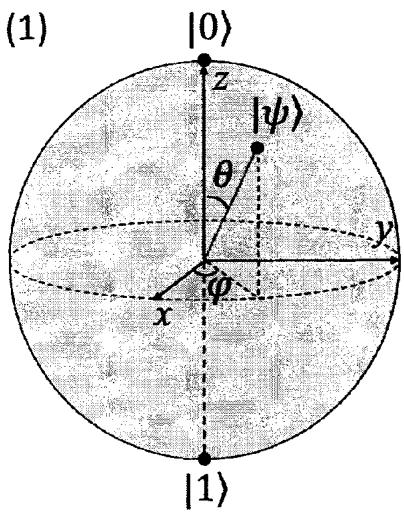

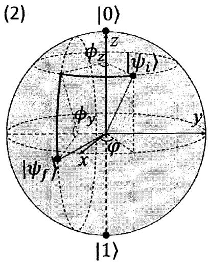  
图1.1 (1)描述量子比特状态的Bloch球示意图，0)和1)为量子比特基态， $\left| \psi \right.$ 为任意叠 加态；(2)实现单个比特任意操控示意图，比特初始态为 $| \psi _ { i } \rangle$ ，经过 $\phi _ { z }$ 和 $\phi _ { y }$ 两次 旋转到达任意末态 $\left| { \psi _ { f } } \right.$

Bloch球来描述量子比特所在的二维复数空间，如图1.1所示。Bloch球的半径为单位长度1，0和1)分别是Bloch球的北极顶点和南极顶点。我们可以将量子比特的状态重新写成球坐标下的形式：

$$
| \psi \rangle = c o s \frac { \theta } { 2 } | 0 \rangle + e ^ { i \varphi } s i n \frac { \theta } { 2 } | 1 \rangle\tag{1.2}
$$

参数 $\theta$ 和 $\varphi$ 如图中所示，他们定义了Bloch球面上任意一点的位置，也就是量子比特的任意状态。

经典比特只有两个特定的状态，通过开关晶体管使其两端“有”或“无”电流（电压），就实现了经典比特状态从“1”到“0”的变化。而对于量子比特，其状态不胜枚举，实现某个特定状态的过程可以看成其在Bloch球面上的运动，也就是改变参数 $\theta$ 和 $\varphi$ 。因此，这一过程可以分解为两个转动过程，绕x轴的转动改变参数 $\theta ,$ 绕z轴的转动改变参数 $\varphi [ 7 ]$

对经典比特进行测量，我们能够得到“0”和“1”状态中的某一个，其结果精确地反映了比特当时的状态。而对于量子比特，根据量子力学的基本规律，尽管量子比特有任意的状态，但是在测量过程中，其任意状态会坍缩到某一个基态，即{0)或1)，其测量的结果也只能得到0或1)中的某一个。但不同之处在于，我们得到的结果是概率性的[8]，测量得到0的概率为 $| { \boldsymbol { \alpha } } | ^ { 2 }$ ，得到1的概率为 $| \beta | ^ { 2 }$ 。通过一次测量，我们无法判断出 $| \alpha |$ 和 $| \beta |$ 的大小，更无法知道量子比特当时确切的状态。但是经过足够次数的重复测量，我们能够得到 $| \alpha |$ 和β|的估计值。

这种“叠加性”和“概率性”正是量子比特强大能力的来源。对于经典比特，每一个比特只能存储一个信息，一次操作过程也只能改变一个信息。而“叠加性”使得一个量子比特能够同时存储大量信息，对一个比特进行操作就是同时对大量信息进行操作。当存在多个量子比特相互级联（耦合）时，整个系统所能够存储的信息量是惊人的，一步操作所能够完成的信息处理过程更是不可想象的。这就使得量子计算具有天然的“并行性”，可以极大地提高信息处理的速度。

另一方面，测量过程中的“概率性”使得我们无法得到量子比特的完整状态信息，这似乎会造成信息的丢失，其实不然。我们知道，经典信息处理的结果中包含大量无效的信息，甚至信息处理中间环节的结果也会被呈现出来，这种大量的无效信息是对处理资源的极大浪费。而量子计算中的“概率性”抛弃了绝大多数信息，所抛弃的信息中的绝大多数都是无效的。尽管我们得到的最终结果是一个概率性的结果，但是相对于抛弃的无效信息来说，其代价是很小的。以Shor的大数因子分解算法为例，这一算法也是一种概率性的量子算法。对于同一个输入信息，每一次处理的结果可能不同。但是我们知道，相对于因子分解过程，对结果的验证所耗费的资源完全可以忽略不计。因此，如果某一个结果不正确，我们只需要重新计算，直到结果正确为止[5]。

既然量子计算有如此明显的优势，那么我们怎样才能得到像经典处理器(CPU)那样的量子处理器呢？在达到这一雄心勃勃的目标之前，我们必须从源头开始，先得到一个稳定可靠的量子比特单元。我们知道，任何一个物理系统都不可能与周围环境完全隔绝开来。量子比特单元与周围环境的相互作用时刻存在，在对量子比特操控的过程中，其与周围环境的耦合会使比特的相位信息逐渐丢失，也就是比特状态 $| \psi \rangle = c o s \frac { \theta } { 2 } | 0 \rangle + e ^ { i \varphi } s i n \frac { \theta } { 2 } | 1 \rangle$ 中的参数 $\varphi$ 逐渐丢失。这一过程称之为消相于过程，比特相位信息完全丢失需要的时间称为消相干时间[9]10]。如果量子比特的消相干时间太短，以至于我们来不及在他的状态信息丢失之前完成操控，那么这一量子比特也就无法用于实现量子计算，而这正是量子计算所面临的最大的困难和挑战。

在过去的二十年里，科学家们提出了多种用于构建量子比特单元的物理体系，例如：量子光学体系[11,12]，离子阱体系[13,14]，核磁共振体系[15,16]，超导电路体系[17-19]，半导体量子点体系[20,21]等等。在衡量一个物理体系是否具有实现量子计算的潜力时，我们通常会用到DiVincenzo判据[22]:

1. 能够形成易于表征的量子比特，且具有扩展的能力；

2. 能够被制备到一个简单的基准态；

3. 拥有远长于操作时间的消相干时间；

4. 能够完成普适的逻辑门操作；

5. 比特的状态能够被精确地测量。

这五个判据中，尤其以第三条最为重要。我们必须得到足够长的消相干时间，来完成一个量子算法所需的全部操作[7]。因此，对于各物理体系来说，目前最重要的指标就是消相干时间的长短。而在对量子比特的操控实验中，测量其消相干时间也是最主要的任务。

## 1.2 半导体量子点

前面提到，二十年来科学家们发展出了多种构建量子比特单元的物理体系，而半导体量子点则是最有潜力实现量子计算的体系之一。什么是半导体量子点？简单来说，半导体量子点就是束缚在半导体材料中的电子所形成的“零维”量子体系，我们通常形象地把它称为“人造原子”。

量子点体系的出现正是得益于数十年来高速发展的半导体工业。随着半导体工业的发展，纳米加工技术也日新月异。上个世纪90年代，科学家们已经能够利用纳米加工技术制作出百纳米左右的微小结构。利用这些微小结构人为地在传统半导体材料上构造出势阱，从而将材料中的自由电子束缚住，得到一个个孤立的束缚电子[23]。而束缚电子会占据势阱中一系列分立的能级，我们利用这些分立的能级构成量子比特所需的计算基态，那么处于这些能级上的电子便成为了最小的量子计算单元[20]。

根据半导体材料体系以及构成势阱所用方式的不同，可以得到多种类型的半导体量子点，而我们这里所研究的是所谓的“门控量子点”(GateDefinedQuantum Dots）[24,25]。利用半导体能带理论，改变半导体材料的堆叠方式，并且采用恰当的原子掺杂，我们可以在不同半导体材料的界面处形成特殊的能带结构，并且在其中得到一层薄薄的导带电子，我们称之为二维电子气(2DEG)。再利用纳米加工技术在半导体材料上制作出一系列的微小金属电极，通过在电极上施加合适的电压从而在2DEG处形成束缚势场，当2DEG中的自由电子落入这一束缚势场后，我们便得到了所谓的门控量子点，如图1.2所示。这一方法已经在 GaAs/AlGaAs 异质结 [23]，Si/SiGe 异质结 [26]， $\bf { S i } / \bf { S i O _ { 2 } }$ 异质结 [27]等材料中成功实现。下面我们就对门控量子点的基本性质做一个简单的介绍。

## 1.2.1 单量子点的基本性质

顾名思义，单量子点指的就是一个电势阱与其中束缚的电子。从空间上看，金属电极产生的电势场将量子点所在区域与周围环境隔绝开来，形成了一个个所谓的“孤岛”，如图1.3所示。自由电子被困在“孤岛”上，成为了束缚电子。在“孤岛”的两侧，分别是含有大量自由电子的“电子库”，我们称之为源极和漏极。“孤岛”上的电子想要重获自由回到“电子库”中，则必须要穿过他们之间的电势场，即势垒，这一过程称为隧穿[25]。

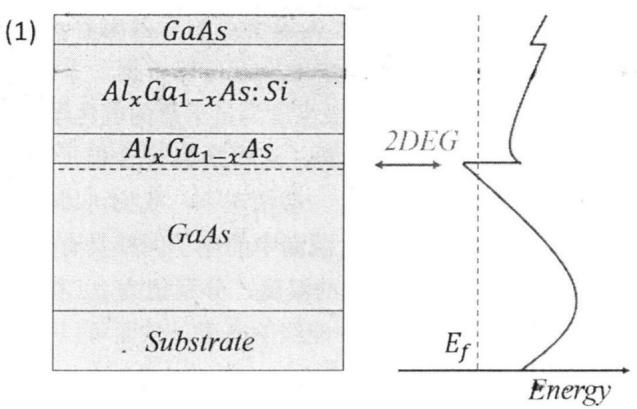

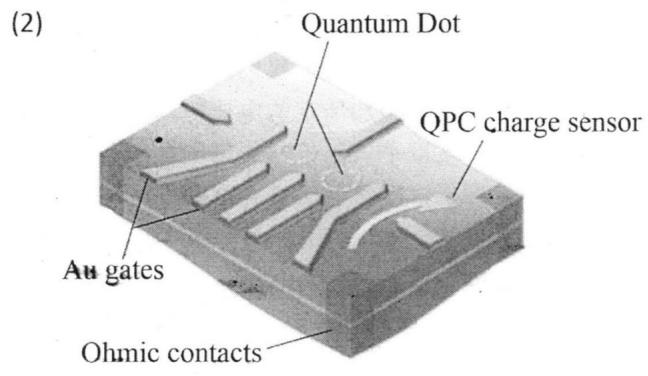  
图1.2 (1) GaAs/AIGaAs异质结示意图，红色虚线所示为二维电子气（2DEG）所在位置。(2)门控量子点示意图，灰色结构为纳米加工制作的金属电极。紫色区域为连接2DEG 的欧姆接触。

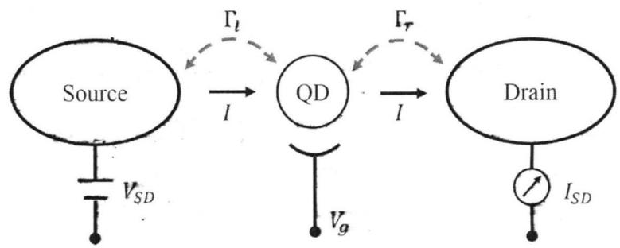  
图1.3 单量子点结构示意图， $\Gamma _ { l }$ $\Gamma _ { r }$ 分别为量子点与源漏间电子隧穿率， $V _ { g }$ 为量子点栅电极电压。

将量子点冷却至极低温，至少满足条件： $R _ { t } \gg h / e ^ { 2 } , ~ e ^ { 2 } / C \gg k _ { B } \mathcal { T }$ ，其中，$R _ { t }$ 为量子点与源漏间的隧穿电阻，C为量子点的有效电容，kB为玻尔兹曼常 $k _ { B }$ 量，T为所处的温度。这时，量子点中的电子可以占据一系列分立的能级，从而具有不同的能量，我们称最高的能级高度为量子点的电化学势，记为 $\mu _ { N \circ } ~ \mu _ { N }$ 表示量子点中有N个电子时的电化学势，这也是第N个电子进入量子点所需的最小能量，如图1.4.3中示意图所示。一般情况下，我们可以将相邻电子的电化学势差称为量子点的“充电能” $E _ { C }$ 。源漏中的电子同样具有一定的能量，能量大小由费米能级决定，取决于其所处的温度，分别记为 $\mu _ { S }$ 和 $\mu _ { D }$ 。改变量子点栅电极上的电压 $V _ { g }$ 可以调节量子点中能级的高度，从而可以使其中的电子进入源漏，或者相反，从源漏中进入量子点。

我们通常采用测量从源极经过量子点到漏极的电流来表征量子点的基本性质，称为输运测量，测得的电流称为输运电流 $I _ { S D }$ ，测量电路如图1.3中示意。当有电子从源极经过量子点进入漏极时，我们便可以在漏极处测得电流。在测量电流时我们还需要在源漏两端施加一一定的电压差，但是通常很小，几乎不会对源漏的费米面产生影响。当量子点的束缚势场不是很紧时，量子点中占据的电子数目很多，电子进入量子点所需的能量几乎是连续变化的，得到的输运电流信号也是连续的。而当束缚势场很紧时，量子点中电子数目减少，进入量子点需要的能量的间隔逐渐变大，这时测得的输运电流信号逐渐分立。当我们调节 $V _ { g }$ 改变量子点中能级高度时，便会出现一个个分立的电流信号峰，如图1.4所示，这一现象我们称之为“库伦振荡”（Coulomb Oscillation）[28]。

首先，当源漏费米面没有高度差时，即 $\mu _ { S D } = 0$ ，量子点工作在“零偏压”下。通过测量输运电流 $I _ { S D }$ 随电极电压 $V _ { g }$ 的关系，我们可以得到一条“库伦振荡”曲线，如图1.4.1所示。曲线中出现电流峰时，量子点中电化学势 $\mu _ { N }$ 的高度刚好与源漏费米面平齐， $\mu _ { S } = \mu _ { N } = \mu _ { D }$ 。电子可以从源极进入量子点再进入漏极，产生电流信号，称为“共振隧穿”，对应的电流峰为“共振隧穿峰”。而当 $\mu _ { N } \neq \mu _ { S } = \mu _ { D }$ 时，电子无法从源漏进入量子点，量子点中的电子也不能进入源漏，于是不会出现电流信息，我们称量子点位于“库伦阻塞”（CoulumbBlockade）区，也就是图中每个电流峰之间的区域。电流峰的间距则反映出了电化学势的高度差 $\Delta \mu _ { N } = \mu _ { N } - \mu _ { N - 1 }$ ，可以简单认为是量子点的充电能。在多电子区，每个电子的充电能是几乎相等的，即 $\Delta \mu _ { N } = \Delta \mu _ { N - 1 }$ ，对应的电流峰的间距也是相等的。但是仅从这一条“库伦振荡”曲线中的峰间距我们并不能得到充电能的大小，因为其电压差是栅电极的电压，和量子点之间是电容耦合的关系，需要一个电压能量转换系数（lever arm）α才能得到能量的大小。

为此，我们介绍第二种情形：源漏费米面间存在一个高度差。我们在源漏之间额外施加一个较大的直流电压差 $V _ { S D }$ ，这时源漏费米面间存在一个高度差$\Delta \mu _ { S D } = e V _ { S D }$ ，如图1.4.2所示。 $\Delta { \mu } _ { S D }$ 的存在使得源漏间出现一个所谓的偏压窗口（Bias Window）， $\mu _ { B W } = \Delta \mu _ { S D }$ 。当 $\mu _ { B W } = 0$ 时，我们便问到了上面“零偏压”下的情形，只有当 $\mu _ { S } = \mu _ { N } = \mu _ { D }$ 才能出现输运电流。我们增大 $V _ { S D }$ $\mu _ { B W }$ 也随之增大，如果 $\mu _ { N }$ 刚好进入了BW的范围内，即 $\mu _ { S } \geqslant \mu _ { N } \geqslant \mu _ { D }$ ，我们就能测到输运电流。如果 $\mu _ { N }$ 不在BW的范围内，即 $\mu _ { N } > \mu _ { S } > \mu _ { D } > \mu _ { N - 1 }$ ，那么电子无法进入量子点，从而测不到输运电流，即进入 $\overline { { \int } } ^ { \infty }$ 库伦阻塞”区。继续增大 ${ \mu } _ { B W }$ 一直到其超过量子点的充电能时， $\mu _ { S } \geqslant \mu _ { N } > \mu _ { N - 1 } \geqslant \mu _ { D }$ ，这时，总是会有 $\mu _ { N }$ 落入BW的范围内，因此输运电流一直存在。

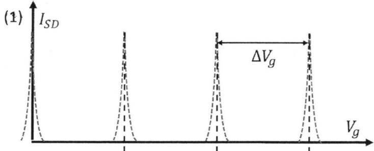

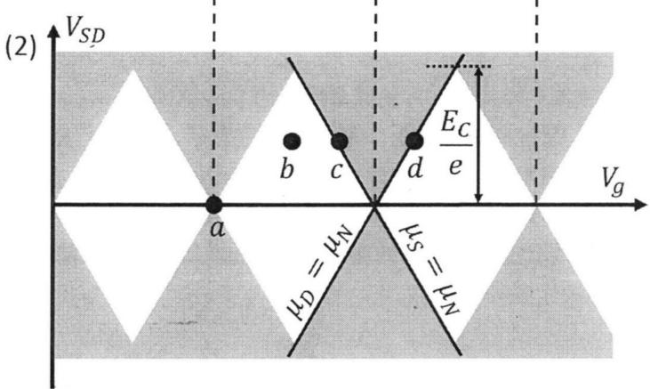

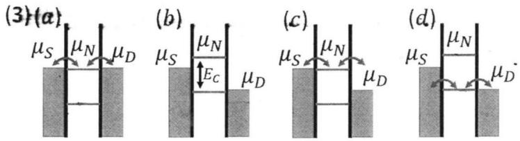  
图1.4 单量子点输运测量结果。(1)库伦振荡曲线，每个库伦峰对应一次电子隧穿过程。库伦菱形图，红色区域为有电流的区域。(3)四种输运情形，分别对应(2)中的a、b、c和d。

我们通过扫描 $V _ { S D }$ 和 $V _ { g }$ 得到如图1.4.2所示的相图。图中可以看到由一个个“菱形区域”构成的“库伦阻塞”区，沿 $V _ { S D }$ 对称分布，我们称为“库伦菱形图”(CoulumbDiamond)。在 $V _ { S D } = 0$ 处沿水平方向拉一条线，便得到图41中的库伦振荡曲线，曲线上每个电流峰对应于相邻库伦菱形的连接点，图中由虚线做出标记。库伦菱形两个正反斜率的边分别对应 $\mu _ {  { N } } = \mu _ {  { D } }$ 和 $\mu _ {  { N } } = \mu _ { S }$ 两种情形，已在图中标出。在库伦菱形所在的 $V _ { S D }$ 范围内， $\mu _ { B W } < E _ { C }$ ，存在库伦阻塞。当 $V _ { S D }$ 超过库伦菱形上下两个顶点位置后， $\mu _ { B W } > E _ { C }$ ，库伦阻塞消失，电流随 $V _ { g }$ 一直存在。因此，库伦菱形两个顶点对应的 $V _ { S D }$ 就代表充电能的大小， $E _ { C } = e \vert V _ { S D } \vert$ 。结合从 $V _ { S D } = 0$ 处得到的将 $\mu _ { N } = \mu _ { S }$ 调节为 $\mu _ { N - 1 } = \mu _ { S }$ 所需的栅电极电压改变量 $\Delta V _ { g }$ ，我们便可以得到前面所说的电压能量转换系数α：

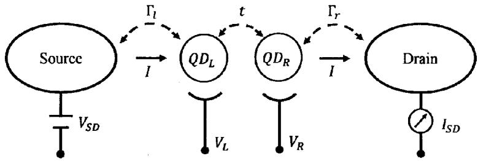  
图1.5 串联双量子点结构示意图，t为量子点间的隧穿耦合强度。

$$
\alpha = \frac { | V _ { S D } | } { \Delta V _ { g } }\tag{1.3}
$$

需要指出的是，这里所说的电化学势 $\mu _ { N }$ 指的是第N个电子进入量子点所需的最小能量，只能用来描述靠近源漏费米面的电子进出量子点时的能量变化。前面用到的 $\mu _ { N } - \mu _ { N - 1 }$ 指的是量子点中电子从N变化到N-1时的能量差。如果电子数目没有变化，单纯地讨论 $\mu _ { N }$ 和 $\mu _ { N - 1 }$ 是没有意义的。电子数目N保持不变时，第N个电子和第N-1个电子的能量差是由束缚势场产生的分立量子能级差决定的。例如，当考虑电子自旋简并时，如果第N和第N-1个电子刚好位于同一轨道下不同自旋的简并能级上，那么实际上他们的能量是相同的，但是当他们分别进入量子点时，他们所需的能量差等于充电能 $E _ { C } = \mu _ { N } - \mu _ { N - 1 }$

## 1.2.2 双量子点的基本性质

简单介绍了单个量子点的基本性质之后，我们来讨论一下更为复杂的双量子点的性质。所谓双量子点，指的是在空间上离得很近的两个单量子点组成的复合结构。根据空间位置关系，有两种类型的双量子点结构：一种称为“并联”双量子点，类似于并联电阻，两个单量子点间存在耦合，但是他们各自也与源极和漏极直接耦合，形成“工”字型结构；另一种称为“串联”双量子点，类似于串联电阻，两个单量子点存在耦合，但是他们分别只和源极或漏极耦合，形成“一”字型结构。我们在这里只讨论第二种情形，即串联双量子点，如图1.5 所示[29]。

双量子点之所以有别于单量子点就在于两个量子点间存在的耦合作用，如果不存在耦合，那么他们也就仅仅是两个孤立的单量子点，不存在讨论的价值。因此，双量子点中最重要的参数便是点间耦合的大小。

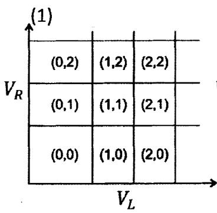

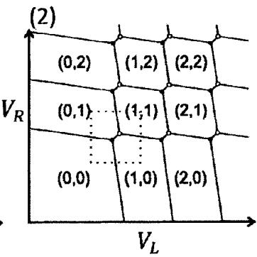

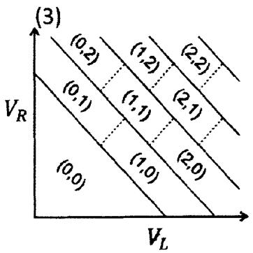

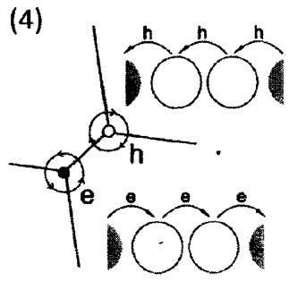  
图1.6 双量子点相图。(1)两个量子点间没有耦合，为两个孤立的单点。(2)量子点间存在隧穿耦合，但耦合较弱。(3)量子点间耦合非常强，逐渐融合成一个大的单量子点。(4)三相点示意图。e和h分别表示电子和空穴输运过程。（图片引自文献[29])

根据点间耦合强度的大小，可以将双量子点划分为三种类型：无耦合、弱耦合和强耦合，如图1-6中(1)、(2)和(3)所示。无耦合指的是两个量子点被很强的势垒完全隔开，点与点之间只存在电子的库伦排斥作用，不能发生电子的交换，这时双量子点便是两个孤立的单量子点；弱耦合指的是两个量子点间的势垒较低，点与点间不仅存在库伦排斥作用，而且能够发生电子交换，电子可以从一个点隧穿到另一个点；强耦合则指的是两个点间的势垒非常低，以至于接近形成一个大的单量子点。而我们在实验中一般需要的是两个存在弱耦合的量子点，这里做重点介绍。

我们首先来介绍一下双量子点的基本测量方式，单点中我们通常采用输运测量的方式，这在双量子点中也同样适用，如图1.5所示为双量子点输运测量示意图。我们用 $\mu _ { S }$ 和 $\mu _ { \mathcal { D } }$ 表示源漏的费米面， $\mu _ { L } ( \boldsymbol { \cal { M } } , \boldsymbol { \cal { N } } )$ 和 $\mu _ { \bar { n } } ( M , N )$ 表示左右量子点中分别占据和个电子时各自的电化学势。

首先，当源漏处于“零偏压”状态时，通过调节栅电极VL和VR改变两个 $V _ { L }$ $V _ { R }$ 量子点中的能级高度，可以看到只有当 $\mu _ { S } = \mu _ { L } ( M , N ) = \dot { \mu } _ { R } ( M , N ) = \mu _ { D }$ 时，电子才能从源极进入左量子点再通过右量子点进入漏极，我们才能测到电流。

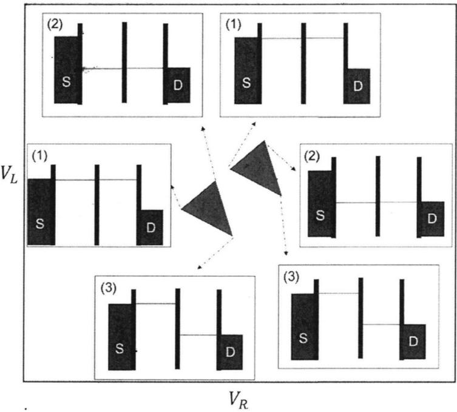  
图1.7 双量子点输运测量结果。 $( 1 ) \mu _ { L } = \mu _ { R } = \mu _ { S ^ { \circ } } ( 2 ) \mu _ { L } = \mu _ { R } = \mu _ { D ^ { \circ } } ( 3 ) \mu _ { L } = \mu _ { S }$ 及$\mu _ { R } = \mu _ { D }$ (图片引自 Ke Wang PhD Theis)。

从相图上看，这仅仅对应于图中的一个点。当然，由于点间的隧穿耦合作用，通常我们得到的是一对点。分别对应： $\mu _ { S } = \mu _ { L } ( M , N ) = \mu _ { R } ( M , N ) = \mu _ { D }$ 和$\mu _ { S } = \mu _ { L } ( \boldsymbol { 1 } I - \boldsymbol { 1 } , N ) = \mu _ { R } ( \boldsymbol { M } , N - \boldsymbol { 1 } ) = \mu _ { D }$ ，如图1.6.4所示。

当给源漏间加上一个偏压 $V _ { S D }$ 时，源漏间便出现了一个偏压窗口BW，高度为 $\mu _ { B W } = e V _ { S D }$ 。此时，情形变得复杂的多。当 $\mu _ { L } ( M , N )$ 和 $\mu _ { R } ( M , N )$ 同时落入BW，且满足 $\mu _ { S } \geqslant \mu _ { L } ( M , N ) \geqslant \mu _ { R } ( M , N ) \geqslant \mu _ { D }$ 时，电子可以从源极经过左右量子点进入漏极，从而出现电流。只要 $\mu _ { L }$ 和 $\mu _ { R }$ 中有一个不在BW内，或者 $\mu _ { L } < \mu _ { R }$ ，都不能出现电流。此时我们可以得到图1.7中所示的相图，可以看到“零偏压”下的两个点变为了两个三角形，称为“偏压三角形”。偏压三角形的几个顶点所对应的电化学势的相互关系已在图中注明。

对双量子点进行研究时更常用的一种测量方法称为“电荷感应测量”（chargesensingmeasurement)。通过在双量子点附近制作额外的探测电极来形成一个电导通道，称为量子点接触（QPC）。当QPC通道的束缚势场增加时，其电导$g _ { Q P C }$ 逐渐呈现量子化现象[30]。改变电极电压 $V _ { Q P C }$ 时， $g _ { Q P C }$ 呈台阶状变化，相邻台阶的高度就是一个量子电导 $g _ { 0 } = e ^ { 2 } / h$ 如图1.8.1所示。我们将 $g _ { Q P C }$ 置于两个台阶之间剧烈变化的位置，可以让其获得非常高的电荷感应灵敏度，附近量子点中的电场分布发生细微的变化也能被 $g _ { Q P C }$ 及时地感知到。因此，我们通过扫描栅电极电压 $V _ { L }$ 和 $V _ { R }$ 并测量 $g _ { Q P C }$ 的大小，便可以得到量子点中的电子分布状态，称为“电荷稳态分布图”（charge stability diagram)。如图 1.8.2所示为源漏“零偏压”下的电荷稳态分布图，其中goP $g _ { Q P C }$ 由其微分信号 $d g _ { Q P C } / d V _ { L }$ 代替，图中所示的区域即为上述输运测量相同的区域，由于其形状很像蜂巢，因此我们也称之为“蜂窝图”。

图中蓝线和绿线（负斜率）分别对应 $\mu _ { L } = \mu _ { S }$ 和 $\mu _ { R } = \mu _ { D }$ ，是由电子在量子点和源漏间隧穿产生的，称为充电线（chargingline）。蓝线和绿线的一对交叉点即为“零偏压”下输运测量相图上的两个点，称为“三相点”，分别对应“电子输运过程”和“空穴输运过程”。所谓“电子输运过程”指的是电子按照源极→ 左量子点 → 右量子点 → 漏极的顺序从源极一路输运到漏极，即$( M , N ) {  } ( M + 1 , N ) {  } ( M , N + 1 ) {  } ( M , N )$ ；而“空穴输运过程”指的是右量子点中的电子先进入漏极，在右点留下一个空穴，再由左点中的电子补充到右点，在左点留下一个空穴，最后由源极进入一个电子补充左点的空穴，即$( M , N ) { \longrightarrow } ( M , N - 1 ) { \longrightarrow } ( M - 1 , N ) { \longrightarrow } ( M , N )$

图中连接两个三相点的红线（正斜率）对应 $\mu _ { L } ( M , N - 1 ) = \mu _ { R } ( M - 1 , N )$ 是由电子在两个量子点间隧穿产生的，称为“共振隧穿线”（interdot transitionline)。经过共振隧穿线，电子从一个量子点隧穿到另外一个量子点，因此其两侧的电子数分别为 $( M , N - 1 )$ 和 $( M - 1 , N )$ 。图中已将每条线和每个特征点的电化学势相互关系一一标明。

类似于单量子点中得到充电能和lever arm的办法，我们利用输运测量也可以得到双量子点中每个量子点的充电能和栅电极对点中能级的调节效率。但是由于双量子点中存在隧穿耦合，以及栅电极对两个点的交叉耦合，其方法要复杂的多，我在这里不再赘述，有兴趣的读者可以参考引文[29]。而双量子点最重要的参数：点间隧穿耦合强度，则需要更精细的测量方法才能得到，这在后面的实验中将有所介绍。

## 1.3 半导体量子点的制备

上一节中我们提到过如何得到一个半导体门控量子点，那么这一节中我们就这一问题做一个略微详细的介绍。首先必须要指出的是，对于不同的半导体材料，制备量子点所需的工艺流程差别很大。但是总体上来说都包括以下几种工艺步骤：

1. 紫外光刻工艺：主要是利用对紫外光敏感的光刻胶，经过掩膜曝光和显影可以得到微米级的图形结构。

2. 刻蚀工艺：利用物理或化学方法去除基片上不需要的部分。可大致分为湿法和干法刻蚀两种：湿法刻蚀通常是利用酸性溶液与材料发生化学反应生成可溶解产物；而干法刻蚀通常是利用等离子体轰击材料，通过物理或化学反应去除目标材料。

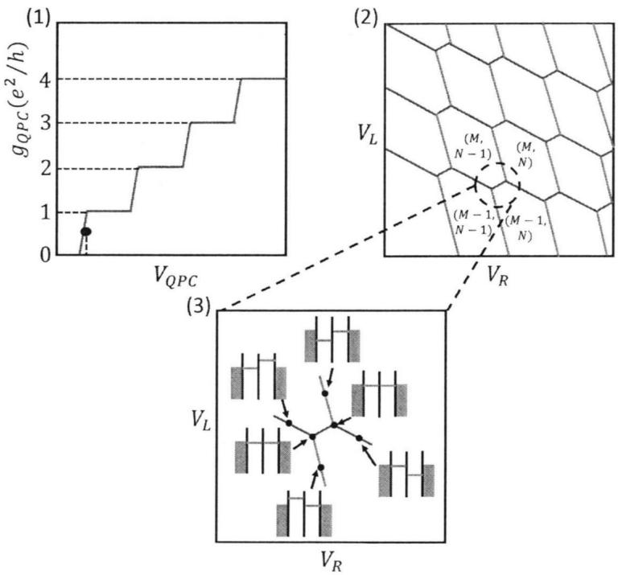  
图1.8 双量子点电荷感应测量结果。(1)QPC量子化电导示意图，黑点为QPC工作时所在的位置。(2)QPC测量得到的电荷稳态分布图，每条充电线对应一个QPC微分电导峰。(3)双量子点充电线反交叉区域对应的电化学势关系。

3. 金属沉积工艺：主要是将金属原子沉积在基片表面以制备金属电极。按照金属原子产生方式的不同可分为热蒸发、电子束蒸发和磁控溅射等。

4. 电子束曝光工艺：主要是利用对电子束敏感的抗蚀剂，经过受控电子束照射和显影可以得到纳米级的图形结构。用于制备量子点的核心结构。

5. 原子层沉积工艺：主要是用来在基片表面制备一层绝缘介质，通常是$\mathrm { { \bf A l _ { 2 } O _ { 3 } } , \Delta H f O _ { 2 } }$ 等。

下面以我们使用的经过 Si掺杂的GaAs/AIGaAs异质结制备量子点为例来介绍整个工艺流程，如图1.9所示。

经过上述流程，我们便可以得到一块用于测量的GaAs量子点样品。尽管流程并不复杂，但是纳米加工技术本身是一项非常细致的工作。想要得到性质稳定良好的样品，除了掌握上面列举的各种仪器的基本操作之外，在样品制备环节的每一步都需要耐心细致。例如，清洗基片时，在不同溶液中浸泡的顺序，时间，氮气枪吹干的角度，时间等，都会对基片的洁净程度造成影响。还有，半导体材料的晶向问题，沿着不同的晶向，材料被刻蚀的速率不同，刻蚀后的台阶会形成不同角度的倾角，台阶过于垂直，金属电极跨过台阶时很容易断裂，因此需要将电极从台阶平缓处跨过去。再如，高温退火时间的把握，既要保证金属和二维电子气导通，又要避免引入过多的杂质进入基片，这就需要对退火时间进行多次测试。除此之外，整个加工环节中需要注意的细节还有很多，每一步操作每一个细节都必须认真对待，某一个小问题的差错就会导致整个加工流程失败，这也正是这一领域的难点所在。

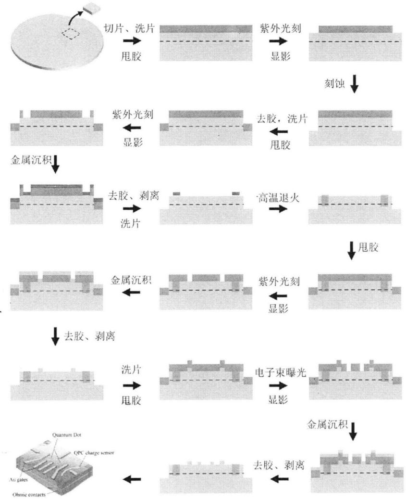  
图1.9 掺杂GaAs/AIGaAs异质结量子点制备工艺流程图。浅蓝色区域为半导体材料基片，绿色为紫外光或电子抗蚀剂，棕色为欧姆接触金属，黄色为表面栅电极金属。

## 第二章 基于电子自旋编码的自旋量子比特

从第一章关于半导体量子点的基本介绍中我们了解到，从原理上来看，半导体量子点是一种十分理想的实现量子计算的固态体系[20]。在此基础上，各国的科学家们提出了若干种利用半导体量子点进行量子计算的方案。其中最具可行性的方案包括：利用单个量子点中的单电子的自旋态进行编码[31]，利用双量子点中两个电子的自旋单态和三态进行编码[32-34]，利用双量子点中三个电子的自旋混合态进行编码[35-37],，利用线性耦合的三量子点中三个电子的自旋混合态进行编码[38,39]，以及利用双量子点中电子电荷分布进行编码等[40-42]。除最后一种编码方式外，利用前面几种方案实现编码的量子比特都可以归类为自旋量子比特。在本章中，根据我们的研究方向，我们着重介绍基于双量子点中电子自旋单态和三态的方案，以及我们在这方面所做的一些研究工作[43]。

## 2.1 单电子自旋量子比特的编码和操控

上面提到，利用电子自旋进行量子比特编码的方案有多种，我们首先介绍一种原理最简单的方案：利用单个电子的自旋向上↑)和自旋向下↓》作为量子比特的基态[20]。在没有外磁场的情况下，电子的两个自旋态是能量简并的，不能作为构成量子比特所需的两个正交基。但是在存在外磁场 $B _ { z }$ 的作用下，由于塞曼分裂，电子的两个自旋简并态分裂为具有一定能量差的非简并态，如图2.1所示。此时，↑)和↓)形成了一个有效的二能级体系，我们就可以将这两个非简并的自旋态作为量子比特的基态，从而进一步实现量子计算所需的量子相干操作。

我们知道，电子自旋只与磁场产生直接的相互作用。因此想要实现编码比特的|↑)和↓)之间的翻转，最直接的方法就是利用一个交变的磁场来驱动电子自旋的翻转，我们称之为电子自旋共振(ESR)，其原理和核磁共振是类似的[31,44-47]。首先我们对量子点体系施加一个恒定的外磁场 $B _ { z }$ ，电子自旋发生劈裂，其能级差为 $\Delta E = g _ { e } \mu _ { B } B _ { z }$ ，其中 $g _ { e }$ 为材料中电子的旋磁比（g因子）。然后我们再对其施加个交变的磁场 $B _ { a c }$ ，振荡频率为 $\nu _ { \mathrm { ~ c ~ } }$ 由 ESR我们可以得到：

$$
h \nu = g _ { e } \mu _ { B } B _ { z }\tag{2.1}
$$

从中可以看出，当频率 $\nu = g _ { e } \mu _ { B } B _ { z } / h$ 时，交变磁场 $\boldsymbol { B } _ { a c }$ 可以与电子白旋发生共振，从而完成对电子自旋态的翻转，一般我们称之为拉比振荡（RabiOscillation)。而翻转的快慢，即拉比振荡频率，则取决于 $B _ { a c }$ 的振幅（或者说功率)。

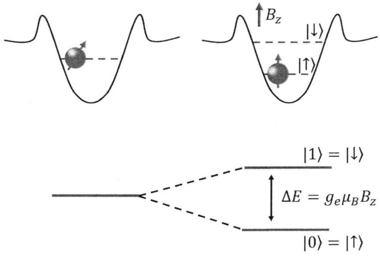  
图2.1 单电子自旋态示意图

实验上通常是通过在量子点附近制作一条额外的金属电极，在电极上通过交变电流来产生交变磁场的，如图2.2.1所示样品结构图[47]。我们改变交变磁场的持续时间，从而实现比特在↑〉和↓〉间的持续翻转，可以得到图2.2.3所示的Rabi振荡曲线。该实验中得到的最大Rabi振荡频率为3.3MHz，对应于比特在 Bloch球上绕x轴转动π/2的角度的时间约为 75ns。

而比特的读取既可以采用输运测量，也可以采用QPC或者SET进行测量[48]。测量的基本原理，都是利用比特|↑〉和↓〉之间的能级差造成的不同状态下的电子与源漏间的隧穿率的区别，处于较高能级的电子可以克服势垒进入源漏，而较低能级的电子则无法克服势垒从而被束缚在量子点中。据此可以测量流过量子点的电流大小，或者通过QPC或SET对量子点的电荷感应来区分电子的不同状态。

这种方案的优势在于，单个电子的自旋只和磁场产生直接的相互作用，电场和电子自旋之间没有直接的相互作用，而他们之间的间接相互作用通常是非常微弱的，如自旋轨道耦合相互作用[49]。这样，各系统中（包括半导体材料体系本身和外界的测量系统等）主要的噪声——电噪声对这个量子系统的干扰能够被抑制到最低的程度[50,51]。因此，单个电子自旋态构成的量子比特的相干性能够得到很好的保护，使得我们得到的量子比特具有很长的相干时间（目前利用单个电子自旋进行编码的量子比特的相干时间已经达到秒量级）[52]，这对于实现长时间、多节点的量子操控是十分重要的。但是另一方面，这种方案也存在一些劣势，这些劣势同样来源于单电子自旋态的特性。正如上面所指出的，单个电子的自旋态只和磁场存在直接的相互作用，而且这种直接相互作用的强度由半导体材料和磁场强度决定。通常来说，电子自旋和磁场的相互作用强度很弱，这在很大程度上增加了实验上对单个电子自旋进行操控的难度。同时，这也使得利用磁场操控电子自旋态翻转的速度很慢（目前实验上能够实现的最快的操作速度也只能够达到10MHz）[53]。这对于实现长时间、多节点的量子操控又是不利的。

(1)  
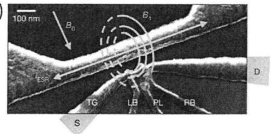

(3)  
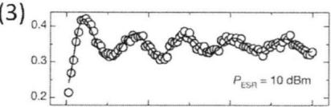

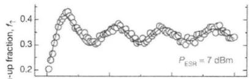

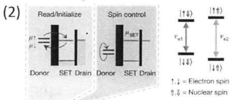

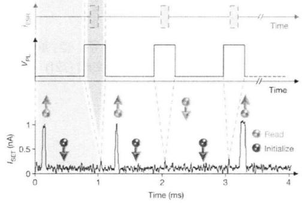

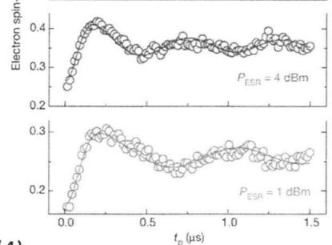

(4)  
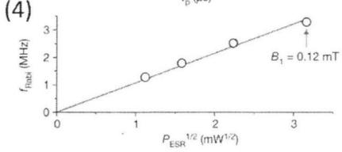  
图2.2 单电子自旋编码方案。(1)样品结构图， $B _ { 0 }$ 为外加恒定磁场大小， $B _ { 1 }$ 为操控所用的交变磁场振幅。(2)进行比特操控采用的交变磁场序列和比特状态读出方式。(3)四种不同驱动功率下的Rabi振荡曲线。(4)Rabi振荡频率随驱动功率变化关系。(图片引自文献[47])

## 2.2两电子 $S - T _ { 0 }$ 量子比特的编码和操控

另外一种自旋量子比特的编码方案是利用占据两个量子点中两个电子所形成的自旋单态和自旋三态进行编码[32,54]。这种方案也是我们在实验中采用并着重研究的方案，下面我们着重介绍这种编码方式。

在双量子点中电子态(1,1)-(0,2)的电子隧穿区域，如图2.3所示，失谐量$\varepsilon < 0$ 时，电子态为(1,1)，即两个电子分别占据一个量子点。这两个电子根据自旋的配对方式不同，可以形成自旋反平行的单重态Singlet(S=0）|S〉，以及自旋平行的三重态Triplet $( \mathrm { S } { = } 1 ) \vert { T } _ { 0 } \rangle , \vert { T } _ { + } \rangle$ 和 $\left| T _ { - } \right.$ ，对应于 $m _ { s } = 0$ 、+1和-1，可以分别写为：

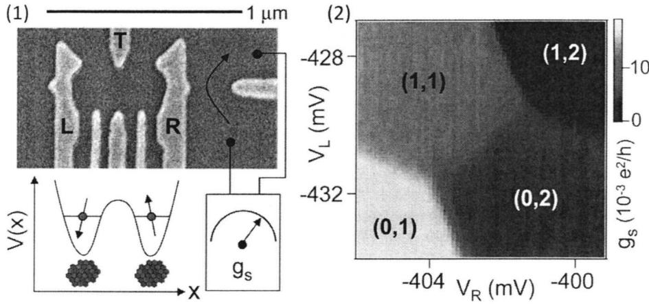  
图2.3 (1)双量子点样品结构图，下方示意图表示左右两边各占据一个电子。(2)量子点工作于电子态(1,1)-(0,2)反交叉区域的电荷稳态分布图。(图片引自文献[32])

$$
\begin{array} { r l } & { | S \rangle = ( | \uparrow \rangle | \downarrow \rangle - | \downarrow \rangle | \uparrow \rangle ) / \sqrt { 2 } , } \\ & { | T _ { 0 } \rangle = ( | \uparrow \rangle | \downarrow \rangle + | \downarrow \rangle | \uparrow \rangle ) / \sqrt { 2 } , } \\ & { | T _ { + } \rangle = | \uparrow \rangle | \uparrow \rangle , } \\ & { | T _ { - } \rangle = | \downarrow \rangle | \downarrow \rangle . } \end{array}\tag{2.2}
$$

而在 $\varepsilon > 0$ 处，电子态为(0,2)。此时两个电子同时占据右边量子点，这两个电子也可以形成自旋单重态和三重态。为了和(1,1)电子态下的单态进行区分，我们将这里的单态记为(0,2)S，而前面的单态记为(1,1)S。由于此时的三态的能量太高（一般比基态(0,2)S 高约 $4 0 0 \mu \mathrm { e V } )$ ，故在这里不参与比特的编码和操控。

在(1,1)电子态下，如果两个量子点间没有隧穿耦合，那么其中的S、 $T _ { 0 } .$ $T _ { + }$ 和T\_是能量简并的。在外磁场的作用下， $T _ { 0 } , \ T _ { + }$ 和 $T _ { - }$ 由于自旋量子数不同，会发生能级劈裂。而S和 $T _ { 0 }$ 由于自旋量子数相同，仍然是简并的。但是当两个量子点间存在隧穿耦合时，(1,1)和(0,2)间的电子交换使得(1,1)S和 $T _ { 0 }$ 间产生一个交换相互作用J(ε)，作用强度随着失谐量ε而变化。此时，(1,1)-(0,2) $J ( \varepsilon )$ $\varepsilon$ 隧穿区域的能级结构如图2.4.2所示。

从图中可以看出，由于(1,1)-(0,2)间的隧穿耦合，使得(1,1)S和(0,2)S在$\varepsilon = 0$ 处形成了能级反交叉，(1,1)S与 $T _ { 0 }$ 间的交换作用劈裂随着 $\varepsilon$ 的增大而减小，在 $\varepsilon = 0$ 处达到最大值，为1/2的隧穿耦合强度。而在较大的失谐量处，$J ( \varepsilon ) \sim 0$ 。在外磁场B的作用下，原本简并的三重态发生塞曼分裂。其中 $T _ { + }$ 与(1,1)S 在 $\begin{array} { r } { J ( \varepsilon ) = g _ { e } \mu _ { B } B } \end{array}$ 处交叉，这也使得我们可以测量 $J ( \varepsilon )$ 的大小。

利用外磁场将 $T _ { 0 }$ 和 $T _ { \pm }$ 简并解除之后，(1,1)S和 $T _ { 0 }$ 构成了一个实际上的两能级体系。我们将比特编码在这两个态上，从而实现了一个两电子的 $S - T _ { 0 }$ 量子比特。此外，由于电子所处的环境中存在大量的核自旋，核自旋通过超精细相互作用与电子自旋进行耦合，使得其形成了一个有效的磁场 $B _ { n u c }$ 。在较大失谐量处， $J ( \varepsilon ) < g _ { e } \mu _ { B } B _ { n u c }$ ，这一有效核自旋磁场将会使得S与 $T _ { 0 }$ 态发生混合，从而完成比特的翻转。因此用来描述这一两能级体系的哈密顿量可以写为：

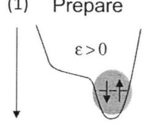  
(3)

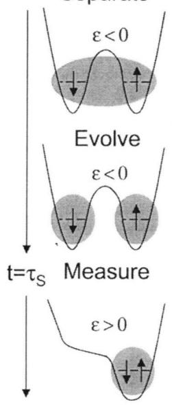

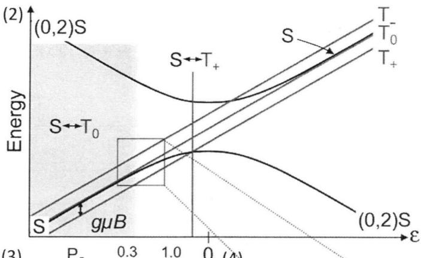

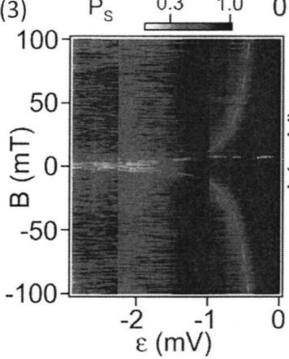

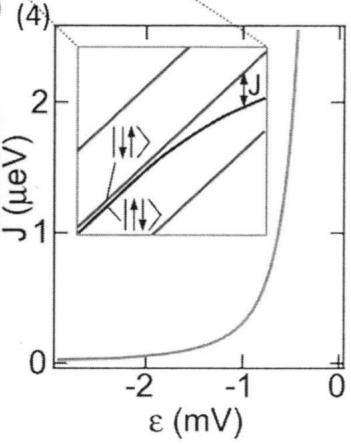  
图 2.4 (1) 对双量子点 $S - T _ { 0 }$ 态进行操控时电子态变化示意图。(2)在外加磁场作用 $B _ { z }$ 下(1,1)-(0,2) 反交叉区域能级示意图。(3)实验测量得到的 $S - T _ { + }$ 交叉点所在位置随外磁场变化关系。(4) $S - T _ { 0 }$ 交换相互作用J的大小随失谐量 $\varepsilon$ 的变化关系。(图片引自文献[32])

$$
H = \left( \begin{array} { c c } { J ( \varepsilon ) } & { \Delta B _ { n u c } ^ { z } } \\ { \Delta B _ { n u c } ^ { z } } & { 0 } \end{array} \right)\tag{2.3}
$$

其中， $\Delta B _ { n u c } ^ { z }$ 是沿着外磁场方向的随机核自旋场的净磁场。

这时，我们可以利用电压脉冲实现比特|S〉和 $\left| { { T _ { 0 } } } \right.$ 态之间的 $\sigma _ { z }$ 转动，如图2.5.1所示。脉冲初始时，比特位于 $\varepsilon > 0$ 处的(0,2)S态，一个快速绝热过程将比特驱动到 $S - T _ { + }$ 的交叉点处，然后再经过一个缓慢绝热过程 $\tau _ { A }$ 将比特驱动到较大失谐量处。在这里， $J _ { \varepsilon }$ 较小，脉冲等待时间 $\tau _ { S }$ ，由于核自旋的作用使得

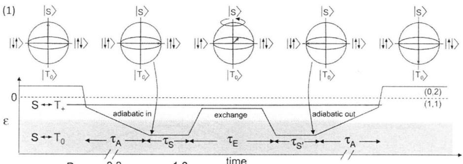

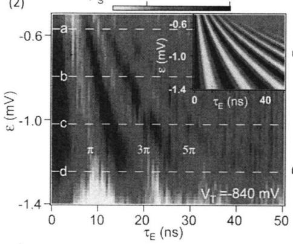

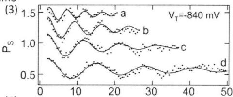

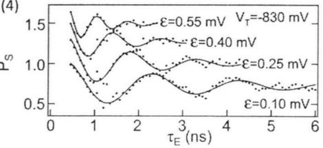  
图2.5 (1)实现比特交换相互作用驱动下的相干振荡所用脉冲序列示意图。(2)实验测量得到的 QPC 微分电导信号随失谐量ε和演化时间 $\tau _ { E }$ 变化关系，图中可以清晰地分辨出三个相干振荡峰。(3)从图(2) 中不同失谐量ε处得到的 Rabi振荡曲线，实线为根据数据拟合得到的结果。(4)增加双点间隧穿耦合强度2t后得到的更快速的 Rabi振荡过程。（图片引自文献[32]）

S和 $T _ { 0 }$ 发生混合，比特状态转动到Bloch球的x-y平面。然后再将比特快速驱动回较小失谐量处，此时Jξ较大，比特在J{作用下绕z轴转动，在↓↑〉和|↑↓〉 $J _ { \varepsilon }$ $J _ { \varepsilon }$ 间翻转。等待一段时间 $\tau _ { E }$ 后，经过反向过程回到 $\varepsilon > 0$ 处，此时通过QPC 测量量子点的电荷分布，如图2.5所示。

而 $S - T _ { 0 }$ 比特状态的读取需要通过一个称为自旋电荷转换（spin-to-chargeconversion）的过程。其原理是利用自旋阻塞过程来区分比特演化的末态。如果比特演化的末态是(1,1)S态，那么通过绝热过程可以回到(0,2)S，即(0,2)电子态。而如果比特演化的末态是 $T _ { 0 }$ 态，由于自旋不对称，通过绝热过程无法回到(0,2)S，同时由于(0,2)T态能级太高，也无法达到(0,2)T态，故此时电子被束缚在(1,1)电子态，从而可以被QPC测量所区分[34]。

## 2.3 双量子点中三电子自旋态的研究

鉴于自旋量子比特对于半导体量子计算研究的重要性，我们也逐渐开展了对量子点中电子自旋的研究。目前在国际上，利用硅基材料进行量子计算研究已经成为主流。但相对于硅基材料，GaAs体系工艺非常成熟，量子点性质稳定，因此我们仍选择传统的GaAs体系来研究量子点中的电子自旋特性。下面就我们对双量子点中的三电子自旋态的相关研究结果做一个简单的介绍[43]。

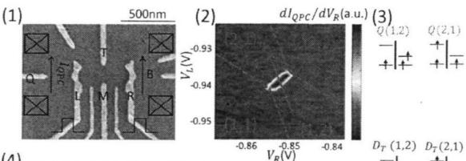  
(5)

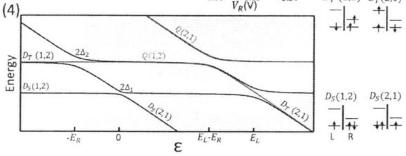

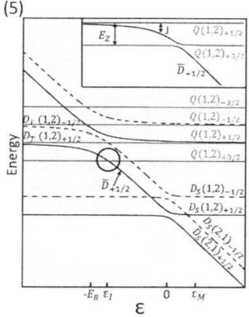  
图 2.6 (1) 实验上制备的 GaAs/AlGaAs量子点样品结构图。(2)(1,2)-(2,1) 反交叉区域的电荷稳态分布图。由于左右量子点和源漏间的隧穿率极小，故在图中无法看到充电线，虚线为充电线所在的位置，而图中的亮线为量子点间电子隧穿线。(3)三电子态中的能级关系示意图。(4)不加外磁场下的能级结构示意图。(5)外磁场作用下的能级劈裂。

我们在GaAs/GaAlAs异质结上制备出如图2.6.1所示的双量子点样品，电极L、R调节双量子点中的电子数目，M、T调节双量子点间的隧穿耦合强度。电极Q与L形成QPC通道，用来探测双量子点中的电子状态。锁相调制测量所用的交流调制信号施加在电极R上，再通过锁相放大器测量QPC通道的微分电导 $d I _ { Q P C } / d V _ { R }$ 。快速改变量子点间隧穿区域失谐量所用的高频脉冲信号分别施加在电极L和R上。样品被放置在He3-He4制冷机的混合室内，其最低温度约为30mK，而量子点中的电子温度约为130mK。同时，我们在量子点所在平面内施加一个垂直于双点连线方向的外磁场B，并且使双量子点工作在电子态(1-2)-(2-1)隧穿区域。

首先，我们简单介绍一下双量子点中占据三个电子时的自旋态。当我们只考虑较低的轨道态时，三电子态包含有两个自旋双重态和一个自旋四重态，为简单起见我们只分析(1,2)电子态中的情况。当右边量子点中的两个电子形成自旋单态时，其与左量子点中的一个电子共同构成了三电子体系的基态，双重态$( \mathrm { S } { = } 1 / 2 ) D _ { S } ( 1 , 2 )$ 。而当右边的两个电子形成自旋三态时，其与左边一个电子构成了一个四重态 $\scriptstyle ( \mathbf { S } = 3 / 2 ) \ Q ( 1 , 2 )$ 和另一个双重态 $( \mathrm { S } { = } 1 / 2 ) D _ { T } ( 1 , 2 )$ ，他们是三电子态中的激发态，能级差即为右边两电子S-T态的能级差，记为 $E _ { R }$ 。这三个态的形式可以写为：

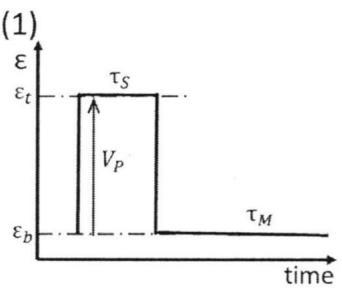

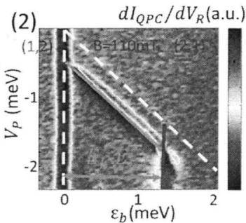

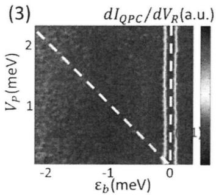

(4)  
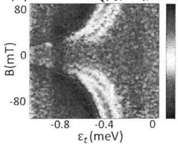  
图2.7 (1)用来观察自旋阻塞效应的脉冲波形示意图。(2)脉冲向负失谐量方向施加时测量得到的三电子态隧穿相图。(3)脉冲向正失谐量方向施加时的隧穿相图。(4)测量所得QPC微分电导随外加磁场和脉冲高度的变化关系，从中可以拟合出 $J _ { \varepsilon }$

$$
\begin{array} { r l } & { | Q _ { + 3 / 2 } \rangle = | \uparrow \rangle \langle I _ { + } \rangle , } \\ & { | Q _ { + 1 / 2 } \rangle = \sqrt { \frac { 1 } { 3 } } | \downarrow \rangle | T _ { 0 } \rangle + \sqrt { \frac { 1 } { 3 } } | \downarrow \rangle | T _ { + } \rangle , } \\ & { | Q _ { - 1 / 2 } \rangle = \sqrt { \frac { 2 } { 3 } } | \downarrow \rangle | T _ { 0 } \rangle + \sqrt { \frac { 1 } { 3 } } | \uparrow \rangle | T _ { - } \rangle , } \\ & { | Q _ { - 3 / 2 } \rangle = | \downarrow \rangle | T _ { - } \rangle , } \\ & { | D _ { T + 1 / 2 } \rangle = \sqrt { \frac { 1 } { 3 } } | \uparrow \rangle | T _ { 0 } \rangle - \sqrt { \frac { 2 } { 3 } } | \downarrow \rangle | T _ { + } \rangle , } \\ & { | D _ { T - 1 / 2 } \rangle = \sqrt { \frac { 1 } { 3 } } | \downarrow \rangle | T _ { 0 } \rangle - \sqrt { \frac { 2 } { 3 } } | \uparrow \rangle | T _ { - } \rangle , } \\ & { | D _ { S + 1 / 2 } \rangle = | \uparrow \rangle | S \rangle , ~ , } \\ & { | D _ { S - 1 / 2 } \rangle = | \downarrow \rangle | S \rangle . } \end{array}\tag{2.4}
$$

类似地，我们也可以写出(2,1)电子态下所有的低轨道自旋态。而左边量子点中的 S-T 能级间隔记为 $E _ { L }$ 。由于(1,2)-(2,1)间的电子隧穿作用，使得这两个电子态下的各自旋态之间出现了几个能级反交叉。而当施加一个外磁场B之后，由于塞曼分裂，各自旋简并态的简并进一步解除，此时我们重点关注两个自旋态的反交叉区域：一个出现在 $D _ { S } ( 2 , 1 ) _ { + 1 / 2 }$ 和 $D _ { T } ( 1 , 2 ) _ { + 1 / 2 }$ 之间；另一个则出现在 $Q ( 1 , 2 ) _ { + 3 / 2 }$ 和 $\tilde { D } _ { + 1 / 2 }$ 之间，如图2.6.5所示。

首先，我们发现我们这里得到的三电子各自旋态之间也能够存在自旋阻塞效应(spin blockade)。我们知道自旋阻塞效应存在于双量子点中的(1,1)-(0,2)电子态之间，在上一节介绍 $S - T _ { 0 }$ 量子比特的状态读取时已经有所介绍。而在三电子态(1,2)-(2,1)之间，一般来说不存在自旋不对称引起的隧穿禁止。但是我们在实验中发现，由于左右量子点的大小不同，使得他们各自的S-T的能级间隔大小也不同，这种不对称造成了电子正反隧穿时存在一个能级的高度差，这个高度差即为 $E _ { L } - E _ { R }$ 。从能级图上看，在 $0 < \varepsilon < E _ { L } - E _ { R }$ 这一范围内，我们可以观察到自旋双重态和四重态之间的自旋阻塞效应，并且利用非绝热脉冲序列在实验上证实了三电子态自旋阻塞效应的存在。如图2.7.2所示，当使用负向脉冲序列时，体系可以非绝热地穿过 $D _ { S } - D _ { S }$ 反交叉点，如图中白色虚线所示区域。当脉冲的高度足够时，体系经过了 $\tilde { D } _ { + 1 / 2 } - Q _ { + 3 / 2 }$ 交叉点后占据 $Q ( 1 , 2 ) _ { + 3 / 2 } ,$ 当脉冲驱动回自旋阻塞区域的时候，体系被束缚在(1,2)电子态，从而出现了图中绿线所示的信号。反之，当施加正向脉冲时，在2.7.3中白色虚线区域内，由于不存在自旋阻塞，故没有看到上述信号。这证明了自旋阻塞效应的方向性。

接着，利用上述自旋阻塞效应，我们便可以实现自旋双重态和四重态之间的相干操控。首先，我们利用电压脉冲序列实现了 $\tilde { D } _ { + 1 / 2 }$ 和 $Q _ { + 3 / 2 }$ 之间的Landau-Zener-Stuckelberg干涉实验。首先我们将体系制备到基态 $D _ { S } ( 2 , 1 ) _ { + 1 / 2 } ,$ 再通过一个非绝热过程使体系快速地穿过 $D _ { S } ( 2 , 1 ) _ { + 1 / 2 }$ 和 $D _ { S } ( 1 , 2 ) _ { + 1 / 2 }$ 的反交叉点，使体系的状态变为 $\tilde { D } _ { + 1 / 2 }$ 。然后控制脉冲上升时间使其缓满地穿过$\tilde { D } _ { + 1 / 2 } - Q _ { + 3 / 2 }$ 的反交叉点。使得体系演化为 $\tilde { D } _ { + 1 / 2 }$ 和 $Q ( 1 , 2 ) _ { + 3 / 2 }$ 的叠加态，然后脉冲停留在 $\varepsilon < \varepsilon _ { I }$ 处一段时间 $\tau _ { s }$ ，使得体系积累一定的相位。再通过相反的过程将其驱动回初始位置，通过QPC测量其状态。实验所得结果如图2.8所示，图中可以看到清晰的LZS干涉条纹。

然后，我们利用电压脉冲序列实现了 $\tilde { D } _ { + 1 / 2 }$ 和 $Q ( 1 , 2 ) _ { + 1 / 2 }$ 之间的交换相互作用J驱动下的相干振荡。首先，体系初始化在基态 $D _ { S } ( 2 , 1 ) _ { + 1 / 2 }$ ，然后通过个非绝热过程快速地穿过 $D _ { S } ( 2 , 1 ) _ { + 1 / 2 } - D _ { S } ( 1 , 2 ) _ { + 1 / 2 }$ 的反交叉点以及$\tilde { D } _ { + 1 / 2 } - Q _ { + 3 / 2 }$ 的反交叉点，此时体系状态变为 $\tilde { D } _ { + 1 / 2 }$ 。然后，通过-个绝热过程缓慢地将体系驱动到交换作用强度J很小的位置， $\tilde { D } _ { + 1 / 2 }$ 慢慢靠近核自旋场下的基态， $ { \lvert { \downarrow } \rangle }  { \lvert { T _ { + } } \rangle }$ 或者|↑)|To)。在 $\tilde { D } _ { + 1 / 2 }$ 和 $Q ( 1 , 2 ) _ { + 1 / 2 }$ 构成的 Bloch球上，这两个基态组成了绕z轴一定角度的倾斜的轴。然后，通过一个快速的非绝热过程将体系驱动到 $J ( \varepsilon )$ 较大的位置，体系开始在 $J ( \varepsilon )$ 的作用下绕z轴转动，经过-一段时间τ。后，再经过对称的过程返回初始位置进行测量。实验结果如图2.9.3 $\boldsymbol { \tau _ { s } }$ 所示，图中可以看到交换作用驱动下的相干振荡，振荡的频率为 $J ( \varepsilon ) / h$ 。因此，从图中提取振荡频率便可以得到不同 $\varepsilon$ 处J的大小。

## 2.4 本章小结

本章中我们简单地介绍了两种自旋量子比特的编码方式，以及我们对于半导体量子点中电子自旋态的初步研究结果。我们详细研究了双量子点中三电子

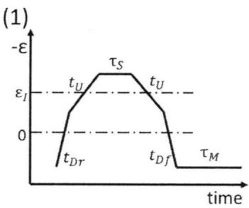

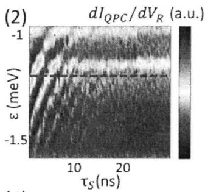  
(3)

$$
d I _ { Q P C } / d V _ { R } ( \mathsf { a . u . } )
$$

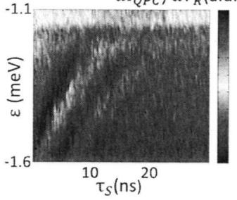

(4)  
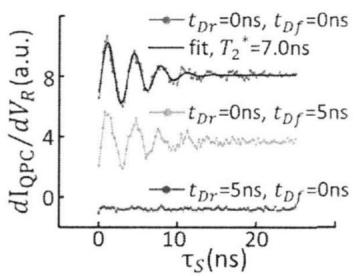

图 2.8(1)用来实现 LZS过程采用的脉冲示意图。(2)、(3) 不同外加磁场大小下的 LZS 干涉。(4)不同上升沿时间下的(2)中虚线所示位置的振荡曲线。  
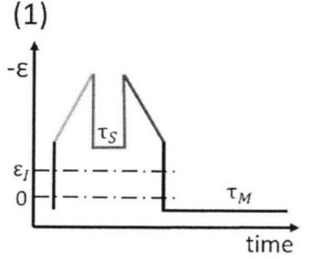

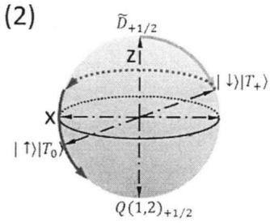  
(3)

$$
d I _ { Q P C } / d V _ { R }
$$

(4)  
  
图.29 (1)用来实现交换相互作用驱动下的相干振荡所用的脉冲示意图。(2)操控过程在Bloch球上的示意图。(3)实验测得的振荡相图。(4)从(3)中提取的交换作用大小.J随失谐量ε的变化。

态的自旋特性，发现了一种新的自旋阻塞机制。同时利用该自旋阻塞机制成功地实现了对高自旋态的相干操控。这些初步的研究结果，特别是过程中积累的技术经验对于我们即将开展的自旋量子比特的研究具有很好的参考价值。由于自旋量子比特不是我的主要研究方向，我在这里便不作深入的分析。但需要指出的是，国际上对于自旋量子比特的研究关注得非常多，成果也很丰硕，而我们也逐渐开始将研究方向转向自旋量子比特，特别是硅基材料自旋量子比特。

# 此页不缺内容

万方数据

## 第三章 基于电子电荷分布编码的电荷量子比特研究

上一章我们主要介绍了基于电子自旋态编码的自旋量子比特。由于电子自旋的特性，自旋量子比特通常具有较长的量子相干时间，但同时他的操控以及读取的速度也相对较慢。因此，人们提出了另外一种比特的编码方案。基于电子电荷分布的电荷量子比特[40.41.55]。电荷量子比特具有操控速度快，读取方式简单等优势，但同时他的量子相干时间也相对较短。在本章中，我们主要介绍电荷量子比特的编码、操控和读取以及如何延长他的相干时间。

## 3.1 电荷量子比特的编码方式

在存在耦合的双量子点体系中，两个量子点中的电子除了存在直接的静电相互作用（库伦相互作用）之外，还存在另外一种称为隧穿耦合的相互作用[29]。顾名思义，隧穿耦合指的是一个量子点中的电子可以隧穿到另外一个量子点中，这种隧穿作用来源于电子波函数的分布。两个耦合很弱的量子点，其中电子波函数的分布重叠区域很小，电子从一个量子点隧穿到另一个量子点的概率也很小。而两个耦合很强的量子点，其中电子波函数的分布重叠区域很大，电子从一个量子点隧穿到另一个量子点的概率很大。这种电子波函数的重叠以及概率性的隧穿给我们提供了另外一种比特的编码方式：利用电子的电荷分布来进行编码。

如图31所示，在两个存在隧穿耦合的量子点中，有一个自由电子。电子以一定的概率分别占据两个量子点，当电子占据左边的量子点时，我们定义此时电子的状态为 $| L \rangle = ( 1 , 0 )$ ，1表示左边量子点有1个电子，0表示右边量子点有0个电子；反之，当电子占据右边的量子点时，我们定义此时电子的状态为$| R \rangle = ( 0 , 1 )$ ，L)态和R)态对应于两个不同的量子态。当两个量子点中电化学势相等，也就是存在所谓的共振隧穿时，L〉态和R)态存在一个能级反交叉。这构成了一个很好的两能级体系，我们可以将|L〉态和R)态作为构成量子比特所需的两个计算基态0和1)。此时，这个两能级体系的哈密顿量可以写成：

$$
H = \frac { 1 } { 2 } \varepsilon \sigma _ { z } + \Delta \sigma _ { x } = \left( \begin{array} { c c } { \varepsilon / 2 } & { \Delta } \\ { \Delta } & { - \varepsilon / 2 } \end{array} \right)\tag{3.1}
$$

其中，ε是双量子点中的失谐量，△是双量子点中的隧穿耦合强度。σz和σx是 $\varepsilon$ $\Delta$ $\sigma _ { z }$ $\sigma _ { x }$ 泡利矩阵元。I)态和{R态的能级E随失谐量ε的变化关系如图3.1所示。在失谐量为零处 $( \varepsilon = 0 )$ ，两个能级处于能级反交叉点，并且处于能量差最小处，最小能量差为2∆[40]。

据此，我们给出了电荷量子比特的基本编码方式，体系的哈密顿量以及能级图。接下来，我们将从实验的角度介绍如何实现一个电荷量子比特。

  
图 3.1 (1)charge qubit 的两个编码状态示意图。(2) 两能级体系示意图。

## 3.2 电荷量子比特的操控和读取

想要得到一个电荷量子比特，首先我们需要制备出一个半导体双量子点样品。和上一章中的双量子点一样，我们选择Si掺杂的GaAs/AIGaAs异质结作为基片，采用一系列的微纳加工工艺，得到如图3.2所示的双量子点样品。图3.2展示的是我们加工得到的双量子点样品的核心区域，其中白色部分为钛金电极，标记为H1，H2，U1-U5，D1-D3的电极为我们在实验中使用的电极，其余电极均接地以保持零电位。U1-U5以及H1，H2所包围的区域为实验中形成量子点（QD）的区域，图中的虚线圆圈代表量子点所在的大致位置。D1-D3以及H1，H2包围形成的区域在实验上作为量子点接触（QPC）的通道，图中的箭头$I _ { Q P C }$ 表示通过这个通道的电流。我们使用无液氦稀释制冷机 Oxford Triton 400将样品冷却至20mk左右的极低温下，这时标定的电子温度通常保持在150mk左右。在这样的极低温状态下，电子才能表现出符合量子力学规律的量子行为。

我们采用标准的锁相调制探测技术来读取量子点中电子的状态。我们在电极U1上施加0.2mV的正弦调制信号（如图3.2所示），然后通过锁相放大器解调读取QPC通道的微分电导信号。由于QPC通道的微分电导对于邻近的电场分布极为敏感，因此，量子点中电子运动导致的电场分布变化能够及时地被

  
图 3.2 (1) 实验制备的 GaAs/AIGaAs 双量子点样品结构图。(2)利用 QPC 锁相调制技术测量得到的电荷稳态分布图。

QPC感知，我们也就能够得到量子点中的电子电荷分布信息，这也是一种电荷感应测量方式。

我们在各电极上分别施加一定的电压（通常为负电压），然后分别扫描电极U1和U5，利用电荷感知测量方法得到该双量子点的电荷稳态分布图，如图3.2.2所示。和前两章中介绍的一样，图中每一条充电线代表一个量子点中的电子数发生变化。可以很清楚地看到，图中有两套不同斜率的充电线，表示存在两个量子点[29]。由此表明我们已经得到了一个性质良好的双量子点样品。我们选取图3.2.2中红色圆圈标注的区域作为我们实验重点研究的区域。通过计算充电线的数量，我们可以判断出，在该区域，左右两个量子点中包含的电子数均为5个左右，但是作为电荷量子比特，我们通常只需要考虑最外层的价电子，里层的电子由于不参与整个电子操控过程，可以忽略不计[40]。

接下来，我们着重研究已经选定的区域。如图3.3所示，通过设定更小的扫描范围和扫描步长，我们得到了该区域精细的相图。两条不同斜率的充电线在这里交会，形成了一个反交叉的区域。反交叉区域的正中，一条正斜率的黑线连接两个三相点。这条黑线就是电子在两个量子点间隧穿形成的隧穿线。因此，隧穿线两边的区域分别表示电子占据不同的量子点。经过隧穿线，电子从一个量子点隧穿到另一个量子点。在隧穿线的左侧，电子占据左边的量子点，只考虑最外层参与隧穿的电子，电子状态可以写成 $| L \rangle = ( 1 , 0 )$ ；在隧穿线的右侧，电子占据右边的量子点，可以写成 $| R \rangle = ( 0 , 1 )$ 。因此，在这个区域我们可以得到上一节中介绍过的两能级体系。

  
图 3.3 (1) 图3.2.2 中红色圆圈所示的双点反交叉区域。(2) 通过在电极 U1 上施加电压短脉冲，重复扫描(1)图得到。

那么，在实验中，我们如何对这个两能级体系中的电子进行操控呢？从上一节中给出的哈密顿量 $H = \frac { 1 } { 2 } \varepsilon \sigma _ { z } + \Delta \sigma _ { x }$ 中我们可以看出，这个体系中有两个变量是我们可以控制的。一个是双量子点中的失谐量 $\varepsilon _ { i }$ 另外一个是双量子点间的隧穿耦合强度 $\Delta$ 。如前所述，在实验中，我们可以通过改变施加在U1和U5上的电压的大小来改变 $\varepsilon$ ，而 $\Delta$ 则可以通过改变施加在U3上的电压来调节。在实验中，我们通常会保持 $\Delta$ 不变，即在U3上施加一个固定的电压，这样是为了减少操作过程中的复杂性。

我们通常采用非绝热的电压脉冲序列来对电荷量子比特进行操控，通过将电压脉冲施加在电极U1或U5上（或者同时施加在U1和U5上），我们可以改变U1和U5上的电压强度，也就改变了失谐量ε。在这里，我们简单介绍一下 $\varepsilon .$ 两能级体系中的绝热演化与非绝热演化，以帮助我们更好地理解非绝热脉冲的作用[56.57]。假定我们的两能级体系初始状态处于基态，在外界条件（在这里为电压脉冲）的驱动下开始演化，演化时经过能级的反交叉点。如果演化过程是绝热的，那么在整个演化过程中，体系会一直处于基态。如果演化中存在非绝热的过程，那么在经过能级反交叉点时，体系将会有一定的概率演化到激发态。这个过程可以用LZS干涉理论来描述[41,58,59]，体系演化到激发态的概率也就是LZ跃迁概率，可以写为：

$$
P _ { L Z } = e x p ( - 2 \pi \Delta ^ { 2 } / v \hbar )\tag{3.2}
$$

其中，△为隧穿耦合强度，是驱动能级演化的电压脉冲穿过能级反交叉点的速度。从中可以看出，电压脉冲穿过能级反交叉点的速度越快，体系演化到激发态的概率越大，脉冲的非绝热性越好。在实验中，电压脉冲速度取决于脉冲的上升沿。脉冲的上升沿越短，脉冲速度就越快，非绝热性越好；脉冲的上升沿越长，脉冲速度就越慢，非绝热性越差。在后面的实验中，我们会详细介绍脉冲上升沿对电荷量子比特操控的影响。

除了利用非绝热脉冲来实现对电荷量子比特的操控之外，还有另外一种称为微波共振跃迁的技术[60,61]。这种技术的原理类似于核磁共振，外界对体系施加一个微波场，并且使微波频率的等效光子能量等于两能级体系的能级差。从量子力学的角度看，处于基态的电子通过吸收微波光子的能量，从而跃迁到激发态，激发态的电子也可以通过自发辐射跃迁到基态。这样也可以实现对电荷量子比特的相干操控。

我们在这里采用第一种方式。我们利用脉冲发生器Agilent81134a产生我们需要的非绝热脉冲，经过一系列的高频同轴线、衰减器等施加到电极U1上。同时利用bias-tee将形成量子点所需的负电压，以及锁相调制所需的交流调制信号施加到电极U1上。脉冲发生器产生的脉冲信号是一个以40MHz频率重复的周期脉冲信号，如图3.4.1中插图所示。之所以采用周期脉冲信号，是为了保证在实验中每个测量周期内有数千个驱动脉冲，这样每次测量实际上包含有数千次的演化过程，实际得到的测量结果是数千次独立演化结果的平均。这样是为了保证测量结果的可见度，因为单次演化结果得到的信号往往很弱而且随机性很大，不能真实地反映出体系演化的结果。

在电极U1上施加了非绝热脉冲之后，我们重复扫描一次图3.3.1中的相图，得到图3.3.2。对比两图可以发现，除了（a）图中的充电线和隧穿线之外，（b)图中在隧穿线的右侧出现了一些明暗相间的条纹。这些明暗相间的条纹表明量子点中的电子经历了一系列的相干演化。后面分析中会指出，实际上这些条纹正是来自于LZ干涉过程。从隧穿线到最远的条纹之间的间距，取决于施加的脉冲的高度（幅度）V。实验中V的选取，按照等效能量（即电极上电压值的 $V _ { p } .$ $V _ { p }$ 变化对应干量子点中的电化学势的改变量）来算，一般不超过 $2 0 0 \mu e \mathrm { V }$ 。这样选取的目的主要是为了保证在脉冲低电平的时候，体系能够处于远离能级反交叉点 $\varepsilon = 0$ 的位置。在这里，是为了保证体系处于 $| R \rangle = ( 0 , 1 )$ 的状态。我们这里设定脉冲发生器中的输出为 $V _ { p } = 5 0 0 \mathrm { m V }$ ，实际施加到样品上的脉冲高度还需要考虑传输过程中高频同轴线、衰减器和bias-tee等的衰减。

  
图 3.4 (1)实验中采用的非绝热脉冲以及两能级体系 Bloch球示意图。(2)测量所得 QPC 微分电导随电压 $V _ { U 1 }$ 和脉冲持续时间 $t _ { p }$ 的关系。

根据图3.3.2，我们沿着垂直于隧穿线的方向，在有条纹的区域截取一条线，如图中箭头所示。根据这条线中的信息，我们同时扫描电极U1和U5（按照一定的比例同时改变电压）可以得到一条类似于截取的曲线的振荡曲线。如果我们同时改变脉冲的持续时间(durationtime)，即脉冲位于高电平的时间，可以得到图3.4.2所示的相图。图中的纵轴为电极U1（U5）上施加的电压，可以按照一定的关系转化为失谐量 $\varepsilon _ { i }$ ，图中的横轴为脉冲的持续时间 $t _ { p } .$ 。那么这张图实际上反映的是在不同的失谐量处，电子在两能级体系中的演化结果随着演化时间的变化关系。我们在不同的U1电压 $( V _ { U 1 } )$ 处，沿着水平方向截取一条线，可以得到一条振荡的曲线。这条曲线的横轴是脉冲持续时间，纵轴是QPC的微分电导信号。我们知道，QPC的电导实际反映的是电子在双量子点中的分布概率。因此，经过一定的处理（将微分电导转换为电导)，我们可以从这条曲线中得到，经过 $t _ { p }$ 时间的演化，电子最终在量子点中的状态分布。这样，通过改变施加在U1和U5上电压，以及脉冲的高度 $V _ { p }$ 和持续时间 $t _ { p }$ ，我们就实现了对电荷量子比特的相干操控。

我们利用Bloch球来进一步阐述上述相干操控过程，图3.5.1所示为描述两能级体系常用的Bloch球。Bloch球的南北极分别表示两个基态。球面上任意一点表示两个基态的一个叠加态。在我们的电荷量子比特中，两个基态分别为$| R \rangle = ( 0 , 1 )$ 和 $| L \rangle = ( 1 , 0 )$ 。我们就以球上的北极表示|R)，南极表示|L>。按照脉冲序列的顺序，初始时，脉冲序列位于低电平，此时比特处于 $\varepsilon > 0$ 的状态，电子占据右边量子点，即 $| R \rangle = ( 0 , 1 )$ 。然后，一个非绝热脉冲快速地将比特驱动到能级反交叉点 $\varepsilon = 0$ 处，此时系统的哈密顿量近似变为 $H = \Delta \sigma _ { x }$ ，本征态变为 $( | R \rangle \pm | L \rangle ) / { \sqrt { 2 } }$ 。比特在此哈密顿量下自由演化，演化时间为脉冲的持续时间 $t _ { p }$ 。在Bloch球上看，此时比特的演化即为绕着x轴旋转 $( \sigma _ { x } \mathrm { r o t a t i o n } )$ 旋转的速度取决于 $\Delta$ 。从初始态R)旋转 $\pi / 2$ 后到达 x-y平面，此时比特状态为 $( | R \rangle - i | L \rangle ) / { \sqrt { 2 } }$ 。再经过 $\pi / 2$ 后到达南极，此时比特的状态为L)。再经过$\pi / 2$ 后比特再次演化到 $\mathbf { x } - \mathbf { y }$ 平面，此时比特的状态为 $( | R \rangle + i | L \rangle ) / { \sqrt { 2 } }$ 。经过完整的2π演化后，比特回到初始状态。在实验中，比特的最终状态取决于脉冲的持续时间 $t _ { p }$ 。脉冲持续时间结束后，再次通过一个非绝热过程快速地将比特驱动到远离能级反交叉点 $\varepsilon = 0$ 处。此时，比特会按照一定的概率投影到两个基态|R)和L〉上，概率的大小取决于比特在脉冲持续时间内演化的最终状态，不同的投影结果得到不同的电荷分布，从而实现了对比特最终状态的测量。其中，比特的态矢量在 Bloch球上绕x轴旋转 $( \sigma _ { x } ~ \mathrm { r o t a t i o n } )$ 的过程称为拉莫近动（Larmor precession），我们实验上得到的相干振荡称为拉莫振荡（Larmoroscillation)[55, 62]。

  
图 3.5 (1)Bloch 球上 $\sigma _ { x }$ 操作示意图。(2) 图 3.4.2 中红色虚线处截取的 Larmor 振荡曲线，每个峰间隔表示比特状态在Bloch球上绕x轴转动一周。

如图3.5.2中红色虚线所示的振荡曲线，即为电荷量子比特在能级反交叉点$\varepsilon = 0$ 处的拉莫振荡曲线。从图中我们可以清晰地看到5个振荡周期，表明在脉冲持续的2.5ns内，比特的态矢量在Bloch球上绕x轴转动了至少5个周期。上面提到，比特转动的速度取决于 $\Delta$ ，实际上比特转动的速度取决于 $\varepsilon = 0$ 处的能级差 $2 \Delta$ 。我们从图中计算出，比特转动一个周期需要的时间约为420ps，对应的转动速度约为2.4GHz。因此，我们可以得到 $2 \Delta = 2 . 4 \mathrm { G H z }$ (约 $1 0 \mu \mathbf { e } \mathbf { V } )$ 在这里，我们通常采用频率为单位来衡量体系的能量（按照 $E = h \nu$ 的对应关系可以很方便地转换为能量)。

除图3.4.2中红色虚线所示的振荡曲线外，虚线上方还有一系列的振荡条纹。这些振荡条纹分别对应不同的 $V _ { U 1 }$ ，也就是不同的失谐量ε。在每个 $V _ { U 1 }$ 处，水平截取一条曲线就可以得到在不同的 $\varepsilon$ 处，比特随脉冲持续时间的演化关系。可以看到，离能级反交叉点 $\varepsilon = 0$ 越远，曲线的振荡频率越快。这表明，$| \varepsilon |$ 越大，比特的能级间隔越大，这和我们之前给出的能级结构图是吻合的。此外，只有在 $\varepsilon = 0$ 处我们可以观察到很长时间的振荡，离 $\varepsilon = 0$ 越远，振荡持续的时间越短。这表明，在 $\varepsilon = 0$ 处比特的相干性要远好于其他位置。这是因为，在 $\varepsilon = 0$ 处，比特能级差随 $\varepsilon$ 变化的一阶导数为0，这表明 $\varepsilon$ 的改变对比特能级差影响最小。因此，外界噪声扰动造成的 $\varepsilon$ 的变化对比特的影响最小，比特的相干性在这里得到了很好的保护[63]。而在其他位置， $\varepsilon$ 的变化对比特能级差的改变很大，外界噪声对 $\varepsilon$ 的扰动会直接反映到比特能级差的变化上，比特的相干性不能得到很好的保护。因此，在电荷量子比特体系中，能级反交叉点 $\varepsilon = 0$ 被称为最佳工作点（sweet spot)。

我们利用冯诺依曼方程对脉冲驱动下的电荷量子比特演化进行模拟。比特演化方程可以写成：

$$
\dot { \rho } = - 2 \pi \frac { i } { h } [ H ( t ) , \rho ( t ) ]\tag{3.3}
$$

其中， $\rho ( t )$ 是体系的密度矩阵， $H ( t )$ 是体系的哈密顿量。我们固定 $H ( t )$ 中的 $\Delta$ 不变，改变失谐量 $\varepsilon$ 来模拟非绝热的脉冲驱动。因此，哈密顿量变为 $H [ \varepsilon ( t ) ]$ 我们选择实验提取的 $2 \Delta = 2 . 4 \mathrm { G H z }$ 来进行模拟，实验中的非绝热脉冲一般具有100ps左右的上升沿，而在模拟中我们选择采用没有上升沿的理想方波。脉冲的高度，即 $\varepsilon ( t )$ 的变化范围是从实验测得的条纹间距按照一定的比例转化为能量得到的。比特从初始态 $| R \rangle$ 开始演化，随着 $\varepsilon ( t )$ 的改变得到不同时刻比特密度矩阵的数值计算结果，最终我们可以得到和图3.4.2所示相似的相图，如图3.6.1所示。同时，为了计算噪声对比特演化结果的影响，我们在图3.6.1的结果的基础上，对每一个演化时间 $t _ { p }$ 下的计算结果，即图3.6.1中的垂直方向的每条线卷积上一个高斯函数：

$$
\frac { 1 } { \sqrt { 2 \pi \sigma _ { \epsilon } ^ { 2 } } } e x p [ - \frac { ( \alpha V _ { U 1 } ) ^ { 2 } } { 2 \sigma _ { \epsilon } ^ { 2 } } ]\tag{3.4}
$$

其中 $\sigma _ { \varepsilon } = 5 \mu \mathbf { e } \mathbf { V }$ 。这个高斯函数是为了计算特定的演化时间下噪声对每一个失谐量 $\varepsilon$ 处比特最终演化结果的影响。最终得到的包含噪声影响的结果如图3.6.2所示。对比图3.4和图3.6可以看到，模拟得到的结果和实验实际测量得到的结果吻合得很好。

至此，我们详细介绍了如何利用非绝热脉冲对电荷量子比特进行操控，以及如何对比特的状态进行测量。我们在实验上得到了拉莫振荡曲线，完成了 $\sigma _ { x }$ 操作，并且利用数值模拟的方法对实验结果进行了验证。然而，仅仅根据拉莫振荡和 $\sigma _ { x }$ 操作并不能完全得到比特的全部信息，衡量量子比特性质最重要的参数，相干时间 $T _ { 2 } ^ { * }$ ，必须通过更精细的实验才能得到。而且，除了 $\sigma _ { x }$ 操作，量子比特的单比特操作还包含 $\sigma _ { z }$ 操作。接下来，我们继续研究电荷量子比特的相干性以及 $\sigma _ { z }$ 操作。

  
图 3.6 (1) 利用理想方波模拟得到的 Larmor 振荡相图。(2) 在(1) 图基础上沿垂直方向每条数据线卷积一个高斯函数，模拟噪声影响下的Larmor振荡过程。

## 3.3 电荷量子比特的 $\sigma _ { z }$ 操作及相干性

除了利用单个非绝热脉冲来实现对电荷量子比特的 $\sigma _ { x }$ 操作之外，我们还可以利用多个非绝热脉冲序列来实现电荷量子比特的 $\sigma _ { z }$ 操作，而且可以对其相干性进行研究。我们这里采用一种称为Ramsey干涉的方法来达到以上目的。

如图3.7所示为Ramsey干涉所采用的脉冲序列示意图。整个脉冲序列包含两个非绝热脉冲 $t _ { p } = \pi / 2$ ，这两个非绝热脉冲被一段长度为τ的自由演化时间分隔开。示意图中省略了脉冲序列中的测量序列。实验中实际使用的脉冲序列还包含一段相对长时间的测量以及态初始化过程。和实现Larmor振荡实验中采用的脉冲序列一样，这里采用的脉冲序列也是一个40MHz重复频率的周期序列。上面所说的，两个非绝热脉冲、自由演化时间τ和测量初始化过程构成了一个完整的周期。其中两个非绝热脉冲由脉冲发生器Agilent 81134a的两个通道产生，经过延迟处理，再通过高频叠加器叠加之后输出到样品电极上。

两个非绝热脉冲的持续时间我们设定为，比特的态矢量在Bloch球上完成$\pi / 2$ 的转动需要的时间。根据上一节中得到的Larmor振荡的数据，实验中我们的比特在能级反交叉点 $\varepsilon = 0$ 处的能级差为 $2 \Delta = 2 . 4 \mathrm { G H z }$ ，对应的完成一个周期转动需要的时间约为420ps。因此，完成 $\sigma _ { x } = \pi / 2$ 转动需要的时间为105ps。然而在实验中，实际产生的非绝热脉冲具有一定的上升沿，从之前的Larmor振荡的数据可以得到，脉冲到达设定的最大高度时所需的持续时间大约为160ps，这已经超过了完成 $\sigma _ { x } = \pi / 2$ 转动所需的时间。因此，我们经过多次尝试之后，将单个 $\pi / 2$ 脉冲的持续时间设定为180ps，以保证实验中比特能够演化到合适的状态。其次，脉冲的高度与Larmor振荡实验中的高度保持一致，同样为$V _ { p } = 5 0 0 \mathrm { m V }$ 。但由于传输线路中添加了具有一定衰减的高频叠加器，实际施加到样品上的脉冲高度要略小于Larmor振荡中的高度。

  
图 3.7 实现 Ramsey 干涉实验的非绝热脉冲示意图及比特状态在 Bloch 球上的演化过程。

下面我们结合Bloch 球来详细说明 Ramsey干涉是如何实现量子比特的 $\sigma _ { z }$ 操作的。如图3.7中所示，脉冲序列开始处于低电平，此时比特处于远离能级反交叉点 $\varepsilon = 0$ 的初始态 $| R \rangle = ( 0 , 1 )$ ，即Bloch球上的北极。然后一个非绝热脉冲将比特驱动到 $\varepsilon = 0$ 处，比特开始在脉冲的驱动下演化，即上面所说的绕 $\mathbf { x }$ 轴转动 $( \sigma _ { x } , \mathrm { r o t a t i o n } )$ 。脉冲的持续时间为 $t _ { p } = \pi / 2$ ，即比特在Bloch球上绕x轴转动 $\pi / 2 .$ 此时，比特的状态变为 $( | R \rangle - i | L \rangle ) / { \sqrt { 2 } }$ ，即 $| R \rangle$ 和 $| L \rangle$ 的叠加态，态矢量位于Bloch球的赤道平面（x-y平面）。接着，再经过一个非绝热过程，脉冲撤除。此时比特的哈密顿量为 $H = \frac { 1 } { 2 } \varepsilon \sigma _ { z } + \Delta \sigma _ { x }$ ，由于 $\varepsilon \gg \Delta$ ，此时比特的演化可以近似看成 $\sigma _ { z }$ 操作，即比特的态矢量在Bloch球上绕z轴转动，转动的速度取决于 $\varepsilon$ 处的能级差。经过一段时间 $\tau$ 的自由演化，比特在Bloch球的赤道面上转动一定的角度，积累了一定的相位。再经过一个非绝热脉冲 $t _ { p } = \pi / 2$ 将比特重新驱动到 $\varepsilon = 0$ 处，此时比特再次进行一次 $\sigma _ { x } = \pi / 2$ 转动，最后经过一个非绝热过程进入测量序列，经过投影测量得到比特最终的电荷分布状态。在这里，比特的最终状态取决于两个 $\sigma _ { x } = \pi / 2$ 转动之间的自由演化过程。在这个自由演化过程中，比特所积累的不同的相位直接反映了比特的相干性。

实验中我们对电极U1施加上述的脉冲序列，采用Larmor振荡实验中相同的测量方法，得到如图3.8所示的Ramsey干涉相图。图中的纵轴为电极U1上的电压 $V _ { U 1 }$ ，对应于不同的 $\varepsilon$ 值，横轴为脉冲序列中的自由演化时间 $\tau$ 。可以看到图中呈现出清晰的振荡条纹，在每一个 $V _ { U 1 }$ 处，沿着水平方向提取一条数据线，经过简单的转换，就可以得到比特的最终状态随着自由演化时间τ的相干 $\tau$ 振荡。另外，在图中不同的Vu₁处得到振荡曲线的频率是不同的。这是由于自 $V _ { U 1 }$ 由演化过程中比特进行σ₂转动的速度取决于失谐量ε处的能级差，可以写成： $\sigma _ { z }$ $\varepsilon$

图3.8 实验中测得的 QPC微分电导随电压 $V _ { U 1 }$ 和自由演化时间 $t _ { p }$ 的关系。  

  
图 3.9 (1) 图 3.8 中截取的 Ramsey 干涉曲线及拟合结果。(2) 利用实验数据进行模拟得到的 Ramsey 干涉相图。

$$
f = \sqrt { \varepsilon ^ { 2 } + 4 \Delta ^ { 2 } } / h\tag{3.5}
$$

其中，f为比特绕z轴转动的频率。在ε=0处，比特转动得最慢，频率等于Larmor振荡中的频率。图中τ的取值从200ps 开始，这是因为我们选取的$\sigma _ { x } = \pi / 2$ 脉冲的持续时间为180ps，如果两个脉冲的间隔小于180ps，那么他们将开始重叠，形成一个更高的 $\sigma _ { x }$ 脉冲。

我们沿着图3.8中的黑色虚线处 $( V _ { U 1 } = - 6 8 7 . 4 \mathrm { { m V } ) }$ 提取一段数据，得到此处的Ramsey干涉曲线。从中我们提取出的振荡频率约为45GHz，远大于Larmor振荡的·2.4GHz，表明这里是远离能级反交叉点 $\varepsilon = 0$ 的位置。我们利用消相干函数 $A e x p [ - ( t - t _ { 0 } ) ^ { 2 } / ( T _ { 2 } ^ { * } ) ^ { 2 } ] c o s ( \omega t + \theta )$ 对提取的数据进行拟合，得到此处的消相干时间 $T _ { 2 } ^ { * }$ 约为 $1 1 2 \pm 2 1 { \tt p s }$ ，如图3.9.1所示。需要指出的是，这里我们所得到的消相干时间 $T _ { 2 } ^ { \ast } = 1 1 2 \pm 2 1 { \mathsf { p s } }$ 是远离能级简并点处的消相干时间。当比特处于这个位置时，比特的相于性不能得到很好的保护，因此我们得到的消相干时间很短。如前所述，当比特位于能级简并点处时，比特的相干性可以得到很好的保护，理论上此时比特的消相干时间可以很长，实验中Larmor振荡可以持续2-3ns，但由于技术原因，我们很难得到准确的数值。

我们采用模拟Larmor振荡过程同样的方法对 Ramsey干涉进行模拟。模拟中采用的参数和实验中保持一致，隧穿耦合强度为 $2 \Delta = 2 . 4 \mathrm { G H z } .$ 。实验中单个$\sigma _ { x } = \pi / 2$ 脉冲的持续时间选取为180ps，由于在模拟中采用的是理想方波，根据 $2 \Delta = 2 . 4 \mathrm { G H z }$ ，我们将 $\sigma _ { x } = \pi / 2$ 脉冲的持续时间设为100ps。根据图3.8中条纹区域在垂直方向的间隔大小，经过换算后得到脉冲的高度约为180ueV。同样的，为了衡量外界噪声对比特演化结果的影响，我们将模拟计算得到的相图沿着垂直方向的每一条曲线卷积上一个高斯函数，最终得到的结果如图3.9.2所示。可以看出模拟结果与实验结果基本上是符合的。但是同时也存在一些不相符的地方，例如实验结果中的干涉曲线在水平方向存在一些扭曲，这主要是由于脉冲在传输过程中产生变形或尾波等导致的。

## 3.4 利用回声技术延长电荷量子比特的相干时间

上一节中我们利用 Ramsey干涉实现了电荷量子比特的 $\sigma _ { z }$ 操作，同时得到了比特在远离能级反交叉点处的消相干时间。从实验结果我们可以看出，在远离能级交叉点的地方，电荷量子比特的消相干时间很短。而进行电荷量子比特的多比特操作时，往往需要让其工作在远离能级交叉点的位置。同时，在其他量子体系中已经对延长系统的消相干时间进行了一系列的研究。本节中，我们借鉴已有的研究结果，对延长电荷量子比特的消相干时间进行初步的探索。

最早人们在研究核磁共振体系时，发现利用多步自旋翻转操作可以有效地延长原子核自旋的消相干时间[64]。基于此，科学家们提出了基于多步自旋翻转操作的操控序列：自旋回声技术（spin echo）和以 spin echo为基础的 CPMG技术[65,66]。我们统称其为动力学解耦技术（Dynamic Decoupling）[67]。利用动力学解耦技术我们可以延长量子系统的消相干时间[68]，以及对量子系统消相干的来源进行精细的分析[69,70]。我们这里借鉴 spin echo 技术的原理，利用非绝热脉冲序列来实现对电荷量子比特的回声操作。

如图3.10所示为我们实验中采用的脉冲序列示意图。和前述相同，示意图省略了比特的测量和初始化阶段。实验中实际采用的脉冲序列是个40MHz重复率的周期序列。每个完整的周期包含：示意图中所示的两个 $\sigma _ { x } = \pi / 2$ 脉冲，两段时间分别为 $t / 2 + \delta t , ~ t / 2 - \delta t$ 的自由演化时间，一个 $\sigma _ { x } =$ 脉冲以及测量和初始化序列。 $\sigma _ { x } = \pi / 2$ 脉冲的持续时间设定为180ps，和Ramsey实验中保持一致。 $\sigma _ { x } = \pi$ 脉冲的持续时间设定为300ps，这是考虑到脉冲的上升下降沿并经过多次尝试得到的最佳值。脉冲的高度设定为 $V _ { p } = 1 5 0 \mathrm { m e V }$ ，低于Larmor和Ramsey实验中的 500meV，其主要目的是减小比特相干振荡的频率，增加测量结果的可见度。整个脉冲序列同样是利用两台时钟同步的脉冲发生器经过延迟、叠加后得到的。

  
(2)

  
图 3.10 (1)charge echo所采用的非绝热脉冲示意图以及对应的比特状态在 Bloch球上演化过程。(2)echo翻转消除噪声扰动的一种直观理解，两次σz转动过程中产生的轨 $\sigma _ { z }$ 迹偏移量 $\Delta \varphi$ 相互抵消。

我们继续结合Bloch球来介绍该脉冲序列如何实现延长比特的消相干时间。如图3.10.1所示，开始时，脉冲序列位于低电平，比特的初始态位于$| R \rangle = ( 0 , 1 )$ ，即Bloch球的北极。-个非绝热脉冲将比特驱动到ε =0处，此时比特开始进行 $\sigma _ { x }$ 转动，脉冲持续时间为 $\pi / 2$ ，比特的态矢量转动到Bloch球的x-y平面，比特状态变为 $( | R \rangle - i | L \rangle ) / { \sqrt { 2 } }$ 。然后经过一个非绝热过程，脉冲撤除，此时比特开始进行 $\sigma _ { z }$ 转动，态矢量在Bloch球的赤道面绕z轴转动。转动的过程中，比特积累一定的相位。但同时，比特的转动会受到外界噪声的扰动，噪声扰动将会使得比特转动轨迹偏移Bloch球的赤道面。如果假定在比特进行 $\sigma _ { z }$ 转动的过程中，噪声扰动是恒定的，那么比特转动轨迹将会朝着固定的方向偏移。经过 $t / 2 + \delta t$ 时间的自由演化后，比特积累了一定的相位，同时比特轨迹偏移了一定的距离。然后，第二个非绝热脉冲将比特重新驱动到 $\varepsilon = 0$ 处，再一次进行 $\sigma _ { x }$ 转动，脉冲的持续时间为 $\pi$ 。在Bloch球上看，比特的态矢量绕x轴转动了角度 $\pi$ ，即转动到沿x轴对称的位置。此时比特在第一次 $\sigma _ { z }$ 转动中产生的轨迹偏移由于对称操作变为了反向的偏移。接着经过一个非绝热过程，脉冲撤除，比特再次进入自由演化的 $\sigma _ { z }$ 转动。和第一次一样，比特继续积累相位，同时噪声扰动产生的轨迹偏移依然存在。如果我们假定此时噪声的扰动和第一次 $\sigma _ { z }$ 转动中保持不变，那么比特转动轨迹依然沿着之前偏移的方向。经过 $t / 2 - \delta t$ 时间的演化之后，比特的轨迹朝着同样的方向又偏移了一定的距离。但由于中间插入的 $\sigma _ { x } = \pi$ 转动使得第一次 $\sigma _ { z }$ 转动的偏移量产生了反向，因此实际上，两次 $\sigma _ { z }$ 转动产生的偏移量的方向正好相反，从而可以相互抵消，如图3.10.2所示示意图。然后，第三个非绝热脉冲使比特经过第二个 $\sigma _ { x } = \pi / 2$ 转动，再由最后一个非绝热过程进入测量序列。再根据得到的电荷分布，我们可以得到比特的最终状态。

  
图 3.11 测量得到的 QPC 微分电导随电压 $V _ { U 1 }$ 和演化时间 δt 的变化关系，(1)、(2)和(3)分别对应总演化时间400、1000和1600ps。

利用之前所述的测量方法，我们可以得到如图3.11所示的QPC微分电导随电极电压 $V _ { U 1 }$ 和时间变量 $\delta t$ 的关系。在这里我们使用的脉冲序列包含两段不同长度的自由演化，分别为 $t / 2 + \delta t$ 和 $t / 2 - \delta t .$ 。其中，参数t为比特在一个完整的脉冲周期过程中的总演化时间，在每次独立测量中是保持不变的。δt为时间变量，是我们在每次独立测量过程中需要扫描的参数。图3.11中展示了在总演化时间 $t = 4 0 0 \mathsf { p s }$ 、1000ps、1600ps三种情况下的独立测量结果。从图中可以看出，QPC的微分电导信号随着δt的变化呈现明显的振荡，而且该振荡以$\delta t = 0 \mathbf { p } \mathbf { s }$ 为中心左右对称分布。需要指出的是该振荡来源于不同δt时间下比特演化积累相位的差异。

我们在图中黑色虚线的位置沿水平方向截取一条振荡曲线，可以看到，振荡曲线的振幅在 $\delta t = 0 \mathbf { p } \mathbf { s }$ 处最大，离 $\delta t = 0 \mathbf { p } \mathbf { s }$ 越远振幅越小。这表明，在$\delta t = 0 \mathbf { p } \mathbf { s }$ 处，脉冲序列对外界噪声扰动的消除效果最好。我们可以从上面的分析中理解：当 $\delta t = 0 \mathbf { p } \mathbf { s }$ 时，比特的两段自由演化 $( \sigma _ { z }$ 转动）时间相等，因此比特态矢量在转动过程中的轨迹偏移量也近似相等，经过 $\sigma _ { x } = \pi$ 翻转后，两段偏移量可以完全相互抵消，因此噪声扰动造成的影响可以完全消除。但如果$\delta t \neq 0 \mathbf { p } \mathbf { s }$ 时，两段自由演化的时间不相等，产生的轨迹偏移量也不相等，因此不能完全抵消。当然，这只是方便我们理解的一个定性的直观解释。实际演化过程中噪声的作用远比这复杂的多。但是，我们所得到的信号幅度随δt增大而减小这一结果反过来也证实了，我们采用的脉冲序列确实能够减少外界噪声扰动对比特相干性的影响。

对比图3.11中的三个测量结果，可以看到信号振荡的幅度随着总演化时间t的增加而减小。这个振幅的衰减主要是由于量子系统的非均匀消相干引起的(inhomogeneous dephasing)。我们改变脉冲序列中的总演化时间，分别测量得到一系列结果。对每一个测量结果，我们截取出上面所说的振荡曲线。然后将每一条振荡曲线 $\delta t = 0 \mathbf { p s }$ 处的振幅提取出来作为回声幅度（echo amplitude)。最后我们可以得到图3.12.1中所示的，回声幅度随总演化时间t的依赖关系。可以看出，回声幅度随着t的增加逐渐衰减，而衰减的特征时间就是系统的非均匀消相干时间 $T _ { 2 }$ 。我们利用公式 $A e x p [ - ( t T _ { 2 } ) ^ { 2 } ] + C$ 对提取的数据进行拟合，得到红线所示的拟合曲线。拟合得到 $T _ { 2 } = 1 3 6 0 \pm 4 0 0 \mathrm { p s }$ 。对比我们在 Ramsey干涉实验中提取出的 $T _ { 2 } ^ { * } = 1 1 2 \pm 2 1 { \tt p s }$ ，这里所得到的消相干时间要长得多。这也证实了，我们采用的脉冲序列确实能够减小外界噪声对系统相干性的影响。

同时我们可以得出一个初步的结论，对GaAs电荷量子比特来说，主要的噪声来源是低频噪声。因为我们之前的分析有一个假定的前提，即在比特自由演化过程中，噪声的扰动是不变的，这意味着噪声必须是低频噪声。如果是高频噪声，比特自由演化时的轨迹偏移将是随机的，那么我们的脉冲序列无法将前后两段演化过程中的偏移量抵消，也就无法起到减小噪声扰动的作用。

我们同样可以利用之前的方法对这里的电荷回声操作进行模拟。模拟采用的参数为 $2 \Delta = 2 . 4 \mathrm { G H z }$ $\sigma _ { x } = \pi / 2$ 脉冲的时间设定为 $\mathbf { l o 0 p s }$ $\sigma _ { x } = \pi$ 脉冲的时间设定为 $2 0 0 \mathrm { p s }$ 。脉冲的高度设定为50ueV，以和实验中保持一致。为了衡量噪声的影响，我们对计算结果卷积上前述相同的高斯函数。最终得到的模拟结果如图3.12.2所示。

(2)  

  
图3.12 (1)从实验结果提取的回声幅度随总演化时间t的变化关系，从中拟合出非均匀消相干时间 $T _ { 2 } = 1 3 6 0 \pm 4 0 0 { \mathsf { p s } }$ 。(2)利用实验数据模拟得到的回声过程。

## 3.5 本章小结

最后，我们简单地将我们的工作同国际上其他研究组的工作做一个比较。在2011年，美国普林斯顿大学Jason Petta教授的研究组首次尝试利用回声技术延长GaAs电荷量子比特的消相干时间[62]。在他们的工作中，实现了电荷量子比特的 $\sigma _ { x }$ 操作（Larmor振荡）和 $\sigma _ { z }$ 操作（Ramsey干涉），然而没有观察到回声操作的信号。接着在2013年，美国威斯康辛大学麦迪逊分校的M.A.Eriksson教授研究组在 Silicon电荷量子比特上首次实现了回声操作，将比特相干时间从120ps延长到760ps[71]。我们知道，硅基材料普遍被视为实现半导体量子计算的最佳载体。因为硅28中的原子核自旋为0，不存在核自旋导致的比特消相于[72.73]。同时，硅基材料的压电效应和电声相互作用也比GaAs材料小很多，人们推测由此带来的电荷噪声也将减弱。鉴于此，我们认为非常有必要探究GaAs电荷量子比特中的消相于特性，这也是我们进行上述研究的动机。

总结上述两个工作，我们得出：电荷量子比特的工作频率通常在GHz量级，产生高质量的脉冲信号对于高频电路有很高的要求，特别是对于多个脉冲信号的叠加输出。从之前的分析中我们知道，驱动电荷量子比特的脉冲必须是非绝热的，否则比特在演化过程中会一直处于基态，而不会产生相干振荡。因此我们主要从两个方面进行改进：首先，我们对使用的高频传输线路做了很多改进，包括对衰减器，叠加器以及bias-tee等器件接口间的阻抗匹配，减少高频信号在端口的反射以及变形等。尽管不能进行详细的比较，但是从Larmor振荡实验结果的对比中可以看出，我们的脉冲达到饱和的时间约为160ps，要远远好于之前的400ps。因此我们的脉冲信号的非绝热性更好。其次，我们将比特的隧穿耦合强度调节至 $2 \Delta = 2 . 4 \mathrm { G H z }$ ，小于之前工作中的4GHz，这也增加了脉冲的非绝热性。而且，更小的△使得单个操作需要的时间更长，同时也增加了单个 $\Delta$ $\pi / 2$ 和π脉冲的精确性。最后，我们降低了回声脉冲的高度，使得相干振荡的 $\pi$ 频率有所降低，也增加了QPC测量结果的可见度。通过以上几点优化，我们成功地利用回声技术将 GaAs 电荷量子比特的消相干时间从 110ps 延长至1300ps。同时，将我们的结果和硅基材料中的结果对比可以看到，对于电荷量子比特来说，低频电荷噪声是影响比特相干性的主要因素。因此在以后的研究中，最大限度地降低低频电荷噪声是提升比特相干性的关键，其中的电荷噪声包括测量电路中引入的噪声以及材料缺陷等引入的噪声。

简单总结本章的主要内容：我们主要介绍了利用非绝热脉冲实现对电荷量子比特的相干操控。利用 Larmor 振荡和 Ramsey干涉分别实现了单个电荷量子比特的 $\sigma _ { x } , \ \sigma _ { z }$ 操作。最后，利用回声技术研究了比特的消相干特性，同时将GaAs电荷量子比特的消相干时间提高了一个量级。这为电荷量子比特的后续研究提供了充分的实验依据。

# 此页不缺内容

万方数据

## 第四章 基于电子自旋和电荷分布混合编码的杂化量子比特

在前面两章中，我们详细介绍了基于电子自旋编码的自旋量子比特，以及电荷分布编码的电荷量子比特，并且分别对两种编码方式进行了深入的实验研究。从其他研究组以及我们自己的研究结果可以看出，自旋量子比特和电荷量子比特都有各自的优势，但是又分别存在着不同的问题。我们可以简单地概括为，自旋量子比特的相干时间很长，但是操控复杂且速度很慢。电荷量子比特的相干时间很短，但是操控简单且速度很快。必须指出的是，量子比特的相干性与操控速度是相互对立的。好的相干性需要将量子系统与外界尽可能地隔离开，减弱系统与外界的相互作用，这必然会增加从外界操控量子系统的复杂性，降低操控的速度。而另一方面，快的操控速度需要外界与量子系统具有很强的相互作用，这必然又会增加外界噪声对量子系统的影响，造成量子系统的退相干。因此，如何在量子系统的相干性与操控速度之间取得平衡是一个十分重要的研究课题。在本章中，我们将根据最新的研究结果进行初步的探讨。

## 4.1 Silicon 体系中杂化量子比特的编码和操控

在介绍杂化量子比特的编码方式之前，我们来简单介绍一下利用超导约瑟夫森结作为基本单元的超导量子比特的进展情况。我们知道，最初超导量子比特的编码方式也是利用电荷分布编码，即超导电荷量子比特（superconductingcharge qubit)[74]。其相干性受电荷噪声的影响很大，消相干时间很短。后来发展出磁通量子比特（flux qubit)，消相干时间有所提高，但是操控要相对复杂[75]。接着，基于超导电荷量子比特人们又发展出了更为复杂的TransmonQubit，其相干性有了显著的提高，消相干时间延长了千倍[76,77]。如图4.1所示，TransmonQubit的优势在于其用来进行比特编码的两个能级的能级差几乎不随补偿电荷的改变而变化。从能级图上看，两个能级几乎平行。因此，外界电荷噪声扰动不会对比特能级差产生影响，这就使得量子比特对噪声具有很强的抗干扰能力，从而极大地增强了比特的相干性。

从超导电荷量子比特的进展中我们可以看出，除了减少量子系统与外界的耦合，牺牲系统的操控性这一方法外，我们还可以从量子系统中用于编码的能级入手，寻找或者创造合适的能级结构，增强量子比特对外界噪声的抗干扰能力，从而在不牺牲操控性的前提下，提高比特的相干性。

下面我们就介绍两种新的比特编码方式，他们的共同之处在于，都是利用多个电子的自旋态构成平行或者准平行的能级结构，从而提高量子比特对电荷噪声的抗干扰能力。同时，利用不同状态下电荷分布的差异来实现对量子比特的测量。因此我们称之为基于电子自旋和电荷分布编码的杂化量子比特。

  
(3)

  
图 4.1 Transmon qubit 能级结构随 $E _ { J } / E _ { C }$ 的变化关系， $E _ { J } / E _ { C }$ 越大，能级越平行。（图片引自文献[76]）

首先介绍的是美国威斯康辛大学麦迪逊分校M. A. Eriksson教授的研究组于2012年提出、2014年实验验证的，基于Si/SiGe异质结双量子点结构的方案[35-37]。

在第2章中我们介绍过，自旋量子比特最常用的两种方案分别是：基于单个电子自旋编码的single spin qubit;和基于双量子点中两个电子自旋对称与反对称态编码的Singlet-Triplet qubit。而在第3章中介绍的电荷量子比特，则是基于双量子点中单个电子的电荷分布状态进行编码。而在这里提出的杂化量子比特则是利用双量子点中占据三个电子时的基态和第一自旋激发态进行编码。

如图4.2所示，在双量子点中占据三个电子，其中左侧量子点L中占据1个电子，右侧量子点R中占据2个电子。此时，3个电子构成了8个自旋本征态：其中包括自旋量子数为S=3/2的自旋四重态，自旋分量分别为 $S _ { z } { = } 3 / 2 , \ 1 / 2$ -1/2及-3/2；以及S-1/2的自旋双重态，自旋分量为 $S _ { z } = \pm 1 / 2$ 。而其中，只有S 和 $S _ { z }$ 均相同的自旋态才能通过哈密顿量中的非自旋相关项进行耦合。在这里，我们选择S=1/2和 $S _ { z } { = } { - } 1 / 2$ 的自旋态作为比特编码的基态。

此时，S=1/2和 $S _ { z } ~ = ~ - 1 / 2$ 的自旋态可以写成， $| 0 \rangle _ { L } = | \downarrow \rangle | S \rangle , | 1 \rangle _ { L } =$ $\sqrt { 1 / 3 } | \downarrow \rangle | T _ { 0 } \rangle + \sqrt { 2 / 3 } | \uparrow \rangle | T _ { - } \rangle$ ,其中|S)、|To〉及|T-〉为右边量子点中两个电子的自旋单态和自旋三重态。而|↑〉和|↓〉为左边量子点中单个电子的自旋上、下态。这和前面提到的双量子点中 $S { - } T _ { 0 }$ spin qubit 不同之处在于，这里的 |S〉和|To〉态的两个电子占据同一个量子点中而不是分别占据两个量子点。

  
图4.2 (1)双量子点中占据三个电子能级示意图。(2)模拟计算所得的三能级结构示意图。(3)完成一个比特任意操作所需过程示意图。(图片引自文献[36])

此时，如果两个量子点间存在隧穿耦合，那么|0和1〉态之间可以发生跃迁。但是跃迁过程需要借助第三个自旋态E)，而E)为(1,2)电子态下的基态，即 $| E \rangle = | S \rangle | \downarrow \rangle$ 。据此，我们可以给出以这三个态为基的系统的哈密顿量为：

$$
H = \left( \begin{array} { c c c } { \varepsilon / 2 } & { \Delta _ { 1 } } & { \Delta _ { 2 } } \\ { \Delta _ { 1 } } & { - \varepsilon / 2 } & { 0 } \\ { \Delta _ { 2 } } & { 0 } & { - \varepsilon / 2 + \delta E _ { R } } \end{array} \right)\tag{4.1}
$$

根据哈密顿量表达式，我们可以得到该体系的能级结构图，如图4.2.2所示。其中，量子比特编码在|0和|1〉上，|3则为实现|0〉和|1〉之间跃迁的中间态。

那么，对于这样一个体系，我们如何来实现比特的操控呢？从前两章中我们知道，利用非绝热脉冲可以实现对量子比特的操控。要实现两个量子态 $\left. \alpha \right.$ 和 $| \beta \rangle$ 之间的相干振荡，我们可以利用非绝热脉冲快速地将系统的失谐量驱动到两个态的能级差小于其耦合强度的位置，对于电荷量子比特的操控中正是采用的这一方法：在两个能级的反交叉点附近时，其哈密顿量表示为：

$$
H = \left( \begin{array} { c c } { \varepsilon / 2 } & { \Delta } \\ { \Delta } & { - \varepsilon / 2 } \end{array} \right)\tag{4.2}
$$

ε较大时，体系处于基态 $\vert \alpha \rangle$ 和 $\left. \beta \right.$ 。只有当 $\varepsilon \gg \Delta$ 时， $| \alpha \rangle$ 和 $| \beta \rangle$ 才能发生明显的混合。因此，如果我们采用非绝热脉冲快速地将体系驱动到$| \varepsilon | = 0$ ，如果体系的初态为 $\psi ( 0 ) = | \alpha \rangle$ ，那么此时其随时间演化可以写为$\psi ( t ) = c o s ( \Omega _ { L } t ) | \alpha \rangle - i s i n ( \Omega _ { L } t ) | \beta \rangle$ ，体系将会在 $\vert \alpha \rangle$ 和 $| \beta \rangle$ 间进行相干振荡，其中，振荡的角频率 $\Omega _ { L } = \Delta / \hbar$ 。而选择合适的脉冲长度则能够实现 $\left| \alpha \right.$ 和 $\vert \beta \rangle$ 间的翻转，从而完成比特的翻转操作。

然而在我们这里给出的0)和1)态之间，可以看到其能级的间隔几乎不随$\varepsilon$ 变化，通常很难得到0》和1)间的能级反交叉点，因此无法有效地利用非绝热脉冲通过0和1)间的直接跃迁实现比特翻转。但是，正如前面所说，我们可以通过一个辅助能级E〉（3)）来间接地实现|0)和1)的脉冲驱动下的翻转操作。从能级图4.2.2中可以看出，在该三能级体系中，有两个能级反交叉点：第一个为0)与)之间的能级反交叉点，记为 $\varepsilon _ { A }$ ，高度为 $2 \Delta _ { 1 }$ ；另外一个为1与 $| E \rangle$ 之间的能级反交叉点，记为 $\varepsilon _ { B }$ ，高度为 $2 \Delta _ { 2 }$ 。|0〉到|1)态之间的跃迁可以通过脉冲将其首先驱动到 $\varepsilon _ { A }$ ，再驱动到 $\varepsilon _ { B }$ 。而1)到0)态的跃迁刚好相反，首先驱动到 $\varepsilon _ { B }$ 再驱动到 $\varepsilon _ { A }$ 。

要利用非绝热脉冲实现对|0)和1)态构成的比特的任意门操作，即实现比特在Bloch球上的任意转动，需要利用三个门操作过程：我们将其分别称为A、B和P操作，如图4.2.3所示。其中，B操作是利用非绝热脉冲将体系驱动到 $\varepsilon _ { B }$ 处，从而使得其在 $\{ \vert 1 \rangle _ { L } , \vert E \rangle \}$ 构成的子空间下完成一个绕x轴的π转动，即将体系的状态从1 $L$ 翻转到 $| E \rangle$ ，或者从 $| E \rangle$ 翻转到 $| 1 \rangle _ { L }$ 。而A操作则利用特定持续时间的非绝热脉冲将体系驱动到 $\varepsilon _ { A }$ 处，从而使得体系在 $\{ \{ 0 \} _ { L } , \lvert E \rangle \}$ 构成的子空间下完成一个绕x轴任意角度θ的转动，即改变体系在 $\{ \vert 0 \rangle _ { L } , \vert E \rangle \}$ 构成的Bloch球上的纬度’。而P操作，则是利用脉冲将体系驱动到 $\varepsilon _ { A }$ 和 $\varepsilon _ { B }$ 的中间位置，既避免体系在 $| 0 \rangle _ { L }$ 和 $| E \rangle$ 之间发生相干振荡，又可以使得E)可以积累一定的相对于 $| 0 \rangle _ { L }$ 的相位，因此通过P操作可以改变 $\{ | 0 \rangle _ { L } , | E \rangle$ }Bloch球上的“经度’。

通过在B操作和A操作之间插入两个不同转动角度 $\phi _ { 1 }$ 、 $\phi _ { 2 }$ 的P操作，就可以完成对比特所在的 $\{  { | 0 \rangle } _ { L } ,  { | 1 \rangle } _ { L } \}$ 子空间的任意门操作。所采用的脉冲序列可以简单记为 $U = B P _ { 2 } A P _ { 1 } B$ ，如图4.2.3所示。在整个脉冲序列中包含有三个需要控制的参数，即A操作过程中转动的角度θ和两个P操作过程中的 $\phi _ { 1 } , \ \phi _ { 2 } ,$ 通过简单的推导我们可以给出一个对应的公式，即要实现在 $\{ \vert 0 \rangle _ { L } , \vert 1 \rangle _ { L } \}$ 子空间Bloch球上任意角度 $( \beta , \eta , \zeta )$ 的转动，对应的脉冲序列中的参数 $( \theta , \phi _ { 1 } , \phi _ { 2 } )$

(7)  
(1)  
  
(2)

  
(4)

(9)  
  
图4.3 (1)Si/SiGe 双量子点样品结构图。(2) 根据实验数据得到的能级结构图。 $( 3 ) \sigma _ { x }$ 操作示意图。 $( 4 ) \sigma _ { z }$ 操作示意图。(5)测量得到的Larmor振荡结果。(6)黑色虚线处提取的数据曲线。(7) 实验测得的 Ramsey干涉结果。(8)Ramsey 相图中提取的数据曲线。(9) 将(7) 中数据做傅里叶变换得到Ramsey振荡随失谐量变化关系。(图片引自文献[37]）

$$
\begin{array} { c } { \theta = 2 a r c s i n [ s i n ( \eta ) s i n ( \beta / 2 ) ] , } \\ { \phi _ { 1 } = a r c t a n [ c o s ( \eta ) t a n ( \beta / 2 ) ] - \phi _ { B } - \zeta + \pi / 2 , } \\ { \phi _ { 2 } = a r c t a n [ c o s ( \eta ) t a n ( \beta / 2 ) ] - \phi _ { B } + \zeta + \pi / 2 , } \end{array}\tag{4.3}
$$

其中， $\phi _ { B }$ 为进行B操作过程中|1)态相对于|0态意外积累的相位。根据以上公式，如果我们施加一个脉冲操作 $U = B P _ { 2 } ( - \phi _ { B } + \pi / 2 ) A ( \beta ) P _ { 1 } ( - \phi _ { B } + \pi / 2 )$ 那么我们就可以得到一个 $| 0 \rangle _ { L } , | 1 \rangle _ { L }$ 比特空间Bloch 上绕x轴转动 $\beta$ 角度的操作。

总结以上内容，我们给出了Silicon体系中利用双量子点中三电子自旋态进行编码的方案，并且从理论上给出了利用非绝热脉冲实现任意单比特操作的方式。接下来，我们简单地介绍一下在实验中是如何实现这一过程的。

如图4.3.1所示为基于Si/SiGe异质结的双量子点样品结构，通过采用标准的锁相调制测量技术，可以得到双量子点的电荷稳态分布图。再通过在各电极上施加合适的电压，使得其工作在电子态(1,2)和(2,1)的反交义区域。

正如前面所说，此时我们可以将比特定义在三电子自旋态0)和|1)上。不同于传统的双量子点中占据两个电子所形成的 $S - T _ { 0 }$ 量子比特，这额外多出的第三个电子，使得我们定义的比特基态不再是纯正的两电子 Singlet 和Triplet，而是一种自旋混合态。这就使得我们可以利用纯电操控技术来进行快速的任意比特翻转。而正如我们在第2章中所介绍的，传统的两电子 $S - T _ { 0 }$ 比特必须通过施加外磁场进行操控，并且其操控的速度非常缓慢。而相对于第3章中我们介绍的纯电荷量子比特，从能级图4.2.2可以看出，在 $\varepsilon = 0$ 处，即|0)和|E的能级反交叉点，他们拥有几乎一样的特性。但三电子杂化量子比特的不同之处在于，在 $\varepsilon \gg 0$ 处，有一个相当大范围的最佳工作点（sweet spot)，而纯电荷量子比特的最佳工作点只在 $\varepsilon = 0$ 这一个位置。而形成这一大范围的最佳工作点的原因，便是在该范围内0)和1)之间几乎平行的能级结构，这一平行的能级结构对于编码在上面的比特的相干性起到了非常强的保护作用。

利用第3章中介绍的电荷量子比特中非绝热脉冲操控技术，同样可以对杂化量子比特进行操控，如图4.3.2所示。实验中将非绝热脉冲通过高频同轴线施加到电极L上，然后标定脉冲驱动下(1,2)和(2,1)反交叉点附近干涉条纹的范围，再沿着垂直条纹的方向选取合适的电压扫描范围（一般要包含整个条纹区域)。然后连续改变脉冲的持续时间 $t _ { p }$ ，并重复扫描选定的电压范围。我们便可以得到如图4.3.5所示的，比特末态处于0)态的概率随着脉冲持续时间 $t _ { p }$ 和电极电压 $V _ { L }$ 的变化关系图，其中 $V _ { L }$ 决定了比特的失谐量ε。

首先根据图4.3.2对非绝热脉冲操控过程进行简单的说明。初始时，脉冲位于低电平，比特位于 $\varepsilon = \varepsilon _ { r }$ 处，经过初始化过程，比特被制备到(2,1)电子态下的基态E)。再经过一个非绝热脉冲快速地将比特驱动到 $\varepsilon = \varepsilon _ { x } = 0$ 处，此时，体系的哈密顿量变为 $H = \Delta _ { 1 } \sigma _ { x }$ 。在此哈密顿量的作用下，比特将在|0)和|1〉态间进行 Larmor 振荡，振荡的频率为 $2 \Delta _ { 1 } / h$ 。然后再经过一个非绝热过程将比特驱动回 $\varepsilon = \varepsilon _ { r }$ 处，通过 QPC测量分辨出此时的电子态为(2,1)还是(1,2)。其中，电子态(2,1)对应比特末态为|0)，而电子态(1,2)则对应比特末态为|1)。

我们不难发现，这里采用的操作过程仅仅只包括一个简单的非绝热脉冲，并没有前面理论部分所介绍的那么复杂。原因有两方面：其一，这里采用一个非绝热脉冲仅仅只是实现了0)和1)态之间的相干振荡，对应于在Bloch球上绕x轴转动，并不能实现对单个比特的任意操作。要实现单比特任意门操作至少需要完成Bloch球上绕两个轴的转动。其二，前面所说的A、B和P操作仅仅适用于理想情况下的理论分析，这三个操作在实验上都是通过非绝热过程快速改变失谐量 $\varepsilon$ 来实现的，因而在实际实验中，由于脉冲的上升沿、最小宽度等因素的限制，并不能严格地将A、B和P操作区分开来。因此，和纯电荷量子比特中的操作方式相同，通过一个简单的非绝热脉冲我们就可以实现比特的$\sigma _ { x }$ 操作，如图4.3.3中Bloch球上所示意。

从图4.3.5中的，我们可以提取出比特的基本信息。首先，图中虚线所示的位置对应比特在 $\varepsilon = 0$ 处的Larmor振荡。虚线的弯曲是由于不同脉冲长度的高频信号在传输过程中衰减不同造成的。我们将虚线对应的数据信息提取出来可以得到图4.3.6所示的振荡曲线，展示了比特在 $\varepsilon = 0$ 处翻转时末态为|0) 的概率 $P _ { 0 }$ 随着演化时间 $t _ { p }$ 的关系。从中提取的振荡频率约为5.2GHz,根据$\Omega _ { R } = 2 \Delta _ { 1 } / h$ ，得到 $\Delta _ { 1 } / h \approx 2 . 6 \mathrm { G H z }$ 。通过拟合前 3ns的振幅随时间衰减的关系，我们可以从中估计出 $\varepsilon = 0$ 处的相干时间 $T _ { 2 } ^ { * } \approx 2 { \mathfrak { n } } { \mathfrak { s } }$ 。这里所得到的 $\sigma _ { x }$ 操作与纯电荷量子比特的 $\sigma _ { x }$ 操作是相似的，相干时间的大小也基本吻合。

前面说到，要实现单个比特的任意操作至少需要其完成在Bloch球上绕两个轴的转动。在纯电荷量子比特中，我们通过 Larmor 振荡和 Ramsey 干涉分别实现了绕x轴的 $\sigma _ { x }$ 和绕z轴的 $\sigma _ { z }$ 操作。这里，我们已经证明了利用Larmor振荡同样可以完成 $\sigma _ { x }$ 操作，接下来我们证明也可以利用 Ramsey 干涉实现 $\sigma _ { z }$ 操作，如图 4.3.4中Bloch球上所示意。

实验中采用的脉冲序列如图4.3.2中所示，首先，脉冲处于低电平，比特位于 $\varepsilon = \varepsilon _ { r }$ 处，再经过一个非绝热过程快速地将比特驱动到 $\varepsilon = \varepsilon _ { x } = 0$ 处，经过一段特定的时间使得比特完成 $\sigma _ { x } = \pi / 2$ 翻转。此时比特被制备到初态$| { - Y } \rangle = 1 / \sqrt 2 ( | 0 \rangle - i | 1 \rangle )$ 。然后再经过一个非绝热过程快速地将比特驱动到$\varepsilon = \varepsilon _ { z }$ 处，其中， $\varepsilon _ { z } > 1 0 0 \mu \mathbf { e } \mathbf { V }$ 。此时，比特位于|0和|1〉能级平行处，能级间隔δE 不随 $\varepsilon$ 变化。这一平行能级形成了一个很宽范围的最佳工作点，当比特在这里演化积累相位时，不会受到外界扰动，如电荷噪声等的干扰。接下来，使脉冲在 $\varepsilon _ { z }$ 处等待一段时间 $t _ { p }$ ，在这个过程中，比特将绕z轴转动，完成 $\sigma _ { z }$ 操作。然后，再经过一个非绝热过程将比特驱动回 $\varepsilon = \varepsilon _ { x } = 0$ 处并完成第二个$\sigma _ { x } = \pi / 2$ 操作。最后，将比特驱动回初始位置 $\varepsilon _ { r }$ 处，通过QPC测量最终的电荷分布。从中我们可以分辨出 $\sigma _ { z }$ 操作的末态位于 $| Y \rangle = 1 / \sqrt { 2 } ( | 0 \rangle + i | 1 \rangle )$ 的概率$P _ { y }$

通过改变脉冲在 $\varepsilon _ { z }$ 处的持续时间 $t _ { p }$ ，并重复扫描电压 $V _ { L }$ ，我们可以得到图4.3.7所示的 Ramsey干涉条纹。图中的纵轴是由 $V _ { L }$ 按电压能量比转换而来的脉冲高度对应的失谐量 $\varepsilon _ { p t }$ 。图中我们可以看到清晰的干涉条纹，并且一直持续到10ns以上。在 $\varepsilon _ { p t } = 1 8 0 \mu \mathrm { e V }$ 处沿水平方向提取出振荡曲线，得到比特在此处绕z轴转动时，末态概率 $P _ { y }$ 随转动持续时间 $t _ { p }$ 的关系。通过对振幅随时间衰减关系的拟合，我们可以得到此处的 $T _ { 2 } ^ { * } \approx 1 0 \mathbf { n s }$ ，远远大于完成 $\pi / 2$ 的 $\sigma _ { z }$ 操作需要的 $2 5 \mathrm { p s }$ 。也远远大于我们在第3章中的纯电荷量子比特的 $T _ { 2 } ^ { * } \approx 1 0 0 \mathbf { p s }$ 0

而从图中还可以看出，干涉条纹几乎平行，其振荡频率不随εt变化。表 $\varepsilon _ { p t }$ 明，在这个范围内的|0和1)态能级间隔不随 $\varepsilon$ 变化，因此我们才能够得到非常长的 $T _ { 2 } ^ { * }$ 。对所采集到的振荡条纹沿水平方向作一个傅里叶变换，得到其频域信号，如图4.3.9所示。图中的傅里叶变换峰对应于相同 $\varepsilon _ { p t }$ 位置的 Ramsey 干涉振荡频率，可以看到在 $\varepsilon _ { p t } > 1 0 0 \mu \mathrm { e V }$ 后，振荡频率保持不变，从而直观地表明了在 $\varepsilon > 1 0 0 \mu \mathbf { e } \mathsf { V }$ 处，比特的能级间隔保持不变。这一位置也正是我们进行 $\sigma _ { z }$

操作所在的位置。

通过以上两个实验及结果，证明了利用非绝热电压脉冲序列可以实现对杂化量子比特的 $\{ \sigma _ { x } , \sigma _ { z } \}$ 二维操控，其中 $\sigma _ { x }$ 操作的速度达到5GHz；σ，的操作速 $\sigma _ { z }$ 度达到10GHz，均远高于自旋量子比特中的操作速度。在此基础之上，通过将两个操作过程进行适当的组合，我们便可以实现对杂化量子比特的任意操控。而对比杂化量子比特和纯电荷量子比特Ramsey干涉的结果，可以看出杂化量子比特中进行编码的平行能级结构能够有效地保护比特的相干性，得到了远大于纯电荷量子比特的相干时间。

## 4.2 GaAs 体系中杂化量子比特的编码和操控

上一节中我们介绍了Silicon体系中杂化量子比特的编码和操控方式，其利用了双量子点中的三电子自旋态。那么我们自然而然地想到，这种编码方式是否可以推广到GaAs体系中呢？利用GaAs 双量子点中的三电子态，是否能构造出一组相同的平行能级从而进行比特的编码？从实验结果上来看，要实现这一目标是相当困难的。

我们在上一节中分析 Silicon体系三电子态的能级构成时提到，用来进行比特编码的两个自旋态分别是 $| 0 \rangle _ { R } = | \downarrow \rangle | S \rangle , | 1 \rangle _ { R } = \sqrt { 1 / 3 } | \downarrow \rangle | T _ { 0 } \rangle + \sqrt { 2 / 3 } | \uparrow \rangle | T _ { - } \rangle$ 其中|S)、To〉及[T-〉为右边量子点中两个电子的自旋单态和自旋三重态，而↑〉和〉为左边量子点中单个电子的自旋上、下态。虽然由于左边量子点中的第三个电子的存在，使得 $| 0 \rangle _ { R }$ 和 $| 1 \rangle _ { R }$ 并不是右边量子点中两个电子的纯 Singlet和 Triplet，但是其能级的间隔却等于纯 Singlet 和 Triplet 的能级间隔。我们知道，在 Silicon 体系中存在额外的谷简并度（Valley Degenerace），在一般情况下，由于材料本身的应力和量子局域效应的存在，使得谷简并度解除，从而产生了Valley Splitting[78, 79]。这就使得 Silicon 体系量子点中的电子按照泡利不相容原理填充各个能级时，多出了额外的轨道态 Valley Orbital[80,81]。使得单个量子点中位于Triplet的电子占据的轨道态不是通常情况下的 P Orbital，而是Valley Orbital，这是因为在量子点体系中 Valley Orbital的能量更低。因此，这时其 S-T 间的能级间隔实际上等于 Valley Splitting 的大小 [82]。

实验结果表明，在 Silicon 体系量子点中 Valley Splitting 的大小最大很难超过 $1 0 0 \mu \mathrm { e V }$ ，一般情况下只有 $1 0 \sim 5 0 \mu \mathrm { e V }$ ，对应于2.5\~12GHz，这也就是单点中两电子 S-T态的能级间隔[83]。上一节实验中得到的结果为10GHz，也处在这一范围。而这一能量范围刚好比较适合进行操作。而在GaAs体系中则不同，不存在所谓的 Valley Degenerace，单点中位于 Triplet 的电子所占据的即为普通的P Orbital。在达到少电子区所需的非常强的势场束缚下，POrbital的能量通常很高，使得S-T的能级间隔很大。实验结果表明，在GaAs体系的单量子点中两电子 S-T 的能级间隔通常为几百 $\mu e \mathrm { V }$ ，这远远超过了我们实验技术能够达到的操作范围[32,84]。

(1)

  
图 4.4 (1) 实验制备的 GaAs 双量子点样品结构图。(2) 利用 QPC 锁相调制技术得到的电荷稳态分布图，我们使量子点工作在图中圆圈标注的(1-4)-(2,3)区域。

因此，想要在GaAs双量子点体系中利用三电子实现同样的编码方式相当困难。为了在GaAs体系中构造出杂化量子比特，我们必须另辟蹊径[85]。

图 4.4.1 所示为我们在GaAs/GaAlAs异质结上制备出的双量子点样品，结构同第3章中进行电荷量子比特操控的样品类似。电极H1、H2 及D1-D5构成了双量子点所在的区域，而H1、H2与Q1-Q3则构成了QPC探测通道。通过源漏电子库对QPC通道两端施加0.2mV的直流偏压。锁相调制测量所用的0.1mV交流调制信号施加在电极 D5上，通过锁相放大器 Lock-in 可以获得 QPC 通道的微分电导 $d I / d V _ { D 5 }$ 。比特操控所用的脉冲及微波信号也通过高频同轴电缆施加到D5上，测量所用的方法同第3章中类似。通过对电极施加合适的电压，使双量子点工作在少电子区，如图4.4.2中的电荷稳态分布图所示。

我们用来构造杂化量子比特的区域由图中圆圈所示，位于电子态(2,3)-(1,4)的反交叉区域，而不同于Silicon体系中采用的(2,1)-(1,2)区域。这主要是考虑到前面所说的，(1,2)电子态中的S-T能级间隔太大，不适合进行比特操控。而在(1,4)电子态，右量子点中有4个电子，其自旋激发态高度会更小。由于4个电子中处于最低能级的2个电子占据基态轨道态，不会参与到我们实验中的动力学过程。因此，我们可以认为此时体系中的等效电子态同样为(2,1)-(1,2)，我们据此进行下面的理论分析。

我们的双量子点体系中包含有5个电子，我们将右边量子点中最低的3个轨道态分别记为 $\psi _ { 0 } , \psi _ { 1 }$ 和 $\psi _ { 2 \circ } ~ \psi _ { 0 }$ 为最低轨道，占据2个电子。当体系位于(2,3)电子态时，右量子点中额外的1个电子会占据 $\psi _ { 1 }$ 轨道；而当体系位于(1,4)电子态时，右量子点中额外的2个电子如果形成Singlet态，则会同时占据 $\psi _ { 1 }$ 轨道，而如果形成Triplet态，则会分别占据 $\psi _ { 1 }$ 和 $\psi _ { 2 }$ 两个轨道。因此，在(2,3)-(1,4)反交叉点附近，在 $S _ { z } = 1 / 2$ 简并度下，体系存在3个低能级态，分别可表示为 $| 1 \rangle = | S \rangle _ { L } | \uparrow \rangle _ { R ^ { \setminus } } \ | 2 \rangle = | \uparrow \rangle _ { L } | S \rangle _ { R } \ \# | 1 \ | 3 \rangle = \sqrt { 1 / 3 } | \uparrow \rangle _ { L } | T _ { 0 } \rangle _ { R } - \sqrt { 2 / 3 } | \downarrow \rangle _ { L } | T _ { \uparrow } \rangle _ { R } .$ 。而

(1)  

(2)  

  
图 4.5 (1) 通过在电极 D5 施加电压短脉冲后得到的(1,4)-(2,3) 电子隧穿相图。(2) 模拟得到的能级结构图。(3)计算所得|1)和|2)态能级间隔。(4)利用微波共振技术从实验上测得的1和2能级间隔。

$S _ { z } = - 1 / 2$ 简并度与 $S _ { z } = 1 / 2$ 能量简并，但不存在耦合。但是由于核自旋的存在，会使得这两个简并度下的自旋态发生混合而限制体系的相干时间。同Silicon体系类似，利用上述|2)和|3)进行编码，在(1,4)电子态中形成了杂化量子比特。

与Silicon体系的不同之处在于，我们从电子隧穿的相图中可以看出，(1,4)电子态中额外两个电子所分别占据的 $\varPsi _ { 1 }$ 和 $\varPsi _ { 2 }$ 两个轨道对于电极电压存在不同的响应，如图4.5.1所示。图中所示为在电极D5施加一个 $V _ { p } = 1 3 5 \mu \mathrm { e V }$ $t _ { p } = 3 0 0 \mathsf { p s }$ 的短脉冲后，得到的(2,3)-(1,4)电子隧穿相图。图中可以看到，在脉冲驱动产生的振荡条纹中包含两个不同的斜率，这表明|2和|3分别占据的轨道态 $\varPsi _ { 1 }$ 和 $\psi _ { 2 }$ 对于电极D3和D5上的电压有不同的电压能量转换系数。因此，当右量子点上施加的电压变化时，|2)和|3〉态上的能量不会同步变化。

这种量子态对于电极电压的响应的差别可以形象地解释为：不同量子态下的电子存在不同的电荷分布，其电荷分布的中心处于不同的位置，从而对电压的响应也必然不同。这表明右量子点本身是不对称的，或者说失谐的。因为在对称的量子点中， $\psi _ { 1 }$ 和 $\psi _ { 2 }$ 都属于简并的POrbital，其分布都是关于量子点中心的对称分布，因此对于电极电压的响应必然也是相同的。

在这种情况下，我们可以得到体系的能级结构图，如图4.5.2所示。其中，|2〉和|3〉态的能级并不随着失谐量ε的变化保持平行，而是在一定位置发生了交叉。但是由于这两个态都同左边量子点存在隧穿耦合，因此交叉变为了能级反交叉。此时，以{1}，2)，3}为基的子空间下的哈密顿量可以写为：

$$
H = \left( \begin{array} { c c c } { \varepsilon / 2 } & { \Delta _ { 1 } } & { \Delta _ { 2 } } \\ { \Delta _ { 1 } } & { - \varepsilon / 2 } & { 0 } \\ { \Delta _ { 2 } } & { 0 } & { - k \varepsilon / 2 + \delta } \end{array} \right)\tag{4.4}
$$

其中： $\varepsilon$ 为三个态之间的失谐量，可以通过电极调节；δ为右量子点中的S-T能量差；而k则反映了2)和(3}态对于电极电压的不同响应； $\Delta _ { 1 } , ~ \Delta _ { 2 }$ 分别是|1)-|2)、|1)-|3)间的隧穿耦合强度。2)和|3)由于具有不同的自旋对称性，所以没有直接的隧穿耦合。而图4.5.2中的能级图采用的参数为： $2 \Delta _ { 1 } = 9 . 2 \mathrm { G H z }$ $2 \Delta _ { 2 } = 7 . 5 \mathrm { G H z }$ $k = 1 . 3$ 以及 $\delta = 0$ 。之所以选择 $\delta = 0$ 是因为，在 $\varepsilon = 0$ 处，右量子点中的S和T态应该是近似简并的，为方便起见故选择 $\delta = 0$ 。从能级图中可以看出， $\varepsilon \approx 5 5 \mu \mathrm { e V }$ 时，2》和|3)存在一个能级反交叉点。在能级反交叉点附近，两个态之间的能级差变化非常缓慢，我们可以称之为准平行’。这一准平行’的能级结构为比特创造了新的较大范围的最佳工作点’，因此编码在2)和|3)之上的杂化量子比特同样可以具有相当好的相干性。

据此，我们给出了在GaAs双量子点中构成杂化量子比特的理论模型。将其和Silicon体系中的模型进行简单的对比，不难发现，虽然同样采用的是双量子点中的三电子自旋态，但是两者的能级结构完全不同。Silicon体系中编码的$| 0 \rangle _ { R }$ 和 $| 1 \rangle _ { R }$ 的能级间隔在很大范围内随ε是平行的，而在GaAs体系中的2)和3)的能级间隔随ε不是平行的，取而代之的是|2)和3能级反交叉点附近的准平行’结构。由于右量子点的不对称性，使得其中的S-T的间隔可以通过电极电压调节，从而使得我们的比特具有一定的可调节能力。当然，这一区别会潜在地减弱我们的杂化量子比特抵抗外界电荷噪声引起的消相干的能力。因此，接下来我们采用不同的脉冲波形来对比特进行操控，一方面证明我们能够对其实现任意操作，另一方面也是探究这种准平行’的能级结构对比特相干性的影响。

首先，我们采用图4.5.2中所示的脉冲序列进行Larmor振荡实验。由于能级结构的差别，使得采用的脉冲波形也不同。初始时，脉冲位于低电平，比特位于 $\varepsilon \approx - 5 5 \mu \mathbf { e } \mathbf { V }$ 处，初始态为1)。经过一个脉冲高度缓慢上升的绝热过程，比特被驱动到 $\varepsilon \approx 0$ 处，由于是绝热过程，比特状态保持不变。然后经过一个非绝热过程快速地将比特驱动到 $\varepsilon \approx 5 5 \mu \mathrm { e V }$ 处，即2和3的能级反交叉点。使脉冲高度保持一段时间Tp，比特将在2)和3)之间翻转。演化时间结束后， $T _ { p }$ 再经过一个非绝热过程将比特驱动到 $\varepsilon \approx 0$ 处，再由一个绝热过程缓慢地回到初始位置 $\varepsilon \approx - 5 5 \mu \mathbf { e } \mathbf { V }$ 。此时，经过QPC测量区分比特的状态。如果演化的结果为 $| 2 \rangle ~ ( | 3 \rangle )$ ，即比特的基态（激发态），那么QPC的测量结果将为1）（2)）。由于1)和2)对应不同的电子态，故可以被QPC区分开来。

(2)

dI(a.u.)  

  
图 4.6 (1)实验得到的 Larmor 振荡相图。(2)从(1) 图中虚线处提取的振荡曲线，通过拟合得到相干时间 $T _ { 2 } ^ { * } = 8 . 1 \mathrm { n s }$ o

图 4.6.1 所示即为Larmor 振荡结果，纵轴 $\varepsilon _ { t }$ 表示脉冲高度与|2和|3反交叉点间的相对失谐量。图中可以看出Larmor振荡的频率随着 $\varepsilon _ { t }$ 而变化，在$\varepsilon _ { t } = 0$ 处振荡最慢，我们提取出一条Larmor振荡曲线，得到其振荡频率为2.43GHz，对应于此处的能级间隔。这和我们理论计算得到的2.5GHz的最小能级差是吻合的。通过对Larmor振荡的振幅随时间衰减的关系进行拟合，我们得到其相干时间 $T _ { 2 } ^ { * } = 8 . 1 \mathsf { n s }$ ，这一结果远好于纯电荷量子比特中得到的相干时间。

我们接着利用图4.7.1中的脉冲波形来进行Ramsey干涉实验。初始时，和Larmor振荡中相同，比特位于初始态|1)，然后分别经过一个绝热和非绝热过程被驱动到 $\varepsilon \approx - 5 5 \mu \mathbf { e } \mathsf { V }$ 处，脉冲等待一段时间使得比特完成 $\sigma _ { x } = 3 \pi / 2$ 操作，这时比特的状态为 $| Y \rangle = \sqrt { 1 / 2 } ( | 2 \rangle + i | 3 \rangle )$ 。然后再经过一个非绝热过程将比特驱动到远离 $\varepsilon \approx - 5 5 \mu \mathrm { e V }$ 处，脉冲等待一段时间 $T _ { w }$ ，此时经过自由演化，比特在2和|3之间积累一定的相位，完成一个 $\sigma _ { z }$ 操作。然后再经过相反的过程将比特驱动回初始位置。通过QPC测量分辨 $\sigma _ { z }$ 操作后的末态。

图4.7.2所示为实验测量结果，图中可以看出，在 $\varepsilon _ { t } < 0$ 处，干涉条纹衰减得很快。这是因为比特被驱动到靠近(2,3)-(1,4)反交叉点处，在这一位置的 $\sigma _ { z }$ 操作和纯电荷量子比特中类似，比特的相干性很差。而在 $\varepsilon _ { t } > 0$ 处，干涉条纹持续的时间很长，超过6ns仍然很清晰。我们从中提取出 $T _ { 2 } ^ { * }$ 随 $\varepsilon _ { t }$ 的变化关系，可以看到在 $\varepsilon _ { t } > 0$ 处， $T _ { 2 } ^ { * } \approx 6 \mathbf { n } s$ ，这要远好于纯电荷量子比特中的 $T _ { 2 } ^ { * } \approx 1 0 0 \mathsf { p s } .$

(4)  
  
图 4.7 (1) 进行 Ramsey 干涉实验所用的脉冲示意图。(2) 实验测得的 Ramsey 干涉相图。(3) 从图 (2) 中三个不同位置提取的 Ramsey 干涉曲线。(4) 从 Ramsey 干涉结果中提取的相干时间 $T _ { 2 } ^ { * }$ 随失谐量的变化关系。

通过以上实验结果我们证明了，利用电压脉冲序列可以对我们的杂化量子比特进行二维的 $\{ \sigma _ { x } , \sigma _ { z } \}$ 操控，从而理论上可以实现对比特的任意操作。从Larmor振荡和Ramsey干涉实验结果中，我们分别提取出比特的相干时间约为$T _ { 2 } ^ { * } \approx 8 \mathbf { n s }$ 、6ns，表明这一准平行’的能级结构对于比特的相干性具有相当可观的保护能力。对比Silicon体系中的结果，可以发现我们这里通过 $\sigma _ { x }$ 和 $\sigma _ { z }$ 操作得到的相干时间是相近的，而在Silicon体系中则相差很大。这是由于在Silicon体系中两个操作过程是在不同的反交叉点处进行的，因而会得到不同的相干时间。然而，我们这里得到的比特相干性确实有所减弱，这额外的消相干既可能来源于核自旋与电子自旋之间的超精细相互作用[86][73]，也可能来自于准平行’能级对于比特相干性保护的不足。

## 4.3 本章小结

本章中我们分别给出了Silicon体系和GaAs体系中杂化量子比特的编码及操控方式，并且在实验上证明了利用纯电压脉冲可以实现对杂化量子比特的任意控制，且操控的速度很快，精度很高。操控的结果表明不论是Silicon体系还是GaAs体系，杂化量子比特的相干性都得到了很好的保护，其相干时间要远大于纯电荷量子比特中的相干时间。

但是我们必须指出的是，这两种杂化量子比特均有不足之处。对于Silicon体系来说，前面已经提到，其比特编码的能级差取决于Valley Splitting的大小，尽管 Silicon量子点中较小的 Valley Splitting 刚好使得其处在适于操控的范围，但是却也无法方便地调节。这是因为在量子点体系中得到的 Valley Splitting很大程度上受限于基片本身的质量，很难简单地通过束缚电场进行调节。而在我们的GaAs体系中也存在类似的问题，尽管我们指出其具有一定的可调节能力，但是在调节S-T能级间隔的同时，同样会对最佳工作点产生影响，会使得最佳工作点的位置发生移动，这也是我们在操控比特过程中所不乐见的。

同时，我们发现在利用三量子点进行编码的 exchange qubit中，比特的能级间隔可以由改变两个交换相互作用的大小来调节[87]，关于这一点，我们在后面会详细介绍。因此，我们设想能否利用三个量子点来构造平行的能级结构，从而实现能级间隔可调的杂化量子比特呢？接下来我们将对此进行初步的探索。

## 第五章 线性耦合的三量子点的制备和表征

在上一章中，我们详细介绍了两种不同体系中的杂化量子比特的编码和操控。在章节结尾，我们详细分析了两种体系中编码方式的不足之处，即用于比特编码的两个能级的能级差无法方便地调节，这在很大程度上限制了这两种方案的适用范围。最后，在我们自己提出的编码方案的基础上，我们提出了新的设想：利用非对称耦合的线性三量子点形成非对称分布的电势场，从而构造出能够用于比特编码的平行能级结构。

除此之外，人们对于三量子点体系已经进行了较为广泛的研究，不仅集中在量子信息领域，还包括对于量子动力学的研究，例如多能级表征[60]，电子的长程相互作用以及对其他介观现象的研究[88-93]。在量子信息处理中，三量子点体系对于研究多比特扩展，比特的长程耦合等也是十分重要的。在本章中，我们主要介绍如何制备出一个线性耦合的三量子点样品，以及对三量子点的性质进行基本的表征。

## 5.1 三量子点的基本结构

在第一章中我们对单量子点和双量子点的结构和性质做了简单的介绍，在此基础之上我们首先来介绍一下三量子点的结构和性质。需要指出的是，按照耦合关系，三量子点体系有两种构成方式。一种是三个量子点两两之间均存在直接的隧穿耦合，按照位置关系首尾相连，构成三角形结构。另外一种是三个量子点按直线排列，首尾不相连，邻近的两个量子点存在直接隧穿耦合，两端的两个量子点分别和源漏电子库耦合。我们这里研究的是第二种结构，即线性耦合的三量子点。

图5.1所示为线性耦合三量子点的示意图。由外界电场形成三个势阱，电子分别局域在每个势阱内形成三个量子点。相邻的两个量子点存在隧穿耦合，耦合强度分别为 $t _ { 1 2 } , \ t _ { 2 3 }$ 。左右两端的两个量子点分别和源漏电子库耦合，耦合强度分别为 $\Gamma _ { 1 } , \ \Gamma _ { 2 }$ 。根据我们制备双量子点样品的经验，经过多次摸索和改进，我们制备出了图5.2.1所示的三量子点样品，这里我们仍然使用的是Si掺杂的GaAs/GaAlAs异质结。图中灰色结构为金属电极，用于施加电压以形成电势阱。标记为H1、H2的电极与D1-D7的电极所包围的区域就是形成三量子点的区域。而U1-U3与H1、H2则形成一个QPC测量通道， $I _ { Q P C }$ 及箭头表示流过QPC通道的电流。H1和H2将量子点区域和测量通道分隔开，实验中必须施加足够的电压，以防止两侧电流的串扰。红色虚线圆圈则表示形成的三个量子点的大概位置，分别标记为L、C和R。蓝色方块表示量子点和QPC通道的源漏电子库。我们利用He3制冷机将制备出的样品冷却至250mK的低温下，利用QPC锁相调制技术测量三量子点中的电荷分布状态。

  
图5.1 线性耦合的三量子点结构示意图。

通过在各电极上施加合适的电压使三量子点样品正常工作。然后将一个频率为173Hz、幅度为0.2mV的正弦调制信号叠加到电极D1上，利用锁相放大器解调出QPC通道的微分电导信号。通过扫描电极D2和D6，我们可以得到类似于双量子点中的电荷稳态分布图[94]，如图5.2.2所示。这里我们结合实验测量得到的电荷稳态分布图以及常相互作用模型来介绍三量子点的基本性质[95]。

如图5.2.3所示为线性耦合三量子点的常相互作用模型示意图，是通过将双量子点中电容相互作用模型直接扩展得到的[29]。在该模型中，将点与点，点与源漏之间的隧穿耦合替换为电容耦合，每个电极对量子点的调制作用也用电容耦合代替。如图中所示， $C _ { m 1 } , ~ C _ { m 2 }$ 为量子点之间的电容耦合。 $C _ { g 1 }$ $C _ { g 2 }$ 和$C _ { g 3 }$ 为电极 D2，D4和 D6 分别对量子点 L、C和 R的调制电容。而 $C _ { 1 2 }$ 和 $C _ { 2 1 }$ 则表示电极D2、D4对量子点L和C的交叉调制电容，同样地， $C _ { 2 3 }$ 和 $C _ { 3 2 }$ 则表示电极D4、D6对量子点C和R的交叉调制电容。左右两端的量子点L、R分别通过电容 $\mathit { C } _ { L } , \mathit { C } _ { R }$ 与源漏 $V _ { L }$ 、 $V _ { R }$ 耦合。通过以上简化，三量子点中的相互作用可以用这11个电容参数来模拟。通过对每个电容参数赋予合适的数值，我们可以模拟出三量子点的电荷稳态分布图，如图5.2.4所示。

从图中可以看出，当我们改变D2和D6的电极电压时，出现了三条不同斜率的充电线。和双量子点中的情况相同，每一种斜率的充电线表示存在一个量子点，即有三个独立的量子点。斜率近似垂直于 $V _ { D 2 }$ 的，为靠近电极D2的量子点L的充电线；斜率近似垂直于 $V _ { D 6 }$ 的，为靠近电极D6的量子点R的充电线；而斜率接近-1的，为靠近电极D4的量子点C的充电线。不同的斜率表示电极对量子点调节作用的大小不同。我们用L、C和R标记出每个量子点的充电线。利用电容模型计算出的相图中也可以明显看出三条不同的斜率，并且和测量结果基本吻合，表明这一模型也能够适用于描述多个量子点的情形[96]。

从对单量子点和双量子点的介绍中我们知道，图中每一条充电线是由电子在量子点和源漏间隧穿形成的。此时量子点中的电化学势与源漏电子库中的费米能级相等，量子点与源漏电子库可以发生电子交换。对于三量子点体系，左右两端的量子点与电子库直接隧穿耦合，因此量子点可以与电子库直接发生电子交换。然而中间的量子点C只与两边的量子点L和R存在直接的隧穿耦合，与源漏电子库没有直接耦合，也就不能发生电子交换。而且我们知道，两个存在隧穿耦合的量子点充电线的交汇处也是其电化学势相等处，这时两个量子点能够发生电子交换，我们称为共振隧穿（resonant tunneling)。而我们在图5.2.2中可以看到，在非交汇处，我们也能够清晰地看到量子点C的充电线。此时，量子点C和L、R也不能发生电子交换。那么量子点C的充电线是如何形成的呢？经过研究我们发现，量子点C中的电子可以通过一个称为共隧穿(co-tunneling）的过程与源漏电子库发生电子交换。在共隧穿的过程中，量子点C中的电子需要借助L或R中的虚能级（电子不实际占据的能级）。因此量子点C与源漏电子库发生电子交换时，并不会改变L或R中的电子占据状态。这种共隧穿过程对于研究电子的长程相互作用是十分重要的。在后面的章节中，我们再详细讨论这一过程。

(1)  

(3)  

(4)  
  
图 5.2 (1) 实验制备的 GaAs 三量子点样品结构图。(2) 利用 QPC 锁相调制技术测量得到的三量子点电荷稳态分布图。(3)电容相互作用模型下的三量子点示意图。(4)模拟计算所得的三量子点电荷稳态分布图。

除斜率外，我们还需要着重关注图中不同斜率充电线的交叉点。如上所述，对于存在隧穿耦合的两个量子点，充电线交汇处正是其电化学势相等处，两个量子点间可以发生电子隧穿。如图5.2.2中所示，三条不同斜率的充电线有三个交汇点。其中L与C、C与R存在直接隧穿耦合，而L与R则不存在直接隧穿耦合。可以看出，L与C、C与R的充电线在交汇处发生明显错位，表明存在很强的隧穿耦合。而L与R的充电线在交汇处的错位很小，在一些区域甚至没有明显错位，表明L与R没有隧穿耦合，这与量子点的设计是相符的[29]。

接下来，我们将详细介绍如何对三量子点体系的性质进行表征。

## 5.2 光子辅助隧穿

按照对量子点体系进行研究的一般规律，我们制备出一块量子点样品之后，需要对其基本性质进行表征。需要表征的参数很多，例如：工作电压、稳定性、量子点数量、电子数量、量子点充电能、量子点间耦合强度、电极调节能力、QPC探测灵敏度等等。能够用来表征的手段也有多种，例如直流输运测量，QPC锁相调制测量，电压脉冲表征，微波共振谱等等。不同的测量表征手段和需要表征的参数之间往往是相互交错，得到的结果也可以互相印证。在这里，我们着重介绍一种最常用的表征手段：光子辅助隧穿（Photon-assistedTunneling)，并采用PAT技术对我们的三量子点体系进行表征[97-100]。

光子辅助隧穿是一种常用的表征量子点中能级结构的手段，而且可以用于操控量子点中的电子[101]。首先，我们简单介绍一下双量子点体系中的光子辅助隧穿过程。如图5.3.1所示为双量子点体系的示意图。左右两边蓝色区域表示源漏电子库，高度表示电子库费米能级的高度。中间用三条黑色实线分隔出两个势阱，表示两个量子点，黑色实线表示三个电势垒。每个势阱中有数条蓝色短实线，代表其中量子点中的电化学势，实线的位置代表电化学势的高低。图上方标注的 $\Gamma _ { \ell } .$ Γ，表示左右量子点和源漏的隧穿率，t表示左右量子点之间的隧穿耦合强度。如图中所示，当左边量子点中电化学势高度与左侧电子库费米能级高度相同时，便能够发生电子交换。同样地，当右边量子点中的电化学势高度与右侧电子库费米能级高度相同时，也能够发生电子交换。而当两个量子点中的电化学势高度相同时，量子点之间能够发生电子交换。

这种电子交换，是一种自发的隧穿行为，不需要外界提供额外的能量。隧穿的概率，或者说速度，取决于隧穿耦合的强弱。一般情况下，利用这种自发隧穿很难直接得到耦合强度的大小。而所谓的光子辅助隧穿，则是通过外界微波电场的驱动使得电子进行受迫隧穿。如图5.3.2所示，如果左右量子点中的电化学势高度并不相等，存在能量差 $\Delta E$ ，则两个量子点中不会发生电子交换。此时，如果我们对量子点中的电子施加一个频率为f的微波场。利用经典电动力学的方法我们可以计算出，当施加的微波场的频率与两量子点中的能级差产生共振时，其中的电子能够在微波场的驱动下发生交换。从量子力学的角度来看，此时，外界微波场的等效光子能量 $h f$ 等于 $\Delta E _ { \mathrm { ~ \scriptsize ~ . ~ } }$ ，位于较低能级的电子能够吸收一个微波光子跃迁到较高能级，而高能级的电子也能够跃迁到低能级，从而在两个量子点间实现电子交换，因此我们称之为光子辅助隧穿（PAT）。不仅如此，当 $\Delta E$ 等于整数倍光子能量时， $\Delta E = n h f$ ，电子可以通过吸收多个光子跃迁到较高能级，我们称之为多光子过程（multiple photon process)。多光子过程的发生需要很高的微波驱动功率，因为电子同时吸收多个光子的概率随着光子数的增加而增加。

(1)  

(4)  
  
图5.3 (1)双量子点共振隧穿示意图。(2)双量子点PAT过程示意图。(3)PAT所用的微波频率较小时，边带峰数量较少。(4)微波频率增加后，边带峰数量增多。

从上述分析可以看出，PAT之所以能够用来对量子点中的能级进行表征，就在于弱驱动条件下，产生PAT的条件限制在 $\Delta E = n h f .$ 。因此，只要我们观察到了PAT现象，就等于知道了量子点间的能级差。然而，尽管PAT的原理清晰明了，但是对于PAT实验结果的分析却是很复杂的。下面我们结合双量子点中PAT的实验结果来进行简单的介绍。如图5.3.3所示为双量子点中电子共振隧穿区域的相图，图中两条不同斜率的充电线相交，并产生错位[102]。在两个交汇点之间，可以看到一条和充电线颜色不同的隧穿线。在隧穿线所在的位置，两个量子点中的电化学势相等，发生电子交换，从而QPC能够探测到信号。而在隧穿线的两侧区域，两个量子点中的电化学势不相等，没有电子交换，QPC没有探测到信号。

而当我们对量子点施加一个微波信号之后，重复测量相同的区域，我们可以发现相图发生了明显的变化，如图5.3.4所示。第一个变化是量子点的充电线出现了明显的展宽，信号强度也有所减弱。产生这种变化的原因一方面是由于微波信号对样品的加热效应，另一方面则是由于微波信号会对量子点与源漏间的隧穿率产生影响，造成了信号的展宽和减弱。第二个变化则是，量子点间的隧穿线从一条变为多条，并目以原来的共振隧穿线为中心对称分布。实验上，我们将这些额外的隧穿线称为边带峰（sidebands)，这些边带峰正是由PAT现象产生的。而边带峰的对称分布是由于双量子点中的能级结构是以共振隧穿线为中心对称分布的。从边带峰产生的位置我们能够提取出量子点间隧穿耦合的大小。我们从共振隧穿线出发往两边看，离共振隧穿线最近的两个对称边带峰称为一阶PAT信号，产生一阶PAT信号的条件是 $\Delta E = h f$ ；稍远一点的第二个边带峰称为二阶PAT信号，产生二阶PAT信号的条件为 $\Delta E = 2 h f$ 。以此类推，产生 n 阶 PAT信号的条件为 $\Delta E = n h f$ ，对应于多光子过程。

对于边带峰的分析，我们将结合三量子点中的实验结果进行详细的说明。

## 5.3 三量子点体系中的光子辅助隧穿

在第二节中我们从原理上介绍了双量子点中的光子辅助隧穿过程，了解到PAT可以用于表征量子点体系中的能级结构。除此之外，PAT还可以用于研究量子点体系中的介观输运现象。在三量子点体系中，由于参数增加带来的丰富的可调节性，使得其中的PAT过程变得更加复杂和有趣[103]。

我们制备出的三量子点样品结构如图5.2.1所示，通过在各金属电极上施加合适的电压，我们使三量子点样品工作在少电子区域。这样是为了尽量排除内层电子以及多电子自旋态对PAT过程的影响。如图5.2.2所示为我们测得的三量子点电荷稳态分布图，图中标记的(n,m,p)分别表示左、中、右量子点中的电子数目。我们这里需要研究的区域位于图中右上角，三个量子点的充电线在这里相交。图中三条充电线所包围的三角形区域，标记为(1,1,1)，表示在这个区域，每个量子点中均只占据一个电子。三角区域的三个顶点，分别为三条充电线两两之间的交叉点。位于左上方的顶点为中间量子点C和右侧量子点R的充电线交叉点，我们将其记为区域1，此处，C和R中的电化学势相等。位于右下方的顶点为中间量子点C和左侧量子点L的充电线交叉点，我们将其记为区域3，此处C和L处的电化学势相等。而位于中间的顶点则是左右两侧量子点充电线的交叉点，我们将其记为区域2，此处L和R的电化学势相等。图中可以清楚地看出，在1和3区域，充电线有明显的错位，表明C-R和C-L之间存在直接隧穿耦合。而在2区域，充电线几乎没有错位，表明L-R之间没有直接隧穿耦合。

我们将微波信号发生器HP 86732B产生的15GHz的微波信号、量子点工作需要的直流电压以及QPC测量所用的正弦调制信号通过bias-tee叠加后输出到电极D1上，然后仔细扫描上述1-3区域，我们得到如图5.4.1所示的相图。对比图5.2.2中的结果，我们可以看到明显的PAT信号。除前面提到的充电线展宽和信号减弱外，仔细观察图5.4.1，在区域3，我们发现类似于双量子点中PAT过程的对称边带峰，并且可以观察到至少四阶边带峰。这表明在区域3，量子点L和C之间发生了双量子点的PAT过程。在区域1，我们没有发现任何边带峰，表明该区域没有发生PAT过程。而在区域2，我们发现了不同于双量子点PAT过程的边带峰，此处的边带峰只出现在交叉点的一侧，这种现象暂时无法用正常的双量子点PAT过程解释。

  
图5.4 (1)在电极D1施加15GHz的微波信号后得到的电荷稳态分布图。(2)通过调节电极D4使三量子点电化学势相互高度发生位移，重复(1)中过程得到的结果。

由于我们可以通过改变量子点电极的电压来调节量子点中的电化学势的能级高度，那么我们不妨来改变一下三个量子点中的电化学势的相对高度。我们略微增加D4上的电压，即使 $V _ { D 4 }$ 往正电压方向移动，量子点C中的电化学势将有所降低。当然由于电极的交叉耦合电容，L和R中的电化学势也会有所降低，但是相对而言，C中的电化学势降低的更多。因此，如图5.4.2所示，L、C和R充电线的相对位置发生了明显的变化，同时三个交叉点的相对位置也改变了。图5.4.1中C-R交叉的区域1和C-L交叉的区域2的位置发生了交换，而L-R交叉的区域3则从原来的左下移动到右上。我们再次在电极D1上施加相同的微波信号，可以发现，图中出现了5-4-2中相似的PAT边带峰。C-L交叉的区域3同样出现了对称的PAT边带峰，C-R交叉的区域1则没有出现PAT边带峰。而在L-R交叉的区域2，边带峰出现在交叉点的一侧，但和之前不同的是，边带峰的位置从交叉点的左侧移动到了右侧。

在这里我们继续使用之前描述双量子点PAT过程的示意图来帮助理解三量子点中的PAT过程。如图5.5.1所示为对应于图5.4.1区域3中三量子点电子态的能级示意图，其中代表量子点L、R的势阱内只有一个能级，表示在整个过程中L、R只占据一个电子。而代表量子点C的势阱内有两个能级，表示在整个过程中C占据两个电子。但是由于量子点中每个电子之间的充电能很大，因此C中占据更低能级的电子不参与整个PAT过程。图中 $\mu _ { L } ( 1 , 1 , 1 )$ 表示当三量子点体系的电子态为(1,1,1)时，左边量子点中电子占据能级的电化学势，而$\mu _ { C } ( 0 , 2 , 1 )$ 则表示当量子点体系的电子态为(0,2,1)时，中间量子点最外侧电子所占据能级的电化学势。在图5.4.1中区域3所观察到的对称边带峰，其中位于共振隧穿线左侧的边带峰是由处于能级 $\mu _ { L } ( 1 , 1 , 1 )$ 上的电子通过吸收一个或多个微波光子，跃迁到能级 $\mu _ { C } ( 0 , 2 , 1 )$ 上。而共振隧穿线右侧的边带峰则是由处于能级 $\mu _ { C } ( 0 , 2 , 1 )$ 上的电子通过吸收一个或多个微波光子，跃迁到能级 $\mu _ { L } ( 1 , 1 , 1 )$ 上。因为在共振隧穿线的两侧， $\mu _ { C } ( 0 , 2 , 1 )$ 和 $\mu _ { L } ( 1 , 1 , 1 )$ 能级的相对高度发生互换，PAT过程也随之互换。我们可以看出，这个过程实际上和双量子点中PAT相同，本质上就是发生在量子点L和C之间的PAT过程。而量子点R的存在只会对L和C中的能级高度产生一个平移。

  
图 5.5 (1) 图 5.4.1 区域 3 中 PAT 过程示意图。(2) 图 5.4.2 区域 3 中的 PAT 过程示意图。(3)图 5.4.1 区域 2 中 PAT 过程示意图。(4) 图 5.4.2 区域 2 中 PAT 过程示意图。

同样地，图5.5.2为对应于图5.4.2区域3中三量子点电子态的能级示意图。除由电子态变化导致的能级高度变化外，图中发生在 $\mu _ { L } ( 1 , 1 , 0 )$ 和 $\mu _ { C } ( 0 , 2 , 0 )$ 之间的PAT过程正是图5.4.2区域3中对称边带峰产生的原因，而且仍然是一个发生在L和C之间的双量子点PAT过程。

除此之外，在图5.4.1和5.4.2中区域2中还观察到了两套边带峰。不同于区域3中的边带峰，这两套边带峰发生在没有隧穿耦合的两个量子点L和R的充电线交汇处，而且分别只出现在交叉点的一侧。不同于双量子点PAT过程，在这个区域，L和R中的电子不能通过隧穿作用发生交换。那么，这里的PAT过程是怎么发生的呢？

如图5.5.3所示为图5.4.1区域2所在电子态的能级关系图。在此区域，从电子态(1,1,0)到(0,1,1)的不同失谐量处，量子点C中第二个电子所占据能级的电化学势 $\mu _ { C } ( 0 , 2 , \mathbf { 0 } )$ 均高于L和R 中的电化学势 $\mu _ { L } ( 1 , 1 , 0 )$ 和 $\mu _ { R } ( 0 , 1 , 1 )$ 。但是，我们需要指出的是，在图5.2.2所示的二维电荷稳态分布图中，我们无法观察到电子态(0,2,0)所对应的区域。尽管如此，这并不表明电子态(0,2,0)是不存在的，而是因为二维的电荷稳态分布图并不能完全描述三量子点体系中所有的电子状态信息。

我们仔细观察图5.4.1中的区域2，在(1,1,0)(0,1,1)负失谐量处，即虚线C所示交叉点的左侧，绿色三角区域中出现了PAT边带峰。经过对边带峰的斜率进行分析，发现其与图中区域3，即(1,1,1)(0,2,1)PAT过程的边带峰的斜率相同。这暗示我们，(1,1,0)-(0,1,1)之间的PAT过程很可能涉及到量子点L和C之间的电子跃迁。事实也正是如此，如前所述，在绿色三角区域， $\mu _ { C } ( 0 , 2 , 0 )$ 要高于 $\mu _ { L } ( 1 , 1 , 0 )$ ，处于(1,1,0)电子态下量子点L中的电子通过吸收一个或多个光子跃迁到(0,2,0)电子态下的量子点C中。尽管在相图中我们无法观测到(0,2,0)电子态所对应的区域，但是这一电子跃迁过程表明(0,2,0)电子态是存在的，而且在三角区域中 $\mu _ { C } ( 0 , 2 , \mathbf { 0 } )$ 与 $\mu _ { L } ( 1 , 1 , 0 )$ 的能级差很小。与三角区域对应的，在(1,1,0)(0,1,1) 正失谐量处，即虚线C所示交叉点的右侧，我们没有观察到PAT边带峰。两方面的原因造成了这种区别：首先，此区域的电子态为(0,1,1)，量子点L中的电子数为0，因此没有能够用来吸收光子产生跃迁所用的电子。其次，由于量子点C和R的隧穿耦合太强，因此需要很大的微波频率和功率来实现C-R之间的PAT过程。正如图 5.4.1 区域1中所示，在C-R充电线直接交会区域，我们也没有观察到C-R之间的PAT过程。因此，在(1,1,0)-(0,1,1)交叉点右侧，既不能发生C-L之间的PAT 过程，也不能发生C-R之间的 PAT过程，这就是在这一区域没有出现PAT边带峰的原因。

在如图5.4.2所示的第二种情况，我们略微调节量子点C中的电化学势的高度，将其调节到略低于量子点L和R中电化学势的位置。在(1,2,0)-(0,2,1)交叉点两侧不同的失谐量处， $\mu _ { C } ( 0 , 2 , 1 )$ 均略低于左右两侧量子点中的 $\mu _ { \bar { L } } ( 1 , 2 , 0 )$ 和$\mu _ { R } ( 0 , 2 , 1 )$ 。同上述对(1,1,0)-(0,1,1)区域的分析类似，我们观察图中区域2，即(1.2.0)(0.2.1)转变区，在正失谐量处出现了PAT边带峰，已由图中黑色三角形标记出。分析三角区域内的PAT边带峰的斜率，我们发现其和图中区域3对应的(1.1,0)-(0,2,1)间PAT过程产生的对称边带峰的斜率相同。这同样表明，区域2中的边带峰也是由于量子点L-C之间电子跃迁产生的。此时， $\mu _ { \mathcal { L } } ( 1 , 1 . 1 )$ 要略高于 $\mu _ { C } ( 0 , 2 , 1 )$ ，(0.2,1)电子态下量子点C中的电子通过吸收一个或多个光子跃迁到(1,1,1)电子态下的量子点L中。尽管在图5.4.2中我们无法观察到(1,1,1)电子态所对应的区域。而在(1,2,0)(0,2,1)转变区的负失谐量处，即虚线C所示交叉点的左侧，我们没有观察到PAT边带峰。和第一种情况下的原因相同，在这一区域L-C或者 R-C的 PAT 过程也都不能产生。不同之处在于，L-C 之间PAT 不能发生是因为 $\mu _ { C } ( 0 , 3 , 0 )$ 的能量太高，PAT过程不足以将 $\mu _ { L } ( 1 , 2 , 0 )$ 中的电子激发上去。

从上述两种情况下的分析过程可以看出，我们所观察到的L-R转变区的PAT过程本质上仍然是传统的双量子点中的PAT过程，然而这一实质被二维电荷稳态分布图所呈现的表象所掩盖。我们看到，这两种情况下的PAT过程都是电子从相图中能够呈现的电子态，跃迁到一个相图中不能呈现出的电子态中去。这一发现也提醒我们，在实验中不能只关注表象，而需要拨开覆盖在表象上的层层迷雾，经过严谨仔细的分析，才能得到实验现象背后隐藏的物理实质。

我们不妨从一个更加经典的角度重新理解上述过程。从某种角度上来说，我们可以将两种情况下区域2中出现的PAT边带峰看成区域3 中PAT过程的延续。我们来重新审视一下图5.4.1，图中区域3中虚线A所在为量子点L-C之间的共振隧穿线。虚线A的两侧，由于L-C之间的PAT过程出现了数条边带峰。从虚线 A 出发往左，即 L-C 转变区的负失谐量处，PAT 边带峰在虚线 B 处消失。我们知道，离共振隧穿线越远，量子点中上下能级间隔越大。因此，虚线B处所在的能级间隔为PAT过程能够发生的最大能级间隔。从B再往左，能级间隔继续增加，由于频率和功率的限制，PAT过程不能发生。因此，虚线A到B的间距代表着特定微波频率和功率下，L-C间PAT过程能够发生的最大失谐量。从虚线A往右也是如此，因为双量子点能级结构随共振隧穿线对称分布。如果从虚线B继续往左，经过 $\mathbf { C _ { o } }$ 在C处，L-R充电线发生交叉，表明 R中的电子跳出量子点进入源漏中，如图5.5.3量子点R中绿色箭头所示。此时，量子点R中的电子数减少，那么R中的电子对C和L中电子的库伦排斥作用也有所减少，这就造成了C和L中电子的电化学势的降低。但同时，由于量子点C离R更近，因此，受到的库伦排斥作用也更强。R中电子减少后，C受到的库伦排斥作用的减少量也更多，电化学势也降低得更多，如图5-5-3量子点L和C中虚线能级所示。这种差异的结果便是L和C中电化学势的能量差有所减小，当能量差减小到小于L-C间PAT过程能够发生的最大能量差时，原本已经不能发生的PAT过程又能够发生了，原本在虚线B处已经消失的PAT边带峰又重新出现了。

这一分析过程对图5.4.2区域2中的边带峰同样有效。类似地，我们从图中虚线A所示的共振隧穿线往右，PAT边带峰在B处消失，当继续往右经过C时，一个电子从源漏中跳入量子点R，如图中虚线箭头所示。这增强了R中电子对C和L中的库伦排斥作用，但由于C离R更近，库伦排斥作用增强得更多，其中的电化学势也增加的越多，其结果就是使得L-C中的能级差减小，PAT过程又重新出现。

为了更好地理解上述两种情况下的PAT过程，我们通过改变电极D3上的电压渐进地调节量子点C中的电化学势，将其缓慢地从远高于L和R中的电化学势调节到远低于L和R中的电化学势。在整个过程中，我们从电极D1对三量子点施加相同频率和功率的微波信号，得到了如图5.6所示的系列结果，从这些系列结果中，我们可以看出上述PAT过程是如何变化的。在图5.6.1中，量子点C中的电化学势 $\mu _ { C } ( 0 , 2 , 0 )$ 被调节到远高于L和R中的 $\mu _ { L } ( 1 , 1 , 0 )$ 和 $\mu _ { R } ( 0 , 1 , 1 )$ 在这一区域，无论在(1,1,0)-(0,1,1)的正或负失谐量处，我们都没有观察到PAT边带峰，这是因为 $\mu _ { C } ( 0 , 2 , 0 )$ 的能量太高，电子不能被PAT过程从 $\mu _ { L } ( 1 , 1 , 0 )$ 激发上去。在图5.6.2中， $\mu _ { C } ( 0 , 2 , 0 )$ 被略微调低，我们在(1,1,0)-(0,1,1)的负失谐量处能够隐约看到PAT边带峰出现，这是因为 $\mu _ { C } ( 0 , 2 , 0 )$ 与 $\mu _ { L } ( 1 , 1 , 0 )$ 的能量差减小，PAT过程能够发生。在图5.6.3 中， $\mu _ { C } ( 0 , 2 , 0 )$ 被继续调低， $\mu _ { C } ( 0 , 2 , 0 )$ 与 $\mu _ { L } ( 1 , 1 , 0 )$ 的能量差变得更小，PAT过程更容易发生，高阶PAT过程也开始出现，因此我们能够在 $( 1 , 1 , 0 ) \not { \ – } ( 0 , 1 , 1 )$ 的负失谐量处看到更清晰、更多的PAT边带峰。我们继续调低C中的电化学势，从图5.6.5开始， $\mu _ { C } ( 0 , 2 , 0 )$ 的高度已经低于 $\mu _ { L } ( 1 , 2 , 0 )$ 和 $\mu _ { R } ( 0 , 2 , 1 )$ 。相对于后面两幅图，这里的 $\mu _ { C } ( 0 , 2 , 0 )$ 更靠近$\mu _ { L } ( 1 , 2 , 0 )$ 和 $\mu _ { R } ( 0 , 2 , 1 )$ ，能级差很小，因此在(1,2,0)(0,2,1)的正失谐量处可以观察到更清晰、更多的PAT边带峰。而在图5.6.6中， $\mu _ { C } ( 0 , 2 , 0 )$ 更低，能级差变大，因此PAT边带峰变得模糊，数量也有所减少。最终在图5.6.7中，能级差太大以至于PAT边带峰完全消失。这一过程清晰地展示了量子点C与L、R间逐渐变化的能量差与L-R转变区出现的PAT边带峰之间存在的关联性。而这种关联性也印证了我们之前的分析结果，即该区域出现的PAT边带峰是由L-C之间的PAT过程产生的，尽管这一PAT过程中涉及到的较高能量的电子态在二维的电荷稳态分布图中无法观察到。

(5)D3=-650mV  

(6) D3=-640mV  

(7)D3=-630mV  

(8)  
  
图5.6(1)-(7)调节电极 D3逐渐改变量子点C的电化学势相对于L、R的高度。(8)整个过程的示意图。

接下来，我们利用上述PAT过程的边带峰来提取图5.4.1中电子态(1,1,1)-(0,2,1)之间，以及(1,1,1)(1,2,0)之间的隧穿耦合强度。我们在第2节中介绍过，PAT过程之所以能够用来表征量子点中的能级结构，就在于其发生的条件严格限制在 $\Delta E = n h f$ 。对于存在隧穿耦合的双量子点，其共振隧穿附近的能级差为$\sqrt { ( \alpha \varepsilon ) ^ { 2 } + ( 2 t ) ^ { 2 } }$ ，其中 $\varepsilon$ 为共振隧穿线两侧的失谐量，α为电压能量转换系数，2t为隧穿耦合强度。当对量子点体系施加一定频率和功率的微波信号之后，在功率较小的情况下，一阶PAT过程需满足的条件为：

$$
h . f = \sqrt { ( \alpha \varepsilon ) ^ { 2 } + ( 2 t ) ^ { 2 } } .\tag{5.1}
$$

其中h为普朗克常量，f为微波频率。从公式中可以看出，当我们改变施加的微波信号的频率f时，一阶PAT过程边带峰所在位置对应的失谐量ε也会随之改变。因此，在实验中我们通过连续改变施加的微波信号频率，然后从相图中提取出一阶PAT边带峰与共振隧穿线的间距（即电极上电压的相对变化量）。在得到一系列对应数据之后，利用上述公式进行参数拟合，其中α和2t为需要拟合的两个自变量。从拟合的结果中我们便可以得到量子点间的隧穿耦合强度。

我们利用上述实验方法，拟合得到图 5.4.1 中电子态(1,1,1)-(0,2,1)之间的隧穿耦合强度约为3.2GHz。但是由于无法观察到电子态(1,1,1)-(1,2,0)之间的PAT边带峰，因此我们无法得到(1,1,1)-(1,2,0)间隧穿耦合的准确数值。尽管如此，我们从实验结果中可以估计出这一数值远大于我们在实验中采用的微波频率15GHz。做出这一估计的原因在于，当对量子点施加15GHz频率的微波信号时，无论我们如何增大微波的功率，直到相图中的充电线由于展宽而无法分辨时，PAT边带峰都始终没有出现。同时，我们将微波信号的频率增加到20GHz(这是我们使用的仪器能够输出的最大频率)，也无法在(1,1,1)-(1,2,0)区域观察到PAT边带信号。由于只有当微波信号的频率大于量子点间的隧穿耦合强度时，PAT过程才能够发生。因此，我们认为电子态(1,1,1)-(1,2,0)间的隧穿耦合远大于15GHz。除此之外，我们在图5.4.2中所示的区域重复上述实验后，得到了相同的结果。

从实验测量结果中可以看到，量子点R-C间的隧穿耦合强度远大于L-C间的耦合强度。正是由于R-C间很强的隧穿耦合强度，导致了其PAT过程很难发生。而我们在图 5.4.1 和5.4.2 区域2 中所观察到的 PAT 边带峰只出现在L-R 转变区的一侧，也正是由于这种非对称耦合强度造成的。

## 5.4 本章小结

在本章中，我们详细介绍了线性耦合三量子点的基本结构，并且利用扩展的电容相互作用模型简单模拟了三量子点中的电荷分布状态。接着，我们介绍了可用于表征量子点中能级结构的光子辅助隧穿技术，并且对双量子点中的光子辅助隧穿过程进行了详细的分析。然后，我们将PAT技术应用到我们制备的三量子点体系中。我们发现，除了在具有隧穿耦合的相邻量子点的充电线反交叉区域观察到了PAT的边带峰之外，在没有隧穿耦合的不相邻的两个量子点的充电线交叉区域同样能够观察到PAT边带峰。经过仔细的研究分析，我们发现这些额外的PAT边带峰同样是由于邻近量子点间的PAT过程造成的。而在这里的PAT过程，会使得电子从一个可观察的电子态跃迁到一个相图中无法观察的电子态上去。这一结果表明，我们实验中常用的二维电荷稳态分布图并不能完全地描述出三量子点体系中所有的电子填充状态。而从经典的角度来看，这些额外的PAT边带峰反映出了一个量子点中的电子对于另外两个量子点中能级的影响。综上所述，这一章中介绍的内容对于理解三量子点体系的基本性质有很大的帮助。

# 此页不缺内容

万方数据

## 第六章 利用三量子点体系实现杂化量子比特

在第四章中，我们分别介绍了基于Silicon和GaAs体系的两种杂化量子比特的编码方式。在 Silicon体系中，在 Valley和电子自旋简并度的作用下，量子点中两电子占据的自旋单三态之间的能级差变得很小，达到了能够使用脉冲或微波进行操控的范围，因此我们可以利用纯电控的方法快速地对其进行操控[37]。但是在GaAs体系中，由于缺少 Valley简并度，量子点中两电子单三态的能级差很大，不适于编码和操控。在这种情况下，我们选择利用量子点中多电子自旋态进行编码。在多电子区，自旋基态和激发态能级差更小，我们成功地构造出了纯电控操作的杂化量子比特[85]。然而，由于双量子点中势场分布不便于调节，我们很难改变比特中的能级差。因此我们设想利用三量子点体系中丰富的可调节性来实现能级可控的杂化量子比特。

## 6.1 三量子点体系中的比特编码方案

在介绍我们的工作之前，我们首先介绍一下三量子点体系中另外一种比特编码方式：基于电子自旋交换相互作用（exchange interaction）进行编码和操作的自旋交换量子比特（Exchange Qubit）[38]。不同于第二章中介绍的基于电子$S { - } T _ { 0 }$ 态编码的 Spin Qubit 以及第三章中的 Charge Qubit，Exchange Qubit 是最早提出的半导体量子点中的比特编码方案[22,104]。在最初的方案中，一个理想的模型是每个量子点中占据一个电子，相邻量子点中的电子自旋通过交换相互作用进行耦合，单比特的操控以及比特间的信息传递均通过邻近的交换相互作用完成。在这种模型下，我们可以利用大规模的量子点阵列来完成量子比特的一系列门操作，但是这种简化的模型在实验中是很难实现的，其困难首先是来自于量子点样品的加工，其次是来自于较弱的自旋交换相互作用带来的操作上的难度。因此对于最初的理论方案，并没有可以用来进行验证的实验报道。

我们这里介绍的利用三量子点体系进行编码的方案，按照操作方式的区别分别被称为 exchange-only qubit[87]和 resonant exchange qubit[105]，但是他们用来编码比特的状态是相同的。如图6.1.1所示，线性耦合三量子点的每个点中只占据一个电子，此时的电子态可以写作(1,1,1)。我们假定这里的三量子点具有对称的隧穿耦合强度，即 $t _ { 1 2 } = t _ { 2 3 } = t .$ 。此时，(1,1,1)电子态下的电子自旋由于受到多个相互作用的影响，从而形成了一系列的简并和非简并自旋态。按照三个电子的自旋状态我们可以写出：(↑↑↑)、|↑↑↓)、(↑↓↑)、↓↑↑)、↓↑↓)、↓↓↑)、|↑↓↓)和|↓↓↓〉共8种不同的自旋排列方式。而由于(1,1,1)电子态与左右两侧邻近的(2,0,1)和(1,0,2)电子态均存在隧穿耦合，因此可以分别形成两电子的Singlet 和Triplet自旋态。最后，由于核自旋的存在，使得其中的某些自旋态发生混合，最终可以形成更为复杂的简并态。总之，完整地写出三量子点(1,1,1)

  
图6.1 线性耦合三量子点中各占据一个电子。

电子态下所有的自旋简并和非简并态是一件相当复杂的工作，我们在这里就不作尝试了。

尽管如此，为了方便描述这里的比特编码方式，我们根据文献中提供的理论给出的简化模型[87]，将其中涉及到的电子自旋态列举如下：

$$
\begin{array} { r } { ( Q _ { + } ) = | Q _ { + + } \rangle = | \uparrow \uparrow \uparrow \rangle \quad } \\ { ( 0 ) \rangle = | 0 _ { + + } \rangle = \frac { 1 } { \sqrt { 6 } } ( | \uparrow \downarrow \downarrow \rangle + | \downarrow \uparrow \uparrow \rangle - 2 | \uparrow \downarrow \downarrow \rangle ) } \\ { ( 1 ) | \downarrow \downarrow \rangle = | 1 _ { + + } \rangle = \frac { 1 } { \sqrt { 2 } } ( | \uparrow \uparrow \downarrow \rangle - | \downarrow \downarrow \uparrow \uparrow \rangle ) } \\ { | 0 \rangle = | Q _ { + + } \rangle = - \frac { 1 } { \sqrt { 3 } } ( | \uparrow \downarrow \uparrow \downarrow \rangle + | \downarrow \uparrow \uparrow \rangle + | \downarrow \downarrow \uparrow \rangle ) } \\ { | 0 _ { - \frac { 1 } { 2 } } \rangle = \frac { 1 } { \sqrt { 6 } } ( | \downarrow \downarrow \uparrow \rangle + | \downarrow \downarrow \downarrow \rangle - 2 | \downarrow \downarrow \downarrow \rangle ) } \\ { | 1 _ { \cdot \frac { 1 } { 2 } } \rangle = \frac { 1 } { \sqrt { 2 } } ( | \downarrow \downarrow \uparrow \rangle - | \uparrow \downarrow \downarrow \rangle ) } \\ { | Q _ { - \frac { 1 } { 2 } } \rangle = \frac { 1 } { \sqrt { 3 } } ( | \downarrow \downarrow \uparrow \rangle + | \uparrow \downarrow \downarrow \rangle + | \downarrow \downarrow \downarrow \rangle ) } \end{array}\tag{6.1}
$$

我们将比特编码在0}和1)上，上述所有自旋态构成了比特基矢所在的全空间。通过实验测量表征出三量子点体系的一些基本参数之后，我们可以得到该模型下的三量子点中 $( 2 , 0 , 1 ) \lnot ( 1 , 1 , 1 ) \lnot ( 1 , 0 , 2 )$ 的能级结构图，如图6.2所示。其中比特则编码在图中红色与蓝色实线所在的两个能级的能量差最小处。

如果我们不考虑实际情况下的各种复杂的自旋简并和非简并态的话，可以采用一个更为简洁直观的模型。此时，我们仅考虑(2,0,1)-(1,1,1)-(1,0,2)电子态之间的 $S { - } T _ { 0 }$ 的能级关系，并且将其拆分为左侧和中间量子点间的 $S { - } T _ { 0 }$ 态，以及右侧和中间量子点间的 $S { - } T _ { 0 }$ 态。我们可以写出此时的能级状态为：

  
图 6.2 Exchange-only qubit 能级结构图。（图片引自文献 [87]）

$$
\begin{array} { l } { \displaystyle | 0 \rangle = | S \rangle | \uparrow \rangle = \displaystyle \frac { 1 } { \sqrt { 2 } } ( | \uparrow \downarrow \uparrow \rangle - | \downarrow \uparrow \uparrow \rangle ) } \\ { \displaystyle | 1 \rangle = | T _ { 0 } \rangle | \uparrow \rangle = \displaystyle \frac { 1 } { \sqrt { 2 } } ( | \uparrow \downarrow \uparrow \rangle + | \downarrow \uparrow \uparrow \rangle ) } \\ { \displaystyle | 2 \rangle = | \uparrow \rangle | S \rangle = \displaystyle \frac { 1 } { \sqrt { 2 } } ( | \uparrow \downarrow \uparrow \rangle - | \uparrow \uparrow \downarrow \rangle } \\ { \displaystyle | 3 \rangle = | \uparrow \rangle | T _ { 0 } \rangle = \displaystyle \frac { 1 } { \sqrt { 2 } } ( | \uparrow \downarrow \uparrow \rangle + | \uparrow \uparrow \downarrow \rangle ) } \end{array}\tag{6.2}
$$

其中，0)、|2)为S态，包括(1,1)S、(0,2)S或(2,0)S，而1)、|3)为 $T _ { 0 }$ 态。在(1,1,1)电子态下两组(1,1)S态混合，|1)和|3)所代表的 $T _ { 0 }$ 态同样混合。这一模型借鉴了双量子点中的 $S { - } T _ { 0 }$ 编码方式，不同之处在于由于第三个量子点的存在，使得原本的 $S { - } T _ { 0 }$ 能级结构产生了变形。我们将一个对称隧穿耦合强度代入模型，可以得到如图6.3所示的能级结构图。在这一模型中，我们的比特仍然编码在红色和蓝色实线所在能级的能量差最小处。

从能级结构图中可以看出，这两种模型所描述的比特具有几乎相同的性质。即：比特编码在两个能级的间隔最小处，在这一位置比特的能级差相对于失谐量的一阶导数为零，因此比特对外界噪声具有很强的抗干扰能力。其次，比特的初始化和读出需要借助邻近的(2,0,1)或者(1,0,2) 电子态。同双量子点中的 $S { - } T _ { 0 }$ 比特类似，我们需要将比特初始化到(0,2)S或(2,0)S态，然后通过绝热或者非绝热过程将比特驱动至(1,1)S 或者 $( 1 , 1 ) \mathrm { T _ { 0 } }$ 并进行相干操控。然后利用(0,2)T或(2,0)T态的电子自旋阻塞实现比特的状态读出。

  
图 6.3 简化后的 exchange qubit 能级结构。

## 6.2 利用电压脉冲实现三量子点中电子态的相干操控

在上一章中，我们介绍了三量子点体系的结构，基本性质以及利用光子辅助隧穿对其进行了基本的性质表征。其结果表明，实验上制备一个非对称耦合的三量子点是可行的，我们在此基础之上继续调整样品结构设计。经过多次尝试，制备出如图6.4.1所示的三量子点样品。和上一章中的样品类似，我们使用Si掺杂的GaAs/AlGaAs异质结来制备三量子点样品，其中二维电子气的电子密度和电子迁移率分别为 $2 . 0 \times 1 0 ^ { 1 1 } c m ^ { - 2 }$ 和 $1 . 2 \times 1 0 ^ { 5 } c m ^ { 2 } \cdot V ^ { - 1 } \cdot s ^ { - 1 }$ 。图中灰色结构为通过纳米加工技术制作的金属电极，标记为H1、H2和D1-D7的电极所包围区域为形成三量子点的区域，而H1、H2及U1-U3 则形成测量所需的 QPC通道。H1和H2 将量子点区域与 QPC通道隔开，样品工作时需在H1和H2上施加合适的电压，即要防止量子点和QPC之间的电流串扰，又要使得QPC对量子点具有较好的电荷感应强度。我们将样品置于无液氦稀释制冷机OxfordTriton400的混合室中，其中基础温度为20mK左右。同样地，我们使用锁相调制技术来获得QPC通道对于量子点电荷分布的微分电导响应信号，其中0.2mV左右的交流调制信号施加在电极D1上。操控比特所使用的高频信号则经过高频同轴线和衰减器，再利用bias-tee和直流电压及交流调制信号叠加后输出到电极D1 上。

通过在各电极上施加合适的电压，并经过一系列的调节之后我们得到如图6.4.2所示的三量子点电荷稳态分布图。从图中可以清晰地分辨出三套不同斜率的充电线，表明我们已经得到了一个可调的三量子点结构。图中绿、蓝和黑色虚线所标记的充电线分别对应于左、中和右量子点，我们这里使用L、C和R分别表示。正如前面所介绍的，在GaAs量子点中少电子区的基态和激发态能级间隔一般很大，一般不能用于比特编码和操作，因此我们选择在多电子区构造我们需要的能级结构。其次，如果想要利用第三个电子造成的能级结构变形，我们必须将工作区域选在三个量子点充电线交叉区域，这样三个量子点对该区域中能级的影响才能最大化。因此在实验中我们选定图中黑色圆圈所标记的区域来构造我们需要的能级结构。一是因为这一区域的电子数目较多，经过我们仔细确认，在此区域左边量子点中的电子数不少于7个，这就为获得合适大小的能级差提供了可能性。其次，三个量子点的充电线在此交会，会使得这一区域中电子的能级结构发生剧烈的变化，利于构造出近似平行的能级结构。我们还得到了中间和右边量子点的电子数分别为2和3。为方便起见，我们将这一区域标记为电子态(6,2,3)-(7,1,3)。可以看出，这里为量子点L和C充电线直接相交处，圆圈内的蓝色信号线即为L-C共振隧穿线。此外，图中长方形所标记的区域为量子点R和C充电线相交处，对比圆圈和长方形区域中充电线的错位程度可以判断出，R-C间的隧穿耦合强度要远大于L-C间的隧穿耦合强度，因此我们这里得到的三量子点也是非对称耦合的。

(1)  

  
图6.4 (1) 实验制备的三量子点样品结构图。(2)QPC 锁相调制方法得到的电荷稳态分布图。(3)施加电压短脉冲后(7,1,3)-(6,2,3) 区域的隧穿相图。

通过电荷稳态分布图得到了三量子点的基本性质之后，我们采用非绝热脉冲来对该区域的电子进行相干操控。图6.4.3中所示为实验中采用的脉冲示意图，而脉冲发生器Agilent81134a输出的是高度 $V _ { p } = 4 0 0 \mathrm { { m V } }$ ，重复率40MHz的周期脉冲信号。其中单个非绝热脉冲的上升沿约为80ps，持续时间为

(2)

  
图 6.5 (1)、(2)QPC 微分电导随脉冲持续时间 $t _ { p }$ 和失谐量ε的变化关系。(3)对(1)中数据做傅里叶变换后得到振荡频率随ε的变化关系。(4)图(1)中虚线处提取的振荡曲线，拟合得到 $T _ { 2 } ^ { * } = 4 . 0 \mathbf { n s }$ o

$t _ { p } = 2 0 0 \mathbf { p s }$ 。通过高频同轴线施加到电极D1后，我们更精细地扫描目标区域，得到如图6.4.3所示的相图。分析脉冲序列和相图后可知，我们采用的脉冲序列将三量子点体系初始化在电子态(6,2,3)中，然后通过非绝热过程将体系驱动到电子态(7,1,3)，并且在体系最低的两个能级间产生相干振荡。图中白色虚线间出现的干涉条纹即为电子的相干演化产生的。

接下来，我们在图中箭头所示位置扫描虚线之间的振荡曲线，同时改变脉冲的持续时间 $t _ { p }$ ，得到图6.5.1所示的QPC微分电导随量子点间失谐量 ε及脉冲持续时间 $t _ { p }$ 的依赖关系。分析图中呈现的振荡条纹，我们可以发现其与第二、三章中介绍的自旋、电荷量子比特的相干振荡条纹明显不同，而与第四章中介绍的Silicon体系中杂化量子比特的相干振荡类似。图中的条纹有两套容易区分的振荡模式，分别用粉色和绿色做出标记，如图6.5.2所示。其中，绿色振荡条纹的形状类似于侧躺的V字，根据经验，我们知道这是利用锁相调制方法测量电荷量子比特得到的信号特征。表明在这一区域，体系遵循电荷量子比特能级反交叉点附近相同的规律演化，我们得到的条纹是由电子态(6,2,3)-(7,1,3)的反交叉点附近的Larmor振荡产生的。

而粉色振荡条纹则完全不同，可以看出粉色条纹几乎是平行。在相当长一段失谐量范围内，振荡条纹在水平方向的间距几乎保持不变，这意味着条纹在水平方向的振荡频率几乎不随失谐量变化。我们知道，在利用非绝热脉冲进行量子态操控时，所得到的相干振荡的频率即为参与演化的量子态之间的能级差。因此，上述现象说明，粉色振荡条纹所对应的参与演化的量子态的能级差几乎不随失谐量变化。我们将图6.5.1中的数据沿着水平方向作傅里叶变换，从而得到振荡条纹的频域信号，如图6.5.3所示。从图中可以明显看出，在失谐量从-20μeV到-150μeV的范围内，条纹的振荡频率从3.4GHz 增加到3.8GHz，可以认为几乎没有变化。这也说明，在此失谐量范围内，参与演化的两个量子态的能级间隔为 3.4GHz 到 3.8GHz。

我们将图中红色虚线所示位置 $( \varepsilon = - 8 0 \mu \mathrm { e } \mathbf { V } )$ 的信号数据提取出来，并去除其本底，得到如图6.5.4所示的相干振荡曲线。该曲线反映出了失谐量$\varepsilon = - 8 0 \mu \mathrm { e } \mathbf { V }$ 处电子的状态在体系中最低的两个能级间的演化过程。我们利用公式 $A e x p [ - ( t - t _ { 0 } ) ^ { 2 } / ( T _ { 2 } ^ { * } ) ^ { 2 } ] c o s ( \omega t + \theta )$ 对所得数据进行拟合，得到此时的 $T _ { 2 } ^ { * } = 4 . 0$ ns。拟合的结果如图中红色实线所示。这里得到的4.0ns的消相干时间，要远远好于电荷量子比特中的结果，第三章中给出的电荷量子比特的消相干时间只有约0.1ns。这和傅里叶变换给出的结果是相符的，在这一区域两能级间的能量差几乎保持不变，大大减弱了外界噪声对体系演化的干扰。

据此，我们在三量子点体系中得到了一组近乎平行的能级，并且利用非绝热脉冲实现了电子态在该平行能级间的相干操控。所得到的相干振荡的结果表明，这一组平行能级具有良好的相干性。如果我们将比特编码在这一组平行能级上，就可以得到相干性较好的杂化量子比特。

## 6.3 三量子点体系对平行能级的调制

在得到上述平行能级结构，并利用非绝热脉冲对其进行相干操控之后，我们接下来继续研究三量子点体系对其能级结构的影响。正如前面所说，实验中我们选定的区域为三个量子点充电线的交会区域。在这一较小的区域内，三个量子点中的电子数目发生频繁的改变，因此我们能够预期其中的能级结构也会随之发生剧烈的变化。

仔细分析上述操控过程可以发现，我们所研究的区域位于(6,2,3)(7,1,3)的反交叉点附近。在操控过程中，比特初始化在(6,2,3)电子态，经过一个非绝热过程驱动到(7,1,3)电子态。可以看到在这一过程中，右侧量子点R中的电子数没有发生变化。因此在操控过程中只涉及到量子点L和C，所得到的平行能级则位于量子点L中，并不涉及到量子点R。那么量子点R在这一体系中起何种作用呢？

正如第五章中所展示的，我们通过调节三个量子点电化学势之间的相对高度，使得其中的PAT过程发生了明显的改变。我们在这里不妨也尝试同样的办法，即通过改变量子点R与L、C电化学势间的相对高度来探究其所起的作用。在实验中我们通过调节电极D6上的直流电压来改变三个量子点间电化学势的相对高度。从相图上看，这直接改变了三个量子点间的相对失谐量，即改变了两组相邻点间反交叉点的相对位置。改变D6上电压之后，重复上一节中的操控过程，我们得到了-一系列不同D6电压下的相干振荡的相图，如图6.6所示。

(2)  

(3)  

(4)  
  
图6.6 改变电压 $V _ { D 6 }$ 重复上述脉冲操作过程得到的Larmor振荡频率变化系列相图。

从图中可以明显看出，图6.5.2中标记为粉丝的平行振荡条纹的振荡频率发生了剧烈的变化。我们对每一张相图重复之前的傅里叶变换过程，得到平行振荡条纹的振荡频率。图中处理的结果表明，当D6电压从-0.5V变化到-0.42V时，平行条纹的振荡频率从接近2GHz增加到近7GHz。更加详细的振荡频率随D6电压值的依赖关系如图6.7.1所示。从中可以看到，当 $V _ { D 6 }$ 连续地改变120mV时，平行条纹的振荡频率从近2GHz增加到15GHz。当继续增加 $V _ { D 6 }$ 时，由于振荡频率太快以至于无法分辨。振荡频率的剧烈变化同时也表明前面所说的平行能级的能量差发生了剧烈的变化。从而证明了，我们可以通过改变D6上的电压，也就是改变右量子点R中的电化学势的高度，来调节平行能级的能级间隔。此外，对于每个 $V _ { D 6 }$ 下得到的结果，我们在同样的位置 ${ \displaystyle ( \varepsilon = - 8 0 \mu \mathrm { e V } }$ 附近）提取出相干振荡曲线并进行拟合，得到一系列的消相干时间 $T _ { 2 } ^ { * }$ ，结果见图6-6-2。可以看出，随着D6电压值的增加，平行能级的消相干时间逐渐减小，从约6ns减小至约1ns。综合两幅图来看，平行能级的消相干时间随着能级差的增大而逐渐减小。

总结上述实验的结果，我们成功地在三量子点体系的多电子区构造出了一组平行能级结构，并且利用非绝热脉冲实现了对该平行能级的相干操控。操控结果表明，将量子比特编码在该平行能级上可以获得较好的相干性。我们还发现，通过调节右边量子点与其他两个量子点间的电化学势的相对高度，可以实现对平行能级间隔的调控。但同时，随着能级间隔的增加，比特的相干性也变差。可以看出，实验结果基本达到了我们的预期效果，证实了利用三量子点实现能级可控的杂化量子比特的可能性。然而，仅仅给出一个实验结果是不够的，接下来我们尝试从结果中简化出一个合理的模型。

  
图 6.7 (1) 实验测得的 Larmor 振荡频率随电压 $V _ { D 6 }$ 的变化关系。(2)从系列相图中虚线位置提取振荡曲线，拟合得到的相干时间 $T _ { 2 } ^ { * }$ 随电压 $V _ { D 6 }$ 的变化关系。

## 6.4 一个可能的理论解释

我们构造平行能级的区域位于三量子点体系中的多电子区，上面已经给出电子态为(6,2,3)(7,1,3)。而且进行比特操控时，电子被非绝热脉冲从量子点C驱动到量子点L中，表明平行能级位于量子点L中。考虑到L中不少于7个电子这一事实，我们不难发现，想要准确地分析出此时体系中的量子态是极其困难的，甚至可以说是不可能完成的任务。因此我们只能采用尽可能简化的办法来进行分析，给出一个可能的理论模型。

首先，我们认为尽管体系中的电子数目很多，但是其较低能级上的动力学过程仍然是由最外层电子所决定的。按照原子核外电子的分布规律，在研究(6,2,3)-(7,1,3)的波函数分布时，可以认为左量子点L中的S轨道占据2个电子，P轨道占据4个电子，因此L中的电子数可以减去6个。而右量子点R中的S轨道占据2个电子，R中的电子数可以减去2个。因此我们可以认为此时三量子点体系中的能级分布等价于(0,2,1)(1,1,1)电子态中的情形。那么上述操控过程可以等价地描述成，体系最初位于(0,2,1)中的基态，经过一个非绝热过程驱动到(1,1,1)电子态中，并在(1,1,1)中最低的两个能级间产生相干振荡。

这里要指出为什么我们认为实验中观察到的振荡是(7,1,3)或者说(1,1,1)中最低两个能级间的。首先，实验中观察到的相干振荡不可能是量子点间超精细相互作用梯度引起的，因为核自旋场太弱不足以产生这么高的振荡频率。其次，平行的振荡条纹也不可能是量子点L和C间类似于电荷量子比特的电荷振荡引起的，因为电荷量子比特中相干振荡的频率对失谐量ε非常敏感，会随着失谐量的变化而剧烈变化。因此，我们可以断定我们观察到的平行振荡条纹是由(7,1,3)或者说(1,1,1) 中最低的两个能级间的Larmor振荡产生的。

不难发现，上述等价过程和第 1 节中提到的三量子点中 exchange-only qubit的操控过程很相似：比特都是编码在(1,1,1)电子态中的两个低能级上；都是初始化在(1,1,1)邻近的电子态，再通过非绝热脉冲驱动到(1,1,1)电子态中。那么是否可以说我们其实得到了一个特殊情况下的 exchange-only qubit 呢？答案是否定的。

首先，比特状态读出方式不同。在 exchange-only qubit中，比特在(1,1,1) 电子态中经过演化之后需要投影到(2,0,1)或(1,0,2)中进行测量。当比特末态位于基态，即S态时，比特可以投影到(2,0,1)或(1,0,2)中；而当比特末态位于激发态，即Γ态时，由于自旋阻塞，比特被束缚在(1,1,1)中，不能投影到(2,0,1)或(1,0,2)中。因此我们可以根据不同的电荷分布进行状态读出。在这一过程中，自旋阻塞起到了关键作用。而在我们的实验中，并没有利用到自旋阻塞作用。我们这里所利用的是不同能级的隧穿率的差别来进行比特状态的读出，和传统的 hybrid qubit 类似。

其次，脉冲序列中的初始化和投影测量的时间差别很大。在利用周期性的脉冲序列进行平均测量时，每一个独立的脉冲操控之前需要等待上一次操控结束后比特的状态回到初始态，也就是所说的初始化过程。如前所述，在 exchange-only qubit 中，比特状态读出时利用了自旋阻塞过程。而被阻塞在(1,1,1) 中的 T 态需要较长的时间才能驰豫到 S 态，从而被初始化到(2,0,1)或(1,0,2) 中。因此在 exchange-only qubit 实验中采用的脉冲序列的测量和初始化过程通常需要数十微妙（文献中的数据为50μs)。而在我们的实验中，由于没有自旋阻塞，测量和初始化过程的时间很短，只有约20ns。

最后，从 exchange-only qubit 的相干振荡曲线以及能级结构中可以看出，在比特编码的位置，两个能级之间没有平行的区域，得到的相干振荡的频率随着失谐量变化很剧烈。这也和我们得到的近似平行的能级结构和振荡条纹不同。综合以上三点，我们认为我们这里得到的并不是一种特殊情况下的exchange-only qubit，而是—种新的 hybrid qubit。

尽管如此，我们还是可以利用(0,2,1)和(1,1,1)中的自旋态来简单解释实验中几个关键的特征。首先，我们实验中的初始态为零磁场下(0,2,1)中的基态。只考虑自旋分量 $S _ { z } ~ = + 1 / 2$ ，那么(0,2,1)基态可以写成 $1 / \sqrt { 3 } | T _ { 0 } \rangle$ c|↑$\rangle _ { R } - \sqrt { 2 / 3 } \lvert T _ { + } \rangle _ { C } \lvert \downarrow \rangle _ { R }$ ，其中C、R代表量子点C和R。在非绝热脉冲作用下，系统被驱动到(1,1,1)电子态中，此时系统中包含两个交换相互作用 $J _ { L C }$ 和 $J _ { C R } .$ 由于我们已经排除了(0,2,1)和(1,1,1)之间的电荷相干振荡，所以在这里可以采用自旋哈密顿量来描述整个系统，同时只需要关注(1,1,1)电子态下的自旋动力学过程。

此时，我们能够观察到相干振荡的关键在于前面提到的非对称的隧穿耦合，这时 $J _ { L C } \neq J _ { C R }$ 。这就造成了整个系统的总自旋不是一个好量子数。因此，(1,1,1)中的基态和第一激发态是 $1 / \sqrt { 3 } | T _ { 0 } \rangle _ { L R } | \uparrow \rangle _ { C } - \sqrt { 2 / 3 } | T _ { + } \rangle _ { L R } | \downarrow \rangle _ { C }$ 和 $| S \rangle _ { L R } | { \uparrow } \rangle _ { C }$ 的一个混合态，这和 exchange-only qubit 中的自旋态具有相同的形式。换句话说，当系统从(0,2,1)电子态被非绝热地驱动到(1,1,1)电子态时，其中的基态和第一激发态有相同的占据概率，因此能够产生相干振荡。而相干振荡，即Larmor振荡的频率则由两个能级间的间隔 $\sqrt { J _ { L C } ^ { 2 } + J _ { L C } J _ { C R } + J _ { C R } ^ { 2 } }$ 所决定。

  
图 6.8 (1) 三点中构造的平行能级结构示意图。(2) 调节 $V _ { D 6 }$ 时，三量子点电化学势变化示意图。

由于在实验中 $J _ { C R } \gg J _ { L C }$ ，我们从上述公式可以看出，此时能级间隔主要由 $J _ { C R }$ 决定，随 $J _ { L C }$ 的变化则较小。实验中我们所得到的相干振荡，恰好反映的是振荡频率随着L-C间失谐量的变化，也即与 $\jmath _ { L C }$ 的依赖关系，因此我们能够看到近似平行的振荡条纹。而当我们调节量子点R时，则改变了C-R间的失谐量，即改变了 $J _ { C R }$ 的大小，因此可以大范围地改变能级的间隔。

为了更好地理解这一过程，我们定性地给出一个能级结构示意图，如图6.8.1。需要指出的是，系统实际的能级结构远比示意图复杂得多。由于操作过程是将电子从量子点C驱动到L，故为了简单起见我们仅考虑L-C反交叉点附近的能级结构。图中点划线所示位置为(6,2,3)(7,1,3)的反交叉点，实验中三点体系初始化在右侧的基态上，一个非绝热过程驱动其经过反交叉点来到左侧，然后在标记为|0)和1)的基态和第一激发态间发生相干振荡。振荡的频率取决于|0和|1间的能级间隔 $\Delta E _ { \parallel }$ 。当 $\Delta E$ 较小时，相干振荡的频率较慢，而0和1〉几乎平行，因此其消相干时间很长。而当我们调节 $V _ { D 6 }$ 时，如图中箭头所示， $\Delta V _ { D 6 }$ 增加， $\Delta E$ 也随之增加，相干振荡的频率变快。但同时，由于量子点R 中的交换相互作用增强，使得0)和1)间的平行程度降低，相干性也变差，消相干时间逐渐缩短。

而调节 $V _ { D 6 }$ 对交换相互作用的影响则由示意图6.8.2所示，图中所示为进行相干操控所在的区域示意图。图中黑线为三个量子点的充电线，蓝线和绿线分别为C-R和L-C间的共振隧穿线。实际实验中我们只能看到L-C间的共振隧穿线，即右下角箭头所在的位置，也是我们进行脉冲操控所在的位置，而在示意图中为了方便将两套隧穿线全部标记出。图中上下两个箭头所指的方向即为$\Delta V _ { D 6 }$ 增加时，C-R和L-C共振隧穿线相对移动的方向，移动后的隧穿线由虚线表示。图中可以看出， $\Delta V _ { D 6 }$ 逐渐增加，C-R和L-C的反交叉点则逐渐靠近。因此，C-R间的隧穿耦合对操作位置的能级影响逐渐增强，即 $J _ { C R }$ 逐渐增大，从而造成了能级间隔逐渐增加。

我们必须要指出的是，由于体系中电子数较多，不仅对理论分析造成障碍，对实验过程也造成不小的困难，因此我们缺少一些构建完整理论模型的必要的数据。上面所描述的简单模型仅能用于定性的分析，我们无法给出一个准确的哈密顿量，更不能利用实验参数进行精确的模拟。

## 6.5 本章小结

在本章中，我们提出了利用三量子点体系构造能级间隔可调的平行能级结构，并实现杂化量子比特的设想。我们成功地制备出了具有非对称耦合结构的三量子点样品，并使其工作在电子数较多的区域。在三个量子点的充电线交会区域，我们使用非绝热脉冲对其中的电子进行操控。经过调节，构造出了一组相对平行的能级结构，脉冲操控结果表明，如果将比特编码在这组平行能级上，比特的相干性可以得到较好的保护。我们通过调节三个量子点间的相对失谐量，发现平行振荡条纹的振荡频率发生了明显的改变，表明平行能级的间隔也产生了明显变化，从而证明了利用三量子点体系可以构造出能级间隔可调的平行能级。最后，我们通过忽略内层电子对操控过程的影响，提出了基于(1,1,1)电子态下非对称交换相互作用的模型，该模型能够定性地解释平行能级的来源以及能级间隔的调节机制。然而，由于实验中三量子点体系的复杂性，我们无法给出一个十分精确的模型来进行模拟，这在一定程度上限制了我们对于实验结果的理解，也限制了对所得结果的推广。

## 第七章 总结与展望

## 7.1 总结

首先我们对本文的主要内容做一个简单的总结：

在第一章中，我们首先简单介绍了量子计算的发展过程及量子比特的基本形式。通过对量子比特形式的考察，我们发现其“叠加性”和“概率性”为量子计算的强大能力提供了支持。接着，我们讲到量子比特的物理实现以及检验比特性质的五个判据。然后，我们简单介绍了半导体量子点及门控量子点的形成，并且对单量子点和双量子点的基本性质做了详细的分析。最后，我们给出了一般门控量子点的制备工艺。

在第二章中，我们首先介绍了利用单个电子自旋向上↑)和向下↓)进行编码的量子比特的操控和读出方式。接着，对利用双量子点中两电子形成的$S - T _ { 0 }$ 态进行编码的量子比特的能级构成，操控方式和读出方式进行了分析。然后，我们在实验上成功地制备出了性质良好的双量子点样品，并使其工作在电子态(1,2)-(2,1)区域。我们利用电压脉冲对其中的量子态进行操控，证明了在三电子自旋态中也能够观察到自旋阻塞效应。并且利用这一自旋阻塞效应进行状态读出，成功地实现了三电子高自旋态的LZS干涉，并且观察到了高自旋态间的交换相互作用驱动下的相干振荡。这些成果为我们正在进行的硅基自旋量子比特研究打下了很好的基础。

在第三章中，我们重点研究了利用双量子点中电子在左右量子点中的电荷分布进行编码的电荷量子比特的操控和读取。首先利用非绝热电压脉冲实现了比特在能级反交叉点处的Larmor振荡，证明了单比特的 $\sigma _ { x }$ 操作：然后在 $\sigma _ { \pi }$ 操作的基础上，继续利用非绝热脉冲实现了Ramsey干涉，证明了单比特的 $\sigma _ { z }$ 操作，并且得到了电荷量子比特在远离能级反交叉点处的消相干时间 $T _ { 2 } ^ { * }$ 。最后，我们利用回声技术消除低频电噪声对比特演化过程中相位的破坏，将电荷量子比特的消相干时间延长了10倍。这对于研究电荷量子比特的消相干机制有十分重要的意义。

在第四章中，我们首先对 Si/SiGe双量子点中基于三电子自旋态的新型杂化量子比特的编码和读取做了理论分析，然后对实验验证的结果做了简单的介绍。接着我们对如何在GaAs双量子点中实现杂化量子比特做了详细的分析，并且在实验上证明了在双量子点中五电子工作区域同样可以实现杂化量子比特。不同于硅基双量子点中的能级形成方式，这里的“准平行”能级是由于量子点本身势场分布不均匀造成的。其中S和T态对电极响应的不同形成了--个新的能级反交叉点，构成了我们的杂化量子比特的“最佳工作点”。使比特工作在新的“最佳工作点”可以有效地保护比特的相干性，其消相干时间比纯电荷量子比特提高了近百倍。

在第五章中，我们在实验上成功制备出了性质良好的线性耦合三量子点样品，并利用光子辅助隧穿技术对其性质进行了基本的表征。我们发现，由于三量子点中相对复杂的耦合关系使得其中出现了不同于传统双量子点PAT过程的现象。在不存在直接隧穿耦合的外侧量子点的充电线交叉处，我们也观察到了PAT边带峰。经过详细的分析，我们认为这些额外的边带峰本质上也是由于邻近量子点间的PAT过程造成的，不同之处在于参与电子跃迁过程的激发态不能在普通的二维电荷稳态分布图中被观察到。这表明二维电荷稳态分布图不足以完全描述三量子点中的电子状态。

在第六章中，我们根据第四章中对杂化量子比特不足之处的分析，提出利用非对称耦合的三量子点构造平行能级从而实现完全可控的杂化量子比特。经过努力，我们成功地在三量子点的多电子区构造出了平行能级结构。实验结果表明，在三量子点交叉耦合区域，两组隧穿耦合作用和自旋交换作用相互影响，使得量子点的能级结构发生变化从而形成了平行的能级结构。我们使用非绝热电压脉冲实现了对平行能级相干操控，Larmor振荡实验的结果表明这一平行能级具有很好的相干性。并且，我们通过调节第三个量子点电化学势的高度，实现了对平行能级间隔的调控。最后，经过理论分析，我们认为三量子点的非对称耦合结构是形成平行能级以及调控性的关键。

## 7.2 展望

通过本论文的内容，我们对半导体量子点中进行量子比特编码的方式有了比较深入的了解，特别是对于采用纯电控操作的编码方案。可以看到，纯电控操作可以让我们获得非常快的操作速度，但是同时，也增加了电荷噪声对比特相干性的破坏。因此，降低噪声的影响对于提高量子比特相干时间十分重要，我们可以从不同的角度实现这一目标。首先，我们可以改进比特的编码方式，提高比特对于噪声的抗干扰能力。例如本文第四和第六章中所介绍的，通过将比特编码在平行能级上可以使其相干时间提高近百倍。其次，我们可以在比特操控过程中通过技术手段消除噪声的负面作用。例如第三章中采用的回声技术或者更复杂的动力学解耦技术，可以消除特定频率噪声的影响，使比特的相干时间提高数十或上百倍。再次，我们可以主动减少外界噪声的来源。如优化外界线路，减少线路上引入的噪声；采用噪声更小的材料体系，如经过同位素纯化的硅28，其核自旋为0从而避免了核自旋引起的消相于；改进比特的测量方式，目前主要采用的QPC电荷感应测量中较大的工作电流必然会对邻近的量子比特造成干扰，因此可以采用更加非破坏性的测量方式，如射频电极感应测量或者超导谐振腔耦合探测等。

除提高单比特相于时间这一课题之外，实现多量子比特的扩展也是目前重要的研究方向。我们知道，要实现通用量子计算必须将单比特和多比特操作有效组合。因此除了需要完成对单个比特状态的完全操控，还必须实现多个量了比特之间的相干操控。这就需要将一个比特中的量子信息相干地传递给另个比特。而达到这一目标的第一步，便是实现量子比特与信息传递媒介的“强耦合”。目前公认的最有效的信息传递媒介便是超导谐振腔体系。十余年前，科学家们便已经实现了超导量子比特与谐振腔的强耦合，这极大地推动了超导量子比特研究进程。然而对于半导体量子点量子比特，直到近期才有实现强耦合的实验报道。可以预见的是，量子点量子比特的扩展将是接下来研究的重点方向。

在目前进展最快的超导量子比特体系中，科学家们正是利用超导传输线谐振腔实现了多比特耦合和信息的传递。从目前公开的实验报道中，谷歌公司旗下的超导量子计算研究小组已经成功地实现了9个量子比特的耦合，并证明其操作的保真度已经达到了量子纠错所需的最低阈值。甚至在最近的新闻报道中，该研究小组宣称将在近期实现49个量子比特的耦合操控，从而实现所谓的“量子霸权”超越目前最强大的超级计算机！进展速度之快，令人猝不及防，仿佛昨日遥不可及的幻想马上就能化为现实。这一雄心勃勃的计划宣示着量子计算时代的到来，同时也宣示着人类社会的发展即将开启新的一页！

# 此页不缺内容

万方数据

## 参考文献

[1] G. E. Moore, Cramming more components onto integrated circuits. Morgan Kaufmann Publishers Inc., 2000, pp. 56–59.

[2] R. P. Feynman, “Simulating physics with computers," International journal of theoretical physics, vol. 21, no. 6, pp. 467–488, 1982.

[3] D. Deutsch, “Quantum theory, the church-turing principle and the universal quantum computer," in Proceedings of the Royal Society of London A: Mathematical, Physical and Engineering Sciences, vol. 400. The Royal Society, 1985, Conference Proceedings, pp. 97–117.

[4] D. Deutsch and R. Jozsa, "Rapid solution of problems by quantum computation," in Proceedings of the Royal Society of London A: Mathematical, Physical and Engineering Sciences, vol. 439. The Royal Society, 1992, Conference Proceedings, pp. 553–558.

[5] P. W. Shor, “Algorithms for quantum computation: Discrete logarithms and factoring," in Foundations of Computer Science, 1994 Proceedings., 35th Annual Symposium on. IEEE, 1994, Conference Proceedings, pp. 124–134.

[6] L. K. Grover, “A fast quantum mechanical algorithm for database search," in Proceedings of the twenty-eighth annual ACM symposium on Theory of computing. ACM, 1996, Conference Proceedings, pp. 212–219.

[7] M. A. Nielsen and I. Chuang, "Quantum computation and quantum information," 2002.

[8] J. J. Sakurai, S.-F. Tuan, and E. D. Commins, “Modern quantum mechanics, revised edition," 1995.

[9]D. P. DiVincenzo, “Quantum computation,"Science, vol. 270, no. 5234, p. 255, 1995.

[10] D. Hsu and J. Skinner, "General quantum mechanical theory of pure dephasing,"Journal of luminescence, vol. 37, no. 6, pp. 331–337, 1987.

[11] E. Knill, R. Laflamme, and G. J. Milburn, “A scheme for efficient quantum computation with linear optics," nature, vol. 409, no. 6816, pp. 46–52, 2001.

[12] P. Kok, W. J. Munro, K. Nemoto, T. C. Ralph, J. P. Dowling, and G. J. Milburn, "Linear optical quantum computing with photonic qubits," Reviews of Modern Physics, vol. 79, no. 1, p. 135, 2007.

[13] J. I. Cirac and P. Zoller, “Quantum computations with cold trapped ions," Physical review letters, vol. 74, no. 20, p. 4091, 1995.

[14] D. Leibfried, R. Blatt, C. Monroe, and D. Wineland, “Quantum dynamics of single trapped ions," Reviews of Modern Physics, vol. 75, no. 1, p. 281, 2003.

[15] N. A. Gershenfeld and I. L. Chuang, “Bulk spin-resonance quantum computation," science, vol. 275, no. 5298, pp. 350–356, 1997.

[16] L. M. Vandersypen and I. L. Chuang, “Nmr techniques for quantum control and computation," Reviews of modern physics, vol. 76, no. 4, p. 1037, 2005.

[17] A. Shnirman, G. Schön, and Z. Hermon, “Quantum manipulations of small josephson junctions," Physical Review Letters, vol. 79, no. 12, p. 2371, 1997.

[18] Y. Makhlin, G. Schön, and A. Shnirman, "Quantum-state engineering with josephson-junction devices," Reviews of modern physics, vol. 73, no.-2, p. 357, 2001.

[19] Z.-L. Xiang, S. Ashhab, J. You, and F. Nori, "Hybrid quantum circuits: Superconducting circuits interacting with other quantum systems," Reviews of Modern Physics, vol. 85, no. 2, p. 623, 2013.

[20] D. Loss and D. P. DiVincenzo, “Quantum computation with quantum dots," Physical Review A, vol. 57, no. 1, p. 120, 1998.

[21]B. E. Kane, “A silicon-based nuclear spin quantum computer," nature, vol. 393, no. 6681, pp. 133–137, 1998.

[22] D. P. DiVincenzo, “The physical implementation of quantum computation," arXiv preprint quant-ph/0002077, 2000.

[23] M. Reed, R. Bate, K. Bradshaw, W. Duncan, W. Frensley, J. Lee, and H. Shih, "Spatial quantization in gaas-algaas multiple quantum dots," Journal of Vacuum Science and Technology B: Microelectronics Processing and Phenomena, vol. 4, no. 1, pp. 358–360, 1986.

[24] L. Kouwenhoven, N. Van der Vaart, A. Johnson, W. Kool, C. Harmans, J. Williamson, A. Staring, and C. Foxon, “Single electron charging effects in semiconductor quantum dots," Zeitschrift für Physik B Condensed Matter, vol. 85, no. 3, pp. 367–373, 1991.

[25] L. P. Kouwenhoven, C. M. Marcus, P. L. McEuen, S. Tarucha, R. M. Westervelt, and N. S. Wingreen, Electron transport in quantum dots. Springer, 1997, pp. 105–214.

[26] N. Shaji, C. Simmons, M. Thalakulam, L. J. Klein, H. Qin, H. Luo, D. Savage, M. Lagally, A. Rimberg, and R. Joynt, “Spin blockade and lifetime-enhanced transport in a few-electron si/sige double quantum dot," Nature Physics, vol. 4, no. 7, pp. 540–544, 2008.

[27] M. Xiao, M. House, and H. W. Jiang, "Measurement of the spin relaxation time of single electrons in a silicon metal-oxide-semiconductor-based quantum dot," Physical review letters, vol. 104, no. 9, p. 096801, 2010.

[28] C. Beenakker, “Theory of coulomb-blockade oscillations in the conductance of a quantum dot," Physical Review B, vol. 44, no. 4, p. 1646, 1991.

[29] W. G. Van der Wiel, S. De Franceschi, J. M. Elzerman, T. Fujisawa, S. Tarucha, and L. P. Kouwenhoven, “Electron transport through double quantum dots," Reviews of Modern Physics, vol. 75, no. 1, p. 1, 2002.

[30] B. Van Wees, H. Van Houten, C. Beenakker, J. G. Williamson, L. Kouwenhoven, D. Van der Marel, and C. Foxon, “Quantized conductance of point contacts in a two-dimensional electron gas," Physical Review Letters, vol. 60, no. 9, p. 848, 1988.

[31] F. Koppens, C. Buizert, K.-J. Tielrooij, I. Vink, K. Nowack, T. Meunier, L. Kouwenhoven, and L. Vandersypen, “Driven coherent oscillations of a single electron spin in a quantum dot, Nature, vol. 442, no. 7104, pp. 766–771, 2006.

[32] J. R. Petta, A. C. Johnson, J. M. Taylor, E. A. Laird, A. Yacoby, M. D. Lukin, C. M. Marcus, M. P. Hanson, and A. C. Gossard, "Coherent manipulation of coupled electron spins in semiconductor quantum dots," Science, vol. 309, no. 5744, pp. 2180–2184, 2005.

[33] M. D. Shulman, O. E. Dial, S. P. Harvey, H. Bluhm, V. Umansky, and A. Yacoby, "Demonstration of entanglement of electrostatically coupled singlet-triplet qubits," Science, vol. 336, no. 6078, pp. 202–205, 2012.

[34]. C. Barthel, D. Reilly, C. M. Marcus, M. Hanson, and A. Gossard, "Rapid single-shot measurement of a singlet-triplet qubit," Physical Review Letters, vol. 103, no. 16, p. 160503, 2009.

[35] T. S. Koh, J. K. Gamble, M. Friesen, M. Eriksson, and S. Coppersmith, "Pulse-gated quantumdot hybrid qubit," Physical review letters, vol. 109, no. 25, p. 250503, 2012.

[36] Z. Shi, C. Simmons, J. Prance, J. K. Gamble, T. S. Koh, Y.-P. Shim, X. Hu, D. Savage, M. Lagally, and M. Eriksson, "Fast hybrid silicon double-quantum-dot qubit," Physical review letters, vol. 108, no. 14, p. 140503, 2012.

[37] D. Kim, Z. Shi, C. Simmons, D. Ward, J. Prance, T. S. Koh, J. K. Gamble, D. Savage, M. Lagally, and M. Friesen, “Quantum control and process tomography of a semiconductor quantum dot hybrid qubit," Nature, vol. 511, no. 7507, pp. 70–74, 2014.

[38] E. A. Laird, J. M. Taylor, D. P. DiVincenzo, C. M. Marcus, M. P. Hanson, and A. C. Gossard, “Coherent spin manipulation in an exchange-only qubit," Physical Review B, vol. 82, no. 7, p. 075403, 2010.

[39] A. C. Doherty and M. P. Wardrop, “Two-qubit gates for resonant exchange qubits," Physical review letters, vol. 111, no. 5, p. 050503, 2013.

[40] J. Gorman, D. Hasko, and D. Williams, “Charge-qubit operation of an isolated double quantum dot," Physical review letters, vol. 95, no. 9, p. 090502, 2005.

[41] G. Cao, H.-O. Li, T. Tu, L. Wang, C. Zhou, M. Xiao, G.-C. Guo, H.-W. Jiang, and G.- P. Guo, "Ultrafast universal quantum control of a quantum-dot charge qubit using landau-zener-stückelberg interference," Nature communications, vol. 4, p. 1401, 2013.

[42] H.-O. Li, G. Cao, G.-D. Yu, M. Xiao, G.-C. Guo, H.-W. Jiang, and G.-P. Guo, "Conditional rotation of two strongly coupled semiconductor charge qubits," Nature communications, vol. 6, 2015.

[43] B.-B. Chen, B.-C. Wang, G. Cao, H.-O. Li, M. Xiao, G.-C. Guo, H.-W. Jiang, X. Hu, and G.- P. Guo, “Spin blockade and coherent dynamics of high-spin states in a three-electron double quantum dot," Physical Review B, vol. 95, no. 3, p. 035408, 2017.

[44] K. Nowack, F. Koppens, Y. V. Nazarov, and L. Vandersypen, “Coherent control of a single electron spin with electric fields," Science, vol. 318, no. 5855, pp. 1430–1433, 2007.

[45] M. Pioro-Ladriere, T. Obata, Y. Tokura, Y.-S. Shin, T. Kubo, K. Yoshida, T. Taniyama, and S. Tarucha, “Electrically driven single-electron spin resonance in a slanting zeeman field," Nature Physics, vol. 4, no. 10, pp. 776–779, 2008.

[46] J. Elzerman, R. Hanson, L. W. Van Beveren, B. Witkamp, L. Vandersypen, and L. P. Kouwenhoven, “Single-shot read-out of an individual electron spin in a quantum dot,"nature, vol. 430, no. 6998, pp. 431–435, 2004.

[47] J. J. Pla, K. Y. Tan, J. P. Dehollain, W. H. Lim, J. J. Morton, D. N. Jamieson, A. S. Dzurak, and A. Morello, “A single-atom electron spin qubit in silicon," Nature, vol. 489, no. 7417, pp. 541–545, 2012.

[48] T. Fujisawa and Y. Hirayama, “Charge noise analysis of an algaas/gaas quantum dot using transmission-type radio-frequency single-electron transistor technique," Applied Physics Letters, vol. 77, no. 4, pp. 543–545, 2000.

[49] R. Winkler, S. Papadakis, E. De Poortere, and M. Shayegan, Spin-Orbit Coupling in Two-Dimensional Electron and Hole Systems. Springer, 2003, vol. 41.

[50] D. Reilly, J. Taylor, J. Petta, C. Marcus, M. Hanson, and A. Gossard, "Suppressing spin qubit dephasing by nuclear state preparation," Science, vol. 321, no. 5890, pp. 817–821, 2008.

[51]D. Culcer, X. Hu, and S. Das Sarma, “Dephasing of si spin qubits due to charge noise,"Applied Physics Letters, vol. 95, no. 7, p. 073102, 2009.

[52] A. M. Tyryshkin, S. Tojo, J. J. Morton, H. Riemann, N. V. Abrosimov, P. Becker, H.-J. Pohl, T. Schenkel, M. L. Thewalt, and K. M. Itoh, “Electron spin coherence exceeding seconds in high-purity silicon," Nature materials, vol. 11, no. 2, pp. 143–147, 2012.

[53] K. Takeda, J. Kamioka, T. Otsuka, J. Yoneda, T. Nakajima, M. R. Delbecq, S. Amaha, G. Allison, T. Kodera, and S. Oda, “A fault-tolerant addressable spin qubit in a natural silicon quantum dot," Science Advances, vol. 2, no. 8, p. e1600694, 2016.

[54] B. M. Maune, M. G. Borselli, B. Huang, T. D. Ladd, P. W. Deelman, K. S. Holabird, A. A. Kiselev, I. Alvarado-Rodriguez, R. S. Ross, and A. E. Schmitz, “Coherent singlet-triplet oscillations in a silicon-based double quantum dot," Nature, vol. 481, no. 7381, pp. 344–347, 2012.

[55] T. Fujisawa, T. Hayashi, H. Cheong, Y. Jeong, and Y. Hirayama, “Rotation and phase-shift operations for a charge qubit in a double quantum dot," Physica E: Low-dimensional Systems and Nanostructures, vol. 21, no. 2, pp. 1046–1052, 2004.

[56] J. Oreg, F. Hioe, and J. Eberly, “Adiabatic following in multilevel systems," Physical Review A, vol. 29, no. 2, p. 690, 1984.

[57] E. Farhi, J. Goldstone, S. Gutmann, and M. Sipser, "Quantum computation by adiabatic evolution," arXiv preprint quant-ph/0001106, 2000.

[58] S. Shevchenko, S. Ashhab, and F. Nori, "Landau-zener-stückelberg interferometry," Physics Reports, vol. 492, no. 1, pp. 1–30, 2010.

[59] J. Stehlik, Y. Dovzhenko, J. Petta, J. Johansson, F. Nori, H. Lu, and A. Gossard, "Landauzener-stückelberg interferometry of a single electron charge qubit," Physical Review B, vol. 86, no. 12, p. 121303, 2012.

[60] K. Petersson, C. Smith, D. Anderson, P. Atkinson, G. Jones, and D. Ritchie, "Microwavedriven transitions in two coupled semiconductor charge qubits," Physical review letters, vol. 103, no. 1, p. 016805, 2009.

[61] D. Kim, D. Ward, C. Simmons, J. K. Gamble, R. Blume-Kohout, E. Nielsen, D. Savage, M. Lagally, M. Friesen, and S. Coppersmith, “"Microwave-driven coherent operation of a semiconductor quantum dot charge qubit," Nature nanotechnology, vol. 10, no. 3, pp. 243-247, 2015.

[62] Y. Dovzhenko, J. Stehlik, K. Petersson, J. Petta, H. Lu, and A. Gossard, “Nonadiabatic quantum control of a semiconductor charge qubit," Physical Review B, vol. 84, no. 16, p. 161302, 2011.

[63] K. Petersson, J. Petta, H. Lu, and A. Gossard, "Quantum coherence in a one-electron semiconductor charge qubit," Physical Review Letters, vol. 105, no. 24, p. 246804, 2010.

[64] H. Y. Carr and E. M. Purcell, “Effects of diffusion on free precession in nuclear magnetic resonance experiments," Physical review, vol. 94, no. 3, p. 630, 1954.

[65] S. Meiboom and D. Gill, “Modified spinecho method for measuring nuclear relaxation times," Review of scientific instruments, vol. 29, no. 8, pp. 688–691, 1958.

[66] G. S. Uhrig, “Keeping a quantum bit alive by optimized π-pulse sequences," Physical Review Letters, vol. 98, no. 10, p. 100504, 2007.

[67] —, “Concatenated control sequences based on optimized dynamic decoupling," Physical review letters, vol. 102, no. 12, p. 120502, 2009.

[68] W. Yang, Z.-Y. Wang, and R.-B. Liu, “Preserving qubit coherence by dynamical decoupling," Frontiers of Physics, vol. 6, no. 1, pp. 2–14, 2011.

[69] J. Bylander, S. Gustavsson, F. Yan, F. Yoshihara, K. Harrabi, G. Fitch, D. G. Cory, Y. Nakamura, J.-S. Tsai, and W. D. Oliver, "Noise spectroscopy through dynamical decoupling with a superconducting flux qubit," Nature Physics, vol. 7, no. 7, pp. 565–570, 2011.

[70] G. De Lange, Z. Wang, D. Riste, V. Dobrovitski, and R. Hanson, "Universal dynamical decoupling of a single solid-state spin from a spin bath," Science, vol. 330, no. 6000, pp. 60–63, 2010.

[71] Z. Shi, C. Simmons, D. R. Ward, J. Prance, R. Mohr, T. S. Koh, J. K. Gamble, X. Wu, D. Savage, and M. Lagally, "Coherent quantum oscillations and echo measurements of a si charge qubit," Physical Review B, vol. 88, no. 7, p. 075416, 2013.

[72] W. M. Witzel, M. S. Carroll, A. Morello, u. Cywiński, and S. D. Sarma, “Electron spin decoherence in isotope-enriched silicon," Physical review letters, vol. 105, no. 18, p. 187602, 2010.

[73] u. Cywiński, W. M. Witzel, and S. D. Sarma, “Electron spin dephasing due to hyperfine interactions with a nuclear spin bath," Physical review letters, vol. 102, no. 5, p. 057601, 2009.

[74] T. Yamamoto, Y. A. Pashkin, O. Astafiev, Y. Nakamura, and J.-S. Tsai, "Demonstration of conditional gate operation using superconducting charge qubits," Nature, vol. 425, no. 6961, pp. 941–944, 2003.

[75] I. Chiorescu, Y. Nakamura, C. M. Harmans, and J. Mooij, “Coherent quantum dynamics of a superconducting flux qubit," Science, vol. 299, no. 5614, pp. 1869–1871, 2003.

[76] J. Koch, M. Y. Terri, J. Gambetta, A. A. Houck, D. Schuster, J. Majer, A. Blais, M. H. Devoret, S. M. Girvin, and R. J. Schoelkopf, “Charge-insensitive qubit design derived from the cooper pair box," Physical Review A, vol. 76, no. 4, p. 042319, 2007.

[77] J. Schreier, A. A. Houck, J. Koch, D. I. Schuster, B. Johnson, J. Chow, J. M. Gambetta, J. Majer, L. Frunzio, and M. H. Devoret, "Suppressing charge noise decoherence in superconducting charge qubits," Physical Review B, vol. 77, no. 18, p. 180502, 2008.

[78] L. Sham, S. Allen Jr, A. Kamgar, and D. Tsui, "Valley-valley splitting in inversion layers on a high-index surface of silicon," Physical Review Letters, vol. 40, no. 7, p. 472, 1978.

[79] N. Kharche, M. Prada, T. B. Boykin, and G. Klimeck, "Valley splitting in strained silicon quantum wells modeled with 2 miscuts, step disorder, and alloy disorder," Applied Physics Letters, vol. 90, no. 9, p. 092109, 2007.

[80] S. Goswami, K. Slinker, M. Friesen, L. McGuire, J. Truitt, C. Tahan, L. Klein, J. Chu, P. Mooney, and D. W. Van Der Weide, “Controllable valley splitting in silicon quantum devices," Nature Physics, vol. 3, no. 1, pp. 41–45, 2007.

[81] W. Lim, C. Yang, F. Zwanenburg, and A. Dzurak, "Spin filling of valley—orbit states in a silicon quantum dot," Nanotechnology, vol. 22, no. 33, p. 335704, 2011.

[82] M. Fuechsle, S. Mahapatra, F. Zwanenburg, M. Friesen, M. Eriksson, and M. Y. Simmons “Spectroscopy of few-electron single-crystal silicon quantum dots,"Nature Nanotechnology, vol. 5, no. 7, pp. 502–505, 2010.

[83] M. G. Borselli, R. S. Ross, A. A. Kiselev, E. T. Croke, K. S. Holabird, P. W. Deelman, L. D. Warren, I. Alvarado-Rodriguez, I. Milosavljevic, and F. C. Ku, "Measurement of valley splitting in high-symmetry si/sige quantum dots," Applied Physics Letters, vol. 98, no. 12, p 123118,2011.

[84] F. H. Koppens, J. A. Folk, J. M. Elzerman, R. Hanson, L. W. Van Beveren, I. T. Vink, H.-P. Tranitz, W. Wegscheider, L. P. Kouwenhoven, and L. M. Vandersypen, “Control and detection of singlet-triplet mixing in a random nuclear field," Science, vol. 309, no. 5739, pp. 1346–1350, 2005.

[85] G. Cao, H.-O. Li, G.-D. Yu, B.-C. Wang, B.-B. Chen, X.-X. Song, M. Xiao, G.-C. Guo, H.- W. Jiang, and X. Hu, “Tunable hybrid qubit in a gaas double quantum dot," Physical review letters, vol. 116, no. 8, p. 086801, 2016.

[86] C. Deng and X. Hu, “Analytical solution of electron spin decoherence through hyperfine interaction in a quantum dot," Physical Review B, vol. 73, no. 24, p. 241303, 2006.

[87] J. Medford, J. Beil, J. Taylor, S. Bartlett, A. Doherty, E. Rashba, D. DiVincenzo, H. Lu, A. Gossard, and C. M. Marcus, “Self-consistent measurement and state tomography of an exchange-only spin qubit," Nature nanotechnology, vol. 8, no. 9, pp. 654–659, 2013.

[88] F. R. Braakman, P. Barthelemy, C. Reichl, W. Wegscheider, and L. M. Vandersypen, “Longdistance coherent coupling in a quantum dot array," Nature nanotechnology, vol. 8, no. 6, pp. 432-437,2013.

[89] P. Stano, J. Klinovaja, F. R. Braakman, L. M. Vandersypen, and D. Loss, “Fast long-distance control of spin qubits by photon-assisted cotunneling," Physical Review B, vol. 92, no. 7, p. 075302,2015.

[90] F. R. Braakman, P. Barthelemy, C. Reichl, W. Wegscheider, and L. M. Vandersypen, "Photonand phonon-assisted tunneling in the three-dimensional charge stability diagram of a triple quantum dot array," Applied Physics Letters, vol. 102, no. 11, p. 112110, 2013

[91]G. Burkard and A. Imamoglu, “Ultra-long-distance interaction between spin qubits," Physical Review B, vol. 74, no. 4, p. 041307, 2006.

[92] M. L. De Guevara and P. Orellana, “Electronic transport through a parallel-coupled triple quantum dot molecule: Fano resonances and bound states in the continuum," Physical Review B, vol. 73, no. 20, p. 205303, 2006.

[93] R. Žitko, J. Bonča, A. Ramšak, and T. Rejec, “Kondo effect in triple quantum dots," physical Review B, vol. 73, no. 15, p. 153307, 2006.

[94] L. Gaudreau, S. Studenikin, A. Sachrajda, P. Zawadzki, A. Kam, J. Lapointe, M. Korkusinski and P. Hawrylak, “Stability diagram of a few-electron triple dot," Physical review letters, vol. 97, no. 3, p. 036807, 2006.

[95] T. Takakura, A. Noiri, T. Obata, T. Otsuka, J. Yoneda, K. Yoshida, and S. Tarucha, "Single to quadruple quantum dots with tunable tunnel couplings," Applied Physics Letters, vol. 104, no. 11, p. 113109, 2014.

[96] M. Delbecq, T. Nakajima, T. Otsuka, S. Amaha, J. Watson, M. J. Manfra, and S. Tarucha, “Full control of quadruple quantum dot circuit charge states in the single electron regime," Applied Physics Letters, vol. 104, no. 18, p. 183111, 2014.

[97] L. Kouwenhoven, S. Jauhar, J. Orenstein, P. McEuen, Y. Nagamune, J. Motohisa, and H. Sakaki, “Observation of photon-assisted tunneling through a quantum dot," Physical review letters, vol. 73, no. 25, p. 3443, 1994.

[98] C. A. Stafford and N. S. Wingreen, "Resonant photon-assisted tunneling through a double quantum dot: An electron pump from spatial rabi oscillations," Physical review letters vol. 76, no. 11, p. 1916, 1996.

[99] R. Blick, R. Haug, D. Van der Weide, K. Von Klitzing, and K. Eberl, "Photonassisted tunneling through a quantum dot at high microwave frequencies," Applied physics letters, vol. 67, no. 26, pp. 3924–3926, 1995.

[100] T. Oosterkamp, T. Fujisawa, W. Van Der Wiel, K. Ishibashi, R. Hijman, S. Tarucha, and L. P. Kouwenhoven, “Microwave spectroscopy of a quantum-dot molecule," Nature, vol. 395, no. 6705, pp. 873–876, 1998.

[101] J. Petta, A. Johnson, C. Marcus, M. Hanson, and A. Gossard, "Manipulation of a single charge in a double quantum dot," Physical review letters, vol. 93, no. 18, p. 186802, 2004.

[102] R. Shang, H.-O. Li, G. Cao, M. Xiao, T. Tu, H. Jiang, G.-C. Guo, and G.-P. Guo, “Photonassisted-tunneling in a coupled double quantum dot under high microwave excitation powers," Applied Physics Letters, vol. 103, no. 16, p. 162109, 2013.

[103] B.-C. Wang, G. Cao, B.-B. Chen, G.-D. Yu, H.-O. Li, M. Xiao, and G.-P. Guo, "Photonassisted tunneling in an asymmetrically coupled triple quantum dot," Journal of Applied Physics, vol. 120, no. 6, p. 064302, 2016.

[104] J. Levy, “Universal quantum computation with spin-1/2 pairs and heisenberg exchange," Physical Review Letters, vol. 89, no. 14, p. 147902, 2002.

[105] J. Medford, J. Beil, J. Taylor, E. Rashba, H. Lu, A. Gossard, and C. M. Marcus, "Quantumdot-based resonant exchange qubit," Physical review letters, vol. 111, no. 5, p. 050501, 2013.

[106] D. P. DiVincenzo, D. Bacon, J. Kempe, G. Burkard, and K. B. Whaley, “Universal quantum computation with the exchange interaction," Nature, vol. 408, no. 6810, pp. 339–342, 2000.

# 此页不缺内容

万方数据

## 致 谢

又是一个草长莺飞的五月，转眼间已在这个校园里度过了九个寒暑。从十八岁到二十七岁，在这里我度过了人生中最宝贵的一段岁月。还记得第一天踏入科大校门，我对一切都充满了好奇，对未来的大学生活更是充满了期待。现在我仍然记得在科大的第一堂课是陈祖墀老先生的高等数学导论，陈老师那条理清晰的板书给我留下了极深刻的印象。在大学四年时间里，我聆听了多位风格迥异的老师的课程，不仅掌握了许多基础的科学知识，更开拓了我对科学研究的视野，甚至是对实现人生价值的理解。与很多同学一样，我也曾将出国留学作为大学四年奋斗的目标，渴望有一天能够走出国门见识外面的世界。尽管在准备完GRE和托福之后我最终还是放弃了出国留学的想法，但是现在看来这一决定也没有什么遗憾的地方。

大学四年生活的结束同时也意味着新生活的开始，我在这里又开始了攻读博士学位的五年。在这五年里，我从最初对科研的一无所知到现在基本掌握了科研的方法和技能。这一路走来，经历了很多，收获了很多，当然遗憾也有很多。

回顾这五年的生活，首先需要感谢的当然是郭国平老师，感谢郭老师给我机会进入课题组，感谢郭老师的指导，感谢郭老师对我们的宽容。现在仍然记得第一次到实验室和郭老师谈话，郭老师只问了我两个问题，第一个是能不能吃苦，第二个是能不能保证一周六十个小时的工作时间。在确定研究方向之后，尽管郭老师给了我们不少的压力，但是这些压力也正是我们不断向前的动力。而在我对研究方向和目标充满迷茫的时候，郭老师的谈话也很快帮我理清了思路，给了我继续下去的信心。同时，还要感谢郭老师对我们每一位学生的信任，郭老师用人不疑的做法是对我们很大的鼓励。

感谢实验室主任郭光灿院士。在我刚进课题组的前两年，郭老师专门对我们课题组做了几次讲话，详细地介绍了我们课题组的成立过程，分析我们所从事的研究方向的价值和前景。这对于我们刚进实验室的同学是非常好的学习过程，同时也让我们对所从事的研究更有信心。同时，郭老师治学严谨，为人谦和，对我们每一个学生都非常和蔼，对学生们的所提的问题都耐心地解答，是我们求学路上最佳的榜样。

感谢涂涛老师、肖明老师和汪成友老师。在保研申请时涂老师给我提供了很多的帮助，进入课题组之后，涂老师也经常和我们这些学生在一起，聊科研，聊人生，聊八卦，从涂老师那里我们学到了许多基础的理论知识，同时涂老师丝不苟的治学态度也对我们影响很深。肖明老师尽管话不多，但是每当我们求教问题时总是能耐心深入地给我们讲解，特别是肖老师做实验时循序渐进的方法，不轻言放弃的精神值得我们每个人学习。汪老师则是我们课题组的低温专家，有非常丰富的低温仪器维护经验。在这几年里，不仅指导我们学习使用各种低温设备，还帮助我们解决了很多仪器的修理和维护。

感谢曹刚老师和李海欧老师。他们既是老师又是师兄，更是好友。曹刚老师是我博士论文工作的直接指导老师，在我转向这个研究方向之后，曹老师给了我全方位的指导，曹老师对样品的测量有丰富的经验，对脉冲和微波的操控也非常精通。这几年里，从样品的筛选，基本的性质测量，样品的调节，脉冲和微波操控以及数据的采集和分析都经过了曹老师手把手的指导。除了这些实验技术之外，曹老师处理科研问题时认真谨慎的态度也是我需要学习的地方。李老师则擅长样品加工技术，在我制作量子点样品的时候给了我很多的指导和建议。同时李老师对超净室里的所有仪器设备都十分了解，当我使用仪器遇到故障时也总是李老师给我及时的帮助。除了科研之外，曹老师和李老师在生活上也给了我很多的建议和帮助，和他们聊天总是充满了欢乐，感谢他们这五年里对我的照顾。

当然，还要感谢已经毕业的各位师兄：周诚，尚汝南，王力，张苗磊，宋骧骧，尤杰，余国栋，邓光伟，魏达和韩天一，感谢这么多师兄给我的帮助。还有同级的四位同学：罗刚，陈宝宝，李舒啸和郑智雄。同样还有正奋斗在科研前线的各位师弟师妹：张拙之，孔伟成，李炎，刘頔，王柯，贾志龙，朱栋，袁龙，杨晖，张庭，徐刚，段鹏，陈昭昀，井方铭，杨鑫鑫，张驰，陈明博，张鑫，汪开龙。感谢各位师兄师弟使我这五年的生活充满欢笑和回忆。

最后，感谢亲爱的爸爸妈妈这么多年对我的培养，感谢他们的默默付出。还要特别感谢我的女朋友，感谢她这么多年对我的支持与体谅。我永远爱你们！

王保传

2017年6月3日

## 在读期间发表的学术论文与取得的研究成果

## 已发表论文：

1. Gang Cao, Hai-Ou Li, Guo-Dong Yu, Bao-Chuan Wang, Bao-Bao Chen, Xiang-Xiang Song, Ming Xiao, Guang-Can Guo, Hong-Wen Jiang, Xue-Dong Hu, and Guo-Ping Guo, Tunable hybrid qubit in a GaAs double quantum dot, Physical Review Letters, 116, 086801 (2016).

2. Bao-Chuan Wang, Gang Cao, Bao-Bao Chen, Guo-Dong Yu, Hai-Ou Li, Ming Xiao, and Guo-Ping Guo, Photon-assisted tunneling in an asymmetrically coupled triple quantum dot, Journal of Applied Physics, 120, 064302 (2016).

3. Bao-Bao Chen, Bao-Chuan Wang (equal contribution), Gang Cao, Hai-Ou Li, Ming Xiao, Guang-Can Guo, Hong-Wen Jiang, Xue-Dong Hu, and Guo-Ping Guo, Spin blockade and coherent dynamics of high-spin states in a three-electron double quantum dot, Physical Review B, 95, 035408 (2017).

4. Bao-Chuan Wang, Bao-Bao Chen, Gang Cao, Hai-Ou Li, Ming Xiao, and Guo-Ping Guo, Coherent control and charge echo in a GaAs charge qubit, Europhysics Letters, 117, 57006 (2017).

5. Bao-Bao Chen, Bao-Chuan Wang, Gang Cao, Hai-Ou Li, Ming Xiao, and Guo-Ping Guo, Enhanced readout of spin states in double quantum dot, Science Bulletin, 62, 712 (2017).

## 待发表论文：

1. Bao-Chuan Wang, Gang Cao, Bao-Bao Chen, Hai-Ou Li, Ming Xiao, and Guo-Ping Guo, Operation-frequency-controllable hybrid qubit enabled by a triple quantum dot, In preparation.