Y4017809

中国科学技术大学

University of Science and Technology of China

# 博士学位论文

# 论文题目 超导量子比特快速高保真度读取的实验研究

作者姓名 段鹏

学科专业 物理学

导师姓名 郭国平教授

完成时间 二〇二二年五月

万方数据

Y4017809

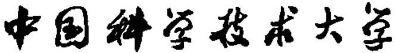

# 博士学位论文

## 超导量子比特快速高保真度读取的实验研究

作者姓名：段鹏

学科专业：物理学

导师姓名：郭国平教授

完成时间：二〇二二年五月二十三日

万方数据

# University of Science and Technology of China A dissertation for doctor's degree

# Fast and high-fidelity readout of superconducting qubits

Author: Peng Duan

Speciality: Physics

Supervisor: Prof. Guo-Ping Guo

Finished time: May 23, 2022

## 中国科学技术大学学位论文原创性声明

本人声明所呈交的学位论文，是本人在导师指导下进行研究工作所取得的成果。除已特别加以标注和致谢的地方外，论文中不包含任何他人已经发表或撰写过的研究成果。与我一同工作的同志对本研究所做的贡献均已在论文中作了明确的说明。

作者签名：

签字日期：2022.5.23

## 中国科学技术大学学位论文授权使用声明

作为申请学位的条件之一，学位论文著作权拥有者授权中国科学技术大学拥有学位论文的部分使用权，即：学校有权按有关规定向国家有关部门或机构送交论文的复印件和电子版，允许论文被查阅和借阅，可以将学位论文编入《中国学位论文全文数据库》等有关数据库进行检索，可以采用影印、缩印或扫描等复制手段保存、汇编学位论文。本人提交的电子文档的内容和纸质论文的内容相一致。

控阅的学位论文在解密后也遵守此规定。

公开控阅（年）

作者签名：Pony

签字日期：2072.5.23

导师签名：部2年

签字日期：2.022.5.1

万方数据

## 摘 要

量子计算由于其潜在的强大算力，是当前的个热门研究领域。在众多可能实现量子计算的物理体系中，超导量子计算体系目前被认为是最有前景的物理体系之一，本人博士期间的研究工作也是基于这个体系展开。对于量子计算而言，实现高保真度的初态制备、逻辑门操控以及量子态读取至关重要。然而，由于量子系统的脆弱性，量子计算机在运行时不可避免会出现错误。量子纠错为实现通用的容错量子计算提供了一条可行的路径。在量子纠错中，需要对物理比特进行反复的测量以监测错误的发生从而决定是否需要进行纠错，因此，我们不仅需要实现对量子比特的高保真度读取，还要求读取的时间尽可能短，以降低在测量过程中其他新的错误发生的概率。本文以实现超导量子比特的快速、高保真度读取为研究目标，通过系统分析读取原理，从读取参数优化、读取线路器件设计以及软件算法设计等几方面展开具体研究。本论文的主要研究内容和研究成果如下：

1. 本文研究了超导量子比特的读取问题，通过分析读取保真度与芯片设计参数之间的关联性，首次提出了一套完整的读取参数最优化设计方案。同时，本文清晰地指明，为实现更快速、更高保真度的量子比特读取，Purcell滤波器的实现以及量子极限参量放大器的实现至关重要。这为后文的工作提供了研究动机和目标。

2. 本文设计了一种新型的Purcell带阻滤波器，提高了对量子比特寿命的保护上限，可以用于实现更快速的量子比特读取。滤波器的实验测试结果也和仿真结果相符合。最后，通过分析现有几种不同设计的优缺点，本文提出了几种新的改进方案并通过仿真验证了改进后的设计对量子比特寿命的保护效果以及读取效果的提升。

3. 在超导量子体系中实现了参量放大器。其中，本文首次在实验，上实现了基于共面波导阻抗变换器的三波混频宽带宽参量放大器，其增益在15dB以上、带宽大于600MHz、噪声温度达到量子极限水平。利用这种宽带宽放大器，本文在一块多比特芯片上实现了多比特的快速高保真度读取——读取时间约为 300 ns\~500 ns，保真度高达 98.14%。

4. 研究了多比特联合读取中导致读取保真度下降的读取串扰问题。本文提出了一种新的基于浅层神经网络的态分类器，并通过实验证明，它能够有效抑制读取串扰从而提高多比特联合读取保真度。同时这类态分类器还可以应用于现场可编程门阵列（FPGA）中实现快速的态分辨和实时的反馈控制，这在未来容错量子计算的读取中将具有显著的优势。

本文主要有以下几点创新：·首次提出了一套完整的超导量子比特读取参数最优化设计方案。●设计了一种新型的Purcell带阻滤波器，可以提高量子比特寿命的上限以及量子比特读取速度的上限。首次分别利用片外以及片上的共面波导阻抗变换器实现三波混频的宽带宽参量放大器，用于实现多比特的高保真度读取。首次提出基于浅层神经网络的态分类器，并利用该分类器有效抑制读取串扰，提高联合读取保真度。

关键词：超导量子计算；滤波器；参量放大器；阻抗匹配；读取串扰；神经网络

## ABSTRACT

Superconducting quantum system based on superconducting Josephson junction is currently regarded as the one of the most promising systems to realize quantum computing. As is the main focus of my own research during my Ph.D. over the past few years. High-fidelity state initialization, logic gate manipulation, and quantum state readout are critical for quantum computing. However, due to the fragility of quantum systems, quantum computers will inevitably encounter errors during operation. Quantum error correction provides a feasible path to achieve universal fault-tolerant quantum computing. In quantum error correction, since it is necessary to repeatedly measure the state of qubits to monitor the occurrence of errors to determine whether a correction is required, we not only need to achieve high-fidelity readout of qubits, but also to measure as fast as possible, thereby reducing the probability of other new errors occurring during the measurement process. This document is mainly about a series of work carried out during my Ph.D. aiming to realize fast and high-fidelity readout of superconducting qubits, including the following parts:

1. In Chapter 2, I describe the basic principles of dispersive readout of superconducting qubits in detail, analyze the relation between readout fidelity and design parameters of the quantum processers. I propose a full solution for optimal design of readout parameters. At the same time, I find that the realization of Purcell filters and quantum-limited parametric amplifiers are crucial for fast and highfidelity readout, which provides motivation for the following works.

2. So in Chapter 3, I design a new band-stop Purcell filter for fast readout. I verify the effectiveness of the filter and optimize the design parameters through simutation. The results of our experiment are also consistent with the simulation results. Finally, by comparing and analyzing the pros and cons of several different designs in the literature, I also propose several new improved designs and verify the improvement through simulation.

3. In Chapter 4, I introduce the basic theory of parametric amplifier and its realization in superconducting quantum system. I demonstrate the realization of a broadband amplifier with a gain of more than 15 dB, a bandwidth of more than 600 MHz, and a noise temperature at the quantum-limit level. With this amplifier, I achieve a fast and high-fidelity multi-qubit readout on a multi-qubit quantum processor, with the highest fidelity of 98.14% in a time in range of 300 ns to

500 ns.

4. In Chapter 5, I propose a novel shallow-neural-network-based state discriminator for suppressing readout crosstalk. Experiment shows that this new state discriminator can effectively suppress the readout crosstalk and improve the fidelity of multi-qubit joint readout. This discriminator can be directly transplanted to a field programmable gate array platform, which would be extremely useful for rapid state assignment and real-time feedback control. ie innovation points of this thesis mainly include: • A method for optimal design of readout parameters for superconducting qubits is proposed. • A band-stop Purcell filter is designed, which can improve the lifetime limit of qubit and the speed limit of the readout. • Broadband parametric amplifiers with off-chip and on-chip coplanar waveguide impedance transformer are implemented for high-fidelity readout. • A novel state discriminator based on shallow neural network is proposed and implemented which can suppress the readout crosstalk effectively and improve the fidelity of multi-qubit joint readout .

Key Words: superconducting quantum computing; Purcell filter; parametric amplifier; impedance matching; readout crosstalk; neural network

## 目 录

第1章 绪论·  
1.1 量子计算的基本概念·  
1.1.1 量子比特  
1.1.2 量子逻辑门· 3  
1.1.3 量子态重置与量子测量 6  
1.2 超导量子计算的实现原理 8  
1.2.1 超导量子比特 8  
1.2.2 单比特门操控 14  
1.2.3 两比特门操控 16  
1.3 超导量子计算的起源与现状· 20  
1.4 论文结构 21  
参考文献 22  
第2章 超导量子比特读取参数最优化设计. 28  
2.1 电路量子电动力学· 28  
2.1.1 Transmon 与谐振腔的耦合 29  
2.1.2 色散耦合区域 31  
2.1.3 多能级的修正效应 32  
2.2 色散读取原理. 33  
2.2.1 微波驱动下的演化· 33  
2.2.2 测量的影响 35  
2.2.3 信噪比和保真度 37  
2.2.4 量子效率 40  
2.3 读取参数最优化设计 41  
2.3.1 设计目标 41  
2.3.2 参数限制- 41  
2.3.3 信噪比与各参数的依赖关系 42  
2.4 本章小结 46  
参考文献 47  
第 3 章 Purcell 滤波器的设计原理与验证. 52  
3.1 微波谐振电路的分析. 52  
3.1.1 串并联 RLC 电路 52  
3.1.2 开路与短路 λ/4 共面波导传输线 54  
3.1.3 读取谐振腔的外部耗散率. 55  
3.2 Purcell 耗散率的计算与滤波器的设计原理 57  
3.2.1 Purcell 效应的原理与 Purcell 耗散率的计算方法 57  
3.2.2 Purcell 滤波器的设计分析 58  
3.3 Purcell 滤波器的仿真与实验结果 60  
3.3.1 仿真分析· 61  
3.3.2 实验结果 63  
3.3.3 设计改进 64  
3.4 本章小结 66  
参考文献 67  
第4章 约瑟夫森结参量放大器的设计与实验· 69  
4.1 参量放大器的一般性原理 69  
4.1.1 非简并模式 70  
4.1.2 简并模式· 72  
4.1.3 量子极限噪声 72  
4.2 基于约瑟夫森结的实现原理 73  
4.2.1 磁通泵浦 73  
4.2.2 直接泵浦 74  
4.2.3 饱和信号输入功率. 76  
4.3 窄带宽约瑟夫森结参量放大器的设计与实验· 77  
4.3.1 约瑟夫森结参量放大器的设计· 77  
4.3.2 约瑟夫森结参量放大器的实验测量· 79  
4.4 基于阻抗变换的宽带宽放大器的设计与实验 82  
4.4.1 基于阻抗变换的放大器理论 83  
4.4.2 阻抗变换器的参数设计 84  
4.4.3 实验设计与测量结果 89  
4.4.4 多比特读取实验结果 95  
4.5 本章小结 96  
参考文献 97  
第5章 基于浅层神经网络的联合读取串扰抑制· ·101  
5.1 超导量子比特读取的数据处理流程· ·101  
5.1.1 混频技术与频分复用 101  
5.1.2 数据解调 ·103  
5.1.3态分辨 ·····105  
5.2 联合读取中串扰的实验现象与分析·.................··106  
5.2.1样品结构与基本参数·························106  
5.2.2 读取串扰的具体表现与量化方法···············.···107  
5.2.3 读取串扰可能的形成机制与应对方法··············108  
5.3 抗串扰的基于浅层神经网络的态分类器·......·...·...·110  
5.3.1浅层神经网络基本概念·.··....·...········.···110  
5.3.2 基于浅层神经网络的态分类器的构建·.····.········111  
5.3.3 浅层神经网络态分类器对读取串扰的抑制效果···.·112  
5.4本章小结··..·······..... ············ ·117  
参考文献·. · ···· ·118  
第6章总结与展望  
致谢· ·····123  
在读期间发表的学术论文与取得的研究成果............·125

## 插图清单

图1.1 量子态在布洛赫球上的表示。 2  
图1.2 常见单比特门的相关表示信息。  
图 1.3 （a)三明治结构的约瑟夫森结结构示意图。（b)约瑟夫森结的电  
路符号。（c）两个约瑟夫森结并联构成超导量子干涉仪（SQUID）。9  
图1.4 超导量子比特的一般等效电路模型。. 10  
图1.5 不同参数条件下的电荷量子比特的本征能级图，图片引自文  
献[57]。. 13  
图1.6 (a) 微波驱动电压 $V _ { d }$ 通过电容 $c _ { d }$ 作用到 transmon 量子比特的  
电路示意图。（b）将驱动电压源等效为一个偏置电压为 $\nu _ { d }$ 的电  
容，图中标注的 ${ \pmb a } , { \pmb b } , { \pmb g }$ 为电路的几个节点。· 14  
图 1.7 两个 transmon 量子比特通过电容耦合的等效电路图。· 16  
图 2.1 （a)平面共面波导谐振腔结构示意图。灰色为绝缘衬底，浅色  
为超导金属。中央导带线线宽为W，距离两边的地平面的距离为  
G。（b）3D谐振腔示意图，微波信号通过一个端口耦合到谐振腔  
内部，通过另一个端口可以探测到谐振腔内部的光场信号。（c）  
谐振腔与超导量子比特通过电容耦合的等效电路图。...... 28  
图 2.2 （a）JC模型共振条件下的能级示意图。（b）JC模型色散耦合条  
件下的能级示意图。黑线表示系统无耦合时的本征能级，蓝线表  
示系统耦合之后缀饰态本征能级。图片引自文献[19]。 30  
图2.3 读取谐振腔在不同驱动频率以及不同比特状态下的幅值和相位响  
应。图片引自文献[32]。 35  
图2.4 理想情况比特处于基态和激发态下对应的读取信号的两个高斯圆  
斑示意图。 38  
图 2.5 态分离错误率随信噪比的变化关系。图中红色和绿色虚线分别指  
示 $\pmb { { \cal E } } _ { \tt s e p }$ 为 0.005 和 0.001 时对应的 SNR 的大小。 39  
图 2.6 典型的腔光场在I - Q 平面的演化轨迹图，线条颜色深度的增加  
代表演化时间的增加。 43  
图 2.7 （a）读取信噪比以及饱和光子数随驱动频率的变化关系。图中蓝  
线对应左边纵轴，表示信噪比SNR与驱动频率的关系，浅红色线  
对应右边纵轴，表示约化后的饱和光子数 $n _ { \mathrm { m a x } } ^ { s } / n _ { \mathrm { c r i } }$ 与驱动频率的  
关系，其中 $n _ { \mathrm { m a x } } ^ { s } = \mathsf { m a x } ( n _ { g } ^ { s } , n _ { e } ^ { s } )$ 。(b)常系数滤波器与匹配滤波器  
对信噪比的影响。当积分时间足够长时，二者差距逐渐消失。.43  
图2.8 固定读取时间，SNR 随 χ和 κ的变化关系。紫色虚线代表 Purcell  
极限，详见正文；灰色和白色点虚线分别表示对相图纵向和横向  
切片得到的极值点。（a） η = 0.2， τ = 0.5 μs。（b) $\eta = 0 . 4 , \tau =$   
0.5 μs。 (c) η = 0.5, τ = 0.1 µs。 (d) η = 0.4, τ = 0.1 μs。 · . . . · 44  
图2.9 $\kappa _ { \tt o p t }$ 随 $\pmb { \chi }$ 的变化关系（a）以及 $\pmb { \chi _ { \bullet \bullet } }$ 随κ的变化关系（b)。三条彩  
色圆点状线从上到下依次代表 ${ \mathfrak { r } } = 0 . 2 \ { \mu } { \mathfrak { s } }$ 、τ = 0.5 µs、 τ = 1 µs。  
图中紫色虚线代表 Purcell 极限，黑色虚线是对 ${ \pmb \tau } = { \pmb 1 } { \pmb \mu } { \pmb s }$ 线性部分  
的的拟合。 ··45  
图 3.1 (a)串联 RLC 电路。(b)并联 RLC 电路。... 52  
图3.2 （a）并联式谐振电路与环境直接耦合。（b）并联式谐振电路与环  
境通过电容耦合。（c）图（b）的等效电路。红色虚线框表示耦合  
电路部分， $\pmb { R } _ { L }$ 为环境阻抗， $c _ { \kappa }$ 为耦合电容。...· 56  
图3.3 (a)传统的不带滤波器的 CQED 等效电路图。（b）带有 Purcell  
滤波器的CQED等效电路图。两者的差别由蓝色虚线框内的外部  
阻抗 $\pmb { E } _ { \mathrm { e x t } }$ 表示。·... ·57  
图3.4 （a）使用等效电感替代Purcell 滤波器之后的读取谐振腔等效电  
路图。（b）图（a）的等效并联RLC电路。... ·60  
图 3.5 Purcell 滤波器的仿真电路图。黄色部分表示量子比特，橙色表示  
读取谐振腔，红色部分是谐振腔与读取总线的耦合部分，绿色部  
分表示滤波器。仿真使用的衬底为理想的本征硅，P表示各段传  
输线的长度，G表示传输线中央导带线距离地平面的距离，对于  
所有传输线G=2μm，W表示滤波器的中央导带线线宽，对于读  
取总线以及谐振腔，中央导带线线宽为3.2μm，从而满足50Ω的  
阻抗匹配条件。.. 60  
图 3.6 滤波器的中央导带线线宽 W 对结果的影响图。(a) W取不同值时  
的 $\pmb { S } _ { 2 1 }$ 幅值谱。（b）W取不同值时根据仿真结果计算的量子比特  
$T _ { 1 }$ ，其中虚线表示 $T _ { 1 } = 1 \ m s .$ (c)δ1取不同值时分别扫描 W得  
到的毫秒带宽与W的变化关系，纵轴毫秒带宽表示从图（b）中  
提取的 $T _ { \parallel } \geqslant 1 \ m s$ 时的带宽。(d)滤波器中心保护频率与W的变  
化关系。 61  
图 3.7 两个 λ/4 滤波器的长度差值 δl 对结果的影响图。（a） δl 取不同值  
时的 $\pmb { S } _ { 2 \mathrm { I } }$ 幅值谱。（b）δl取不同值时根据仿真结果计算的量子比  
特 $\pmb { T _ { 1 } }$ ，其中虚线表示 $\begin{array} { r } { \pmb { T } _ { 1 } = 1 \pmb { \mathrm { m s } } , } \end{array}$ (c) W取不同值时分别扫描 δl  
得到的毫秒带宽与δl的变化关系。(d)滤波器中心保护频率出的  
$\pmb { T } _ { 1 }$ 与δ的变化关系。.... 62  
图 3.8 Purcell 滤波器对读取谐振腔的有效外部耦合 Q 值 $Q _ { e \uparrow }$ 的影响。.63  
图3.9 (a)Purcell滤波器样品设计版图，绿色部分表示开路 λ/4 滤波  
器。（b)低温测量结果，黑色箭头代表比特频率范围处与谐振腔  
频率范围处的隔离度，20 dB 隔离度的带宽超过1 GHz以上。.·63  
图 3.10 8 种不同设计的 Purcell 滤波器等效电路图，其中 1# 没有 Purcell  
滤波器。图中橙色代表读取谐振腔，黄色代表量子比特，绿色代  
表 Purcell 滤波器。·.. 64  
图 3.11 几种不同 Purcell 滤波器的设计仿真结果的对比。（a）输入输出  
$| \bar { S } _ { 2 1 } |$ 幅值谱。（b）根据 Purcell 耗散率计算的 $\pmb { T _ { \parallel } }$ 上限随比特频率  
的变化关系。 65  
图4.1 (a）磁通泵浦模式的等效电路图，外部驱动以外磁通的形式通过  
互感作用到SQUID 回路。(b)直接泵浦模式下的等效电路图，K  
表示线路的非谐。图片引自文献[27]。.. · 73  
图4.2 约化后的稳态光子数与约化后的泵浦失谐ν以及实际驱动强度相  
关的量ξ之间的关系。 $\xi / \xi _ { \mathrm { c r i t } } = 0 . 0 1 , 0 . 5 , 1 , 2$ 分别对应黄色、红色、  
蓝色、紫色线。. 76  
图4.3 JPA芯片设计版图（a）与它的等效电路图（b）。版图中灰色代表  
第一层结构；红色为第二层，代表电容介质层；紫色为第三层，代  
表电容上级板；绿色为第四层，代表SQUID环路（绿色虚线方  
框)。版图右上角和右下角分别有SQUID和电容测试结构，用于  
常温下的参数表征测试。 77  
图 4.4 约瑟夫森结直流 I \~ V 特性曲线。图中 $V _ { g } \approx 0 . 3 1 6 \mathrm { m V }$ 78  
图4.5 左侧：测量系统线路连接与配置图，JPA的反射信号经过两级环  
形器之后先经低温 HEMT 放大再到室温经过室温放大器放大之  
后输入到频谱仪或网络分析仪。红色线路——包括两级环形器在  
内，表示JPA信号端口与20mk冷盘之间存在一定的插损。右侧：  
冷（20 mK）/热（6K）负载法测量低温 HEMT噪声温度的线路  
连接图，HEMT的负载为20mK 盘上连接的标准50Ω负载器。·. 79  
图4.6 JPA 低温测试表征流程图。 ··80  
图 4.7 JPA 实验测量结果图。（a） JPA 的直流调制谱图，谐振频率随着  
直流偏置磁通周期性变化，且可调范围大于4GHz\~8GHz。图中  
黑色虚线为拟合曲线。(b) $\pmb { \delta } = \mathbf { 1 0 } \mathbf { M H z }$ 时的信号增益与泵浦功率  
和直流偏置磁通的变化关系。（c）信号增益随信号输入功率的变  
化关系，随着输入功率增大，增益逐渐减小，输入线上的总衰减  
量为-101 dB。(d）ΔSNR 法测到的系统噪声温度。 81  
图4.8 共面波导阻抗变换器示意图。. 85  
图4.9 阻抗匹配条件下四分之一波长阻抗变换线的特征阻抗的合法值与  
另外两个设计参数的关系。(a) $z _ { \mu 4 }$ 的合法区间长度。（b） $Z _ { \mathcal { M } 4 }$   
的合法区间的中心值。.... 87  
图4.10 固定 $\pmb { C } = \pmb { 3 } \mathsf { p F }$ ，计算阻抗变换器的两个特征阻抗值对增益和带宽  
的影响。(a)满足设计条件前提下计算出来的增益大小。(b)满足  
设计条件前提下计算出来的带宽大小，红色小圆点表示正文中提  
到的设计参数。（c)工作点的泵浦强度，决定磁通泵浦的功率大  
小。(d)工作点的泵浦失谐，决定JPA的谐振频率。由于在满足设  
计条件的前提下，工作点参数仍然有一定的可调范围，图（c）和  
(d)是按照正文中的最大带宽策略计算的工作点泵浦强度和失谐  
量。·.... 87  
图4.11 给定的一组合理参数条件，计算增益曲线以及该曲线随泵浦功率  
的变化关系。（a）增益曲线随泵浦功率的变化关系，其中泵浦  
功率 $\lambda _ { \mathrm { n o m } } = 2 0 \log ( \lambda _ { \mathrm { f } } / \lambda _ { \mathrm { o p t } } )$ ，红色虚线表示此处满足阻抗匹配条  
件。（b）满足阻抗匹配条件下的增益曲线，其中 $G _ { 0 } = 2 2 . 7 \ : \mathrm { d B }$   
$r _ { \mathrm { B W } } / 2 \pi = 6 0 0 \ : \mathrm { M H z }$ ，图中蓝色虚线表示最小增益设计目标 ${ \pmb G } _ { \mathbf { m i n } } =$   
18 dB。其他相关参数为 $z _ { \nu 2 } = 6 0 \Omega$ $z _ { \nu 4 } = 3 3 \Omega ,$ $c = 3 ~ { \mathfrak { p F } }$   
$\omega _ { \mathrm { f } } / 2 \pi = 6 . 8 \ : \mathrm { G H z }$ $\Omega _ { p } / 2 \pi = 1 3 . 6 \mathrm { G H z }$ $\lambda _ { \mathrm { o p t } } / 2 \pi = 1 . 1 3 2 \ : \mathrm { G H z }$ $\mathbf { \Gamma } _ { \mathsf { o p t } } = \mathsf { \mathbf { 0 } } _ { \circ }$ 88  
图4.12（a）满足设计条件的参数空间中电容参数的误差容忍度。（b）满  
足条件的电容参数的中心值随阻抗变换器两个特征阻抗的变化关  
系。····· ·88  
图 4.13 固定 $Z _ { \lambda / 2 } = 6 0 \Omega$ ，计算C和 $z _ { \mu 4 }$ 对增益和带宽的影响。（a）满  
足设计条件前提下计算出来的增益大小。（b）满足设计条件前提  
下计算出来的带宽大小，红色小圆点表示正文中提到的设计参数，  
在这个参数条件下，横向和纵向都有较大的冗余度。（c）工作点  
的泵浦强度，决定磁通泵浦的功率大小。(d)工作点的泵浦失谐，  
决定JPA的谐振频率。由于在满足设计条件的前提下，工作点参  
数仍然有一定的可调范围，图（c）和（d）是按照正文中的最大  
带宽策略计算的工作点泵浦强度和失谐量。·.··.·......89  
图4.14 JPA 外接阻抗变换器样品图（a）及其等效电路和信号流图（b）。  
阻抗变换器与环形器之间一般用约10 cm长的低温同轴线缆相连  
接。···.. 90  
图4.15 两种使用不同基底制备的片外阻抗变换器的特征阻抗时域测量结  
果。（a）第一类基底，其介电常数 $\epsilon _ { r } = 3 . 4 8 , \ 0 . 2 \mathrm { n s }$ 附近为半波长  
阻抗变换线的阻抗，之后的低谷对应四分之一波长阻抗变换线的  
特征阻抗。（b）第二类基底，其介电常数 $\epsilon _ { r } = 1 0 . 2 , \ 0 . 4 \ \mathrm { n s }$ 附近为  
半波长阻抗变换线的阻抗，之后的低谷对应四分之一波长阻抗变  
换线的特征阻抗。Z1、Z2、Z3代表阻抗参数的不同设计组合编  
号。 90  
图4.16 基于片上阻抗变换的IMPA 的芯片设计版图。 91  
图4.17 绑线电感对于片外和片上阻抗变换方案的影响。理想条件为环境  
阻抗 $\begin{array} { r } { R _ { L } = 5 0 \Omega . } \end{array}$ ，计算中采用的设计参数为 $\omega _ { t } / 2 \pi = 6 . 5 \ : \mathrm { G H z }$   
${ \pmb { C } } = 3 { \ \pmb { \mathsf { p F } } }$ $z _ { \lambda \hbar } = 6 0 \Omega$ $\pmb { Z } _ { \lambda / 4 } = 3 9 . 2 \Omega$ ·91  
图4.18 实测大部分环形器的端口阻抗（a）以及经过阻抗变换器之后的端  
口阻抗（b）。（c）个别环形器某个端口阻抗匹配较好，经过阻抗  
变换器之后的端口阻抗也和预期结果符合得较好。测量过程中环  
形器的另外两个端口正常连接测量电路，其中一个端口连接信号  
输入线路，另一个端口连接信号输出线路，也即HEMT所在线路。92  
图4.19 IMPA 测量中微调泵浦频率的效果。环境阻抗中的小波纹振荡会  
反映到增益曲线中，通过微调泵浦频率，有可能可以测到更加平  
坦的增益形貌。（a）图中的两条增益曲线分别对应（b）图中对应  
颜色箭头指示的该泵浦频率处的增益曲线。.. 93  
图4.20 环形器端口到阻抗变换器之间的连接线长度对环境阻抗的影响  
(a）以及对IMPA增益的影响（b)。测量（a）图时环形器的另外  
两个端口接标准50Ω负载，因此阻抗曲线较为平滑。.....．93  
图4.21 IMPA的低温测试流程与测量结果。（a）低温测量流程图，我们  
以增益不小于15dB，工作带宽不小于300MHz为筛选目标。（b)  
第一步中测到的直流调制谱，其中白色圆圈虚线是对谐振频率随  
直流偏置变换关系的拟合结果。（c）（d）信号增益对直流偏置  
和泵浦功率的依赖关系。实验中泵浦频率固定在 $f _ { p } = 1 3 . 7 \mathrm { G H z } ,$   
而网分的输出频率设置为 $f _ { p } / 2 + \delta$ ，其中δ根据测量结果可以从  
10MHz（c）逐步增大到150MHz（d），从而实现对增益形貌的稀  
疏采样。（e）经过第三步细调直流偏置和泵浦功率之后测到的工  
作带宽。图中有颜色区域代表实验中实际的扫描区域，而该区域  
正是从第二步测量结果中提取出来的。（f）在图（e）中紫色圆点  
对应的工作点处测到的增益形貌、4SNR以及计算得到的系统噪  
声温度。考虑到低温 HEMT 的参考噪声温度平面与IMPA之间存  
在着一定的插损，而这段插损室温测量值与低温实际值有一定的  
不确定性，因此在计算噪声温度时，引入了1 dB的误差范围。(g)  
在前述工作点处测量得到的饱和信号输入功率。·. 94  
图 4.22 实验观测到的IMPA 工作频率的可调性。样品 A 和 B 分别代表片  
上和片外阻抗变换方案下的IMPA。... 95  
图 4.23 使用 IMPA 之后，六比特芯片的读取效果。 ·95  
图 5.1 超导量子比特读取线路示意图。 ·102  
图 5.2 读取信号解调与态分辨示意图。经数字解调之后的原始信号在  
IQ平面上形成两个高斯圆斑，将两个圆斑向圆斑中心连线方向  
投影之后形成两个高斯分布曲线，通过选择最佳的阈值来最大化  
比特的读取保真度。·.... ·105  
图 5.3 利用投影阈值法构建态分类器过程示意图。... ·105  
图5.4 实验中使用的六比特芯片的核心结构的设计版图以及读取电路的  
关键部分示意图。... ·106  
图 5.5 一个两比特体系中IQ 圆斑偏移的示意图。两个实心圆表示 Q3  
处在|0) 态时 Q4 的两个IQ圆斑，蓝色代表|0) 态，红色则代表  
1)态。黑色虚线表示此时的最佳二分类直线。两个虚线圆表示  
Q3 处在|1)态时 Q4 的两个 IQ 圆斑，由于与 Q3 处在 (0) 态时 Q4  
的两个IQ圆斑有明显的偏移，原来的最佳的分类线此时将不再  
适用。·.... ···108  
图5.6 每个读取腔设置独立的Purcell滤波器可以有效抑制读取串扰。(a)  
样品结构图。（b）红色虚线表示没有 Purcell滤波器时谐振腔的  
激发光子数与驱动频率失谐量的关系，而蓝色线表示有了独立的  
Purcell滤波器之后的情形。图片引自文献[6]。·. ···109  
图 5.7 浅层神经网络的基本结构。 ·110  
图5.8阈值投影法态分类器（a）与浅层神经网络态分类器（b）的结构  
以及对应关系。.· · · 112  
图 5.9 各分类器的保真度与数据解调时间长度的关系。.. ··113  
图 5.10 SNND 的混淆矩阵与 MFD 混淆矩阵的差值。比特的状态用一个  
6位的二进制数表示，64种可能的计算基态在图中的排列顺序为  
从上到下（从左到右）对应从000000到111111。图中矩阵对角项  
之和为247.8%，意味着保真度的大幅度提升。·... ···114  
图 5.11 MFD 的交叉保真度矩阵以及 SNND 的交叉保真度矩阵。115  
图5.12 （a）解调系数的功率谱，蓝线代表MFD，在这条线上只有一个关  
于目标比特中频频率的信号峰。红色代表SNND，可以看到，除  
了目标比特自身的频率信号峰之外，还有一个信号峰的频率刚好  
等于 Q3的中频频率。（b）使用 MFD的解调系数获得的IQ圆斑  
以及（c）使用SNND的解调系数获得的IQ圆斑，其中的态表示  
1Q3,Q4)，黑色的十字交叉记号代表每个圆斑的中心点，可以发现  
采用MFD方案时，随着Q3状态的改变，圆斑发生了偏移，而在  
SNND中则没有这种现象。 ··115

## 表格清单

表1.1 悬铃木号和祖冲之号量子芯片主要性能参数。.. 21  
表3.1仿真电路图的关键设计参数。 61  
表3.2 图3.11仿真结果对应的设计参数。量子比特与谐振腔的耦合电容  
为12fF，当比特频率为5GHz时，可以计算得到其与谐振腔的耦  
合强度约为 194 MHz。 66  
表 4.1 根据图 4.23 提取的六个比特的读取信噪比与读取错误率。.... 95  
表5.1 实验中六比特样品的实际工作参数。实验中为了抑制单比特工作  
点的残留耦合，部分比特频率会从简并点 $( \omega _ { \mathrm { Q u b i t } } ^ { \mathrm { i d l e } } )$ 向下调整到工  
作点 $\{ \omega _ { \mathrm { Q u b i 1 } } ^ { \mathrm { b i a s e d } } \}$ 。相邻谐振腔的频率间隔和设计值吻合得较好，大约  
20MHz。表格中比特的弛豫寿命和相干时间数据是在工作点测试  
得到的。 107  
表 5.2 Q3 的状态对 Q4 读取保真度的影响。 108  
表 5.3 各分类器的最佳数据解调时间与对应的保真度。· 113  
表 5.4 每个比特的 SNND 和 MFD 对应的读取保真度。表格中最后一行  
表示 SNND 相比于 MFD 的错误抑制率 $\epsilon _ { r ^ { < } }$ 平均错误抑制率为  
8.5%。  
表 5.5 从交叉保真度矩阵中提取的 Qi 和 Qj (i - jl = 1,2,3,4,5) 的平均  
绝对交叉保真度。 14  
表 5.6 从交叉保真度矩阵中提取的 Qi 和 Qj (li − jl = 1,2, 3,4,5) 的平  
均绝对交叉保真度。上角标 $\bullet \mathfrak { o } ^ { \bullet }$ 表示训练集中的非目标比特全部  
处于0)态，而上角标\*则表示训练集中非目标比特处在所有  
可能的状态。 $\because \Gamma \hbar ^ { * }$ 表示分类器使用的是投影阈值法，而GM’表  
示分类器使用的是高斯混合模型（GMM）算法(这里我使用的是  
MATLAB 中的函数 fitediscr)。LSNND 表示线性的 SNND，即去  
掉原 SNND 中的非线性激活函数。 116  
表5.7儿种不同训练方法下的每个比特的读取保真度。 ·117

## 第1章绪 论

自量子计算概念提出以来，人们已经在诸多不同的物理体系中实现了不同程度的量子计算原理性演示实验[1]。其中，超导量子计算是当前最有希望也是当前进展最快的主流方案之一，也正是本人博士期间的研究方向。本章将主要介绍超导量子计算的基本概念及其在超导量子体系中的实现原理。

## 1.1 量子计算的基本概念

1980 年至1982 年间，Paul Benioff 提出了图灵机的量子力学模型概念[2-6]，尽管他的模型最终被证明和经典可逆图灵机[7]是等价的，但是他的这一系列工作证明了量子机器可以有效地模拟经典计算机。于是，紧接着，Richard Feynman就在1982年提出了一个相反的问题一—经典计算机能够有效地模拟量子系统吗？Feynman给出了一个否定的答案，但是他同时提出一个构想——可以构建一个基于量子力学规律运行的量子计算机，用来有效地模拟量子系统[6,8]。这就是早期的量子计算的概念雏形。

1985年，David Deutsch进一步提出了普适量子计算机，或者，更确切地说，他介绍了一种基于量子力学的图灵机—量子图灵机，并且设计了一个简单的算法（Deutsch算法），使得该算法在量子计算机上运行要比在经典计算机上更快[9]。然而量子计算真正引来学术界和社会极大关注还要等到1994年，那一年Peter Shor分别提出了可以有效解决大数质因数分解和离散指数型问题的量子算法[10]。这件事情之所以影响这么大，一方面是因为这两个问题在经典计算机中没有有效的算法，这意味着，量子计算很有可能比经典计算要更强大；另一方面，大数质因数分解算法（现在也称为 Shor算法）直接威胁到全球通用的RSA密码体系的安全性，因为这一体系的安全性正是依赖于大数质因数分解在经典计算机中没有有效的求解算法[6]。

再之后经过近30年的发展，量子计算领域已经取得了长足的进步，并且在某些特殊问题上已经展现出了量子优越性[1-13]。本节将围绕量子计算几个核心元素逐个进行介绍。

## 1.1.1 量子比特

经典计算和经典信息中最小的结构单元为比特，一般用二进制数0和1来编码，用于表示物理系统的两种不同状态，从而用来存储信息或进行计算。在量子计算中同等的概念被称为量子比特(qubit)，它可以被认为是量子计算和量子信息的最小结构单元。量子比特一般由两种正交的量子态来编码，我们把这两个量子态称为计算基矢，记为|0)、1)；但与经典情况不同的是，量子比特不仅可以处于它的两个编码态，还可以处于它们的任意线性叠加态，这意味着量子比特相比经典比特可以编码更多的信息，这正是量子态叠加原理的结果。

一个量子比特的一般态可以表示为：

$$
\left| \psi \right. = a \left| 0 \right. + b \left| 1 \right. ,\tag{1.1}
$$

即|0》和|1)的任意叠加态。其中a、b是满足归一化条件的两个复数，即 $a , b \in \mathbb { C }$ 且 $\vert a \vert ^ { 2 } + \vert b \vert ^ { 2 } = 1$ 。因此，上式实际上只有三个独立参量，可以重新表示为

$$
\left| \Psi \right. = e ^ { i \gamma } \left( \cos \left( \frac \theta 2 \right) \left| 0 \right. + e ^ { i \varphi } \sin \left( \frac \theta 2 \right) \left| 1 \right. \right) .\tag{1.2}
$$

当考虑单个量子比特时，量子态的全局相位不具备可观测的物理效应，因此可以忽略。于是，一个量子比特的任意量子态可以写为

$$
\left| \varPsi \right. = \cos \left( \frac { \theta } { 2 } \right) \left| 0 \right. + e ^ { i \varphi } \sin \left( \frac { \theta } { 2 } \right) \left| 1 \right. .\tag{1.3}
$$

其中 $\theta \in [ 0 , \pi ] , \varphi \in [ 0 , 2 \pi ]$ 。如图1.1所示，如果将 $\theta , \varphi$ 分别视作球坐标系中的极角和方位角，则公式（1.3）所表示的任意量子态将和一个单位球面上的点形成一一映射关系，即可以用单位球面上的点来形象的表示一个任意量子态，我们将这个球面称为布洛赫球面，这个球称为布洛赫球，球心与球面上的点的连线构成的矢量称为布洛赫矢量。布洛赫球可以作为量子比特可视化的一个有效方法，本文后面将要介绍的单比特门操控都可以在布洛赫球上进行形象的描述。

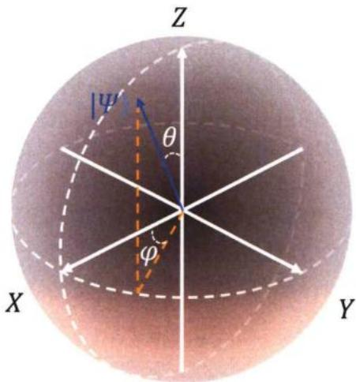  
图1.1 量子态在布洛赫球上的表示。

对于一个包含N个量子比特的系统，它的计算基矢为N个量子比特计算基矢的直积态，即 $\left\{ \left| 0 \right. , \left| 1 \right. \right\} \otimes \left\{ \left| 0 \right. , \left| 1 \right. \right\} \cdots \otimes \left\{ \left| 0 \right. , \left| 1 \right. \right\} = \left\{ \left| i \right. \right\}$ ，其中i是一个N位二进制数串，共有 $2 ^ { N }$ 个，因此一个N量子比特系统的量子态一般形式可以写为

$$
\left. \Psi \right. = \sum _ { i = 0 } ^ { 2 ^ { N } - 1 } c _ { i } \left. i \right. .\tag{1.4}
$$

式中 $\pmb { c } _ { i }$ 为叠加系数，也称作几率幅，其模的平方表示量子态处于该基矢的概率。对于一个N位经典比特系统而言，虽然它也有 $2 ^ { N }$ 种不同的状态，但是在同一时刻，经典系统只能处在其中一种可能的状态上，存储一个N位的二进制数（信息)，而一个N位量子比特的量子系统由于可以同时处于这 $2 ^ { N }$ 种不同的状态上，所以它的信息容量要远远超过相同位数的经典系统。

量子系统另一个神奇的特性是量子比特之间可以发生纠缠，即量子纠缠。当一个量子系统的量子态不能写成构成它的子系统的量子态的直积的形式，就称这个系统是存在量子纠缠的。考虑最简单的两比特情形，其中最典型的一个例子就是具有最大纠缠度的Bell态，它的其中一种形式为

$$
| \Psi \rangle = \frac { | 0 0 \rangle + | 1 1 \rangle } { \sqrt { 2 } } .\tag{1.5}
$$

显然它没有办法写成两个单比特量子态的直积形式。它的一个重要特点在于对第一个比特的和对第二个比特的测量结果总是相互关联的，即便当两个比特相距无穷远、不存在任何相互作用。这种非局域的关联性曾经是质疑量子力学完备性的一个重要依据，直到1964年，JohnBell证明Bell态的测量关联性始终大于经典系统所能呈现的测量关联性[14]，即Be∏不等式，以及这个不等式被后来的实验反复证明[15-19]，人们才逐渐认识到这是量子力学的一个基本属性。

## 1.1.2 量子逻辑门

在经典计算中，任何计算都可以用布尔表达式表示，而布尔表达式总可以用一些简单的逻辑门组合实现，这些逻辑门主要是与门、或门、非门以及控制非门[20]。与经典计算类似，任何复杂的量子计算操作都可以用通用量子逻辑门组来实现[20]。由于量子比特的演化遵循量子力学的薛定谔方程，演化过程是幺正的，所以量子计算的通用量子逻辑门组必须是幺正门，而幺正门都是可逆的，这也是量子计算相比经典计算的一个重要优势—经典计算的不可逆性引起的热耗散问题正是限制大规模集成电路发展的一种重要瓶颈[21-22]。对于量子逻辑门，可以证明，任意一个单比特门和任意一个两比特纠缠门可以构成通用量子逻辑门组[23]。

单比特操控对应着单个量子比特在单比特哈密顿量下的演化。一个二能级系统的哈密顿量总可以写成如下形式

$$
H _ { d } / \hbar = H _ { x } \sigma _ { x } + H _ { y } \sigma _ { y } + H _ { z } \sigma _ { z } = { \frac { \omega _ { d } } { 2 } } { \vec { n } } \cdot { \vec { \sigma } } ,\tag{1.6}
$$

上式对应着布洛赫球上的一个矢量，称之为哈密顿量矢量，其中 $\omega _ { d } =$ $2 \sqrt { H _ { x } ^ { 2 } + H _ { y } ^ { 2 } + H _ { z } ^ { 2 } }$ 表示哈密顿量的两个本征态的本征频率差，也即跃迁频率：${ \vec { n } } = ( \sin \theta \sin \varphi , \sin \theta \cos \varphi , \cos \theta )$ 表示哈密顿量矢量在布洛赫球上的方向， $\vec { \pmb { \sigma } } =$ $\left( \sigma _ { x } , \sigma _ { y } , \sigma _ { z } \right)$ 表示泡利矢量，对应的三个泡利矩阵的形式为

$$
\sigma _ { x } = { \Bigg [ } 0 \quad 1 { \Bigg ] } , \sigma _ { y } = { \Bigg [ } 0 \quad - i { \Bigg ] } , \sigma _ { z } = { \Bigg [ } 1 \quad 0 { \Bigg ] } .\tag{1.7}
$$

如果单比特的初始状态不是这个哈密顿量的本征态，这个初态态矢量的动力学演化过程就相当于在布洛赫球上绕着这个哈密顿量矢量旋转，旋转速度等于 $\omega _ { d }$ 可以写出单比特在这个哈密顿量作用下的幺正演化算子

$$
U = \exp \left\{ \int _ { 0 } ^ { T } - i \frac { H _ { d } } { \hbar } d t \right\} = \exp \left\{ - i \frac { \omega _ { d } T } { 2 } \vec { n } \cdot \vec { \sigma } \right\} .\tag{1.8}
$$

因此，任意单比特门操控都可以理解为在布洛赫球上使布洛赫矢量（初态）绕着某个特定的轴旋转特定的角度得到一个新的布洛赫矢量（末态）。令公式（1.8）中的 $\omega _ { d } T = \phi ;$ 可以把这个旋转操作用统一的数学语言描述为：

$$
R ( \vec { n } , \phi ) = \exp \left\{ - i \frac { \phi } { 2 } \vec { n } \cdot \vec { \sigma } \right\} .\tag{1.9}
$$

图1.2中列出了几种常见的单比特门的相关信息，包括它们的名称、符号表示、线路表示以及矩阵表示。

<table><tr><td rowspan=1 colspan=1>名称</td><td rowspan=1 colspan=1>符号表示</td><td rowspan=1 colspan=1>线路表示</td><td rowspan=1 colspan=1>矩阵表示</td></tr><tr><td rowspan=1 colspan=1>单位门</td><td rowspan=1 colspan=1>1</td><td rowspan=1 colspan=1>1日1</td><td rowspan=1 colspan=1>11q</td></tr><tr><td rowspan=1 colspan=1>泡利X门</td><td rowspan=1 colspan=1>X</td><td rowspan=1 colspan=1>x</td><td rowspan=1 colspan=1>l110</td></tr><tr><td rowspan=1 colspan=1>泡利Y门</td><td rowspan=1 colspan=1>Y</td><td rowspan=1 colspan=1>Y</td><td rowspan=1 colspan=1>C0]</td></tr><tr><td rowspan=1 colspan=1>泡利Z门</td><td rowspan=1 colspan=1>z</td><td rowspan=1 colspan=1>2</td><td rowspan=1 colspan=1>101</td></tr><tr><td rowspan=1 colspan=1>相位门</td><td rowspan=1 colspan=1>Phase</td><td rowspan=1 colspan=1>P</td><td rowspan=1 colspan=1>1L0]</td></tr><tr><td rowspan=1 colspan=1>阿达马门</td><td rowspan=1 colspan=1>H</td><td rowspan=1 colspan=1>H</td><td rowspan=1 colspan=1>1[111√211</td></tr></table>

图1.2 常见单比特门的相关表示信息。

两比特门是同时作用在两个量子比特上的逻辑门，一般需要系统的哈密顿量存在某种形式的相互作用，即至少包含集合 $\left\{ \sigma _ { i } ^ { 1 } \sigma _ { j } ^ { 2 } , ( i , j ) \in \{ x , y , z \} ^ { 2 } \right\}$ 当中的一项。能使两比特产生纠缠的两比特门称为两比特纠缠门。目前研究以及应用最广泛的两比特纠缠门主要有以下三种类型：CNOT门，CZ门， $\sqrt { \mathsf { S W A P } }$ 门 $( \sqrt { i S W A P }$ 门)。

其中CNOT门全称为Control-NOT门，也即控制非门，它的作用原理和经典计算中的控制非门相同，是当两个比特当中作为控制比特的状态处于1)时，翻转作为目标比特的状态，也就对目标比特执行一个非门（X门或NOT门)，因此它的矩阵形式可以写成

$$
\mathbf { C N O T } = \left| 0 \right. \left. 0 \right| \otimes \mathbf { I } + \left| 1 \right. \left. 1 \right| \otimes \mathbf { X } = \left[ { \begin{array} { c c c c } { 1 } & { 0 } & { 0 } & { 0 } \\ { 0 } & { 1 } & { 0 } & { 0 } \\ { 0 } & { 0 } & { 0 } & { 1 } \\ { 0 } & { 0 } & { 1 } & { 0 } \end{array} } \right] .\tag{1.10}
$$

CZ门全称为Control-Z门，也即控制相位门，它的作用原理是当控制比特处于1)时，对目标比特执行一个π相位门（Z门)，类似的，它的矩阵形式可以写成

$$
\mathbf { C } \mathbf { Z } = \left| 0 \right. \left. 0 \right| \otimes \mathbf { I } + \left| 1 \right. \left. 1 \right| \otimes \mathbf { Z } = \left[ { \begin{array} { c c c c } { 1 } & { 0 } & { 0 } & { 0 } \\ { 0 } & { 1 } & { 0 } & { 0 } \\ { 0 } & { 0 } & { 1 } & { 0 } \\ { 0 } & { 0 } & { 0 } & { - 1 } \end{array} } \right] ,\tag{1.11}
$$

CZ门可以认为是任意控制相位门（CPhase门）的一种特殊形式，后者的一般形式为

$$
\mathbf { C P h a s e } = \left| 0 \right. \left. 0 \right| \otimes \mathbf { I } + \left| 1 \right. \left. 1 \right| \otimes \mathbf { P h a s e } = \left[ { \begin{array} { c c c c } { 1 } & { 0 } & { 0 } & { 0 } \\ { 0 } & { 1 } & { 0 } & { 0 } \\ { 0 } & { 0 } & { 1 } & { 0 } \\ { 0 } & { 0 } & { 0 } & { e ^ { i \phi } } \end{array} } \right] .\tag{1.12}
$$

另一种常见的两比特门是SWAP门，它作用在计算基矢上的表现为交换[01)和10》的布居数，因此它的矩阵形式为

$$
\mathbf { S W A P } = { \left[ \begin{array} { l l l l } { 1 } & { \mathbf { 0 } } & { 0 } & { 0 } \\ { 0 } & { 0 } & { 1 } & { 0 } \\ { 0 } & { 1 } & { 0 } & { 0 } \\ { 0 } & { \mathbf { 0 } } & { 0 } & { 1 } \end{array} \right] } ~ .\tag{1.13}
$$

有些物理体系只能实现iSWAP门，它和SWAP门作用机制基本一致，只是在|01)

和|10>交换的同时引入一个额外的相位i，iSWAP门的矩阵形式为

$$
i \mathbf { S W A P } = { \left[ \begin{array} { l l l l } { 1 } & { 0 } & { 0 } & { 0 } \\ { 0 } & { 0 } & { i } & { 0 } \\ { 0 } & { i } & { 0 } & { 0 } \\ { 0 } & { 0 } & { 0 } & { 1 } \end{array} \right] } .\tag{1.14}
$$

注意到 SWAP 门和 iSWAP 门并不能产生两比特纠缠态，不过如果让 SWAP(iSWAP)只作用交换一半，则可以使两比特之间产生纠缠，对应的门操作称之为 $\sqrt { \mathsf { S W A P } }$ 门 $( \sqrt { i S W A P }$ 门)，它们的矩阵形式为

$$
\sqrt { \mathrm { S W A P } } = \left[ \begin{array} { c c c c } { 1 } & { 0 } & { 0 } & { 0 } \\ { 0 } & { \frac { 1 } { 2 } \left( 1 + i \right) } & { \frac { 1 } { 2 } \left( 1 - i \right) } & { 0 } \\ { 0 } & { \frac { 1 } { 2 } \left( 1 - i \right) } & { \frac { 1 } { 2 } \left( 1 + i \right) } & { 0 } \\ { 0 } & { 0 } & { 0 } & { 1 } \end{array} \right] , \sqrt { i \mathrm { S W A P } } = \left[ \begin{array} { c c c c } { 1 } & { 0 } & { 0 } & { 0 } \\ { 0 } & { \frac { 1 } { \sqrt { 2 } } } & { \frac { i } { \sqrt { 2 } } } & { 0 } \\ { 0 } & { \frac { i } { \sqrt { 2 } } } & { \frac { 1 } { \sqrt { 2 } } } & { 0 } \\ { 0 } & { 0 } & { 0 } & { 1 } \end{array} \right] .\tag{1.15}
$$

## 1.1.3 量子态重置与量子测量

量子计算中还涉及到另外两个重要操作，分别是量子态重置和量子测量。这两种操作对于目标比特而言是非幺正的，这是因为实际上并没有真正孤立的量子比特系统—我们初始化或者测量它的时候它就必然与外界环境存在着某种耦合。不过这里所谓的非幺正演化总可以被包含这个系统在内的复合系统中的一个幺正演化描述。

能够实现快速的量子态重置，是DiVincenzo提出的构建量子计算机需要满足的重要条件之一[24]，同时也是量子纠错所必须具备的条件[25]。最简单的实现量子态重置的方法是被动地等待一段足够长的时间，使得量子态自发地弛豫到基态，不过随着量子比特寿命的提高[26-28]，这种方法变得不太实际。另一种方法就是主动态重置，这种方法一般又分为基于测量和基于主动控制的态重置，前者利用了对量子比特的测量—如果测量发现比特在激发态就对比特施加一个X门使其回到基态129-33]；后者一般通过设计特殊的量子比特与其他环境的耗散通道，使得量子比特有效寿命大大降低[34-37]，从而快速弛豫到基态，实现态重置。

量子测量是量子力学中一条基本假设，可以用作用在被测量系统的态空间上的测量算子集合 $\{ M _ { m } \}$ 描述[25]，其中下角标m表示测量的一种可能结果；如果测量前系统的状态用 $| \psi \rangle$ 描述，那么测量结果是m的概率是

$$
p \left( m \right) = \left. \psi \right| M _ { m } ^ { \dagger } M _ { m } \left| \psi \right. ,\tag{1.16}
$$

而测量之后系统的状态将变为

$$
\frac { M _ { m } \left| \psi \right. } { \sqrt { p \left( m \right) } } .\tag{1.17}
$$

这些测量算子满足完备性条件，即

$$
\sum _ { m } M _ { m } ^ { \dagger } M _ { m } = \mathbf { I } .\tag{1.18}
$$

实际上公式（1.18）也可以理解为概率归一性的另一种描述，因为对公式（1.16）求和将得到

$$
\sum _ { m } p \left( m \right) = \sum _ { m } \left. \psi \right| M _ { m } ^ { \dagger } M _ { m } \left| \psi \right. = 1 ,\tag{1.19}
$$

由于上式对于任意的ψ）都满足，因此自然得到公式（1.18）的完备性条件。

在量子计算中用到最多的是一种特殊的量子测量，叫投影测量，它的测量算子—称之为投影算子，记为 $\pmb { P _ { m } }$ —除了满足归一性还额外满足正交和厄密性，即

$$
P _ { m } ^ { \dagger } P _ { m ^ { \prime } } = \delta _ { m , m ^ { \prime } } P _ { m } , \quad P _ { m } ^ { \dagger } = P _ { m } .\tag{1.20}
$$

对一般力学量算符M，可以用一组完备的投影算子分解，

$$
M = \sum _ { m } m P _ { m } .\tag{1.21}
$$

式中 $P _ { m }$ 是算符M对应本征值为m的本征态的投影算子，对算符M测量得到的可能结果对应着它的本征值m，同样，得到m的概率为 $p \left( m \right) = \left. \psi \right| P _ { m } \left| \psi \right.$ 。根据公式（1.17）、公式（1.20）和公式（1.21），测量结果对应的末态 $\frac { P _ { m } | \psi \rangle } { \sqrt { p ( m ) } }$ 满足如下关系

$$
M \frac { P _ { m } \left| \psi \right. } { \sqrt { p \left( m \right) } } = \sum _ { m ^ { \prime } } m ^ { \prime } P _ { m ^ { \prime } } \frac { P _ { m } \left| \psi \right. } { \sqrt { p \left( m \right) } } = m \frac { P _ { m } \left| \psi \right. } { \sqrt { p \left( m \right) } } ,\tag{1.22}
$$

这意味着测量得到的末态就是算符M对应本征值为m的本征态，也即所谓的将末态“投影”到对应的本征态上。

由于测量结果的概率性，我们更关心的是测量结果的期望值和方差，它们可以分别表示为：

$$
E \left( M \right) = \sum _ { m } m p \left( m \right) = \sum _ { m } m \left. \psi \right. P _ { m } \left. \psi \right. = \left. \psi \right. M \left. \psi \right. ,\tag{1.23}
$$

$$
[ A \left( M \right) ] ^ { 2 } = \langle \left( M - \langle M \rangle \right) ^ { 2 } \rangle = \langle M ^ { 2 } \rangle - \langle M \rangle ^ { 2 } .\tag{1.24}
$$

以单比特测量为例，测量算符一般是 $\pmb { \sigma } _ { z }$ ，它的本征值 $\pm 1$ 对应的两个投影算子是 $P _ { 0 } = \left| 0 \right. \left. 0 \right| , P _ { 1 } = \left| 1 \right. \left. 1 \right|$ ，即 $\sigma _ { z } = P _ { 0 } - P _ { 1 }$ 。显然这两个算子满足正交归一完备性。假设对公式（1.1）表示的量子态进行测量，结果为|0)的概率为$p ( 0 ) = \langle \psi | \ P _ { 0 } \left| \psi \right. = | a | ^ { 2 }$ ，结果为|1)的概率为 $p ( 1 ) = \langle \psi | \ P _ { 1 } | \psi \rangle = | b | ^ { 2 }$ ，而且，测量结束之后，对应的系统的末态分别变为

$$
{ \frac { P _ { 0 } \left| \psi \right. } { \left| a \right| } } = { \frac { a } { \left| a \right| } } \left| 0 \right. , \quad { \frac { P _ { 1 } \left| \psi \right. } { \left| b \right| } } = { \frac { b } { \left| b \right| } } \left| 1 \right.\tag{1.25}
$$

测量得到结果0)时，系统末态将处在|0)，而测量结果为|1)时，系统末态将处在1)，这正是前文所讲的将末态投影到对应的本征态上。

## 1.2 超导量子计算的实现原理

实现量子计算的物理体系有很多备选方案，每种方案各有优缺点。至于如何去评判它们的优缺点，人们一般参考的是 2000年David P. Divincenzo提出来的5条标准[24]，这一套标准阐述的是构建实用量子计算所需要满足的条件，它们分别是：

1)具有可扩展的特性良好的量子比特

2)具备能将量子比特系统初始化到简单的初始态

3)量子比特系统具有较长的相干时间

4) 具备实现普适量子逻辑门的能力

5) 能够实现对量子比特的测量

尽管Divincenzo本人认为这几条判据过于简单，就像是对幼儿园的孩子们讲解量子计算时所提出的概念[38]。但就是这看似简单的几条标准指引着研究人员方面不断地去摸索新的可能适合量子计算的物理体系，另一方面不断地去改善已有的物理体系，使其更好地满足这几条标准。超导量子计算体系相比于其他量子计算体系一个显著的优势在于它对系统哈密顿量的高度可控性，包括对量子比特自身的电路结构、量子比特之间的相互作用、量子比特与环境的相互作用的设计与控制。因此随着研究的深入，人们对该体系的了解越丰富，越有可能设计出性能更好的量子比特以及保真度更高的量子逻辑门。

本节将具体介绍超导量子计算的基本原理，包括如何构造一个量子比特以及如何实现普适的量子逻辑门。关于对超导量子比特的测量部分，本文将放到第二章进行单独介绍。

## 1.2.1 超导量子比特

前文讲到，量子比特需要用两个正交的量子态来编码，这两个量子态对应着系统的两个本征能量。量子世界中量子体系具有分立的、离散的能量，因此可以有无穷多个能级，一般而言，要想严格定义出一个量子比特，需要这个量子体系具有一定的非线性，也即不同能级之间的间隔不相等。在超导量子比特中引入非线性需要用到一个关键的结构——约瑟夫森结 (Josephson junction)。

约瑟夫森结是一种超导体-绝缘体-超导体的三明治结构的器件，如图1.3（a)所示。由于中间的绝缘层极薄（\~2 nm)，使得两侧超导体中的电子可以以库珀对的形式相互隧穿，形成无阻的电流[39-41]。这种效应被称之为约瑟夫森效应(Josephson effect)，由 Josephson 于1962 年首次预言并被 Anderson 等人在次年实验证实[42]。约瑟夫森结的宏观物理效应可以用以下两个简洁的方程描述，

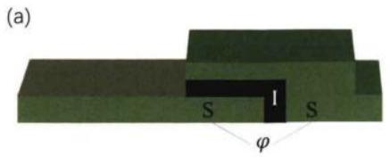

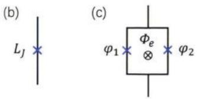  
图1.3 （a)三明治结构的约瑟夫森结结构示意图。(b)约瑟夫森结的电路符号。(c）两个约瑟夫森结并联构成超导量子干涉仪（SQUID）。

$$
\frac { d \varphi } { d t } = \frac { V } { \varPhi _ { 0 } } , \quad I = I _ { c } \sin \varphi .\tag{1.26}
$$

其中φ表示约瑟夫森结两侧超导波函数的相位差，V,I分别表示结两端的电压 $\varphi$ 差和流经结的超导电流， $I _ { c }$ 表示超导电流的临界值，称为临界电流，当电流超过临界电流时，器件将会失超从而表现为常态电阻。 $\varPhi _ { 0 } = \hbar / 2 e$ ，称作归一化的磁通量子。根据自感的定义，可以推算出约瑟夫森结的等效电感

$$
L = \frac { V } { d I / d t } = \frac { \varPhi _ { 0 } } { I _ { c } \cos \varphi } = \frac { L _ { J } } { \cos \varphi } ,\tag{1.27}
$$

上式表示约瑟夫森结可以等效为一个非线性的电感，其中

$$
L _ { J } = \frac { \phi _ { 0 } } { I _ { c } } .\tag{1.28}
$$

另外，如果将两个约瑟夫森结并联在一起构成一个环路，当这个环路处在外磁场中时，如图1.3（c）所示，根据A-B效应原理[43]，

$$
\varphi _ { 1 } - \varphi _ { 2 } = \frac { \phi _ { e } } { \phi _ { 0 } } + 2 \pi N , N \in \mathbf { Z } ,\tag{1.29}
$$

那么，流经环路的总电流可以写成

$$
I = I _ { c } \sin \varphi _ { 1 } + I _ { c } \sin \varphi _ { 2 } = 2 I _ { c } \sin \left( \varphi _ { 1 } - \frac { \phi _ { e } } { 2 \phi _ { 0 } } \right) \cos \left( \frac { \phi _ { e } } { 2 \phi _ { 0 } } \right) .\tag{1.30}
$$

上式表示该环路可以等效为一个临界电流受外磁场调控的单个约瑟夫森结，其临界电流表示为

$$
I _ { s c } = 2 I _ { c } \left| \cos \left( \frac { \varPhi _ { e } } { 2 \varPhi _ { 0 } } \right) \right| .\tag{1.31}
$$

这样一种器件被称为超导量子干涉仪（SQUID:Superconducting Quantum Inter-ferenceDevice)。当然，也可以把它简单理解为一个可调的非线性电感。

我们可以用一个简单的一般电路情形来描述超导量子比特，如图1.4所示，它由一个电容、电感和约瑟夫森结并联而成，电容电极板上的偏置电荷可以由外

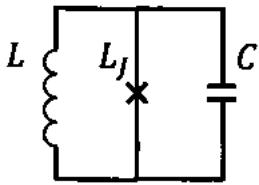  
图 1.4 超导量子比特的一般等效电路模型。

部电路控制，而约瑟夫森结上的相位也可以受外磁场调控。这个电路的拉式量可以写成

$$
\mathcal { L } = \mathcal { E } _ { \mathrm { k i n } } - \mathcal { E } _ { \mathrm { p o t } } = \mathcal { E } _ { \mathrm { c a p } } - \mathcal { E } _ { \mathrm { i n d } } - \mathcal { E } _ { \mathrm { J J } } ,\tag{1.32}
$$

等式的最后三项分别代表电容、电感和约瑟夫森结上存储的能量。对于电容器件，由于 $\begin{array} { r } { \dot { \phi } \left( t \right) = V ( t ) = \frac { Q ( t ) } { C } , I ( t ) = \dot { Q } \left( t \right) = C \ddot { \phi } \left( t \right) } \end{array}$ ，所以电容上存储的能量可以写成

$$
\mathcal E _ { \mathrm { c a p } } = \int _ { - \infty } ^ { t } V ( t ) I ( t ) d t = \frac 1 2 C \dot { \Phi } ^ { 2 } \left( t \right) .\tag{1.33}
$$

类似的，对于电感器件，由于 $\begin{array} { r } { \bar { I } ( t ) = \dot { Q } ( t ) = \frac { \Phi ( t ) } { L } } \end{array}$ ，电感上存储的能量为

$$
\mathcal { E } _ { \mathrm { i n d } } = \frac { 1 } { 2 L } \bar { \mathcal { P } } ^ { 2 } \left( t \right) = \frac { E _ { L } } { 2 } \varphi ^ { 2 } \left( t \right) .\tag{1.34}
$$

注意上式最后一个等式中利用了相位的规范不变性约束了相位和磁通之间的对应关系 ${ \varphi = \Phi / \bar { \phi } _ { 0 } }$ ，其中 $E _ { L } = \tilde { \Phi } _ { \bar { 0 } } ^ { 2 } / \bar { L }$ 。对于约瑟夫森结，其上存储的能量为

$$
\mathcal { E } _ { \mathrm { { J J } } } = \int _ { - \infty } ^ { t } V ( t ) I ( t ) d t = E _ { J } \left( 1 - \cos \varphi \right) .\tag{1.35}
$$

其中 ${ \cal E } _ { J } = { \cal I } _ { c } \Phi _ { 0 } = \Phi _ { 0 } ^ { 2 } / { \cal L } _ { J }$ ，称为约瑟夫森能量（Josephson energy）。于是公式(1.32) 可以写成

$$
\mathcal { L } = \frac { 1 } { 2 } C \dot { \phi } ^ { 2 } - \frac { 1 } { 2 L } \phi ^ { 2 } - E _ { J } \left[ 1 - \cos \left( \frac { \phi } { \phi _ { 0 } } \right) \right] .\tag{1.36}
$$

根据勒让德变换定义与磁通对应的正则变量，

$$
Q = { \frac { \partial { \mathcal { L } } } { \partial \phi } } = C \dot { \Phi } ,\tag{1.37}
$$

这个正则变量对应着电容极板上的电荷。于是，整个电路的哈密顿量可以写成

$$
\begin{array} { l } { \displaystyle \mathcal { H } = \phi Q - \mathcal { L } } \\ { \displaystyle \quad = \frac { Q ^ { 2 } } { 2 C } + \frac { 1 } { 2 L } \Phi ^ { 2 } - E _ { J } \cos \left( \frac { \varPhi } { \varPhi _ { 0 } } \right) } \\ { \displaystyle \quad = 4 E _ { c } n ^ { 2 } + \frac { E _ { L } } { 2 } \varphi ^ { 2 } - E _ { J } \cos \varphi . } \end{array}\tag{1.38}
$$

最后一个等式中定义了电容的充电能 $E _ { c } = e ^ { 2 } \hbar C$ 以及库珀对数目 $\pmb { n } = \pmb { Q } / 2 \pmb { e }$ 0

为了使用量子力学语言描述这个体系，需要将 $\Phi , Q , \mathcal { H }$ 等变量转换成算符的形式， $\pmb { \phi }$ 对应着动量坐标空间的坐标， $\pmb { Q }$ 对应着动量，他们的算符满足对易关系$[ \hat { \pmb { \phi } } , \hat { Q } ] = i \hbar$ 。类似的，如果定义 $\hat { n } = \hat { Q } / 2 e ,$ 表示库珀对的数目算符，和 $\hat { \pmb { \varphi } }$ 也是一组共轭算符，且满足对易关系 $[ \hat { \varphi } , \hat { n } ] = i ,$ 于是公式（1.38）量子化后的形式为

$$
\begin{array} { c } { { \hat { \mathcal { H } } = \displaystyle \frac { \hat { Q } ^ { 2 } } { 2 C } + \frac { 1 } { 2 L } \hat { \phi } ^ { 2 } - E _ { J } \cos \left( \frac { \hat { \phi } } { \phi _ { 0 } } \right) } } \\ { { = \displaystyle 4 E _ { c } \hat { n } ^ { 2 } + \frac { E _ { L } } { 2 } \hat { \varphi } ^ { 2 } - E _ { J } \cos \hat { \varphi } . } } \end{array}\tag{1.39}
$$

在实际应用中，根据电路参数选择的不同，可以定义出不同种类的量子比特，其性质也各有不同。根据量子态编码的性质，可以将超导量子比特大致分为三大类，分别是相位量子比特（phase qubit），磁通量子比特（flux qubit）和电荷量子比特（charge qubit）。

相位量子比特是从1985年Martinis等人[44-46]首次观测到宏观量子隧穿效应的一种电流偏置的约瑟夫森结器件上发展而来。相位比特电路中电容非常大，达到pF量级， $E _ { C } \ll E _ { J }$ ，而电感用恒流源 ${ \pmb J } _ { b }$ 替代（相当于图1.4示电路中 $\pmb { L } $ $\infty , E _ { L }  0 )$ ，它的哈密顿量形式为

$$
\hat { \mathcal { H } } = 4 E _ { C } \hat { n } ^ { 2 } + \mathcal { P } _ { 0 } I _ { b } \hat { \varphi } - E _ { J } \cos \hat { \varphi } .\tag{1.40}
$$

其势能的数学形式是-个“搓衣板”函数， $\pmb { I _ { b } }$ 决定了势能的倾斜程度，也决定了每个势阱中分立能级的数量，一般控制偏置电流使势阱中的能级数 ${ \sim } 3$ ，其中最低两个能级用来定义比特。这种比特最大的优点是读取信噪比非常高，可以通过调节偏置电流（可以是交变的)，使势阱中的激发态和基态隧穿概率具有显著对比度，从而使激发态隧穿后造成结两端呈现可以探测的电压或者改变回路的电流，不过这种探测方式对量子态是破坏性质的，而且同时导致它的相干时间较差，因此日前几乎没有人再继续研究相位量子比特。

第二种类型是磁通量子比特，Orlando等人1999年在RF-SQUID（单个约瑟夫森结和几何电感构成的回路）中观测到宏观磁通态的量子相干现象[47-48]，于是将这个电路构建的量子比特称之为磁通量子比特，它的哈密顿量一般形式为

$$
\hat { \mathcal { H } } = \frac { \hat { Q } ^ { 2 } } { 2 C } + \frac { E _ { L } } { 2 } \left( \frac { \hat { \Phi } } { \Phi _ { 0 } } \right) ^ { 2 } - E _ { J } \cos \left( \frac { \hat { \Phi } - \Phi _ { e } } { \Phi _ { 0 } } \right) .\tag{1.41}
$$

一般 $E _ { f } \gg E _ { C } , E _ { I . } \leqslant E _ { f }$ ，对于大部分的偏置磁通 $\Phi _ { e }$ ，哈密顿量的基态近似等于回路电流和电感能量的本征态，只有当 $\Phi _ { e } \mathrm { m o d } \varPhi _ { 0 } = \varPhi _ { 0 } / 2$ 时，两个最低本征态发生简并，这种简并由于库伦相互作用而解除。系统的基态-激发态跃迁频率主要受外磁通调控，因此对磁通噪声较为敏感。将RF-SQUID电路中的几何电感用两个较大的约瑟夫森结替代就构成一个 Three-junction flux qubit[49]，减小 $E _ { L } / E _ { J }$ 的比值，从而降低对磁通噪声的敏感度；或者替换成由一长串串联的约瑟夫结阵列构成的超级电感构成Fluxonium[50]，进一步抑制对磁通噪声的敏感度。在以上结构基础上，都可以通过并联一个大电容构成 C-shunt flux qubit[51-53]，进一步降低电路对电荷噪声的敏感度。目前flux qubit的变种比较多，学界的研究热情也相对比较高。

最后一种类型是电荷量子比特。它最简单的结构是库珀对盒(CPB:Cooper-pair box)[54-56]，也即一个较小的约瑟夫森结通过一个大电容连接到电压源上，电容极板上的偏置电荷n。可以通过调节电压源来控制。在这个结构中，不考虑电 $n _ { g }$ 感效应， ${ \pmb E } _ { { \pmb L } } = { \pmb 0 }$ ，而且在早期的结构中，一般有 $E _ { J } \ll E _ { C }$ 。系统的哈密顿量可以写成

$$
\begin{array} { r } { \hat { \mathcal { H } } = 4 E _ { C } \left( \hat { n } - n _ { g } \right) ^ { 2 } - E _ { J } \cos \hat { \varphi } . } \end{array}\tag{1.42}
$$

在大部分偏置电荷范围下，由于系统哈密顿量由库伦充电能主导，系统的能量本征态近似等于电荷算符n的本征态n)，只有当 $n _ { g } \operatorname { m o d } 1 = 1 / 2$ 时，|n)与 $| n + 1 \rangle$ 将发生简并，此时 $\scriptstyle { \pmb { E } } _ { J }$ 项的存在将会使简并解除，类似于自旋在磁场中的塞曼劈裂。具体地，由于 $\hat { n } , \hat { \varphi }$ 的对易关系， $\begin{array} { r } { \hat { \varphi } = i \frac { \partial } { \partial \hat { m } } , e ^ { - i \hat { \varphi } } \left| n \right. = \left| n + 1 \right. } \end{array}$ ，可以得到

$$
\cos \hat { \varphi } = \frac { 1 } { 2 } \left( e ^ { i \hat { \varphi } } + e ^ { - i \hat { \varphi } } \right) = \frac { 1 } { 2 } \sum _ { n } \left( \left| n \right. \left. n + 1 \right| + \left| n + 1 \right. \left. n \right| \right) ,\tag{1.43}
$$

因此哈密顿量在{n)}基矢下可以展开写成

$$
\hat { \mathcal { H } } = \sum _ { n } \left[ 4 E _ { C } \left( n - n _ { g } \right) ^ { 2 } \left| n \right. \left. n \right| - \frac { E _ { J } } { 2 } \left( \left| n \right. \left. n + 1 \right| + \left| n + 1 \right. \left. n \right| \right) \right] .\tag{1.44}
$$

用Mathieu函数方法或者使用数值求解的方法可以得到系统的本征能量谱[57]，如图1.5所示。可以发现，如果用最低两个能级来编码量子比特，当 $E _ { J } / E _ { C }$ 较小时，比特的跃迁频率将会对偏置电荷n。非常敏感，也即电荷噪声将成为主要噪 $n _ { g }$ 声来源。

另一种改进型电荷量子比特transmon[57]的提出就是为了抑制电荷量子比特的电荷噪声。Transmon在原来的电路基础上通过并联一个大电容，将 $E _ { J } / E _ { C }$ 值增大，使得能级随n。变化趋于平缓，不过，此时系统的非谐也越来越小。由 $n _ { g }$ 于电荷噪声敏感度随着 $E _ { J } / E _ { C }$ 的增大指数下降，而非谐只是多项式地减小，因此当 $E _ { J } / E _ { C } \approx 5 0 \sim 1 0 0$ 时，量子比特的相干时间可以达到几十微秒，而非谐又能保持在足够定义一个良好的二能级系统的范围内。本人博士期间的主要工作便是在 transmon 上展开。

一般情况下，为了写出 transmon 本征值的近似解，考虑 transmon 电路中的

(d)

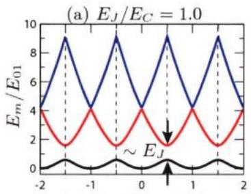  
(c)

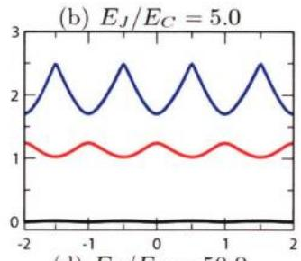

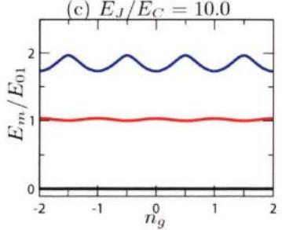

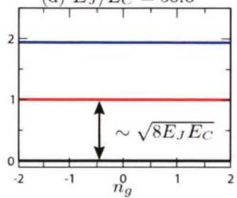  
图1.5不同参数条件下的电荷量子比特的本征能级图，图片引自文献[57]。

约瑟夫森结两端的相位是一个小量(无外加激励电流)，将 $\cos { \hat { \varphi } }$ 展开到四阶，

$$
\cos { \hat { \varphi } } \approx 1 - \frac { \hat { \varphi } ^ { 2 } } { 2 } + \frac { \hat { \varphi } ^ { 4 } } { 2 4 } ,\tag{1.45}
$$

同时，定义 $\hat { a } , \hat { a } ^ { \dag }$ ，使其满足

$$
\hat { \varphi } = \sqrt { \frac { 4 E _ { C } } { \hbar \omega _ { p } } } \left( \hat { a } + \hat { a } ^ { \dagger } \right) , \quad \hat { n } = \frac { i } { 4 } \sqrt { \frac { \hbar \omega _ { p } } { E _ { C } } } \left( \hat { a } ^ { \dagger } - \hat { a } \right) .\tag{1.46}
$$

其中 $\hbar \omega _ { p } = \sqrt { 8 E _ { J } E _ { C ^ { \circ } } } \hat { a } , \hat { a } ^ { \dagger }$ 满足对易关系 $\left[ \hat { a } , \hat { a } ^ { \dagger } \right] = 1$ ，对应玻色子的产生和湮灭算符。

于是transmon哈密顿量可以写成更一般的形式

$$
\begin{array} { r } { \hat { \mathcal { H } } = \hbar \omega _ { p } \left( \hat { a } ^ { \dagger } \hat { a } + \frac { 1 } { 2 } \right) - \frac { E _ { C } } { 1 2 } \left( \hat { a } ^ { \dagger } + \hat { a } \right) ^ { 4 } } \\ { \approx \left( \hbar \omega _ { p } - E _ { C } \right) \hat { a } ^ { \dagger } \hat { a } - \frac { E _ { C } } { 2 } \hat { a } ^ { \dagger } \hat { a } ^ { \dagger } \hat { a } \hat { a } . } \end{array}\tag{1.47}
$$

上式在第二行里使用了旋波近似只保留了光子数守恒项，同时去掉了常数项，最后得到的是一个简单的对角矩阵，其本征值 $E _ { n } = n \left( \hbar \omega _ { p } - E _ { C } \right) - E _ { C } n \left( n - 1 \right) / 2$ 能级差 $E _ { n , m } = E _ { n } - E _ { m }$ ，定义最低两个能级的跃迁频率 $\omega _ { 1 0 } = E _ { 1 , 0 } / \hbar = \omega _ { p } - E _ { C } / \hbar$ 定义非谐 $\hbar \alpha = E _ { 2 , 1 } - E _ { 1 , 0 } = - E _ { C }$ ，因此公式（1.47）又可以写成

$$
\hat { \mathcal { H } } = \hbar \omega _ { 1 0 } \hat { a } ^ { \dagger } \hat { a } + \hbar \frac { \alpha } { 2 } \hat { a } ^ { \dagger } \hat { a } ^ { \dagger } \hat { a } \hat { a } .\tag{1.48}
$$

此外公式（1.42）中的 $\scriptstyle { \pmb { E } } _ { J }$ 项也可以设计成可以被外磁通调节，从而使得量子比特的跃迁频率可以被外磁通调节，方法就是将单个约瑟夫森结替换成一个SQUID。根据公式（1.31）以及约瑟夫森能的定义式，替换后的 $\scriptstyle { \pmb { E } } _ { J }$ 可以表示为

$$
E _ { J } \left( \phi _ { e } \right) = 2 E _ { J 1 } \left| \cos \left( \frac { \varPhi _ { e } } { 2 \varPhi _ { 0 } } \right) \right| ,\tag{1.49}
$$

如果构成SQUID的两个约瑟夫森结存在非对称性，上式可以修正为

$$
E _ { J } \left( \phi _ { e } \right) = E _ { J \bar { \cal Z } } \left| \cos \left( \frac { \phi _ { e } } { 2 \bar { \phi } _ { 0 } } \right) \right| \sqrt { 1 + d ^ { 2 } \tan ^ { 2 } \left( \frac { \phi _ { e } } { 2 \bar { \phi } _ { 0 } } \right) } .\tag{1.50}
$$

其中 $E _ { J \Sigma } = E _ { J 1 } + E _ { J 2 } , d = \left( E _ { J 1 } - E _ { J 2 } \right) / E _ { J \Sigma } $ 表示非对称性大小， $\pmb { { \cal E } } _ { J 1 }$ 和 $\pmb { E } _ { J 2 }$ 分别表示两个约瑟夫森结的约瑟夫森能。

一般而言，transmon的基态-激发态跃迁频率 $\pmb { \omega } _ { 1 0 } / 2 \pi$ 在 4 GHz\~6 GHz 范围内，而非谐 $| \alpha / 2 \pi |$ 在 200 MHz\~300 MHz，本文将在后面介绍对 transmon 的具体操控方法。

## 1.2.2 单比特门操控

超导量子比特的单比特门一般是通过微波控制实现。以transmon比特为例，考虑如图1.6所示电路，微波驱动电压 $V _ { d } ( t )$ 通过耦合电容 $\mathbb { C } _ { d }$ 作用到量子比特上，依照前文的规则先对该电路进行量子化。

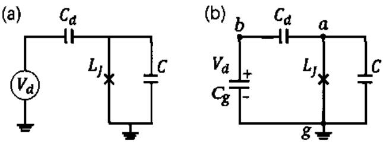  
图 1.6 （a）微波驱动电压 $V _ { d }$ 通过电容 $c _ { d }$ 作用到transmon量子比特的电路示意图。（b)将驱动电压源等效为一个偏置电压为 $\pmb { V _ { d } }$ 的电容，图中标注的 $a , b , g$ 为电路的几个节点。

电路的动能部分为

$$
\begin{array} { r l r } & { } & { { \mathcal { E } } _ { \mathrm { k i n } } = \displaystyle \frac { 1 } { 2 } \left[ \dot { \phi } _ { a } ( \phi _ { b } ) \left[ { C } _ { d } + C _ { \mathrm { ~ } } - { C } _ { d } \right] \left[ \dot { \phi } _ { a } \right] } \\ & { } & { ~ - { C } _ { d } ( { C } _ { d } + C _ { g } \right] \left[ \dot { \phi } _ { b } \right] } \\ & { } & { ~ = \displaystyle \frac { ( C _ { d } + C ) \dot { \phi } _ { a } ^ { 2 } } { 2 } + \frac { ( C _ { g } + C _ { d } \dot { \phi } _ { b } ^ { 2 } } { 2 } - C _ { d } \dot { \phi } _ { a } \dot { \phi } _ { b } . } \end{array}\tag{1.51}
$$

注意 $\phi _ { b } = \int _ { - \infty } ^ { t } V _ { d } \left( t ^ { \prime } \right) d t ^ { \prime }$ ，即 $\dot { \Phi } _ { b } = V _ { d }$ 。于是公式（1.51）可以写成

$$
\mathcal { E } _ { \mathrm { k i n } } = \frac { ( C _ { d } + C ) \dot { \Phi } _ { a } ^ { 2 } } { 2 } - C _ { d } V _ { d } \dot { \Phi } _ { a } .\tag{1.52}
$$

上式已经略去了无关的常数项。而电路的势能部分为约瑟夫森结的势能，由公式(1.35)描述，因此整个电路的拉氏量为

$$
\mathcal { L } = \frac { C _ { \Sigma } \dot { \Phi } _ { a } ^ { 2 } } { 2 } - C _ { d } V _ { d } \dot { \phi } _ { a } + E _ { J } \cos \left( \frac { \Phi _ { a } } { \phi _ { 0 } } \right) .\tag{1.53}
$$

其中 $C _ { \Sigma } = { \cal { C } } + { \cal { C } } _ { d }$

系统的哈密顿量可以写成

$$
\begin{array} { l } { \displaystyle { \mathcal { H } = \frac { \partial \mathcal { L } } { \partial \dot { \phi } _ { a } } \dot { \phi } _ { a } - \mathcal { L } } } \\ { \displaystyle { \quad = \frac { C _ { \Sigma } \dot { \phi } _ { a } ^ { 2 } } { 2 } - E _ { J } \cos \left( \frac { \phi _ { a } } { \phi _ { 0 } } \right) } } \\ { \displaystyle { \quad = \frac { Q _ { a } ^ { 2 } } { 2 C _ { \Sigma } } + \frac { C _ { d } } { C _ { \Sigma } } V _ { d } q _ { a } - E _ { J } \cos \left( \frac { \phi _ { a } } { \phi _ { 0 } } \right) , } } \end{array}\tag{1.54}
$$

其中 $\begin{array} { r } { Q _ { a } = \frac { \partial \mathcal { L } } { \partial \phi _ { a } } = C _ { \Sigma } \dot { \phi } _ { a } - C _ { d } V _ { d } } \end{array}$ ，参照公式（1.45）至公式（1.48）的二次量子化过程，我们得到

$$
\hat { \mathcal { H } } = \hbar \omega _ { 1 0 } \hat { a } ^ { \dagger } \hat { a } + \hbar \frac { \alpha } { 2 } \hat { a } ^ { \dagger } \hat { a } ^ { \dagger } \hat { a } \hat { a } + i V _ { d } \sqrt { \hbar \omega _ { p } C _ { S } } \frac { C _ { d } } { C _ { S } } \left( \hat { a } ^ { \dagger } - \hat { a } \right) .\tag{1.55}
$$

其中 $E _ { C } = e ^ { 2 } / 2 C _ { \itSigma } , \omega _ { p } = \sqrt { 8 E _ { J } E _ { C } } , \hbar \alpha = - E _ { C } , \omega _ { 1 0 } = \omega _ { p } + \alpha .$ ，与公式（1.48）相比，上式中多了一项非对角项，意味着通过电容耦合的电压驱动可以控制量子比特的跃迁激发。另外， $\pmb { C _ { d } }$ 的引入，增加了原本孤立的量子比特的自电容，引起非谐和跃迁频率的修正，不过一般由于 $c \gg c _ { d }$ ，这项修正是可以忽略的。

为了进一步解释单比特逻辑门是如何实现的，将公式（1.55）重新写成二能级形式，

$$
\hat { \pmb { \mathscr { H } } } = \hat { \pmb { \mathscr { H } } } _ { 0 } + \hat { \pmb { \mathscr { H } } } _ { d } = - \hbar \omega _ { 1 0 } \frac { \hat { \pmb { \sigma } } _ { z } } { 2 } + \hbar g V _ { d } \hat { \pmb { \sigma } } _ { y } .\tag{1.56}
$$

其中 $\hat { \mathcal { H } } _ { 0 }$ 表示二能级本征哈密顿量， $\hat { \mathcal { H } } _ { d }$ 表示驱动哈密顿量， $g = \sqrt { \frac { \omega _ { p } \widetilde { C } _ { \Sigma } } { \hbar } } \frac { C _ { d } } { C _ { \Sigma } }$ ，表示驱动电压与量子比特的耦合强度。

在 $\hat { \mathcal { H } } _ { \mathfrak { d } }$ 定义的旋转表象下， $\hat { R } = e ^ { \mathrm { i } \hat { \mathcal { H } } _ { \mathrm { n } } t / \hbar }$

$$
\begin{array} { r l } & { \hat { \mathcal { H } } _ { \mathrm { r o t } } = i \hbar \dot { \hat { R } } \hat { R } ^ { \dagger } + \hat { R } \hat { \mathcal { H } } \hat { R } ^ { \dagger } } \\ & { \qquad = \hbar g V _ { d } \left( - \sin ( \omega _ { 1 0 } t ) \hat { \sigma } _ { x } + \cos ( \omega _ { 1 0 } t ) \hat { \sigma } _ { y } \right) . } \end{array}\tag{1.57}
$$

将 $V _ { d } ( t ) = Y ( t ) \cos ( \omega _ { d } t ) - X ( t ) \sin ( \omega _ { d } t )$ 带入上式，当驱动频率与量子比特频率共振，即 $\omega _ { d } = \omega _ { 1 0 }$ 时，且忽略掉高频振荡项，公式（1.57）可以简化成

$$
\hat { \mathcal { H } } _ { \mathrm { r o t } } = \frac { \hbar g } { 2 } \left( \hat { \sigma } _ { x } X ( t ) + \hat { \sigma } _ { y } Y ( t ) \right) .\tag{1.58}
$$

对照公式（1.6）和公式（1.9），公式（1.58）表明通过控制驱动电压的两个正交分量，可以实现单比特绕着布洛赫球XY平面任意转轴旋转任意角度。考

虑到绕X、Y、Z轴的转动并不完全是独立的，例如，绕Z轴的转动可以通过绕另两个轴的转动组合实现，

$$
R _ { z } ( \alpha ) = R _ { y } \left( - \frac { \pi } { 2 } \right) R _ { x } \left( \alpha \right) R _ { y } \left( \frac { \pi } { 2 } \right) .\tag{1.59}
$$

所以实际上仅利用微波控制，就可以在对超导量子比特实现任意的单比特门操作。

当然，对于一个频率可调的比特，绕Z轴的旋转可以通过将比特频率调离工作点一段时间积累特定相位之后再调回来而实现；如果比特频率不可调，也可以施加一个较强的非共振微波，在这个非共振的微波作用下，比特频率会产生一个等效的频移从而完成绕Z轴的旋转，不过，需要驱动功率远小于失谐量，否则会引起量子态之间的跃迁[58]。另外，由于Z门的作用可以等效为改变XY平面旋转轴的角度，所以一种简便的的实现Z门的方法是在编译上对应的改变Z门后续的所有单比特门的旋转轴角度，同时对后续两比特门做相应的变换，这种方式实现的 Z门称之为虚拟 Z 门(Vitual Z gate)[59]。由于虚拟Z门是在编译层实现的，所以是一个完全理想的门操作，也即不存在门错误率。如果一个量子线路可以被分解成含有大量的Z门的线路，那么此时虚拟Z门的作用就会非常显著。

## 1.2.3 两比特门操控

本节仍然以transmon比特为例，分析两比特门是如何实现的。当然，首先要实现两比特之间的有效耦合，如图1.7所示，两个超导量子比特之间的相互作用一般可以通过一个耦合电容来实现[60-61]，同样的，依照前文规则先对这个电路进行量子化。

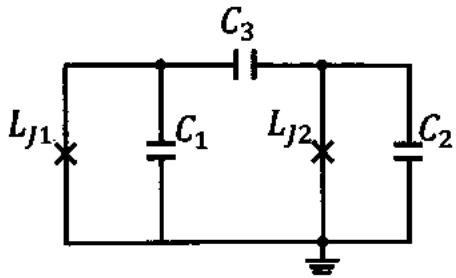  
图 1.7 两个 (ransimon量子比特通过电容耦合的等效电路图。

电路的动能部分为，

$$
\begin{array} { r l r } & { } & { \mathcal { E } _ { \mathrm { k i n } } = \displaystyle \frac { 1 } { 2 } [ \phi _ { 1 } \phi _ { 2 } ] [ C _ { 1 } + C _ { 3 } - C _ { 3 } ] [ \phi _ { 1 } ] } \\ & { } & { - C _ { 3 } \quad C _ { 2 } + C _ { 3 } ] [ \phi _ { 2 } ] } \\ & { } & { = \frac { ( C _ { 1 } + C _ { 3 } ) \dot { \phi } _ { 1 } ^ { 2 } } { 2 } + \frac { ( C _ { 2 } + C _ { 3 } \dot { \phi } _ { 2 } ^ { 2 } } { 2 } - C _ { 3 } \dot { \phi } _ { 1 } \dot { \phi } _ { 2 } . } \end{array}\tag{1.60}
$$

电路的势能部分为约瑟夫森结的势能，由公式（1.35）描述，因此整个电路的拉氏量为

$$
\mathcal { L } = \frac { C _ { 1 } ^ { \prime } \phi _ { 1 } ^ { 2 } } { 2 } + \frac { C _ { 2 } ^ { \prime } \phi _ { 2 } ^ { 2 } } { 2 } - C _ { 3 } \phi _ { 1 } \phi _ { 2 } + E _ { J 1 } \cos \left( \frac { \phi _ { 1 } } { \phi _ { 0 } } \right) + E _ { J 2 } \cos \left( \frac { \phi _ { 2 } } { \phi _ { 0 } } \right) .\tag{1.61}
$$

其中 ${ \pmb { C } } _ { 1 } ^ { \prime } = { \pmb { C } } _ { 1 } + { \pmb { C } } _ { 3 } , { \pmb { C } } _ { 2 } ^ { \prime } = { \pmb { C } } _ { 2 } + { \pmb { C } } _ { 3 }$

由勒让德变换 $\begin{array} { r } { Q _ { n } = \frac { \partial \mathcal { L } } { \partial \dot { \phi } _ { n } } } \end{array}$ 得，

$$
\begin{array} { r } { Q _ { \imath } = C _ { \imath } ^ { \prime } \dot { \pmb { \phi } } _ { \imath } - C _ { 3 } \dot { \pmb { \phi } } _ { \imath } , } \\ { Q _ { \imath } = C _ { 2 } ^ { \prime } \dot { \pmb { \phi } } _ { \imath } - C _ { 3 } \dot { \pmb { \phi } } _ { \imath } . } \end{array}\tag{1.62}
$$

于是系统的哈密顿量可以写成

$$
\begin{array} { l } { \displaystyle { \mathcal { H } = \sum _ { n } Q _ { n } \dot { \Phi } _ { n } - \mathcal { L } } } \\ { \displaystyle { = \frac { C _ { 1 } ^ { \prime } \dot { \Phi } _ { 1 } ^ { 2 } } { 2 } + \frac { C _ { 2 } ^ { \prime } \dot { \Phi } _ { 2 } ^ { 2 } } { 2 } - C _ { 3 } \dot { \Phi } _ { 1 } \dot { \Phi } _ { 2 } - E _ { J 1 } \cos \left( \frac { \Phi _ { 1 } } { \Phi _ { 0 } } \right) - E _ { J 2 } \cos \left( \frac { \Phi _ { 2 } } { \Phi _ { 0 } } \right) , } } \end{array}\tag{1.63}
$$

用 $\scriptstyle Q _ { 1 }$ 1 $\pmb { Q } _ { 2 }$ 代替上式中的 $\dot { \pmb { \phi } } _ { 1 }$ , $\dot { \pmb { \phi } } _ { 2 }$ ，得到

$$
\mathcal { H } = \frac { Q _ { 1 } ^ { 2 } } { 2 C _ { 1 } ^ { \prime \prime } } + \frac { Q _ { 2 } ^ { 2 } } { 2 C _ { 2 } ^ { \prime \prime } } + \frac { Q _ { 1 } Q _ { 1 } } { C _ { C } } - E _ { J 1 } \cos \left( \frac { \Phi _ { 1 } } { \Phi _ { 0 } } \right) - E _ { J 2 } \cos \left( \frac { \Phi _ { 2 } } { \Phi _ { 0 } } \right) ,\tag{1.64}
$$

其中

$$
\begin{array} { l } { \displaystyle C _ { 1 } ^ { \prime \prime } = C _ { 1 } + \frac { C _ { 2 } C _ { 3 } } { C _ { 2 } + C _ { 3 } } , } \\ { \displaystyle C _ { 2 } ^ { \prime \prime } = C _ { 2 } + \frac { C _ { 1 } C _ { 3 } } { C _ { 1 } + C _ { 3 } } , } \\ { \displaystyle C _ { C } = \frac { C _ { 1 } C _ { 2 } + C _ { 1 } C _ { 3 } + C _ { 2 } C _ { 3 } } { C _ { 3 } } . } \end{array}\tag{1.65}
$$

类似的二次量子化过程，

$$
\begin{array} { r l r l } & { \hat { \phi } _ { 1 } = \sqrt { \frac { \hbar { Z } _ { 1 } } { 2 } } \left( \hat { a } _ { 1 } ^ { \dagger } + \hat { a } _ { 1 } \right) , } & { \hat { \phi } _ { 2 } } & { = \sqrt { \frac { \hbar { Z } _ { 2 } } { 2 } } \left( \hat { a } _ { 2 } ^ { \dagger } + \hat { a } _ { 2 } \right) , } \\ & { \hat { Q } _ { 1 } = i \sqrt { \frac { \hbar } { 2 { Z } _ { 1 } } } \left( \hat { a } _ { 1 } ^ { \dagger } - \hat { a } _ { 1 } \right) , } & { \hat { Q } _ { 2 } } & { = i \sqrt { \frac { \hbar } { 2 { Z } _ { 2 } } } \left( \hat { a } _ { 2 } ^ { \dagger } - \hat { a } _ { 2 } \right) . } \end{array}\tag{1.66}
$$

其中 $\begin{array} { r } { Z _ { n } = 1 / \omega _ { p n } C _ { n } ^ { \prime \prime } , \omega _ { p n } = \sqrt { 8 E _ { J n } E _ { C n } } / \hbar , E _ { C n } = e ^ { 2 } / 2 C _ { n } ^ { \prime \prime } } \end{array}$ 。把上式带入到哈密顿量表达式中，化简后得到

$$
\hat { \pmb { H } } = \sum _ { n = 1 , 2 } \hat { \pmb { H } } _ { n } + \hat { \pmb { H } } _ { 1 2 } ,\tag{1.67}
$$

其中 $\begin{array} { r } { \hat { \mathcal { H } } _ { n } = \hbar \omega _ { n } \hat { a } _ { n } ^ { \dagger } \hat { a } _ { n } + \hbar \frac { \alpha _ { n } } { 2 } \hat { a } _ { n } ^ { \dagger } \hat { a } _ { n } ^ { \dagger } \hat { a } _ { n } \hat { a } _ { n } } \end{array}$ 表示单比特哈密顿量， $\omega _ { n } = \omega _ { p n } + \alpha _ { n } , \hbar \alpha _ { n } =$ $- \pmb { { \cal E } } _ { C _ { n } }$ 而 $\hat { \pmb { { \mathcal H } } } _ { 1 2 }$ 则表示两比特之间的相互作用项，

$$
\begin{array} { r l } & { \hat { \mathcal { H } } _ { 1 2 } = - \displaystyle \frac { \hbar } { 2 } \sqrt { \frac { \omega _ { 1 } \omega _ { 2 } } { C _ { 1 } ^ { \prime } C _ { 2 } ^ { \prime } } } C _ { 3 } \left( \hat { a } _ { 1 } ^ { \dagger } - \hat { a } _ { 1 } \right) \left( \hat { a } _ { 2 } ^ { \dagger } - \hat { a } _ { 2 } \right) } \\ & { \quad \quad = - \hbar J \left( \hat { a } _ { 1 } ^ { \dagger } - \hat { a } _ { 1 } \right) \left( \hat { a } _ { 2 } ^ { \dagger } - \hat { a } _ { 2 } \right) } \\ & { \quad \quad = \hbar J \sigma _ { 1 } ^ { y } \sigma _ { 2 } ^ { y } . } \end{array}\tag{1.68}
$$

其中 $\begin{array} { r } { J = \frac { 1 } { 2 } \sqrt { \frac { \omega _ { 1 } \omega _ { 1 } } { C _ { 1 } ^ { \prime } C _ { 3 } ^ { \prime } } } C _ { 3 } } \end{array}$ 表示两比特之间的有效耦合强度，正比于耦合电容 $c _ { 3 }$ ，且与比特自身频率相关。注意由于两比特之间的耦合，计算比特自身频率和非谐时，其等效自电容等于耦合电容与另一个比特自电容的串联再并连上该比特原本的自电容，不过一般由于 ${ \pmb { C } } _ { 3 } \ll { \pmb { C } } _ { 1 } , { \pmb { C } } _ { 2 }$ ，所以有 $C _ { n } ^ { \prime \prime } \approx C _ { n } ^ { \prime } \approx C _ { n }$

除了电容耦合，两比特之间也可以通过电感进行耦合 $. ( 6 2 - 6 4 )$ ，或者通过一个耦合器进行间接耦合[65]，不过一般他们的等效耦合哈密顿量都可以写成公式(1.68)的形式。由于电容、电感等器件一般设计加工好之后参数固定不变，所以造成两个比特之间始终处于耦合状态，这显然不利于我们对单个比特进行控制和测量。实验上一般采取的办法是通过设计近邻耦合的两个比特之间的频率差$\delta = \omega _ { 1 } - \omega _ { 2 }$ ，使其满足 $\delta \gg J$ ，也即使得两个比特处于大失谐状态，有效耦合近似关断，此时可以对单个比特进行独立操控而不再受到与其近邻耦合比特的影响。那么，此时又如何利用上文推导的耦合哈密顿量执行两比特门操作呢？本文按照对量子比特的操控方式，将两比特门的主要实现方式分为以下三种：

第一种方式，调节比特频率使两比特特定能级发生共振。这首先需要比特频率是可调的，也即利用前文提到的SQUID替换原本不可调比特中的单个约瑟夫森结，使得电路的约瑟夫森能（或者临界电流）可以被外磁通调节，参见公式(1.50)。

在相互作用表象下，表象变换算符为 $\hat { R } = \hat { R } _ { 1 } \otimes \hat { R } _ { 2 } = e ^ { i \hat { \mathcal { H } } _ { 1 } t / \hbar } \otimes e ^ { i \hat { \mathcal { H } } _ { 2 } t / \hbar }$ ，则该表象下的哈密顿量为

$$
\hat { \mathcal { H } } _ { \mathrm { r o t } } = \hat { R } \hat { \mathcal { H } } _ { 1 2 } \hat { R } ^ { \dagger } = - \hbar J \left[ \hat { R } _ { 1 } \left( \hat { a } _ { 1 } ^ { \dagger } - \hat { a } _ { 1 } \right) \hat { R } _ { 1 } ^ { \dagger } \right] \bigotimes \left[ \hat { R } _ { 2 } \left( \hat { a } _ { 2 } ^ { \dagger } - \hat { a } _ { 2 } \right) \hat { R } _ { 2 } ^ { \dagger } \right] ,\tag{1.69}
$$

一般情形下，我们最多只考虑到第二激发态，所以，将上式在三能级下展开计算得到

$$
\begin{array} { r } { \hat { R } _ { 1 } \left( \hat { a } _ { 1 } ^ { \dagger } - \hat { a } _ { 1 } \right) \hat { R } _ { 1 } ^ { \dagger } = \left[ \begin{array} { c c c } { 0 } & { - e ^ { - i \omega _ { 1 } t } } & { 0 } \\ { e ^ { i \omega _ { 1 } t } } & { 0 } & { - \sqrt { 2 } e ^ { - i \left( \omega _ { 1 } + \alpha _ { 1 } \right) t } } \\ { 0 } & { \sqrt { 2 } e ^ { i \left( \omega _ { 1 } + \alpha _ { 1 } \right) t } } & { 0 } \end{array} \right] } \\ { = e ^ { i \omega _ { 1 } t } | 1 \rangle _ { 1 } \langle 0 | + \sqrt { 2 } e ^ { i \left( \omega _ { 1 } + \alpha _ { 1 } \right) t } | 2 \rangle _ { 1 } \langle 1 | - \mathrm { h . c . } . } \end{array}\tag{1.70}
$$

类似的， $\hat { R } _ { 2 } \left( \hat { a } _ { 2 } ^ { \dagger } - \hat { a } _ { 2 } \right) \hat { R } _ { 2 } ^ { \dagger } = \left[ e ^ { i \omega _ { 2 } t } | 1 \rangle _ { 2 } \langle 0 | + \sqrt { 2 } e ^ { i ( \omega _ { 2 } + \alpha _ { 2 } ) t } | 2 \rangle _ { 2 } \langle 1 | \right] + \mathbf { h . c . }$ 。将这两项代回到公式（1.69）中，忽略总激发数大于2的项以及快速振荡的反旋波项，得到

$$
\begin{array} { r } { \hat { \mathcal { H } } _ { \mathrm { r o t } } = \hbar J \left\{ e ^ { i \delta t } \left| 1 0 \right. \left. 0 1 \right| + \right. } \\ { \left. \sqrt { 2 } e ^ { i ( \alpha _ { 1 } + \delta ) t } \left| 2 0 \right. \left. 1 1 \right| + \right. } \\ { \left. \sqrt { 2 } e ^ { i ( \alpha _ { 2 } - \delta ) t } \left| 0 2 \right. \left. 1 1 \right| + \mathrm { h . c . } \right\} . } \end{array}\tag{1.71}
$$

所以，当|01)与|10)共振，即 ${ \pmb \delta } \approx { \bf 0 }$ 时，如果同时满足 $J \ll | \alpha _ { 1 } | , | \alpha _ { 2 } |$ ，即11)与[20)、02)大失谐，则公式（1.71）可以简化到单激发子空间，即计算空间

$$
\hat { \mathcal { H } } _ { \mathrm { r o t } } = \hbar J \left( \sigma _ { 1 } ^ { + } \sigma _ { 2 } ^ { - } + \sigma _ { 1 } ^ { - } \sigma _ { 2 } ^ { + } \right) = \hbar \frac { J } { 2 } \left( \sigma _ { 1 } ^ { x } \sigma _ { 2 } ^ { x } + \sigma _ { 1 } ^ { y } \sigma _ { 2 } ^ { y } \right) ,\tag{1.72}
$$

对应的幺正演化算符可以写成

$$
U _ { X Y } \left( t \right) = e ^ { - i \frac { J } { 2 } \left( \sigma _ { 1 } ^ { x } \sigma _ { 2 } ^ { x } + \sigma _ { 1 } ^ { y } \sigma _ { 2 } ^ { y } \right) t } = \left[ \begin{array} { c c c c } { 1 } & { 0 } & { 0 } & { 0 } \\ { 0 } & { \cos \left( J t \right) } & { - i \sin \left( J t \right) } & { 0 } \\ { 0 } & { - i \sin \left( J t \right) } & { \cos \left( J t \right) } & { 0 } \\ { 0 } & { 0 } & { 0 } & { 1 } \end{array} \right] .\tag{1.73}
$$

对比公式（1.14）和公式（1.15），不难发现，当 $\begin{array} { r } { t = \frac { \pi } { 2 J } } \end{array}$ 时， $\begin{array} { r } { U _ { X Y } ( \frac { \varepsilon } { 2 J } ) \equiv i \bf { S } W A P } \end{array}$ 而当t取 $\frac { \pi } { 4 J }$ 时， $\begin{array} { r } { U _ { X Y } ( \frac { \pi } { 4 J } ) \equiv \sqrt { i \bf { S } { \bf { W } } { \bf { A } } { \bf { P } } } ^ { [ 6 6 - 6 7 ] } } \end{array}$

类似的，当 $\delta = - \alpha _ { \parallel }$ (或 $\alpha _ { 2 } )$ ，即(11)与|20)（或|02)）共振，而10)与101)大失谐，则公式（1.71）可以简化到对应的二能级子空间，描述的是该两能级之间的 SWAP相互作用，当 $\begin{array} { r } { t = \frac { \pi } { \sqrt { 2 } J } } \end{array}$ 时，|11)将与|20)（或|02)）完成一个完整的SWAP振荡周期而回到11)，同时积累一个几何相位π，而其他的计算基矢在这个相互作用下保持不变，此时该过程对应的么正演化就是一个CZ门[60,68-69]。

第二种方式与第一种方式类似，也是通过调节比特频率使得两比特特定能级发生共振，实现的也是上述几种相同的门，不过这里使用的是边带共振，这种方式实现的门一般称之为参量共振门。具体而言，通过周期性调制外磁场使得高频比特的频率满足 $\omega _ { 1 } ( t ) = \overline { { \omega } } _ { 1 } + A _ { 1 } \cos \left( 2 \omega _ { p } t + 2 \varphi _ { p } \right)$ ，此时在相互作用表象下，将得到[70-71]

$$
\begin{array} { l } { { \displaystyle \hat { H } _ { \mathrm { f o t } } = - \hbar J \sum _ { n = - \infty } ^ { \infty } J _ { n } \left( \frac { A _ { 1 } } { 2 \omega _ { p } } \right) e ^ { i \left( 2 n \omega _ { p } t + \beta _ { n } \right) } } } \\ { { \displaystyle \qquad \times \left. e ^ { i \overline { { \delta } } t } | 1 0 \right. \left. 0 1 | } } \\ { { \displaystyle \qquad + \sqrt { 2 } e ^ { i ( \alpha _ { 1 } + \overline { { \delta } } ) t } | 2 0 \right. \left. 1 1 | } } \\ { { \displaystyle \qquad + \sqrt { 2 } e ^ { i ( \alpha _ { 2 } - \overline { { \delta } } ) t } | 0 2 \right. \left. 1 1 | + \mathrm { h . c . } \right. , } } \end{array}\tag{1.74}
$$

其中 $J _ { n }$ 表示n阶第一类贝塞尔函数， $\overline { { \delta } } \ = \ \overline { { \omega } } _ { 1 } - \omega _ { 2 }$ 表示平均失谐量， ${ \beta } _ { \eta } ~ =$ $\overline { { \omega } } _ { 1 }$ sin $\left( \varphi _ { p } / \omega _ { p } \right) + \left( 2 \varphi _ { p } + \pi \right) n$ 。注意到上式与公式（1.71）具有完全相同的形式：

主要区别在于有效耦合强度受到贝塞尔函数调制，以及共振条件变为

$$
\begin{array} { r l } { \overline { { \delta } } \pm 2 n \omega _ { p } = 0 , } & { | 1 0   | 0 1  , \quad i \mathbf { S } \mathbf { W } \mathbf { A } \mathbf { P } / \sqrt { i \mathbf { S } \mathbf { W } \mathbf { A } \mathbf { P } } , } \\ { \overline { { \delta } } + \alpha _ { 1 } \pm 2 n \omega _ { p } = 0 , } & { | 1 1   | 2 0  , \quad \mathbf { C } \mathbf { Z } _ { 2 0 } , } \\ { \overline { { \delta } } - \alpha _ { 2 } \pm 2 n \omega _ { p } = 0 , } & { | 1 1   | 0 2  , \quad \mathbf { C } \mathbf { Z } _ { 0 2 } . } \end{array}\tag{1.75}
$$

因此，第二种方式可以实现第一种方式完全相同的两比特逻辑门，此外， $\sqrt { i S W A P }$ 门还多了一个相位控制项 $\beta _ { n }$ ，可以用来控制|01)和|10)子空间中的旋转轴相位，类似于单比特微波操控中利用微波相位控制绕XY平面旋转的旋转轴相位[72]。

第三种方式基于全微波控制，在控制比特上施加一个与目标比特频率共振的微波，实现对目标比特的控制旋转，一般用于不可调比特，也是当前IBM超导量子计算团队所采用的方案。这种交叉共振驱动的方式将会使得两比特相互作用项中产生一个 ${ \pmb { \sigma } } _ { { \pmb { x } } } { \pmb { \sigma } } _ { { \pmb { z } } }$ 项，从而可以用来构建一个CNOT门[73-74]。由于本人博士期间的工作都是在可调比特上展开，没有使用过这种全微波控制的方式进行比特操控，因此这里不再展开过多论述。

## 1.3 超导量子计算的起源与现状

在量子计算概念诞生初期，人们还在探究在宏观系统中是否也能观察到诸如量子隧穿和能级量子化的量子效应。基于超导约瑟夫森结的超导电路就是这种宏观系统的一个很好的例子，在这个体系中第一个实验观测到的量子效应的是Devort等人于1985年观察到的约瑟夫森结的相位自由度的量子隧穿效应[45]，紧接着，他们又成功测量到了该系统的能级量子化[44]。这些实验的发现让人们看到了利用超导量子电路构建量子比特实现量子计算的前景，从而激发了人们对这一领域的研究热情。然而，真正可以称得上对量子比特的相干操控要等到1999年，Nakamura等人在CPB上观测到了两个电荷量子态的拉比振荡[54]。不过这一阶段，实验上的进展主要受限于量子比特的相干时间。直到2004年，电路量子电动力学的提出[75]，使得人们可以更好地设计超导量子系统与环境的耦合相互作用，平衡外部电路对量子系统的操控自由度和它对量子系统相干时间的影响，使得量子比特的相干时间以及操控保真度都得到了极大的提升。此后又经过10几年的发展，超导量子计算领域取得了长足的进展，直到近几年谷歌和中国科学技术的超导量子计算团队先后在几十个transmon量子比特芯片上实现了量子优越性的演示[,13]。

在量子比特数量较少的超导量子芯片上，单比特门的保真度目前普遍可以做到99.9%，来自荷兰代尔夫特的Dicarlo研究组将两比特门的最高保真度做到了99.93%[76]。来自瑞士苏黎世联邦理工学院的 Wallraff组则在读取上实现了48 ns内保真度 98.25%、80 ns 内保真度 99.2%[77]。以平面可调 transmon 量子比特为例， $T _ { 1 }$ 的最高记录来自普林斯顿的Houck研究组以及国内北京量子研究院，他们分别将 $T _ { 1 }$ 做到了0.3 ms 和 0.5 ms 以上[27-28]，而 $\pmb { T _ { 2 } }$ 国际上的较好水平一般在$2 0 \mu \mathbf { s } \sim \left. 0 0 \mu \mathbf { s } ^ { \left[ 7 8 - 8 1 \right] } \right.$ 0

表1.1 悬铃木号和祖冲之号量子芯片主要性能参数。
<table><tr><td>型号</td><td>比特数目</td><td>单比特门错误率  $\%$ </td><td>两比特门错误率  $\%$ </td><td>读取错误率 %</td><td>读取时间</td><td>T1</td></tr><tr><td>悬铃木</td><td>53</td><td>0.15</td><td>0.36</td><td>3.1</td><td>μs 1</td><td>μs 16.05</td></tr><tr><td>祖冲之</td><td>56</td><td>0.14</td><td>0.59</td><td>4.52</td><td></td><td>30.6</td></tr></table>

而在多比特芯片层面，由于两篇量子优越性的工作代表了领域内的最前沿水平，本文将以此为代表做简单总结。如表1.1所示，首先，在量子比特数量方面，谷歌的悬铃木号[11]和中科大的祖冲之号[13]分别使用了53个和56个相同类型的transmon量子比特。在量子逻辑门方面，可以看到无论是单比特门还是两比特门，其错误率也都已经达到了表面编码方案（surface code)[82-83]的容错阈值[84-85]。而量子比特读取方面相对而言仍然是当前超导量子计算的一个主要瓶颈，其错误率仍然大于1%，其中谷歌悬铃木芯片的读取时间为1μs，可以计算出量子比特弛豫贡献的读取错误率超过2%，占总读取错误率一半以上。因此，就超导量子计算而言，如何在多比特层面实现快速的高保真度读取仍然是当前的一个主要研究课题。

## 1.4 论文结构

这篇论文分成以下几个章节：

·第一章简单介绍量子计算的基本概念及其在超导量子体系中的实现原理。简单总结当前超导量子计算的现状，并指出在多比特层面实现快速的高保真度读取仍然是当前的一个主要研究课题。

·第二章将重点介绍超导量子计算中的读取原理以及我基于此首次提出的一套完整的读取参数最优化方案。同时指明Purcell滤波器和量子极限噪声放大器的实现对于快速高保真度读取的重要性。

· 第三章将介绍 Purcell滤波器的设计原理以及我提出的一种新的设计和它的仿真与实验测试结果。

·第四章将介绍基于约瑟夫森结的量子极限参量放大器的设计和测试结果以及我们在这个基础上实现的多比特高保真度读取结果。

·第五章将介绍一种基于浅层神经网络构建的量子态分类器，并将它应用于超导量子比特联合读取中串扰的抑制从而提高多比特联合读取的保真度。

·第六章将对本文做简单总结和展望。

## 参考文献

[1] National Academies of Sciences, Engineering, and Medicine. Quantum Computing: Progress and Prospects[M]. Washington, DC: The National Academies Press, 2019.

[2] BENIOFF P. The computer as a physical system: A microscopic quantum mechanical Hamiltonian model of computers as represented by Turing machines[J]. Journal of statistical physics, 1980, 22(5): 563-591.

[3] BENIOFF P. Quantum mechanical models of Turing machines that dissipate no energy[J]. Physical Review Letters, 1982, 48(23): 1581.

[4] BENIOFF P. Quantum mechanical Hamiltonian models of Turing machines[J]. Journal of Statistical Physics, 1982, 29(3): 515-546.

[5] BENIOFF P. Quantum mechanical Hamiltonian models of discrete processes that erase their own histories: Application to Turing machines[J]. International Journal of Theoretical Physics, 1982, 21(3): 177-201,

[6] ANIRBAN P. Elements of Quantum Computation and Quantum Communication[M]. 1st ed. CRC Press, 2013.

[7] BENNETT C H. Logical reversibility of computation[J]. IBM journal of Research and Development, 1973, 17(6): 525-532.

[8] FEYNMAN R. Simulating physics with computers[J]. International Journal of Theoretical Physics, 1982, 21(6): 467-488.

[9] DEUTSCH D. Quantum theory, the Church - Turing principle and the universal quantum computer[J]. Proceedings of the Royal Society of London. A. Mathematical and Physical Sciences, 1985, 400(1818): 97-117.

[10] SHOR P W. Algorithms for quantum computation: discrete logarithns and factoring[C]// Proceedings 35th annual symposium on foundations of computer science. IEEE, 1994: 124- 134.

[11] ARUTE F, ARYA K, BABBUSH R, et al. Quantum supremacy using a programmable superconducting processor[J]. Nature, 2019, 574(7779): 505-510.

[12] ZHONG H S, WANG H, DENG Y H, et al. Quantum computational advantage using photons [J]. Science, 2020, 370(6523): 1460-1463.

[13] WU Y, BAO W S, CAO S, et al. Strong quantum computational advantage using a superconducting quantum processor[J]. Physical Review Letters, 2021, 127(18): 180501.

[14] BELL J S. On the einstein podolsky rosen paradox[J]. Physics Physique Fizika, 1964, 1(3): 195.

[15]FREEDMAN S J, CLAUSER J F. Experimental test of local hidden-variable theories[J]. Phys-

ical Review Letters, 1972, 28(14): 938.

[16] FRY E S, THOMPSON R C. Experimental test of local hidden-variable theories[J]. Physical Review Letters, 1976, 37(8): 465.

[17] ASPECT A, DALIBARD J, ROGER G. Experimental test of bell's inequalities using timevarying analyzers[J]. Physical Review Letters, 1982, 49(25): 1804.

[18]PAN J W, BOUWMEESTER D, DANIELL M, et al. Experimental test of quantum nonlocality in three-photon greenberger-horne-zeilinger entanglement[J]. Nature, 2000, 403(6769): 515– 519.

[19] DEHLINGER D, MITCHELL M. Entangled photons, nonlocality, and bell inequalities in the undergraduate laboratory[J]. American Journal of Physics, 2002, 70(9): 903-910.

[20] 李承祖，陈平形，梁林梅，等.量子计算机研究：原理和物理实现. 上[M]. 科学出版社，2011.

[21] LANDAUER R, Irreversibility and heat generation in the computing process[J]. IBM jourmnal of research and development, 1961, 5(3): 183-191.

[22]BENNETT C H. Notes on landauer's principle, reversible computation, and maxwell's demon [J]. Studies In History and Philosophy of Science Part B: Studies In History and Philosophy of Modem Physics, 2003, 34(3): 501-510.

[23] LLOYD S. Almost any quantum logic gate is universal[J]. Physical Review Letters, 1995, 75 (2): 346.

[24] DIVINCENZO D P. The physical implementation of quantum computation[J]. Fortschritte der Physik: Progress of Physics, 2000, 48(9-11): 771-783.

[25] NIELSEN M A, CHUANG I L. Quantum Computation and Quantum Information: 10th Anniversary Edition[M]. Cambridge: Cambridge University Press, 2010.

[26] RIGETTI C, GAMBETTA J M, POLETTO S, et al. Superconducting qubit in a waveguide cavity with a coherence time approaching 0.1 ms[J]. Physical Review B, 2012, 86(10): 100506.

[27] PLACE A P, RODGERS L V, MUNDADA P, et al. New material platform for superconducting transmon qubits with coherence times exceeding 0.3 milliseconds[J]. Nature communications, 2021, 12(1): 1-6.

[28] WANG C, LI X, XU H, et al. Towards practical quantum computers: transmon qubit with a lifetime approaching 0.5 milliseconds[J]. npj Quantum Information, 2022, 8(1): 1-6.

[29] RISTÈ D, VAN LEEUWEN J G, KU H S, et al. Initialization by measurement of a superconducting quantum bit circuit[J]. Physical Review Letters, 2012, 109(5): 050507.

[30]RISTÈ D, BULTINK C, LEHNERT K W, et al. Feedback control of a solid-state qubit using high-fidelity projective measurement[J]. Physical Review Letters, 2012, 109(24): 240502.

[31] SALATHÉ Y, KURPIERS P, KARG T, et al. Low-latency digital signal processing for feed-

back and feedforward in quantum computing and communication[J]. Physical Review Applied, 2018, 9(3): 034011.

[32] CAMPAGNE-IBARCQ P, FLURIN E, ROCH N, et al. Persistent control of a superconducting qubit by stroboscopic measurement feedback[J]. Physical Review X, 2013, 3(2): 021008.

[33] CÓRCOLES A D, TAKITA M, INOUE K, et al. Exploiting dynamic quantum circuits in a quantum algorithm with superconducting qubits[J]. Physical Review Letters, 2021, 127(10): 100501.

[34] EGGER D J, WERNINGHAUS M, GANZHORN M, et al. Pulsed reset protocol for fixedfrequency superconducting qubits[J]. Physical Review Applied, 2018, 10(4): 044030.

[35] REED M D, JOHNSON B R, HOUCK A A, et al. Fast reset and suppressing spontaneous emission of a superconducting qubit[J]. Applied Physics Letters, 2010, 96(20): 203110.

[36] MCEWEN M, KAFRI D, CHEN Z, et al. Removing leakage-induced correlated errors in superconducting quantum error correction[J]. Nature communications, 2021, 12(1): 1-7.

[37]MAGNARD P, KURPIERS P, ROYER B, et al. Fast and unconditional all-microwave reset of a superconducting qubit[J]. Physical Review Letters, 2018, 121(6): 060502.

[38] GEORGESCU I. The DiVincenzo criteria 20 years on[J]. Nature Reviews Physics, 2020, 2 (12): 666.

[39] JOSEPHSON B D. Possible new effects in superconductive tunnelling[J]. Physics letters, 1962, 1(7): 251-253.

[40] JOSEPHSON B. Coupled superconductors[J]. Reviews of Modern Physics, 1964, 36(1): 216.

[41] JOSEPHSON B D. Supercurrents through barriers[J]. Advances in Physics, 1965, 14(56): 419-451.

[42] ANDERSON P W, ROWELL J M. Probable observation of the josephson superconducting tunneling effect[J]. Physical Review Letters, 1963, 10(6): 230.

[43]AHARONOV Y, BOHM D. Significance of electromagnetic potentials in the quantum theory [J]. Physical Review, 1959, 115(3): 485.

[44]MARTINIS J M, DEVORET M H, CLARKE J. Energy-level quantization in the zero-voltage state of a current-biased josephson junction[J]. Physical Review Letters, 1985, 55(15): 1543.

[45] DEVORET M H, MARTINIS J M, CLARKE J. Measurements of macroscopic quantum tunneling out of the zero-voltage state of a current-biased josephson junction[J]. Physical Review Letters, 1985, 55(18): 1908.

[46] MARTINIS J M, NAM S, AUMENTADO J, et al. Rabi oscillations in a large josephsonjunction qubit[J]. Physical Review Letters, 2002, 89(11): 117901.

[47] MOOIJ J, ORLANDO T, LEVITOV L, et al. Josephson persistent-current qubit[J]. Science, 1999, 285(5430): 1036-1039.

[48]ORLANDO T, MOO[J J, TIAN L, et al. Superconducting persistent-current qubit[J]. Physical Review B, 1999, 60(22): 15398.

[49] CHIORESCU I, NAKAMURA Y, HARMANS C M, et al. Coherent quantum dynamics of a superconducting flux qubit[J]. Science, 2003, 299(5614): 1869-1871.

[50] MANUCHARYAN V E, KOCH J, GLAZMAN L I, et al. Fluxonium: Single cooper-pair circuit free of charge offsets[J]. Science, 2009, 326(5949): 113-116.

[51] YAN F, GUSTAVSSON S, KAMAL A, et al. The flux qubit revisited to enhance coherence and reproducibility[J]. Nature commnunications, 2016, 7(1): 1-9.

[52] EARNEST N, CHAKRAM S, LU Y, et al. Realization of a λ system with metastable states of a capacitively shunted fluxonium[J]. Physical Review Letters, 2018, 120(15): 150504.

[53] YOU J, HU X, ASHHAB S, et al. Low-decoherence flux qubit[J]. Physical Review B, 2007, 75(14): 140515.

[54] NAKAMURA Y, PASHKIN Y A, TSA1 J S. Rabi oscillations in a josephson-junction charge two-level system[J]. Physical Review Letters, 2001, 87(24): 246601.

[55] TOPPARI J, HANSEN K, KIM N, et al. Characterisation of cooper pair boxes for quantum computing[J]. Physica C: Superconductivity, 2001, 352(1-4): 177-180

[56] BLADH K, DUTY T, GUNNARSSON D, et al. The single cooper-pair box as a charge qubit [J]. New Journal of Physics, 2005, 7(1): 180.

[57] KOCH J, YU T M, GAMBETTA J, et al. Charge-insensitive qubit design derived from the cooper pair box[J]. Physical Review A - Atomic, Molecular, and Optical Physics, 2007, 76 (4): 1-21.

[58]BLAIS A, GAMBETTA J, WALLRAFF A, et al. Quantum-information processing with circuit quantum electrodynamics[J]. Physical Review A, 2007, 75(3): 032329.

[59] MCKAY D C, WOOD C J, SHELDON S, et al. Efficient Z gates for quantum computing[J]. Physical Review A, 2017, 96(2): 022330,

[60] STRAUCH F W, JOHNSON P R, DRAGT A J, et al. Quantum logic gates for coupled superconducting phase qubits[J]. Physical Review Letters, 2003, 91(16): 167005.

[61] MCDERMOTT R, SIMMONDS R, STEFFEN M, et al. Simultaneous state measurement of coupled josephson phase qubits[J]. Science, 2005, 307(5713): 1299-1302.

[62] IZMALKOV A, GRAJCAR M, IL' ICHEV E, et al. Evidence for entangled states of two coupled flux qubits[J]. Physical Review Letters, 2004, 93(3): 037003.

[63] MAJER J, PAAUW F, TER HAAR A, et al. Spectroscopy on two coupled superconducting flux qubits[J]. Physical Review Letters, 2005, 94(9): 090501.

[64] YOU J, NAKAMURA Y, NORI F. Fast two-bit operations in inductively coupled flux qubits [J]. Physical Review B, 2005, 71(2): 024532.

[65]MAJER J, CHOW J, GAMBETTA J, et al. Coupling superconducting qubits via a cavity bus [J]. Nature, 2007, 449(7161): 443-447.

[66] ZHANG J, VALA J, SASTRY S, et al. Geometric theory of nonlocal two-qubit operations[J]. Physical Review A, 2003, 67(4): 042313.

[67]DEWES A, ONG F R, SCHMITT V, et al. Characterization of a two-transmon processor with individual single-shot qubit readout[J]. Physical Review Letters, 2012, 108(5): 057002.

[68]DICARLO L, CHOW J M, GAMBETTA J M, et al. Demonstration of two-qubit algorithms with a superconducting quantum processor[J]. Nature, 2009, 460(7252): 240–244.

[69]BARENDS R, KELLY J, MEGRANT A, et al. Superconducting quantum circuits at the surface code threshold for fault tolerance[J]. Nature, 2014, 508(7497): 500-503.

[70] CALDWELL S A, DIDIER N, RYAN C A, et al. Parametrically activated entangling gates using transmon qubits[J]. Physical Review Applied, 2018, 10(3): 1-7.

[71] REAGOR M, OSBORN C B, TEZAK N, et al. Demonstration of universal parametric entangling gates on a multi-qubit lattice[J]. Science Advances, 2018, 4(2): 1-7.

[72] ABRAMS D M, DIDIER N, JOHNSON B R, et al. Implementation of xy entangling gates with a single calibrated pulse[J]. Nature Electronics, 2020, 3(12): 744-750.

[73] CHOW J M, CóRCOLES A D, GAMBETTA J M, et al. Simple all-microwave entangling gate for fixed-frequency superconducting qubits[J]. Physical Review Letters, 2011, 107(8): 080502.

[74] RIGETTI C, DEVORET M. Fully microwave-tunable universal gates in superconducting qubits with linear couplings and fixed transition frequencies[J]. Physical Review B, 2010, 81 (13): 134507.

[75] BLAIS A, HUANG R S, WALLRAFF A, et al. Cavity quantum electrodynamics for superconducting electrical circuits: An architecture for quantum computation[J]. Physical Review A - Atomic, Molecular, and Optical Physics, 2004, 69(6): 062320-1.

[76]ROL M A, BATTISTEL F, MALINOWSKI F K, et al. Fast, high-fidelity conditional-phase gate exploiting Jeakage interference in weakly anharmonic superconducting qubits[J]. Physicat Review Letters, 2019, 123(12): 1-13.

[77] WALTER T, KURPIERS P, GASPARINETTI S, et al. Realizing rapid, high-fidelity, singleshot dispersive readout of superconducting qubits[J]. Physical Review Applied, 2017, 7(5): 1-11.

[78] BLAIS A, GRIMSMO A L, WALLRAFF A. Circuit quantum electrodynamics[J]. Reviews of Modern Physics, 2021, 93(2): 25005.

[79] KJAERGAARD M, SCHWARTZ M E, BRAUMÜLLER J, et al. Superconducting qubits: Curent state of play[J]. Annual Review of Condensed Matter Physics, 2020, 11: 369-395.

[80] KWON S, TOMONAGA A, Lakshmi Bhai G, et al. Gate-based superconducting quantum computing[J]. Journal of Applied Physics, 2021, 129(4): 041102.

[81] KOSEN S, L1 H X, ROMMEL M, et al. Building blocks of a flip-chip integrated superconducting quantum processor[A]. 2021. arXiv: 2112.02717.

[82] BRAVYI S B, KITAEV A Y. Quantum codes on a lattice with boundary[A]. 1998. arXiv: quant-ph/9811052.

[83] DENNIS E, KITAEV A, LANDAHL A, et al. Topological quantum memory[J]. Journal of Mathematical Physics, 2002, 43(9): 4452-4505.

[84] WANG C, HARRINGTON J, PRESKILL J. Confinement-Higgs transition in a disordered gauge theory and the accuracy threshold for quantum memory[J]. Annals of Physics, 2003, 303(1): 31-58.

[85] RAUSSENDORF R, HARRINGTON J. Fault-tolerant quantum computation with high threshold in two dimensions[J]. Physical Review Letters, 2007, 98(19): 190504.

## 第2章 超导量子比特读取参数最优化设计

在电路量子电动力学发展起来之前，对超导量子比特的读取主要是通过在比特附近制备一个单电子晶体管（SET:single-electron transistor)[1]或者 DC-SQUID[2]来探测。这两种读取方式的主要问题是由于读取电路与量子比特本身的强耦合，导致比特的相干时间较差，另外读取的反作用影响也很严重，很难做到非破坏性测量[3-6]。2004年，Blais等人提出电路量子电动力学（Circuit-QED）的概念[7-8]，即借鉴传统的腔量子电动力学（Cavity-QED）方法[9-12]，将量子比特与超导谐振腔耦合起来，从而实现对量子比特的非破坏性测量。同时在这样一种结构中，谐振腔还能有效的保护量子比特与外界环境的自由耦合，从而提升量子比特自身的相干时间[7]。本章将主要介绍电路量子电动力学的基本概念以及对超导量子比特色散读取的原理和方法，最后介绍本人提出的超导量子比特读取参数最优化设计方案。

## 2.1 电路量子电动力学

在量子光学中，人们将一个或多个原子放到一个光学腔中，从而研究光与物质的相互作用，这一研究领域被称为腔量子电动力学[13-14]。类似的，超导量子比特可以被视为一个人工制造的原子，而图2.1（a）和（b）所示的由超导电路构建的2维或者3维谐振腔[15-17]可以在微波频段充当光学腔的角色，二者的耦合相互作用便是电路量子电动力学要研究的内容。显然，电路量子电动力学结合了原子物理、量子光学以及宏观超导量子电路[18]的基本理论和实验方法，不仅可以让人们探索全新的光与物质相互作用的参数领域，更重要的是它可以使人们用工程化的技术手段和方法去设计和制造具有不同功能的量子器件[19]。

(a)  
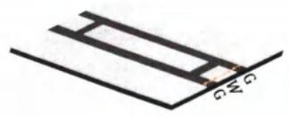

(b)  
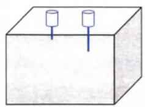

(c)  
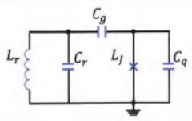  
图2.1(a)平面共面波导谐振腔结构示意图。灰色为绝缘衬底，浅色为超导金属。中央导带线线宽为W，距离两边的地平面的距离为G。（b）3D谐振腔示意图，微波信号通过一个端口耦合到谐振腔内部，通过另一个端口可以探测到谐振腔内部的光场信号。（c）谐振腔与超导量子比特通过电容耦合的等效电路图。

## 2.1.1 Transmon 与谐振腔的耦合

由于transmon比特需要一个较大的电容，因此这种结构天然适合用来和谐振腔进行电容耦合，如图2.1（c）所示，将 transmon 电路中的偏置电压源 $\nu _ { g }$ 用一个LC谐振腔来替代，此时原本的偏置电荷n。将由谐振腔的电荷自由度 $n _ { g }$ $n _ { r }$ 替代，表示由于谐振腔电场引起的有效偏置电荷，这样便得到了transmon和谐振腔的耦合体系，这个耦合体系的哈密顿量可以写成[19-20]

$$
\hat { \mathcal { H } } = 4 E _ { C } \left( \hat { n } + \hat { n } _ { r } \right) - E _ { J } \cos \hat { \varphi } + \sum _ { m } \hat { n } \omega _ { m } \hat { a } _ { m } ^ { \dagger } \hat { a } _ { m } ,\tag{2.1}
$$

其中 $\begin{array} { r } { \hat { n } _ { r } = \sum _ { m } \hat { n } _ { m } , \hat { n } _ { m } = \left( C _ { g } / C _ { m } \right) \hat { Q } _ { m } / 2 e } \end{array}$ 表示由于谐振器的第m阶模式引起的偏置电荷， $c _ { g }$ 代表耦合电容。

考虑如果 transmon的频率 ω。和谐振腔的一个模式（例如基模）频率接近， ${ \pmb { \omega } } _ { \pmb { q } }$ 而离其他模式都比较远，也即当 $m > 1 , \left| \omega _ { 0 } - \omega _ { q } \right| \ll \left| \omega _ { m } - \omega _ { q } \right|$ ，此时可以忽略transmon和其他模式的耦合，整体系统的哈密顿量就可以用一个 transmon和一个LC 谐振子的耦合体系来表示，这便是所谓的单模近似。回顾1.2.3 中两个transmon电容耦合的哈密顿量，只需要把其中一个比特的约瑟夫森结替换成线性电感，就可以得到 transmon 与 LC 谐振子耦合的哈密顿量

$$
\hat { \mathcal { H } } = \hbar \omega _ { r } \hat { a } ^ { \dagger } \hat { a } + \hbar \omega _ { q } \hat { b } ^ { \dagger } \hat { b } + \hbar \frac { \alpha } { 2 } \hat { b } ^ { \dagger } \hat { b } ^ { \dagger } \hat { b } \hat { b } - \hbar g \left( \hat { b } ^ { \dagger } - \hat { b } \right) \left( \hat { a } ^ { \dagger } - \hat { a } \right) ,\tag{2.2}
$$

其中 $\omega _ { r } = 1 / \sqrt { L _ { r } C _ { r } }$ 表示谐振子的频率，式中的耦合强度 $\pmb { \xi }$ 可以重新表示为[19-20]

$$
g = \omega _ { r } \frac { C _ { g } } { C _ { q } } \left( \frac { E _ { J } } { 2 E _ { C } } \right) ^ { 1 / 4 } \sqrt { \frac { \pi Z _ { r } } { R _ { K } } } ,\tag{2.3}
$$

其中 $z _ { r }$ 表示 LC 电路的特征阻抗，而 $R _ { K } = \hbar / e ^ { 2 } \approx 2 5 . 8 { \bf k } \Omega$ 表示的是电阻量子(类比磁通量子的定义)。从中可以看出，耦合强度正比于耦合电容，增大 $\pmb { { \cal E } } _ { J } / \pmb { { \cal E } } _ { C }$ 或者谐振腔的特征阻抗也可以起到增强耦合的作用。

在一般实验条件下，Igl $\ll \omega _ { r } , \omega _ { q }$ ，因此可以使用旋波近似对哈密顿量进一步简化得到

$$
\hat { \mathcal { H } } = \hbar \omega _ { r } \hat { a } ^ { \dagger } \hat { a } + \hbar \omega _ { q } \hat { b } ^ { \dagger } \hat { b } + \hbar \frac { \alpha } { 2 } \hat { b } ^ { \dagger } \hat { b } ^ { \dagger } \hat { b } \hat { b } + \hbar g \left( \hat { b } ^ { \dagger } \hat { a } + \hat { b } \hat { a } ^ { \dagger } \right) ,\tag{2.4}
$$

上式表示的是量子比特与谐振腔之间的交换相互作用。为了进一步说明和腔量子电动力学的相似性，可以继续把上式中的原子部分限制到二能级体系，即 $\hat { \pmb { b } } ^ { \dagger } $ $\hat { \sigma } _ { \phi } , \hat { b }  \hat { \sigma } _ { - }$ ，于是便得到了著名的Jaynes-Cummings 哈密顿量[7,13-14]

$$
\hat { \mathcal { H } } _ { J C } = \hbar \omega _ { r } \hat { a } ^ { \dagger } \hat { a } + \frac { \hbar \omega _ { q } } { 2 } \hat { \sigma } _ { z } + \hbar g \left( \hat { \sigma } _ { + } \hat { a } + \hat { \sigma } _ { - } \hat { a } ^ { \dagger } \right) .\tag{2.5}
$$

注意，为了保持和文献中的习惯一致，这里定义 $\hat { \sigma } _ { z } = \left| 1 \right. \left. 1 \right| - \left| 0 \right. \left. 0 \right|$

由于Jaynes-Cummings哈密顿量模型（简称 JC模型）可以严格写出解析解，所以在腔量子电动力学中已经研究得比较清楚。而在电路量子电动力学中，当只考虑transmon最低两个能级时，JC模型能够定量的解释许多实验现象，当然，也有一些现象是二能级JC模型所解释不了的。尽管如此，JC模型的解析解仍然具有重要的参考和启发意义。

Jaynes-Cummings哈密顿量可以被如下幺正变化算符完全对角化[21-22]

$$
\hat { R } = \exp \left[ A \left( \hat { N } _ { T } \right) \left( \hat { a } ^ { \dagger } \hat { \sigma } _ { - } - \hat { a } \hat { \sigma } _ { + } \right) \right] ,\tag{2.6}
$$

其中 $A \left( \hat { N } _ { T } \right) = \arctan \left( 2 \lambda \sqrt { \hat { N } _ { T } } \right) / 2 \sqrt { \hat { N } _ { T } } , \hat { N } _ { T } = \hat { a } ^ { \dag } \hat { a } + \hat { \sigma } _ { + } \hat { \sigma } _ { - }$ 表示总激发数算符，$\lambda = g / \Delta , \Delta = \omega _ { q } - \omega _ { r }$ 表示量子比特与谐振腔之间的失谐量。对角化之后的哈密顿量形式为

$$
\hat { \mathcal { H } } _ { D } = \hat { R } ^ { \dagger } \hat { \mathcal { H } } _ { J C } \hat { R } = \hbar \omega _ { r } \hat { a } ^ { \dagger } \hat { a } + \frac { \hbar \omega _ { q } } { 2 } \hat { \sigma } _ { z } - \frac { \hbar A } { 2 } \left( 1 - \sqrt { 1 + 4 \lambda ^ { 2 } \hat { N } _ { T } } \right) \hat { \sigma } _ { z } .\tag{2.7}
$$

可以约定当光场和原子耦合强度为零时，系统的本征态称为裸态，用直积态表示，记为 $\{ n , k \}$ ，其中 $\pmb { n = 0 , 1 , 2 , \cdots }$ 表示光场中的光子数， ${ \pmb k } = { \pmb g } , { \pmb e }$ 表示原子的基态和激发态。当光场和原子存在耦合时，将系统的本征态称为缀饰态，记为$| n , k \rangle$ 。根据公式（2.7）对角化后的哈密顿量，可以很容易写出各个缀饰态对应的本征能量，对于特定的总激发数 $\pmb { n } > 0$ ，系统存在两个对应的本征态，分别是$| n , g \rangle$ 和 $| n - 1 , e \rangle$ ，称之为双重态，它们对应的能量为

(a)  
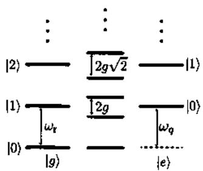

(b)  
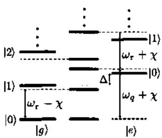  
图2.2 （a）JC 模型共振条件下的能级示意图。（b）JC 模型色散耦合条件下的能级示意图。黑线表示系统无耦合时的本征能级，蓝线表示系统耦合之后缀饰态本征能级。图片引自文献]。

$$
\begin{array} { r } { E _ { \overline { { | n , g \rangle } } } = \hbar n \omega _ { r } - \frac { \hbar } { 2 } \sqrt { \pmb { \varDelta } ^ { 2 } + 4 g ^ { 2 } n } , } \\ { E _ { \overline { { | n - 1 , e \rangle } } } = \hbar n \omega _ { r } + \frac { \hbar } { 2 } \sqrt { \pmb { \varDelta } ^ { 2 } + 4 g ^ { 2 } n } . } \end{array}\tag{2.8}
$$

两个缀饰态又可以用裸态表示为

$$
\frac { \widehat { \left| n , g \right. } = \cos \left( \theta _ { n } / 2 \right) \left| n , g \right. - \sin \left( \theta _ { n } / 2 \right) \left| n - 1 , e \right. , } { \left| n - 1 , e \right. } = \sin \left( \theta _ { n } / 2 \right) \left| n , g \right. + \cos \left( \theta _ { n } / 2 \right) \left| n - 1 , e \right. .\tag{2.9}
$$

其中 $\theta _ { n } = \arctan ( 2 g \sqrt { n } / \varDelta )$ 。而系统的基态仍然是真空态，即 $\overline { { { | 0 , g \rangle } } } = | 0 , g \rangle$ ，对应的能量 $E _ { \overline { { | 0 , g \rangle } } } = E _ { | 0 , g \rangle } = - \hbar \omega _ { q } / 2$ ，图2.2（a）画出了系统共振时的本征能谱。

## 2.1.2 色散耦合区域

当比特与腔之间的失谐远远大于耦合强度，即 $\lambda \ll 1$ ，将这个耦合区间称之为色散耦合区域（dispersive regime）。对公式（2.8）进行展开，就可以得到色散区域的能谱图，见图2.2（b)。对应单光子子空间的本征态为

$$
\begin{array} { l } { \overline { { | 1 , g \rangle } } \simeq | 1 , g \rangle - \lambda | 0 , e \rangle , } \\ { \overline { { | 0 , e \rangle } } \simeq - \lambda | 1 , g \rangle + | 0 , e \rangle . } \end{array}\tag{2.10}
$$

由于 $\lambda \ll 1$ ，因此可以认为比特与谐振腔处于一种微弱的纠缠状态，他们之间的相互作用通过虚光子来交换能量。相反，当比特与腔共振时，比特与腔处在最大纠缠态，他们在之间以实光子的形式交换能量[9]。

为了更清晰的说明色散耦合区的主要特点，对JC哈密顿量做如下幺正变换[7]

$$
\hat { R } = \exp \left\{ \lambda \left( \hat { a } ^ { \dagger } \hat { \sigma } _ { - } - \hat { a } \hat { \sigma } _ { + } \right) \right\} ,\tag{2.11}
$$

然后将变换后的结果展开到λ的二阶项，得到

$$
\begin{array} { r } { \hat { \mathcal { H } } _ { \mathrm { d i s p } } \approx \hbar \left[ \omega _ { r } + \frac { g ^ { 2 } } { \cal \hat { \Delta } } \hat { \sigma } _ { z } \right] \hat { a } ^ { * } \hat { a } + \frac { \hbar } { 2 } \left[ \omega _ { q } + \frac { g ^ { 2 } } { \cal \hat { \Delta } } \right] \hat { \sigma } _ { z } } \\ { = \hbar \omega _ { r } \hat { a } ^ { \dagger } \hat { a } + \frac { \hbar } { 2 } \left[ \omega _ { q } + \frac { 2 g ^ { 2 } } { \cal \hat { \Delta } } \hat { a } ^ { \dagger } \hat { a } + \frac { g ^ { 2 } } { \cal \hat { \Delta } } \right] \hat { \sigma } _ { z } . } \end{array}\tag{2.12}
$$

从上式可以看到谐振腔的本征频率多了一项与比特状态有关的项 $\begin{array} { r } { \frac { g ^ { 2 } } { \pmb { \mathscr { s } } } \hat { \pmb { \sigma } } _ { z } } \end{array}$ ，称之为色散频移(dispersive shift)，频移大小定义为 $\chi = g ^ { 2 } / \Delta$ 。除此之外，比特的频率也多出了两项，一项为 $\frac { 2 g ^ { 2 } } { \Delta } \hat { a } ^ { \dagger } \hat { a }$ ，称之为交流史塔克频移（ac Stark shift)，也可以写成 $2 \chi \hat { n }$ ，即频移量正比于腔中光子数[23-24]；另一项为 $g ^ { 2 } / \Delta$ ，称之为兰姆频移(Lamb shift )[25]

正是由于在色散耦合区域，比特与腔之间的弱纠缠以及腔频随着比特状态的改变而改变这种性质，因此可以利用谐振腔来探测量子比特的状态，实现非破坏性的测量，具体后文还会详细讲到。

## 2.1.3 多能级的修正效应

由于在色散耦合区域，比特与谐振腔之间通过虚光子交换能量，而这种虚光子过程一般会有高能级参与相互作用，而对于transmon比特而言，由于它的非谐并不是很大，所以，有必要在传统的JC模型基础上考虑量子比特多能级带来的修正效应[20]。

为此，将公式（2.4）重新写成线性项和非线性项的叠加， $\hat { \mathcal { H } } = \hat { \mathcal { H } } _ { \parallel _ { \parallel } } + \hat { \mathcal { H } } _ { \parallel _ { \parallel } }$ ，其中

$$
\begin{array} { r l } & { \hat { \mathcal { H } } _ { \mathrm { l i n } } = \hbar \omega _ { r } \hat { a } ^ { \dagger } \hat { a } + \hbar \omega _ { q } \hat { b } ^ { \dagger } \hat { b } + \hbar g \left( \hat { b } ^ { \dagger } \hat { a } + \hat { b } \hat { a } ^ { \dagger } \right) , } \\ & { \hat { \mathcal { H } } _ { \mathrm { n l } } = \hbar \frac { \alpha } { 2 } \hat { b } ^ { \dagger } \hat { b } ^ { \dagger } \hat { b } \hat { b } . } \end{array}\tag{2.13}
$$

其中线性部分可以用Bogoliubov变换完全对角化，对应的幺正变换算符为[19]

$$
\hat { U } = \exp \left[ A \left( \hat { a } ^ { \dagger } \hat { b } - \hat { a } \hat { b } ^ { \dagger } \right) \right] .\tag{2.14}
$$

当选择 $\begin{array} { r } { \pmb { \mathscr { s } } = \frac { 1 } { 2 } \pmb { \mathrm { a r c t a n } } \{ 2 \lambda \} } \end{array}$ 时，变换后的线性项变为

$$
\hat { U } ^ { \dag } \hat { \mathcal { H } } _ { \operatorname* { l i m } } \hat { U } = \hbar \tilde { \omega } _ { r } \hat { a } ^ { \dag } \hat { a } + \hbar \tilde { \omega } _ { q } \hat { b } ^ { \dag } \hat { b } .\tag{2.15}
$$

其中

$$
\begin{array} { r l } & { \tilde { \omega } _ { r } = \cfrac { 1 } { 2 } \left( \omega _ { r } + \omega _ { q } - \sqrt { A ^ { 2 } + 4 g ^ { 2 } } \right) \approx \omega _ { r } - \cfrac { g ^ { 2 } } { A } , } \\ & { \tilde { \omega } _ { q } = \cfrac { 1 } { 2 } \left( \omega _ { r } + \omega _ { q } + \sqrt { A ^ { 2 } + 4 g ^ { 2 } } \right) \approx \omega _ { q } + \cfrac { g ^ { 2 } } { A } . } \end{array}\tag{2.16}
$$

上式中的近似是通过对λ展开保留到二阶项得到。同样地对非线性项做变换并取近似之后，得到

$$
\begin{array} { r l } & { \hat { \mathcal { H } } _ { \mathrm { d i s p } } = \hat { U } ^ { \dagger } \hat { \mathcal { H } } \hat { U } } \\ & { \qquad \simeq \hbar \tilde { \omega } _ { r } \hat { a } ^ { \dagger } \hat { a } + \hbar \tilde { \omega } _ { q } \hat { b } ^ { \dagger } \hat { b } } \\ & { \qquad + \displaystyle \frac { \hbar K _ { a } } { 2 } \hat { a } ^ { \dagger } \hat { a } ^ { \dagger } \hat { a } \hat { a } + \frac { \hbar K _ { b } } { 2 } \hat { b } ^ { \dagger } \hat { b } ^ { \dagger } \hat { b } \hat { b } + \hbar \chi _ { a b } \hat { a } ^ { \dagger } \hat { a } \hat { b } ^ { \dagger } \hat { b } , } \end{array}\tag{2.17}
$$

其中定义了 $\begin{array} { r } { K _ { a } \simeq \alpha \lambda ^ { 4 } , K _ { b } \simeq \alpha , \chi _ { a b } \simeq 2 \frac { g ^ { 2 } \alpha } { 4 ( \Delta + \alpha ) } } \end{array}$ ，它们分别表示两个比特的自科尔系数以及交叉科尔系数。如果将上式截断到transmon的最低二能级，将重新得到

$$
\mathcal { \hat { H } } _ { \mathrm { d i s p } } \approx \hbar \hat { \omega } _ { r } \hat { a } ^ { \dagger } \hat { a } + \frac { \hbar \hat { \omega } _ { q } } { 2 } \hat { \sigma } _ { z } + \hbar \chi \hat { a } ^ { \dagger } \hat { a } \hat { \sigma } _ { z } ,\tag{2.18}
$$

这里有效的色散频移量重新定义为

$$
\chi = \frac { g ^ { 2 } \alpha } { \Delta \left( \Delta + \alpha \right) } .\tag{2.19}
$$

注意到对于一般的 transmon与谐振腔的色散耦合体系而言， $| A | \gg | \alpha |$ ，所以当考虑多能级修正时，公式（2.19）定义的色散频移要比JC模型下定义的色散频移小得多。

## 2.2 色散读取原理

当量子比特与谐振腔处于色散耦合区域，由于谐振腔的有效频率受到比特状态的影响，因此可以通过施加一个微波，测量微波经过谐振腔后的反射或者透射谱，从而反推出量子比特所在的状态[7]。本节将继续在JC模型的基础上考虑微波驱动下的光场的演化以及对色散读取的影响。

## 2.2.1 微波驱动下的演化

为了简单起见，先只考虑量子比特的最低两个能级，它与谐振腔的耦合哈密顿量就可以用JC模型描述，当再施加一个振幅为 $\epsilon _ { d } ( t )$ 、频率为 $\omega _ { d }$ 的微波驱动时，整个系统的哈密顿量可以表示为

$$
\begin{array} { l } { { \displaystyle \hat { \mathcal { H } } = \hbar \omega _ { r } \hat { a } ^ { \dagger } \hat { a } + \frac { \hbar \omega _ { q } } { 2 } \hat { \sigma } _ { z } + \hbar g \left( \hat { \sigma } _ { + } \hat { a } + \hat { \sigma } _ { - } \hat { a } ^ { \dagger } \right) } } \\ { { \displaystyle ~ + \hat { n } \left[ \epsilon _ { d } ( t ) \hat { a } ^ { \dagger } e ^ { - i \omega _ { d } t } + \epsilon _ { d } ^ { * } ( t ) \hat { a } e ^ { i \omega _ { d } t } \right] , } } \end{array}\tag{2.20}
$$

考虑在色散耦合条件下，上式可以近似写成

$$
\hat { \mathcal { H } } _ { \mathrm { e f f } } = \hbar A _ { r } \hat { a } ^ { \dagger } \hat { a } + \frac { \hbar \tilde { \omega } _ { q } } { 2 } \hat { \sigma } _ { z } + \hbar \chi \hat { a } ^ { \dagger } \hat { a } \hat { \sigma } _ { z } + \hbar \left[ \epsilon _ { d } ( t ) \hat { a } ^ { \dagger } + \epsilon _ { d } ^ { * } ( t ) \hat { a } \right] .\tag{2.21}
$$

其中 $\begin{array} { r } { \Delta _ { r } = \omega _ { r } - \omega _ { d } , \tilde { \omega } _ { q } = \omega _ { q } + \chi , \chi = \ g ^ { 2 } / \Delta } \end{array}$ ，同时将光场变换到了以驱动频率 ${ \pmb { \omega } } _ { { \pmb { d } } }$ 旋转的旋转表象中。值得注意的是，使用微波驱动激发光场时，当光场光子数大于临界光子数 $\eta _ { \mathrm { c r i t } } = \Delta ^ { 2 } / 4 g ^ { 2 }$ 时，上式的色散近似将不再成立[22,26]，这里暂时先假设驱动光子数远小于临界光子数。

可以证明，当初始时刻谐振腔中光子数为零而比特处在基态或激发态时，经过公式（2.21）作用一段时间后，系统的末态将处在相干态上，不过与一般意义上的Fock态相干态不一样的是，这里的相干态指的是缀饰态相干态，它的一般形式为[27-28]

$$
\overline { { \left| \alpha _ { g / e } \right. } } = e ^ { - \frac { | \alpha _ { g / e } | ^ { 2 } } { 2 } } \sum _ { n } \frac { \alpha _ { g / e } ^ { n } } { \sqrt { n ! } } \overline { { | n , g / e \rangle } } .\tag{2.22}
$$

它具有和Fock态相干态完全相同的形式。 $\pmb { \mathcal { E } }$ 和 $e$ 分别代表比特在基态和第一激发态。其中当系统初态是 $| \widehat { 0 , g } \rangle$ 时，那么驱动后的末态便是 $\overline { { \{ \alpha _ { g } \} } }$ ，而系统初态是$\overline { { | 0 , e \rangle } }$ 时，那么驱动后的末态便是 $\overline { { | \alpha _ { e } \rangle } }$ ，因此可以将谐振腔的状态当做指针态，通过测量谐振腔的末态来反推出量子比特的状态。

考虑到测量过程必须引入与环境的耦合，因此先将系统的耗散考虑进来，此时系统的动力学过程可以用主方程描述[29]

$$
\dot { \rho } = - i \left[ \hat { \mathcal { H } } _ { e f f } , \rho \right] + \kappa \mathcal { D } [ \hat { a } ] \rho + \gamma _ { \mathrm { I } } \mathcal { D } [ \hat { \sigma } _ { - } ] \rho + \frac { \gamma _ { \phi } } { 2 } \mathcal { D } [ \hat { \sigma } _ { z } ] \rho = \mathcal { L } _ { t o t } \rho .\tag{2.23}
$$

其中 $\pmb { \rho }$ 表示系统的密度矩阵， $\begin{array} { r } { D [ \hat { X } ] \rho = \hat { X } \rho \hat { X } ^ { \dag } - \frac { 1 } { 2 } \hat { X } ^ { \dag } \hat { X } \rho - \frac { 1 } { 2 } \rho \hat { X } ^ { \dag } } \end{array}$ X是 Lindblad算子， $\pmb { \kappa }$ 表示腔的耗散率， $\gamma _ { 1 }$ 和 $\gamma _ { \phi }$ 分别代表比特的弛豫和退相干速率。当考虑

κγ，时，可以分别得到量子比特和谐振腔光场单独的演化方程。其中光场的 $\pmb { \gamma _ { 1 } }$ 演化方程为[24,26,30-31]

$$
\begin{array} { l } { { \dot { \alpha } _ { g } ( t ) = - i \epsilon _ { d } ( t ) - i \left( \varDelta _ { r } - \chi \right) \alpha _ { g } ( t ) - \displaystyle \frac { \kappa } { 2 } \alpha _ { g } ( t ) , } } \\ { { \dot { \alpha } _ { e } ( t ) = - i \epsilon _ { d } ( t ) - i \left( \varDelta _ { r } + \chi \right) \alpha _ { e } ( t ) - \displaystyle \frac { \kappa } { 2 } \alpha _ { e } ( t ) . } } \end{array}\tag{2.24}
$$

而量子比特的演化方程可以用等效的主方程描述[24,26,30-31]

$$
\dot { \rho } _ { q } ( t ) = - i \frac { \omega _ { a c } ( t ) } { 2 } \left[ \hat { \sigma } _ { z } , \rho _ { q } ( t ) \right] + \gamma _ { 1 } \mathcal { D } [ \hat { \sigma } _ { - } ] \rho _ { q } ( t ) + \frac { \gamma _ { \phi } + \Gamma _ { d } ( t ) } { 2 } \mathcal { D } [ \hat { \sigma } _ { z } ] \rho _ { q } ( t ) = \mathcal { L } \rho _ { q } .\tag{2.25}
$$

因此解耦后量子比特的演化方程中，比特的等效频率和退相干速率发生了变化，其中

$$
\omega _ { a c } ( t ) = \tilde { \omega } _ { q } + 2 \chi \operatorname { R e } \left[ \alpha _ { g } ( t ) \alpha _ { e } ^ { * } ( t ) \right] ,\tag{2.26}
$$

$$
\begin{array} { r } { \varGamma _ { d } ( t ) = 2 \chi \ln \left| \alpha _ { g } ( t ) \alpha _ { e } ^ { * } ( t ) \right| , } \end{array}\tag{2.27}
$$

分别对应的是交流史塔克频移后的量子比特频率，以及微波驱动谐振腔所引起的额外退相干速率[24,26]。

对于腔场，考虑当系统进入稳态时， $\eta \gg 1 / \kappa , \dot { \alpha } _ { g / e } = 0$ ，带入公式（2.24）中，得到稳态光场为

$$
\alpha _ { e i g } ^ { s } = \frac { - \epsilon _ { d } } { \Delta _ { r } \pm \chi - i \kappa / 2 } ,\tag{2.28}
$$

其中 $^ { 6 4 } - { } ^ { \pmb { \mathscr { v } } }$ 对应比特在基态 $| g \rangle , ^ { \prime \prime } + ^ { \prime \prime }$ 对应比特在激发态 $| e \rangle$ 。一般习惯将一个矢量光场分解为正交的两个分量

$$
\hat { I } = \frac { \hat { a } ^ { \dagger } e ^ { i \phi } + \hat { a } e ^ { - i \phi } } { 2 } , \quad \hat { Q } = i \frac { \hat { a } ^ { \dagger } e ^ { i \phi } - \hat { a } e ^ { - i \phi } } { 2 } .\tag{2.29}
$$

这两个分量分别对应的是简谐振子的无量纲的位置和动量算符，它们满足对易关系 $\left[ { \hat { I } } , { \hat { Q } } \right] = i \hbar 2$ ，其中 $\pmb { \phi }$ 表示投影角度。不妨令 $\pmb { \phi } = \pmb { 0 }$ ，可以写出稳态光场的两个分量形式为

$$
\left. I \right. _ { e / g } ^ { s } = \frac { \epsilon \left( A _ { r } \pm x \right) } { \left( A _ { r } \pm x \right) ^ { 2 } + \left( \kappa / 2 \right) ^ { 2 } } , \quad \left. Q \right. _ { e / g } ^ { s } = \frac { \epsilon \kappa / 2 } { \left( A _ { r } \pm x \right) ^ { 2 } + \left( \kappa / 2 \right) ^ { 2 } } .\tag{2.30}
$$

从上式可以发现，当驱动频率和腔频共振，即 $\pmb { \mathscr { s } } _ { r } = \pmb { 0 }$ 时， $\langle Q \rangle _ { e } ^ { s } = \langle Q \rangle _ { g } ^ { s }$ ，即在这个条件下腔光场的 $\pmb { Q }$ 分量不包含有效的比特信息，比特信息只包含在【分量中。

类似的，也可以写出稳态光场的幅值和相位

$$
A _ { e / g } ^ { s } = | \alpha _ { e / g } ^ { s } | = \frac { \epsilon } { \sqrt { ( \kappa / 2 ) ^ { 2 } + \left( A _ { r } \pm z \right) ^ { 2 } } } ,\tag{2.31}
$$

$$
\theta _ { e / g } ^ { s } = \arctan \left( \frac { \langle I \rangle _ { e / g } ^ { s } } { \langle Q \rangle _ { e / g } ^ { s } } \right) = \arctan \left( \frac { \Delta _ { r } \pm z } { \kappa / 2 } \right) .\tag{2.32}
$$

同样的，当驱动频率和腔频共振时，可以发现比特的信息包含在相位上，而幅值上没有区别。图2.3画出了不同驱动频率下幅值和相位响应与比特所处状态的关系。

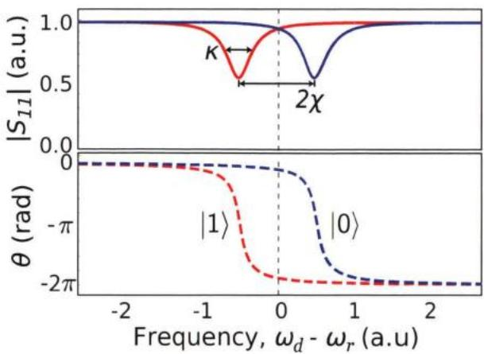  
图2.3 读取谐振腔在不同驱动频率以及不同比特状态下的幅值和相位响应。图片引自文献[32]。

## 2.2.2 测量的影响

对一个给定的量子系统，如果所有的耗散通道都可以被持续的监测，当得到测量结果 $J ( t )$ 时，可以用一个纯态 $\left| \psi _ { J } \right.$ 而不是一个混态密度矩阵ρ来描述系 $\rho$ 统当前的状态。这个纯态被称之为条件态，可以反应当前对系统的认知状态。然而，在实际条件下，最多只能监测个别耗散通道，这意味着将有一部分信息不可避免被遗漏，此时只能用条件态密度矩阵ρ来描述系统的状态。由于测量结 $\rho _ { J }$ 果的随机性，条件态密度矩阵的演化也是随机的，描述这个动力学过程的方程称之为随机主方程（SME:stochastic master equation)[33-37]，它最基本的性质便是$\rho ( t ) = E { \big [ } \rho _ { J } ( t ) { \big ] }$ ，表示所有可能的测量结果对应的条件态密度矩阵的平均就是系统主方程的解。

对于前文讨论的情况，对量子比特的测量实际上是监测系统的速率为 $\kappa$ 的D[a]腔光子弛豫通道，如果对应到量子比特自身的等效主方程，监测的则是速率为 $T _ { d } ( t )$ 的 $\mathcal { D } \left[ \hat { \sigma } _ { z } \right]$ 退相干通道。

考虑对腔光场的弛豫通道进行零差测量（homodynedetection)[38],即谐振腔输出端口的输出信号和一个与它同频、相位相差 $\phi$ 的本振信号混频[19]。假设混频后的测量结果记为 $J ( t )$ ，那么整个耦合体系的条件态密度矩阵 $\rho _ { J } ( t )$ 可以通过

下面的 SME 描述[22,26,39]

$$
\begin{array} { r l } & { \dot { \rho } _ { J } ( t ) = \dot { \mathcal { L } } _ { t o t } \rho _ { J } ( t ) + \sqrt { \kappa \eta } \mathcal { M } [ 2 \hat { I } ] \rho _ { J } \left[ J ( t ) - \sqrt { \kappa \eta \langle 2 \hat { I } \rangle _ { t } } \right] } \\ & { ~ + ~ i \sqrt { \kappa \eta } \left[ \hat { Q } , \rho _ { J } \right] \left[ J ( t ) - \sqrt { \kappa \eta \langle 2 I \rangle _ { t } } \right] . } \end{array}\tag{2.33}
$$

其中 $\mathcal { L } _ { t o t }$ 由公式(2.23)给出，η表示测量的量子效率(quantum efficiency)，后文还会讲到这个参数。M[]表示测量超算子， $\mathcal { M } [ \hat { c } ] \rho = \left( c - \langle c \rangle _ { t } \right) \rho / 2 + \rho \left( c - \langle c \rangle _ { t } \right) / 2$ $\langle c \rangle _ { \ell } = \mathrm { T r } [ c \rho _ { J } ( \ell ) ]$ ，算符i、 $\hat { Q }$ 的定义由公式（2.29）给出。

对于零差测量，测量结果 $J ( t )$ 可以表示为[22,26]

$$
J ( t ) = \sqrt { \kappa \eta } \langle 2 I \rangle _ { t } + \xi ( t ) ,\tag{2.34}
$$

其中 $\pmb { \xi } ( \pmb { t } )$ 代表高斯白噪声，它满足[26,40]

$$
E [ \xi ( t ) ] = 0 , \quad E [ \xi ( t ) \xi ( t ^ { \prime } ) ] = \delta ( t - t ^ { \prime } ) .\tag{2.35}
$$

再来看公式（2.33），第一项是主方程的作用，与测量无关；第二项引入 $\daleth$ 测量超算子，其中前半部分 $\sqrt { \kappa \eta } \ M [ 2 \hat { I } ] \rho _ { J }$ 代表测量增益，根据测量超算子的定义，它的作用是将系统朝着算符 $\pmb { \hat { I } }$ 的本征态方向坍缩，而后半部分则为这种坍缩过程引入一种随机作用；最后一项代表的是测量引入的非海森堡反作用，这一项的作用不同于第二项，通过随机的提供算符 $\hat { \pmb { Q } }$ 的作用，从而使系统偏离 $\pmb { \hat { I } }$ 的本征态[26]。

当然，也可以同时测量和 $\hat { Q }$ 分量，类似的，此时描述系统的随机主方程将多出描述测量 $\hat { \pmb { Q } }$ 的作用项，不过并不改变上面描述的物理图像。

当考虑 $\kappa \gg \gamma _ { 1 }$ 时，也可以将公式（2.33）约化得到等效的描述量子比特的随机主方程[22,26]

$$
\begin{array} { r l } & { \dot { \rho } _ { \overline { { J } } } ( t ) = \mathcal { L } \rho _ { \overline { { J } } } ( t ) + \sqrt { { \cal T } _ { \mathrm { c i } } ( t ) } \mathcal { M } [ \hat { \sigma } _ { z } ] \rho _ { \overline { { J } } } ( t ) \left[ \overline { { J } } ( t ) - \sqrt { { \cal T } _ { \mathrm { c i } } ( t ) } \langle \sigma _ { z } \rangle _ { t } \right] } \\ & { \quad \quad - i \frac { \sqrt { { \cal T } _ { \mathrm { b a } } ( t ) } } { 2 } \{ \hat { \sigma } _ { z } , \rho _ { \overline { { J } } } ( t ) \} \left[ \overline { { J } } ( t ) - \sqrt { { \cal T } _ { \mathrm { c i } } ( t ) } \langle \sigma _ { z } \rangle _ { t } \right] , } \end{array}\tag{2.36}
$$

其中C由公式（2.25）给出， $T _ { \mathrm { c i } } ( t )$ 表示从腔场中获得相干信息的速率， $T _ { \mathrm { b a } } ( t )$ 描述的是测量引起的额外的非海森堡反作用的速率，它们的具体形式为[22,26]

$$
\begin{array} { r l } & { T _ { \mathrm { c i } } ( t ) = \eta \kappa \vert \beta ( t ) \vert ^ { 2 } \cos ^ { 2 } \left( \phi - \phi _ { \beta } \right) , } \\ & { T _ { \mathrm { b a } } ( t ) = \eta \kappa \vert \beta ( t ) \vert ^ { 2 } \sin ^ { 2 } \left( \phi - \phi _ { \beta } \right) . } \end{array}\tag{2.37}
$$

其中 $\beta ( t ) = \alpha _ { e } ( t ) - \alpha _ { g } ( t )$ $\phi _ { \beta } = \operatorname { a r g } \left( \beta \right)$ 0

在公式（2.36）中， $\overline { { J } } ( t )$ 表示的是从对腔场的测量结果中提取出来的关于 $\hat { \pmb { \sigma } } _ { \pmb { z } }$ 算符测量结果，

$$
\overline { { J } } ( t ) = { \cal { I } } _ { \mathrm { e i } } ( t ) \langle \sigma _ { z } \rangle _ { r } + \xi ( t ) ,\tag{2.38}
$$

通过以上的分析，可以总结发现，通过对谐振腔输出光场的零差测量，实际上等效的对量子比特的作用是：以 $T _ { \mathrm { c j } } ( t )$ 的速率对 $\hat { \pmb { \sigma } } _ { z }$ 算符进行测量，使得量子比特随机坍缩到 $\hat { \pmb { \sigma } } _ { \pmb { z } }$ 的本征态上，同时引入速率为 $T _ { \mathrm { b a } } ( t )$ 的幺正反作用。

注意，公式（2.36）中第一项的Lindblad算子L中包含速率为 $T _ { d } ( t )$ 的退相干项，这一项是单纯用微波驱动谐振腔引入的由光子数涨落引起的退相干，并不是测量本身的反作用。当然，这里讨论的读取方案，首先需要用微波驱动谐振腔，然后再去探测谐振腔的输出光场，所以整个过程不可避免引入 $T _ { d } ( t )$ 的退相干项，从这个角度看，也可以把这一项理解为读取引起的退相干。由于被观测算符 $\hat { \sigma } _ { z }$ 与系统哈密顿量公式（2.21）满足对易关系，所以这里讨论的色散读取方案满足量子非破坏性条件[41-43]（QND: quantum non-demolition)。

当选择本振相位满足 ${ \phi } = { \phi } _ { \beta }$ 时， $T _ { \mathrm { b a } } ( t ) = 0$ ，而 $I _ { \mathrm { c i } } ( t ) = \eta \kappa | \beta ( t ) | ^ { 2 } \equiv I _ { \mathrm { m } } ( t )$ 其中 $T _ { \mathfrak { m } } ( t )$ 表示最大测量速率。这意味着，可以选择合适的本振相位，使得测量引起的幺正反作用为0，而有效的测量速率达到最大。注意到 $T _ { \mathfrak { m } }$ 的表达式中 $\pmb { \eta }$ 表示测量效率，而κ表示谐振腔光子泄露出来的速率，所以 $| \beta ( t ) | ^ { 2 }$ 就可以被理解为光子中编码的量子比特信息量。

## 2.2.3 信噪比和保真度

上一小节分析了色散读取的基本原理，利用随机主方程描述了在测量过程中系统的演化规律；在实际应用中，最终关心的是根据测量得到的信号，如何辨别比特所处的状态。这就涉及到态分辨的问题，在讨论这个问题之前，还需要先分析读取信号的特点。

根据公式（2.34）和公式（2.29），不失一般性，取 ${ \pmb \phi } = { \pmb 0 }$ ，当同时测量谐振腔输出信号的 $\pmb { \hat { I } }$ 和 $\pmb { \hat { Q } }$ 分量时，可以将测到的电压信号表示为

$$
\begin{array} { r } { I _ { i } ( t ) = 2 \sqrt { \kappa \eta } \mathrm { R e } \left( \alpha _ { i } ( t ) \right) + \xi _ { i } ( t ) , } \\ { Q _ { i } ( t ) = 2 \sqrt { \kappa \eta } \mathrm { I m } \left( \alpha _ { i } ( t ) \right) + \xi _ { i } ( t ) . } \end{array}\tag{2.39}
$$

式中下角标 $i \in \{ e , g \}$ ，指示量子比特的状态。在实际实验中，为了提高信噪比，一般需要对测量得到的原始信号进行积分（求和）求平均，

$$
I _ { \mathrm { i n t } , i } = \frac { 1 } { \tau } \int _ { 0 } ^ { \tau } \left[ \sqrt { \kappa \eta } \operatorname { R e } \left( \alpha _ { i } ( t ) \right) + \xi _ { i } ( t ) \right] d t = \langle I _ { \mathrm { i n t } , i } \rangle + X _ { G } [ 0 , \sigma _ { i } ^ { 2 } ] = X _ { G } [ \langle I _ { \mathrm { i n t } , i } \rangle , \sigma _ { i } ^ { 2 } ] ,
$$

$$
Q _ { \mathrm { i n t } , i } = \frac { 1 } { \tau } \int _ { 0 } ^ { \tau } \left[ \sqrt { \kappa \eta } \operatorname { I m } \left( \alpha _ { i } ( t ) \right) + \xi _ { i } ( t ) \right] d t = \langle Q _ { \mathrm { i n t } , i } \rangle + X _ { G } [ 0 , \sigma _ { i } ^ { 2 } ] = X _ { G } [ \langle Q _ { \mathrm { i n t } , i } \rangle , \sigma _ { i } ^ { 2 } ] .\tag{2.40}
$$

上式中 $\langle I _ { \mathrm { i n t } , i } \rangle , \langle Q _ { \mathrm { i n t } , i } \rangle$ 表示多次测量的统计平均电压，而 $X _ { G } [ \mu , \sigma ^ { 2 } ]$ 代表平均值

为 $\mu$ ，方差为 $\sigma ^ { 2 }$ 的高斯随机变量，该随机变量的概率分布满足

$$
P ( x ) = { \frac { 1 } { \sigma { \sqrt { 2 \pi } } } } e ^ { - ( x - \mu ) ^ { 2 } / ( 2 \sigma ^ { 2 } ) } ,
$$

注意在这里为描述简单起见，不考虑量子比特弛豫效应，因此基态和激发态的信号都可以写成独立的单高斯随机变量形式。如果将测量重复多次，并将得到的结果绘制到I-Q平面上，如图2.4所示，将得到两个高斯圆斑，分别对应比特处在基态和激发态。圆斑的中心点记为 $\mathrm { C } _ { i }$ ，坐标为 $( \langle I _ { \mathrm { i n t } , i } \rangle , \langle Q _ { \mathrm { i n t } , i } \rangle )$ ，两个圆斑的高斯半径分别为σ。和σe。 $\sigma _ { g }$ $\sigma _ { e }$

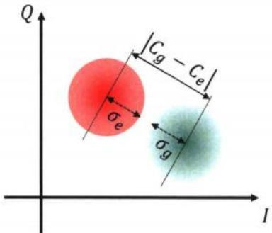  
图2.4 理想情况比特处于基态和激发态下对应的读取信号的两个高斯圆斑示意图。

显然，对于态分辨而言，两个圆斑分得越开越好，同时圆斑半径越小越好。因此可以定义测量的信噪比（SNR: signal-to-noise ratio）为

$$
\mathrm { S N R } ^ { 2 } = \frac { | \mathrm { C } _ { e } - \mathrm { C } _ { g } | ^ { 2 } } { \sigma _ { g } ^ { 2 } + \sigma _ { e } ^ { 2 } } .\tag{2.41}
$$

从另一个角度看，如果将两个圆斑朝着圆斑中心连线的方向投影，

$$
V _ { i } = \left[ I _ { \mathrm { i n t } , i } \begin{array} { l l } { Q _ { \mathrm { i n t } , i } } \end{array} \right] \left[ \begin{array} { l } { \cos \phi _ { w } } \\ { \sin \phi _ { w } } \end{array} \right] = X _ { G } [ \langle V _ { i } \rangle , \sigma _ { i } ^ { 2 } ] ,\tag{2.42}
$$

其中 $\phi _ { w }$ 是圆斑中心连线与Ⅰ轴的夹角。这样将重新得到两个一维高斯分布$\begin{array} { r } { P _ { i } ( V _ { i } ) = \frac { 1 } { \sigma \sqrt { 2 \pi } } e ^ { - ( V _ { i } - \langle V _ { i } \rangle ) ^ { 2 } / ( 2 \sigma _ { i } ^ { 2 } ) } } \end{array}$ ，也即两个圆斑在中心连线方向的边缘分布。其中$\langle V _ { i } \rangle$ ，也就等于两个圆 $\therefore L ^ { \prime }$ 的投影，因此可以写出和公式（2.41）完全等价的形式

$$
\mathrm { S N R } ^ { 2 } = \frac { | \langle V _ { e } \rangle - \langle V _ { g } \rangle | ^ { 2 } } { \sigma _ { g } ^ { 2 } + \sigma _ { e } ^ { 2 } } .\tag{2.43}
$$

利用上式可以更方便的计算出读取保真度和 SNR的关系，定义读取保真度为[44-45]

$$
F = 1 - [ P ( e | g ) + P ( g | e ) ] ,\tag{2.44}
$$

式中 ${ \pmb P } ( { \pmb x } | { \pmb y } )$ 表示量子比特处在状态x但是被识别为状态y的概率。由于 $\nu _ { i }$ 满足高斯分布，所以上式又可以写成[44]

$$
\begin{array} { r l } & { \displaystyle { F = 1 - \int _ { - \infty } ^ { v _ { \star } } P _ { e } ( v ) d v - \int _ { v _ { \star } } ^ { \infty } ( v \nu ) d v } } \\ & { \quad = \displaystyle { 1 - E _ { \mathrm { s e p } } = 1 - \mathrm { e r f c } \left( \frac { \mathrm { S N R } } { 2 } \right) } . } \end{array}\tag{2.45}
$$

上式第一行中 $v _ { \Uparrow }$ 表示二分类的阈值电压，此处假设了 $\langle V _ { e } \rangle > \langle V _ { g } \rangle$ ，因此当电压小于阈值电压，认为量子比特处于基态，大于阈值电压时，认为比特处于激发态；反之，如果 $\langle V _ { e } \rangle < \langle V _ { g } \rangle$ ，只需要交换第一行中概率密度分布函数的下角标。第二行中 $\pmb { E } _ { \mathrm { s e p } }$ 表示由于态没有完全分离导致的读取错误率，简称为态分离错误率，而erfc表示互补误差函数，定义为

$$
\operatorname { e r f c } ( x ) = { \frac { 2 } { \sqrt { \pi } } } \int _ { x } ^ { \infty } e ^ { - u ^ { 2 } } d u .\tag{2.46}
$$

为了更直观的了解态分离错误率与信噪比的关系，我在图2.5画出了由公式

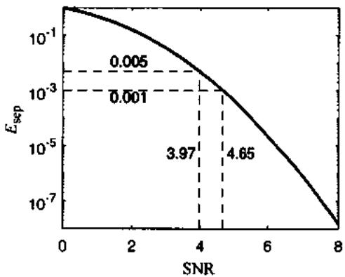  
图2.5 态分高错误率随信噪比的变化关系。图中红色和绿色虚线分别指示 $\pmb { \ E } _ { \ast \ast }$ 为0.005和0.001 时对应的 SNR 的大小。

(2.46)描述的态分离错误率随信噪比的变化关系。

公式（2.42）是从二维图像到一维图像投影的角度来分析的，当然也可以从旋转I-Q坐标轴的角度来考虑，结果是完全等价的。事实上，正如前文讨论过的，也可以选择合适的本振相位，使得比特的信息只编码在了分量上，此时$\langle Q _ { \mathrm { i n t } , e } \rangle = \langle Q _ { \mathrm { i n t } , g } \rangle$ ，因此 $\pmb { \hat { Q } }$ 分量不含有任何有效的比特信息，可以直接忽略这一维度，此时自然回到一维图像。

另一种常用的信号处理方式是将公式（2.40）和公式（2.42）合起来写成权

重积分的形式[44]

$$
V _ { i } = \frac { 1 } { \tau } \int _ { 0 } ^ { \tau } \left( \boldsymbol { \omega } _ { I } I _ { i } ( t ) + \boldsymbol { w } _ { Q } \dot { Q } _ { i } ( t ) \right) ~ d t ,\tag{2.47}
$$

$w _ { I }$ 和 $w _ { Q }$ 是对应分量的积分权重系数，在公式（2.42）中， $w _ { I } = \cos \phi _ { w } , w _ { Q } =$ sin $\phi _ { w }$ 。从信号分析角度看，积分权重系数相当于窗函数，起到有效滤波作用，公式（2.42）中的常系数对应的就是最简单的矩形窗滤波器（box-car filter）。然而考虑到，实际测量过程需要使用微波驱动谐振腔，然后再探测谐振腔的光场；根据公式（2.24）可知，驱动下的腔光场的演化将会有一个上升沿的过程，在这个上升沿过程中，光场的相位可能产生快速振荡，由于常系数的积分权重相当于平均作用，因此积分将会使这一段信息在时域上抵消为零。为了处理这个问题，可以借鉴信号处理领域的匹配滤波器（match filter)[46-47】的概念，根据信号自身的性质构建一个最佳的积分权重系数，从而最大化信噪比。

如果假设测量系统噪声与比特的状态无关，且都是满足公式（2.35）的高斯白噪声，通过令SNR对权重系数的一阶微分等于零，可以求出匹配滤波器的系数，它们满足[47-48]

$$
\begin{array} { r l } { w _ { I } ( t ) = \langle I _ { e } - I _ { g } \rangle } & { = 2 \sqrt { \kappa \eta } \mathrm { R e } ( \beta ( t ) ) , } \\ { w _ { Q } ( t ) = \langle Q _ { e } - Q _ { g } \rangle } & { = 2 \sqrt { \kappa \eta } \mathrm { I m } ( \beta ( t ) ) . } \end{array}\tag{2.48}
$$

将积分系数带入到SNR表达式中，可以分别写出矩形窗滤波器和匹配滤波器条件下的 SNR，

$$
\begin{array} { r l } & { \mathrm { S N R } _ { \mathrm { { b o x } } } = \sqrt { \displaystyle \frac { 2 \kappa \eta } { \tau } } \displaystyle \int _ { 0 } ^ { \tau } | \beta ( t ) | d t , } \\ & { \mathrm { S N R } _ { \mathrm { { m f } } } = \sqrt { \displaystyle \sum _ { 0 \neq \eta } \int _ { 0 } ^ { \tau } | \beta ( t ) | ^ { 2 } d t } . } \end{array}\tag{2.49}
$$

## 2.2.4 量子效率

上文在公式（2.33）中提到了量子效率的概念[48-53]，它表示的是测量的效率，可以将这个效率分解成两部分， $\eta = \eta _ { \mathrm { c o l } } \eta _ { \mathrm { a m p } }$ ，即信号收集的效率以及放大器放大的效率。前者考虑的是腔光子可能通过其他通道耗散出去而没有被监测到以及测到的信号在到达放大器之前可能会经历一段有损耗的传输路线：后者考虑的是放大器在放大信号的同时额外引入噪声，对于相敏放大器，一般定义$\begin{array} { r } { \eta _ { \mathrm { a m p } } = \frac { 1 } { N _ { \mathrm { a } } + 1 } } \end{array}$ ，而对于保相放大器，一般定义 $\begin{array} { r } { \eta _ { \mathrm { a m p } } = \frac { 2 } { 2 N _ { \mathrm { g } } + 1 } } \end{array}$ ，其中 ${ \pmb N } _ { \mathbf { \lambda } }$ 表示放大器额外引入的噪声（added noise)[19]。

从另一个角度分析，量子效率也可以理解为信息提取的效率，注意到 $\{ 2 6 \}$

$$
\operatorname* { l i m } _ { t  \infty } \frac { { \cal { T } } _ { \mathfrak { m } } } { 2 { \cal { T } } _ { d } } = \eta .\tag{2.50}
$$

上式意味着，当腔光场达到稳态时，此时最大的测量速率和2倍的测量微波驱动引起的退相干速率的比值正是量子效率 $\pmb { \eta } .$ 。等式左边分子是测量信息的采集速率，而分母是量子比特相位信息的丢失速率，所以量子效率可以用来衡量测量量子比特所付出的代价的大小，当量子效率等于1，以最大的速率最小的代价测量得到了量子比特的信息，当量子效率等于0，只是引起了量子比特的退相干而没有获得任何有用的信息。这便是从信息的角度看量子效率的内涵。

## 2.3 读取参数最优化设计

## 2.3.1 设计目标

本文考虑读取性能的两个重要指标，分别是读取保真度和读取速度，前者用来表示读取的效果，后者则是用来表示读取的效率。首先，除了上一节讲到的态分离错误率 $\pmb { E } _ { \mathsf { s e p } }$ ，当考虑实际情况下量子比特的寿命 $( T _ { \parallel } )$ 有限时，需要考虑由量子比特弛豫所引起的读取错误 $E _ { T _ { \mathrm { l } } } \simeq 1 - e ^ { - \tau / 2 T _ { \mathrm { l } } [ 4 5 , 5 4 ] }$ ，所以从这个角度看，在信噪比相同的情况下，读取时间越短，读取保真度越高。另外，从量子纠错[55-56]或者量子反馈[57-58]的角度考虑，在相同读取保真度的前提下，更快的读取速度可以提升纠错和反馈的效率，同时降低在纠错过程中其它新错误发生的概率。本节将讨论分析如何设计读取参数以便能够满足上述要求。

目前错误率容忍度较高的表面子编码方案(surface code)[59-60]的错误率阈值是0.01[61-62]，这里暂且将这个阈值作为读取保真度的错误率上限 ${ \pmb E } _ { \mathrm { t h } } = { \bf 0 . 0 } 1$ 0为简单起见，先考虑错误率均衡分配，即 $E _ { \mathrm { s e p } } = E _ { T _ { \mathrm { i } } } = E _ { \mathrm { i h } } / 2$ ，于是可以估算得到读取时间满足 $\tau \leqslant \tau _ { \dot { \mathrm { u } } } = 1 0 ^ { - 2 } T _ { 1 }$ ；于是问题变成如何设计读取参数使得在τ时 $\pmb { \tau _ { \hbar } }$ 间之内读取信噪比 $\mathbf { S N R } \geqslant \mathbf { S N R } _ { \mathbf { i } \mathbf { h } }$ ，保证 $E _ { \mathrm { s e p } } \leqslant E _ { \sharp } / 2$ 。根据公式（2.45）可以计算得到 $\mathsf { S N R } _ { \mathrm { t b } } \simeq 3 . 9 7$ a

## 2.3.2 参数限制

在进一步分析其他读取参数的影响前，我们先给出这些读取参数的限制关系。首先，对于色散频移量χ而言，由于 $\begin{array} { r } { \chi = \frac { g ^ { 2 } \alpha } { \Delta ( \Delta + \alpha ) } \simeq \frac { g ^ { 2 } \alpha } { \Delta ^ { 2 } } } \end{array}$ ，x和 $\pmb { \alpha }$ 同符号，对于transmon比特而言，二者-一般都是负号。显然 $| \chi |$ 趋于零则无法通过腔光场来分辨量子比特的状态； $| \chi |$ 也不能太大，因为色散耦合的近似条件要求$\begin{array} { r } { n _ { c r \mathrm { i t } } = \frac { \Delta ^ { 2 } } { 4 g ^ { 2 } } \simeq \frac { \alpha } { 4 \chi } \gg 1 } \end{array}$ 。取临界光子数大于等于10，则对应要求

$$
| \chi | \leqslant \frac { | \alpha | } { 4 0 } .\tag{2.51}
$$

其次，对于谐振腔耗散率x，由于它表示腔光子往外泄露的速率，显然， $\pmb { \kappa }$ 越大，读取的速度将越快，反之则越慢。不过，κ显然也不能太大，首先需要满足强耦合条件 $\kappa \llg$ ，其次是考虑后级测量电路（包括后级放大器和数字采集卡）的带宽 $r _ { \tt G W }$ 有限，当使用频分复用技术同时读取N个比特时，一般要求 $\begin{array} { r } { \kappa \ll \frac { \Gamma _ { \mathrm { B W } } } { N } } \end{array}$

另外，非常重要的一点是当 $\pmb { \kappa }$ 和 $| \pmb { \chi } |$ 都比较大时，Purcell 效应[63-64]将会限制量子比特 $\pmb { T } _ { 1 }$ ，其中 $\begin{array} { r } { T _ { 1 } ^ { \mathrm { P u r c e l l } } = \frac { 2 \pi } { \kappa } \frac { \varDelta ^ { 2 } } { g ^ { 2 } } \simeq \frac { 2 \pi } { \kappa } \frac { \alpha } { \chi } } \end{array}$ ，如果要求 $T _ { 1 } ^ { \mathsf { P u r c e l l } } \geqslant 2 T _ { 1 }$ ，于是得到另一个限制关系

$$
\kappa \vert \chi \vert \leqslant \frac { \pi \vert \alpha \vert } { T _ { \vert } } .\tag{2.52}
$$

不过，由于 Purcell滤波器（将在下一章中详细介绍）可以有效抑制 Purcell效应[65-67]，所以当芯片上设计了合适的 Purcell滤波器，公式（2.52）的限制将不复存在。

最后关于驱动功率，显然SNR是正比于驱动功率 $\epsilon _ { d }$ 的，因此驱动功率越高，SNR越大。不过，驱动功率越高，腔内光子数也越多，由于色散耦合近似条件要求腔光子数要远小于临界光子数，因此考虑在整个读取时间范围内腔光子数始终远小于临界光子数，即 $n _ { i } ( t ) = | \alpha _ { i } ( t ) | ^ { 2 } \ll n _ { \mathrm { c r i t } } , t \in [ 0 , \tau ]$ ，注意这里限制的不是饱和光子数，一是因为方波驱动时，在到达饱和状态之前会有一个短暂的过冲效应，此时光子数大于饱和光子数；二是因为当κ较小时，在读取时间范围内腔光场可能远没有到达饱和态，一般此时光子数小于饱和光子数。

## 2.3.3 信噪比与各参数的依赖关系

为了计算信噪比与各读取参数的依赖关系，假设使用方波作为包络来驱动读取谐振腔，根据公式(2.24)，可以求解出谐振腔内光场的含时演化轨迹

$$
\begin{array} { r } { \alpha _ { g } ( t ) = \alpha _ { g } ^ { s } \left( 1 - \exp [ - i ( A _ { r } - \chi ) t - \kappa t / 2 ] \right) , } \\ { \alpha _ { e } ( t ) = \alpha _ { e } ^ { s } \left( 1 - \exp [ - i ( A _ { r } + \chi ) t - \kappa t / 2 ] \right) . } \end{array}\tag{2.53}
$$

其中 $\alpha _ { i } ^ { s }$ 由公式（2.28）给出，图2.6画出了上式描述的典型的腔光场在 ${ \pmb I } - { \pmb Q }$ 平面的演化轨迹图。将上式代入到公式(2.49）中，可以计算出任意时刻的信噪比。由于积分后的解析表达式较复杂，本文将主要利用数值计算的方法来分析不同参数条件对信噪比的影响。

首先考察驱动频率对信噪比的影响，结果如图2.7（a）所示，当 $\pmb { \mathscr { s } } _ { r } = \pmb { \mathscr { s } }$ 时，不仅可以得到更高的信噪比，而且饱和光子数相比其他驱动频率也是最小的（在$\pm 2 \chi$ 范围内)，而这将更有利于抑制读取引起的量子比特态混合或者跃迁等不理想情况的发生概率[68-71]。

同时，在图2.7（a）中，我们还对比了在信号处理时使用常系数滤波器和匹配滤波器的区别，从中可以看出，使用匹配滤波器对信号进行积分得到的信噪比始终要优于常系数滤波器。进一步我们在图2.7（b）中对比了相同设计参数不同积分时间下二者的差异，可以看到，只有当积分时间足够长时，两种积分系数的差异才逐渐消失。这是因为在腔光子到达稳态之后，此时的匹配滤波器积分系数也不随时间变化，和常系数滤波器完全等价，而由于积分时间足够长，在稳态之前的信号上升沿部分对于信噪比的贡献可以忽略不计，所以二者的表现趋于一致。因此，在后面的分析中，将只考虑 $\varDelta _ { r } = 0$ 以及使用匹配滤波器的情况。

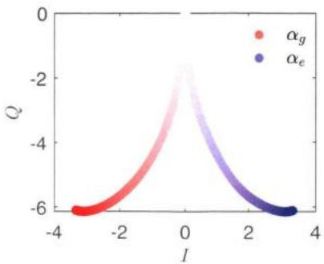  
图2.6 典型的腔光场在I-Q平面的演化轨迹图，线条颜色深度的增加代表演化时间的增加。

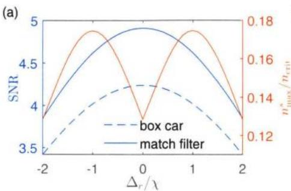

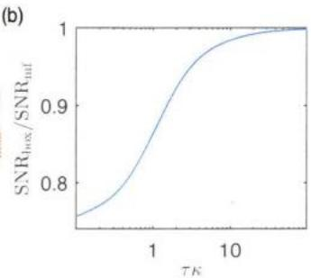  
图2.7 (a）读取信噪比以及饱和光子数随驱动频率的变化关系。图中蓝线对应左边纵轴，表示信噪比SNR与驱动频率的关系，浅红色线对应右边纵轴，表示约化后的饱和光子数$n _ { \mathrm { m a x } } ^ { s } / n _ { \mathrm { c n i } }$ 与驱动频率的关系，其中 $n _ { \operatorname* { m a x } } ^ { s } = \operatorname* { m a x } ( n _ { g } ^ { s } , n _ { e } ^ { s } )$ 。(b）常系数滤波器与匹配滤波器对信噪比的影响。当积分时间足够长时，二者差距逐渐消失。

根据上文提到的参数限制，实际计算分析中，取 $T _ { 1 } = 5 0 \mu \mathrm { s } , \alpha / 2 \pi = - 2 4 0 \mathrm { M H z }$ $\begin{array} { r } { \frac { B W } { N } = 3 5 \mathrm { M H z } } \end{array}$ ，另外取 $\epsilon _ { d } = f ^ { - 1 } ( n _ { \mathrm { m a x } } ) = f ^ { - 1 } ( n _ { \mathrm { c r i t } } / 5 )$ ，其中 $n _ { \mathrm { m a x } }$ 表示整个读取时间过程中腔内最大光子数，f表示腔光子数与驱动功率 $\epsilon _ { d }$ 的函数关系。

图2.8中画出了当固定读取时间不变时，SNR随 $\chi$ 和 $\kappa$ 的依赖关系，图中紫色虚线是公式（2.52）代表的由于Purcell效应对参数的限制，即Purcell极限当没有Purcell滤波器时，只有紫线左下角区域的参数空间才是有效的。而灰色和白色的点虚线分别表示的是纵向切片以及横向切片时的极值点，这两条线指引的是当固定κ时，对应的使 SNR最大的参数 χon所在的位置，以及当固定 $\chi _ { \mathrm { o p t } }$ $\chi$ 时， $\kappa _ { \mathrm { o p t } }$ 所在的位置。注意到这两条指引线都收敛或终止于 $\chi / 2 \pi = - 6 ~ \mathrm { M H z }$ 这条线上，同时它们的交点也即整个二维相图的极值点也在这条线上，而这条线正是公式（2.51）代表的色散极限，这意味着从这个参数空间来看，SNR的上限取决于 $\chi .$ 。因此从设计角度看，我们应该先确定下来 $\chi$ ，然后根据图中的白色点虚线确定κ的设计值；从实验的角度看，当芯片设计好之后， $\kappa$ 参数是固定的，可能和设计值有些偏差，而对于可调比特而言， $\chi$ 可以有一定的调节范围，因此可以依照灰色点虚线来确定最佳的 $\chi$ 参数，也即确定对应的读取时比特工作频率—也称之为读取工作点。

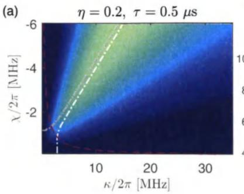

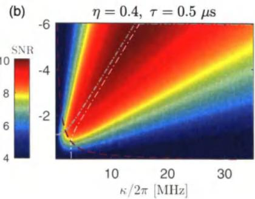

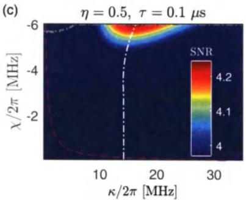

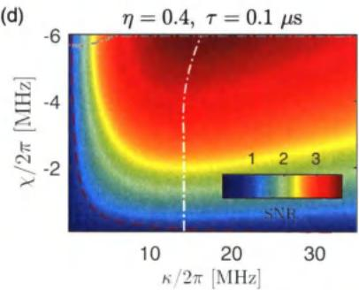  
图 2.8 固定读取时间，SNR 随 $\chi$ 和κ的变化关系。紫色虚线代表Purcell极限，详见正文；灰色和白色点虚线分别表示对相图纵向和横向切片得到的极值点。(a) $\eta = 0 . 2 , \tau = 0 . 5 \mu \mathrm { s }$ 。(b)$\eta = 0 . 4 , \tau = 0 . 5 \ \mu \mathrm { s }$ 。(c) $\eta = 0 . 5 , \tau = 0 . 1 \ \mu s$ 。(d) $\eta = 0 . 4 , \tau = 0 . 1$ μs。

图2.8（a)、(b)、（c）中只显示了 $\mathrm { S N R } \geqslant \mathrm { S N R } _ { \mathrm { t h } }$ 时的颜色细节，图2.8（d）中由于 SNR 始终小于 $\mathrm { S N R } _ { \mathrm { t h } }$ 所以显示了所有的颜色细节。注意到量子效率η这个参数对于SNR而言相当于一个全局的增益系数，因此对比图2.8（a）和（b）时，整体图像趋势是相同的，三条参考虚线的位置也与 $\eta$ 无关。当 η从0.2变到0.4时，一方面 SNR整体提升，另一方面由于 SNR整体的提升，导致 $\mathrm { S N R } _ { \mathrm { t h } }$ 的对应的参数边界进一步扩张，这意味着在设计参数时有更大的冗余度以及考虑空间。同时也注意到没有Purcell滤波器时，有效参数空间非常小，同时 SNR的极值点将落在Purcell极限上，其值也远小于色散极限处的极值点。更进一步，当考虑使用更短的读取时间时，例如图2.8（c）和（d）表示的100ns，计算发现，当$\eta = 0 . 4$ 时，整个参数空间都无法实现 $\mathrm { S N R } _ { \mathrm { t h } }$ ，当 $\eta$ 增大到0.5时，也只有很小的参数区间可以实现；然而，如果没有Purcell滤波器（图2.8（c）紫色虚线以内），在当前的限制条件下无法在100 ns内实现 $\mathrm { S N R } _ { \mathrm { t h } }$

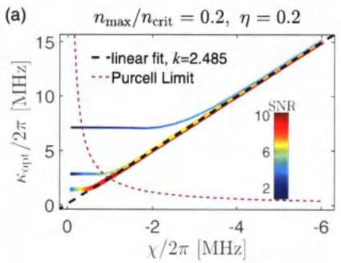

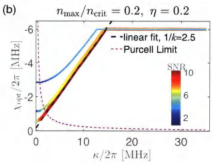  
图 2.9 $\kappa _ { \mathrm { o p t } }$ 随 $\chi$ 的变化关系（a）以及 $\chi _ { \mathrm { o p t } }$ 随 $\kappa$ 的变化关系（b)。三条彩色圆点状线从上到下依次代表 $\tau = 0 . 2$ μs、 $\tau = 0 . 5$ μs、 $\tau = 1 ~ \mu s$ 。图中紫色虚线代表Purcell极限，黑色虚线是对 $\tau = 1 ~ \mu s$ 线性部分的的拟合。

图 2.9 进一步画出了 $\kappa _ { \mathrm { o p t } } \mathrm { \ v s . } \chi$ 和 $\chi _ { \mathrm { o p t } } \mathrm { v s } . \kappa$ 的图像，以及它们受到读取时间的影响。图2.9（a）对应的是图2.8中的灰色点虚线，注意到当 $| \chi |$ 较小时， $\kappa _ { \mathsf { o p t } }$ 几乎不随 $| \chi |$ 变化，同时随着读取时间减小而增大；而当 $| \chi |$ 较大时， $\kappa _ { \mathrm { o p t } }$ 直接正比于 $| \chi |$ ，比例系数 $k = 2 . 4 8 5$ ，而且这个比例系数几乎不随读取时间变化，因此这个比例系数可以作为设计样品参数时的一个重要参考。图2.9（b）对应的是图2.8中的白色点虚线，同样，当 $\kappa$ 较小时， $| \chi _ { \mathrm { o p t } } |$ 几乎不随 $\kappa$ 变化，时间越短，$| \chi _ { \mathrm { o p t } } |$ 越大；而当κ较大时， $| \chi _ { \mathrm { o p t } } |$ 与 $\kappa$ 呈线性关系，线性系数 $1 / k = 2 . 5$ ，这个比例系数也几乎不随读取时间变化，不过截距随着读取时间变小而上移，最后当 $\kappa$ 继续增大， $| \chi _ { \mathrm { o p t } } |$ 将收敛到色散极限。此外，两幅图中 SNR大小都是随着者 $| \chi |$ 或 $\lvert \chi _ { \mathrm { o p t } } \rvert$ 增大而单调增大的，因此极值点都落在色散极限的点或线上。当然，如果没有Purcell滤波器，左右两幅图都到不了线性区域，更到不了色散极限，因此 SNR的最大值也要相对小很多。

上面的分析结果表明，实现Purcell滤波器以及提高量子效率对于实现快速高保真度读取而言至关重要，前者本文将在第三章中展开介绍，后者主要是如何降低测量线路的噪声光子数，最有效的办法便是使用具有量子极限噪声的放大器，本文将在第四章详细介绍。另外，可以适当考虑增大transmon比特的非谐，增大 $| \chi |$ 的上限，也即增大SNR的上限；同时根据图2.9（a）选择最佳的 $\kappa$ 值实现SNR最大化。早期文献中，只考虑测量腔光场到达稳态之后的信息，得到$\kappa / | \chi |$ 的理想比值是 $2 ^ { [ 7 , 2 6 ] }$ ，而本文这里得到的结果是2.5，这主要是因为本文考虑了腔光场的完整时域响应，包括到达稳态之前的一段上升沿时间。而对这段时间内量子比特信息的提取对于快速高保真度读取而言同样重要，因此考虑腔光场的完整时域响应可以更准确地指导我们对读取参数的设计。目前文献中也有使用所谓的 CLEAR 波形[48,72-73]或者 Two-step 波形[45]使得腔光子在更短的时间内达到饱和，之后我们可以继续研究如何优化驱动波形使得SNR可以在更短时间内达到最大。

## 2.4 本章小结

本章首先介绍了电路量子电动力学的基本理论模型，然后介绍了利用超导量子比特与超导谐振腔在色散耦合条件下实现非破坏性测量的原理。文中分析了该读取方案下读取信号的基本性质，并给出了读取保真度、信噪比、量子效率的定义以及它们之间的相互关系。最后我首次提出了一套完整的读取参数最优化设计方案。这套方案中首先考虑了读取参数设计上的一些物理限制，在这个基础上利用数值计算的方法分析了各参数对读取信噪比的影响，并且给出了SNR最优时色散频移量x与谐振腔耗散率κ之间需要满足的约束关系，以及该约束关系如何受到读取时间长度的影响。

根据这一章的分析和计算结果，我们不仅可以准确计算出在更短时间内实现更高保真度的样品设计参数。同时，我们还可以发现，Purcell滤波器和具有量子极限噪声的放大器对于实现快速高保真的读取目标而言至关重要，这也为本文后面的研究工作提供了根本的动机。

## 参考文献

[1] LEHNERT K W, BLADH K, SPIETZ L F, et al. Measurement of the excited-state lifetime of a microelectronic circuit[J]. Physical Review Letters, 2003, 90(2): 27002.

[2] FRIEDMAN J R, FRIEDMAN J R, PATEL V, et al. Quantum superposition of distinct macroscopic states[J]. Nature, 2000, 406(6791): 43-46.

[3] LANDAUER R. The physical nature of information[J]. Physics Letters A, 1996, 217(4-5): 188-193.

[4] MAKHLIN Y, SCHöN G, SHNIRMAN A. Quantum-state engineering with Josephsonjunction devices[J]. Reviews of Modern Physics, 2001, 73(2): 357.

[5] WENDIN G, SHUMEIKO V S. Quantum bits with Josephson junctions[J]. Low Temperature Physics, 2007, 33(9): 724-744.

[6] CLARKE J, WILHELM F K. Superconducting quantum bits[J]. Nature, 2008, 453(7198): 1031-1042.

[7] BLAIS A, HUANG R S, WALLRAFF A, et al. Cavity quantum electrodynamies for superconducting electrical circuits: An architecture for quantum computation[J]. Physical Review A, 2004, 69(6): 062320.

[8] WALLRAFF A, SCHUSTER D I, BLAIS A, et al. Strong coupling of a single photon to a superconducting qubit using circuit quantum electrodynamics[J]. Nature, 2004, 431(7005): 162-167.

[9] HOOD C J, LYNN T W, DOHERTY A C, et al. The atom-cavity microscope: Single atoms bound in orbit by single photons[J]. Science, 2000, 287(5457): 1447-1453.

[10] RAIMOND J M, BRUNE M, HAROCHE S. Manipulating quantum entanglement with atoms and photons in a cavity[J]. Reviews of Modern Physics, 2001, 73(3): 565.

[11} MABUCHI H, DOHERTY A C. Cavity quantum electrodynamics: coherence in context[J]. Science, 2002, 298(5597): 1372-1377.

[12] WALTHER H, VARCOE B T, ENGLERT B G, et al. Cavity quantum electrodynamics[J]. Reports on Progress in Physics, 2006, 69(5): 1325.

[13] SCULLY M O, ZUBAIRY M S. Quantum Optics[M]. Cambridge: Cambridge University Press, 1997,

[14] HAROCHE S, RAIMOND J M. Exploring the quantum: atoms, cavities, and photons[M] Oxford University Press, 2006.

[15] PAIK H, SCHUSTER D I, BISHOP L S, et al. Observation of high coherence in Josephson junction qubits measured in a three-dimensional circuit QED architecture[J]. Physical Review Letters, 2011, 107(24): 240501.

[16] OLIVER W D, WELANDER P B. Materials in superconducting quantum bits[J]. MRS Bulletin, 2013, 38(10): 816-825.

[17] AXLINE C, REAGOR M, HEERES R, et al. An architecture for integrating planar and 3D cQED devices[J]. Applied Physics Letters, 2016, 109(4): 042601.

[18] VOOL U, DEVORET M. Introduction to quantum electromagnetic circuits[J]. International Journal of Circuit Theory and Applications, 2017, 45(7): 897–934.

[19] BLAIS A, GRIMSMO A L, GIRVIN S, et al. Circuit quantum electrodynamics[J]. Reviews of Moder Physics, 2021, 93(2): 025005.

[20] KOCH J, YU T M, GAMBETTA J, et al. Charge-insensitive qubit design derived from the Cooper pair box[J]. Physical Review A - Atomic, Molecular, and Optical Physics, 2007, 76 (4): 1-21.

[21] CARBONARO P, COMPAGNO G, PERSICO F. Canonical dressing of atoms by intense radiation fieids[J]. Physics Letters A, 1979, 73(2): 97-99.

[22] BOISSONNEAULT M, GAMBETTA J M, BLAIS A. Dispersive regime of circuit QED: Photon-dependent qubit dephasing and relaxation rates[J]. Physical Review A, 2009, 79(1): 013819.

[23] SCHUSTER D I, WALLRAFF A, BLAIS A, et al. ac Stark shift and dephasing of a superconducting qubit strongly coupled to a cavity field[J]. Physical Review Letters, 2005, 94(12): 123602.

[24] GAMBETTA J, BLAIS A, SCHUSTER D I, et al. Qubit-photon interactions in a cavity: Measurement-induced dephasing and number splitting[J]. Physical Review A, 2006, 74(4): 042318.

[25] FRAGNER A, GöPPL M, FINK J M, et al. Resolving vacuum fluctuations in an electrical circuit by measuring the Lamb shif[J]. Science, 2008, 322(5906): 1357-1360.

[26] GAMBETTA J, BLAIS A, BOISSONNEAULT M, et al. Quantum trajectory approach to circuit QED: Quantum jumps and the Zeno effect[J]. Physical Review A, 2008, 77(1): 012112.

[27] GOVIA L C G, WILHELM F K. Entanglement generated by the dispersive interaction: The dressed coherent state[J]. Physical Review A, 2016, 93(1): 012316.

[28] KHEZRI M, MLINAR E, DRESSEL J, et al. Measuring a transmon qubit in circuit QED: Dressed squeezed states[J]. Physical Review A, 2016, 94(1): 012347.

[29] CARMICHAEL H. An open systems approach to quantum optics[M]. Springer Science & Business Media, 2009.

[30] BONZOM V, BOUZIDI H, DEGIOVANNI P. Dissipative dynamies of circuit-QED in the mesoscopic regime[J]. The European Physical Journal D, 2008, 47(1): 133-149.

[31] FRISK KOCKUM A, TORNBERG L, JOHANSSON G. Undoing measurement-induced de-

phasing in circuit QED[J]. Physical Review A, 2012, 85(5): 052318.

[32}KRANTZ P, KJAERGAARD M, YAN F, et al. A quantum engineer's guide to superconducting qubits[J]. Applied Physics Reviews, 2019, 6(2): 021318.

[33] WISEMAN H M, DIóSI L. Complete parameterization, and invariance, of diffusive quantum trajectories for Markovian open systems[J]. Chemical Physics, 2001, 268(1-3): 91-104.

[34] KOROTKOV A N. Selective quantum evolution of a qubit state due to continuous measurement[J]. Physical Review B, 2001, 63(11): 115403.

[35] KOROTKOV A N. Nonideal quantum detectors in Bayesian formalism[J]. Physical Review B, 2003, 67(23): 235408.

[36] GARDINER C, ZOLLER P, ZOLLER P. Quantum noise: a handbook of Markovian and non-Markovian quantum stochastic methods with applications to quantum optics[M]. Springer Science & Business Media, 2004.

[37] GAMBETTA J, WISEMAN H M. Stochastic simulations of conditional states of partially observed systems, quantum and classical[J]. Journal of Optics B: Quantum and Semiclassical Optics, 2005, 7(10): S250.

[38]JAKEMAN E, OLIVER C J, PIKE E R. Optical homodyne detection[J]. Advances in Physics, 1975, 24(3): 349-405.

[39] WISEMAN H M, MILBURN G J. Quantum theory of field-quadrature measurements[J]. Physical review A, 1993, 47(1): 642.

[40] GARDINER C W, et al. Handbook of stochastic methods: volume 3[M]. springer Berlin, 1985.

[41] BRAGINSKY V B, VORONTSOV Y I, THORNE K S. Quantum nondemolition measurements[J]. Science, 1980, 209(4456): 547-557.

[42] AVERIN D V. Quantum nondemolition measurements of a qubit[C]//PEKOLA J, RUGGIERO B, SILVESTRINI P. International Workshop on Superconducting Nano-Electronics Devices. Boston, MA: Springer US, 2002: 1-10.

[43] LUPAşCU A, SAITO S, PICOT T, et al. Quantum non-demolition measurement of a superconducting two-level system[J]. Nature Physics, 2007, 3(2): 119-123.

[44] GAMBETTA J, BRAFF W A, WALLRAFF A, et al. Protocols for optimal readout of qubits using a continuous quantum nondemolition measurement[J]. Physical Review A, 2007, 76(1): 012325.

[45]WALTER T, KURPIERS P, GASPARJNETTT S, et al. Rapid high-fidelity single-shot dispersive readout of superconducting qubits[J]. Physical Review Applied, 2017, 7(5): 054020.

[46] TURIN G. An introduction to matched filters[J]. IRE transactions on Information theory, 1960, 6(3): 311-329.

[47] RYAN C A, JOHNSON B R, GAMBETTA J M, et al. Tomography via cortelation of noisy measurement records[J]. Physical Review A, 2015, 91(2): 022118.

[48] BULTINK C C, TARASINSK1 B, HAANDB/EK N, et al. General method for extracting the quantum efficiency of dispersive qubit readout in circuit QED[J]. Applied Physics Letters, 2018, 112(9): 092601.

[49] LECOCQ F, RANZANI L, PETERSON G, et al. Efficient qubit measurement with a nonreciprocal microwave amplifier[J]. Physical Review Letters, 2021, 126(2): 020502.

[50] TOUZARD S, KOU A, FRATTINI N, et al. Gated conditional displacement readout of superconducting qubits[J]. Physical Review Letters, 2019, 122(8): 080502.

[51] HATRIDGE M, SHANKAR S, MIRRAHIMI M, et al. Quantum back-action of an individual variable-strength measurement[J]. Science, 2013, 339(6116): 178-181.

[52] PERONNIN T, MARKOVIć D, FICHEUX Q, et al. Sequential dispersive measurement of a superconducting qubit[J]. Physical Review Letters, 2020, 124(18): 180502.

[53] ROSENTHAL E I, SCHNEIDER C M, MALNOU M, et al. Efficient and low-backaction quantum measurement using a chip-scale detector[J]. Physical Review Letters, 2021, 126(9): 090503.

[54] WANG Z, BAO Z, WU Y, et al. Improved superconducting qubit state readout by path interference[J]. Chinese Physics Letters, 2021, 38(11): 110303.

[55]REED M D, DICARLO L, NIGG S E, et al. Realization of three-qubit quantum error correction with superconducting circuits[J]. Nature, 2012, 482(7385): 382-385.

[56] GONG M, YUAN X, WANG S, et al. Experimental exploration of five-qubit quantum error-correcting code with superconducting qubits[J]. National Science Review, 2022, 9(1): nwab011.

[57] VIJAY R, MACKLIN C, SLICHTER D H, et al. Stabilizing Rabi oscillations in a superconducting qubit using quantum feedback[J]. Nature, 2012, 490(7418): 77-80.

[58] RISTE D, DUKALSKI M, WATSON C A, et al. Deterministic entanglement of superconducting qubits by parity measurement and feedback[J]. Nature, 2013, 502(7471): 350-354.

[59] BRAVYI S B, KITAEV A Y. Quantum codes on a lattice with boundary[A]. 1998. arXiv: quant-ph/9811052.

{60] DENNIS E, KITAEV A, LANDAHL A, et al. Topologica} quantum memory[J]. Journal of Mathematical Physics, 2002, 43(9): 4452-4505.

[61] WANG C, HARRINGTON J, PRESKILL J. Confinement-Higgs transition in a disordered gauge theory and the accuracy threshold for quantum memory[J]. Annals of Physics, 2003, 303(1): 31-58.

[62] RAUSSENDORF R, HARRINGTON J. Fault-tolerant quantum computation with high thresh-

old in two dimensions[J]. Physical Review Letters, 2007, 98(19): 190504.

[63] SETE E A, GAMBETTA J M, KOROTKOV A N. Purcell effect with microwave drive: Suppression of qubit relaxation rate[J]. Physical Review B, 2014, 89(10): 104516.

[64] GAMBETTA J M, HOUCK A A, BLAIS A. Superconducting qubit with Purcell protection and tunable coupling[J]. Physical Review Letters, 2011, 106(3): 030502.

[65]BRONN N T, MAGESAN E, MASLUK N A, et al. Reducing spontaneous emission in circuit quantum electrodynamics by a combined readout/filter technique[J]. IEEE Transactions on Applied Superconductivity, 2015, 25(5): 1-10.

[66]JEFFREY E, SANK D, MUTUS J, et al. Fast accurate state measurement with superconducting qubits[J]. Physical Review Letters, 2014, 112(19): 190504.

[67] HEINSOO J, ANDERSEN C K, REMM A, et al. Rapid high-fidelity multiplexed readout of superconducting qubits[J]. Physical Review Applied, 2018, 10(3): 034040.

[68] SLICHTER D H, VIJAY R, WEBER S J, et al. Measurement-induced qubit state mixing in circuit qed from up-converted dephasing noise[J]. Physical Review Letters, 2012, 109(15): 153601.

[69]KOCKUM A F, SANDBERG M, VISSERS M R, et al. Detailed modelling of the susceptibility of a thermally populated, strongly driven circuit-QED system[J]. Journal of Physics B: Atomic, Molecular and Optical Physics, 2013, 46(22): 224014.

[70] SANK D, CHEN Z, KHEZRI M, et al. Measurement-induced state transitions in a superconducting qubit: Beyond the rotating wave approximation[J]. Physical Review Letters, 2016, 117(19): 190503.

[71] PETRESCU A, MALEKAKHLAGH M, TüRECI H E. Lifetime renormalization of driven weakly anharmonic superconducting qubits. II. The readout problem[J]. Physical Review B, 2020, 101(13):134510.

[72] MCCLURE D T, PAIK H, BISHOP L S, et al. Rapid driven reset of a qubit readout resonator [J]. Physical Review Applied, 2016, 5(1): 011001.

[73] BULTINK C C, ROL, M A, O’ BRIEN T E, et al. Active resonator reset in the nonlinear dispersive regime of circuit QED[J]. Physical Review Applied, 2016, 6(3): 034008.

## 第 3 章 Purcell 滤波器的设计原理与验证

在电路量子电动力学中，超导量子比特作为人工原子，与谐振腔处于强耦合状态。这种强耦合使得我们可以实现比特与腔光子态之间的相干相互作用[1]，也可以利用谐振腔作为媒介实现量子比特之间的长程耦合[2-3]，同时还可以用来实现对量子比特状态的非破坏性测量[4-5]。然而，在超导量子电路中，这种强耦合相互作用带来的负面效应是为量子比特的耗散提供了额外的通道，从而使得量子比特的寿命下降[6]。这种效应由 E. M. Purcell在1946 年在描述量子化的系统与谐振腔耦合时首次提出[7]，我们现在一般把这种效应被称为Purcell效应，对应引起的耗散速率被称为Purcell速率[8-9]。原则上，通过减小谐振腔的耗散率$\kappa _ { \gamma }$ 或者增大量子比特与谐振腔的失谐Δ，可以降低Purcell速率[6,10]，不过正如第二章所分析，这种做法和快速高保真度的色散读取要求相违背。因此为了实现快速高保真度的读取，同时又不会引起量子比特寿命的下降，一般的做法是引入额外的滤波电路[9,11-16]———我们称之为 Purcell 滤波器，从而实现对 Purcell 效应的抑制。

本章将介绍Purcell滤波器的基本设计原理，通过电路分析和仿真验证我设计的新型Purcell滤波器的效果与特点，最后介绍实验测量结果以及几种改进的设计。

## 3.1 微波谐振电路的分析

## 3.1.1 串并联 RLC 电路

对于一般的微波谐振腔，在谐振频率附近时，一般可以使用串联或者并联的RLC电路来等效它[17]，因此本节将首先介绍串并联谐振电路的基本分析方法。

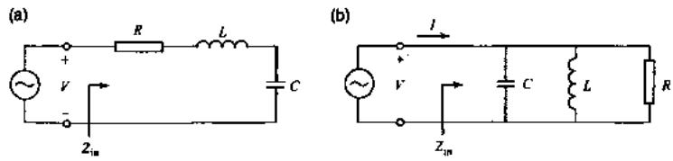  
图 3.1 （a)串联 RLC 电路。（b）并联 RLC 电路。

1. 串联 RLC 电路

图3.1（a）所示为一个串联的RLC电路，可以写出的它的输入阻抗为，

$$
Z _ { \mathrm { i n } } = R + i \omega L + \frac { 1 } { i \omega C } ,\tag{3.1}
$$

当电路的电场能量与磁场能量相等时，电路发生谐振，可以写出电路的谐振频率$\omega _ { 0 }$ 为

$$
\omega _ { 0 } = { \frac { 1 } { \sqrt { L C } } } ,\tag{3.2}
$$

根据谐振腔 $\pmb { Q }$ 值的定义，对于一个串联电路，其 $\pmb { Q }$ 值满足，

$$
Q = \frac { \omega _ { 0 } \mathcal { L } } { R } = \frac { 1 } { \omega _ { 0 } R C } .\tag{3.3}
$$

于是可以将电路的输入阻抗重新写为

$$
\begin{array} { r l r } & { } & { Z _ { \mathrm { i n } } = R + i \omega L \left( 1 - \frac { 1 } { \omega ^ { 2 } L C } \right) } \\ & { } & { = R + i \omega L \left( \frac { \omega ^ { 2 } - \omega _ { 0 } ^ { 2 } } { \omega ^ { 2 } } \right) , } \end{array}\tag{3.4}
$$

考虑在谐振点附近时， $\omega = \omega _ { 0 } + \Delta \omega$ ，上式可以近似写为

$$
Z _ { \mathrm { i n } } \simeq R + 2 i L \Delta \omega ,\tag{3.5}
$$

对于一个无损电路， $\pmb { R = 0 }$ ，上式变为

$$
Z _ { \mathrm { i n } } \simeq 2 i L A \omega ,\tag{3.6}
$$

注意到此时输入阻抗为纯感抗，且在谐振点时，阻抗等于 $\mathfrak { 0 }$

2. 并联 RLC 电路

图3.1（b）所示为一个并联的RLC电路，可以写出的它的输入阻抗为

$$
Z _ { \mathrm { i } n } = \left( \frac { 1 } { R } + \frac { 1 } { i \omega L } + i \omega C \right) ^ { - 1 } ,\tag{3.7}
$$

同样的，电路的谐振频率满足

$$
\omega _ { 0 } = { \frac { 1 } { \sqrt { L C } } } ,\tag{3.8}
$$

而对于并联电路，谐振腔 $\pmb { Q }$ 值满足

$$
Q = \frac { R } { \omega _ { 0 } L } = \omega _ { 0 } R C .\tag{3.9}
$$

于是可以将电路的输入阻抗重新写为

$$
\begin{array} { r } { Z _ { \mathrm { i n } } = \left( \frac { i \omega L + R - \omega ^ { 2 } L C R } { i \omega L R } \right) ^ { - 1 } } \\ { = \frac { R } { 1 + i \omega R C \left( 1 - \omega _ { 0 } ^ { 2 } / \omega ^ { 2 } \right) } , } \end{array}\tag{3.10}
$$

考虑在谐振点附近时， $\omega = \omega _ { 0 } + \Delta \omega$ ，上式可以近似写为

$$
Z _ { \mathrm { i n } } \simeq \frac { R } { 1 + 2 i R C \Delta \omega } ,\tag{3.11}
$$

对于一个无损电路， $\pmb { R } = \infty$ ，上式变为

$$
Z _ { \mathrm { i n } } \simeq \frac { 1 } { 2 i C \Delta \omega } ,\tag{3.12}
$$

注意到此时输入阻抗为纯容抗，且在谐振点时，阻抗无穷大，相当于开路。

## 3.1.2 开路与短路 λ/4 共面波导传输线

上文对集总电路模型中常见的串并联RLC电路进行了分析，然而电路量子电动力学中所用到的微波谐振电路往往是分布式的—其中最常用的是共面波导结构[18]，虽然不能直接用集总模型来分析分布式电路，但是根据微波工程理论，可以很容易发现具有特定长度特定边界条件的共面波导结构和串并联谐振电路之间有着一一对应的关系。考虑到后文分析Purcel效应时只考虑电路与外界耦合引起的额外损耗，因此下面的分析为了简单起见，暂时不考虑电路的内部损耗，只分析无损电路情况。

## 1. 开路 λ/4 共面波导传输线

对于一段末端开路长度为/4的无损共面波导传输线，它的输入阻抗可以写为[17]

$$
Z _ { \mathrm { i n } } = \frac { Z _ { 0 } } { i \tan \beta l }\tag{3.13}
$$

其中 $\scriptstyle z _ { 0 }$ 表示传输线的特征阻抗， $\beta = \omega / c$ 表示传播常数， $l = \lambda / 4 = \pi c / 2 \omega _ { 0 }$ , c表示光速。

考虑在谐振点附近时， $\omega = \omega _ { 0 } + \Delta \omega$ ，上式可以近似写为

$$
\begin{array} { c } { { Z _ { \mathrm { i n } } = \displaystyle \frac { Z _ { 0 } } { i \tan { \left( \frac { \pi } { 2 } \left( 1 + \frac { \Delta \omega } { \omega _ { 0 } } \right) \right) } } } } \\ { { = i Z _ { 0 } \tan { \left( \pi A \omega / 2 \omega _ { 0 } \right) } } } \\ { { \simeq i Z _ { 0 } \pi A \omega / 2 \omega _ { 0 } . } } \end{array}\tag{3.14}
$$

可以发现，上式和串联RLC电路的输入阻抗公式（3.6）具有完全相同的形式因此，在谐振附近，可以用一个串联电路来等效表示开路λ/4谐振腔。对应的等效电路参数分别为

$$
\begin{array} { r } { L = \frac { Z _ { 0 } \pi } { 4 \omega _ { 0 } } } \\ { C = \frac { 1 } { \omega _ { 0 } ^ { 2 } L } . } \end{array}\tag{3.15}
$$

## 2. 短路 λ/4 共面波导传输线

对于一段末端接地长度为/4的无损共面波导传输线，它的输入阻抗可以写为[17]

$$
Z _ { \mathrm { i n } } = i Z _ { 0 } \tan \beta i\tag{3.16}
$$

考虑在谐振点附近时， $\omega = \omega _ { 0 } + \Delta \omega$ ，上式可以近似写为

$$
\begin{array} { l } { { \displaystyle Z _ { \mathrm { i n } } = i Z _ { 0 } \tan \left( \frac { \pi } { 2 } \left( 1 + \frac { { \varDelta } \omega } { \omega _ { 0 } } \right) \right) } } \\ { ~ = \frac { Z _ { 0 } } { i \tan \left( \pi { \varDelta } \omega / { 2 \omega _ { 0 } } \right) } } \\ { ~ \simeq \frac { Z _ { 0 } } { i \pi { \varDelta } \omega / { 2 \omega _ { 0 } } } . } \end{array}\tag{3.17}
$$

可以发现，上式和并联RLC电路的输入阻抗公式（3.12）具有完全相同的形式，因此，在谐振点附近，可以用一个并联电路来等效表示短路λ/4谐振腔。对应的等效电路参数分别为

$$
\begin{array} { l } { C = \frac { \pi } { 4 \omega _ { 0 } Z _ { 0 } } } \\ { L = \frac { 1 } { \omega _ { 0 } ^ { 2 } C } . } \end{array}\tag{3.18}
$$

事实上，一段末端短路的λ/2传输线也可以等效为一个并联RLC谐振电路，而一段末端开路的λ/2传输线则可以等效为一个串联RLC电路，等效电路分析方法同上，这里不再赘述。

## 3.1.3 读取谐振腔的外部耗散率

在超导量子电路中，由于读取部分电路需要考虑到可以方便使用频分复用技术同时读取多个比特，因此读取谐振腔的等效电路一般考虑选择并联RLC电路，由此可以选择一个短路λ/4传输线或者开路N2传输线来构成读取谐振腔。不过由于前者的长度是后者的一半，可以减少谐振腔的电路面积占用比，因此，我们更多的选用短路λ/4谐振腔。

由于需要通过读取谐振腔来探测比特的状态，因此需要谐振腔与外部电路进行耦合，此时外部耦合电路相当于谐振腔的负载。

图3.2所示是常见的两种耦合方式。下面将分别计算两种情形下谐振腔的外部耗散率 $\kappa _ { r } = \omega _ { r } / Q _ { C }$ $\pmb { Q } _ { C }$ 为电路的耦合 $\pmb { Q }$ 值。

对于图3.2（a）所示的与环境直接耦合情况，根据公式（3.9）可以直接写出电路的耦合 $\pmb { Q }$ 值

$$
Q _ { C } = \omega _ { r } R _ { L } C _ { r } = R _ { L } / Z _ { r } ,\tag{3.19}
$$

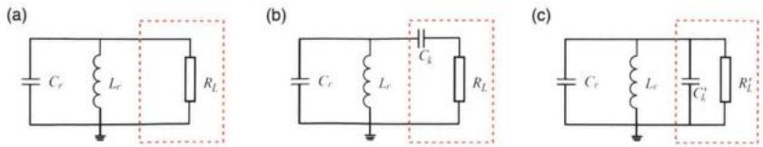  
图3.2 (a)并联式谐振电路与环境直接耦合。(b)并联式谐振电路与环境通过电容耦合。(c)图（b）的等效电路。红色虚线框表示耦合电路部分， $R _ { L }$ 为环境阻抗， $C _ { k }$ 为耦合电容。

其中 $Z _ { r } = \sqrt { L _ { r } / C _ { r } } = 1 / \omega _ { r } C$ 表示谐振腔的特征阻抗，对于读取谐振腔， $Z _ { r }$ 一般为50Ω，而环境阻抗一般也为50Ω，此时 $Q _ { C } = 1 , \kappa _ { r } = \omega _ { r }$ ，此时在超导量子电路中难以达到色散强耦合，因此这种耦合方式在实际电路中不会被采用。

取而代之的是电容耦合方式，如图3.2（b）所示。可以写出该电路的导纳为

$$
Y = i \omega C _ { r } + \frac { 1 } { i \omega L _ { r } } + \frac { 1 } { 1 / i \omega C _ { k } + R _ { L } } ,\tag{3.20}
$$

上式中最后一项可以重新整理为

$$
\begin{array} { r l r } {  { \frac { 1 } { 1 / i \omega C _ { k } + R _ { L } } = \frac { i \omega C _ { k } } { 1 + i \omega C _ { k } R _ { L } } } } \\ & { } & { = \frac { i \omega C _ { k } } { 1 + \omega ^ { 2 } C _ { k } ^ { 2 } R _ { L } ^ { 2 } } + \frac { \omega ^ { 2 } C _ { k } ^ { 2 } R _ { L } } { 1 + \omega ^ { 2 } C _ { k } ^ { 2 } R _ { L } ^ { 2 } } } \\ & { } & { = i \omega C _ { k } ^ { \prime } + 1 / R _ { L } ^ { \prime } . } \end{array}\tag{3.21}
$$

这意味着图3.2（b）所示电路可以等效为图3.2（c）所示电路，其中在 $\omega _ { r }$ 处的等效电路参数为

$$
\begin{array} { r l } & { C _ { k } ^ { \prime } = \cfrac { C _ { k } } { 1 + \omega _ { r } ^ { 2 } C _ { k } ^ { 2 } R _ { L } ^ { 2 } } } \\ & { R _ { L } ^ { \prime } = \cfrac { 1 + \omega _ { r } ^ { 2 } C _ { k } ^ { 2 } R _ { L } ^ { 2 } } { \omega _ { r } ^ { 2 } C _ { k } ^ { 2 } R _ { L } } . } \end{array}\tag{3.22}
$$

此时谐振腔的谐振频率 $\omega _ { r } ^ { \prime } = 1 / \sqrt { L _ { r } \left( C _ { r } + C _ { k } ^ { \prime } \right) }$ ，而谐振腔的耦合Q值 $\scriptstyle Q _ { C } =$ $\omega _ { r } ^ { \prime } R _ { L } ^ { \prime } \left( C _ { r } + C _ { k } ^ { \prime } \right)$ 0

对于一般的电路参数， $C _ { k } \simeq 1 0 \mathrm { f F } .$ 谐振腔的特征阻抗为50Ω，电容 $C _ { r } \simeq$ 500fF，公式（3.22）可以进一步简化为

$$
\begin{array} { l } { { C _ { k } ^ { \prime } \simeq C _ { k } \ll C _ { r } } } \\ { { R _ { L } ^ { \prime } \simeq \displaystyle \frac { 1 } { \omega _ { r } ^ { 2 } C _ { k } ^ { 2 } R _ { L } } . } } \end{array}\tag{3.23}
$$

此时谐振腔的耦合Q值也可以进一步简化为

$$
Q _ { C } \simeq \frac { C _ { r } } { \omega _ { r } C _ { k } ^ { 2 } R _ { L } } = \frac { 1 } { \omega _ { r } ^ { 2 } C _ { k } ^ { 2 } R _ { L } Z _ { r } } .\tag{3.24}
$$

则谐振腔的外部耗散率 $\kappa$ 为

$$
\kappa _ { r } = \omega _ { r } ^ { 3 } C _ { k } ^ { 2 } R _ { L } Z _ { r } .\tag{3.25}
$$

上式就是我们在设计读取谐振腔外部耗散率所参考的理论公式，例如，谐振频率在7GHz时，10fF的耦合电容对应的耗散率约为3.4MHz，可以满足一般的实验需求。一般而言，谐振频率和特征阻抗以及环境阻抗保持不变，通过改变耦合电容的大小来调整外部耗散率。

实际情况环境阻抗可能会有更复杂的形式，但是都可以依照图3.2（a）和（b）代表的等效电路方法来分析。

## 3.2 Purcell耗散率的计算与滤波器的设计原理

本节将介绍Purcell效应引起的耗散率，进而分析Purcell滤波器的设计原理以及它对Purcell效应的抑制作用。

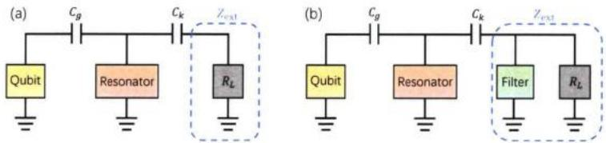  
图 3.3 （a） 传统的不带滤波器的 CQED 等效电路图。（b） 带有 Purcell 滤波器的 CQED等效电路图。两者的差别由蓝色虚线框内的外部阻抗 $E _ { \mathrm { e x t } }$ 表示。

## 3.2.1 Purcell效应的原理与Purcell耗散率的计算方法

我们在第二章中讲到，当量子比特与谐振腔处于色散耦合区域时，系统的哈密顿量可以用JC哈密顿量来描述，该哈密顿量可以使用缀饰态双重态完全对角化，对应到单激发子子空间，当比特处于激发态时，系统的本征态为

$$
\overline { { | 0 , e \rangle } } \simeq - \frac { g } { \Delta } \left| 1 , g \right. + | 0 , e \rangle\tag{3.26}
$$

可以看到，在缀饰态本征空间中，谐振腔会有很小的激发率，而谐振腔的光子可以通过与外界的耦合弛豫到 $| 0 , g \rangle$ 态从而引起比特的弛豫。这种效应即被称为Purcell效应，这一效应引起比特额外的弛豫速率也被称为Purcell耗散率[8-9]

$$
\gamma ^ { \mathrm { P u r c e l l } } = \kappa _ { r } | \left. 0 , g \right| \hat { a } | \overline { { | 0 , e \rangle } } | ^ { 2 } \simeq \kappa _ { r } \frac { g ^ { 2 } } { { \varDelta } ^ { 2 } } .\tag{3.27}
$$

因此原则上，可以通过减小谐振腔的耗散率κ，来减小Purcell效应的影响，不过 $\kappa _ { r }$ $\kappa _ { r }$ 决定了谐振腔的响应时间，所以减小 $\kappa _ { r }$ 将导致所需要的色散读取时间的增加。

类似的减小量子比特与谐振腔的耦合强度或者增大它们之间的失谐，则会减小色散频移量，根据第二章的结论，这同样将会导致色散读取时间的增加。因此需要找到一种方法既可以抑制量子比特通过谐振腔的耗散率同时又不影响色散读取，Purcell滤波器正是为了实现这一目的而存在。

根据耗散理论，可以把量子比特通过外部电路的弛豫率写成更一般的形式[12,19]

$$
\gamma ^ { \mathrm { P u r c e l l } } = 2 \pi \frac { \mathrm { R e } \left[ Y _ { q } ( \omega _ { q } ) \right] } { C _ { q } } ,\tag{3.28}
$$

其中 $C _ { q }$ 表示量子比特的自电容， $Y _ { q }$ 表示量子比特到环境的导纳。因此可以借助微波工程理论来改变 $\mathbf { Y } _ { q }$ 实现对量子比特的保护。

图 3.3 画出了传统 CQED 以及增加 Purcell 滤波器之后的等效电路图，文献[9通过网络阻抗分析方法，计算出了公式（3.28）的具体形式

$$
\gamma ^ { \mathrm { P w c e l l } } \simeq \kappa _ { r } \frac { g ^ { 2 } } { { \varDelta } ^ { 2 } } \frac { \mathrm { R e } \left[ Z _ { \mathrm { e x t } } ( \omega _ { q } ) \right] } { \mathrm { R e } \left[ Z _ { \mathrm { e x t } } ( \omega _ { r } ) \right] } ,\tag{3.29}
$$

上式近似条件为 $g , \kappa _ { r } \ll | \Delta | \ll \omega _ { q , r }$ 。对于传统的 CQED 电路， ${ \sf R e } \left\{ Z _ { \mathrm { e x t } } ( \omega _ { q } ) \right\} =$ $\mathbb { R e } \left[ { Z } _ { \mathrm { e x t } } ( \omega _ { r } ) \right] = R _ { L }$ ，此时上式退回到公式（3.27）。

## 3.2.2 Purcell 滤波器的设计分析

## 1. 滤波器的抑制比

根据公式（3.29)，可以选择合适的滤波器来实现对Purcel1耗散率的抑制。前文讲到的末端开路λ/4传输线就可以用来实现这一目的。

当图3.3(b)中所示滤波器为一段末端开路的λ/4传输线时，根据公式(3.14)，滤波器的输入阻抗为

$$
Z _ { \mathrm { i n } } ( \omega ) = i Z _ { F } \tan \left( \frac { \pi ( \omega - \omega _ { F } ) } { 2 \omega _ { F } } \right) ,\tag{3.30}
$$

其中 $z _ { F }$ 为滤波器传输线的特征阻抗， $\omega _ { F }$ 为滤波器的谐振频率。而外部阻抗 ${ \pmb z } _ { \mathrm { e x t } }$ 为 $Z _ { \mathrm { i n } }$ 与 ${ \pmb R } _ { L }$ 的并联，可以分别写出 $Z _ { \mathrm { e x t } } ( \omega _ { q } )$ 和 $Z _ { \mathrm { e x t } } ( \omega _ { r } )$

$$
\begin{array} { r l r } {  { Z _ { \mathrm { e x t } } ( \omega _ { q , r } ) = i Z _ { F } \tan ( \frac { \pi A _ { q , r } } { 2 \omega _ { F } } ) \| R _ { L } } } \\ & { } & { \approx \frac { i Z _ { 0 } R _ { L } \varepsilon _ { q , r } } { R _ { L } + i Z _ { F } \varepsilon _ { q , r } } , ~ } \end{array}\tag{3.31}
$$

式中假设了 $A _ { q , r } = \omega _ { q , r } - \omega _ { F } \ll \omega _ { F } , \varepsilon _ { q , r } = \pi A _ { q , r } / 2 \omega _ { F } \ll 1$ 。它们的实部为

$$
\mathrm { R e } \left\{ Z _ { \mathrm { e x t } } ( \omega _ { q , r } ) \right\} = \frac { Z _ { F } ^ { 2 } R _ { L } \varepsilon _ { q , r } ^ { 2 } } { Z _ { F } ^ { 2 } \varepsilon _ { q , r } ^ { 2 } + R _ { L } ^ { 2 } } ,\tag{3.32}
$$

于是可以写出 Purcell 滤波器对 Purcell 耗散率的抑制比为

$$
\frac { \mathrm { R e } \left[ Z _ { \mathrm { e x t } } ( \omega _ { r } ) \right] } { \mathrm { R e } \left[ Z _ { \mathrm { e x t } } ( \omega _ { q } ) \right] } \simeq \frac { \varepsilon _ { r } ^ { 2 } } { \varepsilon _ { q } ^ { 2 } } = \frac { \Delta _ { r } ^ { 2 } } { \Delta _ { q } ^ { 2 } }\tag{3.33}
$$

因此设计滤波器的频率和量子比特频率相等时，理论上Purcell效应可以被完全抑制。事实上，当 $\omega _ { F } = \omega _ { q }$ ，由于 $Z _ { \mathrm { i n } } ( \omega _ { q } ) = 0$ ，所以相当于环境阻抗 ${ \pmb R } _ { \pmb L }$ 被短路，比特频率处的光子将完全被反射而不会泄漏到环境中。

## 2. 滤波器的保护带宽

根据滤波器的抑制比，可以定义抑制比为100倍时量子比特受保护的频率范围

$$
\bar { \cal T } _ { 1 0 0 } = \frac { \Delta _ { r } } { 5 } ,\tag{3.34}
$$

对于一般的典型电路参数， $\omega _ { r } / 2 \pi = 7 ~ \mathrm { G H z }$ $\omega _ { F } / 2 \pi = 5 \ : { \tt G H z }$ ，则抑制比为100倍的有效带宽为400 MHz，这对于可调耦合的超导量子芯片架构[20-28]而言带宽足够。

我们也可以计算滤波器自身的带宽，由于末端开路的λ/4传输线可以等效为串联 RLC 电路，它与环境耦合 $\pmb { Q }$ 可以利用公式（3.3）计算

$$
Q _ { F } = { \frac { 1 } { \omega _ { F } R _ { L } C _ { F } } } = { \frac { Z _ { F } } { R _ { L } } } ,\tag{3.35}
$$

因此可以通过减小滤波器的特征阻抗从而减小 $\pmb { Q }$ 值，增大带宽。对于共面波导传输线而言，也就是增大线宽比。

此外也可以通过并联多个这样的滤波器来增大保护带宽。

## 3. 滤波器对读取谐振腔的影响

理想情况下，当 $\mathbf { } _ { \pmb { r } } \sim \mathbf { \omega } _ { \pmb { F } }$ ，此时滤波器的输入阻抗在读取谐振腔腔频处阻抗趋于无穷大，相当于开路，因此滤波器对谐振腔不产生影响。

另一个特殊情况， $\begin{array} { r } { \frac { \Delta _ { r } } { \omega _ { F } } \ll 1 } \end{array}$ ，此时在 ${ \pmb { \omega } } _ { \pmb { r } }$ 附近可以把滤波器的输入阻抗写成

$$
Z _ { \mathrm { i n } } ( \omega _ { r } ) \approx i Z _ { 0 } \pi A _ { r } / 2 \omega _ { F } = i \omega _ { r } L _ { F }\tag{3.36}
$$

最后一个等式中，我们用一个等效电感 $\pmb { L } _ { \pmb { F } }$ 来代替滤波器对读取谐振腔的负载作用，如图3.4（a）所示。可以画出读取谐振腔与外部耦合电路的等效并联RLC电路图，如图3.4（b）所示。类似在3.1.3小节中的分析，这里直接写出结果

$$
\begin{array} { r l } & { C _ { k } ^ { F } \approx C _ { k } } \\ & { R _ { L } ^ { F } \approx R _ { L } ^ { \prime } \left( \frac { R _ { L } } { Z _ { F } } \right) ^ { 2 } \left( \frac { 2 \omega _ { F } } { \pi A _ { F } } \right) ^ { 2 } } \end{array}\tag{3.37}
$$

式中 $\pmb { R } _ { \pmb { L } } ^ { \prime }$ 由公式（3.22）给出，表示没有滤波器时传统CQED情形下谐振腔的等效外部负载。在计算得到上式的过程中使用了额外的近似条件 $\frac { c _ { r } } { c _ { \star } } \frac { \omega _ { E } } { \varDelta _ { P } } \gg 1$ ，对于

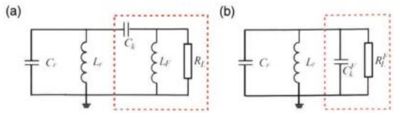  
图3.4 （a）使用等效电感替代Purcell滤波器之后的读取谐振腔等效电路图。（b）图（a）的等效并联 RLC 电路。

一般的电路参数，这个近似是一个可以满足的条件。于是读取谐振腔的等效耦合Q 值可以写为

$$
Q _ { \mathrm { e f f } } = Q _ { C } \left( \frac { R _ { L } } { Z _ { F } } \right) ^ { 2 } \left( \frac { 2 \omega _ { F } } { \pi { \varDelta } _ { F } } \right) ^ { 2 } ,\tag{3.38}
$$

而谐振腔的等效耗散率 $\kappa _ { \mathrm { e f f } } = \omega _ { r } / Q _ { \mathrm { e f f } }$ 也可以由上式计算得到。

对于一般的情况，虽然无法直接给出简洁的近似解析解，不过依然可以依照相同的方法利用阻抗等效变换计算出谐振腔的等效耦合Q值以及耗散率。

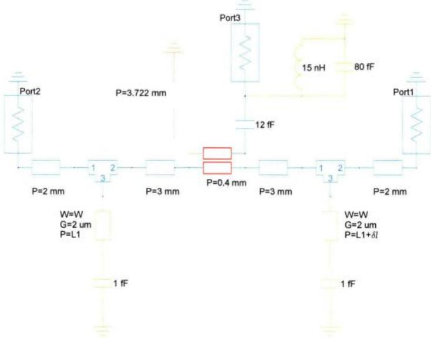  
图3.5 Purcell滤波器的仿真电路图。黄色部分表示量子比特，橙色表示读取谐振腔，红色部分是谐振腔与读取总线的耦合部分，绿色部分表示滤波器。仿真使用的衬底为理想的本征硅，P表示各段传输线的长度，G表示传输线中央导带线距离地平面的距离，对于所有传输线G=2μm，W表示滤波器的中央导带线线宽，对于读取总线以及谐振腔，中央导带线线宽为3.2μm，从而满足50Ω的阻抗匹配条件。

## 3.3 Purcell滤波器的仿真与实验结果

本节将首先讨论我设计的Purcell滤波器的参数分析以及仿真结果，最后介绍实验测到的初步结果。

## 3.3.1 仿真分析

图3.5所示为ANSYS 软件中滤波器的仿真电路图。端口1和2分别代表读取信号的输入与输出端口，端口3表示量子比特节点处的虚拟端口，即量子比特的激发态通过读取电路耗散到环境的输入端口。注意在实际仿真计算电路 $S _ { 2 1 }$ 参数时，需要断开端口3，而在计算仅考虑Purcell耗散率下的量子比特的寿命$T _ { 1 } = 1 / \gamma ^ { \mathrm { P u r c e l l } }$ 时则保留端口3，断开量子比特部分的连接，通过计算 $S _ { 3 3 }$ 提取虚拟端口处的输入阻抗，也即量子比特到环境的输入阻抗，从而可以利用公式(3.28) 计算 $T _ { 1 }$ o

表 3.1仿真电路图的关键设计参数。
<table><tr><td> $\omega _ { r } / 2 \pi$ </td><td> $\omega _ { q } / 2 \pi$ </td><td> $\omega _ { F } / 2 \pi$ </td><td> $C _ { k }$ </td><td> $C _ { g }$ </td></tr><tr><td>(GHz) 7.316</td><td>(GHz) 4.6</td><td>(GHz) 4.65</td><td>(fF) 12.9</td><td>(fF) 12</td></tr></table>

表3.1中列出了仿真电路图中的关键设计参数，其中 $C _ { k }$ 通过仿真以及拟合去掉Purcell滤波器时谐振腔的Q值计算得到，拟合结果为 $Q c \approx 2 2 7 5$ 。谐振腔和滤波器的频率决定了它们的传输线长度。

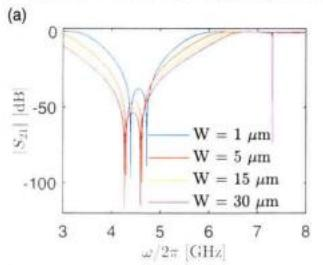

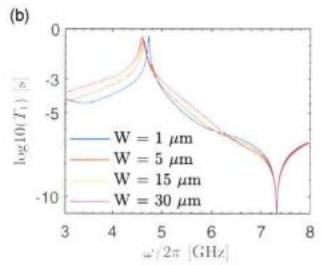

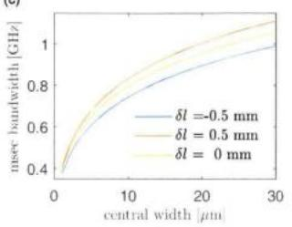

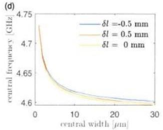  
图 3.6 滤波器的中央导带线线宽 W对结果的影响图。(a)W取不同值时的 $S _ { 2 1 }$ 幅值谱。(b)W取不同值时根据仿真结果计算的量子比特 $T _ { 1 }$ ，其中虚线表示 $T _ { 1 } = 1 ~ \mathbf { m s }$ 。(c) δl 取不同值时分别扫描W得到的毫秒带宽与W的变化关系，纵轴毫秒带宽表示从图（b）中提取的$T _ { 1 } \geqslant 1 \ \mathbf { m s }$ 时的带宽。（d）滤波器中心保护频率与W的变化关系。

首先需要注意的是由于滤波器与读取总线的两个交点处特征阻抗不等于50Ω，因此两个节点之间会产生驻波，另外每个节点到另一个滤波器的末端也会产生驻波，这些驻波在 $S _ { 2 1 }$ 谱上呈现为透射峰，会增强Purcell效应，因此需要避免它们出现在比特频率附近。记两个节点之间的距离为 $L _ { 2 }$ ，通过仿真可以确定当 $5 . 6 \mathrm { m m } < L _ { 2 } < 7 . 6 \mathrm { m m }$ 时，这些透射峰不会出现在3 GHz\~6 GHz之间，因此不会对比特产生额外的影响。考虑到将输入输出两端的滤波器长度设置成不一样，使得两个滤波器的频率稍微错开，可能会增大滤波器的保护带宽，因此在仿真时将两个滤波器传输线的长度差值设置成一个优化变量δl。另外在上一节讲到滤波器自身的带宽取决于它的特征阻抗，而它的特征阻抗取决于共面波导传输线的线宽比，因此将滤波器的中央导带线线宽也设置成优化变量W。

图3.6所示为滤波器的中央导带线线宽W对结果的影响。从图3.6（a）和(b)中可以看到无论是 $S _ { 2 1 }$ 幅值谱上滤波器的有效带宽还是 $T _ { 1 }$ 谱上滤波器的保护带宽，都随着W的增大而明显增大，与理论预期结果相符。同时，滤波器自身的频率以及中心保护频率随着W的增大而减小。图3.6（c）和（d）中详细展示了这两种变化关系。可以看到当 $\mathrm { W } = 2 0 \mu \mathrm { m }$ 9 $\delta l = 0 . 5 \mathrm { m m }$ 时，滤波器的毫秒保护带宽可以达到1GHz，足以覆盖可调比特的频率工作范围。

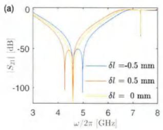

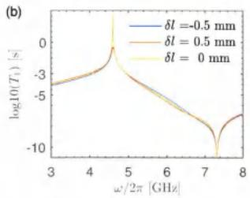

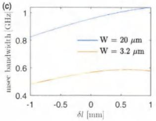

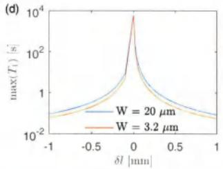  
图3.7 两个 λ/4 滤波器的长度差值δl 对结果的影响图。(a)δl 取不同值时的 $S _ { 2 1 }$ 幅值谱。(b)δl取不同值时根据仿真结果计算的量子比特 $T _ { 1 } ,$ 其中虚线表示 $T _ { 1 } = 1 ~ \mathbf { m s } .$ (c) W取不同值时分别扫描δl得到的毫秒带宽与δl的变化关系。(d）滤波器中心保护频率出的 $T _ { 1 }$ 与 δl 的变化关系。

类似的，图3.7所示为两个λ/4滤波器的长度差值δl对结果的影响。由于δl直接决定了输出端滤波器的频率，当δl从1mm向-1mm变化时，该滤波器的频率的频率逐渐向谐振腔靠拢，虽然毫秒保护带宽有变小的趋势，不过对带宽的影响不像W那么显著，而且损失的主要是量子比特频率低频段的保护。另外随着|δl变大， $T _ { 1 }$ 的峰值显著下降，因此在设计芯片时，可以考虑将δl设为0，既不会对保护带宽有太大的影响，同时可以增大 $T _ { 1 }$ 的上限。

这里也分析了Purcell滤波器的存在对读取谐振腔有效外部耦合Q值 $Q _ { \mathrm { e f f } }$ 的影响，结果如图3.8所示。由于设计参数不满足上一节中提到的两种特殊情况，因此解析解是通过计算等效电路变换后得到的结果。可以看出解析结果和仿真结果符合得比较好，在当前参数条件下，随着滤波器中央导带线线宽的增加， $Q _ { \mathrm { e f f } }$ 逐渐减小。极限情况，W=0， $Q _ { \mathrm { e f f } } = Q _ { C }$ ，此时也意味着滤波器不存在。

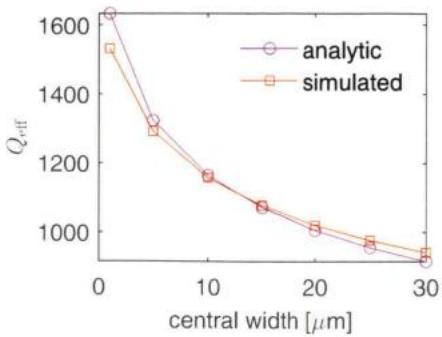  
图 3.8 Purcell 滤波器对读取谐振腔的有效外部耦合 Q 值 $Q _ { \mathrm { e f f } }$ 的影响。

## 3.3.2 实验结果

根据仿真结果，我将Purcell滤波器的设计应用到我们的芯片上，图3.9（a）所示为我设计的Purcell滤波器耦合5个读取谐振腔的样品版图。其中绿色部分表示开路λ/4滤波器。

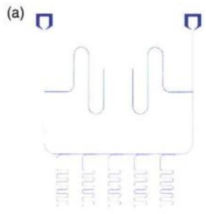

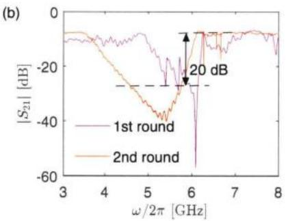  
图3.9 （a)Purcell滤波器样品设计版图，绿色部分表示开路λ/4 滤波器。（b）低温测量结果，黑色箭头代表比特频率范围处与谐振腔频率范围处的隔离度，20dB隔离度的带宽超过1 GHz 以上。

第一轮测试的时候发现测到的 $\vert S _ { 2 1 } \vert$ 谱比较乱，如图3.9（b）中的紫色线所示，经过分析，认为可能的原因是开路λ/4滤波器与读取总线相交处电流较大，磁场能量密度较高，容易在地平面上造成局域的环流导致信号串扰。因此在第二轮测试时，在芯片该处附近的地平面上做了密集的跨结构引线键合（wire-bonding)，从而减少信号环流导致的串扰，测试结果如图3.9（b）中的红色线所示，可以看到此时结果较为理想，比特频率范围处与谐振腔频率范围处的隔离度大于20dB的带宽超过1GHz，与仿真的结果较为接近。

## 3.3.3 设计改进

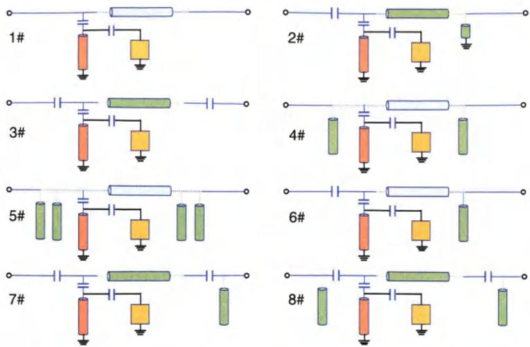  
图 3.10 8 种不同设计的 Purcell 滤波器等效电路图，其中 1# 没有 Purcell 滤波器。图中橙色代表读取谐振腔，黄色代表量子比特，绿色代表Purcell滤波器。

现有的Purcell滤波器大都是属于带通滤波器类型[13-14,16,29]，如图3.10中所示的2#[13]与3#[29]设计，他们的特点是对比特频率保护的范围更大，不过谐振腔频率附近的通带带宽有限，一般为200MHz左右，因此能够同时耦合的读取谐振腔数目有限。而我设计的滤波器属于带阻类型，对比特频率的保护范围相对更小，不过谐振腔的通带范围足够大，另外，由于比特频率所需要的调节范围有限——对于固定耦合样品，频率调节范围在1GHz以内，对于可调耦合样品，频率调节范围只需要几百兆赫兹，我所设计的带阻滤波器在阻带范围内的Purcell耗散率要远小于文献中的带通滤波器。另外注意到，由于文献中的带通滤波器至少会在输入端添加一个输入电容 $C _ { \mathrm { i n } }$ ，这样会带来一个额外的好处，即从谐振腔中泄露出来的信号只有极少一部分通过输入电容回到输入端，绝大部分信号都会直接从输出端出去。从输出端流出的这部分信号能量的比例为 $\left( 1 + | \boldsymbol { { \cal T } } | ^ { 2 } \right) / 2$ ，其中 ${ \varGamma ( \omega ) = 1 / \left( 1 + 2 i \omega Z _ { 0 } C _ { \mathrm { i n } } \right) }$ 为电容的反射系数，对于 $C _ { \mathrm { i n } } = 1 0 \ : \mathrm { f F } , \ : \omega / 2 \pi = 7 \ : \mathrm { G H z }$ 该比值为99.9%。而传统的CQED读取电路以及我自己设计的带阻滤波器，由于输入输出结构对称，从谐振腔出来的信号各有一半流向输入端和输出端，而流向输入端的信号并不能被外部读取电路所采集到，因此会降低测量的量子效率。

综合上述分析，结合我设计的滤波器的优势以及文献中滤波器的优势，我提出了几种新的改进设计。图3.10总结了几种不同的设计的等效电路图。其中1#为传统的 CQED 电路图，其他几种设计都是在1#的基础上引入了Purcell滤波器，2# 中的 Purcell 滤波器为短路 λ/4 带通滤波器，3# 中的滤波器为 λ/2 带通滤波器，4#中的 Purcell滤波器为我上文设计开路 λ/4带阻滤波器，5#在4#的基础上多增加两个滤波器，6#是在2#的基础上将短路λ/4带通滤波器改成开路λ/4带阻滤波器，7#和8#是在3#的基础上依次在输出端与输入端额外增加开路λ/4带阻滤波器。

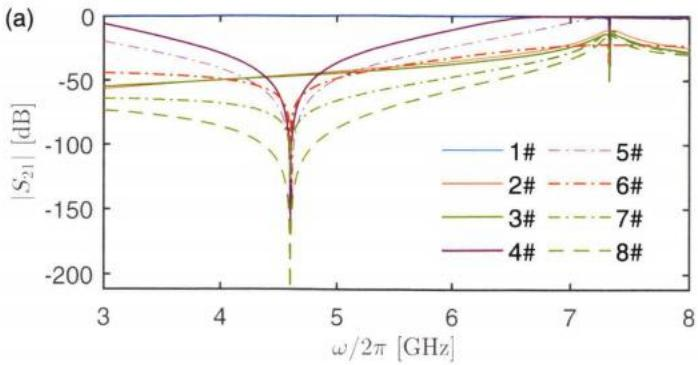

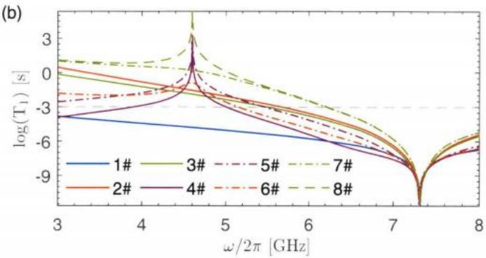  
图 3.11 几种不同 Purcell滤波器的设计仿真结果的对比。（a）输入输出 $\vert S _ { 2 1 } \vert$ 幅值谱。(b)根据 Purcell 耗散率计算的 $T _ { 1 }$ 上限随比特频率的变化关系。

我通过仿真计算了上述8中不同设计的 $S _ { 2 1 }$ 以及 Purcell 耗散率，结果如图3.11所示。可以发现，文献中的带通滤波器2#和3#在整个低频处都有较好的保护效果，不过由于输入电容的存在，输入信号大部分被反射，因此 $S _ { 2 1 }$ 幅值谱上呈现较大的插损，实际测量时需要提高输入信号功率以弥补这部分反射的损耗。而我设计的带阻滤波器则在阻带范围内的 $T _ { 1 }$ 上限更高，且在谐振腔频率附近几乎没有反射。5#在4#的基础上增加两个滤波器可以有效增大保护带宽以及 $T _ { 1 }$ 的上限。6#通过在输入端添加一个电容增大测量的量子效率，保护效果也能和前两种设计相当。而7#和8#理论上结合了上述所有的优势，在带通滤波器的基础上增加带阻滤波器，使得对量子比特 $T _ { 1 }$ 的保护效果大大提升，以1ms为界线，量子比特的频率最高可以达到6GHz以上，意味着色散频移量相比前几种设计可以更大，可以实现更快更高保真度的量子比特读取。

表3.2 图 3.11 仿真结采对应的设计参数。量子比特与谐振腔的耦合电容为12fF，当比特频率为 5 GHz 时，可以计算得到其与谐振腔的耦合强度约为 194 MHz。
<table><tr><td>编号</td><td> $_ { \infty , / 2 \pi }$  (GHz)</td><td> $\pmb { Q } _ { \mathtt { e f f } }$ </td><td> $\kappa _ { e f f } / 2 \pi$  (MHz)</td><td> $c _ { m }$  (fF)</td><td> $c _ { \infty }$  (fF)</td></tr><tr><td>1#</td><td>7.335</td><td>1877</td><td>3.9</td><td></td><td rowspan="4">100</td></tr><tr><td>2#</td><td>7.333</td><td>1280</td><td>5.7</td><td>10</td></tr><tr><td>3#</td><td>7.336</td><td>953</td><td>7.7</td><td>10</td></tr><tr><td>4#</td><td>7.328</td><td>1155</td><td>6.3</td><td></td></tr><tr><td>5#</td><td>7.321</td><td>1162</td><td>6.3</td><td></td><td></td></tr><tr><td>6#</td><td>7.321</td><td>1500</td><td>4.9</td><td>10</td><td></td></tr><tr><td>7#</td><td>7.336</td><td>1038</td><td>7.1</td><td>10</td><td>100</td></tr><tr><td>8#</td><td>7.336</td><td>904</td><td>8.1</td><td>10</td><td>100</td></tr></table>

## 3.4 本章小结

本章首先介绍了微波谐振电路的基本分析方法，这些分析方法在Purcell滤波器的设计和分析计算上起到了关键的作用。文中介绍了Purcell效应和Purcell滤波器的工作原理。在这个基础上，我提出了新的滤波器的设计方案，从理论上分析了它的保护效果以及对谐振腔的影响，并通过仿真验证了滤波器的保护效果，同时对滤波器的具体参数进行了详细的仿真和优化，为实际设计样品提供了指导，且最终实验结果和仿真结果符合得较好。最后通过对比分析文献中几种不同设计方案的优劣势，我提出了几种新的改进设计方案，通过仿真验证了改进后方案的优势。

本章工作为我们实现超导量子比特的快速读取奠定了基础，根据第二章的结论，我们的下一个目标便是实现具有量子极限噪声的低温放大器以提高读取的保真度。

## 参考文献

[1] WALLRAFF A, SCHUSTER D I, BLAIS A, et al. Strong coupling of a single photon to a superconducting qubit using circuit quantum electrodynamics[J]. Nature, 2004, 431(7005): 162-167.

[2] SILLANPÅÅ M A, PARK J I, SIMMONDS R W. Coherent quantum state storage and transfer between two phase qubits via a resonant cavity[J]. Nature, 2007, 449(7161): 438–442.

[3] MAJER J, CHOW J, GAMBETTA J, et al. Coupling superconducting qubits via a cavity bus [J]. Nature, 2007, 449(7161): 443–447.

[4] FILIPP S, MAURER P, LEEK P J, et al. Two-qubit state tomography using a joint dispersive readout[J]. Physical Review Letters, 2009, 102(20): 200402.

[5] CHOW J, DICARLO L, GAMBETTA J, et al. Detecting highly entangled states with a joint qubit readout[J]. Physical Review A, 2010, 81(6): 062325.

[6] HOUCK A, SCHREIER J, JOHNSON B, et al. Controlling the spontaneous emission of a superconducting transmon qubit[J]. Physical Review Letters, 2008, 101(8): 080502.

[7] PURCELL E M, TORREY H C, POUND R V. Resonance absorption by nuclear magnetic moments in a solid[J]. Physical Review, 1946, 69(1-2): 37.

[8] SETE E A, MARTINIS J M, KOROTKOV A N. Quantum theory of a bandpass Purcell filter for qubit readout[J]. Physical Review A, 2015, 92(1): 012325.

[9] CLELAND A Y, PECHAL M, STAS P J C. Mechanical Purcell filters for microwave quantum machines[J]. Applied Physics Letters, 2019, 115(26): 263504.

{10] BLAIS A, HUANG R S, WALLRAFF A, et al. Cavity quantum electrodynamics for superconducting electrical circuits: An architecture for quantum computation[J]. Physical Review A, 2004, 69(6): 062320.

[11] BRONN N T, LIU Y, HERTZBERG J B. Broadband filters for abatement of spontaneous emission in circuit quantum electrodynamics[J]. Applied Physics Letters., 2015, 107(17): 172601.

[12] REED M D, JOHNSON B R, HOUCK A A, et al. Fast reset and suppressing spontaneous emission of a superconducting qubit[J]. Applied Physics Letters, 2010, 96(20): 203110.

[13]JEFFREY E, SANK D, MUTUS J, et al. Fast accurate state measurement with superconducting qubits[J]. Physical Review Letters, 2014, 112(19): 190504.

[14] BRONN N T, MAGESAN E, MASLUK N A, et al. Reducing spontaneous emission in circuit quantum electrodynamics by a combined readout/filter technique[J]. IEEE Transactions on Applied Superconductivity, 2015, 25(5): 1-10.

[15] IAKOUPOV I, KOSHINO K. Saturable purcell filter for circuit QED[A]. 2022. arXiv:

2202.07229.

[16] HEINSOO J, ANDERSEN C K, REMM A, et al. Rapid high-fidelity multiplexed readout of superconducting qubits[J]. Physical Review Applied, 2018, 10(3): 034040.

[17] KAUL R. Microwave engineering: volume 8[M]. John Wiley & Sons, Inc., 1989: 1I-13.

[18] GÖPPL M, FRAGNER A, BAUR M, et al. Coplanar waveguide resonators for circuit quantum electrodynamics[J]. Journal of Applied Physics, 2008, 104(11): 113904.

[19]ESTEVE D, DEVORET M H, MARTINIS J M. Effect of an arbitrary dissipative circuit on the quantum energy levels and tunneling of a Josephson junction[J]. Physica} Review B, 1986, 34(1): 158-163.

[20] STEHLIK J, ZAJAC D M, UNDERWOOD D L, et al. Tunable coupling architecture for fixed-frequency transmon superconducting qubits[J]. Physical Review Letters, 2021, 127(8): 1-7.

[21]SUNG Y, DING L, BRAUMÜLLER J, et al. Realization of high-fidelity cz and zz -free iswap gates with a tunable coupler[J]. Physical Review X, 2021, 11(2): 1-28.

[22] YAN F, KRANTZ P, SUNG Y, et al. Tunable coupling scheme for implementing high-fidelity two-qubit gates[J]. Physical Review Applied, 2018, 10(5): 054062

[23] XU Y, CHU J, YUAN J, et al. High-fidelity, high-scalability two-qubit gate scheme for superconducting qubits[J]. Physical Review Letters, 2020, 125(24): 240503.

[24]KANDALA A, WEI K X, SRINIVASAN S, et al. Demonstration of a high-fidelity cnot gate for fixed-frequency transmons with engineered suppression[J]. Physical Review Letters, 2021, 127(13): 130501.

[25] KU J, XU X, BRINK M, et al. Suppression of unwanted zz interactions in a hybrid two-qubit system[J]. Physical Review Letters, 2020, 125(20): 200504.

[26] ZHAO P, LAN D, XU P, et al. Suppression of static zz interaction in an all-transmon quantum processor[J]. Physical Review Applied, 2021, 16(2): 1-6.

[27] ZHAO P, XU P, LAN D, et al. Switchable next-nearest-neighbor coupling for controlled twoqubit operations[J]. Physical Review Applied, 2020, 14(6): 064016.

[28] ZHAO P, XU P, LAN D, et al. High-contrast zz interaction using superconducting qubits with opposite-sign anharmonicity[J]. Physical Review Letters, 2020, 125(20): 200503.

[29] LIENHARD B, VEPSaLalNEN A, GOVIA L C, et al. Deep-neural-network discrimination of multiplexed superconducting-qubit states[J]. Physical Review Applied, 2022, 17(1): 014024.

## 第4章 约瑟夫森结参量放大器的设计与实验

我们在第二章提到，为了实现快速高保真度的读取，需要足够高的量子效率η，而量子效率主要由量子比特后级放大器的噪声光子数决定。对于相敏(phasesensistive)参量放大器，它的量子极限噪声可以是0，也即不引入额外的噪声光子[I-2]；而对于保相(phase preserving)参量放大器，其量子极限噪声的光子数为$\mathbf { 0 . 5 ^ { [ 1 - 2 ] } }$ 。当使用这类具有量子极限噪声的参量放大器时，可以认为该测量是量子极限的，对应的量子效率等于1。早在30多年前，就有人提出可以利用超导约瑟夫森结的非线性来实现参量放大，并且原则上可以实现量子极限噪声水平[3-5]。经过这些年对设计和工艺的不断改进，约瑟夫森结参量放大器(JPA:Josephsonparametric amplifier)现在已经取得了实质性的进展，实现了理论上的预言[6-21]。得益于JPA的量子极限噪声水平，基于测量的量子反馈[22-23]和量子纠错[24-26]也已经在实验上得到了原理性的验证。由于JPA的增益带宽一般在几十兆赫兹左右，难以满足多量子比特联合读取的需求，于是有理论和实验分别提出通过阻抗工程技术可以在一定条件下有效增大JPA的带宽[12,15]——达到几百兆赫兹量级，这样的放大器被称为阻抗匹配约瑟夫森结参量放大器（IMPA: impedance matchedparametric amplifier).

本章将主要介绍窄带宽JPA和宽带宽IMPA的一般性原理描述，以及我本人博士期间在这两类放大器的设计和测量上的一些研究成果。

## 4.1 参量放大器的一般性原理

可以用一个受驱动的阻尼非线性振子体系来等效地描述参量放大器[27]，这个体系可以有多个谐振模式，以及多个输入和输出端口。为了简单起见，只考虑其中最简单的一种情形，即单模单端口情形，这个体系可以用一个含时的二次哈密顿量描述，

$$
\hat { \mathcal { H } } = \hbar \omega _ { 0 } \hat { a } ^ { \dagger } \hat { a } + i \hbar \frac { \lambda } { 2 } \left( \hat { a } ^ { 2 } e ^ { 2 i \left( \omega _ { \rho } t + \theta \right) } - \mathbf { h . c . } \right) ,\tag{4.1}
$$

式中第一项描述系统的简谐振动模式，ωn表示该模式的谐振频率；第二项描述 ${ \pmb { \omega } } _ { 0 }$ 系统受到的驱动作用，ω。和 $\omega _ { p }$ $\pmb \theta$ 分别表示驱动频率和相位，λ表示驱动强度。在这个驱动的作用下，系统将会被激发，从而提供能量来完成参量放大过程，因此该驱动一般也被称为泵浦。一般泵浦频率选在系统谐振频率附近，所谓附近指的是二者的差值一般小于系统的响应带宽κ，即 $\begin{array} { r } { | \omega _ { y } - \omega _ { 0 } | \leqslant \kappa . } \end{array}$

## 4.1.1 非简并模式

将公式（4.1）在由 $\hat { R } = e ^ { i \omega _ { p } \hat { a } ^ { \dagger } \hat { a } \pmb { r } }$ 定义的旋转表象中重新表示为

$$
\hat { \mathcal { H } } _ { \mathrm { e f f } } = \hbar \Delta \hat { a } ^ { \dagger } \hat { a } + i \hbar \frac { \lambda } { 2 } \left( \hat { a } ^ { 2 } e ^ { 2 i \theta } - { \bf h . c . } \right) ,\tag{4.2}
$$

其中 $\pmb { \Delta } = \omega _ { 0 } - \omega _ { p }$ 称之为泵浦失谐。

当系统受到与环境的耗散相互作用以及微弱的输入光场 $\hat { \pmb { a } } ^ { \mathrm { i n } }$ 作用时，可以使用量子朗之万方程（QLE: quantum Langevin equation）来描述系统的运动方程[28-30]

$$
\frac { \mathrm { d } \hat { a } } { \mathrm { d } t } \frac { \mathsf { M a r k o v } } { \mathrm { R W A } } \frac { i } { \hbar } [ \hat { \mathcal { H } } _ { \mathrm { e f f } } , \hat { a } ] - \frac { \kappa } { 2 } \hat { a } + \sqrt { \kappa } \hat { a } ^ { \mathrm { i n } } ,\tag{4.3}
$$

上式右边第一项代表孤立系统的海森堡运动方程部分，第二项表示系统与环境的耗散相互作用，最后一项代表输入光场的扰动。等号下的RWA表示旋转波近似，即忽略了等式右边 $\pmb { \hat { a } } ^ { \dagger }$ 项；等号上的Markov表示马尔科夫近似，即考虑系统与环境的耦合强度是常数，即 $\kappa ( \omega ) = \kappa$

将公式（4.2）带入到公式（4.3）中

$$
\begin{array} { r l r } & { \Rightarrow } & { \frac { \mathrm { d } \hat { a } } { \mathrm { d } t } = - i \Delta \hat { a } - \lambda e ^ { - 2 i \theta } \hat { a } ^ { \dag } - \frac { \kappa } { 2 } \hat { a } + \sqrt { \kappa } \hat { a } ^ { \mathrm { i n } } , } \\ & { \Rightarrow } & { \left( \frac { \mathrm { d } } { \mathrm { d } t } + i \Delta + \frac { \kappa } { 2 } \right) \hat { a } ( t ) + \lambda e ^ { - 2 i \theta } \hat { a } ^ { \dag } ( t ) = \sqrt { \kappa } \hat { a } ^ { \mathrm { i n } } ( t ) , } \end{array}\tag{4.4}
$$

使用傅里叶变换将光场算符转换到频域，定义

$$
\begin{array} { r l } & { ~ + \infty } \\ & { ~ \hat { a } ( t ) = \displaystyle \frac { 1 } { \sqrt { 2 \pi } } \displaystyle \int _ { - \infty } e ^ { - i \omega t } \hat { a } ( \omega ) ~ \mathrm { d } \omega , } \\ & { ~ \hat { a } ^ { \dagger } ( t ) = \displaystyle \frac { 1 } { \sqrt { 2 \pi } } \displaystyle \int _ { - \infty } e ^ { - i \omega t } \hat { a } ^ { \dagger } ( \omega ) ~ \mathrm { d } \omega , } \end{array}\tag{4.5}
$$

带入到运动方程中，得到两个线性方程

$$
\begin{array} { l } { { \left( - i \omega + i \Delta + \displaystyle \frac { \kappa } { 2 } \right) \hat { a } ( \omega ) + \lambda e ^ { - 2 i \theta } \hat { a } ^ { \dagger } ( \omega ) = \sqrt { \kappa } \hat { a } ^ { \dagger \boldsymbol { \Pi } } ( \omega ) , } } \\ { { \left( i \omega + i \Delta + \displaystyle \frac { \kappa } { 2 } \right) \hat { a } ( - \omega ) + \lambda e ^ { - 2 i \theta } \hat { a } ^ { \dagger } ( - \omega ) = \sqrt { \kappa } \hat { a } ^ { \dagger \boldsymbol { \Pi } } ( - \omega ) . } } \end{array}\tag{4.6}
$$

注意由于是在旋转表象中，所以ω表示的是信号频率与泵浦频率的失谐，因此对于 $\omega \neq 0 ;$ 算符 $\pmb { \hat { a } } ( \pmb { \omega } )$ 和 $\scriptstyle { \hat { a } } ( - \omega )$ 是对易算符，也即表示的是光场的两个不同自由度，对应的分别是信号模式（signal mode）和闲置模式（idle mode）。为了方便表示这种对易关系，我们对算符添加对应的下角标记号，

$$
\hat { a } ( \omega )  \hat { a } _ { S } ( \omega ) , \hat { a } ( - \omega )  \hat { a } _ { I } ( - \omega ) , \hat { a } ^ { \mathrm { i n } } ( \omega )  \hat { a } _ { S } ^ { \mathrm { i n } } ( \omega ) , \hat { a } ^ { \mathrm { i n } } ( - \omega )  \hat { a } _ { I } ^ { \mathrm { i n } } ( - \omega ) .\tag{4.7}
$$

同时注意到由公式（4.5）可得， $\hat { a } ^ { \dagger } ( - \omega ) = [ \hat { a } ( \omega ) ] ^ { \dagger }$ ，对公式（4.6）中的第二式做共轭转置变换后重新整理可得到

$$
\begin{array} { l } { { \displaystyle \left( - i \omega + i \Delta + \frac { \kappa } { 2 } \right) \hat { a } _ { S } ( \omega ) + \lambda e ^ { - 2 i \theta } [ \hat { a } _ { I } ( - \omega ) ] ^ { \dagger } = \sqrt { \kappa } \hat { a } _ { S } ^ { \mathrm { i n } } ( \omega ) , } } \\ { { \displaystyle \left. \lambda e ^ { 2 i \theta } \hat { a } _ { S } ( \omega ) + \left( - i \omega - i \Delta + \frac { \kappa } { 2 } \right) [ \hat { a } _ { I } ( - \omega ) ] ^ { \dagger } = \sqrt { \kappa } [ \hat { a } _ { I } ^ { \mathrm { i n } } ( - \omega ) ] ^ { \dagger } . \right. } } \end{array}\tag{4.8}
$$

定义腔内光场矢量算符 $\vec { a } ( \omega ) = \left( \hat { a } _ { S } ( \omega ) , [ \hat { a } _ { I } ( - \omega ) ] ^ { \dagger } \right)$ ，同时定义输入光场矢量算符 $\vec { a } ^ { \mathrm { i n } } ( \omega ) = \left( \hat { a } _ { S } ^ { \mathrm { i n } } ( \omega ) , [ \hat { a } _ { I } ^ { \mathrm { i n } } ( - \omega ) ] ^ { \dagger } \right)$ ，于是可以把公式(4.8)写成 $\vec { a } ( \omega ) = \chi ( \omega ) \sqrt { \kappa } \vec { a } ^ { \mathrm { i n } } ( \omega )$ 其中磁化率矩阵 $\chi ( \omega )$ 的逆矩阵为

$$
\chi ^ { - 1 } ( \omega ) = \left[ \begin{array} { c c } { { - i \omega + i A + \frac { \kappa } { 2 } } } & { { \lambda e ^ { - 2 i \theta } } } \\ { { \lambda e ^ { 2 i \theta } } } & { { - i \omega - i A + \frac { \kappa } { 2 } } } \end{array} \right] .\tag{4.9}
$$

根据量子输入输出理论可知[28-29]， $\sqrt { \kappa } \hat { a } = \hat { a } ^ { \mathrm { { o u t } } } + \hat { a } ^ { \mathrm { { i n } } }$ ，据此可以写出信号模式的输出光场为

$$
\hat { a } ^ { \mathrm { { o u t } } } ( \omega ) = g _ { S } \hat { a } _ { S } ^ { \mathrm { { i n } } } ( \omega ) + g _ { I } [ \hat { a } _ { I } ^ { \mathrm { { i n } } } ( - \omega ) ] ^ { \dagger } ,\tag{4.10}
$$

其中

$$
\begin{array} { r l } & { g _ { S } = \kappa \frac { - i \omega - i A + \frac { \kappa } { 2 } } { \left( \frac { \kappa } { 2 } - i \omega \right) ^ { 2 } + A ^ { 2 } - \lambda ^ { 2 } } - 1 , } \\ & { g _ { I } = - \kappa \frac { \lambda e ^ { - 2 i \theta } } { \left( \frac { \kappa } { 2 } - i \omega \right) ^ { 2 } + A ^ { 2 } - \lambda ^ { 2 } } . } \end{array}\tag{4.11}
$$

公式（4.10）是以上推导计算的主要结果，它表明信号模式的输出光场等于信号模式的输入光场与闲置模式输入光场之和，其中的两个增益系数满足关系

$$
G _ { \mathcal { S } } \equiv | g _ { \mathcal { S } } | ^ { 2 } = | g _ { I } | ^ { 2 } + 1 ,\tag{4.12}
$$

其中 ${ \pmb G } _ { S }$ 就表示参量放大器在非简并模式下的信号增益，它的具体表达式为

$$
G _ { S } ( \omega ) = 1 + \frac { \kappa ^ { 2 } \lambda ^ { 2 } } { \left( \frac { \kappa ^ { 2 } } { 4 } - \omega ^ { 2 } - \lambda ^ { 2 } + \varDelta ^ { 2 } \right) ^ { 2 } + \kappa ^ { 2 } \omega ^ { 2 } } ,\tag{4.13}
$$

在 $\omega = 0$ 处取增益最大值

$$
G _ { \mathrm { m a x } } = G _ { S } ( 0 ) = 1 + \frac { 1 6 \kappa ^ { 2 } \lambda ^ { 2 } } { \left( \kappa ^ { 2 } - 4 \left( \lambda ^ { 2 } - A ^ { 2 } \right) \right) ^ { 2 } } ,\tag{4.14}
$$

当 $G _ { \operatorname* { m a x } } \gg 1$ 且 $\pmb { \omega }$ 较小时（忽略公式（4.13）分母中的四阶项），有

$$
G _ { S } ( \omega ) \approx \frac { G _ { \mathrm { m a x } } } { 1 + \left( \omega / { \Gamma _ { \mathrm { B W } } } \right) ^ { 2 } } , \quad { \cal r } _ { \mathrm { B W } } \approx \frac { \kappa } { 2 } \sqrt { \frac { 1 } { G _ { \mathrm { m a x } } } } .\tag{4.15}
$$

## 4.1.2 简并模式

作为一个特殊情况，当泵浦失谐 $\pmb { \mathscr { s } } = \pmb { 0 }$ 时，称放大器工作在简并模式[27]。类似于公式（2.29）我们可以对光场算符做一个变换，将其分解成两个正交分量的形式[27]

$$
\hat { a } _ { \parallel , \perp } ^ { \mathrm { i n , o u t } } ( \omega ) = \hat { a } _ { S } ^ { \mathrm { i n , o u t } } ( \omega ) \pm e ^ { - 2 i \theta } \{ \hat { a } _ { I } ^ { \mathrm { i n , o u t } } ( - \omega ) \} ^ { \dagger } ,\tag{4.16}
$$

上式中的角度 $\pmb \theta$ 和公式（2.29）中的 $\pmb { \phi }$ 具有类似的物理意义，为了计算方便，这里选择了和驱动场相同的相位。根据公式（4.8)，通过简单的代数运算化简，可以得到

$$
\hat { a } _ { \parallel } ^ { \mathrm { o u t } } ( \omega ) = g _ { \parallel } \hat { a } _ { \parallel } ^ { \mathrm { i n } } , \quad \hat { a } _ { \perp } ^ { \mathrm { o u t } } ( \omega ) = g _ { \perp } \hat { a } _ { \perp } ^ { \mathrm { i n } } ,\tag{4.17}
$$

其中

$$
\begin{array} { r } { g _ { \parallel } = \frac { \frac { \kappa ^ { 2 } } { 4 } + \omega ^ { 2 } + \lambda ^ { 2 } - \kappa \lambda } { \frac { \kappa ^ { 2 } } { 4 } - \omega ^ { 2 } - \lambda ^ { 2 } + i \kappa \lambda } , } \\ { g _ { \perp } = \frac { \frac { \kappa ^ { 2 } } { 4 } + \omega ^ { 2 } + \lambda ^ { 2 } + \kappa \lambda } { \frac { \kappa ^ { 2 } } { 4 } - \omega ^ { 2 } - \lambda ^ { 2 } + i \kappa \lambda } , } \end{array}\tag{4.18}
$$

而且光场两个分量各自的增益 $G _ { \parallel , \perp } = \left\{ g _ { \parallel , \perp } \right\} ^ { 2 }$ 满足关系

$$
G _ { \ P } G _ { \bot } = 1 .\tag{4.19}
$$

上式意味着在简并模式下，输入光场其中的一个分量被放大另一个分量则必然会被压缩。当考虑输入光场仅仅是量子真空涨落噪声，工作在简并模式下的放大器就可以对真空噪声的其中一个分量进行压缩，从而使得该分量的量子涨落在标准的量子极限之下，这也就是所谓的单模光场压缩。由于被放大或者压缩的分量取决于驱动场的相位，所以简并放大器也称之为相敏放大器，对应的非简并放大器也称之为保相放大器。

## 4.1.3 量子极限噪声

对于非简并放大器，根据公式（4.10)，当闲置信号没有有效的输入信号，只需要考虑量子真空涨落噪声，可以把公式（4.10）重新写成如下形式

$$
\hat { a } ^ { \mathrm { { o u t } } } = \sqrt { G } \left( \hat { a } ^ { \mathrm { { i n } } } + \sqrt { 1 - \frac { 1 } { G } } \hat { b } ^ { \mathrm { { i n } } } \right) ,\tag{4.20}
$$

上式右边第二项意味着通过闲置信号模式耦合进来的噪声将会合并到被放大的输出信号中。在大增益极限条件下， $\pmb { G } \gg 1$ ，这部分噪声贡献换算到放大器的输入噪声等于半个光子[川]，也即 $N _ { \mathbf { a } } = \mathbf { 0 . 5 }$ 。这半个光子的输入噪声既可以看做是为了保证输入输出光场的对易性质 $\left[ \hat { a } ^ { \mathrm { { o u t } } } , \hat { a } ^ { \mathrm { { o u t } \dagger } } \right] = \left[ \hat { a } ^ { \mathrm { { i n } } } , \hat { a } ^ { \mathrm { { i n } \dagger } } \right] = 1$ 的结果：也可以理解为海森堡不确定原理的要求，因为非简并放大器可以同时放大光场的两个正交分量，这两个正交分量是不对易的，如果不考虑引入额外噪声，那么同时放大必然会违反海森堡不确定性原理。

而对于简并模式放大器，根据公式（4.17）和公式（4.19）的性质，它可以在放大光场的某个分量的同时压缩另一个分量，从而不需要引入任何噪声也不会违反海森堡不确定性原理，所以它的量子极限噪声是0，即 $N _ { \mathrm { a } } = 0$ 。具体证明过程可以参考给出的参考文献[1]。

## 4.2 基于约瑟夫森结的实现原理

上一节给出了参量放大器的一般性原理描述，本节将主要讨论如何利用基于约瑟夫森结的超导电路来实现它，也即如何实现JPA，具体来说就是如何构造公式（4.1）或者公式（4.2)。我主要介绍两种方式，它们的电路结构相似，都是transmon类型的非线性LC电路，不过驱动方式不一样，一种是使用微波电流通过互感的方式作用到SQUID回路，称之为磁通泵浦[10]，另一种是微波电流直接从信号端输入，称之为直接泵浦[8]。

## 4.2.1 磁通泵浦

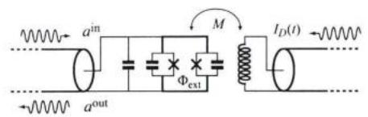

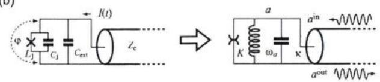  
图4.1 (a)磁通泵浦模式的等效电路图，外部驱动以外磁通的形式通过互感作用到SQUID回路。（b）直接泵浦模式下的等效电路图，K表示线路的非谐。图片引自文献[27]。

JPA工作在磁通泵浦模式下的等效电路结构如图4.1（a）所示，其中SQUID和电容并联构成的非线性LC振子的哈密顿量可以直接写成

$$
\hat { \mathcal { H } } = 4 E _ { C } \hat { n } ^ { 2 } - E _ { J } \cos \hat { \varphi } ,\tag{4.21}
$$

其中 $E _ { J }$ 受到外磁通 $\boldsymbol { \varPhi } _ { \mathrm { e x t } }$ 调制，满足关系 $\begin{array} { r } { E _ { J } ( \phi _ { \mathrm { c x t } } ) = E _ { J \Sigma } \left| \cos \left( \frac { \phi _ { \mathrm { c x t } } } { 2 \phi _ { 0 } } \right) \right| } \end{array}$ ，其中 $E _ { J \Sigma }$ 表示SQUID环路的最大约瑟夫森结能， $E _ { C } = e ^ { 2 } / 2 C$ 表示电路的库伦电荷能。将外磁通驱动可以写成如下形式

$$
\phi _ { \mathrm { e x t } } = \varPhi _ { \mathrm { D C } } + \varPhi _ { \mathrm { A C } } \cos \left( \varOmega _ { p } t + \theta _ { p } \right) ,\tag{4.22}
$$

当满足 $\phi _ { \mathrm { A C } } \ll \phi _ { \mathrm { D C } }$ 时，可以将 ${ \pmb E } _ { J } ( \pmb { \phi } _ { \mathrm { e x t } } )$ 展开到 $\phi _ { \mathrm { { A C } } }$ 的一阶

$$
\begin{array} { c } { { E _ { J } ( \Phi _ { \mathrm { e x t } } ) \approx E _ { J } ( \Phi _ { \mathrm { D C } } ) + \left. \frac { 0 E _ { J } } { \partial \Phi } \right| _ { \Phi = \Phi _ { \mathrm { D C } } } \Phi _ { A C } \cos \left( \Omega _ { p } t + \theta _ { p } \right) } } \\ { { = E _ { J \Sigma } \cos ( \varphi _ { \mathrm { D C } } ) - E _ { J \Sigma } \sin ( \varphi _ { \mathrm { D C } } ) \varphi _ { \mathrm { A C } } \cos \left( \Omega _ { p } t + \theta _ { p } \right) , } } \end{array}\tag{4.23}
$$

上式第二行中定义了 $\begin{array} { r } { \varphi _ { \mathrm { D C } } = \frac { \phi _ { \mathrm { D C } } } { 2 \phi _ { \mathrm { 0 } } } , \varphi _ { \mathrm { A C } } = \frac { \phi _ { \mathrm { A C } } } { 2 \phi _ { \mathrm { 0 } } } } \end{array}$ ，同时只考虑 $0 < \varphi _ { \mathrm { D C } } < \pi / 2$

参照第一章中的电路量子化过程，定义

$$
\hat { \varphi } = \sqrt { \frac { 4 E _ { C } } { \hbar \omega _ { a } } } \left( \hat { a } + \hat { a } ^ { \dagger } \right) , \quad \hat { n } = \frac { i } { 4 } \sqrt { \frac { \hbar \omega _ { a } } { 4 E _ { C } } } \left( \hat { a } ^ { \dagger } - \hat { a } \right) ,\tag{4.24}
$$

其中 $\hbar \omega _ { o } = \sqrt { 8 E _ { J \Sigma } E _ { C } \cos \varphi _ { \mathrm { D C } } }$ 。同时将 $\cos \phi$ 展开到二阶项，经整理后得到

$$
\hat { \mathcal { H } } = \hbar \omega _ { a } \hat { a } ^ { \dagger } \hat { a } + \frac { \hbar \omega _ { a } } { 4 } \varphi _ { \mathrm { A C } } \tan \varphi _ { \mathrm { D C } } \left( \hat { a } ^ { 2 } + \hat { a } ^ { \dagger 2 } + 2 \hat { a } ^ { \dagger } \hat { a } + 1 \right) \cos \left( \Omega _ { p } t + \theta _ { p } \right) ,\tag{4.25}
$$

在旋转表象中对上式做旋转波近似同时去掉算符无关项，得到

$$
\hat { \mathcal { H } } _ { \mathrm { e f f } } = \hbar { \cal A } _ { \mathrm { f } } \hat { a } ^ { \dagger } \hat { a } + i \hbar \frac { \lambda _ { \mathrm { f } } } { 2 } \left( \hat { a } ^ { 2 } e ^ { 2 i \theta _ { \mathrm { f } } } - \hbar . c . \right) ,\tag{4.26}
$$

上式和公式（4.2）具有完全相同的形式，其中

$$
\begin{array} { l } { { \lambda _ { \mathrm { f } } = \displaystyle \frac { 1 } { 4 } \omega _ { a } \varphi _ { \mathrm { A C } } \tan \varphi _ { \mathrm { D C } } , } } \\ { { \ } } \\ { { \Delta _ { \mathrm { f } } = \omega _ { a } - \Omega _ { p } / 2 , } } \\ { { \theta _ { \mathrm { f } } = \theta _ { p } - \pi / 4 , } } \end{array}\tag{4.27}
$$

注意到上式说明磁通泵浦工作模式下等效的泵浦强度直接正比于磁通量的调制幅度；而泵浦频率约等于两倍的谐振子谐振频率，同时在实验室坐标系下，$\omega _ { S } + \omega _ { J } = \Omega _ { p }$ ，也即满足三波混频条件（three-wave mixing)。当然如果选择${ \varphi _ { \mathsf { D C } } } \approx \mathbf { 0 }$ ，也可以将公式（4.23）展开到二阶（此时一阶导可以忽略），有效的泵浦频率将变为 $2 \Omega _ { p }$ ，此时放大器将工作在四波混频（four-wave mixing）模式下，即 $\omega _ { s } + \omega _ { l } = 2 \Omega _ { p }$

## 4.2.2 直接泵浦

JPA工作在直接泵浦模式下的等效电路结构如图4.1（b）所示，一般考虑使用SQUID替代单个约瑟夫森结，从而使得电路的谐振频率可以通过外磁通调控，不过与磁通泵浦工作模式不同的是，泵浦信号是直接从信号端直接输入。可以先将泵浦输入当做输入光场来处理，根据公式（1.48）直接写出该电路的哈密顿量为

$$
\hat { \mathcal { H } } = \hbar \tilde { \omega } _ { a } \hat { a } ^ { \dagger } \hat { a } + \hbar \frac { K } { 2 } \hat { a } ^ { \dagger } \hat { a } ^ { \dagger } \hat { a } \hat { a } ,\tag{4.28}
$$

其中 $K = - E _ { C } / \hbar$ 表示该电路的自科尔系数（也即 transmon哈密顿量中的非谐），电路的谐振频率 $\tilde { \omega } _ { a } = \omega _ { a } + K$

对该系统应用量子朗之万方程—公式（4.3），可得到

$$
\frac { \mathrm { d } \hat { a } } { \mathrm { d } t } = - i \left( \tilde { \omega } _ { a } + K \hat { a } ^ { \dagger } \hat { a } \right) \hat { a } - \frac { \kappa } { 2 } \hat { a } + \sqrt { \kappa } \hat { a } ^ { \mathrm { i n } } ,\tag{4.29}
$$

注意到上式可以理解为一个描述受迫振动的耗散谐振子的运动方程。在稳态条件下，将输入光场写成泵浦驱动光场和由输入信号光场代表的微扰项之和，同时将腔光场写成稳态光场和由输入信号引起的微扰项之和 $^ { [ 2 7 , 3 1 ] }$ ，即

$$
\begin{array} { r l } & { \hat { a } _ { \mathrm { i n } } ( t ) = \left( \alpha _ { \mathrm { i n } } + \delta \hat { a } _ { \mathrm { i n } } ( t ) \right) e ^ { - i \Omega _ { p } t } , } \\ & { \quad \hat { a } ( t ) = \left( \alpha + \delta \hat { a } ( t ) \right) e ^ { - i \Omega _ { p } t } , } \end{array}\tag{4.30}
$$

其中 $\Omega _ { p }$ 表示的是泵浦驱动信号频率。

将上式代入到公式（4.29）中，忽略信号相关的微扰项，可以得到稳态光场幅值 $\pmb { \alpha }$ 满足的方程

$$
- i \Omega _ { p } \alpha = - i \left( \tilde { \omega } _ { a } + K | \alpha | ^ { 2 } \right) \alpha - \frac { \kappa } { 2 } \alpha + \sqrt { \kappa } \alpha ^ { \mathrm { i n } } ,\tag{4.31}
$$

将方程两边同时乘以各自的共轭项，整理后可以得到

$$
\left( \frac { K } { \kappa } \right) ^ { 2 } | \alpha | ^ { 6 } + \frac { 2 A K } { \kappa ^ { 2 } } | \alpha | ^ { 4 } + \left( \frac { A ^ { 2 } } { \kappa ^ { 2 } } + \frac { 1 } { 4 } \right) | \alpha | ^ { 2 } = | \alpha _ { \mathrm { i n } } | ^ { 2 } ,\tag{4.32}
$$

其中 $\Delta = \tilde { \omega } _ { a } - \Omega _ { p }$ 为泵浦失谐。通过定义一些无量纲量，可以将上式化简为

$$
\xi ^ { 2 } n ^ { 3 } + 2 \nu \xi n ^ { 2 } + \left( \nu ^ { 2 } + \frac { 1 } { 4 } \right) n = 1 ,\tag{4.33}
$$

其中

$$
\nu = \frac { A } { \kappa } , \quad \tilde { \alpha } _ { \mathrm { i n } } = \frac { \alpha _ { \mathrm { i n } } } { \sqrt { \kappa } } , \quad \xi = \frac { | \tilde { \alpha } _ { \mathrm { i n } } | ^ { 2 } K } { \kappa } , \quad n = \frac { | \alpha | ^ { 2 } } { | \tilde { \alpha } _ { \mathrm { i n } } | ^ { 2 } } ,\tag{4.34}
$$

v表示约化后的泵浦失谐， $\tilde { \alpha } _ { \mathfrak { i } \mathfrak { n } }$ 表示无量纲的驱动幅值， ${ \pmb \xi }$ 为驱动功率与非线性科尔系数的乘积，n代表约化后的腔内光场光子数（相对于泵浦输入光场）。注意到公式（4.33）的一个重要性质是方程的响应取决于 ${ \pmb \xi }$ ，也即驱动功率与非线性科尔系数的乘积，而不是受二者的独立影响。

由于公式（4.33）对于 $\pmb { n }$ 是一个三次方程，原则上可以求出解析解，不过由于解的形式较为复杂，只需要知道n是ν和 ${ \pmb \xi }$ 的函数就行，所以我通过图4.2画出了它的数值计算结果。当 $\xi = \xi _ { \mathrm { c r i t } } = - \frac { 1 } { 3 \sqrt { 3 } } , \nu = \nu _ { \mathrm { c r i t } } = \sqrt { 3 } / 2$ 时， $\partial n / \partial v$ 和 $\widetilde { \Phi } _ { n / \partial \nu ^ { 2 } }$ 发散，此时，系统的响应对于微小扰动将变得非常敏感。当驱动幅值 $\xi > \xi _ { \mathrm { c r i t } }$ ，公式（4.33）有三个实数解，其中较大和较小的解是稳定的，而中间解不稳定。实际的工作区域一般在 $\nu < \nu _ { \mathrm { c r i t } }$ ，也即工作在稳定解区域范围内[31]。

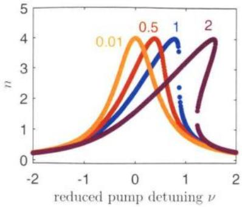  
图4.2 约化后的稳态光子数与约化后的泵浦失谐ν以及实际驱动强度相关的量 $\xi$ 之间的关系。 $\xi / \xi _ { \mathrm { c n t } } = 0 . 0 1 , 0 . 5 , 1 , 2$ 分别对应黄色、红色、蓝色、紫色线。

重新将公式（4.30）代入到公式（4.29）中，并假设作为微扰项的信号光子数远小于驱动光子数和腔场稳态光子数，可以整理得到信号光场满足的方程

$$
\frac { \mathrm { d } \delta \hat { a } } { \mathrm { d } t } = - i \left( \varDelta + 2 K | \alpha | ^ { 2 } \right) \delta \hat { a } - i K \alpha ^ { 2 } \delta \hat { a } ^ { \dagger } - \frac { \kappa } { 2 } \delta \hat { a } + \sqrt { \kappa } \delta \hat { a } _ { \mathrm { i n } } ,\tag{4.35}
$$

对比公式（4.4）可知，上式对应的有效哈密顿量也可以写成与公式（4.2）完全相同的形式

$$
\hat { \mathcal { H } } _ { \mathrm { e f f } } = \hbar \varDelta _ { \mathrm { d } } \hat { a } ^ { \dagger } \hat { a } + i \hbar \frac { \lambda _ { \mathrm { d } } } { 2 } \left( \hat { a } ^ { 2 } e ^ { 2 i \theta _ { \mathrm { d } } } - \mathrm { h . c . } \right) ,\tag{4.36}
$$

其中对应关系为

$$
\begin{array} { r l } & { { \cal A } _ { \mathrm { d } } = { \cal A } - 2 \lambda _ { \mathrm { d } } , } \\ & { \lambda _ { \mathrm { d } } = - K | \alpha | ^ { 2 } , } \\ & { \theta _ { \mathrm { d } } = \angle \left( \frac { | \alpha | } { \alpha } \right) + \frac { \pi } { 4 } . } \end{array}\tag{4.37}
$$

通过公式（4.37）可知，在直接泵浦工作模式下，参量放大满足四波混频条件，也即 $\omega _ { S } + \omega _ { I } = 2 \Omega _ { p }$ ，因此泵浦频率将处在增益带宽的中心，由于泵浦的反射功率远高于信号的功率，为了避免后级放大器的饱和，因此实际工作时需要利用定向耦合器在信号反射端施加一路与反射泵浦信号同幅反相的信号从而使反射泵浦信号被抵消。另外注意到有效的泵浦失谐还会随着有效泵浦强度的增加而增加，这将不利于实验时对于工作参数的调节。

## 4.2.3 饱和信号输入功率

实际工作中，当信号输入功率增大一定程度时，增益将会呈现下降趋势，一般将使增益下降1dB所对应的信号输入功率称之为饱和信号输入功率[31]。对于产生这种现象的原因下面将做一些简单的讨论。

对于磁通泵浦而言，如果考虑系统的自科尔系数，也即将 $\cos { \hat { \varphi } }$ 展开到4阶项，将会发现等效的泵浦失谐量将会多出一项 $- K \langle \hat { a } ^ { \dagger } \hat { a } \rangle$ ，由于 $K < 0$ ，因此等效泵浦失谐将随着信号光子数的增加而增加，根据公式(4.13)，增益将变小。

对于直接泵浦而言，如果考虑信号光子本身的贡献，在推导公式（4.35）时，该公式右边第一项的括号里将多出一项 $K \langle \delta \hat { a } ^ { \dagger } \delta \hat { a } \rangle$ ，在推导公式（4.31）时，公式右边第一项的括号中也会多出一项 $2 K \langle \delta \hat { a } ^ { \dagger } \delta \hat { a } \rangle$ ，它们的实际影响可以等效为随着信号光子数增加，有效泵浦失谐将变小，从而导致增益下降[31]。

从能量的角度考虑，当固定泵浦功率不变时，随着输入信号功率的增加，产生相同的增益需要消耗更多的泵浦能量，因此必然导致腔内稳态光子数减少，导致有效泵浦功率下降，增益下降，文献中一般也称这种效应为泵浦耗散（pumpdepletion)[20]

通过以上的定性分析，可以发现，通过减小系统的自科尔系数K的绝对值，可以有效提高饱和信号输入功率。

## 4.3 窄带宽约瑟夫森结参量放大器的设计与实验

正如前文理论模型分析中所讲到的，由于磁通泵浦可以工作在三波混频模式下，可以在空间和频率有效地将泵浦信号的输入信号分离开，相比工作在四波混频模式下的直接泵浦具有一定的优势，所以，本人博士期间关于约瑟夫森结参量放大器的工作也主要围绕着磁通泵浦展开。

## 4.3.1 约瑟夫森结参量放大器的设计

  
图4.3 JPA芯片设计版图（a）与它的等效电路图（b)。版图中灰色代表第一层结构：红色为第二层，代表电容介质层；紫色为第三层，代表电容上级板；绿色为第四层，代表SQUID环路（绿色虚线方框）。版图右上角和右下角分别有SQUID和电容测试结构，用于常温下的参数表征测试。

如图4.3所示是我们设计的JPA的版图以及它的等效电路图。JPA的核心是由电容和SQUID并联而成的非线性谐振腔。环形器放在输入端用来隔离输入信号与被放大的反射信号。右侧的50Ω共面波导线可以用来给芯片提供磁通偏置以及磁通泵浦驱动。

关于设计参数的选取，考虑到 $T _ { \mathrm { B W } } \propto \kappa \propto 1 / C$ ，所以为了得到更大的带宽，我们希望电容越小越好；然而科尔系数 $\begin{array} { r } { | K | \propto 1 / C } \end{array}$ ，且|K|越大，饱和信号输入功率越小，因此电容参数的选取需要同时权衡放大器的增益带宽和饱和信号输入功率。我们最终选择的设计电容值 $C = 3 . 4 ~ \mathrm { p F }$ ，根据公式（4.15）估算带宽在几十兆赫兹左右。我们设计 SQUID临界电感为 $L _ { J } = 8 0 ~ \mathrm { p H }$ ，同时仿真得到 SQUID 的回路几何电感 $L _ { S } \approx 1 5 ~ \mathrm { p H }$ ，因此谐振腔的最大谐振频率$f _ { \mathrm { m a x } } = \left( 2 \pi \sqrt { \left( L _ { J } + L _ { S } \right) C } \right) ^ { - 1 } = 8 . 8 5 \mathrm { G H z }$ 。通过在偏置线上施加电流，电流通过互感耦合到 SQUID 环路，改变穿过 SQUID 环路的磁通量，从而可以调节SQUID电感，也即调节谐振腔的谐振频率。因此从偏置线上施加直流偏置也即等效为施加磁通偏置 $\varphi _ { \mathrm { D C } }$ ，施加微波驱动信号也即等效为施加磁通泵浦驱动。

另外，这里简单介绍一下芯片的加工工艺流程，具体细节不做过多的展开。整个芯片版图包含四层结构，由图4.3（a）中不同的颜色所代表，而这四层结构都可以使用光刻剥离工艺进行制备，因此整个样品加工流程相对简单。第一层是在硅衬底上通过光刻剥离工艺制备80nm厚的铝膜，定义出整个地平面、偏置线以及信号线，也即除了电容和SQUID之外的所有结构。第二层通过电子束蒸发镀上约 135 nm 厚的 $\mathrm { S i O } _ { 2 }$ ，由于 $\mathrm { S i O } _ { 2 }$ 的绝缘特性，这里利用它来充当平行板电容的介质层。第三层就是制备电容的上极板，也即在 $\mathrm { S i O } _ { 2 }$ 上面再镀上约150nm的铝膜。第四层通过传统的双角度斜蒸发工艺[32]制备出 SQUID 环路，在 SQUID镀膜之前，需要在镀膜机中进行原位的离子清洗处理，目的是去除底层和第三层铝膜表面的氧化层，从而保证SQUID环路与它们之间的良好欧姆接触。

  
图 4.4 约瑟夫森结直流I- V 特性曲线。图中 $V _ { _ { g } } \approx 0 . 3 1 6 \ \mathrm { m V } .$

由于工艺过程难免存在一些不可控因素造成工艺参数的涨落，因此在芯片制备完成之后需要通过常温的测试数据来确定以及筛选满足设计参数需求的芯片。图4.3（a）左侧的测试区就有设计用来标定电容和SQUID参数的的小结构。考虑平行板电容正比于极板面积和介质厚度的比值，我们设计了多种不同的极板面积，根据 $\mathrm { S i O } _ { 2 }$ 的介电常数以及利用测试结构实测到的 $\mathrm { S i O } _ { 2 }$ 厚度，可以筛选出合适的极板面积以满足电容设计参数。尽管SQUID的临界电感在室温下没有办法直接测量，不过根据公式（1.28)，可以将电感转化为临界电流 $I _ { c } = 4 . 1 2 \mu \mathrm { A }$ 再根据理论公式[33]

$$
I _ { c } R _ { n } \simeq \frac { \pi } { 4 } V _ { g } , V _ { g } e \gg K _ { b } T\tag{4.38}
$$

可以计算得到常温下可以直接测量的约瑟夫森结常态电阻 $R _ { n }$ 的值。上式中 $K _ { b }$ 为玻尔兹曼常数， $V _ { g }$ 为超导薄膜的隧穿电压。 $V _ { g }$ 一般由材料决定，也会受到工艺制程的影响，其具体数值一般可以通过低温下测量约瑟夫森结的I-V特性曲线获得。图4.4为我们制备的约瑟夫森结的实测I-V特性曲线，从中可以得到$V _ { g } \approx 0 . 3 1 6 \mathrm { m V }$ 。因此室温下需要筛选出的SQUID 常态电阻 $R _ { n } \approx 6 0 \Omega$ 0

## 4.3.2 约瑟夫森结参量放大器的实验测量

  
图4.5 左侧：测量系统线路连接与配置图，JPA的反射信号经过两级环形器之后先经低温HEMT放大再到室温经过室温放大器放大之后输入到频谱仪或网络分析仪。红色线路包括两级环形器在内，表示JPA信号端口与20mk冷盘之间存在一定的插损。右侧：冷（20mK）/热（6K）负载法测量低温 HEMT噪声温度的线路连接图，HEMT 的负载为20 mK 盘上连接的标准50Ω 负载器。

常温下将样品筛选完封装好之后，进一步将样品装到稀释制冷机中，图4.5画出了完整的测量线路连接与配置图。放大器低温测量的大体流程如图4.6所示。

需要说明的是，由于级联放大线路的等效输入噪声 $T _ { \mathrm { e f f } }$ 满足[34-35]

$$
T _ { \mathrm { e f f } } = T _ { \mathrm { J } } + { \frac { T _ { \mathrm { H } } } { G _ { \mathrm { J } } } } + { \frac { T _ { \mathrm { R } } } { G _ { \mathrm { J } } G _ { \mathrm { H } } } } + \cdots ,\tag{4.39}
$$

式中 $T _ { \mathrm { J } } , T _ { \mathrm { H } } , T _ { \mathrm { R } }$ 分别为JPA、低温HEMT、室温放大器的噪声温度， $G _ { \mathrm { { J } } } , G _ { \mathrm { { H } } }$ 为JPA和低温HEMT的增益，在微波频段内， $T _ { \mathrm { J } } \approx 1 5 0 \ : \mathrm { m K }$ ，而 $T _ { \mathrm { H } } \approx 4 ~ \mathrm { K }$ ，所以当JPA的增益 $G _ { \mathrm { J } } \geqslant 1 5 \ \mathrm { d B }$ 时，JPA的增益足以抑制后级HEMT放大器引入的噪声[11]，此时系统的等效输入温度主要由JPA自身的噪声温度决定。于是，本文从实用的角度出发，定义放大器的增益工作带宽为增益不小于15dB的最大连续频率范围，有别于一般概念上的由增益峰值半高宽定义的瞬时带宽。正如图4.6所示，我们对样品的测量也主要是筛选和标定出样品的工作带宽以及对应的噪声温度、饱和功率。

  
图 4.6 JPA 低温测试表征流程图。

首先，需要确认待测样品是一个可以正常工作的谐振子。我们使用网络分析仪（简称网分）测量样品的 $S _ { 2 1 }$ ，也即反射谱。根据量子输入输出理论

$$
\frac { d \hat { a } ( t ) } { d t } = \frac { i } { \hbar } \left[ \hat { a } , \hat { \mathcal { H } } \right] - \frac { \kappa + \gamma } { 2 } \hat { a } ( t ) + \sqrt { \kappa } \hat { a } ^ { \mathrm { i n } } ( t ) ,\tag{4.40}
$$

可以推算得到

$$
S _ { 2 1 } ( \omega ) = \frac { \hat { a } ^ { \mathrm { { o u t } } } ( \omega ) } { \hat { a } ^ { \mathrm { { i n } } } ( \omega ) } = \frac { \kappa - \gamma + 2 i \left( { \omega - \omega _ { a } } \right) } { \kappa + \gamma - 2 i \left( { \omega - \omega _ { a } } \right) } ,\tag{4.41}
$$

式中 $\gamma$ 为谐振子的内部损耗率，用于区别由于与外部信号端口耦合引入的耗散率 $\kappa = 1 / \left( R _ { L } C \right) , R _ { L }$ 为环境阻抗，一般为50Ω。注意到，当 $\gamma = 0$ 时， $| S _ { 2 1 } | \equiv 1$ 因此从 $S _ { 2 1 }$ 幅值上提取不到有效信息，不过从 $S _ { 2 1 }$ 相位上仍然可以提取共振频率$\omega _ { a }$ 以及外部耦合耗散率 $\kappa _ { \circ }$ 当 $\gamma \neq 0$ 时， $S _ { 2 1 }$ 幅值谱在共振频率处存在明显的谷，通过这个现象可以初步判断样品的损耗情况。如果谷较深，也即回波插损较大，一般内部损耗较大，说明工艺过程可能存在问题；反之，如果谷几乎不可见，说明回波插损很小，内部损耗也很小。当然，利用公式（4.41）直接对实验数据进行拟合可以得到更确切的样品参数情况。

实验上，为了更直观地判断样品的好坏，尤其是样品的可调性，一般会通过扫描磁通偏置来测 $S _ { 2 1 }$ ，图4.7（a）展示了典型的实验结果。由于我们的网分最高频率只能到8.5GHz，当样品最高频率超过这个值时，可以根据谐振频率随磁通的变化关系 $f _ { a } = f _ { \mathrm { m a x } } \sqrt { | \cos \varphi _ { \mathrm { D C } } | }$ 来拟合得到最高频率，从而检验电容和电感是否满足设计值。另外，也可以通过利用公式（4.41）拟合单个 $S _ { 2 1 }$ 曲线，从而提取κ，计算出电容大小。

  
图4.7 JPA实验测量结果图。（a）JPA 的直流调制谱图，谐振频率随着直流偏置磁通周期性变化，且可调范围大于4GHz\~8 GHz。图中黑色虚线为拟合曲线。(b)δ=10MHz时的信号增益与泵浦功率和直流偏置磁通的变化关系。（c）信号增益随信号输入功率的变化关系，随着输入功率增大，增益逐渐减小，输入线上的总衰减量为-101dB。（d）ΔSNR法测到的系统噪声温度。

在确定样品基本正常，且参数满足设计参数要求后，我们进一步测试样品的增益性质，也即开始图4.6中的第二步。我们选定一个目标增益中 $\therefore \therefore$ 频率 $f _ { s }$ ，将网分设置在单点扫描模式下，输出频率设置为 $f _ { s } + \delta$ ，泵浦频率固定为 $f _ { p } = 2 f _ { s }$ 0此时扫描磁通偏置φpc和泵浦功率λ，利用网分测量信号的增益。实验结果如 $\varphi _ { \mathrm { D C } }$ 图4.7（b）所示。在这一步当中，首先将失谐量 $\delta$ 设置成5MHz，当最大增益不小于15 dB时，将 $\delta$ 设置成下一个更大的值（10、50MHz）并且重复上面的测量步骤。当最大增益小于15dB时，可以预估在该工作点的增益工作带宽小于2δ，因此不再继续测试更大的失谐量，转而改变 $f _ { s }$ ，更换工作点重新测试，直到 $f _ { s }$ 完全覆盖了我们感兴趣的频段。

在第三步中，我们在第二步中得到的有效工作参数范围内，进一步精细调节磁通偏置和泵浦功率。我们将网分设置在扫频模式，用来测量完整的增益形貌即 $G _ { \mathrm { J } } ( \omega )$ 曲线，同时提取增益工作带宽。在得到最佳磁通偏置和泵浦功率之后，我们在第五步中测试放大器的饱和功率，具体而言就是扫描网分输出功率，测量信号增益，一般随着信号输出功率的增大，信号增益逐渐减小，信号增益相比其最大值减小1dB时的输出功率即为放大器的饱和信号输入功率，图4.7（c）为实验测到的结果，增益带宽范围内的饱和功率约-20dBm，算上输入线上的线路衰减-101dB，总的信号饱和输入功率为-121dBm。

最后我们测量样品的噪声性质，通过测量JPA在工作点增益关闭和打开时系统信噪比的提升4SNR，从而推算出放大器的噪声温度[35-36]

$$
T _ { \mathrm { J } } = T _ { \mathrm { H } } \left( \frac { 1 } { \cal A \mathrm { S N R } } - \frac { 1 } { { \cal G } _ { \mathrm { J } } } \right) + T _ { 0 } \left( \frac { 1 } { \cal A \mathrm { S N R } } - 1 \right) ,\tag{4.42}
$$

4SNR越大，表明JPA的噪声温度越低。上式中 $T _ { 0 }$ 表示JPA前级的输入噪声，由于 JPA 工作温度在 20 mK 以下，因此直接将 $\pmb { T } _ { \mathbb { 0 } }$ 视为真空涨落噪声，即0.5个光子数。而低温HEMT放大器的噪声温度 $T _ { \mathrm { H } }$ 需要额外提前做好标定，一般采用控制MC层的温度，利用Y因子方法来测量 $T _ { \hat { \mathbf { H } } }$ 。而系统的输入噪声温度为

$$
T _ { \mathrm { s y s } } = T _ { 0 } + T _ { \mathrm { l } } + T _ { \mathrm { H } } / G _ { \mathrm { J } } = \left( T _ { \mathrm { H } } + T _ { 0 } \right) / { \cal A } \mathrm { S N R } .\tag{4.43}
$$

同理，4SNR越大，系统的噪声温度越低。

图4.7（d）画出了我们实验测到的典型的增益形貌图以及对应的系统噪声温度与信号频率的关系，可以看出，样品增益15dB以上的工作带宽约50MHz.且在工作带宽范围内，系统的噪声都已经达到或者接近量子极限噪声。

## 4.4 基于阻抗变换的宽带宽放大器的设计与实验

上一节中介绍了窄带宽JPA的设计与实验方法，并展示了我们的测量结果，尽管JPA的噪声温度足够低，增益也足够大，但它的增益带宽一般只有几十兆赫兹，且饱和功率一般也比较低，只能满足单比特的测量需求，无法支持多比特联合读取。

为了提高放大器的带宽和饱和功率，在最近几年时间里，理论和实验上已经有一些新的设计方案被提出来[12,15,37-41]。其中一类就是基于约瑟夫森结传输线的行波放大器（JTWPA:Josephson traveling-wave parametric amplifier)[37-41]。这类放大器一般可以在几个 GHz 范围内维持 20 dB 左右的增益，而且它的饱和信号输入功率也高到足以满足同时读取20个超导量子比特。然而这类放大器需要同时制备上千个几乎完全相同的包含约瑟夫森结和谐振腔的模块，对制备工艺和加工设备要求很高，一般实验室都难以企及。另一类就是基于阻抗变换的JPA，也即IMPA[12,15]。这类放大器可以突破公式（4.15）所描述的增益-带宽乘积限制，可以实现几百MHz量级的增益带宽，同时饱和输入功率相比 JPA 也要高出不少。这个想法的首次出现是2014年美国加州大学圣塔芭芭拉分校的一个研究组[12]，通过利用一个渐变阻抗变换线来提高磁通泵浦模式下的JPA与环境的耦合强度，从而实现了更高的带宽和更高的饱和功率。然而他们这个工作并没有严格解释清楚阻抗变换为何有效，也即缺少具体的设计理论和方法，同时这个阻抗变换线的加工也相对复杂，需要制备密度连续变化的空气桥。就在这个工作不久之后，另一个研究组利用一个更简单的直接印刷在PCB板上的共面波导阻抗变换器来改变JPA的输入阻抗[15]，从而实现类似的效果，并且在该工作中，他们借助自能的概念从理论上解释了阻抗变换对于JPA增益性质的影响，并给出了增益与环境阻抗关系的解析表达式，相当于给出了一套设计理论。不过他们的JPA是工作在直接泵浦模式下的。

本节将介绍在上述前人工作的基础上，我如何将IMPA的设计理论应用到磁通泵浦模式下的JPA，以及如何优化设计参数，最后介绍我们在实验上的一些尝试和取得的结果。

## 4.4.1 基于阻抗变换的放大器理论

我们在4.1中推导增益公式时使用了马尔科夫近似条件下的量子朗之万方程，即假设系统的环境阻抗是纯欧姆型的，此时系统与环境的耦合强度可以表示为常数。当使用阻抗变换器对环境阻抗进行变换后，应该考虑更一般阻抗形式$Z _ { \mathrm { i n } } ( \omega )$ ，此时需要使用非马尔科夫条件下的量子朗之万方程[42-44]。根据参考文献[15]的推导结果，磁化率矩阵 $\chi ( \omega )$ 需要修正为

$$
\chi ^ { - 1 } ( \omega ) = \left[ \begin{array} { c c } { { - i \omega + i A + i \Sigma _ { 1 } ( \omega ) } } & { { \lambda e ^ { - 2 i \theta } } } \\ { { \lambda e ^ { 2 i \theta } } } & { { - i \omega - i A + + i \Sigma _ { 2 } ( \omega ) } } \end{array} \right] ,\tag{4.44}
$$

其中 $\Sigma _ { \mathrm { l } ( 2 ) } ( \omega )$ 表示电路的自能，他们与环境导纳 $Y _ { \mathrm { i n } } ( \omega ) = 1 / Z _ { \mathrm { i n } } ( \omega )$ 满足以下关系

$$
\begin{array} { l l l } { \displaystyle \sum _ { 1 } ( \omega ) = A _ { 1 } ( \omega ) - i \kappa _ { 1 } ( \omega ) / 2 = - \frac { i } { 2 C } Y _ { \mathrm { i n } } ^ { \ast } ( \omega ) , } \\ { \displaystyle \sum _ { 2 } ( \omega ) = A _ { 2 } ( \omega ) - i \kappa _ { 2 } ( \omega ) / 2 = - \frac { i } { 2 C } Y _ { \mathrm { i n } } ( - \omega ) , } \end{array}\tag{4.45}
$$

其中 $\pmb { \Delta } _ { 1 ( 2 ) }$ 和 $\kappa _ { 1 \{ 2 \} }$ 可以分别理解为信号（闲置）模式与环境耦合引起的频移和展宽[42,45]，分别与环境导纳的虚部和实部相关联。于是，信号模式的增益公式可以重新写为

$$
\begin{array} { r } { G ( \omega ) = | 1 - \kappa _ { 1 } \chi _ { 1 1 } ( \omega ) | ^ { 2 } . } \end{array}\tag{4.46}
$$

阻抗变换之所以可以增大放大器的带宽，是因为可以通过这个技术使得环境阻抗满足特定的形式，尤其是特定的频率相关的形式，从而使得增益公式中的受频率影响的主项被抵消掉，也即增益曲线将变得更加平坦，带宽也就更大。要实现这个目的，其中一种可能的环境阻抗形式是[15]

$$
Z _ { \mathrm { i n } } ( \omega ) = R + i \alpha \omega ,\tag{4.47}
$$

即在纯欧姆型的基础上，引入个关于频率的线性项虚部。将上式带入到增益表达式中，由于表达式较为复杂，可以将增益公式写成泰勒级数的形式

$$
G ( \omega ) = G _ { 0 } + G _ { 2 } \omega ^ { 2 } + G _ { 4 } \omega ^ { 4 } + \cdots .\tag{4.48}
$$

对于磁通泵浦模式，可以整理得到

$$
G _ { 0 } \equiv G ( 0 ) = 1 + \frac { 1 6 \kappa _ { 0 } ^ { 2 } \lambda _ { \mathrm { f } } ^ { 2 } } { \left( \kappa _ { 0 } ^ { 2 } - 4 \left( \lambda _ { \mathrm { f } } ^ { 2 } - \varDelta _ { \mathrm { f } } ^ { 2 } \right) \right) ^ { 2 } } ,\tag{4.49}
$$

$$
G _ { 2 } = 1 2 8 \frac { \lambda _ { \mathrm { f } } ^ { 2 } } { C ^ { 3 } R ^ { 4 } } \frac { \left( \kappa _ { 0 } ^ { 2 } + 4 \left( \lambda _ { \mathrm { f } } ^ { 2 } - A _ { \mathrm { f } } ^ { 2 } \right) \right) \left( \alpha ^ { 2 } C \left( A _ { \mathrm { f } } ^ { 2 } - \lambda _ { \mathrm { f } } ^ { 2 } \right) + \alpha - C R ^ { 2 } \right) } { \left( \kappa _ { 0 } ^ { 2 } + 4 \left( A _ { \mathrm { f } } ^ { 2 } - \lambda _ { \mathrm { f } } ^ { 2 } \right) \right) ^ { 4 } } ,\tag{4.50}
$$

式中 $\kappa _ { 0 } = 1 / ( R C )$ 表示 $\omega = 0$ 处的耗散率， $\lambda _ { f }$ 为有效泵浦强度， $\Delta _ { \mathrm { f } } \cong \omega _ { a } - \Omega _ { p } / 2$ 表示泵浦失谐。

于是只需要令增益级数的二阶系数 $\pmb { G } _ { 2 } = \pmb { 0 }$ ，便可以达到增大带宽的目的，也即

$$
\alpha ^ { 2 } C \left( { \cal A } _ { \mathrm { f } } ^ { 2 } - { \lambda _ { \mathrm { f } } ^ { 2 } } \right) + \alpha - C R ^ { 2 } = 0 ,\tag{4.51}
$$

上式是一个关于α的二次方程，它的解的形式为

$$
\alpha _ { \mathrm { o p t } } = R \frac { \kappa _ { 0 } \pm \sqrt { \kappa _ { 0 } ^ { 2 } - 4 \left( \lambda _ { \mathrm { f } } ^ { 2 } - \Delta _ { \mathrm { f } } ^ { 2 } \right) } } { 2 \left( \lambda _ { \mathrm { f } } ^ { 2 } - \Delta _ { \mathrm { f } } ^ { 2 } \right) } .\tag{4.52}
$$

公式（4.52）表示的就是阻抗匹配的条件。当满足阻抗匹配条件且 $G _ { 0 } \to \infty$ 时，可以计算得到放大器的带宽满足[15]

$$
\Gamma _ { \mathrm { B W } } \approx \frac { \kappa _ { 0 } } { 2 } \left( \frac { 1 } { G _ { 0 } } \right) ^ { 1 / 4 } .\tag{4.53}
$$

相比于公式（4.15)，放大器的带宽得到明显提升。实验上， $G _ { 0 }$ 不会趋于无穷大，一般在20dB左右，此时，增益带宽之间的关系可以更好地用下式进行描述

$$
I _ { \mathrm { B W } } \approx \kappa _ { 0 } \left( \frac { 1 } { G _ { 0 } } \right) ^ { 1 / 4 } .\tag{4.54}
$$

## 4.4.2 阻抗变换器的参数设计

实验上有多种方式可以实现将纯欧姆型的环境阻抗 ${ \pmb R } _ { L } = 5 0 { \Omega }$ 变换成公式(4.47)的形式，其中一种方法便是利用共面波导阻抗变换线，如图4.8所示。记阻抗变换器的频率为 $\omega _ { t }$ ，根据微波工程理论有[46]

$$
\mathcal { Z } _ { 1 } ( \omega ) = Z _ { \lambda / 4 } \frac { R _ { L } + i Z _ { \lambda / 4 } \tan \left( \pi \frac { \omega + \Omega _ { p } / 2 } { 2 \omega _ { i } } \right) } { Z _ { \lambda / 4 } + i R _ { L } \tan \left( \pi \frac { \omega + \Omega _ { p } / 2 } { 2 \omega _ { i } } \right) } ,\tag{4.55}
$$

  
图4.8 共面波导阻抗变换器示意图。

$$
Z _ { \mathrm { i n } } ( \omega ) = Z _ { \lambda / 2 } \frac { Z _ { 1 } ( \omega ) + i Z _ { \lambda / 2 } \tan \left( \pi \frac { \omega + \Omega _ { p } / 2 } { \omega _ { t } } \right) } { Z _ { \lambda / 2 } + i Z _ { 1 } ( \omega ) \tan \left( \pi \frac { \omega + \Omega _ { p } / 2 } { \omega _ { t } } \right) } .\tag{4.56}
$$

如果将阻抗变换器频率设置为增益中心频率，即 $\omega _ { t } = \Omega _ { p } / 2$ ，当ω较小时，第一段 λ/4 传输线可以将环境阻抗从 $R _ { L }$ 变换到 $R = Z _ { \lambda / 4 } ^ { 2 } / R _ { L }$ ，再利用第二段λ/2传输线为环境阻抗引入一个线性的虚部，虚部的线性系数α与阻抗变换器的特征阻抗之间满足关系

$$
\alpha = \frac { \pi } { 2 \omega _ { t } } \left[ Z _ { \lambda / 4 } \left( 1 - \frac { R } { R _ { L } } \right) + 2 Z _ { \lambda / 2 } \left( 1 - \frac { R ^ { 2 } } { Z _ { \lambda / 2 } ^ { 2 } } \right) \right] { . }\tag{4.57}
$$

注意到公式（4.57）给出的是一个由设计参数 $\scriptstyle ( \omega _ { t }$ 、C、 $Z _ { \lambda / 2 }$ $Z _ { \lambda / 4 } )$ 决定的确定的不可调的值，而公式（4.52）是我们想要设计的理想值，它和放大器的具体工作参数 $\lambda _ { \mathrm { f } } , \ \boldsymbol { \mathsf { \Delta } } \mathsf { \Delta } \mathsf { \Delta }$ 相关，因此它原则上是可调的，这意味着利用公式（4.57）计算设计参数时，将会有比较大的参数空间都能满足设计条件，不过考虑到放大器的具体工作参数又直接影响到放大器的增益和带宽，所以设计上有效的参数空间可能会非常小。为了具体分析这个问题，我使用筛选排除法来确定有效的参数空间，即给定最小增益 $G _ { \mathrm { m i n } }$ 和最小带宽 $T _ { \mathrm { m i n } }$ 目标，计算任意给定的参数组合是否满足特定的限制条件，如果不满足，则排除该参数组合。下面先介绍限制条件具体有哪些。

首先，增益和带宽原本就是相互制约的关系，根据增益带宽公式（4.54），可以将最小带宽要求转换为最大增益要求， $G _ { \mathrm { m a x } } = \left( \frac { \kappa _ { \mathrm { 0 } } } { I _ { \mathrm { m i n } } } \right) ^ { 4 }$ 。所以得到第一个限制条件

$$
G _ { \mathrm { m i n } } \leqslant G _ { \mathrm { m a x } } .\tag{4.58}
$$

在任意参数组合下，先假定阻抗匹配条件已经满足，即 $\alpha = \alpha _ { \mathrm { o p t } }$ ，根据公式(4.52),定义 $\beta = \lambda _ { f } ^ { 2 } - \Delta _ { f } ^ { 2 }$ ，可以计算得到

$$
\beta = \frac { R \alpha \kappa _ { 0 } - R ^ { 2 } } { \alpha ^ { 2 } } ,\tag{4.59}
$$

同时改写公式（4.49）

$$
\mathcal { G } _ { 0 } = 1 + \frac { 1 6 \kappa _ { 0 } ^ { 2 } \lambda _ { \mathrm { f } } ^ { 2 } } { \left( \kappa _ { 0 } ^ { 2 } - 4 \beta \right) ^ { 2 } } ,\tag{4.60}
$$

这意味着 $\pmb { \lambda _ { \widetilde { \Gamma } } }$ 越大，增益越大。所以最小增益和最小带宽将给出 $\lambda _ { \mathrm { f } }$ 的上下限。考虑到 $\beta$ 的定义，于是得到第二个和第三个限制条件

$$
\beta \leqslant \lambda _ { \operatorname* { m a x } } ^ { 2 } ,\tag{4.61}
$$

$$
\beta \geq \lambda _ { \operatorname* { m i n } } ^ { 2 } - \Delta _ { \operatorname* { m a x } } ^ { 2 } ,\tag{4.62}
$$

其中 $\pmb { \lambda } _ { \operatorname* { m i n } }$ 由最小增益 $G _ { \mathrm { m i n } }$ 和公式（4.60）计算得到， $\lambda _ { \operatorname* { m a x } }$ 由最大增益 $G _ { m a x }$ (最小带宽 $T _ { \mathrm { m i n } } )$ 和公式（4.60）计算得到，而 $\pmb { 4 } _ { \mathrm { m a x } }$ 是考虑旋波近似条件需要满足$| \pmb { \cal A } _ { \mathrm { f } } | \ll \kappa _ { 0 }$ ，这里取 $\pmb { \Delta _ { \mathrm { m a x } } } = \kappa _ { 0 } / 3$

另外还有一个容易被忽视的因素，那就是泵浦强度 $\lambda _ { f }$ 除了需要满足上述的设计目标要求之外，还需要满足额外的物理上的要求。根据公式（4.27）， $\lambda _ { \mathrm { f } } =$ $\frac { 1 } { 4 } \omega _ { a } \varphi _ { \mathrm { A C } } \tan \varphi _ { \mathrm { D C } }$ ，由于在推导磁通泵浦工作原理时做了一个近似要求，即 ${ \varphi _ { \mathrm { A C } } } \ll$ $\varphi _ { \mathrm { D C } }$ ，为了方便计算，取 $\varphi _ { \mathbf { A C } }$ 的上限为 $\varphi _ { \mathrm { D C } } / 3$ ，而 $0 < \varphi _ { \mathrm { D C } } < \pi / 2$ ，实验上一般设置 $\varphi _ { \mathrm { D C } } \simeq \pi / 3$ 。因此需要额外增加的两个限制条件为

$$
\beta \leqslant \lambda _ { \operatorname* { m a x } 1 } ^ { 2 } ,\tag{4.63}
$$

$$
\lambda _ { \operatorname* { m i n } } \leqslant \lambda _ { \operatorname* { m a x l } } .\tag{4.64}
$$

其中 $\lambda _ { \mathrm { m a x l } } = { \frac { 1 } { 1 2 } } \omega _ { a } \varphi _ { \mathrm { D C } } \tan \varphi _ { \mathrm { D C } }$

注意到前两个不等式是纯粹的数学上的要求，而后三个不等式都与对应的物理原理上的限制相关。同时，当所选的设计参数，同时满足上述限制时，可以发现泵浦强度参数存在一定的调节范围，即 $\operatorname* { m a x } ( \lambda _ { \operatorname* { m i n } } , \beta ) \leqslant \lambda _ { \mathrm { f } } \leqslant \operatorname* { m i n } ( \lambda _ { \operatorname* { m a x } } , \lambda _ { \operatorname* { m a x } 1 } )$ 在选择工作点时一般考虑选择最小值， $\lambda _ { \mathrm { f } } = \operatorname* { m a x } ( \lambda _ { \mathrm { m i n } } , \beta )$ ，此时增益虽然最小，不过在设计目标之上，而且此时带宽也是最大的。从实验的角度考虑，这样选择带来的好处是由泵浦端引入的噪声会更小。

综上所述，只要给定具体的增益和带宽目标，以及增益中心频率，可以在全参数空间中筛选出满足条件的参数解区间。例如希望设计一个中心增益频率为6.8 GHz，增益不小于18 dB，且带宽不低于400 MHz的放大器，首先需要固定阻抗变换器的频率 $\infty , 1 2 \pi$ 为6.8 GHz，这就确定了阻抗变换器的长度。剩下的三个核心设计参数C、 $z _ { m }$ $z _ { \nu 4 }$ 就可以利用上文讲到的筛选排除法来寻找合适的参数组合。图4.9画出了在上述设计目标下的四分之一波长阻抗变换线的特征阻抗的合法值与C和 ${ z } _ { \boldsymbol { { M } } }$ 的关系。可以看到图片左下角区域是不存在满足设计条件的解的，这主要是因为受到第四个不等式的限制，也即 $\lambda _ { \mathrm { f } } \leqslant \lambda _ { \operatorname* { m a x } 1 }$ 的限制，因为电容越小， $\kappa _ { 0 }$ 越大，需要对应的泵浦强度也越大。另外从结果来看，之所以更关注 $Z _ { \lambda / 4 }$ 的合法区间，是因为 $Z _ { \lambda / 4 }$ 的有效值一般在30\~40Ω，此时四分之一波长阻抗变换线的中央导带线宽与沟道线宽的比值较大，对加工精度的要求更高，因此实际做出来的误差也相对较大；而且四分之一波长阻抗变换线相比二分之一波长阻抗变换线更短，在使用频率或者时域分析仪器测量它的特征阻抗时，对测量的精度以及分辨率要求更高，测量误差也会更大一些。如果选定 $Z _ { \lambda / 2 } = 6 0 \Omega$

(d)  

  
图4.9 阻抗匹配条件下四分之一波长阻抗变换线的特征阻抗的合法值与另外两个设计参数的关系。(a) $Z _ { \lambda / 4 }$ 的合法区间长度。(b) $Z _ { \lambda / 4 }$ 的合法区间的中心值。

(a)  

  
图 4.10 固定 $C = 3 \mathbf { p F }$ ，计算阻抗变换器的两个特征阻抗值对增益和带宽的影响。(a）满足设计条件前提下计算出来的增益大小。(b)满足设计条件前提下计算出来的带宽大小，红色小圆点表示正文中提到的设计参数。(c)工作点的泵浦强度，决定磁通泵浦的功率大小。(d)工作点的泵浦失谐，决定JPA的谐振频率。由于在满足设计条件的前提下，工作点参数仍然有一定的可调范围，图（c）和（d）是按照正文中的最大带宽策略计算的工作点泵浦强度和失谐量。

根据图 4.9（a）可以进一步选定 C = 3 pF 从而保证 $Z _ { \lambda / 4 }$ 具有相对较大的误差容忍度，同时根据图4.9（b）可以得到 $Z _ { \lambda / 4 } = 3 3 \Omega$ 。为了验证这组参数的合理性，可以将这些参数带入到上一节的公式中计算出增益和带宽，结果如图4.10所示。我选定 $C = 3 { \mathsf { p F } }$ ，计算两个特征阻抗值对结果的影响。图4.10（a）和（b）中存在两个分支，代表满足设计条件的两个不同的参数解区间，左右两支分别对应公式（4.52）中的正负号，显然左侧分支对阻抗变换器的两个特征阻抗的误差容忍度更大。图4.10（b）中的红色小圆点标注了我选定的参数，可以看出，无论是横向还是纵向，该处都有较好的参数误差容忍度。图4.10（c）和（d）中利用了上文所讲的原则，选择 $\lambda _ { \mathrm { f } } = \operatorname* { m a x } ( \lambda _ { \operatorname* { m i n } } , \beta )$ ，分别计算出了工作点的工作参数 $\lambda _ { \mathrm { f } }$ 和$\begin{array} { r } { \mathbf { \delta } \mathbf { { \varDelta } } _ { \mathrm { { f } } } , } \end{array}$ 有了这些具体的工作参数，可以直接计算出增益曲线，结果如图4.11所示，我所选的设计参数值可以达到18 dB增益、600 MHz的工作带宽。

  
图4.11 给定的一组合理参数条件，计算增益曲线以及该曲线随泵浦功率的变化关系。(a)增益曲线随泵浦功率的变化关系，其中泵浦功率 $\lambda _ { \mathrm { n o m } } = 2 0 \log ( \lambda _ { \mathrm { f } } / \lambda _ { \mathrm { o p t } } )$ ，红色虚线表示此处满足阻抗匹配条件。(b)满足阻抗匹配条件下的增益曲线，其中 $G _ { 0 } = 2 2 . 7$ dB, $T _ { \mathrm { B W } } / 2 \pi = 6 0 0 \ : \mathbf { M } \mathbf { H } \mathbf { z } ,$ 图中蓝色虚线表示最小增益设计目标 $G _ { \mathrm { m i n } } = 1 8 \mathrm { d B }$ 。其他相关参数为 $Z _ { \lambda / 2 } = 6 0 \Omega , Z _ { \lambda / 4 } = 3 3 \Omega$ $C = 3 \ \mathbf { p } \mathbf { F }$ $\omega _ { t } / 2 \pi = 6 . 8 \ : \mathbf { G } \mathbf { H } \mathbf { z }$ $\Omega _ { p } / 2 \pi = 1 3 . 6 \mathrm { G H z } ,$ $\lambda _ { \mathrm { o p t } } / 2 \pi = 1 . 1 3 2 \mathrm { G H z } ,$ $\varDelta _ { \mathrm { o p t } } = 0$

  
图4.12 （a）满足设计条件的参数空间中电容参数的误差容忍度。（b）满足条件的电容参数的中心值随阻抗变换器两个特征阻抗的变化关系。

按照上文的设计思路，我在早期实验中的确得到了和理论预测符合得较好的结果。不过，考虑IMPA样品制备过程和JPA几乎完全一样，制备电容时，由于介质层厚度的不确定性，我在同一块两寸硅片上制备了多个电容极板面积，也即多个电容参数。为了进一步提高样品的成功率，我在设计参数时可以更多的考虑对电容参数的误差容忍度。如图4.12所示，我计算了电容参数的误差容忍度与阻抗变换器两个特征阻抗的变化关系，可以发现，如果在上文的参数基础上，将 $Z _ { \lambda / 4 }$ 减小到32Ω以内，电容的误差容忍度将从0.5pF提升到1pF以上，此时电容中心值将变为3.5pF左右。

(d)  

(b)  

(c)  

  
图 4.13 固定 $Z _ { \lambda / 2 } = 6 0 \Omega ,$ 计算C和 $Z _ { \lambda 4 }$ 对增益和带宽的影响。（a）满足设计条件前提下计算出来的增益大小。（b）满足设计条件前提下计算出来的带宽大小，红色小圆点表示正文中提到的设计参数，在这个参数条件下，横向和纵向都有较大的冗余度。（c）工作点的泵浦强度，决定磁通泵浦的功率大小。(d）工作点的泵浦失谐，决定JPA的谐振频率。由于在满足设计条件的前提下，工作点参数仍然有一定的可调范围，图（c）和（d）是按照正文中的最大带宽策略计算的工作点泵浦强度和失谐量。

类似地，也可以检验新的设计参数的增益带宽性质，为了兼顾C和 $Z _ { \lambda / 4 }$ 的误差容忍度，我固定 $Z _ { \lambda / 2 } = 6 0 \Omega$ ，计算另外两个参数对结果的影响。如图4.13所示，同样的，图中表示的参数解区间存在两个分支，左侧分支具有更大的参数误差容忍度，只要把设计参数选在左侧分支靠近中部的位置，就可以获得最大的参数误差容忍度。例如选择 $C = 3 . 5 ~ \mathsf { p F }$ $Z _ { \lambda / 4 } = 3 1 . 8 \Omega$ $Z _ { \lambda / 2 } = 6 0 \Omega$ ，将这组参数带到图4.9（a）和图4.12（a）中对照，也可以发现， $Z _ { \lambda / 4 }$ 和C 都具有相对较大的误差容忍度。

## 4.4.3 实验设计与测量结果

## 1. 片外阻抗变换器的设计

实验上，我首先考虑使用商业上成熟的PCB板制造工艺定制阻抗变换器，然后将阻抗变换器连接到已经封装测试好的JPA上，如图4.14（a）所示，以期实现JPA带宽的提升，也即将JPA升级为IMPA。这种阻抗变换器由于是和JPA芯片分离的，所以我们称其为片外阻抗变换器。

这样做有几点好处，其一是IMPA的两个核心部分JPA和阻抗变换器可以分别独立的表征和筛选，根据表征和筛选结果再将满足阻抗匹配条件的两部分组合起来，这样可以保证最终样品的成功率。其二是商业PCB板工艺成熟且简单，参数可定制，可以加快样品的迭代进程。

  
图4.14JPA外接阻抗变换器样品图（a）及其等效电路和信号流图（b)。阻抗变换器与环形器之间一般用约10cm长的低温同轴线缆相连接。

  
图4.15 两种使用不同基底制备的片外阻抗变换器的特征阻抗时域测量结果。(a)第一类基底，其介电常数 $\epsilon _ { r } = 3 . 4 8$ ，0.2ns附近为半波长阻抗变换线的阻抗，之后的低谷对应四分之一波长阻抗变换线的特征阻抗。（b）第二类基底，其介电常数 $\epsilon _ { r } = 1 0 . 2 $ ，0.4 ns 附近为半波长阻抗变换线的阻抗，之后的低谷对应四分之一波长阻抗变换线的特征阻抗。Z1、Z2、Z3代表阻抗参数的不同设计组合编号。

当然，它也有几个弊端，最大的问题是由于商业PCB板导带线线宽一般在毫米量级，与我们的信号频率波长接近，尤其是四分之一波长阻抗变换线，其线宽和线长几乎相当，因此可能会造成一维传输链模型的失效[46]，同时引入其他杂散模式。也正是为了缓解这个问题，我在选择参数的时候没有选择图4.10所示的左侧分支，而是选择右侧分支，此时 $Z _ { \lambda / 4 }$ 值一般在40Ω左右，比左侧分支的值大，这样可以减小四分之一波长阻抗变换线的线宽。代价就是对参数的精度要求更高。另外，选用介电常数更大的材料作为基底来制备阻抗变换器也可以有效缓解这个问题，因为较大的介电常数同样可以降低线宽比，也即可以降低中央导带线的宽度。图4.15展示了两种不同介电常数的基底材料制成的阻抗变换器的时域阻抗测量结果，可以看到，当介电常数较小时，特征阻抗的时域测量结果抖动范围非常大，而介电常数较大时，结果要好得多，可以更清晰的从时域上分辨出半波长区域和四分之一波长区域。另一个问题是裸露的PCB板中央导带线直接和JPA相连，容易使样品遭到静电的损坏，因此在安装和测试过程中要特别注意静电防护。

## 2. 片上阻抗变换器的设计

  
图4.16 基于片上阻抗变换的IMPA 的芯片设计版图。

另一种自然的想法就是将阻抗变换器和JPA集成到同一块芯片上，也即所谓的片上阻抗匹配的参量放大器。图4.16是我们用这种方法设计的IMPA芯片版图，可以看到信号端口直连四分之一波长阻抗变换线，而半波长末端也是直接和JPA相连，避免了额外的连接器的使用。

这种设计额外的优势是芯片本身和JPA自身的加工工艺完全兼容，而且不需要引入任何额外的工序，因为阻抗变换器可以在JPA的第一层大结构工艺中同时制备完成，后面的工艺只需要接着完成JPA的制备。另外，相比工业上制造PCB版的工艺，我们实验室中使用的光刻工艺精度要高的多，因此几乎不需要担心阻抗特征值偏离设计值；而且由于中央导带线一般在微米量级，而波长在毫米量级，也不会有上文提到的一维链模型失效的问题。当然芯片的集成化极大的减小了器件的整体尺寸，对于节省宝贵的极低温空间资源也是十分有意义的。

  
图4.17 绑线电感对于片外和片上阻抗变换方案的影响。理想条件为环境阻抗 $R _ { L } = 5 0 \Omega ,$ 计算中采用的设计参数为 $\omega _ { t } / 2 \pi = 6 . 5 \ : \mathbf { G } \mathbf { H } \mathbf { z }$ $C = 3 \ \mathbf { p F }$ $Z _ { \lambda / 2 } = 6 0 \Omega$ $Z _ { \lambda / 4 } = 3 9 . 2 \Omega ,$

当然，这种设计也有弊端。由于我们的芯片都是通过绑线机以引线键合(wire-bonding）的形式连接到封装体上，我们实验室使用的引线材料是铝线，直径约25微米，在电路模型上一般可以使用电感来等效替代这段铝线，通过仿真得到的经验值——1mm长的铝线等效电感约为1nH。而引线电感的大小对于片上阻抗变换这种设计结构的影响十分关键。图4.17中计算了引线电感对两种设计的影响。原本为 $\omega _ { t } / 2 \pi = 6 . 5 \mathrm { G H z }$ 设计的一组匹配参数，在理想情况下（也即 $R _ { L } = 5 0 \Omega )$ 在 6.5 GHz 中心有将近 600 MHz 的带宽，而且增益中心 ${ ( f _ { p } / 2 ) }$ 在6\~7 GHz 范围内都可以工作；当存在引线电感时，对于片外阻抗变换方案而言，引线电感在JPA与半波长阻抗变换线之间，因此只需要在公式（4.47）的基础上在加上一项 $i \omega L _ { \mathrm { w b } }$ ，相当于阻抗虚部的斜率由原来的α变为 $\alpha + L _ { \mathrm { w b } }$ ，而实部没有变化，由于一般 $\alpha \gg 1 \ : \mathrm { n H }$ ，因此引线电感对这个方案的影响较小。而对于片上阻抗方案，由于引线电感在信号端与四分之一波长阻抗变换线之间，因此相当于将公式(4.55)中的 $R _ { L }$ 替换成 $R _ { L } + i \left( \omega + \Omega _ { p } / 2 \right) L _ { \mathrm { w b } }$ ，经过两级阻抗变换器之后，最终的 $Z _ { \mathrm { i n } } ( \omega )$ 相比理想情况实部和虚部都有较大的变化，因此对最终的结果影响较大。图4.17中分别计算 $L _ { \mathrm { w b } }$ 取 1 nH 和 0.4 nH 时的结果，发现 1 nH 的时候在整个6\~7 GHz 范围内都达不到理想情况下的设计目标，而 0.4 nH的时候在 6.5 GHz附近可以得到与理想情况相当的结果。因此在这种方案中，必须想办法尽可能减小引线引入的电感，实验中采取的办法是优化封装体的设计，尽可能减短引线长度，同时尽可能在信号端口键合多根引线从而减少总的电感。

## 3. 实际测量线路中环境阻抗的影响

  
图4.18 实测大部分环形器的端口阻抗（a）以及经过阻抗变换器之后的端口阻抗（b)。（c）个别环形器某个端口阻抗匹配较好，经过阻抗变换器之后的端口阻抗也和预期结果符合得较好。测量过程中环形器的另外两个端口正常连接测量电路，其中一个端口连接信号输入线路，另一个端口连接信号输出线路，也即HEMT所在线路。

除了上文提到的绑线电感会影响实际阻抗变换的效果，实验中实际测量线路的环境阻抗也不是理想的50Ω。由于测量线路中存在各种器件以及连接器，难免会影响到实际的环境阻抗。实验中，测量线路中对环境阻抗影响最大的器件是环形器。如图4.18所示，我在室温下测量了环形器的端口输入阻抗以及使用该端口连接上阻抗变换器之后的端口输入阻抗与信号频率的变化关系，阻抗变换器的设计频率为6.5GHz。首先可以看到环形器的端口阻抗存在明显的感抗形式，而且阻抗和感抗都呈现较大幅度的振荡，也有小范围内的起伏波动。更重要的是经过阻抗变换器之后，原本设计的目标是6.5GHz附近阻抗虚部随频率线性变化，实部不变，但实测结果6.5GHz附近虚部随频率几乎没有明显的变化关系，而在6.2 GHz和6.8 GHz附近有一定的线性关系，即便恰好仍然可以满足阻抗匹配条件，但IMPA的工作频率也偏离了原来的设计频率值。当然，经过反复筛选测试之后，也发现个别环形器的某个端口阻抗较为平坦，经过阻抗变换器之后结果也和预期符合得比较好，如图4.18（c）所示。

  
图4.19 IMPA 测量中微调泵浦频率的效果。环境阻抗中的小波纹振荡会反映到增益曲线中，通过微调泵浦频率，有可能可以测到更加平坦的增益形貌。（a）图中的两条增益曲线分别对应（b）图中对应颜色箭头指示的该泵浦频率处的增益曲线。

另外阻抗随频率变化的小波纹振荡反映到增益曲线上也会呈现出振荡，因此在IMPA测量中，我通过微调泵浦频率改变增益中心频率，当环境阻抗满足特定的对称性条件时[15]，增益曲线将更加平坦。图4.19展示的便是实验中实际观测到的现象。

  
图4.20 环形器端口到阻抗变换器之间的连接线长度对环境阻抗的影响（a）以及对IMPA增益的影响（b)。测量（a）图时环形器的另外两个端口接标准50Ω负载，因此阻抗曲线较为平滑。

此外，由于环形器端口存在相对较明显的阻抗失配现象，环形器端口到阻抗变换器之间的连接线缆上会形成驻波，因此连接线缆的长度自然也会影响到最终的环境阻抗。如图4.20所示，将连接线长度从0inch（表示公母连接器直连，没有用高频线缆）增加到3inch长时，环形器的端口阻抗在频域上的振荡周期明显减小，这和连接线缆上的驻波频率直接相关。连接线越短，驻波频率越高，阻抗振荡周期越大。图4.20（b）再次表明环境阻抗的变化直接影响到IMPA测量得到的增益形貌。

## 4. IMPA 低温表征结果

(d)  

(f)  
  
(g)

  
图4.21 IMPA的低温测试流程与测量结果。(a)低温测量流程图，我们以增益不小于15dB，工作带宽不小于300MHz为筛选目标。（b）第一步中测到的直流调制谱，其中白色圆圈虚线是对谐振频率随直流偏置变换关系的拟合结果。(c)(d)信号增益对直流偏置和泵浦功率的依赖关系。实验中泵浦频率固定在 $f _ { p } = 1 3 . 7 \ : \mathbf { G } \mathbf { H } \mathbf { z }$ ，而网分的输出频率设置为 $f _ { p } / 2 + \delta ,$ 其中δ根据测量结果可以从10MHz（c）逐步增大到150MHz（d），从而实现对增益形貌的稀疏采样。(e)经过第三步细调直流偏置和泵浦功率之后测到的工作带宽。图中有颜色区域代表实验中实际的扫描区域，而该区域正是从第二步测量结果中提取出来的。（f）在图（e）中紫色圆点对应的工作点处测到的增益形貌、ΔSNR以及计算得到的系统噪声温度。考虑到低温HEMT的参考噪声温度平面与IMPA之间存在着一定的插损，而这段插损室温测量值与低温实际值有一定的不确定性，因此在计算噪声温度时，引入了1dB的误差范围。 ${ \bf ( \underline { { \Pi } } \mathbf { g } ) }$ 在前述工作点处测量得到的饱和信号输入功率。

IMPA在低温下的测量线路与测量JPA时完全相同，测量流程也基本相同。只不过由于IMPA一般带宽远大于JPA，所以第二步中的失谐量会设置的更大些，如图4.21（a）所示。正是由于IMPA的宽带宽，这里的第二步显得非常关键，它的作用相当于对增益形貌进行稀疏采样，从而快速判断出当前样品是否有足够的大的带宽；如果有足够大的带宽，合适的工作点参数范围也会在第二步中得到。同时在精细调参过程中增加了微调泵浦频率的一步测试，具体原因上文已经讲到。图4.21（b）-（g）展示了我使用片上阻抗变换方案测到的一块IMPA样品的结果——以6.85 GHz为中心，15 dB的工作带宽超过600 MHz，饱和信号输入功率在-110dBm左右，而且放大器的噪声也同样达到了量子极限水平。片外阻抗变换的方案测量结果与图4.21基本相当，这里不再展示过多的数据。

  
图4.22 实验观测到的IMPA 工作频率的可调性。样品 A和 B分别代表片上和片外阻抗变换方案下的IMPA。

根据理论计算结果（见图4.17），即使阻抗变换器的频率经过设计加工好之后不可调，但是我设计的IMPA的工作频率仍然可以在一定频率范围内可调也即在一定范围内都可以实现或接近实现阻抗匹配的条件。实验上我也测到了类似的结果，如图4.22所示，样品A和B分别是片上和片外阻抗变换方案下的IMPA，它们工作频率的调节范围可以达到几百兆赫兹。考虑到IMPA的宽带宽以及它这种一定程度的可调性，实际上IMPA的增益频段覆盖宽度可以达到GHz量级，使得它的应用场景更丰富。

## 4.4.4 多比特读取实验结果

  
图 4.23 使用 IMPA之后，六比特芯片的读取效果。

表 4.1 根据图4.23 提取的六个比特的读取信噪比与读取错误率。
<table><tr><td></td><td></td><td>Q1</td><td>Q2</td><td>Q3</td><td>Q4</td><td>Q5</td><td>Q6</td></tr><tr><td>SNR</td><td></td><td>4.20</td><td>3.91</td><td>6.27</td><td>4.04</td><td>3.70</td><td>3.01</td></tr><tr><td> $E _ { \mathrm { s e p } }$ </td><td>%</td><td>0.30</td><td>0.57</td><td>0.001</td><td>0.43</td><td>0.89</td><td>3.33</td></tr><tr><td>E</td><td>%</td><td>2.09</td><td>2.59</td><td>1.86</td><td>3.15</td><td>2.48</td><td>4.95</td></tr><tr><td> $E - E _ { \mathrm { s e p } }$ </td><td>%</td><td>1.79</td><td>2.02</td><td>1.86</td><td>2.72</td><td>1.59</td><td>1.62</td></tr></table>

当然，测试IMPA的首要的目是用它来实现多比特的高保真度读取，于是我们将测试好的IMPA 应用到一块六比特超导量子芯片的测试中。图4.23 展示了六个比特的读取结果，比特读取时间在 300 ns到 500 ns之间，可以看到我们对0)态的读取保真度最高可以达到99.52%，而1)态的读取保真度最高达到97%。我们可以计算各个比特读取信噪比SNR、分离错误率 $\pmb { E } _ { \mathrm { s e p } }$ 以及总的错误率 $E = 1 - ( F _ { 0 } + F _ { 1 } ) / 2$ ，结果如表4.1所示。可以发现，Q1至Q5的态分离错误率都在1%以内，占总读取错误率比重较小，这正是得益于IMPA的宽带宽、高增益以及极低噪声特性。而由于Q6腔频处在IMPA增益较小的带宽边缘处，因此Q6读取信噪比较低，也就导致态分离错误率较高，占到总的错误率67%。在表4.1最后一行中计算了除去态分离错误率以外的其他读取错误率，这一数值在六个比特之间分布较为均匀，或许意味着在我们的实验中存在某种共同的读取错误类型，在未来的工作中我将继续研究这个问题。

## 4.5 本章小结

本章首先通过分析参量放大器的一般性原理给出了参量放大器的一些基本性质，然后介绍了如何利用基于约瑟夫森结的电路来构建一个参量放大器模型。文中推导了磁通泵浦和直接泵浦两种工作模式下的参量放大器模型，并分析了二者的优劣势。接着文中详细介绍了如何设计和测量一个窄带宽约瑟夫森结参量放大器（JPA）。最后重点讲解了如何将阻抗变换的思路应用到磁通泵浦模式下的JPA上，从而实现宽带宽参量放大器（IMPA）。我详细分析了IMPA各个设计参数之间的关联性，给出了一套完整的参数设计方案。文中介绍了我设计和实现的两种不同的IMPA，同时也讨论了实验过程中遇到的一些问题，分析了它们对IMPA设计和实验的影响，以及我们的应对思路和解决办法。这部分工作为我们实现IMPA从而实现高保真度的多比特读取奠定了理论和实验基础。

我们最终在实验上实现了增益大于15dB、工作带宽超过600MHz、饱和功率约-110 dBm、且噪声温度达到量子极限水平的 IMPA。进而我们利用IMPA在一块六比特芯片上实现了高保真度的多比特读取，保真度最高可以达到98.14%，六比特的平均读取错误率甚至相比国际上实现量子优越性两篇工作中的结果更低。

## 参考文献

[1] CAVES C M. Quantum limits on noise in linear amplifiers[J]. Physical Review D, 1982, 26 (8): 1817.

[2] CLERK A A, DEVORET M H, GIRVIN S M, et al. Introduction to quantum noise, measurement, and amplification[J]. Reviews of Modern Physics, 2010, 82(2): 1155-1208.

[3] YURKE B. Squeezed-state generation using a Josephson parametric amplifier[J]. Journal of the Optical Society of America B, 1987, 4(10): 1551-1557.

[4] YURKE B, KAMINSKY P, MILLER R, et al. Observation of 4.2-k equilibrium-noise squeezing via a josephson-parametric amplifier[J]. Physical Review Letters, 1988, 60(9): 764.

[5] YURKE B, CORRUCCINI L, KAMINSKY P, et al. Observation of parametric amplification and deamplification in a josephson paramnetric amplifier[J]. Physical Review A, 1989, 39(5): 2519.

[6] MOVSHOVICH R, YURKE B, KAMINSKY P G, et al. Observation of zero-point noise squeezing via a Josephson-parametric amplifier[J]. Physical Review Letters, 1990, 65(12): 1419-1422.

[7] SIDDIQI I, VIJAY R, PIERRE F, et al. RF-driven Josephson bifurcation amplifier for quantum measurement[J]. Physical Review Letters, 2004, 93(20): 207002.

[8] ABDO B, SCHACKERT F, HATRIDGE M, et al. Josephson amplifier for qubit readout[J]. Applied Physics Letters, 2011, 99(16): 162506.

[9] Ho Eom B, DAY P K, LEDUC H G, et al. A wideband, low-noise superconducting amplifier with high dynamic range[J]. Nature Physics, 2012, 8(8): 623–627.

[10] LIN Z R, INOMATA K, OLIVER W D, et al. Single-shot readout of a superconducting flux qubit with a flux-driven Josephson parametric amplifier[J]. Applied Physics Letters, 2013, 103(13): 132602.

[11]MUTUS J Y, WHITE T C, JEFFREY E, et al. Design and characterization ofa lumped element single-ended superconducting microwave parametric amplifier with on-chip flux bias line[J]. Applied Physics Letters, 2013, 103(12): 122602.

[12] MUTUS J Y, WHITE T C, BARENDS R, et al. Strong environmental coupling in a Josephson parametric amplifier[J]. Applied Physics Letters, 2014, 104(26): 263513.

[13]ABDO B, SL[WA K, SHANKAR S, et al. Josephson directional amplifier for quantum measurement of superconducting circuits[J]. Physical Review Letters, 2014, 112(16): 1-5.

[14] ZHOU X, SCHMITT V, BERTET P, et al. High-gain weakly nonlinear flux-modulated Josephson parametric amplifier using a SQUID array[J]. Physical Review B - Condensed Matter and Materials Physics, 2014, 89(21): 1-6.

[15] ROY T, KUNDU S, CHAND M, et al. Broadband parametric amplification with impedance engineering: Beyond the gain-bandwidth product[J]. Applied Physics Letters, 2015, 107(26): 1-15.

[16]HUANG K, GUO Q, SONG C, et al. Fabricatión and characterization of ultra-low noise narrow and wide band Josephson parametric amplifīers[J]. Chinese Physics B, 2017, 26(9): 094203.

{17] ELO T, ABHILASH T S, PERELSHTEIN M R, et al. Broadband lumped-element Josephson parametric amplifier with single-step lithography[J]. Applied Physics Letters, 2019, 114(15): 152601.

[18] FRATTINI N E, SIVAK V V, LINGENFELTER A, et al. Optimizing the nonlinearity and dissipation of a snail parametric amplifier for dynamic range[J]. Physical Review Applied 2018, 10(5): 054020.

[19] PLANAT L, DASSONNEVILLE R, MARTÍNEZJ P, et al, Understanding the saturation power ofjosephson parametric amplifiers made from squid arrays[J]. Physical Review Applied, 2019, 11(3): 1-12.

[20] ROY A, DEVORET M. Quantum-limited parametric amplification with Josephson circuits in the regime of pump depletion[J]. Physical Review B, 2018, 98(4): 1-27.

[21] WINKEL P, TAKMAKOV I, RIEGER D, et al. Nondegenerate parametric amplifiers based on dispersion-engineered josephson-junction arrays[J]. Physical Review Applied, 2020, 13 (2): 024015.

[22]VIJAY R, MACKLIN C, SLICHTER D, et al. Stabilizing rabi oscillations in a superconducting qubit using quantum feedback[J]. Nature, 2012, 490(7418): 77-80.

[23] RISTE D, DUKALSKI M, WATSON C, et al. Detenninistic entanglement of superconducting qubits by parity measurement and feedback[J]. Nature, 2013, 502(7471): 350-354.

[24] MARQUES J F, VARBANOV B M, MOREIRA M S, et al. Logical-qubit operations in an error-detecting surface code[J]. Nature Physics, 2022, 18(1): 80–86.

[25] GONG M, YUAN X, WANG S, et al. Experimental exploration of five-qubit quantum error-correcting code with superconducting qubits[J]. National Science Review, 2022, 9(1): nwab011.

[26] KRINNER S, LACROIX N, REMM A, et al. Realizing repeated quantumn error correction in a distance-three surface code[A]. 2021. arXiv: 2112.03708.

[27] ROY A, DEVORET M. Introduction to parametric amplification of quantum signals with Josephson circuits[J]. Comptes Rendus Physique, 2016, 17(7): 740-755.

[28] YURKE B. Input-output theory[M]. Berlin, Heidelberg: Springer Berlin Heidelberg, 2004: 53-96.

[29] COLLETT M, GARDINER C. Squeezing of intracavity and traveling-wave light fields pro-

duced in parametric amplification[J]. Physical Review A, 1984, 30(3): 1386.

[30] GARDINER C W, COLLETT M J. Input and output in damped quantum systems: Quantum stochastic differential equations and the master equation[J]. Physical Review A, 1985, 31(6): 3761.

[31] EICHLER C, WALLRAFF A. Controlling the dynamic range of a Josephson parametric amplifier[J]. EPJ Quantum Technology, 2014, 1(1): 1-19.

[32] DOLAN G. Offset masks for lift-off photoprocessing[J]. Applied Physics Letters, 1977, 31 (5): 337-339.

[33]AMBEGAOKAR V, BARATOFF A. Tunneling between superconductors[J]. Physical Review Letters, 1963, 10(11): 486.

[34] CASTELLANOS-BELTRAN M A, IRWIN K D, HILTON G C, et al. Amplification and squeezing of quantum noise with a tunable Josephson metamaterial[J]. Nature Physics, 2008, 4(12): 928-931.

[35] SIMOEN M, CHANG C W S, KRANTZ P, et al. Characterization of a multimode coplanar waveguide parametric amplifier[J]. Journal of Applied Physics, 2015, 118(15): 154501.

[36] HATRIDGE M, VIJAY R, SLICHTER D H, et al. Dispersive magnetometry with a quantum limited SQUID parametric amptifier[J]. Physical Review B - Condensed Matter and Materials Physics, 2011, 83(13): 134501.

[37] MACKLIN C, O'BRIEN K, HOVER D, et al. A near-quantum-limited Josephson travelingwave parametric amplifier[J]. Science, 2015, 350(6258): 307-310.

[38]BELL M T, SAMOLOV A. Traveling-wave parametric amplifier based on a chain of coupled asymmetric squids[J]. Physical Review Applied, 2015, 4(2): 1-9.

[39]WHITE T C, MUTUS J Y, HOI I C C, et al. Traveling wave parametric amplifier with Josephson junctions using minimal resonator phase matching[J]. Applied Physics Letters, 2015, 106 (24): 242601.

[40} ZORIN A. Flux-driven josephson traveling-wave parametric amplifier[J]. Physical Review Applied, 2019, 12(4): 044051

[41] PLANAT L, RANADIVE A, DASSONNEVILLE R, et al. Photonic-crystal josephson traveling-wave parametric amplifier[J]. Physical Review X, 2020, 10(2): 1-19.

[42] JACK M W, NARASCHEWSKI M, COLLETT M J, et al. Markov approximation for the atomic output coupler[J]. Physical Review A, 1999, 59(4): 2962-2973.

[43] GARDNER C, ZOLLER P. Quantum noise: a handbook of markovian and non-markovian quantum stochastic methods with applications to quantum optics[M]. Berlin: Springer, 2004.

[44] VOOL U, DEVORET M. Introduction to quantum electromagnetic circuits[J]. International Journal of Circuit Theory and Applications, 2017, 45(7): 897-934.

[45] JACK M W. Non-markovian quantum trajectories[D]. University of Auckland, 1999.

[46] POZAR D M. Microwave engineering[M]. John wiley & sons, 2011.

## 第 5 章 基于浅层神经网络的联合读取串扰抑制

在上一章中我们介绍了具有量子极限噪声的窄带宽和宽带宽参量放大器的实现，前者可以使我们实现单比特的高保真读取，而后者更是可以使我们实现多比特的高保真度读取。然而，一般在多比特芯片中，往往存在着各种串扰效应[1-5]，这些串扰效应可能会使得对目标比特的测量结果受到其他比特所处状态的影响，从而影响多比特联合读取的保真度[4]。为了解决读取串扰的问题，在此之前，国际上其他课题组的主要精力集中在如何从硬件层面抑制串扰[6-8]，例如为每一个量子比特的读取腔单独配置一个读取滤波器[6]，或者增大读取腔之间的空间和频域距离[7-8]；这些方案虽然在一定程度上抑制了串扰，但是都对量子芯片的扩展和集成产生了不利的影响。

近年来，机器学习算法逐渐被应用到量子信息处理领域，例如利用机器学习算法识别不同的量子态[9-10]以及重构一个量子动力学演化过程[11]等。在本章中，我通过对量子比特读取与态分类过程的抽象与建模，借用机器学习的方法提出一种新的量子比特读取方案：通过训练基于数字信号处理流程构建的浅层神经网络，实现对量子比特状态的精确识别与分类。我将这一方案应用到六比特超导量子芯片联合读取实验中，实验证明，新的读取方案不仅有效提升了六比特的联合读取保真度，而且大幅度抑制了读取串扰效应。

## 5.1 超导量子比特读取的数据处理流程

我们在第二章中已经介绍了超导量子比特读取的基本原理和方法，即借助量子比特与读取谐振腔之间的色散耦合，通过测量读取谐振腔的透射或者反射信号从而推算出量子比特所处的状态。本节将从实验的角度出发，介绍如何测量上述信号，以及如何对这些信号做处理和分析从而实现对量子比特状态的判断。

## 5.1.1 混频技术与频分复用

图5.1是我们用来读取量子比特的线路图。一般而言，测量一个谐振腔在谐振频率附近的反射或者透射信号，需要一台微波源用于产生特定频率和功率的微波信号，该信号通过输入端达到样品，然后在输出端被重新采集。在输入端，由于一般的微波源只能产生连续波，为了在时域上更好地控制测量微波的开关以及微波的包络形状，需要使用一台任意波形发生器（AWG:arbitrary wavegenerator）生成精确地时序包络信号通过混频器与微波源产生的连续微波信号进行混频调制。一般将微波源称为本振（LO:local oscillator)，将 AWG生成的信号称之为中频（IF:intermediatefrequency）信号，将生成的目标信号称之为射频信号（RF:radiofrequency）。同样在输出端，由于需要测量时序上的信号，而普通的模数转换器（ADC:analog to digital convertor）一般不能直接采集微波频段的信号，因此也需要利用一台微波源作为本振和输出端的载波信号进行混频从而得到下变频之后的中频信号，使得ADC可以直接采集该中频信号。

  
图5.1 超导量子比特读取线路示意图。

混频器的工作原理很简单，本质上就是一个乘法器，即两个输入信号相乘，得到输出信号[12]。根据积化和差公式有， $\omega _ { \mathrm { R F } } = \omega _ { \mathrm { L O } } \pm \omega _ { \mathrm { I F } }$ ，其中正负号分别对应着上变频和下变频，在我们的测量电路中，一般选用的是下变频。对于信号输出采集端，根据信号频率关系的选择，可以分为零差测量和外差测量两种模式，零差模式中本振信号和载波信号频率相同，此时被采集的中频信号频率等于0，也即是直流信号，而差频模式中本振信号和载波信号频率不相同，此时被采集的中频信号频率不等于0，也即是交流信号。显然，如果使用零差测量模式，则同一个ADC通道只能采集一个比特信号，因为多个比特信号混频之后的直流分量会直接叠加在一起不可区分。因此为了节省硬件资源，一般都会使用外差测量模式，因为在这个模式下可以利用频分复用的思路利用同一条电路同时读取多个比特信号[13-14]，此时只需要每个比特对应的中频信号不相等，通过数字信号分析提取对应中频信号的幅值和相位信息就可以得到比特对应的状态信息。此外，使用外侧测量模式还能避免信号受电路低频噪声——尤其是1/f噪声的影响[12]。

基于同样的逻辑，在信号输入端以及芯片上关于读取部分的电路都会采取相应的设计以保证和频分复用的思路相兼容。在信号输入端，使用和输出端相同的本振源确保输入输出之间的相位同步，使用AWG同时输出包含多个中频频率的信号，经过与本振混频之后就会生成对应的多个比特读取腔的读取信号。而在芯片设计上，多个比特的读取腔通过电容或者电感耦合到同一条数据总线[13-14]，也即多个读取腔共用一条数据总线。将上述室温生成的包含多个比特读取腔频率分量的读取信号输入到芯片上的数据总线，通过数据总线与读取谐振腔的耦合，对应的读取谐振腔都可以被激发，并且会将反射信号再次通过数据总线输出到信号采集端。

不妨将本振输出信号表示为

$$
\mathrm { L O } = A _ { \mathrm { L O } } \cos \left( \omega _ { \mathrm { L O } } t + \theta _ { \mathrm { L O } } \right) ,\tag{5.1}
$$

将 AWG生成的用于同时读取 M个比特的中频信号表示为

$$
\mathrm { I F } = \sum _ { i = 1 } ^ { M } A _ { \mathrm { I F } } ^ { ( i ) } \cos \left( \omega _ { \mathrm { I F } } ^ { ( i ) } t + \theta _ { \mathrm { I F } } ^ { ( i ) } \right) ,\tag{5.2}
$$

则混频之后的输入信号（仅考虑下变频）可以表示为

$$
\mathrm { R F } = \sum _ { i = 1 } ^ { M } A _ { \mathrm { R F } } ^ { ( i ) } \cos \left( \omega _ { \mathrm { R F } } ^ { ( i ) } t + \theta _ { \mathrm { R F } } ^ { ( i ) } \right) ,\tag{5.3}
$$

其中 $A _ { \mathrm { R F } } ^ { ( i ) } = A _ { \mathrm { L O } } A _ { \mathrm { I F } } ^ { ( i ) } , \omega _ { \mathrm { R F } } ^ { ( i ) } = \omega _ { \mathrm { L O } } - \omega _ { \mathrm { I F } } ^ { ( i ) } , \theta _ { \mathrm { R F } } ^ { ( i ) } = \theta _ { \mathrm { L O } } - \theta _ { \mathrm { I F } } ^ { ( i ) }$ 。类似的，当RF信号经过芯片之后再反射到输出端口，RF信号的各个频率分量的幅值和相位因为编码了比特信息而发生了变化，经过和同一个本振源混频之后，得到可以被ADC直接采集的中频信号，可以将这个信号表示为

$$
s ( t ) = \sum _ { i = 1 } ^ { M } A _ { s } ^ { ( i ) } \cos \left( \omega _ { \parallel F } ^ { ( i ) } t + \theta _ { s } ^ { ( i ) } \right) ,\tag{5.4}
$$

此时量子比特的状态信息就编码在 $\pmb { A } _ { \pmb { \jmath } }$ 和 $\pmb { \theta } _ { g }$ 中。

## 5.1.2 数据解调

被 ADC 采集的模拟信号 s(t) 经过模数转换器之后变成离散的数字信号序列记为(s(n)}，其对应的离散时间序列为记为{t(n)}，他们的对应关系为

$$
s ( n ) = \sum _ { i = 1 } ^ { M } A _ { s } ^ { ( i ) } \cos \left( \omega _ { \mathrm { I F } } ^ { ( i ) } t _ { n } + \theta _ { s } ^ { ( i ) } \right) , n = 1 , 2 , \cdots , N ,\tag{5.5}
$$

N为采集的序列长度。

为了提取信号的关于每个比特的幅值和相位信息，一般的做法是对数字信号进行标准的正交JQ下变频，即依次对原始数据分别乘以每一个比特所对应的频率的单位正弦和余弦序列，可得到两个正交分量x和y

$$
\begin{array} { r l } & { x ^ { ( i ) } ( n ) = s ( n ) \sin \left( \omega _ { \mathrm { I F } } ^ { ( i ) } t _ { n } \right) , } \\ & { y ^ { ( i ) } ( n ) = s ( n ) \cos \left( \omega _ { \mathrm { I F } } ^ { ( i ) } t _ { n } \right) . } \end{array}\tag{5.6}
$$

显然，如果原始信号中只有一个频率分量，那么数字下变频之后，每个比特对应的x、y分量包含一个直流项和一个二倍频项，直流项分别为

$$
\begin{array} { l } { { \displaystyle x _ { 0 } ^ { ( i ) } = - \frac { A _ { s } ^ { ( i ) } } { 2 } \sin \theta _ { s } ^ { ( i ) } , } } \\ { { \displaystyle y _ { 0 } ^ { ( i ) } = \frac { A _ { s } ^ { ( i ) } } { 2 } \cos \theta _ { s } ^ { ( i ) } . } } \end{array}\tag{5.7}
$$

显然，这个直流项就包含了我们想要的全部信息。考虑到原始信号中含有多个频率项，因此下变频之后除了自身对应的二倍频项还有其他差（和）频项，为了准确的提取直流项的信息，需要把这些交流项通过一个数字低通滤波器过滤掉。一般考虑使用一个L阶有限冲激响应（FIR）数字滤波器来实现这个功能，滤波之后的两个信号分量变为

$$
\begin{array} { l } { { \displaystyle { u ^ { ( i ) } ( n ) = \sum _ { l = 0 } ^ { L } b ( l ) x ^ { ( i ) } ( n - l ) } , } } \\ { { \displaystyle { v ^ { ( i ) } ( n ) = \sum _ { l = 0 } ^ { L } b ( l ) y ^ { ( i ) } ( n - l ) } . } } \end{array}\tag{5.8}
$$

其中 b 为FIR滤波器系数。注意x和y的有效索引范围为1到N，超出这个范围的索引值默认为0。至此，只需要再对上式分别求和取平均就可以得到最终的直流分量，也即比特所处状态的信息。不过，我们在第二章已经提到过，在对上述信号求和的时候，理论上存在一个最佳的窗函数，也即所谓的匹配滤波器系数[15-18]，可以使得最终的读取信噪比最大。因此最终加权求和之后得到的信号为

$$
\begin{array} { r l r } {  { I ^ { ( i ) } = \sum _ { n = 1 } ^ { N } w _ { I } ^ { ( i ) } ( n ) u ^ { ( i ) } ( n ) , } } \\ & { } & { Q ^ { ( i ) } = \displaystyle \sum _ { n = 1 } ^ { N } w _ { Q } ^ { ( i ) } ( n ) v ^ { ( i ) } ( n ) . } \end{array}\tag{5.9}
$$

其中 $w _ { J } ^ { ( i ) }$ 和 $\boldsymbol { w _ { Q } ^ { ( i ) } }$ 为每个比特对应的匹配滤波器系数，该系数的具体表达式已经在公式（2.48）中给出。这里可以写出它对应的离散形式

$$
\begin{array} { r } { \boldsymbol { w } _ { I } ^ { ( i ) } ( \boldsymbol { n } ) = \langle \boldsymbol { u } _ { e } ^ { ( i ) } ( \boldsymbol { n } ) \rangle - \langle \boldsymbol { u } _ { g } ^ { ( i ) } ( \boldsymbol { n } ) \rangle , } \\ { \boldsymbol { w } _ { Q } ^ { ( i ) } ( \boldsymbol { n } ) = \langle \boldsymbol { v } _ { e } ^ { ( i ) } ( \boldsymbol { n } ) \rangle - \langle \boldsymbol { v } _ { g } ^ { ( i ) } ( \boldsymbol { n } ) \rangle . } \end{array}\tag{5.10}
$$

式中u、ν的下角标e、g分别表示比特在|0)态和11)态时的信号，符合()表示取系综平均，系综指的是多次重复测量的信号集合。

如图5.2所示，上述整个数据解调的过程可以总结分为三步，分别是正交解调、低通滤波、权重求平均。

图5.2 读取信号解调与态分辨示意图。经数字解调之后的原始信号在IQ平面上形成两个高斯圆斑，将两个圆斑向圆斑中心连线方向投影之后形成两个高斯分布曲线，通过选择最佳的阈值来最大化比特的读取保真度。

## 5.1.3态分辨

经过上文的数据解调之后，得到了代表比特状态的{I，Q}数据，我们最终的任务便是根据得到的这些数据构建一个态分类器，用于在后续的实验中读取并识别比特所处的状态。

  
图5.3 利用投影阈值法构建态分类器过程示意图。

这里介绍一种最简单也是最常用的态分类方法，我们称之为投影阈值法。如图5.3所示，对于每个比特，将这个比特依次制备在|0)态和|1)态，重复相同的次数，例如2000次，所有的数据在IQ平面上将会形成两个高斯圆斑，分别对应比特在|0)态和|1)态，将两个圆斑的数据向圆斑中心连线方向投影之后形成两个呈高斯分布的概率密度曲线。投影这一步可以用数学语言表示为

$$
p = \left[ a b \right] \left[ \begin{array} { l } { I } \\ { Q } \end{array} \right] ,\tag{5.11}
$$

其中 $a = \cos \varphi , b = \sin \varphi , \varphi$ 表示两个圆斑中心连线与I轴夹角。

由于在初始构建这个分类器的时候每组{I,Q}数据对应的比特状态是已知的，所以可以选择一个合适的阈值Ptb，将投影的结果与这个阈值对比之后，就 $p _ { \mathrm { t h } }$ 可以将这种大小关系与比特的状态对应起来。即当 $p \geqslant { p _ { \mathrm { t h } } }$ 时比特处在|1)态（或|0》态)，当 $p < p _ { \mathrm { t h } }$ 时比特处在|0)态（或|1)态)。理想情况下，|1)态和|0》态对应的投影之后的数据的分布都是单高斯分布，此时阈值就是两条曲线的交点。实际实验中考虑到读取过程中可能存在的态跃迁过程，|1)态和|0)态对应的投影之后的数据会各自呈现双高斯分布[12,17]，此时最佳阈值的选择可以通过最大化读取保真度来实现，读取保真度的定义式由公式（2.44）给出。由于投影阈值法只涉及到简单的初等线性代数运算，所以是一种简单而高效的一种态分类方法，也很适合在数字域中利用现场可编程门阵列（FPGA:field-programmable gatearray）来具体实现。

实际上投影阈值法也相当于在IQ平面上找一条最佳分类直线，这条分类线垂直于两个圆斑中心的连线，因此该直线的方程可以直接写为 $a I + b Q - p _ { \mathrm { t h } } = 0 .$ 考虑到实际实验过程中，可能存在一些非线性的噪声，直线未必是最佳的分界线，而机器学习中一些二分类算法可能可以更好地应对这个问题，例如k均值聚类（KMeans）算法、混合高斯模型（GMM）算法、支持向量机（SVM）算法等，我们可以利用这些算法来构建和训练出态分类器。由于这些算法都有成熟的开源代码包，本文这里不做过多介绍。

## 5.2 联合读取中串扰的实验现象与分析

前文提到一般在多比特芯片中，往往存在着各种串扰效应，这些串扰效应也会影响到读取。当我们在读取目标比特的状态时，测量结果如果会受到其他非目标比特所处状态的影响，就认为读取存在串扰。本节将介绍我们在多比特联合读取实验中观测到的读取串扰的具体表现，以及对串扰程度的量化方法。最后也将简单讨论造成读取串扰的可能原因以及文献报道中提到的应对方法。

## 5.2.1 样品结构与基本参数

  
图5.4 实验中使用的六比特芯片的核心结构的设计版图以及读取电路的关键部分示意图。

我们的多比特联合读取实验是在一块一维链结构的六比特芯片上进行的。图5.4是六比特芯片的核心结构的设计版图以及读取电路的关键部分示意图。六个比特都是可调的transmon类型的超导量子比特，近邻比特相互之间通过电容耦合在一起，耦合强度 $J / 2 \pi \approx 1 0 ~ \mathrm { M H z }$ 。每个比特也是通过电容耦合到自己的读取谐振腔，这部分耦合强度 $g / 2 \pi \approx 5 0 \ : \mathrm { M H z }$ ，同时每个比特都有自己独立的X控制线和Z控制线。谐振腔的设计频率从左到右依次增加，间隔约20MHz。所有的谐振腔通过互感耦合到同一条读取总线（readout bus），以便使用频分复用的方式同时读取六个比特，读取信号从比特样品出来后先经过IMPA放大再经过低温HEMT放大到室温电路。读取信号在混频时六个谐振腔对应的中频信号频率都在 500 MHz 到 600 MHz 之间。

进行联合读取实验时，所有比特的频率处在单比特门工作点处，单比特门工作点一般要求比特之间的频率失谐量要远大于它们之间的耦合强度，也即所谓的大失谐状态，此时比特之间的耦合可以近似认为是关断的。基于这个要求，部分比特一般会调离频率最高点。实验中最终实测各项参数以及对应工作点的相干时间总结在表 5.1 中。

表5.1 实验中六比特样品的实际工作参数。实验中为了抑制单比特工作点的残留耦合，部分比特频率会从简并点 $\{ \omega _ { \mathrm { o o t } \hphantom { - } } ^ { \mathrm { i d } \mathrm { R } } \}$ 向下调整到工作点 $( \omega _ { \mathrm { o u s i } } ^ { \mathrm { b i s o o d } } )$ 。相邻谐摄腔的频率间隔和设计值吻合得较好，大约20 MHz。表格中比特的弛豫寿命和相干时间数据是在工作点测试得到的。
<table><tr><td>Number</td><td> $\omega _ { 0 m b i t } ^ { i d a b e } / 2 \pi$  (GHz)</td><td> $\omega _ { 0 \omega \mathrm { b i } } ^ { \mathrm { b i s o d } } / 2 \pi$  (GHz)</td><td> $\omega _ { R e } / 2 \pi$  (GHz)</td><td> $\omega _ { 1 } = 1 2 \pi$  (MHz)</td><td> $\pmb { T _ { 1 } }$  (μs)</td><td> $\bar { \pmb { T } } _ { 2 } ^ { \star }$  (μs)</td></tr><tr><td>1</td><td>5.456</td><td>5.456</td><td>6.424</td><td>600.0</td><td>21</td><td>9</td></tr><tr><td>2</td><td>4.824</td><td>4.824</td><td>6.443</td><td>580.3</td><td>22</td><td>11</td></tr><tr><td>3</td><td>5.359</td><td>5.319</td><td>6.463</td><td>560.95</td><td>22</td><td>8</td></tr><tr><td>4</td><td>4.742</td><td>4.693</td><td>6.481</td><td>542.75</td><td>17</td><td>14</td></tr><tr><td>5</td><td>5.374</td><td>5.215</td><td>6.502</td><td>521.25</td><td>18</td><td>9</td></tr><tr><td>6</td><td>4.684</td><td>4.579</td><td>6.521</td><td>502.05</td><td>15</td><td>10</td></tr></table>

## 5.2.2 读取串扰的具体表现与量化方法

在联合读取实验中，当使用投影阈值法尝试为每个比特训练出最佳的态分类器时，我们发现每个比特(0)、1)态对应的数据在 $_ { I Q }$ 平面上的整体位置会因为其他比特的状态不同而发生明显的偏移。首先考虑最简单的两比特情形，我在图5.5中画出了该现象的示意图。以实验中的Q3、Q4为例，用|00)，|01)，|10)，[11}表示IQ3，Q4)态的四个可能的计算基态。对于训练Q4的态分类器，当我们去区分(00)和|01)态时会得到一条最佳分类线，记为 $l _ { 0 } i$ 同理，当我们去区分|10)和11)态会得到另一条最佳分类线，记为 $l _ { 1 }$ 。显然，由于IQ圆斑受到Q3状态的影响，直线 $\pmb { l _ { 0 } }$ 和 $l _ { 1 }$ 不会重合。如果交叉使用这两条分类线，即使用 $\ell _ { 1 }$ 去对Q3在|0)态时的Q4的数据做分类，以及使用 $l _ { 0 }$ 去对 Q3 在|1) 态时的 Q4 的数据做分类，都会使最终的读取保真度大打折扣。表5.2给出了我们实验测到的数据，其中 $F ( i | l _ { j } ) ~ ( \ i , j = 0 , 1 )$ 表示当 Q3 处在 $| i \rangle$ 态时使用 $l _ { j }$ 分类线对Q4的|0)、|1)进行分类的保真度，可以看到后两项保真度明显小于前两项。

  
图5.5 一个两比特体系中 IQ 圆斑偏移的示意图。两个实心圆表示 Q3 处在|0> 态时 Q4的两个IQ圆斑，蓝色代表|0)态，红色则代表|1)态。黑色虚线表示此时的最佳二分类直线。两个虚线圆表示 Q3 处在|1) 态时 Q4 的两个 IQ 圆斑，由于与 Q3 处在|0> 态时 Q4 的两个IQ圆斑有明显的偏移，原来的最佳的分类线此时将不再适用。

表 5.2 Q3 的状态对 Q4 读取保真度的影响。
<table><tr><td> $F ( i | l _ { j } )$ </td><td> $F ( 0 | l _ { 0 } )$ </td><td> $F ( 1 | l _ { 1 } )$ </td><td> $F ( 0 | l _ { 1 } )$ </td><td> $F ( 1 | l _ { 0 } )$ </td></tr><tr><td></td><td>0.9130</td><td>0.9150</td><td>0.8993</td><td>0.8470</td></tr></table>

根据文献[]，可以定义一个交叉保真度矩阵来量化联合读取中各个比特的读取保真度以及相互之间的串扰大小，这个矩阵的元素定义为

$$
\mathbb { F } _ { i j } = 1 - P \left( 1 _ { i } \mid 0 _ { j } \right) - P \left( 0 _ { i } \mid 1 _ { j } \right) ,\tag{5.12}
$$

其中 $P ( x _ { i } | y _ { j } )$ 表示当比特Qj制备在|y>时比特Qi被识别为状态|x〉的概率。理想情况下不存在串扰，Qi的读取结果与Qj无关，因此对于 $i \neq j$ ，有 $P \left( 1 _ { i } \mid 0 _ { j } \right) =$ $P \left( 0 _ { i } \mid 1 _ { j } \right) = 0 . 5$ ，所以矩阵的非对角项应该全部为0。反之，可以用矩阵的非对角项来量化衡量串扰的大小。当 $i = j$ 时，上式变为单个比特读取保真度的定义式，因此该矩阵的对角项就表示每个比特的读取保真度。

## 5.2.3 读取串扰可能的形成机制与应对方法

串扰的形成机制较为复杂，目前的研究可以将其大概分为以下几类：

1. 读取信号波形的频谱展宽与泄露[5-6]：使用频分复用技术时，输入信号的每一个频率分量应该只作用到对应的一个比特的读取腔上，但是由于读取波形的包络在频谱上具有一定的展宽，这个展宽覆盖到频域上近邻的谐振腔，造成它们的激发，从而使得单一频率分量的读取信号中包含多个比特的信息。类似的，在数据解调时，也会因为波形包络的频谱展宽使得数字下变频时频域上邻近谐振腔的信号泄露到目标信号中，同样导致单一频率分量的读取信号中解调出多个比特的信息。

2. 残留寄生耦合[2-3,5]：残留耦合主要是因为我们的样品比特之间的电容耦合都是固定耦合结构，这种耦合是始终存在而不可开关的。因此原则上这使得所有的单比特相关的操作，包括比特读取，都违反了操作的局域性，实验上只能通过将比特之间的频率调到大失谐状态以尽可能减小有效耦合。另外寄生耦合指的是一些原本不希望发生但是又很难完全避免的耦合相互作用，例如目标比特与邻近比特的谐振腔间接耦合，谐振腔与谐振腔之间也会存在耦合等，这些残留耦合同样也会使得读取操作违反局域性从而造成一定程度的串扰。

3. 系统的关联噪声[4]：这方面既包括量子比特可能受到的关联噪声作用，例如准粒子噪声等，也还包括读取电路中可能存在的关联噪声。

4. 关联的态制备[4]：由于微波串扰等可能的原因使得态制备时存在关联误差，这个关联误差最终会映射到读取的关联性上。

(a)  

(b)  
  
图5.6 每个读取腔设置独立的Purcell滤波器可以有效抑制读取串扰。(a)样品结构图。(b)红色虚线表示没有Purcel滤波器时谐振腔的激发光子数与驱动频率失谐量的关系，而蓝色线表示有了独立的Purcell滤波器之后的情形。图片引自文献[6]。

目前的研究当中已经有一些工作提出了一些有效的方案可以在一定程度上抑制串扰。例如文献[6]中通过给每一个读取谐振腔单独设计了一个Purcell滤波器，如图5.6所示，独立的Purcell滤波器可以有效抑制非共振的驱动信号对读取谐振腔的影响，从而有效抑制由读取信号波形的频谱泄露带来的影响。

此外，在微波动态电感传感器(MKID)领域[19]，研究人员发现通过增大谐振腔在频率以及空间上的距离可以有效抑制谐振腔之间的串扰以及相互作用[6,8]，这对于超导量子比特的读取串扰抑制同样具有借鉴意义。

在可调耦合方面目前已经有了一些理论和实验上的新进展[20-28]，可以通过一定的调控手段快速的将量子比特之间的耦合关断，从而可以避免残留耦合带

来的影响。

## 5.3 抗串扰的基于浅层神经网络的态分类器

前文提到了一些可能抑制串扰的方法，不过都是从硬件角度出发，本节将从数据处理的角度提出一种新的态分类器的构建方法。该方法利用一个浅层神经网络去模拟原本的数字信号处理流程，从而实现更好的态分类，实验证实这个方案可以有效地大幅度抑制读取串扰，提升联合读取的保真度。

## 5.3.1 浅层神经网络基本概念

  
图 5.7 浅层神经网络的基本结构。

图5.7是浅层神经网络的基本结构，它包含输入层用于输入待处理的数据，以及由神经元构成的隐藏层，输出最终处理结果的输出层。

隐藏层中的神经元是神经网络的核心元素，也是神经网络的基本运算单元。一个神经元的运算逻辑包含两部分，第一部分将输入数据经过权重系数W求和以及附加偏置b给出输出Z，第二部分在第一部分的输出上执行一个非线性的激活函数运算σ(x)，并给出最终的输出A。考虑一个最简单的浅层神经网络，它的隐藏层只有两个神经元，整个网络的运算过程用数学语言可以描述为

$$
\begin{array} { r l } & { { \cal Z } ^ { [ 1 ] } = W ^ { [ 1 ] T } { \cal X } + b ^ { [ 1 ] } , } \\ & { A ^ { [ 1 ] } = \sigma \left( { \cal Z } ^ { [ 1 ] } \right) , } \\ & { { \cal Z } ^ { [ 2 ] } = W ^ { [ 2 ] T } A ^ { [ 1 ] } + b ^ { [ 2 ] } , } \\ & { y = A ^ { [ 2 ] } = \sigma \left( { \cal Z } ^ { [ 2 ] } \right) . } \end{array}\tag{5.13}
$$

如果没有激活函数，可以将最终的输出直接写成

$$
y = Z ^ { [ 2 ] } = W ^ { [ 2 ] T } W ^ { [ 1 ] T } X + W ^ { [ 2 ] T } b ^ { [ 1 ] } + b ^ { [ 2 ] } = W ^ { \prime } X + b ^ { \prime } ,\tag{5.14}
$$

这将意味着隐藏层和输出层直接合二为一变成同一层，因此非线性激活函数的存在可以维持各层之间的独立性，增强网络的表示能力[29]。

## 5.3.2 基于浅层神经网络的态分类器的构建

在讨论如何利用浅层神经网络构建态分类器之前，我们先将前文讲到的数字信号处理流程写成矩阵运算的形式。其中数据解调部分可以写为

$$
\begin{array} { l } { { \displaystyle { \cal I } = \sum _ { n = 1 } ^ { N } W _ { I } ( n ) \Big \{ \sum _ { l = 0 } ^ { L } b ( l ) s ( n - l ) \sin \big ( \omega _ { \mathrm { I F } } t _ { n - l } \big ) \Big \} = \sum _ { n = 1 } ^ { N } k _ { I } ( n ) s ( n ) , } } \\ { { \displaystyle { \cal Q } = \sum _ { n = 1 } ^ { N } W _ { Q } ( n ) \Big \{ \sum _ { l = 0 } ^ { L } b ( l ) s ( n - l ) \cos \big ( \omega _ { \mathrm { I F } } t _ { n - l } \big ) \Big \} = \sum _ { n = 1 } ^ { N } k _ { Q } ( n ) s ( n ) . } } \end{array}\tag{5.15}
$$

上式也称为快解调形式[30]， $k _ { J }$ $k _ { Q }$ 称为快解调系数。可以把上式进一步写为

$$
{ \left[ \begin{array} { l } { I } \\ { Q } \end{array} \right] } = D { \vec { s } } ,\tag{5.16}
$$

其中 3 是原始信号 s(n) 序列的向量形式，

$$
D = \left[ \begin{array} { l l l l } { k _ { I 1 } } & { k _ { I 2 } } & { \cdots } & { k _ { I n } } \\ { k _ { Q 1 } } & { k _ { Q 2 } } & { \cdots } & { k _ { Q n } } \end{array} \right] .\tag{5.17}
$$

而投影也可以写成

$$
p = { \bigg [ } a b { \bigg ] } { \Bigg [ } { \begin{array} { l } { I } \\ { Q } \end{array} } { \Bigg ] } = P D { \overrightarrow { s } } .\tag{5.18}
$$

可以发现公式（5.18）和公式（5.14）除了差一个偏置项，具有完全相同的形式。进一步，传统的阈值投影法构建的态分类器完全相当于一个零偏置的线性的浅层神经网络，这便是利用浅层神经网络构建态分类器的出发点。如图5.8所示，可以将浅层神经网络态分类器和阈值投影法分类器各部分一一对应起来，这个对应关系便可以用来初始化神经网络态分类器，只不过我们使用了非线性的tanh函数作为激活函数，相当于在线性网络的基础上增强了网络的表示能力[29]，我们预期这个非线性可以更有效的处理原始数据中由于串扰带来的一些非线性效应。

为方便起见，本文把基于浅层神经网络构建的态分类器简称为SNND(shallow-neural-networkdiscriminator)。SNND 的构建过程主要分为三步：数据预处理、初始化、以及训练。

实验中，我们同时读取六个比特，输出端的信号被一个采样率为1.6Gs/s的ADC所采集，采集序列总长度为700ns。由于六个比特总共有64个不同的计算基态，我们首先依次制备这64个初态，并采集它们的测量结果，每次实验重复2000次。因此，有总共64组、每组各2000个样本的总样本集，其中每组样本中的1/4用于训练，剩下的3/4用于检验训练效果。对于每个比特，它的|0)和1)

(b)  
(a)  

  
图5.8 阈值投影法态分类器（a）与浅层神经网络态分类器（b）的结构以及对应关系。

都有32组样本，数据预处理这一步就是将每个比特训练集的IQ圆斑的中心点在IQ平面上平移到原点，同时，对数据进行等比例缩放保证|0)和|1)对应的两个圆斑中心的距离等于2。具体而言：

1. 平移:通过对训练集使用标准解调处理得到{I,Q}数据集，将所有{I,Q}数据的中心点记为 $( I _ { c } , Q _ { c } )$ 。然后对每个样本原始数据做如下处理

$$
s ^ { \prime } ( n ) = s ( n ) - \sqrt { I _ { c } ^ { 2 } + Q _ { c } ^ { 2 } } \cos \left( \omega _ { \mathrm { I F } } t _ { n } + \theta \right) ,
$$

θ表示 $( I _ { c } , Q _ { c } )$ 和原点的连线与I轴的夹角。经过这一步之后，|0)和|1)对应的两个圆斑基本上是关于原点中心对称的。

2. 缩放:根据解调结果，也可以计算出|0》和|1)对应的两个圆斑的距离，记为 $d ,$ ，因此再对平移后的原始数据乘以缩放系数2/d。

数据预处理的目的是为了让输入数据处于tanh函数的有效输入范围内，以此加快 SNND在训练过程中的迭代收敛速度。

我们直接使用标准解调的解调系数和投影过程的投影系数来初始化SNND的权重系数，偏置系数则直接初始化为0。

我们选用的损失函数为最小均方误差 $\begin{array} { r } { E = \sum _ { s \in T } \left( o _ { s } - i _ { s } \right) ^ { 2 } } \end{array}$ ，其中 T 代表整个训练集， $o _ { s }$ 表示输出的样本标签值， $i _ { s }$ 表示输入的样本标签值，也即目标值。我们使用的训练算法是具有动量的梯度下降以及自适应学习率反向传播算法[31-33]，其中初始学习率设置为0.01。

实验中，500次迭代就足以让SNND得到收敛，耗时10s左右，而且六个比特的 SNND 可以并行训练。

## 5.3.3 浅层神经网络态分类器对读取串扰的抑制效果

为了说明 SNND 的优势和效果，我将 SNND 的测试结果与传统的阈值投影分类法相比较。由于后者的关键部分是传统的所谓匹配滤波器（matchfilter)

权重系数，因此为了方便表述，我将这类分类器统称为MFD(match-filter-baseddiscriminator)。

  
图5.9 各分类器的保真度与数据解调时间长度的关系。

表 5.3 各分类器的最佳数据解调时间与对应的保真度。
<table><tr><td rowspan="3"></td><td colspan="2">MFD</td></tr><tr><td>Time</td><td>Fidelity Time</td></tr><tr><td>(ns) (%)</td><td>Fidelity (ns) (%)</td></tr><tr><td>Q1</td><td>470 96.42 660 93.70</td><td rowspan="3">550 96.60</td></tr><tr><td>Q2 Q3</td><td>610 94.07</td></tr><tr><td>440</td><td>96.67 410 96.72</td></tr><tr><td rowspan="2">Q4 690 Q5 380</td><td rowspan="2">92.00 700 89.15</td><td>92.52</td></tr><tr><td>400 89.30</td></tr><tr><td>Q6 690</td><td>86.50</td><td>670 88.05</td></tr></table>

首先，我分析了原始数据长度对分类器的影响。在这个分析实验中，每个比特的数据集只有2组，即对应该目标比特处在|0》和|1)态，而其它非目标比特全部处在|0)态，结果如图5.9所示。可以发现，在短时间内，SNND效果明显好于MFD，说明 SNND信息提取能力更强，测量效率相对更高（SNR 较小时）；另外MFD曲线抖动更大，很可能是数字下变频后受高频信号（非目标比特的中频分量）影响；同时或许意味着SNND抗信号混叠能力更强（即便非目标比特始终处于|0)态，信号混叠也会造成串扰)。表格5.3中总结了每个态分类器的最佳数据解调时间长度以及对应的保真度，这个数据长度就是后面实验中采用的解调时间长度。

在这个基础上，我利用所有的数据集重新训练SNND，然后在测试集中计算六比特联合读取中64个不同态的分类效果。我首先计算了每个比特的平均读取保真度，

$$
F ^ { Q i } = 1 - [ P ( 0 _ { i } | 1 _ { i } ) + P ( 1 _ { i } | 0 _ { i } ) ] / 2 ,\tag{5.19}
$$

表 5.4 每个比特的 SNND 和 MFD 对应的读取保真度。表格中最后一行表示 SNND 相比于 MFD 的错误抑制率 $\epsilon _ { r }$ 。平均错误抑制率为8.5%。
<table><tr><td></td><td></td><td> $F ^ { Q 1 }$ </td><td> $F ^ { Q 2 }$ </td><td> $F ^ { Q 3 }$ </td><td> $F ^ { Q 4 }$ </td><td> $F ^ { Q S }$ </td><td> $F ^ { Q 6 }$ </td></tr><tr><td>MFD</td><td> $\%$ </td><td>96.35</td><td>93.02</td><td>95.63</td><td>90.77</td><td>82.54</td><td>85.15</td></tr><tr><td>SNND</td><td>%</td><td>96.54</td><td>93.71</td><td>95.83</td><td>92.67</td><td>82.62</td><td>86.73</td></tr><tr><td> $\epsilon _ { r }$ </td><td>%</td><td>5.11</td><td>9.94</td><td>4.37</td><td>20.59</td><td>0.47</td><td>10.63</td></tr></table>

结果列在表格5.4中，可以发现 SNND对六个比特的读取保真度都有提升效果，其中最大的错误抑制率达到20.59%，平均的错误抑制率为8.5%。

  
图 5.10 SNND 的混淆矩阵与 MFD 混淆矩阵的差值。比特的状态用一个 6 位的二进制数表示，64种可能的计算基态在图中的排列顺序为从上到下（从左到右）对应从000000到111111。图中矩阵对角项之和为247.8%，意味着保真度的大幅度提升。

我也计算了所谓的混淆矩阵，该矩阵的维度为 $6 4 \times 6 4$ ，矩阵的元素 $P _ { i j }$ 表示初态制备在|i)态，最终被识别为|j》态的概率。矩阵的对角项便是目标态的保真度，非对角项则是所有可能的发生读取错误的几率。为了方便比较，我在图 5.10 中画出了SNND与MFD混淆矩阵的差值，从图中可以看出，矩阵的对角项基本都是大于0的，而非对角项基本小于0，这再次表明相比于MFD而言，在多比特态分类任务上，SNND可以整体提升读取的保真度。

表 5.5 从交叉保真度矩阵中提取的 Qi 和 Qj (li - j| = 1,2, 3,4,5) 的平均绝对交叉保真度。
<table><tr><td></td><td> $\langle | \mathbb { F } _ { j = i \pm 1 } | \rangle$ </td><td> $\langle | \mathbb { F } _ { j = i \pm 2 } | \rangle$ </td><td> $\langle | \mathbb { F } _ { j = i \pm 3 } | \rangle$ </td><td> $\langle | \mathbb { F } _ { j = i \pm 4 } | \rangle$ </td><td> $\langle | \mathbb { F } _ { j = i \pm 5 } | \rangle$ </td></tr><tr><td>MFD</td><td>0.0122</td><td>0.0041</td><td>0.0085</td><td>0.0076</td><td>0.0196</td></tr><tr><td>SNND</td><td>0.0018</td><td>0.0016</td><td>0.0021</td><td>0.0022</td><td>0.0013</td></tr></table>

最后根据混淆矩阵，可以很方便的计算出衡量串扰具体大小的交叉保真度矩阵F，图5.11对比了两种态分类方法的最终串扰大小，从图中可以看出SNND相比MFD具有明显的串扰抑制效果。进一步，我在表格5.5中计算了平均绝对交叉保真度 $\left. \left| \mathbb { F } _ { j = i \pm n } \right| \right. ( n \in [ 1 , 5 ] )$ 的大小，平均来看， $\mathbb { F } _ { j \neq i }$ 从0.0092减小到0.0018，降低幅度达84%，另外也注意到近邻串扰下降了将近一个量级。

  
图 5.11 MFD 的交叉保真度矩阵以及 SNND 的交叉保真度矩阵。

  
图5.12 （a）解调系数的功率谱，蓝线代表MFD，在这条线上只有一个关于目标比特中频频率的信号峰。红色代表SNND，可以看到，除了目标比特自身的频率信号峰之外，还有一个信号峰的频率刚好等于 Q3的中频频率。（b）使用 MFD 的解调系数获得的IQ圆斑以及(c) 使用 SNND 的解调系数获得的IQ 圆斑，其中的态表示|Q3,Q4)，黑色的十字交叉记号代表每个圆斑的中心点，可以发现采用MFD方案时，随着Q3状态的改变，圆斑发生了偏移，而在SNND中则没有这种现象。

我们猜测SNND之所以会对读取串扰有如此明显的效果，是因为在训练过程中，SNND可以重新获取泄漏到其他频率分量上的目标比特的信息。为了验证这个猜想，我们仍然以Q3、Q4两比特为例。前文讲到，Q4的读取明显受到Q3状态的影响，MFD对O4的读取效果取决于训练和测试时Q3是否处在同一状态，但是在SNND中，在测试保真度时，无论 Q3处在哪个状态，最后Q4的保真度几乎不受影响。如图5.12（a）所示，对比MFD和SNND在这个态分类任务中得到的解调系数的功率谱，可以发现，传统的MFD方法只有关于目标比特Q4中频频率的信号峰，而SNND方案下，多出了非目标比特Q3的中频频率信号峰。也即说明，SNND在提取Q4的信息时，会从Q3的中频分量信号中提取额外的信息，这部分信息正是由于串扰泄漏到Q3的中频分量上。因此，SNND可以在一定程度上抑制串扰对读取的影响。图5.12（b）和（c）也表明了通过SNND优化过后的解调系数可以成功消除Q3状态对于Q4的IQ圆斑带来的漂移影响。

在以上的所有对比分析中，与SNND做对比的都是基于匹配滤波器方案解调的基础上使用投影阈值法构建的态分类器，正如前文讲到的，投影阈值法得到的态分类直线不一定是最优的态分界线，如果使用诸如GMM或者KMeans 这类基于机器学习的分类器是否会得到和SNND相当的结果？另外，值得注意的是上文的MFD在训练过程中每个比特的训练集中只包含了非目标比特都在|0)态的子集，而每个比特的SNND的训练集包含全部的训练集，即非目标比特处在所有可能的32种计算基态上，如果MFD也同样使用全部的训练集，是否效果也能和SNND相当？为了验证这两个问题，我做了进一步的实验分析，将以上两种情况全部考虑进来，结果如表格5.6和表格5.7所示，可以发现，扩大训练集到包含非目标比特所有可能的状态以及使用基于GMM算法的分类器，确实对读取结果有轻微改善，但都没有达到SNND的效果，尤其是它们对读取串扰的抑制作用并不明显。这也可以从侧面证明SNND能够通过训练优化解调系数从而弥补由于串扰导致的信息泄露问题是SNND相比于其他基于匹配滤波器解调方案最根本的优势，也是它能够有效抑制串扰的主要原因。

表 5.6 从交叉保真度矩阵中提取的 Qi 和 QJ (li - j = 1,2, 3, 4,5) 的平均绝对交叉保真度。上角标0'表示训练集中的非目标比特全部处于|0)态，而上角标“则表示训练集中非目标比特处在所有可能的状态。Th'表示分类器使用的是投影阈值法，而GM’表示分类器使用的是高斯混合模型（GMM)算法(这里我使用的是MATLAB 中的函数 fitcdiscr). LSNND表示线性的 SNND，即去掉原 SNND 中的非线性激活函数。
<table><tr><td></td><td colspan="5"> $\langle | \mathbb { F } _ { j = j \pm n } | \rangle$ </td><td></td></tr><tr><td></td><td>o=1</td><td> $\scriptstyle \mathtt { n } = 2$ </td><td> $\scriptstyle n = 3$ </td><td> $\scriptstyle \pmb { \operatorname { n } } = \pmb { 4 }$ </td><td> $\mathtt { N } = 5$ </td><td> $\langle | \bar { \mathsf { F } } _ { j \neq i } | \rangle$ </td></tr><tr><td>MFD0-Th</td><td>0.0122</td><td>0.0041</td><td>0.0085</td><td>0.0076</td><td>0.0196</td><td>0.0092</td></tr><tr><td>MFD*-Th</td><td>0.0079</td><td>0.0035</td><td>0.0055</td><td>0.0078</td><td>0.0207</td><td>0.0071</td></tr><tr><td>MFD°-GM</td><td>0.0098</td><td>0.0050</td><td>0.0044</td><td>0.009</td><td>0.0201</td><td>0.0080</td></tr><tr><td>MFD&#x27;-GM</td><td>0.0061</td><td>0.0028</td><td>0.0035</td><td>0.0092</td><td>0.0230</td><td>0.0062</td></tr><tr><td>SNND</td><td>0.0018</td><td>0.0016</td><td>0.0021</td><td>0.0022</td><td>0.0013</td><td>0.0018</td></tr><tr><td>LSNND</td><td>0.0020</td><td>0.0016</td><td>0.0029</td><td>0.0030</td><td>0.0023</td><td>0.0022</td></tr></table>

注意到在表格5.6 和表格 5.7 的最后一行，我还分析对比了LSNND——即将SNND中的非线性激活函数去掉之后得到的线性网络的训练效果，可以发现，无论是保真度还是读取串扰，LSNND的结果都几乎和SNND相当，表明非线性激活函数在这里并不是起到主要作用，这或许是因为我的网络结构过于简单，只有一层隐藏层，增加非线性激活函数不会对网络的表达能力有太大的改进。也说明SNND取得的效果主要还是依赖于神经网络中通过训练算法对解调系数的优化作用。如果考虑使用LSNND替代 SNND，那么整个网络结构可以进一步简化为

表 5.7 几种不同训练方法下的每个比特的读取保真度。
<table><tr><td></td><td></td><td> $\pmb { F } ^ { 0 1 }$ </td><td> $\pmb { F } ^ { 0 2 }$ </td><td> $F ^ { Q 3 }$ </td><td> $F ^ { Q \theta }$ </td><td> $F ^ { Q S }$ </td><td> $\pmb { F } ^ { Q 6 }$ </td></tr><tr><td> $M F D ^ { 0 } = \pi$ </td><td>%</td><td>96.35</td><td>93.02</td><td>95.63</td><td>90.77</td><td>82.54</td><td>85.15</td></tr><tr><td>MFD*-Th</td><td>%</td><td>96.36</td><td>93.36</td><td>95.64</td><td>92.10</td><td>82.48</td><td>85.96</td></tr><tr><td>MFD°-GM</td><td>%</td><td>95.87</td><td>93.25</td><td>95.62</td><td>92.10</td><td>82.54</td><td>85.87</td></tr><tr><td>MFD*-GM</td><td>%</td><td>96.37</td><td>93.48</td><td>95.63</td><td>92.52</td><td>82.54</td><td>86.03</td></tr><tr><td>SNND</td><td>%</td><td>96.54</td><td>93.71</td><td>95.83</td><td>92.67</td><td>82.62</td><td>86.73</td></tr><tr><td>LSNND</td><td>%</td><td>96.49</td><td>93.73</td><td>95.81</td><td>92.66</td><td>82.59</td><td>86.61</td></tr></table>

$$
\mathrm { o u t p u t } = P ( D { \vec { s } } + d ) + c = C { \vec { s } } + c ^ { \prime } .\tag{5.20}
$$

上式的结构只包含简单的乘累加运算，因此，LSNND可以直接使用FPGA资源轻松实现，尤其是当我们先在上位机中完成解调系数的训练。这对于使用FPGA实现快速的态分辨任务以及实时的反馈控制而言具有重要的意义[30,34]，因为乘累加运算意味着当最后一个数据点被采集完成，FPGA可以几乎在同一时间给出态分类的结果，也即几乎没有额外的延时。

## 5.4 本章小结

本章介绍了超导量子比特读取中传统的数据处理流程，包括数据解调和态分辨的过程。通过实验现象展示了传统的数据处理流程在面对读取串扰时的困境，分析了读取串扰可能的形成机制并总结了前人采取的应对方法和经验。文中通过对比传统数据处理流程和浅层神经网络结构的相似性，以此为基础构建了基于浅层神经网络的态分类器。实验表明，我提出的基于浅层神经网络的态分类器可以有效抑制读取串扰问题，从而提高多比特联合读取保真度。通过进一步的实验分析，我指出了浅层神经网络之所以可以有效抑制读取串扰的根本原因，为将来进一步理解并抑制读取串扰提供了启发。最后我也指明了线性的浅层神经网络态分类器具有几乎相同的性能，而且可以更方便地集成到FPGA运算模块中，同时由于它的几乎零延时的特点，可以用来实现快速的态分辨以及实时的反馈控制，也为将来实现可纠错的容错量子计算提供了一套可以借鉴的读取方案。

## 参考文献

[1] WALTER T, KURPIERS P, GASPARINETTI S, et al. Rapid high-fidelity single-shot dispersive readout of superconducting qubits[J]. Physical Review Applied, 2017, 7(5): 054020.

[2] MUNDADA P, ZHANG G, HAZARD T, et al. Suppression of qubit crosstalk in a tunable coupling superconducting circuit[J]. Physical Review Applied, 2019, 12(5): 054023.

[3] PITSUN D, SULTANOV A, NOVIKOV I, et al. Cross coupling of a solíd-state qubit to an input signal due to multiplexed dispersive readout[J]. Physical Review Applied, 2020, 14(5): 054059.

[4] SAROVAR M, PROCTOR T, RUDINGER K, et al. Detecting crosstalk errors in quantum information processors[J]. Quantum, 2020, 4: 321.

[5] RUDINGER K, HOGLE C W, NAIK R K, et al. Experimental characterization of crosstalk errors with simultaneous gate set tomography[A]. 2021. arXiv: 2103.09890.

[6] HEINSOO J, ANDERSEN C K, REMM A, et al. Rapid high-fidelity multiplexed readout of superconducting qubits[J}. Physical Review Applied, 2018, 10(3): 034040.

[7] HIRAYAMA F, IRIMATSUGAWA T, YAMAMORI H, et al. Interchannel crosstalk and nonlinearity of microwave squid multiplexers[J]. IEEE Transactions on Applied Superconductivity, 2017, 27(4): 1-5.

[8] NOROOZIAN O, DAY P K, EOM B H, et al. Crosstalk reduction for superconducting mi crowave resonator arrays[J]. IEEE Transactions on Microwave Theory and Techniques, 2012, 60(5): 1235-1243.

[9] REAGOR M, OSBORN C B, TEZAK N, et al. Demonstration of universal parametric entangling gates on a multi-qubit lattice[J]. Science Advances, 2018, 4(2): eaao3603.

[10] MAGESAN E, GAMBETTA J M, CÓRCOLES A D, et al. Machine leamning for discriminating quanturm measurement trajectories and improving readout[J]. Physical Review Letters, 2015, 114(20): 200501.

[11] FLURIN E, MARTIN L S, HACOHEN-GOURGY S, et al. Using a recurrent neural network to reconstruct quantum dynamics of a superconducting qubit from physical observations[J]. Physical Review X, 2020, 10(1): 011006.

[12]KRANTZ P, KJAERGAARD M, YAN F, et al. A quantum engineer's guide to superconducting qubits[J]. Applied Physics Reviews, 2019, 6(2): 021318.

[13] JERGER M, POLETTO S, MACHA P, et al. Frequency division multiplexing readout and simultaneous manipulation of an array of flux qubits[J]. Applied Physics Letters, 2012, 101 (4): 042604.

[14]JERGER M, POLETTO S, MACHA P, et al. Readout of a qubit array via a single transmission

line[J]. Europhysics Letters, 2011, 96(4): 40012

[15] BULTINK C C, TARASINSKI B, HAANDBæK N, et al. General method for extracting the quantum efficiency of dispersive qubit readout in circuit QED[J]. Applied Physics Letters, 2018, 112(9): 092601.

[16] RYAN C A, JOHNSON B R, GAMBETTA J M, et al. Tomography via correlation of noisy measurement records[J]. Physical Review A, 2015, 91(2): 022118.

[17] GAMBETTA J, BRAFF W A, WALLRAFF A, et al. Protocols for optimal readout of qubits using a continuous quantum nondemolition measurement[J]. Physical Review A, 2007, 76(1): 012325.

[18] TURIN G. An introduction to matched filters[J]. [RE Transactions on Information Theory, 1960, 6(3): 311-329.

[19]MCHUGH S, MAZIN B A, SERFASS B, et al. A readout for large arrays of microwave kinetic inductance detectors[J]. Review of Scientific Instruments, 2012, 83(4): 044702.

[20] STEHLIK J, ZAJAC D M, UNDERWOOD D L, et al. Tunable coupling architecture for fixed-frequency transmon superconducting qubits[J]. Physical Review Letters, 2021, 127(8): l-7.

[21] SUNG Y, DING L, BRAUMÜLLER J, et al. Realization of high-fidelity cz and zz -free iswap gates with a tunable coupler[J]. Physical Review X, 2021, 11(2): 1-28.

[22] YAN F, KRANTZ P, SUNG Y, et al. Tunable coupling scheme for implementing high-fidelity two-qubit gates[J]. Physical Review Applied, 2018, 10(5): 054062

[23] XU Y, CHU J, YUAN J, et al. High-fidelity, high-scalability two-qubit gate scheme for superconducting qubits[J]. Physical Review Letters, 2020, 125(24): 240503.

[24] KANDALA A, WEI K X, SRINIVASAN S, et al. Demonstration of a high-fidelity cnot gate for fixed-frequency transmons with engineered suppression[J]. Physical Review Letters, 2021, 127(13): 130501.

[25]KU J, XU X, BRINK M, et al. Suppression of unwanted zz interactions in a hybrid two-qubit system[J]. Physical Review Letters, 2020, 125(20): 200504.

[26] ZHAO P, LAN D, XU P, et al. Suppression of static zz interaction in an all-transmon quantum processor[J]. Physical Review Applied, 2021, 16(2): 1-6.

[27]ZHAO P, XU P, LAN D, et al. Switchable next-nearest-neighbor coupling for controlled twoqubit operations[J]. Physical Review Applied, 2020, 14(6): 064016.

[28]ZHAO P, XU P, LAN D, et al, High-contrast zz interaction using superconducting qubits with opposite-sign anharmonicity[J]. Physical Review Letters, 2020, 125(20): 200503.

[29] CYBENKO G. Approximation by superpositions of a sigmoidal function[J]. Mathematics of Control, Signals and Systems, 1989, 2(4): 303–314.

[30] RYAN C A, JOHNSON B R, RISTè D, et al. Hardware for dynamic quantum computing[J]. Review of Scientific Instruments, 2017, 88(10): 104703.

[31] VOGL T P, MANGIS J K, RIGLER A K, et al. Accelerating the convergence of the backpropagation method[J]. Biological Cybemnetics, 1988, 59(4-5): 257-263.

[32]RUDER S. An overview of gradient descent optimization algorithms[A]. 2016: 1-14. arXiv: 1609.04747.

[33] QIAN N. On the momentum term in gradient descent learning algorithms[J]. Neural Networks, 1999, 12(1): 145-151.

[34]SALATHé Y, KURPIERS P, KARG T, et al. Low-latency digital signal processing for feedback and feedforward in quantum computing and communication[J]. Physical Review Applied, 2018, 9(3): 034011.

## 第6章 总结与展望

本文从超导量子计算的背景及其基本实现原理出发，介绍了本人博士期间为实现快速高保真度的超导量子比特读取而展开的一系列研究工作。

首先本文从超导量子比特读取基本原理出发，提出了一套用于指导芯片设计的读取参数优化方案。在这个方案中，首先考虑了在设计芯片时，读取参数所受到的物理限制，然后利用数值计算的方法分析了各参数对读取信噪比的影响，并且给出了信噪比最优时色散频移量χ与谐振腔耗散率κ之间需要满足的约束关系，以及该约束关系如何受到读取时间长度的影响。另外，通过这一套分析，本文还清晰地指出—为进一步实现更快速更高保真度的比特读取，需要首先实现Purcel1滤波器以及具有量子极限噪声的极低温放大器。

因此本文接着介绍了Purcell滤波器的工作原理，并提出了一套新的设计方案。通过理论分析和仿真模拟优化了电路设计参数，将量子比特弛豫时间1ms上限的保护带宽扩大到了1GHz以上，同时指出在未来可调耦合样品结构中，由于量子比特频率需要调节的范围更小，这个新的设计将具有更明显的优势。本文设计的滤波器的实验测量结果也和仿真结果符合得很好。最后通过分析对比文献中已有的几种滤波器设计的优劣势，本文还提出了几种新的改进方案，使得量子比特的 $\boldsymbol { \mathcal { T } } _ { 1 }$ 上限可以更高、保护带宽更大，可以用于实现更快速的量子比特读取。

接下来讲到具有量子极限噪声的极低温放大器，本文首先设计了一个简单的窄带宽约瑟夫森结参量放大器，并在实验上测到了增益将近20dB、带宽约50MHz的结果。这个放大器足以支持我们实现单比特的高保真度读取。为了满足多比特读取的增益带宽需求，本文将基于阻抗变换的宽带宽参量放大器（IMPA）的理论应用到此前设计的JPA上，实现了增益15dB、带宽超过600 MHz的宽带宽放大器，足以支持我们实现多个比特的高保真度读取。在这部分工作中，本文同样给出了一套完整的参数设计方法，可以根据特定的增益带宽需求，结合理论上的限制因素以及实际需要考虑的参数设计冗余范围，计算出最佳的参数组合，可以极大地提高样品的成功率。同时，根据宽带宽放大器的工作特点，本文也提出了一套新的测试流程，可以加快样品的测试和筛选速度。

在实现IMPA的基础上，本文成功在一块多比特芯片上实现了多比特的快速高保真度读取——在 300 ns\~500 ns 内，最高保真度98.14%，最低保真度 95.05%。

在进一步的多比特联合读取实验中我们发现了使保真度下降的读取串扰问题。为此文中介绍了传统的超导量子比特读取的数据处理基本流程，并指出传统方法在面对读取串扰时所面临的困难。通过分析传统方法与浅层神经网络结构的相似性，本文提出了一种基于浅层神经网络的新的数据处理以及态分类的方法，文中将其简称为 SNND。本文通过实验详细证明了SNND可以有效地将读取串扰效应抑制到较低水平，提高多比特联合读取的保真度。同时通过实验揭示了SNND抑制读取串扰可能的主要原理，为进一步理解读取串扰效应以及进一步抑制读取串扰提供了新的启发。更重要的是本文还指出线性的神经网络态分类器不仅具有几乎相同的性能，同时还由于它和FPGA的兼容性以及几乎零延时的特点，在将来容错量子计算的读取中具有显著的优势。

总的来说，通过对超导量子比特读取设计参数优化、Purcell滤波器设计改进、IMPA的参数优化以及读取串扰抑制这几方面问题的研究和探索，本文成功实现了在多量子比特层面的读取，无论是保真度还是速度也达到了较高水平。尽管目前的实验结果距离国际最先进水平还有一定差距，但本文这些工作仍然可以为将来实现更快速更高保真度的超导量子比特读取提供诸多有益的借鉴和启发，同时现有的差距也将激励本人进一步对问题本身进行更深入的研究。

因此，在这些工作的基础上，展望未来，本人希望以后可以继续开展以下几个方面的工作：

1. 通过对读取波形以及读取设计参数的同步优化，实现更快速度更高保真度的读取。

2. 实现IMPA 与片上环形器的集成，以及量子比特芯片与IMPA 芯片的集成，减小线路插损，实现更高的测量效率。

3. 进一步深入分析多比特联合读取时串扰的形成机制，争取从源头上抑制串扰的发生。

4. 继续深入探究当前读取保真度的主要受限因素。

## 致 谢

从2015年初怀抱着对量子计算和量子芯片研究的满腔热情来到实验室，到如今日夜兼程完成博士毕业论文，时间已经整整过去了七年。这期间，在实验室老师们的帮助和指导下，我和师兄弟妹们共同搭建了完整的超导量子芯片加工以及测量平台，尽管经历了重重困难，但也享受了其中无尽的乐趣。经过这些年的学习与研究，我从当初对超导量子计算一无所知，到如今对它有了更清晰更全面的认识，同时也在自己研究的具体问题上做出了有意义的工作，这一切过程都很值得，也让我无比地感恩。

首先，我想感谢郭光灿院士。虽然郭老对我可能一无所知，但他老人家于2012年暑期在浙江大学的一场关于量子信息与量子计算的生动报告给了我关于量子计算研究最初的启蒙，在我心中种下了一颗名为量子计算的种子，那是一切故事的起点。

最重要的，我要感谢我的导师郭国平老师。他就是亲自培育我心中那颗种子的园丁。我本科毕设期间刚来实验室的时候，郭老师便给了我几个研究方向供我选择，并教导我只要是自己感兴趣的，认真去做一定会有成果和收获。最终我选择了组内刚开始成立的超导量子计算方向。此后，郭老师更是给了我们最大限度的支持，花费了大量的时间和精力帮助我们搭建实验平台，引领我们不断去掌握和攻关关于超导量子芯片的加工和测控技术，同时还为我们提供了许多宝贵的学术交流机会。在我们每次遇到困难和瓶颈的时候，郭老师总是适时地将我们召集在一起，帮助我们将问题一一理清，化繁为简。许多时候，郭老师的想法总是大胆的甚至有时候是激进的，但当这些想法在他的督促下变成现实或者一步一步走向现实的时候，你不得不感慨甚至庆幸他的远见和果敢。他让我们相信一个简单的道理—问题是可以被解决的。郭老师也让我们看到了他作为一名科学家的情怀和担当，这一点也深刻地影响了我本人，让我慢慢地在学习和工作中不再是自由散漫、畏首畏尾，而是敢于迎难而上，不问前程。

感谢曹刚老师和李海欧老师。两位老师是我在科研路上的引路人，教会了我大量的专业知识和实验技能。除此之外，也要感谢两位老师在我整个博士求学过程中给予的关怀和帮助，尤其是帮助我养成良好的科研习惯和严谨的工作态度。

感谢现在在北京量了研究院的薛光明老师。他在我们实验室的儿年时间里为我们带来了许多宝贵的经验和丰富的学识，带领我们做出许多重要的突破，同时还为我们进一步搭建和完善了实验平台。我博士论文里的一部分工作也要得益于薛老师的亲自指导。工作之余，私下里薛老师也为我提供了许多帮助和关怀。

感谢孔伟成师兄。他是我们研究方向的大师兄，在我还懵懂无知的时候教会了我很多基础知识和技能。也感谢他为推进我们实验的进展而付出的巨大努力和辛苦。孔师兄永无休止的学习以及良好的自律精神令我敬佩，还有他那广泛的文献阅读量和惊人的记忆力也令我叹为观止。

特别感谢贾志龙师兄。他几乎是手把手教会我许许多多实验技能。贾师兄的理工科知识面广博且技术扎实，在我们实验遇到困难的时候经常能为我们带来令人意想不到的惊喜。作为比他晚一年入学的师弟，我跟着他一起并肩奋战了许多日夜，因此也要特别感谢他对我的这份战友般的信任。

同样感谢张驰师妹以及杜磊、陶浩然两位师弟。在我们共同为芯片加工日夜艰辛的那段岁月里，感谢他们的陪伴和信任，还有任劳任怨。犹记得一年中秋之夜，我熬夜做电子束曝光，而杜磊师弟熬夜替我镀膜，不过我第二天醒来时发现样品镀膜镀错了方向，为此，我将样品盒以及里面的样品当做月饼送给了他，而后继续倒班赶下一批次样品。我愿将这段岁月中的友谊称之为革命般的友谊。

感谢杨鑫鑫师妹。她和孔师兄一起为我们摸索和研究测量技术，在这方面，我从她那里学到的知识远比我各方面能教给她的还要多。特别感谢郭亮亮师弟在调试6比特上线期间付出的巨大努力和许多关键性的帮助。感谢张海峰、陈勇、王天乐、彭志豪几位师弟在实验室为我提供的帮助。也感谢较低年级的杨小燕师妹以及赵泽安、张盛、王鹏、赵仁泽几位师弟。作为师兄，我本该给他们更多的指导和帮助，但往往是我从他们那里学到更多的东西。

再次感谢各位师弟妹们替我仔细校对这篇博士论文。

感谢浙江大学尹艺老师以及尹老师的两位已经毕业的学生—王腾辉师兄和张贞兴师兄。他们在测量上给予了我们极大的帮助，同时也同步帮助我们迭代和优化样品加工工艺。两位师兄也曾多次为我答疑解惑，他们的博士论文也是我反复研读认真学习的范本。

感谢和我同级都已经毕业了的三位博士一杨晖、徐刚、张庭。感谢在这几年时间里他们和我一起共同学习、共同玩要、共同进步。同样感谢实验室里其他方向的几位老师、师兄以及各位师弟妹们。同在一个实验室，他们许多人都是我学习的榜样，在平时的报告或讨论中也给予了我许多有益的启发。

最后感谢我的父亲和母亲。他们为了自己的孩子操劳了大半辈子，辛辛苦苦将我们培养成人。同样感谢我的哥哥妹妹和其他所有亲人，无论我遇到什么样的困难他们永远都是我最坚强的后盾，永远会给予我最大的支持和鼓励。父母亲人的这份恩情我无以为报，只能刻苦学习努力工作，争取交出一份令他们满意和骄傲的成绩。再次特别感谢我的女朋友张驰博士。我们既是彼此的爱人，遇见了便是终生，相知相守；也是彼此的战友，一起面对人生一切的挑战，同进同退。感谢她这几年来对我的不离不弃，相信我们的未来会是美好的。

## 在读期间发表的学术论文与取得的研究成果

## 已发表论文

1. DUAN P, JIA Z, ZHANG C, DU L, TAO H, YANG X, GUO L, CHEN Y, ZHANG H, PENG Z, et al. Broadband flux-pumped Josephson parametric amplifier with an on-chip coplanar waveguide impedance transformer[J]. Applied Physics Express, 2021, 14(4): 042011.

2. DUAN P, CHEN Z F, ZHOU Q, KONG W C, ZHANG H F, GUO G P. Mitigating crosstalk-induced qubit readout error with shallow-neural-network discrimination[J]. Physical Review Applied, 2021, 16(2): 024063.

3. WANG T, ZHANG Z, XIANG L, JIA Z, DUAN P, et al. The experimental realization of high-fidelity shortcut-to-adiabaticity quantum gates in a superconducting Xmon qubit[J]. New Journal of Physics, 2018, 20(6): 065003.

4. WANG T, ZHANG Z, XIANG L, JIA Z,DUAN P, et al. Experimental realization of a fast controlled-Z gate via a shortcut to adiabaticity[J]. Physical Review Applied, 2019, 11(3): 034030.

5. XIANG L, ZONG Z, SUN Z, ZHAN Z, FEI Y, DONG Z, RUN C, JIA Z, DUAN P, et al. Simultaneous feedback and feedforward control and its application to realize a random walk on the Bloch Sphere in an Xmon-superconducting-qubit system[J]. Physical Review Applied, 2020, 14(1): 014099.

6. ZHAN Z, RUN C, ZONG Z, XIANG L, FEI Y, SUN Z, WU Y, JIA Z,DUAN P, et al. Experimental determination of electronic states via digitized shortcut to adiabaticity and sequential digitized adiabaticity[J]. Physical Review Applied 2021, 16(3): 034050.

7. ZHANG Z, WANG T, XIANG L, JIA Z, DUAN P, et al. Experimental demonstration of work fluctuations along a shortcut to adiabaticity with a superconducting Xmon qubit[J]. New Journal of Physics, 2018, 20(8): 085001.

8. ZHANG Z, ZHAO P Z, WANG T, XIANG L, JIA Z, DUAN P, et al. Single-shot realization of nonadiabatic holonomic gates with a superconducting Xmon qutrit [J]. New Journal of Physics, 2019, 21(7): 073024.

9. ZONG Z, SUN Z, DONG Z, RUN C, XIANG L, ZHAN Z, WANG Q, FEI Y, WU Y, JIN W, XIAO C, JIA Z, DUAN P, et al. Optimization of a controlled-Z gate with data-driven gradient-ascent pulse engineering in a superconductingqubit system[J]. Physical Review Applied, 2021, 15(6): 064005.

## 待发表论文

1. XIANG L, ZONG Z, ZHAN Z, FEI Y, RUN C, WU Y, JIN W, JIA Z, DUAN P, et al. Quantify the non-Markovian process with intervening projections in a superconducting processor[A]. 2021. arXiv: 2105.03333.

2. ZHAN Z, RUN C, ZONG Z, XIANG L, FEI Y, JIN W, JIA Z, DUAN P, et al. Experimental determination of multi-qubit ground state via a cluster mean-field algorithm[A]. 2021. arXiv: 2110.00941.

##

中国科学技术大学博士学位论文