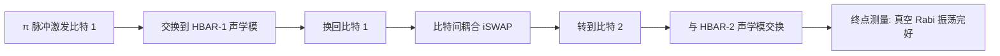

微波谐振腔用电磁场存量子态，机械振子用声波存——高次体声波谐振器（HBAR）一片压电衬底上提供密集的纵向声学模，每个模都能与超导比特近共振耦合。双比特各挂一组 HBAR 时，激发可以在整个系统里"巡回"：比特 → 声学模 → 另一比特 → 另一声学模——机械模的长寿命让"存进去、走一圈、取出来"成为量子存储与中继的原型演示。

## 物理图像：声学模当量子存储

电路量子电动力学（[[circuit-qed/circuit-quantum-electrodynamics|cQED]]）的谐振腔损耗快（µs 级光子寿命），而机械振子的声学品质因子可以极高——**量子声动力学**（quantum acoustodynamics, QAD）用机械振子替代电磁腔做量子存储：压电效应把电路的电场耦合到衬底的应变场，形成比特-声子耦合。**HBAR**（high-overtone bulk acoustic wave resonator）是纵向体声波版本：厚度模式的高次泛音给出间隔均匀的密集模列，一个器件覆盖数百 MHz 内几十个可用模——"多抽屉"的存储阵列。

## 双比特 HBAR 系统的哈密顿量

两个电容耦合的 transmon 各自耦合独立的 HBAR 模列。比特-模耦合服从 [[circuit-qed/jaynes-cummings-model|Jaynes–Cummings 模型]]，比特-比特为电容耦合（iSWAP 形式），系统哈密顿量

$$
\hat H=\sum_{k}\omega_{m,k}^{(1)}\hat b_{k}^{\dagger}\hat b_{k}+\sum_{l}\omega_{m,l}^{(2)}\hat c_{l}^{\dagger}\hat c_{l}+\sum_{j=1,2}\frac{\omega_{q,j}}{2}\sigma_z^{(j)}
+\sum_{j,k}g_{j,k}\left(\hat a_j^\dagger \hat b_k+\mathrm{h.c.}\right)+J\left(\sigma_+^{(1)}\sigma_-^{(2)}+\mathrm{h.c.}\right),
$$

其中 $\hat b_k$、$\hat c_l$ 是两组 HBAR 模的声子算符、$g_{j,k}$ 是比特-声学模耦合（压电换能）、$J$ 是比特间电容耦合。磁通调谐比特频率扫过模列时，在各避免交叉处出现**真空 Rabi 振荡**——激发在比特与声学模之间相干交换。

![[assets/figures/hbar-quantum-acoustodynamics/67efea8bf47a83de5def39efec3f228d160033b211dafdd077f258610a9fc7d3.jpg]]

*真空 Rabi 振荡实验：激发在受控比特与机械模（红箭头）及其他比特（蓝箭头）之间交换——振荡频率对应谱学中的避免交叉，直接给出耦合强度 $g$ 与 $J$。图源：Bringnetti et al. (2023)，Fig. 2。*

## 跨自由度的量子态传输

最引人注目的演示是**激发的全程巡回**：π 脉冲激发比特 1 → 交换到它的声学模再换回 → 经比特间耦合转到比特 2 → 再与比特 2 的声学模（以及比特 1）交换。终点测量显示真空 Rabi 振荡完好——激发带着相干性走遍了电学与声学两类自由度。

一个关键的控制实验排除了"两组 HBAR 共享声学模"的可能：把激发从比特 1 换入其 3.788 GHz 声学模、调离后把比特 2 调到同频——**无响应**，证明两个比特各自耦合独立的局域声学模（任何杂散耦合弱到测不出）。

![[assets/figures/hbar-quantum-acoustodynamics/a72a8f62969afebb96afc2cd764c5c5e6de499798ed7816ef49f26a85fbe493c.jpg]]

*跨系统量子态传输：脉冲序列让激发从比特 1 出发、经声学模与比特间耦合遍历整个系统，最终在比特 2 上测得真空 Rabi 振荡——数据与主方程解吻合，证明相干性在整个"电-声-电"路径上保持。图源：Bringnetti et al. (2023)，Fig. 3。*

### 更大的图景：混合电机械与光机械系统

HBAR 属于'超导电路+机械振子'大家族的体声波分支；综述把整个家族放进统一图景——**电机械系统**（电容换能：微波电场耦合应变，HBAR/鼓面模/悬臂）与**光机械系统**（光压换能：光学腔场耦合机械位移）两类换能机制，都可作为超导比特的混合伙伴，并在微波-光转换（量子中继的关键接口）上交汇。HBAR 的多模密集声学谱（存储阵列）与光机械的光频接口（远程连接）在应用上互补。

![[assets/figures/hbar-quantum-acoustodynamics/bef3fecb81c8a0d651cb3eb2d713b2f39c9a2aae3332ff7bac3eaa62a67ffee9.jpg]]

*混合电机械与光机械系统的统一图景：两类换能机制（电容 vs 光压）与超导比特的耦合构型全景——微波-光转换是两族的交汇应用。图源：arXiv:2604.18186，Fig. 1。*

### 声子带隙超材料：机械 Purcell 滤波与非马尔可夫动力学

声子工程的另一形态是**声子带隙超材料**：周期性微结构在衬底中打开声子带隙，带隙频率内的声子发射被禁止——超导比特坐在带隙上时，TLS 介导的**声子型 Purcell 衰减**通道被切断（等效于给 TLS 池装了"机械 Purcell 滤波器"）。实测带隙内 TLS 寿命增强到 **34 µs**，比特动力学出现**非马尔可夫特征**（记忆效应）：Solomon 方程（比特-TLS 耦合池）建模与实测吻合。这条路同时解决比特足印-耗散的权衡：声子保护允许小型化而不牺牲相干。

![[assets/figures/hbar-quantum-acoustodynamics/eac7036251771020508dffaf3842170df0f86851ae686d2be377a1f0d7de069a.jpg]]

*声子带隙平台：超导比特置于声子带隙超材料上——周期微结构禁止带隙频率的声子发射，TLS 介导的声子型 Purcell 衰减被切断。图源：Nature Communications 类 (2023)，Fig. 1。*

![[assets/figures/hbar-quantum-acoustodynamics/366c507652ad580188c8f48b89c6e4aff8624eb5fd00c5d76419d224c703dd9a.jpg]]

*带隙内的非马尔可夫动力学：比特- TLS 池的相干能量交换（Solomon 方程建模）——TLS 寿命 34 µs 导致记忆效应，比特衰减偏离指数。图源：同上，Fig. 2。*

**纳米机电梭**（nanoelectromechanical shuttle）给出混合机械系统的又一构型：质量块在两个超导岛之间往复运动的"梭"结构天然产生可调的比特-机械耦合——运动幅度决定耦合的阶数（线性 $propto x$ 或二次 $propto x^2$），实验者按需切换。二次耦合对机械基态的读出特别有价值（QND 型）。

![[assets/figures/hbar-quantum-acoustodynamics/6d24de75e097f49fb8adaf692a990af9256ec3b8777d3b312e2ac75e1ea264ec.jpg]]

*纳米机电梭器件：质量块在超导岛间往复——电路拓扑天然提供可调线性/二次耦合。图源：arXiv:2402.18317，Fig. 1。*

![[assets/figures/hbar-quantum-acoustodynamics/aedce95fe9b3266e788d330dd7366971e8a4a4dfa63f267959cbc52e6954f9ea.jpg]]

*可调耦合的演示：梭位置扫描下线性↔二次耦合的切换——机械自由度的耦合阶数工程。图源：arXiv:2402.18317，Fig. 2。*

## 与其他概念的关系

- 比特-声学模耦合的数学结构与[[circuit-qed/jaynes-cummings-model|JC 模型]]完全同源——QAD 是 cQED 在机械自由度上的平移；真空 Rabi 振荡与避免交叉的判读方法直接沿用。
- 与[[circuit-qed/nv-center-cavity-bus|NV 色心腔总线]]的分工：色心是"长寿命自旋存储 + 电学操控"，HBAR 是"多模机械存储 + 全电学耦合"——两条量子存储路线互补。
- 与[[circuit-qed/cavity-mediated-coupling|腔介导远程耦合]]对照：腔总线用共享电磁模连接比特，HBAR 系统用声学模做节点存储、比特耦合做节点间通道——存储与通信分工的两种实现。
- HBAR 的高品质因子声学模本质上是[[fundamentals/coulomb-blockade|压电衬底]]上的应变本征模——材料工艺（压电薄膜、换能器设计）决定模列密度与耦合强度。

## 参考文献

- Brighetti, F., et al. (2023). *Coupling high-overtone bulk acoustic wave resonators via superconducting qubits*. [arXiv:2307.05544](https://arxiv.org/abs/2307.05544)
> 完整文献库（含各篇站内全文页）见 [[references/index|参考文献库]]。
