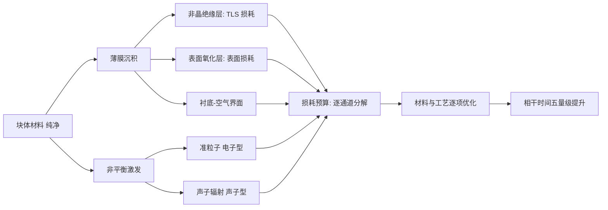

界面缺陷是横跨直流与微波两种实验的共同瓶颈：它们在半导体–氧化层界面形成局域能级，可被载流子填充，使量子点工作点漂移；同时又可作为二能级涨落子与微波腔耦合，给谐振腔引入额外的介电损耗。

## 物理图像与定义

界面缺陷（interface defect），又称界面态（interface state / interface trap），是半导体晶格在表面或异质结界面处突然终止时引入的一类局域电子态。以 Ge/SiGe 应变锗量子阱为例，生长结束后暴露于空气会在锗表面形成约 1.5 nm 厚的 SiOx 层，再以 ALD 沉积 30 nm 厚的 AlOx 栅氧。这一堆叠结构的两处界面（Ge/SiOx 与 SiOx/AlOx）都富含未完全氧化的悬挂键（A 型：未与硅成键；B 型：仅部分氧化），即所谓"悬挂键（dangling bond）"。这些悬挂键在禁带中引入分立的缺陷能级，使得原本应当是良好绝缘体的氧化层失去理想性。

界面缺陷在量子点实验里同时充当两类角色：

1. **直流俘获中心**：当缺陷能级落在费米面附近时，它能够俘获或发射载流子，固定电荷改变作用在沟道上的电场，从而引发阈值电压漂移、滞回（hysteresis）和长时间尺度的电流衰减。这种现象在应变锗、Si/SiGe、Si-MOS 等平台都被普遍观察到。
2. **微波损耗来源**：界面缺陷形成亚稳态的"二能级涨落子"（two-level fluctuator, TLF；又称二能级系统 TLS），单个 TLF 与谐振腔光场的耦合可用 Jaynes-Cummings 模型描述；大量 TLF 共同贡献的统计效应通常用一个损耗角正切 $\tan\delta_\text{TLS}$ 来概括，给谐振腔带来额外的介电损耗。

因此，界面缺陷把直流工作点漂移与微波腔品质因子下降这两个看似独立的实验现象统一在同一类微观起源之上。

<!-- FIGURE: 半导体–氧化层堆叠的剖面示意图，标注 Ge 量子阱、SiO_x 界面层、AlO_x 栅氧与悬挂键（A 型、B 型）的位置 -->

## 缺陷的微观分类与频域响应

经典半导体领域把界面缺陷按其频域响应分为两类：

- **类施主型**：指那些捕获空穴后等价于提供电子的缺陷，在 P 型器件中表现为带正电的固定电荷；
- **类受主型**：指那些在费米面下捕获电子的缺陷，性质与受主杂质相似。

无论类型，它们共同的负面影响有三：

1. 捕获载流子后形成固定电荷，改变平带电压或阈值电压；
2. 与半导体交换电荷的过程可视为高频充放电，使器件的频域响应失真；
3. 充当复合中心，提高表面附近的载流子复合率，削弱输运性能；当密度足够高时还会引发费米钉扎（Fermi pinning）。

把氧化层视为平行板电容 $C_\text{ox}=\epsilon_\text{ox}\epsilon_0/d_\text{ox}$，界面缺陷则可抽象为与之并联的"界面态电容" $C_\text{it}$，其值依赖于缺陷响应频率：低频（1–100 Hz 量级）交流电压下缺陷能完全跟随，测量得到的是低频电容 $C_\text{lf}$；高频（$\sim 1\,\mathrm{MHz}$）下缺陷来不及响应，电容回到只有氧化层与半导体串联的形式 $C_\text{hf}$。

<!-- FIGURE: 含界面态的等效电路：(a) MOS 堆叠 (b) 理想网络 C_ox + C_semi (c) 加入 C_it 与并联电导 G_p 的实际网络 -->

## 经典模型：界面态电容与态密度提取

把界面态纳入等效电路后，电容网络的标准形式为

$$
\frac{1}{C_\text{lf}}=\frac{1}{C_\text{ox}}+\frac{1}{C_\text{semi}+C_\text{it}}\quad\Longrightarrow\quad C_\text{lf}=\frac{C_\text{ox}(C_\text{semi}+C_\text{it})}{C_\text{ox}+C_\text{semi}+C_\text{it}}
$$

$$
\frac{1}{C_\text{hf}}=\frac{1}{C_\text{ox}}+\frac{1}{C_\text{semi}}\quad\Longrightarrow\quad C_\text{hf}=\frac{C_\text{ox}\,C_\text{semi}}{C_\text{ox}+C_\text{semi}}.
$$

把两式联立消去 $C_\text{semi}$，可直接解出

$$
C_\text{it}=C_\text{ox}\!\left(\frac{C_\text{lf}}{C_\text{ox}-C_\text{lf}}-\frac{C_\text{hf}}{C_\text{ox}-C_\text{hf}}\right).
$$

由此得到单位面积–单位能量下的界面态密度（density of interface states, $D_\text{it}$）：

$$
D_\text{it}\approx\frac{C_\text{it}}{e^2}=\frac{C_\text{ox}}{e^2}\!\left(\frac{C_\text{lf}}{C_\text{ox}-C_\text{lf}}-\frac{C_\text{hf}}{C_\text{ox}-C_\text{hf}}\right).
$$

这就是经典的"电容–电压（C-V）法"提取 $D_\text{it}$ 的基本关系。当缺陷在不同能级上的密度不同时，C-V 测量还可以进一步给出 $D_\text{it}$ 随表面势的依赖关系。

> 这一公式假设界面缺陷能用一个电容来等效，但严格来说它是"电压–电荷关系"，只在低频准静态下成立。

## 应变锗体系的逆向薛定谔–泊松建模

在应变锗空穴量子阱中，二维空穴气（2DHG）本身由异质结能带结构决定，因此提取界面态密度不能直接套用经典 C-V 公式。[[materials-devices/strained-germanium|应变锗]] 工作提出了"逆向薛定谔–泊松（S-P）求解"路线：先在每个栅压 $V_g$ 下测得稳定的二维空穴气密度 $p_\text{2DHG,exp}$，再以含界面电荷 $p_\text{it}$ 作为泊松方程中的固定电荷源，反向求解 S-P 方程使理论值 $p_\text{2DHG,th}$ 与实验一致，由此反推出当前 $V_g$ 下被填充的界面态密度。

### 自洽方程组

一维 S-P 求解的核心方程组为

$$
-\frac{\hbar^{2}}{2}\,\frac{\mathrm{d}}{\mathrm{d}x}\!\left(\frac{1}{m^{*}(x)}\frac{\mathrm{d}\psi}{\mathrm{d}x}\right)+V(x)\psi=E\psi
$$

$$
\frac{\mathrm{d}}{\mathrm{d}x}\!\left(\epsilon_{r}(x)\frac{\mathrm{d}\phi}{\mathrm{d}x}\right)=-\frac{e\,p_\text{total}(x)}{\epsilon_0},\qquad p_\text{total}=p_\text{it}(x)+p_\text{hole}(x).
$$

势能与静电势之间通过价带偏移 $\Delta E_v$ 联系起来：

$$
V(x)=-e\phi(x)+\Delta E_v(x),\qquad p(x)=\sum_{i=1}^{m}\psi_i^{*}(x)\psi_i(x)\,p_i(x)
$$

其中 $p_i(x)=\dfrac{m^{*}}{\pi\hbar^{2}}\!\displaystyle\int_{-\infty}^{+\infty}\!\dfrac{\mathrm{d}E}{1+\exp[(E-E_F-E_i)/(k_B T)]}$ 是第 $i$ 个子带占据。S-P 自洽过程通过 (4.2)$\to$(4.3) 与 (4.3)$\to$(4.2) 两个方向的迭代来实现；当每轮势能变化小于设定判据时，即认为收敛。

界面电荷作为固定面电荷放在 SiOx 层内，对 S-P 求解器而言

$$
\bigl(p_\text{2DHG,th},\,E_v(x)\bigr)=F(V_g,\,p_\text{it})
$$

其中 $V_g$ 与 $p_\text{it}$ 是输入量，$p_\text{2DHG,th}$ 是输出量。逆向求解时用 Brent 方法扫描 $p_\text{it}$，并要求

$$
0.99\le\frac{p_\text{2DHG,th}}{p_\text{2DHG,exp}}\le1.01
$$

以此为判据把 $p_\text{it}$ 求出来。

> 与传统 C-V 法相比，逆向 S-P 路线的优势在于能从一次充电过程中提取"中间态"的界面电荷分布，而不仅限于整个充放电循环的积分响应。

## 隧穿机制：界面态如何被填充

界面缺陷原本位于半导体表面之外的氧化层中，载流子要到达那里必须穿越 SiGe 势垒层。在低温（4.5 K 量级）下，热发射的能量 $k_B T\approx 3.88\times 10^{-4}\,\text{eV}$ 远小于 Ge/SiGe 价带偏移 $\sim 114\,\text{meV}$，因此可以完全忽略热发射的贡献，仅需考虑三种量子隧穿机制：

### 直接隧穿

量子阱内的载流子通过量子隧穿直接跨过整个势垒。在 WKB 近似下

$$
J_\text{direct}=A\exp\!\left(-\frac{2t\sqrt{2m^{*}\phi_B}}{\hbar}\right)
$$

其中 $t$ 为势垒厚度、$m^{*}$ 为势垒中空穴有效质量、$\phi_B$ 为势垒高度、$A$ 是与材料和电场相关的因子。对 32 nm 厚的 SiGe 势垒，$J_\text{direct}$ 在整个测量区间内始终维持在 $\sim 10^{-30}\,\text{A/m}^{2}$ 量级，可忽略不计。

### Fowler–Nordheim 隧穿（F-N 隧穿）

当负栅压增大时，价带在三角形势垒处弯折，载流子经三角势垒隧穿。F-N 公式为

$$
J_\text{FN}=\frac{e^{3}E^{2}}{8\pi h\phi_B}\exp\!\left(-\frac{8\pi\sqrt{2m^{*}\phi_B^{3}}}{3ehE}\right)
$$

其中 $E$ 为 SiGe 层中电场的平均值。当 $|V_g|\gtrsim 3.5\,\text{V}$ 时 $J_\text{FN}$ 从可忽略水平跃升到 $\sim 10\,\text{mA/m}^{2}$，对应栅面积为 $\sim 10^{-7}\,\text{m}^{2}$ 时约 nA 量级的电流——这与实验中源漏电流在长时标下的 pA 至 nA 量级衰减一致。

### 陷阱辅助隧穿（TAT）

载流子借助势垒禁带中的位错缺陷逐级跳跃到达界面：

$$
J_\text{TAT}=e\!\int_{0}^{t}\!\frac{N_T(x)}{\tau(x)}\,T(x)\,\mathrm{d}x
$$

其中 $N_T$ 是陷阱分布、$\tau$ 是俘获/发射时间常数、$T(x)$ 是每步隧穿系数。在应变锗中位错密度约为 $10^{6}$–$10^{8}\,\text{cm}^{-2}$，足以提供 TAT 所需的中间态。在低温下，TAT 只需考虑弹性过程，$J_\text{TAT}$ 量级保持在 $10^{-4}$–$10^{-1}\,\text{A/m}^{2}$ 区间，与实验观测的电流衰减一致。

<!-- FIGURE: 应变锗异质结中三种隧穿机制示意：直接隧穿、F-N 隧穿（三角势垒）、TAT（多级跳跃） -->

把三种机制叠加即得总隧穿电流密度

$$
J_\text{total}=J_\text{direct}+J_\text{FN}+J_\text{TAT}.
$$

分析表明存在一个转变点 $V_g\approx -3.5\,\text{V}$：在 $|V_g|$ 较小时以 TAT 为主导、$|V_g|$ 较大时 F-N 占据主要权重。

## 对量子点工作点的影响：电荷俘获与漂移

界面态对[[fundamentals/semiconductor-quantum-dot|半导体量子点]]的影响可以归结为三条：

1. **阈值电压漂移与滞回**：被填充的界面态作为固定电荷改变沟道电场，导致阈值电压整体平移。[[materials-devices/strained-germanium|应变锗]] Hall-bar FET 中，未经臭氧处理时阈值电压可漂移至 $\sim -4.84\,\text{V}$，经过钝化后漂移显著减弱。
2. **长时间电流衰减**：保持 $V_g$ 不变时源漏电流仍会在 $10^{4}\,\text{s}$ 量级时间窗内指数式衰减至稳态，本质是界面缺陷在此期间被逐步填充——这正是循环扫描阈值电压方法提取 $D_\text{it}$ 的物理基础。
3. **低频电荷噪声**：在 GaAs/AlGaAs 体系中，界面缺陷与传统掺杂层的电势涨落叠加产生 $\sim 1/f$ 噪声谱，影响电荷比特与自旋比特的退相干时间。浅刻蚀工艺移除大部分肖特基电极下的二维电子气后，电荷噪声明显抑制。

> 量子点工作点的稳定通常要求"扫描路径不进入强填充区"。一旦 $|V_g|$ 越过历史最大值，新的界面缺陷就会被填上，阈值电压随之整体漂移——这就是为何自动调参算法需要谨慎地设计初始化序列。

## 对谐振腔的影响：损耗角正切与 TLF 耦合

当[[circuit-qed/microwave-resonator|微波谐振腔]]的导体被直接沉积在半导体衬底上时，氧化层中的悬挂键会形成亚稳态二能级涨落子（TLF）。在统计意义上，它们对谐振腔的影响用一个损耗角正切参数 $\tan\delta_\text{TLS}$ 来描述，并直接降低内部品质因子 $Q_i$ PDF p. 65）：

$$
Q\sim\frac{1}{\tan\delta_\text{TLS}},\qquad
\frac{1}{Q}=\frac{1}{Q_i}+\frac{1}{Q_e},\qquad
G=\frac{Q_i}{Q_e}=\frac{\kappa_e}{\kappa_i}.
$$

单个 TLF 与腔光子的相互作用可以套用与量子比特–腔耦合相同的 Jaynes-Cummings 形式：

$$
H=\frac{\hbar\omega_\text{TLS}}{2}\sigma_z+\hbar\omega_r\!\left(a^{\dagger}a+\frac{1}{2}\right)+\hbar g_\text{TLS}\!\left(a^{\dagger}\sigma_{-}+a\sigma_{+}\right)
$$

其中耦合强度由 TLF 电偶极矩 $\boldsymbol{p}$ 与真空涨落电场 $\boldsymbol{E}_\text{rms}$ 决定：

$$
g_\text{TLS}=\frac{\Delta}{\hbar\omega_\text{TLS}}\,\boldsymbol{p}\cdot\boldsymbol{E}_\text{rms}(\boldsymbol{r}).
$$

由于 $E_\text{rms}(\boldsymbol{r})$ 随 TLF 距腔的距离增大而衰减，距腔约 $100\,\text{nm}$ 以内的 TLF 对 $Q_i$ 才有显著贡献。换句话说：

$$
\tan\delta_\text{TLS}\sim g_\text{TLS}\sim\frac{1}{r},\qquad Q\sim r.
$$

这种依赖关系解释了为何应变锗/腔体系长期比 GaAs/腔体系更难进入强耦合区——应变锗的 SiGe 势垒较薄、表面氧化层距谐振腔导体仅 $\sim 10\,\text{nm}$，TLF 参与度更高。

## 参数与量级

| 量 | 典型值 | 体系 | 来源 |
| --- | --- | --- | --- |
| SiGe 势垒层厚度 $t_\text{SiGe}$ | $32\,\text{nm}$ | 应变锗异质结 | PDF p. 43 |
| 界面 SiOx 厚度 $t_{\text{SiO}_x}$ | $1.5\,\text{nm}$ | 应变锗表面氧化 | PDF p. 43 |
| Ge/SiGe 价带偏移 $\Delta E_v$ | $114\,\text{meV}$ | 应变锗 | PDF p. 43 |
| 锗空穴有效质量 $m^*_\text{Ge}$ | $0.0728\,m_0$ | 应变锗 | PDF p. 43 |
| SiGe 合金相对介电常数 $\epsilon_\text{SiGe}$ | $15.34$ | Si0.2Ge0.8 | PDF p. 43 |
| 实验温度 | $\sim 4.5\,\text{K}$，$k_BT\approx 3.88\times 10^{-4}\,\text{eV}$ | 稀释制冷机 | PDF p. 50 |
| 直接隧穿电流密度 $J_\text{direct}$ | $\sim 10^{-30}\,\text{A/m}^{2}$ | 应变锗 | PDF p. 52 |
| F-N 转变栅压 | $V_g\approx -3.5\,\text{V}$ | 应变锗 Hall-bar | PDF pp. 52, 56 |
| TAT 电流密度范围 | $10^{-4}$–$10^{-1}\,\text{A/m}^{2}$ | 应变锗 | PDF p. 55 |
| 异质结中位错密度 | $10^{6}$–$10^{8}\,\text{cm}^{-2}$ | 应变锗 | PDF pp. 49, 55 |
| 陷阱能级（高斯分布均值） | $E_v+140\,\text{meV}$ | 应变锗 SiGe | PDF p. 57 |
| TLF 有效耦合距离阈值 | $\sim 100\,\text{nm}$ | 谐振腔–界面 | PDF p. 65 |
| 阈值电压漂移幅度 | 漂移至 $\sim -4.84\,\text{V}$（未钝化） | 应变锗 Hall-bar | PDF p. 33 |
| 累积 $p_\text{it}$ 与 $V_g$ 线性 Pearson $R$ | $-0.9998$ | 应变锗逆向 S-P | PDF p. 45 |

## 实验特征与测量方法

### 循环扫描阈值电压法（应变锗 / GaAs / Si-MOS）

在 Hall-bar FET 上，先将 $V_g$ 设回零排空界面电荷，再施加从 $0$ 到 $V_\text{min}$ 的电压并保持约 $120\,\text{s}$，让界面态被填充；之后把 $V_g$ 扫回 $0$ 并记录 $I_\text{ds}$–$V_g$ 曲线，提取阈值电压 $V_\text{th}$。随着 $V_\text{min}$ 的绝对值逐步增大，$V_\text{th}$ 整体负向漂移，并最终进入饱和——这表明"大栅压下界面态逐渐被完全填满"。把 $V_\text{min}$ 的扫描范围扩展到 $-9.0\,\text{V}$ 量级，并以 $0.2\,\text{V}$ 为步进，可以获得完整的 $V_\text{th}$–$V_\text{min}$ 曲线。

### 准静态霍尔载流子密度法

在 Hall-bar FET 的基础上增加一组测量横向电压 $V_{xy}$ 的锁相放大器，并施加以 $24\,000\,\text{s}$ 量级为周期的栅压保持——使器件进入准静态。对每个 $V_\text{min}$ 测得稳定的 $V_{xy}(B_y)$，用

$$
\rho_{xy}=\frac{B_y}{e\,p_\text{2DHG}}+c
$$

提取二维空穴气密度 $p_\text{2DHG}$。这一方法是逆向 S-P 提取 $p_\text{it}$ 的输入数据源。

### 库仑阻塞区的 $1/f$ 噪声测量

在[[fundamentals/coulomb-blockade|库仑阻塞]]区电子数严格为整数，电荷传感器（如[[readout-measurement/qpc-charge-sensor|QPC]]）的电流随时间涨落直接反映界面态俘获/释放事件。在 GaAs/AlGaAs 体系中，将这一测量与传统掺杂器件对比可以分离"掺杂层势涨落"与"氧化层界面态"两类来源。

### 谐振腔 $Q$ 值与 TLF 温度依赖

在低温（$\lesssim 100\,\text{mK}$）下测量谐振腔的内部品质因子 $Q_i$ 随温度 $T$ 与微波功率 $n_\text{photon}$ 的依赖。在 TLS 主导损耗时，$Q_i^{-1}$ 近似满足

$$
Q_i^{-1}\approx\delta_\text{TLS}^{0}\tanh\!\left(\frac{\hbar\omega_r}{2k_B T}\right)\!\left(1+\frac{n_\text{photon}}{n_c}\right)^{-\beta}
$$

其中 $\beta\approx 0.5$；升温或增大微波功率都会减小 TLF 的有效占据，从而恢复 $Q_i$。该温度/功率依赖是判断"谐振腔损耗是否由界面态主导"的关键指纹。

### 镂空谐振腔：把 TLF 隔开

在应变锗/SiGe 体系上 提出了镂空谐振腔设计：通过湿法刻蚀移除超导薄膜下方的部分衬底，并保留四周的支撑柱与一层承托层，使超导薄膜与氧化层界面在垂直方向上拉开微米量级的距离。这样 TLF 的有效耦合按 $Q\sim r$ 显著恢复，同时还因为空气进入有效介质降低了等效介电常数，从而提高谐振腔的特征阻抗 $Z_r=\sqrt{L/C}$ 并增强比特–光子耦合 $g\propto(L/C)^{1/4}$。

<!-- FIGURE: 镂空谐振腔剖面示意图：氮化钛超导薄膜、Si 承托层、四周 SiO2 支撑柱、下方空气腔 -->

## 超导电路侧的材料损耗全景

半导体界面之外的另一套"从材料到器件"证据链在超导电路里：从块体材料到功能器件的加工过程中，**非晶绝缘膜与非平衡激发**（电子型与声子型准粒子）被逐步引入，成为耗散与涨落的来源。综述（Nature Reviews Materials 2021）系统梳理了这条材料学叙事：超导比特相干时间自 1999 年首次时域相干测量以来提升了**五个数量级**，每一步都对应一类材料缺陷的识别与压制。核心框架是**损耗预算**（loss budget）：把总退相干率分解到各个微观通道——非晶介质层的 TLS 损耗（$\tan\delta_{\mathrm{TLS}}$，与半导体侧的 TLF 物理同源）、导体表面氧化层、衬底-空气界面、准粒子与声子辐射等——再按通道逐个优化材料与工艺。

另一条主线是**比特架构的材料权衡**：单约瑟夫森结的极简比特（制造容差宽）对局域噪声源敏感面更大；多结/多元件设计（transmon 大电容、fluxonium 大电感、对称 SQUID 等）用电路对称性与冗余换噪声保护，但每个新增界面都引入新的材料优化挑战。没有普优解——不同架构的材料优化方向不同，相干数据反过来提供了缺陷机制的互补诊断。

![[assets/figures/interface-defects/9356277978e06069e9838e83853960b79222c52051b042c157176e88df0a420a.jpg]]

*超导比特相干时间的演进全景：自 1999 年首次时域相干测量以来五个数量级的提升——每一阶跃都对应一类材料缺陷（TLS、表面氧化、准粒子等）的识别与工艺压制。图源：Nature Reviews Materials 综述（2021），DOI:10.1038/s41578-021-00370-4。*

**铝-硅界面的损耗缓解落地**：综述框架之后，材料工程的具体数据来自 Plourde 组（2023）——铝-硅平面 transmon 的 $T_1$ 达 **270 µs**（平均）、最高观测 501 µs，对应 $Q=500$ 万。方法闭环与综述的建议一致：先用材料分析技术（SIMS 等）与数值仿真定位主导损耗源（衬底-金属界面与表面氧化层的 TLS 参与度），再针对性地设计缓解策略（衬底表面处理、金属沉积参数、封装环境控制）并用器件实测验证。这是"损耗预算→逐通道优化→相干提升"路线的定量落地案例。

![[assets/figures/interface-defects/614550dfcf701f8480172c14ca6e519f57d3acf6abe9383849cfa8f933af363f.jpg]]

*铝-硅平面 transmon 器件：界面介质损耗缓解策略的载体——材料分析与数值仿真定位衬底-金属界面与表面氧化层的 TLS 主导损耗，工艺优化后 T1 平均 270 µs（最高 501 µs，Q=5×10⁶）。图源：Plourde 组（2023），Fig. 1。*

![[assets/figures/interface-defects/5f208dda09180fb147b9ef44ca8dc8f5d0ee89f336d5be4920b785612c08206c.jpg]]

*损耗通道的量化分解：材料分析与数值仿真给出的损耗预算——界面/表面通道的参与度随工艺参数变化，缓解策略据此定向设计。图源：Plourde 组（2023），Fig. 3。*

**钽（Ta）路线的氧化层稳定性**：α-Ta(110) 薄膜的表面氧化层表现出**低介质损耗与空气稳定性**——不同于多数超导表面氧化物在空气中持续劣化，Ta 的氧化层形成后稳定，介质损耗低。这是 Ta 成为高相干比特主力材料（Google/Princeton 路线）的材料学基础，与铝-硅缓解策略（上节）并列的材料选项。

![[assets/figures/interface-defects/2621f36ee93b15210d021e38f0f83de7af394eacd4dce556bb63ab7fa30eaf3c.jpg]]

*α-Ta(110) 薄膜的氧化层表征：表面氧化物的结构与损耗测量——低介质损耗且空气暴露后稳定，支撑 Ta 平台的高相干。图源：arXiv:2305.11395，Fig. 1。*

![[assets/figures/interface-defects/4ffe31be03787027fb92be27bf21cf88ca561dc6069dc10245d399a5ef870ebc.jpg]]

*氧化层的损耗对比：不同处理条件下 Ta 氧化层的介质损耗——稳定低损耗窗口为工艺优化给出方向。图源：arXiv:2305.11395，Fig. 2。*

**分立电荷态的量子分辨**把 TLS 从"统计参数"升级为"可分辨量子对象"：与偏置电荷敏感 transmon 强耦合的单个介质 TLS，其两个本征态被观测到各有 **0.072e** 的分立偏置电荷（TLS 隧穿双阱的两个位置）、跃迁频率 2.9 GHz、弛豫时间超长——TLS 不再只是 $	andelta$ 里的损耗参数，而是能做相干光谱的"天然量子比特"。这一微观层级是界面缺陷词条证据链的最底层。

![[assets/figures/interface-defects/90ada7211345737363f91f23c50fb252a3e5ab448a659f67deff67243c2acf57.jpg]]

*TLS 分立电荷态观测：偏置电荷敏感 transmon 与单介质 TLS 强耦合——TLS 双阱的两个位置表现为 0.072e 的分立电荷差。图源：Hyalett et al. (2024)，Fig. 1。*

![[assets/figures/interface-defects/51bd482d235453a2c6afe26ffb5120c4eebebcf299f6507ebf1af79259effecf.jpg]]

*TLS 相干光谱：2.9 GHz 跃迁的弛豫测量——单个 TLS 的量子相干行为，微观层级的直接证据。图源：同上，Fig. 2。*

**工业 300mm 产线的工艺验证**：IMEC 用**工业标准先进半导体制造工艺**（300mm 晶圆产线）制出高相干超导比特——相干时间达到实验室工艺的同等水平。这是材料证据链的工艺层里程碑：TLS 损耗控制、界面钝化、真空封装等关键工艺全部在量产环境下复现，超导比特从"实验室手工艺品"跨入"晶圆厂产品"时代。

![[assets/figures/interface-defects/0729e30f7b7908a2849fb1b68737afeee537d9980fca454bebda7bd415dd4ad0.jpg]]

*IMEC 300mm 产线制造的超导比特：工业标准工艺（晶圆级钝化、真空封装）——实验室相干指标在量产环境复现。图源：Van Damme et al. (2024)，Fig. 1。*

![[assets/figures/interface-defects/47d046d9ca3b4dd7f3c41f13d97dc0f387bb9ca6c6e61076c6a5e96d12b22a43.jpg]]

*产线比特的相干测量：$T_1$、$T_2$ 分布——工业工艺的统计一致性达到实验室水平。图源：Van Damme et al. (2024)，Fig. 2。*

**双音谱学**是 TLS 表征的第二种方法：不依赖比特频率调谐（对照偏置电荷敏感法），用两个微波音同时驱动——TLS 与比特的强耦合在双音谱中产生特征线形，直接读出 TLS 参数。对频率不可调的比特（如固定频率 transmon 阵列）尤其有价值。

![[assets/figures/interface-defects/ddc9f566a747f25f362f9384b78ed99c55da9f0265e195bb3d9468e4955a65f2.jpg]]

*双音谱学方案：两个微波音的联合扫描——TLS-比特强耦合的特征谱线，无需调谐比特频率。图源：arXiv:2404.14039，Fig. 1。*

![[assets/figures/interface-defects/b80044ee2094c1d12670d0cfbfa948c69e3e8d9b374eb31ccbd0a9ad02643e93.jpg]]

*双音谱的 TLS 检测结果：特征线形直接读出 TLS 参数——固定频率比特阵列的 TLS 表征工具。图源：arXiv:2404.14039，Fig. 2。*

**铌薄膜的微波损耗直接测量**（材料证据链第四块）：Nb 是二维 transmon 的主力电极材料，但多层材料-界面的叠层使 Nb 的损耗贡献一直难以单独标定——直接测量（谐振器法）把 Nb 膜的损耗率从叠层中剥离，材料清单的铌数据补齐（综述→铝硅→钽→铌四块齐全）。

![[assets/figures/interface-defects/88fcd93f43328cc481f14c5ad1564b793e79afb5ce8e87fc790ddfa246b43e7d.jpg]]

*Nb 膜微波损耗的直接测量：从多层叠层中剥离 Nb 的贡献。图源：arXiv:2407.08856，Fig. 1。*

![[assets/figures/interface-defects/fa6448b0a6af3e2dbb2770684f8940f76d9485701bce660481d2cf7ba1060fd6.jpg]]

*损耗率的测量结果：Nb 膜的品质因子。图源：arXiv:2407.08856，Fig. 2。*

## 与其他概念的关系

- [[materials-devices/charge-noise|电荷噪声]]：界面态俘获/释放是低频电荷噪声的主要微观起源之一；其时间常数随温度与偏压变化，决定噪声谱的 $1/f^\alpha$ 形状。
- [[materials-devices/strained-germanium|应变锗]]：应变锗量子阱对界面态密度尤其敏感，因为 Ge/SiOx 界面的天然氧化物溶于水，使得氧化层质量差、$D_\text{it}$ 高。钝化与界面处理是该平台的核心工艺问题。
- [[circuit-qed/microwave-resonator|谐振腔]]与[[circuit-qed/high-impedance-resonator|高阻抗谐振腔]]：界面态作为 TLF 贡献介电损耗，降低 $Q_i$；高阻抗谐振腔的 $E_\text{rms}$ 更高，TLF 参与度也更强，对界面处理提出更严格的要求。
- [[circuit-qed/jaynes-cummings-model|Jaynes-Cummings 模型]]：单个 TLF 与腔光子的耦合使用与量子比特–腔耦合相同的哈密顿量形式，因此可以用同一套强耦合判据 $g\gg\gamma,\kappa$ 来描述 TLS 对腔的影响。
- [[circuit-qed/strong-coupling|强耦合]]：应变锗/腔体系实现强耦合晚于电子自旋–腔体系，部分原因就在于 TLF 损耗降低了有效 $Q_i$；镂空谐振腔与界面钝化正是为了弥补这一差距。
- [[fundamentals/coulomb-blockade|库仑阻塞]]与[[fundamentals/coulomb-diamond|库仑菱形]]：在阻塞区量子点电子数严格为整数，界面态俘获/释放改变邻近电化学势，使库仑峰位置随时间漂移——菱形边界的时域展宽本身即可作为界面态活性的度量。
- [[qubit-control/photon-assisted-tunneling|光子辅助隧穿]]：界面态的存在使能级寿命延长，PAT 实验提取的电荷弛豫与退相干时间反映了界面态–载流子相互作用的强度。
- [[qubit-control/exchange-interaction|交换作用]]与[[qubit-control/ramsey-interferometry|Ramsey 干涉]]：界面态引起的电荷涨落通过 $g$ 因子、电场梯度和交换项传递到自旋比特，是 $T_2^{*}$ 的主要限制之一。

## 工艺对策

实际器件中针对界面缺陷的对策可以大致归为三类：

1. **钝化**：在 Ge 表面预先形成稳定氧化层或沉积钝化膜。例如 PDF pp. 25–28 提出的"臭氧表面钝化"：在异质结表面暴露于臭氧以形成约 1.5 nm 的 SiOx，再以 ALD 沉积 30 nm AlOx 作为栅氧。钝化后阈值电压漂移显著减弱，$D_\text{it}$ 整体降低。
2. **结构隔离**：通过在导体与氧化层之间引入物理间距来减弱 TLF 参与度，例如镂空谐振腔或悬浮结构。
3. **电路与算法**：避开强填充区（首次加电初始化后限定 $|V_g|$ 上限）、加入自动重置循环、采用[[readout-measurement/rf-reflectometry|射频反射测量]]代替直流读出以减少对绝对电流值的依赖。
