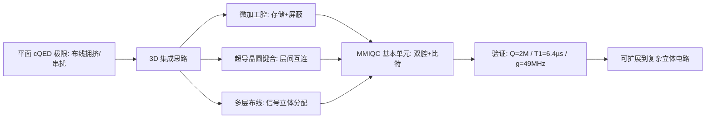

平面电路的引线都从芯片边缘走，比特一多就互相干扰；把电路"立起来"——微加工腔做屏蔽隔离、超导晶圆键合做层间连接、多层布线做信号分配——就是多层微波集成量子电路（MMIQC）。首个含 transmon 的演示器件做到了：微加工存储腔 34.3 µs 寿命（单光子能量下 Q 值 200 万）、g/2π=49 MHz 的强色散耦合——立体化不牺牲相干性。

## 物理图像：从平面到立体

[[circuit-qed/circuit-quantum-electrodynamics|cQED]] 的平面工艺（共面波导+比特在同一层）在几十个比特后撞墙：输入输出引线拥挤、元件间串扰随密度上升、屏蔽困难。**3D 集成**的思路是把成熟的微波工程工艺搬到量子电路：微机械加工的立体腔（micromachined cavity）兼做**量子存储**与**屏蔽外壳**（防止串扰）；多层晶圆用**超导键合**垂直互连，信号走立体布线不再挤在同一平面。这继承了 3D cQED（立体腔的高 Q 值）与平面工艺（光刻可扩展性）各自的优点。

垂直化的收益是三重的。**布线维度**：平面电路的引线全部从芯片边缘引出， Rent 规则的引脚墙随比特数指数收紧（见[[scaling-automation/cryo-electronics|低温电子学]]的同样分析）；立体电路让信号在层间垂直分配，边缘引线只保留必要的输入输出。**隔离维度**：每个微加工腔天然是一块法拉第屏蔽——腔与腔之间的串扰被金属壁物理隔断，不再依赖平面设计的频率规划。**存储维度**：立体腔的模体积大、表面参与比低，单光子 Q 值可以做得很高——这正是[[circuit-qed/bosonic-cqed|玻色编码]]需要的长寿命存储。

## 首个 MMIQC 器件：构型与参数

多模色散系统的有效哈密顿量（含任意数量的模）为

$$
\frac{H}{\hbar}=\sum_i\omega_i a_i^\dagger a_i-\sum_{i\neq j}\chi_{ij}\,a_i^\dagger a_i\,a_j^\dagger a_j-\sum_i\frac{\alpha_i}{2}a_i^{\dagger2}a_i^2,
$$

其中每个模的跃迁频率为 $\omega_i$、非谐性为 $\alpha_i$（transmon 最大），模对之间以色散移强度 $\chi_{ij}$ 相互作用——MMIQC 的双腔+比特器件就是这一多模框架的最小实例。

Brecht 等人演示的**双腔单比特** MMIQC 基本单元：

- **微加工存储腔**：单光子能量下寿命 34.3 µs、品质因子 **200 万**——超导晶圆键合是关键工艺（键合界面不引入显著损耗）；
- **transmon 集成**：光刻图形化的 transmon 嵌入微加工腔，$T_1=6.4\ \mu s$、$T_2^{\mathrm{Echo}}=11.7\ \mu s$——首个进入微加工立体腔的相干比特；
- **耦合参数**：比特-腔色散耦合 $\chi_{q\mu}/2\pi=-1.17$ MHz、JC 相互作用强度 $g/2\pi=49$ MHz——**强色散区**（$\chi>\kappa$）的 cQED 操作轻松达成。

比特-腔耦合用**电场图像**与电路模型双路描述：与平面/3D 电路的偶极天线构型不同，微加工腔的极端纵横比（晶圆厚度远小于腔面尺度）不允许传统伸入式天线——改为把电路光刻在**腔壁**上，让图形化导体的电磁场与腔模直接耦合。 specialised 几何（比特电容经腔壁开窗伸入）使电场主要集中在耦合缝，几何参数直接控制 $g$。

![[assets/figures/mmiqc-3d-integration/558d43dbc6a829dffc522f4e3f082637916424863a6059a39ee7e1dd2e240c0d.jpg]]

*MMIQC 器件结构：光刻图形化的 transmon 与两个微加工腔集成——多层硅片经光刻、刻蚀与金属键合构成立体电路，比特电容经腔壁开窗与腔场耦合。图源：Brecht et al. (2016)，Fig. 1。*

![[assets/figures/mmiqc-3d-integration/fe980a574306647815ff758b48e8c69a1a03fadf9de774304675dbb24c24163f.jpg]]

*超导晶圆键合的演示：微加工存储腔在单光子能量下 34.3 µs 寿命（Q=2×10⁶）——键合界面不成为损耗瓶颈，是 MMIQC 路线可行性的核心验证。图源：Brecht et al. (2016)，Fig. 2。*

## 设计工具链与扩展终点

**3D 电磁仿真的设计验证**：立体电路的参数（耦合 $g$、色散移 $\chi$、腔频 $\omega_r$）不再能靠平面经验公式估计——InductEx 这类三维电磁场求解工具（原为 RSFQ 电路开发）被系统用于超导比特版图的参数提取：读出操作的两比特芯片仿真覆盖全部无源结构，设计参数（电感、电容、耦合）从版图直接数值提取，闭合"设计→仿真→制造→测量"的验证环。

**扩展终点：表面码阈值**：MMIQC 的立体化终点是容错表面码处理器——那里对门保真度的定量要求由 Corcoles 等人的阈值实验标定：五比特超导芯片上单比特门保真度 **99.4%**、两比特 CZ 门 **99.0%**，均超过当时表面码阈值估计的下限；重复测量（repetition code）演示了逻辑态在多次纠错循环中的稳定。从 MMIQC 基本单元到表面码处理器，中间隔着的是布线密度、串扰控制与工艺一致性——三维集成正是针对这三者的路线。

![[assets/figures/mmiqc-3d-integration/e3f4f9cb4760274b6fa866aa2215f3ab3e481fac9c0475346c66b0b6c6b4fa3d.jpg]]

*InductEx 仿真流程：两比特芯片读出操作的三维电磁仿真——超导版图的全部无源结构（谐振腔、馈线、耦合电容）经数值场求解提取设计参数。图源：InductEx 分析报告（2023），Fig. 1。*

![[assets/figures/mmiqc-3d-integration/8c6e6b43bbbf245dc6026695530370075cfe3ca26e6e1cef2201fb881c231482.jpg]]

*表面码阈值实验的芯片架构：集成约瑟夫森量子电路的光学照片——五比特方形阵列（数据比特+测量比特），表面码的最小重复单元。图源：Corcoles et al. (2014)，Fig. 1(a)。*

![[assets/figures/mmiqc-3d-integration/18eb41349344d3ceb340650fb7806a1f1e43cc01da771e2ef2a90b21120a8dfd.jpg]]

*CZ 门的物理与随机化基准：两比特门的频率轨迹与保真度测量——99.0% 的 CZ 保真度超过表面码阈值要求，为超导平台"可用于容错计算"给出最早的定量证据。图源：Corcoles et al. (2014)，Fig. 3。*

## 与其他概念的关系

- [[scaling-automation/cryo-electronics|低温电子学]]管"从室温到芯片"的垂直链路，MMIQC 管"芯片内部"的立体化——两者共同构成扩展的封装维度。
- [[circuit-qed/bosonic-cqed|玻色 cQED]]是微加工腔的天然"客户"：高 Q 立体腔正是猫态/GKP 码需要的长寿命存储，MMIQC 为玻色编码提供可扩展的硬件底座。
- 与[[circuit-qed/high-impedance-resonator|高阻抗谐振腔]]的平面路线互补：一个在"耦合强度"维度提升（$g\propto\sqrt{Z_r}$），一个在"隔离与布线"维度提升。
- [[scaling-automation/quantum-dot-array|量子点阵列]]同样面临布线墙——半导体侧的 3D 集成（如背面互连）与超导 MMIQC 的工艺思想相通。

## 参考文献

- Brecht, T., Chu, Y., Axline, C., Pfaff, W., Blumoff, J. Z., Chou, K., Krayzman, L., Frunzio, L., & Schoelkopf, R. J. (2016). *Micromachined integrated quantum circuit containing a superconducting qubit*. [arXiv:1611.02166](https://arxiv.org/abs/1611.02166)
> 完整文献库（含各篇站内全文页）见 [[references/index|参考文献库]]。
