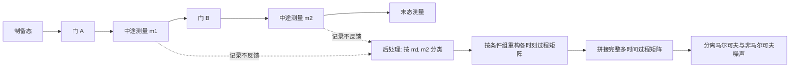

标准层析只看初末态，把所有噪声当马尔可夫处理；多时间量子过程层析在**同一实验序列的多个时刻**测量，重构一个 16×16 的过程矩阵，把全部多时间关联——包括非马尔可夫噪声——完整刻画出来。Giarmatzi 等人用中途测量加后处理绕开了"快前馈不可用"的限制，首次在超导比特上完成全层析，为扩展阶段的噪声自动化表征提供了模板。

## 物理图像：为什么需要多时间层析

标准量子过程层析（QPT）假设噪声是马尔可夫的：每个门独立作用、没有时间关联。真实硬件不满足这个假设——串扰、漏热、准粒子爆发、读出残余光子都把前后门的误差关联起来（时间相关噪声），马尔可夫模型会系统性低估它们。多时间量子过程层析把测量插到序列的**多个时刻**：制备态、做门 A、中途测量、做门 B、再测量——每个时刻的操作与环境的相互作用都被记录。形式化方法构造一个**过程矩阵**，编码量子过程中全部多时间关联；在这个形式下非马尔可夫噪声被严格捕捉，还可以进一步区分它是量子还是经典的、量有多大。

此前没有人完成"全层析"，因为大家假定中途测量必须配合**快速前馈**（测完立刻调整后续操作）——这在当前量子平台上不可用。Giarmatzi 等人的关键改进是：中途测量照做，但**后处理**替代前馈——把每次实验的完整记录存下来，离线按测量结果分类重组数据，等效于执行了所有条件分支。这样不需要任何实时前馈硬件就能拿到全过程层析的完整数据。

![[assets/figures/multi-time-tomography/40b3e4e1a31cb48bc1e1d849ae4771ba20c75ed52807564ad522d405e79cbaf8.jpg]]

*三次时刻的量子过程示意：底线上是系统、顶线是环境，A、B、C 三个盒子表示系统在不同时刻的操作。中途测量把系统与环境的作用"切开"，每个时刻的噪声贡献都能被单独重构。图源：Giarmatzi et al. (2025)，Fig. 1。*

## 实验方法：中途测量 + 后处理

形式化基础是**过程矩阵**（process matrix，也称 quantum strategy、comb 或 process tensor）：设 A、B、C 是操作时刻，每个时刻的操作用 Choi 形式的 CP 映射 $M_{a|x}^A$ 表示（$a$ 是测量结果、$x$ 是操作选择），则过程矩阵 $W^{ABC}$ 是定义在全部输入输出空间联合 Hilbert 空间上的正算符。给定操作序列 $x,y,z$，任意结果序列 $a,b,c$ 的联合概率由**广义 Born 规则**给出：

$$
p(a,b,c\mid x,y,z)=\operatorname{Tr}\!\left[W^{ABC}\left(M_{a|x}^{A}\otimes M_{b|y}^{B}\otimes M_{c|z}^{C}\right)\right].
$$

形式上可以把 $W^{ABC}$ 看作"时间上的密度算符"——每个时刻对应一对输入/输出子空间，全部多时间关联都编码在这个对象里。实验在超导比特（Queensland 实验室器件与 IBM Quantum 云）上完成。脉冲协议在每个门之间插入中途测量，测量结果不用于实时反馈，而是记录后离线分类：

- **同一次序列**里，每个中途测量结果 $m_i$ 都被记录；
- **后处理**按 $(m_1,m_2,\dots)$ 的取值把实验结果分成条件组，每组等效于一个"测后选择"分支；
- 每个分支独立重构该时刻的 process 矩阵片段，拼成完整的**多时间过程矩阵**。

这绕开了前馈的两个障碍：不需要测量到反馈的延迟小于相干时间，也不需要每分支单独标定。代价是实验重复次数变多（每个分支都要足够的统计量），但这是可扩展的代价——加门只需要线性增加分支数。

## 结果：16×16 过程矩阵与非马尔可夫噪声

超导比特上测得的多时间过程矩阵是 16×16（两个中途测量点、每个点一个 qubit 基），绝对值条目（z 轴）以相位着色：

![[assets/figures/multi-time-tomography/0f0e708084a58dee293328610d426ab8e4c76c1c628654de1d41ae901c4bf3dd.jpg]]

*完整多时间过程矩阵的可视化：16×16 矩阵（x、y 轴横跨矩阵的两个维度）的绝对值条目（z 轴）以相位为颜色，由实验层析数据重构。相邻子图是最接近的马尔可夫过程矩阵——两者之差即非马尔可夫关联。图源：Giarmatzi et al. (2025)，Fig. 3。*

对比完整矩阵与"最接近的马尔可夫矩阵"：多时间关联直接可见——这正是标准层析看不到的部分。方法给出一般噪声与**量子**非马尔可夫噪声的测量（后者需要量子关联、不能由经典噪声解释），并用理论模型对照实验发现。代码与数据全部公开，方法可以直接移植到其他平台。

## 与其他概念的关系

- 中途测量与反馈复位的配合属于[[readout-measurement/single-shot-readout|单发读出]]的应用延伸：测量保真度直接决定每个分支的统计质量。
- 多时间关联的物理来源之一是[[readout-measurement/readout-crosstalk|读出串扰]]与相邻门之间的残余耦合——本词条提供了把它们定量化的工具。
- 噪声表征是[[scaling-automation/cryo-electronics|低温电子学]]与扩展自动化的验证环节：改进屏蔽、滤波后，用多时间层析前后对比即可量化效果。
- [[circuit-qed/charge-parity-fluctuation|电荷宇称涨落与准粒子隧穿]]是典型的非马尔可夫噪声源（随机电报信号）——本词条的过程矩阵能直接捕捉这类时间关联。

## 参考文献

- Giarmatzi, C., Jones, T., Gilchrist, A., Pakkiam, P., Fedorov, A., & Costa, F. (2025). *Multi-time quantum process tomography on a superconducting qubit*. Quantum (arXiv:2308.00750). [DOI:10.22331/q-2025-12-18-1952](https://doi.org/10.22331/q-2025-12-18-1952) · [arXiv:2308.00750](https://arxiv.org/abs/2308.00750)
> 完整文献库（含各篇站内全文页）见 [[references/index|参考文献库]]。
