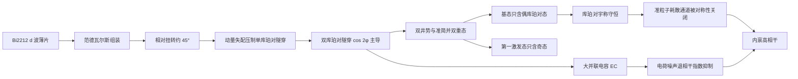

Flowermon 把两条 d 波铜酸超导体 Bi2212 的薄片相对扭转约 45° 叠在一起做成约瑟夫森结：动量失配把单库珀对隧穿压掉，双库珀对隧穿（$\cos 2\varphi$ 项）主导电流-相位关系。d 波序参量的对称性让基态只含偶库珀对态、第一激发态只含奇态——宇称成为守恒量，电荷噪声退相干与准粒子耗散都被内禀抑制，是 s 波超导比特之外第一条"序参量保护"路线。

## 从 s 波到 d 波：换一种方式获得保护

现有超导比特的保护机制都来自电路设计：[[superconducting-qubits/transmon-qubit|transmon]] 用大电容压低电荷色散、[[superconducting-qubits/fluxonium-qubit|fluxonium]] 用大电感重塑势阱、[[superconducting-qubits/gatemon-qubit|gatemon]] 用栅控弱连接换控制通道——但它们的超导体都是 s 波，对准粒子的抑制只来自能隙。Flowermon 换了材料学路线：用范德瓦尔斯组装把两片 Bi2212（d 波铜酸超导体）以约 45° 扭转角叠放。d 波序参量的动量失配让单库珀对隧穿随扭转角被压低，在 45° 附近完全消失；剩下的主导项是**双库珀对隧穿**（变化 $2\varphi$、转移 $2e$），由此带来两重内禀保护：宇称守恒切断准粒子耗散通道，$\cos 2\varphi$ 势的双重简并抑制电荷噪声退相干。

![[assets/figures/flowermon-qubit/283b40c82740537d8efb132d81e16cc6e4ff76a3176911de550f4e4f2f8cdde3.jpg]]

*Flowermon 的设计原理：(a) 两片 d 波薄片相对扭转构成约瑟夫森结，动量失配压制单库珀对隧穿，45° 时单对隧穿完全消失、双对隧穿主导，约瑟夫森势变为 $\cos 2\varphi$ 型；(b) 电容并联的单结电路设计草图。图源：Brosco et al. (2023)，Fig. 1。*

## 电路哈密顿量与宇称守恒

忽略腔模时，flowermon 的电路哈密顿量为

$$
\hat H=4E_C\left(\hat n-n_g\right)^2-E_{J\theta}\cos\hat\varphi+E_\kappa\cos 2\hat\varphi,
$$

其中：

- $\hat\varphi$ 是跨结相位差、$\hat n$ 是共轭电荷算符；
- $E_{J\theta}=E_J\cos\theta$ 是随扭转角 $\theta$ 减弱的单库珀对隧穿项（$\cos\hat\varphi$ 势）；
- $E_\kappa$ 是**双库珀对隧穿幅**（$\cos 2\hat\varphi$ 势），在 $\theta\to45°$ 时主导——势阱从单阱变成双井；
- $E_C$ 是充电能，大并联电容（同 transmon 设计）保持 $E_J/E_C\gg1$。

关键机制是**准简并双重态与宇称守恒**：在 $\theta_c<\theta\lesssim\pi/4$ 且 $E_C$ 足够小时，低能谱收缩成一组组准简并双重态；$\theta=30°$ 时谱还近似谐振子（似 transmon），$\theta=43°$ 时双井势完全形成、最低能级双重简并，波函数局域在两个井里。随着 $\theta\to45°$，基态 $|\psi_0\rangle$ 只含**偶**库珀对数态、第一激发态 $|\psi_1\rangle$ 只含**奇**态——当双库珀对隧穿完全主导时，库珀对宇称成为守恒量。宇称守恒意味着：单准粒子隧穿（每次改变一个 $e$）不再连接 $|\psi_0\rangle$ 与 $|\psi_1\rangle$，准粒子诱导的耗散通道被对称性直接关掉。

## 噪声保护：从对称性到定量的抑制

**电荷噪声退相干**：退相干率由 charge 色散决定，

$$
\Gamma_{\varphi c}\simeq\frac{32E_C^2}{\hbar^2}S_{n_g}(0)\left|n_{11}-n_{00}\right|^2,
$$

其中 $S_{n_g}(0)$ 是零频电荷噪声谱密度、$n_{kk}$ 是能级内的电荷矩阵元。当 $E_C$ 相对 $E_J$、$E_\kappa$ 足够小时，系数 $n_{11}-n_{00}$ 被指数压低（把哈密顿量映射成隧穿问题可定量估计）——大并联电容让 flowermon 从 transmon 继承了电荷噪声退相干保护。

**准粒子诱导弛豫**：用 Bloch-Redfield 理论计算准粒子诱导的弛豫率，其 $\theta$ 依赖来自矩阵元 $\langle\psi_0|\sin(\varphi/2)|\psi_1\rangle$ 与噪声谱密度两方面。低温极限下高扭转角给出指数压制：$S_{\mathrm{qp}}^\theta(\omega_{01})\propto e^{-\Delta_d/k_BT}\sin^2(2\theta)$——d 波能隙的节状准粒子因动量失配无法隧穿，扭转铜酸结里的准粒子被有效"能隙化"，行为类似 s 波结。

![[assets/figures/flowermon-qubit/c25d389fb4988bda8282fd429ebd4141d5d1355600bc9efdaceab182c3a411ec.jpg]]

*Flowermon 低能谱：(a) 能级随扭转角 $\theta$ 变化，偶能级（红）与奇能级（蓝）在 $\theta\to\pi/4$ 时合并成准简并双重态（取 $E_\kappa/E_J=0.1$、$E_J/E_C=2000$）；(b)–(c) $\theta=30°$ 与 $\theta=43°$ 的能级结构与势能曲线——双井势逐渐形成；(d)–(e) 基态与第一激发态波函数在双井中的局域；(f)–(g) 电荷基下偶/奇宇称的库珀对数分布。图源：Brosco et al. (2023)，Fig. 2。*

![[assets/figures/flowermon-qubit/b659f3c814ce15c55dbd8b3ce92307a22bd372ca6255512ea5cac67819bc50fe.jpg]]

*退相干保护的计算结果：(a) 与电荷/电容弛豫率相关的电荷矩阵元 $n_{01}^2$ 和与退相干率相关的 $|n_{11}-n_{00}|^2$，随 $E_J/E_C$ 与扭转角的分布——两者在高扭转角都被强烈压制。图源：Brosco et al. (2023)，Fig. 3(a)。*

## 操控与读出的代价：经激发态的间接通道

保护的代价是**直接操控与读出被压制**：$\theta\to45°$ 时比特频率 $\hbar\omega_{01}$ 和电荷矩阵元 $n_{01}$ 都指数变小，直接驱动不可行。但谱结构留了一条不牺牲保护的通道：存在一段扭转角范围（如 $\theta=40°$：$n_{01}=0.01$ 而 $n_{23}=0.4$），比特矩阵元被压制而第 2–3 激发态之间耦合仍然有限——可以经激发态做间接操控：用标准微波 $\pi$ 脉冲在 1–2、0–3 之间布居转移，中间在 2–3 之间做控制门，再返回；或用拉曼过程同时驱动 0–3、2–3、2–1 实现等效 $0\to1$ 驱动。这套方案在 $\omega_{01}\to0$ 时依然有效，因为选择定则 $n_{02}=n_{13}=0$ 禁戒了 0–2、1–3 跃迁，泄漏被对称性压制。读出可以测非保护跃迁（0–3、1–2）或它们与腔模的色散耦合。

## 与其他概念的关系

- 与[[superconducting-qubits/transmon-qubit|transmon]]共享大 $E_C$ 并联设计（继承电荷噪声保护），但保护机制多了一层：宇称守恒对称性直接关闭准粒子通道；与[[superconducting-qubits/fluxonium-qubit|fluxonium]]的 $\cos2\varphi$ 势相似，但那来自大电感回路的相位滑移，这里来自 d 波序参量的动量失配。
- 准粒子耗散的对称性抑制与[[circuit-qed/charge-parity-fluctuation|电荷宇称涨落与准粒子隧穿]]形成互补：后者在 s 波 transmon 里实测每次隧穿都改变宇称（RTS），前者用 d 波对称性让单准粒子隧穿不再连接逻辑态。
- 范德瓦尔斯组装与[[materials-devices/germanium-hut-wire|锗棚顶纳米线]]等纳米结构平台同属材料科学基础；原子级干净的扭转界面是双库珀对隧穿主导的前提。
- 间接操控经激发态的选择定则设计，与[[qubit-control/charge-qubit|电荷量子比特]]的直接驱动形成对照——保护的代价由谱结构偿还。

## 参考文献

- Brosco, V., Serpico, G., Vinokur, V., Poccia, N., & Vool, U. (2023). *Superconducting qubit based on twisted cuprate van der Waals heterostructures*. Physical Review Letters (arXiv:2308.00839). [arXiv:2308.00839](https://arxiv.org/abs/2308.00839)
> 完整文献库（含各篇站内全文页）见 [[references/index|参考文献库]]。
