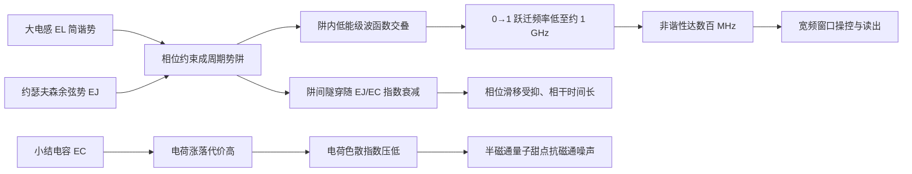

Fluxonium 把约瑟夫森结与小电容、大电感并联起来：结的非线性来自 $E_J$，大电感 $E_L$ 把相位约束在周期势阱里，小电容 $E_C$ 则让电荷涨落代价高昂。它的能级在大 $E_J/E_C$ 下依然保持大非谐性，磁通偏置在半磁通量子处获得第一阶磁通噪声免疫——这些性质使它成为[[superconducting-qubits/transmon-qubit|transmon]]之外相干时间最长的人工原子之一。

## 从 transmon 到 fluxonium：换一种方式对抗噪声

[[superconducting-qubits/transmon-qubit|Transmon]] 通过增大并联电容把 $E_J/E_C$ 推到很大，从而指数压低电荷色散；代价是非谐性只剩 $E_C$ 量级，频率必须留在这个狭窄窗口内。Fluxonium 换了一条路线：保持小结电容（$E_C/2\pi\sim 1$ GHz 量级，与 CPB 相当），但用一个由约瑟夫森结阵列构成的大动力学电感把结两端"接回来"，形成超导环路。电感提供的简谐势与约瑟夫森余弦势叠加，构成周期势阱；势阱里的低能级波函数强烈交叠，而跨越势阱间势垒的隧穿幅度随 $E_J/E_C$ 指数衰减——这与 transmon 压低电荷色散的机制同源，但结果不同：fluxonium 的 $0\to1$ 跃迁频率被压到 1 GHz 附近，而 $1\to2$ 跃迁仍明显不同频，非谐性可达数百 MHz。

![[assets/figures/fluxonium-qubit/e0e51bc3ba42472ce8ffbc63764dd2466b5a5951919d1eb30574f6d74cbd277b.jpg]]

*Fluxonium 的电路原型：小约瑟夫森结（能量 $E_J$、电容对应 $E_C$）与结阵列构成的大电感（$E_L$）并联成环，外磁通 $\Phi_{ext}$ 穿环偏置。图源：Zhu et al. (2013)，Fig. 1(c)。*

## 电路哈密顿量

以环路磁通为坐标（以磁通量子归一的相位 $\hat\varphi=2\pi\hat\Phi/\Phi_0$）描述 fluxonium，其哈密顿量为

$$
\hat H_{\mathrm{f}}=4E_C\hat{\mathsf N}^2-E_J\cos\!\left(\hat\varphi-2\pi\frac{\Phi_{ext}}{\Phi_0}\right)+\frac{1}{2}E_L\hat\varphi^2,
$$

其中：

- $\hat{\mathsf N}=Q/2e$ 是结电容上以库珀对电荷为单位的电荷算符，与 $\hat\varphi$ 共轭，满足 $[\hat\varphi,\hat{\mathsf N}]=i$；
- $E_C=e^2/2C_\Sigma$ 是充电能，小电容使电荷涨落昂贵、波函数在电荷空间中延展；
- $E_J$ 是约瑟夫森能，决定余弦势阱深度；
- $E_L=(\Phi_0/2\pi)^2/L$ 是电感能量，$\Phi_0=h/2e$ 为超导磁通量子；$E_L\hat\varphi^2/2$ 项把相位往 $\varphi=0$ 拉回，形成周期性势阱序列；
- $\Phi_{ext}$ 是穿过环路的外磁通，负责在 $\Phi_{ext}/\Phi_0=0.5$ 附近提供第一阶磁通噪声免疫的"甜点"。

势阱参数的三个能量标度协同决定能谱：$E_J/E_C$ 大（实验器件常取数百）保证相位局域、电荷噪声指数压低；$E_L$ 决定势阱的"倾斜"程度和谐振子频率 $\omega_p=\sqrt{8E_LE_C}/\hbar$；$E_J/E_L$ 控制势阱深度和阱间相位滑移（phase slip）幅度。

## 多能级色散响应：为什么 fluxonium 的腔频移特别大

与谐振腔电容耦合时，fluxonium 的色散频移不能只用二能级近似。Zhu 等人对电容耦合的一般多能级系统做了二阶微扰：设比特第 $l$ 能级与腔模 $j$ 的耦合矩阵元为 $g_{j;ll'}$、相应失谐为 $\Delta_{j;ll'}$，定义部分色散移

$$
\chi_{j;ll'}\equiv\frac{\left|g_{j;ll'}\right|^2}{\Delta_{j;ll'}},
$$

则腔频对 fluxonium 态 $l$ 的总色散频移是**对所有能级 $l'$ 求和**：

$$
\chi_{j;l}=\sum_{l'}\left(\chi_{j;ll'}-\chi_{j;l'l}\right).
$$

这个求和式与 [[superconducting-qubits/transmon-qubit|transmon]] 的关键差别在于选择定则：transmon 的波函数近似谐振子本征态，电荷矩阵元只在相邻能级间显著，多数虚跃迁通道被选择定则关闭；fluxonium 的势阱破缺了宇称对称（除整数/半整数磁通等特殊点外），电荷矩阵元在宽范围内分布——未占据的高能级也贡献可观色散移。实验上观测到的"惊人大的色散频移"正源于此：当某个虚跃迁（如 $|2\rangle\to|0\rangle$ 或 $|3\rangle\to|1\rangle$）接近腔频时，$\Delta_{j;ll'}\to0$ 使对应项急剧增大。

![[assets/figures/fluxonium-qubit/7b1e1fea4a74e64108ca7ca5f8a5cdef63c827d11b96aaf7e6ee8c7a7866d9d0.jpg]]

*多能级二阶色散移的能级图：即使只有最低能级被占据，未占据高能级的虚跃迁（箭头路径）也参与腔频的色散移动。图源：Zhu et al. (2013)，Fig. 3。*

![[assets/figures/fluxonium-qubit/4d4f26cfc151a0dcf1d5a80b6a4baee4198360f7e10362faafde0e3ea2f5212d.jpg]]

*fluxonium 基态色散频移 $\chi_{a;0}$ 随外磁通的变化（二阶微扰，纵轴取 $-\chi_{a;0}$ 便于对照实验）。磁通调谐下频移在 1–10 MHz 间摆动，且在某些偏置点因虚跃迁共振出现急剧增大的峰。图源：Zhu et al. (2013)，Fig. 7(a)。*

## 磁通调谐与色散频移地貌

fluxonium 的跃迁频率与色散频移都随外磁通周期变化。以典型参数（$E_J/2\pi=4.75$ GHz、$E_C/2\pi=1.25$ GHz、$E_L/2\pi=1.5$ GHz、$\omega_r/2\pi=7$ GHz、$g/2\pi=50$ MHz）为例：在半磁通量子甜点 $\Phi_{ext}/\Phi_0=0.5$，比特频率 $\omega_q/2\pi\approx1.05$ GHz、色散频移仅 $\chi/2\pi\approx0.5$ MHz——小的 $|\chi|$ 把残余腔光子引起的退相干压到 kHz 量级（$T_2$ 可达 60–220 µs），但按色散读出的信噪比定标（见[[readout-measurement/dispersive-readout|色散读出]]），这使快读出需要很长积分时间。而在 $\Phi_{ext}/\Phi_0\approx0.64$ 附近，$\Delta_{20}$ 接近零使 $|\chi/2\pi|$ 增大到约 8 MHz，同时比特频率被调到 4.6 GHz——这一"色散频移地貌"的对比正是通量脉冲辅助读出的物理基础。

## 与其他概念的关系

- 与[[superconducting-qubits/transmon-qubit|transmon]]的互补：transmon 用大电容压低电荷色散、牺牲非谐性；fluxonium 用大电感重塑势阱，在小电容下同时保住非谐性与相干性，但需要处理磁通噪声和更复杂的谱学。
- [[readout-measurement/dispersive-readout|色散读出]]是 fluxonium 的主要读出手段：fluxonium 没有严格选择定则，色散频移对各能级求和后可以很大，这既有利于快读出，也使近共振虚跃迁在磁通调谐时必须小心规避。
- [[circuit-qed/jaynes-cummings-model|Jaynes–Cummings 模型]]的二阶微扰是色散频移求和公式的出发点：把 $\chi=g^2/\Delta$ 推广为 $\chi_{j;l}=\sum_{l'}(\chi_{j;ll'}-\chi_{j;l'l})$，即多能级色散移的一般形式。
- [[circuit-qed/high-impedance-resonator|高阻抗谐振腔]]与约瑟夫森结阵列电感同源：fluxonium 的 $E_L$ 来自超导阵列的动力学电感，这类材料也是高阻抗腔的实现基础。
- [[superconducting-qubits/flowermon-qubit|Flowermon 扭转铜酸比特]]用 d 波序参量的宇称守恒从对称性上关闭准粒子通道——与 fluxonium 靠电路设计（大电感势阱）获得保护是两条不同的内禀保护路线。

## 参考文献

- Zhu, G., Ferguson, D. G., Manucharyan, V. E., & Koch, J. (2013). *Circuit QED with fluxonium qubits: theory of the dispersive regime*. Physical Review B **87**, 024510. [DOI:10.1103/PhysRevB.87.024510](https://doi.org/10.1103/PhysRevB.87.024510) · [arXiv:1210.1605](https://arxiv.org/abs/1210.1605)
- Stefanski, T. V., & Andersen, C. K. (2024). *Flux-pulse-assisted readout of a fluxonium qubit*. Physical Review Applied **22**, 014079. [DOI:10.1103/PhysRevApplied.22.014079](https://doi.org/10.1103/PhysRevApplied.22.014079) · [arXiv:2309.17286](https://arxiv.org/abs/2309.17286)
- Manucharyan, V. E. 等 (2009) 首次提出 fluxonium 器件（见上文 Zhu et al. (2013) 引言及参考文献 [27]）。
> 完整文献库（含各篇站内全文页）见 [[references/index|参考文献库]]。
