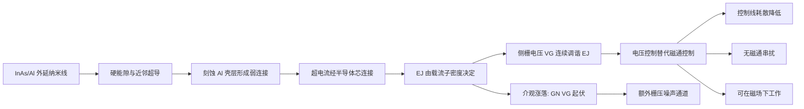

Gatemon 把 transmon 的金属约瑟夫森结换成外延生长的 InAs/Al 半导体纳米线弱连接：约瑟夫森能由纳米线中超导近似的载流子密度决定，用一路静电栅压即可连续调谐。它保留了 transmon 的大 $E_J/E_C$ 设计，却把频率控制从磁通换成了电压——降低控制线耗散、回避磁通串扰，还允许在大磁场下工作，是拓扑量子计算与半导体-超导体杂化平台的关键器件。

## 从金属结到半导体弱连接

[[superconducting-qubits/transmon-qubit|Transmon]] 的约瑟夫森能 $E_J$ 由金属氧化结固定，频率调谐要靠 SQUID 环和外磁通；磁通控制带来控制线耗散、磁通串扰，也排除了强磁场环境。Gatemon 换了一条路：在 InAs 纳米线（直径约 75 nm）上原位外延生长约 30 nm 的 Al 壳层，形成原子级干净的半导体-超导体界面，近邻效应在 InAs 芯内诱导出"硬能隙"；湿法刻蚀掉约 180 nm 的 Al 壳层，留下一段超导壳层的弱连接，超电流经半导体芯连接两侧，这就构成了约瑟夫森结。关键差别在于：弱连接的超电流由半导体芯内载流子密度决定，旁边一路侧栅电压 $V_G$ 通过耗尽或积累载流子，即可连续调谐约瑟夫森能 $E_J(V_G)$——用电压替代磁通完成全部频率控制。

![[assets/figures/gatemon-qubit/c8b965ab291eda5acdc5bde4ce00735de4c08253d92cb79c8d5a935c5258f11e.jpg]]

*InAs 纳米线 gatemon 的器件结构：(a) InAs-Al 约瑟夫森结的扫描电镜图，Al 壳层被刻蚀出约 180 nm 的弱连接段，插图是外延 InAs/Al 界面的透射电镜图——原子级干净界面是硬能隙的来源；(b)–(c) 完整 gatemon 器件光学显微图，纳米线结由 T 形结构的电容并联。图源：Larsen et al. (2015)，Fig. 1。*

## 电路哈密顿量与栅控调谐

忽略腔模时，gatemon 与 transmon 具有同一形式的哈密顿量：

$$
\hat H=4E_C\left(\hat n-n_g\right)^2-E_J(V_G)\cos\hat\varphi,
$$

其中：

- $E_C=e^2/2C_\Sigma$ 是充电能，由 T 形并联电容决定，设计上取大 $E_J/E_C$（transmon 区），保证电荷噪声指数压低；
- $\hat n$、$\hat\varphi$ 是跨结库珀对数与规范不变相位差，满足 $[\hat\varphi,\hat n]=i$；
- $E_J(V_G)$ 是**栅控约瑟夫森能**：由弱连接段的超电流 $I_c(V_G)$ 决定，$f_Q\propto\sqrt{I_c(V_G)}$；栅压改变 InAs 芯内电子密度，从而连续调谐 $E_J$；
- $n_g$ 是有效偏置电荷，在大 $E_J/E_C$ 下对 $n_g$ 的敏感度被指数压低。

跃迁的非谐性 $\alpha=E_{12}-E_{01}\approx-E_C$，微波谱学估计 $\alpha/h\approx-100$ MHz——与 transmon 相当的弱非谐性，足以选频操控又限制泄漏。

与金属结的本质差别是**介观涨落**：纳米线弱连接的正常态电导 $G_N(V_G)$ 随栅压出现非周期、可重复的涨落（普适电导涨落），传导到约瑟夫森能上表现为 $E_J(V_G)$ 的非单调起伏。这既是 gatemon 的调谐手段，也是它的额外噪声通道——栅压噪声直接调制 $E_J$，需要与磁通噪声类似的滤波和稳定化。

## 与微波腔的强耦合与操控

Gatemon 电容耦合到 $\lambda/2$ 超导传输线腔，实测真空 Rabi 劈裂可分辨、耦合强度超过比特与腔的退相干速率——进入[[circuit-qed/strong-coupling|强耦合]]区。测量腔透射随驱动频率与栅压的变化，可以直接描绘出 $f_Q(V_G)$ 的完整调谐曲线；在 $f_Q\sim f_C$ 的区域出现宽分裂的透射峰，与纳米线传输的介观涨落对应。

操控在色散区（$|f_Q-f_C|\gg g/2\pi$，见[[readout-measurement/dispersive-readout|色散读出]]）完成，且**两轴控制都是电压**：

- **$X$ 轴**：微波脉冲驱动 Rabi 振荡（与 transmon 相同）；
- **$Z$ 轴**：栅压脉冲 $\Delta V_G$ 瞬时移动 $f_Q$，让量子态积累相位——这替代了 transmon 的磁通脉冲 Z 旋转。

首代器件实测 $T_1\sim0.8\ \mu s$、$T_2\sim1\ \mu s$，比门操作时间（约 10 ns）高两个数量级，证明了"全电压操控超导比特"的可行性。

![[assets/figures/gatemon-qubit/544075e204a687d2c280fd6e71a2b1409eccf3d7e5021560155a2ac0c251e5ba.jpg]]

*Gatemon 与微波腔的强耦合：(a) 腔透射随驱动频率与栅压 $V_G$ 变化，蓝线是裸腔谐振频率 $f_C$，绿线是栅控比特频率 $f_Q(V_G)$——两者交叉处出现真空 Rabi 劈裂。图源：Larsen et al. (2015)，Fig. 2(a)。*

![[assets/figures/gatemon-qubit/ed5ec3b8ab85d088f1069f2c70343302af034185349bca718fcc5859cf69e883.jpg]]

*Gatemon 量子相干：(a) $T_1$ 测量——30 ns 微波脉冲激发到 $|1\rangle$ 后按不同等待时间读出，实线为指数拟合；(b) Ramsey 实验确定 $T_2^*$。$V_G=3.4$ V 工作点下实测 $T_1\sim0.8\ \mu s$、$T_2\sim1\ \mu s$。图源：Larsen et al. (2015)，Fig. 4(a)。*

## 与其他概念的关系

- 与[[superconducting-qubits/transmon-qubit|transmon]]同属大 $E_J/E_C$ 设计，但约瑟夫森结从金属氧化结换成半导体弱连接，频率调谐从磁通换成栅压；与[[superconducting-qubits/fluxonium-qubit|fluxonium]]的"大电感重塑势阱"路线也不同——gatemon 保持 transmon 形式的势阱，只改弱连接材料。
- [[qubit-control/hybrid-qubit|杂化量子比特]]的编码思想在半导体中实现，gatemon 则是半导体-超导体杂化在**电路量子电动力学**侧的实现：两者共同构成半导体平台"自旋比特 + 超导比特"的完整图景。
- 硬能隙与近邻超导依赖外延生长界面的质量——这与[[materials-devices/germanium-hut-wire|锗棚顶纳米线]]等半导体纳米结构平台同属材料科学基础；栅控调谐的介观涨落也源于纳米线的普适电导涨落。
- 因为无磁通控制，gatemon 可在大磁场下工作——这是拓扑量子计算（Majorana 器件）的必要条件，也是它与[[scaling-automation/cryo-electronics|低温电子学]]中磁通控制线设计的关键区别。自旋比特的毫米波控制信号收进制冷机的配套器件见 [[scaling-automation/frequency-homogenisation|全局操控与频率均匀化]]（60 GHz 低温放大器案例在该词条链接的低温电子学词条内）。

## 参考文献

- Larsen, T. W., Petersson, K. D., Kuemmeth, F., Jespersen, T. S., Krogstrup, P., Nygård, J., & Marcus, C. M. (2015). *A Semiconductor Nanowire-Based Superconducting Qubit*. Physical Review Letters **115**, 127001. [DOI:10.1103/PhysRevLett.115.127001](https://doi.org/10.1103/PhysRevLett.115.127001) · [arXiv:1503.08339](https://arxiv.org/abs/1503.08339)
> 完整文献库（含各篇站内全文页）见 [[references/index|参考文献库]]。
